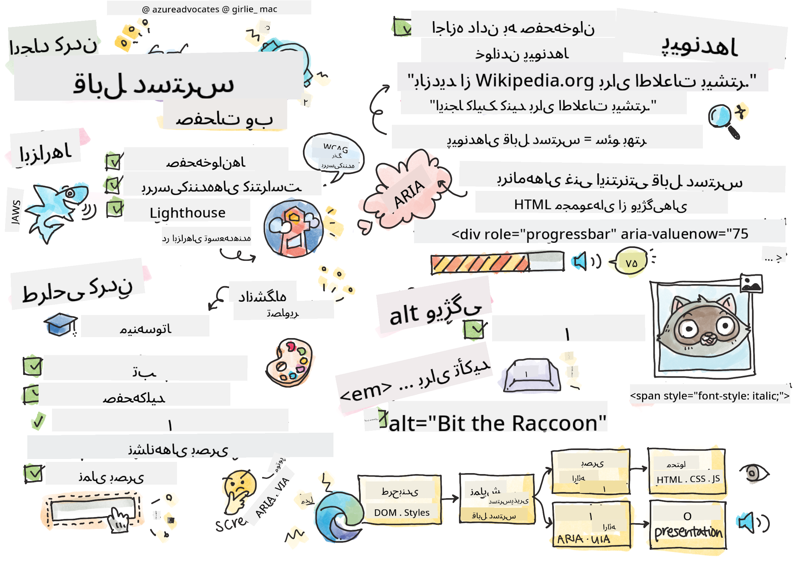

<!--
CO_OP_TRANSLATOR_METADATA:
{
  "original_hash": "f0c88c3e2cefa8952d356f802b1e47ca",
  "translation_date": "2025-08-29T14:37:51+00:00",
  "source_file": "1-getting-started-lessons/3-accessibility/README.md",
  "language_code": "fa"
}
-->
# ایجاد صفحات وب قابل دسترس

  
> طراحی شده توسط [Tomomi Imura](https://twitter.com/girlie_mac)

## آزمون پیش از درس  
[آزمون پیش از درس](https://ff-quizzes.netlify.app/web/)

> قدرت وب در جهانی بودن آن است. دسترسی برای همه، بدون توجه به محدودیت‌ها، یک جنبه اساسی است.  
> \- سر تیموتی برنرز-لی، مدیر W3C و مخترع وب جهانی

این نقل قول به‌خوبی اهمیت ایجاد وب‌سایت‌های قابل دسترس را نشان می‌دهد. برنامه‌ای که همه نتوانند به آن دسترسی داشته باشند، ذاتاً تبعیض‌آمیز است. به‌عنوان توسعه‌دهندگان وب، باید همیشه دسترسی‌پذیری را در نظر داشته باشیم. با تمرکز بر این موضوع از همان ابتدا، می‌توانید اطمینان حاصل کنید که همه افراد می‌توانند به صفحات شما دسترسی داشته باشند. در این درس، با ابزارهایی که به شما کمک می‌کنند تا از دسترسی‌پذیری دارایی‌های وب خود اطمینان حاصل کنید و نحوه طراحی با در نظر گرفتن دسترسی‌پذیری آشنا خواهید شد.

> می‌توانید این درس را در [Microsoft Learn](https://docs.microsoft.com/learn/modules/web-development-101/accessibility/?WT.mc_id=academic-77807-sagibbon) مطالعه کنید!

## ابزارهایی که باید استفاده کنید

### صفحه‌خوان‌ها

یکی از شناخته‌شده‌ترین ابزارهای دسترسی‌پذیری، صفحه‌خوان‌ها هستند.

[صفحه‌خوان‌ها](https://en.wikipedia.org/wiki/Screen_reader) ابزارهایی هستند که معمولاً توسط افراد دارای اختلالات بینایی استفاده می‌شوند. همان‌طور که زمان صرف می‌کنیم تا مرورگر اطلاعاتی که می‌خواهیم به اشتراک بگذاریم را به‌درستی نمایش دهد، باید اطمینان حاصل کنیم که صفحه‌خوان نیز همین کار را انجام می‌دهد.

در ساده‌ترین حالت، یک صفحه‌خوان، صفحه را از بالا به پایین به‌صورت صوتی می‌خواند. اگر صفحه شما فقط متن باشد، صفحه‌خوان اطلاعات را مشابه مرورگر منتقل می‌کند. البته، صفحات وب به‌ندرت فقط متن هستند؛ آن‌ها شامل لینک‌ها، تصاویر، رنگ‌ها و سایر اجزای بصری هستند. باید دقت کرد که این اطلاعات به‌درستی توسط صفحه‌خوان خوانده شوند.

هر توسعه‌دهنده وب باید با یک صفحه‌خوان آشنا شود. همان‌طور که با نحوه عملکرد مرورگر آشنا هستید، باید نحوه عملکرد صفحه‌خوان را نیز یاد بگیرید. خوشبختانه، صفحه‌خوان‌ها در اکثر سیستم‌عامل‌ها به‌صورت پیش‌فرض وجود دارند.

برخی مرورگرها نیز ابزارها و افزونه‌های داخلی دارند که می‌توانند متن را با صدای بلند بخوانند یا حتی برخی ویژگی‌های ناوبری اولیه را ارائه دهند، مانند [این ابزارهای دسترسی‌پذیری مرورگر Edge](https://support.microsoft.com/help/4000734/microsoft-edge-accessibility-features). این ابزارها نیز مهم هستند، اما عملکرد آن‌ها با صفحه‌خوان‌ها متفاوت است و نباید به‌عنوان ابزار تست صفحه‌خوان اشتباه گرفته شوند.

✅ یک صفحه‌خوان و ابزار خواندن متن مرورگر را امتحان کنید. در ویندوز، [Narrator](https://support.microsoft.com/windows/complete-guide-to-narrator-e4397a0d-ef4f-b386-d8ae-c172f109bdb1/?WT.mc_id=academic-77807-sagibbon) به‌صورت پیش‌فرض موجود است و [JAWS](https://webaim.org/articles/jaws/) و [NVDA](https://www.nvaccess.org/about-nvda/) نیز قابل نصب هستند. در macOS و iOS، [VoiceOver](https://support.apple.com/guide/voiceover/welcome/10) به‌صورت پیش‌فرض نصب شده است.

### بزرگ‌نمایی

یکی دیگر از ابزارهایی که معمولاً توسط افراد دارای اختلالات بینایی استفاده می‌شود، بزرگ‌نمایی است. ساده‌ترین نوع بزرگ‌نمایی، بزرگ‌نمایی استاتیک است که با استفاده از `Control + علامت بعلاوه (+)` یا کاهش وضوح صفحه کنترل می‌شود. این نوع بزرگ‌نمایی باعث تغییر اندازه کل صفحه می‌شود، بنابراین استفاده از [طراحی واکنش‌گرا](https://developer.mozilla.org/docs/Learn/CSS/CSS_layout/Responsive_Design) برای ارائه تجربه کاربری خوب در سطوح بزرگ‌نمایی بالا مهم است.

نوع دیگری از بزرگ‌نمایی به نرم‌افزارهای تخصصی متکی است که یک ناحیه از صفحه را بزرگ‌نمایی کرده و به‌صورت پنجره‌ای حرکت می‌کند، مشابه استفاده از یک ذره‌بین واقعی. در ویندوز، [Magnifier](https://support.microsoft.com/windows/use-magnifier-to-make-things-on-the-screen-easier-to-see-414948ba-8b1c-d3bd-8615-0e5e32204198) به‌صورت پیش‌فرض وجود دارد و [ZoomText](https://www.freedomscientific.com/training/zoomtext/getting-started/) یک نرم‌افزار بزرگ‌نمایی شخص ثالث با ویژگی‌های بیشتر و کاربران بیشتر است. در macOS و iOS نیز نرم‌افزار بزرگ‌نمایی داخلی به نام [Zoom](https://www.apple.com/accessibility/mac/vision/) وجود دارد.

### بررسی‌کننده‌های کنتراست

رنگ‌ها در وب‌سایت‌ها باید با دقت انتخاب شوند تا نیازهای کاربران دارای کوررنگی یا افرادی که در دیدن رنگ‌های با کنتراست پایین مشکل دارند، برآورده شود.

✅ یک وب‌سایت مورد علاقه خود را با استفاده از افزونه مرورگر مانند [بررسی‌کننده کنتراست رنگ WCAG](https://microsoftedge.microsoft.com/addons/detail/wcag-color-contrast-check/idahaggnlnekelhgplklhfpchbfdmkjp?hl=en-US&WT.mc_id=academic-77807-sagibbon) از نظر استفاده از رنگ‌ها آزمایش کنید. چه چیزی یاد می‌گیرید؟

### Lighthouse

در بخش ابزارهای توسعه‌دهنده مرورگر خود، ابزار Lighthouse را پیدا خواهید کرد. این ابزار برای دریافت یک نمای اولیه از دسترسی‌پذیری (و همچنین سایر تحلیل‌ها) یک وب‌سایت مهم است. در حالی که نباید فقط به Lighthouse متکی باشید، امتیاز ۱۰۰٪ به‌عنوان یک نقطه شروع بسیار مفید است.

✅ ابزار Lighthouse را در پنل ابزارهای توسعه‌دهنده مرورگر خود پیدا کنید و یک تحلیل روی هر سایتی اجرا کنید. چه چیزی کشف می‌کنید؟

## طراحی برای دسترسی‌پذیری

دسترسی‌پذیری موضوعی نسبتاً گسترده است. برای کمک به شما، منابع متعددی در دسترس است.

- [Accessible U - دانشگاه مینه‌سوتا](https://accessibility.umn.edu/your-role/web-developers)

در حالی که نمی‌توانیم همه جنبه‌های ایجاد سایت‌های قابل دسترس را پوشش دهیم، در زیر برخی از اصول اصلی که باید پیاده‌سازی کنید آورده شده است. طراحی یک صفحه قابل دسترس از ابتدا **همیشه** آسان‌تر از بازگشت به یک صفحه موجود و قابل دسترس کردن آن است.

## اصول نمایش خوب

### پالت‌های رنگ ایمن

افراد دنیا را به روش‌های مختلفی می‌بینند، و این شامل رنگ‌ها نیز می‌شود. هنگام انتخاب طرح رنگ برای سایت خود، باید اطمینان حاصل کنید که برای همه قابل دسترس است. یکی از ابزارهای عالی برای ایجاد پالت‌های رنگ [Color Safe](http://colorsafe.co/) است.

✅ یک وب‌سایت را شناسایی کنید که در استفاده از رنگ‌ها بسیار مشکل‌ساز است. چرا؟

### استفاده از HTML صحیح

با CSS و JavaScript می‌توان هر عنصری را شبیه به هر نوع کنترلی کرد. `<span>` می‌تواند به یک `<button>` تبدیل شود و `<b>` می‌تواند به یک لینک تبدیل شود. در حالی که این کار ممکن است از نظر استایل‌دهی آسان‌تر باشد، اما هیچ اطلاعاتی به صفحه‌خوان منتقل نمی‌کند. هنگام ایجاد کنترل‌ها در یک صفحه، از HTML مناسب استفاده کنید. اگر یک لینک می‌خواهید، از `<a>` استفاده کنید. استفاده از HTML مناسب برای کنترل مناسب به معنای استفاده از HTML معنایی است.

✅ به هر وب‌سایتی بروید و ببینید آیا طراحان و توسعه‌دهندگان از HTML به‌درستی استفاده کرده‌اند. آیا می‌توانید دکمه‌ای پیدا کنید که باید لینک باشد؟ نکته: روی صفحه کلیک راست کرده و گزینه 'View Page Source' را در مرورگر خود انتخاب کنید تا کد زیرین را مشاهده کنید.

### ایجاد سلسله‌مراتب توصیفی برای عناوین

کاربران صفحه‌خوان [به شدت به عناوین متکی هستند](https://webaim.org/projects/screenreadersurvey8/#finding) تا اطلاعات را پیدا کرده و در یک صفحه جابه‌جا شوند. نوشتن محتوای توصیفی برای عناوین و استفاده از تگ‌های معنایی برای عناوین برای ایجاد سایتی که به‌راحتی برای کاربران صفحه‌خوان قابل پیمایش باشد، مهم است.

### استفاده از نشانه‌های بصری خوب

CSS کنترل کامل بر ظاهر هر عنصر در یک صفحه را ارائه می‌دهد. می‌توانید جعبه‌های متنی بدون حاشیه یا لینک‌هایی بدون زیرخط ایجاد کنید. متأسفانه حذف این نشانه‌ها می‌تواند تشخیص نوع کنترل را برای کسی که به آن‌ها وابسته است، دشوارتر کند.

## اهمیت متن لینک‌ها

لینک‌ها هسته اصلی ناوبری در وب هستند. بنابراین، اطمینان از اینکه یک صفحه‌خوان می‌تواند لینک‌ها را به‌درستی بخواند، به همه کاربران اجازه می‌دهد سایت شما را پیمایش کنند.

### صفحه‌خوان‌ها و لینک‌ها

همان‌طور که انتظار می‌رود، صفحه‌خوان‌ها متن لینک‌ها را به همان روشی که هر متن دیگری در صفحه می‌خوانند، می‌خوانند. با این ذهنیت، متن‌های زیر ممکن است کاملاً قابل قبول به نظر برسند.

> پنگوئن کوچک، که گاهی به‌عنوان پنگوئن پری نیز شناخته می‌شود، کوچک‌ترین پنگوئن در جهان است. [اینجا کلیک کنید](https://en.wikipedia.org/wiki/Little_penguin) برای اطلاعات بیشتر.

> پنگوئن کوچک، که گاهی به‌عنوان پنگوئن پری نیز شناخته می‌شود، کوچک‌ترین پنگوئن در جهان است. به https://en.wikipedia.org/wiki/Little_penguin مراجعه کنید برای اطلاعات بیشتر.

> **NOTE** همان‌طور که در ادامه خواهید خواند، شما **هرگز** نباید لینک‌هایی ایجاد کنید که شبیه به موارد بالا باشند.

به یاد داشته باشید، صفحه‌خوان‌ها یک رابط متفاوت از مرورگرها با مجموعه‌ای متفاوت از ویژگی‌ها هستند.

### مشکل استفاده از URL

صفحه‌خوان‌ها متن را می‌خوانند. اگر یک URL در متن ظاهر شود، صفحه‌خوان URL را می‌خواند. به‌طور کلی، URL اطلاعات معناداری منتقل نمی‌کند و می‌تواند آزاردهنده به نظر برسد. ممکن است این را تجربه کرده باشید اگر تلفن شما تاکنون یک پیام متنی با URL را به‌صورت صوتی خوانده باشد.

### مشکل "اینجا کلیک کنید"

صفحه‌خوان‌ها همچنین توانایی خواندن فقط لینک‌های موجود در یک صفحه را دارند، مشابه روشی که یک فرد بینا صفحه را برای لینک‌ها اسکن می‌کند. اگر متن لینک همیشه "اینجا کلیک کنید" باشد، تمام چیزی که کاربر خواهد شنید "اینجا کلیک کنید، اینجا کلیک کنید، اینجا کلیک کنید، اینجا کلیک کنید، ..." است. اکنون تمام لینک‌ها از یکدیگر غیرقابل تشخیص هستند.

### متن لینک خوب

متن لینک خوب به‌طور خلاصه توضیح می‌دهد که در طرف دیگر لینک چه چیزی وجود دارد. در مثال بالا که درباره پنگوئن‌های کوچک صحبت می‌کند، لینک به صفحه ویکی‌پدیا درباره این گونه است. عبارت *پنگوئن کوچک* می‌تواند متن لینک مناسبی باشد زیرا به‌وضوح مشخص می‌کند که اگر کسی روی لینک کلیک کند، چه چیزی یاد خواهد گرفت - پنگوئن‌های کوچک.

> [پنگوئن کوچک](https://en.wikipedia.org/wiki/Little_penguin)، که گاهی به‌عنوان پنگوئن پری نیز شناخته می‌شود، کوچک‌ترین پنگوئن در جهان است.

✅ چند دقیقه در وب جستجو کنید تا صفحاتی را پیدا کنید که از استراتژی‌های لینک‌دهی مبهم استفاده می‌کنند. آن‌ها را با سایت‌هایی که لینک‌های بهتری دارند مقایسه کنید. چه چیزی یاد می‌گیرید؟

#### نکات موتور جستجو

به‌عنوان یک مزیت اضافی برای اطمینان از اینکه سایت شما برای همه قابل دسترس است، به موتورهای جستجو نیز کمک می‌کنید سایت شما را پیمایش کنند. موتورهای جستجو از متن لینک‌ها برای یادگیری موضوعات صفحات استفاده می‌کنند. بنابراین استفاده از متن لینک خوب به همه کمک می‌کند!

### ARIA

صفحه زیر را تصور کنید:

| محصول        | توضیحات          | سفارش         |
| ------------ | ---------------- | ------------- |
| ویجت         | [توضیحات](../../../../1-getting-started-lessons/3-accessibility/')   | [سفارش](../../../../1-getting-started-lessons/3-accessibility/')  |
| سوپر ویجت    | [توضیحات](../../../../1-getting-started-lessons/3-accessibility/')   | [سفارش](../../../../1-getting-started-lessons/3-accessibility/')  |

در این مثال، تکرار متن توضیحات و سفارش برای کسی که از مرورگر استفاده می‌کند منطقی است. با این حال، کسی که از صفحه‌خوان استفاده می‌کند فقط کلمات *توضیحات* و *سفارش* را بدون زمینه می‌شنود.

برای پشتیبانی از این نوع سناریوها، HTML مجموعه‌ای از ویژگی‌ها به نام [برنامه‌های غنی اینترنتی قابل دسترس (ARIA)](https://developer.mozilla.org/docs/Web/Accessibility/ARIA) را پشتیبانی می‌کند. این ویژگی‌ها به شما امکان می‌دهند اطلاعات اضافی را به صفحه‌خوان‌ها ارائه دهید.

> **NOTE**: مانند بسیاری از جنبه‌های HTML، پشتیبانی مرورگر و صفحه‌خوان ممکن است متفاوت باشد. با این حال، اکثر کلاینت‌های اصلی از ویژگی‌های ARIA پشتیبانی می‌کنند.

می‌توانید از `aria-label` برای توصیف لینک استفاده کنید زمانی که فرمت صفحه اجازه این کار را نمی‌دهد. توضیحات برای ویجت می‌تواند به‌صورت زیر تنظیم شود:

``` html
<a href="#" aria-label="Widget description">description</a>
```

✅ به‌طور کلی، استفاده از نشانه‌گذاری معنایی همان‌طور که در بالا توضیح داده شد، بر استفاده از ARIA اولویت دارد، اما گاهی اوقات معادل معنایی برای ویجت‌های مختلف HTML وجود ندارد. یک مثال خوب، درخت است. معادل HTML برای درخت وجود ندارد، بنابراین شما عنصر `<div>` عمومی را برای این عنصر با نقش و مقادیر ARIA مناسب شناسایی می‌کنید. [مستندات MDN درباره ARIA](https://developer.mozilla.org/docs/Web/Accessibility/ARIA) اطلاعات مفید بیشتری دارد.

```html
<h2 id="tree-label">File Viewer</h2>
<div role="tree" aria-labelledby="tree-label">
  <div role="treeitem" aria-expanded="false" tabindex="0">Uploads</div>
</div>
```

## تصاویر

بدیهی است که صفحه‌خوان‌ها نمی‌توانند به‌طور خودکار بخوانند که در یک تصویر چه چیزی وجود دارد. اطمینان از دسترسی‌پذیری تصاویر کار زیادی نمی‌برد - این همان چیزی است که ویژگی `alt` برای آن طراحی شده است. تمام تصاویر معنادار باید یک `alt` داشته باشند تا توضیح دهند که چه چیزی هستند.  
تصاویری که صرفاً تزئینی هستند باید ویژگی `alt` آن‌ها به یک رشته خالی تنظیم شود: `alt=""`. این کار از اعلام غیرضروری تصویر تزئینی توسط صفحه‌خوان جلوگیری می‌کند.

✅ همان‌طور که انتظار می‌رود، موتورهای جستجو نیز نمی‌توانند بفهمند که در یک تصویر چه چیزی وجود دارد. آن‌ها نیز از متن alt استفاده می‌کنند. بنابراین بار دیگر، اطمینان از دسترسی‌پذیری صفحه شما مزایای اضافی به همراه دارد!

## صفحه‌کلید

برخی کاربران نمی‌توانند از ماوس یا ترک‌پد استفاده کنند و به‌جای آن به تعاملات صفحه‌کلید متکی هستند تا از یک عنصر به عنصر دیگر جابه‌جا شوند. مهم است که محتوای وب‌سایت شما به‌صورت منطقی ارائه شود تا یک کاربر صفحه‌کلید بتواند به هر عنصر تعاملی هنگام حرکت در یک سند دسترسی پیدا کند. اگر صفحات وب خود را با نشانه‌گذاری معنایی بسازید و از CSS برای استایل‌دهی به طرح‌بندی بصری آن‌ها استفاده کنید، سایت شما باید با صفحه‌کلید قابل پیمایش باشد، اما مهم است که این جنبه را به‌صورت دستی آزمایش کنید. درباره [استراتژی‌های ناوبری صفحه‌کلید](https://webaim.org/techniques/keyboard/) بیشتر بیاموزید.

✅ به هر وب‌سایتی بروید و سعی کنید فقط با استفاده از صفحه‌کلید در آن پیمایش کنید. چه چیزی کار می‌کند، چه چیزی کار نمی‌کند؟ چرا؟

## خلاصه

وبی که فقط برای برخی قابل دسترس باشد، یک "وب جهانی" واقعی نیست. بهترین راه برای اطمینان از اینکه سایت‌هایی که ایجاد می‌کنید قابل دسترس هستند، این است که از ابتدا بهترین شیوه‌های دسترسی‌پذیری را در نظر بگیرید. در حالی که مراحل اضافی وجود دارد، گنجاندن این مهارت‌ها در جریان کاری شما اکنون به این معناست که تمام صفحاتی که ایجاد می‌کنید قابل دسترس خواهند بود.

---

## 🚀 چالش

این HTML را بگیرید و آن را با استفاده از استراتژی‌هایی که یاد گرفتید، تا حد ممکن قابل دسترس بازنویسی کنید.

```html
<!DOCTYPE html>
<html>
  <head>
    <title>
      Example
    </title>
    <link href='../assets/style.css' rel='stylesheet' type='text/css'>
  </head>
  <body>
    <div class="site-header">
      <p class="site-title">Turtle Ipsum</p>
      <p class="site-subtitle">The World's Premier Turtle Fan Club</p>
    </div>
    <div class="main-nav">
      <p class="nav-header">Resources</p>
      <div class="nav-list">
        <p class="nav-item nav-item-bull"><a href="https://www.youtube.com/watch?v=CMNry4PE93Y">"I like turtles"</a></p>
        <p class="nav-item nav-item-bull"><a href="https://en.wikipedia.org/wiki/Turtle">Basic Turtle Info</a></p>
        <p class="nav-item nav-item-bull"><a href="https://en.wikipedia.org/wiki/Turtles_(chocolate)">Chocolate Turtles</a></p>
      </div>
    </div>
    <div class="main-content">
      <div>
        <p class="page-title">Welcome to Turtle Ipsum. 
            <a href="">Click here</a> to learn more.
        </p>
        <p class="article-text">
          Turtle ipsum dolor sit amet, consectetur adipiscing elit, sed do eiusmod tempor incididunt ut labore et dolore magna aliqua. Ut enim ad minim veniam, quis nostrud exercitation ullamco laboris nisi ut aliquip ex ea commodo consequat. Duis aute irure dolor in reprehenderit in voluptate velit esse cillum dolore eu fugiat nulla pariatur. Excepteur sint occaecat cupidatat non proident, sunt in culpa qui officia deserunt mollit anim id est laborum
        </p>
      </div>
    </div>
    <div class="footer">
      <div class="footer-section">
        <span class="button">Sign up for turtle news</span>
      </div><div class="footer-section">
        <p class="nav-header footer-title">
          Internal Pages
        </p>
        <div class="nav-list">
          <p class="nav-item nav-item-bull"><a href="../">Index</a></p>
          <p class="nav-item nav-item-bull"><a href="../semantic">Semantic Example</a></p>
        </div>
      </div>
      <p class="footer-copyright">&copy; 2016 Instrument</p>
    </div>
  </body>
</html>
```

## آزمون پس از درس  
[آزمون پس از درس](https://ff-quizzes.netlify.app/web/en/)

## مرور و مطالعه خودآموز
بسیاری از دولت‌ها قوانین مربوط به الزامات دسترسی‌پذیری دارند. درباره قوانین دسترسی‌پذیری کشور خود تحقیق کنید. چه مواردی پوشش داده شده‌اند و چه مواردی پوشش داده نشده‌اند؟ یک مثال [این وب‌سایت دولتی](https://accessibility.blog.gov.uk/) است.

## تکلیف

[تحلیل یک وب‌سایت غیر دسترسی‌پذیر](assignment.md)

اعتبار: [Turtle Ipsum](https://github.com/Instrument/semantic-html-sample) توسط Instrument

---

**سلب مسئولیت**:  
این سند با استفاده از سرویس ترجمه هوش مصنوعی [Co-op Translator](https://github.com/Azure/co-op-translator) ترجمه شده است. در حالی که ما تلاش می‌کنیم دقت را حفظ کنیم، لطفاً توجه داشته باشید که ترجمه‌های خودکار ممکن است شامل خطاها یا نادرستی‌ها باشند. سند اصلی به زبان اصلی آن باید به عنوان منبع معتبر در نظر گرفته شود. برای اطلاعات حساس، توصیه می‌شود از ترجمه حرفه‌ای انسانی استفاده کنید. ما مسئولیتی در قبال سوء تفاهم‌ها یا تفسیرهای نادرست ناشی از استفاده از این ترجمه نداریم.