<!--
CO_OP_TRANSLATOR_METADATA:
{
  "original_hash": "7f2c48e04754724123ea100a822765e5",
  "translation_date": "2026-01-06T10:45:13+00:00",
  "source_file": "1-getting-started-lessons/3-accessibility/README.md",
  "language_code": "fa"
}
-->
# ساخت صفحات وب قابل دسترس


> اسکچ‌نوت توسط [تومومی ایمورا](https://twitter.com/girlie_mac)

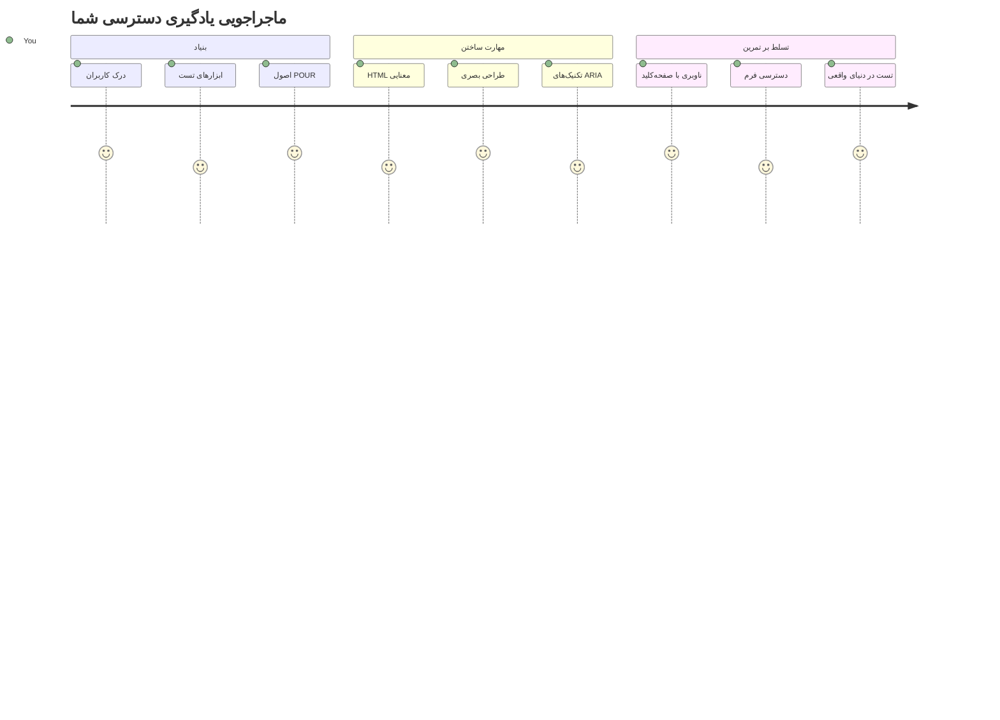
## آزمون پیش از درس
[آزمون پیش از درس](https://ff-quizzes.netlify.app/web/)

> قدرت وب در جهان‌شمول بودن آن است. دسترسی همه افراد صرف‌نظر از معلولیت یک جنبه اساسی است.
>
> - سر تیموتی برنرز-لی، مدیر W3C و مخترع وب جهانی

یک چیزی که ممکن است شما را شگفت‌زده کند: وقتی وب‌سایت‌های قابل دسترس می‌سازید، فقط به افراد معلول کمک نمی‌کنید—در واقع وب را برای همه بهتر می‌کنید!

تا به حال به همان شیب‌های کنار پیاده‌روها فکر کرده‌اید؟ آنها در اصل برای ویلچر طراحی شده بودند، اما اکنون به کسانی که کالسکه بچه دارند، کارگران تحویل با گاری، مسافران با چمدان‌های چرخ‌دار و دوچرخه‌سواران هم کمک می‌کنند. طراحی وب قابل دسترس دقیقاً همین‌گونه کار می‌کند—راه‌حل‌هایی که به یک گروه کمک می‌کنند معمولاً به نفع همه است. جالب نیست؟

در این درس، بررسی خواهیم کرد چگونه وب‌سایت‌هایی بسازیم که واقعاً برای همه کار کنند، صرف‌نظر از روش مرور وبشان. تکنیک‌های عملی که در استانداردهای وب تعبیه شده‌اند را خواهید شناخت، ابزارهای تست را تمرین می‌کنید و خواهید دید که چگونه دسترسی‌پذیری سایت‌های شما را برای همه کاربران کاربردی‌تر می‌کند.

تا پایان این درس، اعتماد به نفس لازم برای ادغام دسترسی‌پذیری به صورت طبیعی در روند توسعه خود را خواهید داشت. آماده‌اید ببینید چگونه انتخاب‌های طراحی دقیق می‌توانند وب را به روی میلیاردها کاربر باز کنند؟ بزن بریم!

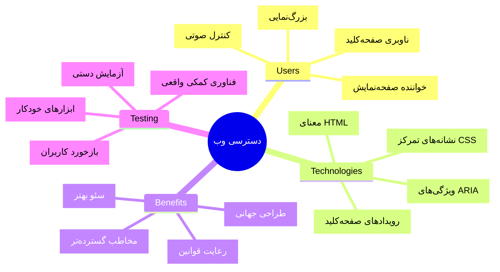
> می‌توانید این درس را در [Microsoft Learn](https://docs.microsoft.com/learn/modules/web-development-101/accessibility/?WT.mc_id=academic-77807-sagibbon) نیز دنبال کنید!

## درک فناوری‌های کمکی

قبل از شروع کدنویسی، بیایید لحظه‌ای وقت بگذاریم تا بفهمیم چگونه افراد با توانایی‌های متفاوت واقعاً وب را تجربه می‌کنند. این فقط نظریه نیست—درک این الگوهای ناوبری دنیای واقعی شما را به توسعه‌دهنده‌ای بسیار بهتر تبدیل می‌کند!

فناوری‌های کمکی ابزارهای فوق‌العاده‌ای هستند که به افراد معلول کمک می‌کنند به روش‌هایی که ممکن است برای شما شگفت‌انگیز باشد با وب‌سایت‌ها تعامل داشته باشند. وقتی نحوه عملکرد این فناوری‌ها را یاد بگیرید، خلق تجارب وب قابل دسترس خیلی شهودی‌تر خواهد بود. مثل این است که یاد بگیرید کد خود را از دید دیگران ببینید.

### صفحه‌خوان‌ها

[صفحه‌خوان‌ها](https://en.wikipedia.org/wiki/Screen_reader) قطعات بسیار پیشرفته فناوری هستند که متن دیجیتال را به صوت یا خروجی بریل تبدیل می‌کنند. اگرچه عمدتاً توسط افراد دارای نقص بینایی استفاده می‌شوند، اما برای کاربران دارای مشکلات یادگیری مثل دیسلکسیا هم بسیار مفیدند.

من دوست دارم صفحه‌خوان را مانند راوی هوشمندی تصور کنم که کتابی برای شما می‌خواند. محتوا را به ترتیب منطقی بلند می‌خواند، عناصر تعاملی مثل «دکمه» یا «لینک» را اعلام می‌کند و میانبرهای صفحه‌کلید برای پرش در صفحه فراهم می‌آورد. اما موضوع این است—صفحه‌خوان‌ها فقط زمانی می‌توانند جادوی خود را انجام دهند که ما وب‌سایت‌ها را با ساختار صحیح و محتوای معنادار بسازیم. اینجاست که شما به عنوان توسعه‌دهنده وارد می‌شوید!

**صفحه‌خوان‌های محبوب در پلتفرم‌ها:**
- **ویندوز**: [NVDA](https://www.nvaccess.org/about-nvda/) (رایگان و محبوب‌ترین)، [JAWS](https://webaim.org/articles/jaws/)، [Narrator](https://support.microsoft.com/windows/complete-guide-to-narrator-e4397a0d-ef4f-b386-d8ae-c172f109bdb1/?WT.mc_id=academic-77807-sagibbon) (سازگار)
- **macOS/iOS**: [VoiceOver](https://support.apple.com/guide/voiceover/welcome/10) (سازگار و بسیار توانمند)
- **اندروید**: [TalkBack](https://support.google.com/accessibility/android/answer/6283677) (سازگار)
- **لینوکس**: [Orca](https://wiki.gnome.org/Projects/Orca) (رایگان و متن‌باز)

**چگونگی ناوبری صفحه‌خوان‌ها در محتوای وب:**

صفحه‌خوان‌ها روش‌های ناوبری متعددی ارائه می‌کنند که مرور را برای کاربران باتجربه کارآمد می‌کند:
- **خواندن ترتیبی**: محتوا را از بالا به پایین می‌خواند، مانند دنبال کردن یک کتاب
- **ناوبری بخش‌ها (لندمارک)**: پرش بین بخش‌های صفحه (هدر، ناو، اصلی، فوتر)
- **ناوبری تیترها**: پرش بین تیترها برای فهم ساختار صفحه
- **فهرست لینک‌ها**: تولید فهرستی از همه لینک‌ها برای دسترسی سریع
- **کنترل‌های فرم**: پرش مستقیم بین فیلدهای ورودی و دکمه‌ها

> 💡 **یک نکته که ذهن من را منفجر کرد**: ۶۸٪ کاربران صفحه‌خوان عمدتاً با تیترها ناوبری می‌کنند ([پژوهش WebAIM](https://webaim.org/projects/screenreadersurvey9/#finding)). این یعنی ساختار تیترهای شما مثل نقشه راه برای کاربران است—وقتی درست باشد، عملاً به مردم کمک می‌کنید سریع‌تر راه خود را در محتوای شما بیابند!

### ساخت روند کاری تست خود

خبر خوب اینکه—تست مؤثر دسترسی‌پذیری نباید دلهره‌آور باشد! شما می‌خواهید ابزارهای خودکار (که در یافتن مشکلات آشکار عالی هستند) را با تست‌های دستی ترکیب کنید. در اینجا یک روش سیستماتیک آورده‌ام که بیشترین مشکلات را می‌گیرد بدون اینکه کل روزتان را صرف کند:

**روند کاری تست دستی ضروری:**

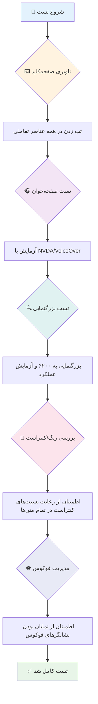
**چک‌لیست تست مرحله به مرحله:**
1. **ناوبری صفحه‌کلید**: فقط از Tab، Shift+Tab، Enter، Space و کلیدهای پیکان استفاده کنید
2. **تست صفحه‌خوان**: فعال‌سازی NVDA، VoiceOver یا Narrator و مرور با چشم بسته
3. **تست بزرگ‌نمایی**: تست در سطوح بزرگ‌نمایی ۲۰۰٪ و ۴۰۰٪
4. **بررسی کنتراست رنگ**: تمامی متن‌ها و اجزای UI را بررسی کنید
5. **تست نشانگر فوکوس**: اطمینان از اینکه همه عناصر تعاملی حالات فوکوس قابل مشاهده دارند

✅ **با Lighthouse شروع کنید**: ابزار توسعه‌دهنده مرورگر خود را باز کنید، یک ارزیابی دسترسی‌پذیری Lighthouse انجام دهید، سپس از نتایج برای هدایت تمرکز تست دستی خود استفاده کنید.

### ابزارهای بزرگ‌نمایی و زوم

می‌دانید وقتی متن خیلی کوچک است، روی گوشی دو انگشت خود را به هم نزدیک یا از هم دور می‌کنید یا در نور شدید خورشید به صفحه لپ‌تاپ خود چشمکی می‌زنید؟ بسیاری از کاربران هر روز برای خوانا کردن محتوا به ابزارهای بزرگ‌نمایی متکی هستند. این شامل افراد با بینایی کم، سالمندان و هر کسی که تا به حال تلاش کرده بیرون از خانه وب‌سایتی را بخواند.

فناوری‌های زوم مدرن فراتر از فقط بزرگ‌تر کردن چیزها پیش رفته‌اند. درک اینکه این ابزارها چگونه کار می‌کنند به شما کمک می‌کند طراحی‌های واکنشگرا ایجاد کنید که در هر سطح بزرگ‌نمایی کاربردی و جذاب باقی بمانند.

**قابلیت‌های بزرگ‌نمایی مرورگرهای مدرن:**
- **زوم صفحه**: همه محتوا را متناسب بزرگ می‌کند (متن، تصاویر، چیدمان) - این روش ترجیحی است
- **زوم فقط متن**: اندازه فونت را افزایش می‌دهد در حالی که چیدمان اصلی حفظ می‌شود
- **زوم با لمس نوک انگشت‌ها (Pinch-to-zoom)**: پشتیبانی ژست موبایل برای بزرگ‌نمایی موقت
- **پشتیبانی مرورگر**: همه مرورگرهای مدرن زوم تا ۵۰۰٪ را بدون شکستن عملکرد پشتیبانی می‌کنند

**نرم‌افزارهای تخصصی بزرگ‌نمایی:**
- **ویندوز**: [Magnifier](https://support.microsoft.com/windows/use-magnifier-to-make-things-on-the-screen-easier-to-see-414948ba-8b1c-d3bd-8615-0e5e32204198) (سازگار)، [ZoomText](https://www.freedomscientific.com/training/zoomtext/getting-started/)
- **macOS/iOS**: [Zoom](https://www.apple.com/accessibility/mac/vision/) (سازگار با ویژگی‌های پیشرفته)

> ⚠️ **ملاحظه طراحی**: WCAG می‌گوید محتوا باید زمانی که به ۲۰۰٪ بزرگ شده به طور کامل کاربردی بماند. در این سطح، اسکرول افقی باید حداقلی باشد و همه عناصر تعاملی باید قابل دسترس باقی بمانند.

✅ **طراحی واکنشگرای خود را تست کنید**: مرورگر را روی ۲۰۰٪ و ۴۰۰٪ بزرگ‌نمایی کنید. آیا چیدمان شما به طور مناسب تطبیق می‌یابد؟ آیا بدون اسکرول زیاد به همه عملکردها می‌توانید دسترسی داشته باشید؟

## ابزارهای مدرن تست دسترسی‌پذیری

حالا که فهمیدید چگونه افراد با فناوری‌های کمکی در وب ناوبری می‌کنند، بیایید به ابزارهایی بپردازیم که به شما کمک می‌کنند وب‌سایت‌های قابل دسترس بسازید و تست کنید.

آن را اینطور تصور کنید: ابزارهای خودکار در یافتن مشکلات واضح (مثل نبود alt در تصویر) عالی هستند، در حالی که تست‌های دستی به شما اطمینان می‌دهد سایت در دنیای واقعی راحت استفاده شود. با هم به شما اطمینان می‌دهند که سایت‌ها برای همه کار می‌کنند.

### تست کنتراست رنگ

خبر خوب این است که: کنتراست رنگ یکی از رایج‌ترین مشکلات دسترسی‌پذیری است، اما همچنین یکی از آسان‌ترین‌ها برای رفع می‌باشد. کنتراست خوب برای همه مفید است—از کاربران دارای نقص بینایی تا کسانی که سعی می‌کنند گوشی خود را کنار دریا بخوانند.

**نیازمندی‌های کنتراست WCAG:**

| نوع متن | WCAG AA (حداقل) | WCAG AAA (بهبود یافته) |
|---------|-----------------|-----------------------|
| **متن معمولی** (زیر ۱۸pt) | نسبت کنتراست ۴.۵:۱ | نسبت کنتراست ۷:۱ |
| **متن بزرگ** (۱۸pt+ یا ۱۴pt+ بولد) | نسبت کنتراست ۳:۱ | نسبت کنتراست ۴.۵:۱ |
| **اجزای UI** (دکمه‌ها، مرزهای فرم) | نسبت کنتراست ۳:۱ | نسبت کنتراست ۳:۱ |

**ابزارهای تست ضروری:**
- [Colour Contrast Analyser](https://www.tpgi.com/color-contrast-checker/) - اپ دسکتاپ با انتخابگر رنگ
- [WebAIM Contrast Checker](https://webaim.org/resources/contrastchecker/) - وب‌محور با بازخورد فوری
- [Stark](https://www.getstark.co/) - افزونه طراحی برای Figma، Sketch، Adobe XD
- [Accessible Colors](https://accessible-colors.com/) - پیدا کردن پالت‌های رنگ دسترسی‌پذیر

✅ **پالت رنگ بهتر بسازید**: با رنگ‌های برند خود شروع کنید و با چکرهای کنتراست، تنوع‌های قابل دسترس بسازید. این‌ها را به عنوان نشان‌های رنگ دسترسی‌پذیر در سیستم طراحی خود مستندسازی کنید.

### نقد جامع دسترسی‌پذیری

موثرترین تست دسترسی‌پذیری ترکیبی از روش‌های مختلف است. هیچ ابزار واحدی همه چیز را پیدا نمی‌کند، بنابراین ساخت روتین تست با روش‌های مختلف پوشش کاملی را تضمین می‌کند.

**تست مبتنی بر مرورگر (در DevTools تعبیه شده):**
- **Chrome/Edge**: ارزیابی دسترسی‌پذیری Lighthouse + پنل Accessibility
- **Firefox**: بازرس دسترسی‌پذیری با نمای درختی دقیق
- **Safari**: تب Audit در Web Inspector با شبیه‌سازی VoiceOver

**افزونه‌های تست حرفه‌ای:**
- [axe DevTools](https://www.deque.com/axe/devtools/) - تست خودکار استاندارد صنعتی
- [WAVE](https://wave.webaim.org/extension/) - بازخورد بصری با برجسته‌سازی خطاها
- [Accessibility Insights](https://accessibilityinsights.io/) - مجموعه تست جامع مایکروسافت

**خط فرمان و یکپارچه‌سازی CI/CD:**
- [axe-core](https://github.com/dequelabs/axe-core) - کتابخانه جاوااسکریپت برای تست خودکار
- [Pa11y](https://pa11y.org/) - ابزار تست دسترسی‌پذیری خط فرمان
- [Lighthouse CI](https://github.com/GoogleChrome/lighthouse-ci) - امتیازدهی خودکار دسترسی‌پذیری

> 🎯 **هدف تست**: هدف گرفتن امتیاز دسترسی‌پذیری Lighthouse بالای ۹۵ به عنوان خط پایه. به یاد داشته باشید، ابزارهای خودکار فقط حدود ۳۰-۴۰٪ مشکلات را می‌گیرند—تست دستی هنوز حیاتی است!

### 🧠 **بررسی مهارت‌های تست: آماده‌ی پیدا کردن مشکلات هستید؟**

**بیایید ببینیم احساس شما درباره تست دسترسی‌پذیری چیست:**
- کدام روش تست در حال حاضر برای شما قابل دسترس‌تر به نظر می‌رسد؟
- می‌توانید تصور کنید یک روز کامل فقط با صفحه‌کلید مرور کنید؟
- یکی از موانع دسترسی‌پذیری که شخصاً در فضای وب تجربه کرده‌اید چیست؟

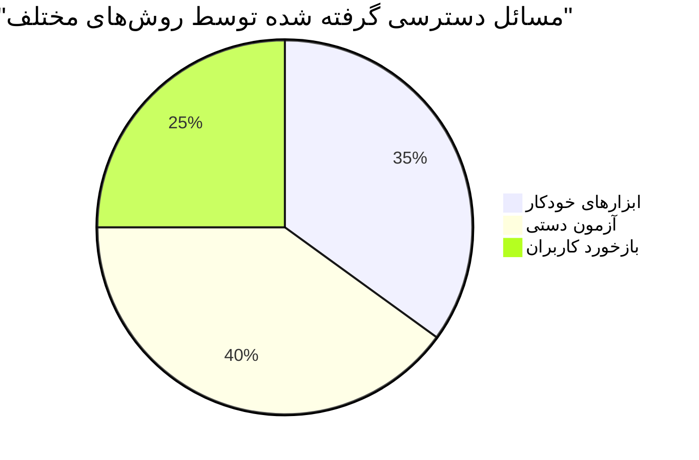
> **تشویق اعتماد به نفس**: تست‌کنندگان حرفه‌ای دسترسی‌پذیری دقیقاً از همین ترکیب روش‌ها استفاده می‌کنند. شما در حال یادگیری روش‌های استاندارد صنعتی هستید!

## ساخت دسترسی‌پذیری از پایه

کلید موفقیت دسترسی‌پذیری این است که آن را از همان روز اول در بنیاد خود بسازید. می‌دانم وسوسه می‌شوید فکر کنید «بعداً دسترسی‌پذیری را اضافه می‌کنم»، اما این مثل این است که بخواهید پس از ساختن خانه، برایش رمپ بسازید. ممکن؟ بله. آسان؟ نه خیلی.

به دسترسی‌پذیری مثل برنامه‌ریزی خانه فکر کنید—خیلی آسان‌تر است که در طرح اولیه معمارانه خود دسترسی ویلچر را بگنجانید تا اینکه بخواهید بعداً همه چیز را بازسازی کنید.

### اصول POUR: پایه دسترسی‌پذیری شما

راهنمایی‌های محتوای وب قابل دسترس (WCAG) حول چهار اصل بنیادین ساخته شده‌اند که کلمه POUR را تشکیل می‌دهند. نگران نباشید—اینها مفاهیم خشک و دانشگاهی نیستند! در واقع دستورالعمل‌های عملی برای ساخت محتوایی هستند که برای همه کار می‌کند.

وقتی اصول POUR را یاد بگیرید، تصمیم‌گیری‌های دسترسی‌پذیری بسیار شهودی‌تر می‌شود. این مثل داشتن یک چک‌لیست ذهنی است که شما را در انتخاب‌های طراحی هدایت می‌کند. بیایید آن را بررسی کنیم:

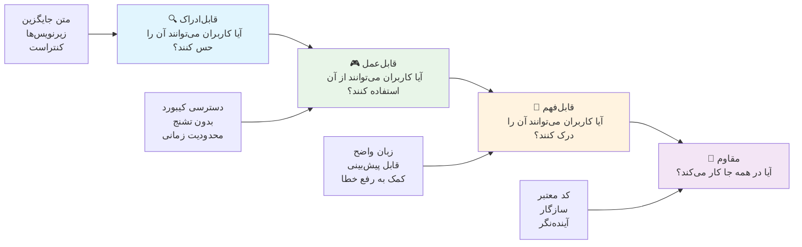
**🔍 قابل درک توسط حواس (Perceivable)**: اطلاعات باید به گونه‌ای ارائه شود که کاربران بتوانند از حس‌های در دسترس خود آن را درک کنند

- جایگزین‌های متنی برای محتوای غیر متنی (تصاویر، ویدئو، صدا) ارائه دهید
- کنتراست رنگ کافی برای تمام متن‌ها و اجزای UI را تضمین کنید
- زیرنویس و متن‌های ضبط شده برای محتوای چندرسانه‌ای فراهم کنید
- محتوایی طراحی کنید که در اندازه‌گیری تا ۲۰۰٪ همچنان کاربردی باشد
- برای انتقال اطلاعات از چند ویژگی حسی (نه فقط رنگ) استفاده کنید

**🎮 قابل عملکرد (Operable)**: تمام اجزای رابط باید از طریق روش‌های ورودی موجود قابل کارکرد باشند

- همه عملکردها را از طریق ناوبری صفحه‌کلید قابل دسترس کنید
- به کاربران زمان کافی برای خواندن و تعامل با محتوا بدهید
- از محتوایی که باعث تشنج یا اختلالات وستیبولار می‌شود اجتناب کنید
- به کمک ساختار واضح و لندمارک‌ها، ناوبری را کارآمد کنید
- اطمینان حاصل کنید عناصر تعاملی اندازه هدف مناسبی دارند (حداقل ۴۴px)

**📖 قابل فهم (Understandable)**: اطلاعات و عملکرد رابط باید روشن و قابل فهم باشد

- از زبان ساده و واضح متناسب با مخاطب استفاده کنید
- محتوا باید به صورت پیش‌بینی‌پذیر و هماهنگ ظاهر و عمل کند
- دستورالعمل‌ها و پیام‌های خطا را برای ورودی کاربران فراهم کنید
- به کاربران کمک کنید اشتباهات در فرم‌ها را بفهمند و اصلاح کنند
- محتوا را با ترتیب خواندن منطقی و سلسله‌مراتب اطلاعات سازمان‌دهی کنید

**💪 مقاوم (Robust)**: محتوا باید به طور قابل اطمینان در فناوری‌ها و دستگاه‌های کمکی مختلف کار کند

- **از HTML معتبر و معنایی به عنوان پایه استفاده کنید**
- **از سازگاری با فناوری‌های کمکی فعلی و آینده اطمینان حاصل کنید**
- **از استانداردهای وب و بهترین شیوه‌های نشانه‌گذاری تبعیت کنید**
- **آزمایش در مرورگرها، دستگاه‌ها و ابزارهای کمکی مختلف**
- **ساختاردهی محتوا به گونه‌ای که هنگام عدم پشتیبانی از ویژگی‌های پیشرفته به آرامی تنزل یابد**

### 🎯 **بررسی اصول POUR: برای ماندگاری آن**

**تأمل سریع بر پایه‌ها:**
- آیا می‌توانید یک ویژگی وب‌سایت را که هر یک از اصول POUR را نقض می‌کند، به ذهن بسپارید؟
- کدام اصل برای شما به عنوان توسعه‌دهنده طبیعی‌تر به نظر می‌رسد؟
- چگونه ممکن است این اصول طراحی را برای همه، نه فقط کاربران معلول، بهبود بخشد؟

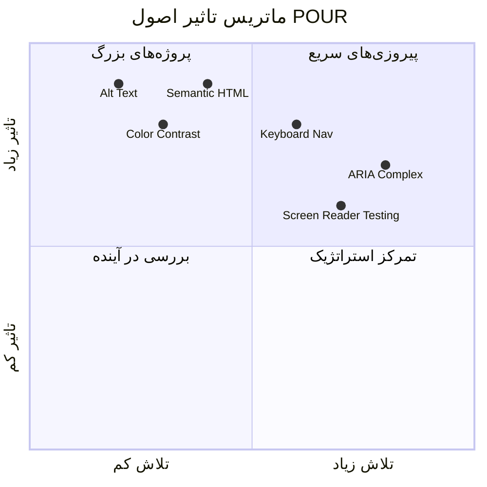
> **به یاد داشته باشید**: با بهبودهای کم‌زحمت و پراثر شروع کنید. HTML معنایی و متن جایگزین، بیشترین افزایش دسترسی را با کمترین تلاش به شما می‌دهند!

## ایجاد طراحی بصری در دسترس

طراحی بصری خوب و دسترسی با هم همراه هستند. زمانی که با در نظر گرفتن دسترسی طراحی می‌کنید، اغلب متوجه می‌شوید که این محدودیت‌ها به راه‌حل‌هایی پاک‌تر و شیک‌تر منجر می‌شوند که برای همه کاربران سودمند است.

بیایید ببینیم چگونه می‌توان طراحی‌هایی جذاب از نظر بصری ایجاد کرد که برای همه کار کنند، بدون توجه به توانایی‌های بصری آنها یا شرایطی که محتوا را مشاهده می‌کنند.

### استراتژی‌های رنگ و دسترسی بصری

رنگ ابزار قدرتمندی برای ارتباط است، اما هرگز نباید تنها راه انتقال اطلاعات مهم باشد. طراحی فراتر از رنگ، تجربیات قوی‌تر و فراگیرتری ایجاد می‌کند که در شرایط بیشتری کار می‌کنند.

**طراحی برای تفاوت‌های دید رنگی:**

حدود ۸٪ مردان و ۰.۵٪ زنان نوعی از تفاوت دید رنگ دارند (که معمولاً «کوری رنگ» نامیده می‌شود). رایج‌ترین انواع آن عبارتند از:
- **دئوترانوپیا**: دشواری در تمایز رنگ قرمز و سبز
- **پروتانوپیا**: رنگ قرمز کم‌نورتر دیده می‌شود
- **تریتانوپیا**: دشواری در تمایز آبی و زرد (نادر)

**استراتژی‌های رنگ فراگیر:**

```css
/* ❌ Bad: Using only color to indicate status */
.error { color: red; }
.success { color: green; }

/* ✅ Good: Color plus icons and context */
.error {
  color: #d32f2f;
  border-left: 4px solid #d32f2f;
}
.error::before {
  content: "⚠️";
  margin-right: 8px;
}

.success {
  color: #2e7d32;
  border-left: 4px solid #2e7d32;
}
.success::before {
  content: "✅";
  margin-right: 8px;
}
```

**فراتر از الزامات پایه کنتراست:**
- رنگ‌های خود را با شبیه‌سازهای کوری رنگ آزمایش کنید
- از الگوها، بافت‌ها یا اشکال در کنار رنگ‌بندی استفاده کنید
- مطمئن شوید وضعیت‌های تعاملی بدون رنگ هم قابل تمایز باقی می‌مانند
- در نظر بگیرید طراحی شما در حالت کنتراست بالا چگونه به نظر می‌رسد

✅ **دسترسی رنگ خود را آزمایش کنید**: از ابزارهایی مانند [Coblis](https://www.color-blindness.com/coblis-color-blindness-simulator/) استفاده کنید تا ببینید وب‌سایت شما برای کاربران با انواع مختلف دید رنگ چگونه دیده می‌شود.

### نشانگرهای تمرکز و طراحی تعامل

نشانگرهای تمرکز معادل دیجیتال یک نشانگر ماوس هستند—آنها به کاربران صفحه‌کلید نشان می‌دهند کجا در صفحه هستند. نشانگرهای تمرکز به خوبی طراحی‌شده تجربه را برای همه با روشن و پیش‌بینی‌پذیر کردن تعاملات بهبود می‌بخشند.

**راهنمای بهترین شیوه‌های مدرن نشانگر تمرکز:**

```css
/* Enhanced focus styles that work across browsers */
button:focus-visible {
  outline: 2px solid #0066cc;
  outline-offset: 2px;
  box-shadow: 0 0 0 4px rgba(0, 102, 204, 0.25);
}

/* Remove focus outline for mouse users, preserve for keyboard users */
button:focus:not(:focus-visible) {
  outline: none;
}

/* Focus-within for complex components */
.card:focus-within {
  box-shadow: 0 0 0 3px rgba(74, 144, 164, 0.5);
  border-color: #4A90A4;
}

/* Ensure focus indicators meet contrast requirements */
.custom-focus:focus-visible {
  outline: 3px solid #ffffff;
  outline-offset: 2px;
  box-shadow: 0 0 0 6px #000000;
}
```

**الزامات نشانگر تمرکز:**
- **قابلیت مشاهده**: باید حداقل نسبت کنتراست ۳:۱ با عناصر اطراف داشته باشد
- **عرض**: ضخامت حداقل ۲ پیکسل در اطراف کل عنصر
- **پایداری**: باید تا انتقال تمرکز به جایی دیگر قابل مشاهده باقی بماند
- **تمایز**: باید از سایر وضعیت‌های رابط کاربری به صورت بصری متفاوت باشد

> 💡 **نکته طراحی**: نشانگرهای تمرکز عالی اغلب ترکیبی از خطوط بیرونی، سایه‌باکس و تغییر رنگ را برای اطمینان از قابلیت مشاهده در پس‌زمینه‌ها و زمینه‌های مختلف استفاده می‌کنند.

✅ **بازرسی نشانگرهای تمرکز**: با استفاده از کلید Tab در وب‌سایت خود حرکت کنید و یادداشت کنید کدام عناصر نشانگر تمرکز واضح دارند. آیا هیچ‌کدام دشوار مشاهده یا کاملاً غایب هستند؟

### HTML معنایی: پایه دسترسی

HTML معنایی مانند دادن یک سیستم مکان‌یابی (GPS) به فناوری‌های کمکی برای وب‌سایت شماست. وقتی از عناصر HTML درست برای هدف‌هایشان استفاده می‌کنید، در واقع نقشه راه دقیقی به صفحه‌خوان‌ها، صفحه‌کلیدها و سایر ابزارها می‌دهید تا به کاربران برای ناوبری موثر کمک کند.

یک تشبیه که واقعاً برای من جا افتاد: HTML معنایی تفاوت بین یک کتابخانه مرتب با دسته‌بندی‌های واضح و علائم کمک‌رسان در مقابل انباری است که کتاب‌ها به صورت پراکنده ریخته شده‌اند. هر دو مکان همان کتاب‌ها را دارند، اما کجا را ترجیح می‌دهید چیزی پیدا کنید؟ دقیقاً!

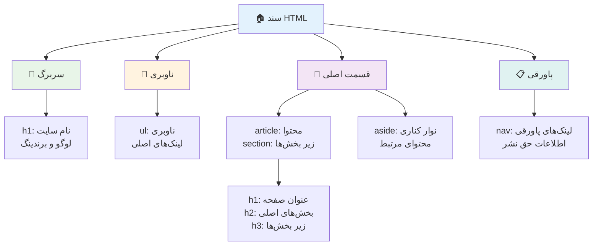
**بلوک‌های ساختمانی ساختار صفحه قابل دسترس:**

```html
<!-- Landmark elements provide page navigation structure -->
<header>
  <h1>Your Site Name</h1>
  <nav aria-label="Main navigation">
    <ul>
      <li><a href="/home">Home</a></li>
      <li><a href="/about">About</a></li>
      <li><a href="/services">Services</a></li>
    </ul>
  </nav>
</header>

<main>
  <article>
    <header>
      <h1>Article Title</h1>
      <p>Published on <time datetime="2024-10-14">October 14, 2024</time></p>
    </header>
    
    <section>
      <h2>First Section</h2>
      <p>Content that relates to this section...</p>
    </section>
    
    <section>
      <h2>Second Section</h2>
      <p>More related content...</p>
    </section>
  </article>
  
  <aside>
    <h2>Related Links</h2>
    <nav aria-label="Related articles">
      <ul>
        <li><a href="/related-1">First related article</a></li>
        <li><a href="/related-2">Second related article</a></li>
      </ul>
    </nav>
  </aside>
</main>

<footer>
  <p>&copy; 2024 Your Site Name. All rights reserved.</p>
  <nav aria-label="Footer links">
    <ul>
      <li><a href="/privacy">Privacy Policy</a></li>
      <li><a href="/contact">Contact Us</a></li>
    </ul>
  </nav>
</footer>
```

**چرا HTML معنایی دسترسی را متحول می‌کند:**

| عنصر معنایی | هدف | مزیت برای صفحه‌خوان |
|-------------|------|---------------------|
| `<header>` | هدر صفحه یا بخش | «نقطه نشانه بنر» - ناوبری سریع به بالا |
| `<nav>` | لینک‌های ناوبری | «نقطه نشانه ناوبری» - فهرست بخش‌های ناوبری |
| `<main>` | محتوای اصلی صفحه | «نقطه نشانه اصلی» - پرش مستقیم به محتوا |
| `<article>` | محتوای مستقل | مرزهای مقاله را اعلام می‌کند |
| `<section>` | گروه‌های محتوا با موضوع مشخص | ساختار محتوا را فراهم می‌کند |
| `<aside>` | محتوای جانبی مرتبط | «نقطه نشانه مکمل» |
| `<footer>` | پاورقی صفحه یا بخش | «نقطه نشانه اطلاعات محتوا» |

**توانایی‌های صفحه‌خوان با HTML معنایی:**
- **ناوبری نقاط نشانه**: پرش فوری بین بخش‌های اصلی صفحه
- **طرح‌بندی سرفصل‌ها**: ساخت فهرست مطالب از ساختار عنوان‌ها
- **فهرست عناصر**: ایجاد فهرست لینک‌ها، دکمه‌ها یا کنترل‌های فرم
- **آگاهی متنی**: درک روابط بین بخش‌های محتوا

> 🎯 **آزمایش سریع**: سعی کنید با صفحه‌خوان از کلیدهای میانبر نقاط نشانه (D برای نقطه نشانه، H برای عنوان، K برای لینک در NVDA/JAWS) سایت خود را ناوبری کنید. آیا ناوبری منطقی است؟

### 🏗️ **بررسی مهارت HTML معنایی: ساخت پایه‌های قوی**

**بیایید دانش معنایی شما را ارزیابی کنیم:**
- آیا می‌توانید فقط با نگاه به HTML نقاط نشانه یک صفحه وب را شناسایی کنید؟
- چگونه تفاوت بین `<section>` و `<div>` را به یک دوست توضیح می‌دهید؟
- اولین چیزی که در صورت گزارش مشکلات ناوبری توسط کاربر صفحه‌خوان بررسی می‌کنید چیست؟

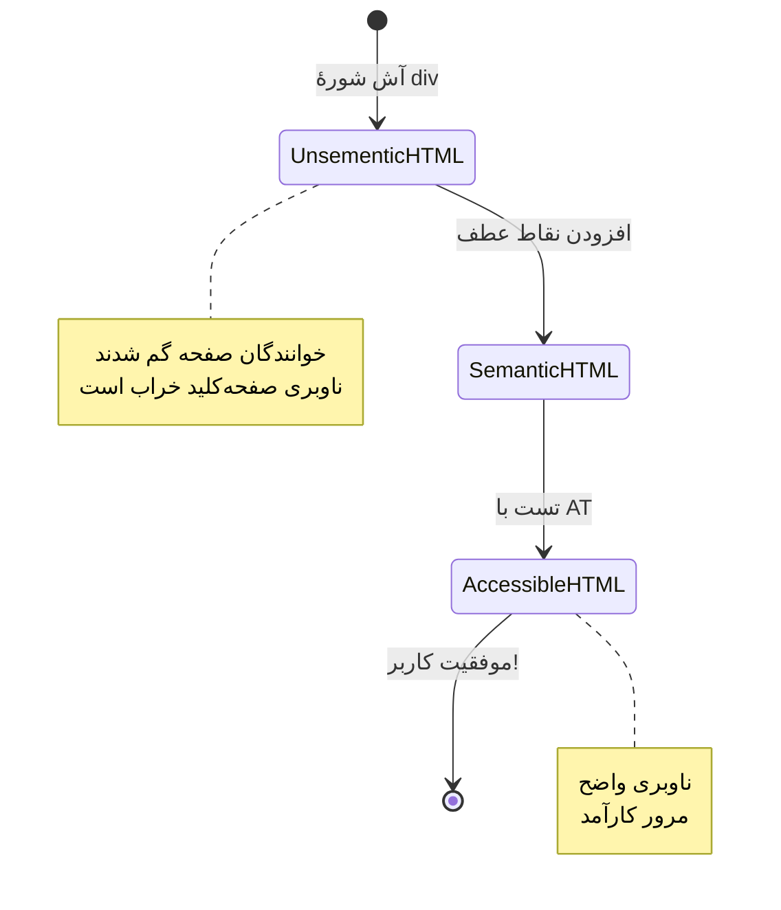
> **نکته حرفه‌ای**: HTML معنایی خوب به طور خودکار حدود ۷۰٪ مسائل دسترسی را حل می‌کند. این پایه را مهارت‌یافته یاد بگیرید و در مسیر خوبی هستید!

✅ **بازرسی ساختار معنایی خود را انجام دهید**: از پنل Accessibility در ابزارهای توسعه مرورگر خود برای مشاهده درخت دسترسی استفاده کنید و اطمینان حاصل کنید نشانه‌گذاری شما ساختار منطقی ایجاد می‌کند.

### سلسله مراتب عنوان‌ها: ایجاد یک طرح منطقی محتوا

عنوان‌ها برای محتوای قابل دسترس بسیار حیاتی هستند—آنها مانند ستون فقرات هستند که همه را کنار هم نگه می‌دارند. کاربران صفحه‌خوان به شدت به عنوان‌ها تکیه می‌کنند تا محتوا را بفهمند و ناوبری کنند. این مثل ارائه فهرست مطالب برای صفحه شما است.

**قانون طلایی برای عنوان‌ها:**
هرگز سطوح را پرش نکنید. همیشه به صورت منطقی از `<h1>` به `<h2>` و سپس به `<h3>` و غیره پیش بروید. یادم می‌آید که در مدرسه چگونه طرح‌ها را می‌ساختیم؟ دقیقاً همان اصل—شما از «I. نکته اصلی» به «C. نکته زیرزیر» بدون داشتن «A. نکته زیر» پرش نمی‌کنید، مگر نه؟

**مثال ساختار عنوان کامل:**

```html
<!-- ✅ Excellent: Logical, hierarchical progression -->
<main>
  <h1>Complete Guide to Web Accessibility</h1>
  
  <section>
    <h2>Understanding Screen Readers</h2>
    <p>Introduction to screen reader technology...</p>
    
    <h3>Popular Screen Reader Software</h3>
    <p>NVDA, JAWS, and VoiceOver comparison...</p>
    
    <h3>Testing with Screen Readers</h3>
    <p>Step-by-step testing instructions...</p>
  </section>
  
  <section>
    <h2>Color and Contrast Guidelines</h2>
    <p>Designing with sufficient contrast...</p>
    
    <h3>WCAG Contrast Requirements</h3>
    <p>Understanding the different contrast levels...</p>
    
    <h3>Testing Tools and Techniques</h3>
    <p>Tools for verifying contrast ratios...</p>
  </section>
</main>
```

```html
<!-- ❌ Problematic: Skipping levels, inconsistent structure -->
<h1>Page Title</h1>
<h3>Subsection</h3> <!-- Skipped h2 -->
<h2>This should come before h3</h2>
<h1>Another main heading?</h1> <!-- Multiple h1s -->
```

**بهترین شیوه‌های عنوان‌گذاری:**
- **یک `<h1>` در هر صفحه**: معمولاً عنوان اصلی صفحه یا عنوان محتوای اصلی
- **پیشرفت منطقی**: هرگز سطوح را پرش نکنید (h1 → h2 → h3، نه h1 → h3)
- **محتوای توصیفی**: عنوان‌ها باید معنی‌دار باشند حتی وقتی خارج از متن خوانده شوند
- **استایل بصری با CSS**: ظاهر را با CSS کنترل کنید، سطوح HTML برای ساختار باشند

**آمار ناوبری صفحه‌خوان:**
- ۶۸٪ کاربران صفحه‌خوان با عنوان‌ها ناوبری می‌کنند ([نظرسنجی WebAIM](https://webaim.org/projects/screenreadersurvey9/#finding))
- کاربران انتظار دارند یک طرح منطقی عنوان‌ها را بیابند
- عنوان‌ها سریع‌ترین راه برای درک ساختار صفحه هستند

> 💡 **نکته حرفه‌ای**: از افزونه مرورگر مثل "HeadingsMap" برای تجسم ساختار عنوان‌ها استفاده کنید. باید شبیه یک فهرست مطالب مرتب شده خوانده شود.

✅ **ساختار عنوان خود را آزمایش کنید**: با ناوبری عنوان صفحه‌خوان (کلید H در NVDA) میان عنوان‌ها جابه‌جا شوید. آیا پیشرفت منطقی داستان محتوای شما را می‌گوید؟

### تکنیک‌های پیشرفته دسترسی بصری

فراتر از اصول پایه کنتراست و رنگ، روش‌های پیشرفته‌ای وجود دارند که به ایجاد تجربیات بصری واقعاً فراگیر کمک می‌کنند. این روش‌ها اطمینان می‌دهند محتوا در شرایط نمایش و فناوری‌های کمکی مختلف کار می‌کند.

**استراتژی‌های کلیدی ارتباط بصری:**

- **بازخورد چندحالته**: ترکیبی از نشانه‌های بصری، متنی و گاهی صوتی
- **افشای تدریجی**: ارائه اطلاعات در قالب قطعات قابل هضم
- **الگوهای تعاملی سازگار**: استفاده از کنوانسیون‌های رابط کاربری آشنا
- **تایپوگرافی واکنش‌گرا**: مقیاس‌بندی متن به اندازه مناسب در دستگاه‌ها
- **وضعیت‌های بارگذاری و خطا**: بازخورد واضح برای همه اقدامات کاربران

**ابزارهای CSS برای افزایش دسترسی:**

```css
/* Screen reader only text - visually hidden but accessible */
.sr-only {
  position: absolute;
  width: 1px;
  height: 1px;
  padding: 0;
  margin: -1px;
  overflow: hidden;
  clip: rect(0, 0, 0, 0);
  white-space: nowrap;
  border: 0;
}

/* Skip link for keyboard navigation */
.skip-link {
  position: absolute;
  top: -40px;
  left: 6px;
  background: #000000;
  color: #ffffff;
  padding: 8px 16px;
  text-decoration: none;
  border-radius: 4px;
  font-weight: bold;
  transition: top 0.3s ease;
  z-index: 1000;
}

.skip-link:focus {
  top: 6px;
}

/* Reduced motion respect */
@media (prefers-reduced-motion: reduce) {
  .skip-link {
    transition: none;
  }
  
  * {
    animation-duration: 0.01ms !important;
    animation-iteration-count: 1 !important;
    transition-duration: 0.01ms !important;
  }
}

/* High contrast mode support */
@media (prefers-contrast: high) {
  .button {
    border: 2px solid;
  }
}
```

> 🎯 **الگوی دسترسی**: لینک پرش برای کاربران صفحه‌کلید ضروری است. باید اولین عنصر قابل دریافت تمرکز در صفحه شما باشد و مستقیماً به بخش محتوای اصلی بپرد.

✅ **پیاده‌سازی پرش ناوبری**: لینک‌های پرش را به صفحات خود اضافه کنید و با فشار دادن Tab بلافاصله پس از بارگذاری صفحه آنها را تست کنید. باید ظاهر شوند و اجازه پرش به محتوا را بدهند.

## ساخت متن لینک معنادار

لینک‌ها در واقع بزرگراه‌های وب هستند، اما متن لینک بد نوشته‌شده مثل داشتن تابلوهای راهنمایی است که فقط «مکان» نوشته‌اند به جای «مرکز شهر شیکاگو». خیلی کمکی نیست، درست است؟

چیزی که وقتی اول یاد گرفتم مرا شگفت‌زده کرد این بود: صفحه‌خوان‌ها می‌توانند همه لینک‌های یک صفحه را استخراج کنند و به صورت یک فهرست بزرگ نمایش دهند. تصور کنید کسی یک فهرست از تمام لینک‌های صفحه‌تان را به شما بدهد. آیا هر کدام به تنهایی معنی خواهند داشت؟ این آزمونی است که متن لینک شما باید قبول کند!

### درک الگوهای ناوبری لینک

صفحه‌خوان‌ها ویژگی‌های قدرتمندی برای ناوبری لینک دارند که به متن لینک خوب نوشته‌شده وابسته است:

**روش‌های ناوبری لینک:**
- **خواندن ترتیبی**: لینک‌ها به صورت متنی در جریان محتوا خوانده می‌شوند
- **ایجاد فهرست لینک‌ها**: تمامی لینک‌های صفحه در یک دفترچه قابل جستجو فهرست می‌شوند
- **ناوبری سریع**: پرش میان لینک‌ها با کلیدهای میانبر صفحه‌کلید (K در NVDA)
- **عملکرد جستجو**: یافتن لینک‌های خاص با تایپ متن جزئی

**چرا زمینه مهم است:**
وقتی کاربران صفحه‌خوان فهرست لینک‌ها را می‌بینند، چیزی شبیه این می‌بینند:
- «دانلود گزارش»
- «بیشتر بدانید»
- «اینجا کلیک کنید»
- «سیاست حفظ حریم خصوصی»
- «اینجا کلیک کنید»

تنها دو لینک از این‌ها اطلاعات مفیدی به تنهایی دارند!

> 📊 **تأثیر بر کاربران**: کاربران صفحه‌خوان هنگام مشاهده فهرست لینک‌ها برای درک سریع محتوا آن را اسکن می‌کنند. متن لینک عمومی آن‌ها را مجبور می‌کند دوباره به زمینه هر لینک برگردند که سرعت مرور آنها را به طور قابل توجهی کاهش می‌دهد.

### اشتباهات رایج متن لینک که باید اجتناب کرد

درک آنچه کار نمی‌کند به شما کمک می‌کند مسائل دسترسی موجود در محتوا را بشناسید و رفع کنید.

**❌ متن لینک عمومی که زمینه نمی‌دهد:**

```html
<!-- Meaningless when read from a link list -->
<p>Our sustainability efforts are detailed in our recent report. 
   <a href="/sustainability-2024.pdf">Click here</a> to view it.</p>

<!-- Repeated generic text throughout the page -->
<div class="article-card">
  <h3>Web Accessibility Guide</h3>
  <p>Learn the fundamentals...</p>
  <a href="/accessibility-guide">Read more</a>
</div>
<div class="article-card">
  <h3>Color Contrast Tips</h3>
  <p>Improve your design...</p>
  <a href="/color-contrast">Read more</a>
</div>

<!-- URLs as link text (difficult for screen readers to announce) -->
<p>Visit https://www.w3.org/WAI/WCAG21/quickref/ for WCAG guidelines.</p>

<!-- Vague action words -->
<a href="/contact">Go</a> | <a href="/about">See</a> | <a href="/help">View</a>
```

**چرا این الگوها شکست می‌خورند:**
- **«اینجا کلیک کنید»** هیچ اطلاعاتی درباره مقصد به کاربران نمی‌دهد
- **«بیشتر بخوانید»** تکرار متعدد باعث سردرگمی می‌شود
- **URLهای خام** برای صفحه‌خوان‌ها دشوار به تلفظ واضح هستند
- **کلمات منفرد** مثل «برو» یا «ببین» فاقد زمینه توصیفی هستند

### نوشتن متن لینک عالی

متن لینک توصیفی برای همه سودمند است—کاربران بینا می‌توانند سریع لینک‌ها را بررسی کنند و کاربران صفحه‌خوان مقصد را فوراً درک می‌کنند.

**✅ نمونه‌های متن لینک واضح و توصیفی:**

```html
<!-- Descriptive text that explains the destination -->
<p>Our comprehensive <a href="/sustainability-2024.pdf">2024 sustainability report (PDF, 2.1MB)</a> details our environmental initiatives.</p>

<!-- Specific, unique link text for each card -->
<div class="article-card">
  <h3>Web Accessibility Guide</h3>
  <p>Learn the fundamentals of inclusive design...</p>
  <a href="/accessibility-guide">Read our complete web accessibility guide</a>
</div>
<div class="article-card">
  <h3>Color Contrast Tips</h3>
  <p>Improve your design with better color choices...</p>
  <a href="/color-contrast">Explore color contrast best practices</a>
</div>

<!-- Meaningful text instead of raw URLs -->
<p>The <a href="https://www.w3.org/WAI/WCAG21/quickref/">WCAG 2.1 Quick Reference guide</a> provides comprehensive accessibility guidelines.</p>

<!-- Descriptive action links -->
<a href="/contact">Contact our support team</a> | 
<a href="/about">About our company</a> | 
<a href="/help">Get help with your account</a>
```

**بهترین شیوه‌های نوشتن متن لینک:**
- **خاص باشید**: «دانلود گزارش مالی فصلی» در مقابل «دانلود»
- **نوع و اندازه فایل را درج کنید**: «(PDF، ۱.۲ مگابایت)» برای فایل‌های قابل دانلود
- **ذکر کنید اگر لینک در پنجره جدید باز می‌شود**: «(در پنجره جدید باز می‌شود)» در صورت لزوم
- **از زبان فعال استفاده کنید**: «تماس با ما» در مقابل «صفحه تماس»
- **مختصر نگه دارید**: در صورت امکان بین ۲ تا ۸ کلمه

### الگوهای پیشرفته دسترسی لینک

گاهی محدودیت‌های طراحی بصری یا نیازهای فنی راه‌حل‌های ویژه می‌طلبند. اینجا تکنیک‌های پیشرفته برای شرایط رایج چالش‌برانگیز آمده است:

**استفاده از ARIA برای زمینه بهتر:**

```html
<!-- When button text must be short but needs more context -->
<a href="/report.pdf" 
   aria-label="Download 2024 annual financial report, PDF format, 2.3MB">
  Download Report
</a>

<!-- When the full context comes from surrounding content -->
<h3 id="sustainability-heading">Sustainability Initiative</h3>
<p>Our efforts to reduce environmental impact...</p>
<a href="/sustainability-details" 
   aria-labelledby="sustainability-heading"
   aria-describedby="sustainability-summary">
  Learn more
</a>
<p id="sustainability-summary">Detailed breakdown of our 2024 environmental goals and achievements</p>
```

**نشاندادن نوع فایل و مقصدهای خارجی:**

```html
<!-- Method 1: Include information in visible link text -->
<a href="/annual-report.pdf">
  Download our 2024 annual report (PDF, 2.3MB)
</a>

<!-- Method 2: Use screen reader-only text for file details -->
<a href="/annual-report.pdf">
  Download our 2024 annual report
  <span class="sr-only">(PDF format, 2.3MB)</span>
</a>

<!-- Method 3: External link indication -->
<a href="https://example.com" 
   target="_blank" 
   aria-describedby="external-link-warning">
  Visit external resource
</a>
<span id="external-link-warning" class="sr-only">
  (opens in new window)
</span>

<!-- Method 4: Using CSS for visual indicators -->
<a href="https://example.com" class="external-link">
  External resource
</a>
```

```css
/* Visual indicator for external links */
.external-link::after {
  content: " ↗";
  font-size: 0.8em;
  color: #666;
}

/* Screen reader announcement for external links */
.external-link::before {
  content: "External link: ";
  position: absolute;
  left: -10000px;
  width: 1px;
  height: 1px;
  overflow: hidden;
}
```

> ⚠️ **مهم**: وقتی از `target="_blank"` استفاده می‌کنید، همیشه به کاربران اطلاع دهید که لینک در پنجره یا زبانه جدید باز می‌شود. تغییر ناگهانی مسیر می‌تواند گیج‌کننده باشد.

✅ **زمینه لینک خود را آزمایش کنید**: از ابزارهای توسعه مرورگر خود استفاده کنید تا فهرستی از تمام لینک‌های صفحه را تولید کنید. آیا بدون هیچ زمینه‌ای می‌توانید هدف هر لینک را بفهمید؟

## ARIA: تقویت‌کننده دسترسی HTML

[برنامه‌های اینترنتی غنی قابل دسترس (ARIA)](https://developer.mozilla.org/docs/Web/Accessibility/ARIA) مانند داشتن مترجم جهانی بین برنامه‌های وب پیچیده و فناوری‌های کمکی شماست. وقتی HTML به تنهایی نمی‌تواند همه فعالیت‌های کامپوننت‌های تعاملی شما را بیان کند، ARIA وارد عمل می‌شود تا این خلأ را پر کند.

من ARIA را مانند اضافه کردن حاشیه‌نویسی‌های مفید به HTML می‌بینم—شبیه دستورالعمل‌های صحنه در یک نمایشنامه که به بازیگران کمک می‌کند نقش‌ها و روابط‌شان را بفهمند.

**مهم‌ترین قانون درباره ARIA این است**: همیشه اول از HTML معنایی استفاده کنید، سپس ARIA را برای ارتقا بیفزایید. ARIA ادویه است، نه غذای اصلی. باید ساختار HTML شما را روشن و بهبود دهد، هرگز جایگزین آن نشود. ابتدا آن پایه را درست کنید!

### پیاده‌سازی استراتژیک ARIA

ARIA قدرتمند است، اما با قدرت مسئولیت می‌آید. ARIA نادرست می‌تواند دسترسی را بدتر از نبود آن کند. اینجا زمان و چگونگی استفاده مؤثر آن آمده است:

**✅ وقتی از ARIA استفاده کنید:**
- ایجاد ویجت‌های تعاملی سفارشی (آکاردئون‌ها، تب‌ها، کاروسل‌ها)
- ساخت محتوای دینامیک که بدون بارگذاری مجدد صفحه تغییر می‌کند
- ارائه زمینه اضافی برای روابط پیچیده رابط کاربری
- نشان دادن وضعیت‌های بارگیری یا به‌روزرسانی‌های زنده محتوا
- ایجاد رابط‌های اپلیکیشن‌مانند با کنترل‌های سفارشی

**❌ وقتی از ARIA اجتناب کنید:**
- وقتی عناصر HTML استاندارد معنای مورد نیاز را ارائه می‌دهند
- اگر نمی‌دانید چگونه به درستی آن را پیاده‌سازی کنید
- وقتی اطلاعات را دوباره‌کاری می‌کند که قبلاً با HTML معنایی فراهم شده
- اگر با فناوری‌های کمکی واقعی آزمایش نکرده‌اید

> 🎯 **قانون طلایی ARIA**: «مگر وقتی کاملاً لازم است معنای عناصر را تغییر ندهید، همیشه دسترسی با صفحه‌کلید را تضمین کنید و با فناوری‌های کمکی واقعی آزمایش کنید.»
**پنج دسته ARIA:**

1. **نقش‌ها**: این عنصر چیست؟ (`button`, `tab`, `dialog`)
2. **ویژگی‌ها**: ویژگی‌های آن چیست؟ (`aria-required`, `aria-haspopup`)
3. **وضعیت‌ها**: وضعیت فعلی آن چیست؟ (`aria-expanded`, `aria-checked`)
4. **نقاط عطف**: در ساختار صفحه کجا قرار دارد؟ (`banner`, `navigation`, `main`)
5. **ناحیه‌های زنده**: چگونه باید تغییرات اعلام شوند؟ (`aria-live`, `aria-atomic`)

### الگوهای ضروری ARIA برای برنامه‌های وب مدرن

این الگوها چالش‌های رایج دسترسی در برنامه‌های وب تعاملی را حل می‌کنند:

**نام‌گذاری و توصیف عناصر:**

```html
<!-- aria-label: Provides accessible name when visible text isn't sufficient -->
<button aria-label="Close newsletter subscription dialog">×</button>

<!-- aria-labelledby: References existing text as the accessible name -->
<section aria-labelledby="news-heading">
  <h2 id="news-heading">Latest News</h2>
  <!-- news content -->
</section>

<!-- aria-describedby: Links to additional descriptive text -->
<input type="password" 
       aria-describedby="pwd-requirements pwd-strength"
       required>
<div id="pwd-requirements">
  Password must contain at least 8 characters, including uppercase, lowercase, and numbers.
</div>
<div id="pwd-strength" aria-live="polite">
  <!-- Dynamic password strength indicator -->
</div>
```

**ناحیه‌های زنده برای محتوای پویا:**

```html
<!-- Polite announcements (don't interrupt current speech) -->
<div aria-live="polite" id="status-updates">
  <!-- Status messages appear here -->
</div>

<!-- Assertive announcements (interrupt and announce immediately) -->
<div aria-live="assertive" id="urgent-alerts">
  <!-- Error messages and critical alerts -->
</div>

<!-- Loading states with live regions -->
<button id="submit-btn" aria-describedby="loading-status">
  Submit Application
</button>
<div id="loading-status" aria-live="polite" aria-atomic="true">
  <!-- "Processing your application..." appears here -->
</div>
```

**مثال ابزارک تعاملی (آکاردئون):**

```html
<div class="accordion">
  <h3>
    <button aria-expanded="false" 
            aria-controls="panel-1" 
            id="accordion-trigger-1"
            class="accordion-trigger">
      Accessibility Guidelines
    </button>
  </h3>
  <div id="panel-1" 
       role="region"
       aria-labelledby="accordion-trigger-1" 
       hidden>
    <p>WCAG 2.1 provides comprehensive guidelines...</p>
  </div>
</div>
```

```javascript
// مدیریت وضعیت آکاردئون با جاوااسکریپت
function toggleAccordion(trigger) {
  const panel = document.getElementById(trigger.getAttribute('aria-controls'));
  const isExpanded = trigger.getAttribute('aria-expanded') === 'true';
  
  // تغییر وضعیت‌ها
  trigger.setAttribute('aria-expanded', !isExpanded);
  panel.hidden = isExpanded;
  
  // اعلام تغییر به صفحه‌خوان‌ها
  const status = document.getElementById('status-updates');
  status.textContent = isExpanded ? 'Section collapsed' : 'Section expanded';
}
```

### بهترین روش‌های پیاده‌سازی ARIA

ARIA قدرتمند است اما نیازمند پیاده‌سازی دقیق می‌باشد. پیروی از این دستورالعمل‌ها به تضمین این کمک می‌کند که ARIA شما به بهبود دسترسی کند نه مانع آن:

**🛡️ اصول پایه:**

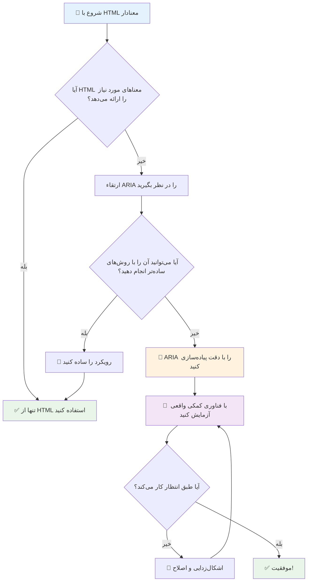
1. **اولویت به HTML معنایی**: همیشه `<button>` را به `<div role="button">` ترجیح دهید
2. **شکستن معنای HTML ممنوع**: هرگز معنای موجود HTML را بازنویسی نکنید (اجتناب از `<h1 role="button">`)
3. **حفظ دسترسی کیبورد**: تمامی عناصر تعاملی ARIA باید کاملاً با کیبورد قابل دسترسی باشند
4. **آزمون با کاربران واقعی**: پشتیبانی ARIA بین فناوری‌های کمکی بسیار متفاوت است
5. **با سادگی شروع کنید**: پیاده‌سازی‌های پیچیده ARIA بیشتر احتمال خطا دارند

**🔍 جریان کاری تست:**

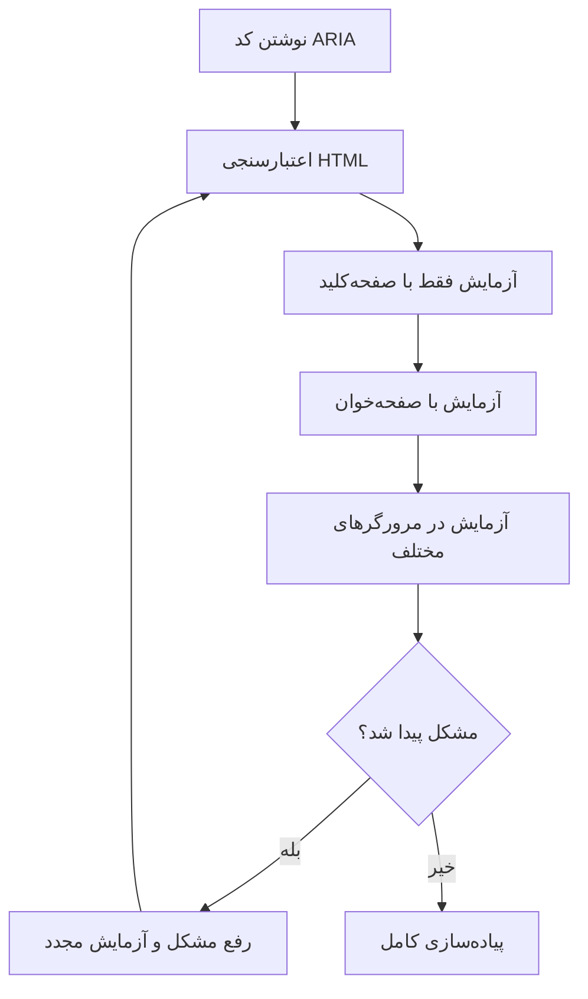
**🚫 اشتباهات رایج ARIA که باید اجتناب کرد:**

- **اطلاعات متناقض**: با معنای HTML در تضاد نباشد
- **برچسب‌گذاری بیش از حد**: اطلاعات زیادی از ARIA کاربران را گیج می‌کند
- **ARIA استاتیک**: فراموش کردن به‌روزرسانی وضعیت‌های ARIA هنگام تغییر محتوا
- **پیاده‌سازی‌های بدون آزمون**: ARIA که در تئوری کار می‌کند ولی در عمل شکست می‌خورد
- **نبود پشتیبانی کیبورد**: نقش‌های ARIA بدون تعاملات کیبوردی متناظر

> 💡 **منابع تست**: از ابزارهایی مانند [accessibility-checker](https://www.npmjs.com/package/accessibility-checker) برای اعتبارسنجی خودکار ARIA استفاده کنید، اما همیشه با صفحه‌خوان‌های واقعی تست کنید تا تجربه کامل را داشته باشید.

### 🎭 **آزمون مهارت ARIA: آماده تعاملات پیچیده هستید؟**

**اعتماد به نفس ARIA خود را ارزیابی کنید:**
- چه زمانی ARIA را به جای HTML معنایی انتخاب می‌کنید؟ (راهنما: تقریباً هیچ وقت!)
- می‌توانید توضیح دهید چرا `<div role="button">` معمولاً از `<button>` بدتر است؟
- مهم‌ترین نکته در مورد تست ARIA چیست؟

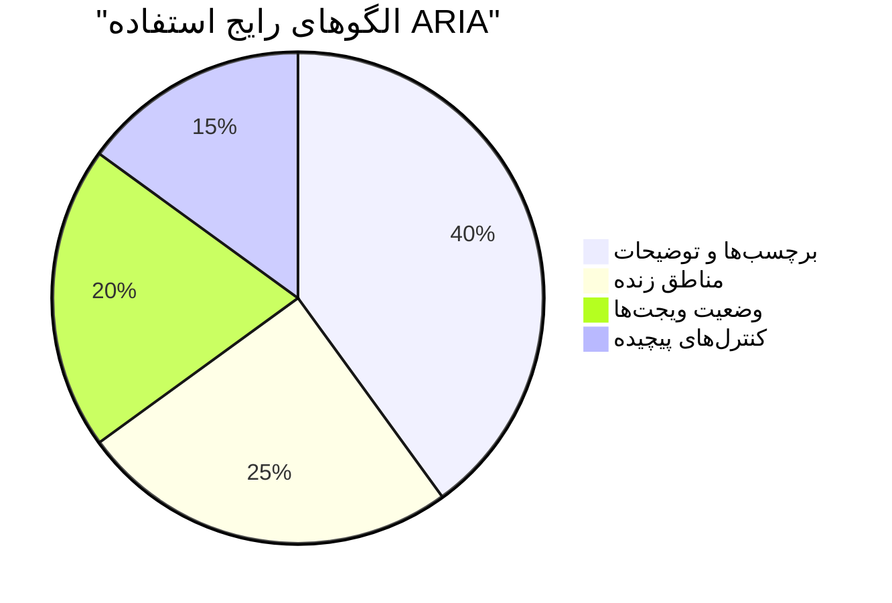
> **بینش کلیدی**: بیشتر استفاده‌های ARIA برای برچسب‌گذاری و توصیف عناصر است. الگوهای پیچیده ابزارک‌ها خیلی کمتر از آنچه تصور می‌کنید رایج هستند!

✅ **از متخصصان بیاموزید**: راهنمای [ARIA Authoring Practices Guide](https://w3c.github.io/aria-practices/) را برای الگوها و پیاده‌سازی‌های آزموده‌شده ابزارک‌های تعاملی پیچیده مطالعه کنید.

## دسترسی‌پذیری تصاویر و رسانه‌ها

محتوای دیداری و شنیداری بخش‌های اساسی تجربه‌های وب مدرن هستند، اما اگر با دقت اجرا نشوند، موانعی ایجاد می‌کنند. هدف این است که اطلاعات و تأثیر احساسی رسانه‌های شما به هر کاربر برسد. وقتی به آن عادت کنید، مثل نفس کشیدن طبیعی می‌شود.

انواع مختلف رسانه نیازمند رویکردهای متفاوتی برای دسترسی‌پذیری هستند. مثل آشپزی است—شما ماهی ظریف را همانند استیک سنگین نمی‌پزید. فهمیدن این تفاوت‌ها کمک می‌کند راه‌حل مناسب را برای هر موقعیت انتخاب کنید.

### دسترسی استراتژیک تصاویر

هر تصویری در وب‌سایت شما هدفی دارد. درک این هدف به شما کمک می‌کند متن جایگزین بهتری بنویسید و تجربه‌های فراگیرتری بسازید.

**چهار نوع تصویر و استراتژی متن جایگزین آن‌ها:**

**تصاویر اطلاع‌رسان** - اطلاعات مهم منتقل می‌کنند:
```html

```

**تصاویر تزئینی** - صرفاً تصویری بدون ارزش اطلاعاتی:
```html

```

**تصاویر کاربردی** - به عنوان دکمه یا کنترل عمل می‌کنند:
```html
<button>
  
</button>
```

**تصاویر پیچیده** - نمودارها، دیاگرام‌ها، اینفوگرافیک‌ها:
```html

<div id="chart-description">
  <p>Detailed description: Sales data shows a steady increase across all quarters...</p>
</div>
```

### دسترسی ویدئو و صدا

**نیازمندی‌های ویدئو:**
- **زیرنویس‌ها**: نسخه متنی محتوای گفتاری و افکت‌های صوتی
- **توضیحات صوتی**: روایت عناصر بصری برای کاربران نابینا
- **رونوشت‌ها**: نسخه متنی کامل همه محتوای صوتی و تصویری

```html
<video controls>
  <source src="video.mp4" type="video/mp4">
  <track kind="captions" src="captions.vtt" srclang="en" label="English">
  <track kind="descriptions" src="descriptions.vtt" srclang="en" label="Audio descriptions">
</video>
```

**نیازمندی‌های صوتی:**
- **رونوشت‌ها**: نسخه متنی تمام محتوای گفتاری
- **شاخص‌های بصری**: برای محتوای فقط صوتی، نشانه‌های بصری فراهم کنید

### تکنیک‌های تصاویر مدرن

**استفاده از CSS برای تصاویر تزئینی:**
```css
.hero-section {
  background-image: url('decorative-hero.jpg');
  /* Decorative images in CSS don't need alt text */
}
```

**تصاویر پاسخگو با دسترسی:**
```html
<picture>
  <source media="(min-width: 800px)" srcset="large-chart.png">
  <source media="(min-width: 400px)" srcset="medium-chart.png">
  
</picture>
```

✅ **تست دسترسی‌پذیری تصاویر**: با استفاده از یک صفحه‌خوان در صفحه‌ای که تصاویر دارد حرکت کنید. آیا اطلاعات کافی برای درک محتوا دریافت می‌کنید؟

## ناوبری کیبورد و مدیریت فوکوس

بسیاری از کاربران به طور کامل با کیبورد وب را مرور می‌کنند. شامل افراد دارای ناتوانی حرکتی، کاربران حرفه‌ای که کیبورد را سریع‌تر از ماوس می‌بینند، و هر کسی که ماوسش کار نمی‌کند. اطمینان از اینکه سایت شما با ورودی کیبورد به خوبی کار می‌کند ضروری است و اغلب سایت را برای همه کارآمدتر می‌کند.

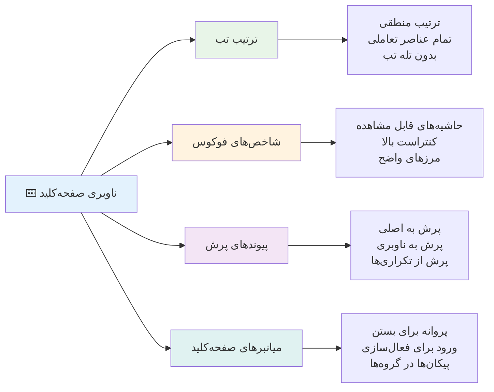
### الگوهای ضروری ناوبری کیبورد

**تعاملات استاندارد کیبورد:**
- **Tab**: حرکت فوکوس به جلو بین عناصر تعاملی
- **Shift + Tab**: حرکت فوکوس به عقب
- **Enter**: فعال‌سازی دکمه‌ها و لینک‌ها
- **Space**: فعال‌سازی دکمه‌ها، علامت زدن چک‌باکس‌ها
- **کلیدهای جهت‌نما**: ناوبری درون گروه‌های کامپوننت (رادیو باتن‌ها، منوها)
- **Escape**: بستن مودال‌ها، منوهای کشویی یا لغو عملیات

### بهترین روش‌های مدیریت فوکوس

**شاخص‌های فوکوس قابل مشاهده:**
```css
/* Ensure focus is always visible */
button:focus-visible {
  outline: 2px solid #4A90A4;
  outline-offset: 2px;
}

/* Custom focus styles for different components */
.card:focus-within {
  box-shadow: 0 0 0 3px rgba(74, 144, 164, 0.5);
}
```

**لینک‌های پرش برای ناوبری کارآمد:**
```html
<a href="#main-content" class="skip-link">Skip to main content</a>
<a href="#navigation" class="skip-link">Skip to navigation</a>

<nav id="navigation">
  <!-- navigation content -->
</nav>
<main id="main-content">
  <!-- main content -->
</main>
```

**ترتیب مناسب تب:**
```html
<!-- Use semantic HTML for natural tab order -->
<form>
  <label for="name">Name:</label>
  <input type="text" id="name" tabindex="0">
  
  <label for="email">Email:</label>
  <input type="email" id="email" tabindex="0">
  
  <button type="submit" tabindex="0">Submit</button>
</form>
```

### گیر افتادن فوکوس در مودال‌ها

هنگام باز کردن دیالوگ‌های مودال، فوکوس باید درون مودال محبوس شود:

```javascript
// پیاده‌سازی مدرن تله فوکوس
function trapFocus(element) {
  const focusableElements = element.querySelectorAll(
    'button, [href], input, select, textarea, [tabindex]:not([tabindex="-1"])'
  );
  
  const firstElement = focusableElements[0];
  const lastElement = focusableElements[focusableElements.length - 1];

  element.addEventListener('keydown', (e) => {
    if (e.key === 'Tab') {
      if (e.shiftKey && document.activeElement === firstElement) {
        e.preventDefault();
        lastElement.focus();
      } else if (!e.shiftKey && document.activeElement === lastElement) {
        e.preventDefault();
        firstElement.focus();
      }
    }
    
    if (e.key === 'Escape') {
      closeModal();
    }
  });
  
  // فوکوس کردن روی اولین عنصر هنگام باز شدن مودال
  firstElement.focus();
}
```

✅ **تست ناوبری کیبورد**: سعی کنید فقط با کلید Tab در سایت خود حرکت کنید. آیا به تمام عناصر تعاملی می‌رسید؟ ترتیب فوکوس منطقی است؟ شاخص‌های فوکوس به وضوح دیده می‌شوند؟

## دسترسی‌پذیری فرم‌ها

فرم‌ها برای تعامل کاربران حیاتی هستند و نیاز به توجه ویژه به دسترسی دارند.

### برچسب‌گذاری و ارتباط کنترل‌های فرم

**هر کنترل فرم نیاز به برچسب دارد:**
```html
<!-- Explicit labeling (preferred) -->
<label for="username">Username:</label>
<input type="text" id="username" name="username" required>

<!-- Implicit labeling -->
<label>
  Password:
  <input type="password" name="password" required>
</label>

<!-- Using aria-label when visual label isn't desired -->
<input type="search" aria-label="Search products" placeholder="Search...">
```

### مدیریت خطا و اعتبارسنجی

**پیام‌های خطای قابل دسترس:**
```html
<label for="email">Email Address:</label>
<input type="email" id="email" name="email" 
       aria-describedby="email-error" 
       aria-invalid="true" required>
<div id="email-error" role="alert">
  Please enter a valid email address
</div>
```

**بهترین روش‌های اعتبارسنجی فرم:**
- از `aria-invalid` برای نشان دادن فیلدهای نامعتبر استفاده کنید
- پیام‌های خطای واضح و مشخص ارائه دهید
- از `role="alert"` برای اعلان‌های خطای مهم استفاده کنید
- خطاها را هم فوراً و هم هنگام ارسال فرم نمایش دهید

### فیلدست‌ها و گروه‌بندی

**گروه‌بندی کنترل‌های مرتبط فرم:**
```html
<fieldset>
  <legend>Shipping Address</legend>
  <label for="street">Street Address:</label>
  <input type="text" id="street" name="street">
  
  <label for="city">City:</label>
  <input type="text" id="city" name="city">
</fieldset>

<fieldset>
  <legend>Preferred Contact Method</legend>
  <input type="radio" id="contact-email" name="contact" value="email">
  <label for="contact-email">Email</label>
  
  <input type="radio" id="contact-phone" name="contact" value="phone">
  <label for="contact-phone">Phone</label>
</fieldset>
```

## سفر دسترسی‌پذیری شما: نکات کلیدی

تبریک! اکنون دانش پایه لازم برای ایجاد تجربه‌های وب واقعاً فراگیر را کسب کرده‌اید. این بسیار هیجان‌انگیز است! دسترسی وب فقط مربوط به پر کردن فیلدها نیست—بلکه شناخت راه‌های متنوع تعامل مردم با محتواهای دیجیتال و طراحی برای آن پیچیدگی شگفت‌انگیز است.

شما اکنون بخشی از جامعه رو به رشدی از توسعه‌دهندگانی هستید که می‌فهمند طراحی عالی برای همه کار می‌کند. به باشگاه خوش آمدید!

**🎯 کیت ابزار دسترسی شما اکنون شامل موارد زیر است:**

| اصل پایه | پیاده‌سازی | تأثیر |
|----------------|----------------|---------|
| **بنیاد HTML معنایی** | استفاده از عناصر HTML مناسب برای منظورشان | صفحه‌خوان‌ها می‌توانند به طور کارآمد جا به جا شوند، کیبوردها به طور خودکار کار می‌کنند |
| **طراحی فراگیر بصری** | کنتراست کافی، استفاده معنی‌دار از رنگ، شاخص‌های فوکوس قابل مشاهده | برای همه در هر شرایط نوری واضح است |
| **محتوای توصیفی** | متن لینک معنی‌دار، متن جایگزین، عناوین | کاربران بدون زمینه بصری محتوا را درک می‌کنند |
| **دسترسی کیبورد** | ترتیب تب، میانبرهای کیبورد، مدیریت فوکوس | دسترسی حرکتی و کارایی کاربران حرفه‌ای |
| **بهبود ARIA** | استفاده استراتژیک برای پر کردن شکاف‌های معنایی | برنامه‌های پیچیده با فناوری‌های کمکی سازگار می‌شوند |
| **تست جامع** | ابزارهای خودکار + تأیید دستی + تست کاربران واقعی | مشکلات قبل از رسیدن به کاربر شناسایی می‌شوند |

**🚀 گام‌های بعدی شما:**

1. **دسترس‌پذیری را در جریان کاری خود بسازید**: تست را بخشی طبیعی از فرآیند توسعه خود کنید
2. **از کاربران واقعی بیاموزید**: بازخورد افرادی را که از فناوری‌های کمکی استفاده می‌کنند جستجو کنید
3. **به‌روز بمانید**: تکنیک‌های دسترسی با فناوری‌ها و استانداردهای جدید به‌روز می‌شوند
4. **برای فراگیری تلاش کنید**: دانش خود را به اشتراک بگذارید و دسترسی را اولویت تیم کنید

> 💡 **به یاد داشته باشید**: محدودیت‌های دسترسی اغلب به راه‌حل‌های نوآورانه و زیبا منجر می‌شوند که به نفع همه است. رمپ‌های مخصوص، زیرنویس‌ها و کنترل‌های صوتی همگی ابتدا ویژگی‌های دسترسی بودند و سپس بهبودهای عمومی شدند.

**دلایل تجاری کاملاً واضح است**: وب‌سایت‌های دسترس‌پذیر کاربران بیشتری می‌یابند، در موتورهای جستجو رتبه بهتری دارند، هزینه نگهداری کمتر دارند و از ریسک‌های حقوقی جلوگیری می‌کنند. اما واقعاً؟ دلیل اصلی اهمیت دسترسی بسیار عمیق‌تر است. وب‌سایت‌های دسترس‌پذیر بهترین ارزش‌های وب—باز بودن، فراگیری و این ایده که همه شایسته دسترسی برابر به اطلاعات هستند—را نمایندگی می‌کنند.

شما اکنون مجهز به ساخت وب فراگیر آینده هستید. هر وب‌سایت دسترس‌پذیری که بسازید اینترنت را برای همه خوشایندتر می‌کند. وقتی به آن فکر می‌کنید، واقعاً شگفت‌انگیز است!

## منابع بیشتر

سفر یادگیری دسترسی‌پذیری خود را با این منابع ضروری ادامه دهید:

**📚 استانداردها و دستورالعمل‌های رسمی:**
- [دستورالعمل‌های WCAG 2.1](https://www.w3.org/WAI/WCAG21/quickref/) - استاندارد رسمی دسترسی با مرجع سریع
- [راهنمای سیاست‌های نویسندگی ARIA](https://w3c.github.io/aria-practices/) - الگوهای کامل برای ابزارک‌های تعاملی
- [دستورالعمل‌های WebAIM](https://webaim.org/) - راهنمای عملی و قابل استفاده برای مبتدیان

**🛠️ ابزارها و منابع تست:**
- [axe DevTools](https://www.deque.com/axe/devtools/) - ابزار آزمایش دسترسی در سطح صنعت
- [فهرست بررسی پروژه A11y](https://www.a11yproject.com/checklist/) - گام‌به‌گام برای بررسی دسترسی
- [Accessibility Insights](https://accessibilityinsights.io/) - مجموعه کامل تست مایکروسافت
- [Color Oracle](https://colororacle.org/) - شبیه‌ساز کوررنگی برای تست طراحی

**🎓 یادگیری و جامعه:**
- [نظرسنجی صفحه‌خوان WebAIM](https://webaim.org/projects/screenreadersurvey9/) - ترجیحات و رفتار کاربران واقعی
- [کامپوننت‌های فراگیر](https://inclusive-components.design/) - الگوهای مدرن کامپوننت‌های دسترس‌پذیر
- [A11y Coffee](https://a11y.coffee/) - نکات و بینش‌های سریع در دسترسی
- [ابتکار دسترسی وب (WAI)](https://www.w3.org/WAI/) - منابع جامع دسترسی W3C

**🎥 یادگیری عملی:**
- [راهنمای توسعه‌دهنده دسترسی](https://www.accessibility-developer-guide.com/) - راهنمای پیاده‌سازی عملی
- [Deque University](https://dequeuniversity.com/) - دوره‌های آموزشی حرفه‌ای دسترسی

## چالش GitHub Copilot Agent 🚀

از حالت Agent برای کامل کردن چالش زیر استفاده کنید:

**توضیح:** یک مؤلفه دیالوگ مودال دسترس‌پذیر بسازید که مدیریت مناسب فوکوس، ویژگی‌های ARIA و الگوهای ناوبری کیبورد را نمایش دهد.

**درخواست:** یک مؤلفه دیالوگ مودال کامل با HTML، CSS و JavaScript بسازید که شامل: محصورسازی فوکوس صحیح، کلید ESC برای بستن، کلیک خارج برای بستن، ویژگی‌های ARIA برای صفحه‌خوان‌ها و شاخص‌های فوکوس قابل مشاهده باشد. مودال باید شامل یک فرم با برچسب‌ها و مدیریت خطای مناسب باشد. حتماً مؤلفه مطابق با استانداردهای WCAG 2.1 AA باشد.


## 🚀 چالش

این HTML را بگیرید و آن را تا جای ممکن دسترس‌پذیر بازنویسی کنید، با توجه به استراتژی‌هایی که یاد گرفته‌اید.

```html
<!DOCTYPE html>
<html lang="en">
  <head>
    <meta charset="UTF-8">
    <meta name="viewport" content="width=device-width, initial-scale=1.0">
    <title>Turtle Ipsum - The World's Premier Turtle Fan Club</title>
    <link href='../assets/style.css' rel='stylesheet' type='text/css'>
  </head>
  <body>
    <header class="site-header">
      <h1 class="site-title">Turtle Ipsum</h1>
      <p class="site-subtitle">The World's Premier Turtle Fan Club</p>
    </header>
    
    <nav class="main-nav" aria-label="Main navigation">
      <h2 class="nav-header">Resources</h2>
      <ul class="nav-list">
        <li><a href="https://www.youtube.com/watch?v=CMNry4PE93Y">"I like turtles" video</a></li>
        <li><a href="https://en.wikipedia.org/wiki/Turtle">Basic turtle information</a></li>
        <li><a href="https://en.wikipedia.org/wiki/Turtles_(chocolate)">Chocolate turtles candy</a></li>
      </ul>
    </nav>
    
    <main class="main-content">
      <article>
        <h1>Welcome to Turtle Ipsum</h1>
        <p class="intro">
          <a href="/about">Learn more about our turtle community</a> and discover fascinating facts about these amazing creatures.
        </p>
        <p class="article-text">
          Turtle ipsum dolor sit amet, consectetur adipiscing elit, sed do eiusmod tempor incididunt ut labore et dolore magna aliqua. Ut enim ad minim veniam, quis nostrud exercitation ullamco laboris nisi ut aliquip ex ea commodo consequat. Duis aute irure dolor in reprehenderit in voluptate velit esse cillum dolore eu fugiat nulla pariatur. Excepteur sint occaecat cupidatat non proident, sunt in culpa qui officia deserunt mollit anim id est laborum.
        </p>
      </article>
    </main>
    
    <footer class="footer">
      <section class="newsletter-signup">
        <h2>Stay Updated</h2>
        <button type="button" onclick="showNewsletterForm()">Sign up for turtle news</button>
      </section>
      
      <nav class="footer-nav" aria-label="Footer navigation">
        <h2>Site Pages</h2>
        <ul>
          <li><a href="../">Home</a></li>
          <li><a href="../semantic">Semantic HTML example</a></li>
        </ul>
      </nav>
      
      <p class="footer-copyright">&copy; 2024 Instrument. All rights reserved.</p>
    </footer>
  </body>
</html>
```

**بهبودهای کلیدی انجام شده:**
- ساختار معنایی HTML صحیح اضافه شد
- سلسله‌مراتب عناوین اصلاح شد (یک h1، پیشرفت منطقی)
- متن لینک معنادار به جای "click here" اضافه شد
- برچسب‌های ARIA مناسب برای ناوبری درج شد
- صفت lang و متا تگ‌های درست افزوده شدند
- از عنصر دکمه برای عناصر تعاملی استفاده شد
- محتوای فوتر با نقاط عطف مناسب ساختاربندی شد

## آزمون پس از سخنرانی
[آزمون پس از سخنرانی](https://ff-quizzes.netlify.app/web/en/)

## مرور و خودآموزی

بسیاری از دولت‌ها قوانینی درباره نیازمندی‌های دسترسی دارند. در مورد قوانین دسترسی کشورتان مطالعه کنید. چه مواردی پوشش داده شده‌اند و چه مواردی نشده‌اند؟ یک نمونه [این وب‌سایت دولتی](https://accessibility.blog.gov.uk/) است.

## تکلیف

[تحلیل یک وب‌سایت غیر دسترس‌پذیر](assignment.md)

اعتبارات: [Turtle Ipsum](https://github.com/Instrument/semantic-html-sample) توسط Instrument

---

## 🚀 جدول زمانی مهارت دسترسی شما

### ⚡ **کارهایی که در ۵ دقیقه آینده می‌توانید انجام دهید**
- [ ] افزونه axe DevTools را در مرورگر خود نصب کنید
- [ ] یک ارزیابی دسترسی Lighthouse روی وب‌سایت مورد علاقه خود اجرا کنید
- [ ] سعی کنید با کلید Tab فقط هر وب‌سایتی را مرور کنید
- [ ] صفحه‌خوان داخلی مرورگر خود (Narrator/VoiceOver) را تست کنید

### 🎯 **آنچه می‌توانید در این ساعت انجام دهید**
- [ ] آزمون پس از درس را کامل کنید و به نتایج دسترسی فکر کنید
- [ ] برای ۱۰ تصویر مختلف متن جایگزین معنادار بنویسید
- [ ] ساختار عناوین وب‌سایتی را با افزونه HeadingsMap بررسی کنید
- [ ] مشکلات دسترسی یافت شده در HTML چالش را اصلاح کنید
- [ ] کنتراست رنگ را با ابزار WebAIM در پروژه فعلی خود تست کنید

### 📅 **سفر هفتگی دسترسی شما**
- [ ] تکلیف تحلیل یک وب‌سایت غیر دسترس‌پذیر را کامل کنید
- [ ] محیط توسعه خود را با ابزارهای تست دسترسی راه‌اندازی کنید
- [ ] تمرین ناوبری صفحه‌کلید در ۵ وب‌سایت پیچیده مختلف  
- [ ] ساخت یک فرم ساده با برچسب‌های مناسب، مدیریت خطا و ARIA  
- [ ] پیوستن به یک جامعه دسترس‌پذیری (A11y Slack، فروم WebAIM)  
- [ ] مشاهده کاربران واقعی با ناتوانی که وب‌سایت‌ها را مرور می‌کنند (یوتیوب نمونه‌های عالی دارد)  

### 🌟 **تغییرات یک ماهه شما**  
- [ ] ادغام تست دسترس‌پذیری در روند توسعه خود  
- [ ] مشارکت در یک پروژه متن‌باز با رفع مسائل دسترس‌پذیری  
- [ ] انجام تست قابلیت استفاده با کسی که از فناوری‌های کمکی استفاده می‌کند  
- [ ] ساخت یک کتابخانه کامپوننت دسترس‌پذیر برای تیم خود  
- [ ] حمایت از دسترس‌پذیری در محل کار یا جامعه خود  
- [ ] راهنمایی کسی که تازه با مفاهیم دسترس‌پذیری آشنا شده است  

### 🏆 **بررسی نهایی قهرمان دسترس‌پذیری**  

**سفر دسترس‌پذیری خود را جشن بگیرید:**  
- شگفت‌انگیزترین چیزی که درباره نحوه استفاده مردم از وب یاد گرفتید چه بود؟  
- کدام اصل دسترس‌پذیری بیش از همه با سبک توسعه شما هم‌راستا است؟  
- یادگیری درباره دسترس‌پذیری چگونه دیدگاه شما را نسبت به طراحی تغییر داده است؟  
- اولین بهبود دسترس‌پذیری که می‌خواهید در یک پروژه واقعی انجام دهید چیست؟  

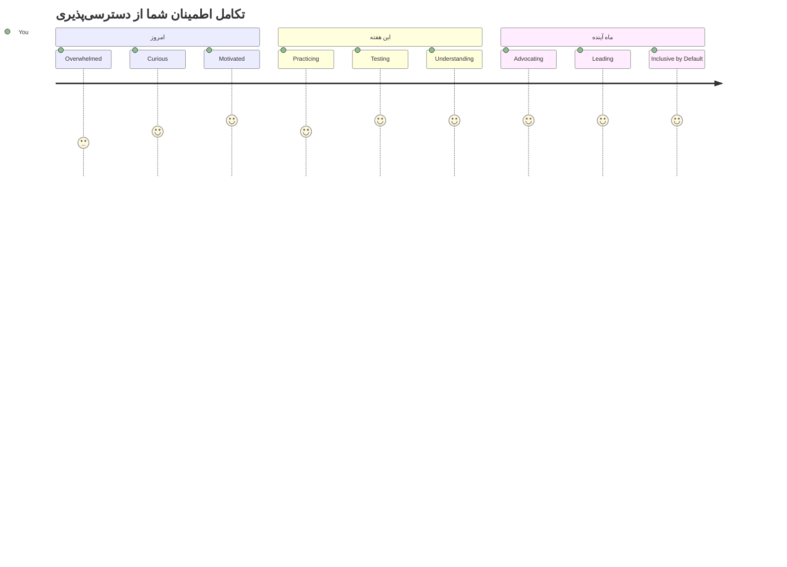
> 🌍 **شما اکنون یک قهرمان دسترس‌پذیری هستید!** شما درک می‌کنید که تجربه‌های وب عالی برای همه کار می‌کند، صرف‌نظر از اینکه چگونه به وب دسترسی دارند. هر ویژگی دسترس‌پذیری که می‌سازید اینترنت را فراگیرتر می‌کند. وب به توسعه‌دهندگانی مانند شما نیاز دارد که دسترس‌پذیری را محدودیت نمی‌بینند، بلکه فرصتی برای خلق تجربه‌های بهتر برای همه کاربران می‌دانند. خوش آمدید به این جنبش! 🎉

---

<!-- CO-OP TRANSLATOR DISCLAIMER START -->
**سلب مسئولیت**:
این سند با استفاده از سرویس ترجمه هوش مصنوعی [Co-op Translator](https://github.com/Azure/co-op-translator) ترجمه شده است. در حالی که ما در تلاش برای دقت هستیم، لطفاً توجه داشته باشید که ترجمه‌های خودکار ممکن است حاوی اشتباهات یا نواقصی باشند. سند اصلی به زبان بومی خود باید به عنوان منبع معتبر در نظر گرفته شود. برای اطلاعات حیاتی، توصیه می‌شود از ترجمه حرفه‌ای انسانی استفاده شود. ما مسئول هیچ گونه سوءتفاهم یا تفسیر نادرست ناشی از استفاده از این ترجمه نیستیم.
<!-- CO-OP TRANSLATOR DISCLAIMER END -->