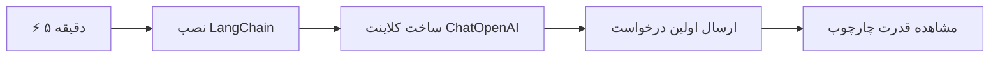
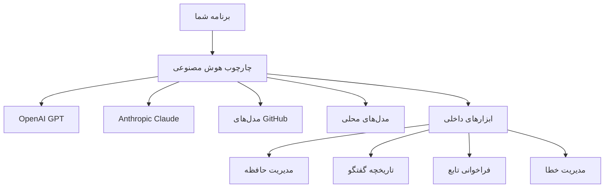
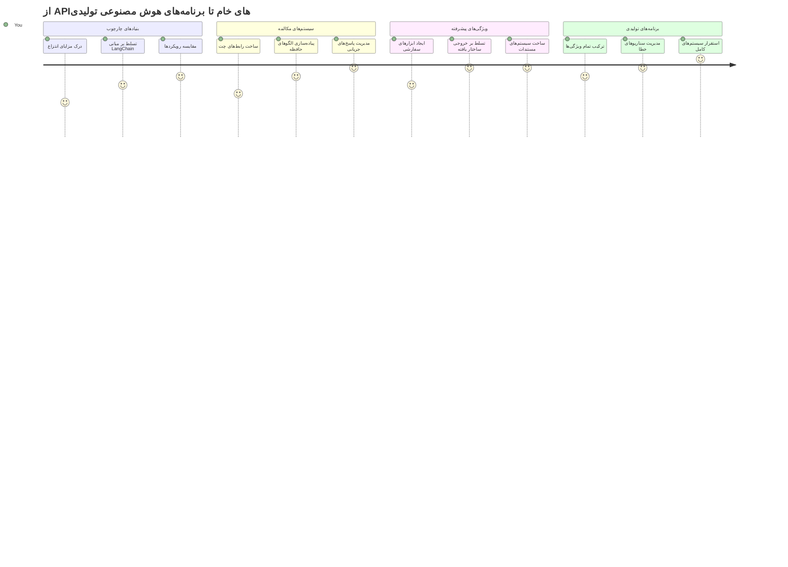
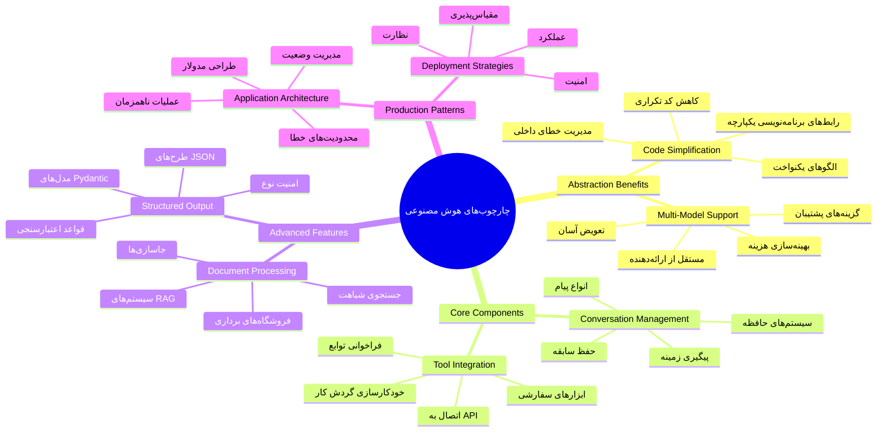
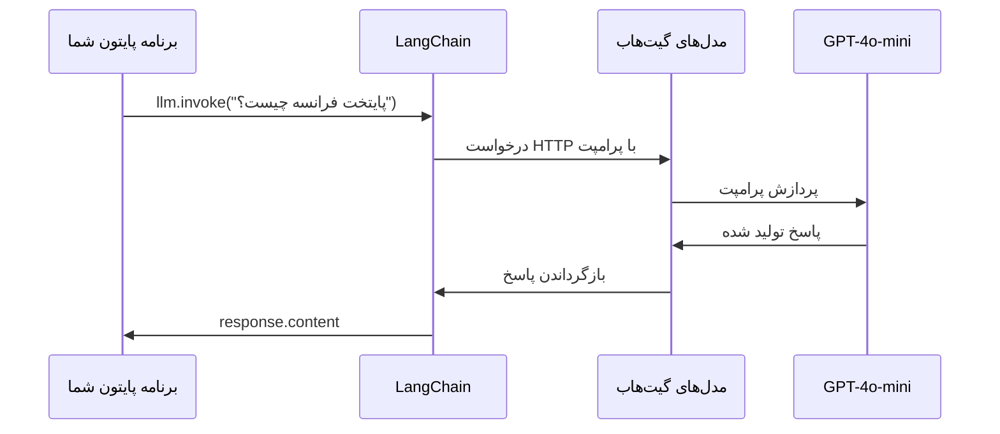
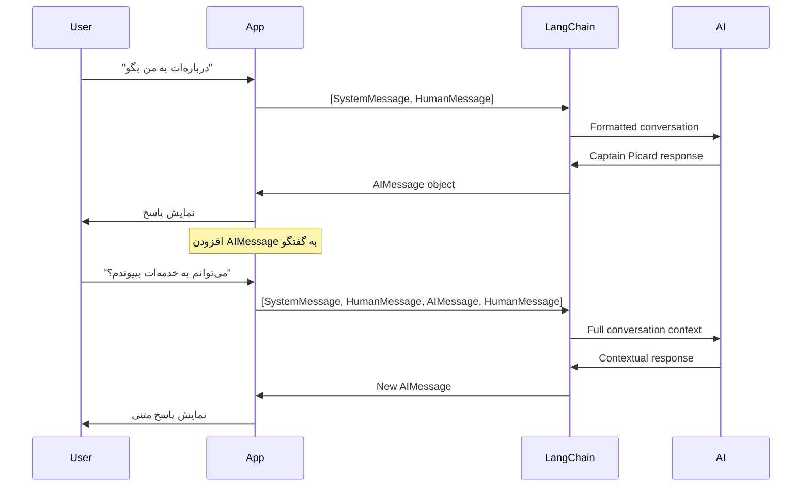
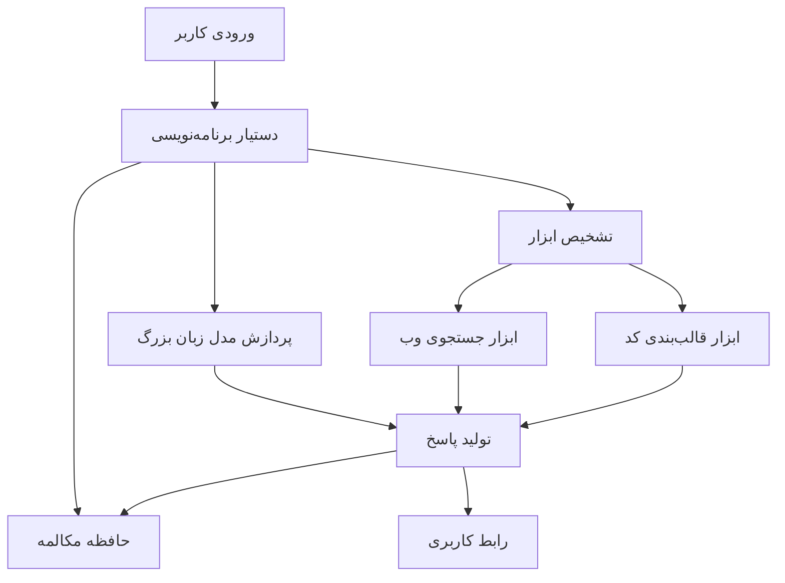
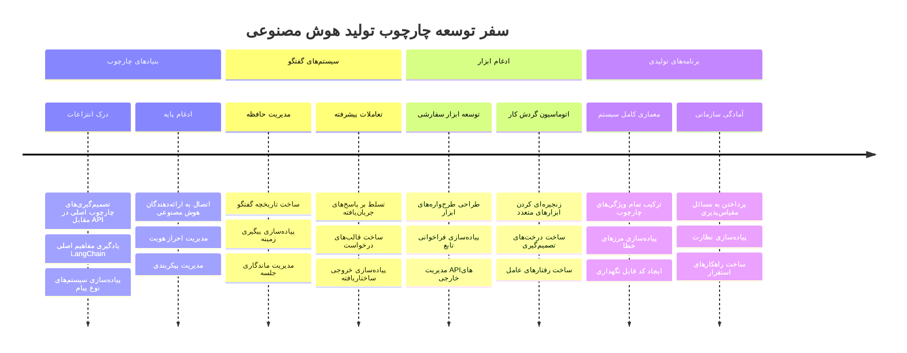
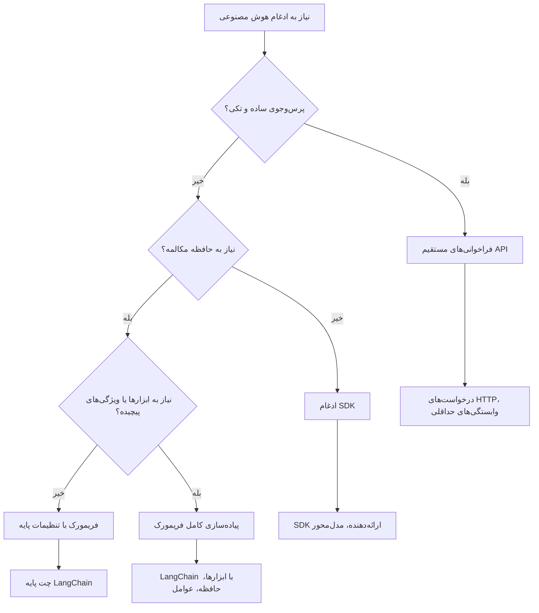

# چارچوب هوش مصنوعی

هرگز احساس کرده‌اید که ساخت برنامه‌های هوش مصنوعی از ابتدا شما را دچار سردرگمی کرده؟ شما تنها نیستید! چارچوب‌های هوش مصنوعی مانند یک چاقوی سوئیسی برای توسعه هوش مصنوعی هستند - ابزارهای قدرتمندی که می‌توانند در ساخت برنامه‌های هوشمند وقت شما را صرفه‌جویی کنند و از سردرد جلوگیری کنند. چارچوب هوش مصنوعی را مانند یک کتابخانه منظم در نظر بگیرید: این چارچوب‌ها اجزای از پیش ساخته شده، APIهای استاندارد و تجریدهای هوشمند را ارائه می‌دهند تا شما بتوانید بر حل مسائل تمرکز کنید به جای درگیر شدن با جزئیات پیاده‌سازی.

در این درس، ما بررسی خواهیم کرد که چگونه چارچوب‌هایی مانند LangChain می‌توانند کارهای پیچیده گذشته در ادغام هوش مصنوعی را به کدهایی تمیز و قابل خواندن تبدیل کنند. شما یاد خواهید گرفت چگونه با چالش‌های واقعی مانند دنبال کردن مکالمات، پیاده‌سازی فراخوانی ابزارها و مدیریت مدل‌های مختلف هوش مصنوعی از طریق یک رابط واحد مقابله کنید.

تا پایان این درس، خواهید دانست چه زمانی باید به سراغ چارچوب‌ها بروید به جای استفاده مستقیم از API خام، چگونه از تجریدهای آن‌ها به درستی استفاده کنید، و چطور برنامه‌های هوش مصنوعی بسازید که آماده استفاده واقعی باشند. بیایید ببینیم چارچوب‌های هوش مصنوعی چه کاری برای پروژه‌های شما انجام می‌دهند.

## ⚡ کاری که می‌توانید در ۵ دقیقه آینده انجام دهید

**مسیر شروع سریع برای توسعه‌دهندگان پرمشغله**


- **دقیقه ۱**: نصب LangChain: `pip install langchain langchain-openai`
- **دقیقه ۲**: راه‌اندازی توکن GitHub و وارد کردن کلاینت ChatOpenAI
- **دقیقه ۳**: ایجاد یک مکالمه ساده با پیام‌های سیستم و انسان
- **دقیقه ۴**: افزودن یک ابزار ساده (مثل تابع جمع) و مشاهده فراخوانی ابزار هوش مصنوعی
- **دقیقه ۵**: تجربه تفاوت بین تماس‌های API خام و تجرید چارچوب

**کد آزمایشی سریع**:
```python
from langchain_openai import ChatOpenAI
from langchain_core.messages import SystemMessage, HumanMessage

llm = ChatOpenAI(
    api_key=os.environ["GITHUB_TOKEN"],
    base_url="https://models.github.ai/inference",
    model="openai/gpt-4o-mini"
)

response = llm.invoke([
    SystemMessage(content="You are a helpful coding assistant"),
    HumanMessage(content="Explain Python functions briefly")
])
print(response.content)
```

**چرا این مهم است**: در ۵ دقیقه، تجربه خواهید کرد که چگونه چارچوب‌های هوش مصنوعی ادغام‌های پیچیده را به تماس‌های ساده متد تبدیل می‌کنند. این پایه‌ای است که برنامه‌های هوش مصنوعی تولیدی را پشتیبانی می‌کند.

## چرا یک چارچوب انتخاب کنیم؟

شما آماده هستید تا یک برنامه هوش مصنوعی بسازید - عالی! اما قضیه این است: چند مسیر مختلف پیش روی شماست که هر کدام مزایا و معایب خاص خود را دارند. این موضوع شبیه انتخاب بین پیاده‌روی، دوچرخه‌سواری یا رانندگی برای رسیدن به جایی است - هر کدام شما را به مقصد می‌رسانند، اما تجربه (و تلاش) کاملاً متفاوت خواهد بود.

بیایید سه راه اصلی ادغام هوش مصنوعی در پروژه‌هایتان را بررسی کنیم:

| روش | مزایا | بهترین گزینه برای | ملاحظات |
|----------|------------|----------|--------------|
| **درخواست‌های مستقیم HTTP** | کنترل کامل، بدون وابستگی | پرس‌وجوهای ساده، یادگیری مبانی | کد verbose بیشتر، مدیریت خطای دستی |
| **ادغام SDK** | کد کمتر، بهینه‌سازی مخصوص مدل | برنامه‌های تک مدل | محدود به ارائه‌دهندگان خاص |
| **چارچوب‌های هوش مصنوعی** | API یکپارچه، تجریدهای ساخته شده | برنامه‌های چندمدلی، جریان‌های کاری پیچیده | منحنی یادگیری، احتمال تجرید بیش از حد |

### مزایای چارچوب‌ها در عمل


**چرا چارچوب‌ها اهمیت دارند:**
- **یکپارچه‌سازی** چندین ارائه‌دهنده هوش مصنوعی تحت یک رابط
- **مدیریت خودکار** حافظه مکالمه
- **ارائه** ابزارهای آماده برای کارهای رایج مانند جاسازی‌ها و فراخوانی توابع
- **مدیریت** خطاها و منطق تکرار
- **تبدیل** جریان‌های کاری پیچیده به تماس‌های متد قابل خواندن

> 💡 **نکته حرفه‌ای**: هنگام جابجایی بین مدل‌های مختلف هوش مصنوعی یا ساخت ویژگی‌های پیچیده مانند عامل‌ها، حافظه یا فراخوانی ابزارها، از چارچوب‌ها استفاده کنید. هنگام یادگیری مبانی یا ساخت برنامه‌های ساده و متمرکز روی APIهای مستقیم بمانید.

**جمع‌بندی**: مانند انتخاب بین ابزارهای تخصصی یک صنعتگر و یک کارگاه کامل، موضوع تطبیق ابزار با کار است. چارچوب‌ها برای برنامه‌های پیچیده و ویژگی‌دار عالی عمل می‌کنند، در حالی که APIهای مستقیم برای موارد استفاده ساده بسیار خوب‌اند.

## 🗺️ سفر یادگیری شما در تسلط بر چارچوب هوش مصنوعی


**مقصد سفر شما**: تا پایان این درس، در توسعه چارچوب‌های هوش مصنوعی مهارت خواهید داشت و قادر خواهید بود برنامه‌های هوش مصنوعی پیچیده و تولیدی بسازید که با دستیارهای هوش مصنوعی تجاری رقابت می‌کنند.

## مقدمه

در این درس، یاد می‌گیریم:

- استفاده از یک چارچوب رایج هوش مصنوعی.
- پرداختن به مشکلات رایج مانند مکالمات چت، استفاده از ابزار، حافظه و زمینه.
- بهره‌گیری از این موارد برای ساخت برنامه‌های هوش مصنوعی.

## 🧠 اکوسیستم توسعه چارچوب هوش مصنوعی


**اصل اساسی**: چارچوب‌های هوش مصنوعی پیچیدگی را تجرید می‌کنند در حالی که تجریدهای قدرتمندی برای مدیریت مکالمه، ادغام ابزار و پردازش اسناد ارائه می‌دهند، که به توسعه‌دهندگان امکان ساخت برنامه‌های هوش مصنوعی پیچیده با کد تمیز و قابل نگهداری را می‌دهد.

## اولین درخواست هوش مصنوعی شما

بیایید با اصول شروع کنیم و اولین برنامه هوش مصنوعی خود را بسازیم که یک سوال می‌فرستد و پاسخ دریافت می‌کند. مانند ارشمیدس که اصل جابجایی را در حمام خود کشف کرد، گاهی ساده‌ترین مشاهدات مؤثرترین بینش‌ها را به همراه دارند - و چارچوب‌ها این بینش‌ها را قابل دسترس می‌کنند.

### راه‌اندازی LangChain با مدل‌های GitHub

ما از LangChain برای اتصال به مدل‌های GitHub استفاده خواهیم کرد، که این بسیار عالی است زیرا دسترسی رایگان به مدل‌های مختلف هوش مصنوعی را فراهم می‌کند. بهترین قسمت؟ تنها چند پارامتر پیکربندی ساده نیاز دارید برای شروع:

```python
from langchain_openai import ChatOpenAI
import os

llm = ChatOpenAI(
    api_key=os.environ["GITHUB_TOKEN"],
    base_url="https://models.github.ai/inference",
    model="openai/gpt-4o-mini",
)

# ارسال یک درخواست ساده
response = llm.invoke("What's the capital of France?")
print(response.content)
```

**بیایید بفهمیم چه اتفاقی می‌افتد:**
- **یک کلاینت LangChain** با استفاده از کلاس `ChatOpenAI` ایجاد می‌کند - این دروازه شما به هوش مصنوعی است!
- **ارتباط با مدل‌های GitHub** را با توکن احراز هویت شما پیکربندی می‌کند
- **مدل هوش مصنوعی مورد استفاده** را تعیین می‌کند (`gpt-4o-mini`) - به آن مانند انتخاب دستیار هوش مصنوعی خود فکر کنید
- **سوال شما را با روش `invoke()` می‌فرستد** - اینجاست که جادو اتفاق می‌افتد
- **پاسخ را استخراج و نمایش می‌دهد** - و voilà، شما با هوش مصنوعی گفتگو می‌کنید!

> 🔧 **یادداشت راه‌اندازی**: اگر از GitHub Codespaces استفاده می‌کنید، خوش‌شانسید - `GITHUB_TOKEN` قبلاً برای شما تنظیم شده است! اگر به صورت محلی کار می‌کنید؟ نگران نباشید، فقط باید یک توکن دسترسی شخصی با مجوزهای مناسب بسازید.

**خروجی مورد انتظار:**
```text
The capital of France is Paris.
```


## ساخت هوش مصنوعی مکالمه‌ای

مثال اول اصول را نشان می‌دهد، اما فقط یک تبادل است - شما سوال می‌پرسید، پاسخ دریافت می‌کنید و مقاله تمام می‌شود. در برنامه‌های واقعی، می‌خواهید هوش مصنوعی شما آنچه را که در گفتگو گفته شده است به خاطر بسپارد، مانند اینکه واتسون و هولمز چگونه مکالمات تحقیقی خود را در طول زمان ساختند.

اینجاست که LangChain به شکل ویژه‌ای مفید می‌شود. این چارچوب انواع پیام‌های مختلفی را ارائه می‌دهد که ساختاردهی مکالمات را کمک می‌کند و به شما اجازه می‌دهد به هوش مصنوعی خود شخصیت بدهید. شما تجربه‌های چتی خواهید ساخت که زمینه و شخصیت را حفظ کنند.

### درک انواع پیام‌ها

انواع پیام‌ها را می‌توانید مثل "کلاه‌های" مختلفی که شرکت‌کنندگان در یک مکالمه می‌گذارند در نظر بگیرید. LangChain از کلاس‌های پیام مختلف برای ردیابی اینکه چه کسی چه می‌گوید استفاده می‌کند:

| نوع پیام | هدف | نمونه کاربرد |
|--------------|---------|------------------|
| `SystemMessage` | تعریف شخصیت و رفتار هوش مصنوعی | "تو یک دستیار کدنویسی کمک‌کننده هستی" |
| `HumanMessage` | نشان‌دهنده ورودی کاربر | "توضیح بده توابع چگونه کار می‌کنند" |
| `AIMessage` | ذخیره پاسخ‌های هوش مصنوعی | پاسخ‌های قبلی هوش مصنوعی در مکالمه |

### ایجاد اولین مکالمه خود

بیایید یک مکالمه ایجاد کنیم که هوش مصنوعی نقش مشخصی را ایفا کند. آن را یک شخصیت کاپیتان پیکارد می‌کنیم - شخصیتی که به خاطر خرد دیپلماتیک و رهبری‌اش شناخته شده است:

```python
messages = [
    SystemMessage(content="You are Captain Picard of the Starship Enterprise"),
    HumanMessage(content="Tell me about you"),
]
```

**توضیح تنظیمات این مکالمه:**
- **نقش و شخصیت هوش مصنوعی را با `SystemMessage` تعیین می‌کند**
- **پرسش اولیه کاربر را با `HumanMessage` ارائه می‌دهد**
- **پایه‌ای برای مکالمه چند نوبتی ایجاد می‌کند**

کد کامل این مثال به شکل زیر است:

```python
from langchain_core.messages import HumanMessage, SystemMessage
from langchain_openai import ChatOpenAI
import os

llm = ChatOpenAI(
    api_key=os.environ["GITHUB_TOKEN"],
    base_url="https://models.github.ai/inference",
    model="openai/gpt-4o-mini",
)

messages = [
    SystemMessage(content="You are Captain Picard of the Starship Enterprise"),
    HumanMessage(content="Tell me about you"),
]


# کار می‌کند
response  = llm.invoke(messages)
print(response.content)
```

شما باید نتیجه‌ای مشابه را مشاهده کنید:

```text
I am Captain Jean-Luc Picard, the commanding officer of the USS Enterprise (NCC-1701-D), a starship in the United Federation of Planets. My primary mission is to explore new worlds, seek out new life and new civilizations, and boldly go where no one has gone before. 

I believe in the importance of diplomacy, reason, and the pursuit of knowledge. My crew is diverse and skilled, and we often face challenges that test our resolve, ethics, and ingenuity. Throughout my career, I have encountered numerous species, grappled with complex moral dilemmas, and have consistently sought peaceful solutions to conflicts.

I hold the ideals of the Federation close to my heart, believing in the importance of cooperation, understanding, and respect for all sentient beings. My experiences have shaped my leadership style, and I strive to be a thoughtful and just captain. How may I assist you further?
```

برای حفظ تداوم مکالمه (به جای تنظیم مجدد زمینه هر بار)، باید پاسخ‌ها را به لیست پیام‌های خود اضافه کنید. مانند سنت‌های شفاهی که داستان‌ها را در نسل‌ها حفظ می‌کرد، این روش حافظه پایداری می‌سازد:

```python
from langchain_core.messages import HumanMessage, SystemMessage
from langchain_openai import ChatOpenAI
import os

llm = ChatOpenAI(
    api_key=os.environ["GITHUB_TOKEN"],
    base_url="https://models.github.ai/inference",
    model="openai/gpt-4o-mini",
)

messages = [
    SystemMessage(content="You are Captain Picard of the Starship Enterprise"),
    HumanMessage(content="Tell me about you"),
]


# کار می‌کند
response  = llm.invoke(messages)

print(response.content)

print("---- Next ----")

messages.append(response)
messages.append(HumanMessage(content="Now that I know about you, I'm Chris, can I be in your crew?"))

response  = llm.invoke(messages)

print(response.content)

```

خیلی جالب است، درست است؟ آنچه اینجا اتفاق می‌افتد این است که ما دو بار LLM را فراخوانی می‌کنیم - ابتدا فقط با دو پیام اولیه ما، سپس با کل تاریخچه مکالمه. این مانند این است که هوش مصنوعی واقعاً همراه با گفتگوی ما دنبال می‌کند!

وقتی این کد را اجرا کنید، پاسخ دومی خواهید گرفت که شبیه به این است:

```text
Welcome aboard, Chris! It's always a pleasure to meet those who share a passion for exploration and discovery. While I cannot formally offer you a position on the Enterprise right now, I encourage you to pursue your aspirations. We are always in need of talented individuals with diverse skills and backgrounds. 

If you are interested in space exploration, consider education and training in the sciences, engineering, or diplomacy. The values of curiosity, resilience, and teamwork are crucial in Starfleet. Should you ever find yourself on a starship, remember to uphold the principles of the Federation: peace, understanding, and respect for all beings. Your journey can lead you to remarkable adventures, whether in the stars or on the ground. Engage!
```


من این را به عنوان یک «شاید» می‌پذیرم ;)

## پاسخ‌های جریانی (Streaming)

تا به حال دیده‌اید که ChatGPT پاسخ‌هایش را به صورت "تایپ" شده و همزمان نشان می‌دهد؟ این همان جریان است. مثل تماشای یک خوش‌نویس ماهر - دیدن حروفی که به تدریج ظاهر می‌شوند به جای شکل‌گیری فوری - جریان باعث می‌شود تعامل طبیعی‌تر به نظر برسد و بازخورد فوری فراهم کند.

### پیاده‌سازی جریان با LangChain

```python
from langchain_openai import ChatOpenAI
import os

llm = ChatOpenAI(
    api_key=os.environ["GITHUB_TOKEN"],
    base_url="https://models.github.ai/inference",
    model="openai/gpt-4o-mini",
    streaming=True
)

# پاسخ را به صورت جریان ارسال کنید
for chunk in llm.stream("Write a short story about a robot learning to code"):
    print(chunk.content, end="", flush=True)
```

**چرا جریان عالی است:**
- **محتوا را همان طور که ساخته می‌شود نمایش می‌دهد** - دیگر نیازی به انتظار ناگهانی نیست!
- **به کاربران حس می‌دهد که چیزی واقعاً در جریان است**
- **احساس می‌کند سریع‌تر است، حتی زمانی که از نظر فنی نیست**
- **اجازه می‌دهد کاربران در حالی که هوش مصنوعی هنوز "فکر می‌کند" شروع به خواندن کنند**

> 💡 **نکته تجربه کاربری**: جریان وقتی واقعاً می‌درخشد که پاسخ‌های طولانی مانند توضیح کد، نوشتن خلاقانه یا آموزش‌های دقیق دارید. کاربران شما دیدن پیشرفت را به جای نگاه کردن به صفحه سفید دوست خواهند داشت!

### 🎯 بررسی آموزشی: مزایای تجرید چارچوب

**توقف و تفکر**: شما همین حالا قدرت تجریدهای چارچوب هوش مصنوعی را تجربه کرده‌اید. آنچه یاد گرفته‌اید را با تماس‌های API خام در درس‌های قبلی مقایسه کنید.

**ارزیابی سریع خود:**
- می‌توانید توضیح دهید چگونه LangChain مدیریت مکالمه را نسبت به ردیابی دستی پیام‌ها ساده می‌کند؟
- تفاوت بین متدهای `invoke()` و `stream()` چیست و چه زمانی هر کدام را استفاده می‌کنید؟
- چگونه سیستم نوع پیام چارچوب سازماندهی کد را بهبود می‌بخشد؟

**اتصال دنیای واقعی**: الگوهای تجریدی که یاد گرفته‌اید (انواع پیام، رابط‌های جریانی، حافظه مکالمه) در هر برنامه هوش مصنوعی مهم استفاده می‌شوند - از رابط ChatGPT تا کمک‌کننده کد GitHub Copilot. شما همان الگوهای معماری را که تیم‌های حرفه‌ای توسعه هوش مصنوعی استفاده می‌کنند، فرا می‌گیرید.

**سؤال چالش‌برانگیز**: چگونه یک تجرید چارچوب طراحی می‌کنید برای مدیریت ارائه‌دهندگان مختلف مدل هوش مصنوعی (OpenAI، Anthropic، Google) با یک رابط واحد؟ مزایا و معایب را در نظر بگیرید.

## قالب‌های درخواست (Prompt templates)

قالب‌های درخواست مانند ساختارهای بلاغی استفاده شده در خطابه‌های کلاسیک هستند - مانند سیسرو که الگوهای سخنرانی خود را برای مخاطبان مختلف تنظیم می‌کرد در حالی که چارچوب قانع‌کننده را حفظ می‌کرد. آن‌ها به شما اجازه می‌دهند درخواست‌هایی قابل استفاده مجدد بسازید که قطعات مختلف اطلاعات را می‌توانید بدون بازنویسی کل چیزها عوض کنید. یک بار قالب را تنظیم کنید، سپس فقط متغیرها را با هر مقداری که لازم دارید پر کنید.

### ایجاد درخواست‌های قابل استفاده مجدد

```python
from langchain_core.prompts import ChatPromptTemplate

# یک قالب برای توضیحات کد تعریف کنید
template = ChatPromptTemplate.from_messages([
    ("system", "You are an expert programming instructor. Explain concepts clearly with examples."),
    ("human", "Explain {concept} in {language} with a practical example for {skill_level} developers")
])

# از قالب با مقادیر مختلف استفاده کنید
questions = [
    {"concept": "functions", "language": "JavaScript", "skill_level": "beginner"},
    {"concept": "classes", "language": "Python", "skill_level": "intermediate"},
    {"concept": "async/await", "language": "JavaScript", "skill_level": "advanced"}
]

for question in questions:
    prompt = template.format_messages(**question)
    response = llm.invoke(prompt)
    print(f"Topic: {question['concept']}\n{response.content}\n---\n")
```

**چرا استفاده از قالب‌ها را دوست خواهید داشت:**
- **درخواست‌های شما را در کل برنامه یکسان نگه می‌دارد**
- **دیگر نیازی به الحاق رشته‌های شلوغ نیست - فقط متغیرهای تمیز و ساده**
- **هوش مصنوعی شما رفتار پیش‌بینی‌پذیری دارد چون ساختار ثابت است**
- **به‌روزرسانی‌ها آسان است - یک بار قالب را تغییر دهید، در همه جای برنامه اصلاح می‌شود**

## خروجی ساختاریافته

تا به حال در تلاش برای تجزیه پاسخ‌های هوش مصنوعی که به صورت متن بدون ساختار برمی‌گردند، ناامید شده‌اید؟ خروجی ساختاریافته مانند آموزش دادن به هوش مصنوعی است برای پیروی از رویکردی سیستماتیک که لینائوس برای طبقه‌بندی زیستی استفاده کرد - منظم، قابل پیش‌بینی و آسان برای کار. شما می‌توانید فرمت JSON، ساختار داده خاص یا هر قالبی که نیاز دارید درخواست کنید.

### تعریف طرح‌های خروجی

```python
from langchain_core.prompts import ChatPromptTemplate
from langchain_core.output_parsers import JsonOutputParser
from pydantic import BaseModel, Field

class CodeReview(BaseModel):
    score: int = Field(description="Code quality score from 1-10")
    strengths: list[str] = Field(description="List of code strengths")
    improvements: list[str] = Field(description="List of suggested improvements")
    overall_feedback: str = Field(description="Summary feedback")

# تنظیم پارسر
parser = JsonOutputParser(pydantic_object=CodeReview)

# ایجاد پرامپت با دستورالعمل‌های قالب‌بندی
prompt = ChatPromptTemplate.from_messages([
    ("system", "You are a code reviewer. {format_instructions}"),
    ("human", "Review this code: {code}")
])

# قالب‌بندی پرامپت با دستورالعمل‌ها
chain = prompt | llm | parser

# دریافت پاسخ ساخت‌یافته
code_sample = """
def calculate_average(numbers):
    return sum(numbers) / len(numbers)
"""

result = chain.invoke({
    "code": code_sample,
    "format_instructions": parser.get_format_instructions()
})

print(f"Score: {result['score']}")
print(f"Strengths: {', '.join(result['strengths'])}")
```

**چرا خروجی ساختاریافته تحول‌آفرین است:**
- **دیگر نیازی به حدس زدن فرمت خروجی ندارید - هر بار ثابت است**
- **مستقیماً به پایگاه‌های داده و APIها وصل می‌شود بدون کار اضافی**
- **پاسخ‌های عجیب و غریب هوش مصنوعی را قبل از شکستن برنامه می‌گیرد**
- **کد شما تمیزتر می‌شود چون دقیقاً می‌دانید با چه چیزی کار می‌کنید**

## فراخوانی ابزار

حالا به یکی از قدرتمندترین ویژگی‌ها می‌رسیم: ابزارها. این روشی است که به هوش مصنوعی قابلیت‌های عملی فراتر از مکالمه می‌دهید. درست مانند اتحادیه‌های قرون وسطی که ابزارهای تخصصی برای صنایع خاص توسعه دادند، شما می‌توانید هوش مصنوعی را با ابزارهای متمرکز مجهز کنید. شما توصیف می‌کنید چه ابزارهایی موجود است، و وقتی کسی چیزی که با آن تطابق دارد درخواست می‌کند، هوش مصنوعی شما می‌تواند اقدام کند.

### استفاده از پایتون

بیایید ابزارهایی مانند زیر اضافه کنیم:

```python
from typing_extensions import Annotated, TypedDict

class add(TypedDict):
    """Add two integers."""

    # توضیحات باید نوع را داشته باشند و می‌توانند به‌طور اختیاری یک مقدار پیش‌فرض و توضیح (به همان ترتیب) را شامل شوند.
    a: Annotated[int, ..., "First integer"]
    b: Annotated[int, ..., "Second integer"]

tools = [add]

functions = {
    "add": lambda a, b: a + b
}
```

پس اینجا چه اتفاقی می‌افتد؟ ما یک نقشه برای ابزاری به نام `add` می‌سازیم. با ارث‌بری از `TypedDict` و استفاده از انواع متنوع `Annotated` برای `a` و `b`، به LLM تصویر واضحی از اینکه این ابزار چه کار می‌کند و چه نیاز دارد، می‌دهیم. دیکشنری `functions` مانند جعبه ابزار ما است - دقیقا به کدمان می‌گوید وقتی هوش مصنوعی تصمیم دارد از یک ابزار خاص استفاده کند چه کاری انجام دهد.

حالا ببینیم چگونه این ابزار را با LLM فراخوانی می‌کنیم:

```python
llm = ChatOpenAI(
    api_key=os.environ["GITHUB_TOKEN"],
    base_url="https://models.github.ai/inference",
    model="openai/gpt-4o-mini",
)

llm_with_tools = llm.bind_tools(tools)
```

اینجا `bind_tools` را با آرایه `tools` خود فراخوانی می‌کنیم و بنابراین LLM جدید `llm_with_tools` اکنون دانش این ابزار را دارد.

برای استفاده از این LLM جدید، می‌توانیم کد زیر را تایپ کنیم:

```python
query = "What is 3 + 12?"

res = llm_with_tools.invoke(query)
if(res.tool_calls):
    for tool in res.tool_calls:
        print("TOOL CALL: ", functions[tool["name"]](../../../10-ai-framework-project/**tool["args"]))
print("CONTENT: ",res.content)
```

حالا که روی این llm جدید ای که ابزار دارد، `invoke` را فراخوانی می‌کنیم، ممکن است ویژگی `tool_calls` پر شده باشد. اگر چنین است، هر ابزاری که شناسایی شده نام (`name`) و آرگومان‌هایی (`args`) دارد که مشخص می‌کند چه ابزاری باید فراخوانی شود و با چه آرگومان‌هایی. کد کامل به این صورت است:

```python
from langchain_core.messages import HumanMessage, SystemMessage
from langchain_openai import ChatOpenAI
import os
from typing_extensions import Annotated, TypedDict

class add(TypedDict):
    """Add two integers."""

    # یادداشت‌ها باید نوع داشته باشند و می توانند به طور اختیاری شامل مقدار پیش فرض و توضیح (به همان ترتیب) باشند.
    a: Annotated[int, ..., "First integer"]
    b: Annotated[int, ..., "Second integer"]

tools = [add]

functions = {
    "add": lambda a, b: a + b
}

llm = ChatOpenAI(
    api_key=os.environ["GITHUB_TOKEN"],
    base_url="https://models.github.ai/inference",
    model="openai/gpt-4o-mini",
)

llm_with_tools = llm.bind_tools(tools)

query = "What is 3 + 12?"

res = llm_with_tools.invoke(query)
if(res.tool_calls):
    for tool in res.tool_calls:
        print("TOOL CALL: ", functions[tool["name"]](../../../10-ai-framework-project/**tool["args"]))
print("CONTENT: ",res.content)
```

اجرای این کد، باید خروجی مشابه مشاهده کنید:

```text
TOOL CALL:  15
CONTENT: 
```

هوش مصنوعی جمله "What is 3 + 12" را بررسی کرده و آن را به عنوان وظیفه‌ای برای ابزار `add` تشخیص داده است. درست مانند یک کتابدار ماهر که می‌داند بر اساس نوع سوال کدام مرجع را بررسی کند، این تشخیص را از نام، توضیحات و مشخصات فیلدهای ابزار گرفته است. نتیجه ۱۵ از اجرای ابزار در دیکشنری `functions` ما ناشی می‌شود:

```python
print("TOOL CALL: ", functions[tool["name"]](../../../10-ai-framework-project/**tool["args"]))
```

### یک ابزار جالب‌تر که به یک API وب فراخوانی می‌کند
اضافه کردن اعداد مفهوم را نشان می‌دهد، اما ابزارهای واقعی معمولاً عملیات‌های پیچیده‌تری انجام می‌دهند، مانند فراخوانی وب APIها. بیایید مثال خود را گسترش دهیم تا هوش مصنوعی بتواند محتوا را از اینترنت دریافت کند - مشابه روشی که اپراتورهای تلگراف زمانی مکان‌های دور را به هم متصل می‌کردند:

```python
class joke(TypedDict):
    """Tell a joke."""

    # حاشیه‌نویسی‌ها باید نوع داشته باشند و می‌توانند به طور اختیاری شامل مقدار پیش‌فرض و توضیح باشند (به همان ترتیب).
    category: Annotated[str, ..., "The joke category"]

def get_joke(category: str) -> str:
    response = requests.get(f"https://api.chucknorris.io/jokes/random?category={category}", headers={"Accept": "application/json"})
    if response.status_code == 200:
        return response.json().get("value", f"Here's a {category} joke!")
    return f"Here's a {category} joke!"

functions = {
    "add": lambda a, b: a + b,
    "joke": lambda category: get_joke(category)
}

query = "Tell me a joke about animals"

# بقیه کد همان است
```

حالا اگر این کد را اجرا کنید، پاسخی دریافت خواهید کرد که چیزی شبیه به این است:

```text
TOOL CALL:  Chuck Norris once rode a nine foot grizzly bear through an automatic car wash, instead of taking a shower.
CONTENT:  
```

```mermaid
flowchart TD
    A[جستجوی کاربر: "برایم یک جوک درباره حیوانات تعریف کن"] --> B[تحلیل LangChain]
    B --> C{آیا ابزار موجود است؟}
    C -->|بله| D[انتخاب ابزار جوک]
    C -->|خیر| E[تولید پاسخ مستقیم]
    
    D --> F[استخراج پارامترها]
    F --> G[فراخوانی جوک(دسته‌بندی="حیوانات")]
    G --> H[درخواست API به chucknorris.io]
    H --> I[بازگرداندن محتوای جوک]
    I --> J[نمایش به کاربر]
    
    E --> K[پاسخ تولید شده توسط هوش مصنوعی]
    K --> J
    
    subgraph "لایه تعریف ابزار"
        L[طرح TypedDict]
        M[پیاده‌سازی تابع]
        N[اعتبارسنجی پارامترها]
    end
    
    D --> L
    F --> N
    G --> M
```
در اینجا کل کد را مشاهده می‌کنید:

```python
from langchain_openai import ChatOpenAI
import requests
import os
from typing_extensions import Annotated, TypedDict

class add(TypedDict):
    """Add two integers."""

    # یادداشت‌ها باید نوع داشته باشند و می‌توانند به‌طور اختیاری شامل مقدار پیش‌فرض و توضیح باشند (به همان ترتیب).
    a: Annotated[int, ..., "First integer"]
    b: Annotated[int, ..., "Second integer"]

class joke(TypedDict):
    """Tell a joke."""

    # یادداشت‌ها باید نوع داشته باشند و می‌توانند به‌طور اختیاری شامل مقدار پیش‌فرض و توضیح باشند (به همان ترتیب).
    category: Annotated[str, ..., "The joke category"]

tools = [add, joke]

def get_joke(category: str) -> str:
    response = requests.get(f"https://api.chucknorris.io/jokes/random?category={category}", headers={"Accept": "application/json"})
    if response.status_code == 200:
        return response.json().get("value", f"Here's a {category} joke!")
    return f"Here's a {category} joke!"

functions = {
    "add": lambda a, b: a + b,
    "joke": lambda category: get_joke(category)
}

llm = ChatOpenAI(
    api_key=os.environ["GITHUB_TOKEN"],
    base_url="https://models.github.ai/inference",
    model="openai/gpt-4o-mini",
)

llm_with_tools = llm.bind_tools(tools)

query = "Tell me a joke about animals"

res = llm_with_tools.invoke(query)
if(res.tool_calls):
    for tool in res.tool_calls:
        # print("فراخوانی ابزار: ", tool)
        print("TOOL CALL: ", functions[tool["name"]](../../../10-ai-framework-project/**tool["args"]))
print("CONTENT: ",res.content)
```

## امبدینگ‌ها و پردازش اسناد

امبدینگ‌ها یکی از زیباترین راه‌حل‌ها در هوش مصنوعی مدرن هستند. تصور کنید که بتوانید هر قطعه متن را به مختصات عددی تبدیل کنید که معنای آن را در بر دارد. دقیقاً همین کار امبدینگ‌ها انجام می‌دهند - آنها متن را به نقاطی در فضای چندبعدی تبدیل می‌کنند که مفاهیم مشابه در کنار هم تجمع می‌کنند. این مثل داشتن یک سیستم مختصات برای ایده‌ها است، مشابه نحوه‌ای که مندلیف جدول تناوبی را بر اساس خواص اتمی سازماندهی کرد.

### ایجاد و استفاده از امبدینگ‌ها

```python
from langchain_openai import OpenAIEmbeddings
from langchain_community.vectorstores import FAISS
from langchain_community.document_loaders import TextLoader
from langchain.text_splitter import CharacterTextSplitter

# مقداردهی اولیه تعبیه‌ها
embeddings = OpenAIEmbeddings(
    api_key=os.environ["GITHUB_TOKEN"],
    base_url="https://models.github.ai/inference",
    model="text-embedding-3-small"
)

# بارگذاری و تقسیم اسناد
loader = TextLoader("documentation.txt")
documents = loader.load()

text_splitter = CharacterTextSplitter(chunk_size=1000, chunk_overlap=0)
texts = text_splitter.split_documents(documents)

# ایجاد فروشگاه برداری
vectorstore = FAISS.from_documents(texts, embeddings)

# انجام جستجوی شباهت
query = "How do I handle user authentication?"
similar_docs = vectorstore.similarity_search(query, k=3)

for doc in similar_docs:
    print(f"Relevant content: {doc.page_content[:200]}...")
```

### بارگذارهای اسناد برای فرمت‌های مختلف

```python
from langchain_community.document_loaders import (
    PyPDFLoader,
    CSVLoader,
    JSONLoader,
    WebBaseLoader
)

# بارگذاری انواع مختلف سندها
pdf_loader = PyPDFLoader("manual.pdf")
csv_loader = CSVLoader("data.csv")
json_loader = JSONLoader("config.json")
web_loader = WebBaseLoader("https://example.com/docs")

# پردازش همه سندها
all_documents = []
for loader in [pdf_loader, csv_loader, json_loader, web_loader]:
    docs = loader.load()
    all_documents.extend(docs)
```

**چه کاری می‌توانید با امبدینگ‌ها انجام دهید:**
- **ساختن** جستجویی که واقعاً معنای شما را درک کند، نه فقط تطبیق کلمات کلیدی
- **ایجاد** هوش مصنوعی که بتواند به سوالات درباره اسناد شما پاسخ دهد
- **ساختن** سیستم‌های توصیه‌گر که محتوای واقعاً مرتبط را پیشنهاد دهند
- **به‌صورت خودکار** سازماندهی و دسته‌بندی محتوای شما

```mermaid
flowchart LR
    A[اسناد] --> B[تقسیم‌کننده متن]
    B --> C[ایجاد جاسازی‌ها]
    C --> D[ذخیره‌سازی برداری]
    
    E[پرسش کاربر] --> F[جاسازی پرسش]
    F --> G[جستجوی تشابه]
    G --> D
    D --> H[اسناد مرتبط]
    H --> I[پاسخ هوش مصنوعی]
    
    subgraph "فضای برداری"
        J[سند A: [۰.۱، ۰.۸، ۰.۳...]]
        K[سند B: [۰.۲، ۰.۷، ۰.۴...]]
        L[پرسش: [۰.۱۵، ۰.۷۵، ۰.۳۵...]]
    end
    
    C --> J
    C --> K
    F --> L
    G --> J
    G --> K
```
## ساخت یک برنامه کامل هوش مصنوعی

حالا همه چیزهایی را که یاد گرفته‌اید در یک برنامه جامع ادغام می‌کنیم - یک دستیار برنامه‌نویسی که می‌تواند به سوالات پاسخ دهد، از ابزارها استفاده کند و حافظه مکالمه را حفظ کند. همانطور که چاپخانه، فناوری‌های موجود (حروف متحرک، جوهر، کاغذ و فشار) را در چیزی تحول‌آفرین ترکیب کرد، ما نیز اجزای هوش مصنوعی خود را به چیزی عملی و مفید تبدیل می‌کنیم.

### نمونه برنامه کامل

```python
from langchain_openai import ChatOpenAI, OpenAIEmbeddings
from langchain_core.prompts import ChatPromptTemplate
from langchain_core.messages import HumanMessage, SystemMessage, AIMessage
from langchain_community.vectorstores import FAISS
from typing_extensions import Annotated, TypedDict
import os
import requests

class CodingAssistant:
    def __init__(self):
        self.llm = ChatOpenAI(
            api_key=os.environ["GITHUB_TOKEN"],
            base_url="https://models.github.ai/inference",
            model="openai/gpt-4o-mini"
        )
        
        self.conversation_history = [
            SystemMessage(content="""You are an expert coding assistant. 
            Help users learn programming concepts, debug code, and write better software.
            Use tools when needed and maintain a helpful, encouraging tone.""")
        ]
        
        # تعریف ابزارها
        self.setup_tools()
    
    def setup_tools(self):
        class web_search(TypedDict):
            """Search for programming documentation or examples."""
            query: Annotated[str, "Search query for programming help"]
        
        class code_formatter(TypedDict):
            """Format and validate code snippets."""
            code: Annotated[str, "Code to format"]
            language: Annotated[str, "Programming language"]
        
        self.tools = [web_search, code_formatter]
        self.llm_with_tools = self.llm.bind_tools(self.tools)
    
    def chat(self, user_input: str):
        # افزودن پیام کاربر به گفتگو
        self.conversation_history.append(HumanMessage(content=user_input))
        
        # دریافت پاسخ هوش مصنوعی
        response = self.llm_with_tools.invoke(self.conversation_history)
        
        # رسیدگی به فراخوانی‌های ابزار در صورت وجود
        if response.tool_calls:
            for tool_call in response.tool_calls:
                tool_result = self.execute_tool(tool_call)
                print(f"🔧 Tool used: {tool_call['name']}")
                print(f"📊 Result: {tool_result}")
        
        # افزودن پاسخ هوش مصنوعی به گفتگو
        self.conversation_history.append(response)
        
        return response.content
    
    def execute_tool(self, tool_call):
        tool_name = tool_call['name']
        args = tool_call['args']
        
        if tool_name == 'web_search':
            return f"Found documentation for: {args['query']}"
        elif tool_name == 'code_formatter':
            return f"Formatted {args['language']} code: {args['code'][:50]}..."
        
        return "Tool execution completed"

# نمونه استفاده
assistant = CodingAssistant()

print("🤖 Coding Assistant Ready! Type 'quit' to exit.\n")

while True:
    user_input = input("You: ")
    if user_input.lower() == 'quit':
        break
    
    response = assistant.chat(user_input)
    print(f"🤖 Assistant: {response}\n")
```

**معماری برنامه:**


**ویژگی‌های کلیدی که پیاده‌سازی کرده‌ایم:**
- **حافظه** کل مکالمه شما را برای حفظ پیوستگی زمینه خاطردارد
- **انجام اعمال** از طریق فراخوانی ابزار، نه فقط مکالمه
- **دنبال کردن** الگوهای تعامل پیش‌بینی‌پذیر
- **مدیریت** خطاها و جریان‌های کاری پیچیده به‌صورت خودکار

### 🎯 بررسی آموزشی: معماری هوش مصنوعی در تولید

**درک معماری**: شما یک برنامه کامل هوش مصنوعی ساخته‌اید که مدیریت مکالمه، فراخوانی ابزار و جریان‌های کاری ساختار یافته را ترکیب می‌کند. این نمایانگر توسعه برنامه‌های هوش مصنوعی در سطح تولید است.

**مفاهیم کلیدی مسلط شده:**
- **معماری مبتنی بر کلاس**: ساختار منظم و قابل نگهداری برنامه‌های هوش مصنوعی
- **ادغام ابزار**: قابلیت‌های سفارشی فراتر از مکالمه
- **مدیریت حافظه**: حفظ زمینه مکالمه به صورت دائمی
- **مدیریت خطا**: رفتار برنامه‌ای مقاوم

**ارتباط با صنعت**: الگوهای معماری که پیاده‌سازی کرده‌اید (کلاس‌های مکالمه، سیستم‌های ابزار، مدیریت حافظه) همان الگوهایی هستند که در برنامه‌های هوش مصنوعی سازمانی مانند دستیار هوش مصنوعی Slack، GitHub Copilot و Microsoft Copilot استفاده می‌شوند. شما با تفکر معماری حرفه‌ای در حال ساخت هستید.

**سوال تفکری**: چگونه این برنامه را گسترش می‌دهید تا کاربران متعدد، ذخیره‌سازی ماندگار یا ادغام با پایگاه‌های داده خارجی را مدیریت کند؟ چالش‌های مقیاس‌پذیری و مدیریت وضعیت را در نظر بگیرید.

## تمرین: ساخت دستیار مطالعه مجهز به هوش مصنوعی

**هدف**: ساخت یک برنامه هوش مصنوعی که به دانش‌آموزان کمک کند مفاهیم برنامه‌نویسی را از طریق ارائه توضیحات، نمونه کد و آزمون‌های تعاملی یاد بگیرند.

### الزامات

**ویژگی‌های اصلی (الزامی):**
1. **رابط مکالمه‌ای**: پیاده‌سازی یک سیستم چت که زمینه را در چندین سوال حفظ کند
2. **ابزارهای آموزشی**: ایجاد حداقل دو ابزار که به یادگیری کمک کنند:
   - ابزار توضیح کد
   - تولیدکننده آزمون مفاهیم
3. **یادگیری شخصی‌سازی‌شده**: استفاده از پیام‌های سیستمی برای تطبیق پاسخ‌ها با سطوح مهارتی مختلف
4. **قالب‌بندی پاسخ**: پیاده‌سازی خروجی ساختار یافته برای سوالات آزمون

### مراحل پیاده‌سازی

**مرحله 1: راه‌اندازی محیط شما**
```bash
pip install langchain langchain-openai
```

**مرحله 2: عملکرد پایه چت**
- ایجاد کلاس `StudyAssistant`
- پیاده‌سازی حافظه مکالمه
- اضافه کردن پیکربندی شخصیت برای حمایت آموزشی

**مرحله 3: افزودن ابزارهای آموزشی**
- **توضیح‌دهنده کد**: کد را به بخش‌های قابل فهم تقسیم می‌کند
- **تولید کننده آزمون**: سوالاتی درباره مفاهیم برنامه‌نویسی ایجاد می‌کند
- **پیگیری پیشرفت**: موضوعات پوشش داده شده را پیگیری می‌کند

**مرحله 4: ویژگی‌های پیشرفته (اختیاری)**
- پیاده‌سازی پاسخ‌های جریانی برای تجربه کاربری بهتر
- افزودن بارگذاری اسناد برای گنجاندن مواد درسی
- ایجاد امبدینگ‌ها برای بازیابی محتوا بر اساس شباهت

### معیارهای ارزیابی

| ویژگی | عالی (4) | خوب (3) | قابل قبول (2) | نیاز به کار (1) |
|---------|---------------|----------|------------------|----------------|
| **جریان مکالمه** | پاسخ‌های طبیعی و آگاه به زمینه | حفظ خوب زمینه | مکالمه پایه | بدون حافظه بین تبادل‌ها |
| **ادغام ابزار** | چندین ابزار مفید و یکپارچه | ۲+ ابزار به درستی پیاده‌سازی شده | ۱-۲ ابزار پایه | ابزارها عملکرد ندارند |
| **کیفیت کد** | تمیز، مستند، مدیریت خطا | ساختار خوب، کمی مستندسازی | عملکرد پایه دارد | ساختار ضعیف، بدون مدیریت خطا |
| **ارزش آموزشی** | واقعاً مفید برای یادگیری، تطبیقی | پشتیبانی یادگیری خوب | توضیحات پایه | فواید آموزشی محدود |

### ساختار نمونه کد

```python
class StudyAssistant:
    def __init__(self, skill_level="beginner"):
        # مقداردهی اولیه مدل زبان بزرگ، ابزارها و حافظه گفتگو
        pass
    
    def explain_code(self, code, language):
        # ابزار: توضیح نحوه کارکرد کد
        pass
    
    def generate_quiz(self, topic, difficulty):
        # ابزار: ایجاد سوالات تمرینی
        pass
    
    def chat(self, user_input):
        # رابط اصلی گفتگو
        pass

# مثال استفاده
assistant = StudyAssistant(skill_level="intermediate")
response = assistant.chat("Explain how Python functions work")
```

**چالش‌های اضافی:**
- افزودن قابلیت‌های ورودی/خروجی صوتی
- پیاده‌سازی رابط وب با استفاده از Streamlit یا Flask
- ساخت پایگاه دانش از مواد درسی با استفاده از امبدینگ‌ها
- افزودن پیگیری پیشرفت و مسیرهای یادگیری شخصی‌سازی‌شده

## 📈 جدول زمانی تسلط شما بر توسعه چارچوب هوش مصنوعی


**🎓 نقطه عطف فارغ‌التحصیلی**: شما موفق شده‌اید توسعه چارچوب هوش مصنوعی را با استفاده از همان ابزارها و الگوهایی که برنامه‌های هوش مصنوعی مدرن را قدرت می‌بخشند، به خوبی یاد بگیرید. این مهارت‌ها نماینده پیشرفته‌ترین سطح توسعه برنامه‌های هوش مصنوعی هستند و شما را برای ساخت سیستم‌های هوشمند سازمانی آماده می‌کنند.

**🔄 قابلیت‌های سطح بعدی**:
- آماده‌اید معماری‌های پیشرفته هوش مصنوعی (عامل‌ها، سیستم‌های چندعاملی) را کاوش کنید
- آماده‌اید سیستم‌های RAG با پایگاه‌های داده وکتوری بسازید
- مجهز به ساخت برنامه‌های هوش مصنوعی چندرسانه‌ای هستید
- پایه‌های لازم برای مقیاس‌پذیری و بهینه‌سازی برنامه‌های هوش مصنوعی گذاشته شده است

## خلاصه

🎉 شما اکنون اصول توسعه چارچوب هوش مصنوعی را به خوبی مسلط شده‌اید و یاد گرفته‌اید چگونه برنامه‌های هوش مصنوعی پیشرفته را با استفاده از LangChain بسازید. مانند اتمام یک دوره کارآموزی جامع، مجموعه بزرگی از مهارت‌ها را کسب کرده‌اید. بیایید آنچه را که انجام داده‌اید مرور کنیم.

### آنچه یاد گرفته‌اید

**مفاهیم اصلی چارچوب:**
- **مزایای چارچوب‌ها:** درک زمان مناسب برای انتخاب چارچوب‌ها به جای تماس مستقیم API
- **مبانی LangChain:** راه‌اندازی و پیکربندی اتصال به مدل‌های هوش مصنوعی
- **انواع پیام‌ها:** استفاده از `SystemMessage`، `HumanMessage` و `AIMessage` برای مکالمات ساختار یافته

**ویژگی‌های پیشرفته:**
- **فراخوانی ابزار:** ایجاد و ادغام ابزارهای سفارشی برای قابلیت‌های پیشرفته هوش مصنوعی
- **حافظه مکالمه:** حفظ زمینه در چندین نوبت مکالمه
- **پاسخ‌های جریانی:** پیاده‌سازی تحویل پاسخ در زمان واقعی
- **الگوهای پرامپت:** ساخت پرامپت‌های قابل استفاده مجدد و پویا
- **خروجی ساختار یافته:** تضمین پاسخ‌های سازگار و قابل تجزیه هوش مصنوعی
- **امبدینگ‌ها:** ایجاد قابلیت جستجوی معنایی و پردازش سند

**کاربردهای عملی:**
- **ساخت برنامه‌های کامل:** ترکیب چندین ویژگی در برنامه‌های آماده تولید
- **مدیریت خطا:** پیاده‌سازی مدیریت خطای مقاوم و اعتبارسنجی
- **ادغام ابزار:** ساخت ابزارهای سفارشی که قابلیت‌های هوش مصنوعی را گسترش می‌دهند

### نکات کلیدی

> 🎯 **به خاطر بسپارید**: چارچوب‌های هوش مصنوعی مانند LangChain در واقع دوستان درجه یکی هستند که پیچیدگی‌ها را پنهان می‌کنند و پر از امکانات هستند. آنها وقتی که به حافظه مکالمه، فراخوانی ابزار یا کار با چند مدل هوش مصنوعی بدون از دست دادن آرامش نیاز دارید، عالی هستند.

**چارچوب تصمیم‌گیری برای ادغام هوش مصنوعی:**


### از اینجا به کجا می‌روید؟

**همین حالا شروع به ساخت کنید:**
- این مفاهیم را بگیرید و چیزی بسازید که خودتان را هیجان‌زده کند!
- با مدل‌های مختلف هوش مصنوعی از طریق LangChain بازی کنید - مثل داشتن یک زمین بازی از مدل‌های هوش مصنوعی است
- ابزارهایی بسازید که مشکلات واقعی شما را در کار یا پروژه‌ها حل کند

**آماده برای سطح بعدی؟**
- **عامل‌های هوش مصنوعی**: ساخت سیستم‌های هوش مصنوعی که بتوانند برنامه‌ریزی کنند و به صورت خودکار وظایف پیچیده را اجرا کنند
- **RAG (تولید تقویت شده با فراخوانی)**: ترکیب هوش مصنوعی با پایگاه‌های دانش خود برای برنامه‌های با قدرت فوق‌العاده
- **هوش مصنوعی چندرسانه‌ای**: کار با متن، تصویر و صدا به طور همزمان - امکانات بی‌پایان هستند!
- **استقرار در تولید**: یادگیری نحوه مقیاس‌دهی برنامه‌های هوش مصنوعی و نظارت بر آنها در دنیای واقعی

**به جامعه بپیوندید:**
- جامعه LangChain عالی است برای به‌روز ماندن و یادگیری بهترین روش‌ها
- GitHub Models دسترسی به قابلیت‌های پیشرفته هوش مصنوعی را فراهم می‌کند - عالی برای آزمایش
- با موارد مختلف تمرین کنید - هر پروژه چیز جدیدی به شما می‌آموزد

اکنون دانش لازم برای ساخت برنامه‌های هوشمند و مکالمه‌ای را دارید که می‌توانند به مردم در حل مشکلات واقعی کمک کنند. مانند صنعتگران رنسانس که دید هنری را با مهارت فنی ترکیب کردند، شما نیز اکنون می‌توانید قابلیت‌های هوش مصنوعی را با کاربرد عملی ادغام کنید. سوال این است: شما چه چیزی خواهید ساخت؟ 🚀

## چالش عامل GitHub Copilot 🚀

برای تکمیل چالش زیر از حالت عامل استفاده کنید:

**توضیحات:** ساخت یک دستیار بازبینی کد پیشرفته مجهز به هوش مصنوعی که چندین ویژگی LangChain شامل فراخوانی ابزار، خروجی ساختار یافته و حافظه مکالمه را برای ارائه بازخورد جامع درباره ارسال‌های کد ترکیب می‌کند.

**پرومپت:** یک کلاس CodeReviewAssistant ایجاد کنید که موارد زیر را پیاده‌سازی کند:
1. ابزاری برای تحلیل پیچیدگی کد و پیشنهاد بهبودها
2. ابزاری برای بررسی کد نسبت به بهترین شیوه‌ها
3. خروجی ساختار یافته با استفاده از مدل‌های Pydantic برای فرمت بازبینی سازگار
4. حافظه مکالمه برای پیگیری جلسات بازبینی
5. رابط اصلی چت که بتواند بررسی ارسال‌های کد را انجام داده و بازخورد دقیق و قابل اعمال ارائه دهد

دستیار باید قادر به بازبینی کد در چندین زبان برنامه‌نویسی باشد، زمینه را در چندین ارسال کد در یک جلسه حفظ کند و هم امتیازات کلی و هم پیشنهادات بهبود جزئی را ارائه دهد.

برای اطلاعات بیشتر درباره [حالت عامل](https://code.visualstudio.com/blogs/2025/02/24/introducing-copilot-agent-mode) اینجا ببینید.

---

<!-- CO-OP TRANSLATOR DISCLAIMER START -->
**سلب مسئولیت**:  
این سند توسط سرویس ترجمه هوش مصنوعی [Co-op Translator](https://github.com/Azure/co-op-translator) ترجمه شده است. در حالی که ما در تلاش برای دقت هستیم، لطفاً توجه داشته باشید که ترجمه‌های خودکار ممکن است حاوی خطا یا نادرستی باشند. نسخه اصلی سند به زبان مبدأ باید به عنوان منبع معتبر در نظر گرفته شود. برای اطلاعات حیاتی، توصیه می‌شود از ترجمه حرفه‌ای انسانی استفاده شود. ما مسئول هیچ‌گونه سوءتفاهم یا برداشت نادرستی که از استفاده این ترجمه حاصل شود، نیستیم.
<!-- CO-OP TRANSLATOR DISCLAIMER END -->