# مبانی جاوااسکریپت: نوع داده‌ها


> اسکچ‌نوت توسط [Tomomi Imura](https://twitter.com/girlie_mac)

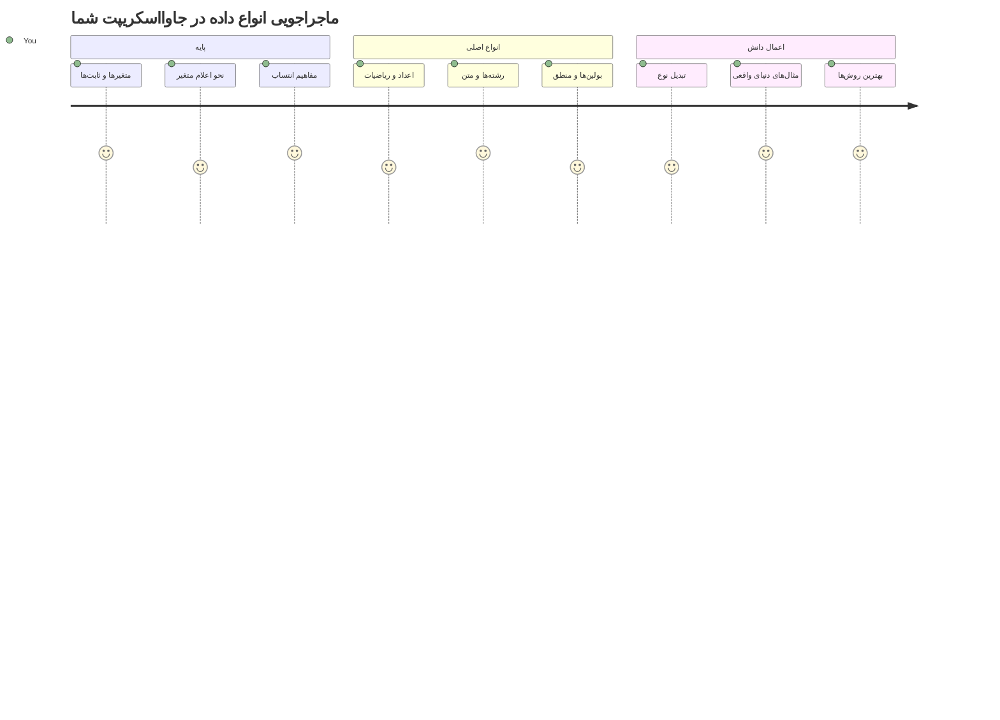
نوع داده‌ها یکی از مفاهیم پایه‌ای در جاوااسکریپت هستند که در هر برنامه‌ای که می‌نویسید با آن‌ها مواجه خواهید شد. نوع داده‌ها را مانند سیستم بایگانی‌ای در نظر بگیرید که کتابداران قدیمی در اسکندریه استفاده می‌کردند – آن‌ها جای خاصی برای طومارهای حاوی شعر، ریاضیات و اسناد تاریخی داشتند. جاوااسکریپت هم اطلاعات را به همین صورت با دسته‌بندی‌های مختلف برای انواع متفاوت داده‌ها سازماندهی می‌کند.

در این درس، نوع‌های داده اصلی که جاوااسکریپت را کارا می‌کند بررسی خواهیم کرد. شما یاد می‌گیرید چگونه با اعداد، متن، مقادیر درست/نادرست کار کنید و بفهمید چرا انتخاب نوع درست برای برنامه‌هایتان ضروری است. این مفاهیم ممکن است ابتدا انتزاعی به نظر برسند، اما با تمرین، به صورت طبیعی برایتان تبدیل خواهند شد.

درک نوع داده‌ها باعث می‌شود همه چیز در جاوااسکریپت خیلی واضح‌تر شود. همانطور که معماران باید مواد مختلف ساختمانی را قبل از ساخت یک کلیسا بشناسند، این مفاهیم پایه از همه چیزهایی که در ادامه می‌سازید حمایت خواهند کرد.

## آزمون پیش‌درس
[آزمون پیش‌درس](https://ff-quizzes.netlify.app/web/)

این درس مبانی جاوااسکریپت را پوشش می‌دهد، زبانی که تعاملی بودن وب را فراهم می‌کند.

> می‌توانید این درس را در [Microsoft Learn](https://docs.microsoft.com/learn/modules/web-development-101-variables/?WT.mc_id=academic-77807-sagibbon) انجام دهید!

[](https://youtube.com/watch?v=JNIXfGiDWM8 "متغیرها در جاوااسکریپت")

[](https://youtube.com/watch?v=AWfA95eLdq8 "نوع داده‌ها در جاوااسکریپت")

> 🎥 برای دیدن ویدیوهای مربوط به متغیرها و نوع داده‌ها روی تصاویر بالا کلیک کنید

بیایید با متغیرها و نوع داده‌هایی که آنها را پر می‌کنند شروع کنیم!

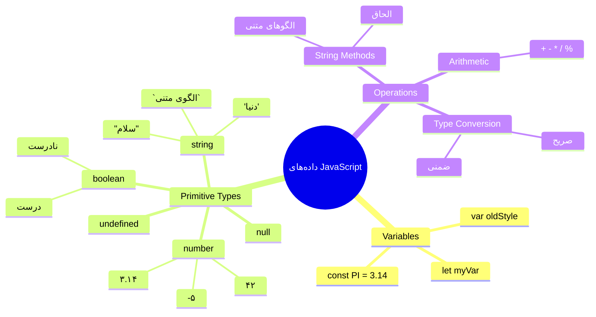
## متغیرها

متغیرها بلوک‌های سازنده اساسی در برنامه‌نویسی هستند. مثل شیشه‌های برچسب‌خورده که کیمیاگران قرون وسطی برای نگهداری مواد مختلف استفاده می‌کردند، متغیرها به شما اجازه می‌دهند اطلاعات ذخیره کرده و نامی توصیفی به آن بدهید تا بعدا بتوانید به آن ارجاع دهید. می‌خواهید سن کسی را به یاد داشته باشید؟ آن را در متغیری به نام `age` ذخیره کنید. می‌خواهید نام کاربر را پیگیری کنید؟ آن را در متغیری به نام `userName` ذخیره کنید.

ما روی روش مدرن ساخت متغیرها در جاوااسکریپت تمرکز خواهیم کرد. تکنیک‌هایی که اینجا یاد می‌گیرید نمایانگر سال‌ها تکامل زبان و بهترین شیوه‌هایی است که توسط جامعه برنامه‌نویسی توسعه یافته‌اند.

ساخت و **اعلام** یک متغیر به صورت **[کلمه کلیدی] [نام]** است. این تا دو قسمت تشکیل شده است:

- **کلمه کلیدی**. از `let` برای متغیرهایی که ممکن است تغییر کنند استفاده کنید، یا از `const` برای مقادیری که ثابت می‌مانند.
- **نام متغیر**، که نامی توصیفی است که خودتان انتخاب می‌کنید.

✅ کلمه کلیدی `let` در ES6 معرفی شد و به متغیر شما دامنه بلوکی می‌دهد. توصیه می‌شود به جای کلمه کلیدی قدیمی‌تر `var` از `let` یا `const` استفاده کنید. در بخش‌های آینده محدودیت‌های دامنه بلوکی را بیشتر بررسی خواهیم کرد.

### وظیفه - کار با متغیرها

1. **اعلام یک متغیر**. بیایید با ساخت اولین متغیرمان شروع کنیم:

    ```javascript
    let myVariable;
    ```

   **این کار چه نتیجه‌ای دارد:**
   - این به جاوااسکریپت می‌گوید یک محل ذخیره به نام `myVariable` ایجاد کند
   - جاوااسکریپت فضای حافظه‌ای برای این متغیر اختصاص می‌دهد
   - متغیر در حال حاضر مقداری ندارد (تعریف نشده)

2. **مقداری به آن بدهید**. حالا بیایید چیزی داخل متغیر قرار دهیم:

    ```javascript
    myVariable = 123;
    ```

   **نحوه کار تخصیص:**
   - عملگر `=` مقدار 123 را به متغیر ما اختصاص می‌دهد
   - متغیر اکنون این مقدار را به جای تعریف نشده دارد
   - شما می‌توانید در سراسر کدتان به این مقدار با استفاده از `myVariable` ارجاع دهید

   > نکته: استفاده از `=` در این درس یعنی استفاده از "عملگر تخصیص"، که برای دادن مقدار به یک متغیر به کار می‌رود. این به معنی برابری نیست.

3. **آن را به شیوه هوشمندانه انجام دهید**. بهتر است این دو مرحله را با هم ترکیب کنیم:

    ```javascript
    let myVariable = 123;
    ```

    **این رویکرد بهینه‌تر است:**
    - شما متغیر را اعلام کرده و یک مقدار در همان جمله اختصاص می‌دهید
    - این روش استاندارد بین توسعه‌دهندگان است
    - طول کد را کاهش می‌دهد و در عین حال وضوح را حفظ می‌کند

4. **نظرتان تغییر کند**. اگر بخواهیم عدد دیگری ذخیره کنیم چه؟

   ```javascript
   myVariable = 321;
   ```

   **درک تخصیص مجدد:**
   - متغیر اکنون مقدار 321 به جای 123 دارد
   - مقدار قبلی جایگزین شده است – متغیرها تنها یک مقدار را در هر زمان ذخیره می‌کنند
   - این قابلیت تغییر، ویژگی کلیدی متغیرهایی است که با `let` اعلام می‌شوند

   ✅ امتحان کنید! می‌توانید جاوااسکریپت را مستقیماً در مرورگر خود بنویسید. یک پنجره مرورگر باز کرده و به ابزارهای توسعه‌دهنده بروید. در کنسول، پرامپتی خواهید دید؛ تایپ کنید `let myVariable = 123`، کلید برگشت را بزنید، سپس `myVariable` را وارد کنید. چه اتفاقی می‌افتد؟ توجه داشته باشید، در درس‌های بعدی بیشتر با این مفاهیم آشنا خواهید شد.

### 🧠 **ارزیابی تسلط بر متغیرها: راحت بودن با آنها**

**بیایید ببینیم نسبت به متغیرها چگونه احساس می‌کنید:**
- می‌توانید تفاوت بین اعلام و تخصیص متغیر را توضیح دهید؟
- چه اتفاقی می‌افتد اگر قبل از اعلام متغیر سعی کنید از آن استفاده کنید؟
- کی برای متغیری `let` را به جای `const` انتخاب می‌کنید؟

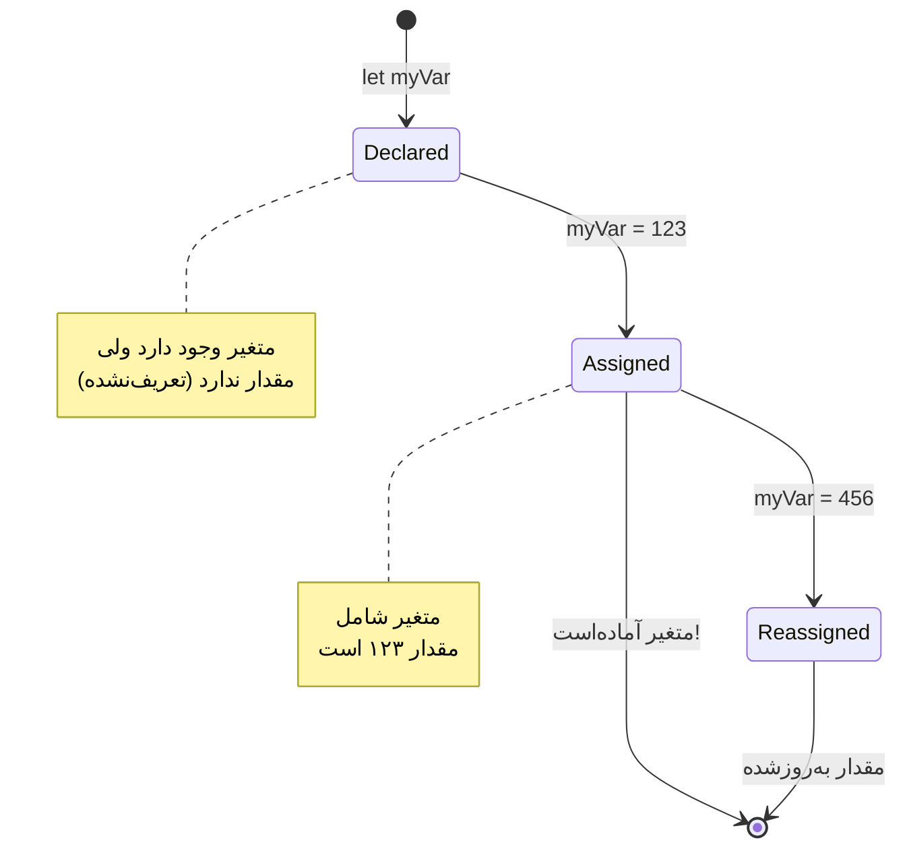
> **نکته سریع**: متغیرها را مانند جعبه‌های ذخیره‌سازی برچسب‌خورده در نظر بگیرید. شما جعبه را می‌سازید (`let`)، چیزی داخل آن می‌گذارید (`=`)، و بعدا می‌توانید محتویات آن را جایگزین کنید اگر لازم بود!

## ثابت‌ها

گاهی نیاز دارید اطلاعاتی را ذخیره کنید که در طول اجرای برنامه نباید تغییر کنند. ثابت‌ها را مانند اصول ریاضی که اقلیدس در یونان باستان بنا نهاد در نظر بگیرید – پس از اثبات و مستندسازی آن‌ها، برای همیشه ثابت باقی ماندند.

ثابت‌ها مشابه متغیرها هستند، اما با محدودیت مهمی: وقتی مقدارشان را اختصاص دادید، نمی‌توانید آن را تغییر دهید. این تغییرناپذیری به جلوگیری از تغییرات تصادفی مقادیر حیاتی در برنامه شما کمک می‌کند.

اعلام و مقداردهی اولیه یک ثابت همان مفاهیمی را دنبال می‌کند که برای متغیرهاست، با این تفاوت که از کلمه کلیدی `const` استفاده می‌شود. ثابت‌ها معمولاً با حروف بزرگ نوشته می‌شوند.

```javascript
const MY_VARIABLE = 123;
```

**کد بالا چه کاری انجام می‌دهد:**
- **ساختن** یک ثابت به نام `MY_VARIABLE` با مقدار 123
- **استفاده** از قرارداد نامگذاری با حروف بزرگ برای ثابت‌ها
- **جلوگیری** از تغییرات آتی این مقدار

ثابت‌ها دو قانون اصلی دارند:

- **باید بلافاصله مقدار داشته باشند** – ثابت خالی مجاز نیست!
- **هرگز نمی‌توانید آن مقدار را تغییر دهید** – اگر تلاش کنید جاوااسکریپت خطا می‌دهد. ببینید چه می‌شود:

   **مقدار ساده** - موارد زیر اجازه داده نمی‌شود:
   
      ```javascript
      const PI = 3;
      PI = 4; // مجاز نیست
      ```

   **مواردی که باید به خاطر بسپارید:**
   - **تلاش‌ها** برای تخصیص دوباره به یک ثابت باعث خطا می‌شوند
   - **محافظت** از مقادیر مهم در برابر تغییرات تصادفی
   - **اطمینان** از اینکه مقدار در طول اجرای برنامه ثابت می‌ماند
 
   **ارجاع شیء محافظت شده است** - موارد زیر اجازه داده نمی‌شود:
   
      ```javascript
      const obj = { a: 3 };
      obj = { b: 5 } // مجاز نیست
      ```

   **درک این مفاهیم:**
   - **جلوگیری** از جایگزینی کل شیء با شیء جدید
   - **محافظت** از ارجاع به شیء اصلی
   - **حفظ** هویت شیء در حافظه

    **مقدار شیء محافظت نمی‌شود** - موارد زیر مجاز است:
    
      ```javascript
      const obj = { a: 3 };
      obj.a = 5;  // مجاز است
      ```

      **شرح آنچه اتفاق می‌افتد:**
      - **تغییر** مقدار ویژگی داخل شیء
      - **حفظ** ارجاع همان شیء
      - **نشان می‌دهد** که محتوای شیء می‌تواند تغییر کند در حالی که ارجاع ثابت می‌ماند

   > توجه داشته باشید، `const` به این معنی است که ارجاع از تخصیص مجدد محافظت شده است. مقدار خود _تغییرناپذیر_ نیست و می‌تواند تغییر کند، به ویژه اگر ساختار پیچیده‌ای مانند شیء باشد.

## نوع داده‌ها

جاوااسکریپت اطلاعات را به دسته‌بندی‌هایی به نام نوع داده تقسیم می‌کند. این مفهوم بازتابی از نحوه دسته‌بندی دانش در بین دانشمندان قدیمی است – ارسطو بین انواع مختلف استدلال تمایز قائل شد، با این آگاهی که اصول منطقی نمی‌توانند به صورت یکنواخت بر شعر، ریاضیات و فلسفه طبیعی اعمال شوند.

نوع داده اهمیت دارد چون عملیات مختلف با انواع مختلف اطلاعات کار می‌کنند. همانطور که نمی‌توانید عملیات حسابی روی نام یک شخص انجام دهید یا یک معادله ریاضی را به صورت الفبا مرتب کنید، جاوااسکریپت نیز نیاز به نوع داده مناسب برای هر عملیات دارد. درک این موضوع از بروز خطا جلوگیری می‌کند و کد شما را قابل اطمینان‌تر می‌سازد.

متغیرها می‌توانند انواع گوناگونی از مقادیر را ذخیره کنند، مانند اعداد و متن. این انواع مختلف داده‌ها به عنوان **نوع داده** شناخته می‌شوند. نوع داده‌ها بخش مهمی از توسعه نرم‌افزار هستند چون به توسعه‌دهندگان کمک می‌کنند تصمیم بگیرند کد چگونه نوشته شود و نرم‌افزار چگونه اجرا شود. علاوه بر این، برخی انواع داده ویژگی‌های منحصر به فردی دارند که به تبدیل یا استخراج اطلاعات بیشتر در یک مقدار کمک می‌کنند.

✅ نوع داده‌ها همچنین داده‌های اولیه جاوااسکریپت نامیده می‌شوند، زیرا پایین‌ترین سطح نوع داده‌ها هستند که توسط زبان ارائه می‌شوند. 7 نوع داده اولیه وجود دارد: رشته (string)، عدد (number)، عدد بزرگ (bigint)، بولین (boolean)، تعریف نشده (undefined)، تهی (null) و نماد (symbol). یک دقیقه زمان بگذارید و تصور کنید هر کدام از این داده‌های اولیه چه چیزی را ممکن است نشان دهند. مثلاً `zebra` چیست؟ عدد `0` چیست؟ `true` چه معنایی دارد؟

### اعداد

اعداد ساده‌ترین نوع داده در جاوااسکریپت هستند. چه با اعداد صحیح مانند 42، اعداد اعشاری مانند 3.14، یا اعداد منفی مانند -5 کار کنید، جاوااسکریپت همه آنها را یکسان مدیریت می‌کند.

یادتان است متغیری که قبلاً داشتیم؟ آن 123 که ذخیره کردیم در واقع از نوع داده عددی بود:

```javascript
let myVariable = 123;
```

**ویژگی‌های کلیدی:**
- جاوااسکریپت به طور خودکار مقادیری عددی را تشخیص می‌دهد
- می‌توانید با این متغیرها عملیات ریاضی انجام دهید
- نیازی به اعلام نوع صریح نیست

متغیرها می‌توانند انواع مختلف اعداد، از جمله اعداد اعشاری یا منفی را ذخیره کنند. اعداد همچنین می‌توانند با عملگرهای ریاضی که در [بخش بعدی](../../../../2-js-basics/1-data-types) بررسی می‌شود، استفاده شوند.

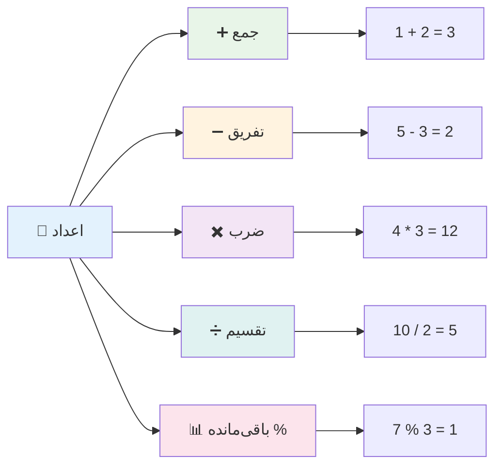
### عملگرهای حسابی

عملگرهای حسابی به شما اجازه می‌دهند عملیات ریاضی را در جاوااسکریپت انجام دهید. این عملگرها همان اصولی را دنبال می‌کنند که ریاضی‌دانان برای قرن‌ها استفاده کرده‌اند – نمادهایی که در آثار دانشمندانی مانند خوارزمی ظاهر شدند که علامت‌گذاری جبری را توسعه داد.

عملگرها همانطور که از ریاضیات سنتی انتظار می‌رود عمل می‌کنند: جمع برای افزودن، تفریق برای کم کردن و غیره.

چند نوع عملگر برای انجام عملیات حسابی وجود دارد که برخی از آن‌ها در اینجا آمده است:

| نماد   | توضیح                                                                 | مثال                             |
| ------ | -------------------------------------------------------------------- | -------------------------------- |
| `+`    | **جمع**: جمع دو عدد را محاسبه می‌کند                                | `1 + 2 //جواب مورد انتظار 3`     |
| `-`    | **تفریق**: اختلاف دو عدد را محاسبه می‌کند                           | `1 - 2 //جواب مورد انتظار -1`    |
| `*`    | **ضرب**: حاصل‌ضرب دو عدد را محاسبه می‌کند                          | `1 * 2 //جواب مورد انتظار 2`     |
| `/`    | **تقسیم**: خارج قسمت دو عدد را محاسبه می‌کند                        | `1 / 2 //جواب مورد انتظار 0.5`   |
| `%`    | **باقیمانده**: باقی‌مانده تقسیم دو عدد را محاسبه می‌کند             | `1 % 2 //جواب مورد انتظار 1`     |

✅ امتحان کنید! یک عملیات حسابی را در کنسول مرورگرتان انجام دهید. آیا نتایج شما را شگفت‌زده می‌کند؟

### 🧮 **آزمون مهارت ریاضی: محاسبات با اطمینان**

**دانش حسابی خود را بسنجید:**
- تفاوت بین `/` (تقسیم) و `%` (باقیمانده) چیست؟
- می‌توانید پیش‌بینی کنید `10 % 3` چه مقداری می‌دهد؟ (راهنما: این عدد 3.33... نیست)
- چرا عملگر باقیمانده ممکن است در برنامه‌نویسی مفید باشد؟

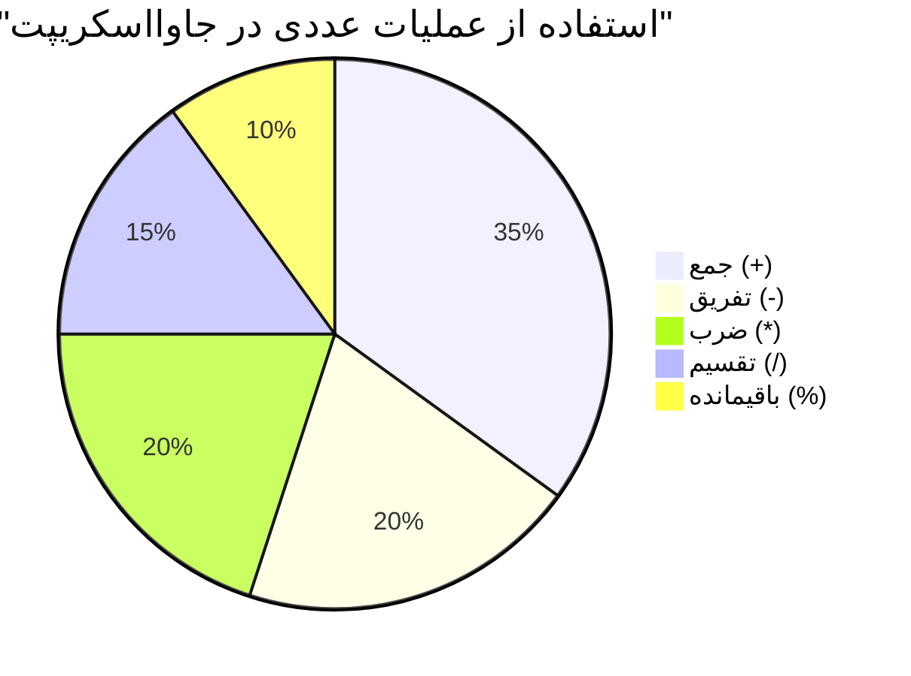
> **دیدگاه دنیای واقعی**: عملگر باقیمانده (%) برای بررسی زوج یا فرد بودن اعداد، ایجاد الگوها، یا پیمایش در آرایه‌ها بسیار مفید است!

### رشته‌ها

در جاوااسکریپت، داده‌های متنی به صورت رشته‌ها نمایش داده می‌شوند. واژه "رشته" از مفهوم اتصال کاراکترها به صورت دنباله‌ای گرفته شده است، درست مانند روشی که نویسندگان در صومعه‌های قرون وسطی حروف را به هم وصل می‌کردند تا کلمات و جملات را در دست‌نوشته‌های خود بسازند.

رشته‌ها برای توسعه وب بسیار بنیادی هستند. هر قطعه متنی که در یک وبسایت نمایش داده می‌شود – نام کاربری، برچسب دکمه‌ها، پیام‌های خطا، محتوا – به عنوان داده رشته‌ای اداره می‌شود. درک رشته‌ها برای ایجاد رابط‌های کاربر کاربردی ضروری است.

رشته‌ها مجموعه‌ای از کاراکترها هستند که بین علامت‌های نقل قول تکی یا دوتایی قرار دارند.

```javascript
'This is a string'
"This is also a string"
let myString = 'This is a string value stored in a variable';
```

**درک این مفاهیم:**
- از علامت نقل قول تک `'` یا نقل قول دوتایی `"` برای تعریف رشته‌ها استفاده می‌کند
- داده متنی شامل حروف، اعداد، و نمادها را ذخیره می‌کند
- مقادیر رشته‌ای را به متغیرها اختصاص می‌دهد برای استفاده بعدی
- نیازمند نقل قول برای تمایز متن از نام متغیرها است

یادتان باشد هنگام نوشتن رشته از نقل قول‌ها استفاده کنید، در غیر این صورت جاوااسکریپت آن را نام متغیر فرض می‌کند.

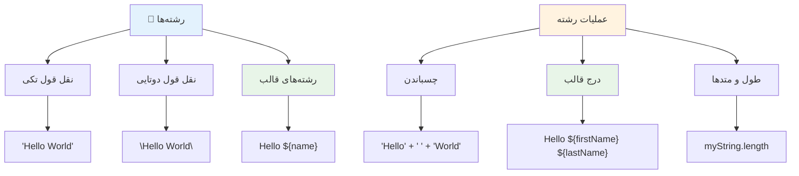
### قالب‌بندی رشته‌ها

دستکاری رشته به شما اجازه می‌دهد عناصر متنی را با هم ترکیب کنید، متغیرها را وارد کنید، و محتوای داینامیکی بسازید که به وضعیت برنامه واکنش نشان می‌دهد. این تکنیک به شما امکان می‌دهد متن را به صورت برنامه‌نویسی بسازید.

اغلب نیاز دارید چندین رشته را به هم وصل کنید – این فرایند به نام اتصال رشته‌ها (concatenation) شناخته می‌شود.
برای **ادغام** دو یا چند رشته، یا اتصال آنها به هم، از عملگر `+` استفاده کنید.

```javascript
let myString1 = "Hello";
let myString2 = "World";

myString1 + myString2 + "!"; //سلامدنیا!
myString1 + " " + myString2 + "!"; //سلام دنیا!
myString1 + ", " + myString2 + "!"; //سلام، دنیا!
```

**گام به گام، آنچه اتفاق می‌افتد این است:**
- **ترکیب** رشته‌های متعدد با استفاده از عملگر `+`
- **اتصال** رشته‌ها مستقیماً به هم بدون فاصله در مثال اول
- **افزودن** کاراکترهای فاصله `" "` میان رشته‌ها برای خوانایی بهتر
- **قرار دادن** علامت‌های نگارشی مانند کاما برای ایجاد قالب‌بندی صحیح

✅ چرا `1 + 1 = 2` در جاوااسکریپت است، اما `'1' + '1' = 11`؟ به آن فکر کنید. در مورد `'1' + 1` چه می‌گویید؟

**قالب‌های رشته‌ای (template literals)** روش دیگری برای قالب‌بندی رشته‌ها هستند، با این تفاوت که به جای کوتیشن، از بک‌تیک استفاده می‌شود. هر چیزی که متن عادی نباشد باید داخل جایگزین‌های `${ }` قرار بگیرد. این شامل هر متغیری که ممکن است رشته باشد نیز می‌شود.

```javascript
let myString1 = "Hello";
let myString2 = "World";

`${myString1} ${myString2}!` //سلام دنیا!
`${myString1}, ${myString2}!` //سلام، دنیا!
```

**هر بخش را درک کنیم:**
- **استفاده** از بک‌تیک `` ` `` به جای کوتیشن‌های معمولی برای ایجاد قالب‌های رشته‌ای
- **درج** مستقیم متغیرها با استفاده از سینتکس جایگزین `${}`
- **حفظ** فاصله‌ها و قالب‌بندی دقیقاً همانطور که نوشته شده
- **ارائه** روشی تمیزتر برای ایجاد رشته‌های پیچیده با متغیرها

شما می‌توانید با هر دو روش به اهداف قالب‌بندی خود برسید، اما قالب‌های رشته‌ای به فاصله‌ها و شکستن خط‌ها احترام می‌گذارند.

✅ چه زمانی قالب رشته‌ای را به جای رشته ساده استفاده می‌کنید؟

### 🔤 **چک مهارت رشته: اطمینان از دستکاری متن**

**مهارت‌های رشته‌ای خود را ارزیابی کنید:**
- می‌توانید توضیح دهید چرا `'1' + '1'` برابر `'11'` است نه ۲؟
- کدام متد رشته‌ای را خواناتر می‌یابید: عمل ادغام یا قالب‌های رشته‌ای؟
- اگر کوتیشن‌ها را دور یک رشته فراموش کنید چه اتفاقی می‌افتد؟

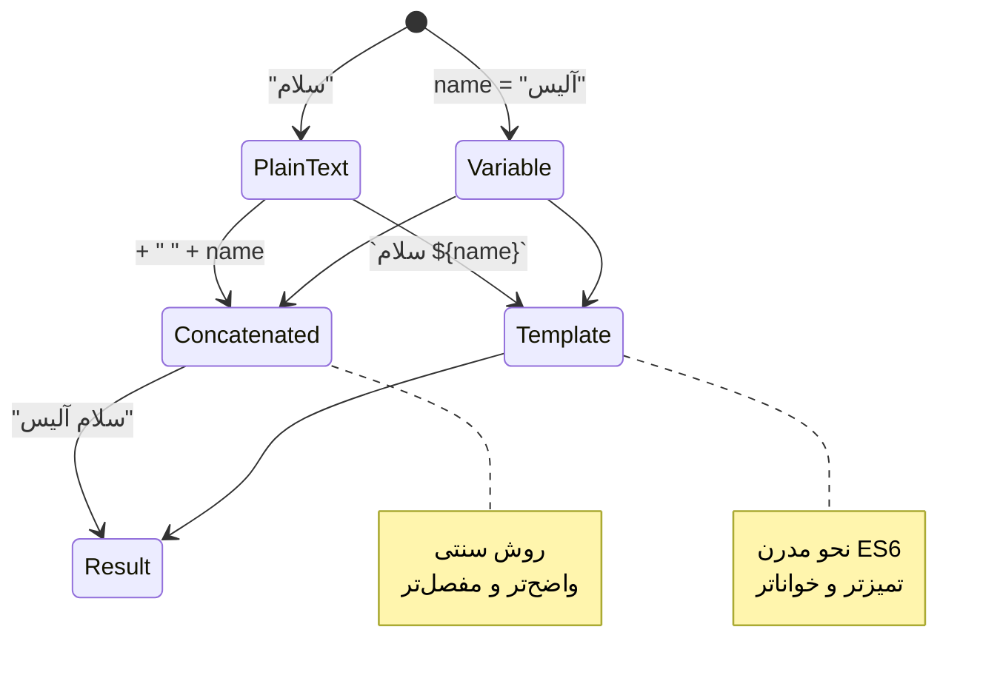
> **نکته حرفه‌ای**: قالب‌های رشته‌ای عموماً برای ساخت رشته‌های پیچیده ترجیح داده می‌شوند؛ زیرا خواناترند و رشته‌های چندخطی را به زیبایی مدیریت می‌کنند!

### بولی‌ها

بولی‌ها ساده‌ترین نوع داده را نشان می‌دهند: آنها فقط می‌توانند یکی از دو مقدار را داشته باشند – `true` یا `false`. این سیستم منطق دودویی به کار جورج بول، ریاضی‌دان قرن ۱۹ برمی‌گردد که جبر بولی را توسعه داد.

با وجود سادگی‌شان، بولی‌ها برای منطق برنامه ضروری هستند. آنها به کد شما امکان می‌دهند بر اساس شرایط تصمیم بگیرد – آیا یک کاربر وارد شده است، آیا یک دکمه کلیک شده یا آیا معیارهای خاصی برآورده شده‌اند.

بولی‌ها فقط دو مقدار می‌توانند داشته باشند: `true` یا `false`. بولی‌ها می‌توانند به شما کمک کنند تصمیم بگیرید کدام خطوط کد هنگام برآورده شدن شرایط خاص اجرا شوند. در بسیاری از موارد، [عملگرها](../../../../2-js-basics/1-data-types) به تعیین مقدار بولی کمک می‌کنند و شما غالباً متغیرهایی را می‌بینید که مقداردهی اولیه شده یا مقادیرشان با عملگر به‌روزرسانی می‌شود.

```javascript
let myTrueBool = true;
let myFalseBool = false;
```

**در مثال بالا ما:**
- **یک متغیر ساختیم که مقدار بولی `true` را ذخیره می‌کند**
- **نشان دادیم چگونه مقدار بولی `false` ذخیره شود**
- **از کلیدواژه‌های دقیق `true` و `false` استفاده کردیم (بدون نیاز به کوتیشن)**
- **این متغیرها را برای استفاده در عبارات شرطی آماده کردیم**

✅ یک متغیر زمانی به عنوان 'truthy' در نظر گرفته می‌شود که به بولی `true` ارزیابی شود. جالب است بدانید که در جاوااسکریپت، [همه مقادیر truthy هستند مگر اینکه به عنوان falsy تعریف شوند](https://developer.mozilla.org/docs/Glossary/Truthy).

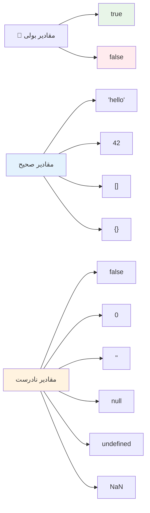
### 🎯 **چک منطق بولی: مهارت‌های تصمیم‌گیری**

**درک بولی خود را امتحان کنید:**
- چرا فکر می‌کنید جاوااسکریپت فراتر از فقط `true` و `false`، مقادیر "truthy" و "falsy" دارد؟
- می‌توانید پیش‌بینی کنید کدام یک از این‌ها falsy است: `0`، `"0"`، `[]`، `"false"`؟
- چطور بولی‌ها می‌توانند برای کنترل جریان برنامه مفید باشند؟

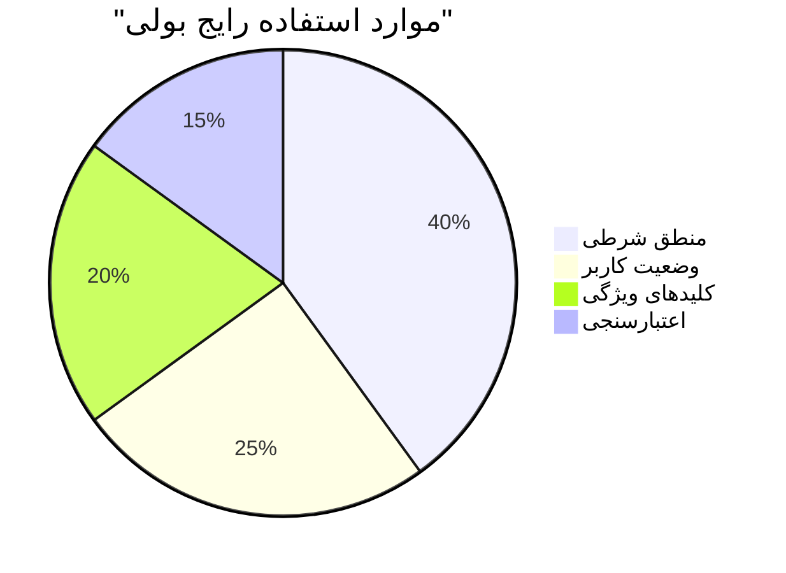
> **به یاد داشته باشید**: در جاوااسکریپت فقط ۶ مقدار falsy هستند: `false`، `0`، `""`، `null`، `undefined`، و `NaN`. بقیه همه truthy هستند!

---

## 📊 **خلاصه جعبه ابزار نوع داده‌های شما**

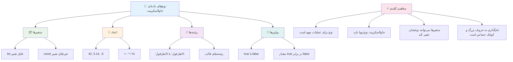
## چالش GitHub Copilot Agent 🚀

از حالت Agent برای تکمیل چالش زیر استفاده کنید:

**توضیح:** یک مدیر اطلاعات شخصی ایجاد کنید که تمامی نوع داده‌های جاوااسکریپتی را که در این درس آموخته‌اید نشان دهد در حالی که سناریوهای داده دنیای واقعی را پردازش می‌کند.

**دستور:** برنامه‌ای در جاوااسکریپت بنویسید که یک شی پروفایل کاربر بسازد که شامل: نام فرد (رشته)، سن (عدد)، وضعیت دانشجویی (بولی)، رنگ‌های مورد علاقه به صورت آرایه، و یک شی آدرس با خصوصیات خیابان، شهر و کدپستی باشد. توابعی را برای نمایش اطلاعات پروفایل و به‌روزرسانی فیلدهای جداگانه اضافه کنید. اطمینان حاصل کنید که ترکیب رشته‌ای، قالب‌های رشته‌ای، عملیات حسابی با سن، و منطق بولی برای وضعیت دانشجویی را نشان دهید.

بیشتر درباره [حالت agent](https://code.visualstudio.com/blogs/2025/02/24/introducing-copilot-agent-mode) اینجا یاد بگیرید.

## 🚀 چالش

جاوااسکریپت رفتارهایی دارد که ممکن است توسعه‌دهندگان را غافلگیر کند. این یک مثال کلاسیک برای کاوش است: این را در کنسول مرورگر خود تایپ کنید: `let age = 1; let Age = 2; age == Age` و نتیجه را مشاهده کنید. وجود خود را برمی‌گرداند `false` – می‌توانید بفهمید چرا؟

این یکی از بسیاری از رفتارهای جاوااسکریپت است که ارزش فهمیدن دارد. آشنایی با این ویژگی‌ها به شما کمک می‌کند کد قابل اعتمادتری بنویسید و مشکلات را بهتر عیب‌یابی کنید.

## آزمون پس از درس
[آزمون پس از درس](https://ff-quizzes.netlify.app)

## مرور و مطالعه خودآموز

به [این فهرست تمرین‌های جاوااسکریپت](https://css-tricks.com/snippets/javascript/) نگاهی بیندازید و یکی را امتحان کنید. چه چیزی یاد گرفتید؟

## تمرین

[تمرین نوع داده‌ها](assignment.md)

## 🚀 جدول زمانی تسلط شما بر نوع داده‌های جاوااسکریپت

### ⚡ **چه کاری می‌توانید در ۵ دقیقه آینده انجام دهید**
- [ ] کنسول مرورگر خود را باز کنید و ۳ متغیر با نوع داده مختلف ایجاد کنید
- [ ] چالش را امتحان کنید: `let age = 1; let Age = 2; age == Age` و بفهمید چرا false است
- [ ] تمرین ترکیب رشته‌ای با نام و عدد مورد علاقه خود
- [ ] تست کنید چه اتفاقی می‌افتد وقتی یک عدد به رشته اضافه می‌کنید

### 🎯 **چه در این ساعت می‌توانید به دست آورید**
- [ ] آزمون پس از درس را کامل کنید و هر مفهوم ابهام‌آمیزی را مرور کنید
- [ ] یک ماشین حساب کوچک بسازید که دو عدد را جمع، تفریق، ضرب و تقسیم کند
- [ ] یک فرمت‌کننده ساده نام با استفاده از قالب‌های رشته‌ای بسازید
- [ ] تفاوت عملگرهای مقایسه `==` و `===` را بررسی کنید
- [ ] تمرین تبدیل بین انواع داده‌های مختلف

### 📅 **پایه هفتگی جاوااسکریپت شما**
- [ ] تمرین را با اطمینان و خلاقیت کامل کنید
- [ ] یک شی پروفایل شخصی با استفاده از تمام نوع داده‌های آموخته شده بسازید
- [ ] با [تمرین‌های جاوااسکریپت از CSS-Tricks](https://css-tricks.com/snippets/javascript/) تمرین کنید
- [ ] یک اعتبارسنج ساده فرم با منطق بولی بسازید
- [ ] با نوع داده‌های آرایه و شیء کار کنید (پیش‌نمایش درس‌های آینده)
- [ ] به یک جامعه جاوااسکریپت بپیوندید و درباره نوع داده‌ها سوال بپرسید

### 🌟 **تحول ماهانه شما**
- [ ] دانش نوع داده‌ها را در پروژه‌های بزرگ‌تر برنامه‌نویسی ادغام کنید
- [ ] بفهمید چه زمانی و چرا هر نوع داده را در برنامه‌های واقعی استفاده کنید
- [ ] به دیگر مبتدیان در درک اصول جاوااسکریپت کمک کنید
- [ ] یک برنامه کوچک بسازید که انواع مختلف داده‌های کاربر را مدیریت کند
- [ ] مفاهیم پیشرفته نوع داده مانند تبدیل نوع و برابری سخت را کاوش کنید
- [ ] به پروژه‌های متن باز جاوااسکریپت با بهبود مستندات کمک کنید

### 🧠 **بررسی نهایی تسلط بر نوع داده‌ها**

**بنیاد جاوااسکریپت خود را جشن بگیرید:**
- کدام نوع داده شما را بیش از همه در رفتار خود شگفت‌زده کرد؟
- چقدر راحت هستید که متغیرها را نسبت به ثوابت برای یک دوست توضیح دهید؟
- جالب‌ترین چیزی که درباره سیستم نوع جاوااسکریپت کشف کردید چیست؟
- چه برنامه واقعی را می‌توانید با این اصول بسازید؟

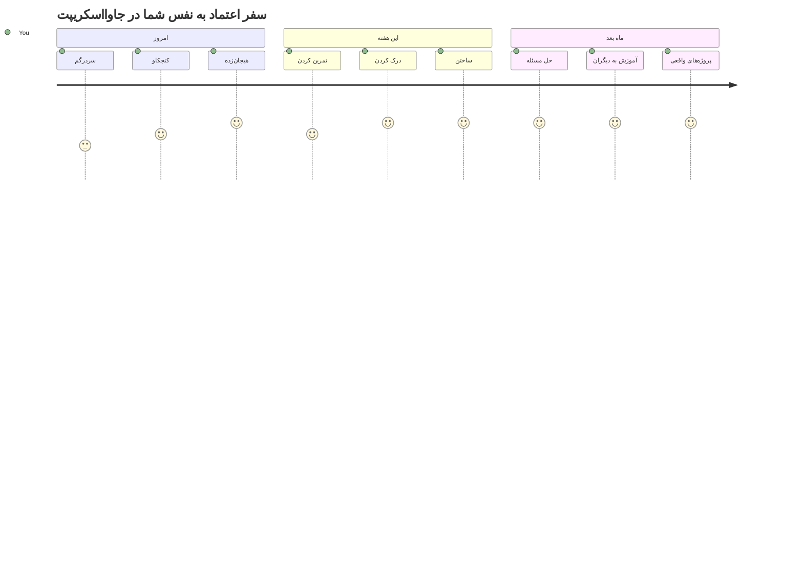
> 💡 **شما پایه را ساخته‌اید!** فهم نوع داده‌ها مثل یادگیری الفبا قبل از نوشتن داستان است. هر برنامه جاوااسکریپتی که می‌نویسید از این مفاهیم پایه‌ای استفاده خواهد کرد. اکنون بلوک‌های ساخت را دارید تا وب‌سایت‌های تعاملی، برنامه‌های پویا بسازید و با کد مشکلات دنیای واقعی را حل کنید. به دنیای شگفت‌انگیز جاوااسکریپت خوش آمدید! 🎉

---

<!-- CO-OP TRANSLATOR DISCLAIMER START -->
**توضیح مهم**:
این سند با استفاده از سرویس ترجمه هوش مصنوعی [Co-op Translator](https://github.com/Azure/co-op-translator) ترجمه شده است. در حالی که ما برای دقت تلاش می‌کنیم، لطفاً توجه داشته باشید که ترجمه‌های ماشینی ممکن است حاوی خطاها یا نادرستی‌هایی باشند. سند اصلی به زبان بومی خود باید منبع معتبر در نظر گرفته شود. برای اطلاعات حیاتی، توصیه می‌شود از ترجمه حرفه‌ای انسانی استفاده شود. ما مسئول سوءتفاهم‌ها یا تفسیرهای نادرست ناشی از استفاده از این ترجمه نیستیم.
<!-- CO-OP TRANSLATOR DISCLAIMER END -->