<!--
CO_OP_TRANSLATOR_METADATA:
{
  "original_hash": "71f7d7dafa1c7194d79ddac87f669ff9",
  "translation_date": "2026-01-06T09:45:37+00:00",
  "source_file": "2-js-basics/2-functions-methods/README.md",
  "language_code": "fa"
}
-->
# اصول جاوااسکریپت: متدها و توابع


> یادداشت تصویری توسط [Tomomi Imura](https://twitter.com/girlie_mac)

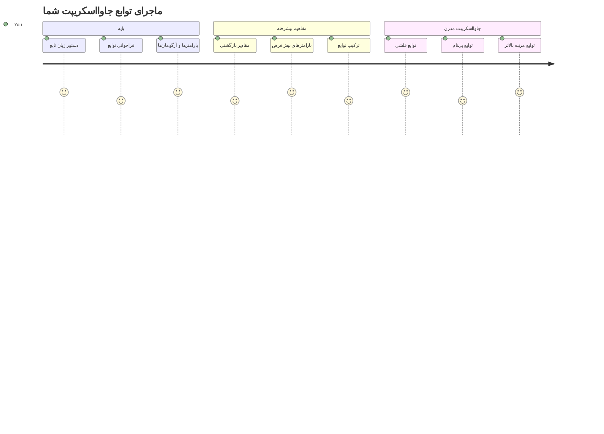
## آزمون پیش از درس
[آزمون پیش از درس](https://ff-quizzes.netlify.app)

نوشتن مکرر همان کد یکی از رایج‌ترین ناراحتی‌های برنامه‌نویسی است. توابع این مشکل را با اجازه دادن به بسته‌بندی کد در بلوک‌های قابل استفاده مجدد حل می‌کنند. توابع را مانند قطعات استانداردی که خط مونتاژ هنری فورد را انقلابی کرد تصور کنید – وقتی یک قطعه قابل اطمینان ایجاد کنید، می‌توانید آن را هر جا که لازم است بدون بازسازی از ابتدا استفاده کنید.

توابع به شما امکان می‌دهند قطعات کد را بسته‌بندی کنید تا بتوانید آن‌ها را در سراسر برنامه خود دوباره استفاده کنید. به جای کپی و پیست کردن همان منطق در همه جا، می‌توانید یکبار یک تابع ایجاد کرده و هر زمان که لازم بود آن را فراخوانی کنید. این رویکرد کد شما را سازمان یافته نگه می‌دارد و به‌روزرسانی‌ها را بسیار آسان‌تر می‌کند.

در این درس، می‌آموزید چگونه توابع خود را ایجاد کنید، اطلاعات را به آنها منتقل کنید و نتایج مفید دریافت کنید. تفاوت بین توابع و متدها را کشف می‌کنید، روش‌های نحو مدرن را می‌آموزید و می‌بینید چگونه توابع می‌توانند با توابع دیگر کار کنند. این مفاهیم را گام به گام خواهیم ساخت.

[](https://youtube.com/watch?v=XgKsD6Zwvlc "متدها و توابع")

> 🎥 برای ویدیویی درباره متدها و توابع روی تصویر بالا کلیک کنید.

> می‌توانید این درس را در [Microsoft Learn](https://docs.microsoft.com/learn/modules/web-development-101-functions/?WT.mc_id=academic-77807-sagibbon) دنبال کنید!

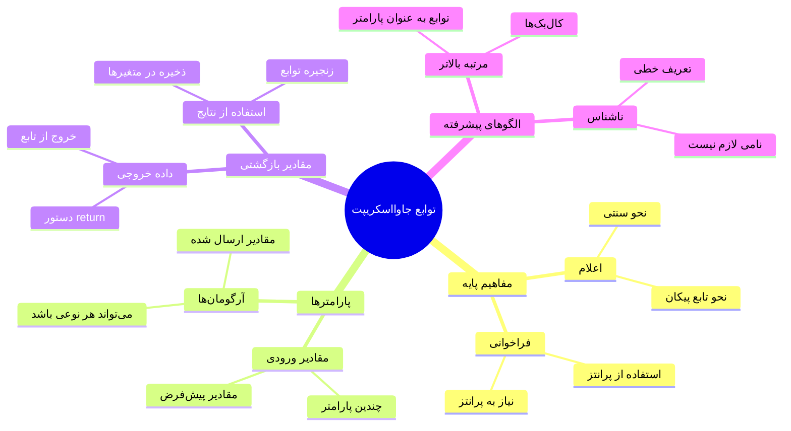
## توابع

یک تابع بلوکی مستقل از کد است که یک کار خاص را انجام می‌دهد. این منطق را کپسوله می‌کند که می‌توانید هر زمان لازم باشد اجرا کنید.

به جای نوشتن همان کد چندین بار در سراسر برنامه، می‌توانید آن را در یک تابع بسته‌بندی کرده و هر زمان که نیاز داشتید آن را فراخوانی کنید. این رویکرد کد شما را تمیز نگه می‌دارد و به‌روزرسانی‌ها را بسیار ساده‌تر می‌کند. تصور کنید اگر لازم بود منطق پراکنده در ۲۰ مکان مختلف در کد خود را تغییر دهید، نگهداری چقدر دشوار می‌شد.

نام‌گذاری توابع به صورت توصیفی حیاتی است. یک تابع با نام خوب هدف خود را به وضوح منتقل می‌کند – وقتی `cancelTimer()` را می‌بینید، بلافاصله می‌فهمید چه کاری انجام می‌دهد، درست مانند دکمه‌ای که به وضوح برچسب خورده و دقیقاً می‌فهمید که با کلیک کردنش چه اتفاقی خواهد افتاد.

## ایجاد و فراخوانی یک تابع

بیایید ببینیم چگونه می‌توان یک تابع ساخت. نحو به یک الگوی ثابت پیروی می‌کند:

```javascript
function nameOfFunction() { // تعریف تابع
 // تعریف/بدنه تابع
}
```

بیایید این را بشکنیم:
- کلمه کلیدی `function` به جاوااسکریپت می‌گوید "هی، من دارم یک تابع ایجاد می‌کنم!"
- `nameOfFunction` جایی است که نام توصیفی برای تابع خود می‌دهید
- پرانتزهای `()` جایی است که می‌توانید پارامترها را اضافه کنید (بزودی درباره آن صحبت می‌کنیم)
- آکولادهای `{}` شامل کدی است که هنگام فراخوانی تابع اجرا می‌شود

بیایید یک تابع ساده برای سلام دادن بسازیم تا این را عملی ببینیم:

```javascript
function displayGreeting() {
  console.log('Hello, world!');
}
```

این تابع عبارت "Hello, world!" را در کنسول چاپ می‌کند. وقتی آن را تعریف کردید، می‌توانید به تعداد دلخواه از آن استفاده کنید.

برای اجرای (یا "فراخوانی") تابع خود، نام آن را نوشته و پس از آن پرانتزها را قرار دهید. جاوااسکریپت به شما اجازه می‌دهد تابع خود را قبل یا بعد از فراخوانی تعریف کنید – موتور جاوااسکریپت ترتیب اجرا را مدیریت خواهد کرد.

```javascript
// فراخوانی تابع ما
displayGreeting();
```

وقتی این خط را اجرا می‌کنید، تمام کد داخل تابع `displayGreeting` شما اجرا می‌شود و عبارت "Hello, world!" را در کنسول مرورگر شما نشان می‌دهد. می‌توانید این تابع را چندین بار فراخوانی کنید.

### 🧠 **بررسی اصول توابع: ساخت اولین توابع شما**

**بیایید ببینیم در مورد توابع پایه چه احساسی دارید:**
- چرا در تعریف توابع از آکولاد `{}` استفاده می‌کنیم؟
- اگر `displayGreeting` را بدون پرانتزها بنویسید چه اتفاقی می‌افتد؟
- چرا ممکن است بخواهید همان تابع را چندین بار فراخوانی کنید؟

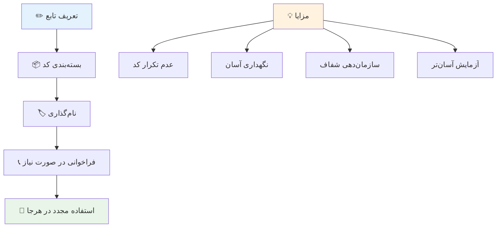
> **توجه:** شما در طول این درس‌ها از **متدها** استفاده کرده‌اید. `console.log()` یک متد است – اساساً تابعی که متعلق به شی `console` است. تفاوت کلیدی این است که متدها به اشیاء متصل هستند، در حالی که توابع مستقل عمل می‌کنند. بسیاری از توسعه‌دهندگان این اصطلاحات را در گفتگوهای روزمره به جای هم به کار می‌برند.

### بهترین روش‌ها برای نوشتن توابع

چند نکته برای کمک به شما در نوشتن توابع عالی:

- به توابع خود نام‌های واضح و توصیفی بدهید – خود آیندۀ شما بابت این کار از شما قدردانی خواهد کرد!
- برای نام‌های چندکلمه‌ای از **camelCase** استفاده کنید (مثل `calculateTotal` به جای `calculate_total`)
- هر تابع را روی انجام یک کار خاص متمرکز نگه دارید

## ارسال اطلاعات به یک تابع

تابع `displayGreeting` ما محدود است – فقط می‌تواند برای همه "Hello, world!" را نمایش دهد. پارامترها به ما اجازه می‌دهند توابع را مفیدتر و انعطاف‌پذیرتر کنیم.

**پارامترها** مانند جایگزین‌هایی هستند که می‌توانید هر بار که تابع را استفاده می‌کنید، مقادیر مختلفی را در آن‌ها قرار دهید. به این شکل، همان تابع می‌تواند با اطلاعات متفاوتی در هر فراخوانی کار کند.

پارامترها را در پرانتز هنگام تعریف تابع لیست می‌کنید و چند پارامتر را با کاما جدا می‌کنید:

```javascript
function name(param, param2, param3) {

}
```

هر پارامتر مانند یک جایگزین عمل می‌کند – وقتی کسی تابع شما را فراخوانی می‌کند، مقادیر واقعی را که وارد این جاها می‌شود فراهم می‌کند.

بیایید تابع سلام را بروزرسانی کنیم تا نام فرد را بپذیرد:

```javascript
function displayGreeting(name) {
  const message = `Hello, ${name}!`;
  console.log(message);
}
```

متوجه می‌شوید که چگونه از بک‌تیک‌ها (`` ` ``) و `${}` استفاده می‌کنیم تا نام را مستقیماً در پیغام درج کنیم – این قالب رشته‌ای (template literal) نامیده می‌شود و راه بسیار مفیدی برای ساختن رشته‌ها با متغیرها است.

حال وقتی تابع را فراخوانی می‌کنیم، می‌توانیم هر نامی را ارسال کنیم:

```javascript
displayGreeting('Christopher');
// هنگام اجرا "سلام، کریستوفر!" را نمایش می‌دهد
```

جاوااسکریپت رشته `'Christopher'` را می‌گیرد، به پارامتر `name` اختصاص می‌دهد و پیغام شخصی‌شده "Hello, Christopher!" را می‌سازد.

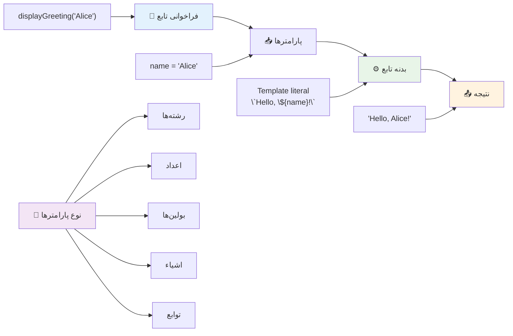
## مقادیر پیش‌فرض

اگر بخواهیم برخی پارامترها اختیاری باشند چه؟ این‌جا مقادیر پیش‌فرض به کار می‌آیند!

فرض کنید می‌خواهیم افراد بتوانند کلمه سلام را سفارشی کنند، اما اگر مشخص نکنند، فقط از "Hello" استفاده می‌کنیم. می‌توانید با استفاده از علامت مساوی، مانند تعریف متغیر، مقادیر پیش‌فرض تنظیم کنید:

```javascript
function displayGreeting(name, salutation='Hello') {
  console.log(`${salutation}, ${name}`);
}
```

در اینجا، `name` هنوز مورد نیاز است، اما `salutation` مقدار پشتیبان `'Hello'` دارد اگر کسی سلام دیگری وارد نکند.

حالا می‌توانیم این تابع را به دو روش مختلف فراخوانی کنیم:

```javascript
displayGreeting('Christopher');
// نمایش "سلام، کریستوفر"

displayGreeting('Christopher', 'Hi');
// نمایش "سلام، کریستوفر"
```

در فراخوانی اول، جاوااسکریپت از مقدار پیش‌فرض "Hello" استفاده می‌کند چون سلامتی تعیین نکرده‌ایم. در فراخوانی دوم، به جای آن از "Hi" سفارشی ما استفاده می‌کند. این انعطاف‌پذیری توابع را برای سناریوهای مختلف قابل انطباق می‌کند.

### 🎛️ **بررسی تسلط بر پارامترها: توابع انعطاف‌پذیر**

**مهارت خود را در پارامترها بسنجید:**
- تفاوت بین پارامتر و آرگومان چیست؟
- چرا مقادیر پیش‌فرض در برنامه‌نویسی دنیای واقعی مفیدند؟
- چه اتفاقی می‌افتد اگر آرگومان بیشتری نسبت به پارامترها ارسال کنید؟

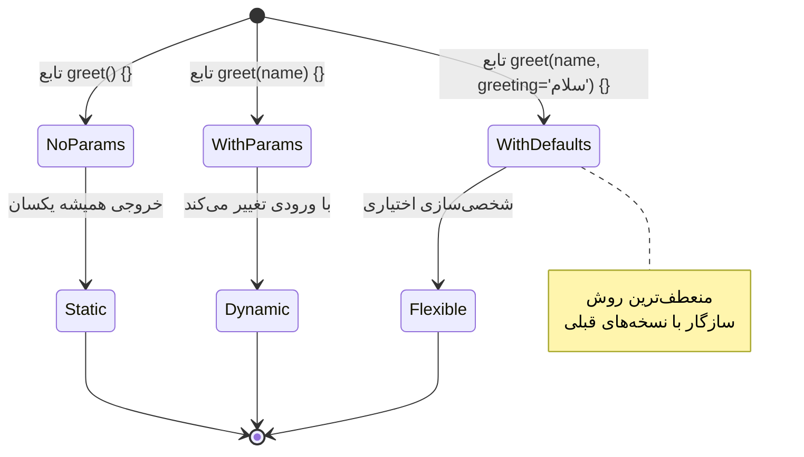
> **نکته حرفه‌ای**: پارامترهای پیش‌فرض توابع شما را کاربرپسندتر می‌کنند. کاربران می‌توانند با مقادیر منطقی پیش‌فرض به سرعت شروع کنند، ولی در عین حال در صورت نیاز سفارشی‌سازی کنند!

## مقادیر بازگشتی

تا الآن توابع ما فقط پیام‌ها را در کنسول چاپ کرده‌اند، اما اگر بخواهید توابع چیزی محاسبه کنند و نتیجه را به شما برگردانند چه؟

در این حالت **مقادیر بازگشتی** مطرح می‌شوند. به جای فقط نمایش چیزی، تابع می‌تواند مقداری را به شما برگرداند که می‌توانید در یک متغیر ذخیره کنید یا در بخش‌های دیگر کد استفاده کنید.

برای ارسال مقداری به خارج، از کلمه کلیدی `return` به همراه مقداری که می‌خواهید بازگردانید استفاده می‌کنید:

```javascript
return myVariable;
```

یک نکته مهم: وقتی تابع به دستور `return` می‌رسد، بلافاصله اجرا را متوقف می‌کند و آن مقدار را به فراخواننده می‌فرستد.

بیایید تابع سلام خود را طوری تغییر دهیم که بجای چاپ، پیام را بازگرداند:

```javascript
function createGreetingMessage(name) {
  const message = `Hello, ${name}`;
  return message;
}
```

حالا به جای چاپ سلام، این تابع پیام را ایجاد کرده و به ما بازمی‌گرداند.

برای استفاده از مقدار بازگردانده شده، می‌توانیم آن را مانند هر مقدار دیگری در یک متغیر ذخیره کنیم:

```javascript
const greetingMessage = createGreetingMessage('Christopher');
```

حالا `greetingMessage` شامل "Hello, Christopher" است و می‌توانیم آن را در هر جای کد – برای نمایش در صفحه وب، وارد کردن در ایمیل یا ارسال به تابعی دیگر – استفاده کنیم.

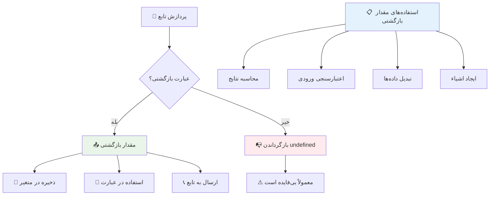
### 🔄 **بررسی مقادیر بازگشتی: دریافت نتایج**

**درک خود از مقادیر بازگشتی را ارزیابی کنید:**
- بعد از دستور `return` در یک تابع چه اتفاقی برای کد می‌افتد؟
- چرا بازگرداندن مقدار اغلب بهتر از فقط چاپ در کنسول است؟
- آیا یک تابع می‌تواند انواع مختلف مقادیر (رشته، عدد، بولین) را بازگرداند؟

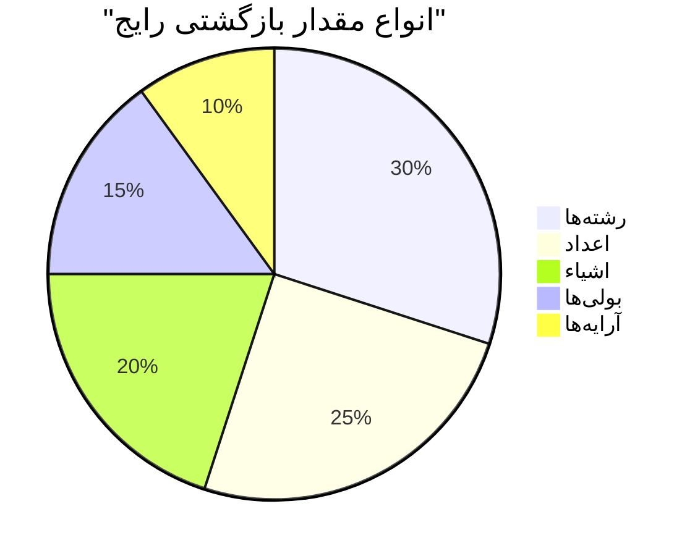
> **نکته کلیدی**: توابعی که مقدار بازمی‌گردانند، چندکاره‌تر هستند چون فراخواننده تصمیم می‌گیرد با نتیجه چه کند. این کد شما را ماژولارتر و قابل استفاده مجدد می‌کند!

## توابع به عنوان پارامتر برای توابع

توابع می‌توانند به عنوان پارامتر به توابع دیگر پاس داده شوند. شاید این مفهوم ابتدا پیچیده به نظر برسد، اما این یک ویژگی قدرتمند است که الگوهای برنامه‌نویسی انعطاف‌پذیر را ممکن می‌کند.

این الگو بسیار رایج است وقتی می‌خواهید بگویید "وقتی چیزی اتفاق افتاد، این کار را انجام بده." مثلاً "وقتی تایمر تمام شد، این کد را اجرا کن" یا "وقتی کاربر روی دکمه کلیک کرد، این تابع را فراخوانی کن."

بیایید `setTimeout` را بررسی کنیم که یک تابع داخلی است که پس از مدتی کد مشخصی را اجرا می‌کند. باید به آن بگوییم چه کدی اجرا شود – بهترین کاربرد برای ارسال یک تابع!

این کد را امتحان کنید – پس از ۳ ثانیه، یک پیام نمایش داده می‌شود:

```javascript
function displayDone() {
  console.log('3 seconds has elapsed');
}
// مقدار تایمر بر حسب میلی‌ثانیه است
setTimeout(displayDone, 3000);
```

متوجه می‌شوید که چگونه `displayDone` (بدون پرانتز) را به `setTimeout` می‌دهیم. خودمان تابع را فراخوانی نمی‌کنیم – آن را به `setTimeout` می‌سپاریم و می‌گوییم "این را در ۳ ثانیه بعد اجرا کن."

### توابع ناشناس

گاهی اوقات شما فقط به یک تابع برای یک کار خاص نیاز دارید و نمی‌خواهید برای آن نام بگذارید. فکر کنید – اگر فقط یک بار از تابعی استفاده می‌کنید، چرا کد خود را با نام اضافی شلوغ کنید؟

جاوااسکریپت به شما اجازه می‌دهد **توابع ناشناس** ایجاد کنید – توابعی بدون نام که می‌توانید دقیقاً همانجا که لازم دارید تعریف کنید.

این‌جا چطور می‌توانیم مثال تایمر خود را با استفاده از یک تابع ناشناس بنویسیم:

```javascript
setTimeout(function() {
  console.log('3 seconds has elapsed');
}, 3000);
```

این نتیجه یکسان را می‌دهد، اما تابع مستقیماً داخل فراخوانی `setTimeout` تعریف شده است و نیازی به تعریف جداگانه تابع نیست.

### توابع فلش (arrow functions)

جاوااسکریپت مدرن روش کوتاه‌تری برای نوشتن توابع دارد که به آن **توابع فلش** (arrow functions) می‌گویند. آن‌ها از `=>` استفاده می‌کنند (شبیه فلش هستند – فهمیدید؟) و بسیار محبوب برنامه‌نویسان هستند.

توابع فلش به شما اجازه می‌دهند که کلمه کلیدی `function` را حذف کنید و کد مختصرتر بنویسید.

اینجا نمونه تایمر ما با استفاده از تابع فلش است:

```javascript
setTimeout(() => {
  console.log('3 seconds has elapsed');
}, 3000);
```

`()` جایی است که پارامترها می‌آیند (در این مورد خالی است)، سپس فلش `=>` و در نهایت بدنه تابع در آکولادها. این نحو همان کارکرد را با نوشتار مختصرتر فراهم می‌کند.

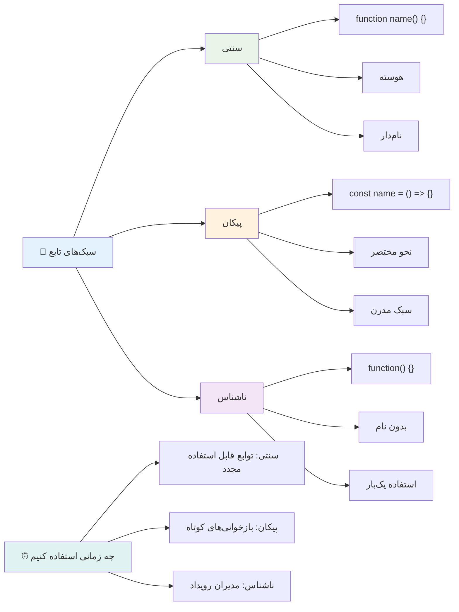
### چه زمانی از هر استراتژی استفاده کنیم

چه زمانی باید از هر روش استفاده کنید؟ یک راهنمای عملی: اگر تابع را چندین بار استفاده می‌کنید، به آن نام بدهید و جداگانه تعریف کنید. اگر برای یک کاربرد خاص و یکباره است، توابع ناشناس را در نظر بگیرید. هر دو نحو فلش و بررسی سنتی معتبر هستند، اگرچه توابع فلش در کدهای جاوااسکریپت مدرن رایج‌ترند.

### 🎨 **بررسی تسلط سبک توابع: انتخاب نحو مناسب**

**درک خود از نحو را بسنجید:**
- چه زمانی ممکن است توابع فلش را به نحو سنتی تابع ترجیح دهید؟
- مزیت اصلی توابع ناشناس چیست؟
- می‌توانید وضعیتی را تصور کنید که تابع نام‌دار بهتر از تابع ناشناس است؟

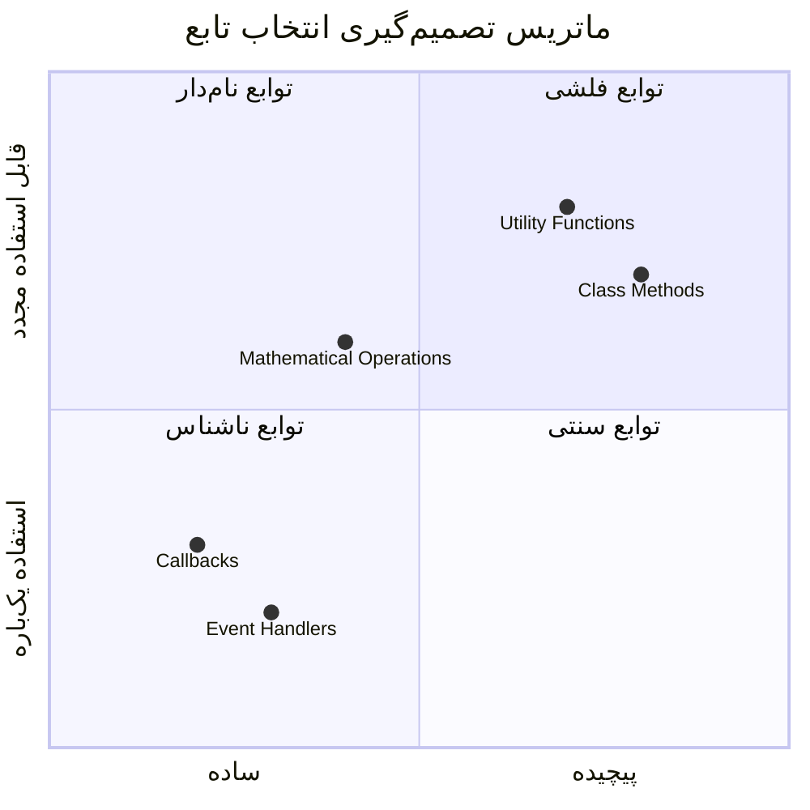
> **روند مدرن**: توابع فلش به دلیل نحو مختصر خود دارند به گزینه پیش‌فرض بسیاری از توسعه‌دهندگان تبدیل می‌شوند، اما توابع سنتی هنوز هم جایگاه خود را دارند!

---


## 🚀 چالش

می‌توانید در یک جمله تفاوت بین توابع و متدها را بیان کنید؟ امتحان کنید!

## چالش GitHub Copilot Agent 🚀

از حالت Agent برای انجام چالش زیر استفاده کنید:

**توضیح:** کتابخانه‌ای از توابع ریاضی ایجاد کنید که مفاهیم مختلف تابع پوشش داده شده در این درس، از جمله پارامترها، مقادیر پیش‌فرض، مقادیر بازگشتی و توابع فلش را نشان دهد.

**دستور:** یک فایل جاوااسکریپت به نام `mathUtils.js` بسازید که شامل توابع زیر باشد:
1. تابع `add` که دو پارامتر می‌گیرد و مجموع آن‌ها را بازمی‌گرداند
2. تابع `multiply` با مقادیر پیش‌فرض برای پارامترها (پارامتر دوم به طور پیش‌فرض ۱ است)
3. تابع فلش `square` که یک عدد می‌گیرد و توان دوم آن را بازمی‌گرداند
4. تابع `calculate` که یک تابع دیگر را به عنوان پارامتر می‌پذیرد و دو عدد، سپس تابع را روی آن اعداد اعمال می‌کند
5. نمایش فراخوانی هر تابع با نمونه‌های تست مناسب

برای یادگیری بیشتر درباره [حالت agent](https://code.visualstudio.com/blogs/2025/02/24/introducing-copilot-agent-mode) اینجا مراجعه کنید.

## آزمون پس از درس
[آزمون پس از درس](https://ff-quizzes.netlify.app)

## مرور و مطالعه خودآموز

خوب است کمی بیشتر درباره [توابع فلش](https://developer.mozilla.org/docs/Web/JavaScript/Reference/Functions/Arrow_functions) مطالعه کنید، زیرا این توابع به طور فزاینده‌ای در پایگاه‌های کد استفاده می‌شوند. نوشتن یک تابع را تمرین کنید و سپس آن را با این نحو دوباره بنویسید.

## تمرین

[سرگرمی با توابع](assignment.md)

---

## 🧰 **خلاصه جعبه‌ابزار توابع جاوااسکریپت شما**

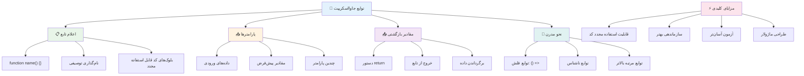
---

## 🚀 جدول زمانی تسلط شما بر توابع جاوااسکریپت

### ⚡ **کارهایی که در ۵ دقیقه آینده می‌توانید انجام دهید**
- [ ] نوشتن یک تابع ساده که عدد محبوب شما را بازگرداند
- [ ] ایجاد یک تابع با دو پارامتر که آن‌ها را جمع کند
- [ ] تلاش کنید یک تابع سنتی را به نحوه نوشتن تابع فلش تبدیل کنید  
- [ ] چالش را تمرین کنید: تفاوت بین توابع و متدها را توضیح دهید  

### 🎯 **آنچه می‌توانید این ساعت به دست آورید**  
- [ ] آزمون پس از درس را کامل کنید و هر مفهوم گیج‌کننده‌ای را مرور کنید  
- [ ] کتابخانه ابزارهای ریاضی را از چالش GitHub Copilot بسازید  
- [ ] تابعی ایجاد کنید که از تابع دیگری به عنوان پارامتر استفاده کند  
- [ ] تمرین نوشتن توابع با پارامترهای پیش‌فرض  
- [ ] آزمایش با قالب‌های رشته‌ای در مقادیر بازگشتی تابع  

### 📅 **تسلط هفتگی شما بر توابع**  
- [ ] تکلیف "تفریح با توابع" را با خلاقیت کامل کنید  
- [ ] برخی کدهای تکراری که نوشته‌اید را به توابع قابل استفاده مجدد بازنویسی کنید  
- [ ] یک ماشین‌حساب کوچک فقط با استفاده از توابع بسازید (بدون متغیرهای سراسری)  
- [ ] تمرین توابع فلش با متدهای آرایه مانند `map()` و `filter()`  
- [ ] مجموعه‌ای از توابع کمکی برای کارهای معمولی ایجاد کنید  
- [ ] مفاهیم توابع Higher-Order و برنامه‌نویسی تابعی را مطالعه کنید  

### 🌟 **تحول ماهانه شما**  
- [ ] تسلط بر مفاهیم پیشرفته توابع مانند closures و scope  
- [ ] پروژه‌ای بسازید که به طور گسترده از ترکیب توابع استفاده کند  
- [ ] با بهبود مستندات توابع در پروژه‌های متن‌باز مشارکت کنید  
- [ ] به دیگران درباره توابع و سبک‌های مختلف نوشتن آنها آموزش دهید  
- [ ] پارادایم‌های برنامه‌نویسی تابعی در جاوااسکریپت را کاوش کنید  
- [ ] کتابخانه شخصی از توابع قابل استفاده مجدد برای پروژه‌های آینده ایجاد کنید  

### 🏆 **بررسی نهایی قهرمان توابع**  

**تسلط خود بر توابع را جشن بگیرید:**  
- مفیدترین تابعی که تا کنون ایجاد کرده‌اید چیست؟  
- یادگیری در مورد توابع چگونه نحوه فکر کردن شما درباره سازماندهی کد را تغییر داده است؟  
- کدام نحوه نوشتن تابع را ترجیح می‌دهید و چرا؟  
- چه مشکلی در دنیای واقعی را با نوشتن تابع حل می‌کنید؟  

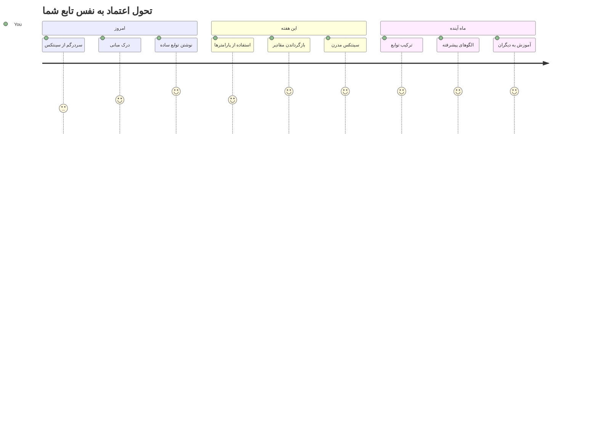
> 🎉 **شما یکی از قدرتمندترین مفاهیم برنامه‌نویسی را تسلط یافتید!** توابع بلوک‌های ساختمانی برنامه‌های بزرگتر هستند. هر برنامه‌ای که بسازید از توابع برای سازماندهی، استفاده مجدد و ساختاردهی کد استفاده خواهد کرد. اکنون می‌دانید چگونه منطق را به اجزای قابل استفاده مجدد بسته‌بندی کنید و برنامه‌نویس مؤثرتر و کارآمدتری باشید. به دنیای برنامه‌نویسی مدولار خوش آمدید! 🚀

---

<!-- CO-OP TRANSLATOR DISCLAIMER START -->
**سلب مسئولیت**:  
این سند با استفاده از سرویس ترجمه هوش مصنوعی [Co-op Translator](https://github.com/Azure/co-op-translator) ترجمه شده است. در حالی که ما برای دقت تلاش می‌کنیم، لطفاً توجه داشته باشید که ترجمه‌های خودکار ممکن است حاوی خطا یا نواقصی باشند. سند اصلی به زبان مبدأ باید به عنوان منبع معتبر در نظر گرفته شود. برای اطلاعات حیاتی، ترجمه حرفه‌ای انسانی توصیه می‌شود. ما مسئول هیچ گونه سوءتفاهم یا تفسیر نادرستی که ناشی از استفاده از این ترجمه باشد، نیستیم.
<!-- CO-OP TRANSLATOR DISCLAIMER END -->