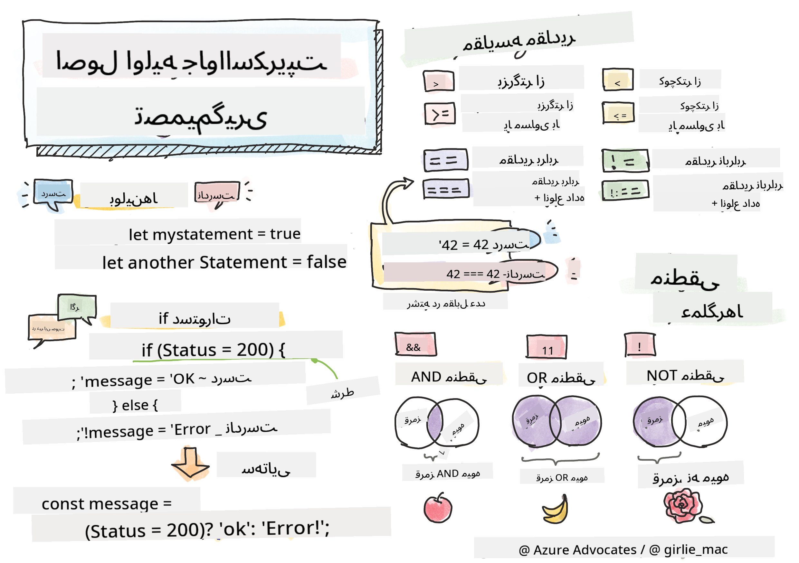

<!--
CO_OP_TRANSLATOR_METADATA:
{
  "original_hash": "f7009631b73556168ca435120a231c98",
  "translation_date": "2025-08-29T14:32:18+00:00",
  "source_file": "2-js-basics/3-making-decisions/README.md",
  "language_code": "fa"
}
-->
# اصول اولیه جاوااسکریپت: تصمیم‌گیری



> یادداشت تصویری توسط [Tomomi Imura](https://twitter.com/girlie_mac)

## آزمون پیش از درس

[آزمون پیش از درس](https://ff-quizzes.netlify.app/web/quiz/11)

تصمیم‌گیری و کنترل ترتیب اجرای کد باعث می‌شود کد شما قابل استفاده مجدد و قدرتمند باشد. این بخش به بررسی نحو کنترل جریان داده در جاوااسکریپت و اهمیت آن هنگام استفاده با انواع داده‌های بولی می‌پردازد.

[](https://youtube.com/watch?v=SxTp8j-fMMY "تصمیم‌گیری")

> 🎥 برای مشاهده ویدئویی درباره تصمیم‌گیری، روی تصویر بالا کلیک کنید.

> می‌توانید این درس را در [Microsoft Learn](https://docs.microsoft.com/learn/modules/web-development-101-if-else/?WT.mc_id=academic-77807-sagibbon) دنبال کنید!

## مرور کوتاه بر بولی‌ها

بولی‌ها فقط می‌توانند دو مقدار داشته باشند: `true` یا `false`. بولی‌ها کمک می‌کنند تصمیم بگیرید کدام خطوط کد باید اجرا شوند وقتی شرایط خاصی برقرار است.

بولی خود را به صورت true یا false تنظیم کنید:

`let myTrueBool = true`  
`let myFalseBool = false`

✅ بولی‌ها به نام ریاضیدان، فیلسوف و منطق‌دان انگلیسی جورج بول (1815–1864) نام‌گذاری شده‌اند.

## عملگرهای مقایسه و بولی‌ها

عملگرها برای ارزیابی شرایط با انجام مقایسه‌هایی استفاده می‌شوند که یک مقدار بولی ایجاد می‌کنند. در زیر لیستی از عملگرهایی که به طور مکرر استفاده می‌شوند آورده شده است.

| نماد   | توضیحات                                                                                                                                                   | مثال               |
| ------ | --------------------------------------------------------------------------------------------------------------------------------------------------------- | ------------------ |
| `<`    | **کمتر از**: دو مقدار را مقایسه می‌کند و اگر مقدار سمت چپ کمتر از مقدار سمت راست باشد، نوع داده بولی `true` را برمی‌گرداند                              | `5 < 6 // true`    |
| `<=`   | **کمتر یا مساوی با**: دو مقدار را مقایسه می‌کند و اگر مقدار سمت چپ کمتر یا مساوی مقدار سمت راست باشد، نوع داده بولی `true` را برمی‌گرداند              | `5 <= 6 // true`   |
| `>`    | **بزرگتر از**: دو مقدار را مقایسه می‌کند و اگر مقدار سمت چپ بزرگتر از مقدار سمت راست باشد، نوع داده بولی `true` را برمی‌گرداند                         | `5 > 6 // false`   |
| `>=`   | **بزرگتر یا مساوی با**: دو مقدار را مقایسه می‌کند و اگر مقدار سمت چپ بزرگتر یا مساوی مقدار سمت راست باشد، نوع داده بولی `true` را برمی‌گرداند          | `5 >= 6 // false`  |
| `===`  | **برابری سختگیرانه**: دو مقدار را مقایسه می‌کند و اگر مقادیر سمت راست و چپ برابر و از یک نوع داده باشند، نوع داده بولی `true` را برمی‌گرداند          | `5 === 6 // false` |
| `!==`  | **نابرابری**: دو مقدار را مقایسه می‌کند و مقدار بولی مخالف آنچه عملگر برابری سختگیرانه برمی‌گرداند را برمی‌گرداند                                      | `5 !== 6 // true`  |

✅ دانش خود را با نوشتن چند مقایسه در کنسول مرورگر خود بررسی کنید. آیا داده‌های برگشتی شما را شگفت‌زده می‌کنند؟

## دستور If

دستور if کدی را که بین بلوک‌های آن قرار دارد اجرا می‌کند اگر شرط برقرار باشد.

```javascript
if (condition) {
  //Condition is true. Code in this block will run.
}
```

عملگرهای منطقی اغلب برای تشکیل شرط استفاده می‌شوند.

```javascript
let currentMoney;
let laptopPrice;

if (currentMoney >= laptopPrice) {
  //Condition is true. Code in this block will run.
  console.log("Getting a new laptop!");
}
```

## دستور If..Else

دستور `else` کدی را که بین بلوک‌های آن قرار دارد اجرا می‌کند وقتی شرط برقرار نباشد. این دستور با دستور `if` اختیاری است.

```javascript
let currentMoney;
let laptopPrice;

if (currentMoney >= laptopPrice) {
  //Condition is true. Code in this block will run.
  console.log("Getting a new laptop!");
} else {
  //Condition is false. Code in this block will run.
  console.log("Can't afford a new laptop, yet!");
}
```

✅ درک خود از این کد و کد زیر را با اجرای آن در کنسول مرورگر آزمایش کنید. مقادیر متغیرهای currentMoney و laptopPrice را تغییر دهید تا مقدار برگشتی `console.log()` تغییر کند.

## دستور Switch

دستور `switch` برای انجام اقدامات مختلف بر اساس شرایط مختلف استفاده می‌شود. از دستور `switch` برای انتخاب یکی از چندین بلوک کد برای اجرا استفاده کنید.

```javascript
switch (expression) {
  case x:
    // code block
    break;
  case y:
    // code block
    break;
  default:
  // code block
}
```

```javascript
// program using switch statement
let a = 2;

switch (a) {
  case 1:
    a = "one";
    break;
  case 2:
    a = "two";
    break;
  default:
    a = "not found";
    break;
}
console.log(`The value is ${a}`);
```

✅ درک خود از این کد و کد زیر را با اجرای آن در کنسول مرورگر آزمایش کنید. مقدار متغیر a را تغییر دهید تا مقدار برگشتی `console.log()` تغییر کند.

## عملگرهای منطقی و بولی‌ها

تصمیم‌گیری ممکن است به بیش از یک مقایسه نیاز داشته باشد و می‌توان آن‌ها را با عملگرهای منطقی ترکیب کرد تا یک مقدار بولی تولید شود.

| نماد   | توضیحات                                                                                     | مثال                                                                 |
| ------ | ------------------------------------------------------------------------------------------- | ------------------------------------------------------------------- |
| `&&`   | **منطقی AND**: دو عبارت بولی را مقایسه می‌کند. فقط زمانی true برمی‌گرداند که هر دو طرف true باشند | `(5 > 6) && (5 < 6 ) //یک طرف false است، طرف دیگر true است. false برمی‌گرداند` |
| `\|\|` | **منطقی OR**: دو عبارت بولی را مقایسه می‌کند. اگر حداقل یک طرف true باشد، true برمی‌گرداند | `(5 > 6) \|\| (5 < 6) //یک طرف false است، طرف دیگر true است. true برمی‌گرداند` |
| `!`    | **منطقی NOT**: مقدار مخالف یک عبارت بولی را برمی‌گرداند                                   | `!(5 > 6) // 5 بزرگتر از 6 نیست، اما "!" true برمی‌گرداند`         |

## شرایط و تصمیم‌گیری با عملگرهای منطقی

عملگرهای منطقی می‌توانند برای تشکیل شرایط در دستورات if..else استفاده شوند.

```javascript
let currentMoney;
let laptopPrice;
let laptopDiscountPrice = laptopPrice - laptopPrice * 0.2; //Laptop price at 20 percent off

if (currentMoney >= laptopPrice || currentMoney >= laptopDiscountPrice) {
  //Condition is true. Code in this block will run.
  console.log("Getting a new laptop!");
} else {
  //Condition is true. Code in this block will run.
  console.log("Can't afford a new laptop, yet!");
}
```

### عملگر نفی

تا اینجا دیده‌اید که چگونه می‌توانید از دستور `if...else` برای ایجاد منطق شرطی استفاده کنید. هر چیزی که وارد یک `if` شود باید به true/false ارزیابی شود. با استفاده از عملگر `!` می‌توانید عبارت را _نفی_ کنید. این به صورت زیر خواهد بود:

```javascript
if (!condition) {
  // runs if condition is false
} else {
  // runs if condition is true
}
```

### عبارات سه‌گانه

`if...else` تنها راه برای بیان منطق تصمیم‌گیری نیست. شما همچنین می‌توانید از چیزی به نام عملگر سه‌گانه استفاده کنید. نحو آن به این صورت است:

```javascript
let variable = condition ? <return this if true> : <return this if false>
```

در زیر یک مثال ملموس‌تر آورده شده است:

```javascript
let firstNumber = 20;
let secondNumber = 10;
let biggestNumber = firstNumber > secondNumber ? firstNumber : secondNumber;
```

✅ چند دقیقه وقت بگذارید و این کد را چند بار بخوانید. آیا می‌فهمید این عملگرها چگونه کار می‌کنند؟

کد بالا بیان می‌کند که:

- اگر `firstNumber` بزرگتر از `secondNumber` باشد
- سپس `firstNumber` را به `biggestNumber` اختصاص دهید
- در غیر این صورت `secondNumber` را اختصاص دهید.

عبارت سه‌گانه فقط یک روش فشرده برای نوشتن کد زیر است:

```javascript
let biggestNumber;
if (firstNumber > secondNumber) {
  biggestNumber = firstNumber;
} else {
  biggestNumber = secondNumber;
}
```

---

## 🚀 چالش

برنامه‌ای ایجاد کنید که ابتدا با عملگرهای منطقی نوشته شده باشد و سپس آن را با استفاده از یک عبارت سه‌گانه بازنویسی کنید. نحو مورد علاقه شما کدام است؟

---

## آزمون پس از درس

[آزمون پس از درس](https://ff-quizzes.netlify.app/web/quiz/12)

## مرور و مطالعه شخصی

درباره بسیاری از عملگرهای موجود برای کاربر [در MDN](https://developer.mozilla.org/docs/Web/JavaScript/Reference/Operators) بیشتر بخوانید.

به ابزار فوق‌العاده [جستجوی عملگر](https://joshwcomeau.com/operator-lookup/) جاش کومو مراجعه کنید!

## تکلیف

[عملگرها](assignment.md)

---

**سلب مسئولیت**:  
این سند با استفاده از سرویس ترجمه هوش مصنوعی [Co-op Translator](https://github.com/Azure/co-op-translator) ترجمه شده است. در حالی که ما برای دقت تلاش می‌کنیم، لطفاً توجه داشته باشید که ترجمه‌های خودکار ممکن است شامل خطاها یا نادقتی‌هایی باشند. سند اصلی به زبان اصلی آن باید به عنوان منبع معتبر در نظر گرفته شود. برای اطلاعات حساس، ترجمه حرفه‌ای انسانی توصیه می‌شود. ما هیچ مسئولیتی در قبال سوءتفاهم‌ها یا تفسیرهای نادرست ناشی از استفاده از این ترجمه نداریم.