# اصول جاوااسکریپت: گرفتن تصمیم

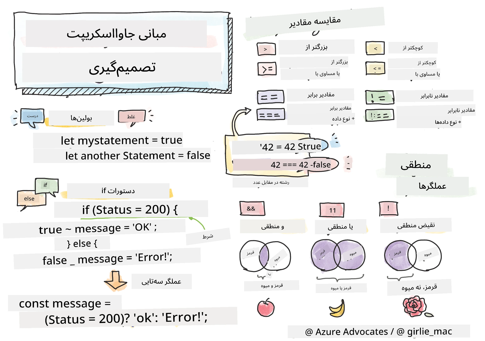

> اسکچ‌نوت از [Tomomi Imura](https://twitter.com/girlie_mac)

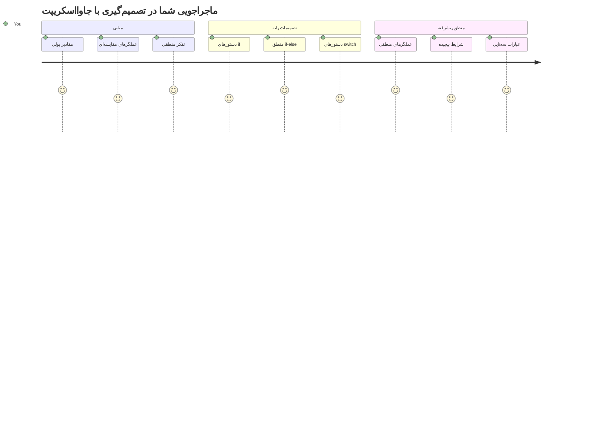
تا به حال فکر کرده‌اید برنامه‌ها چگونه تصمیمات هوشمندانه می‌گیرند؟ مثل اینکه یک سیستم مسیریابی چگونه سریع‌ترین مسیر را انتخاب می‌کند، یا ترموستات کی شروع به روشن کردن گرمایش می‌کند؟ این مفهوم پایه‌ای تصمیم‌گیری در برنامه‌نویسی است.

همانطور که دستگاه تحلیلی چارلز بابیج بر اساس شرایط مختلف، دنباله‌های متفاوتی از عملیات را دنبال می‌کرد، برنامه‌های مدرن جاوااسکریپت نیز باید براساس شرایط متغیر انتخاب‌هایی انجام دهند. همین توانایی شاخه‌ای شدن و تصمیم‌گیری است که کد ایستا را به برنامه‌های هوشمند و پاسخگو تبدیل می‌کند.

در این درس، یاد می‌گیرید چگونه منطقی شرطی را در برنامه‌هایتان پیاده‌سازی کنید. همچنین با دستورات شرطی، عملگرهای مقایسه‌ای و عبارات منطقی آشنا خواهید شد که امکان ارزیابی موقعیت‌ها و واکنش مناسب کد شما را فراهم می‌کنند.

## آزمون پیش از درس

[آزمون پیش از درس](https://ff-quizzes.netlify.app/web/quiz/11)

توانایی گرفتن تصمیم و کنترل جریان برنامه، جنبه‌ای بنیادین از برنامه‌نویسی است. این بخش چگونگی کنترل مسیر اجرای برنامه‌های جاوااسکریپت شما را با استفاده از مقادیر بولی و منطق شرطی پوشش می‌دهد.

[](https://youtube.com/watch?v=SxTp8j-fMMY "گرفتن تصمیم")

> 🎥 برای مشاهده ویدئویی درباره گرفتن تصمیم، روی تصویر بالا کلیک کنید.

> شما می‌توانید این درس را در [Microsoft Learn](https://docs.microsoft.com/learn/modules/web-development-101-if-else/?WT.mc_id=academic-77807-sagibbon) دنبال کنید!

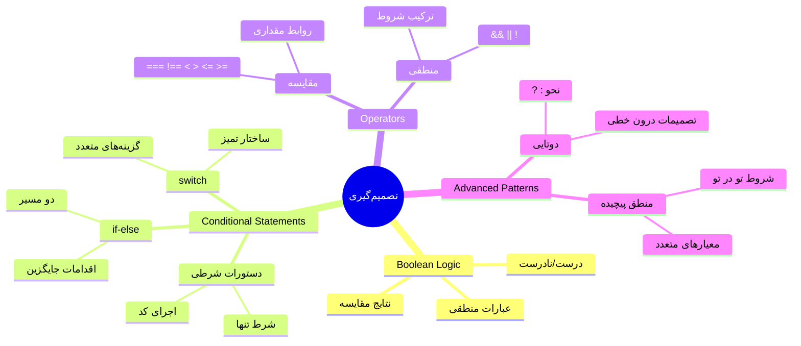
## مروری بر مقادیر بولی

قبل از کاوش در تصمیم‌گیری، بیایید مقادیر بولی را که در درس قبلی آموختیم مرور کنیم. این مقادیر که به افتخار ریاضیدان جورج بول نام‌گذاری شده‌اند، حالت‌های دودویی یعنی `true` یا `false` را نمایش می‌دهند. هیچ ابهامی وجود ندارد، هیچ حالت وسطی نیست.

این مقادیر دودویی زیربنای تمام منطق محاسباتی هستند. هر تصمیمی که برنامه شما می‌گیرد در نهایت به ارزیابی بولی خلاصه می‌شود.

ایجاد متغیرهای بولی ساده است:

```javascript
let myTrueBool = true;
let myFalseBool = false;
```

این دو متغیر با مقادیر بولی مشخص ایجاد می‌کند.

✅ مقادیر بولی از نام ریاضیدان، فیلسوف و منطق‌دان انگلیسی جورج بول (۱۸۱۵–۱۸۶۴) گرفته شده است.

## عملگرهای مقایسه و بولی‌ها

در عمل، به ندرت خودتان به طور دستی مقادیر بولی را تنظیم می‌کنید. بلکه آنها را با ارزیابی شرایط تولید می‌کنید: «آیا این عدد بزرگتر از آن است؟» یا «آیا این مقادیر مساوی هستند؟»

عملگرهای مقایسه این امکان را فراهم می‌کنند. آنها مقادیر را مقایسه کرده و نتیجه‌ی بولی بر اساس رابطه بین دو طرف برمی‌گردانند.

| نماد | توضیح                                                                                                                                                             | مثال               |
| ------ | ------------------------------------------------------------------------------------------------------------------------------------------------------------------ | ------------------ |
| `<`    | **کوچکتر از**: دو مقدار را مقایسه می‌کند و اگر مقدار سمت چپ کمتر از سمت راست باشد، نوع داده بولی `true` برمی‌گرداند                                         | `5 < 6 // true`    |
| `<=`   | **کوچکتر یا مساوی**: دو مقدار را مقایسه می‌کند و اگر مقدار سمت چپ کمتر یا مساوی سمت راست باشد، نوع داده بولی `true` برمی‌گرداند                              | `5 <= 6 // true`   |
| `>`    | **بزرگتر از**: دو مقدار را مقایسه می‌کند و اگر مقدار سمت چپ بزرگتر از سمت راست باشد، نوع داده بولی `true` برمی‌گرداند                                         | `5 > 6 // false`   |
| `>=`   | **بزرگتر یا مساوی**: دو مقدار را مقایسه می‌کند و اگر مقدار سمت چپ بزرگتر یا مساوی سمت راست باشد، نوع داده بولی `true` برمی‌گرداند                            | `5 >= 6 // false`  |
| `===`  | **برابری سختگیرانه**: دو مقدار را با هم مقایسه می‌کند و تنها زمانی `true` برمی‌گرداند که دو مقدار هم برابر و هم نوع داده‌شان یکسان باشد                      | `5 === 6 // false` |
| `!==`  | **نابرابری**: دو مقدار را مقایسه می‌کند و برعکس مقدار برگردانده شده توسط عملگر برابری سختگیرانه را ارائه می‌دهد                                               | `5 !== 6 // true`  |

✅ با نوشتن چند مقایسه در کنسول مرورگرتان دانش خود را بسنجید. آیا داده‌ای برگشتی برای شما شگفت‌آور بود؟

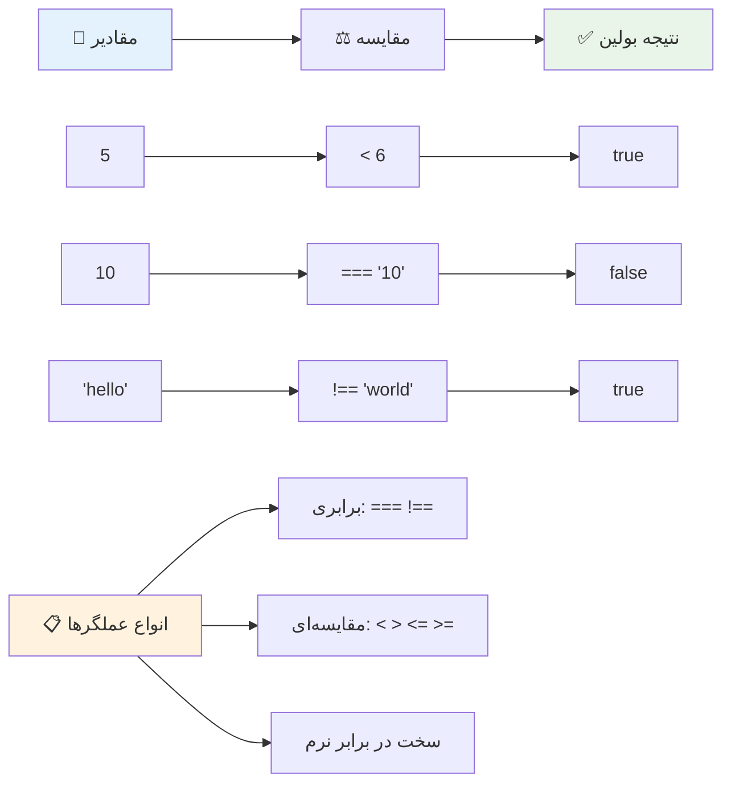
### 🧠 **آزمون تسلط بر مقایسه: درک منطق بولی**

**درک خود از مقایسه را بسنجید:**
- چرا فکر می‌کنید `===` (برابری سختگیرانه) عموماً نسبت به `==` (برابری سست) ترجیح داده می‌شود؟
- می‌توانید پیش‌بینی کنید که `5 === '5'` چه نتیجه‌ای می‌دهد؟ و `5 == '5'` چه؟
- تفاوت بین `!==` و `!=` چیست؟

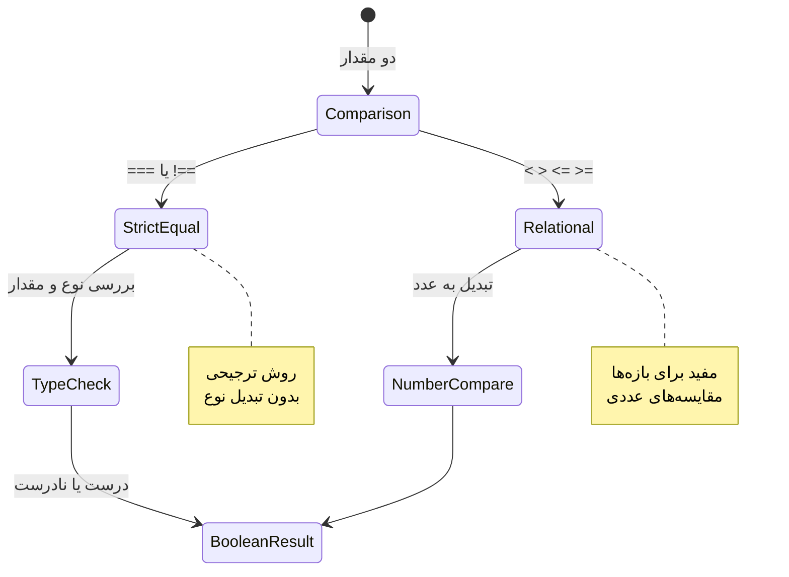
> **نکته حرفه‌ای**: همیشه برای بررسی برابری از `===` و `!==` استفاده کنید مگر این‌که به طور مشخص به تبدیل نوع نیاز داشته باشید. این کار از رفتارهای غیرمنتظره جلوگیری می‌کند!

## دستور if

دستور `if` مثل پرسیدن یک سوال در کد شما است. «اگر این شرط درست بود، این کار را انجام بده.» احتمالاً مهم‌ترین ابزاری است که برای گرفتن تصمیم در جاوااسکریپت استفاده خواهید کرد.

نحوه کار آن به این شکل است:

```javascript
if (condition) {
  // شرط درست است. کد در این بلوک اجرا خواهد شد.
}
```

شرط درون پرانتزها قرار می‌گیرد، و اگر `true` باشد، جاوااسکریپت کد داخل آکولادها را اجرا می‌کند. اگر `false` باشد، کل بلاک را رد می‌کند.

معمولاً از عملگرهای مقایسه برای ساخت این شرایط استفاده می‌کنید. بیایید یک مثال عملی ببینیم:

```javascript
let currentMoney = 1000;
let laptopPrice = 800;

if (currentMoney >= laptopPrice) {
  // شرط برقرار است. کد در این بلوک اجرا خواهد شد.
  console.log("Getting a new laptop!");
}
```

چون `1000 >= 800` برابر با `true` است، کد داخل بلاک اجرا می‌شود و پیام "خرید لپ‌تاپ جدید!" در کنسول نمایش داده می‌شود.

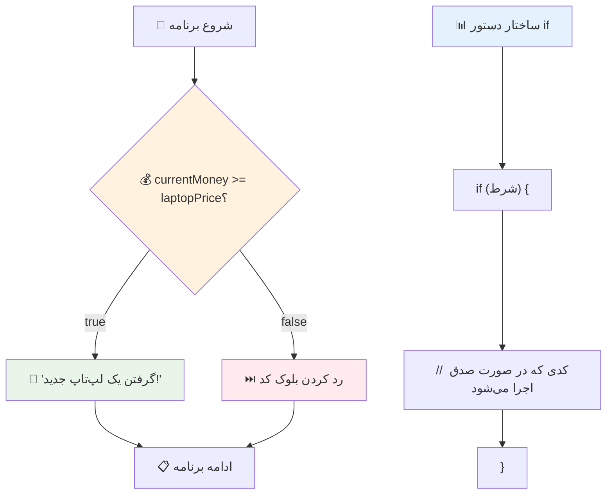
## دستور If..Else

اما اگر بخواهید برنامه‌تان وقتی شرط `false` است کار متفاوتی انجام دهد چی؟ در اینجا `else` وارد می‌شود – مثل داشتن یک برنامه پشتیبان است.

دستور `else` به شما امکان می‌دهد بگویید «اگر این شرط درست نبود، این کار را انجام بده.»

```javascript
let currentMoney = 500;
let laptopPrice = 800;

if (currentMoney >= laptopPrice) {
  // شرط درست است. کد در این بلوک اجرا خواهد شد.
  console.log("Getting a new laptop!");
} else {
  // شرط نادرست است. کد در این بلوک اجرا خواهد شد.
  console.log("Can't afford a new laptop, yet!");
}
```

حال چون `500 >= 800` برابر با `false` است، جاوااسکریپت بلاک اول را رد کرده و بلاک `else` را اجرا می‌کند. پیام "فعلاً به لپ‌تاپ جدید نمی‌توانم بپردازم!" در کنسول نمایش داده می‌شود.

✅ فهم خود را از این کد و کدهای بعدی با اجرای آن در کنسول مرورگر بسنجید. متغیرهای currentMoney و laptopPrice را تغییر دهید تا نتیجه‌ی تابع `console.log()` متفاوت شود.

### 🎯 **آزمون منطق If-Else: شاخه‌های مسیر**

**درک خود از منطق شرطی را بسنجید:**
- اگر `currentMoney` دقیقاً برابر با `laptopPrice` باشد چه اتفاقی می‌افتد؟
- می‌توانید یک موقعیت دنیای واقعی فکر کنید که در آن منطق if-else مفید باشد؟
- چگونه می‌توانید این را برای پوشش چند بازه قیمتی گسترش دهید؟

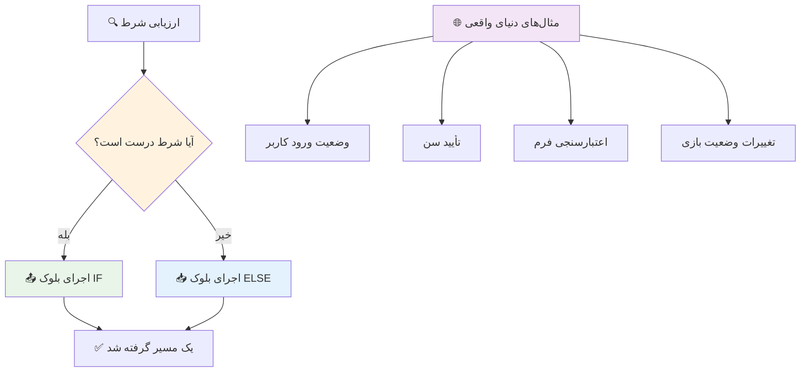
> **بینش کلیدی**: ساختار if-else تضمین می‌کند که دقیقاً یک مسیر انتخاب شود، پس برنامه شما همیشه پاسخی به هر شرط دارد!

## دستور switch

گاهی اوقات باید یک مقدار را با گزینه‌های متعدد مقایسه کنید. در حالی که می‌توانید چندین دستور `if..else` به هم زنجیر کنید، این روش پیچیده و نامرتب می‌شود. دستور `switch` ساختاری تمیزتر برای مدیریت چند مقدار جداگانه فراهم می‌کند.

این مفهوم شبیه سیستم‌های سوئیچینگ مکانیکی در مبادلات تلفنی اولیه است – یک مقدار ورودی مشخص می‌کند کدام مسیر اجرا باید دنبال شود.

```javascript
switch (expression) {
  case x:
    // بلوک کد
    break;
  case y:
    // بلوک کد
    break;
  default:
    // بلوک کد
}
```

ساختار آن به این شکل است:
- جاوااسکریپت عبارت را یک بار ارزیابی می‌کند
- هر `case` را برای یافتن مطابقت بررسی می‌کند
- وقتی مطابقت پیدا کرد، آن بلاک کد را اجرا می‌کند
- `break` به جاوااسکریپت می‌گوید که از switch خارج شود
- اگر هیچ case‌ای مطابقت نکند، بلاک `default` (اگر وجود داشته باشد) اجرا می‌شود

```javascript
// برنامه‌ای با استفاده از دستور switch برای روز هفته
let dayNumber = 2;
let dayName;

switch (dayNumber) {
  case 1:
    dayName = "Monday";
    break;
  case 2:
    dayName = "Tuesday";
    break;
  case 3:
    dayName = "Wednesday";
    break;
  default:
    dayName = "Unknown day";
    break;
}
console.log(`Today is ${dayName}`);
```

در این مثال، جاوااسکریپت می‌بیند متغیر `dayNumber` برابر با `2` است، `case 2` را پیدا کرده، `dayName` را به "سه‌شنبه" تنظیم می‌کند، سپس از switch خارج می‌شود. نتیجه؟ پیام "امروز سه‌شنبه است" در کنسول ثبت می‌شود.

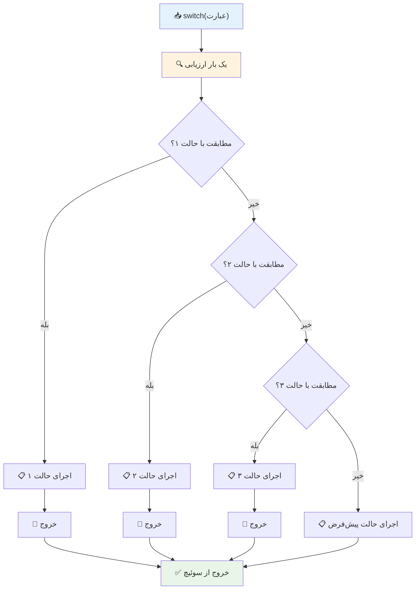
✅ فهم خود را از این کد و کد بعدی با اجرای آن در کنسول مرورگر بسنجید. مقدار متغیر a را تغییر دهید تا نتیجه‌ی `console.log()` متفاوت شود.

### 🔄 **آزمون تسلط بر دستور switch: گزینه‌های متعدد**

**درک خود از switch را بسنجید:**
- اگر فراموش کنید `break` بنویسید چه اتفاقی می‌افتد؟
- چه زمانی از `switch` به جای چندین `if-else` استفاده می‌کنید؟
- چرا وجود case `default` حتی زمانی که فکر می‌کنید همه گزینه‌ها را پوشش داده‌اید مفید است؟

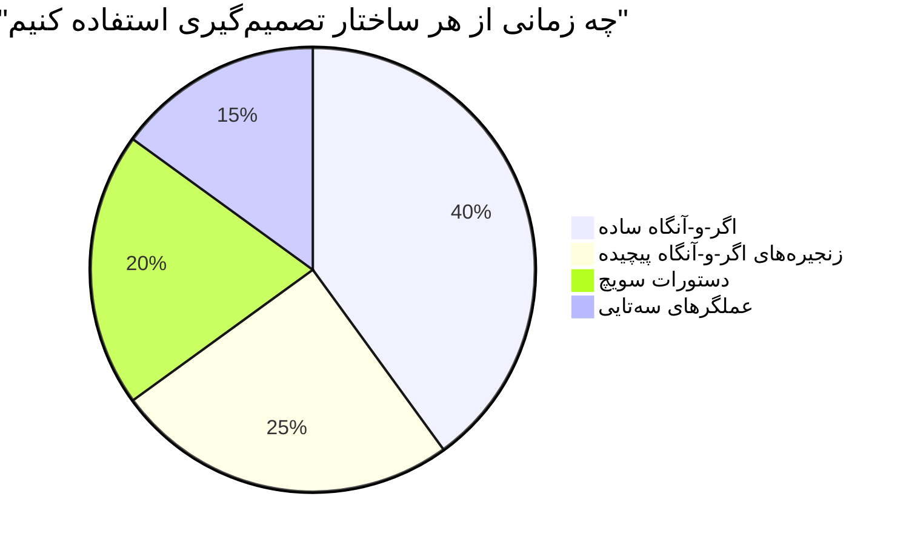
> **بهترین روش**: وقتی یک متغیر را با چند مقدار خاص مقایسه می‌کنید از `switch` استفاده کنید. برای بررسی بازه‌ها یا شرایط پیچیده از `if-else` استفاده کنید!

## عملگرهای منطقی و بولی‌ها

تصمیم‌گیری‌های پیچیده اغلب نیازمند ارزیابی همزمان چند شرط هستند. همان‌طور که جبر بول به ریاضیدانان اجازه می‌دهد عبارات منطقی را ترکیب کنند، برنامه‌نویسی نیز عملگرهای منطقی را برای اتصال چند شرط بولی فراهم می‌کند.

این عملگرها امکان منطق شرطی پیشرفته را با ترکیب ارزیابی‌های ساده درست/نادرست فراهم می‌کنند.

| نماد | توضیح                                                                                         | مثال                                                                  |
| ------ | --------------------------------------------------------------------------------------------- | -------------------------------------------------------------------- |
| `&&`   | **و منطقی**: دو عبارت بولی را مقایسه می‌کند. فقط زمانی `true` می‌دهد که هر دو طرف درست باشند   | `(5 > 3) && (5 < 10) // هر دو درست‌اند، نتیجه true است`             |
| `\|\|` | **یا منطقی**: دو عبارت بولی را مقایسه می‌کند. اگر حداقل یکی از طرفین درست باشد نتیجه true است | `(5 > 10) \|\| (5 < 10) // یکی نادرست و دیگری درست است، نتیجه true` |
| `!`    | **نقیض منطقی**: مقدار مخالف یک عبارت بولی را برمی‌گرداند                                    | `!(5 > 10) // ۵ بزرگ‌تر از ۱۰ نیست، پس '!' آن را درست می‌کند`      |

این عملگرها به شما امکان می‌دهند شرایط را به روش‌های مفید ترکیب کنید:
- AND (`&&`) یعنی هر دو شرط باید درست باشند
- OR (`||`) یعنی حداقل یکی از شرط‌ها باید درست باشد  
- NOT (`!`) درست را به نادرست (و بالعکس) تبدیل می‌کند

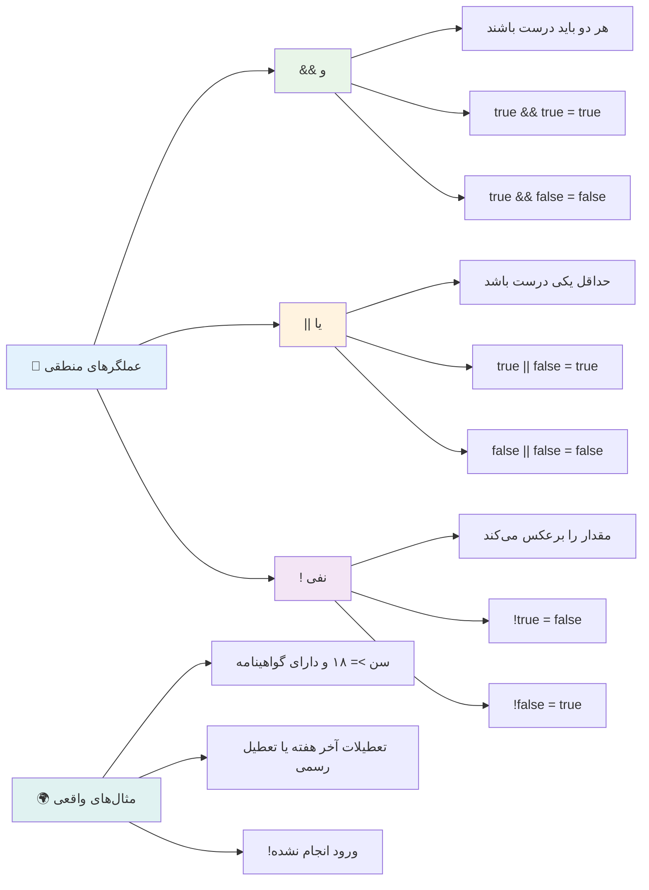
## شرایط و تصمیم‌ها با عملگرهای منطقی

بیایید این عملگرهای منطقی را در یک مثال واقعی‌تر ببینیم:

```javascript
let currentMoney = 600;
let laptopPrice = 800;
let laptopDiscountPrice = laptopPrice - (laptopPrice * 0.2); // قیمت لپ‌تاپ با ۲۰ درصد تخفیف

if (currentMoney >= laptopPrice || currentMoney >= laptopDiscountPrice) {
  // شرط برقرار است. کد در این بخش اجرا خواهد شد.
  console.log("Getting a new laptop!");
} else {
  // شرط برقرار نیست. کد در این بخش اجرا خواهد شد.
  console.log("Can't afford a new laptop, yet!");
}
```

در این مثال: ابتدا قیمت ۲۰٪ تخفیف (640) محاسبه می‌شود، سپس بررسی می‌شود که آیا موجودی ما قیمت کامل یا قیمت تخفیفی را پوشش می‌دهد یا نه. چون 600 کمتر از حداقل قیمت تخفیفی 640 است، نتیجه شرط `true` است.

### 🧮 **آزمون عملگرهای منطقی: ترکیب شرایط**

**درک خود از عملگرهای منطقی را بسنجید:**
- در عبارت `A && B`، اگر A نادرست باشد چه اتفاقی می‌افتد؟ آیا B حتی ارزیابی می‌شود؟
- می‌توانید شرایطی فکر کنید که نیاز به هر سه عملگر (&&, ||, !) همزمان باشد؟
- تفاوت بین `!user.isActive` و `user.isActive !== true` چیست؟

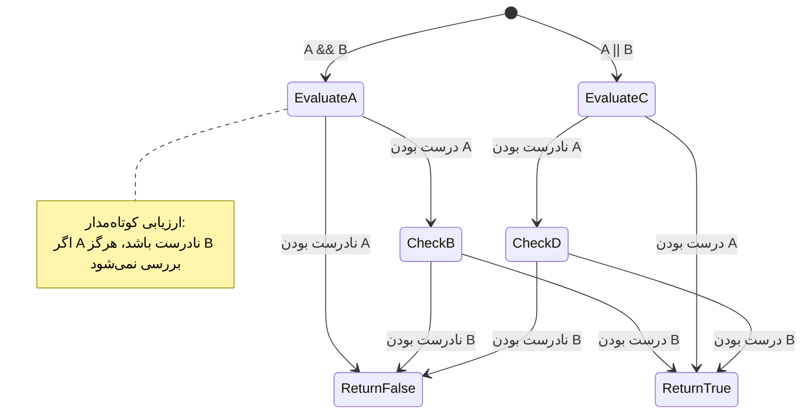
> **نکته عملکردی**: جاوااسکریپت از "ارزیابی کوتاه‌مدار" استفاده می‌کند - در `A && B` اگر A نادرست باشد، B اصلاً ارزیابی نمی‌شود. از این به سود خود استفاده کنید!

### عملگر نقیض

گاهی اوقات راحت‌تر است به سراغ زمانی برویم که چیزی درست نیست. مثلا به جای پرسیدن «آیا کاربر وارد شده است؟»، می‌پرسید «آیا کاربر وارد نشده است؟» علامت تعجب (`!`) منطق شما را معکوس می‌کند.

```javascript
if (!condition) {
  // اجرا می‌شود اگر شرط نادرست باشد
} else {
  // اجرا می‌شود اگر شرط درست باشد
}
```

عملگر `!` مثل این است که بگویید «برعکس...» – اگر چیزی `true` باشد، `!` آن را به `false` تبدیل می‌کند و بالعکس.

### عبارات شرطی سه‌تایی

برای تعیین مقدار به صورت شرطی ساده، جاوااسکریپت عملگر **سه‌تایی (ternary)** را ارائه می‌دهد. این نحو مختصر به شما اجازه می‌دهد یک عبارت شرطی را در یک خط بنویسید، که وقتی نیاز دارید بین دو مقدار یکی را بر اساس شرط انتخاب کنید، مفید است.

```javascript
let variable = condition ? returnThisIfTrue : returnThisIfFalse;
```

این عبارت مثل یک سوال خوانده می‌شود: «آیا این شرط درست است؟ اگر بله، این مقدار را استفاده کن. اگر نه، آن مقدار را.»

در زیر یک مثال ملموس‌تر است:

```javascript
let firstNumber = 20;
let secondNumber = 10;
let biggestNumber = firstNumber > secondNumber ? firstNumber : secondNumber;
```

✅ چند لحظه وقت بگذارید و این کد را چند بار بخوانید. آیا می‌فهمید این عملگرها چگونه کار می‌کنند؟

خط زیر می‌گوید: «آیا `firstNumber` بزرگتر از `secondNumber` است؟ اگر بله، `firstNumber` را در `biggestNumber` قرار بده. اگر نه، `secondNumber` را در آن بگذار.»

عملگر سه‌تایی فقط راهی کوتاه‌تر برای نوشتن دستور سنتی `if..else` است:

```javascript
let biggestNumber;
if (firstNumber > secondNumber) {
  biggestNumber = firstNumber;
} else {
  biggestNumber = secondNumber;
}
```

هر دو روش نتایج یکسانی تولید می‌کنند. عملگر سه‌تایی مختصر است، اما ساختار سنتی if-else برای شرایط پیچیده‌تر ممکن است خواناتر باشد.

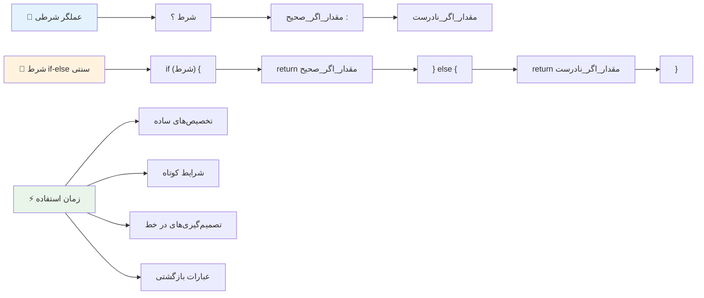
---


## 🚀 چالش

یک برنامه بنویسید که ابتدا با عملگرهای منطقی نوشته شده باشد، سپس با استفاده از عبارت سه‌تایی آن را بازنویسی کنید. نحو مورد علاقه شما کدام است؟

---

## چالش GitHub Copilot Agent 🚀

از حالت Agent استفاده کنید تا چالش زیر را کامل کنید:

**توضیح:** یک ماشین حساب نمره جامع ایجاد کنید که چندین مفهوم تصمیم‌گیری از این درس را نمایش دهد، شامل دستورهای if-else، switch، عملگرهای منطقی و عبارت‌های سه‌تایی.

**درخواست:** یک برنامه جاوااسکریپت بنویسید که نمره عددی یک دانش‌آموز (۰ تا ۱۰۰) را گرفته و درجه نامه او را با معیارهای زیر تعیین کند:
- A: ۹۰ تا ۱۰۰
- B: ۸۰ تا ۸۹  
- C: ۷۰ تا ۷۹
- D: ۶۰ تا ۶۹
- F: کمتر از ۶۰

الزامات:
1. برای تعیین درجه نامه از دستور if-else استفاده کنید
2. استفاده از عملگرهای منطقی برای بررسی اینکه آیا دانش‌آموز قبول شده است (نمره >= ۶۰) و همچنین دارای افتخارات است (نمره >= ۹۰)
3. استفاده از عبارت switch برای ارائه بازخورد خاص برای هر نمره حروفی
4. استفاده از عملگر سه‌تایی برای تعیین اینکه آیا دانش‌آموز واجد شرایط دوره بعدی هست (نمره >= ۷۰)
5. شامل اعتبارسنجی ورودی برای اطمینان از اینکه نمره بین ۰ تا ۱۰۰ است

برنامه خود را با نمرات مختلف از جمله موارد لبه‌ای مانند ۵۹، ۶۰، ۸۹، ۹۰ و ورودی‌های نامعتبر تست کنید.

بیشتر درباره [حالت عامل](https://code.visualstudio.com/blogs/2025/02/24/introducing-copilot-agent-mode) اینجا بیاموزید.


## تست پس از درس

[تست پس از درس](https://ff-quizzes.netlify.app/web/quiz/12)

## مرور و خودآموزی

بیشتر درباره عملگرهای زیادی که برای کاربر در دسترس است [در MDN](https://developer.mozilla.org/docs/Web/JavaScript/Reference/Operators) بخوانید.

از طریق جاش کومئو و جستجوی عالی او درباره عملگرها عبور کنید [operator lookup](https://joshwcomeau.com/operator-lookup/)!

## تمرین

[عملگرها](assignment.md)

---

## 🧠 **خلاصه جعبه‌ابزار تصمیم‌گیری شما**

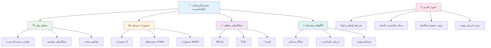
---

## 🚀 جدول زمانبندی تسلط شما بر تصمیم‌گیری در جاوااسکریپت

### ⚡ **کارهایی که می‌توانید در ۵ دقیقه آینده انجام دهید**
- [ ] تمرین عملگرهای مقایسه‌ای در کنسول مرورگر خود
- [ ] نوشتن یک عبارت ساده if-else که سن شما را بررسی می‌کند
- [ ] چالش: بازنویسی یک if-else با استفاده از عملگر سه‌تایی
- [ ] آزمایش آنچه با مقادیر "صحیح" و "غلط" مختلف اتفاق می‌افتد

### 🎯 **کارهایی که می‌توانید در این ساعت به انجام برسانید**
- [ ] تکمیل تست پس از درس و مرور مفاهیم مبهم
- [ ] ساخت ماشین حساب جامع نمره از چالش GitHub Copilot
- [ ] ایجاد یک درخت تصمیم ساده برای یک سناریوی واقعی (مثل انتخاب لباس)
- [ ] تمرین ترکیب چندین شرط با عملگرهای منطقی
- [ ] آزمایش با عبارت‌های switch برای موارد مختلف

### 📅 **تسلط هفتگی شما بر منطق**
- [ ] انجام تمرین عملگرها با مثال‌های خلاقانه
- [ ] ساخت یک نرم‌افزار تست کوچک با استفاده از ساختارهای شرطی مختلف
- [ ] ایجاد یک اعتبارسنج فرم که چندین شرط ورودی را بررسی می‌کند
- [ ] تمرین تمرین‌های جاش کومئو در [operator lookup](https://joshwcomeau.com/operator-lookup/)
- [ ] بازسازی کد موجود برای استفاده از ساختارهای شرطی مناسب‌تر
- [ ] مطالعه ارزیابی کوتاه‌مدت و پیامدهای عملکردی

### 🌟 **تحول ماهانه شما**
- [ ] تسلط بر شرایط پیچیده تو در تو و حفظ خوانایی کد
- [ ] ساخت برنامه‌ای با منطق تصمیم‌گیری پیشرفته
- [ ] کمک به منبع باز با بهبود منطق شرطی در پروژه‌های موجود
- [ ] آموزش به دیگران درباره ساختارهای شرطی مختلف و زمان استفاده از هر یک
- [ ] کاوش در رویکردهای برنامه‌نویسی تابعی برای منطق شرطی
- [ ] ایجاد یک راهنمای مرجع شخصی برای بهترین شیوه‌های شرطی

### 🏆 **بررسی قهرمان نهایی تصمیم‌گیری**

**تسلط خود بر تفکر منطقی را جشن بگیرید:**
- پیچیده‌ترین منطق تصمیم‌گیری که با موفقیت پیاده‌سازی کرده‌اید چیست؟
- کدام ساختار شرطی برای شما طبیعی‌تر به نظر می‌رسد و چرا؟
- یادگیری درباره عملگرهای منطقی چگونه روش حل مسئله شما را تغییر داده است؟
- کدام کاربرد واقعی از منطق تصمیم‌گیری پیشرفته سود خواهد برد؟

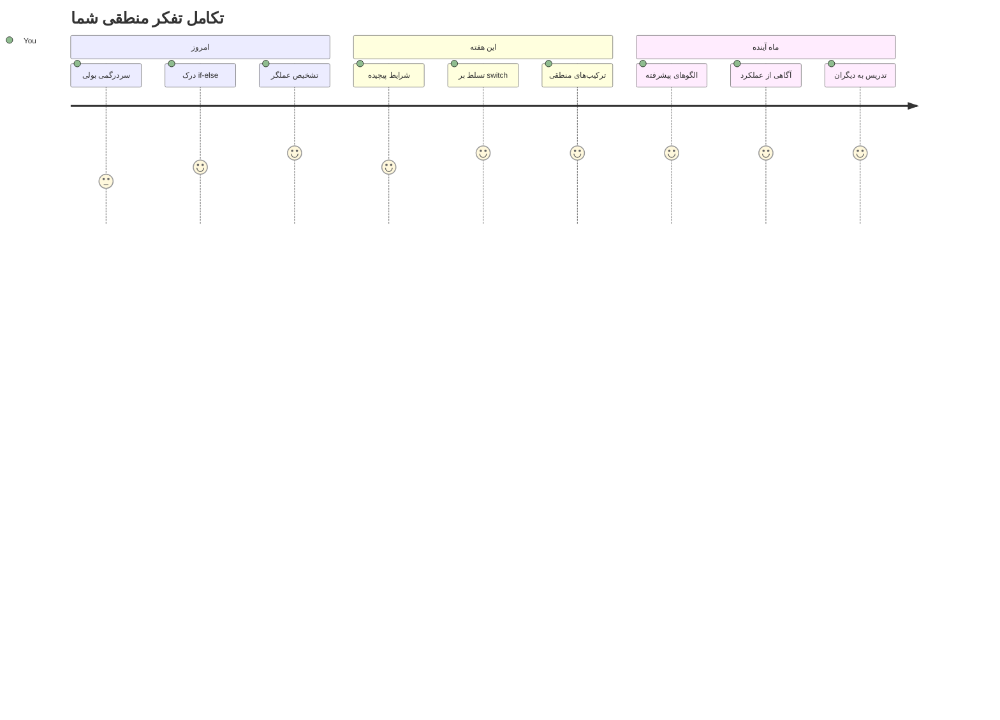
> 🧠 **شما هنر تصمیم‌گیری دیجیتال را تسلط یافته‌اید!** هر برنامه تعاملی به منطق شرطی وابسته است تا به صورت هوشمندانه به اقدامات کاربر و شرایط متغیر پاسخ دهد. اکنون می‌دانید چگونه برنامه‌های خود را وادار کنید که فکر کنند، ارزیابی کنند و پاسخ‌های مناسب را انتخاب کنند. این پایه منطقی نیروی محرکه هر برنامه پویا خواهد بود که می‌سازید! 🎉

---

<!-- CO-OP TRANSLATOR DISCLAIMER START -->
**سلب مسؤولیت**:  
این سند با استفاده از سرویس ترجمه هوش مصنوعی [Co-op Translator](https://github.com/Azure/co-op-translator) ترجمه شده است. در حالی که ما در تلاش برای دقت هستیم، لطفاً توجه داشته باشید که ترجمه‌های خودکار ممکن است شامل خطاها یا نادرستی‌هایی باشند. سند اصلی به زبان بومی خود باید به عنوان منبع معتبر در نظر گرفته شود. برای اطلاعات حیاتی، ترجمه حرفه‌ای انسانی توصیه می‌شود. ما مسئول هیچ گونه سوءتفاهم یا تفسیر نادرستی که ناشی از استفاده از این ترجمه باشد، نیستیم.
<!-- CO-OP TRANSLATOR DISCLAIMER END -->