<!--
CO_OP_TRANSLATOR_METADATA:
{
  "original_hash": "1710a50a519a6e4a1b40a5638783018d",
  "translation_date": "2026-01-06T09:54:04+00:00",
  "source_file": "2-js-basics/4-arrays-loops/README.md",
  "language_code": "fa"
}
-->
# مبانی جاوااسکریپت: آرایه‌ها و حلقه‌ها


> نقاشی دست‌ساز از [Tomomi Imura](https://twitter.com/girlie_mac)

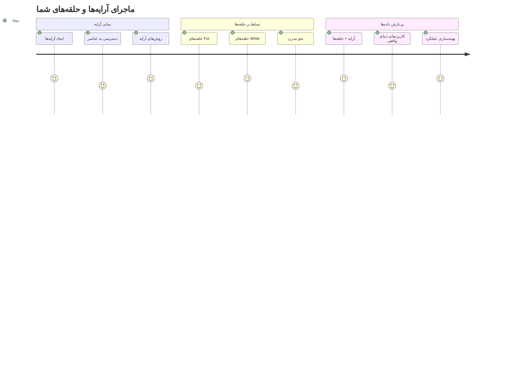
## آزمون پیش از درس
[آزمون پیش از درس](https://ff-quizzes.netlify.app/web/quiz/13)

کسی تا به حال فکر کرده چگونه وب‌سایت‌ها اقلام سبد خرید را پیگیری می‌کنند یا فهرست دوستان شما را نمایش می‌دهند؟ اینجاست که آرایه‌ها و حلقه‌ها وارد میدان می‌شوند. آرایه‌ها مانند مخازن دیجیتال هستند که چندین قطعه اطلاعات را در خود نگه می‌دارند، در حالی که حلقه‌ها به شما امکان می‌دهند با همه آن داده‌ها به طور مؤثر و بدون کد تکراری کار کنید.

این دو مفهوم در کنار هم پایه‌ای برای مدیریت اطلاعات در برنامه‌های شما هستند. شما یاد خواهید گرفت که چگونه از نوشتن دستی هر مرحله به ساخت کدی هوشمند و کارآمد که می‌تواند صدها یا حتی هزاران مورد را سریع پردازش کند، حرکت کنید.

تا پایان این درس، خواهید فهمید که چگونه کارهای پیچیده داده‌ای را تنها با چند خط کد انجام دهید. بیایید این مفاهیم اساسی برنامه‌نویسی را کشف کنیم.

[](https://youtube.com/watch?v=1U4qTyq02Xw "آرایه‌ها")

[](https://www.youtube.com/watch?v=Eeh7pxtTZ3k "حلقه‌ها")

> 🎥 برای دیدن ویدیوهای مربوط به آرایه‌ها و حلقه‌ها روی تصاویر بالا کلیک کنید.

> می‌توانید این درس را در [Microsoft Learn](https://docs.microsoft.com/learn/modules/web-development-101-arrays/?WT.mc_id=academic-77807-sagibbon) نیز دنبال کنید!

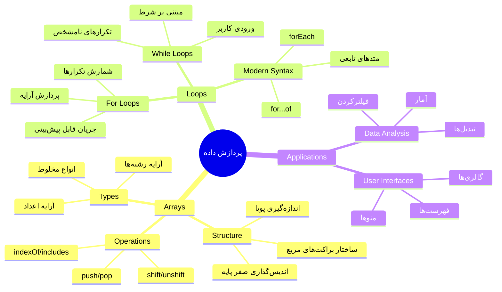
## آرایه‌ها

آرایه‌ها را مانند یک کشوی فایل دیجیتال تصور کنید - به جای ذخیره یک سند در هر کشو، می‌توانید چندین مورد مرتبط را در یک مخزن سازمان‌یافته نگه دارید. به زبان برنامه‌نویسی، آرایه‌ها به شما اجازه می‌دهند چندین قطعه اطلاعات را در یک بسته بندی منظم ذخیره کنید.

چه در حال ساخت یک گالری عکس باشید، چه مدیریت یک لیست کارها یا پیگیری امتیازات بالا در بازی، آرایه‌ها پایه‌ای برای سازماندهی داده‌ها فراهم می‌کنند. بیایید ببینیم چگونه کار می‌کنند.

✅ آرایه‌ها همه جا هستند! می‌توانید یک مثال واقعی از آرایه را مثال بزنید، مثل آرایه پنل‌های خورشیدی؟

### ایجاد آرایه‌ها

ایجاد یک آرایه بسیار ساده است - فقط کافی است از کروشه‌های مربعی استفاده کنید!

```javascript
// آرایه خالی - مثل یک سبد خرید خالی که منتظر اقلام است
const myArray = [];
```

**چه اتفاقی اینجا می‌افتد؟**
شما همین الان یک مخزن خالی با استفاده از آن کروشه‌های مربعی `[]` ساخته‌اید. تصور کنید مثل یک قفسه کتابخانه خالی است - آماده است تا هر کتابی که می‌خواهید آنجا سازمان‌دهی کنید را در خود نگه دارد.

همچنین می‌توانید آرایه خود را با مقادیر اولیه از همان ابتدا پر کنید:

```javascript
// منوی طعم بستنی مغازه شما
const iceCreamFlavors = ["Chocolate", "Strawberry", "Vanilla", "Pistachio", "Rocky Road"];

// اطلاعات پروفایل یک کاربر (ترکیب انواع مختلف داده)
const userData = ["John", 25, true, "developer"];

// نمرات آزمون برای کلاس مورد علاقه شما
const scores = [95, 87, 92, 78, 85];
```

**نکات جالب برای توجه:**
- می‌توانید متن، اعداد، یا حتی مقادیر درست/نادرست را در همان آرایه ذخیره کنید
- فقط هر مورد را با کاما جدا کنید - ساده است!
- آرایه‌ها برای نگهداری اطلاعات مرتبط با هم فوق‌العاده‌اند

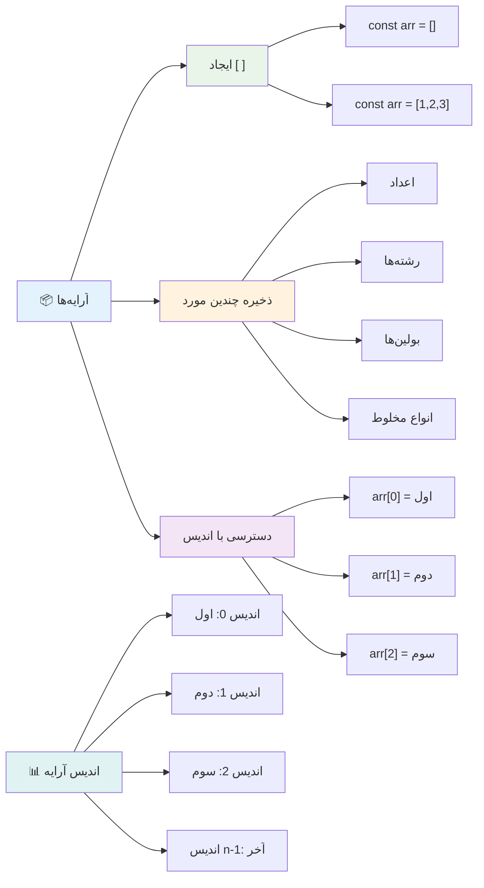
### ایندکس‌گذاری آرایه

یک نکته‌ای که شاید اول کمی غیرعادی به نظر برسد: آرایه‌ها اقلام خود را از شماره ۰ شمارش می‌کنند، نه ۱. این شماره‌گذاری از صفر منشأ در نحوه کار حافظه کامپیوتر دارد - و یک قرارداد برنامه‌نویسی از زمان‌های ابتدایی زبان‌هایی مانند C است. هر خانه در آرایه یک شماره آدرس مخصوص به خود به نام **ایندکس** دارد.

| ایندکس | مقدار | توضیح |
|-------|-------|-------------|
| 0 | "شکلاتی" | عنصر اول |
| 1 | "توت فرنگی" | عنصر دوم |
| 2 | "وانیلی" | عنصر سوم |
| 3 | "پسته‌ای" | عنصر چهارم |
| 4 | "راک رود" | عنصر پنجم |

✅ آیا تعجب می‌کنید که آرایه‌ها از ایندکس صفر شروع می‌شوند؟ در برخی زبان‌های برنامه‌نویسی، ایندکس‌ها از ۱ شروع می‌شوند. تاریخچه جالبی درباره این موضوع وجود دارد که می‌توانید در [ویکی‌پدیا](https://en.wikipedia.org/wiki/Zero-based_numbering) بخوانید.

**دسترسی به عناصر آرایه:**

```javascript
const iceCreamFlavors = ["Chocolate", "Strawberry", "Vanilla", "Pistachio", "Rocky Road"];

// دسترسی به عناصر فردی با استفاده از نماد کروشه
console.log(iceCreamFlavors[0]); // "شکلات" - اولین عنصر
console.log(iceCreamFlavors[2]); // "وانیل" - سومین عنصر
console.log(iceCreamFlavors[4]); // "راکى رود" - آخرین عنصر
```

**تجزیه و تحلیل آنچه اینجا رخ می‌دهد:**
- **استفاده** از علامت کروشه با شماره ایندکس برای دسترسی به عناصر
- **بازگرداندن** مقدار ذخیره شده در آن موقعیت خاص آرایه
- **شروع** شمارش از ۰ به طوری که اولین عنصر ایندکس ۰ دارد

**تغییر عناصر آرایه:**

```javascript
// تغییر یک مقدار موجود
iceCreamFlavors[4] = "Butter Pecan";
console.log(iceCreamFlavors[4]); // "بادام زمینی کره‌ای"

// افزودن یک عنصر جدید در انتها
iceCreamFlavors[5] = "Cookie Dough";
console.log(iceCreamFlavors[5]); // "خمیر کوکی"
```

**در نمونه بالا، ما:**
- **عنصر** ایندکس ۴ را از "راک رود" به "باتر پیکان" تغییر دادیم
- **یک عنصر جدید** "کاکی دو" را در ایندکس ۵ اضافه کردیم
- **اندازه آرایه** را هنگام اضافه کردن فراتر از محدودیت‌های فعلی به طور خودکار افزایش دادیم

### طول آرایه و روش‌های رایج

آرایه‌ها با خصوصیات و روش‌های داخلی می‌آیند که کار با داده‌ها را بسیار آسان‌تر می‌کنند.

**یافتن طول آرایه:**

```javascript
const iceCreamFlavors = ["Chocolate", "Strawberry", "Vanilla", "Pistachio", "Rocky Road"];
console.log(iceCreamFlavors.length); // ۵

// طول به صورت خودکار با تغییر آرایه به‌روزرسانی می‌شود
iceCreamFlavors.push("Mint Chip");
console.log(iceCreamFlavors.length); // ۶
```

**نکات کلیدی برای به خاطر سپردن:**
- **تعداد کل** عناصر موجود در آرایه را بازمی‌گرداند
- **به صورت خودکار** هنگام اضافه یا حذف عناصر به‌روزرسانی می‌شود
- **ارائه** شمارش پویا که در حلقه‌ها و اعتبارسنجی‌ها استفاده می‌شود

**روش‌های مهم آرایه:**

```javascript
const fruits = ["apple", "banana", "orange"];

// افزودن عناصر
fruits.push("grape");           // اضافه کردن به انتها: ["apple", "banana", "orange", "grape"]
fruits.unshift("strawberry");   // اضافه کردن به ابتدا: ["strawberry", "apple", "banana", "orange", "grape"]

// حذف عناصر
const lastFruit = fruits.pop();        // حذف و بازگرداندن "grape"
const firstFruit = fruits.shift();     // حذف و بازگرداندن "strawberry"

// یافتن عناصر
const index = fruits.indexOf("banana"); // بازگرداندن ۱ (موقعیت "banana")
const hasApple = fruits.includes("apple"); // بازگرداندن true
```

**درک این روش‌ها:**
- **اضافه کردن** عناصر با `push()` (پایان) و `unshift()` (شروع)
- **حذف** عناصر با `pop()` (پایان) و `shift()` (شروع)
- **یافتن** عناصر با `indexOf()` و بررسی وجود با `includes()`
- **بازگرداندن** مقادیری مثل عناصر حذف شده یا ایندکس محل‌ها

✅ خودتان امتحان کنید! در کنسول مرورگر خود آرایه‌ای بسازید و آن را دستکاری کنید.

### 🧠 **بررسی اصول آرایه: سازماندهی داده‌های شما**

**درک خود را از آرایه تست کنید:**
- چرا فکر می‌کنید آرایه‌ها شمارش را از ۰ شروع می‌کنند نه ۱؟
- اگر تلاش کنید به ایندکسی دسترسی پیدا کنید که وجود ندارد (مانند `arr[100]` در آرایه‌ای با ۵ عنصر)، چه اتفاقی می‌افتد؟
- می‌توانید سه مثال دنیای واقعی که آرایه‌ها در آنها مفید هستند، بیاورید؟

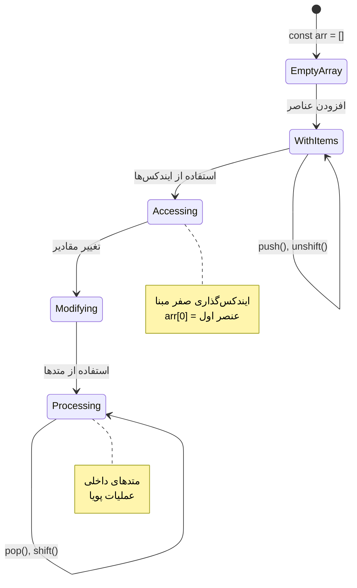
> **بینش دنیای واقعی**: آرایه‌ها در همه جای برنامه‌نویسی هستند! فیدهای رسانه‌های اجتماعی، سبدهای خرید، گالری عکس‌ها، لیست‌های پخش موسیقی — همه‌ی این‌ها پشت صحنه آرایه هستند!

## حلقه‌ها

حلقه‌ها را مانند مجازات مشهور در رمان‌های چارلز دیکنز تصور کنید که دانش‌آموزان مجبور بودند خطوطی را بارها و بارها روی تخته بنویسند. تصور کنید اگر بتوانید به سادگی به کسی بگویید «این جمله را ۱۰۰ بار بنویس» و آن به طور خودکار انجام شود. این دقیقاً همان کاری است که حلقه‌ها برای کد شما انجام می‌دهند.

حلقه‌ها مانند داشتن یک دستیار بی‌وقفه‌اند که می‌تواند وظایف را بدون خطا تکرار کند. چه لازم باشد همه آیتم‌های سبد خرید را بررسی کنید یا تمام عکس‌ها را در یک آلبوم نمایش دهید، حلقه‌ها تکرار را به طور مؤثری مدیریت می‌کنند.

جاوااسکریپت انواع مختلفی از حلقه‌ها را ارائه می‌دهد. بیایید هر کدام را بررسی کنیم و بفهمیم چه زمانی از آنها استفاده کنیم.

```mermaid
flowchart TD
    A["🔄 انواع حلقه‌ها"] --> B["حلقه For"]
    A --> C["حلقه While"]
    A --> D["حلقه For...of"]
    A --> E["متد forEach"]
    
    B --> B1["تکرارهای مشخص"]
    B --> B2["بر اساس شمارنده"]
    B --> B3["for(init; شرط; افزایش)"]
    
    C --> C1["تکرارهای ناشناخته"]
    C --> C2["بر اساس شرط"]
    C --> C3["while(شرط)"]
    
    D --> D1["مدرن ES6+"]
    D --> D2["تکرار آرایه"]
    D --> D3["for(آیتم از آرایه)"]
    
    E --> E1["سبک تابعی"]
    E --> E2["متد آرایه"]
    E --> E3["array.forEach(تابع_تماس)"]
    
    F["⏰ چه زمانی استفاده کنیم"] --> F1["For: شمارش، ایندکس‌ها"]
    F --> F2["While: ورودی کاربر، جستجو"]
    F --> F3["For...of: تکرار ساده"]
    F --> F4["forEach: برنامه‌نویسی تابعی"]
    
    style A fill:#e3f2fd
    style B fill:#e8f5e8
    style C fill:#fff3e0
    style D fill:#f3e5f5
    style E fill:#e0f2f1
    style F fill:#fce4ec
```
### حلقه For

حلقه `for` مانند تنظیم تایمر است - شما دقیقاً می‌دانید چند بار می‌خواهید چیزی اتفاق بیفتد. بسیار منظم و قابل پیش‌بینی است، که آن را برای کار با آرایه‌ها یا شمارش چیزها ایده‌آل می‌کند.

**ساختار حلقه For:**

| بخش | هدف | مثال |
|-----------|---------|----------|
| **مقداردهی اولیه** | تعیین نقطه شروع | `let i = 0` |
| **شرط** | ادامه اجرای حلقه | `i < 10` |
| **افزایش** | نحوه به‌روزرسانی | `i++` |

```javascript
// شمارش از ۰ تا ۹
for (let i = 0; i < 10; i++) {
  console.log(`Count: ${i}`);
}

// مثال کاربردی‌تر: پردازش نمرات
const testScores = [85, 92, 78, 96, 88];
for (let i = 0; i < testScores.length; i++) {
  console.log(`Student ${i + 1}: ${testScores[i]}%`);
}
```

**گام به گام، اینجا چه اتفاقی می‌افتد:**
- **مقداردهی اولیه** متغیر شمارنده `i` برابر ۰ در ابتدا
- **بررسی** شرط `i < 10` قبل از هر تکرار
- **اجرای** بلوک کد وقتی که شرط صحیح باشد
- **افزایش** مقدار `i` به اندازه ۱ بعد از هر تکرار با `i++`
- **توقف** هنگامی که شرط نادرست می‌شود (وقتی `i` به ۱۰ می‌رسد)

✅ این کد را در کنسول مرورگر اجرا کنید. وقتی تغییرات کوچکی در شمارنده، شرط یا قسمت افزایش ایجاد می‌کنید، چه اتفاقی می‌افتد؟ می‌توانید آن را طوری اجرا کنید که عقبگرد کند و شمارش معکوس ایجاد کند؟

### 🗓️ **بررسی تسلط بر حلقه For: تکرار کنترل‌شده**

**درک خود از حلقه for را ارزیابی کنید:**
- سه قسمت حلقه For کدامند و هرکدام چه کاری انجام می‌دهند؟
- چگونه می‌توانید به صورت معکوس روی آرایه حلقه بزنید؟
- اگر قسمت افزایش (`i++`) را فراموش کنید چه اتفاقی می‌افتد؟

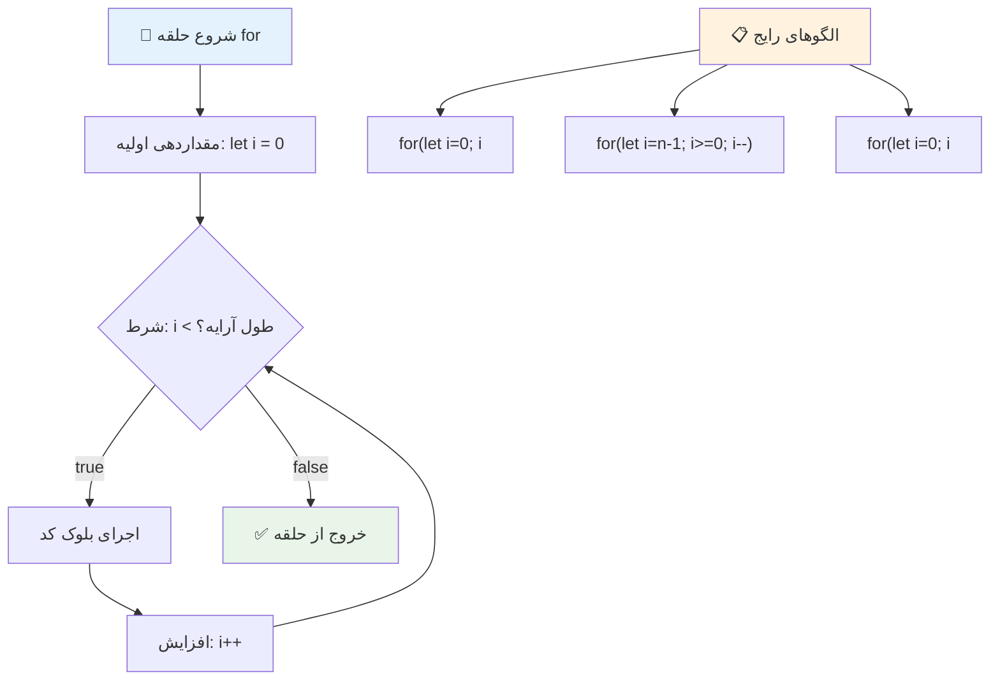
> **حکمت حلقه‌ها**: حلقه‌های For زمانی که دقیقاً می‌دانید چند بار چیزی را باید تکرار کنید، عالی‌اند. آنها رایج‌ترین انتخاب برای پردازش آرایه‌ها هستند!

### حلقه While

حلقه `while` مانند گفتن «ادامه بده تا زمانی که...» است - ممکن است دقیقاً ندانید چند بار اجرا می‌شود، ولی می‌دانید چه زمانی باید متوقف شود. این برای کارهایی مانند گرفتن ورودی از کاربر تا دریافت داده مورد نظر یا جستجو در داده‌ها برای یافتن چیزی، ایده‌آل است.

**ویژگی‌های حلقه While:**
- **تا زمانی که شرط درست باشد** ادامه می‌دهد
- **مدیریت دستی** متغیرهای شمارنده را نیاز دارد
- **شرط را قبل از هر تکرار بررسی می‌کند**
- **ریسک حلقه بی‌نهایت** اگر شرط هرگز نادرست نشود

```javascript
// مثال پایه شمارش
let i = 0;
while (i < 10) {
  console.log(`While count: ${i}`);
  i++; // فراموش نکنید که افزایش دهید!
}

// مثال عملی‌تر: پردازش ورودی کاربر
let userInput = "";
let attempts = 0;
const maxAttempts = 3;

while (userInput !== "quit" && attempts < maxAttempts) {
  userInput = prompt(`Enter 'quit' to exit (attempt ${attempts + 1}):`);
  attempts++;
}

if (attempts >= maxAttempts) {
  console.log("Maximum attempts reached!");
}
```

**درک این مثال‌ها:**
- **مدیریت دستی** متغیر شمارنده `i` داخل بدنه حلقه
- **افزایش شمارنده** برای جلوگیری از حلقه بی‌نهایت
- **نمایش** کاربرد عملی با ورودی کاربر و محدود کردن تعداد تلاش‌ها
- **شامل** مکانیزم‌های ایمنی برای جلوگیری از اجرای بی‌پایان

### ♾️ **بررسی حکمت حلقه While: تکرار مبتنی بر شرط**

**درک خود از حلقه while را امتحان کنید:**
- خطر اصلی هنگام استفاده از حلقه‌های while چیست؟
- چه زمانی حلقه while را به حلقه for ترجیح می‌دهید؟
- چگونه می‌توان از حلقه‌های بی‌نهایت جلوگیری کرد؟

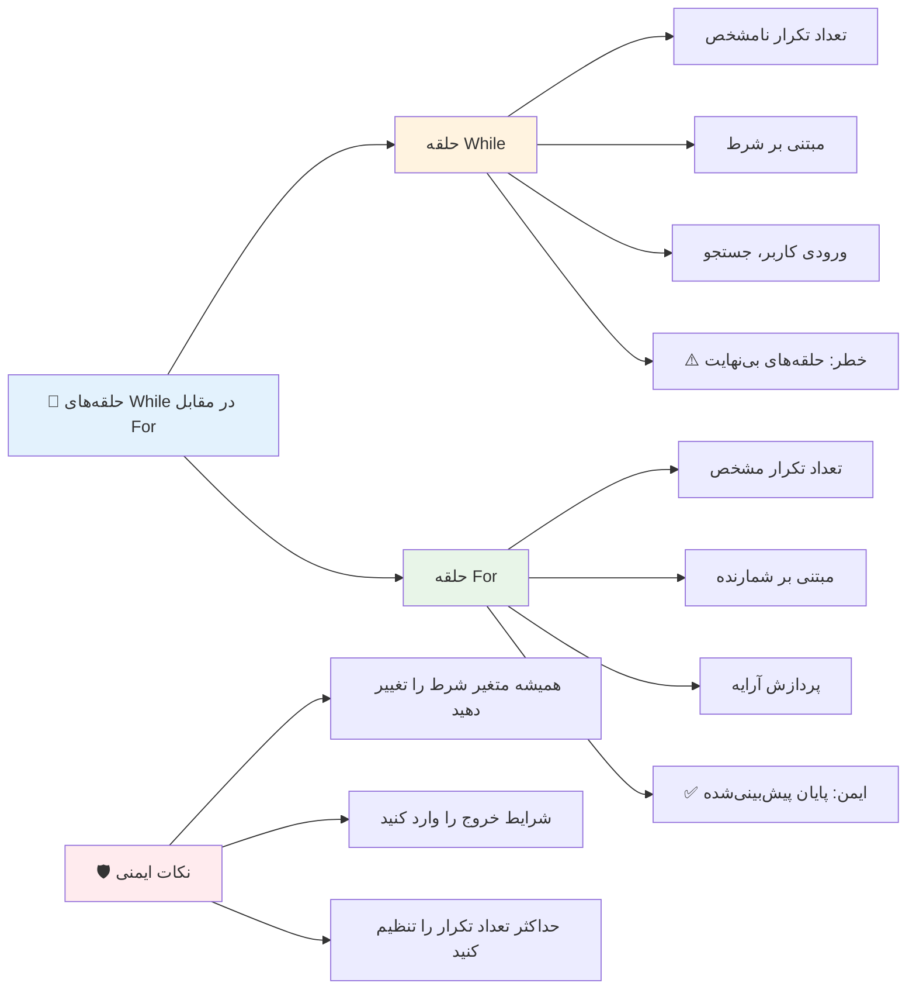
> **اول ایمنی**: حلقه‌های while قدرتمندند اما نیاز به مدیریت دقیق شرط دارند. همیشه مطمئن شوید شرط حلقه در نهایت نادرست می‌شود!

### جایگزین‌های حلقه مدرن

جاوااسکریپت آجهای حلقه مدرنی ارائه می‌دهد که می‌توانند کد شما را خواناتر و کم‌خطاتر کنند.

**حلقه For...of (از ES6 به بعد):**

```javascript
const colors = ["red", "green", "blue", "yellow"];

// رویکرد مدرن - پاک‌تر و ایمن‌تر
for (const color of colors) {
  console.log(`Color: ${color}`);
}

// مقایسه با حلقه for سنتی
for (let i = 0; i < colors.length; i++) {
  console.log(`Color: ${colors[i]}`);
}
```

**مزایای کلیدی for...of:**
- **حذف** مدیریت ایندکس و خطاهای احتمالی در شماره‌گذاری
- **دسترسی مستقیم** به عناصر آرایه
- **افزایش خوانایی** کد و کاهش پیچیدگی سینتکس

**روش forEach:**

```javascript
const prices = [9.99, 15.50, 22.75, 8.25];

// استفاده از forEach برای سبک برنامه‌نویسی تابعی
prices.forEach((price, index) => {
  console.log(`Item ${index + 1}: $${price.toFixed(2)}`);
});

// forEach با توابع فلشی برای عملیات ساده
prices.forEach(price => console.log(`Price: $${price}`));
```

**چیزهایی که باید درباره forEach بدانید:**
- **اجرای** تابعی برای هر عنصر آرایه
- **ارائه** مقدار عنصر و ایندکس به عنوان پارامتر
- **قادر به توقف زودهنگام نیست** (برخلاف حلقه‌های سنتی)
- **بازگرداندن** مقدار undefined (آرایه جدید ایجاد نمی‌کند)

✅ چرا ممکن است حلقه for را به حلقه while ترجیح دهید؟ ۱۷ هزار نفر این سؤال را در StackOverflow داشتند و برخی نظرات [ممکن است برای شما جالب باشد](https://stackoverflow.com/questions/39969145/while-loops-vs-for-loops-in-javascript).

### 🎨 **بررسی سینتکس حلقه مدرن: پذیرش ES6+**

**درک خود را از جاوااسکریپت مدرن ارزیابی کنید:**
- مزایای `for...of` نسبت به حلقه‌های for سنتی چیست؟
- چه زمانی ممکن است هنوز حلقه‌های for سنتی را ترجیح دهید؟
- تفاوت `forEach` و `map` چیست؟

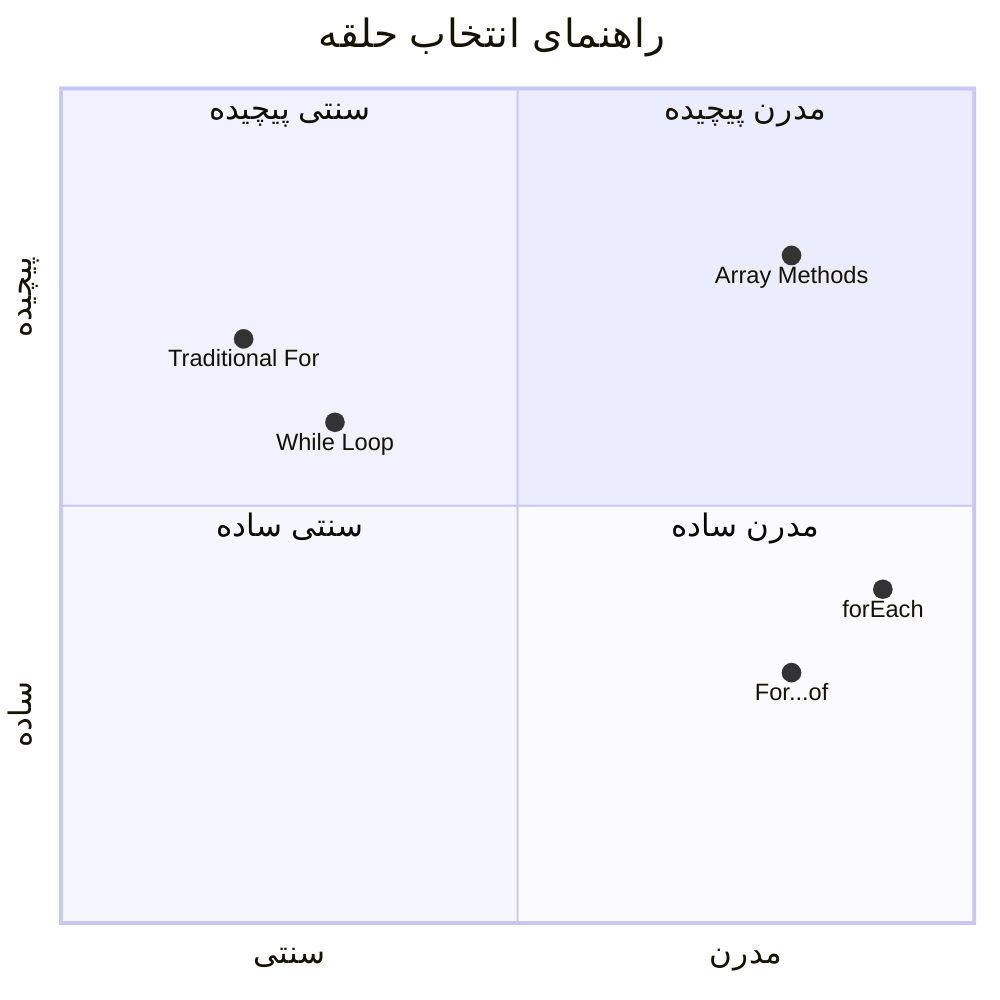
> **روند مدرن**: سینتکس ES6+ مانند `for...of` و `forEach` در حال تبدیل شدن به رویکرد محبوب برای تکرار آرایه‌ها هستند چون پاک‌تر و کمتر خطاپذیرند!

## حلقه‌ها و آرایه‌ها

ترکیب آرایه‌ها با حلقه‌ها قابلیت‌های قدرتمندی برای پردازش داده ایجاد می‌کند. این زوج‌بندی پایه‌ای برای بسیاری از وظایف برنامه‌نویسی است، از نمایش فهرست‌ها گرفته تا محاسبات آماری.

**پردازش سنتی آرایه:**

```javascript
const iceCreamFlavors = ["Chocolate", "Strawberry", "Vanilla", "Pistachio", "Rocky Road"];

// روش کلاسیک حلقه for
for (let i = 0; i < iceCreamFlavors.length; i++) {
  console.log(`Flavor ${i + 1}: ${iceCreamFlavors[i]}`);
}

// روش مدرن for...of
for (const flavor of iceCreamFlavors) {
  console.log(`Available flavor: ${flavor}`);
}
```

**بیایید هر روش را درک کنیم:**
- **استفاده** از خاصیت طول آرایه برای تعیین مرز حلقه
- **دسترسی** به عناصر توسط ایندکس در حلقه‌های for سنتی
- **دسترسی مستقیم** به عناصر در حلقه‌های for...of
- **پردازش** هر عنصر آرایه دقیقاً یک بار

**مثال عملی پردازش داده:**

```javascript
const studentGrades = [85, 92, 78, 96, 88, 73, 89];
let total = 0;
let highestGrade = studentGrades[0];
let lowestGrade = studentGrades[0];

// همه نمرات را با یک حلقه پردازش کنید
for (let i = 0; i < studentGrades.length; i++) {
  const grade = studentGrades[i];
  total += grade;
  
  if (grade > highestGrade) {
    highestGrade = grade;
  }
  
  if (grade < lowestGrade) {
    lowestGrade = grade;
  }
}

const average = total / studentGrades.length;
console.log(`Average: ${average.toFixed(1)}`);
console.log(`Highest: ${highestGrade}`);
console.log(`Lowest: ${lowestGrade}`);
```

**چگونگی کارکرد این کد:**
- **مقداردهی اولیه** متغیرهای پی‌گیری مجموع و مقادیر حداکثر و حداقل
- **پردازش** هر نمره با یک حلقه کارآمد تنها
- **انباشتن** جمع برای محاسبه میانگین
- **پیگیری** مقادیر بیشینه و کمینه در طول تکرار
- **محاسبه** آمار نهایی پس از اتمام حلقه

✅ با حلقه زدن روی آرایه‌ای که خودتان ساخته‌اید در کنسول مرورگر خود آزمایش کنید.

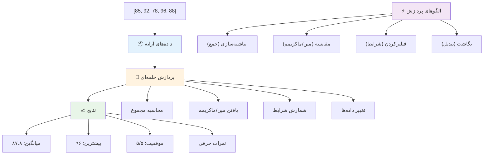
---

## چالش GitHub Copilot Agent 🚀

از حالت Agent استفاده کنید برای کامل کردن چالش زیر:

**شرح:** ساخت یک تابع جامع پردازش داده که آرایه‌ها و حلقه‌ها را ترکیب کند تا مجموعه داده‌ای را تحلیل کرده و بینش‌های معناداری تولید کند.

**دستور:** تابعی به نام `analyzeGrades` بسازید که یک آرایه از اشیای نمرات دانش‌آموزان (هر کدام شامل نام و امتیاز) بگیرد و یک شیء با آمارهایی مانند بالاترین نمره، پایین‌ترین نمره، میانگین نمرات، تعداد دانش‌آموزانی که قبول شده‌اند (امتیاز >= ۷۰) و آرایه‌ای از نام‌های دانش‌آموزان بالاتر از میانگین را بازگرداند. در راه‌حل خود از حداقل دو نوع حلقه مختلف استفاده کنید.

برای اطلاعات بیشتر درباره [حالت Agent](https://code.visualstudio.com/blogs/2025/02/24/introducing-copilot-agent-mode) اینجا را ببینید.

## 🚀 چالش
جاوااسکریپت چندین متد مدرن آرایه‌ای ارائه می‌دهد که می‌توانند جایگزین حلقه‌های سنتی برای وظایف خاص شوند. [forEach](https://developer.mozilla.org/docs/Web/JavaScript/Reference/Global_Objects/Array/forEach)، [for-of](https://developer.mozilla.org/docs/Web/JavaScript/Reference/Statements/for...of)، [map](https://developer.mozilla.org/docs/Web/JavaScript/Reference/Global_Objects/Array/map)، [filter](https://developer.mozilla.org/docs/Web/JavaScript/Reference/Global_Objects/Array/filter) و [reduce](https://developer.mozilla.org/docs/Web/JavaScript/Reference/Global_Objects/Array/reduce) را بررسی کنید.

**چالش شما:** مثال نمرات دانش‌آموزان را با استفاده از حداقل سه متد مختلف آرایه بازنویسی کنید. توجه کنید که چقدر کد با نحو مدرن جاوااسکریپت تمیزتر و خواناتر می‌شود.

## آزمون پس از سخنرانی
[آزمون پس از سخنرانی](https://ff-quizzes.netlify.app/web/quiz/14)


## مرور و مطالعه خودآموز

آرایه‌ها در جاوااسکریپت متدهای زیادی دارند که برای دستکاری داده‌ها بسیار مفید هستند. [در مورد این متدها مطالعه کنید](https://developer.mozilla.org/docs/Web/JavaScript/Reference/Global_Objects/Array) و چندتا از آن‌ها (مثل push، pop، slice و splice) را روی آرایه‌ای که ساخته‌اید امتحان کنید.

## تکلیف

[حلقه زدن روی یک آرایه](assignment.md)

---

## 📊 **خلاصه ابزارهای آرایه‌ها و حلقه‌های شما**

```mermaid
graph TD
    A["🎯 تسلط بر آرایه‌ها و حلقه‌ها"] --> B["📦 مبانی آرایه"]
    A --> C["🔄 انواع حلقه‌ها"]
    A --> D["🔗 پردازش داده‌ها"]
    A --> E["🎨 تکنیک‌های مدرن"]
    
    B --> B1["ایجاد: [ ]"]
    B --> B2["شاخص‌گذاری: arr[0]"]
    B --> B3["متدها: push, pop"]
    B --> B4["ویژگی‌ها: length"]
    
    C --> C1["For: تکرارهای مشخص"]
    C --> C2["While: مبتنی بر شرط"]
    C --> C3["For...of: دسترسی مستقیم"]
    C --> C4["forEach: تابعی"]
    
    D --> D1["محاسبه آمار"]
    D --> D2["تبدیل داده‌ها"]
    D --> D3["فیلتر و جستجو"]
    D --> D4["پردازش بلادرنگ"]
    
    E --> E1["توابع پیکان‌دار"]
    E --> E2["زنجیره‌سازی متدها"]
    E --> E3["بازسازی ساختار"]
    E --> E4["رشته‌های قالب‌بندی"]
    
    F["💡 مزایای کلیدی"] --> F1["مدیریت مؤثر داده‌ها"]
    F --> F2["کاهش تکرار کد"]
    F --> F3["راهکارهای مقیاس‌پذیر"]
    F --> F4["نحو تمیزتر"]
    
    style A fill:#e3f2fd
    style B fill:#e8f5e8
    style C fill:#fff3e0
    style D fill:#f3e5f5
    style E fill:#e0f2f1
    style F fill:#fce4ec
```
---

## 🚀 جدول زمانی تسلط شما بر آرایه‌ها و حلقه‌ها

### ⚡ **کاری که در ۵ دقیقه آینده می‌توانید انجام دهید**
- [ ] یک آرایه از فیلم‌های مورد علاقه‌تان بسازید و به عناصر خاص آن دسترسی پیدا کنید
- [ ] یک حلقه for بنویسید که از ۱ تا ۱۰ بشمرد
- [ ] چالش متدهای مدرن آرایه را که در درس بود امتحان کنید
- [ ] تمرین ایندکس‌گذاری آرایه را در کنسول مرورگرتان انجام دهید

### 🎯 **کاری که در این ساعت می‌توانید به انجام برسانید**
- [ ] آزمون پس از درس را کامل کنید و مفاهیم دشوار را مرور کنید
- [ ] تحلیل‌گر نمره جامع از چالش GitHub Copilot بسازید
- [ ] یک سبد خرید ساده بسازید که آیتم اضافه و حذف کند
- [ ] تمرین تبدیل بین انواع مختلف حلقه‌ها
- [ ] آزمایش با متدهای آرایه مانند `push`، `pop`، `slice` و `splice`

### 📅 **سفر پردازش داده یک هفته‌ای شما**
- [ ] تکلیف "حلقه زدن روی یک آرایه" را با بهبودهای خلاقانه به پایان برسانید
- [ ] یک برنامه فهرست انجام کار با استفاده از آرایه‌ها و حلقه‌ها بسازید
- [ ] یک ماشین‌حساب ساده آمار برای داده‌های عددی بسازید
- [ ] تمرین با [متدهای آرایه MDN](https://developer.mozilla.org/docs/Web/JavaScript/Reference/Global_Objects/Array)
- [ ] یک گالری عکس یا رابط لیست پخش موسیقی بسازید
- [ ] برنامه‌نویسی تابعی را با `map`، `filter` و `reduce` کاوش کنید

### 🌟 **تحول یک ماهه شما**
- [ ] تسلط بر عملیات پیشرفته آرایه و بهینه‌سازی عملکرد
- [ ] ساخت داشبورد کامل تجسم داده
- [ ] مشارکت در پروژه‌های متن‌باز در حوزه پردازش داده‌ها
- [ ] آموزش به دیگران درباره آرایه‌ها و حلقه‌ها با مثال‌های عملی
- [ ] ساخت کتابخانه شخصی از توابع قابل استفاده مجدد پردازش داده
- [ ] کاوش الگوریتم‌ها و ساختار داده‌های مبتنی بر آرایه

### 🏆 **چک‌این قهرمان نهایی پردازش داده**

**مهارت خود در آرایه‌ها و حلقه‌ها را جشن بگیرید:**
- مفیدترین عملیات آرایه‌ای که برای کاربردهای دنیای واقعی یاد گرفته‌اید چیست؟
- کدام نوع حلقه برای شما طبیعی‌تر است و چرا؟
- درک آرایه‌ها و حلقه‌ها چگونه رویکرد شما را در سازماندهی داده تغییر داده است؟
- دوست دارید بعداً چه کار پیچیده پردازش داده‌ای را انجام دهید؟

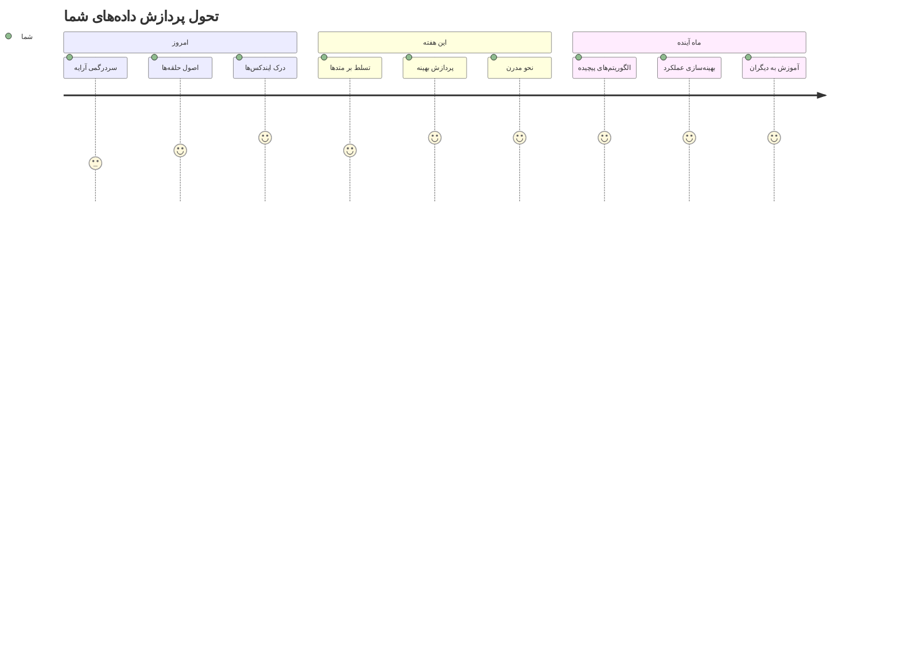
> 📦 **شما قدرت سازماندهی و پردازش داده‌ها را آزاد کرده‌اید!** آرایه‌ها و حلقه‌ها پایه تقریباً هر برنامه‌ای هستند که می‌سازید. از لیست‌های ساده تا تحلیل‌های پیچیده داده، اکنون ابزارهای لازم برای مدیریت اطلاعات به‌صورت کارآمد و شیک را در اختیار دارید. هر وب‌سایت پویا، اپلیکیشن موبایل و برنامه‌های داده‌محور بر این مفاهیم پایه متکی‌اند. به دنیای پردازش داده مقیاس‌پذیر خوش آمدید! 🎉

---

<!-- CO-OP TRANSLATOR DISCLAIMER START -->
**سلب مسئولیت**:  
این سند با استفاده از سرویس ترجمه هوش مصنوعی [Co-op Translator](https://github.com/Azure/co-op-translator) ترجمه شده است. هرچند ما در تلاش برای دقت هستیم، لطفاً توجه داشته باشید که ترجمه‌های خودکار ممکن است دارای خطا یا نواقصی باشند. سند اصلی به زبان بومی خود باید به عنوان منبع معتبر در نظر گرفته شود. برای اطلاعات حیاتی، توصیه می‌شود از ترجمه حرفه‌ای انسانی استفاده شود. ما مسئول هیچ گونه سوءتفاهم یا برداشت نادرستی که از استفاده این ترجمه به وجود آید نیستیم.
<!-- CO-OP TRANSLATOR DISCLAIMER END -->