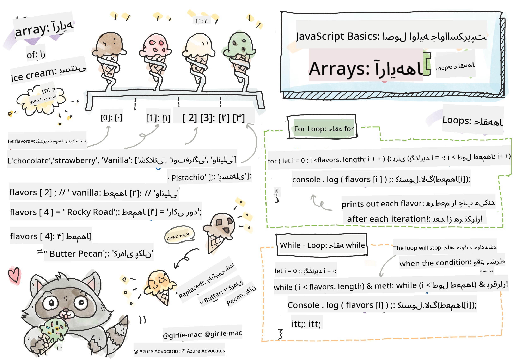

<!--
CO_OP_TRANSLATOR_METADATA:
{
  "original_hash": "9029f96b0e034839c1799f4595e4bb66",
  "translation_date": "2025-08-29T14:33:24+00:00",
  "source_file": "2-js-basics/4-arrays-loops/README.md",
  "language_code": "fa"
}
-->
# اصول اولیه جاوااسکریپت: آرایه‌ها و حلقه‌ها


> طراحی توسط [Tomomi Imura](https://twitter.com/girlie_mac)

## آزمون پیش از درس
[آزمون پیش از درس](https://ff-quizzes.netlify.app/web/quiz/13)

این درس اصول اولیه جاوااسکریپت، زبانی که تعامل در وب را فراهم می‌کند، پوشش می‌دهد. در این درس، درباره آرایه‌ها و حلقه‌ها که برای مدیریت داده‌ها استفاده می‌شوند، یاد خواهید گرفت.

[](https://youtube.com/watch?v=1U4qTyq02Xw "آرایه‌ها")

[](https://www.youtube.com/watch?v=Eeh7pxtTZ3k "حلقه‌ها")

> 🎥 روی تصاویر بالا کلیک کنید تا ویدیوهای مربوط به آرایه‌ها و حلقه‌ها را مشاهده کنید.

> می‌توانید این درس را در [Microsoft Learn](https://docs.microsoft.com/learn/modules/web-development-101-arrays/?WT.mc_id=academic-77807-sagibbon) دنبال کنید!

## آرایه‌ها

کار با داده‌ها یک وظیفه رایج در هر زبان برنامه‌نویسی است و زمانی که داده‌ها در قالبی ساختاری مانند آرایه‌ها سازماندهی شوند، این کار بسیار آسان‌تر می‌شود. با آرایه‌ها، داده‌ها در ساختاری مشابه یک لیست ذخیره می‌شوند. یکی از مزایای بزرگ آرایه‌ها این است که می‌توانید انواع مختلف داده‌ها را در یک آرایه ذخیره کنید.

✅ آرایه‌ها همه جا هستند! آیا می‌توانید یک مثال واقعی از آرایه‌ها، مانند آرایه‌ای از پنل‌های خورشیدی، پیدا کنید؟

نحو آرایه شامل یک جفت براکت مربعی است.

```javascript
let myArray = [];
```

این یک آرایه خالی است، اما آرایه‌ها می‌توانند از قبل با داده‌ها پر شوند. مقادیر مختلف در یک آرایه با کاما جدا می‌شوند.

```javascript
let iceCreamFlavors = ["Chocolate", "Strawberry", "Vanilla", "Pistachio", "Rocky Road"];
```

مقادیر آرایه به یک مقدار منحصر به فرد به نام **ایندکس** اختصاص داده می‌شوند، که یک عدد صحیح است و بر اساس فاصله آن از ابتدای آرایه تعیین می‌شود. در مثال بالا، مقدار رشته‌ای "Chocolate" ایندکس 0 دارد و ایندکس "Rocky Road" برابر با 4 است. از ایندکس همراه با براکت‌های مربعی برای بازیابی، تغییر یا درج مقادیر آرایه استفاده کنید.

✅ آیا برایتان جالب است که آرایه‌ها از ایندکس صفر شروع می‌شوند؟ در برخی زبان‌های برنامه‌نویسی، ایندکس‌ها از 1 شروع می‌شوند. تاریخچه جالبی در این مورد وجود دارد که می‌توانید [در ویکی‌پدیا بخوانید](https://en.wikipedia.org/wiki/Zero-based_numbering).

```javascript
let iceCreamFlavors = ["Chocolate", "Strawberry", "Vanilla", "Pistachio", "Rocky Road"];
iceCreamFlavors[2]; //"Vanilla"
```

می‌توانید از ایندکس برای تغییر یک مقدار استفاده کنید، مانند این:

```javascript
iceCreamFlavors[4] = "Butter Pecan"; //Changed "Rocky Road" to "Butter Pecan"
```

و می‌توانید یک مقدار جدید را در یک ایندکس مشخص درج کنید، مانند این:

```javascript
iceCreamFlavors[5] = "Cookie Dough"; //Added "Cookie Dough"
```

✅ یک روش رایج‌تر برای افزودن مقادیر به آرایه استفاده از عملگرهای آرایه مانند array.push() است.

برای اینکه بفهمید چند آیتم در یک آرایه وجود دارد، از ویژگی `length` استفاده کنید.

```javascript
let iceCreamFlavors = ["Chocolate", "Strawberry", "Vanilla", "Pistachio", "Rocky Road"];
iceCreamFlavors.length; //5
```

✅ خودتان امتحان کنید! از کنسول مرورگر خود برای ایجاد و مدیریت یک آرایه که خودتان طراحی کرده‌اید استفاده کنید.

## حلقه‌ها

حلقه‌ها به ما اجازه می‌دهند وظایف تکراری یا **تکراری** را انجام دهیم و می‌توانند زمان و کد زیادی را صرفه‌جویی کنند. هر تکرار می‌تواند در متغیرها، مقادیر و شرایط متفاوت باشد. انواع مختلفی از حلقه‌ها در جاوااسکریپت وجود دارند که تفاوت‌های کوچکی دارند، اما اساساً یک کار را انجام می‌دهند: حلقه زدن بر روی داده‌ها.

### حلقه For

حلقه `for` برای تکرار به 3 بخش نیاز دارد:
- `counter` یک متغیر که معمولاً با یک عدد مقداردهی اولیه می‌شود و تعداد تکرارها را شمارش می‌کند
- `condition` عبارتی که از عملگرهای مقایسه‌ای استفاده می‌کند تا زمانی که مقدار آن `false` شود، حلقه متوقف شود
- `iteration-expression` در پایان هر تکرار اجرا می‌شود و معمولاً برای تغییر مقدار شمارنده استفاده می‌شود
  
```javascript
// Counting up to 10
for (let i = 0; i < 10; i++) {
  console.log(i);
}
```

✅ این کد را در کنسول مرورگر اجرا کنید. چه اتفاقی می‌افتد اگر تغییرات کوچکی در شمارنده، شرط یا عبارت تکرار ایجاد کنید؟ آیا می‌توانید کاری کنید که حلقه به صورت معکوس اجرا شود و یک شمارش معکوس ایجاد کند؟

### حلقه While

برخلاف نحو حلقه `for`، حلقه‌های `while` فقط به یک شرط نیاز دارند که زمانی که مقدار آن `false` شود، حلقه متوقف شود. شرایط در حلقه‌ها معمولاً به مقادیر دیگری مانند شمارنده‌ها وابسته هستند و باید در طول حلقه مدیریت شوند. مقادیر اولیه برای شمارنده‌ها باید خارج از حلقه ایجاد شوند و هر عبارتی برای برآورده کردن شرط، از جمله تغییر شمارنده، باید داخل حلقه نگهداری شود.

```javascript
//Counting up to 10
let i = 0;
while (i < 10) {
 console.log(i);
 i++;
}
```

✅ چرا ممکن است یک حلقه for را به جای یک حلقه while انتخاب کنید؟ 17 هزار نفر در StackOverflow همین سوال را داشتند و برخی از نظرات [ممکن است برای شما جالب باشد](https://stackoverflow.com/questions/39969145/while-loops-vs-for-loops-in-javascript).

## حلقه‌ها و آرایه‌ها

آرایه‌ها اغلب با حلقه‌ها استفاده می‌شوند زیرا بیشتر شرایط نیاز به طول آرایه دارند تا حلقه متوقف شود، و ایندکس نیز می‌تواند مقدار شمارنده باشد.

```javascript
let iceCreamFlavors = ["Chocolate", "Strawberry", "Vanilla", "Pistachio", "Rocky Road"];

for (let i = 0; i < iceCreamFlavors.length; i++) {
  console.log(iceCreamFlavors[i]);
} //Ends when all flavors are printed
```

✅ با حلقه زدن بر روی یک آرایه که خودتان طراحی کرده‌اید در کنسول مرورگر خود آزمایش کنید.

---

## 🚀 چالش

روش‌های دیگری برای حلقه زدن بر روی آرایه‌ها وجود دارد به جز حلقه‌های for و while. روش‌هایی مانند [forEach](https://developer.mozilla.org/docs/Web/JavaScript/Reference/Global_Objects/Array/forEach)، [for-of](https://developer.mozilla.org/docs/Web/JavaScript/Reference/Statements/for...of)، و [map](https://developer.mozilla.org/docs/Web/JavaScript/Reference/Global_Objects/Array/map). حلقه آرایه خود را با استفاده از یکی از این تکنیک‌ها بازنویسی کنید.

## آزمون پس از درس
[آزمون پس از درس](https://ff-quizzes.netlify.app/web/quiz/14)

## مرور و مطالعه شخصی

آرایه‌ها در جاوااسکریپت دارای متدهای زیادی هستند که برای مدیریت داده‌ها بسیار مفید هستند. [درباره این متدها مطالعه کنید](https://developer.mozilla.org/docs/Web/JavaScript/Reference/Global_Objects/Array) و برخی از آن‌ها (مانند push، pop، slice و splice) را بر روی یک آرایه که خودتان طراحی کرده‌اید امتحان کنید.

## تکلیف

[حلقه زدن بر روی یک آرایه](assignment.md)

---

**سلب مسئولیت**:  
این سند با استفاده از سرویس ترجمه هوش مصنوعی [Co-op Translator](https://github.com/Azure/co-op-translator) ترجمه شده است. در حالی که ما تلاش می‌کنیم دقت را حفظ کنیم، لطفاً توجه داشته باشید که ترجمه‌های خودکار ممکن است شامل خطاها یا نادرستی‌ها باشند. سند اصلی به زبان اصلی آن باید به عنوان منبع معتبر در نظر گرفته شود. برای اطلاعات حساس، توصیه می‌شود از ترجمه حرفه‌ای انسانی استفاده کنید. ما مسئولیتی در قبال سوء تفاهم‌ها یا تفسیرهای نادرست ناشی از استفاده از این ترجمه نداریم.