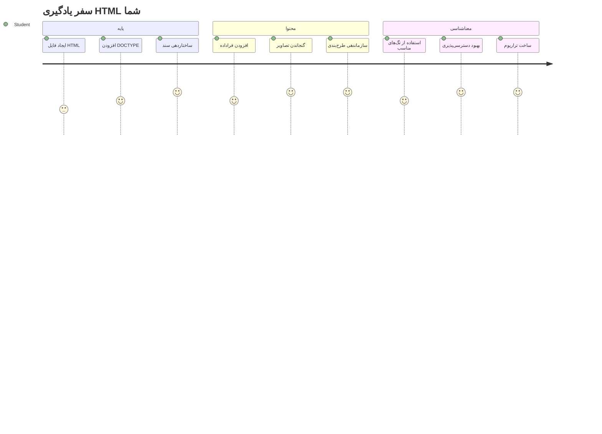
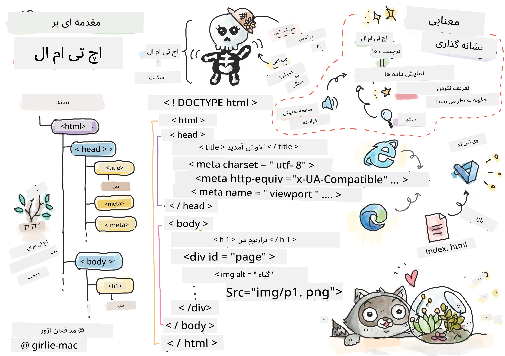
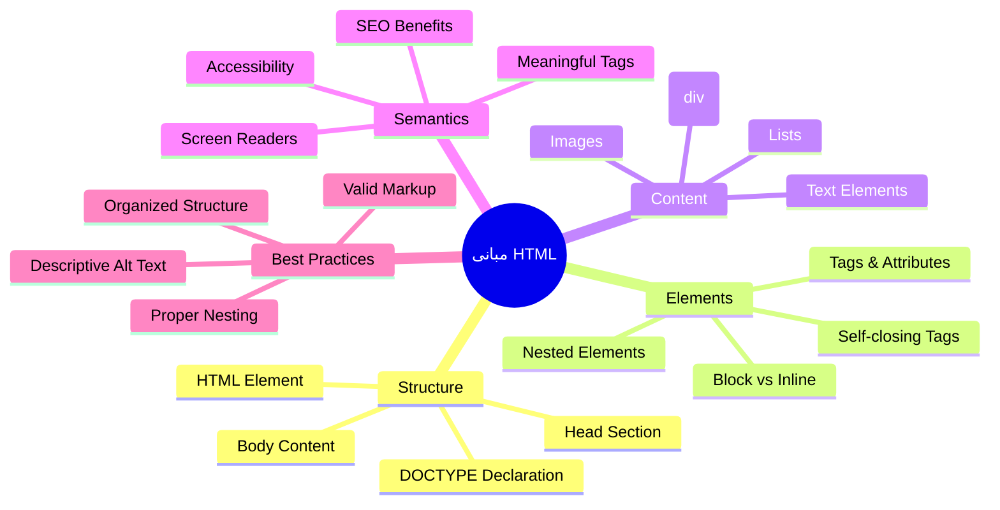
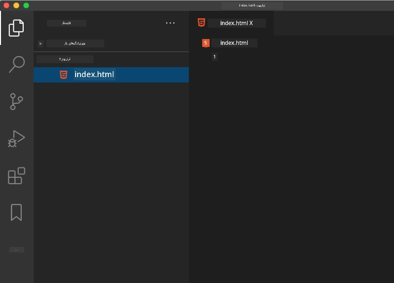
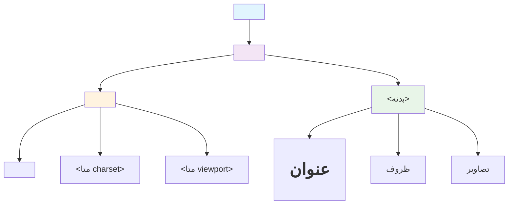
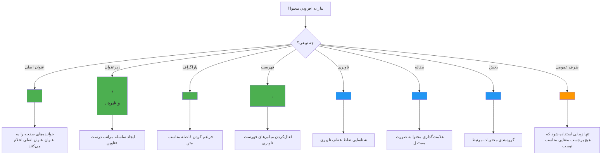
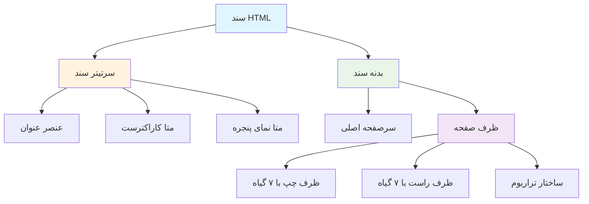
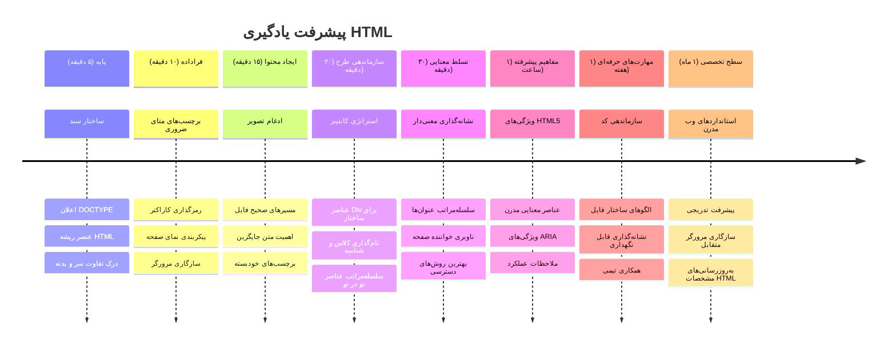

# بخش اول پروژه تراریوم: مقدمه‌ای بر HTML



> اسکچ‌نوت توسط [Tomomi Imura](https://twitter.com/girlie_mac)

HTML یا زبان نشانه‌گذاری ابرمتن، پایه و اساس هر وب‌سایتی است که تا به حال بازدید کرده‌اید. HTML را مانند اسکلت در نظر بگیرید که ساختار صفحات وب را می‌سازد – مشخص می‌کند محتوای چیست، چگونه سازماندهی شده و هر بخش چه نمایندگی دارد. در حالی که CSS بعداً «لباس» به HTML شما با رنگ‌ها و چیدمان می‌پوشاند و جاوااسکریپت با تعامل آن را زنده می‌کند، HTML ساختار اساسی را فراهم می‌کند که همه چیز را ممکن می‌سازد.

در این درس، شما ساختار HTML یک رابط تراریوم مجازی را ایجاد خواهید کرد. این پروژه عملی مفاهیم پایه‌ای HTML را به شما آموزش می‌دهد و در عین حال چیزی جذاب از نظر بصری می‌سازد. شما خواهید آموخت چگونه محتوا را با استفاده از اجزای معنایی سازمان دهید، با تصاویر کار کنید و پایه‌ای برای یک برنامه وب تعاملی بسازید.

تا پایان این درس، شما یک صفحه HTML فعال همراه با نمایش تصاویر گیاهان در ستون‌های مرتب خواهید داشت که آماده است تا در درس بعدی آن را به صورت استایل‌دهی شده مشاهده کنید. نگران نباشید اگر در ابتدا ساده به نظر برسد – این دقیقاً کاری است که HTML باید انجام دهد قبل از اینکه CSS جلوه بصری اضافه کند.


## آزمون پیش از درس

[آزمون پیش از درس](https://ff-quizzes.netlify.app/web/quiz/15)

> 📺 **تماشا و یادگیری**: این ویدیو مروری مفید را ببینید
> 
> [](https://www.youtube.com/watch?v=1TvxJKBzhyQ)

## راه‌اندازی پروژه شما

قبل از اینکه وارد نوشتن کد HTML شویم، اجازه دهید یک فضای کاری مناسب برای پروژه تراریوم شما آماده کنیم. ایجاد ساختار فایل سازمان‌یافته از همان ابتدا عادت مهمی است که در طول مسیر توسعه وب به شما کمک خواهد کرد.

### وظیفه: ایجاد ساختار پروژه شما

شما یک پوشه اختصاصی برای پروژه تراریوم خود خواهید ساخت و اولین فایل HTML خود را اضافه خواهید کرد. در اینجا دو روش وجود دارد که می‌توانید استفاده کنید:

**گزینه ۱: استفاده از Visual Studio Code**
1. Visual Studio Code را باز کنید
2. روی "File" کلیک کرده و سپس "Open Folder" را انتخاب کنید یا از `Ctrl+K, Ctrl+O` (ویندوز/لینوکس) یا `Cmd+K, Cmd+O` (مک) استفاده کنید
3. یک پوشه جدید به نام `terrarium` بسازید و آن را انتخاب کنید
4. در پنل اکسپلورر روی آیکون "New File" کلیک کنید
5. فایل خود را به نام `index.html` نامگذاری کنید



**گزینه ۲: استفاده از دستورات ترمینال**
```bash
mkdir terrarium
cd terrarium
touch index.html
code index.html
```

**این دستورات چه کاری انجام می‌دهند:**
- **ساختن** یک دایرکتوری جدید به نام `terrarium` برای پروژه شما
- **ورود** به دایرکتوری terrarium
- **ساخت** یک فایل خالی `index.html`
- **باز کردن** فایل در Visual Studio Code برای ویرایش

> 💡 **نکته تخصصی**: فایل به نام `index.html` در توسعه وب ویژه است. وقتی کسی از یک مرورگر یک وب‌سایت را بازدید می‌کند، مرورگرها به طور خودکار به دنبال `index.html` به عنوان صفحه پیش‌فرض می‌گردند. این بدان معناست که یک آدرس مثل `https://mysite.com/projects/` به طور خودکار فایل `index.html` را از پوشه `projects` نمایش می‌دهد بدون نیاز به مشخص کردن نام فایل در آدرس.

## درک ساختار سند HTML

هر سند HTML دارای ساختاری مشخص است که مرورگرها باید آن را بفهمند و به درستی نمایش دهند. ساختار آن را مانند یک نامه رسمی در نظر بگیرید – این نامه دارای اجزای ضروری در ترتیب مشخصی است که به گیرنده (در اینجا مرورگر) کمک می‌کند محتوا را به درستی پردازش کند.


بیایید با افزودن پایه‌های اساسی که هر سند HTML نیاز دارد شروع کنیم.

### اعلان DOCTYPE و عنصر ریشه

دو خط اول هر فایل HTML «معرفی» سند به مرورگر هستند:

```html
<!DOCTYPE html>
<html></html>
```

**درک اینکه این کد چه می‌کند:**
- **اعلان** نوع سند به صورت HTML5 با استفاده از `<!DOCTYPE html>`
- **ایجاد** عنصر ریشه `<html>` که تمام محتوای صفحه را در بر می‌گیرد
- **برقراری** استانداردهای وب مدرن برای نمایش صحیح در مرورگر
- **اطمینان** از نمایش یکنواخت در مرورگرها و دستگاه‌های مختلف

> 💡 **نکته VS Code**: نشانگر موس را روی هر تگ HTML در VS Code نگه دارید تا اطلاعات مفید از مستندات MDN باز شود، شامل مثال‌های استفاده و جزئیات سازگاری مرورگر.

> 📚 **مطالعه بیشتر**: اعلان DOCTYPE مانع از وارد شدن مرورگرها به "حالت عجیب و غریب" می‌شود که برای پشتیبانی از وب‌سایت‌های بسیار قدیمی استفاده می‌شد. توسعه وب مدرن از اعلان ساده `<!DOCTYPE html>` استفاده می‌کند تا [نمایش مطابق استانداردها](https://developer.mozilla.org/docs/Web/HTML/Quirks_Mode_and_Standards_Mode) را تضمین کند.

### 🔄 **بررسی آموزشی**
**ایستادن و تأمل کردن**: قبل از ادامه مطمئن شوید که درک کرده‌اید:
- ✅ چرا هر سند HTML به اعلان DOCTYPE نیاز دارد
- ✅ عنصر ریشه `<html>` چه محتوایی دارد
- ✅ چگونه این ساختار به مرورگرها کمک می‌کند صفحات را به درستی نمایش دهند

**آزمون سریع خودی**: آیا می‌توانید به زبان خودتان توضیح دهید «نمایش مطابق استانداردها» یعنی چه؟

## افزودن متادیتای ضروری سند

قسمت `<head>` در سند HTML شامل اطلاعات حیاتی است که مرورگرها و موتورهای جستجو نیاز دارند ولی بازدیدکنندگان مستقیماً روی صفحه نمی‌بینند. این قسمت مانند اطلاعات «پشت صحنه» است که به صفحه وب کمک می‌کند به درستی کار کند و در دستگاه‌ها و پلتفرم‌های مختلف به درستی نمایش داده شود.

این متادیتا به مرورگرها می‌گوید چگونه صفحه را نمایش دهند، از چه کدگذاری کاراکتری استفاده کنند، و چگونه با اندازه‌های مختلف صفحه برخورد کنند – همه این‌ها برای ایجاد صفحات وب حرفه‌ای و قابل دسترس ضروری است.

### وظیفه: افزودن بخش Head سند

این قسمت `<head>` را بین تگ‌های باز و بسته `<html>` قرار دهید:

```html
<head>
	<title>Welcome to my Virtual Terrarium</title>
	<meta charset="utf-8" />
	<meta http-equiv="X-UA-Compatible" content="IE=edge" />
	<meta name="viewport" content="width=device-width, initial-scale=1" />
</head>
```

**تحلیل آنچه هر عنصر انجام می‌دهد:**
- **تنظیم** عنوان صفحه که در تب مرورگر و نتایج جستجو نمایش می‌یابد
- **مشخص کردن** کدگذاری UTF-8 برای نمایش صحیح متن در سراسر جهان
- **اطمینان** از سازگاری با نسخه‌های مدرن Internet Explorer
- **تنظیم** طراحی واکنش‌گرا با تنظیم ناحیه نما (viewport) برای تطبیق با عرض دستگاه
- **کنترل** سطح بزرگنمایی اولیه برای نمایش محتوا در اندازه طبیعی

> 🤔 **به این فکر کنید**: چه اتفاقی می‌افتد اگر متاتگ viewport را این‌گونه تنظیم کنید: `<meta name="viewport" content="width=600">`؟ این باعث می‌شود صفحه همیشه ۶۰۰ پیکسل پهنا داشته باشد که طراحی واکنش‌گرا را خراب می‌کند! برای یادگیری بیشتر درباره [تنظیم صحیح ناحیه نما](https://developer.mozilla.org/docs/Web/HTML/Viewport_meta_tag) مطالعه کنید.

## ساختار بخش Body سند

عنصر `<body>` حاوی تمام محتوای قابل مشاهده صفحه وب شماست – همه چیزهایی که کاربران می‌بینند و با آن‌ها تعامل دارند. در حالی که قسمت `<head>` به مرورگر دستورالعمل می‌دهد، قسمت `<body>` محتوای واقعی را شامل می‌شود: متن‌ها، تصاویر، دکمه‌ها و سایر عناصری که رابط کاربری شما را می‌سازند.

بیایید ساختار بخش body را اضافه کنیم و بفهمیم چگونه تگ‌های HTML با هم کار می‌کنند تا محتوای معنادار بسازند.

### درک ساختار تگ‌های HTML

HTML از تگ‌های جفتی برای تعریف عناصر استفاده می‌کند. اکثر تگ‌ها یک تگ باز مانند `<p>` و یک تگ بسته مانند `</p>` دارند که محتوا بین آن‌ها قرار می‌گیرد: `<p>سلام دنیا!</p>`. این یک پاراگراف می‌سازد که متن "سلام دنیا!" را در بر دارد.

### وظیفه: افزودن عنصر Body

فایل HTML خود را به‌روزرسانی کنید تا عنصر `<body>` را شامل شود:

```html
<!DOCTYPE html>
<html>
	<head>
		<title>Welcome to my Virtual Terrarium</title>
		<meta charset="utf-8" />
		<meta http-equiv="X-UA-Compatible" content="IE=edge" />
		<meta name="viewport" content="width=device-width, initial-scale=1" />
	</head>
	<body></body>
</html>
```

**این ساختار کامل چه مزایایی دارد:**
- **برقرار کردن** چارچوب پایه سند HTML5
- **شامل کردن** متادیتای ضروری برای نمایش صحیح مرورگر
- **ایجاد** یک بخش body خالی آماده برای محتوای قابل مشاهده
- **پیروی** از بهترین شیوه‌های توسعه وب مدرن

اکنون آماده‌اید عناصر قابل دید تراریوم را اضافه کنید. از عناصر `<div>` به عنوان کانتینر برای سازماندهی بخش‌های مختلف محتوا استفاده خواهیم کرد و از عناصر `` برای نمایش تصاویر گیاهان.

### کار با تصاویر و کانتینرهای چیدمان

تصاویر در HTML خاص هستند چون از تگ‌های خودپایان (self-closing) استفاده می‌کنند. برخلاف عناصری مثل `<p></p>` که محتوا را در بر می‌گیرند، تگ `` تمام اطلاعات لازم را با استفاده از ویژگی‌هایی مانند `src` برای مسیر فایل تصویر و `alt` برای دسترس‌پذیری، درون خود تگ دارد.

قبل از اینکه تصاویر را به HTML خود اضافه کنید، باید فایل‌های پروژه را به درستی سازماندهی کنید و پوشه `images` را بسازید و گرافیک‌های گیاهان را اضافه کنید.

**ابتدا تصاویر خود را آماده کنید:**
1. در پوشه پروژه تراریوم، یک پوشه به نام `images` بسازید
2. تصاویر گیاهان را از [پوشه راه‌حل](../../../../3-terrarium/solution/images) دانلود کنید (جمعاً ۱۴ تصویر گیاه)
3. همه تصاویر گیاهان را در پوشه جدید `images` کپی کنید

### وظیفه: ایجاد چیدمان نمایش گیاهان

اکنون تصاویر گیاهان را بین تگ‌های `<body></body>` به صورت دو ستون سازماندهی شده اضافه کنید:

```html
<div id="page">
	<div id="left-container" class="container">
		<div class="plant-holder">
			
		</div>
		<div class="plant-holder">
			
		</div>
		<div class="plant-holder">
			
		</div>
		<div class="plant-holder">
			
		</div>
		<div class="plant-holder">
			
		</div>
		<div class="plant-holder">
			
		</div>
		<div class="plant-holder">
			
		</div>
	</div>
	<div id="right-container" class="container">
		<div class="plant-holder">
			
		</div>
		<div class="plant-holder">
			
		</div>
		<div class="plant-holder">
			
		</div>
		<div class="plant-holder">
			
		</div>
		<div class="plant-holder">
			
		</div>
		<div class="plant-holder">
			
		</div>
		<div class="plant-holder">
			
		</div>
	</div>
</div>
```

**گام‌به‌گام، این کد چه کاری انجام می‌دهد:**
- **ساختن** یک کانتینر اصلی صفحه با `id="page"` برای نگهداری همه محتوا
- **ایجاد** دو کانتینر ستونی: `left-container` و `right-container`
- **سازماندهی** ۷ گیاه در ستون چپ و ۷ گیاه در ستون راست
- **محصور کردن** هر تصویر گیاه در یک `<div>` با کلاس `plant-holder` برای موقعیت‌دهی جداگانه
- **استفاده** از نام کلاس‌های یکنواخت برای استایل‌دهی CSS در درس بعد
- **اختصاص** شناسه‌های یکتا به هر تصویر گیاه برای تعامل با جاوااسکریپت بعدی
- **شامل کردن** مسیر فایل صحیح که به پوشه تصاویر اشاره می‌کند

> 🤔 **به این فکر کنید**: توجه کنید که همه تصاویر در حال حاضر متن جایگزین (alt) یکسان «plant» دارند. این برای دسترس‌پذیری ایده‌آل نیست. کاربران صفحه‌خوان ۱۴ بار "plant" را می‌شنوند بدون اینکه بدانند هر تصویر مربوط به کدام گیاه خاص است. آیا می‌توانید متن جایگزین بهتر و توصیفی‌تری برای هر تصویر پیشنهاد دهید؟

> 📝 **انواع عناصر HTML**: عناصر `<div>` بلوک‌سطح هستند و عرض کامل را اشغال می‌کنند، در حالی که عناصر `<span>` خطی بوده و فقط به اندازه لازم عرض می‌گیرند. فکر می‌کنید اگر همه این تگ‌های `<div>` را به `<span>` تغییر دهید چه اتفاقی می‌افتد؟

### 🔄 **بررسی آموزشی**
**درک ساختار**: کمی زمان بگذارید و ساختار HTML خود را مرور کنید:
- ✅ آیا می‌توانید کانتینرهای اصلی در چیدمان خود را شناسایی کنید؟
- ✅ آیا می‌دانید چرا هر تصویر شناسه یکتا دارد؟
- ✅ هدف `<div>`های `plant-holder` را چگونه توصیف می‌کنید؟

**بازبینی بصری**: فایل HTML خود را در مرورگر باز کنید. باید مشاهده کنید:
- فهرست ساده‌ای از تصاویر گیاهان
- تصاویر در دو ستون سازماندهی شده‌اند
- چیدمانی ساده و بدون استایل

**به یاد داشته باشید**: این ظاهر ساده دقیقاً همان چیزی است که HTML باید قبل از استایل‌دهی CSS باشد!

با افزودن این نشانه‌ها، گیاهان روی صفحه نمایش داده می‌شوند، اگرچه هنوز به زیبایی استایل داده نشده‌اند – این کار CSS در درس بعدی است! فعلاً شما یک پایه قوی HTML دارید که محتوای شما را به درستی سازمان می‌دهد و بهترین روش‌های دسترس‌پذیری را رعایت می‌کند.

## استفاده از HTML معنایی برای دسترس‌پذیری

HTML معنایی یعنی انتخاب عناصر HTML بر اساس معنی و هدف آن‌ها، نه فقط ظاهرشان. وقتی نشانه‌گذاری معنایی استفاده می‌کنید، ساختار و معنی محتوای خود را به مرورگرها، موتورهای جستجو و فناوری‌های کمکی مانند صفحه‌خوان‌ها منتقل می‌کنید.


این رویکرد وب‌سایت‌های شما را برای کاربران دارای ناتوانی بهتر در دسترس قرار می‌دهد و به موتورهای جستجو کمک می‌کند محتوای شما را بهتر درک کنند. این یک اصل اساسی در توسعه وب مدرن است که تجربه‌ی بهتری برای همه ایجاد می‌کند.

### افزودن عنوان معنایی صفحه

بیایید یک عنوان مناسب به صفحه تراریوم شما اضافه کنیم. این خط را بلافاصله بعد از تگ باز `<body>` وارد کنید:

```html
<h1>My Terrarium</h1>
```

**چرا نشانه‌گذاری معنایی مهم است:**
- **کمک** به صفحه‌خوان‌ها برای ناوبری و درک ساختار صفحه
- **بهبود** بهینه‌سازی موتورهای جستجو (SEO) با آشکارسازی سلسله مراتب محتوا
- **تقویت** دسترسی برای کاربران با مشکلات بینایی یا تفاوت‌های شناختی
- **ایجاد** تجربیات بهتر کاربری در همه دستگاه‌ها و پلتفرم‌ها
- **پیروی** از استانداردها و بهترین روش‌های توسعه حرفه‌ای

**مثال‌هایی از انتخاب‌های معنایی در مقابل غیر معنایی:**

| هدف | ✅ انتخاب معنایی | ❌ انتخاب غیر معنایی |
|---------|-------------------|------------------------|
| تیتر اصلی | `<h1>Title</h1>` | `<div class="big-text">Title</div>` |
| ناوبری | `<nav><ul><li></li></ul></nav>` | `<div class="menu"><div></div></div>` |
| دکمه | `<button>Click me</button>` | `<span onclick="...">Click me</span>` |
| محتوای مقاله | `<article><p></p></article>` | `<div class="content"><div></div></div>` |

> 🎥 **آن را به عمل ببینید**: ویدیوی [نحوه تعامل صفحه‌خوان‌ها با صفحات وب](https://www.youtube.com/watch?v=OUDV1gqs9GA) را ببینید تا متوجه شوید چرا نشانه‌گذاری معنایی برای دسترس‌پذیری ضروری است. ببینید چگونه ساختار صحیح HTML به کاربران کمک می‌کند به‌طور مؤثر ناوبری کنند.

## ایجاد کانتینر تراریوم

حالا بیایید ساختار HTML تراریوم را اضافه کنیم – کانتینر شیشه‌ای که گیاهان نهایتاً در آن قرار می‌گیرند. این بخش یک مفهوم مهم را نشان می‌دهد: HTML ساختار را فراهم می‌کند، اما بدون استایل‌دهی CSS، این عناصر هنوز قابل مشاهده نیستند.

نشانه‌گذاری تراریوم از نام کلاس‌های توصیفی استفاده می‌کند که باعث می‌شود استایل‌دهی CSS در درس بعدی آسان و قابل نگهداری باشد.

### وظیفه: افزودن ساختار تراریوم

این نشانه‌گذاری را بالای آخرین تگ `</div>` (قبل از تگ بسته کانتینر صفحه) درج کنید:

```html
<div id="terrarium">
	<div class="jar-top"></div>
	<div class="jar-walls">
		<div class="jar-glossy-long"></div>
		<div class="jar-glossy-short"></div>
	</div>
	<div class="dirt"></div>
	<div class="jar-bottom"></div>
</div>
```

**درک این ساختار تراریوم:**
- **ساختن** یک کانتینر اصلی تراریوم با شناسه یکتا برای استایل‌دهی
- **تعریف** عناصر جداگانه برای هر بخش بصری (بالا، دیوارها، خاک، پایین)
- **شامل** عناصر تو در تو برای افکت‌های بازتاب شیشه (عناصر براق)
- **استفاده** از نام‌های کلاس توصیفی که هدف هر عنصر را به وضوح مشخص کنند
- **آماده‌سازی** ساختار برای استایل‌دهی CSS که ظاهر تراریوم شیشه‌ای را ایجاد می‌کند

> 🤔 **چیزی متوجه شدید؟**: حتی با اینکه این مارک‌آپ را اضافه کرده‌اید، هیچ چیز جدیدی در صفحه نمی‌بینید! این دقیقاً نشان می‌دهد که HTML ساختار را فراهم می‌کند در حالی که CSS ظاهر را تعیین می‌کند. این عناصر `<div>` وجود دارند اما هنوز هیچ استایل بصری ندارند – این موضوع در درس بعدی خواهد آمد!


### 🔄 **بررسی آموزشی**
** تسلط بر ساختار HTML **: قبل از پیشروی، اطمینان حاصل کنید که می‌توانید:
- ✅ تفاوت بین ساختار HTML و ظاهر بصری را توضیح دهید
- ✅ عناصر HTML معنایی در مقابل غیرمعنایی را تشخیص دهید
- ✅ توصیف کنید چگونه مارک‌آپ صحیح به بهبود دسترسی کمک می‌کند
- ✅ ساختار کامل درخت سند را بشناسید

**آزمون فهم خود**: سعی کنید فایل HTML خود را در مرورگری باز کنید که جاوااسکریپت غیرفعال و CSS حذف شده باشد. این ساختار معنایی خالصی که ساخته‌اید را به شما نشان می‌دهد!

---

## چالش عامل GitHub Copilot

از حالت Agent برای تکمیل چالش زیر استفاده کنید:

**توضیحات:** یک ساختار HTML معنایی برای بخش راهنمای نگهداری گیاه ایجاد کنید که می‌تواند به پروژه تراریوم اضافه شود.

**دستور:** یک بخش معنایی HTML ایجاد کنید که شامل یک عنوان اصلی "راهنمای نگهداری گیاه" و سه زیربخش با عناوین "آبیاری"، "نیازمندی‌های نور" و "مراقبت خاک" باشد، که هرکدام شامل یک پاراگراف اطلاعات نگهداری گیاه هستند. از تگ‌های معنایی مناسب مثل `<section>`, `<h2>`, `<h3>`, و `<p>` برای ساختاردهی محتوا به صورت مناسب استفاده کنید.

درباره [حالت agent](https://code.visualstudio.com/blogs/2025/02/24/introducing-copilot-agent-mode) بیشتر بیاموزید.

## چالش بررسی تاریخچه HTML

**یادگیری درباره تکامل وب**

HTML از زمان ایجاد اولین مرورگر وب توسط تیم برنرز-لی در CERN در سال ۱۹۹۰ به شدت تکامل یافته است. برخی تگ‌های قدیمی مانند `<marquee>` اکنون منسوخ شده‌اند زیرا با استانداردهای دسترسی‌پذیری مدرن و اصول طراحی واکنش‌گرا سازگار نیستند.

**این آزمایش را امتحان کنید:**
1. موقتاً عنوان `<h1>` خود را در تگ `<marquee>` بگذارید: `<marquee><h1>تراریوم من</h1></marquee>`
2. صفحه را در مرورگر باز کنید و эффект پیمایش را مشاهده کنید
3. فکر کنید چرا این تگ منسوخ شده است (راهنما: به تجربه کاربری و دسترسی فکر کنید)
4. تگ `<marquee>` را حذف کنید و به مارک‌آپ معنایی بازگردید

**سوالات بازتابی:**
- چگونه عنوان متحرک می‌تواند برای کاربران با اختلالات بینایی یا حساسیت به حرکت مشکل‌ساز باشد؟
- چه تکنیک‌های CSS مدرنی می‌توانند افکت‌های بصری مشابه را به صورت دسترسی‌پذیرتر ایجاد کنند؟
- چرا استفاده از استانداردهای وب مدرن به جای عناصر منسوخ شده اهمیت دارد؟

بیشتر درباره [عناصر منسوخ و منسوخ شده HTML](https://developer.mozilla.org/docs/Web/HTML/Element#Obsolete_and_deprecated_elements) برای درک چگونگی پیشرفت استانداردهای وب جهت بهبود تجربه کاربری مطالعه کنید.


## آزمون پس از درس

[آزمون پس از درس](https://ff-quizzes.netlify.app/web/quiz/16)

## مرور و مطالعه خودآموز

**دانش HTML خود را عمیق‌تر کنید**

HTML بیش از ۳۰ سال است که پایه وب بوده و از یک زبان ساده نشانه‌گذاری سند به یک پلتفرم پیشرفته برای ساخت برنامه‌های تعاملی تبدیل شده است. درک این تکامل به شما کمک می‌کند استانداردهای مدرن وب را بهتر بفهمید و تصمیمات توسعه بهتری بگیرید.

**مسیرهای یادگیری پیشنهادی:**

1. **تاریخچه و تکامل HTML**
   - مطالعه خط زمان از HTML 1.0 تا HTML5
   - بررسی دلیل منسوخ شدن برخی تگ‌ها (دسترسی‌پذیری، موبایل‌دوستی، قابلیت نگهداری)
   - تحقیق درباره قابلیت‌ها و پیشنهادات جدید HTML

2. **عمق معناشناسی HTML**
   - مطالعه فهرست کامل [عناصر معنایی HTML5](https://developer.mozilla.org/docs/Web/HTML/Element)
   - تمرین شناسایی موارد استفاده از `<article>`, `<section>`, `<aside>`, و `<main>`
   - یادگیری درباره ویژگی‌های ARIA برای افزایش دسترسی

3. **توسعه وب مدرن**
   - بررسی [ساخت وب‌سایت واکنش‌گرا](https://docs.microsoft.com/learn/modules/build-simple-website/?WT.mc_id=academic-77807-sagibbon) در Microsoft Learn
   - درک نحوه ادغام HTML با CSS و JavaScript
   - یادگیری درباره عملکرد وب و بهترین شیوه‌های SEO

**سوالات بازتابی:**
- کدام تگ‌های منسوخ HTML را کشف کردید و چرا حذف شدند؟
- چه ویژگی‌های جدید HTML برای نسخه‌های آینده پیشنهاد شده‌اند؟
- HTML معنایی چگونه به دسترسی وب و SEO کمک می‌کند؟

### ⚡ **چه کاری می‌توانید در ۵ دقیقه بعد انجام دهید**
- [ ] ابزار توسعه‌دهنده (DevTools) را باز کرده و ساختار HTML وب‌سایت محبوب خود را بررسی کنید
- [ ] یک فایل HTML ساده بسازید با تگ‌های پایه: `<h1>`, `<p>`, و ``
- [ ] HTML خود را با استفاده از W3C HTML Validator آنلاین اعتبارسنجی کنید
- [ ] سعی کنید کامنتی به HTML خود اضافه کنید با `<!-- comment -->`

### 🎯 **چه دستاوردهایی می‌توانید در این ساعت داشته باشید**
- [ ] آزمون پس از درس را کامل کرده و مفاهیم HTML معنایی را مرور کنید
- [ ] یک صفحه وب ساده درباره خودتان بسازید با ساختار HTML مناسب
- [ ] با سطوح مختلف عنوان و تگ‌های قالب‌بندی متن آزمایش کنید
- [ ] تصاویر و لینک‌ها اضافه کنید تا تمرین ادغام چندرسانه‌ای داشته باشید
- [ ] درباره ویژگی‌های HTML5 که هنوز امتحان نکرده‌اید تحقیق کنید

### 📅 **سفر یک هفته‌ای شما با HTML**
- [ ] تمرین پروژه تراریوم با مارک‌آپ معنایی را کامل کنید
- [ ] یک وب‌سایت قابل دسترس بسازید با برچسب‌ها و نقش‌های ARIA
- [ ] تمرین ساخت فرم با انواع ورودی‌های مختلف
- [ ] کاوش APIهای HTML5 مانند localStorage یا geolocation
- [ ] مطالعه الگوهای HTML واکنشگرا و طراحی موبایل‌اول
- [ ] مرور کد HTML دیگر توسعه‌دهندگان برای بهترین شیوه‌ها

### 🌟 **بنیاد وب ماهانه شما**
- [ ] ساخت وب‌سایت نمونه کار با نشان دادن مهارت‌های HTML خود
- [ ] یادگیری قالب‌بندی HTML با یک فریمورک مانند Handlebars
- [ ] مشارکت در پروژه‌های متن‌باز با بهبود مستندات HTML
- [ ] تسلط بر مفاهیم پیشرفته HTML مانند عناصر سفارشی
- [ ] ادغام HTML با فریمورک‌های CSS و کتابخانه‌های JavaScript
- [ ] راهنمایی دیگران که در حال یادگیری مبانی HTML هستند

## 🎯 جدول زمانی تسلط بر HTML شما


### 🛠️ خلاصه جعبه‌ابزار HTML شما

پس از اتمام این درس، اکنون دارید:
- **ساختار سند**: پایه کامل HTML5 با DOCTYPE مناسب
- **مارک‌آپ معنایی**: تگ‌های معنادار که دسترسی و SEO را افزایش می‌دهند
- **ادغام تصاویر**: سازمان‌دهی فایل مناسب و اصول استفاده از متن جایگزین
- **کانتینرهای طرح‌بندی**: استفاده استراتژیک از div ها با نام کلاس‌های توصیفی
- **آگاهی از دسترسی‌پذیری**: درک ناوبری خواننده صفحه
- **استانداردهای مدرن**: شیوه‌های فعلی HTML5 و دانش تگ‌های منسوخ شده
- **پایه پروژه**: پایه‌ای محکم برای استایل دهی CSS و تعامل JavaScript

**گام بعدی**: ساختار HTML شما برای استایل‌دهی CSS آماده است! پایه معنایی که ساخته‌اید باعث می‌شود درس بعدی بسیار آسان‌تر شود.


## تمرین

[تمرین HTML خود: ساخت یک شبیه‌ساز وبلاگ](assignment.md)

---

<!-- CO-OP TRANSLATOR DISCLAIMER START -->
**سلب مسئولیت**:
این سند با استفاده از سرویس ترجمه هوش مصنوعی [Co-op Translator](https://github.com/Azure/co-op-translator) ترجمه شده است. هرچند ما برای دقت تلاش می‌کنیم، لطفاً توجه داشته باشید که ترجمه‌های خودکار ممکن است حاوی خطاها یا نادرستی‌هایی باشند. سند اصلی به زبان بومی خود منبع معتبر محسوب می‌شود. برای اطلاعات حیاتی، ترجمه حرفه‌ای انسانی توصیه می‌گردد. ما مسئول هیچ گونه سوء تفاهم یا تفسیر نادرست ناشی از استفاده از این ترجمه نمی‌باشیم.
<!-- CO-OP TRANSLATOR DISCLAIMER END -->