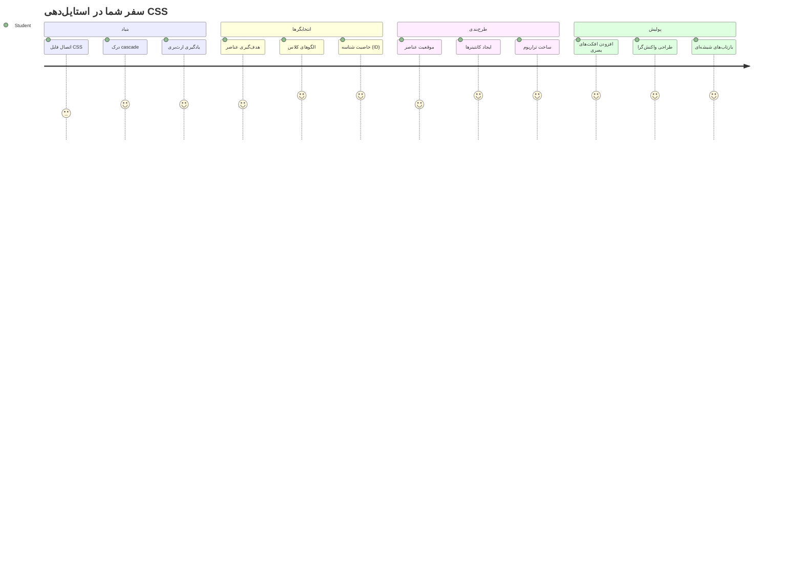
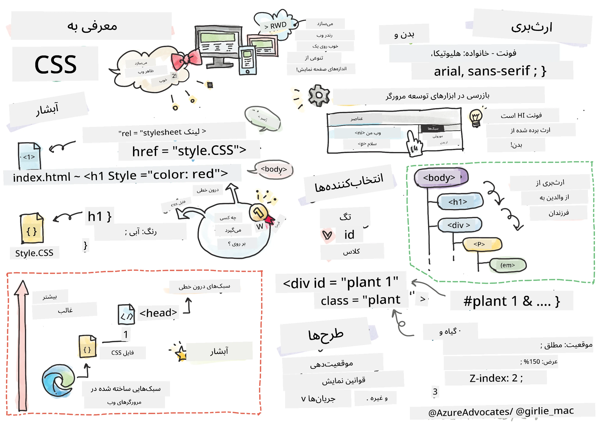
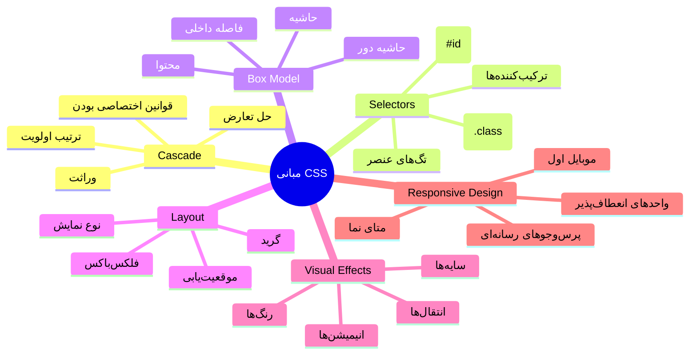
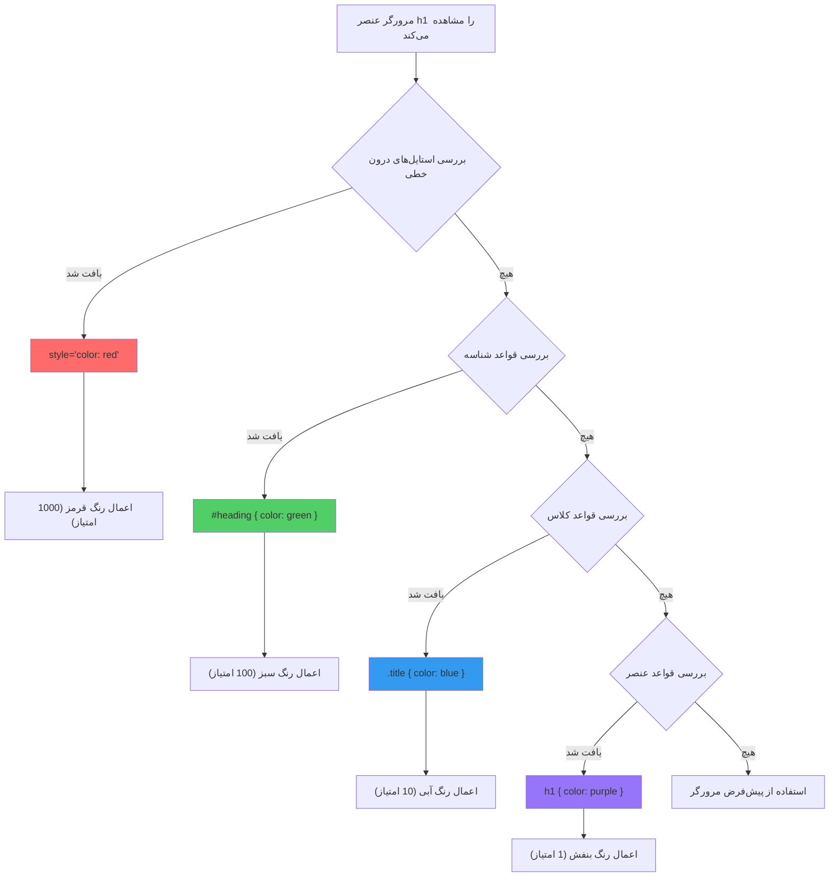
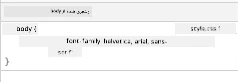
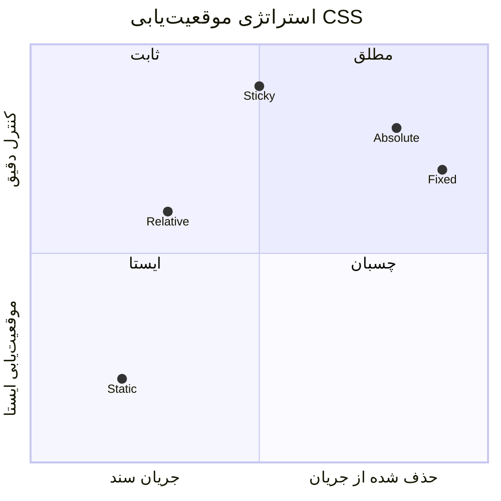
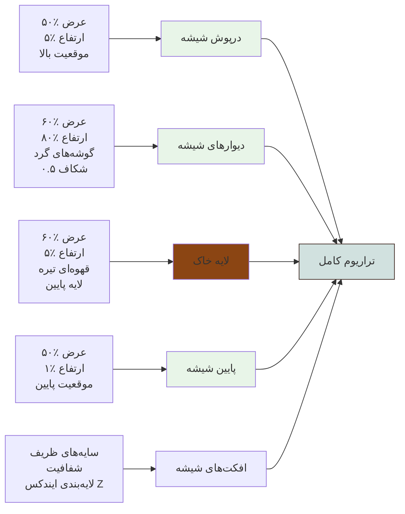
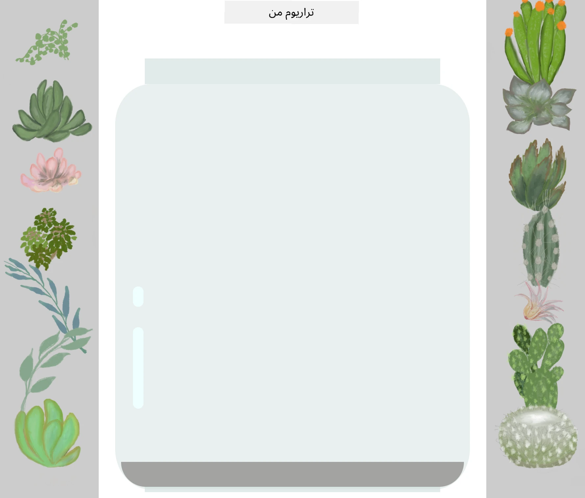
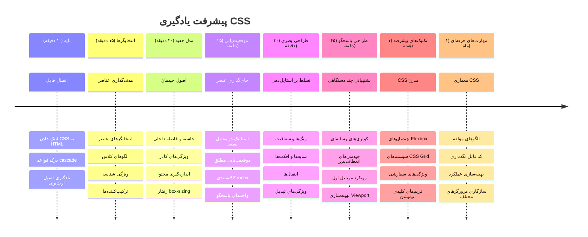

<!--
CO_OP_TRANSLATOR_METADATA:
{
  "original_hash": "e39f3a4e3bcccf94639e3af1248f8a4d",
  "translation_date": "2026-01-06T10:42:54+00:00",
  "source_file": "3-terrarium/2-intro-to-css/README.md",
  "language_code": "fa"
}
-->
# پروژه تراریوم قسمت دوم: معرفی CSS



> اسکچ‌نوت توسط [تومومی ایمورا](https://twitter.com/girlie_mac)

یادتان هست که تراریوم HTML شما چقدر ساده به نظر می‌رسید؟ CSS همان جایی است که آن ساختار ساده را به چیزی جذاب و دیدنی تبدیل می‌کنیم.

اگر HTML مانند ساختن چارچوب یک خانه باشد، CSS همه چیزهایی است که آن خانه را مثل یک خانه واقعی حس می‌کند - رنگ‌های نقاشی، چیدمان مبلمان، نورپردازی و نحوه جریان یافتن اتاق‌ها. تصور کنید کاخ ورسای چگونه از یک کلبه ساده شکار شروع شد، اما توجه دقیق به تزئینات و چیدمان آن را به یکی از زیباترین ساختمان‌های جهان تبدیل کرد.

امروز، تراریوم شما را از یک ساختار ساده به یک ساختار صیقلی و جذاب تبدیل خواهیم کرد. یاد خواهید گرفت که چگونه عناصر را به دقت موقعیت‌دهی کنید، چیدمان‌ها را به اندازه‌های مختلف صفحه نمایش واکنش‌گرا بسازید و جذابیت بصری‌ای ایجاد کنید که وبسایت‌ها را گیراتر می‌کند.

تا پایان این درس، خواهید دید که چگونه استایل‌دهی راهبردی CSS می‌تواند پروژه شما را به شکل قابل‌توجهی بهبود بخشد. بیایید کمی به تراریوم شما سبک بدهیم.


## آزمون پیش از کلاس

[آزمون پیش از کلاس](https://ff-quizzes.netlify.app/web/quiz/17)

## شروع با CSS

CSS اغلب فقط به عنوان "زیبا کردن چیزها" شناخته می‌شود، اما نقش بسیار گسترده‌تری دارد. CSS مانند کارگردان یک فیلم است - شما کنترل می‌کنید که همه چیز نه تنها چگونه دیده شود، بلکه چگونه حرکت کند، به تعاملی پاسخ دهد و خودش را با شرایط متفاوت تطبیق دهد.

CSS مدرن توانایی‌های شگفت‌آوری دارد. می‌توانید کدی بنویسید که به طور خودکار چیدمان‌ها را برای تلفن‌ها، تبلت‌ها و کامپیوترهای رومیزی تنظیم کند. می‌توانید حرکات نرمی بسازید که توجه کاربران را به جایی که لازم است هدایت کند. وقتی همه چیز با هم کار کند، نتایج می‌تواند بسیار چشمگیر باشد.

> 💡 **نکته حرفه‌ای**: CSS دائماً با ویژگی‌ها و قابلیت‌های جدید در حال پیشرفت است. همیشه قبل از استفاده از ویژگی‌های جدید CSS در پروژه‌های تولید، پشتیبانی مرورگرها را در [CanIUse.com](https://caniuse.com) بررسی کنید.

**در این درس چه کار خواهیم کرد:**
- **ایجاد** طراحی کامل بصری برای تراریوم شما با استفاده از تکنیک‌های مدرن CSS
- **کاوش** مفاهیم بنیادی مثل cascade، inheritance، و انتخابگرهای CSS
- **پیاده‌سازی** موقعیت‌دهی واکنش‌گرا و استراتژی‌های چیدمان
- **ساخت** کانتینر تراریوم با استفاده از شکل‌ها و استایل‌های CSS

### پیش‌نیاز

باید ساختار HTML تراریومتان را از درس قبلی کامل کرده باشید و آماده استایل‌دهی باشد.

> 📺 **منبع ویدیویی**: این ویدیو راهنمای مفید را ببینید
>
> [](https://www.youtube.com/watch?v=6yIdOIV9p1I)

### تنظیم فایل CSS شما

قبل از شروع استایل‌دهی، باید CSS را به HTML متصل کنیم. این اتصال به مرورگر می‌گوید کجا باید دستورهای استایل‌دهی تراریوم ما را پیدا کند.

در پوشه تراریوم خود، یک فایل جدید به نام `style.css` بسازید، سپس آن را در بخش `<head>` سند HTML خود لینک کنید:

```html
<link rel="stylesheet" href="./style.css" />
```

**این کد چه کاری انجام می‌دهد:**
- **ایجاد** ارتباط بین فایل‌های HTML و CSS شما
- **گفتن** به مرورگر برای بارگذاری و اعمال استایل‌ها از فایل `style.css`
- **استفاده** از ویژگی `rel="stylesheet"` برای مشخص کردن اینکه این یک فایل CSS است
- **ارجاع** مسیر فایل با `href="./style.css"`

## درک Cascade در CSS

تا به حال فکر کرده‌اید چرا CSS را style sheets‌های cascading یا به عبارتی سلسله‌مراتبی می‌نامند؟ استایل‌ها مانند آبشار پایین می‌آیند و گاهی با هم تداخل دارند.

مثل ساختار فرماندهی نظامی را در نظر بگیرید - یک دستور کلی ممکن است بگوید "همه سربازها سبز بپوشند"، اما یک دستور خاص به یگان شما می‌تواند بگوید "برای مراسم لباس رسمی آبی بپوشید". دستور خاص تر برنده است. CSS نیز از منطق مشابهی پیروی می‌کند و فهم این سلسله‌مراتب دیباگ کردن را بسیار ساده‌تر می‌کند.

### آزمایش اولویت Cascade

بیایید ببینیم cascade چگونه عمل می‌کند با ایجاد یک تضاد استایل. ابتدا یک استایل درون خطی به تگ `<h1>` اضافه کنید:

```html
<h1 style="color: red">My Terrarium</h1>
```

**این کد چه کاری انجام می‌دهد:**
- **اعمال** رنگ قرمز به صورت مستقیم روی عنصر `<h1>` با استایل درون خطی
- **استفاده** از ویژگی `style` برای درج CSS مستقیماً در HTML
- **ایجاد** بالاترین اولویت برای این عنصر خاص

سپس این قاعده را به فایل `style.css` اضافه کنید:

```css
h1 {
  color: blue;
}
```

**در بالا ما:**
- **تعریف** قاعده CSS برای همه عناصر `<h1>`
- **تنظیم** رنگ متن به آبی با استفاده از فایل استایل خارجی
- **ایجاد** قاعده‌ای با اولویت کمتر نسبت به استایل درون خطی

✅ **سؤال دانش**: کدام رنگ در وب‌اپ شما نمایش داده می‌شود؟ چرا آن رنگ برنده است؟ می‌توانید موقعیت‌هایی یادآوری کنید که بخواهید استایل‌ها را روی هم بنویسید؟


> 💡 **ترتیب اولویت CSS (از بالا به پایین):**
> 1. **استایل‌های درون خطی** (ویژگی style)
> 2. **شناسه‌ها** (#myId)
> 3. **کلاس‌ها** (.myClass) و ویژگی‌ها
> 4. **انتخابگرهای عنصر** (h1, div, p)
> 5. **تنظیمات پیش‌فرض مرورگر**

## ارث‌بری CSS در عمل

ارث‌بری CSS شبیه وراثت ژنتیکی است - عناصر برخی خصوصیات را از اجداد خود می‌گیرند. اگر خانواده فونت را در عنصر body تنظیم کنید، تمام متن داخل به طور خودکار از آن فونت استفاده می‌کند. این شبیه به این است که چطور فک متمایز خانواده هابسبورگ‌ها در نسل‌های مختلف بدون تعیین جداگانه برای هر فرد ظاهر می‌شد.

اما همه چیز ارث نمی‌برد. سبک‌های متنی مثل فونت‌ها و رنگ‌ها ارث می‌برند، اما ویژگی‌های چیدمان مانند حاشیه‌ها و حاشیه‌نماها (border) این‌طور نیستند. همانگونه که کودکان ممکن است ویژگی فیزیکی والدین را به ارث ببرند ولی سبک لباس پوشیدن آنها را نه.

### مشاهده ارث‌بری فونت

بیایید ارث‌بری را با تنظیم فونت برای عنصر `<body>` ببینیم:

```css
body {
  font-family: 'Segoe UI', Tahoma, Geneva, Verdana, sans-serif;
}
```

**توضیح آنچه رخ می‌دهد:**
- **تنظیم** خانواده فونت برای کل صفحه با هدف قرار دادن عنصر `<body>`
- **استفاده** از استک فونت با گزینه‌های پشتیبان برای سازگاری بهتر با مرورگرها
- **اعمال** فونت‌های مدرن سیستمی که در سیستم‌عامل‌های مختلف خوب به نظر می‌رسند
- **اطمینان** از اینکه همه عناصر فرزند این فونت را به ارث می‌برند مگر اینکه به طور خاص پوشش داده شود

ابزار توسعه‌دهنده مرورگر خود را باز کنید (F12)، به تب Elements بروید و عنصر `<h1>` خود را بررسی کنید. خواهید دید که خانواده فونت را از body به ارث می‌برد:



✅ **زمان آزمایش**: سعی کنید ویژگی‌های ارث‌برنده دیگری مانند `color`، `line-height` یا `text-align` را روی `<body>` تنظیم کنید. چه اتفاقی برای عنوان و سایر عناصر می‌افتد؟

> 📝 **ویژگی‌هایی که منتقل می‌شوند (ارث‌برنده):** `color`, `font-family`, `font-size`, `line-height`, `text-align`, `visibility`
>
> **ویژگی‌هایی که منتقل نمی‌شوند:** `margin`, `padding`, `border`, `width`, `height`, `position`

### 🔄 **بررسی آموزشی**
**درک پایه‌ای CSS**: قبل از رفتن به انتخابگرها، اطمینان حاصل کنید که می‌توانید:
- ✅ تفاوت بین cascade و inheritance را توضیح دهید
- ✅ پیش‌بینی کنید که در تعارض specificity کدام استایل برنده می‌شود
- ✅ ویژگی‌هایی که از والد به ارث می‌رسند را مشخص کنید
- ✅ اتصال فایل‌های CSS به HTML را به درستی انجام دهید

**آزمون سریع:** اگر این استایل‌ها را داشته باشید، رنگ یک `<h1>` درون `<div class="special">` چه خواهد بود؟
```css
div { color: blue; }
.special { color: green; }
h1 { color: red; }
```
*پاسخ: قرمز (انتخابگر عنصر مستقیماً روی h1 اعمال می‌شود)*

## تسلط بر انتخابگرهای CSS

انتخابگرهای CSS نحوه هدف‌گیری عناصر خاص برای استایل‌دهی هستند. آنها شبیه دادن دستورالعمل دقیق‌اند - به جای گفتن "خانه"، ممکن است بگویید "خانه آبی با درب قرمز در خیابان میپل".

CSS روش‌های مختلفی برای تعیین دقت دارد، و انتخاب انتخابگر درست مانند انتخاب ابزار مناسب برای کار است. گاهی شما باید به همه درهای محله استایل دهید و گاهی فقط یک درب خاص.

### انتخابگرهای عنصر (تگ‌ها)

انتخابگرهای عنصر با نام تگ HTML هدف قرار می‌دهند. آنها برای تنظیم سبک‌های پایه ایده‌آلند که به طور گسترده در صفحه اعمال می‌شوند:

```css
body {
  font-family: 'Segoe UI', Tahoma, Geneva, Verdana, sans-serif;
  margin: 0;
  padding: 0;
}

h1 {
  color: #3a241d;
  text-align: center;
  font-size: 2.5rem;
  margin-bottom: 1rem;
}
```

**درک این استایل‌ها:**
- **تنظیم** تایپوگرافی سازگار برای کل صفحه با انتخابگر `body`
- **حذف** حاشیه‌ها و padding پیش‌فرض مرورگر برای کنترل بهتر
- **استایل‌دهی** به تمام عناصر عنوان با رنگ، تراز و فاصله‌بندی
- **استفاده** از واحد rem برای اندازه فونت قابل تنظیم و قابل دسترس

در حالی که انتخابگرهای عنصر برای استایل‌دهی عمومی خوب کار می‌کنند، برای استایل دادن به اجزای خاص مثل گیاهان تراریوم نیاز به انتخابگرهای دقیق‌تر دارید.

### انتخابگرهای id برای عناصر منحصربه‌فرد

انتخابگرهای id با نماد `#` استفاده می‌شوند و عناصر با شناسه (id) خاص را هدف می‌گیرند. چون idها باید در یک صفحه یکتا باشند، برای استایل‌دهی به عناصر خاص و منحصربه‌فرد مثل کانتینرهای گیاه سمت چپ و راست که در تراریوم داریم ایده‌آل‌اند.

بیایید استایل‌دهی کانتینرهای جانبی تراریوم که گیاهان داخل آنها قرار می‌گیرند را بسازیم:

```css
#left-container {
  background-color: #f5f5f5;
  width: 15%;
  left: 0;
  top: 0;
  position: absolute;
  height: 100vh;
  padding: 1rem;
  box-sizing: border-box;
}

#right-container {
  background-color: #f5f5f5;
  width: 15%;
  right: 0;
  top: 0;
  position: absolute;
  height: 100vh;
  padding: 1rem;
  box-sizing: border-box;
}
```

**این کد چه کار می‌کند:**
- **موقعیت‌دهی** کانتینرها در لبه‌های چپ و راست با موقعیت `absolute`
- **استفاده** از واحد vh (ارتفاع صفحه نمایش) برای ارتفاع واکنش‌گرا که به اندازه صفحه نمایش واکنش نشان می‌دهد
- **اعمال** `box-sizing: border-box` برای این که padding در عرض کل حساب شود
- **حذف** واحدهای px غیرضروری از مقادیر صفر برای کد تمیزتر
- **تنظیم** رنگ پس‌زمینه ملایمی که از خاکستری شدید چشم را کمتر خسته می‌کند

✅ **چالش کیفیت کد**: توجه کنید چطور این CSS اصل DRY (تکرار نکن خودت) را نقض می‌کند. می‌توانید با ترکیب یک id و یک کلاس آن را بهینه کنید؟

**روش بهبود یافته:**
```html
<div id="left-container" class="container"></div>
<div id="right-container" class="container"></div>
```

```css
.container {
  background-color: #f5f5f5;
  width: 15%;
  top: 0;
  position: absolute;
  height: 100vh;
  padding: 1rem;
  box-sizing: border-box;
}

#left-container {
  left: 0;
}

#right-container {
  right: 0;
}
```

### انتخابگرهای کلاس برای سبک‌های قابل استفاده مجدد

انتخابگرهای کلاس با نماد `.` استفاده می‌شوند و وقتی که می‌خواهید استایل‌های یکسان را به تعداد زیادی عنصر اعمال کنید عالی‌اند. برخلاف idها، کلاس‌ها را می‌توانید در سراسر HTML خود مجدداً استفاده کنید، که آنها را برای الگوهای استایل‌دهی یکنواخت ایده‌آل می‌کند.

در تراریوم ما، هر گیاه نیاز به استایل مشابهی دارد ولی همچنین نیاز به موقعیت‌دهی منحصربه‌فردی دارد. ما ترکیبی از کلاس‌ها برای استایل‌های مشترک و شناسه‌ها برای موقعیت‌دهی منحصربه‌فرد استفاده خواهیم کرد.

**اینجا ساختار HTML برای هر گیاه است:**
```html
<div class="plant-holder">
  
</div>
```

**عناصر کلیدی توضیح داده شده:**
- **استفاده** از `class="plant-holder"` برای استایل ثابت کانتینر برای همه گیاهان
- **اعمال** `class="plant"` برای استایل و رفتار مشترک تصاویر
- **شامل** شناسه منحصر به فرد `id="plant1"` برای موقعیت‌یابی فردی و تعامل جاوااسکریپت
- **ارائه** متن جایگزین توصیفی برای دسترسی‌پذیری نابینایان

اکنون این استایل‌ها را به فایل `style.css` خود اضافه کنید:

```css
.plant-holder {
  position: relative;
  height: 13%;
  left: -0.6rem;
}

.plant {
  position: absolute;
  max-width: 150%;
  max-height: 150%;
  z-index: 2;
  transition: transform 0.3s ease;
}

.plant:hover {
  transform: scale(1.05);
}
```

**توضیح این استایل‌ها:**
- **ایجاد** موقعیت‌دهی نسبی برای نگهدارنده گیاه برای ایجاد زمینه موقعیت‌دهی
- **تنظیم** هر نگهدارنده روی ۱۳٪ ارتفاع، تا همه گیاهان به صورت عمودی بدون اسکرول جا شوند
- **چرخش** نگهدارنده‌ها کمی به سمت چپ برای بهبود تمرکز گیاهان در ظرف خودشان
- **امکان** اندازه‌گیری واکنش‌گرای گیاه با خصوصیات `max-width` و `max-height`
- **استفاده** از `z-index` برای قرار دادن گیاهان روی سایر عناصر تراریوم
- **افزودن** افکت هاور ملایم با ترنزیشن‌های CSS برای تعامل بهتر کاربر

✅ **تفکر نقادانه**: چرا به هر دو انتخابگر `.plant-holder` و `.plant` نیاز داریم؟ اگر فقط یکی را استفاده کنیم چه اتفاقی می‌افتد؟

> 💡 **الگوی طراحی**: کانتینر (`.plant-holder`) چیدمان و موقعیت‌دهی را کنترل می‌کند، در حالی که محتوا (`.plant`) ظاهر و مقیاس‌دهی را کنترل می‌کند. این جداسازی باعث می‌شود کد قابل نگهداری‌تر و انعطاف‌پذیرتر باشد.

## درک موقعیت‌دهی CSS

موقعیت‌دهی CSS مانند کارگردان صحنه نمایش است - شما مشخص می‌کنید هر بازیگر کجا بایستد و چگونه روی صحنه حرکت کند. برخی بازیگران طبق چینش استاندارد حرکت می‌کنند، برخی دیگر برای اثر دراماتیک نیاز به موقعیت‌دهی خاص دارند.

وقتی موقعیت‌دهی را فهمیدید، بسیاری از چالش‌های چیدمان قابل مدیریت می‌شوند. نیاز به نوار ناوبری که هنگام اسکرول کردن صفحه چسبیده بماند دارید؟ موقعیت‌دهی این را امکان‌پذیر می‌کند. می‌خواهید راهنمای ابزار (tooltip) در نقطه خاصی ظاهر شود؟ این هم موقعیت‌دهی است.

### پنج مقدار موقعیت‌دهی


| مقدار موقعیت | رفتار | موقعیت استفاده |
|----------------|----------|----------|
| `static` | جریان پیش‌فرض، نادیده گرفتن top/left/right/bottom | چیدمان نرمال سند |
| `relative` | موقعیت‌یابی نسبی به موقعیت عادی خود | تنظیمات کوچک، ایجاد زمینه موقعیت‌دهی |
| `absolute` | موقعیت‌یابی نسبی به نزدیک‌ترین والد موقعیت‌یافته | مکان دقیق، روی هم قرار گرفتن‌ها |
| `fixed` | موقعیت‌یابی نسبی به viewport | نوارهای ناوبری، عناصر شناور |
| `sticky` | تغییر بین نسبی و ثابت بر اساس اسکرول | سربرگ‌هایی که هنگام اسکرول چسبنده می‌مانند |

### موقعیت‌دهی در تراریوم ما

تراریوم ما از ترکیب راهبردی انواع موقعیت‌دهی استفاده می‌کند تا چیدمان دلخواه ایجاد شود:

```css
/* Container positioning */
.container {
  position: absolute; /* Removes from normal flow */
  /* ... other styles ... */
}

/* Plant holder positioning */
.plant-holder {
  position: relative; /* Creates positioning context */
  /* ... other styles ... */
}

/* Plant positioning */
.plant {
  position: absolute; /* Allows precise placement within holder */
  /* ... other styles ... */
}
```

**درک راهبرد موقعیت‌دهی:**
- **کانتینرهای absolute** از جریان معمول سند خارج شده و به لبه‌های صفحه چسبیده‌اند
- **نگهدارنده‌های گیاه relative** زمینه موقعیت‌دهی ایجاد کرده در حالی که در جریان سند باقی می‌مانند
- **گیاهان absolute** می‌توانند دقیقاً داخل کانتینرهای نسبی موقعیت‌دهی شوند
- **این ترکیب** اجازه می‌دهد گیاهان به صورت عمودی روی هم قرار بگیرند و در عین حال هر کدام موقعیت‌یابی فردی داشته باشند

> 🎯 **چرا این مهم است**: عناصر `plant` نیاز به موقعیت‌یابی absolute دارند تا در درس بعدی بتوانند درگ (کشیدن) شوند. موقعیت‌یابی absolute آنها را از جریان معمول چیدمان حذف می‌کند و تعامل درگ‌آند‌دراپ را ممکن می‌سازد.

✅ **زمان آزمایش**: سعی کنید مقادیر موقعیت‌دهی را تغییر دهید و نتایج را مشاهده کنید:
- چه اتفاقی می‌افتد اگر `.container` را از `absolute` به `relative` تغییر دهید؟
- چیدمان چگونه تغییر می‌کند اگر `.plant-holder` به جای `relative` از `absolute` استفاده کند؟
- وقتی که موقعیت `.plant` را به `relative` تغییر می‌دهید چه اتفاقی می‌افتد؟

### 🔄 **بازبینی آموزشی**  
**تسلط بر موقعیت‌دهی CSS**: مکث کنید تا درک خود را بررسی کنید:  
- ✅ آیا می‌توانید توضیح دهید چرا گیاهان برای کشیدن و رها کردن به موقعیت‌یابی مطلق نیاز دارند؟  
- ✅ آیا می‌دانید ظرف‌های نسبی چگونه زمینه موقعیت‌یابی ایجاد می‌کنند؟  
- ✅ چرا ظرف‌های جانبی از موقعیت‌یابی مطلق استفاده می‌کنند؟  
- ✅ اگر اعلامیه‌های موقعیت را کاملاً حذف کنید چه اتفاقی می‌افتد؟  

**ارتباط با دنیای واقعی**: درباره چگونگی منعکس شدن موقعیت‌دهی CSS از چیدمان دنیای واقعی فکر کنید:  
- **Static**: کتاب‌ها روی قفسه (ترتیب طبیعی)  
- **Relative**: حرکت دادن کمی کتاب اما نگه داشتن جای آن  
- **Absolute**: قرار دادن نشانگر کتاب روی شماره صفحه دقیق  
- **Fixed**: یادداشت چسبنده‌ای که هنگام ورق زدن صفحات، قابل مشاهده باقی می‌ماند  

## ساخت تراریوم با CSS

اکنون یک شیشه تراریوم شیشه‌ای فقط با استفاده از CSS می‌سازیم — بدون نیاز به تصاویر یا نرم‌افزار گرافیکی.

ایجاد شیشه واقعی، سایه‌ها و عمق با استفاده از موقعیت‌یابی و شفافیت قابلیت‌های بصری CSS را نشان می‌دهد. این تکنیک شبیه نحوه استفاده معماران مکتب باهاوس از اشکال هندسی ساده برای ساخت سازه‌های زیبا و پیچیده است. وقتی این اصول را متوجه شوید، تکنیک‌های CSS پشت بسیاری از طراحی‌های وب را خواهید شناخت.


### ساخت اجزای شیشه تراریوم

بیایید شیشه تراریوم را قطعه به قطعه بسازیم. هر قسمت از موقعیت‌یابی مطلق و اندازه‌گیری بر اساس درصد برای طراحی واکنش‌گرا استفاده می‌کند:

```css
.jar-walls {
  height: 80%;
  width: 60%;
  background: #d1e1df;
  border-radius: 1rem;
  position: absolute;
  bottom: 0.5%;
  left: 20%;
  opacity: 0.5;
  z-index: 1;
  box-shadow: inset 0 0 2rem rgba(0, 0, 0, 0.1);
}

.jar-top {
  width: 50%;
  height: 5%;
  background: #d1e1df;
  position: absolute;
  bottom: 80.5%;
  left: 25%;
  opacity: 0.7;
  z-index: 1;
  border-radius: 0.5rem 0.5rem 0 0;
}

.jar-bottom {
  width: 50%;
  height: 1%;
  background: #d1e1df;
  position: absolute;
  bottom: 0;
  left: 25%;
  opacity: 0.7;
  border-radius: 0 0 0.5rem 0.5rem;
}

.dirt {
  width: 60%;
  height: 5%;
  background: #3a241d;
  position: absolute;
  border-radius: 0 0 1rem 1rem;
  bottom: 1%;
  left: 20%;
  opacity: 0.7;
  z-index: -1;
}
```
  
**درک ساخت تراریوم:**  
- **استفاده از** ابعاد درصدی برای مقیاس‌بندی واکنش‌گرا در همه اندازه‌های صفحه  
- **مکان‌یابی** عناصر به صورت مطلق برای چیدن و تراز دقیق آنها  
- **اعمال** مقادیر مختلف شفافیت برای ایجاد اثر شفافیت شیشه  
- **اجرا**ی لایه‌بندی `z-index` برای اینکه گیاهان داخل شیشه نمایش داده شوند  
- **افزودن** سایه‌های ملایم و شعاع مرز ظریف برای ظاهر واقعی‌تر  

### طراحی واکنش‌گرا با درصدها

توجه کنید که همه ابعاد به جای پیکسل ثابت، بر اساس درصد هستند:

**چرا این مهم است:**  
- **تضمین** مقیاس متناسب تراریوم در هر اندازه صفحه  
- **حفظ** روابط بصری بین اجزای شیشه  
- **ایجاد** تجربه‌ی یکنواخت از تلفن همراه تا مانیتورهای بزرگ دسکتاپ  
- **امکان** تطبیق طراحی بدون خراب شدن چیدمان بصری  

### واحدهای CSS به کار رفته

ما از واحد `rem` برای شعاع مرز استفاده می‌کنیم که نسبت به اندازه فونت اصلی مقیاس می‌گیرد. این طراحی‌های قابل دسترس‌تر را ایجاد می‌کند که ترجیحات فونت کاربر را رعایت می‌کنند. برای اطلاعات بیشتر درباره [واحدهای نسبی CSS](https://www.w3.org/TR/css-values-3/#font-relative-lengths) به مشخصات رسمی مراجعه کنید.

✅ **آزمایش بصری**: مقادیر را تغییر دهید و اثرات را مشاهده کنید:  
- شفافیت شیشه را از 0.5 به 0.8 تغییر دهید — این چگونه ظاهر شیشه را تغییر می‌دهد؟  
- رنگ خاک را از `#3a241d` به `#8B4513` تغییر دهید — چه تأثیری در ظاهر دارد؟  
- مقدار `z-index` خاک را به 2 تغییر دهید — چه اتفاقی در لایه‌بندی می‌افتد؟  

### 🔄 **بازبینی آموزشی**  
**درک طراحی بصری CSS**: درک خود را از طراحی بصری CSS تأیید کنید:  
- ✅ چگونه ابعاد بر اساس درصد طراحی واکنش‌گرا ایجاد می‌کنند؟  
- ✅ چرا شفافیت اثر شفافیت شیشه را ایجاد می‌کند؟  
- ✅ نقش `z-index` در لایه‌بندی عناصر چیست؟  
- ✅ چگونه مقادیر شعاع مرز شکل شیشه را ایجاد می‌کنند؟  

**اصل طراحی**: توجه کنید چگونه ما شکل‌های پیچیده را از اشکال ساده می‌سازیم:  
1. **مستطیل‌ها** → **مستطیل‌های گرد** → **اجزای شیشه**  
2. **رنگ‌های تخت** → **شفافیت** → **اثر شیشه‌ای**  
3. **عناصر منفرد** → **ترکیب لایه‌ای** → **ظاهر سه‌بعدی**  

---

## چالش GitHub Copilot Agent 🚀

با حالت Agent چالش زیر را کامل کنید:

**توضیح:** انیمیشن CSS ایجاد کنید که گیاهان تراریوم به آرامی به جلو و عقب تاب بخورند و اثر نسیم طبیعی را شبیه‌سازی کند. این به شما کمک می‌کند تمرین انیمیشن‌ها، تبدیلات و فریم‌های کلیدی CSS را انجام دهید و جذابیت بصری تراریومتان را افزایش دهید.

**دستور:** انیمیشن‌های فریم کلیدی CSS اضافه کنید تا گیاهان داخل تراریوم آرام به دو طرف تاب بخورند. یک انیمیشن تاب‌خوردن ایجاد کنید که هر گیاه را کمی (2-3 درجه) به چپ و راست می‌چرخاند با مدت 3-4 ثانیه و آن را به کلاس `.plant` نسبت دهید. اطمینان حاصل کنید که انیمیشن به صورت نامحدود حلقه زده و تابع تسهیل برای حرکت طبیعی دارد.

اطلاعات بیشتر درباره [حالت agent](https://code.visualstudio.com/blogs/2025/02/24/introducing-copilot-agent-mode) را اینجا بیابید.

## 🚀 چالش: افزودن بازتاب‌های شیشه‌ای

آماده‌اید تراریوم خود را با بازتاب‌های شیشه‌ای واقعی‌تر کنید؟ این تکنیک عمق و واقع‌نمایی به طراحی اضافه می‌کند.

شما نقاط برجسته ملایمی ایجاد خواهید کرد که بازتاب نور از سطوح شیشه را شبیه‌سازی می‌کند. این روش مشابه نحوه استفاده نقاشان رنسانس مانند جان فان آیک از نور و بازتاب برای واقعی به نظر رسیدن شیشه نقاشی شده است. هدف شما این است:



**چالش شما:**  
- **ایجاد** اشکال بیضی سفید یا رنگ روشن برای بازتاب شیشه  
- **قرار دادن** آنها به صورت استراتژیک در سمت چپ شیشه  
- **اعمال** شفافیت و اثر محو مناسب برای بازتاب نور واقعی  
- **استفاده** از `border-radius` برای ایجاد اشکال ارگانیک مانند حباب  
- **آزمایش** با گرادیانت‌ها یا سایه‌های باکس برای واقع‌نمایی بهتر  

## آزمون پس از جلسه

[آزمون پس از جلسه](https://ff-quizzes.netlify.app/web/quiz/18)

## گسترش دانش CSS خود

CSS ممکن است در ابتدا پیچیده به نظر برسد اما درک این مفاهیم اصلی پایه‌ای محکم برای تکنیک‌های پیشرفته‌تر فراهم می‌کند.

**زمینه‌های بعدی یادگیری CSS شما:**  
- **Flexbox** — ساده‌سازی تراز و توزیع عناصر  
- **CSS Grid** — ابزارهای قدرتمند برای ساخت چیدمان پیچیده  
- **متغیرهای CSS** — کاهش تکرار و بهبود نگهداری کد  
- **طراحی واکنش‌گرا** — تضمین عملکرد خوب سایت‌ها در اندازه‌های مختلف صفحه  

### منابع یادگیری تعاملی

این مفاهیم را با بازی‌های جذاب و تعاملی تمرین کنید:  
- 🐸 [Flexbox Froggy](https://flexboxfroggy.com/) — تسلط بر Flexbox با چالش‌های سرگرم‌کننده  
- 🌱 [Grid Garden](https://codepip.com/games/grid-garden/) — یادگیری CSS Grid با کاشت هویج مجازی  
- 🎯 [CSS Battle](https://cssbattle.dev/) — تست مهارت CSS با چالش‌های برنامه‌نویسی  

### یادگیری بیشتر

برای مبانی کامل CSS این ماژول Microsoft Learn را تکمیل کنید: [سبک دادن به برنامه HTML خود با CSS](https://docs.microsoft.com/learn/modules/build-simple-website/4-css-basics/?WT.mc_id=academic-77807-sagibbon)

### ⚡ **چه کاری می‌توانید در ۵ دقیقه بعدی انجام دهید**  
- [ ] باز کردن DevTools و بررسی استایل‌های CSS در هر وب‌سایتی با پنل Elements  
- [ ] ساخت یک فایل CSS ساده و لینک دادن به صفحه HTML  
- [ ] تلاش برای تغییر رنگ‌ها با روش‌های مختلف: هگز، RGB و نام رنگ‌ها  
- [ ] تمرین مدل باکس با افزودن padding و margin به یک div  

### 🎯 **چه کاری می‌توانید در این ساعت انجام دهید**  
- [ ] تکمیل آزمون پس از درس و مرور مبانی CSS  
- [ ] سبک دادن به صفحه HTML با فونت، رنگ و فاصله‌ها  
- [ ] ساخت چیدمان ساده با flexbox یا grid  
- [ ] آزمایش انتقال‌های CSS برای افکت‌های نرم  
- [ ] تمرین طراحی واکنش‌گرا با media queries  

### 📅 **ماجراجویی یک هفته‌ای CSS شما**  
- [ ] تکمیل تمرین استایل دادن تراریوم با خلاقیت  
- [ ] تسلط بر CSS Grid با ساخت چیدمان گالری عکس  
- [ ] یادگیری انیمیشن‌های CSS برای زنده کردن طراحی‌ها  
- [ ] بررسی پروسسورهای CSS مانند Sass یا Less  
- [ ] مطالعه اصول طراحی و اعمال آن در CSS  
- [ ] تحلیل و بازسازی طراحی‌های جالب در اینترنت  

### 🌟 **تسلط طراحی یک ماهه شما**  
- [ ] ساخت یک سیستم طراحی وب‌سایت کاملاً واکنش‌گرا  
- [ ] یادگیری CSS-in-JS یا فریم‌ورک‌های utility-first مانند Tailwind  
- [ ] همکاری در پروژه‌های متن‌باز با بهبودهای CSS  
- [ ] تسلط بر مفاهیم پیشرفته CSS مانند properties سفارشی و containment  
- [ ] ایجاد کتابخانه‌های کامپوننت قابل استفاده مجدد با CSS ماژولار  
- [ ] آموزش به دیگران در یادگیری CSS و اشتراک دانش طراحی  

## 🎯 جدول زمانی تسلط شما بر CSS


### 🛠️ خلاصه جعبه‌ابزار CSS شما

پس از این درس، اکنون شما:  
- **درک Cascade**: چگونه استایل‌ها به ارث می‌رسند و بر هم تقدم دارند  
- **تسلط بر Selector ها**: هدف‌گیری دقیق با عناصر، کلاس‌ها و آی‌دی‌ها  
- **مهارت‌های موقعیت‌یابی**: قرار دادن استراتژیک عناصر و لایه‌بندی  
- **طراحی بصری**: ایجاد اثرات شیشه، سایه و شفافیت  
- **تکنیک‌های واکنش‌گرا**: چیدمان‌های درصدی که با هر صفحه‌ای سازگارند  
- **سازماندهی کد**: ساختار CSS تمیز و قابل نگهداری  
- **روش‌های مدرن**: استفاده از واحدهای نسبی و الگوهای طراحی قابل دسترس  

**قدم‌های بعدی**: تراریوم شما اکنون هم ساختار (HTML) هم استایل (CSS) دارد. درس نهایی تعاملی بودن با جاوااسکریپت را اضافه خواهد کرد!  

## تمرین

[بازسازی CSS](assignment.md)

---

<!-- CO-OP TRANSLATOR DISCLAIMER START -->
**سلب مسئولیت**:  
این سند با استفاده از سرویس ترجمه هوش مصنوعی [Co-op Translator](https://github.com/Azure/co-op-translator) ترجمه شده است. در حالی که ما در تلاش برای دقت هستیم، لطفاً توجه داشته باشید که ترجمه‌های خودکار ممکن است حاوی اشتباهات یا نادرستی‌هایی باشند. سند اصلی به زبان بومی خود، منبع معتبر در نظر گرفته شود. برای اطلاعات حساس، ترجمه حرفه‌ای انسانی توصیه می‌شود. ما مسئول هیچگونه سوءتفاهم یا تفسیر نادرستی که ناشی از استفاده از این ترجمه باشد، نمی‌باشیم.
<!-- CO-OP TRANSLATOR DISCLAIMER END -->