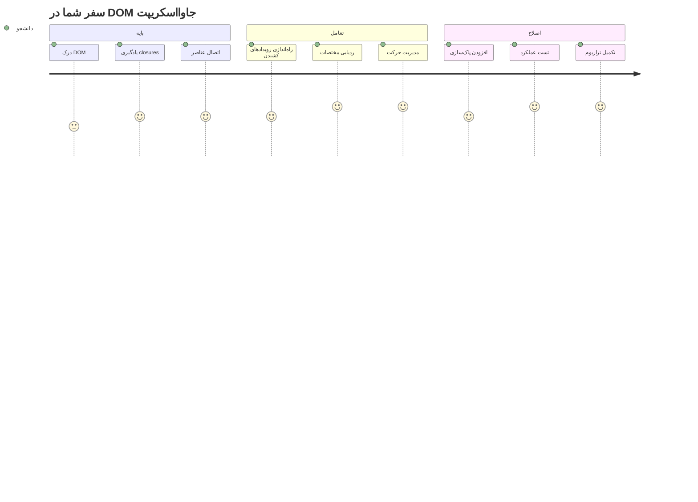
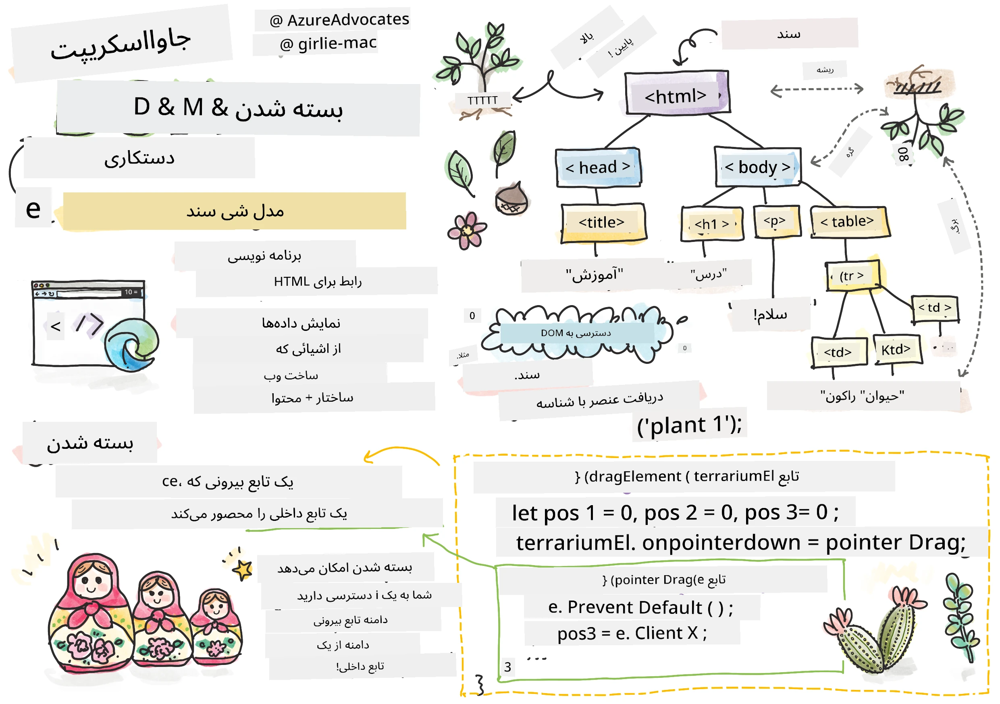
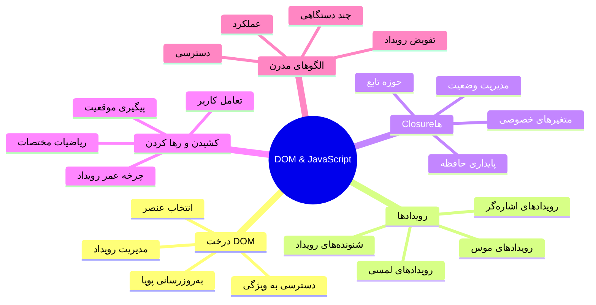
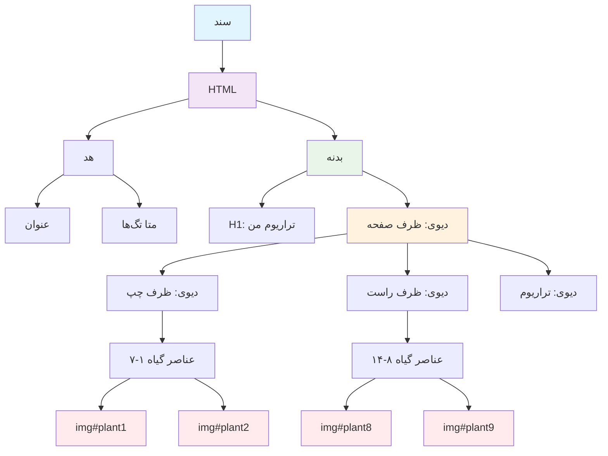
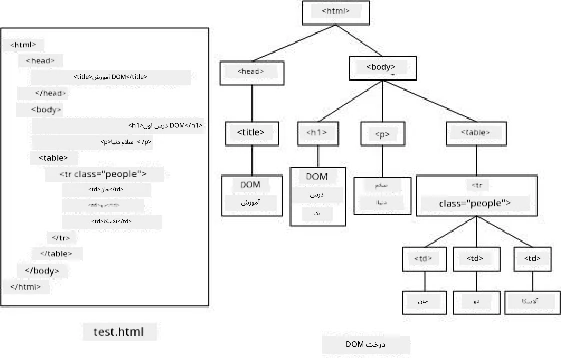
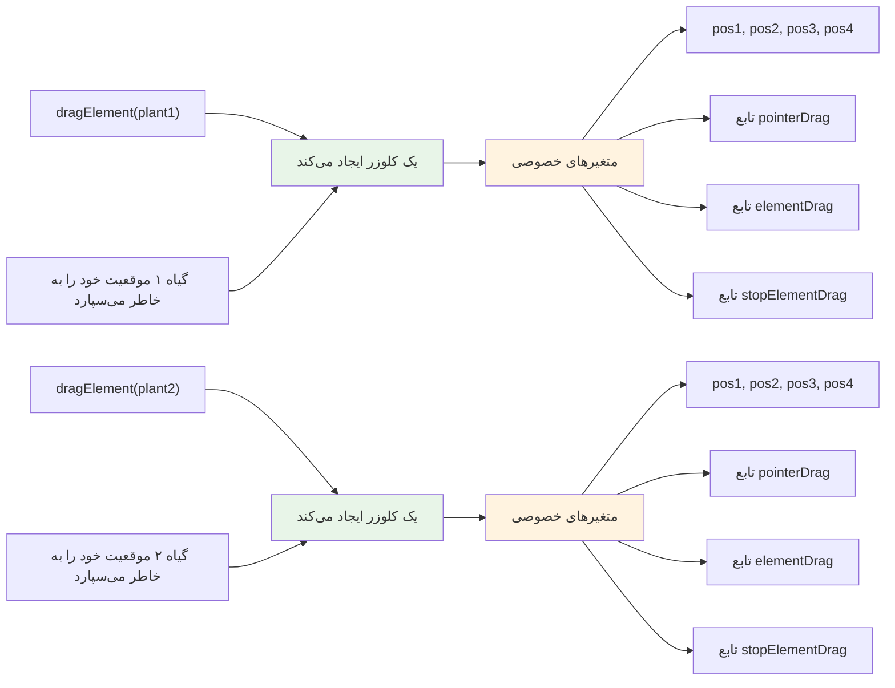
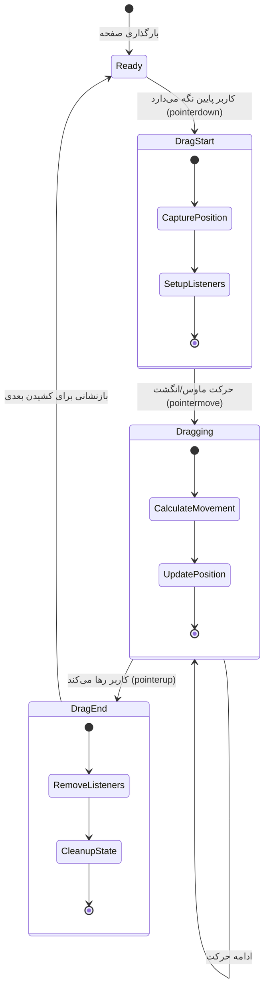
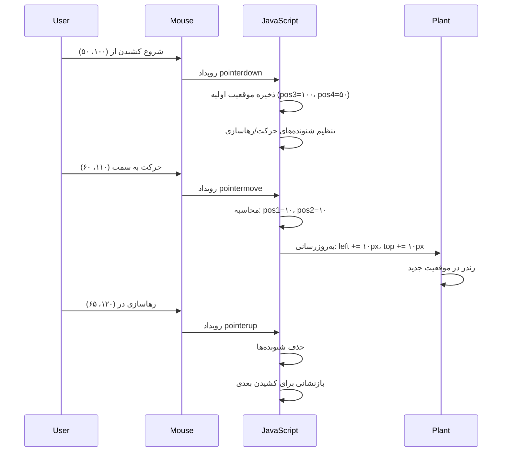
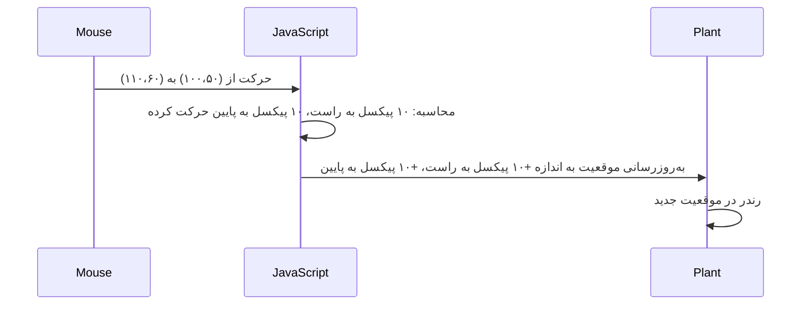
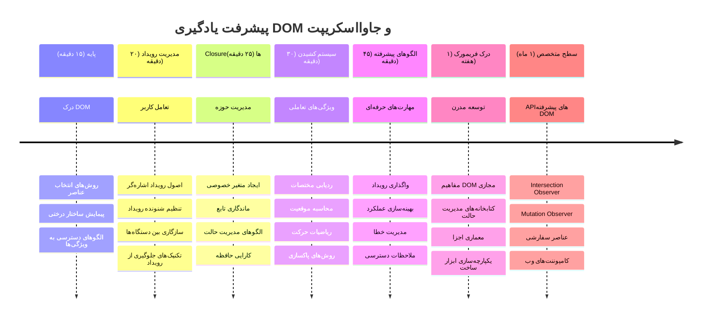

# پروژه تراریوم بخش ۳: دستکاری DOM و بسته‌های جاوااسکریپت



> اسکتچ‌نوت توسط [تومومی ایمورا](https://twitter.com/girlie_mac)

به یکی از جذاب‌ترین بخش‌های توسعه وب خوش آمدید - ایجاد تعامل! مدل شیء سند (DOM) مانند پلی بین HTML و جاوااسکریپت شما است و امروز از آن برای زنده کردن تراریوم شما استفاده خواهیم کرد. زمانی که تیم برنرز-لی نخستین مرورگر وب را ساخت، دنیای وب را جایی تصور می‌کرد که اسناد پویا و تعاملی باشند - DOM این چشم‌انداز را ممکن می‌سازد.

ما همچنین به بسته‌های جاوااسکریپت می‌پردازیم که ممکن است ابتدا ترسناک به نظر برسند. بسته‌ها را مانند "کیسه‌های حافظه" تصور کنید که توابع شما می‌توانند اطلاعات مهم را به خاطر بسپارند. این مانند هر گیاه در تراریوم است که رکورد دادهٔ مختص به خود را برای دنبال کردن موقعیتش دارد. تا پایان این درس، خواهید فهمید چقدر طبیعی و مفید هستند.

آنچه می‌سازیم این است: تراریومی که کاربران بتوانند گیاهان را هر جایی که می‌خواهند بکشند و رها کنند. شما تکنیک‌های دستکاری DOM را یاد می‌گیرید که پشت صحنه همه چیز از بارگذاری فایل در حالت کشیدن و رها کردن تا بازی‌های تعاملی کار می‌کند. بیایید تراریوم شما را زنده کنیم.


## آزمون قبل از جلسه

[آزمون قبل از جلسه](https://ff-quizzes.netlify.app/web/quiz/19)

## درک DOM: دروازه شما به صفحات وب تعاملی

مدل شیء سند (DOM) نحوه ارتباط جاوااسکریپت با عناصر HTML شما است. هنگامی که مرورگر شما صفحه HTML را بارگذاری می‌کند، یک نمای ساخت‌یافته از آن صفحه در حافظه ایجاد می‌کند - همان DOM است. آن را مانند درخت خانوادگی تصور کنید که هر عنصر HTML یک عضو خانواده است که جاوااسکریپت می‌تواند به آن دسترسی پیدا کند، آن را تغییر دهد یا بازچینی کند.

دستکاری DOM صفحات ایستا را به وب‌سایت‌های تعاملی تبدیل می‌کند. هر بار که دکمه‌ای هنگام بردن موس روی آن رنگش تغییر می‌کند، محتوا بدون بارگذاری مجدد صفحه به‌روزرسانی می‌شود یا عناصری که می‌توانید بکشید و جابه‌جا کنید، این دستکاری DOM است که کار می‌کند.




> نمایشی از DOM و نشانه‌گذاری HTML که به آن اشاره دارد. از [اولفا نصرآویی](https://www.researchgate.net/publication/221417012_Profile-Based_Focused_Crawler_for_Social_Media-Sharing_Websites)

**این چیزی است که DOM را قدرتمند می‌کند:**
- **فراهم می‌کند** روشی ساخت‌یافته برای دسترسی به هر عنصری در صفحه شما
- **امکان می‌دهد** به‌روزرسانی‌های دینامیک محتوا بدون بارگذاری مجدد صفحه
- **اجازه می‌دهد** پاسخ در زمان واقعی به تعاملات کاربر مانند کلیک و کشیدن
- **ایجاد می‌کند** پایه‌ای برای برنامه‌های وب تعاملی مدرن

## بسته‌های جاوااسکریپت: ایجاد کد سازمان‌یافته و قدرتمند

[بسته جاوااسکریپت](https://developer.mozilla.org/docs/Web/JavaScript/Closures) مانند دادن فضای کاری خصوصی با حافظه ماندگار به یک تابع است. در نظر بگیرید چگونه فنچ‌های داروین در جزایر گالاپاگوس هرکدام منقاری تخصصی بر اساس محیط خاص خود توسعه داده‌اند - بسته‌ها به همین شکل کار می‌کنند، ایجاد توابع تخصصی که پس‌زمینه خاص خود را حتی بعد از پایان تابع والد به خاطر می‌سپارند.

در تراریوم ما، بسته‌ها به هر گیاه کمک می‌کنند موقعیت خاص خود را به طور مستقل به یاد داشته باشد. این الگو در سراسر توسعه حرفه‌ای جاوااسکریپت ظاهر می‌شود و مفهومی ارزشمند برای فهمیدن است.


> 💡 **درک بسته‌ها**: بسته‌ها موضوع مهمی در جاوااسکریپت هستند و بسیاری از توسعه‌دهندگان برای سال‌ها از آنها استفاده می‌کنند قبل از اینکه تمام جنبه‌های نظری آن را به طور کامل درک کنند. امروز، تمرکز ما بر کاربرد عملی است - خواهید دید که بسته‌ها به طور طبیعی هنگام ساخت ویژگی‌های تعاملی پدیدار می‌شوند. درک شما با مشاهده حل مسائل واقعی رشد خواهد کرد.


> نمایشی از DOM و نشانه‌گذاری HTML که به آن اشاره دارد. از [اولفا نصرآویی](https://www.researchgate.net/publication/221417012_Profile-Based_Focused_Crawler_for_Social_Media-Sharing_Websites)

در این درس، پروژه تراریوم تعاملی خود را با ایجاد جاوااسکریپتی تکمیل می‌کنیم که به کاربر امکان می‌دهد گیاهان روی صفحه را دستکاری کند.

## قبل از شروع: آماده شدن برای موفقیت

شما به فایل‌های HTML و CSS از درس‌های قبلی تراریوم نیاز دارید - ما می‌خواهیم آن طراحی ایستا را تعاملی کنیم. اگر برای اولین بار می‌پیوندید، اتمام آن درس‌ها ابتدا زمینه مهمی فراهم می‌آورد.

اینجا آنچه می‌سازیم:
- **کشیدن و رها کردن روان** برای همه گیاهان تراریوم
- **ردیابی مختصات** تا گیاهان موقعیت خود را حفظ کنند
- **یک رابط کاملاً تعاملی** با استفاده از جاوااسکریپت خالص
- **کد تمیز و سازمان‌یافته** با استفاده از الگوهای بسته

## راه‌اندازی فایل جاوااسکریپت شما

بیایید فایل جاوااسکریپتی ایجاد کنیم که تراریوم شما را تعاملی می‌کند.

**مرحله ۱: فایل اسکریپت خود را بسازید**

در پوشه تراریوم خود، فایلی جدید به نام `script.js` بسازید.

**مرحله ۲: لینک کردن جاوااسکریپت به HTML**

این تگ اسکریپت را به بخش `<head>` فایل `index.html` خود اضافه کنید:

```html
<script src="./script.js" defer></script>
```

**چرا ویژگی `defer` اهمیت دارد:**
- **اطمینان می‌دهد** که جاوااسکریپت شما تا بارگذاری کامل HTML صبر می‌کند
- **جلوگیری می‌کند** از خطاهایی که جاوااسکریپت به دنبال عناصری می‌گردد که هنوز آماده نیستند
- **ضمانت می‌دهد** همه عناصر گیاه شما برای تعامل در دسترس باشند
- **افزایش می‌دهد** کارایی نسبت به قرار دادن اسکریپت‌ها در انتهای صفحه

> ⚠️ **نکته مهم**: ویژگی `defer` از مشکلات زمانی شایع جلوگیری می‌کند. بدون آن، جاوااسکریپت ممکن است قبل از بارگذاری عناصر HTML سعی کند به آنها دسترسی پیدا کند که باعث خطا می‌شود.

---

## وصل کردن جاوااسکریپت به عناصر HTML شما

قبل از اینکه بتوانیم عناصر را قابل کشیدن کنیم، جاوااسکریپت باید آنها را در DOM پیدا کند. این مانند سیستم کاتالوگ کتابخانه است - وقتی شماره کاتالوگ دارید، می‌توانید دقیقاً کتاب مورد نیاز را پیدا کنید و به تمام محتوای آن دسترسی داشته باشید.

ما از متد `document.getElementById()` برای این ارتباط‌ها استفاده می‌کنیم. این مانند داشتن سیستم دسته‌بندی دقیقی است - شما یک شناسه می‌دهید و دقیقاً آن عنصر مورد نیاز را در HTML پیدا می‌کند.

### فعال کردن قابلیت کشیدن برای همه گیاهان

این کد را به فایل `script.js` خود اضافه کنید:

```javascript
// فعال‌سازی عملکرد کشیدن برای تمام ۱۴ گیاه
dragElement(document.getElementById('plant1'));
dragElement(document.getElementById('plant2'));
dragElement(document.getElementById('plant3'));
dragElement(document.getElementById('plant4'));
dragElement(document.getElementById('plant5'));
dragElement(document.getElementById('plant6'));
dragElement(document.getElementById('plant7'));
dragElement(document.getElementById('plant8'));
dragElement(document.getElementById('plant9'));
dragElement(document.getElementById('plant10'));
dragElement(document.getElementById('plant11'));
dragElement(document.getElementById('plant12'));
dragElement(document.getElementById('plant13'));
dragElement(document.getElementById('plant14'));
```

**این کد چه کاری انجام می‌دهد:**
- **هر عنصر گیاه** را با استفاده از شناسه منحصر به فردش در DOM پیدا می‌کند
- **ارجاع جاوااسکریپتی** به هر عنصر HTML را دریافت می‌کند
- **هر عنصر را** به تابع `dragElement` (که بعد می‌سازیم) می‌فرستد
- **هر گیاه را** برای تعامل کشیدن و رها کردن آماده می‌کند
- **ساختار HTML شما را** به عملکرد جاوااسکریپت متصل می‌کند

> 🎯 **چرا از شناسه‌ها به جای کلاس‌ها استفاده می‌کنیم؟** شناسه‌ها شناسه‌های یکتایی برای عناصر مشخص فراهم می‌کنند، در حالی که کلاس‌های CSS برای استایل دادن به گروهی از عناصر طراحی شده‌اند. وقتی جاوااسکریپت نیاز دارد عناصر منفرد را دستکاری کند، شناسه‌ها دقت و کارایی لازم را فراهم می‌کنند.

> 💡 **نکته حرفه‌ای**: دقت کنید که چطور برای هر گیاه به صورت جداگانه `dragElement()` را فراخوانی می‌کنیم. این رویکرد تضمین می‌کند که هر گیاه رفتار کشیدن مستقل خود را داشته باشد که برای تعامل روان کاربر ضروری است.

### 🔄 **بررسی آموزشی**
**درک ارتباط DOM**: قبل از رفتن به قابلیت کشیدن، تأیید کنید که می‌توانید:
- ✅ توضیح دهید چگونه `document.getElementById()` عناصر HTML را پیدا می‌کند
- ✅ درک کنید چرا برای هر گیاه از شناسه منحصر به فرد استفاده می‌کنیم
- ✅ هدف ویژگی `defer` در تگ‌های اسکریپت را توصیف کنید
- ✅ بفهمید جاوااسکریپت و HTML چگونه از طریق DOM متصل می‌شوند

**آزمون سریع خودآموز**: اگر دو عنصر شناسه یکسان داشتند چه اتفاقی می‌افتد؟ چرا `getElementById()` فقط یک عنصر را بازمی‌گرداند؟
*پاسخ: شناسه‌ها باید یکتا باشند؛ در صورت تکرار، فقط اولین عنصر بازگردانده می‌شود*

---

## ساختن بسته عنصر کشیدنی

اکنون قلب قابلیت کشیدن را می‌سازیم: یک بسته که رفتار کشیدن هر گیاه را مدیریت می‌کند. این بسته چندین تابع درونی دارد که با هم کار می‌کنند تا حرکت موس را دنبال کنند و موقعیت عنصر را به‌روزرسانی نمایند.

بسته‌ها برای این کار عالی هستند زیرا به ما اجازه می‌دهند متغیرهای "خصوصی" بسازیم که بین فراخوانی‌های تابع حفظ می‌شوند و به هر گیاه سیستم ردگیری مختصات مستقل خودش را می‌دهند.

### درک بسته‌ها با یک نمونه ساده

اجازه دهید بسته‌ها را با یک نمونه ساده نشان دهم که این مفهوم را توضیح می‌دهد:

```javascript
function createCounter() {
    let count = 0; // این شبیه به یک متغیر خصوصی است
    
    function increment() {
        count++; // تابع درونی، متغیر بیرونی را به خاطر می‌سپارد
        return count;
    }
    
    return increment; // ما تابع درونی را برمی‌گردانیم
}

const myCounter = createCounter();
console.log(myCounter()); // ۱
console.log(myCounter()); // ۲
```

**در این الگوی بسته چه اتفاقی می‌افتد:**
- **یک متغیر خصوصی `count`** می‌سازد که فقط در این بسته وجود دارد
- **تابع داخلی** می‌تواند به آن متغیر بیرونی دسترسی داشته و آن را تغییر دهد (مکانیزم بسته)
- **وقتی تابع داخلی را برمی‌گردانیم** ارتباطش با آن داده خصوصی حفظ می‌شود
- **حتی بعد از اینکه** `createCounter()` تمام می‌شود، `count` باقی می‌ماند و مقدارش را به یاد می‌آورد

### چرا بسته‌ها برای قابلیت کشیدن عالی هستند

برای تراریوم ما، هر گیاه باید موقعیت فعلی مختصات خود را به یاد داشته باشد. بسته‌ها راه حل ایده‌آل را فراهم می‌کنند:

**مزایای کلیدی برای پروژه ما:**
- **نگهداری** متغیرهای موقعیتی خصوصی به طور مستقل برای هر گیاه
- **حفظ** داده‌های مختصات بین رویدادهای کشیدن
- **جلوگیری** از تعارض متغیرها بین عناصر قابل کشیدن مختلف
- **خلق** ساختار کد تمیز و سازمان‌یافته

> 🎯 **هدف یادگیری**: نیازی نیست همه جنبه‌های بسته‌ها را همین الان کامل یاد بگیرید. تمرکز کنید روی مشاهده اینکه چگونه به ما کمک می‌کنند کد را سازمان‌دهی کنیم و وضعیت عملکرد کشیدن را حفظ کنیم.


### ساخت تابع dragElement

حالا تابع اصلی را می‌سازیم که منطق کامل کشیدن را مدیریت می‌کند. این تابع را زیر اعلام عناصر گیاه خود اضافه کنید:

```javascript
function dragElement(terrariumElement) {
    // مقداردهی اولیه متغیرهای ردیابی موقعیت
    let pos1 = 0,  // موقعیت X ماوس قبلی
        pos2 = 0,  // موقعیت Y ماوس قبلی
        pos3 = 0,  // موقعیت X ماوس فعلی
        pos4 = 0;  // موقعیت Y ماوس فعلی
    
    // تنظیم شنونده رویداد کشیدن اولیه
    terrariumElement.onpointerdown = pointerDrag;
}
```

**درک سیستم ردگیری موقعیت:**
- **`pos1` و `pos2`**: تفاوت بین موقعیت‌های موس قدیم و جدید را ذخیره می‌کنند
- **`pos3` و `pos4`**: مختصات فعلی موس را دنبال می‌کنند
- **`terrariumElement`**: عنصر گیاه خاصی که می‌خواهیم قابل کشیدن کنیم
- **`onpointerdown`**: رویدادی که زمانی که کاربر کشیدن را شروع می‌کند فعال می‌شود

**الگوی بسته چگونه کار می‌کند:**
- **متغیرهای موقعیتی خصوصی** برای هر عنصر گیاه ایجاد می‌کند
- **این متغیرها را** در طول چرخه زندگی کشیدن نگه می‌دارد
- **تضمین می‌کند** هر گیاه مختصات خودش را به طور مستقل ردگیری می‌کند
- **از طریق** تابع `dragElement` یک رابط تمیز فراهم می‌کند

### چرا از رویدادهای Pointer استفاده می‌کنیم؟

ممکن است بپرسید چرا از `onpointerdown` به جای `onclick` که آشناتر است استفاده می‌کنیم. دلیل آن این است:

| نوع رویداد | مناسب برای | نکته |
|------------|------------|-------------|
| `onclick` | کلیک‌های ساده دکمه | نمی‌تواند کشیدن را مدیریت کند (فقط کلیک و رها کردن) |
| `onpointerdown` | هم موس و هم لمس | جدیدتر است، اما امروزه به خوبی پشتیبانی می‌شود |
| `onmousedown` | فقط موس دسکتاپ | کاربران موبایل را در نظر نمی‌گیرد |

**چرا رویدادهای pointer برای آنچه می‌سازیم عالی هستند:**
- **خوب کار می‌کند** چه کسی موس، انگشت یا قلم نوری استفاده کند
- **حس مشابه** روی لپ‌تاپ، تبلت و تلفن می‌دهد
- **کنترل می‌کند** حرکت واقعی کشیدن (نه فقط کلیک و تمام)
- **تجربه‌ای روان** ایجاد می‌کند که کاربران از اپ‌های وب مدرن انتظار دارند

> 💡 **آینده‌نگری**: رویدادهای pointer روش مدرن برای مدیریت تعاملات کاربر هستند. به جای نوشتن کدهای جدا برای موس و لمس، هر دو را به صورت رایگان دریافت می‌کنید. جالب است، نه؟

### 🔄 **بررسی آموزشی**
**درک مدیریت رویداد**: مکث کنید و درک خود را از رویدادها تأیید کنید:
- ✅ چرا از رویدادهای pointer به جای موس استفاده می‌کنیم؟
- ✅ متغیرهای بسته چگونه بین فراخوانی‌های تابع حفظ می‌شوند؟
- ✅ نقش `preventDefault()` در کشیدن روان چیست؟
- ✅ چرا شنونده‌ها را به سند متصل می‌کنیم نه به عناصر منفرد؟

**ارتباط دنیای واقعی**: به رابط‌های کشیدن و رها کردن که روزانه استفاده می‌کنید فکر کنید:
- **بارگذاری فایل‌ها**: کشیدن فایل‌ها به داخل پنجره مرورگر
- **کابان بردها**: جابه‌جایی وظایف بین ستون‌ها
- **گالری تصاویر**: مرتب‌سازی ترتیب عکس‌ها
- **رابط‌های موبایل**: سوایپ و کشیدن در صفحات لمسی

---

## تابع pointerDrag: شروع کشیدن را ثبت می‌کند

وقتی کاربر روی یک گیاه فشار می‌دهد (چه با کلیک موس، چه لمس انگشت)، تابع `pointerDrag` به سرعت فعال می‌شود. این تابع مختصات اولیه را ثبت می‌کند و سیستم کشیدن را راه‌اندازی می‌کند.

این تابع را درون بسته `dragElement`، درست بعد از خط `terrariumElement.onpointerdown = pointerDrag;` اضافه کنید:

```javascript
function pointerDrag(e) {
    // جلوگیری از رفتار پیش‌فرض مرورگر (مانند انتخاب متن)
    e.preventDefault();
    
    // ضبط موقعیت اولیه موس/لمس
    pos3 = e.clientX;  // مختصات X جایی که کشیدن شروع شده است
    pos4 = e.clientY;  // مختصات Y جایی که کشیدن شروع شده است
    
    // تنظیم شنوندگان رویداد برای فرایند کشیدن
    document.onpointermove = elementDrag;
    document.onpointerup = stopElementDrag;
}
```

**گام به گام، این اتفاقات می‌افتد:**
- **جلوگیری می‌کند** از رفتارهای پیش‌فرض مرورگر که ممکن است در کشیدن اختلال ایجاد کنند
- **مختصات دقیق** جایی که کاربر کشیدن را شروع کرده ثبت می‌کند
- **شنونده‌های رویداد** را برای حرکت ادامه‌دار کشیدن برقرار می‌سازد
- **سیستم را آماده می‌کند** تا حرکت موس/انگشت را در کل سند ردیابی نماید

### درک جلوگیری از رویداد

خط `e.preventDefault()` نقش کلیدی برای کشیدن روان دارد:

**بدون جلوگیری، مرورگرها ممکن است:**
- **متن را هنگام کشیدن انتخاب کنند**
- **منوهای زمینه را هنگام کشیدن با کلیک راست باز کنند**
- **با رفتار کشیدن سفارشی ما تداخل کنند**
- **آثار بصری نامطلوب در طول کشیدن ایجاد کنند**

> 🔍 **تجربه عملی**: پس از تکمیل این درس، `e.preventDefault()` را حذف کنید و ببینید چگونه تجربه کشیدن تغییر می‌کند. به سرعت متوجه می‌شوید که چرا این خط ضروری است!

### سیستم ردیابی مختصات

ویژگی‌های `e.clientX` و `e.clientY` مختصات دقیق موس/لمس را به ما می‌دهند:

| ویژگی | چه چیزی را اندازه می‌گیرد | مورد کاربرد |
|---------|----------------------------|-------------|
| `clientX` | موقعیت افقی نسبت به نمای صفحه | ردگیری حرکت چپ-راست |
| `clientY` | موقعیت عمودی نسبت به نمای صفحه | ردگیری حرکت بالا-پایین |
**درک این مختصات:**
- **اطلاعات** موقعیت‌یابی با دقت پیکسلی را فراهم می‌کند
- **به‌روزرسانی** در زمان واقعی با حرکت کاربر روی اشاره‌گر
- **حفظ** ثبات در ابعاد و سطوح بزرگ‌نمایی مختلف صفحه نمایش
- **امکان** تعاملات کشیدن روان و پاسخگو را فراهم می‌کند

### تنظیم شنونده‌های رویداد سطح سند

توجه کنید که چگونه رویدادهای حرکت و توقف را به کل `document` متصل می‌کنیم، نه فقط به عنصر گیاه:

```javascript
document.onpointermove = elementDrag;
document.onpointerup = stopElementDrag;
```

**چرا به سند وصل می‌کنیم:**
- **ادامه** پیگیری حتی زمانی که ماوس از روی عنصر گیاه بیرون می‌رود
- **جلوگیری** از قطع ناگهانی کشیدن اگر کاربر سریع حرکت کند
- **ارائه** کشیدن روان در کل صفحه نمایش
- **مدیریت** حالت‌های لبه‌ای که اشاره‌گر از پنجره مرورگر خارج می‌شود

> ⚡ **یادداشت عملکرد**: هنگام توقف کشیدن، شنونده‌های سطح سند را پاک می‌کنیم تا از نشتی حافظه و مشکلات عملکردی جلوگیری شود.

## تکمیل سیستم کشیدن: حرکت و پاک‌سازی

حالا دو تابع باقی‌مانده را اضافه می‌کنیم که حرکت واقعی کشیدن و پاک‌سازی هنگام توقف کشیدن را کنترل می‌کنند. این توابع با هم کار می‌کنند تا حرکت روان و پاسخگوی گیاه در سراسر تراریوم شما ایجاد کنند.

### تابع elementDrag: پیگیری حرکت

تابع `elementDrag` را درست بعد از آکولاد بسته تابع `pointerDrag` اضافه کنید:

```javascript
function elementDrag(e) {
    // محاسبه فاصله طی شده از آخرین رویداد
    pos1 = pos3 - e.clientX;  // فاصله افقی طی شده
    pos2 = pos4 - e.clientY;  // فاصله عمودی طی شده
    
    // به‌روزرسانی ردگیری موقعیت فعلی
    pos3 = e.clientX;  // موقعیت X فعلی جدید
    pos4 = e.clientY;  // موقعیت Y فعلی جدید
    
    // اعمال حرکت به موقعیت عنصر
    terrariumElement.style.top = (terrariumElement.offsetTop - pos2) + 'px';
    terrariumElement.style.left = (terrariumElement.offsetLeft - pos1) + 'px';
}
```

**درک ریاضیات مختصات:**
- **`pos1` و `pos2`**: محاسبه میزان جابجایی ماوس از آخرین به‌روزرسانی
- **`pos3` و `pos4`**: ذخیره موقعیت فعلی ماوس برای محاسبه بعدی
- **`offsetTop` و `offsetLeft`**: گرفتن موقعیت فعلی عنصر روی صفحه
- **منطق تفریق**: حرکت عنصر به اندازه‌ای که ماوس حرکت کرده است


**تفکیک محاسبه حرکت به شرح زیر است:**
1. **اندازه‌گیری** تفاوت بین موقعیت ماوس قبلی و جدید
2. **محاسبه** میزان حرکت عنصر بر اساس حرکت ماوس
3. **به‌روزرسانی** خواص موقعیت CSS عنصر در زمان واقعی
4. **ذخیره** موقعیت جدید به عنوان پایه برای محاسبه حرکت بعدی

### نمایش تصویری ریاضیات


### تابع stopElementDrag: پاک‌سازی

تابع پاک‌سازی را بعد از آکولاد بسته `elementDrag` اضافه کنید:

```javascript
function stopElementDrag() {
    // حذف گوش‌دهنده‌های رویداد در سطح سند
    document.onpointerup = null;
    document.onpointermove = null;
}
```

**چرا پاک‌سازی ضروری است:**
- **جلوگیری** از نشتی حافظه ناشی از شنونده‌های رویداد باقی‌مانده
- **متوقف کردن** رفتار کشیدن وقتی کاربر گیاه را رها می‌کند
- **امکان** کشیدن مستقل عناصر دیگر
- **بازنشانی** سیستم برای عملیات کشیدن بعدی

**چه اتفاقی می‌افتد اگر پاک‌سازی نکنیم:**
- شنونده‌های رویداد حتی پس از توقف کشیدن کار می‌کنند
- کاهش عملکرد به دلیل انباشت شنونده‌های بلااستفاده
- رفتار غیرمنتظره هنگام تعامل با سایر عناصر
- هدر رفت منابع مرورگر برای مدیریت رویداد غیرضروری

### درک خواص موقعیت‌یابی CSS

سیستم کشیدن ما دو خاصیت CSS کلیدی را دستکاری می‌کند:

| خاصیت | چه چیزی را کنترل می‌کند | چگونه از آن استفاده می‌کنیم |
|----------|------------------|---------------|
| `top` | فاصله از لبه بالایی | موقعیت‌یابی عمودی هنگام کشیدن |
| `left` | فاصله از لبه چپ | موقعیت‌یابی افقی هنگام کشیدن |

**نکات کلیدی درباره خواص offset:**
- **`offsetTop`**: فاصله فعلی از بالای عنصر والد موقعیت‌یابی شده
- **`offsetLeft`**: فاصله فعلی از چپ عنصر والد موقعیت‌یابی شده
- **زمینه موقعیت‌یابی**: این مقادیر نسبت به نزدیک‌ترین جد موقعیت‌یابی شده است
- **به‌روزرسانی در زمان واقعی**: تغییرات بلافاصله هنگام تغییر خواص CSS اعمال می‌شود

> 🎯 **فلسفه طراحی**: این سیستم کشیدن به طور عمدی انعطاف‌پذیر طراحی شده است – هیچ "ناحیه رهاسازی" یا محدودیتی ندارد. کاربران می‌توانند گیاهان را در هر جای تراریوم قرار دهند و کنترل کامل خلاقانه بر طراحی خود داشته باشند.

## کنار هم گذاشتن همه چیز: سیستم کامل کشیدن شما

تبریک! شما به‌تازگی یک سیستم پیچیده کشیدن و رها کردن با استفاده از جاوااسکریپت ساده ساخته‌اید. تابع کامل `dragElement` شما اکنون شامل یک closure قدرتمند است که مدیریت می‌کند:

**کارهایی که closure شما انجام می‌دهد:**
- **نگهداری** متغیرهای موقعیت خصوصی برای هر گیاه به صورت مستقل
- **مدیریت** چرخه کامل کشیدن از شروع تا پایان
- **ارائه** حرکت روان و پاسخگو در کل صفحه نمایش
- **پاک‌سازی** منابع به درستی برای جلوگیری از نشت حافظه
- **ساخت** یک رابط کاربری شهودی و خلاقانه برای طراحی تراریوم

### آزمایش تراریوم تعاملی شما

حالا تراریوم تعاملی خود را تست کنید! فایل `index.html` را در مرورگر وب باز کنید و قابلیت‌ها را امتحان کنید:

1. **کلیک و نگه‌داشتن** روی هر گیاه برای شروع کشیدن
2. **حرکت ماوس یا انگشت** و دیدن حرکت روان گیاه همراه اشاره‌گر
3. **رها کردن** برای قرار دادن گیاه در موقعیت جدید
4. **آزمایش** با چیدمان‌های مختلف برای کاوش رابط کاربری

🥇 **دستاورد**: شما یک برنامه وب کاملاً تعاملی ایجاد کرده‌اید که از مفاهیم اصلی استفاده می‌کند که توسعه‌دهندگان حرفه‌ای هر روز به کار می‌برند. این عملکرد کشیدن و رها کردن اصول مشابهی را دارد که در بارگذاری فایل‌ها، تابلوهای کانبان و بسیاری از رابط‌های تعاملی دیگر به کار می‌رود.

### 🔄 **بررسی آموزشی**
**درک کامل سیستم**: مهارت خود را در سیستم کشیدن کامل تأیید کنید:
- ✅ چگونه closures وضعیت مستقل هر گیاه را نگهداری می‌کنند؟
- ✅ چرا محاسبات ریاضی مختصات برای حرکت روان ضروری است؟
- ✅ چه اتفاقی می‌افتد اگر پاک‌سازی شنونده‌های رویداد را فراموش کنیم؟
- ✅ این الگو چگونه به تعاملات پیچیده‌تر مقیاس‌پذیر است؟

**بازتاب کیفیت کد**: راه‌حل کامل خود را بازبینی کنید:
- **طراحی ماژولار**: هر گیاه یک نمونه closure مستقل می‌گیرد
- **کارایی رویداد**: تنظیم و پاک‌سازی مناسب شنونده‌ها
- **پشتیبانی چند دستگاهی**: کار روی دسکتاپ و موبایل
- **آگاه به عملکرد**: بدون نشت حافظه یا محاسبات زائد


---

## چالش GitHub Copilot Agent 🚀

از حالت Agent استفاده کنید تا چالش زیر را کامل کنید:

**توضیح:** پروژه تراریوم را با افزودن قابلیت بازنشانی که تمام گیاهان را با انیمیشن روان به موقعیت‌های اصلی کناری برمی‌گرداند، ارتقا دهید.

**دستور:** یک دکمه بازنشانی بسازید که هنگام کلیک، همه گیاهان را با استفاده از انتقال CSS به موقعیت اصلی کناری خود بازمی‌گرداند. تابع باید موقعیت‌های اصلی را هنگام بارگذاری صفحه ذخیره کند و با فشار دادن دکمه بازنشانی، گیاهان را طی ۱ ثانیه به آن موقعیت‌ها به صورت روان منتقل کند.

بیشتر درباره [حالت Agent](https://code.visualstudio.com/blogs/2025/02/24/introducing-copilot-agent-mode) بخوانید.

## 🚀 چالش اضافی: گسترش مهارت‌های خود

آماده‌اید تراریوم خود را به سطح بالاتری ببرید؟ سعی کنید این بهبودها را پیاده‌سازی کنید:

**گسترش‌های خلاقانه:**
- **دوبار کلیک** روی یک گیاه آن را به جلوی صفحه (z-index) ببرد
- **افزودن بازخورد بصری** مانند درخشش ملایم هنگام هاور روی گیاهان
- **محدود کردن** کشیدن برای جلوگیری از خارج شدن گیاهان از تراریوم
- **ساخت تابع ذخیره‌سازی** که موقعیت گیاهان را با استفاده از localStorage به خاطر بسپارد
- **افزودن افکت‌های صوتی** هنگام برداشتن و قرار دادن گیاهان

> 💡 **فرصت یادگیری**: هر یک از این چالش‌ها جنبه‌های جدیدی از دستکاری DOM، مدیریت رویداد و طراحی تجربه کاربری را به شما می‌آموزد.

## آزمون پس از درس

[آزمون پس از درس](https://ff-quizzes.netlify.app/web/quiz/20)

## مرور و خودآموزی: تعمیق درک شما

شما اصول دستکاری DOM و closures را به خوبی فرا گرفته‌اید، اما همیشه چیزهای بیشتری برای یادگیری وجود دارد! در اینجا برخی مسیرها برای گسترش دانش و مهارت شما آمده است.

### رویکردهای جایگزین کشیدن و رها کردن

ما از رویدادهای اشاره‌گر برای بیشترین انعطاف‌پذیری استفاده کردیم، اما توسعه وب رویکردهای متعددی دارد:

| رویکرد | بهترین استفاده | ارزش یادگیری |
|----------|----------|----------------|
| [API کشیدن و رها کردن HTML](https://developer.mozilla.org/docs/Web/API/HTML_Drag_and_Drop_API) | بارگذاری فایل، ناحیه‌های کشیدن رسمی | درک قابلیت‌های بومی مرورگر |
| [رویدادهای لمسی](https://developer.mozilla.org/docs/Web/API/Touch_events) | تعاملات مختص موبایل | الگوهای توسعه موبایل-اول |
| خواص CSS `transform` | انیمیشن‌های روان | تکنیک‌های بهینه‌سازی عملکرد |

### موضوعات پیشرفته دستکاری DOM

**گام‌های بعدی در مسیر یادگیری شما:**
- **نمایندگی رویداد**: مدیریت رویدادها به صورت بهینه برای چندین عنصر
- **Intersection Observer**: تشخیص ورود/خروج عناصر از دید کاربر
- **Mutation Observer**: مشاهده تغییرات در ساختار DOM
- **کامپوننت‌های وب**: ساخت اجزای UI قابل استفاده مجدد و انتزاعی
- **مفاهیم DOM مجازی**: درک اینکه چارچوب‌ها چگونه به‌روزرسانی‌های DOM را بهینه می‌کنند

### منابع کلیدی برای یادگیری ادامه‌دار

**مستندات فنی:**
- [راهنمای MDN رویدادهای اشاره‌گر](https://developer.mozilla.org/docs/Web/API/Pointer_events) - مرجع جامع رویدادهای اشاره‌گر
- [استانداردهای W3C رویدادهای اشاره‌گر](https://www.w3.org/TR/pointerevents1/) - مستندات رسمی استانداردها
- [مرور عمیق closures در جاوااسکریپت](https://developer.mozilla.org/docs/Web/JavaScript/Closures) - الگوهای پیشرفته closure

**سازگاری مرورگر:**
- [CanIUse.com](https://caniuse.com/) - بررسی پشتیبانی ویژگی‌ها در مرورگرها
- [داده‌های سازگاری مرورگر MDN](https://github.com/mdn/browser-compat-data) - اطلاعات دقیق سازگاری

**فرصت‌های تمرین:**
- **ساخت** بازی پازل با مکانیک کشیدن مشابه
- **ایجاد** تابلو کانبان با مدیریت کار کشیدن و رها کردن
- **طراحی** گالری تصاویر با چیدمان قابل کشیدن عکس‌ها
- **آزمایش** با ژست‌های لمسی برای رابط‌های موبایل

> 🎯 **استراتژی یادگیری**: بهترین راه برای تثبیت این مفاهیم از طریق تمرین است. سعی کنید نسخه‌های مختلف رابط‌های کشیدنی را بسازید – هر پروژه چیز جدیدی درباره تعامل کاربر و دستکاری DOM به شما می‌آموزد.

### ⚡ **کاری که در ۵ دقیقه آینده می‌توانید انجام دهید**
- [ ] ابزارهای توسعه مرورگر را باز کنید و در کنسول `document.querySelector('body')` را تایپ کنید
- [ ] سعی کنید متن یک صفحه وب را با `innerHTML` یا `textContent` تغییر دهید
- [ ] شنونده رویداد کلیک را به هر دکمه یا لینک در صفحه اضافه کنید
- [ ] ساختار درخت DOM را با پنل Elements بررسی کنید

### 🎯 **آنچه در این ساعت می‌توانید به دست آورید**
- [ ] آزمون پس از درس را کامل کرده و مفاهیم DOM را مرور کنید
- [ ] صفحه وب تعاملی بسازید که به کلیک کاربران پاسخ دهد
- [ ] تمرین مدیریت رویداد با نوع‌های مختلف (کلیک، موس‌اور، فشردن کلید)
- [ ] ایجاد لیست کارهای ساده یا شمارنده با دستکاری DOM
- [ ] بررسی رابطه بین عناصر HTML و اشیاء جاوااسکریپت

### 📅 **سفر یک هفته‌ای شما با جاوااسکریپت**
- [ ] کامل کردن پروژه تراریوم تعاملی با قابلیت کشیدن و رها کردن
- [ ] تسلط بر نمایندگی رویداد برای مدیریت مؤثر رویدادها
- [ ] یادگیری حلقه رویداد و جاوااسکریپت ناهمگام
- [ ] تمرین closure با ساخت ماژول‌های دارای وضعیت خصوصی
- [ ] کاوش APIهای مدرن DOM مانند Intersection Observer
- [ ] ساخت کامپوننت‌های تعاملی بدون استفاده از فریم‌ورک‌ها

### 🌟 **تسلط یک ماهه شما بر جاوااسکریپت**
- [ ] ساخت برنامه تک صفحه‌ای پیچیده با جاوااسکریپت ساده
- [ ] یادگیری یک فریم‌ورک مدرن (React، Vue، یا Angular) و مقایسه با DOM ساده
- [ ] مشارکت در پروژه‌های متن‌باز جاوااسکریپت
- [ ] تسلط بر مفاهیم پیشرفته مانند کامپوننت‌های وب و عناصر سفارشی
- [ ] ساخت برنامه‌های وب با عملکرد بالا و الگوهای بهینه DOM
- [ ] آموزش دیگران درباره دستکاری DOM و مبانی جاوااسکریپت

## 🎯 جدول زمانی تسلط شما بر DOM جاوااسکریپت


### 🛠️ خلاصه ابزارهای جاوااسکریپت شما

پس از پایان این درس، شما اکنون دارید:
- **تسلط بر DOM**: انتخاب عنصر، دستکاری خاصیت‌ها، و پیمایش درخت
- **تخصص رویداد**: مدیریت تعامل چند دستگاهی با رویدادهای اشاره‌گر
- **درک closure**: مدیریت وضعیت خصوصی و استمرار توابع
- **سیستم‌های تعاملی**: پیاده‌سازی کامل کشیدن و رها کردن از ابتدا
- **آگاهی عملکرد**: پاک‌سازی درست رویدادها و مدیریت حافظه
- **الگوهای مدرن**: تکنیک‌های سازماندهی کد برای توسعه حرفه‌ای
- **تجربه کاربری**: ایجاد رابط‌های شهودی و پاسخگو

**مهارت‌های حرفه‌ای کسب‌شده**: شما ویژگی‌هایی را ساخته‌اید که با همان تکنیک‌ها در:
- **تابلوهای Trello/کانبان**: کشیدن کارت‌ها بین ستون‌ها
- **سیستم‌های بارگذاری فایل**: مدیریت کشیدن و رها کردن فایل‌ها
- **گالری‌های عکس**: رابط‌های چیدمان عکس قابل کشیدن
- **اپلیکیشن‌های موبایل**: الگوهای تعامل لمسی

**مرحله بعد**: آماده‌اید به فریم‌ورک‌های مدرنی مانند React، Vue، یا Angular که بر اساس این مفاهیم پایه DOM ساخته شده‌اند، بپردازید!

## تمرین

[کمی بیشتر با DOM کار کنید](assignment.md)

---

<!-- CO-OP TRANSLATOR DISCLAIMER START -->
**سلب مسئولیت**:  
این سند با استفاده از سرویس ترجمه هوش مصنوعی [Co-op Translator](https://github.com/Azure/co-op-translator) ترجمه شده است. در حالی که ما در تلاش برای دقت هستیم، لطفاً توجه داشته باشید که ترجمه‌های خودکار ممکن است دارای خطا یا نواقص باشند. سند اصلی به زبان بومی خود باید به عنوان منبع معتبر در نظر گرفته شود. برای اطلاعات حیاتی، ترجمه حرفه‌ای انسانی توصیه می‌شود. ما مسئول هیچ‌گونه سوءتفاهم یا برداشت نادرستی که از استفاده از این ترجمه ناشی شود، نمی‌باشیم.
<!-- CO-OP TRANSLATOR DISCLAIMER END -->