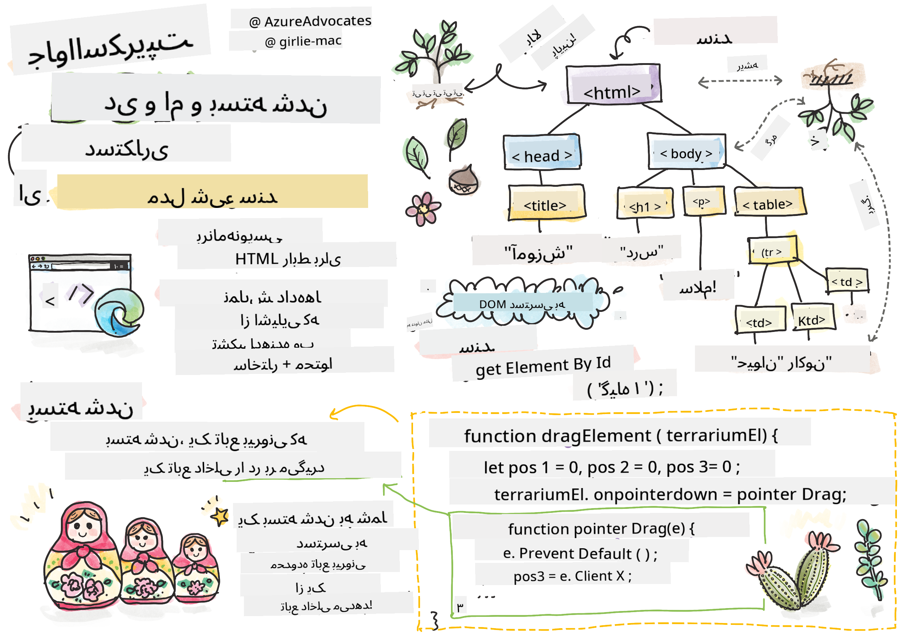
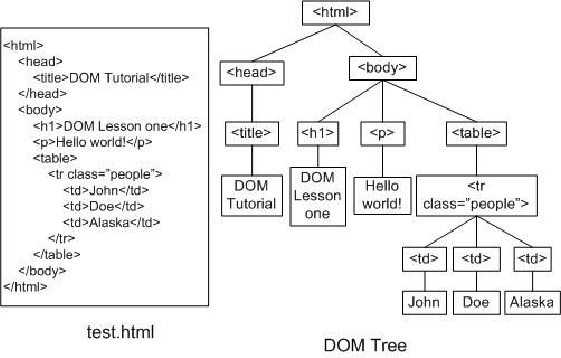
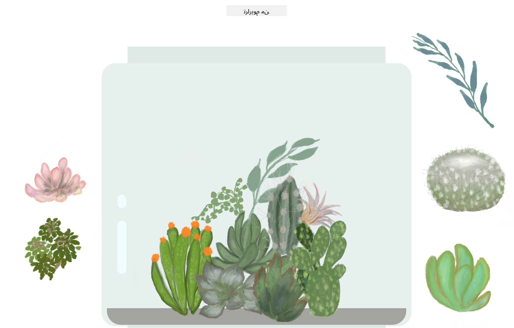

<!--
CO_OP_TRANSLATOR_METADATA:
{
  "original_hash": "61c14b27044861e5e69db35dd52c4403",
  "translation_date": "2025-08-29T14:34:43+00:00",
  "source_file": "3-terrarium/3-intro-to-DOM-and-closures/README.md",
  "language_code": "fa"
}
-->
# پروژه تراریوم بخش ۳: دستکاری DOM و Closure


> طراحی توسط [Tomomi Imura](https://twitter.com/girlie_mac)

## آزمون پیش از درس

[آزمون پیش از درس](https://ff-quizzes.netlify.app/web/quiz/19)

### مقدمه

دستکاری DOM، یا "مدل شیء سند"، یکی از جنبه‌های کلیدی توسعه وب است. طبق گفته [MDN](https://developer.mozilla.org/docs/Web/API/Document_Object_Model/Introduction)، "مدل شیء سند (DOM) نمایش داده‌ای از اشیایی است که ساختار و محتوای یک سند در وب را تشکیل می‌دهند." چالش‌های مربوط به دستکاری DOM در وب اغلب انگیزه‌ای برای استفاده از فریم‌ورک‌های جاوااسکریپت به جای جاوااسکریپت خالص برای مدیریت DOM بوده است، اما ما خودمان این کار را انجام خواهیم داد!

علاوه بر این، این درس ایده [Closure در جاوااسکریپت](https://developer.mozilla.org/docs/Web/JavaScript/Closures) را معرفی می‌کند، که می‌توانید آن را به عنوان یک تابع درون تابع دیگری تصور کنید، به طوری که تابع داخلی به محدوده تابع خارجی دسترسی دارد.

> Closure در جاوااسکریپت موضوعی گسترده و پیچیده است. این درس به ساده‌ترین ایده می‌پردازد که در کد این تراریوم، یک Closure وجود دارد: یک تابع داخلی و یک تابع خارجی که به گونه‌ای ساخته شده‌اند که تابع داخلی به محدوده تابع خارجی دسترسی داشته باشد. برای اطلاعات بیشتر در مورد نحوه عملکرد این موضوع، لطفاً به [مستندات جامع](https://developer.mozilla.org/docs/Web/JavaScript/Closures) مراجعه کنید.

ما از یک Closure برای دستکاری DOM استفاده خواهیم کرد.

DOM را به عنوان یک درخت تصور کنید که تمام روش‌هایی را که یک سند صفحه وب می‌تواند دستکاری شود، نشان می‌دهد. APIهای مختلفی (رابط‌های برنامه‌نویسی کاربردی) نوشته شده‌اند تا برنامه‌نویسان بتوانند با استفاده از زبان برنامه‌نویسی مورد نظر خود به DOM دسترسی پیدا کرده و آن را ویرایش، تغییر، بازآرایی و مدیریت کنند.



> نمایشی از DOM و کد HTML که به آن اشاره دارد. از [Olfa Nasraoui](https://www.researchgate.net/publication/221417012_Profile-Based_Focused_Crawler_for_Social_Media-Sharing_Websites)

در این درس، پروژه تعاملی تراریوم خود را با ایجاد جاوااسکریپتی که به کاربر اجازه می‌دهد گیاهان را در صفحه جابه‌جا کند، تکمیل خواهیم کرد.

### پیش‌نیاز

شما باید HTML و CSS تراریوم خود را ساخته باشید. تا پایان این درس، قادر خواهید بود گیاهان را با کشیدن و رها کردن به داخل و خارج تراریوم منتقل کنید.

### وظیفه

در پوشه تراریوم خود، یک فایل جدید به نام `script.js` ایجاد کنید. این فایل را در بخش `<head>` وارد کنید:

```html
	<script src="./script.js" defer></script>
```

> توجه: هنگام وارد کردن یک فایل جاوااسکریپت خارجی به فایل HTML، از `defer` استفاده کنید تا جاوااسکریپت فقط پس از بارگذاری کامل فایل HTML اجرا شود. همچنین می‌توانید از ویژگی `async` استفاده کنید که به اسکریپت اجازه می‌دهد در حین تجزیه فایل HTML اجرا شود، اما در مورد ما، مهم است که عناصر HTML قبل از اجرای اسکریپت کشیدن کاملاً در دسترس باشند.
---

## عناصر DOM

اولین کاری که باید انجام دهید این است که به عناصری که می‌خواهید در DOM دستکاری کنید، ارجاع دهید. در مورد ما، این عناصر ۱۴ گیاهی هستند که در حال حاضر در نوارهای کناری قرار دارند.

### وظیفه

```html
dragElement(document.getElementById('plant1'));
dragElement(document.getElementById('plant2'));
dragElement(document.getElementById('plant3'));
dragElement(document.getElementById('plant4'));
dragElement(document.getElementById('plant5'));
dragElement(document.getElementById('plant6'));
dragElement(document.getElementById('plant7'));
dragElement(document.getElementById('plant8'));
dragElement(document.getElementById('plant9'));
dragElement(document.getElementById('plant10'));
dragElement(document.getElementById('plant11'));
dragElement(document.getElementById('plant12'));
dragElement(document.getElementById('plant13'));
dragElement(document.getElementById('plant14'));
```

اینجا چه اتفاقی می‌افتد؟ شما به سند ارجاع می‌دهید و در DOM آن به دنبال عنصری با یک Id خاص می‌گردید. به یاد دارید که در اولین درس HTML به هر تصویر گیاه یک Id جداگانه دادید (`id="plant1"`)؟ اکنون از آن تلاش استفاده خواهید کرد. پس از شناسایی هر عنصر، آن مورد را به تابعی به نام `dragElement` که در یک لحظه خواهید ساخت، ارسال می‌کنید. بنابراین، عنصر در HTML اکنون قابلیت کشیدن دارد، یا به زودی خواهد داشت.

✅ چرا عناصر را با Id ارجاع می‌دهیم؟ چرا نه با کلاس CSS؟ ممکن است به درس قبلی در مورد CSS مراجعه کنید تا به این سؤال پاسخ دهید.

---

## Closure

اکنون آماده ایجاد Closure `dragElement` هستید، که یک تابع خارجی است که یک یا چند تابع داخلی را در بر می‌گیرد (در مورد ما، سه تابع خواهیم داشت).

Closure زمانی مفید است که یک یا چند تابع نیاز به دسترسی به محدوده تابع خارجی داشته باشند. در اینجا یک مثال آورده شده است:

```javascript
function displayCandy(){
	let candy = ['jellybeans'];
	function addCandy(candyType) {
		candy.push(candyType)
	}
	addCandy('gumdrops');
}
displayCandy();
console.log(candy)
```

در این مثال، تابع `displayCandy` تابعی را در بر می‌گیرد که یک نوع آب‌نبات جدید را به آرایه‌ای که قبلاً در تابع وجود دارد، اضافه می‌کند. اگر این کد را اجرا کنید، آرایه `candy` تعریف نشده خواهد بود، زیرا یک متغیر محلی است (محلی برای Closure).

✅ چگونه می‌توانید آرایه `candy` را در دسترس قرار دهید؟ سعی کنید آن را خارج از Closure منتقل کنید. به این ترتیب، آرایه به جای اینکه فقط در محدوده محلی Closure در دسترس باشد، جهانی می‌شود.

### وظیفه

زیر اعلان عناصر در `script.js`، یک تابع ایجاد کنید:

```javascript
function dragElement(terrariumElement) {
	//set 4 positions for positioning on the screen
	let pos1 = 0,
		pos2 = 0,
		pos3 = 0,
		pos4 = 0;
	terrariumElement.onpointerdown = pointerDrag;
}
```

`dragElement` شیء `terrariumElement` خود را از اعلان‌های بالای اسکریپت دریافت می‌کند. سپس، برخی موقعیت‌های محلی را برای شیء منتقل شده به تابع روی `0` تنظیم می‌کنید. این‌ها متغیرهای محلی هستند که برای هر عنصر هنگام افزودن قابلیت کشیدن و رها کردن در Closure دستکاری خواهند شد. تراریوم با این عناصر کشیده شده پر خواهد شد، بنابراین برنامه باید مکان آن‌ها را پیگیری کند.

علاوه بر این، `terrariumElement` که به این تابع منتقل می‌شود، یک رویداد `pointerdown` اختصاص داده می‌شود، که بخشی از [وب APIها](https://developer.mozilla.org/docs/Web/API) است که برای کمک به مدیریت DOM طراحی شده‌اند. `onpointerdown` زمانی اجرا می‌شود که یک دکمه فشار داده شود، یا در مورد ما، یک عنصر قابل کشیدن لمس شود. این هندلر رویداد در هر دو [مرورگر وب و موبایل](https://caniuse.com/?search=onpointerdown) کار می‌کند، با چند استثنا.

✅ [هندلر رویداد `onclick`](https://developer.mozilla.org/docs/Web/API/GlobalEventHandlers/onclick) پشتیبانی بسیار بیشتری در مرورگرهای مختلف دارد؛ چرا اینجا از آن استفاده نمی‌کنید؟ به نوع دقیق تعامل صفحه‌ای که می‌خواهید ایجاد کنید فکر کنید.

---

## تابع Pointerdrag

عنصر `terrariumElement` آماده کشیده شدن است؛ وقتی رویداد `onpointerdown` اجرا می‌شود، تابع `pointerDrag` فراخوانی می‌شود. این تابع را درست زیر این خط اضافه کنید: `terrariumElement.onpointerdown = pointerDrag;`:

### وظیفه 

```javascript
function pointerDrag(e) {
	e.preventDefault();
	console.log(e);
	pos3 = e.clientX;
	pos4 = e.clientY;
}
```

چندین اتفاق می‌افتد. اول، شما با استفاده از `e.preventDefault();` از وقوع رویدادهای پیش‌فرضی که معمولاً در pointerdown رخ می‌دهند، جلوگیری می‌کنید. به این ترتیب کنترل بیشتری بر رفتار رابط کاربری دارید.

> وقتی فایل اسکریپت را به طور کامل ساختید، به این خط برگردید و آن را بدون `e.preventDefault()` امتحان کنید - چه اتفاقی می‌افتد؟

دوم، فایل `index.html` را در یک پنجره مرورگر باز کنید و رابط کاربری را بررسی کنید. وقتی روی یک گیاه کلیک می‌کنید، می‌توانید ببینید که رویداد 'e' چگونه ثبت می‌شود. به جزئیات رویداد نگاه کنید تا ببینید چقدر اطلاعات با یک رویداد pointerdown جمع‌آوری می‌شود!

سپس، توجه کنید که چگونه متغیرهای محلی `pos3` و `pos4` به `e.clientX` تنظیم می‌شوند. می‌توانید مقادیر `e` را در پنل بازرسی پیدا کنید. این مقادیر مختصات x و y گیاه را در لحظه‌ای که روی آن کلیک می‌کنید یا آن را لمس می‌کنید، ثبت می‌کنند. شما به کنترل دقیق رفتار گیاهان هنگام کلیک و کشیدن آن‌ها نیاز دارید، بنابراین مختصات آن‌ها را پیگیری می‌کنید.

✅ آیا واضح‌تر شده است که چرا کل این برنامه با یک Closure بزرگ ساخته شده است؟ اگر اینطور نبود، چگونه می‌توانستید محدوده هر یک از ۱۴ گیاه قابل کشیدن را حفظ کنید؟

تابع اولیه را با افزودن دو دستکاری رویداد pointer دیگر زیر `pos4 = e.clientY` کامل کنید:

```html
document.onpointermove = elementDrag;
document.onpointerup = stopElementDrag;
```
اکنون مشخص می‌کنید که می‌خواهید گیاه همراه با اشاره‌گر هنگام حرکت کشیده شود و حرکت کشیدن زمانی که گیاه را از انتخاب خارج می‌کنید متوقف شود. `onpointermove` و `onpointerup` همگی بخشی از همان API هستند که `onpointerdown` است. رابط کاربری اکنون خطاهایی ایجاد می‌کند زیرا هنوز توابع `elementDrag` و `stopElementDrag` را تعریف نکرده‌اید، بنابراین آن‌ها را در مرحله بعد بسازید.

## توابع elementDrag و stopElementDrag

شما Closure خود را با افزودن دو تابع داخلی دیگر که مدیریت می‌کنند چه اتفاقی می‌افتد وقتی یک گیاه را می‌کشید و کشیدن آن را متوقف می‌کنید، کامل خواهید کرد. رفتاری که می‌خواهید این است که بتوانید هر گیاه را در هر زمان بکشید و آن را در هر جایی از صفحه قرار دهید. این رابط کاربری کاملاً بدون محدودیت است (مثلاً هیچ منطقه رهاسازی وجود ندارد) تا به شما اجازه دهد تراریوم خود را دقیقاً همانطور که دوست دارید طراحی کنید، با افزودن، حذف و جابه‌جایی گیاهان.

### وظیفه

تابع `elementDrag` را درست بعد از آکولاد بسته `pointerDrag` اضافه کنید:

```javascript
function elementDrag(e) {
	pos1 = pos3 - e.clientX;
	pos2 = pos4 - e.clientY;
	pos3 = e.clientX;
	pos4 = e.clientY;
	console.log(pos1, pos2, pos3, pos4);
	terrariumElement.style.top = terrariumElement.offsetTop - pos2 + 'px';
	terrariumElement.style.left = terrariumElement.offsetLeft - pos1 + 'px';
}
```
در این تابع، بسیاری از موقعیت‌های اولیه ۱-۴ که به عنوان متغیرهای محلی در تابع خارجی تنظیم کرده‌اید، ویرایش می‌شوند. اینجا چه اتفاقی می‌افتد؟

هنگام کشیدن، `pos1` را با برابر قرار دادن آن با `pos3` (که قبلاً به `e.clientX` تنظیم کرده‌اید) منهای مقدار فعلی `e.clientX` دوباره اختصاص می‌دهید. عملیات مشابهی را برای `pos2` انجام می‌دهید. سپس، `pos3` و `pos4` را به مختصات جدید X و Y عنصر بازنشانی می‌کنید. می‌توانید این تغییرات را هنگام کشیدن در کنسول مشاهده کنید. سپس، سبک CSS گیاه را دستکاری می‌کنید تا موقعیت جدید آن را بر اساس موقعیت‌های جدید `pos1` و `pos2` تنظیم کنید و مختصات X و Y بالای گیاه را بر اساس مقایسه آفست آن با این موقعیت‌های جدید محاسبه کنید.

> `offsetTop` و `offsetLeft` ویژگی‌های CSS هستند که موقعیت یک عنصر را بر اساس موقعیت والد آن تنظیم می‌کنند؛ والد آن می‌تواند هر عنصری باشد که به صورت `static` موقعیت‌دهی نشده باشد.

تمام این محاسبات مجدد موقعیت به شما امکان می‌دهد رفتار تراریوم و گیاهان آن را به دقت تنظیم کنید.

### وظیفه 

آخرین وظیفه برای تکمیل رابط کاربری این است که تابع `stopElementDrag` را بعد از آکولاد بسته `elementDrag` اضافه کنید:

```javascript
function stopElementDrag() {
	document.onpointerup = null;
	document.onpointermove = null;
}
```

این تابع کوچک رویدادهای `onpointerup` و `onpointermove` را بازنشانی می‌کند تا بتوانید پیشرفت گیاه خود را با شروع دوباره کشیدن آن یا شروع کشیدن یک گیاه جدید، از سر بگیرید.

✅ چه اتفاقی می‌افتد اگر این رویدادها را به null تنظیم نکنید؟

اکنون پروژه خود را تکمیل کرده‌اید!

🥇تبریک می‌گویم! شما تراریوم زیبای خود را به پایان رساندید. 

---

## 🚀چالش

یک هندلر رویداد جدید به Closure خود اضافه کنید تا کار دیگری با گیاهان انجام دهد؛ برای مثال، با دوبار کلیک روی یک گیاه، آن را به جلو بیاورید. خلاق باشید!

## آزمون پس از درس

[آزمون پس از درس](https://ff-quizzes.netlify.app/web/quiz/20)

## مرور و مطالعه شخصی

در حالی که کشیدن عناصر در صفحه به نظر ساده می‌رسد، روش‌های زیادی برای انجام این کار و مشکلات زیادی وجود دارد، بسته به اثری که دنبال می‌کنید. در واقع، یک [API کشیدن و رها کردن](https://developer.mozilla.org/docs/Web/API/HTML_Drag_and_Drop_API) کامل وجود دارد که می‌توانید امتحان کنید. ما از آن در این ماژول استفاده نکردیم زیرا اثری که می‌خواستیم کمی متفاوت بود، اما این API را روی پروژه خود امتحان کنید و ببینید چه چیزی می‌توانید به دست آورید.

اطلاعات بیشتری درباره رویدادهای اشاره‌گر در [مستندات W3C](https://www.w3.org/TR/pointerevents1/) و [مستندات وب MDN](https://developer.mozilla.org/docs/Web/API/Pointer_events) پیدا کنید.

همیشه قابلیت‌های مرورگر را با استفاده از [CanIUse.com](https://caniuse.com/) بررسی کنید.

## تکلیف

[کمی بیشتر با DOM کار کنید](assignment.md)

---

**سلب مسئولیت**:  
این سند با استفاده از سرویس ترجمه هوش مصنوعی [Co-op Translator](https://github.com/Azure/co-op-translator) ترجمه شده است. در حالی که ما برای دقت تلاش می‌کنیم، لطفاً توجه داشته باشید که ترجمه‌های خودکار ممکن است شامل خطاها یا نادرستی‌هایی باشند. سند اصلی به زبان اصلی آن باید به عنوان منبع معتبر در نظر گرفته شود. برای اطلاعات حساس، ترجمه حرفه‌ای انسانی توصیه می‌شود. ما هیچ مسئولیتی در قبال سوءتفاهم‌ها یا تفسیرهای نادرست ناشی از استفاده از این ترجمه نداریم.