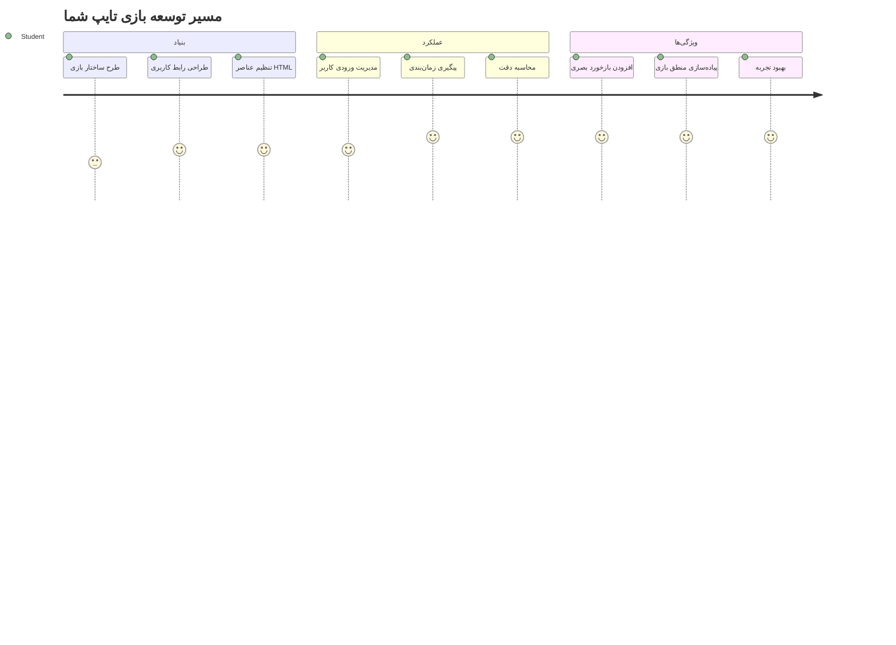
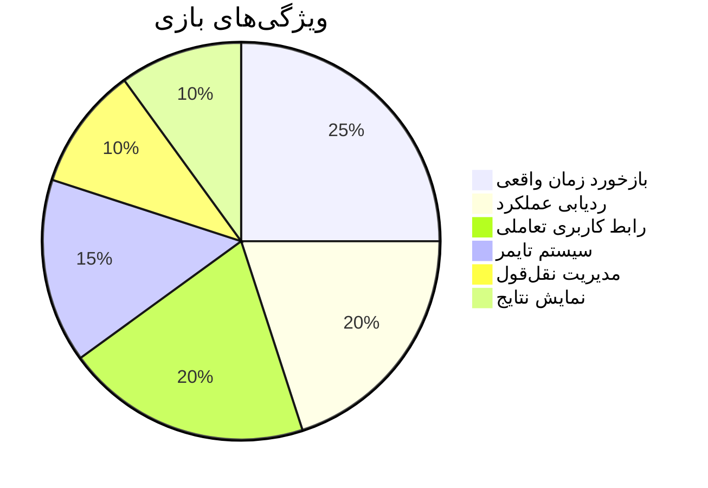
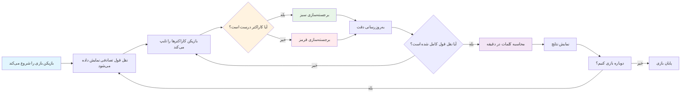
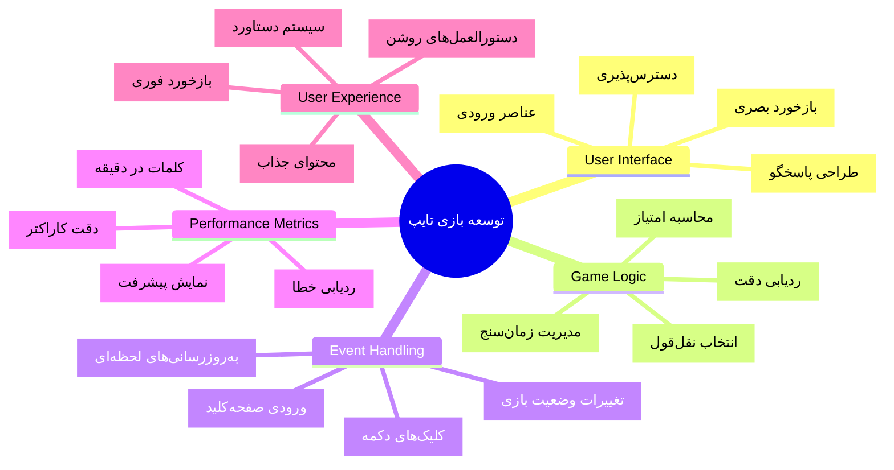
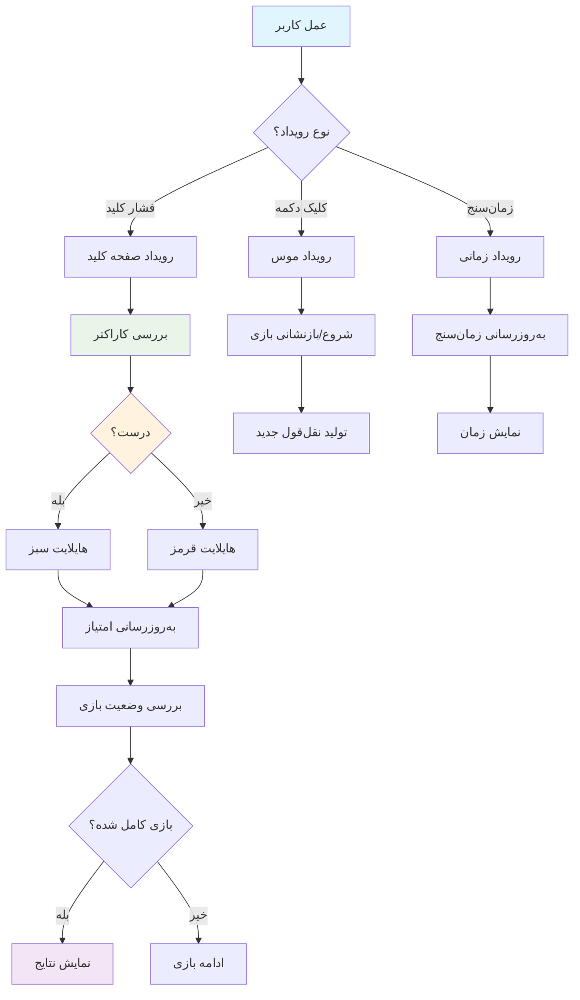
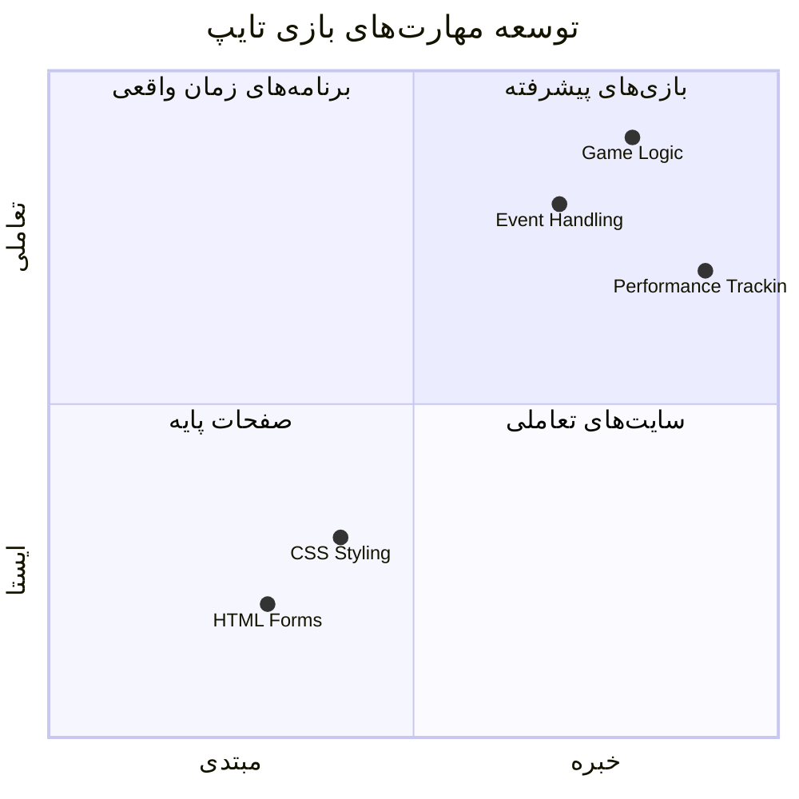
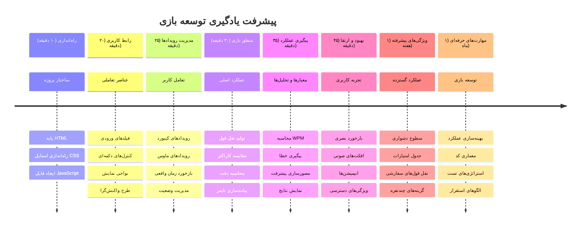

# برنامه‌نویسی رویدادمحور - ساخت یک بازی تایپ

## مقدمه

این چیزی است که همه توسعه‌دهندگان می‌دانند اما به ندرت درباره‌اش حرف می‌زنند: تایپ سریع یک ابرقدرت است! 🚀 بهش فکر کن – هرچه سریع‌تر بتوانی ایده‌هایت را از مغزت به ویرایشگر کد منتقل کنی، خلاقیتت بیشتر جریان پیدا می‌کند. این مثل داشتن یک مسیر مستقیم بین افکارت و صفحه نمایش است.

می‌خواهی یکی از بهترین راه‌ها برای ارتقای این مهارت را بدانی؟ درست حدس زدی - می‌خواهیم یک بازی بسازیم!

> بیایید با هم یک بازی تایپ عالی بسازیم!

آماده‌ای تمام مهارت‌های جاوااسکریپت، HTML و CSS که یاد گرفته‌ای را به کار ببری؟ ما قصد داریم یک بازی تایپ بسازیم که با نقل قول‌های تصادفی از کارآگاه افسانه‌ای [شرلوک هلمز](https://en.wikipedia.org/wiki/Sherlock_Holmes) چالش‌ات کند. بازی سرعت و دقت تایپ تو را دنبال می‌کند - و باور کن این بازی اعتیادآورتر از چیزی است که فکر می‌کنی!

## چیزهایی که باید بدانی

قبل از شروع، مطمئن شو که با این مفاهیم راحتی (نگران نباش اگر نیاز به یادآوری سریع داری – همه در این موقعیت بوده‌ایم!):

- ایجاد کنترل‌های ورودی متن و دکمه
- CSS و تنظیم استایل‌ها با استفاده از کلاس‌ها  
- مبانی جاوااسکریپت
  - ایجاد آرایه
  - ایجاد یک عدد تصادفی
  - گرفتن زمان فعلی

اگر هرکدام از این موارد کمی فراموشت شده، اشکالی ندارد! گاهی بهترین راه برای تثبیت دانش، شروع یک پروژه و یادگیری در حین انجام است.

### 🔄 **بررسی آموزشی**
**ارزیابی پایه‌ای**: قبل از شروع توسعه، مطمئن شو که می‌دانی:
- ✅ فرم‌ها و عناصر ورودی HTML چگونه کار می‌کنند
- ✅ کلاس‌های CSS و استایل‌دهی پویا
- ✅ شنونده‌ها و هندلرهای رویداد در جاوااسکریپت
- ✅ کار با آرایه و انتخاب تصادفی
- ✅ اندازه‌گیری زمان و محاسبات مربوطه

**آزمون سریع خودتان**: می‌توانی توضیح دهی این مفاهیم چطور در یک بازی تعاملی با هم کار می‌کنند؟
- **رویدادها** وقتی فعال می‌شوند که کاربران با عناصر تعامل دارند
- **هندلرها** آن رویدادها را پردازش می‌کنند و وضعیت بازی را به‌روزرسانی می‌کنند
- **CSS** بازخورد بصری برای اقدامات کاربر فراهم می‌کند
- **زمان‌بندی** امکان اندازه‌گیری عملکرد و پیشرفت بازی را فراهم می‌آورد

## بیایید این را بسازیم!

[ساخت بازی تایپ با استفاده از برنامه‌نویسی رویدادمحور](./typing-game/README.md)

### ⚡ **کاری که می‌توانی در ۵ دقیقه آینده انجام دهی**
- [ ] کنسول مرورگرت را باز کن و با `addEventListener` به رویدادهای صفحه‌کلید گوش کن
- [ ] یک صفحه HTML ساده با یک فیلد ورودی بساز و تشخیص تایپ را تست کن
- [ ] با دستکاری رشته‌ها تمرین کن و متن تایپ‌شده را با متن هدف مقایسه کن
- [ ] با `setTimeout` آزمایش کن تا عملکرد توابع زمان‌بندی را بفهمی

### 🎯 **کاری که می‌توانی در این ساعت انجام دهی**
- [ ] تست پس از درس را کامل کن و برنامه‌نویسی رویدادمحور را بفهم
- [ ] نسخه‌ای پایه از بازی تایپ با اعتبارسنجی کلمات بساز
- [ ] بازخورد بصری برای تایپ درست و غلط اضافه کن
- [ ] سیستم امتیازدهی ساده بر اساس سرعت و دقت پیاده‌سازی کن
- [ ] با CSS بازی ات را استایل بده تا ظاهری جذاب پیدا کند

### 📅 **توسعه بازی هفتگی تو**
- [ ] بازی تایپ کامل را با همه ویژگی‌ها و پرداخت نهایی به پایان برسان
- [ ] سطوح سختی را با پیچیدگی‌های مختلف کلمه اضافه کن
- [ ] آمار کاربران (کلمات در دقیقه، دقت در طول زمان) را پیگیری کن
- [ ] افکت‌های صوتی و انیمیشن‌ها را برای تجربه بهتر کاربر ایجاد کن
- [ ] بازی ات را برای دستگاه‌های لمسی واکنش‌گرا کن
- [ ] بازی ات را آنلاین به اشتراک بگذار و بازخورد کاربران را جمع‌آوری کن

### 🌟 **توسعه تعاملی ماهانه تو**
- [ ] بازی‌های متعددی بساز که الگوهای تعامل مختلف را کاوش کنند
- [ ] درباره حلقه‌های بازی، مدیریت وضعیت و بهینه‌سازی عملکرد یاد بگیر
- [ ] در پروژه‌های متن‌باز توسعه بازی مشارکت کن
- [ ] مفاهیم پیشرفته زمان‌بندی و انیمیشن‌های روان را مسلط شو
- [ ] یک نمونه‌کار از برنامه‌های تعاملی مختلف بساز
- [ ] دیگر علاقه‌مندان به توسعه بازی و تعامل کاربران را راهنمایی کن

## 🎯 جدول زمانی تسلط بر بازی تایپ تو

### 🛠️ خلاصه جعبه‌ابزار توسعه بازی تو

بعد از اتمام این پروژه، مهارت‌های زیر را تسلط خواهی یافت:
- **برنامه‌نویسی رویدادمحور**: رابط‌های کاربری پاسخگو که به ورودی واکنش نشان می‌دهند
- **بازخورد زمان واقعی**: به‌روزرسانی‌های فوری بصری و عملکردی
- **اندازه‌گیری عملکرد**: سیستم‌های دقیق زمان‌بندی و امتیازدهی
- **مدیریت وضعیت بازی**: کنترل جریان برنامه و تجربه کاربر
- **طراحی تعاملی**: ایجاد تجربه‌های جذاب و اعتیادآور برای کاربر
- **APIهای مدرن وب**: بهره‌گیری از توانایی‌های مرورگر برای تعاملات غنی
- **الگوهای دسترس‌پذیری**: طراحی جامع برای همه کاربران

**کاربردهای دنیای واقعی**: این مهارت‌ها مستقیماً برای موارد زیر کاربرد دارند:
- **برنامه‌های وب**: هر رابط تعاملی یا داشبورد
- **نرم‌افزارهای آموزشی**: پلتفرم‌های یادگیری و ابزارهای ارزیابی مهارت
- **ابزارهای بهره‌وری**: ویرایشگرهای متن، IDEها و نرم‌افزارهای همکاری
- **صنعت بازی**: بازی‌های مرورگر و سرگرمی تعاملی
- **توسعه موبایل**: رابط‌های مبتنی بر لمس و هندلینگ ژست‌ها

**گام بعدی**: تو آماده‌ای تا چارچوب‌های پیشرفته بازی، سیستم‌های چندنفره زمان واقعی یا برنامه‌های تعاملی پیچیده را کاوش کنی!

## ملاحظات

نوشته شده با ♥️ توسط [Christopher Harrison](http://www.twitter.com/geektrainer)

---

<!-- CO-OP TRANSLATOR DISCLAIMER START -->
**سلب مسئولیت**:  
این سند با استفاده از سرویس ترجمه ماشینی [Co-op Translator](https://github.com/Azure/co-op-translator) ترجمه شده است. در حالی که ما برای دقت تلاش می‌کنیم، لطفاً توجه داشته باشید که ترجمه‌های خودکار ممکن است حاوی خطاها یا نادرستی‌هایی باشند. سند اصلی به زبان مبدأ باید به عنوان منبع معتبر در نظر گرفته شود. برای اطلاعات حیاتی، ترجمه حرفه‌ای انسانی توصیه می‌شود. ما مسئول هیچ گونه سوء تفاهم یا برداشت نادرست ناشی از استفاده از این ترجمه نیستیم.
<!-- CO-OP TRANSLATOR DISCLAIMER END -->