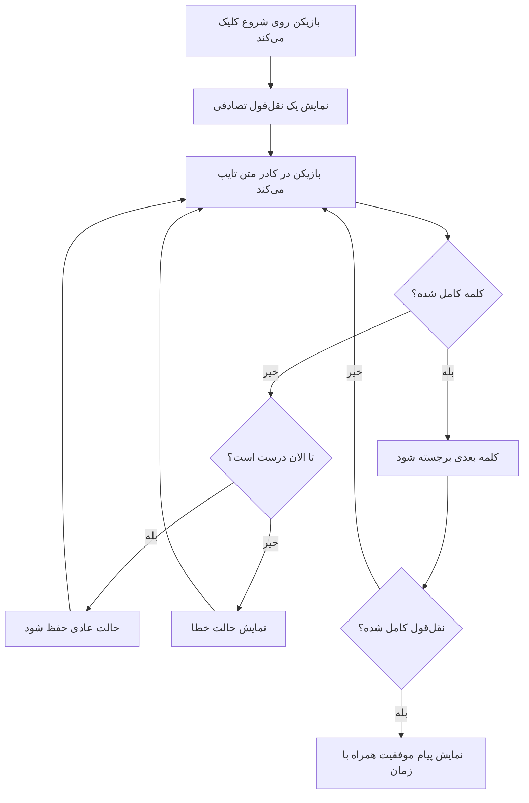
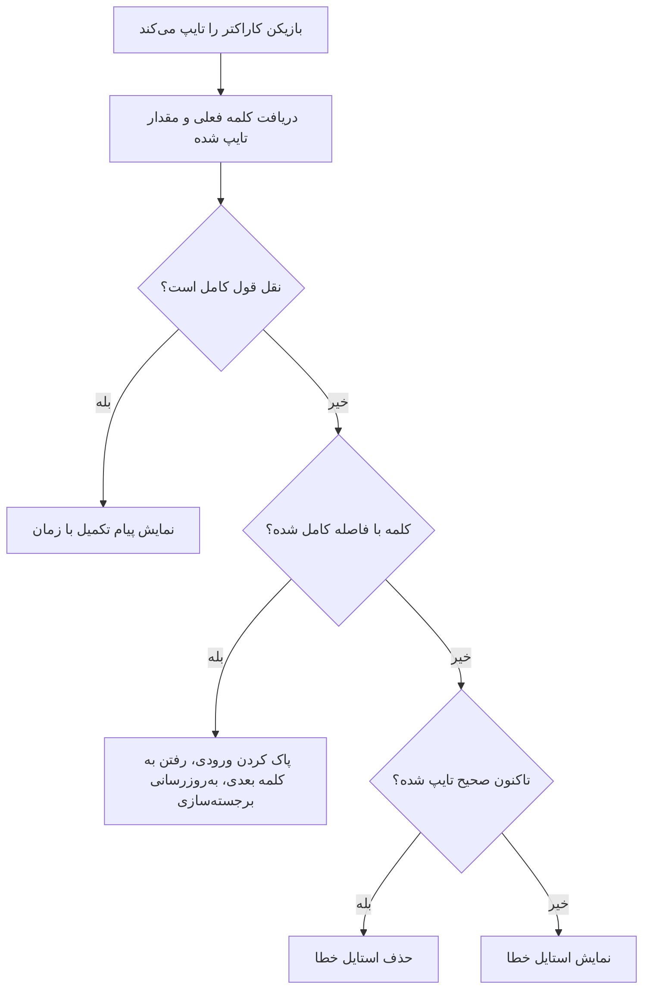
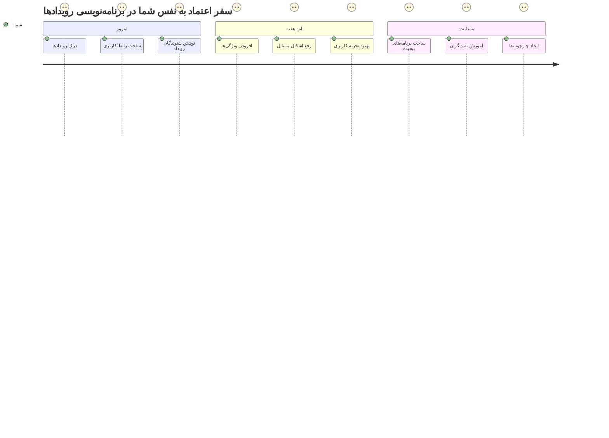

<!--
CO_OP_TRANSLATOR_METADATA:
{
  "original_hash": "da8bc72041a2bb3826a54654ee1a8844",
  "translation_date": "2026-01-06T10:35:29+00:00",
  "source_file": "4-typing-game/typing-game/README.md",
  "language_code": "fa"
}
-->
# ساخت یک بازی با استفاده از رویدادها

تا به حال فکر کرده‌اید وب‌سایت‌ها چطور می‌فهمند که شما روی یک دکمه کلیک کردید یا در یک کادر متنی تایپ کرده‌اید؟ این جادوی برنامه‌نویسی مبتنی بر رویداد است! چه راهی بهتر از ساخت چیزی کاربردی برای یادگیری این مهارت اساسی - یک بازی سرعت تایپ که به هر کلید فشرده شده واکنش نشان می‌دهد.

شما به‌طور مستقیم خواهید دید که مرورگرهای وب چطور با کد جاوااسکریپت شما «صحبت» می‌کنند. هر بار که کلیک می‌کنید، تایپ می‌کنید یا موس خود را حرکت می‌دهید، مرورگر پیام‌های کوچکی (که ما آن‌ها را رویداد می‌نامیم) به کد شما ارسال می‌کند و شما تصمیم می‌گیرید چگونه پاسخ دهید!

تا پایان این درس، شما یک بازی تایپ واقعی ساخته‌اید که سرعت و دقت شما را پیگیری می‌کند. مهم‌تر از همه، مفاهیم بنیادی که پشت هر وب‌سایت تعاملی که تا به حال استفاده کرده‌اید هستند را درک خواهید کرد. بیایید شروع کنیم!

## آزمون پیش‌درس

[آزمون پیش‌درس](https://ff-quizzes.netlify.app/web/quiz/21)

## برنامه‌نویسی مبتنی بر رویداد

به برنامه یا وب‌سایت مورد علاقه خود فکر کنید - چه چیزی باعث می‌شود زنده و پاسخگو به نظر برسد؟ همه چیز درباره واکنشی است که به کارهای شما نشان می‌دهد! هر ضربه، کلیک، کشیدن یا کلید فشرده شده یک چیزی است که ما آن را «رویداد» می‌نامیم، و اینجا جادوی واقعی توسعه وب اتفاق می‌افتد.

این چیزی است که برنامه‌نویسی برای وب را جذاب می‌کند: ما هرگز نمی‌دانیم کی کسی روی آن دکمه کلیک می‌کند یا تایپ در یک کادر متنی را شروع می‌کند. ممکن است بلافاصله کلیک کند، پنج دقیقه منتظر بماند، یا شاید هرگز کلیک نکند! این عدم پیش‌بینی به این معنی است که ما باید به شیوه‌ای متفاوت به نوشتن کد خود فکر کنیم.

به جای نوشتن کدی که از بالا به پایین اجرا می‌شود مثل یک دستور پخت، کدی می‌نویسیم که صبورانه منتظر می‌ماند چیزی اتفاق بیفتد. شباهتی به اپراتورهای تلگراف در دهه ۱۸۰۰ دارد که کنار دستگاه خود می‌نشستند و آماده بودند به محض رسیدن پیام پاسخ دهند.

پس دقیقاً «رویداد» چیست؟ به سادگی، چیزی است که اتفاق می‌افتد! وقتی روی یک دکمه کلیک می‌کنید - این یک رویداد است. وقتی یک حرف تایپ می‌کنید - این یک رویداد است. وقتی موس خود را حرکت می‌دهید - این یک رویداد دیگر است.

برنامه‌نویسی مبتنی بر رویداد به ما اجازه می‌دهد کد خود را تنظیم کنیم تا گوش دهد و پاسخ دهد. ما توابع ویژه‌ای به نام **شنونده‌های رویداد** ایجاد می‌کنیم که صبورانه منتظر اتفاق افتادن چیزهای خاصی هستند و وقتی اتفاق افتادند، فوراً وارد عمل می‌شوند.

شنونده‌های رویداد را مثل زنگ در خانه کد خود تصور کنید. شما زنگ در (`addEventListener()`) را نصب می‌کنید، مشخص می‌کنید به چه صدایی گوش دهد (مثل 'click' یا 'keypress') و سپس تعیین می‌کنید وقتی کسی زنگ می‌زند چه کاری انجام شود (تابع سفارشی شما).

**شنونده‌های رویداد اینگونه کار می‌کنند:**
- **گوش می‌دهند** به اقدامات خاص کاربر مانند کلیک‌ها، فشردن کلیدها یا حرکت موس
- **کد سفارشی شما را اجرا می‌کنند** وقتی رویداد مشخص شده رخ می‌دهد
- **فورا پاسخ می‌دهند** به تعاملات کاربر و تجربه‌ای بی‌وقفه ایجاد می‌کنند
- **چند رویداد مختلف** را روی یک عنصر با شنونده‌های مختلف مدیریت می‌کنند

> **نکته:** شایان ذکر است روش‌های زیادی برای ساخت شنونده‌های رویداد وجود دارد. می‌توانید از توابع ناشناس استفاده کنید یا توابع نام‌دار بسازید. می‌توانید از میانبرهای مختلفی مثل تنظیم ویژگی `click` یا استفاده از `addEventListener()` بهره ببرید. در تمرین ما تمرکز بر `addEventListener()` و توابع ناشناس است، زیرا احتمالاً رایج‌ترین تکنیک مورد استفاده توسعه‌دهندگان وب است. همچنین بسیار انعطاف‌پذیر است چون `addEventListener()` برای همه رویدادها کار می‌کند و نام رویداد را می‌توان به عنوان پارامتر ارائه کرد.

### رویدادهای رایج

در حالی که مرورگرهای وب ده‌ها رویداد مختلف را برای گوش دادن ارائه می‌کنند، اکثر برنامه‌های تعاملی فقط به چند رویداد ضروری متکی هستند. درک این رویدادهای اصلی، پایه‌ای برای ساخت تعاملات کاربری پیشرفته به شما می‌دهد.

صدها [رویداد](https://developer.mozilla.org/docs/Web/Events) وجود دارد که می‌توانید هنگام ساخت برنامه به آن‌ها گوش دهید. اساساً هر کاری که کاربر در صفحه انجام دهد باعث ایجاد یک رویداد می‌شود که به شما قدرت زیادی می‌دهد تا تجربه مورد نظر خود را تضمین کنید. خوشبختانه، معمولاً فقط به تعداد کمی رویداد نیاز دارید. در اینجا چند نمونه رایج ارائه شده (شامل دو رویدادی که هنگام ساخت بازی استفاده خواهیم کرد):

| رویداد | توضیح | موارد استفاده رایج |
|--------|--------|--------------------|
| `click` | کاربر روی چیزی کلیک کرد | دکمه‌ها، لینک‌ها، عناصر تعاملی |
| `contextmenu` | کاربر دکمه راست موس را کلیک کرد | منوهای کلیک راست سفارشی |
| `select` | کاربر متنی را برجسته کرد | ویرایش متن، عملیات کپی |
| `input` | کاربر متنی وارد کرد | اعتبارسنجی فرم، جستجو در زمان واقعی |

**درک این نوع رویدادها:**
- وقتی کاربر با عناصر خاص صفحه تعامل می‌کند **فعال می‌شوند**
- اطلاعات دقیق عمل کاربر را از طریق اشیاء رویداد **فراهم می‌کنند**
- به شما اجازه می‌دهند برنامه‌های وب **پاسخگو و تعاملی** بسازید
- **به طور مداوم در مرورگرها و دستگاه‌های مختلف** کار می‌کنند

## ساخت بازی

اکنون که می‌دانید رویدادها چگونه کار می‌کنند، بیایید این دانش را در عمل با ساخت چیزی کاربردی به کار ببریم. ما یک بازی سرعت تایپ می‌سازیم که پردازش رویدادها را نشان می‌دهد و در عین حال به شما کمک می‌کند مهارت مهمی برای توسعه‌دهندگان بدست آورید.

قراره یک بازی بسازیم تا ببینیم رویدادها در جاوااسکریپت چگونه کار می‌کنند. بازی ما مهارت تایپ بازیکن را خواهد سنجید، که یکی از مهارت‌های کمتر قدردانی شده است که همه توسعه‌دهندگان باید داشته باشند. نکته جالب: طرح صفحه کلید QWERTY که امروز استفاده می‌کنیم، در واقع در دهه ۱۸۷۰ برای ماشین‌های تحریر طراحی شده است - و مهارت تایپ خوب برای برنامه‌نویسان امروز هنوز به همان اندازه ارزشمند است! روند کلی بازی به این صورت خواهد بود:


**چگونگی عملکرد بازی ما:**
- **شروع می‌شود** وقتی بازیکن دکمه شروع را کلیک می‌کند و یک نقل قول تصادفی نمایش داده می‌شود
- **پیشرفت تایپ بازیکن را کلمه به کلمه در زمان واقعی دنبال می‌کند**
- **کلمه فعلی را برای هدایت تمرکز بازیکن برجسته می‌کند**
- **بازخورد بصری فوری برای اشتباهات تایپی ارائه می‌دهد**
- **زمان کل را پس از اتمام نقل قول محاسبه و نمایش می‌دهد**

بیایید بازی خود را بسازیم و درباره رویدادها یاد بگیریم!

### ساختار فایل‌ها

قبل از شروع کدنویسی، بیایید سازماندهی کنیم! داشتن یک ساختار فایل تمیز از ابتدا، دردسرهای بعدی را کم می‌کند و پروژه شما را حرفه‌ای‌تر جلوه می‌دهد. 😊

ما قرار است همه چیز را ساده نگه داریم و فقط سه فایل داشته باشیم: `index.html` برای ساختار صفحه، `script.js` برای تمام منطق بازی و `style.css` برای ظاهر همه چیز. این سه‌گانه کلاسیک است که بیشتر وب را نیرو می‌دهد!

**یک پوشه جدید برای کار خود با باز کردن کنسول یا ترمینال ایجاد کنید و دستور زیر را بزنید:**

```bash
# لینوکس یا مک‌اواس
mkdir typing-game && cd typing-game

# ویندوز
md typing-game && cd typing-game
```

**این دستورات چه کاری انجام می‌دهند:**
- **یک دایرکتوری جدید به نام `typing-game` ایجاد می‌کند** برای فایل‌های پروژه شما
- **به صورت خودکار وارد دایرکتوری تازه ساخته شده می‌شود**
- **برای توسعه بازی شما یک محیط کاری تمیز تنظیم می‌کند**

**Visual Studio Code را باز کنید:**

```bash
code .
```

**این دستور:**
- **Visual Studio Code را در دایرکتوری فعلی اجرا می‌کند**
- **پوشه پروژه شما را در ویرایشگر باز می‌کند**
- **دسترسی به تمام ابزارهای توسعه مورد نیاز شما را فراهم می‌کند**

**سه فایل زیر را در پوشه در Visual Studio Code اضافه کنید:**
- `index.html` - ساختار و محتوای بازی شما را شامل می‌شود
- `script.js` - مسئول همه منطق بازی و شنونده‌های رویداد است
- `style.css` - نمای ظاهری و استایل‌دهی را تعریف می‌کند

## ساخت رابط کاربری

حالا بیایید صحنه‌ای بسازیم که کل اتفاقات بازی ما در آن رخ خواهد داد! این مثل این است که داشبورد کنترل یک سفینه فضایی را طراحی کنیم - باید اطمینان حاصل کنیم هر آنچه بازیکنان نیاز دارند، دقیقاً همان جایی باشد که انتظارش را دارند.

بیایید بفهمیم بازی ما واقعاً چه چیزی نیاز دارد. اگر شما در حال بازی تایپ بودید، چه چیزی می‌خواستید روی صفحه ببینید؟ این‌ها چیزهایی هستند که نیاز داریم:

| عنصر رابط کاربری | هدف | عنصر HTML |
|------------------|------|------------|
| نمایش نقل قول | نمایش متنی که باید تایپ شود | `<p>` با `id="quote"` |
| بخش پیام‌ها | نشان دادن وضعیت و پیام‌های موفقیت | `<p>` با `id="message"` |
| ورودی متن | جایی که بازیکن‌ها نقل قول را تایپ می‌کنند | `<input>` با `id="typed-value"` |
| دکمه شروع | شروع بازی | `<button>` با `id="start"` |

**درک ساختار رابط کاربری:**
- **محتوا را به صورت منطقی از بالا به پایین سازماندهی می‌کند**
- **شناسه‌های یکتایی به عناصر اختصاص می‌دهد تا جاوااسکریپت بتواند به آن‌ها دسترسی داشته باشد**
- **سلسله مراتب بصری واضحی برای تجربه بهتر کاربر فراهم می‌کند**
- **شامل عناصر معنایی HTML برای دسترسی‌پذیری است**

هر یک از این‌ها نیاز به شناسه (ID) دارند تا بتوانیم در جاوااسکریپت با آن‌ها کار کنیم. همچنین ارجاعاتی به فایل‌های CSS و جاوااسکریپتی که ساخته‌ایم اضافه خواهیم کرد.

یک فایل جدید به نام `index.html` بسازید. HTML زیر را اضافه کنید:

```html
<!-- inside index.html -->
<html>
<head>
  <title>Typing game</title>
  <link rel="stylesheet" href="style.css">
</head>
<body>
  <h1>Typing game!</h1>
  <p>Practice your typing skills with a quote from Sherlock Holmes. Click **start** to begin!</p>
  <p id="quote"></p> <!-- This will display our quote -->
  <p id="message"></p> <!-- This will display any status messages -->
  <div>
    <input type="text" aria-label="current word" id="typed-value" /> <!-- The textbox for typing -->
    <button type="button" id="start">Start</button> <!-- To start the game -->
  </div>
  <script src="script.js"></script>
</body>
</html>
```

**توضیح آنچه این ساختار HTML انجام می‌دهد:**
- **استایل‌های CSS را در `<head>` لینک می‌کند تا صفحه استایل داده شود**
- **یک تیتر و دستورالعمل‌های واضح برای کاربران می‌سازد**
- **پاراگراف های نگهدارنده با شناسه‌های خاص برای محتوای پویا ایجاد می‌کند**
- **یک فیلد ورودی با ویژگی‌های دسترسی‌پذیری اضافه می‌کند**
- **یک دکمه شروع برای راه‌اندازی بازی قرار می‌دهد**
- **فایل جاوااسکریپت را در انتها بارگذاری می‌کند تا عملکرد بهینه باشد**

### راه‌اندازی برنامه

تست مکرر برنامه خود در حین توسعه به شما کمک می‌کند مشکلات را زود شناسایی کنید و پیشرفت خود را به صورت زنده ببینید. Live Server ابزار ارزشمندی است که به‌طور خودکار زمانی که تغییرات را ذخیره می‌کنید، مرورگر شما را تازه‌سازی می‌کند و توسعه را بسیار بهینه می‌سازد.

همیشه بهترین روش توسعه به صورت گام‌به‌گام است تا ببینید اوضاع چطور است. بیایید برنامه خود را راه‌اندازی کنیم. افزونه بسیار خوبی برای Visual Studio Code به نام [Live Server](https://marketplace.visualstudio.com/items?itemName=ritwickdey.LiveServer&WT.mc_id=academic-77807-sagibbon) وجود دارد که هم برنامه شما را به صورت محلی میزبانی می‌کند و هم هر بار که فایل‌ها را ذخیره می‌کنید، مرورگر را تازه می‌کند.

**[Live Server](https://marketplace.visualstudio.com/items?itemName=ritwickdey.LiveServer&WT.mc_id=academic-77807-sagibbon) را با رفتن به لینک و کلیک روی نصب، نصب کنید:**

**در طول نصب چه رخ می‌دهد:**
- **مرورگر شما را به سمت باز کردن Visual Studio Code هدایت می‌کند**
- **شما را در روند نصب افزونه راهنمایی می‌کند**
- **ممکن است نیاز به راه‌اندازی مجدد Visual Studio Code برای تکمیل نصب باشد**

**پس از نصب، در Visual Studio Code، کلیدهای Ctrl-Shift-P (یا Cmd-Shift-P) را فشار دهید تا پنل دستورات باز شود:**

**درک پنل دستورات:**
- **دسترسی سریع به همه دستورات VS Code را فراهم می‌کند**
- **همزمان با تایپ، دستورات را جستجو می‌کند**
- **میانبرهای صفحه کلید برای توسعه سریع‌تر ارائه می‌دهد**

**عبارت "Live Server: Open with Live Server" را تایپ کنید:**

**کارهایی که Live Server انجام می‌دهد:**
- **یک سرور توسعه محلی برای پروژه شما راه‌اندازی می‌کند**
- **مرورگر را به طور خودکار هنگام ذخیره فایل‌ها تازه می‌کند**
- **فایل‌های شما را از یک آدرس محلی (معمولاً `localhost:5500`) سرو می‌کند**

**یک مرورگر باز کنید و به `https://localhost:5500` بروید:**

اکنون باید صفحه‌ای که ساخته‌اید را ببینید! بیایید کمی عملکرد اضافه کنیم.

## افزودن CSS

حالا بیایید ظاهر صفحه را بهتر کنیم! بازخورد بصری از همان روزهای اولیه محاسبات، برای رابط‌های کاربری بسیار مهم بوده است. در دهه ۱۹۸۰، پژوهشگران کشف کردند که بازخورد بصری فوری به طور قابل توجهی عملکرد کاربران را بهبود می‌بخشد و خطاها را کاهش می‌دهد. دقیقاً همین چیزی است که ما می‌خواهیم بسازیم.

بازی ما باید کاملاً واضح باشد که چه اتفاقی می‌افتد. بازیکنان باید فوراً بفهمند که کدام کلمه را باید تایپ کنند، و اگر اشتباه کنند، باید بلافاصله ببینند. بیایید استایل ساده ولی موثری بسازیم:

یک فایل جدید به نام `style.css` بسازید و کد زیر را اضافه کنید.

```css
/* inside style.css */
.highlight {
  background-color: yellow;
}

.error {
  background-color: lightcoral;
  border: red;
}
```

**درک این کلاس‌های CSS:**
- **کلمه فعلی را با پس‌زمینه زرد برجسته می‌کند تا راهنمای بصری واضحی باشد**
- **اشتباهات تایپی را با رنگ پس‌زمینه مرجانی روشن نشان می‌دهد**
- **بازخورد فوری فراهم می‌کند بدون اینکه جریان تایپ کاربر مختل شود**
- **از رنگ‌های متضاد برای دسترسی‌پذیری و ارتباط بصری واضح استفاده می‌کند**

✅ وقتی درباره CSS است، می‌توانید صفحه خود را هر طور که دوست دارید چیدمان کنید. کمی زمان بگذارید و صفحه را جذاب‌تر کنید:

- فونت متفاوتی انتخاب کنید
- عنوان‌ها را رنگی کنید
- اندازه عناصر را تغییر دهید

## جاوااسکریپت

حالا جالب می‌شود! 🎉 ساختار HTML و استایل CSS را داریم، اما در حال حاضر بازی ما مثل یک ماشین زیبا بدون موتور است. جاوااسکریپت آن موتور خواهد بود - چیزی که همه چیز را واقعا کار کند و به رفتار بازیکنان واکنش نشان دهد.

اینجا جایی است که می‌بینید آفرینش شما جان می‌گیرد. ما مرحله‌به‌مرحله جلو می‌رویم تا هیچ چیز گیج‌کننده یا دشوار نباشد:

| مرحله | هدف | آنچه یاد خواهید گرفت |
|-------|-----|---------------------|
| [ایجاد ثوابت](../../../../4-typing-game/typing-game) | تنظیم نقل قول‌ها و مراجع DOM | مدیریت متغیرها و انتخاب DOM |
| [شنونده رویداد برای شروع بازی](../../../../4-typing-game/typing-game) | اداره راه‌اندازی بازی | پردازش رویدادها و به‌روزرسانی رابط |
| [شنونده رویداد برای تایپ](../../../../4-typing-game/typing-game) | پردازش ورودی کاربر در زمان واقعی | اعتبارسنجی ورودی و بازخورد پویا |

**این رویکرد ساختاری به شما کمک می‌کند:**
- کد خود را به بخش‌های منطقی و مدیریت‌پذیر سازماندهی کنید
- قابلیت عملکرد را تدریجی بسازید تا اشکال‌زدایی آسان‌تر شود
- بفهمید بخش‌های مختلف برنامه‌تان چگونه با هم کار می‌کنند
- الگوهای قابل استفاده مجدد برای پروژه‌های آینده ایجاد کنید

اما ابتدا، یک فایل جدید به نام `script.js` بسازید.

### افزودن ثوابت

قبل از شروع کار، بیایید تمام منابع خود را جمع کنیم! درست مانند کنترل ماموریت ناسا که همه سیستم‌های پایش را قبل از پرتاب تنظیم می‌کنند، وقتی همه چیز آماده و سر جای خود باشد، کار بسیار ساده‌تر می‌شود. این باعث می‌شود بعداً برای پیدا کردن چیزها وقت نگذاریم و از اشتباهات تایپی جلوگیری کنیم.

اولین چیزی که باید تنظیم کنیم این‌ها هستند:

| نوع داده | هدف | مثال |
| آرایه نقل قول‌ها | ذخیره همه نقل قول‌های ممکن برای بازی | `['نقل قول ۱'، 'نقل قول ۲'، ...]` |
| آرایه کلمات | تقسیم نقل قول فعلی به کلمات جداگانه | `['When'، 'you'، 'have'، ...]` |
| اندیس کلمه | پیگیری کدام کلمه توسط بازیکن تایپ می‌شود | `0، 1، 2، 3...` |
| زمان شروع | محاسبه زمان سپری شده برای امتیازدهی | `Date.now()` |

**ما همچنین به مراجع به عناصر رابط کاربری نیاز خواهیم داشت:**
| عنصر | شناسه | هدف |
|---------|----|---------|
| ورودی متن | `typed-value` | جایی که بازیکنان تایپ می‌کنند |
| نمایش نقل قول | `quote` | نمایش نقل قول برای تایپ کردن |
| ناحیه پیام | `message` | نمایش به‌روزرسانی‌های وضعیت |

```javascript
// داخل فایل script.js
// تمام نقل قول‌های ما
const quotes = [
    'When you have eliminated the impossible, whatever remains, however improbable, must be the truth.',
    'There is nothing more deceptive than an obvious fact.',
    'I ought to know by this time that when a fact appears to be opposed to a long train of deductions it invariably proves to be capable of bearing some other interpretation.',
    'I never make exceptions. An exception disproves the rule.',
    'What one man can invent another can discover.',
    'Nothing clears up a case so much as stating it to another person.',
    'Education never ends, Watson. It is a series of lessons, with the greatest for the last.',
];
// ذخیره لیست کلمات و اندیس کلمه‌ای که بازیکن در حال تایپ آن است
let words = [];
let wordIndex = 0;
// زمان شروع
let startTime = Date.now();
// عناصر صفحه
const quoteElement = document.getElementById('quote');
const messageElement = document.getElementById('message');
const typedValueElement = document.getElementById('typed-value');
```

**تجزیه و تحلیل آنچه این کد راه‌اندازی انجام می‌دهد:**
- **ذخیره** آرایه‌ای از نقل قول‌های شرلوک هولمز با استفاده از `const` چون نقل قول‌ها تغییر نخواهند کرد
- **مقداردهی اولیه** متغیرهای پیگیری با `let` چون این مقادیر در طول بازی به‌روزرسانی می‌شوند
- **گرفتن** مراجع به عناصر DOM با استفاده از `document.getElementById()` برای دسترسی کارآمد
- **راه‌اندازی** پایه و اساس تمام عملکردهای بازی با نام‌های متغیر واضح و توصیفی
- **سازماندهی** داده‌ها و عناصر مرتبط به صورت منطقی برای نگهداری آسان‌تر کد

✅ ادامه دهید و نقل قول‌های بیشتری به بازی خود اضافه کنید

> 💡 **نکته حرفه‌ای**: می‌توانیم هر زمان که بخواهیم با استفاده از `document.getElementById()` به عناصر دسترسی پیدا کنیم. به دلیل اینکه ما می‌خواهیم به این عناصر به طور مرتب مراجعه کنیم، با استفاده از کانست‌ها از اشتباهات تایپی رشته‌ای جلوگیری می‌کنیم. فریم‌ورک‌هایی مانند [Vue.js](https://vuejs.org/) یا [React](https://reactjs.org/) می‌توانند به مدیریت بهتر مرکزی کد شما کمک کنند.
>
**علت موفقیت این رویکرد:**
- **جلوگیری** از خطاهای املایی هنگام ارجاع چندباره به عناصر
- **افزایش** خوانایی کد با نام‌های کانست توصیفی
- **امکان** پشتیبانی بهتر محیط توسعه با تکمیل خودکار و بررسی خطا
- **سهولت** بازسازی کد در صورت تغییر شناسه عناصر در آینده

چند دقیقه ویدئو در مورد استفاده از `const`، `let` و `var` تماشا کنید

[](https://youtube.com/watch?v=JNIXfGiDWM8 "انواع متغیرها")

> 🎥 روی تصویر بالا کلیک کنید تا ویدیویی درباره متغیرها ببینید.

### افزودن منطق شروع

اینجاست که همه چیز به هم می‌چسبد! 🚀 شما در حال نوشتن اولین شنونده رویداد واقعی خود هستید و دیدن پاسخ کد به کلیک دکمه بسیار رضایت‌بخش است.

فکر کنید: جایی آن بیرون، بازیکنی روی دکمه "شروع" کلیک خواهد کرد و کد شما باید برای آن آماده باشد. ما نمی‌دانیم کی این اتفاق می‌افتد - ممکن است فوراً باشد یا پس از نوشیدن قهوه - اما وقتی کلیک کرد، بازی شما زنده می‌شود.

وقتی کاربر روی `start` کلیک می‌کند، باید یک نقل قول انتخاب کنیم، رابط کاربری را تنظیم کنیم و پیگیری کلمه فعلی و زمان را راه‌اندازی کنیم. در زیر کد جاوااسکریپتی که باید اضافه کنید آمده؛ سپس پس از بلاک اسکریپت آن را بحث می‌کنیم.

```javascript
// در پایان script.js
document.getElementById('start').addEventListener('click', () => {
  // دریافت یک نقل قول
  const quoteIndex = Math.floor(Math.random() * quotes.length);
  const quote = quotes[quoteIndex];
  // قرار دادن نقل قول در یک آرایه از کلمات
  words = quote.split(' ');
  // بازنشانی شاخص کلمه برای پیگیری
  wordIndex = 0;

  // به‌روزرسانی‌های رابط کاربری
  // ایجاد یک آرایه از عناصر span تا بتوانیم کلاس تنظیم کنیم
  const spanWords = words.map(function(word) { return `<span>${word} </span>`});
  // تبدیل به رشته و تنظیم به عنوان innerHTML در نمایش نقل قول
  quoteElement.innerHTML = spanWords.join('');
  // برجسته‌سازی اولین کلمه
  quoteElement.childNodes[0].className = 'highlight';
  // پاک کردن هر پیام قبلی
  messageElement.innerText = '';

  // تنظیم جعبه متن
  // پاک کردن جعبه متن
  typedValueElement.value = '';
  // تنظیم فوکوس
  typedValueElement.focus();
  // تعیین هندلر رویداد

  // شروع تایمر
  startTime = new Date().getTime();
});
```

**اجازه دهید کد را به بخش‌های منطقی تقسیم کنیم:**

**📊 تنظیم پیگیری کلمه:**
- **انتخاب** یک نقل قول تصادفی با استفاده از `Math.floor()` و `Math.random()` برای تنوع
- **تبدیل** نقل قول به آرایه‌ای از کلمات جداگانه با استفاده از `split(' ')`
- **بازنشانی** `wordIndex` به 0 چون بازیکنان با اولین کلمه شروع می‌کنند
- **آماده‌سازی** وضعیت بازی برای دور جدید

**🎨 تنظیم و نمایش رابط کاربری:**
- **ساختن** آرایه‌ای از عناصر `<span>` که هر کلمه را برای استایل‌دهی جداگانه می‌پیچد
- **ادغام** عناصر اسپن به یک رشته واحد برای به‌روزرسانی موثر DOM
- **برجسته کردن** اولین کلمه با افزودن کلاس CSS `highlight`
- **پاک کردن** پیام‌های قبلی بازی برای دادن فضای تمیز

**⌨️ آماده‌سازی جعبه متن:**
- **پاک کردن** هر متن موجود در فیلد ورودی
- **قرار دادن فوکوس** روی جعبه متن تا بازیکنان بتوانند فوراً تایپ کنند
- **آماده کردن** ناحیه ورودی برای جلسه جدید بازی

**⏱️ راه‌اندازی تایمر:**
- **گرفتن** زمان فعلی با استفاده از `new Date().getTime()`
- **فعال کردن** محاسبه دقیق سرعت تایپ و زمان تکمیل
- **شروع** ردیابی عملکرد برای جلسه بازی

### افزودن منطق تایپ کردن

اینجا جایی‌ست که به قلب بازی می‌پردازیم! نگران نباشید اگر ابتدا این حجم زیاد به نظر برسد - ما هر قسمت را گام به گام مرور می‌کنیم و در پایان خواهید دید همه چیز چقدر منطقی است.

آنچه ما اینجا می‌سازیم بسیار پیشرفته است: هر بار که کسی حرفی تایپ می‌کند، کد ما آنچه تایپ شده را بررسی می‌کند، بازخورد می‌دهد و تصمیم می‌گیرد چه کاری باید انجام شود. این مشابه آن است که پردازشگرهای کلمه اولیه مانند WordStar در دهه ۱۹۷۰ بازخورد زنده به تایپیست‌ها می‌دادند.

```javascript
// در پایان فایل script.js
typedValueElement.addEventListener('input', () => {
  // گرفتن کلمه فعلی
  const currentWord = words[wordIndex];
  // گرفتن مقدار فعلی
  const typedValue = typedValueElement.value;

  if (typedValue === currentWord && wordIndex === words.length - 1) {
    // پایان جمله
    // نمایش موفقیت
    const elapsedTime = new Date().getTime() - startTime;
    const message = `CONGRATULATIONS! You finished in ${elapsedTime / 1000} seconds.`;
    messageElement.innerText = message;
  } else if (typedValue.endsWith(' ') && typedValue.trim() === currentWord) {
    // پایان کلمه
    // پاک کردن typedValueElement برای کلمه جدید
    typedValueElement.value = '';
    // رفتن به کلمه بعدی
    wordIndex++;
    // بازنشانی نام کلاس برای تمام عناصر در نقل قول
    for (const wordElement of quoteElement.childNodes) {
      wordElement.className = '';
    }
    // برجسته کردن کلمه جدید
    quoteElement.childNodes[wordIndex].className = 'highlight';
  } else if (currentWord.startsWith(typedValue)) {
    // در حال حاضر صحیح
    // برجسته کردن کلمه بعدی
    typedValueElement.className = '';
  } else {
    // حالت خطا
    typedValueElement.className = 'error';
  }
});
```

**درک جریان منطق تایپ:**

این تابع از رویکرد آبشاری استفاده می‌کند و شرایط را از خاص‌ترین به کلی‌ترین بررسی می‌کند. بیایید هر سناریو را بررسی کنیم:


**🏁 پایان نقل قول (سناریو ۱):**
- **بررسی** اینکه مقدار تایپ شده با کلمه فعلی مطابقت داشته باشد و در کلمه آخر هستیم
- **محاسبه** زمان سپری شده با کم کردن زمان شروع از زمان فعلی
- **تبدیل** میلی‌ثانیه به ثانیه با تقسیم بر ۱۰۰۰
- **نمایش** پیام تبریک با زمان تکمیل

**✅ پایان کلمه (سناریو ۲):**
- **شناسایی** اتمام کلمه وقتی ورودی با فاصله تمام شود
- **اعتبارسنجی** که ورودی هرس شده دقیقاً با کلمه فعلی مطابقت داشته باشد
- **پاک‌کردن** فیلد ورودی برای کلمه بعدی
- **حرکت** به کلمه بعدی با افزایش `wordIndex`
- **به‌روزرسانی** برجسته‌سازی بصری با حذف همه کلاس‌ها و برجسته کردن کلمه جدید

**📝 در حال تایپ (سناریو ۳):**
- **اطمینان** که کلمه فعلی با چیزی که تاکنون تایپ شده شروع می‌شود
- **حذف** هر استایل خطا برای نشان دادن درست بودن ورودی
- **اجازه** ادامه تایپ بدون وقفه

**❌ حالت خطا (سناریو ۴):**
- **فعال شدن** وقتی متن تایپ شده با شروع کلمه مورد انتظار مطابقت ندارد
- **اعمال** کلاس CSS خطا برای ارائه بازخورد بصری فوری
- **کمک** به بازیکنان برای شناسایی سریع و اصلاح اشتباهات

## برنامه خود را تست کنید

ببینید چه چیزی ساخته‌اید! 🎉 شما همین الان یک بازی تایپ واقعی و کاربردی را از صفر با برنامه‌نویسی مبتنی بر رویداد ساختید. یک لحظه به آن افتخار کنید - این کار ساده‌ای نیست!

حالا نوبت مرحله تست است! آیا طبق انتظار کار می‌کند؟ آیا چیزی را از قلم انداختیم؟ مسئله این است: اگر چیزی فوراً درست کار نکند، کاملاً طبیعی است. حتی توسعه‌دهندگان باتجربه هم اغلب با کد خود باگ پیدا می‌کنند. این همه بخشی از فرآیند توسعه است!

روی `start` کلیک کنید و شروع به تایپ کنید! باید کمی شبیه انیمیشنی باشد که قبلاً دیدیم.


**چه چیزی را در برنامه خود تست کنید:**
- **بررسی** اینکه کلیک روی شروع یک نقل قول تصادفی نشان دهد
- **تایید** اینکه تایپ باعث برجسته شدن درست کلمه فعلی شود
- **چک کردن** اینکه استایل خطا برای تایپ نادرست ظاهر شود
- **اطمینان** اینکه اتمام کلمات برجسته‌سازی را به درستی پیش می‌برد
- **آزمایش** اینکه پایان نقل قول پیام اتمام را با زمان بندی نشان می‌دهد

**نکات رایج عیب‌یابی:**
- **بررسی** کنسول مرورگر (F12) برای خطاهای جاوااسکریپت
- **اطمینان** از تطابق دقیق نام فایل‌ها (حساس به حروف)
- **مطمئن شدن** از فعال بودن و تازه‌سازی صحیح Live Server
- **آزمایش** نقل قول‌های مختلف برای صحت انتخاب تصادفی

---

## چالش GitHub Copilot Agent 🎮

از حالت Agent برای انجام چالش زیر استفاده کنید:

**توضیحات:** بازی تایپ را با پیاده‌سازی سیستم سختی که بازی را بر اساس عملکرد بازیکن تنظیم می‌کند، گسترش دهید. این چالش به شما کمک می‌کند مهارت‌های پیشرفته مدیریت رویداد، تحلیل داده و به‌روزرسانی‌های پویا رابط کاربری را تمرین کنید.

**دستور:** یک سیستم تنظیم سختی برای بازی تایپ بسازید که:
1. سرعت تایپ بازیکن (کلمات در دقیقه) و درصد دقت را پیگیری کند
2. خودکار به سه سطح سختی تنظیم شود: آسان (نقل قول‌های ساده)، متوسط (نقل قول‌های فعلی)، سخت (نقل قول‌های پیچیده با نشانه‌گذاری)
3. سطح سختی فعلی و آمار بازیکن را روی رابط کاربری نمایش دهد
4. شمارشگر سری (streak) را پیاده‌سازی کند که پس از ۳ عملکرد خوب متوالی سختی را افزایش دهد
5. بازخورد بصری (رنگ‌ها، انیمیشن‌ها) برای نمایش تغییر سختی اضافه کند

عناصر HTML، استایل‌های CSS و توابع جاوااسکریپت لازم برای این ویژگی را اضافه کنید. مدیریت خطای مناسب را لحاظ کرده و اطمینان حاصل کنید که بازی با برچسب‌های ARIA مناسب قابل دسترسی باقی می‌ماند.

برای اطلاعات بیشتر درباره [حالت agent](https://code.visualstudio.com/blogs/2025/02/24/introducing-copilot-agent-mode) مراجعه کنید.

## 🚀 چالش

آماده‌اید بازی تایپ خود را به سطح بعدی ببرید؟ سعی کنید این ویژگی‌های پیشرفته را پیاده‌سازی کنید تا درک خود را از مدیریت رویداد و دستکاری DOM عمیق‌تر کنید:

**امکانات بیشتر:**

| ویژگی | توضیح | مهارت‌هایی که تمرین می‌کنید |
|---------|-------------|------------------------|
| **کنترل ورودی** | غیرفعال کردن شنونده رویداد `input` پس از اتمام و فعال‌سازی مجدد با کلیک دکمه | مدیریت رویداد و کنترل وضعیت |
| **مدیریت وضعیت رابط کاربری** | غیر فعال کردن جعبه متن وقتی بازیکن نقل قول را کامل می‌کند | دستکاری ویژگی‌های DOM |
| **پنجره مودال** | نمایش پنجره مودال با پیام موفقیت | الگوهای پیشرفته UI و دسترسی‌پذیری |
| **سیستم امتیاز برتر** | ذخیره امتیازات برتر با استفاده از `localStorage` | APIهای ذخیره‌سازی مرورگر و حفظ داده |

**نکات پیاده‌سازی:**
- **مطالعه** `localStorage.setItem()` و `localStorage.getItem()` برای ذخیره‌سازی دائم
- **تمرین** اضافه و حذف داینامیک شنونده رویدادها
- **بررسی** عناصر dialog HTML یا الگوهای مودال CSS
- **توجه** به دسترسی هنگام غیرفعال و فعال کردن کنترل‌های فرم

## آزمون پس از دوره

[آزمون پس از دوره](https://ff-quizzes.netlify.app/web/quiz/22)

---

## 🚀 جدول زمان‌بندی مهارت بازی تایپ شما

### ⚡ **چه کاری می‌توانید در ۵ دقیقه آینده انجام دهید**
- [ ] بازی تایپ خود را با نقل قول‌های مختلف تست کنید تا مطمئن شوید به خوبی کار می‌کند
- [ ] با استایل‌های CSS آزمایش کنید - رنگ‌های برجسته و خطا را تغییر دهید
- [ ] کنسول ابزار توسعه مرورگر خود (F12) را باز کنید و در حین بازی آن را مشاهده کنید
- [ ] خود را به چالش بکشید تا یک نقل قول را سریع‌ترین حالت ممکن کامل کنید

### ⏰ **چه چیزی می‌توانید در این ساعت انجام دهید**
- [ ] نقل قول‌های بیشتری به آرایه اضافه کنید (شاید از کتاب‌ها یا فیلم‌های مورد علاقه‌تان)
- [ ] سیستم امتیاز برتر `localStorage` را از بخش چالش پیاده‌سازی کنید
- [ ] ماشین حساب کلمات در دقیقه بسازید که پس از هر بازی نمایش داده شود
- [ ] افکت‌های صوتی برای تایپ درست، خطا و اتمام اضافه کنید

### 📅 **ماجراجویی یک هفته‌ای شما**
- [ ] نسخه چندنفره بسازید که دوستان بتوانند کنار هم رقابت کنند
- [ ] سطوح دشواری مختلف با پیچیدگی‌های نقل قول متفاوت ایجاد کنید
- [ ] نوار پیشرفت اضافه کنید که نمایش دهد چند درصد نقل قول کامل شده
- [ ] حساب‌های کاربری با پیگیری آمار شخصی پیاده‌سازی کنید
- [ ] تم‌های سفارشی طراحی کنید و به کاربران اجازه دهید استایل دلخواه‌شان را انتخاب کنند

### 🗓️ **تحول یک ماهه شما**
- [ ] دوره تایپ بسازید با درس‌هایی که به‌تدریج جای صحیح انگشتان را آموزش می‌دهند
- [ ] تحلیل‌هایی بسازید که نشان دهند کدام حروف یا کلمات بیشترین خطا را ایجاد می‌کنند
- [ ] پشتیبانی از زبان‌ها و چیدمان‌های کیبورد مختلف اضافه کنید
- [ ] با APIهای آموزشی ادغام کنید تا نقل قول‌ها از بانک‌های ادبیات دریافت شود
- [ ] بازی تایپ پیشرفته خود را منتشر کنید تا دیگران استفاده و لذت ببرند

### 🎯 **بازبینی نهایی**

**قبل از ادامه، یک لحظه جشن بگیرید:**
- رضایت‌بخش‌ترین لحظه ساخت این بازی چه بود؟
- الان نسبت به شروع، چقدر نسبت به برنامه‌نویسی مبتنی بر رویداد احساس بهتری دارید؟
- چه ویژگی‌ای را مشتاقید اضافه کنید تا بازی خودتان منحصر به فرد شود؟
- چطور ممکن است مفاهیم مدیریت رویداد را در پروژه‌های دیگر به کار ببرید؟


> 🌟 **به خاطر داشته باشید**: شما همین الان یکی از مفاهیم اصلی که هر سایت و برنامه تعاملی را راه‌اندازی می‌کند، تسلط پیدا کرده‌اید. برنامه‌نویسی مبتنی بر رویداد همان چیزی است که وب را زنده و پاسخگو می‌کند. هر بار که منوی کشویی، فرمی که در حین تایپ اعتبارسنجی می‌کند یا بازی‌ای که به کلیک‌های شما واکنش نشان می‌دهد را می‌بینید، حالا جادوی پشت آن را می‌فهمید. شما فقط در حال یادگیری کد نویسی نیستید - بلکه در حال یادگیری ایجاد تجربه‌هایی هستید که شهودی و جذاب هستند! 🎉

---

## مطالعه و مرور خودآموز

مطالعه کنید درباره [تمام رویدادهای موجود](https://developer.mozilla.org/docs/Web/Events) برای توسعه‌دهنده در مرورگر وب و موقعیت‌هایی که باید هر کدام را استفاده کنید، فکر کنید.

## تمرین

[یک بازی کیبورد جدید بسازید](assignment.md)

---

<!-- CO-OP TRANSLATOR DISCLAIMER START -->
**توضیح مسئولیت**:
این سند با استفاده از سرویس ترجمه هوش مصنوعی [Co-op Translator](https://github.com/Azure/co-op-translator) ترجمه شده است. در حالی که ما برای دقت تلاش می‌کنیم، لطفاً توجه داشته باشید که ترجمه‌های خودکار ممکن است شامل خطاها یا نواقصی باشند. سند اصلی به زبان مادری آن باید به عنوان منبع معتبر در نظر گرفته شود. برای اطلاعات حیاتی، ترجمه حرفه‌ای انسانی توصیه می‌شود. ما مسئول هیچ گونه سوءتفاهم یا برداشت نادرستی ناشی از استفاده از این ترجمه نیستیم.
<!-- CO-OP TRANSLATOR DISCLAIMER END -->