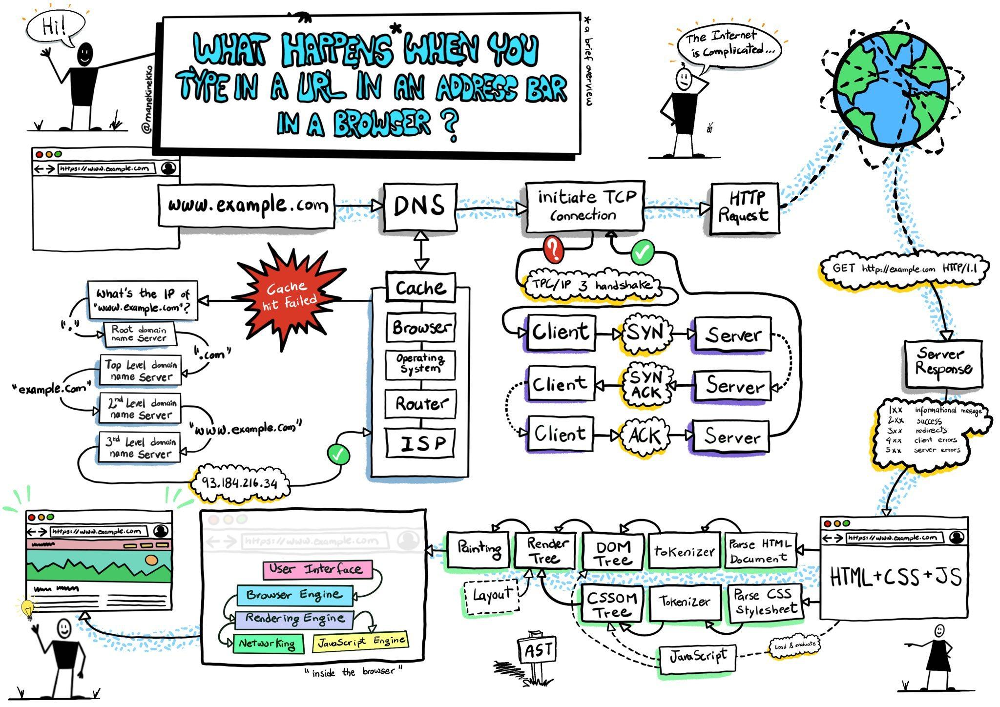
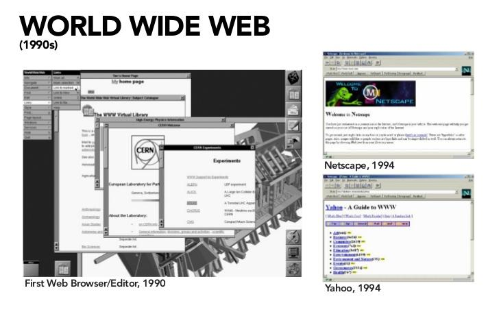
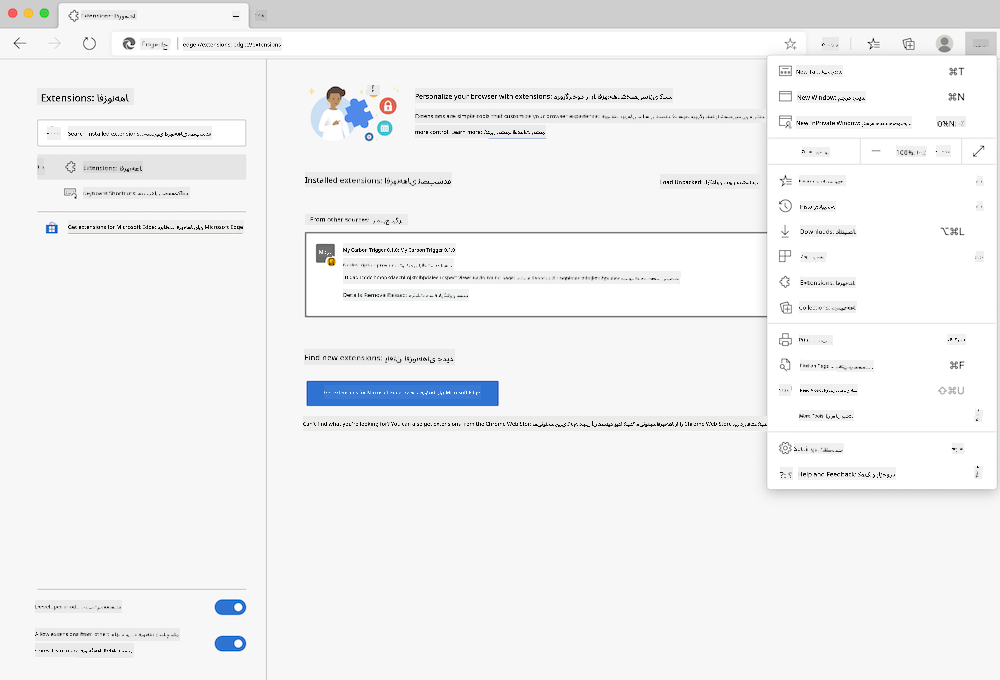
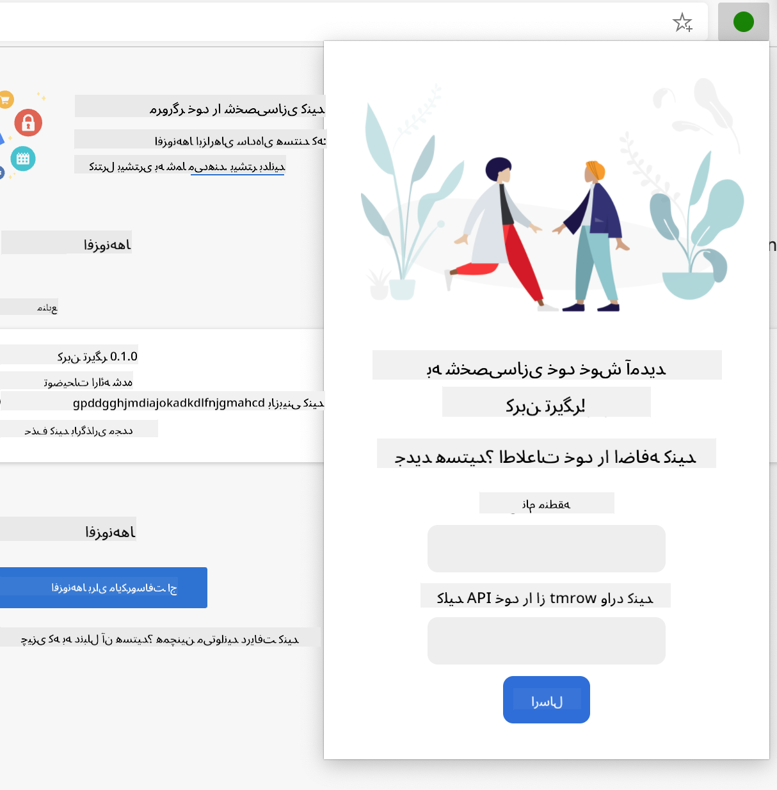
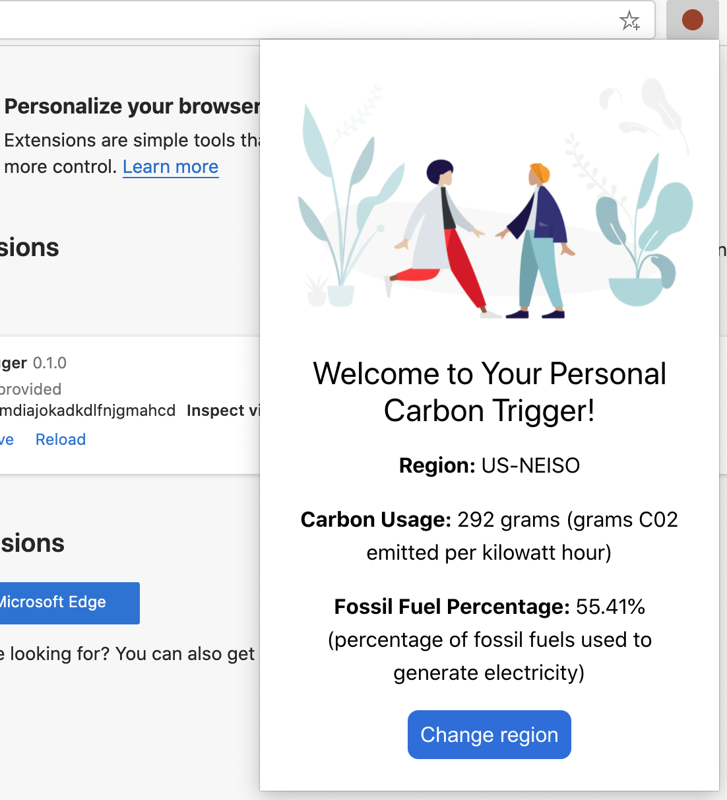

<!--
CO_OP_TRANSLATOR_METADATA:
{
  "original_hash": "2326d04e194a10aa760b51f5e5a1f61d",
  "translation_date": "2025-08-29T14:26:35+00:00",
  "source_file": "5-browser-extension/1-about-browsers/README.md",
  "language_code": "fa"
}
-->
# پروژه افزونه مرورگر بخش ۱: همه چیز درباره مرورگرها


> طرح دستی توسط [وسیم شغام](https://dev.to/wassimchegham/ever-wondered-what-happens-when-you-type-in-a-url-in-an-address-bar-in-a-browser-3dob)

## آزمون پیش از درس

[آزمون پیش از درس](https://ff-quizzes.netlify.app/web/quiz/23)

### مقدمه

افزونه‌های مرورگر قابلیت‌های اضافی به مرورگر اضافه می‌کنند. اما قبل از اینکه یکی بسازید، باید کمی درباره نحوه کار مرورگرها یاد بگیرید.

### درباره مرورگر

در این مجموعه درس‌ها، یاد می‌گیرید که چگونه یک افزونه مرورگر بسازید که روی مرورگرهای کروم، فایرفاکس و اج کار کند. در این بخش، خواهید فهمید که مرورگرها چگونه کار می‌کنند و عناصر افزونه مرورگر را طراحی می‌کنید.

اما مرورگر دقیقاً چیست؟ مرورگر یک نرم‌افزار کاربردی است که به کاربر نهایی اجازه می‌دهد محتوایی را از یک سرور دریافت کرده و آن را روی صفحات وب نمایش دهد.

✅ کمی تاریخچه: اولین مرورگر "WorldWideWeb" نام داشت و در سال ۱۹۹۰ توسط سر تیموتی برنرز-لی ساخته شد.


> برخی از مرورگرهای اولیه، از [کارن مک‌گرین](https://www.slideshare.net/KMcGrane/week-4-ixd-history-personal-computing)

وقتی کاربر با استفاده از یک آدرس URL (Uniform Resource Locator) به اینترنت متصل می‌شود، معمولاً از طریق پروتکل انتقال ابرمتن (HTTP) با آدرس `http` یا `https`، مرورگر با یک سرور وب ارتباط برقرار کرده و یک صفحه وب را دریافت می‌کند.

در این مرحله، موتور رندر مرورگر آن را روی دستگاه کاربر نمایش می‌دهد، که ممکن است یک تلفن همراه، دسکتاپ یا لپ‌تاپ باشد.

مرورگرها همچنین توانایی ذخیره‌سازی محتوا (کش) را دارند تا نیازی به دریافت مجدد آن از سرور نباشد. آن‌ها می‌توانند تاریخچه فعالیت‌های مرور کاربر را ثبت کنند، "کوکی‌ها" را ذخیره کنند که قطعات کوچکی از داده‌ها هستند و اطلاعاتی را برای ذخیره فعالیت‌های کاربر نگه می‌دارند، و موارد دیگر.

یک نکته بسیار مهم درباره مرورگرها این است که همه آن‌ها یکسان نیستند! هر مرورگر نقاط قوت و ضعف خود را دارد و یک توسعه‌دهنده حرفه‌ای وب باید بداند چگونه صفحات وب را به‌گونه‌ای طراحی کند که در مرورگرهای مختلف به خوبی کار کنند. این شامل مدیریت نمایشگرهای کوچک مانند تلفن همراه و همچنین کاربرانی که آفلاین هستند می‌شود.

یک وب‌سایت بسیار مفید که احتمالاً باید در مرورگر مورد علاقه خود نشانک‌گذاری کنید، [caniuse.com](https://www.caniuse.com) است. وقتی صفحات وب می‌سازید، استفاده از لیست‌های فناوری‌های پشتیبانی‌شده caniuse بسیار کمک‌کننده است تا بتوانید بهترین پشتیبانی را برای کاربران خود فراهم کنید.

✅ چگونه می‌توانید بفهمید کدام مرورگرها در میان کاربران وب‌سایت شما محبوب‌تر هستند؟ آنالیتیکس خود را بررسی کنید - می‌توانید بسته‌های مختلف آنالیتیکس را به عنوان بخشی از فرآیند توسعه وب خود نصب کنید و آن‌ها به شما خواهند گفت که کدام مرورگرها بیشتر توسط کاربران استفاده می‌شوند.

## افزونه‌های مرورگر

چرا ممکن است بخواهید یک افزونه مرورگر بسازید؟ این یک ابزار مفید است که وقتی نیاز به دسترسی سریع به وظایفی دارید که معمولاً تکرار می‌کنید، به مرورگر خود اضافه می‌کنید. برای مثال، اگر نیاز دارید رنگ‌های صفحات وب مختلفی که با آن‌ها تعامل دارید را بررسی کنید، ممکن است یک افزونه انتخاب رنگ نصب کنید. اگر در به خاطر سپردن رمزهای عبور مشکل دارید، ممکن است از یک افزونه مدیریت رمز عبور استفاده کنید.

ساخت افزونه‌های مرورگر نیز سرگرم‌کننده است. آن‌ها معمولاً تعداد محدودی از وظایف را مدیریت می‌کنند که در انجام آن‌ها بسیار خوب هستند.

✅ افزونه‌های مرورگر مورد علاقه شما کدام هستند؟ چه وظایفی را انجام می‌دهند؟

### نصب افزونه‌ها

قبل از شروع ساخت، نگاهی به فرآیند ساخت و انتشار یک افزونه مرورگر بیندازید. اگرچه هر مرورگر کمی در نحوه مدیریت این کار متفاوت است، فرآیند در کروم و فایرفاکس مشابه این مثال در اج است:



> توجه: مطمئن شوید که حالت توسعه‌دهنده را فعال کرده و اجازه نصب افزونه از فروشگاه‌های دیگر را بدهید.

به طور کلی، فرآیند به این صورت خواهد بود:

- افزونه خود را با استفاده از `npm run build` بسازید  
- در مرورگر به صفحه افزونه‌ها بروید، با استفاده از دکمه "تنظیمات و بیشتر" (آیکون `...`) در بالا سمت راست  
- اگر نصب جدیدی است، گزینه `load unpacked` را انتخاب کنید تا یک افزونه جدید از پوشه ساخت آن (در مورد ما `/dist`) بارگذاری شود  
- یا، اگر افزونه قبلاً نصب شده است، روی `reload` کلیک کنید تا افزونه مجدداً بارگذاری شود  

✅ این دستورالعمل‌ها مربوط به افزونه‌هایی است که خودتان می‌سازید؛ برای نصب افزونه‌هایی که در فروشگاه افزونه مرورگر منتشر شده‌اند، باید به [فروشگاه‌های مربوطه](https://microsoftedge.microsoft.com/addons/Microsoft-Edge-Extensions-Home) بروید و افزونه مورد نظر خود را نصب کنید.

### شروع کنید

شما قرار است یک افزونه مرورگر بسازید که ردپای کربنی منطقه شما را نمایش دهد، شامل مصرف انرژی منطقه و منبع انرژی. این افزونه یک فرم خواهد داشت که یک کلید API را برای دسترسی به API سیگنال CO2 جمع‌آوری می‌کند.

**شما نیاز دارید به:**

- [یک کلید API](https://www.co2signal.com/)؛ ایمیل خود را در کادر این صفحه وارد کنید و یک کلید برای شما ارسال خواهد شد  
- [کد منطقه شما](http://api.electricitymap.org/v3/zones) که مربوط به [نقشه برق](https://www.electricitymap.org/map) است (برای مثال، در بوستون از 'US-NEISO' استفاده می‌کنم).  
- [کد شروع](../../../../5-browser-extension/start). پوشه `start` را دانلود کنید؛ شما کد را در این پوشه تکمیل خواهید کرد.  
- [NPM](https://www.npmjs.com) - NPM یک ابزار مدیریت بسته است؛ آن را به صورت محلی نصب کنید و بسته‌های فهرست‌شده در فایل `package.json` شما برای استفاده در دارایی‌های وب شما نصب خواهند شد  

✅ درباره مدیریت بسته‌ها در این [ماژول آموزشی عالی](https://docs.microsoft.com/learn/modules/create-nodejs-project-dependencies/?WT.mc_id=academic-77807-sagibbon) بیشتر بیاموزید.

چند دقیقه وقت بگذارید و کدبیس را مرور کنید:

dist  
    -|manifest.json (تنظیمات پیش‌فرض اینجا قرار دارند)  
    -|index.html (نشانه‌گذاری HTML فرانت‌اند اینجا قرار دارد)  
    -|background.js (جاوااسکریپت پس‌زمینه اینجا قرار دارد)  
    -|main.js (جاوااسکریپت ساخته‌شده)  
src  
    -|index.js (کد جاوااسکریپت شما اینجا قرار می‌گیرد)  

✅ وقتی کلید API و کد منطقه خود را آماده کردید، آن‌ها را در جایی یادداشت کنید تا بعداً استفاده کنید.

### ساخت HTML برای افزونه

این افزونه دو نما دارد. یکی برای جمع‌آوری کلید API و کد منطقه:



و دیگری برای نمایش مصرف کربن منطقه:



بیایید با ساخت HTML برای فرم و استایل‌دهی آن با CSS شروع کنیم.

در پوشه `/dist`، یک فرم و یک ناحیه نتیجه بسازید. در فایل `index.html`، ناحیه فرم مشخص‌شده را پر کنید:

```HTML
<form class="form-data" autocomplete="on">
	<div>
		<h2>New? Add your Information</h2>
	</div>
	<div>
		<label for="region">Region Name</label>
		<input type="text" id="region" required class="region-name" />
	</div>
	<div>
		<label for="api">Your API Key from tmrow</label>
		<input type="text" id="api" required class="api-key" />
	</div>
	<button class="search-btn">Submit</button>
</form>	
```  
این فرم جایی است که اطلاعات ذخیره‌شده شما وارد شده و در حافظه محلی ذخیره می‌شود.

سپس، ناحیه نتایج را بسازید؛ زیر تگ نهایی فرم، چند div اضافه کنید:

```HTML
<div class="result">
	<div class="loading">loading...</div>
	<div class="errors"></div>
	<div class="data"></div>
	<div class="result-container">
		<p><strong>Region: </strong><span class="my-region"></span></p>
		<p><strong>Carbon Usage: </strong><span class="carbon-usage"></span></p>
		<p><strong>Fossil Fuel Percentage: </strong><span class="fossil-fuel"></span></p>
	</div>
	<button class="clear-btn">Change region</button>
</div>
```  
در این مرحله، می‌توانید یک ساخت اولیه انجام دهید. مطمئن شوید که وابستگی‌های بسته این افزونه را نصب کرده‌اید:

```
npm install
```  

این دستور از npm، مدیر بسته نود، برای نصب webpack برای فرآیند ساخت افزونه شما استفاده می‌کند. می‌توانید خروجی این فرآیند را با نگاه کردن به `/dist/main.js` ببینید - کد بسته‌بندی شده است.

فعلاً، افزونه باید ساخته شود و اگر آن را به عنوان افزونه در اج نصب کنید، یک فرم مرتب نمایش داده خواهد شد.

تبریک می‌گویم، شما اولین قدم‌ها را برای ساخت یک افزونه مرورگر برداشته‌اید. در درس‌های بعدی، آن را کاربردی‌تر و مفیدتر خواهید کرد.

---

## 🚀 چالش

به یک فروشگاه افزونه مرورگر نگاهی بیندازید و یکی را در مرورگر خود نصب کنید. می‌توانید فایل‌های آن را به روش‌های جالبی بررسی کنید. چه چیزی کشف می‌کنید؟

## آزمون پس از درس

[آزمون پس از درس](https://ff-quizzes.netlify.app/web/quiz/24)

## مرور و مطالعه شخصی

در این درس کمی درباره تاریخچه مرورگر وب یاد گرفتید؛ از این فرصت استفاده کنید تا درباره نحوه تصور مخترعان وب جهانی از استفاده آن بیشتر بخوانید. برخی سایت‌های مفید شامل:

[تاریخچه مرورگرهای وب](https://www.mozilla.org/firefox/browsers/browser-history/)

[تاریخچه وب](https://webfoundation.org/about/vision/history-of-the-web/)

[مصاحبه‌ای با تیم برنرز-لی](https://www.theguardian.com/technology/2019/mar/12/tim-berners-lee-on-30-years-of-the-web-if-we-dream-a-little-we-can-get-the-web-we-want)

## تکلیف

[افزونه خود را بازطراحی کنید](assignment.md)

---

**سلب مسئولیت**:  
این سند با استفاده از سرویس ترجمه هوش مصنوعی [Co-op Translator](https://github.com/Azure/co-op-translator) ترجمه شده است. در حالی که ما برای دقت تلاش می‌کنیم، لطفاً توجه داشته باشید که ترجمه‌های خودکار ممکن است شامل خطاها یا نادقتی‌هایی باشند. سند اصلی به زبان اصلی آن باید به عنوان منبع معتبر در نظر گرفته شود. برای اطلاعات حساس، ترجمه حرفه‌ای انسانی توصیه می‌شود. ما هیچ مسئولیتی در قبال سوءتفاهم‌ها یا تفسیرهای نادرست ناشی از استفاده از این ترجمه نداریم.