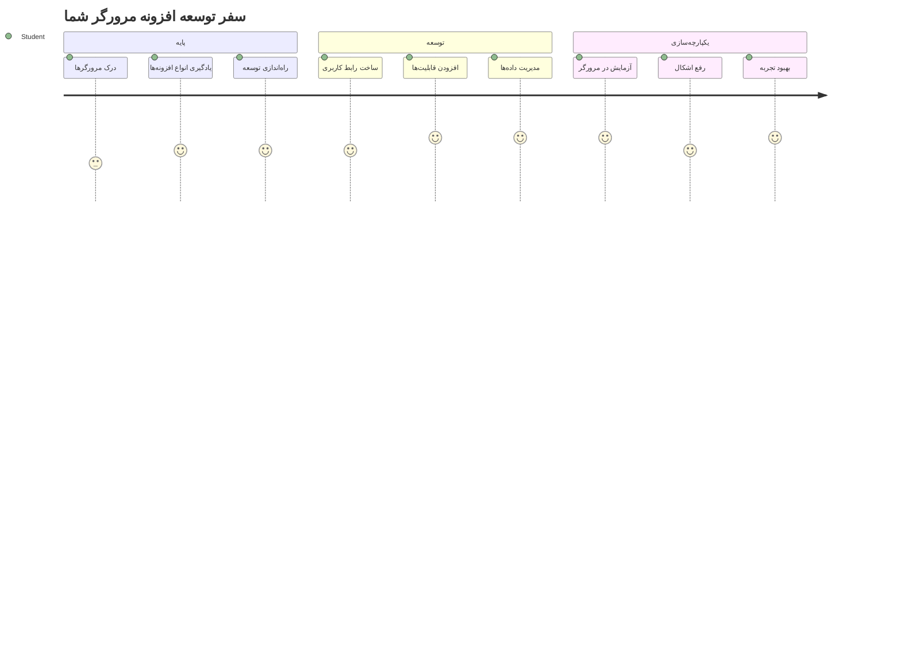
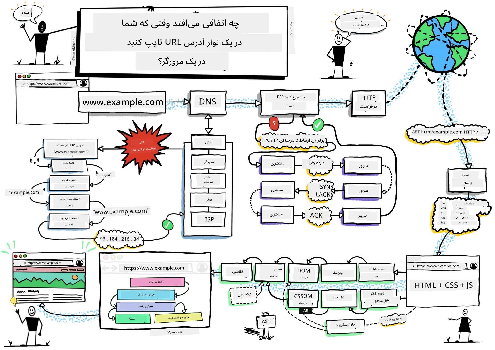
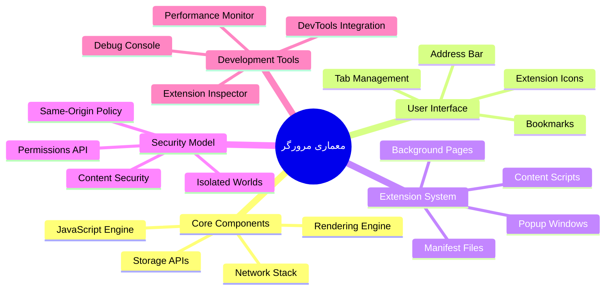
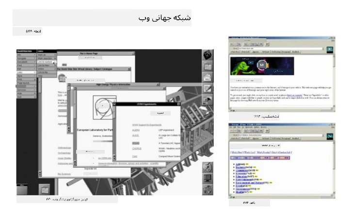
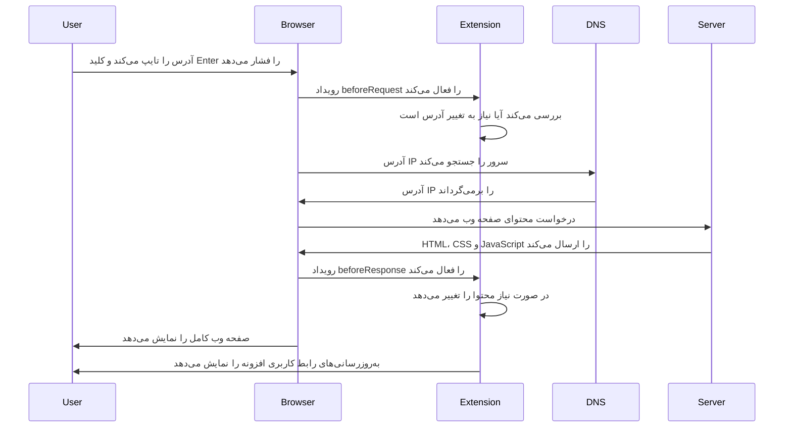
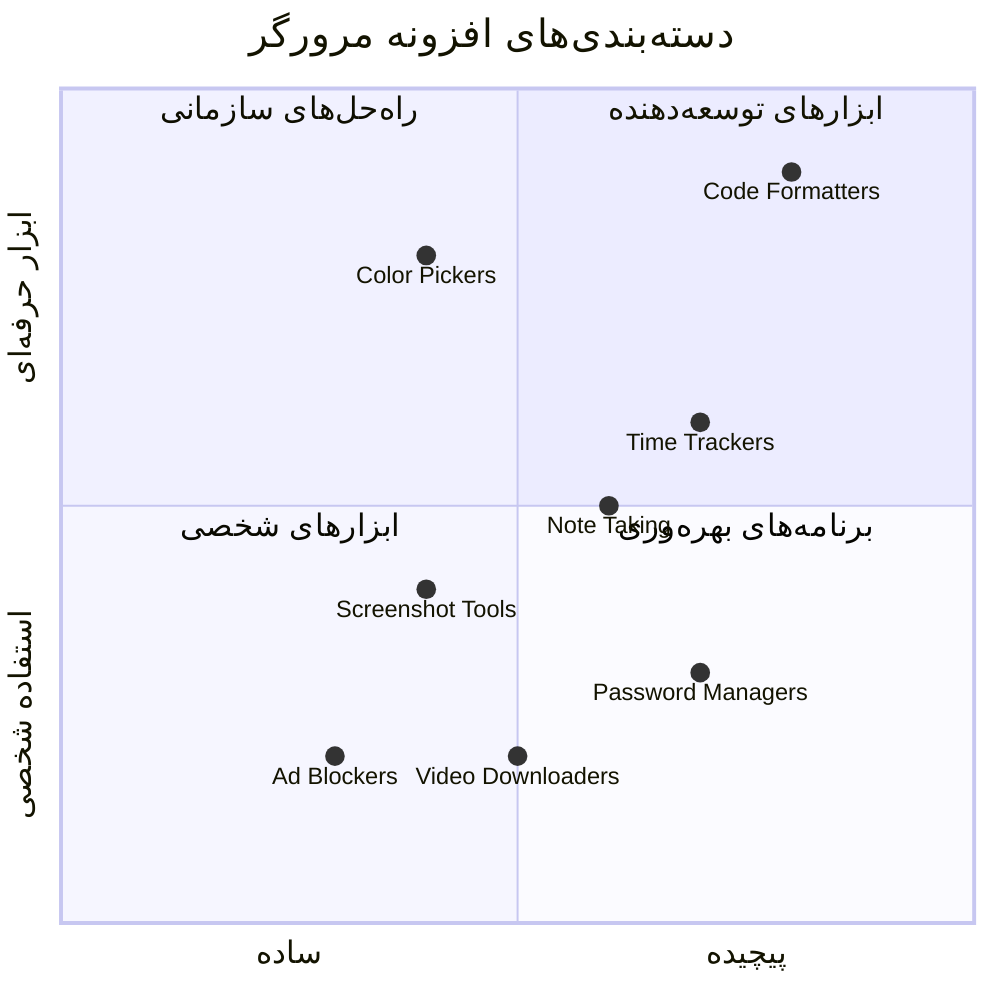
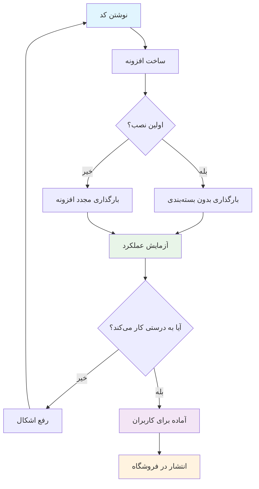
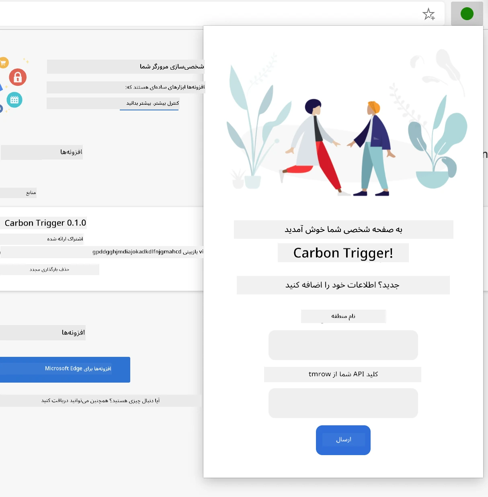
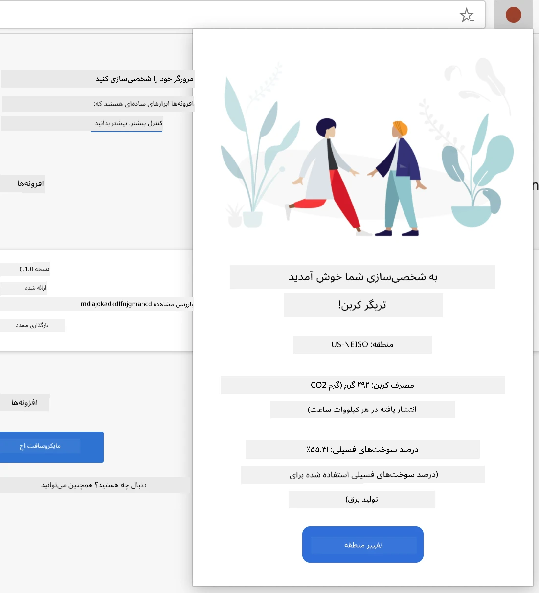
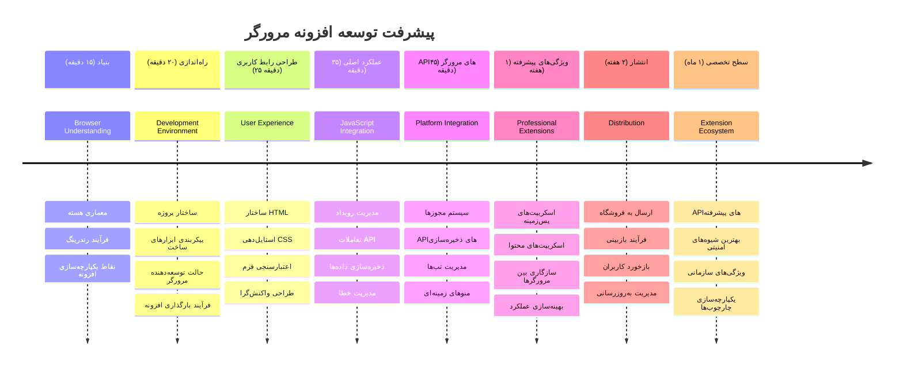

<!--
CO_OP_TRANSLATOR_METADATA:
{
  "original_hash": "00aa85715e1efd4930c17a23e3012e69",
  "translation_date": "2026-01-06T10:18:37+00:00",
  "source_file": "5-browser-extension/1-about-browsers/README.md",
  "language_code": "fa"
}
-->
# قسمت اول پروژه افزونه مرورگر: همه چیز درباره مرورگرها



> نقشه‌برداری توسط [Wassim Chegham](https://dev.to/wassimchegham/ever-wondered-what-happens-when-you-type-in-a-url-in-an-address-bar-in-a-browser-3dob)

## آزمون پیش از درس

[آزمون پیش از درس](https://ff-quizzes.netlify.app/web/quiz/23)

### مقدمه

افزونه‌های مرورگر برنامه‌های کوچکی هستند که تجربه مرور وب شما را بهبود می‌بخشند. درست مانند چشم‌انداز اصلی تیم برنرز-لی برای یک وب تعاملی، افزونه‌ها قابلیت‌های مرورگر را فراتر از مشاهده ساده اسناد گسترش می‌دهند. از مدیران رمز عبور که حساب‌های شما را ایمن نگه می‌دارند تا انتخاب‌کننده رنگ که به طراحان کمک می‌کند سایه‌های دقیق را انتخاب کنند، افزونه‌ها مشکلات روزمره مرور را حل می‌کنند.

قبل از ساخت اولین افزونه شما، بیایید بفهمیم مرورگرها چگونه کار می‌کنند. همانطور که الکساندر گراهام بل نیاز داشت انتقال صدا را بفهمد تا تلفن را اختراع کند، دانستن اصول مرورگر به شما کمک می‌کند افزونه‌هایی بسازید که به طور یکپارچه با سیستم‌های مرورگر موجود ادغام شوند.

در پایان این درس، معماری مرورگر را خواهید فهمید و اولین افزونه خود را شروع به ساخت خواهید کرد.


## فهمیدن مرورگرهای وب

مرورگر وب اساساً یک مفسر پیشرفته اسناد است. وقتی "google.com" را در نوار آدرس تایپ می‌کنید، مرورگر یک سری عملیات پیچیده انجام می‌دهد - درخواست محتوا از سرورهای سراسر جهان، سپس تجزیه و رندر کردن آن کد به صفحات وب تعاملی که مشاهده می‌کنید.

این فرایند مشابه طراحی اولین مرورگر وب، WorldWideWeb، توسط تیم برنرز-لی در سال ۱۹۹۰ است تا اسناد لینک‌شده به هم را برای همه قابل دسترس کند.

✅ **یک تاریخچه کوتاه**: اولین مرورگر 'WorldWideWeb' نام داشت و توسط سر تیموتی برنرز-لی در سال ۱۹۹۰ ساخته شد.


> برخی مرورگرهای اولیه، از طریق [Karen McGrane](https://www.slideshare.net/KMcGrane/week-4-ixd-history-personal-computing)

### چگونه مرورگرها محتوای وب را پردازش می‌کنند

فرایند بین وارد کردن یک URL و دیدن یک صفحه وب شامل چندین مرحله هماهنگ است که در عرض چند ثانیه اتفاق می‌افتد:


**این فرایند چه کاری انجام می‌دهد:**
- **ترجمه** آدرس قابل خواندن توسط انسان به آدرس IP سرور از طریق جستجوی DNS
- **ایجاد** اتصال امن با سرور وب با استفاده از پروتکل‌های HTTP یا HTTPS
- **درخواست** محتوای صفحه وب خاص از سرور
- **دریافت** کد HTML، استایل CSS و کد جاوااسکریپت از سرور
- **رندر** کردن تمام محتوا به صفحه وب تعاملی که می‌بینید

### ویژگی‌های اساسی مرورگر

مرورگرهای مدرن ویژگی‌های متعددی دارند که توسعه‌دهندگان افزونه می‌توانند از آن‌ها بهره ببرند:

| ویژگی | هدف | فرصت‌های افزونه |
|---------|---------|------------------------|
| **موتور رندرینگ** | نمایش HTML، CSS و جاوااسکریپت | تغییر محتوا، تزریق استایل |
| **موتور جاوااسکریپت** | اجرای کد جاوااسکریپت | اسکریپت‌های سفارشی، تعامل با API |
| **ذخیره‌سازی محلی** | ذخیره داده‌ها به صورت محلی | تنظیمات کاربر، داده‌های کش‌شده |
| **پشته شبکه** | مدیریت درخواست‌های وب | مانیتورینگ درخواست‌ها، تحلیل داده‌ها |
| **مدل امنیتی** | حفاظت از کاربران در برابر محتوای مخرب | فیلتر محتوا، بهبود امنیت |

**فهم این ویژگی‌ها کمک می‌کند تا:**
- **شناسایی** جایی که افزونه شما بیشترین ارزش را اضافه می‌کند
- **انتخاب** APIهای مرورگر مناسب برای عملکرد افزونه
- **طراحی** افزونه‌هایی که با سیستم‌های مرورگر بهینه کار کنند
- **اطمینان** از پیروی افزونه شما از بهترین شیوه‌های امنیتی مرورگر

### ملاحظات توسعه چندمروریگر

مرورگرهای مختلف استانداردها را با تفاوت‌های جزئی پیاده‌سازی می‌کنند، درست مانند نحوه تفاوت زبان‌های برنامه‌نویسی در مدیریت یک الگوریتم. کروم، فایرفاکس و سافاری هر کدام ویژگی‌های منحصربه‌فردی دارند که توسعه‌دهندگان باید هنگام توسعه افزونه به آن‌ها توجه کنند.

> 💡 **نکته حرفه‌ای**: از [caniuse.com](https://www.caniuse.com) استفاده کنید تا ببینید کدام تکنولوژی‌های وب در مرورگرهای مختلف پشتیبانی می‌شوند. این اطلاعات برای برنامه‌ریزی ویژگی‌های افزونه شما بسیار حیاتی است!

**ملاحظات کلیدی برای توسعه افزونه:**
- **آزمایش** افزونه در مرورگرهای کروم، فایرفاکس و اج
- **سازگاری** با APIها و فرمت‌های مختلف افزونه مرورگر
- **مواجهه** با ویژگی‌ها و محدودیت‌های عملکردی متفاوت
- **ارائه** راه‌حل جایگزین برای ویژگی‌های خاص مرورگری که شاید در دسترس نباشد

✅ **بینش تجزیه و تحلیل**: می‌توانید با نصب بسته‌های تحلیلی در پروژه‌های توسعه وب خود بدانید کاربران شما کدام مرورگرها را ترجیح می‌دهند. این داده به شما کمک می‌کند اولویت حمایت از مرورگرها را مشخص کنید.

## درک افزونه‌های مرورگر

افزونه‌های مرورگر با افزودن قابلیت به رابط مرورگر، مشکلات معمول مرور وب را حل می‌کنند. به جای نیاز به برنامه‌های جداگانه یا جریان‌های کاری پیچیده، افزونه‌ها دسترسی فوری به ابزارها و امکانات فراهم می‌آورند.

این مفهوم شبیه تصمیم پیشگامان اولیه کامپیوتر مانند داگلاس اینگلبرت است که توسعه قابلیت‌های انسانی توسط فناوری را تصور می‌کردند - افزونه‌ها عملکرد پایه مرورگر شما را توسعه می‌دهند.


**دسته‌های محبوب افزونه و فواید آن‌ها:**
- **ابزارهای بهره‌وری**: مدیریت وظایف، برنامه‌های یادداشت‌برداری و ردیاب‌های زمان که به سازماندهی کمک می‌کنند
- **بهبودهای امنیتی**: مدیران رمز عبور، مسدودکننده‌های تبلیغات و ابزارهای حفظ حریم خصوصی که از داده‌های شما محافظت می‌کنند
- **ابزارهای توسعه‌دهنده**: فرمت‌کننده‌های کد، انتخاب‌کننده‌های رنگ و ابزارهای اشکال‌زدایی که توسعه را ساده می‌کنند
- **بهبود محتوا**: حالت‌های مطالعه، دانلودر ویدئو و ابزارهای اسکرین‌شات که تجربه وب را بهتر می‌کنند

✅ **سوال تامل‌برانگیز**: افزونه‌های مرورگر مورد علاقه شما کدامند؟ چه وظایفی انجام می‌دهند و چگونه تجربه مرور شما را بهبود می‌بخشند؟

### 🔄 **بازبینی آموزشی**
**درک معماری مرورگر**: قبل از حرکت به سمت توسعه افزونه، اطمینان حاصل کنید که می‌توانید:
- ✅ توضیح دهید مرورگر چگونه درخواست‌های وب را پردازش و محتوا را رندر می‌کند
- ✅ اجزای اصلی معماری مرورگر را شناسایی کنید
- ✅ درک کنید افزونه‌ها چگونه با عملکرد مرورگر ادغام می‌شوند
- ✅ مدل امنیتی که از کاربران محافظت می‌کند را بشناسید

**آزمون سریع خود**: آیا می‌توانید مسیر از تایپ یک URL تا دیدن صفحه وب را دنبال کنید؟
1. **جستجوی DNS** URL را به آدرس IP تبدیل می‌کند
2. **درخواست HTTP** محتوا را از سرور می‌گیرد
3. **تجزیه** HTML، CSS و جاوااسکریپت را پردازش می‌کند
4. **رندر** صفحه وب نهایی را نمایش می‌دهد
5. **افزونه‌ها** می‌توانند محتوا را در چند مرحله تغییر دهند

## نصب و مدیریت افزونه‌ها

درک فرایند نصب افزونه به شما کمک می‌کند تجربه کاربری را وقتی مردم افزونه شما را نصب می‌کنند پیش‌بینی کنید. فرایند نصب در مرورگرهای مدرن استاندارد است و تغییرات جزئی در طراحی رابط وجود دارد.


> **مهم**: حتما حالت توسعه‌دهنده را روشن کرده و اجازه نصب افزونه‌ها از فروشگاه‌های دیگر را هنگام تست افزونه‌های خود فعال کنید.

### فرایند نصب افزونه در توسعه

وقتی افزونه خود را توسعه و تست می‌کنید، این روند کار را دنبال کنید:


```bash
# گام ۱: افزونه خود را بسازید
npm run build
```

**این دستور چه کاری انجام می‌دهد:**
- **کامپایل** کد منبع شما به فایل‌های آماده مرورگر
- **باندل** کردن ماژول‌های جاوااسکریپت به بسته‌های بهینه شده
- **تولید** فایل‌های نهایی افزونه در پوشه `/dist`
- **آماده‌سازی** افزونه شما برای نصب و تست

**گام ۲: رفتن به افزونه‌های مرورگر**
1. **باز کردن** صفحه مدیریت افزونه مرورگر خود
2. **کلیک** روی دکمه "تنظیمات و بیشتر" (آیکون `...`) در بالا سمت راست
3. **انتخاب** "Extensions" از منوی کشویی

**گام ۳: بارگذاری افزونه**
- **برای نصب جدید**: گزینه `load unpacked` را انتخاب کرده و پوشه `/dist` خود را برگزینید
- **برای به‌روزرسانی**: روی «reload» کنار افزونه نصب شده کلیک کنید
- **برای تست**: حالت "Developer mode" را فعال کنید تا به امکانات اشکال‌زدایی بیشتر دسترسی داشته باشید

### نصب افزونه در محیط تولید

> ✅ **توجه**: این دستورالعمل‌های توسعه مخصوص افزونه‌هایی است که خودتان می‌سازید. برای نصب افزونه‌های منتشر شده به فروشگاه‌های رسمی افزونه مرورگر، مانند [فروشگاه Microsoft Edge Add-ons](https://microsoftedge.microsoft.com/addons/Microsoft-Edge-Extensions-Home) مراجعه کنید.

**تفاوت را درک کنید:**
- **نصب در توسعه** اجازه تست افزونه‌های منتشر نشده را می‌دهد
- **نصب از فروشگاه** افزونه‌های بررسی شده و منتشر شده با به‌روزرسانی خودکار را فراهم می‌کند
- **بارگذاری جانبی** امکان نصب افزونه‌ها از خارج فروشگاه‌های رسمی را می‌دهد (نیاز به حالت توسعه‌دهنده دارد)

## ساخت افزونه ردپای کربن شما

ما یک افزونه مرورگر می‌سازیم که ردپای کربن استفاده از انرژی منطقه شما را نمایش می‌دهد. این پروژه مفاهیم اساسی توسعه افزونه را نشان می‌دهد و در عین حال یک ابزار عملی برای افزایش آگاهی محیط زیستی ایجاد می‌کند.

این روش از اصل «یادگیری با عمل» پیروی می‌کند که از نظریه‌های آموزشی جان دویی موثر بوده است - ترکیب مهارت‌های فنی با کاربردهای واقعی معنی‌دار.

### نیازمندی‌های پروژه

قبل از شروع توسعه، بیایید منابع و وابستگی‌های مورد نیاز را جمع‌آوری کنیم:

**دسترسی‌های API مورد نیاز:**
- **[کلید API CO2 Signal](https://www.co2signal.com/)**: با وارد کردن ایمیل خود کلید API رایگان دریافت کنید
- **[کد منطقه](http://api.electricitymap.org/v3/zones)**: کد منطقه خود را با استفاده از [نقشه برق (Electricity Map)](https://www.electricitymap.org/map) بیابید (مثلاً بوستون از 'US-NEISO' استفاده می‌کند)

**ابزارهای توسعه:**
- **[Node.js و NPM](https://www.npmjs.com)**: ابزار مدیریت پکیج برای نصب وابستگی‌های پروژه
- **[کد شروع](../../../../5-browser-extension/start)**: پوشه `start` را برای شروع توسعه دانلود کنید

✅ **بیشتر بدانید**: مهارت‌های مدیریت پکیج خود را با این [ماژول جامع یادگیری](https://docs.microsoft.com/learn/modules/create-nodejs-project-dependencies/?WT.mc_id=academic-77807-sagibbon) تقویت کنید

### درک ساختار پروژه

درک ساختار پروژه به سازماندهی کار توسعه کمک می‌کند. مانند اینکه کتابخانه اسکندریه برای بازیابی دانش بهینه سازماندهی شده بود، ساختار کد مرتب باعث افزایش بهره‌وری در توسعه می‌شود:

```
project-root/
├── dist/                    # Built extension files
│   ├── manifest.json        # Extension configuration
│   ├── index.html           # User interface markup
│   ├── background.js        # Background script functionality
│   └── main.js              # Compiled JavaScript bundle
├── src/                     # Source development files
│   └── index.js             # Your main JavaScript code
├── package.json             # Project dependencies and scripts
└── webpack.config.js        # Build configuration
```

**توضیح کار هر فایل:**
- **`manifest.json`**: **تعریف** متادیتا، مجوزها و نقاط ورود افزونه
- **`index.html`**: **ساخت** رابط کاربری که وقتی کاربران روی افزونه کلیک می‌کنند ظاهر می‌شود
- **`background.js`**: **مدیریت** وظایف پس‌زمینه و شنوندگان رویداد مرورگر
- **`main.js`**: **حاوی** کد نهایی بسته‌بندی شده جاوااسکریپت پس از فرایند ساخت
- **`src/index.js`**: **خانه** کد اصلی توسعه شما که به `main.js` کامپایل می‌شود

> 💡 **نکته سازماندهی**: کلید API و کد منطقه خود را در یک یادداشت امن ذخیره کنید تا در طول توسعه به راحتی به آن‌ها دسترسی داشته باشید. برای آزمایش عملکرد افزونه به این مقادیر نیاز خواهید داشت.

✅ **نکته امنیتی**: هرگز کلیدهای API یا مدارک حساس را در مخزن کد خود کامیت نکنید. در مراحل بعدی به شما نشان خواهیم داد چگونه این داده‌ها را به صورت امن مدیریت کنید.

## ساخت رابط افزونه

اکنون قطعات رابط کاربری را می‌سازیم. افزونه ما از روش دو صفحه‌ای استفاده می‌کند: صفحه تنظیمات برای پیکربندی اولیه و صفحه نتایج برای نمایش داده‌ها.

این مطابق با اصل افشای تدریجی است که در طراحی رابط‌ها از اوایل کامپیوترها استفاده شده - نشان دادن اطلاعات و گزینه‌ها به صورت منطقی برای جلوگیری از سردرگمی کاربران.

### مروری بر نماهای افزونه

**نمای تنظیمات** - پیکربندی اولیه برای کاربر اولین بار:


**نمای نتایج** - نمایش داده‌های ردپای کربن:


### ساخت فرم پیکربندی

فرم پیکربندی داده‌های تنظیمات کاربر را در اولین استفاده جمع‌آوری می‌کند. پس از پیکربندی، این اطلاعات در ذخیره‌سازی مرورگر برای جلسات بعدی حفظ می‌شود.

در فایل `/dist/index.html` این ساختار فرم را اضافه کنید:

```html
<form class="form-data" autocomplete="on">
    <div>
        <h2>New? Add your Information</h2>
    </div>
    <div>
        <label for="region">Region Name</label>
        <input type="text" id="region" required class="region-name" />
    </div>
    <div>
        <label for="api">Your API Key from tmrow</label>
        <input type="text" id="api" required class="api-key" />
    </div>
    <button class="search-btn">Submit</button>
</form>
```

**این فرم چه کاری انجام می‌دهد:**
- **ساختار** فرم معنایی با برچسب‌ها و اتصال مناسب ورودی‌ها ایجاد می‌کند
- **فعال‌سازی** خودتکمیلی مرورگر برای بهبود تجربه کاربری
- **الزام** به پر بودن هر دو فیلد قبل از ارسال با استفاده از مشخصه `required`
- **سازماندهی** ورودی‌ها با نام‌های کلاس توصیفی برای سهولت استایل‌دهی و هدف‌گیری جاوااسکریپت
- **ارائه** دستورالعمل واضح برای کاربرانی که افزونه را برای اولین بار تنظیم می‌کنند

### ساخت بخش نمایش نتایج

در مرحله بعد، قسمت نتایج را ایجاد کنید که داده‌های ردپای کربن را نمایش می‌دهد. این HTML را زیر فرم اضافه کنید:

```html
<div class="result">
    <div class="loading">loading...</div>
    <div class="errors"></div>
    <div class="data"></div>
    <div class="result-container">
        <p><strong>Region: </strong><span class="my-region"></span></p>
        <p><strong>Carbon Usage: </strong><span class="carbon-usage"></span></p>
        <p><strong>Fossil Fuel Percentage: </strong><span class="fossil-fuel"></span></p>
    </div>
    <button class="clear-btn">Change region</button>
</div>
```

**توضیح ساختار:**
- **`loading`**: هنگام دریافت داده‌های API پیام بارگذاری را نشان می‌دهد
- **`errors`**: پیام‌های خطا را در صورت شکست API یا داده نامعتبر نمایش می‌دهد
- **`data`**: داده خام را برای اشکال‌زدایی در طول توسعه نگه می‌دارد
- **`result-container`**: اطلاعات فرمت شده ردپای کربن را به کاربران ارائه می‌کند
- **`clear-btn`**: اجازه می‌دهد کاربران منطقه خود را تغییر داده و افزونه را دوباره پیکربندی کنند

### راه‌اندازی فرایند ساخت

اکنون وابستگی‌های پروژه را نصب و فرایند ساخت را تست کنیم:

```bash
npm install
```

**این فرایند نصب چه کاری می‌کند:**
- **دانلود** Webpack و سایر وابستگی‌های توسعه تعیین‌شده در `package.json`
- **پیکربندی** ابزار ساخت برای کامپایل جاوااسکریپت مدرن
- **آماده‌سازی** محیط توسعه برای ساخت و تست افزونه
- **فعال‌سازی** باندلینگ کد، بهینه‌سازی و ویژگی‌های سازگاری مرورگر

> 💡 **بینش فرایند ساخت**: Webpack کد منبع شما از `/src/index.js` را به `/dist/main.js` باندل می‌کند. این فرایند کد شما را برای تولید بهینه‌سازی می‌کند و سازگاری با مرورگر تضمین می‌شود.

### تست پیشرفت خود

در این مرحله می‌توانید افزونه خود را تست کنید:
1. **اجرای** فرمان ساخت برای کامپایل کد خود  
2. **بارگذاری** افزونه در مرورگر خود با استفاده از حالت توسعه‌دهنده  
3. **بررسی** اینکه فرم به درستی نمایش داده می‌شود و ظاهر حرفه‌ای دارد  
4. **اطمینان از** اینکه تمام عناصر فرم به درستی تراز شده و عملکردی هستند  

**آنچه به دست آورده‌اید:**  
- **ساخت** ساختار پایه‌ای HTML برای افزونه خود  
- **ایجاد** هر دو رابط پیکربندی و نتایج با نشانه‌گذاری معنایی صحیح  
- **راه‌اندازی** جریان کاری توسعه مدرن با استفاده از ابزارهای استاندارد صنعت  
- **آماده‌سازی** بستر برای افزودن قابلیت‌های تعاملی JavaScript  

### 🔄 **بازبینی آموزشی**  
**پیشرفت توسعه افزونه**: قبل از ادامه، درک خود را بررسی کنید:  
- ✅ آیا می‌توانید هدف هر فایل در ساختار پروژه را توضیح دهید؟  
- ✅ آیا می‌دانید فرآیند ساخت چگونه کد منبع شما را تبدیل می‌کند؟  
- ✅ چرا بخش پیکربندی و نتایج را در بخش‌های مختلف رابط کاربری جدا می‌کنیم؟  
- ✅ ساختار فرم چگونه از قابلیت استفاده و دسترسی پشتیبانی می‌کند؟  

**درک جریان کاری توسعه**: اکنون باید بتوانید:  
1. **ویرایش** HTML و CSS رابط افزونه خود  
2. **اجرای** فرمان ساخت برای کامپایل تغییرات  
3. **بارگذاری مجدد** افزونه در مرورگر برای تست به‌روزرسانی‌ها  
4. **اشکال‌زدایی** مشکلات با استفاده از ابزارهای توسعه‌دهنده مرورگر  

شما مرحله اول توسعه افزونه مرورگر را کامل کرده‌اید. مانند اینکه برادران رایت ابتدا باید هوانوردی را درک می‌کردند تا پرواز کنند، درک این مفاهیم بنیادی شما را برای ساخت ویژگی‌های تعاملی پیچیده‌تر در درس بعدی آماده می‌کند.  

## چالش GitHub Copilot Agent 🚀  

از حالت Agent برای تکمیل چالش زیر استفاده کنید:  

**توضیح:** افزونه مرورگر را با افزودن اعتبارسنجی فرم و ویژگی‌های بازخورد کاربر ارتقا دهید تا تجربه کاربری هنگام وارد کردن کلیدهای API و کدهای منطقه بهبود یابد.  

**دستور:** توابع اعتبارسنجی JavaScript ایجاد کنید تا بررسی کنند که آیا فیلد کلید API حداقل ۲۰ کاراکتر دارد و کد منطقه فرمت صحیحی دارد (مانند 'US-NEISO'). بازخورد بصری با تغییر رنگ حاشیه ورودی به سبز برای ورودی‌های معتبر و قرمز برای ورودی‌های نامعتبر اضافه کنید. همچنین یک قابلیت سوییچ برای نمایش/پنهان کردن کلید API به منظور حفظ امنیت اضافه کنید.  

برای کسب اطلاعات بیشتر در مورد [حالت agent](https://code.visualstudio.com/blogs/2025/02/24/introducing-copilot-agent-mode) اینجا را ببینید.  

## 🚀 چالش  

به فروشگاه افزونه مرورگر مراجعه کنید و یکی را روی مرورگر خود نصب کنید. می‌توانید فایل‌های آن را به شکل‌های جالب بررسی کنید. چه کشف‌هایی می‌کنید؟  

## آزمون پس از درس  

[آزمون پس از درس](https://ff-quizzes.netlify.app/web/quiz/24)  

## بررسی و مطالعه آزاد  

در این درس کمی درباره تاریخچه مرورگر وب آموختید؛ از این فرصت استفاده کنید و درباره اینکه مخترعان وب چگونه استفاده از آن را تصور می‌کردند بیشتر بخوانید. برخی سایت‌های مفید عبارتند از:  

[تاریخچه مرورگرهای وب](https://www.mozilla.org/firefox/browsers/browser-history/)  

[تاریخچه وب](https://webfoundation.org/about/vision/history-of-the-web/)  

[مصاحبه با تیم برنرز-لی](https://www.theguardian.com/technology/2019/mar/12/tim-berners-lee-on-30-years-of-the-web-if-we-dream-a-little-we-can-get-the-web-we-want)  

### ⚡ **کارهایی که می‌توانید در ۵ دقیقه بعدی انجام دهید**  
- [ ] صفحه افزونه‌های Chrome/Edge را باز کنید (chrome://extensions) و افزونه‌های نصب شده را بررسی کنید  
- [ ] در تب شبکه (Network) ابزارهای توسعه‌دهنده مرورگر خود هنگام بارگذاری یک صفحه نگاه کنید  
- [ ] سعی کنید سورس صفحه را مشاهده کنید (Ctrl+U) تا ساختار HTML را ببینید  
- [ ] هر عنصر صفحه را بازرسی کنید و CSS آن را در DevTools تغییر دهید  

### 🎯 **اهدافی که می‌توانید در این ساعت به آنها برسید**  
- [ ] آزمون پس از درس را کامل کنید و مفاهیم پایه مرورگر را بفهمید  
- [ ] یک فایل manifest.json پایه برای افزونه مرورگر بسازید  
- [ ] یک افزونه ساده «سلام دنیا» بسازید که یک پاپ‌آپ نمایش دهد  
- [ ] بارگذاری افزونه را در حالت توسعه‌دهنده تست کنید  
- [ ] مستندات افزونه مرورگر هدف خود را بررسی کنید  

### 📅 **سفر شما به توسعه افزونه در یک هفته**  
- [ ] یک افزونه مرورگر کاربردی و واقعی بسازید  
- [ ] درباره اسکریپت‌های محتوا، پس‌زمینه و تعاملات پاپ‌آپ بیاموزید  
- [ ] بر APIs مرورگر مانند ذخیره‌سازی، تب‌ها و پیام‌رسانی مسلط شوید  
- [ ] رابط‌های کاربری پسندیده برای افزونه طراحی کنید  
- [ ] افزونه را در وب‌سایت‌ها و موقعیت‌های مختلف تست کنید  
- [ ] افزونه خود را در فروشگاه افزونه مرورگر منتشر کنید  

### 🌟 **توسعه مرورگر در یک ماه**  
- [ ] چندین افزونه برای حل مشکلات مختلف کاربران بسازید  
- [ ] APIهای پیشرفته مرورگر و بهترین روش‌های امنیتی را بیاموزید  
- [ ] در پروژه‌های افزونه مرورگر متن‌باز مشارکت کنید  
- [ ] بر سازگاری میان مرورگرها و بهبود تدریجی تسلط پیدا کنید  
- [ ] ابزارها و قالب‌های توسعه افزونه برای دیگران ایجاد کنید  
- [ ] به یک متخصص افزونه مرورگر تبدیل شوید که به سایر توسعه‌دهندگان کمک می‌کند  

## 🎯 جدول زمانی تسلط شما بر توسعه افزونه مرورگر  


### 🛠️ خلاصه جعبه‌ابزار توسعه افزونه شما  

پس از اتمام این درس اکنون دارید:  
- **دانش معماری مرورگر**: درک موتورهای رندر، مدل‌های امنیتی و یکپارچه‌سازی افزونه  
- **محیط توسعه**: زنجیره ابزار مدرن با Webpack، NPM و قابلیت‌های اشکال‌زدایی  
- **پایه UI/UX**: ساختار معنایی HTML با الگوهای افشای تدریجی  
- **آگاهی امنیتی**: درک مجوزهای مرورگر و شیوه‌های توسعه امن  
- **مفاهیم چند مرورگری**: دانش ملاحظات سازگاری و رویکردهای تست  
- **ادغام API**: پایه‌ای برای کار با داده‌های خارجی  
- **جریان کاری حرفه‌ای**: رویه‌های توسعه و آزمون استاندارد صنعت  

**کاربردهای دنیای واقعی**: این مهارت‌ها مستقیماً قابل استفاده در:  
- **توسعه وب**: برنامه‌های تک صفحه‌ای و برنامه‌های پیش‌رونده وب  
- **برنامه‌های دسکتاپ**: Electron و نرم‌افزارهای مبتنی بر وب دسکتاپ  
- **توسعه موبایل**: برنامه‌های هیبریدی و راه‌حل‌های موبایل مبتنی بر وب  
- **ابزارهای سازمانی**: برنامه‌های بهره‌وری داخلی و اتوماسیون جریان کار  
- **متن‌باز**: مشارکت در پروژه‌های افزونه مرورگر و استانداردهای وب  

**سطح بعد:** شما آماده افزودن قابلیت‌های تعاملی، کار با APIهای مرورگر و ساخت افزونه‌هایی هستید که مشکلات واقعی کاربران را حل می‌کنند!  

## تمرین  

[بازطراحی افزونه خود](assignment.md)

---

<!-- CO-OP TRANSLATOR DISCLAIMER START -->
**سلب مسئولیت**:  
این سند با استفاده از سرویس ترجمه هوش مصنوعی [Co-op Translator](https://github.com/Azure/co-op-translator) ترجمه شده است. در حالی که ما در تلاش برای دقت هستیم، لطفاً توجه داشته باشید که ترجمه‌های خودکار ممکن است حاوی اشتباهات یا نادرستی‌هایی باشند. سند اصلی به زبان بومی آن باید به عنوان منبع معتبر در نظر گرفته شود. برای اطلاعات حساس، استفاده از ترجمه حرفه‌ای انسانی توصیه می‌شود. ما مسئول سوءتفاهم‌ها یا تفاسیر نادرست ناشی از استفاده از این ترجمه نیستیم.
<!-- CO-OP TRANSLATOR DISCLAIMER END -->