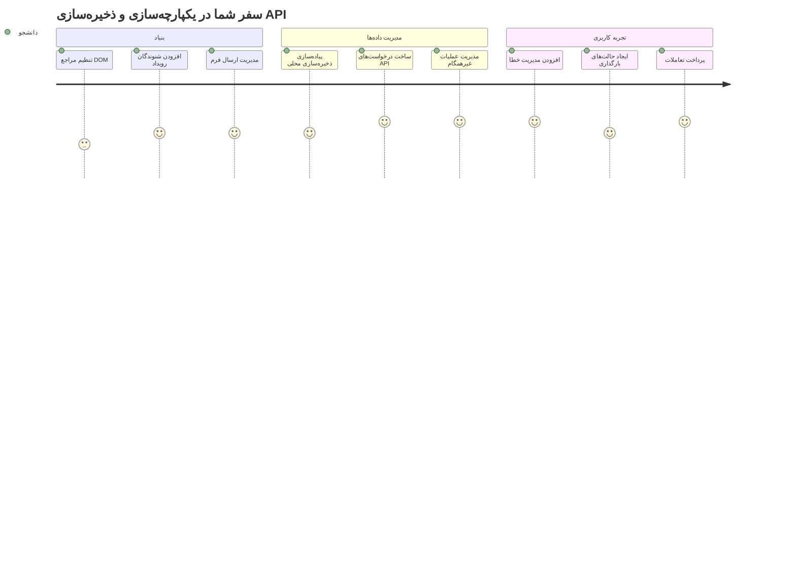
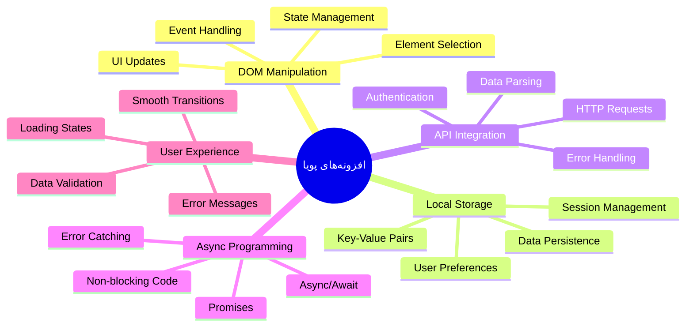
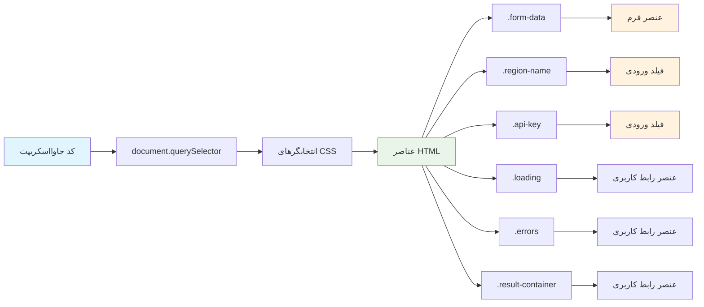
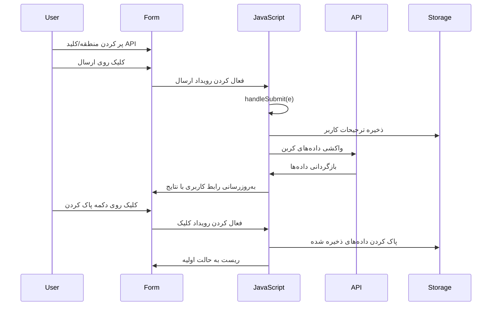
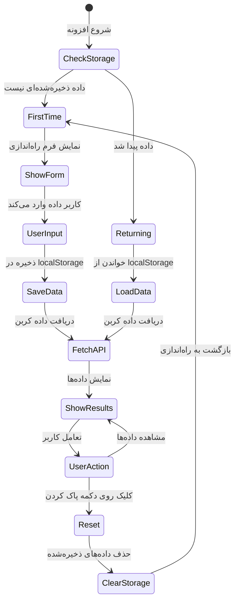
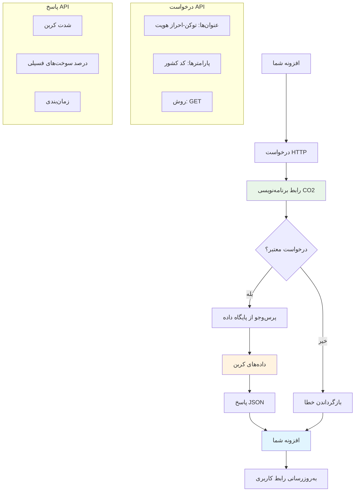
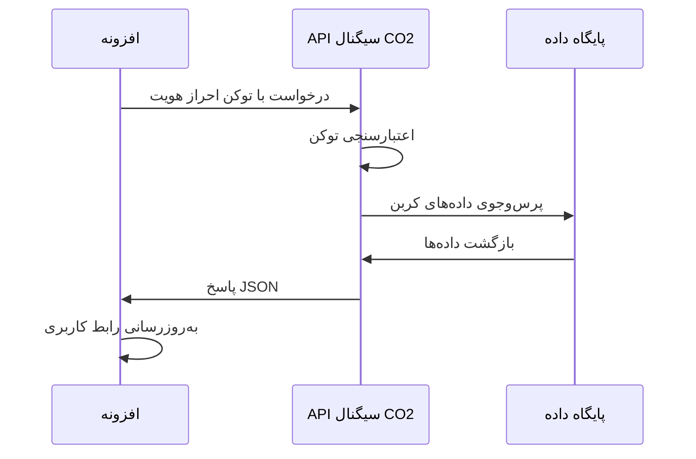
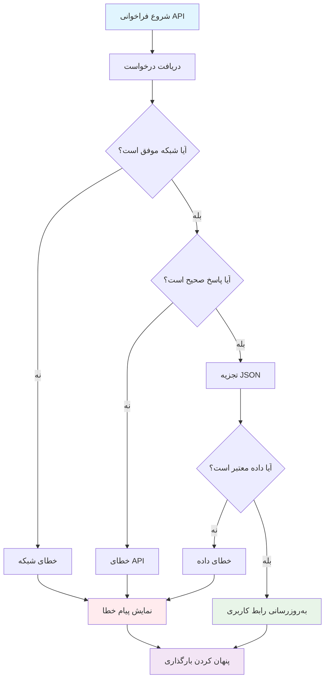
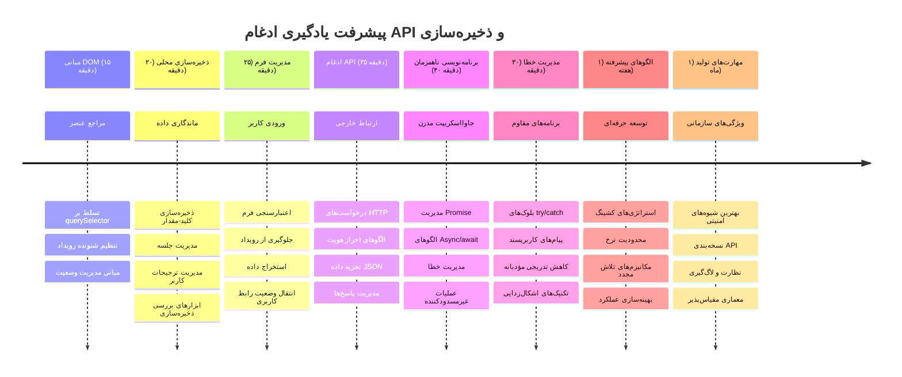

<!--
CO_OP_TRANSLATOR_METADATA:
{
  "original_hash": "2b6203a48c48d8234e0948353b47d84e",
  "translation_date": "2026-01-06T10:13:11+00:00",
  "source_file": "5-browser-extension/2-forms-browsers-local-storage/README.md",
  "language_code": "fa"
}
-->
# پروژه افزونه مرورگر بخش ۲: فراخوانی API، استفاده از ذخیره‌سازی محلی


## آزمون قبل از جلسه

[آزمون قبل از جلسه](https://ff-quizzes.netlify.app/web/quiz/25)

## مقدمه

یادت هست آن افزونه مرورگری که شروع به ساختش کردید؟ الان شما یک فرم زیبا دارید، اما در اصل ایستا است. امروز با وصل کردن آن به داده‌های واقعی و دادن حافظه به آن، آن را زنده می‌کنیم.

به کامپیوترهای مرکز کنترل مأموریت آپولو فکر کنید - آن‌ها فقط اطلاعات ثابت نمایش نمی‌دادند. آن‌ها به طور مداوم با فضاپیما ارتباط برقرار می‌کردند، با داده‌های تله‌متری به‌روزرسانی می‌شدند و پارامترهای حیاتی مأموریت را به خاطر می‌سپردند. چنین رفتار پویایی را امروز می‌سازیم. افزونه شما به اینترنت متصل خواهد شد، داده‌های واقعی محیطی را می‌گیرد و تنظیمات شما را برای دفعه بعد به خاطر می‌سپارد.

ادغام API ممکن است پیچیده به نظر برسد، اما در واقع فقط آموزش کد شما است تا به سایر سرویس‌ها ارتباط برقرار کند. چه داده هواشناسی را فراخوانی کنید، چه فیدهای شبکه‌های اجتماعی یا اطلاعات ردپای کربن مانند کاری که امروز انجام می‌دهیم، همه درباره برقراری این ارتباطات دیجیتال است. همچنین بررسی می‌کنیم که چگونه مرورگرها می‌توانند اطلاعات را حفظ کنند - مثل کتابخانه‌هایی که از کارت‌های کاتالوگ برای به خاطر سپردن جای کتاب‌ها استفاده کرده‌اند.

تا پایان این درس، یک افزونه مرورگر خواهید داشت که داده واقعی می‌گیرد، ترجیحات کاربر را ذخیره می‌کند و تجربه‌ای روان فراهم می‌آورد. بیایید شروع کنیم!


✅ بخش‌های شماره‌گذاری شده را در فایل‌های مربوط دنبال کنید تا بدانید کد خود را کجا قرار دهید.

## تنظیم عناصر برای دستکاری در افزونه

قبل از اینکه جاوااسکریپت بتواند رابط کاربری را دستکاری کند، به ارجاع به عناصر HTML خاص نیاز دارد. این شبیه تلسکوپی است که باید به ستارگان خاصی اشاره کند - قبل از اینکه گالیله بتواند قمرهای مشتری را بررسی کند، باید مشتری را پیدا و روی آن فوکوس کند.

در فایل `index.js`، متغیرهای `const` می‌سازیم که ارجاعات به هر عنصر مهم فرم را ذخیره می‌کنند. این مانند علامت‌گذاری تجهیزات توسط دانشمندان است - به جای جستجو در کل آزمایشگاه هر بار، می‌توانند مستقیم به آنچه نیاز دارند دسترسی پیدا کنند.


```javascript
// فیلدهای فرم
const form = document.querySelector('.form-data');
const region = document.querySelector('.region-name');
const apiKey = document.querySelector('.api-key');

// نتایج
const errors = document.querySelector('.errors');
const loading = document.querySelector('.loading');
const results = document.querySelector('.result-container');
const usage = document.querySelector('.carbon-usage');
const fossilfuel = document.querySelector('.fossil-fuel');
const myregion = document.querySelector('.my-region');
const clearBtn = document.querySelector('.clear-btn');
```

**کار این کد چیست:**
- **دریافت می‌کند** عناصر فرم را با `document.querySelector()` با استفاده از سلکتورهای کلاس CSS  
- **ایجاد** ارجاعات به فیلدهای ورودی نام منطقه و کلید API  
- **برقرار می‌کند** ارتباط با عناصر نمایش نتایج برای داده‌های مصرف کربن  
- **تنظیم** دسترسی به عناصر UI مثل نشانگرهای بارگذاری و پیام‌های خطا  
- **ذخیره** هر ارجاع عنصر در متغیر `const` برای استفاده آسان در کل کد

## افزودن شنونده رویدادها

حالا افزونه شما به واکنش به اعمال کاربر می‌پردازد. شنونده‌های رویداد راهی برای کد شما هستند تا تعاملات کاربر را نظارت کنند. آن‌ها مثل اپراتورهای قدیمی مراکز تلفن هستند که به تماس‌های ورودی گوش می‌دادند و وقتی کسی می‌خواست ارتباط برقرار کند، مدارهای مناسب را وصل می‌کردند.


```javascript
form.addEventListener('submit', (e) => handleSubmit(e));
clearBtn.addEventListener('click', (e) => reset(e));
init();
```

**درک این مفاهیم:**
- **اضافه کردن** شنونده ارسال فرم که وقتی کاربر Enter می‌زند یا ارسال را کلیک می‌کند فعال شود  
- **وصل کردن** شنونده کلیک به دکمه پاک کردن برای تنظیم مجدد فرم  
- **ارسال** شیء رویداد `(e)` به توابع هندلر برای کنترل بیشتر  
- **فراخوانی** فوری تابع `init()` برای راه‌اندازی وضعیت اولیه افزونه

✅ توجه کنید که از سینتکس فانکشن پیکانی (arrow function) استفاده شده که رویکرد مدرن‌تری نسبت به توابع سنتی است، اما هر دو به خوبی کار می‌کنند!

### 🔄 **بررسی آموزشی**
**درک هندلینگ رویداد**: قبل از رفتن به راه‌اندازی، اطمینان حاصل کنید که میتوانید:  
- ✅ توضیح دهید چگونه `addEventListener` اعمال کاربر را به توابع جاوااسکریپت وصل می‌کند  
- ✅ بفهمید چرا شیء رویداد `(e)` به هندلرها ارسال می‌شود  
- ✅ تفاوت رویدادهای `submit` و `click` را درک کنید  
- ✅ شرح دهید چه زمانی و چرا تابع `init()` اجرا می‌شود  

**خودآزمونی سریع**: اگر `e.preventDefault()` در ارسال فرم را فراموش کنید چه اتفاقی می‌افتد؟  
*پاسخ: صفحه رفرش می‌شود و تمام وضعیت جاوااسکریپت از دست می‌رود و تجربه کاربری قطع می‌شود*

## ساخت توابع مقداردهی اولیه و بازنشانی

بیایید منطق مقداردهی اولیه افزونه را ایجاد کنیم. تابع `init()` مثل سیستم ناوبری یک کشتی است که ابزارهای خود را چک می‌کند - وضعیت جاری را تعیین کرده و رابط را مطابق آن تنظیم می‌کند. این تابع بررسی می‌کند آیا کسی قبلاً افزونه شما را استفاده کرده و تنظیمات قبلی را بارگذاری می‌کند.

تابع `reset()` به کاربران اجازه شروع تازه می‌دهد - شبیه به نحوه‌ای که دانشمندان بین آزمایش‌ها ابزارهای خود را بازتنظیم می‌کنند تا داده تمیز داشته باشند.

```javascript
function init() {
	// بررسی کنید که آیا کاربر قبلاً اطلاعات اعتبار API را ذخیره کرده است
	const storedApiKey = localStorage.getItem('apiKey');
	const storedRegion = localStorage.getItem('regionName');

	// تنظیم آیکون افزونه به رنگ سبز عمومی (موقتی برای درس آینده)
	// TODO: پیاده‌سازی به‌روزرسانی آیکون در درس بعدی

	if (storedApiKey === null || storedRegion === null) {
		// کاربر بار اول: نمایش فرم راه‌اندازی
		form.style.display = 'block';
		results.style.display = 'none';
		loading.style.display = 'none';
		clearBtn.style.display = 'none';
		errors.textContent = '';
	} else {
		// کاربر بازگشتی: بارگذاری خودکار داده‌های ذخیره شده
		displayCarbonUsage(storedApiKey, storedRegion);
		results.style.display = 'none';
		form.style.display = 'none';
		clearBtn.style.display = 'block';
	}
}

function reset(e) {
	e.preventDefault();
	// پاک‌کردن منطقه ذخیره‌شده برای اجازه انتخاب مکان جدید توسط کاربر
	localStorage.removeItem('regionName');
	// راه‌اندازی مجدد فرایند مقداردهی اولیه
	init();
}
```

**گام‌های انجام شده اینجا:**
- **داده‌های ذخیره شده کلید API و منطقه را از ذخیره‌سازی محلی مرورگر بازیابی می‌کند**  
- **بررسی می‌کند که آیا کاربر برای اولین بار است یا قبلاً داده داشته**  
- **فرم راه‌اندازی را برای کاربران جدید نمایش می‌دهد و دیگر عناصر رابط را مخفی می‌کند**  
- **داده‌های ذخیره شده را برای کاربران قدیمی بارگذاری کرده و گزینه بازنشانی را نمایش می‌دهد**  
- **وضعیت رابط کاربری را بر اساس داده‌های موجود مدیریت می‌کند**

**مفاهیم کلیدی درباره ذخیره‌سازی محلی:**
- **داده بین جلسات مرورگر حفظ می‌شود** (برخلاف session storage)  
- **داده‌ها به صورت جفت کلید-مقدار با `getItem()` و `setItem()` ذخیره می‌شوند**  
- **اگر داده‌ای برای کلید مورد نظر نباشد `null` برمی‌گردد**  
- **راه ساده‌ای برای به خاطر سپردن ترجیحات و تنظیمات کاربر فراهم می‌کند**

> 💡 **درک ذخیره‌سازی مرورگر**: [LocalStorage](https://developer.mozilla.org/docs/Web/API/Window/localStorage) مثل دادن حافظه ماندگار به افزونه شما است. به نحوه ذخیره‌سازی طومارهای کتابخانه اسکندریه قدیم فکر کنید – اطلاعات حتی وقتی دانشمندان می‌رفتند و برمی‌گشتند هم در دسترس می‌ماند.  
>  
> **ویژگی‌های کلیدی:**  
> - **داده حتی پس از بستن مرورگر حفظ می‌شود**  
> - **در راه‌اندازی مجدد کامپیوتر و کرش مرورگر باقی می‌ماند**  
> - **فضای ذخیره قابل توجهی برای ترجیحات کاربر ارائه می‌دهد**  
> - **دسترسی فوری بدون تأخیر شبکه فراهم می‌کند**

> **نکته مهم**: افزونه مرورگر شما ذخیره‌سازی محلی مستقل خود را دارد که جدا از صفحات وب معمولی است. این باعث امنیت و جلوگیری از تداخل با سایت‌های دیگر می‌شود.

می‌توانید داده‌های ذخیره شده خود را با باز کردن ابزارهای توسعه مرورگر (F12)، رفتن به تب **Application** و گسترش بخش **Local Storage** مشاهده کنید.




> ⚠️ **ملاحظات امنیتی**: در برنامه‌های واقعی، ذخیره کلیدهای API در LocalStorage ریسک امنیتی دارد چون جاوااسکریپت به این داده‌ها دسترسی دارد. برای اهداف آموزشی این روش خوب است، اما برنامه‌های واقعی باید از ذخیره امن سمت سرور برای اطلاعات حساس استفاده کنند.

## مدیریت ارسال فرم

حالا مدیریت کنیم وقتی کسی فرم شما را ارسال می‌کند چه اتفاقی می‌افتد. به طور پیش‌فرض مرورگرها صفحه را رفرش می‌کنند، ولی ما این رفتار را قطع می‌کنیم تا تجربه روان‌تری بسازیم.

این رویکرد شبیه به نحوه مدیریت ارتباطات فضاپیما توسط کنترل مأموریت است - به جای بازنشانی کل سیستم برای هر انتقال، عملیات مداوم حفظ شده و اطلاعات جدید پردازش می‌شود.

تابعی بسازید که رویداد ارسال فرم را گرفته و ورودی کاربر را استخراج کند:

```javascript
function handleSubmit(e) {
	e.preventDefault();
	setUpUser(apiKey.value, region.value);
}
```

**در کد بالا:**
- **از رفتار پیش‌فرض ارسال فرم که صفحه را رفرش می‌کند جلوگیری می‌کند**  
- **مقادیر ورودی کاربر از فیلدهای کلید API و منطقه دریافت می‌کند**  
- **داده فرم را به تابع `setUpUser()` برای پردازش می‌فرستد**  
- **رفتار تک صفحه‌ای را با جلوگیری از رفرش حفظ می‌کند**

✅ دقت کنید که فیلدهای فرم HTML شما صفت `required` دارند، پس مرورگر به طور خودکار اعتبارسنجی می‌کند که کاربر هر دو کلید API و منطقه را وارد کرده است قبل از اجرای این تابع.

## تنظیم ترجیحات کاربر

تابع `setUpUser` مسئول ذخیره اعتبارنامه‌های کاربر و شروع اولین فراخوانی API است. این یک گذار روان از تنظیمات به نمایش نتایج ایجاد می‌کند.

```javascript
function setUpUser(apiKey, regionName) {
	// ذخیره اطلاعات کاربری برای جلسات آینده
	localStorage.setItem('apiKey', apiKey);
	localStorage.setItem('regionName', regionName);
	
	// به‌روزرسانی رابط کاربری برای نمایش حالت بارگذاری
	loading.style.display = 'block';
	errors.textContent = '';
	clearBtn.style.display = 'block';
	
	// دریافت داده‌های مصرف کربن با اطلاعات کاربری کاربر
	displayCarbonUsage(apiKey, regionName);
}
```

**گام به گام در اینجا:**
- **کلید API و نام منطقه را در ذخیره‌سازی محلی برای استفاده بعدی ذخیره می‌کند**  
- **نمایش نشانگر بارگذاری برای اطلاع‌رسانی به کاربر که داده دریافت می‌شود**  
- **پاک کردن پیام‌های خطای قبلی از نمایش**  
- **نمایش دکمه پاک کردن برای بازنشانی تنظیمات توسط کاربر**  
- **شروع فراخوانی API برای دریافت داده واقعی مصرف کربن**

این تابع تجربه کاربری یکنواختی با مدیریت هر دو جنبه حفظ داده و به‌روز رسانی رابط کاربری ایجاد می‌کند.

## نمایش داده مصرف کربن

حالا افزونه شما را به منابع داده خارجی با استفاده از APIها وصل می‌کنیم. این افزونه را از ابزار مستقل به چیزی تبدیل می‌کند که می‌تواند اطلاعات لحظه‌ای از سراسر اینترنت دریافت کند.

**درک API ها**

[APIها](https://www.webopedia.com/TERM/A/API.html) راه ارتباط برنامه‌های مختلف با یکدیگر هستند. آن‌ها شبیه سیستم تلگرافی هستند که شهرهای دور را در قرن نوزدهم متصل می‌کرد - اپراتورها درخواست‌هایی به ایستگاه‌های دور می‌فرستادند و پاسخ‌هایی با اطلاعات خواسته شده می‌گرفتند. هر بار که شبکه‌های اجتماعی را چک می‌کنید، از دستیار صوتی سوال می‌پرسید یا از اپ تحویل سفارش استفاده می‌کنید، API‌ها این مبادلات داده را ممکن می‌سازند.


**مفاهیم کلیدی درباره REST API ها:**
- **REST مخفف 'Representational State Transfer' است**  
- **از روش‌های استاندارد HTTP (GET، POST، PUT، DELETE) برای تعامل با داده استفاده می‌کند**  
- **داده را در قالب‌های قابل پیش‌بینی، معمولاً JSON، باز می‌گرداند**  
- **نقاط پایانی URL-محور سازگار برای انواع مختلف درخواست‌ها فراهم می‌کند**

✅ [API سیگنال CO2](https://www.co2signal.com/) که استفاده می‌کنیم، داده لحظه‌ای شدت کربن از شبکه‌های برق سراسر جهان را ارائه می‌دهد. این به کاربران کمک می‌کند اثر زیست‌محیطی مصرف برق خود را درک کنند!

> 💡 **درک جاوااسکریپت ناهمزمان (Asynchronous)**: کلیدواژه [`async`](https://developer.mozilla.org/docs/Web/JavaScript/Reference/Statements/async_function) به کد شما اجازه می‌دهد عملیات چندگانه را به طور همزمان مدیریت کند. وقتی داده از سرور درخواست می‌کنید، نمی‌خواهید کل افزونه فریز شود - این مثل کنترل ترافیک هوایی است که همه عملیات را متوقف کند تا یک هواپیما جواب بدهد.  
>  
> **مزایای کلیدی:**  
> - **حفظ پاسخ‌گویی افزونه در هنگام بارگذاری داده**  
> - **اجازه به سایر کدها برای ادامه اجرا در هنگام درخواست شبکه**  
> - **خوانایی بهتر کد نسبت به الگوهای callback سنتی**  
> - **امکان مدیریت خطا به صورت شیک هنگام بروز مشکلات شبکه**

یک ویدئوی کوتاه درباره `async`:

[](https://youtube.com/watch?v=YwmlRkrxvkk "Async and Await for managing promises")

> 🎥 برای دیدن ویدئو در مورد async/await روی تصویر بالا کلیک کنید.

### 🔄 **بررسی آموزشی**
**درک برنامه‌نویسی ناهمزمان**: قبل از ورود به تابع API، اطمینان حاصل کنید که می‌دانید:  
- ✅ چرا از `async/await` به جای مسدود کردن کل افزونه استفاده می‌کنیم  
- ✅ چگونه بلوک‌های `try/catch` خطاهای شبکه را به صورت شیک مدیریت می‌کنند  
- ✅ تفاوت عملیات‌های همزمان و ناهمزمان چیست  
- ✅ چرا تماس‌های API ممکن است شکست بخورند و چگونه این شکست‌ها را مدیریت کنیم  

**ارتباط با دنیای واقعی**: این مثال‌های روزمره را در نظر بگیرید:  
- **سفارش غذا**: کنار آشپزخانه نمی‌مانید - رسید می‌گیرید و به کارهای دیگر می‌پردازید  
- **ارسال ایمیل‌ها**: برنامه ایمیل هنگامی که ایمیل می‌فرستد فریز نمی‌شود - می‌توانید ایمیل‌های بیشتری بنویسید  
- **بارگذاری صفحات وب**: تصاویر به‌تدریج بارگذاری می‌شوند در حالی که شما از قبل می‌توانید متن را بخوانید  

**روند احراز هویت API**:  

تابع ایجاد کنید که داده مصرف کربن را فراخوانی و نمایش دهد:

```javascript
// روش مدرن API fetch (نیازی به وابستگی‌های خارجی ندارد)
async function displayCarbonUsage(apiKey, region) {
	try {
		// دریافت داده‌های شدت کربن از API سیگنال CO2
		const response = await fetch('https://api.co2signal.com/v1/latest', {
			method: 'GET',
			headers: {
				'auth-token': apiKey,
				'Content-Type': 'application/json'
			},
			// افزودن پارامترهای پرس‌وجو برای منطقه خاص
			...new URLSearchParams({ countryCode: region }) && {
				url: `https://api.co2signal.com/v1/latest?countryCode=${region}`
			}
		});

		// بررسی اینکه آیا درخواست API با موفقیت انجام شده است
		if (!response.ok) {
			throw new Error(`API request failed: ${response.status}`);
		}

		const data = await response.json();
		const carbonData = data.data;

		// محاسبه مقدار گرد شده شدت کربن
		const carbonIntensity = Math.round(carbonData.carbonIntensity);

		// به‌روزرسانی رابط کاربری با داده‌های دریافت شده
		loading.style.display = 'none';
		form.style.display = 'none';
		myregion.textContent = region.toUpperCase();
		usage.textContent = `${carbonIntensity} grams (grams CO₂ emitted per kilowatt hour)`;
		fossilfuel.textContent = `${carbonData.fossilFuelPercentage.toFixed(2)}% (percentage of fossil fuels used to generate electricity)`;
		results.style.display = 'block';

		// TODO: calculateColor(carbonIntensity) - در درس بعدی پیاده‌سازی شود

	} catch (error) {
		console.error('Error fetching carbon data:', error);
		
		// نمایش پیام خطای دوست‌داشتنی برای کاربر
		loading.style.display = 'none';
		results.style.display = 'none';
		errors.textContent = 'Sorry, we couldn\'t fetch data for that region. Please check your API key and region code.';
	}
}
```
  
**شرح کارهای انجام شده:**
- **استفاده از API مدرن `fetch()` به جای کتابخانه‌های خارجی مانند Axios برای کدی تمیز و بدون وابستگی**  
- **پیاده‌سازی کنترل خطا مناسب با `response.ok` برای شناسایی سریع شکست API**  
- **مدیریت عملیات ناهمزمان با `async/await` برای جریان کد قابل خواندن‌تر**  
- **احراز هویت با API سیگنال CO2 با استفاده از هدر `auth-token`**  
- **تجزیه داده‌های پاسخ JSON و استخراج اطلاعات شدت کربن**  
- **به‌روزرسانی چند عنصر رابط کاربری با داده‌های زیست‌محیطی فرمت شده**  
- **ارائه پیام‌های خطای کاربرپسند در صورت شکست فراخوانی API**

**مفاهیم مدرن جاوااسکریپت نشان داده شده:**
- **استفاده از قالب‌بندی رشته با `${}` برای کد تمیز**  
- **مدیریت خطا با بلوک try/catch برای برنامه‌های مقاوم**  
- **الگوی async/await برای مدیریت درخواست‌های شبکه به شکلی زیبا**  
- **بازپیرایی شیء برای استخراج داده‌های خاص از پاسخ API**  
- **زنجیره‌سازی متدها برای چندین تغییر در DOM**

✅ این تابع چندین مفهوم مهم توسعه وب را نشان می‌دهد - ارتباط با سرورهای خارجی، مدیریت احراز هویت، پردازش داده، به‌روزرسانی رابط و مدیریت خطاها به صورت حرفه‌ای. این‌ها مهارت‌های بنیادینی هستند که توسعه‌دهندگان حرفه‌ای مرتباً استفاده می‌کنند.


### 🔄 **بررسی آموزشی**
**درک کامل سیستم**: تسلط خود بر کل جریان را بررسی کنید:  
- ✅ چگونه ارجاعات DOM به جاوااسکریپت اجازه کنترل رابط را می‌دهد  
- ✅ چرا ذخیره‌سازی محلی بین جلسات مرورگر ماندگاری ایجاد می‌کند  
- ✅ چگونه async/await امکان فراخوانی API بدون مسدود کردن افزونه را می‌دهد  
- ✅ وقتی فراخوانی API شکست می‌خورد چه اتفاقی می‌افتد و چگونه خطاها مدیریت می‌شوند  
- ✅ چرا تجربه کاربر شامل وضعیت‌های بارگذاری و پیام‌های خطا است  

🎉 **آنچه به دست آوردید:** شما یک افزونه مرورگر ساختید که:  
- **به اینترنت وصل می‌شود و داده محیطی واقعی را دریافت می‌کند**  
- **تنظیمات کاربر را بین جلسات حفظ می‌کند**  
- **خطاها را به صورت زیبا مدیریت می‌کند بجای کرش کردن**  
- **تجربه کاربری روان و حرفه‌ای فراهم می‌کند**

کار خود را با اجرای `npm run build` و رفرش افزونه در مرورگر تست کنید. اکنون یک ترکر ردپای کربن عملیاتی دارید. درس بعدی عملکرد آیکون پویا را اضافه می‌کند تا افزونه تکمیل شود.

---

## چالش GitHub Copilot Agent 🚀

از حالت Agent استفاده کنید تا چالش زیر را کامل کنید:
**توضیحات:** افزونه مرورگر را با افزودن بهبودهای مدیریت خطا و ویژگی‌های تجربه کاربری ارتقا دهید. این چالش به شما کمک می‌کند تا با کار کردن با APIها، ذخیره‌سازی محلی و دستکاری DOM با استفاده از الگوهای مدرن جاوااسکریپت تمرین کنید.

**دستور:** نسخه ارتقا یافته تابع displayCarbonUsage را ایجاد کنید که شامل موارد زیر باشد: 1) یک مکانیزم تکرار برای درخواست‌های API ناموفق با پس‌زمینه نمایی، 2) اعتبارسنجی ورودی برای کد منطقه قبل از انجام درخواست API، 3) انیمیشن بارگذاری با شاخص‌های پیشرفت، 4) کش کردن پاسخ‌های API در localStorage با زمان انقضا (کش به مدت ۳۰ دقیقه)، و 5) بخشی برای نمایش داده‌های تاریخی از تماس‌های قبلی API. همچنین نظرات JSDoc به سبک TypeScript برای مستندسازی تمامی پارامترهای تابع و نوع بازگشتی اضافه کنید.

برای یادگیری بیشتر در مورد [حالت agent](https://code.visualstudio.com/blogs/2025/02/24/introducing-copilot-agent-mode) اینجا را ببینید.

## 🚀 چالش

درک خود را از APIها گسترش دهید با کاوش در مجموعه گسترده‌ای از APIهای مبتنی بر مرورگر که برای توسعه وب در دسترس هستند. یکی از این APIهای مرورگر را انتخاب کرده و یک نمونه نمایش کوچک بسازید:

- [API مکان‌یابی](https://developer.mozilla.org/docs/Web/API/Geolocation_API) - دریافت موقعیت فعلی کاربر
- [API اعلان‌ها](https://developer.mozilla.org/docs/Web/API/Notifications_API) - ارسال اعلان‌های دسکتاپ
- [API کشیدن و رها کردن HTML](https://developer.mozilla.org/docs/Web/API/HTML_Drag_and_Drop_API) - ایجاد رابط‌های تعاملی کشیدن
- [API ذخیره‌سازی وب](https://developer.mozilla.org/docs/Web/API/Web_Storage_API) - تکنیک‌های پیشرفته ذخیره‌سازی محلی
- [API فراخوانی Fetch](https://developer.mozilla.org/docs/Web/API/Fetch_API) - جایگزین مدرن XMLHttpRequest

**سؤالات پژوهشی برای بررسی:**
- این API چه مشکلات دنیای واقعی را حل می‌کند؟
- این API چگونه خطاها و موارد لبه‌ای را مدیریت می‌کند؟
- چه ملاحظات امنیتی هنگام استفاده از این API وجود دارد؟
- این API در مرورگرهای مختلف چقدر پشتیبانی می‌شود؟

پس از تحقیق، مشخص کنید چه ویژگی‌هایی یک API را کاربرپسند و قابل اعتماد می‌کند.

## آزمون پس از درس

[آزمون پس از درس](https://ff-quizzes.netlify.app/web/quiz/26)

## مرور و مطالعه خودآموز

در این درس شما درباره LocalStorage و APIها یاد گرفتید، هر دوی این‌ها برای توسعه‌دهنده حرفه‌ای وب بسیار مفید هستند. آیا می‌توانید فکر کنید این دو چگونه با هم کار می‌کنند؟ فکر کنید چگونه یک وب‌سایت طراحی می‌کنید که اقلامی را برای استفاده توسط یک API ذخیره کند.

### ⚡ **کاری که می‌توانید در ۵ دقیقه بعد انجام دهید**
- [ ] تب Application در DevTools را باز کرده و localStorage هر وب‌سایتی را کاوش کنید
- [ ] یک فرم ساده HTML بسازید و اعتبارسنجی فرم در مرورگر را تست کنید
- [ ] تلاش کنید داده‌ها را با استفاده از localStorage در کنسول مرورگر ذخیره و بازیابی کنید
- [ ] داده‌های فرم ارسالی را با استفاده از تب Network بررسی کنید

### 🎯 **کاری که می‌توانید در این ساعت انجام دهید**
- [ ] آزمون پس از درس را تکمیل کنید و مفاهیم مدیریت فرم را درک کنید
- [ ] یک فرم افزونه مرورگر بسازید که ترجیحات کاربر را ذخیره کند
- [ ] اعتبارسنجی فرم در سمت کلاینت با پیام‌های خطای مفید پیاده‌سازی کنید
- [ ] استفاده از chrome.storage API برای ذخیره‌سازی داده افزونه تمرین کنید
- [ ] رابط کاربری‌ای بسازید که نسبت به تنظیمات ذخیره شده کاربر واکنش نشان دهد

### 📅 **ساخت افزونه در طول هفته**
- [ ] یک افزونه مرورگر کامل با عملکرد فرم بسازید
- [ ] گزینه‌های مختلف ذخیره‌سازی: محلی، همگام‌سازی و ذخیره‌سازی نشست را مسلط شوید
- [ ] ویژگی‌های پیشرفته فرم مانند تکمیل خودکار و اعتبارسنجی را پیاده‌سازی کنید
- [ ] قابلیت‌های وارد کردن/صادر کردن داده‌های کاربر را اضافه کنید
- [ ] افزونه خود را در مرورگرهای مختلف به طور کامل تست کنید
- [ ] تجربه کاربری و مدیریت خطا افزونه را بهبود دهید

### 🌟 **تسلط بر APIهای وب در ماه پیش رو**
- [ ] ساخت برنامه‌های پیچیده با استفاده از APIهای ذخیره‌سازی مرورگر
- [ ] یادگیری الگوهای توسعه آفلاین-اول
- [ ] مشارکت در پروژه‌های متن باز در زمینه پایداری داده‌ها
- [ ] تسلط بر توسعه با تمرکز بر حفظ حریم خصوصی و تطابق با GDPR
- [ ] ایجاد کتابخانه‌های قابل استفاده مجدد برای مدیریت فرم‌ها و داده‌ها
- [ ] به اشتراک‌گذاری دانش درباره APIهای وب و توسعه افزونه‌ها

## 🎯 جدول زمانی تسلط بر توسعه افزونه شما


### 🛠️ خلاصه ابزار توسعه فول‌استک شما

پس از اتمام این درس، موارد زیر را در اختیار دارید:
- **تسلط بر DOM**: هدف‌گیری دقیق و دستکاری عناصر
- **تخصص ذخیره‌سازی**: مدیریت داده‌های پایدار با localStorage
- **ادغام API**: واکشی داده‌های لحظه‌ای و احراز هویت
- **برنامه‌نویسی ناهمزمان**: عملیات غیر مسدودکننده با جاوااسکریپت مدرن
- **مدیریت خطا**: برنامه‌های قدرتمند که شکست‌ها را به خوبی مدیریت می‌کنند
- **تجربه کاربری**: وضعیت‌های بارگذاری، اعتبارسنجی و تعاملات روان
- **الگوهای مدرن**: API فراخوانی fetch، async/await، و ویژگی‌های ES6+

**مهارت‌های حرفه‌ای کسب‌شده**: الگوهایی که در موارد زیر استفاده می‌شوند را پیاده‌سازی کرده‌اید:
- **برنامه‌های وب**: اپلیکیشن‌های تک‌صفحه‌ای با منابع داده خارجی
- **توسعه موبایل**: اپ‌هایی مبتنی بر API با قابلیت‌های آفلاین
- **نرم‌افزار دسکتاپ**: اپ‌های Electron با ذخیره‌سازی پایدار
- **سیستم‌های سازمانی**: احراز هویت، کشینگ و مدیریت خطا
- **فریمورک‌های مدرن**: الگوهای مدیریت داده در React/Vue/Angular

**مرحله بعدی**: آماده‌اید که موضوعات پیشرفته مثل استراتژی‌های کشینگ، اتصال WebSocket در لحظه یا مدیریت پیشرفته حالت را کاوش کنید!

## تمرین

[یک API را انتخاب کنید](assignment.md)

---

<!-- CO-OP TRANSLATOR DISCLAIMER START -->
**توجه**:  
این سند با استفاده از سرویس ترجمه ماشینی هوش مصنوعی [Co-op Translator](https://github.com/Azure/co-op-translator) ترجمه شده است. در حالی که ما تلاش می‌کنیم ترجمه دقیق باشد، لطفاً توجه داشته باشید که ترجمه‌های خودکار ممکن است دارای خطاها یا نواقصی باشند. سند اصلی به زبان مبدأ باید به عنوان منبع معتبر در نظر گرفته شود. برای اطلاعات حساس، ترجمه حرفه‌ای انسانی توصیه می‌شود. ما مسئول هیچ گونه سوء تفاهم یا تفسیر نادرستی که از استفاده از این ترجمه ناشی شود، نیستیم.
<!-- CO-OP TRANSLATOR DISCLAIMER END -->