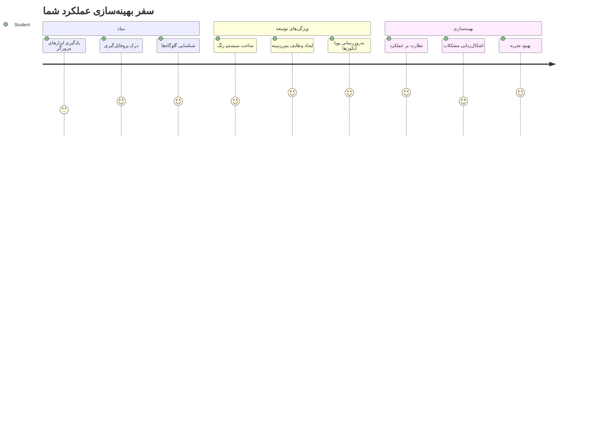
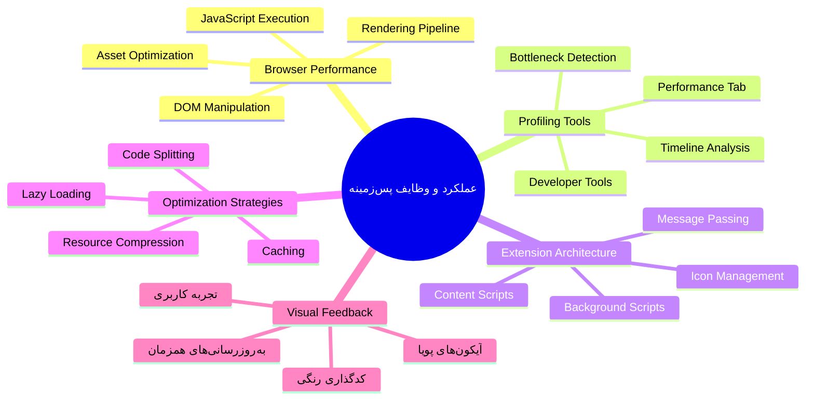
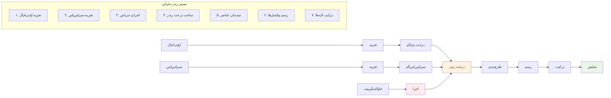
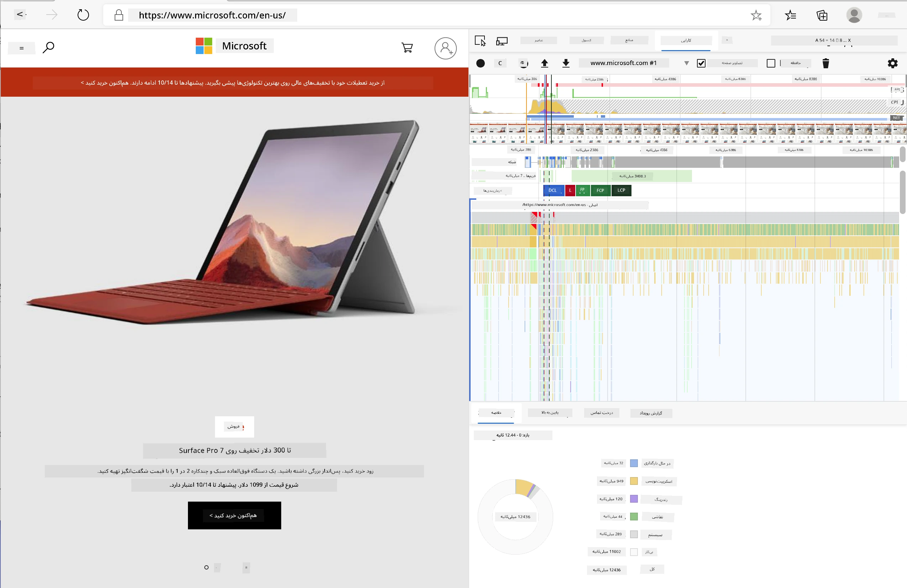
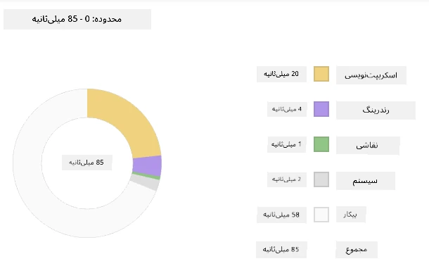
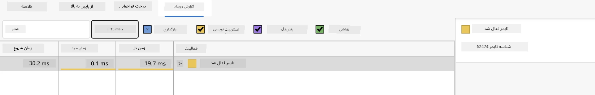
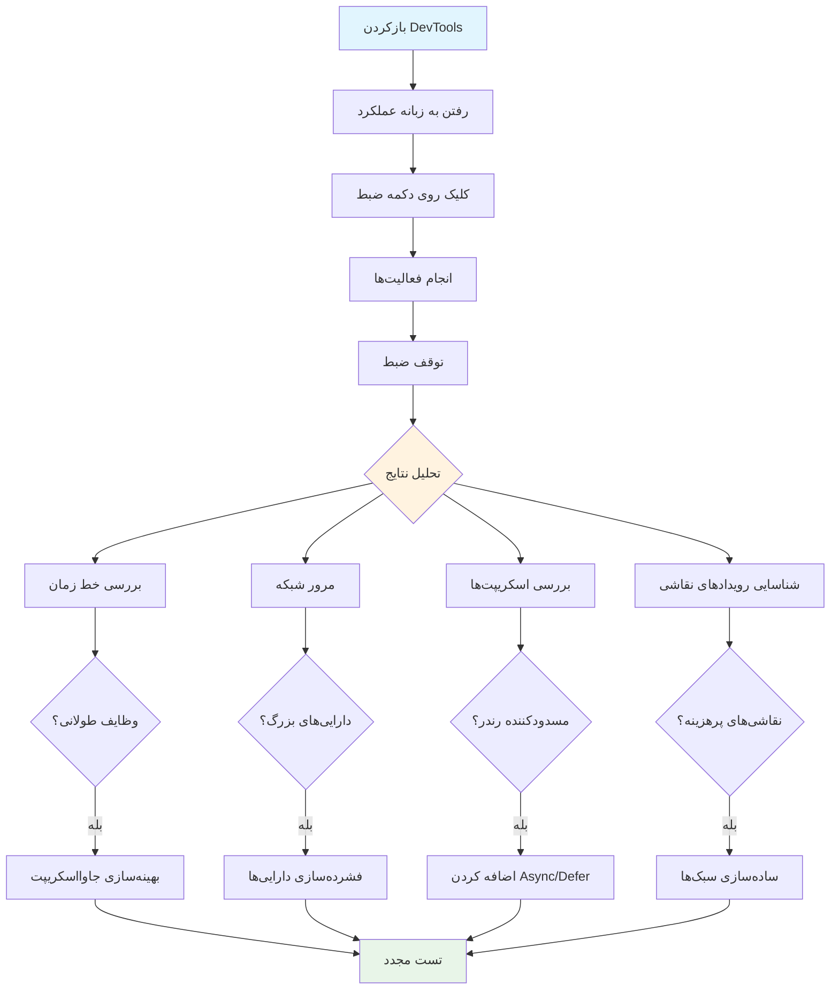
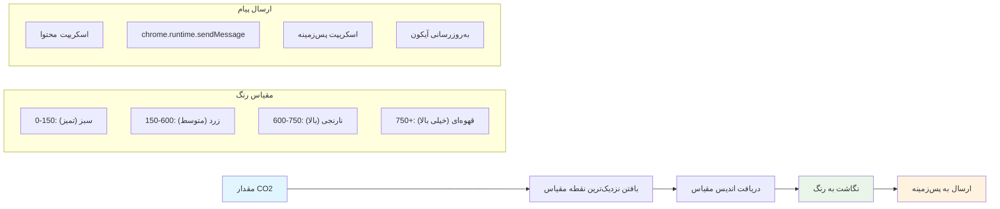
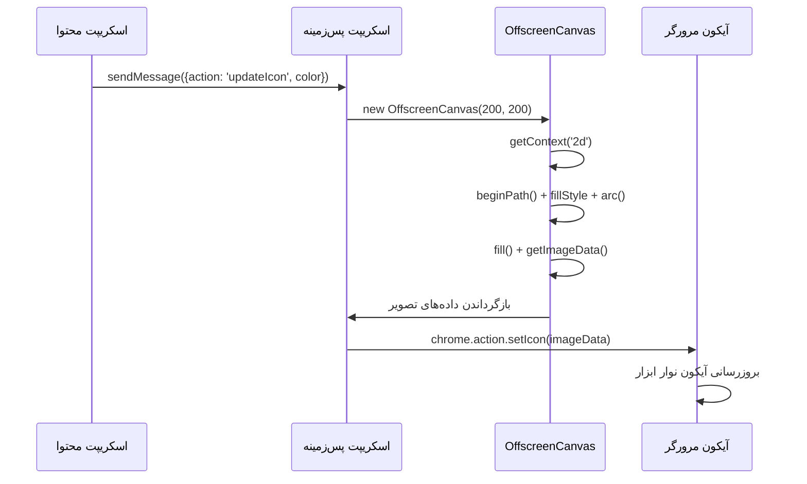
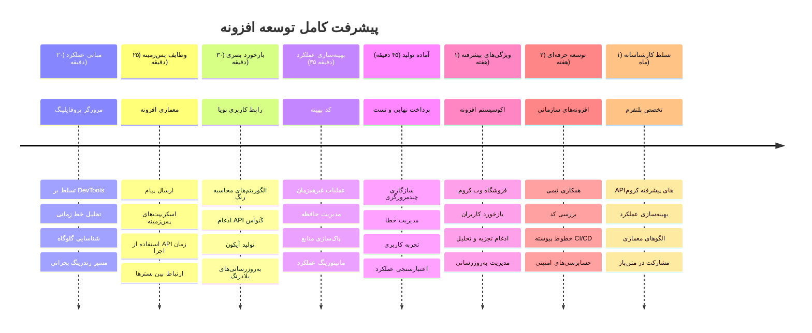

<!--
CO_OP_TRANSLATOR_METADATA:
{
  "original_hash": "b275fed2c6fc90d2b9b6661a3225faa2",
  "translation_date": "2026-01-06T10:15:54+00:00",
  "source_file": "5-browser-extension/3-background-tasks-and-performance/README.md",
  "language_code": "fa"
}
-->
# بخش سوم پروژه افزونه مرورگر: آشنایی با وظایف پس‌زمینه و عملکرد


تا به حال فکر کرده‌اید چه چیزی باعث می‌شود برخی افزونه‌های مرورگر سریع و پاسخگو به نظر برسند در حالی که برخی دیگر کند به نظر می‌رسند؟ راز در اتفاقاتی است که در پس‌زمینه رخ می‌دهد. در حالی که کاربران در رابط افزونه شما کلیک می‌کنند، دنیایی از فرایندهای پس‌زمینه به آرامی داده‌ها را بازیابی می‌کنند، آیکون‌ها را به‌روزرسانی می‌کنند و منابع سیستم را مدیریت می‌کنند.

این آخرین درس ما در سری افزونه مرورگر است و می‌خواهیم ردیاب رد پای کربن شما به خوبی کار کند. شما به روزرسانی‌های پویا برای آیکون اضافه خواهید کرد و می‌آموزید چگونه مشکلات عملکردی را قبل از تبدیل شدن به مشکل تشخیص دهید. این مثل تنظیم یک ماشین مسابقه است - بهینه‌سازی‌های کوچک می‌توانند تفاوت بزرگی در نحوه اجرای همه چیز ایجاد کنند.

وقتی کار ما تمام شد، شما یک افزونه صیقل یافته خواهید داشت و اصول عملکردی را که برنامه‌های وب خوب را از عالی جدا می‌کند، درک خواهید کرد. پس بیایید وارد دنیای بهینه‌سازی مرورگر شویم.

## آزمون پیش از جلسه

[آزمون پیش از جلسه](https://ff-quizzes.netlify.app/web/quiz/27)

### معرفی

در درس‌های قبلی، یک فرم ساختید، آن را به یک API متصل کردید و به بازیابی ناهمزمان داده‌ها پرداختید. افزونه شما به خوبی شکل گرفته است.

اکنون باید آخرین لمس‌ها را اضافه کنیم - مانند اینکه آیکون افزونه بر اساس داده‌های کربن رنگش تغییر کند. این من را یاد این می‌اندازد که ناسا چگونه باید هر سیستم در سفینه آپولو را بهینه می‌کرد. آنها نمی‌توانستند هیچ چرخه یا حافظه هدررفته‌ای را تحمل کنند چون جان‌ها به عملکرد بستگی داشت. در حالی که افزونه مرورگر ما به آن شدت حیاتی نیست، همان اصول صدق می‌کند - کد بهینه تجربه‌های کاربری بهتری ایجاد می‌کند.


## اصول اولیه عملکرد وب

وقتی کد شما کارآمد اجرا شود، مردم واقعا تفاوت را *احساس* می‌کنند. آن لحظه‌ای که یک صفحه فورا بارگذاری می‌شود یا یک انیمیشن روان اجرا می‌شود را می‌شناسید؟ این عملکرد خوب است.

عملکرد فقط به سرعت نیست - بلکه به ساخت تجربه‌های وبی برمی‌گردد که طبیعی به جای زمخت و ناامیدکننده احساس شوند. در روزهای اولیه محاسبات، گریس هاپر مشهور بود که یک نانوثانیه (قطعه‌ای از سیم به طول تقریبا سی سانتی‌متر) را روی میز خود نگه می‌داشت تا نشان دهد نور در یک میلیاردم ثانیه چقدر می‌پیماید. این راه او برای توضیح اهمیت هر میکروثانیه در محاسبه بود. بیایید ابزارهای کارآگاهانه‌ای را بررسی کنیم که به شما کمک می‌کنند بفهمید چه چیزی سرعت را کاهش می‌دهد.

> "عملکرد وب‌سایت درباره دو چیز است: سرعت بارگذاری صفحه و سرعت اجرای کد روی آن." -- [زک گراس‌بارت](https://www.smashingmagazine.com/2012/06/javascript-profiling-chrome-developer-tools/)

موضوع چگونگی ساخت وب‌سایت‌هایی با سرعت بسیار بالا روی انواع دستگاه‌ها، برای انواع کاربران، در انواع شرایط، به طرز قابل‌درک وسیع است. نکاتی که باید هنگام ساخت یک پروژه وب استاندارد یا افزونه مرورگر به خاطر داشته باشید، در اینجا آمده است.

اولین قدم در بهینه‌سازی سایت، درک آنچه واقعا در پشت صحنه اتفاق می‌افتد است. خوشبختانه، مرورگر شما ابزارهای قدرتمند کارآگاهی به صورت داخلی دارد.


برای باز کردن ابزارهای توسعه‌دهنده در Edge، روی آن سه نقطه در گوشه بالا سمت راست کلیک کنید، سپس به More Tools > Developer Tools بروید. یا از میانبر صفحه‌کلید استفاده کنید: `Ctrl` + `Shift` + `I` در ویندوز یا `Option` + `Command` + `I` در مک. وقتی وارد شدید، روی تب Performance کلیک کنید - اینجا جایی است که تحقیقات خود را انجام خواهید داد.

**در اینجا جعبه‌ابزار کارآگاه عملکرد شماست:**
- **باز کردن** ابزارهای توسعه‌دهنده (اینها را مدام به عنوان توسعه‌دهنده استفاده خواهید کرد!)
- **رفتن** به تب Performance - این را مثل ردیاب تناسب اندام اپلیکیشن وب خود تصور کنید
- **زدن** دکمه Record و دیدن عملکرد صفحه در عمل
- **بررسی** نتایج برای شناسایی عوامل کندی

بیایید این را امتحان کنیم. یک وب‌سایت باز کنید (Microsoft.com برای این کار خوب است) و روی دکمه 'Record' کلیک کنید. حالا صفحه را دوباره بارگذاری کنید و پروفایلر را مشاهده کنید که همه چیز را ثبت می‌کند. وقتی ضبط را متوقف کنید، تقسیم‌بندی دقیقی از چگونگی 'اجرای اسکریپت‌ها'، 'رندر' و 'نقاشی' سایت مشاهده خواهید کرد. این من را یاد کنترل ماموریت می‌اندازد که هر سیستم را در طول پرتاب راکت نظارت می‌کند - شما داده‌های زمان واقعی دقیق از اتفاقات و زمان وقوع آنها می‌گیرید.



✅ مستندات [مایکروسافت](https://docs.microsoft.com/microsoft-edge/devtools-guide/performance/?WT.mc_id=academic-77807-sagibbon) جزئیات بیشتری دارد اگر می‌خواهید عمیق‌تر وارد شوید

> نکته حرفه‌ای: قبل از تست، حافظه پنهان مرورگر خود را پاک کنید تا ببینید سایت شما برای بازدیدکنندگان اولین بار چگونه عمل می‌کند - معمولا بسیار متفاوت از بازدیدهای بعدی است!

قطعات مختلف جدول زمانی پروفایل را انتخاب کنید تا روی رویدادهایی که در هنگام بارگذاری صفحه روی می‌دهند زوم کنید.

با انتخاب بخشی از جدول زمانی پروفایل، نمای خلاصه‌ای از عملکرد صفحه را ببینید:



برای دیدن اینکه آیا رویدادی بیشتر از 15 میلی‌ثانیه طول کشیده است، پنل Event Log را بررسی کنید:



✅ با پروفایلر خود آشنا شوید! ابزارهای توسعه را روی این سایت باز کنید و ببینید آیا گلوگاه‌هایی وجود دارد یا خیر. کدام دارایی کندترین بارگذاری را دارد؟ سریع‌ترین چیست؟


## هنگام پروفایل‌گیری باید به چه چیزی توجه کنید

اجرای پروفایلر فقط شروع ماجرا است - مهارت واقعی دانستن این است که آن نمودارهای رنگی در واقع چه چیزی را به شما می‌گویند. نگران نباشید، شما به زودی یاد می‌گیرید آنها را بخوانید. توسعه‌دهندگان با تجربه علامت‌های هشدار را قبل از تبدیل‌شدن به مشکلات کامل تشخیص می‌دهند.

بیایید درباره مظنونان معمول - مشکلات عملکردی که معمولاً در پروژه‌های وب ظاهر می‌شوند صحبت کنیم. درست مثل اینکه ماری کوری باید سطح تشعشعات را در آزمایشگاهش به دقت کنترل می‌کرد، ما هم باید مراقب الگوهای خاصی باشیم که نشان‌دهنده مشکلات در حال شکل‌گیری هستند. تشخیص اینها زودهنگام، مقدار زیادی از ناامیدی شما (و کاربران شما) را کاهش می‌دهد.

**اندازه دارایی‌ها**: وب‌سایت‌ها در طول سال‌ها «سنگین‌تر» شده‌اند و بخش زیادی از وزن اضافه شده از تصاویر ناشی می‌شود. انگار که ما بیشتر و بیشتر را در چمدان‌های دیجیتالی خود می‌گذاریم.

✅ به [پایگاه اینترنتی اینترنت آرشیو](https://httparchive.org/reports/page-weight) مراجعه کنید تا ببینید اندازه صفحات چطور در طول زمان افزایش یافته - بسیار توضیح‌دهنده است.

**نحوه بهینه‌سازی دارایی‌ها:**
- **فشرده‌سازی** تصاویر! فرمت‌های مدرن مانند WebP می‌توانند حجم فایل‌ها را به شدت کاهش دهند
- **ارسال** اندازه مناسب تصویر برای هر دستگاه - نیازی نیست تصاویر بزرگ دسکتاپ به تلفن‌ها فرستاده شود
- **کوچک‌سازی** CSS و جاوااسکریپت شما - هر بایت مهم است
- **استفاده** از بارگذاری تنبل به طوری که تصاویر فقط وقتی که کاربران به آنها اسکرول می‌کنند دانلود شوند

**گشتن در DOM**: مرورگر برای ساخت مدل شیء سند (DOM) بر اساس کدی که می‌نویسید، باید کار کند، بنابراین در جهت عملکرد خوب صفحه باید تگ‌ها را به حداقل برسانید، فقط همان‌هایی را استفاده کرده و استایل بدهید که صفحه نیاز دارد. در این زمینه، CSS اضافی مرتبط با یک صفحه می‌تواند بهینه شود؛ مثلا استایل‌هایی که فقط باید روی یک صفحه استفاده شوند نیازی نیست در سبک‌نامه اصلی وارد شوند.

**راهبردهای کلیدی بهینه‌سازی DOM:**
- **کمینه‌سازی** تعداد اجزای HTML و سطوح تودرتو
- **حذف** قواعد CSS بدون استفاده و به صورت کارآمد ادغام استایل‌شیت‌ها
- **سازمان‌دهی** CSS برای بارگذاری فقط آنچه برای هر صفحه لازم است
- **ساختاربندی** HTML به صورت معنایی برای پارس بهتر مرورگر

**جاوااسکریپت**: هر توسعه‌دهنده جاوااسکریپتی باید مراقب اسکریپت‌های «مسدودکننده رندر» باشد که باید قبل از اینکه DOM کامل شود و نقاشی شود بارگذاری شوند. استفاده از `defer` با اسکریپت‌های درون‌خطی خود را در نظر بگیرید (مثل آنچه در ماژول Terrarium انجام می‌شود).

**تکنیک‌های مدرن بهینه‌سازی جاوااسکریپت:**
- **استفاده** از ویژگی `defer` برای بارگذاری اسکریپت‌ها پس از پارس DOM
- **اجرای** تقسیم کد به گونه‌ای که فقط جاوااسکریپت لازم بارگذاری شود
- **اعمال** بارگذاری تنبل برای عملکردهای غیر بحرانی
- **کمینه‌سازی** استفاده از کتابخانه‌ها و فریم‌ورک‌های سنگین در صورت امکان

✅ چند سایت را با استفاده از [سایت تست سرعت](https://www.webpagetest.org/) امتحان کنید تا بیشتر با بررسی‌های رایج برای تعیین عملکرد سایت آشنا شوید.

### 🔄 **بررسی آموزشی**
**درک عملکرد**: پیش از ساخت ویژگی‌های افزونه مطمئن شوید که می‌توانید:
- ✅ مسیر بحرانی رندر را از HTML تا پیکسل‌ها توضیح دهید
- ✅ گلوگاه‌های رایج عملکردی در اپلیکیشن‌های وب را شناسایی کنید
- ✅ از ابزارهای توسعه‌دهنده مرورگر برای پروفایل کردن عملکرد صفحه استفاده کنید
- ✅ بفهمید چگونه اندازه دارایی‌ها و پیچیدگی DOM روی سرعت تأثیر می‌گذارد

**آزمون سریع خودارزیابی**: وقتی جاوااسکریپت مسدودکننده رندر دارید چه اتفاقی می‌افتد؟
*پاسخ: مرورگر باید ابتدا اسکریپت را دانلود و اجرا کند تا بتواند ادامه پارس کردن HTML و رندر صفحه را انجام دهد*

**تأثیر واقعی عملکرد:**
- **یک تأخیر 100 میلی‌ثانیه‌ای**: کاربران کاهش سرعت را متوجه می‌شوند
- **یک ثانیه تأخیر**: کاربران شروع به از دست دادن تمرکز می‌کنند
- **بیش از 3 ثانیه**: 40٪ کاربران صفحه را ترک می‌کنند
- **شبکه‌های موبایل**: عملکرد حتی مهم‌تر است

حالا که می‌دانید مرورگر چگونه دارایی‌هایی که می‌فرستید را رندر می‌کند، بیایید نگاهی به آخرین مراحل لازم برای تکمیل افزونه بیندازیم:

### نوشتن تابعی برای محاسبه رنگ

اکنون تابعی می‌نویسیم که داده‌های عددی را به رنگ‌های معنادار تبدیل کند. مانند سیستم چراغ راهنمایی – سبز برای انرژی پاک، قرمز برای شدت بالای کربن.

این تابع داده‌های CO2 از API ما می‌گیرد و تعیین می‌کند کدام رنگ بهترین نماینده تأثیر زیست‌محیطی است. مشابه نحوه استفاده دانشمندان از کدگذاری رنگ در نقشه‌های حرارتی برای نمایش الگوهای داده پیچیده - از دمای اقیانوس تا شکل‌گیری ستارگان. این کد را به `/src/index.js` پس از آن متغیرهای `const` که تعریف کردیم اضافه کنید:


```javascript
function calculateColor(value) {
	// تعریف مقیاس شدت CO2 (گرم بر کیلووات ساعت)
	const co2Scale = [0, 150, 600, 750, 800];
	// رنگ‌های متناظر از سبز (پاک) تا قهوه‌ای تیره (کربن بالا)
	const colors = ['#2AA364', '#F5EB4D', '#9E4229', '#381D02', '#381D02'];

	// یافتن نزدیک‌ترین مقدار مقیاس به ورودی ما
	const closestNum = co2Scale.sort((a, b) => {
		return Math.abs(a - value) - Math.abs(b - value);
	})[0];
	
	console.log(`${value} is closest to ${closestNum}`);
	
	// یافتن ایندکس برای نگاشت رنگ
	const num = (element) => element > closestNum;
	const scaleIndex = co2Scale.findIndex(num);

	const closestColor = colors[scaleIndex];
	console.log(scaleIndex, closestColor);

	// ارسال پیام به‌روزرسانی رنگ به اسکریپت پس‌زمینه
	chrome.runtime.sendMessage({ action: 'updateIcon', value: { color: closestColor } });
}
```

**اجزای این تابع هوشمندانه را بررسی کنیم:**
- **ایجاد** دو آرایه - یکی برای سطوح CO2، دیگری برای رنگ‌ها (سبز = پاک، قهوه‌ای = آلوده!)
- **یافتن** نزدیک‌ترین مقدار به CO2 واقعی با استفاده از مرتب‌سازی آرایه
- **گرفتن** رنگ متناسب با استفاده از متد findIndex()
- **ارسال** پیام به اسکریپت پس‌زمینه کروم با رنگ انتخاب‌شده
- **استفاده** از قالب‌بندی رشته‌ای template literals (همان بک‌تیک‌ها) برای کدنویسی تمیزتر
- **سازمان‌دهی** همه چیز با اعلام متغیرهای const

[API](https://developer.chrome.com/extensions/runtime) `chrome.runtime` مانند سیستم عصبی افزونه شماست - تمام ارتباطات و وظایف پشت‌صحنه را مدیریت می‌کند:

> "از chrome.runtime API برای بازیابی صفحه پس‌زمینه، بازگرداندن جزئیات درباره مانیفست، و گوش دادن و پاسخ به رویدادها در طول عمر برنامه یا افزونه استفاده کنید. همچنین می‌توانید از این API برای تبدیل مسیرهای نسبی URLها به URLهای کامل استفاده کنید."

**چرا API chrome.runtime اینقدر مفید است:**
- **اجازه** می‌دهد اجزای مختلف افزونه با یکدیگر ارتباط برقرار کنند
- **کارهای پس‌زمینه** را بدون مسدود کردن رابط کاربری انجام می‌دهد
- **رویدادهای چرخه عمر** افزونه شما را مدیریت می‌کند
- **ارسال پیام بین اسکریپت‌ها** را بسیار آسان می‌کند

✅ اگر این افزونه مرورگر را برای Edge توسعه می‌دهید، ممکن است برایتان جالب باشد که دارید از API کروم استفاده می‌کنید. نسخه‌های جدید مرورگر Edge بر اساس موتور مرورگر Chromium اجرا می‌شوند، پس می‌توانید از این ابزارها بهره ببرید.


> **نکته حرفه‌ای**: اگر می‌خواهید یک افزونه مرورگر را پروفایل کنید، ابزارهای توسعه را از داخل خود افزونه باز کنید، چون این یک نمونه مرورگر جداگانه است. این دسترسی به معیارهای عملکرد مخصوص افزونه را فراهم می‌کند.

### تعیین رنگ پیش‌فرض آیکون

قبل از شروع به دریافت داده واقعی، به افزونه خود یک نقطه شروع بدهیم. هیچ‌کس دوست ندارد به یک آیکون خالی یا شکسته نگاه کند. با رنگ سبز شروع می‌کنیم تا کاربر بداند افزونه از همان لحظه نصب کار می‌کند.

داخل تابع `init()`، رنگ سبز پیش‌فرض آیکون را تنظیم کنیم:

```javascript
chrome.runtime.sendMessage({
	action: 'updateIcon',
	value: {
		color: 'green',
	},
});
```

**این مقداردهی اولیه چه کاری انجام می‌دهد:**
- **تنظیم** رنگ سبز خنثی به عنوان وضعیت پیش‌فرض
- **ارائه** بازخورد بصری فوری هنگام بارگیری افزونه
- **ایجاد** الگوی ارتباط با اسکریپت پس‌زمینه
- **اطمینان** از اینکه کاربران قبل از بارگیری داده‌ها افزونه‌ای کارآمد می‌بینند

### فراخوانی تابع و اجرای آن

اکنون همه چیز را به هم وصل کنیم تا وقتی داده‌های تازه CO2 می‌آید، آیکون شما به طور خودکار با رنگ مناسب به‌روزرسانی شود. این مثل وصل کردن مدار نهایی در یک دستگاه الکترونیکی است - ناگهان همه اجزا به عنوان یک سیستم واحد کار می‌کنند.

این خط را درست پس از دریافت داده CO2 از API اضافه کنید:

```javascript
// پس از دریافت داده‌های CO2 از API
// اجازه دهید CO2 = data.data[0].intensity.actual;
calculateColor(CO2);
```

**این یکپارچه‌سازی انجام می‌دهد:**
- **متصل کردن** جریان داده API به سیستم نشانگر بصری
- **ایجاد** به‌روزرسانی آیکون خودکار وقتی داده جدید می‌رسد
- **ارائه** بازخورد بصری در زمان واقعی بر اساس شدت کربن جاری
- **حفظ** جداسازی وظایف دریافت داده و منطق نمایش

و در نهایت، در `/dist/background.js`، شنونده این تماس‌های پس‌زمینه را اضافه کنید:

```javascript
// گوش دادن به پیام‌ها از اسکریپت محتوایی
chrome.runtime.onMessage.addListener(function (msg, sender, sendResponse) {
	if (msg.action === 'updateIcon') {
		chrome.action.setIcon({ imageData: drawIcon(msg.value) });
	}
});

// رسم آیکون پویا با استفاده از API بوم
// گرفته شده از افزونه انرژی لالیپاپ - قابلیت خوب!
function drawIcon(value) {
	// ایجاد یک بوم خارج از صفحه برای عملکرد بهتر
	const canvas = new OffscreenCanvas(200, 200);
	const context = canvas.getContext('2d');

	// رسم یک دایره رنگی که شدت کربن را نشان می‌دهد
	context.beginPath();
	context.fillStyle = value.color;
	context.arc(100, 100, 50, 0, 2 * Math.PI);
	context.fill();

	// بازگرداندن داده‌های تصویر برای آیکون مرورگر
	return context.getImageData(50, 50, 100, 100);
}
```

**این اسکریپت پس‌زمینه چه کاری انجام می‌دهد:**
- **گوش دادن** به پیام‌ها از اسکریپت اصلی شما (مثل پذیرش تماس تلفنی در پذیرش)
- **پردازش** درخواست‌های 'updateIcon' برای تغییر آیکون نوار ابزار شما
- **ساختن** آیکون‌های جدید در لحظه با استفاده از Canvas API
- **کشیدن** یک دایره رنگی ساده که شدت کربن فعلی را نشان می‌دهد
- **به‌روزرسانی** نوار ابزار مرورگر شما با آیکون تازه
- **استفاده** از OffscreenCanvas برای عملکرد روان (بدون مسدود کردن UI)

✅ شما در درس‌های [بازی فضایی](../../6-space-game/2-drawing-to-canvas/README.md) بیشتر درباره Canvas API خواهید آموخت.


### 🔄 **بررسی آموزشی**
**درک کامل افزونه**: تسلط خود بر کل سیستم را تأیید کنید:
- ✅ انتقال پیام بین اسکریپت‌های مختلف افزونه چگونه کار می‌کند؟
- ✅ چرا برای عملکرد به جای Canvas معمولی از OffscreenCanvas استفاده می‌کنیم؟
- ✅ نقش API زمان اجرا کروم (Chrome Runtime API) در معماری افزونه چیست؟
- ✅ الگوریتم محاسبه رنگ چگونه داده‌ها را به بازخورد بصری نگاشت می‌کند؟

**ملاحظات عملکرد**: افزونه شما اکنون نمایش می‌دهد:
- **ارتباط مؤثر**: ارتباط تمیز بین زمینه‌های اسکریپت
- **رندر بهینه**: OffscreenCanvas از مسدود شدن رابط کاربری جلوگیری می‌کند
- **به‌روزرسانی در زمان واقعی**: تغییرات پویا در آیکون بر اساس داده‌های زنده
- **مدیریت حافظه**: پاکسازی و مدیریت درست منابع

**زمان آزمایش افزونه شماست:**
- همه چیز را با `npm run build` **ساخت** کنید
- افزونه خود را در مرورگر **بارگذاری مجدد** کنید (این مرحله را فراموش نکنید)
- افزونه‌تان را **باز کنید** و نگاه کنید که آیکون تغییر رنگ می‌دهد
- واکنش آن به داده‌های واقعی کربن از سراسر جهان را **بررسی** کنید

اکنون در یک نگاه خواهید دانست که آیا زمان مناسبی برای شستن لباس‌ها هست یا باید منتظر انرژی پاک‌تر ماند. شما چیزی واقعاً مفید ساخته‌اید و در طول مسیر درباره عملکرد مرورگر نیز یاد گرفته‌اید.

## چالش GitHub Copilot Agent 🚀

از حالت Agent برای کامل کردن چالش زیر استفاده کنید:

**توضیحات:** قابلیت‌های نظارت بر عملکرد افزونه مرورگر را با افزودن ویژگی‌ای که زمان بارگذاری اجزای مختلف افزونه را ردیابی و نمایش می‌دهد، بهبود دهید.

**دستور:** یک سیستم نظارت بر عملکرد برای افزونه مرورگر ایجاد کنید که مدت زمان لازم برای واکشی داده‌های CO2 از API، محاسبه رنگ‌ها و به‌روزرسانی آیکون را اندازه بگیرد و ثبت کند. یک تابع به نام `performanceTracker` اضافه کنید که از Performance API برای اندازه‌گیری این عملیات‌ها استفاده کند و نتایج را با مهر زمانی و معیارهای مدت زمان در کنسول مرورگر نمایش دهد.

برای آشنایی بیشتر درباره [حالت agent](https://code.visualstudio.com/blogs/2025/02/24/introducing-copilot-agent-mode) اینجا را ببینید.

## 🚀 چالش

این یک ماموریت کارآگاهی جالب است: چند وب‌سایت متن‌باز که سال‌ها است هستند (مثل ویکی‌پدیا، GitHub یا Stack Overflow) انتخاب کنید و تاریخچه کامیت‌های آن‌ها را بررسی کنید. آیا نقاطی را می‌بینید که بهینه‌سازی عملکرد انجام شده؟ چه مشکلاتی مرتباً تکرار شده‌اند؟

**روش تحقیق شما:**
- پیام‌های کامیت را برای کلماتی مانند "optimize"، "performance" یا "faster" **جستجو** کنید
- به الگوها **نگاه کنید** - آیا دائم مسائل مشابهی رفع می‌شوند؟
- مقصران رایجی که سرعت سایت‌ها را کاهش می‌دهند را **شناسایی** کنید
- یافته‌های خود را **به اشتراک بگذارید** - سایر توسعه‌دهندگان از نمونه‌های واقعی یاد می‌گیرند

## آزمون پس از کلاس

[آزمون پس از کلاس](https://ff-quizzes.netlify.app/web/quiz/28)

## مرور و خودآموزی

ثبت‌نام در یک [خبرنامه عملکرد](https://perf.email/) را در نظر بگیرید.

روش‌هایی که مرورگرها برای سنجش عملکرد وب استفاده می‌کنند را با بررسی تب‌های عملکرد در ابزارهای توسعه آن‌ها کاوش کنید. تفاوت‌های مهمی پیدا می‌کنید؟

### ⚡ **آنچه می‌توانید در ۵ دقیقه بعدی انجام دهید**
- [ ] مدیر وظیفه مرورگر را باز کنید (Shift+Esc در کروم) تا استفاده منابع افزونه‌ها را ببینید
- [ ] از تب Performance در DevTools برای ضبط و تحلیل عملکرد صفحه وب استفاده کنید
- [ ] صفحه افزونه‌های مرورگر را بررسی کنید که کدام افزونه‌ها زمان راه‌اندازی را تحت تأثیر قرار می‌دهند
- [ ] افزونه‌ها را موقتاً غیرفعال کنید تا تفاوت‌های عملکردی را ببینید

### 🎯 **آنچه می‌توانید در این ساعت به انجام برسانید**
- [ ] آزمون پس از درس را کامل کنید و مفاهیم عملکرد را درک کنید
- [ ] یک اسکریپت پس‌زمینه برای افزونه مرورگر خود پیاده کنید
- [ ] یاد بگیرید چگونه از browser.alarms برای کارهای پس‌زمینه بهینه استفاده کنید
- [ ] تمرین ارتباط پیام بین اسکریپت‌های محتوا و پس‌زمینه
- [ ] میزان استفاده منابع افزونه خود را اندازه‌گیری و بهینه کنید

### 📅 **سفر هفتگی یادگیری عملکرد شما**
- [ ] یک افزونه مرورگر با عملکرد بالا و قابلیت پس‌زمینه کامل کنید
- [ ] در کار با سرویس‌ورکرها و معماری مدرن افزونه تسلط پیدا کنید
- [ ] راهکارهای همگام‌سازی داده‌ها و کشینگ بهینه را پیاده‌سازی کنید
- [ ] تکنیک‌های پیشرفته اشکال‌زدایی عملکرد افزونه را یاد بگیرید
- [ ] افزونه خود را برای عملکرد و بهره‌وری منابع بهینه کنید
- [ ] تست‌های جامع برای سناریوهای عملکرد افزونه بسازید

### 🌟 **تسلط بر بهینه‌سازی ماهانه شما**
- [ ] افزونه‌های مرورگر در سطح سازمانی با عملکرد بهینه بسازید
- [ ] درباره وب‌ورکرها، سرویس‌ورکرها و عملکرد وب مدرن بیاموزید
- [ ] در پروژه‌های متن‌باز متمرکز بر بهینه‌سازی عملکرد مشارکت کنید
- [ ] به معماری مرورگر و تکنیک‌های پیشرفته اشکال‌زدایی تسلط پیدا کنید
- [ ] ابزارهای نظارت بر عملکرد و راهنماهای بهترین روش‌ها بسازید
- [ ] تبدیل به یک متخصص عملکرد شوید که به بهینه‌سازی برنامه‌های وب کمک می‌کند

## 🎯 جدول زمانی تسلط بر افزونه مرورگر شما


### 🛠️ جعبه‌ابزار کامل توسعه افزونه شما

پس از تکمیل این سه‌گانه، اکنون بر موارد زیر مسلط هستید:
- **معماری مرورگر**: درک عمیق از نحوه ادغام افزونه‌ها با سیستم‌های مرورگر
- **پروفایل‌گیری عملکرد**: توانایی تشخیص و رفع گلوگاه‌ها با استفاده از ابزارهای توسعه‌دهنده
- **برنامه‌نویسی ناهمگام**: الگوهای مدرن جاوااسکریپت برای عملیات پاسخگو و غیرمسدودکننده
- **ادغام API**: واکشی داده‌های خارجی با احراز هویت و مدیریت خطا
- **طراحی بصری**: به‌روزرسانی پویا در UI و تولید گرافیک مبتنی بر Canvas
- **ارسال پیام**: ارتباط بین اسکریپت‌ها در معماری افزونه
- **تجربه کاربری**: حالات بارگذاری، مدیریت خطا و تعاملات شهودی
- **مهارت‌های تولید**: تست، اشکال‌زدایی و بهینه‌سازی برای استقرار در دنیای واقعی

**کاربردهای دنیای واقعی**: مهارت‌های توسعه افزونه شما مستقیماً به:
- **برنامه‌های وب پیش‌رونده**: معماری مشابه و الگوهای عملکرد
- **برنامه‌های رومیزی الکترون (Electron)**: برنامه‌های چندسکویی با فناوری وب
- **برنامه‌های ترکیبی موبایل**: توسعه Cordova/PhoneGap با استفاده از APIهای وب
- **برنامه‌های وب سازمانی**: داشبوردهای پیچیده و ابزارهای بهره‌وری
- **افزونه‌های DevTools کروم**: ابزارهای توسعه‌دهنده پیشرفته و اشکال‌زدایی
- **ادغام API وب**: هر برنامه‌ای که با سرویس‌های خارجی ارتباط دارد

**تأثیر حرفه‌ای**: اکنون می‌توانید:
- افزونه‌های مرورگر آماده تولید را از مفهوم تا استقرار **بسازید**
- عملکرد برنامه‌های وب را با ابزارهای پروفایل‌گیری استاندارد صنعت **بهینه کنید**
- سیستم‌های مقیاس‌پذیر معماری کنید با جداسازی درست وظایف
- عملیات‌های ناهمگام پیچیده و ارتباط بین زمینه‌ها را اشکال‌زدایی کنید
- به پروژه‌های متن‌باز افزونه و استانداردهای مرورگر **کمک کنید**

**فرصت‌های سطح بعدی**:
- **توسعه‌دهنده فروشگاه وب کروم**: انتشار افزونه برای میلیون‌ها کاربر
- **مهندس عملکرد وب**: تخصص در بهینه‌سازی و تجربه کاربری
- **توسعه‌دهنده پلتفرم مرورگر**: مشارکت در توسعه موتور مرورگر
- **سازنده چارچوب افزونه**: ساخت ابزارهایی برای کمک به دیگر توسعه‌دهندگان
- **روابط توسعه‌دهنده**: اشتراک دانش از طریق آموزش و تولید محتوا

🌟 **دستاورد کسب‌شده**: شما یک افزونه مرورگر کامل و کاربردی ساخته‌اید که بهترین روش‌های توسعه حرفه‌ای و استانداردهای وب مدرن را نشان می‌دهد!

## تمرین

[تحلیل یک سایت برای عملکرد](assignment.md)

---

<!-- CO-OP TRANSLATOR DISCLAIMER START -->
**توضیح مهم**:
این سند با استفاده از سرویس ترجمه ماشینی [Co-op Translator](https://github.com/Azure/co-op-translator) ترجمه شده است. هرچند ما در دقت تلاش می‌کنیم، لطفاً توجه داشته باشید که ترجمه‌های خودکار ممکن است حاوی اشتباهات یا عدم دقت باشند. سند اصلی به زبان بومی خود، باید به عنوان منبع معتبر در نظر گرفته شود. برای اطلاعات حساس و مهم، توصیه می‌شود از ترجمه حرفه‌ای انسانی استفاده شود. ما مسئول هیچ گونه سوءتفاهم یا برداشت نادرست ناشی از استفاده این ترجمه نیستیم.
<!-- CO-OP TRANSLATOR DISCLAIMER END -->