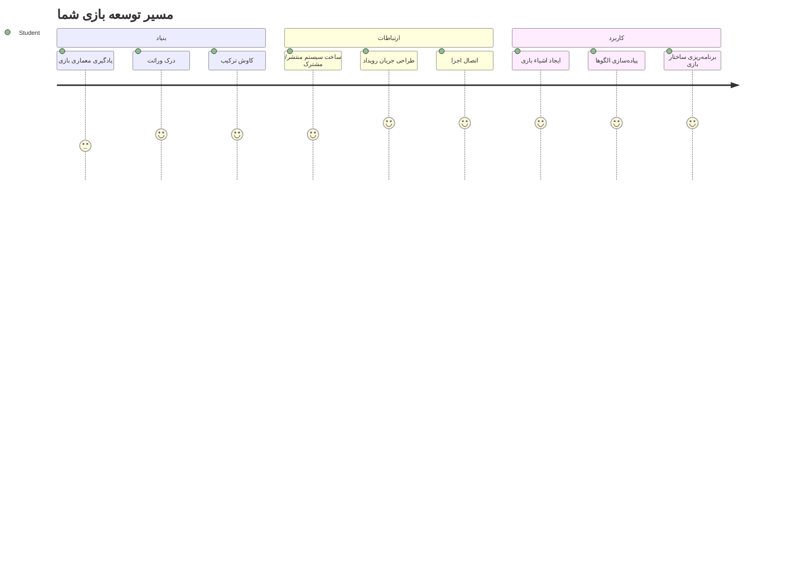
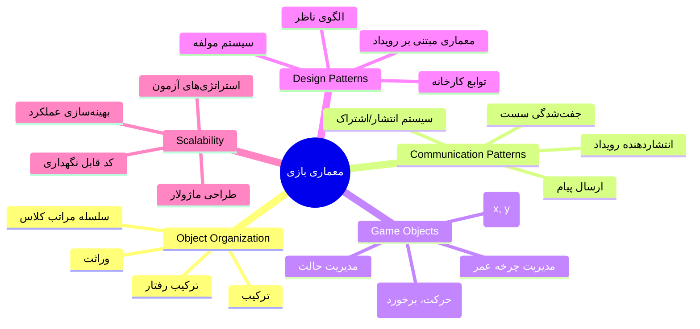
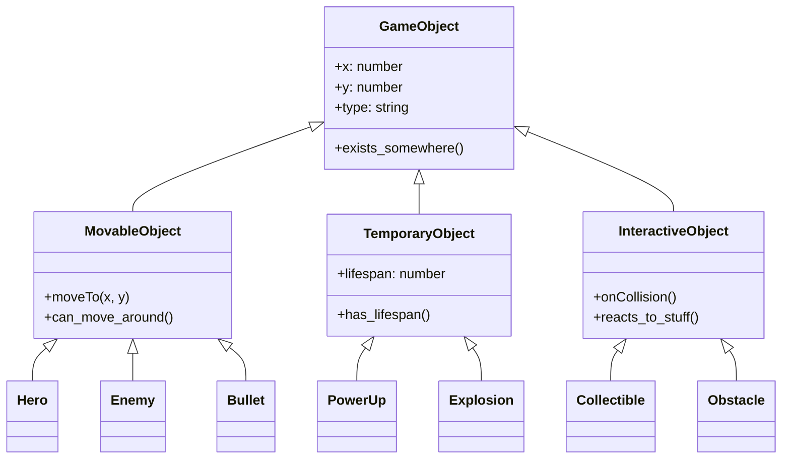
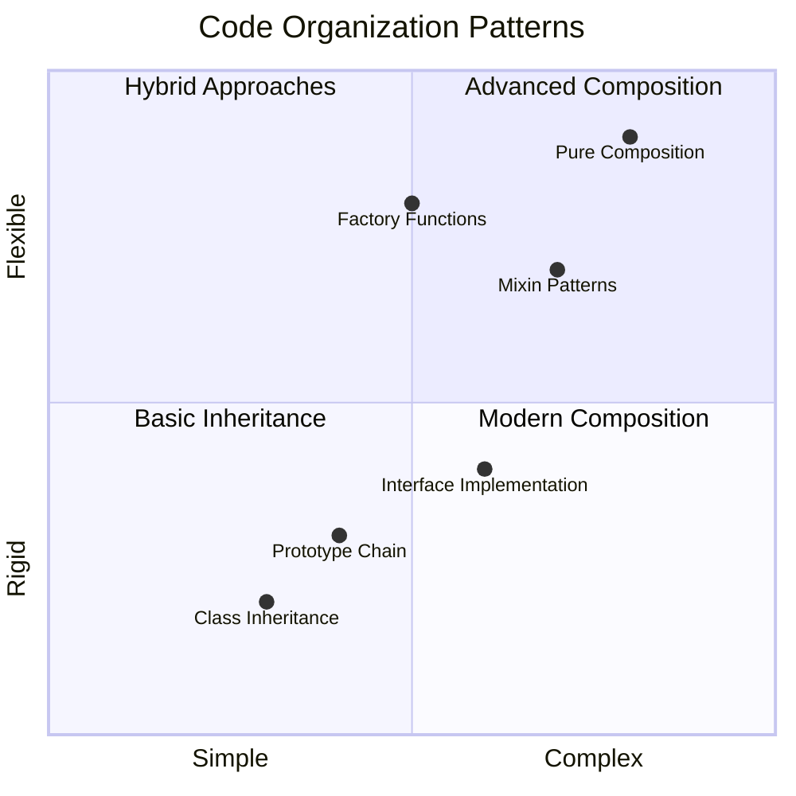
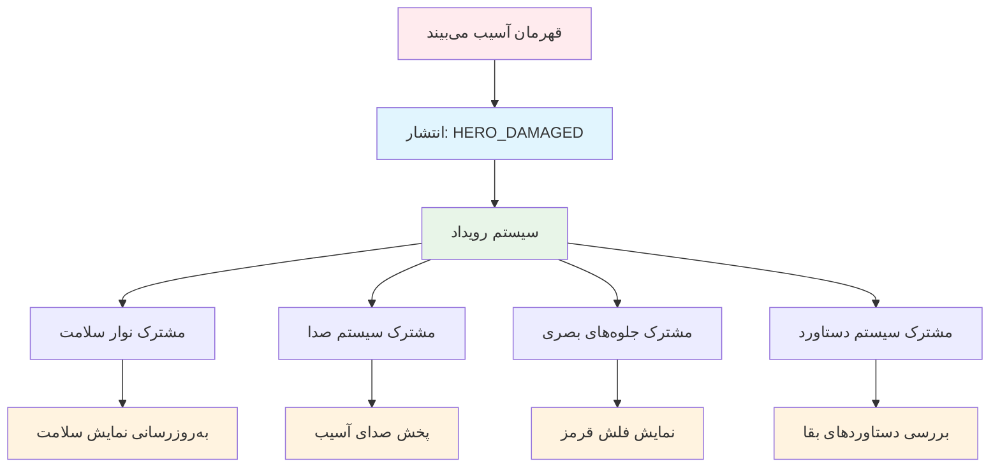
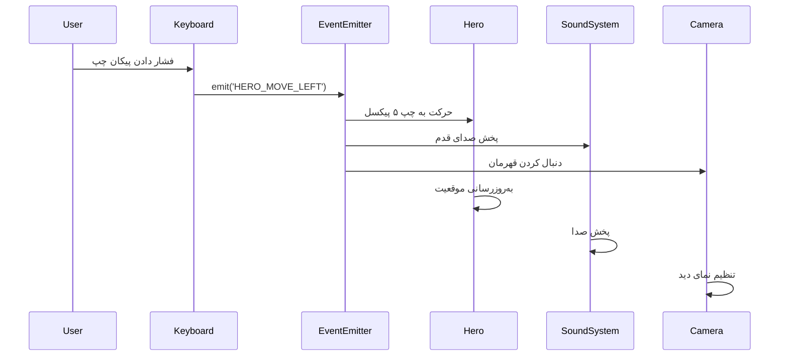
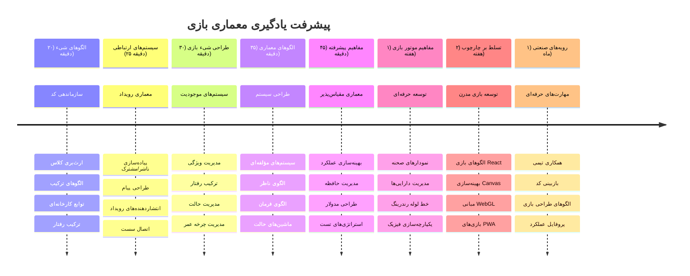

# ساخت بازی فضایی بخش 1: مقدمه




دقیقاً مانند کنترل مأموریت ناسا که در هنگام پرتاب فضاپیما چندین سامانه را هماهنگ می‌کند، ما قرار است بازی فضایی بسازیم که نشان می‌دهد چگونه بخش‌های مختلف یک برنامه می‌توانند بدون مشکل با هم کار کنند. در حین ساخت چیزی که واقعاً بتوانید بازی کنید، با مفاهیم اساسی برنامه‌نویسی آشنا می‌شوید که در هر پروژه نرم‌افزاری کاربرد دارند.

ما دو رویکرد بنیادی برای سازماندهی کد را بررسی می‌کنیم: ارث‌بری و ترکیب. این فقط مفاهیم آکادمیک نیستند – این الگوها همان‌هایی هستند که همه چیز را از بازی‌های ویدیویی تا سیستم‌های بانکی تغذیه می‌کنند. همچنین یک سیستم ارتباطی به نام pub/sub پیاده‌سازی می‌کنیم که مانند شبکه‌های ارتباطی مورد استفاده در فضاپیماها کار می‌کند، و به بخش‌های مختلف اجازه می‌دهد بدون ایجاد وابستگی، اطلاعات را به اشتراک بگذارند.

در پایان این سری، شما می‌فهمید چگونه برنامه‌هایی بسازید که بتوانند مقیاس‌پذیر و قابل توسعه باشند – چه در حال توسعه بازی، برنامه‌های وب، یا هر سیستم نرم‌افزاری دیگری باشید.


## آزمون پیش‌از‌درس

[آزمون پیش‌از‌درس](https://ff-quizzes.netlify.app/web/quiz/29)

## ارث‌بری و ترکیب در توسعه بازی

هر چه پروژه‌ها پیچیده‌تر می‌شوند، سازماندهی کد اهمیت بیشتری پیدا می‌کند. چیزی که با یک اسکریپت ساده شروع می‌شود، بدون ساختار مناسب می‌تواند دشوار برای نگهداری باشد – دقیقاً مانند مأموریت‌های آپولو که نیاز به هماهنگی دقیق بین هزاران مؤلفه داشتند.

ما دو رویکرد بنیادی برای سازماندهی کد را بررسی می‌کنیم: ارث‌بری و ترکیب. هر کدام مزایای متمایزی دارند و فهم هر دو به شما کمک می‌کند رویکرد مناسب را برای موقعیت‌های مختلف انتخاب کنید. این مفاهیم را از طریق بازی فضایی خود نشان می‌دهیم، جایی که قهرمان‌ها، دشمنان، قدرت‌ها و اشیاء دیگر باید به طور مؤثر تعامل کنند.

✅ یکی از مشهورترین کتاب‌های برنامه‌نویسی تاکنون درباره [الگوهای طراحی](https://en.wikipedia.org/wiki/Design_Patterns) است.

در هر بازی، شما `اشیای بازی` دارید – عناصر تعاملی که دنیای بازی شما را پر می‌کنند. قهرمان‌ها، دشمنان، قدرت‌ها و جلوه‌های بصری همه اشیای بازی هستند. هرکدام در مختصات مشخص صفحه با مقادیر `x` و `y` وجود دارند، شبیه رسم نقاط روی یک صفحه مختصات.

با وجود تفاوت‌های ظاهری، این اشیاء اغلب رفتارهای بنیادی مشترکی دارند:

- **جایی وجود دارند** – هر شیء مختصات x و y دارد تا بازی بداند کجا آن را ترسیم کند
- **بسیاری می‌توانند حرکت کنند** – قهرمان‌ها می‌دوند، دشمنان تعقیب می‌کنند، گلوله‌ها از صفحه عبور می‌کنند
- **طول عمر دارند** – برخی برای همیشه می‌مانند، برخی (مانند انفجارها) کوتاه مدت ظاهر می‌شوند و ناپدید می‌شوند
- **به رویدادها واکنش نشان می‌دهند** – وقتی اشیاء برخورد می‌کنند، قدرت‌ها جمع می‌شوند، نوارهای سلامتی به‌روزرسانی می‌شوند

✅ به بازی‌ای مثل Pac-Man فکر کنید. آیا می‌توانید چهار نوع شیء ذکر شده در این بازی را شناسایی کنید؟


### بیان رفتار با کد

حالا که رفتارهای مشترک اشیای بازی را فهمیدید، بیایید ببینیم چگونه این رفتارها را در جاوااسکریپت پیاده‌سازی کنیم. می‌توانید رفتار شیء را از طریق متدهایی که به کلاس‌ها یا اشیاء فردی متصل هستند بیان کنید و چندین رویکرد برای انتخاب وجود دارد.

**رویکرد مبتنی بر کلاس**

کلاس‌ها و ارث‌بری یک رویکرد سازمان‌یافته برای نظم دادن به اشیای بازی فراهم می‌کنند. مانند سیستم طبقه‌بندی تاکسونومی که توسط کارل لینه توسعه یافته، از یک کلاس پایه با ویژگی‌های مشترک شروع می‌کنید، سپس کلاس‌های تخصصی ایجاد می‌کنید که این اصول را به ارث می‌برند و قابلیت‌های خاصی اضافه می‌کنند.

✅ ارث‌بری مفهوم مهمی است که باید یاد بگیرید. بیشتر بدانید در [مقاله MDN درباره ارث‌بری](https://developer.mozilla.org/docs/Web/JavaScript/Inheritance_and_the_prototype_chain).

این‌گونه می‌توانید اشیای بازی را با استفاده از کلاس‌ها و ارث‌بری پیاده کنید:

```javascript
// مرحله 1: ایجاد کلاس پایه GameObject
class GameObject {
  constructor(x, y, type) {
    this.x = x;
    this.y = y;
    this.type = type;
  }
}
```

**اجازه بدهید مرحله به مرحله این را بررسی کنیم:**
- ما قالب اساسی‌ای می‌سازیم که هر شیء بازی بتواند از آن استفاده کند
- سازنده جایگاه شیء (`x`، `y`) و نوع آن را ذخیره می‌کند
- این اساس همه اشیای بازی شما خواهد بود

```javascript
// مرحله ۲: افزودن قابلیت حرکت از طریق ارث‌بری
class Movable extends GameObject {
  constructor(x, y, type) {
    super(x, y, type); // فراخوانی سازنده والد
  }

  // افزودن قابلیت حرکت به موقعیت جدید
  moveTo(x, y) {
    this.x = x;
    this.y = y;
  }
}
```

**در بالا، ما:**
- کلاس GameObject را برای افزودن قابلیت حرکت توسعه دادیم
- سازنده والد را با `super()` فراخواندیم تا ویژگی‌های به ارث‌رسیده را مقداردهی اولیه کنیم
- متد `moveTo()` را اضافه کردیم که موقعیت شیء را به‌روزرسانی می‌کند

```javascript
// مرحله ۳: ایجاد انواع خاص اشیاء بازی
class Hero extends Movable {
  constructor(x, y) {
    super(x, y, 'Hero'); // تنظیم نوع به صورت خودکار
  }
}

class Tree extends GameObject {
  constructor(x, y) {
    super(x, y, 'Tree'); // درختان نیازی به حرکت ندارند
  }
}

// مرحله ۴: استفاده از اشیاء بازی خود
const hero = new Hero(0, 0);
hero.moveTo(5, 5); // قهرمان می‌تواند حرکت کند!

const tree = new Tree(10, 15);
// tree.moveTo() باعث ایجاد خطا می‌شود - درختان نمی‌توانند حرکت کنند
```

**درک این مفاهیم:**
- اشیاء تخصصی می‌سازد که رفتارهای مناسب را به ارث می‌برند
- نشان می‌دهد چگونه ارث‌بری اجازه انتخاب ویژگی‌ها را می‌دهد
- نشان می‌دهد قهرمان‌ها می‌توانند حرکت کنند در حالی که درختان ثابت می‌مانند
- نشان می‌دهد سلسله مراتب کلاسی از انجام اعمال نامناسب جلوگیری می‌کند

✅ چند دقیقه وقت بگذارید و تصور کنید یک قهرمان Pac-Man (مانند Inky, Pinky یا Blinky) چگونه با جاوااسکریپت نوشته می‌شد.

**رویکرد ترکیب**

ترکیب از یک فلسفه طراحی مدولار پیروی می‌کند، مشابه مهندسانی که فضاپیما را با قطعات قابل تعویض طراحی می‌کنند. به جای ارث‌بری از کلاس والد، رفتارهای خاص را ترکیب می‌کنید تا اشیایی با عملکرد دقیقاً مورد نیاز بسازید. این رویکرد انعطاف‌پذیری ارائه می‌دهد بدون قید و بندهای سلسله مراتبی سخت.

```javascript
// مرحله ۱: ایجاد اشیاء رفتار پایه
const gameObject = {
  x: 0,
  y: 0,
  type: ''
};

const movable = {
  moveTo(x, y) {
    this.x = x;
    this.y = y;
  }
};
```

**این کد چه می‌کند:**
- شیء پایه `gameObject` را تعریف می‌کند با ویژگی‌های موقعیت و نوع
- شیء رفتاری جداگانه `movable` با قابلیت حرکت ایجاد می‌کند
- با نگه داشتن داده‌های موقعیت و منطق حرکت به صورت مستقل نگرانی‌ها را جدا می‌کند

```javascript
// مرحله ۲: ترکیب اشیاء با ادغام رفتارها
const movableObject = { ...gameObject, ...movable };

// مرحله ۳: ایجاد توابع کارخانه‌ای برای انواع مختلف اشیاء
function createHero(x, y) {
  return {
    ...movableObject,
    x,
    y,
    type: 'Hero'
  };
}

function createStatic(x, y, type) {
  return {
    ...gameObject,
    x,
    y,
    type
  };
}
```

**در بالا، ما:**
- ویژگی‌های شیء پایه را با رفتار حرکت با استفاده از سینتکس spread ترکیب کردیم
- توابع کارخانه‌ای ساختیم که اشیاء سفارشی باز می‌گردانند
- ایجاد اشیاء انعطاف‌پذیر بدون سلسله مراتب سخت کلاس‌ها را ممکن ساختیم
- اجازه دادیم اشیاء دقیقاً ویژگی‌هایی که نیاز دارند داشته باشند

```javascript
// مرحله ۴: اشیاء ترکیبی خود را ایجاد و استفاده کنید
const hero = createHero(10, 10);
hero.moveTo(5, 5); // به‌خوبی کار می‌کند!

const tree = createStatic(0, 0, 'Tree');
// tree.moveTo() تعریف نشده است - رفتار حرکت ترکیب نشده بود
```

**نکات کلیدی برای به خاطر سپردن:**
- اشیاء را با مخلوط کردن رفتارها به جای ارث‌بری آنان می‌سازد
- نسبت به سلسله مراتب سخت‌گیرانه ارث‌بری، انعطاف‌پذیری بیشتری فراهم می‌کند
- به اشیاء اجازه می‌دهد دقیقاً ویژگی‌های مورد نیاز خود را داشته باشند
- از سینتکس spread جاوااسکریپت مدرن برای ترکیب تمیز اشیاء استفاده می‌کند

```

**Which Pattern Should You Choose?**

**Which Pattern Should You Choose?**



> 💡 **نکته حرفه‌ای**: هر دو الگو جایگاه خود را در توسعه مدرن جاوااسکریپت دارند. کلاس‌ها برای سلسله مراتب‌های مشخص مناسب‌اند، در حالی که ترکیب زمانی که به حداکثر انعطاف نیاز دارید می‌درخشد.
> 
**این‌جا زمان استفاده از هر رویکرد است:**
- ارث‌بری را انتخاب کنید وقتی رابطه‌های "یک نوع است" مشخص باشد (یک قهرمان *یک شیء قابل حرکت‌دادن است*)
- ترکیب را انتخاب کنید وقتی رابطه‌های "دارایی دارد" مطرح باشد (یک قهرمان *توانایی حرکت دارد*)
- ترجیحات تیم و نیازهای پروژه را در نظر بگیرید
- فراموش نکنید که می‌توانید هر دو رویکرد را در یک برنامه مخلوط کنید

### 🔄 **بررسی آموزشی**
**درک سازماندهی اشیاء**: قبل از حرکت به سمت الگوهای ارتباطی، اطمینان حاصل کنید که می‌توانید:
- ✅ تفاوت بین ارث‌بری و ترکیب را توضیح دهید
- ✅ زمان استفاده از کلاس‌ها در برابر توابع کارخانه‌ای را تشخیص دهید
- ✅ درک کنید چگونه کلیدواژه `super()` در ارث‌بری کار می‌کند
- ✅ مزایای هر رویکرد را در توسعه بازی بشناسید

**آزمون سریع**: چگونه یک دشمن پرنده بسازید که هم بتواند حرکت کند و هم پرواز؟
- **رویکرد ارث‌بری**: `class FlyingEnemy extends Movable`
- **رویکرد ترکیب**: `{ ...movable, ...flyable, ...gameObject }`

**ارتباط دنیای واقعی**: این الگوها همه جا ظاهر می‌شوند:
- **کامپوننت‌های React**: Props (ترکیب) در مقابل ارث‌بری کلاس
- **موتورهای بازی**: سیستم‌های Entity-Component با ترکیب کار می‌کنند
- **اپلیکیشن‌های موبایل**: فریم‌ورک‌های UI اغلب از سلسله مراتب ارث‌بری استفاده می‌کنند

## الگوهای ارتباطی: سیستم Pub/Sub

وقتی برنامه‌ها پیچیده می‌شوند، مدیریت ارتباط بین مؤلفه‌ها چالش‌برانگیز می‌شود. الگوی انتشار-مشترک (pub/sub) این مشکل را با استفاده از اصولی مشابه پخش رادیویی حل می‌کند – یک فرستنده می‌تواند به چندین گیرنده دست یابد بدون اینکه بداند چه کسی گوش می‌دهد.

فکر کنید چه می‌شود وقتی قهرمان آسیب می‌بیند: نوار سلامت به‌روزرسانی می‌شود، افکت‌های صوتی پخش می‌شوند، بازخورد بصری ظاهر می‌شود. به جای اینکه شیء قهرمان به طور مستقیم به این سیستم‌ها وابسته باشد، pub/sub اجازه می‌دهد قهرمان پیام "آسیب دیده" را منتشر کند. هر سیستمی که باید پاسخ دهد می‌تواند به این نوع پیام مشترک شود و مطابق با آن واکنش دهد.

✅ **Pub/Sub** مخفف 'انتشار-اشتراک' است


### درک معماری Pub/Sub

الگوی pub/sub قسمت‌های مختلف برنامه شما را به گونه‌ای از هم جدا می‌کند که بتوانند بدون وابستگی مستقیم با هم کار کنند. این جداسازی کد شما را قابل نگهداری‌تر، قابل آزمایش‌تر و منعطف‌تر در برابر تغییرات می‌سازد.

**بازیکنان کلیدی در pub/sub:**
- **پیام‌ها** – برچسب‌های متنی ساده مانند `'PLAYER_SCORED'` که توصیف می‌کند چه اتفاقی افتاده (به علاوه اطلاعات اضافی)
- **انتشاردهندگان** – اشیائی که فریاد می‌زنند "چیزی اتفاق افتاد!" برای هر کسی که گوش می‌دهد
- **مشترک‌ها** – اشیائی که می‌گویند "من به آن رویداد علاقه‌مندم" و وقتی رخ می‌دهد واکنش نشان می‌دهند
- **سیستم رویداد** – واسطه‌ای که اطمینان حاصل می‌کند پیام‌ها به شنوندگان صحیح می‌رسند

### ساخت سیستم رویداد

بیایید یک سیستم رویداد ساده اما قدرتمند ایجاد کنیم که این مفاهیم را نشان دهد:

```javascript
// مرحله ۱: ایجاد کلاس EventEmitter
class EventEmitter {
  constructor() {
    this.listeners = {}; // ذخیره‌سازی همه شنونده‌های رویداد
  }
  
  // ثبت یک شنونده برای نوع پیام خاص
  on(message, listener) {
    if (!this.listeners[message]) {
      this.listeners[message] = [];
    }
    this.listeners[message].push(listener);
  }
  
  // ارسال پیام به همه شنونده‌های ثبت‌شده
  emit(message, payload = null) {
    if (this.listeners[message]) {
      this.listeners[message].forEach(listener => {
        listener(message, payload);
      });
    }
  }
}
```

**بررسی آنچه در این‌جا اتفاق می‌افتد:**
- یک سیستم مدیریت رویداد مرکزی با استفاده از یک کلاس ساده می‌سازد
- شنوندگان را در یک شیء بر اساس نوع پیام ذخیره می‌کند
- شنونده‌های جدید را با متد `on()` ثبت می‌کند
- پیام‌ها را به همه شنونده‌های علاقه‌مند با `emit()` پخش می‌کند
- از اطلاعات داده اختیاری برای ارسال اطلاعات مرتبط پشتیبانی می‌کند

### همه چیز را کنار هم قرار دادن: یک مثال عملی

خوب، اجازه دهید این را در عمل ببینیم! یک سیستم حرکت ساده می‌سازیم که نشان می‌دهد pub/sub چقدر پاک و انعطاف‌پذیر است:

```javascript
// مرحله ۱: نوع پیام‌های خود را تعریف کنید
const Messages = {
  HERO_MOVE_LEFT: 'HERO_MOVE_LEFT',
  HERO_MOVE_RIGHT: 'HERO_MOVE_RIGHT',
  ENEMY_SPOTTED: 'ENEMY_SPOTTED'
};

// مرحله ۲: سیستم رویداد و اشیاء بازی خود را ایجاد کنید
const eventEmitter = new EventEmitter();
const hero = createHero(0, 0);
```

**این کد چه می‌کند:**
- یک شیء ثوابت تعریف می‌کند تا از اشتباهات تایپی در نام پیام‌ها جلوگیری کند
- یک نمونه از EventEmitter ایجاد می‌کند تا همه ارتباطات را مدیریت کند
- یک شیء قهرمان در موقعیت شروع مقداردهی اولیه می‌کند

```javascript
// مرحله ۳: راه‌اندازی شنونده‌های رویداد (مشترکین)
eventEmitter.on(Messages.HERO_MOVE_LEFT, () => {
  hero.moveTo(hero.x - 5, hero.y);
  console.log(`Hero moved to position: ${hero.x}, ${hero.y}`);
});

eventEmitter.on(Messages.HERO_MOVE_RIGHT, () => {
  hero.moveTo(hero.x + 5, hero.y);
  console.log(`Hero moved to position: ${hero.x}, ${hero.y}`);
});
```

**در بالا، ما:**
- شنونده‌های رویداد را ثبت کردیم که به پیام‌های حرکت پاسخ می‌دهند
- موقعیت قهرمان را براساس جهت حرکت بروز کردیم
- لاگ‌های کنسول برای ردیابی تغییرات موقعیت قهرمان اضافه کردیم
- منطق حرکت را از مدیریت ورودی جدا کردیم

```javascript
// مرحله ۴: ورودی صفحه‌کلید را به رویدادها (ناشرها) متصل کنید
window.addEventListener('keydown', (event) => {
  switch(event.key) {
    case 'ArrowLeft':
      eventEmitter.emit(Messages.HERO_MOVE_LEFT);
      break;
    case 'ArrowRight':
      eventEmitter.emit(Messages.HERO_MOVE_RIGHT);
      break;
  }
});
```

**درک این مفاهیم:**
- ورودی صفحه کلید را بدون وابستگی محکم به رویدادهای بازی وصل می‌کند
- اجازه می‌دهد سیستم ورودی به طور غیرمستقیم با اشیای بازی ارتباط برقرار کند
- اجازه می‌دهد چندین سیستم به همان رویدادهای صفحه کلید واکنش نشان دهند
- تغییر کلیدها یا افزودن روش‌های ورودی جدید را آسان می‌کند


> 💡 **نکته حرفه‌ای**: زیبایی این الگو انعطاف‌پذیری آن است! می‌توانید به سادگی با افزودن شنونده‌های رویداد بیشتر افکت‌های صوتی، لرزش صفحه یا ذرات را اضافه کنید – نیازی نیست کد صفحه کلید یا حرکت را تغییر دهید.
> 
**دلایل دوست داشتن این رویکرد:**
- افزودن ویژگی‌های جدید بسیار آسان می‌شود – فقط به رویدادهایی که به آنها اهمیت می‌دهید گوش دهید
- چندین بخش می‌توانند به همان رویداد واکنش نشان دهند بدون تداخل
- تست‌ها بسیار ساده‌تر می‌شوند چون هر بخش به طور مستقل کار می‌کند
- وقتی مشکلی ایجاد شد، دقیقاً می‌دانید کجا را جستجو کنید

### چرا Pub/Sub به خوبی مقیاس‌پذیر است

الگوی pub/sub سادگی را حفظ می‌کند حتی وقتی برنامه‌ها پیچیده می‌شوند. چه در حال مدیریت ده‌ها دشمن، به‌روزرسانی‌های پویا در UI، یا سیستم‌های صوتی باشید، این الگو بدون نیاز به تغییرات معماری، اندازه را کنترل می‌کند. ویژگی‌های جدید به سیستم رویداد موجود افزوده می‌شوند بدون اینکه عملکردهای موجود را تحت تأثیر قرار دهند.

> ⚠️ **اشتباه رایج**: خیلی زود پیام‌های خیلی خاص نساخته و دسته‌بندی‌های گسترده را ابتدا شروع کنید و به تدریج وقتی نیازهای بازی‌تان واضح‌تر شد، آنها را دقیق‌تر کنید.
> 
**بهترین روش‌هایی که باید دنبال شوند:**
- پیام‌های مرتبط را در دسته‌های منطقی گروه‌بندی کنید
- نام‌های توصیفی استفاده کنید که به وضوح نشان دهند چه اتفاقی افتاده
- اطلاعات پیام‌ها را ساده و متمرکز نگه دارید
- انواع پیام‌های خود را برای همکاری تیمی مستندسازی کنید

### 🔄 **بررسی آموزشی**
**درک معماری رویدادمحور**: تسلط خود بر کل سیستم را بررسی کنید:
- ✅ چگونه الگوی pub/sub اتصالات محکم بین مؤلفه‌ها را جلوگیری می‌کند؟
- ✅ چرا افزودن ویژگی‌های جدید با معماری رویدادمحور آسان‌تر است؟
- ✅ نقش EventEmitter در جریان ارتباط چیست؟
- ✅ چگونه ثوابت پیام‌ها از باگ‌ها جلوگیری می‌کند و نگهداری را بهبود می‌بخشد؟

**چالش طراحی**: چگونه این سناریوهای بازی را با pub/sub مدیریت می‌کنید؟
1. **دشمن می‌میرد**: امتیاز به‌روزرسانی، پخش صدا، ایجاد قدرت، حذف از صفحه
2. **مرحله کامل شد**: توقف موسیقی، نمایش UI، ذخیره پیشرفت، بارگذاری مرحله بعدی
3. **قدرت جمع‌آوری شد**: افزایش توانایی‌ها، به‌روزرسانی UI، پخش افکت، شروع تایمر

**ارتباط حرفه‌ای**: این الگو در موارد زیر دیده می‌شود:
- **فریم‌ورک‌های فرانت‌اند**: سیستم‌های رویداد React/Vue
- **سرویس‌های بک‌اند**: ارتباط میکروسرویس‌ها
- **موتورهای بازی**: سیستم رویداد Unity
- **توسعه موبایل**: سیستم اعلان‌های iOS/Android

---

## چالش GitHub Copilot Agent 🚀

از حالت Agent برای کامل کردن چالش زیر استفاده کنید:

**توضیح:** یک سیستم اشیای بازی ساده با استفاده از هم ارث‌بری و هم الگوی pub/sub بسازید. شما یک بازی پایه می‌سازید که اشیاء مختلف بتوانند از طریق رویدادها بدون اطلاع مستقیم از هم ارتباط برقرار کنند.

**درخواست:** یک سیستم بازی جاوااسکریپت با نیازهای زیر بسازید: 1) یک کلاس پایه GameObject با مختصات x و y و ویژگی نوع بسازید. 2) یک کلاس Hero که از GameObject ارث می‌برد و می‌تواند حرکت کند بسازید. 3) کلاس Enemy که از GameObject ارث می‌برد و می‌تواند قهرمان را تعقیب کند بسازید. 4) کلاس EventEmitter را برای الگوی pub/sub پیاده‌سازی کنید. 5) شنونده‌های رویداد تنظیم کنید طوری که هنگامی که قهرمان حرکت می‌کند، دشمنان نزدیک رویداد 'HERO_MOVED' را دریافت کرده و موقعیت خود را برای حرکت به سمت قهرمان به‌روزرسانی کنند. از کنسول لاگ استفاده کنید تا ارتباط بین اشیاء نمایش داده شود.

بیشتر درباره [حالت Agent](https://code.visualstudio.com/blogs/2025/02/24/introducing-copilot-agent-mode) اینجا بخوانید.

## 🚀 چالش
در نظر بگیرید چگونه الگوی انتشار-اشتراک (pub-sub) می‌تواند معماری بازی را بهبود بخشد. تعیین کنید کدام مؤلفه‌ها باید رویدادها را منتشر کنند و سیستم چگونه باید پاسخ دهد. یک مفهوم بازی طراحی کنید و الگوهای ارتباطی بین مؤلفه‌های آن را ترسیم نمایید.

## آزمون پس از درس

[آزمون پس از درس](https://ff-quizzes.netlify.app/web/quiz/30)

## مرور و مطالعه خودآموز

اطلاعات بیشتر درباره Pub/Sub را با [مطالعه درباره آن](https://docs.microsoft.com/azure/architecture/patterns/publisher-subscriber/?WT.mc_id=academic-77807-sagibbon) بیاموزید.

### ⚡ **کارهایی که می‌توانید در ۵ دقیقه بعدی انجام دهید**
- [ ] هر بازی HTML5 آنلاین را باز کرده و کد آن را با DevTools بررسی کنید
- [ ] یک عنصر ساده HTML5 Canvas ایجاد کرده و یک شکل پایه رسم کنید
- [ ] با استفاده از `setInterval` یک حلقه انیمیشن ساده بسازید
- [ ] مستندات Canvas API را کاوش کرده و یک روش رسم را امتحان کنید

### 🎯 **آنچه می‌توانید در این ساعت به انجام برسانید**
- [ ] آزمون پس از درس را تکمیل کرده و مفاهیم توسعه بازی را درک کنید
- [ ] ساختار پروژه بازی خود را با فایل‌های HTML، CSS و JavaScript راه‌اندازی کنید
- [ ] یک حلقه بازی پایه ایجاد کنید که به‌طور مداوم به‌روزرسانی و رندر کند
- [ ] اولین اسپریت‌های بازی خود را روی بوم رسم کنید
- [ ] بارگذاری دارایی‌های پایه مانند تصاویر و صداها را پیاده‌سازی کنید

### 📅 **ساخت بازی به مدت یک هفته**
- [ ] بازی کامل فضایی را با تمامی ویژگی‌های برنامه‌ریزی شده به پایان برسانید
- [ ] گرافیک‌های صیقل‌خورده، جلوه‌های صوتی و انیمیشن‌های روان اضافه کنید
- [ ] وضعیت‌های بازی (صفحه شروع، گیم‌پلی، پایان بازی) را پیاده‌سازی کنید
- [ ] یک سیستم امتیازدهی و پیگیری پیشرفت بازیکن ایجاد کنید
- [ ] بازی خود را واکنش‌گرا و قابل دسترسی در دستگاه‌های مختلف بسازید
- [ ] بازی‌تان را آنلاین به اشتراک بگذارید و بازخورد بازیکنان را جمع‌آوری کنید

### 🌟 **توسعه بازی به مدت یک ماه**
- [ ] چند بازی با ژانرها و مکانیک‌های مختلف بسازید
- [ ] یک چارچوب توسعه بازی مانند Phaser یا Three.js بیاموزید
- [ ] در پروژه‌های متن‌باز توسعه بازی مشارکت کنید
- [ ] الگوهای پیشرفته برنامه‌نویسی بازی و بهینه‌سازی را مسلط شوید
- [ ] یک نمونه کار (portfolio) که مهارت‌های توسعه بازی‌تان را نشان می‌دهد ایجاد کنید
- [ ] به دیگران علاقه‌مند به توسعه بازی و رسانه تعاملی مربیگری دهید

## 🎯 جدول زمانی تسلط شما بر توسعه بازی


### 🛠️ خلاصه ابزار معماری بازی شما

پس از اتمام این درس، اکنون شما دارید:
- **تسلط بر الگوی طراحی**: درک مزایا و معایب وراثت در مقابل ترکیب
- **معماری مبتنی بر رویداد**: اجرای pub/sub برای ارتباط مقیاس‌پذیر
- **طراحی شیءگرا**: سلسله مراتب کلاس‌ها و ترکیب رفتارها
- **جاوااسکریپت مدرن**: توابع کارخانه، سینتکس spread و الگوهای ES6+
- **معماری مقیاس‌پذیر**: اصول طراحی ماژولار و اتصال شل
- **پایه‌های توسعه بازی**: سیستم‌ موجودیت‌ها و الگوهای مؤلفه‌ای
- **الگوهای حرفه‌ای**: روش‌های استاندارد صنعت برای سازماندهی کد

**کاربردهای دنیای واقعی**: این الگوها مستقیماً در زمینه‌های زیر کاربرد دارند:
- **چارچوب‌های فرانت‌اند**: معماری مؤلفه‌ها و مدیریت حالت React/Vue
- **خدمات بک‌اند**: ارتباط میکروسرویس‌ها و سیستم‌های مبتنی بر رویداد
- **توسعه موبایل**: معماری اپلیکیشن iOS/Android و سیستم‌های اعلان
- **موتورهای بازی**: توسعه بازی‌های Unity، Unreal و مبتنی بر وب
- **نرم‌افزار سازمانی**: رویدادگذاری و طراحی سیستم‌های توزیع‌شده
- **طراحی API**: سرویس‌های RESTful و ارتباطات بلادرنگ

**مهارت‌های حرفه‌ای کسب‌شده**: اکنون می‌توانید:
- **طراحی** معماری‌های نرم‌افزاری مقیاس‌پذیر با استفاده از الگوهای اثبات‌شده
- **پیاده‌سازی** سیستم‌های مبتنی بر رویداد که تعاملات پیچیده را مدیریت می‌کنند
- **انتخاب** استراتژی‌های سازماندهی کد مناسب برای سناریوهای مختلف
- **عیب‌یابی** و نگهداری سیستم‌های با اتصال شل به طور مؤثر
- **ارتباط** تصمیمات فنی با استفاده از اصطلاحات استاندارد صنعت

**سطح بعدی**: آماده‌اید این الگوها را در یک بازی واقعی پیاده‌سازی کنید، موضوعات پیشرفته توسعه بازی را کاوش کنید، یا این مفاهیم معماری را در برنامه‌های وب به کار ببرید!

🌟 **افتخار کسب شده**: شما الگوهای پایه معماری نرم‌افزار را که نیروی محرک بازی‌های ساده تا سیستم‌های سازمانی پیچیده هستند، به‌خوبی آموخته‌اید!

## تمرین

[شبیه‌سازی یک بازی](assignment.md)

---

<!-- CO-OP TRANSLATOR DISCLAIMER START -->
**توضیح مهم**:  
این سند با استفاده از سرویس ترجمه هوش مصنوعی [Co-op Translator](https://github.com/Azure/co-op-translator) ترجمه شده است. در حالی که ما در تلاش برای دقت هستیم، لطفاً توجه داشته باشید که ترجمه‌های خودکار ممکن است حاوی خطاها یا نواقصی باشند. سند اصلی به زبان بومی خود، منبع معتبر و مورد اعتماد تلقی شود. برای اطلاعات حساس و حیاتی، توصیه می‌شود از ترجمه حرفه‌ای انسانی استفاده گردد. ما مسئول هیچ گونه سوء تفاهم یا برداشت نادرست ناشی از استفاده از این ترجمه نیستیم.
<!-- CO-OP TRANSLATOR DISCLAIMER END -->