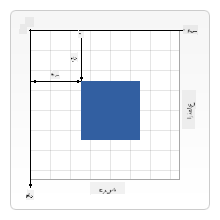

<!--
CO_OP_TRANSLATOR_METADATA:
{
  "original_hash": "056641280211e52fd0adb81b6058ec55",
  "translation_date": "2025-08-29T14:30:40+00:00",
  "source_file": "6-space-game/2-drawing-to-canvas/README.md",
  "language_code": "fa"
}
-->
# ساخت یک بازی فضایی قسمت ۲: رسم قهرمان و هیولاها روی Canvas

## آزمون پیش از درس

[آزمون پیش از درس](https://ff-quizzes.netlify.app/web/quiz/31)

## Canvas

Canvas یک عنصر HTML است که به طور پیش‌فرض هیچ محتوایی ندارد؛ یک صفحه خالی است. شما باید با رسم روی آن، محتوا اضافه کنید.

✅ [بیشتر درباره Canvas API بخوانید](https://developer.mozilla.org/docs/Web/API/Canvas_API) در MDN.

این عنصر معمولاً به این شکل در بدنه صفحه تعریف می‌شود:

```html
<canvas id="myCanvas" width="200" height="100"></canvas>
```

در کد بالا، ما `id`، `width` و `height` را تنظیم کرده‌ایم.

- `id`: این مقدار را تنظیم کنید تا بتوانید هنگام تعامل با آن، یک مرجع دریافت کنید.
- `width`: این عرض عنصر است.
- `height`: این ارتفاع عنصر است.

## رسم اشکال ساده

Canvas از یک سیستم مختصات دکارتی برای رسم استفاده می‌کند. بنابراین از محور x و محور y برای مشخص کردن مکان یک شیء استفاده می‌کند. مکان `0,0` گوشه بالا سمت چپ است و گوشه پایین سمت راست همان مقداری است که برای WIDTH و HEIGHT تنظیم کرده‌اید.

  
> تصویر از [MDN](https://developer.mozilla.org/docs/Web/API/Canvas_API/Tutorial/Drawing_shapes)

برای رسم روی عنصر Canvas باید مراحل زیر را طی کنید:

1. **یک مرجع بگیرید** از عنصر Canvas.
2. **یک مرجع بگیرید** از عنصر Context که روی عنصر Canvas قرار دارد.
3. **یک عملیات رسم انجام دهید** با استفاده از عنصر Context.

کد مربوط به مراحل بالا معمولاً به این شکل است:

```javascript
// draws a red rectangle
//1. get the canvas reference
canvas = document.getElementById("myCanvas");

//2. set the context to 2D to draw basic shapes
ctx = canvas.getContext("2d");

//3. fill it with the color red
ctx.fillStyle = 'red';

//4. and draw a rectangle with these parameters, setting location and size
ctx.fillRect(0,0, 200, 200) // x,y,width, height
```

✅ Canvas API بیشتر بر روی اشکال دوبعدی تمرکز دارد، اما شما می‌توانید عناصر سه‌بعدی نیز روی یک وب‌سایت رسم کنید؛ برای این کار ممکن است از [WebGL API](https://developer.mozilla.org/docs/Web/API/WebGL_API) استفاده کنید.

شما می‌توانید با Canvas API انواع مختلفی از چیزها را رسم کنید، مانند:

- **اشکال هندسی**، ما قبلاً نشان دادیم که چگونه یک مستطیل رسم کنیم، اما چیزهای بیشتری می‌توانید رسم کنید.
- **متن**، می‌توانید متنی با هر فونت و رنگی که می‌خواهید رسم کنید.
- **تصاویر**، می‌توانید تصویری را بر اساس یک فایل تصویری مانند .jpg یا .png رسم کنید.

✅ امتحان کنید! شما می‌دانید چگونه یک مستطیل رسم کنید، آیا می‌توانید یک دایره روی صفحه رسم کنید؟ نگاهی به برخی از نقاشی‌های جالب Canvas در CodePen بیندازید. اینجا یک [نمونه بسیار چشمگیر](https://codepen.io/dissimulate/pen/KrAwx) وجود دارد.

## بارگذاری و رسم یک فایل تصویری

برای بارگذاری یک فایل تصویری، یک شیء `Image` ایجاد کرده و ویژگی `src` آن را تنظیم کنید. سپس به رویداد `load` گوش دهید تا بدانید چه زمانی آماده استفاده است. کد به این شکل است:

### بارگذاری فایل

```javascript
const img = new Image();
img.src = 'path/to/my/image.png';
img.onload = () => {
  // image loaded and ready to be used
}
```

### الگوی بارگذاری فایل

توصیه می‌شود کد بالا را در یک ساختار مانند زیر قرار دهید تا استفاده از آن آسان‌تر شود و فقط زمانی که کاملاً بارگذاری شده است، سعی کنید آن را دستکاری کنید:

```javascript
function loadAsset(path) {
  return new Promise((resolve) => {
    const img = new Image();
    img.src = path;
    img.onload = () => {
      // image loaded and ready to be used
      resolve(img);
    }
  })
}

// use like so

async function run() {
  const heroImg = await loadAsset('hero.png')
  const monsterImg = await loadAsset('monster.png')
}

```

برای رسم دارایی‌های بازی روی صفحه، کد شما به این شکل خواهد بود:

```javascript
async function run() {
  const heroImg = await loadAsset('hero.png')
  const monsterImg = await loadAsset('monster.png')

  canvas = document.getElementById("myCanvas");
  ctx = canvas.getContext("2d");
  ctx.drawImage(heroImg, canvas.width/2,canvas.height/2);
  ctx.drawImage(monsterImg, 0,0);
}
```

## حالا وقت آن است که بازی خود را بسازید

### چه چیزی بسازید

شما یک صفحه وب با یک عنصر Canvas خواهید ساخت. این صفحه باید یک صفحه سیاه با ابعاد `1024*768` را نمایش دهد. ما دو تصویر برای شما فراهم کرده‌ایم:

- سفینه قهرمان

   

- ۵*۵ هیولا

   

### مراحل پیشنهادی برای شروع توسعه

فایل‌هایی که برای شما در پوشه `your-work` ایجاد شده‌اند را پیدا کنید. این پوشه باید شامل موارد زیر باشد:

```bash
-| assets
  -| enemyShip.png
  -| player.png
-| index.html
-| app.js
-| package.json
```

یک کپی از این پوشه را در Visual Studio Code باز کنید. شما باید یک محیط توسعه محلی راه‌اندازی کرده باشید، ترجیحاً با Visual Studio Code و NPM و Node نصب شده. اگر `npm` روی کامپیوتر شما نصب نیست، [اینجا نحوه نصب آن آمده است](https://www.npmjs.com/get-npm).

پروژه خود را با رفتن به پوشه `your_work` شروع کنید:

```bash
cd your-work
npm start
```

کد بالا یک سرور HTTP را در آدرس `http://localhost:5000` راه‌اندازی می‌کند. یک مرورگر باز کنید و این آدرس را وارد کنید. در حال حاضر یک صفحه خالی است، اما این تغییر خواهد کرد.

> توجه: برای دیدن تغییرات روی صفحه، مرورگر خود را تازه‌سازی کنید.

### اضافه کردن کد

کد مورد نیاز را به `your-work/app.js` اضافه کنید تا موارد زیر را حل کنید:

1. **رسم** یک Canvas با پس‌زمینه سیاه  
   > نکته: دو خط کد زیر TODO مناسب اضافه کنید، عنصر `ctx` را به رنگ سیاه تنظیم کنید و مختصات بالا/چپ را روی 0,0 و ارتفاع و عرض را برابر با Canvas تنظیم کنید.
2. **بارگذاری** تکسچرها  
   > نکته: تصاویر بازیکن و دشمن را با استفاده از `await loadTexture` و مسیر تصویر اضافه کنید. هنوز آن‌ها را روی صفحه نخواهید دید!
3. **رسم** قهرمان در مرکز صفحه در نیمه پایین  
   > نکته: از API `drawImage` برای رسم heroImg روی صفحه استفاده کنید، مختصات را روی `canvas.width / 2 - 45` و `canvas.height - canvas.height / 4` تنظیم کنید.
4. **رسم** ۵*۵ هیولا  
   > نکته: حالا می‌توانید کد رسم دشمنان روی صفحه را از حالت کامنت خارج کنید. سپس به تابع `createEnemies` بروید و آن را تکمیل کنید.

   ابتدا، چند ثابت تنظیم کنید:

    ```javascript
    const MONSTER_TOTAL = 5;
    const MONSTER_WIDTH = MONSTER_TOTAL * 98;
    const START_X = (canvas.width - MONSTER_WIDTH) / 2;
    const STOP_X = START_X + MONSTER_WIDTH;
    ```

    سپس، یک حلقه ایجاد کنید تا آرایه هیولاها را روی صفحه رسم کند:

    ```javascript
    for (let x = START_X; x < STOP_X; x += 98) {
        for (let y = 0; y < 50 * 5; y += 50) {
          ctx.drawImage(enemyImg, x, y);
        }
      }
    ```

## نتیجه

نتیجه نهایی باید به این شکل باشد:


## راه‌حل

لطفاً ابتدا خودتان سعی کنید آن را حل کنید، اما اگر گیر کردید، به [راه‌حل](../../../../6-space-game/2-drawing-to-canvas/solution/app.js) نگاهی بیندازید.

---

## 🚀 چالش

شما درباره رسم با Canvas API که بر روی دوبعدی تمرکز دارد یاد گرفتید؛ نگاهی به [WebGL API](https://developer.mozilla.org/docs/Web/API/WebGL_API) بیندازید و سعی کنید یک شیء سه‌بعدی رسم کنید.

## آزمون پس از درس

[آزمون پس از درس](https://ff-quizzes.netlify.app/web/quiz/32)

## مرور و مطالعه شخصی

بیشتر درباره Canvas API یاد بگیرید با [مطالعه درباره آن](https://developer.mozilla.org/docs/Web/API/Canvas_API).

## تکلیف

[با Canvas API کار کنید](assignment.md)

---

**سلب مسئولیت**:  
این سند با استفاده از سرویس ترجمه هوش مصنوعی [Co-op Translator](https://github.com/Azure/co-op-translator) ترجمه شده است. در حالی که ما تلاش می‌کنیم دقت را حفظ کنیم، لطفاً توجه داشته باشید که ترجمه‌های خودکار ممکن است شامل خطاها یا نادرستی‌ها باشند. سند اصلی به زبان اصلی آن باید به عنوان منبع معتبر در نظر گرفته شود. برای اطلاعات حساس، توصیه می‌شود از ترجمه حرفه‌ای انسانی استفاده کنید. ما مسئولیتی در قبال سوء تفاهم‌ها یا تفسیرهای نادرست ناشی از استفاده از این ترجمه نداریم.