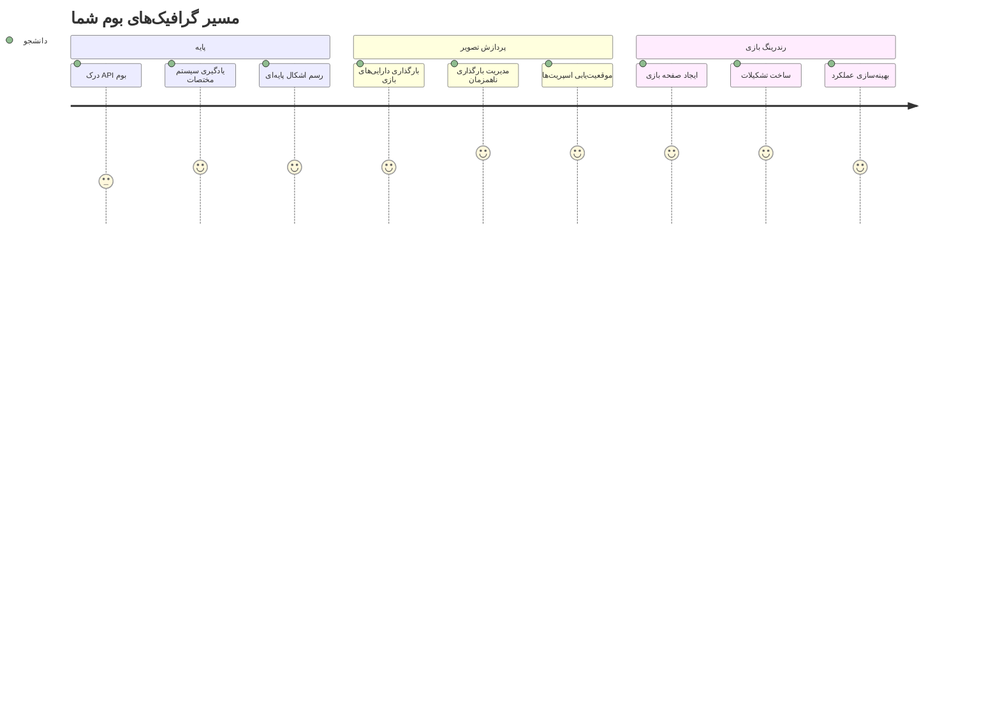
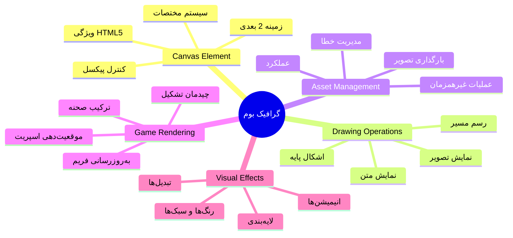
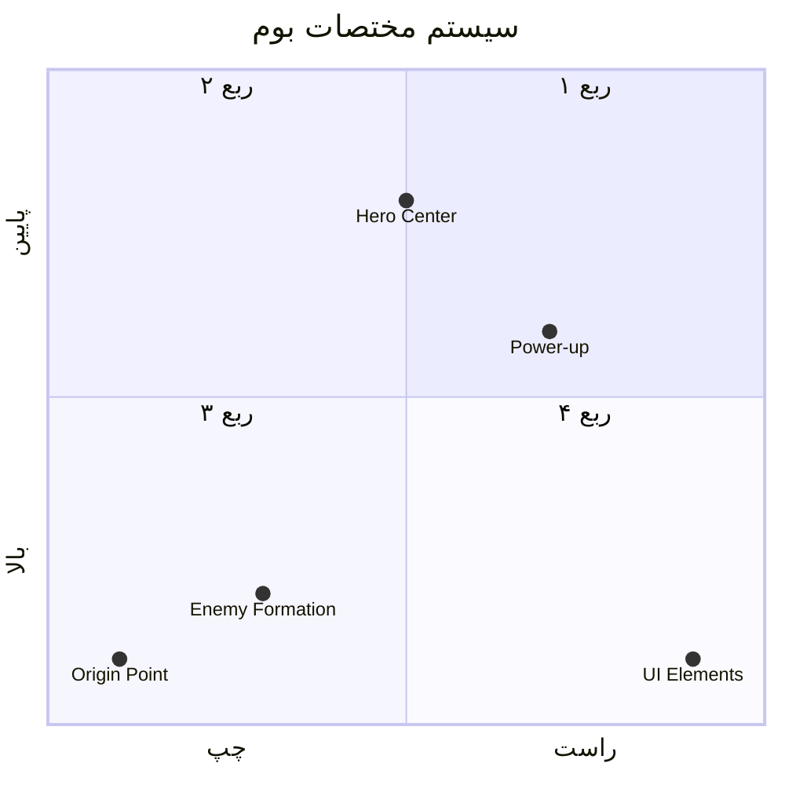
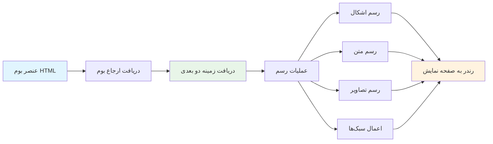
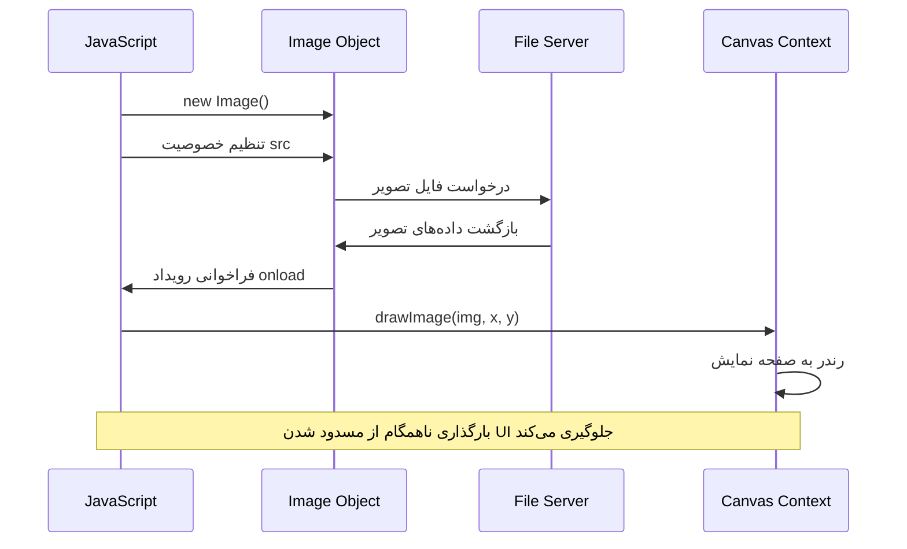
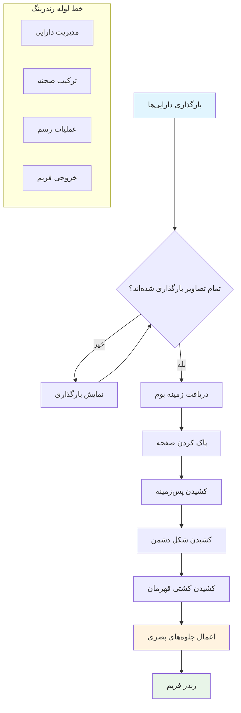
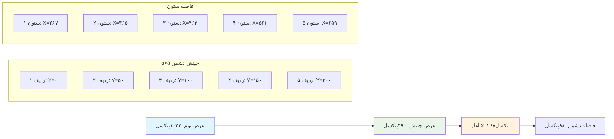
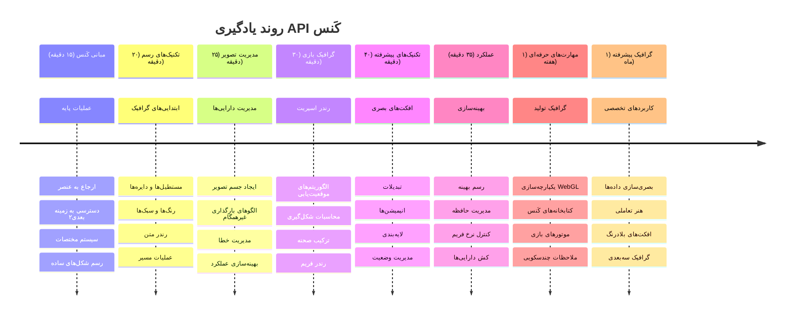

<!--
CO_OP_TRANSLATOR_METADATA:
{
  "original_hash": "7994743c5b21fdcceb36307916ef249a",
  "translation_date": "2026-01-06T10:01:53+00:00",
  "source_file": "6-space-game/2-drawing-to-canvas/README.md",
  "language_code": "fa"
}
-->
# ساخت یک بازی فضایی قسمت ۲: رسم قهرمان و هیولاها روی کانواس


API کانواس یکی از قدرتمندترین ویژگی‌های توسعه وب برای ایجاد گرافیک‌های پویا و تعاملی درست در مرورگر شما است. در این درس، ما عنصر خالی HTML `<canvas>` را به دنیای بازی‌ای پر از قهرمان‌ها و هیولاها تبدیل خواهیم کرد. کانواس را به عنوان تخته نقاشی دیجیتال خود در نظر بگیرید که کد به تصویر تبدیل می‌شود.

ما بر آنچه در درس قبلی یاد گرفته‌اید بنا می‌کنیم و حالا به جنبه‌های بصری می‌پردازیم. شما یاد خواهید گرفت چگونه اسپریت‌های بازی را بارگذاری و نمایش دهید، عناصر را به دقت موقعیت‌دهی کنید و پایه تصویری بازی فضایی خود را بسازید. این کار فاصله بین صفحات وب ثابت و تجربه‌های تعاملی و پویا را پر می‌کند.

در پایان این درس، یک صحنه کامل بازی خواهید داشت که کشتی قهرمان شما به‌درستی جایگذاری شده و فرمیشن‌های دشمن آماده نبرد هستند. شما می‌فهمید چگونه بازی‌های مدرن گرافیک را در مرورگرها رندر می‌کنند و مهارت‌هایی به دست می‌آورید که تجربه‌های تصویری تعاملی خودتان را بسازید. بیایید گرافیک کانواس را کاوش کنیم و بازی فضایی شما را زنده کنیم!


## آزمون پیش از درس

[آزمون پیش از درس](https://ff-quizzes.netlify.app/web/quiz/31)

## کانواس

پس این عنصر `<canvas>` دقیقا چیست؟ این راه‌حل HTML5 برای ایجاد گرافیک‌های پویا و انیمیشن‌ها در مرورگرهای وب است. برخلاف تصاویر یا ویدئوهای معمولی که ایستا هستند، کانواس کنترل سطح پیکسلی بر هر چیزی که روی صفحه ظاهر می‌شود به شما می‌دهد. این ویژگی آن را برای بازی‌ها، تصویربرداری داده‌ها و هنر تعاملی مناسب می‌کند. آن را به عنوان یک سطح نقاشی برنامه‌پذیر تصور کنید که در آن جاوااسکریپت قلم‌مو شما است.

به طور پیش‌فرض، عنصر کانواس شبیه یک مستطیل شفاف و خالی روی صفحه شما به نظر می‌رسد. اما همین‌جا پتانسیل نهفته است! قدرت واقعی آن زمانی آشکار می‌شود که با جاوااسکریپت اشکال ترسیم کنید، تصاویر بارگذاری کنید، انیمیشن بسازید و چیزها را به تعاملات کاربر پاسخگو کنید. این شبیه به کاری است که پیشگامان گرافیک کامپیوتری اولیه در آزمایشگاه بل در دهه ۱۹۶۰ انجام دادند که باید هر پیکسل را برنامه‌ریزی می‌کردند تا اولین انیمیشن‌های دیجیتال را بسازند.

✅ بیشتر بخوانید درباره [API کانواس](https://developer.mozilla.org/docs/Web/API/Canvas_API) در MDN.

این گونه است که معمولاً به عنوان بخشی از بدنه صفحه اعلام می‌شود:

```html
<canvas id="myCanvas" width="200" height="100"></canvas>
```

**این کد چه کاری انجام می‌دهد:**
- **تنظیم** ویژگی `id` تا بتوانید به این عنصر کانواس خاص در جاوااسکریپت ارجاع دهید
- **تعریف** عرض به صورت پیکسل برای کنترل اندازه افقی کانواس
- **تعیین** ارتفاع به صورت پیکسل برای مشخص کردن ابعاد عمودی کانواس

## رسم هندسه ساده

حالا که می‌دانید عنصر کانواس چیست، بیایید واقعاً روی آن چیز بکشیم! کانواس از یک سیستم مختصات استفاده می‌کند که ممکن است از کلاس ریاضی با آن آشنا باشید، اما یک تفاوت مهم مختص گرافیک کامپیوتری وجود دارد.

کانواس از مختصات کارتزینی با محور x (افقی) و y (عمودی) برای موقعیت‌دهی هر چیزی که می‌کشید استفاده می‌کند. اما تفاوت کلیدی این است: برخلاف سیستم مختصات کلاس ریاضی، نقطه مبدأ `(۰,۰)` از گوشه بالا-چپ شروع می‌شود، مقادیر x با حرکت به سمت راست افزایش می‌یابند و مقادیر y با حرکت به سمت پایین افزایش می‌یابند. این رویکرد به نمایشگرهای کامپیوتری اولیه برمی‌گردد که پرتوهای الکترونی آنها از بالا به پایین اسکن می‌کردند، پس بالا-چپ نقطه شروع طبیعی بود.



> تصویر از [MDN](https://developer.mozilla.org/docs/Web/API/Canvas_API/Tutorial/Drawing_shapes)

برای کشیدن روی عنصر کانواس، شما همان فرایند سه مرحله‌ای را دنبال می‌کنید که اساس همه گرافیک‌های کانواس است. وقتی چند بار این کار را انجام دهید، عادتتان می‌شود:


1. **دریافت ارجاع** به عنصر کانواس خود از DOM (مثل هر عنصر HTML دیگر)
2. **دریافت context رندر ۲ بعدی** – این شامل همه روش‌های رسم است
3. **شروع به رسم!** با استفاده از متدهای درون‌ساخت context، گرافیک خود را ایجاد کنید

در کد، این چنین است:

```javascript
// گام ۱: دریافت عنصر بوم
const canvas = document.getElementById("myCanvas");

// گام ۲: دریافت زمینه رندر دوبعدی
const ctx = canvas.getContext("2d");

// گام ۳: تنظیم رنگ پر و رسم یک مستطیل
ctx.fillStyle = 'red';
ctx.fillRect(0, 0, 200, 200); // ایکس، ایگرگ، عرض، ارتفاع
```

**بیایید این را قدم به قدم بررسی کنیم:**
- ما عنصر کانواس را با استفاده از id می‌گیریم و در یک متغیر ذخیره می‌کنیم
- ما context رندر ۲ بعدی را می‌گیریم – این ابزار رسم ما است پر از متدهای رسم
- به کانواس می‌گوییم که می‌خواهیم با رنگ قرمز پر کنیم (با ویژگی `fillStyle`)
- یک مستطیل رسم می‌کنیم که از گوشه بالا-چپ (۰،۰) شروع می‌شود و ۲۰۰ پیکسل پهنا و ارتفاع دارد

✅ API کانواس عمدتاً بر اشکال ۲ بعدی تمرکز دارد، اما شما همچنین می‌توانید عناصر سه‌بعدی را به وب‌سایت رسم کنید؛ برای این کار ممکن است از [API WebGL](https://developer.mozilla.org/docs/Web/API/WebGL_API) استفاده کنید.

با API کانواس می‌توانید انواع مختلفی از اشیاء را رسم کنید مثل:

- **اشکال هندسی**، ما قبلاً نحوه رسم مستطیل را نشان دادیم، اما چیزهای بیشتری برای کشیدن وجود دارد.
- **متن**، می‌توانید متنی با هر فونت و رنگی که می‌خواهید رسم کنید.
- **تصاویر**، می‌توانید تصویری را بر اساس یک فایل تصویری مثل .jpg یا .png رسم کنید.

✅ امتحان کنید! شما می‌دانید چگونه مستطیل بکشید، آیا می‌توانید یک دایره روی صفحه رسم کنید؟ نگاهی به برخی رسم‌های جالب کانواس در CodePen بیندازید. این یک [نمونه بسیار تاثیرگذار](https://codepen.io/dissimulate/pen/KrAwx) است.

### 🔄 **بررسی آموزشی**
**فهم اصول کانواس**: قبل از رفتن به بارگذاری تصویر، اطمینان حاصل کنید که می‌توانید:
- ✅ تفاوت سیستم مختصات کانواس با مختصات ریاضی را توضیح دهید
- ✅ فرایند سه مرحله‌ای عملیات رسم کانواس را درک کنید
- ✅ بدانید context رندر ۲ بعدی چه امکاناتی فراهم می‌کند
- ✅ شرح دهید چگونه `fillStyle` و `fillRect` با هم کار می‌کنند

**آزمون سریع خودتان**: چگونه یک دایره آبی با موقعیت (۱۰۰، ۵۰) و شعاع ۲۵ رسم می‌کنید؟
```javascript
ctx.fillStyle = 'blue';
ctx.beginPath();
ctx.arc(100, 50, 25, 0, 2 * Math.PI);
ctx.fill();
```

**متدهای رسم کانواس که اکنون می‌دانید:**
- **fillRect()**: رسم مستطیل‌های پرشده
- **fillStyle**: تنظیم رنگ‌ها و الگوها
- **beginPath()**: شروع مسیرهای رسم جدید
- **arc()**: ایجاد دایره‌ها و منحنی‌ها

## بارگذاری و رسم یک دارایی تصویری

رسم اشکال اساسی برای شروع مفید است، اما بیشتر بازی‌ها به تصاویر واقعی نیاز دارند! اسپریت‌ها، پس‌زمینه‌ها و بافت‌ها آن چیزی هستند که بازی‌ها را جذاب می‌کنند. بارگذاری و نمایش تصاویر در کانواس با رسم اشکال هندسی متفاوت است، اما زمانی که فرایند را فهمیدید ساده است.

ما باید یک آبجکت `Image` بسازیم، فایل تصویر را بارگذاری کنیم (این به صورت غیر هم‌زمان اتفاق می‌افتد، یعنی «در پس‌زمینه») و سپس وقتی آماده شد آن را روی کانواس رسم کنیم. این روش تضمین می‌کند تصاویر شما به درستی نمایش داده شوند بدون اینکه برنامه شما هنگام بارگذاری مسدود شود.


### بارگذاری پایه تصویر

```javascript
const img = new Image();
img.src = 'path/to/my/image.png';
img.onload = () => {
  // تصویر بارگذاری شد و آماده استفاده است
  console.log('Image loaded successfully!');
};
```

**در این کد چه اتفاقی می‌افتد:**
- یک شیء تصویر جدید می‌سازیم تا اسپریت یا بافت خود را نگهداری کند
- به آن می‌گوییم کدام فایل تصویری را بارگذاری کند با تنظیم مسیر منبع
- منتظر رویداد بارگذاری می‌مانیم تا دقیقاً بدانیم وقتی تصویر آماده است

### یک روش بهتر برای بارگذاری تصاویر

یک روش محکم‌تر برای مدیریت بارگذاری تصاویر وجود دارد که توسعه‌دهندگان حرفه‌ای معمولاً استفاده می‌کنند. ما بارگذاری تصویر را در یک تابع مبتنی بر Promise قرار می‌دهیم – این رویکرد که با استاندارد شدن Promiseهای جاوااسکریپت در ES6 محبوب شد، کد شما را مرتب‌تر می‌کند و خطاها را به خوبی مدیریت می‌کند:

```javascript
function loadAsset(path) {
  return new Promise((resolve, reject) => {
    const img = new Image();
    img.src = path;
    img.onload = () => {
      resolve(img);
    };
    img.onerror = () => {
      reject(new Error(`Failed to load image: ${path}`));
    };
  });
}

// استفاده مدرن با async/await
async function initializeGame() {
  try {
    const heroImg = await loadAsset('hero.png');
    const monsterImg = await loadAsset('monster.png');
    // تصاویر اکنون آماده استفاده هستند
  } catch (error) {
    console.error('Failed to load game assets:', error);
  }
}
```

**کاری که اینجا انجام دادیم:**
- همه منطق بارگذاری تصویر را در یک Promise قرار دادیم تا بهتر مدیریت کنیم
- مدیریت خطایی اضافه کردیم که در صورت بروز مشکل به ما اطلاع می‌دهد
- از سینتکس async/await مدرن استفاده کردیم چون خواندن آن خیلی تمیزتر است
- بلوک‌های try/catch برای مدیریت خطاهای بارگذاری به صورت نرم افزوده شد

وقتی تصاویر شما بارگذاری شدند، رسم آنها روی کانواس واقعاً ساده است:

```javascript
async function renderGameScreen() {
  try {
    // بارگیری دارایی‌های بازی
    const heroImg = await loadAsset('hero.png');
    const monsterImg = await loadAsset('monster.png');

    // دریافت بوم و زمینه
    const canvas = document.getElementById("myCanvas");
    const ctx = canvas.getContext("2d");

    // کشیدن تصاویر در موقعیت‌های خاص
    ctx.drawImage(heroImg, canvas.width / 2, canvas.height / 2);
    ctx.drawImage(monsterImg, 0, 0);
  } catch (error) {
    console.error('Failed to render game screen:', error);
  }
}
```

**قدم به قدم این را بررسی کنیم:**
- تصاویر قهرمان و هیولا را به صورت پس‌زمینه با `await` بارگذاری می‌کنیم
- عنصر کانواس را می‌گیریم و context رندر ۲ بعدی را دریافت می‌کنیم
- تصویر قهرمان را با کمی محاسبه مختصات در وسط جای‌گذاری می‌کنیم
- تصویر هیولا را در گوشه بالا-چپ برای شروع فرمیشن دشمن قرار می‌دهیم
- هر خطایی که در بارگذاری یا رندرینگ رخ دهد را می‌گیریم و مدیریت می‌کنیم


## حالا وقت ساخت بازی شماست

حالا همه‌ چیز را کنار هم می‌گذاریم تا پایه تصویری بازی فضایی شما ساخته شود. شما اصول کانواس و تکنیک‌های بارگذاری تصویر را به خوبی می‌دانید، بنابراین این بخش عملی شما را از طریق ساخت یک صفحه بازی کامل با اسپریت‌های به‌درستی جایگذاری‌شده هدایت می‌کند.

### چه چیزهایی می‌سازید

شما یک صفحه وب با یک عنصر کانواس می‌سازید. این باید یک صفحه سیاه با ابعاد `1024*768` رسم کند. دو تصویر برای شما فراهم شده است:

- کشتی قهرمان

   

- هیولا ۵ در ۵

   

### مراحل پیشنهادی برای شروع توسعه

فایل‌های شروع که برای شما ساخته شده‌اند را در زیرپوشه‌ی `your-work` پیدا کنید. ساختار پروژه شما باید شامل موارد زیر باشد:

```bash
your-work/
├── assets/
│   ├── enemyShip.png
│   └── player.png
├── index.html
├── app.js
└── package.json
```

**چه چیزهایی با آن کار می‌کنید:**
- **اسپریت‌های بازی** در پوشه `assets/` قرار دارند تا همه چیز مرتب باشد
- **فایل اصلی HTML شما** عنصر کانواس را راه‌اندازی می‌کند و همه چیز را آماده می‌کند
- **یک فایل JavaScript** که در آن تمام جادوی رندر بازی خود را می‌نویسید
- **یک package.json** که سرور توسعه را تنظیم می‌کند تا بتوانید محلی آزمایش کنید

این پوشه را در Visual Studio Code باز کنید تا توسعه را شروع کنید. شما نیاز به محیط توسعه محلی با Visual Studio Code، NPM و Node.js دارید. اگر `npm` روی کامپیوتر شما تنظیم نیست، [اینجا نحوه نصب آن را ببینید](https://www.npmjs.com/get-npm).

با رفتن به پوشه `your-work` سرور توسعه خود را راه‌اندازی کنید:

```bash
cd your-work
npm start
```

**این دستور کارهای جالبی انجام می‌دهد:**
- **یک سرور محلی** در `http://localhost:5000` راه‌اندازی می‌کند تا بتوانید بازی را آزمایش کنید
- **تمام فایل‌های شما را به درستی سرو می‌کند** تا مرورگر شما آنها را به درستی بارگذاری کند
- **فایل‌های شما را زیر نظر می‌گیرد** تا به راحتی توسعه دهید
- **یک محیط توسعه حرفه‌ای** برای آزمایش فراهم می‌کند

> 💡 **نکته**: مرورگر شما ابتدا صفحه‌ای خالی نشان می‌دهد – این طبیعی است! هر چه کد اضافه کنید، مرورگر را تازه کنید تا تغییرات را ببینید. این روش توسعه تکراری شبیه کاری است که ناسا برای ساخت کامپیوتر راهبری آپولو انجام داد – هر بخش را قبل از ترکیب آن با کل سیستم تست می‌کردند.

### افزودن کد

کد مورد نیاز را به `your-work/app.js` اضافه کنید تا کارهای زیر کامل شود:

1. **رسم یک کانواس با پس‌زمینه سیاه**
   > 💡 **چگونه**: در `/app.js` بخش TODO را پیدا کنید و فقط دو خط اضافه کنید. `ctx.fillStyle` را روی سیاه قرار دهید، سپس با `ctx.fillRect()` از (۰،۰) با ابعاد کانواس استفاده کنید. آسان است!

2. **بارگذاری بافت‌های بازی**
   > 💡 **چگونه**: از `await loadAsset()` برای بارگذاری تصاویر بازیکن و دشمن استفاده کنید. آنها را در متغیرها ذخیره کنید تا بتوانید بعداً استفاده کنید. به یاد داشته باشید – تا زمانی که رسمشان نکنید دیده نخواهند شد!

3. **رسم کشتی قهرمان در موقعیت مرکز-پایین**
   > 💡 **چگونه**: از `ctx.drawImage()` استفاده کنید تا قهرمان را جای‌گذاری کنید. برای مختصات x، ‌امتحان کنید `canvas.width / 2 - 45` تا مرکز شود، و برای y استفاده کنید `canvas.height - canvas.height / 4` تا در پایین قرار بگیرد.

4. **رسم یک فرمیشن ۵×۵ از کشتی‌های دشمن**
   > 💡 **چگونه**: تابع `createEnemies` را پیدا کنید و یک حلقه تو در تو راه‌اندازی کنید. برای فاصله‌ها و موقعیت‌یابی نیاز به کمی ریاضی دارد اما نگران نباشید – دقیقاً نشان خواهم داد چگونه!

ابتدا ثابت‌هایی برای چینش درست فرمیشن دشمن تعریف کنید:

```javascript
const ENEMY_TOTAL = 5;
const ENEMY_SPACING = 98;
const FORMATION_WIDTH = ENEMY_TOTAL * ENEMY_SPACING;
const START_X = (canvas.width - FORMATION_WIDTH) / 2;
const STOP_X = START_X + FORMATION_WIDTH;
```

**اجازه دهید این ثابت‌ها را بررسی کنیم:**
- ما ۵ دشمن در هر ردیف و ستون (یک شبکه ۵×۵ خوب) تعریف کردیم
- فاصله‌ای که بین دشمن‌ها قرار می‌دهیم را تعیین کردیم تا شلوغ به نظر نرسد
- عرض کل فرمیشن را محاسبه کردیم
- نقطه شروع و پایان را مشخص کردیم تا فرمیشن به طور مرکزی باشد


سپس حلقه‌های تو در تو برای رسم فرمیشن دشمن ایجاد کنید:

```javascript
for (let x = START_X; x < STOP_X; x += ENEMY_SPACING) {
  for (let y = 0; y < 50 * 5; y += 50) {
    ctx.drawImage(enemyImg, x, y);
  }
}
```

**این حلقه تو در تو چه می‌کند:**
- حلقه بیرونی از چپ به راست روی فرمیشن حرکت می‌کند
- حلقه داخلی از بالا به پایین می‌رود تا ردیف‌های مرتب بسازد
- هر اسپریت دشمن را در مختصات دقیق x,y که محاسبه کردیم رسم می‌کند
- همه چیز به طور مساوی فاصله دارد تا حرفه‌ای و منظم به نظر برسد

### 🔄 **بررسی آموزشی**
**تسلط بر رندر بازی**: درک خود را از سیستم رندر کامل ارزیابی کنید:
- ✅ چگونه بارگذاری تصویر غیر هم‌زمان از مسدود کردن رابط کاربری هنگام شروع بازی جلوگیری می‌کند؟
- ✅ چرا موقعیت‌های فرمیشن دشمن را با ثابت‌ها محاسبه می‌کنیم نه به صورت ثابت‌نویسی؟
- ✅ نقش context رندر ۲ بعدی در عملیات رسم چیست؟
- ✅ چگونه حلقه‌های تو در تو فرمیشن‌های مرتب از اسپریت‌ها ایجاد می‌کنند؟

**ملاحظات عملکرد**: بازی شما اکنون نشان می‌دهد:
- **بارگذاری مؤثر دارایی‌ها**: مدیریت تصویر مبتنی بر Promise
- **رندر سازمان یافته**: عملیات رسم ساختاریافته
- **موقعیت‌یابی ریاضیاتی**: جای‌گذاری حساب‌شده اسپریت‌ها
- **مدیریت خطا**: مدیریت شکست نرم

**مفاهیم برنامه‌نویسی بصری**: شما یاد گرفته‌اید:
- **سیستم‌های مختصات**: ترجمه ریاضیات به موقعیت‌های صفحه نمایش
- **مدیریت اسپریت**: بارگذاری و نمایش گرافیک‌های بازی
- **الگوریتم‌های شکل‌دهی**: الگوهای ریاضی برای چیدمان‌های سازمان‌یافته
- **عملیات ناهمزمان**: جاوااسکریپت مدرن برای تجربه کاربری روان

## نتیجه

نتیجه نهایی باید به این شکل باشد:


## راه‌حل

لطفاً ابتدا خودتان سعی کنید آن را حل کنید اما اگر گیر کردید، نگاهی به [راه‌حل](../../../../6-space-game/2-drawing-to-canvas/solution/app.js) بیندازید.

---

## چالش GitHub Copilot Agent 🚀

از حالت Agent برای تکمیل چالش زیر استفاده کنید:

**شرح:** بوم بازی فضایی خود را با اضافه کردن جلوه‌های بصری و عناصر تعاملی با استفاده از تکنیک‌های Canvas API که یاد گرفته‌اید بهبود دهید.

**درخواست:** یک فایل جدید به نام `enhanced-canvas.html` بسازید که یک بوم (canvas) را نمایش دهد که در پس‌زمینه ستاره‌های متحرک دارد، نوار سلامتی قهرمان که ضربان دارد، و سفینه‌های دشمن که به آرامی به سمت پایین حرکت می‌کنند را نمایش دهد. کد جاوااسکریپتی اضافه کنید که ستاره‌های چشمک‌زن را با مکان‌های تصادفی و شفافیت رسم کند، یک نوار سلامتی که رنگ آن بر اساس سطح سلامتی تغییر می‌کند (سبز > زرد > قرمز) پیاده‌سازی کند، و نیز انیمیشن سفینه‌های دشمن را برای حرکت به سمت پایین با سرعت‌های متفاوت اجرا کند.

برای اطلاعات بیشتر درباره [حالت Agent](https://code.visualstudio.com/blogs/2025/02/24/introducing-copilot-agent-mode) اینجا را ببینید.

## 🚀 چالش

شما درباره رسم با Canvas API با تمرکز بر 2D یاد گرفته‌اید؛ نگاهی به [وب‌جی‌ال](https://developer.mozilla.org/docs/Web/API/WebGL_API) بیندازید و سعی کنید یک شیء سه‌بعدی رسم کنید.

## آزمون پس از درس

[آزمون پس از درس](https://ff-quizzes.netlify.app/web/quiz/32)

## مرور و مطالعه خودآموز

درباره Canvas API بیشتر یاد بگیرید با [مطالعه آن](https://developer.mozilla.org/docs/Web/API/Canvas_API).

### ⚡ **کاری که می‌توانید در ۵ دقیقه آینده انجام دهید**
- [ ] کنسول مرورگر را باز کنید و یک عنصر canvas با `document.createElement('canvas')` بسازید
- [ ] تلاش کنید یک مستطیل با استفاده از `fillRect()` روی متن بوم رسم کنید
- [ ] با استفاده از ویژگی `fillStyle` با رنگ‌های مختلف آزمایش کنید
- [ ] یک دایره ساده با استفاده از متد `arc()` رسم کنید

### 🎯 **کاری که در این ساعت می‌توانید به انجام برسانید**
- [ ] آزمون پس از درس را کامل کنید و اصول اولیه بوم را بفهمید
- [ ] یک برنامه رسم روی بوم با چندین شکل و رنگ ایجاد کنید
- [ ] بارگذاری تصویر و رندر اسپریت را برای بازی خود پیاده‌سازی کنید
- [ ] یک انیمیشن ساده بسازید که اشیاء را روی بوم حرکت دهد
- [ ] تمرین تبدیلات بوم مانند مقیاس‌دهی، چرخش و انتقال

### 📅 **سفر پنجاه‌روزه شما با بوم**
- [ ] بازی فضایی را با گرافیک‌های صیقل‌خورده و انیمیشن اسپریت تکمیل کنید
- [ ] تکنیک‌های پیشرفته بوم مانند گرادیان، الگوها و ترکیب‌بندی را یاد بگیرید
- [ ] تجسم‌های تعاملی با استفاده از بوم برای داده‌ها بسازید
- [ ] تکنیک‌های بهینه‌سازی بوم برای عملکرد روان را بیاموزید
- [ ] یک برنامه نقاشی یا طراحی با ابزارهای متنوع بسازید
- [ ] الگوهای برنامه‌نویسی خلاقانه و هنر مولد با بوم را کشف کنید

### 🌟 **مهارت گرافیکی یک‌ماهه شما**
- [ ] برنامه‌های گرافیکی پیچیده با استفاده از Canvas 2D و WebGL بسازید
- [ ] مفاهیم برنامه‌نویسی گرافیکی و اصول شیدر را یاد بگیرید
- [ ] در کتابخانه‌های گرافیکی متن‌باز و ابزارهای تجسم مشارکت کنید
- [ ] بهینه‌سازی عملکرد برنامه‌های سنگین گرافیکی را مسلط شوید
- [ ] محتوای آموزشی درباره برنامه‌نویسی بوم و گرافیک کامپیوتری بسازید
- [ ] تبدیل به متخصص برنامه‌نویسی گرافیک شوید که به دیگران در خلق تجربه‌های بصری کمک می‌کند

## 🎯 جدول زمانی مهارت گرافیک بوم شما


### 🛠️ خلاصه ابزارک‌های گرافیکی بوم شما

پس از اتمام این درس، اکنون موارد زیر را دارید:
- **تسلط بر Canvas API**: درک کامل برنامه‌نویسی گرافیک دوبعدی
- **ریاضیات مختصات**: الگوریتم‌های دقیق مکان‌یابی و چیدمان
- **مدیریت دارایی‌ها**: بارگذاری تصاویر حرفه‌ای و مدیریت خطا
- **خط لوله رندر**: رویکرد ساختاریافته برای ترکیب صحنه
- **گرافیک بازی**: موقعیت‌دهی اسپریت و محاسبات شکل‌دهی
- **برنامه‌نویسی ناهمزمان**: الگوهای مدرن جاوااسکریپت برای عملکرد روان
- **برنامه‌نویسی بصری**: ترجمه مفاهیم ریاضی به گرافیک‌های صفحه

**کاربردهای دنیای واقعی**: مهارت‌های بوم شما به طور مستقیم در:
- **تجسم داده‌ها**: نمودارها، گراف‌ها و داشبوردهای تعاملی
- **توسعه بازی**: بازی‌های دوبعدی، شبیه‌سازی‌ها و تجربه‌های تعاملی
- **هنر دیجیتال**: برنامه‌نویسی خلاقانه و پروژه‌های هنر مولد
- **طراحی UI/UX**: گرافیک‌های سفارشی و عناصر تعاملی
- **نرم‌افزار آموزشی**: ابزارهای یادگیری بصری و شبیه‌سازی‌ها
- **برنامه‌های وب**: گرافیک‌های پویا و تجسم داده‌های بلادرنگ

**مهارت‌های حرفه‌ای کسب‌شده**: اکنون می‌توانید:
- **ساخت** راه‌حل‌های گرافیکی سفارشی بدون کتابخانه‌های خارجی
- **بهینه‌سازی** عملکرد رندر برای تجربه‌های کاربری روان
- **اشکال‌زدایی** مشکلات بصری پیچیده با استفاده از ابزارهای توسعه‌دهنده مرورگر
- **طراحی** سیستم‌های گرافیکی مقیاس‌پذیر با اصول ریاضی
- **ادغام** گرافیک بوم با فریم‌ورک‌های مدرن برنامه‌های وب

**متدهای Canvas API که مسلط شده‌اید**:
- **مدیریت عناصر**: getElementById، getContext
- **عملیات رسم**: fillRect، drawImage، fillStyle
- **بارگذاری دارایی**: اشیاء تصویر، الگوهای Promise
- **مکان‌یابی ریاضیاتی**: محاسبات مختصات، الگوریتم‌های شکل‌دهی

**مرحله بعدی**: آماده‌اید انیمیشن، تعامل کاربر، تشخیص برخورد اضافه کنید یا WebGL برای گرافیک سه‌بعدی را کاوش کنید!

🌟 **دستاورد باز شده**: شما یک سیستم کامل رندر بازی با استفاده از تکنیک‌های بنیادی Canvas API ساخته‌اید!

## تمرین

[بازی با Canvas API](assignment.md)

---

<!-- CO-OP TRANSLATOR DISCLAIMER START -->
**سلب مسئولیت**:  
این سند با استفاده از سرویس ترجمه هوش مصنوعی [Co-op Translator](https://github.com/Azure/co-op-translator) ترجمه شده است. در حالی که ما در تلاش برای دقت هستیم، لطفاً توجه داشته باشید که ترجمه‌های خودکار ممکن است دارای خطاها یا نادرستی‌هایی باشند. سند اصلی به زبان بومی خود باید به عنوان منبع معتبر در نظر گرفته شود. برای اطلاعات حیاتی، ترجمه حرفه‌ای انسانی توصیه می‌شود. ما در قبال هرگونه سوءتفاهم یا برداشت نادرست ناشی از استفاده از این ترجمه مسئولیتی نداریم.
<!-- CO-OP TRANSLATOR DISCLAIMER END -->