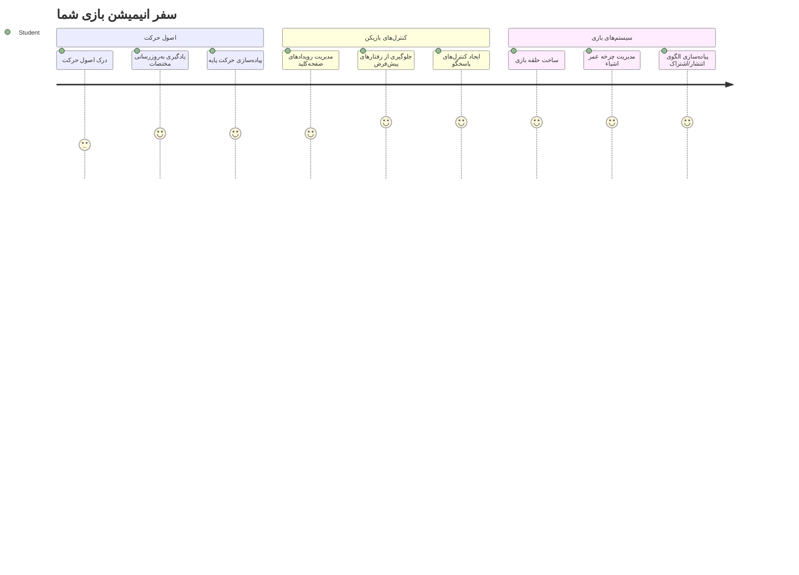
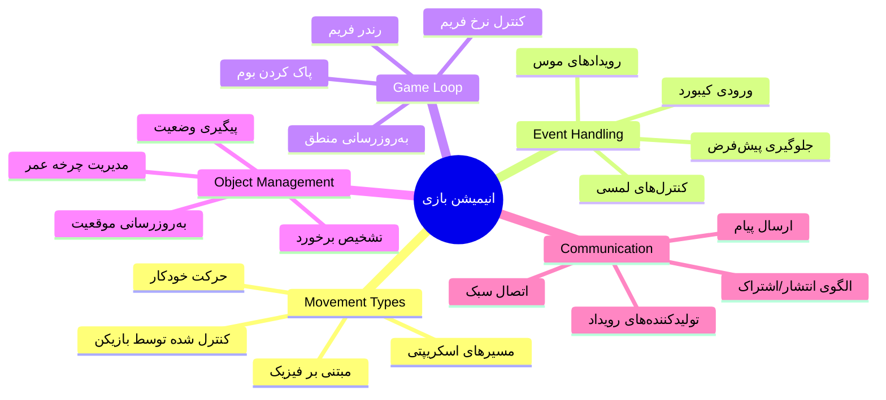
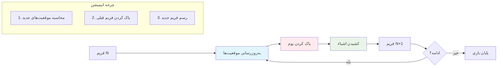
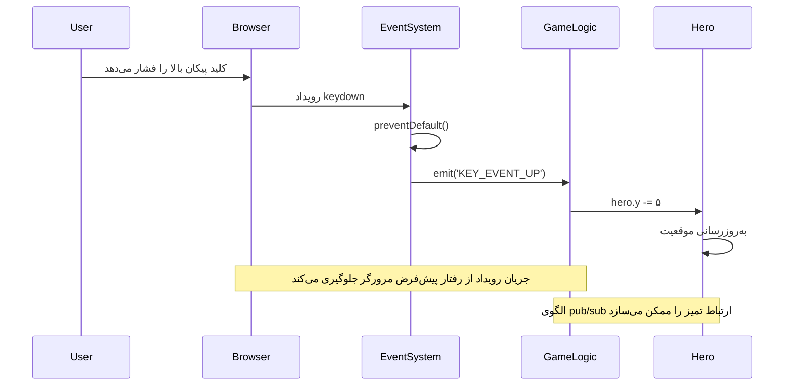
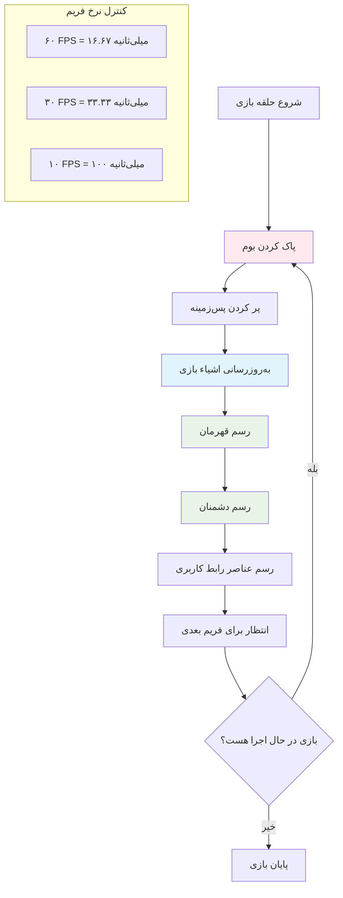
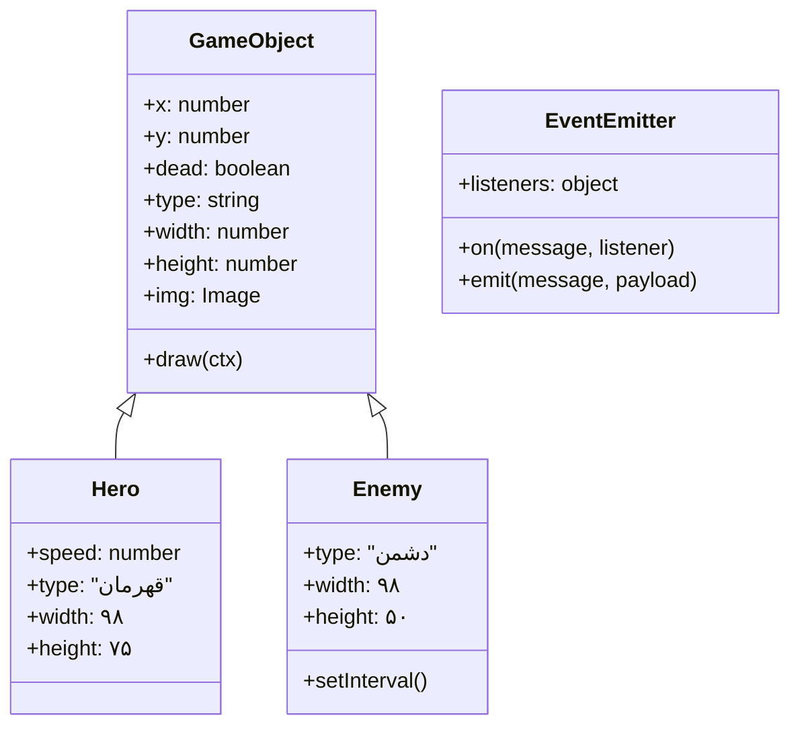
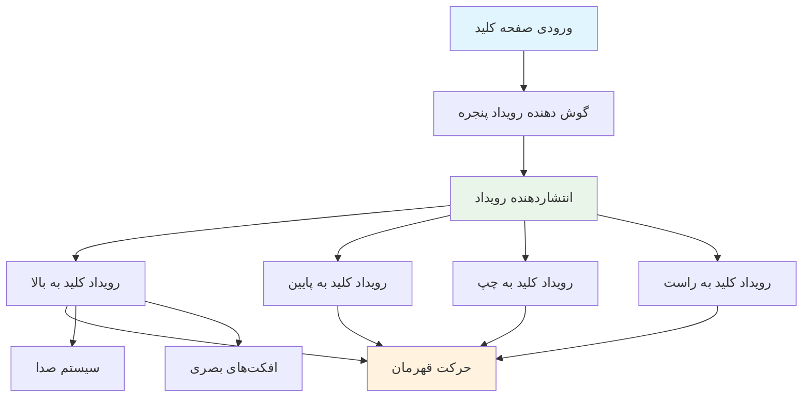
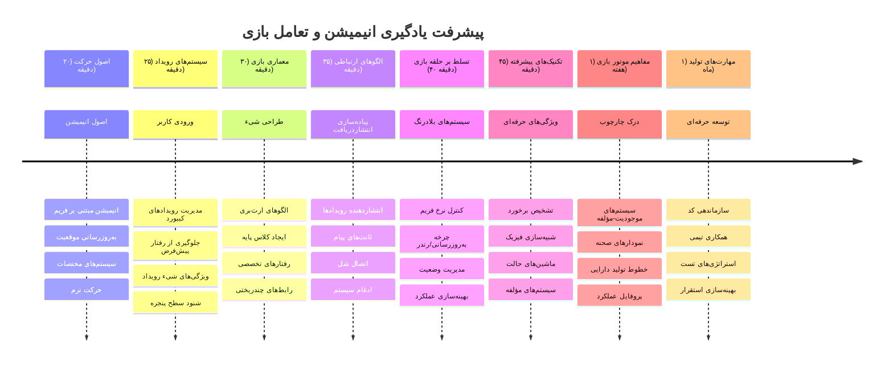

<!--
CO_OP_TRANSLATOR_METADATA:
{
  "original_hash": "8c55a2bd4bc0ebe4c88198fd563a9e09",
  "translation_date": "2026-01-06T10:11:02+00:00",
  "source_file": "6-space-game/3-moving-elements-around/README.md",
  "language_code": "fa"
}
-->
# ساخت یک بازی فضایی بخش ۳: افزودن حرکت


به بازی‌های مورد علاقه‌تان فکر کنید – چیزی که آن‌ها را جذاب می‌کند فقط گرافیک‌های زیبا نیست، بلکه نحوه حرکت و واکنش همه چیز به عمل‌های شماست. همین حالا بازی فضایی شما مانند یک نقاشی زیباست، اما ما قصد داریم حرکتی به آن اضافه کنیم که آن را زنده کند.

وقتی مهندسان ناسا کامپیوتر راهنمای مأموریت‌های آپولو را برنامه‌نویسی کردند، با چالشی مشابه روبرو بودند: چگونه می‌توان یک سفینه فضایی را طوری پاسخگو کرد که به ورودی خلبان واکنش نشان دهد و در عین حال تصحیح خودکار مسیر را حفظ کند؟ اصولی که امروز یاد می‌گیریم همان مفاهیمی هستند که مدیریت حرکت تحت کنترل بازیکن در کنار رفتارهای خودکار سیستم را پوشش می‌دهند.

در این درس، یاد می‌گیرید چگونه سفینه‌های فضایی را در صفحه نمایش سر بخورانید، به فرمان‌های بازیکن پاسخ دهید و الگوهای حرکت روان ایجاد کنید. همه چیز را به مفاهیم قابل مدیریت تقسیم می‌کنیم که به صورت طبیعی بر یکدیگر بنا می‌شوند.

در پایان، بازیکنان کشتی قهرمان خود را در صفحه پرواز خواهند داد در حالی که کشتی‌های دشمن بالای سر گشت‌زنی می‌کنند. مهم‌تر از همه، اصول بنیادینی را درک خواهید کرد که سیستم‌های حرکت بازی را قدرت می‌بخشند.


## آزمون پیش از درس

[آزمون پیش از درس](https://ff-quizzes.netlify.app/web/quiz/33)

## درک حرکت بازی

بازی‌ها زمانی زنده می‌شوند که چیزها شروع به حرکت کنند، و اساساً دو روش برای این اتفاق وجود دارد:

- **حرکت تحت کنترل بازیکن**: وقتی یک کلید فشار می‌دهید یا روی ماوس کلیک می‌کنید، چیزی حرکت می‌کند. این ارتباط مستقیم شما با دنیای بازی است.
- **حرکت خودکار**: وقتی خود بازی تصمیم می‌گیرد چیزی را حرکت دهد – مانند کشتی‌های دشمن که باید در صفحه گشت بزنند چه شما کاری انجام دهید و چه ندهید.

حرکت دادن اشیاء روی صفحه نمایش کامپیوتر ساده‌تر از چیزی است که فکر می‌کنید. آن مختصات x و y را که در کلاس ریاضی یاد گرفتید، به خاطر دارید؟ دقیقاً همان چیزی است که اینجا با آن کار می‌کنیم. وقتی گالیله در سال 1610 قمرهای مشتری را ردیابی می‌کرد، اساساً همین کار را می‌کرد – موقعیت‌ها را در طول زمان ترسیم می‌کرد تا الگوهای حرکت را بفهمد.

حرکت دادن اشیاء روی صفحه نمایش شبیه ساخت یک انیمیشن کتابچه‌ای است – باید این سه مرحله ساده را دنبال کنید:


1. **بروزرسانی موقعیت** – تغییر جایی که شیء باید باشد (مثلاً ۵ پیکسل به سمت راست حرکت کند)
2. **پاک کردن فریم قدیمی** – صفحه را پاک کنید تا ردهای ارواح را نبینید
3. **رسم فریم جدید** – شیء خود را در جای جدید بگذارید

این کار را به اندازه کافی سریع انجام دهید، و بوم! حرکت روانی دارید که برای بازیکنان طبیعی به نظر می‌رسد.

این چیزی است که می‌تواند در کد به این صورت به نظر برسد:

```javascript
// موقعیت قهرمان را تنظیم کنید
hero.x += 5;
// مستطیلی که قهرمان در آن قرار دارد را پاک کنید
ctx.clearRect(0, 0, canvas.width, canvas.height);
// پس‌زمینه بازی و قهرمان را دوباره رسم کنید
ctx.fillRect(0, 0, canvas.width, canvas.height);
ctx.fillStyle = "black";
ctx.drawImage(heroImg, hero.x, hero.y);
```

**این کد چه کاری انجام می‌دهد:**
- **مختصات x قهرمان** را ۵ پیکسل افزایش می‌دهد تا به صورت افقی حرکت کند
- **کل بوم را پاک می‌کند** تا فریم قبلی حذف شود
- **بوم را با رنگ پس‌زمینه سیاه پر می‌کند**
- **تصویر قهرمان را در موقعیت جدیدش دوباره رسم می‌کند**

✅ می‌توانید دلیل احتمالی‌ای را که چرا رسم مجدد قهرمان در فریم‌های زیاد ممکن است باعث افزایش هزینه عملکرد شود، بیان کنید؟ درباره [گزینه‌های جایگزین این الگو](https://developer.mozilla.org/en-US/docs/Web/API/Canvas_API/Tutorial/Optimizing_canvas) بخوانید.

## مدیریت رویدادهای صفحه کلید

اینجا جایی است که ورودی بازیکن به عملکرد بازی متصل می‌شود. وقتی کسی کلید فاصله را برای شلیک لیزر فشار می‌دهد یا کلید جهت را برای جاخالی دادن از یک سیارک می‌زند، بازی شما باید آن ورودی را شناسایی و واکنش نشان دهد.

رویدادهای صفحه کلید در سطح پنجره رخ می‌دهند، یعنی کل پنجره مرورگر شما منتظر آن فشار کلیدها است. در مقابل، کلیک‌های ماوس می‌توانند به عناصر خاصی (مثلاً کلیک روی یک دکمه) گره خورده باشند. برای بازی فضایی ما، تمرکزمان روی کنترل‌های صفحه کلید است زیرا این همان چیزی است که حس کلاسیک آرکید را می‌دهد.

این موضوع به من یادآوری می‌کند که چگونه اپراتورهای تلگراف در قرن ۱۸ مجبور بودند ورودی کد مورس را به پیام‌های معنادار تبدیل کنند – ما نیز کاری مشابه انجام می‌دهیم، ترجمه فشار کلیدها به فرمان‌های بازی.

برای مدیریت یک رویداد باید از متد `addEventListener()` پنجره استفاده کنید و دو پارامتر ورودی به آن بدهید. پارامتر اول نام رویداد است، مثلاً `keyup`. پارامتر دوم تابعی است که باید پس از رخ دادن رویداد فراخوانی شود.

مثالی در زیر آمده است:

```javascript
window.addEventListener('keyup', (evt) => {
  // evt.key = نمایش رشته‌ای کلید
  if (evt.key === 'ArrowUp') {
    // انجام کاری
  }
});
```

**شرح اتفاقاتی که اینجا می‌افتد:**
- **گوش می‌دهد** به رویدادهای صفحه کلید در کل پنجره
- **رویداد را می‌گیرد** که اطلاعاتی درباره کلیدی که فشار داده شده در خود دارد
- **بررسی می‌کند** آیا کلید فشار داده شده کلید خاصی است (در این حالت، کلید پیکان بالا)
- **کدی را اجرا می‌کند** وقتی شرط برآورده شود

برای رویدادهای کلید دو خصوصیت روی رویداد وجود دارد که می‌توانید ببینید کدام کلید فشار داده شده:

- `key` - این یک رشته است که کلید فشار داده شده را نشان می‌دهد، مثلاً `'ArrowUp'`
- `keyCode` - این یک عدد است، مثلاً `37` که متناظر با `ArrowLeft` است

✅ تغییر رویدادهای کلیدی کاربردهایی فراتر از توسعه بازی دارد. شما به چه کاربردهایی برای این تکنیک فکر می‌کنید؟


### کلیدهای خاص: نکته‌ای مهم!

برخی کلیدها رفتارهای پیش‌فرض مرورگر دارند که ممکن است با بازی شما تداخل پیدا کند. کلیدهای پیکان صفحه را پیمایش می‌کنند و کلید فاصله صفحه را به پایین می‌برد – رفتارهایی که هنگام هدایت سفینه فضایی نمی‌خواهید.

ما می‌توانیم این رفتارهای پیش‌‌فرض را جلوگیری کنیم و اجازه دهیم بازی ما خودش ورودی را مدیریت کند. این شبیه به کاری است که برنامه‌نویسان اولیه کامپیوتر می‌کردند تا وقفه‌های سیستم را برای ایجاد رفتارهای سفارشی نادیده بگیرند – ما این کار را در سطح مرورگر انجام می‌دهیم. این نحوه انجام آن است:

```javascript
const onKeyDown = function (e) {
  console.log(e.keyCode);
  switch (e.keyCode) {
    case 37:
    case 39:
    case 38:
    case 40: // کلیدهای جهت‌نما
    case 32:
      e.preventDefault();
      break; // فاصله
    default:
      break; // سایر کلیدها را مسدود نکنید
  }
};

window.addEventListener('keydown', onKeyDown);
```

**درک این کد جلوگیری:**
- **بررسی** کلیدهای مشخصی که ممکن است باعث رفتار ناخواسته مرورگر شوند
- **جلوگیری** از عملکرد پیش‌فرض مرورگر برای کلیدهای پیکان و فاصله
- **اجازه** دادن به دیگر کلیدها برای عملکرد عادی
- **استفاده** از `e.preventDefault()` برای متوقف کردن رفتار تعبیه شده مرورگر

### 🔄 **بررسی آموزشی**
**درک مدیریت رویداد**: پیش از رفتن به حرکت خودکار، اطمینان حاصل کنید که می‌توانید:
- ✅ تفاوت رویدادهای `keydown` و `keyup` را توضیح دهید
- ✅ دلیل جلوگیری از رفتارهای پیش‌فرض مرورگر را بفهمید
- ✅ توضیح دهید که چگونه گوش‌کننده‌های رویداد ورودی کاربر را به منطق بازی متصل می‌کنند
- ✅ تشخیص دهید کدام کلیدها می‌توانند با کنترل‌های بازی تداخل داشته باشند

**آزمون سریع خودکار**: اگر رفتار پیش‌فرض برای کلیدهای پیکان را متوقف نکنید، چه اتفاقی می‌افتد؟
*پاسخ: مرورگر صفحه را پیمایش می‌کند و با حرکت بازی تداخل می‌کند*

**معماری سیستم رویداد**: اکنون درک می‌کنید:
- **گوش دادن در سطح پنجره**: گرفتن رویدادها در سطح مرورگر
- **خصوصیات شی رویداد**: رشته‌های `key` در مقابل شماره‌های `keyCode`
- **جلوگیری از پیش‌فرض**: متوقف کردن رفتارهای ناخواسته مرورگر
- **منطق شرطی**: واکنش به ترکیب کلیدهای خاص

## حرکت القاشده توسط بازی

حال بیایید درباره اشیایی صحبت کنیم که بدون ورودی بازیکن حرکت می‌کنند. فکر کنید به کشتی‌های دشمن که در صفحه گشت می‌زنند، گلوله‌هایی که در خطوط مستقیم پرواز می‌کنند، یا ابرهایی که در پس‌زمینه شناورند. این حرکت خودکار باعث می‌شود جهان بازی حتی وقتی کسی کنترل را لمس نمی‌کند، زنده به نظر برسد.

ما از تایمرهای داخلی جاوااسکریپت استفاده می‌کنیم تا موقعیت‌ها را در فواصل منظم به‌روزرسانی کنیم. این مفهوم شبیه به عملکرد ساعت‌های پاندول‌دار است – مکانیزمی منظم که اقدامات زمان‌بندی شده ثابت را فعال می‌کند. اینقدر ساده است:

```javascript
const id = setInterval(() => {
  // دشمن را در محور y جابجا کنید
  enemy.y += 10;
}, 100);
```

**این کد حرکت چه می‌کند:**
- **ایجاد** تایمری که هر ۱۰۰ میلی‌ثانیه اجرا می‌شود
- **بروزرسانی** مختصات y دشمن هر بار ۱۰ پیکسل
- **ذخیره** شناسه بازه زمانی تا در صورت نیاز بتوانیم آن را متوقف کنیم
- **حرکت دادن** دشمن به صورت خودکار به سمت پایین صفحه

## حلقه بازی

اینجا مفهومی است که همه چیز را به هم پیوند می‌دهد – حلقه بازی. اگر بازی شما یک فیلم بود، حلقه بازی همان پروژکتور فیلم بود که فریم به فریم را آنقدر سریع نشان می‌دهد که همه چیز به صورت روان به نظر برسد.

هر بازی یکی از این حلقه‌ها را پشت صحنه اجرا می‌کند. این یک تابع است که همه اشیای بازی را به‌روزرسانی می‌کند، صفحه را دوباره رسم می‌کند و این فرایند را به طور مداوم تکرار می‌کند. این تابع وضعیت قهرمان شما، همه دشمن‌ها، هر لیزری را که پرواز می‌کند – کل وضعیت بازی را مدیریت می‌کند.

این مفهوم من را یاد انیماتورهای اولیه فیلم مانند والت دیزنی می‌اندازد که مجبور بودند شخصیت‌ها را فریم به فریم بازنقش کنند تا توهم حرکت را ایجاد کنند. ما همین کار را انجام می‌دهیم، فقط با کد به جای مداد.

یک حلقه بازی معمولی به این شکل می‌تواند باشد، به صورت کد بیان شده:


```javascript
const gameLoopId = setInterval(() => {
  function gameLoop() {
    ctx.clearRect(0, 0, canvas.width, canvas.height);
    ctx.fillStyle = "black";
    ctx.fillRect(0, 0, canvas.width, canvas.height);
    drawHero();
    drawEnemies();
    drawStaticObjects();
  }
  gameLoop();
}, 200);
```

**درک ساختار حلقه بازی:**
- **پاک کردن** کل بوم برای حذف فریم قبلی
- **پرکردن** پس‌زمینه با یک رنگ ثابت
- **رسم کردن** همه اشیای بازی در موقعیت‌های فعلی‌شان
- **تکرار** این فرایند هر ۲۰۰ میلی‌ثانیه برای ایجاد انیمیشن روان
- **مدیریت** نرخ فریم با کنترل زمان‌بندی بازه

## ادامه بازی فضایی

اکنون حرکت را به صحنه ساکن که قبلاً ساخته‌اید اضافه می‌کنیم. قرار است آن را از یک عکس ثابت به تجربه‌ای تعاملی تبدیل کنیم. گام به گام پیش می‌رویم تا هر قسمت به صورت پیوسته بر قسمت قبل بنا شود.

کد را از جایی که در درس قبلی متوقف شده بودید بردارید (یا اگر نیاز به شروع تازه دارید، با کد داخل پوشه [Part II- starter](../../../../6-space-game/3-moving-elements-around/your-work) شروع کنید).

**امروز این موارد را می‌سازیم:**
- **کنترل‌های قهرمان**: کلیدهای پیکان کشتی فضایی شما را در صفحه هدایت می‌کنند
- **حرکت دشمن**: آن کشتی‌های بیگانه شروع به پیشروی می‌کنند

بیایید شروع به پیاده‌سازی این ویژگی‌ها کنیم.

## مراحل پیشنهادی

فایل‌هایی که برای شما در زیرپوشه `your-work` ایجاد شده‌اند را بیابید. باید شامل موارد زیر باشند:

```bash
-| assets
  -| enemyShip.png
  -| player.png
-| index.html
-| app.js
-| package.json
```

شما پروژه‌تان را در پوشه `your-work` با تایپ دستور زیر شروع می‌کنید:

```bash
cd your-work
npm start
```

**این دستور چه کاری انجام می‌دهد:**
- **رفتن** به دایرکتوری پروژه شما
- **راه‌اندازی** یک سرور HTTP در آدرس `http://localhost:5000`
- **خدمت‌رسانی** فایل‌های بازی شما تا بتوانید آن‌ها را در مرورگر تست کنید

طبق بالا یک سرور HTTP در آدرس `http://localhost:5000` راه‌اندازی خواهد شد. یک مرورگر باز کنید و آن آدرس را وارد کنید، وضعیت فعلی باید قهرمان و همه دشمنان را نشان دهد؛ اما هنوز هیچ حرکتی ندارید!

### افزودن کد

1. **اضافه کردن اشیای اختصاصی** برای `hero` و `enemy` و `game object` که باید ویژگی‌های `x` و `y` داشته باشند. (بخشی که درباره [ارث‌بری یا ترکیب](../README.md) بود را به خاطر داشته باشید).

   *راهنمایی* `game object` باید همان کسی باشد که `x` و `y` و توانایی رسم خود روی بوم را دارد.

   > **نکته**: با افزودن کلاس جدید `GameObject` با سازنده تعریف شده به شکل زیر شروع کنید و سپس آن را روی بوم رسم کنید:

    ```javascript
    class GameObject {
      constructor(x, y) {
        this.x = x;
        this.y = y;
        this.dead = false;
        this.type = "";
        this.width = 0;
        this.height = 0;
        this.img = undefined;
      }
    
      draw(ctx) {
        ctx.drawImage(this.img, this.x, this.y, this.width, this.height);
      }
    }
    ```

    **درک این کلاس پایه:**
    - **تعریف** ویژگی‌های مشترکی که همه اشیای بازی دارند (مکان، اندازه، تصویر)
    - **شامل** یک پرچم `dead` برای پیگیری اینکه آیا شیء باید حذف شود
    - **ارائه** متد `draw()` که شیء را روی بوم رسم می‌کند
    - **تنظیم** مقادیر پیش‌فرض برای همه ویژگی‌ها که کلاس‌های فرزند می‌توانند بازنویسی کنند


    حالا این `GameObject` را گسترش دهید تا `Hero` و `Enemy` را ایجاد کنید:
    
    ```javascript
    class Hero extends GameObject {
      constructor(x, y) {
        super(x, y);
        this.width = 98;
        this.height = 75;
        this.type = "Hero";
        this.speed = 5;
      }
    }
    ```

    ```javascript
    class Enemy extends GameObject {
      constructor(x, y) {
        super(x, y);
        this.width = 98;
        this.height = 50;
        this.type = "Enemy";
        const id = setInterval(() => {
          if (this.y < canvas.height - this.height) {
            this.y += 5;
          } else {
            console.log('Stopped at', this.y);
            clearInterval(id);
          }
        }, 300);
      }
    }
    ```

    **مفاهیم کلیدی در این کلاس‌ها:**
    - **ارث‌بری** از `GameObject` با استفاده از کلمه کلیدی `extends`
    - **فراخوانی** سازنده والد با `super(x, y)`
    - **تنظیم** ابعاد و ویژگی‌های خاص برای هر نوع شیء
    - **پیاده‌سازی** حرکت خودکار برای دشمن‌ها با استفاده از `setInterval()`

2. **افزودن هندلرهای رویداد کلید** برای مدیریت ناوبری کلید (حرکت قهرمان به بالا/پایین/چپ/راست)

   *یادتان باشد* این یک سیستم کارتزین است، بالا-چپ مختصات `0,0` است. همچنین یادتان باشد که کد جلوگیری از *رفتار پیش‌فرض* را اضافه کنید.

   > **نکته**: تابع `onKeyDown` خود را بسازید و به پنجره متصل کنید:

   ```javascript
   const onKeyDown = function (e) {
     console.log(e.keyCode);
     // کد درس بالا را برای جلوگیری از رفتار پیش‌فرض اضافه کنید
     switch (e.keyCode) {
       case 37:
       case 39:
       case 38:
       case 40: // کلیدهای جهت
       case 32:
         e.preventDefault();
         break; // فاصله
       default:
         break; // کلیدهای دیگر را مسدود نکنید
     }
   };

   window.addEventListener("keydown", onKeyDown);
   ```
    
   **این هندلر رویداد چه کار می‌کند:**
   - **گوش دادن** به رویدادهای keydown در کل پنجره
   - **ثبت** کد کلید برای کمک به دیباگ اینکه کدام کلیدها فشرده شده‌اند
   - **جلوگیری** از رفتار پیش‌فرض مرورگر برای کلیدهای پیکان و فاصله
   - **اجازه** دادن به کلیدهای دیگر برای عملکرد نرمال
   
   کنسول مرورگرتان را در این مرحله بررسی کنید و کلیدهای زده شده را ببینید که ثبت می‌شوند.

3. **اجرای الگوی Pub Sub** ([الگو را اینجا ببینید](../README.md))، این کار کد شما را مرتب نگه می‌دارد همانطور که باقی بخش‌ها را دنبال می‌کنید.

   الگوی انتشار-اشتراک به شما کمک می‌کند کدتان را با جدا کردن تشخیص رویداد از مدیریت رویداد سازماندهی کنید. این کد شما را مدولارتر و نگهداری آن را آسان‌تر می‌کند.

   برای انجام این بخش آخر، می‌توانید:

   1. **افزودن یک گوش‌کننده رویداد** به پنجره:

       ```javascript
       window.addEventListener("keyup", (evt) => {
         if (evt.key === "ArrowUp") {
           eventEmitter.emit(Messages.KEY_EVENT_UP);
         } else if (evt.key === "ArrowDown") {
           eventEmitter.emit(Messages.KEY_EVENT_DOWN);
         } else if (evt.key === "ArrowLeft") {
           eventEmitter.emit(Messages.KEY_EVENT_LEFT);
         } else if (evt.key === "ArrowRight") {
           eventEmitter.emit(Messages.KEY_EVENT_RIGHT);
         }
       });
       ```

   **این سیستم رویداد چه کاری انجام می‌دهد:**
   - **شناسایی** ورودی صفحه کلید و تبدیل آن به رویدادهای سفارشی بازی
   - **جدا کردن** تشخیص ورودی از منطق بازی
   - **سهولت** در تغییر کنترل‌ها بعداً بدون تاثیر روی کد بازی
   - **اجازه** دادن به سیستم‌های متعدد برای پاسخ به همان ورودی


   2. **ساخت یک کلاس EventEmitter** برای انتشار و اشتراک پیام‌ها:

       ```javascript
       class EventEmitter {
         constructor() {
           this.listeners = {};
         }
       
         on(message, listener) {
           if (!this.listeners[message]) {
             this.listeners[message] = [];
           }
           this.listeners[message].push(listener);
         }
       
   
   3. **افزودن ثابت‌ها** و راه‌اندازی EventEmitter:

       ```javascript
       const Messages = {
         KEY_EVENT_UP: "KEY_EVENT_UP",
         KEY_EVENT_DOWN: "KEY_EVENT_DOWN",
         KEY_EVENT_LEFT: "KEY_EVENT_LEFT",
         KEY_EVENT_RIGHT: "KEY_EVENT_RIGHT",
       };
       
       let heroImg, 
           enemyImg, 
           laserImg,
           canvas, ctx, 
           gameObjects = [], 
           hero, 
           eventEmitter = new EventEmitter();
       ```

   **درک تنظیمات:**
   - **تعریف** ثابت‌های پیام برای جلوگیری از اشتباهات تایپی و سهولت اصلاح کد
   - **اعلام** متغیرها برای تصاویر، کانتکست بوم و وضعیت بازی
   - **ایجاد** یک انتشاردهنده رویداد جهانی برای سیستم انتشار-اشتراک
   - **آرایه‌ای را مقداردهی اولیه می‌کند** تا همه اشیاء بازی را در خود نگه دارد

   4. **بازی را مقداردهی اولیه کنید**

       ```javascript
       function initGame() {
         gameObjects = [];
         createEnemies();
         createHero();
       
         eventEmitter.on(Messages.KEY_EVENT_UP, () => {
           hero.y -= 5;
         });
       
         eventEmitter.on(Messages.KEY_EVENT_DOWN, () => {
           hero.y += 5;
         });
       
         eventEmitter.on(Messages.KEY_EVENT_LEFT, () => {
           hero.x -= 5;
         });
       
4. **راه‌اندازی حلقه بازی**

   تابع `window.onload` را بازنویسی کنید تا بازی را مقداردهی اولیه کند و یک حلقه بازی با فاصله زمانی مناسب راه‌اندازی کند. همچنین یک پرتو لیزر اضافه خواهید کرد:

    ```javascript
    window.onload = async () => {
      canvas = document.getElementById("canvas");
      ctx = canvas.getContext("2d");
      heroImg = await loadTexture("assets/player.png");
      enemyImg = await loadTexture("assets/enemyShip.png");
      laserImg = await loadTexture("assets/laserRed.png");
    
      initGame();
      const gameLoopId = setInterval(() => {
        ctx.clearRect(0, 0, canvas.width, canvas.height);
        ctx.fillStyle = "black";
        ctx.fillRect(0, 0, canvas.width, canvas.height);
        drawGameObjects(ctx);
      }, 100);
    };
    ```

   **درک راه‌اندازی بازی:**
   - **منتظر می‌ماند** تا صفحه کاملاً بارگذاری شود قبل از شروع
   - **عنصر canvas و زمینه رندر دوبعدی آن را دریافت می‌کند**
   - **تمام دارایی‌های تصویری را به صورت ناهمزمان و با استفاده از `await` بارگذاری می‌کند**
   - **حلقه بازی را با فواصل 100 میلی‌ثانیه (10 فریم بر ثانیه) آغاز می‌کند**
   - **هر فریم کل صفحه را پاک کرده و دوباره رسم می‌کند**

5. **کدی اضافه کنید** که دشمنان را در یک فاصله زمانی معین حرکت دهد

    تابع `createEnemies()` را بازنویسی کنید تا دشمنان را ایجاد کرده و آنها را به کلاس gameObjects جدید اضافه کند:

    ```javascript
    function createEnemies() {
      const MONSTER_TOTAL = 5;
      const MONSTER_WIDTH = MONSTER_TOTAL * 98;
      const START_X = (canvas.width - MONSTER_WIDTH) / 2;
      const STOP_X = START_X + MONSTER_WIDTH;
    
      for (let x = START_X; x < STOP_X; x += 98) {
        for (let y = 0; y < 50 * 5; y += 50) {
          const enemy = new Enemy(x, y);
          enemy.img = enemyImg;
          gameObjects.push(enemy);
        }
      }
    }
    ```

    **کارکرد ایجاد دشمنان:**
    - **موقعیت‌ها را محاسبه می‌کند تا دشمنان در مرکز صفحه قرار گیرند**
    - **یک شبکه از دشمنان با استفاده از حلقه‌های تو در تو ایجاد می‌کند**
    - **تصویر دشمن را به هر شیء دشمن اختصاص می‌دهد**
    - **هر دشمن را به آرایه جهانی اشیاء بازی اضافه می‌کند**
    
    و تابع `createHero()` را اضافه کنید تا فرآیندی مشابه برای قهرمان انجام دهد.
    
    ```javascript
    function createHero() {
      hero = new Hero(
        canvas.width / 2 - 45,
        canvas.height - canvas.height / 4
      );
      hero.img = heroImg;
      gameObjects.push(hero);
    }
    ```

    **کارکرد ایجاد قهرمان:**
    - **قهرمان را در وسط پایین صفحه قرار می‌دهد**
    - **تصویر قهرمان را به شیء قهرمان اختصاص می‌دهد**
    - **قهرمان را برای رندر شدن به آرایه اشیاء بازی اضافه می‌کند**

    و در نهایت، تابع `drawGameObjects()` را اضافه کنید تا رسم شروع شود:

    ```javascript
    function drawGameObjects(ctx) {
      gameObjects.forEach(go => go.draw(ctx));
    }
    ```

    **درک تابع رسم:**
    - **از روی تمام اشیاء بازی در آرایه عبور می‌کند**
    - **متد `draw()` را روی هر شی فراخوانی می‌کند**
    - **زمینه canvas را منتقل می‌کند تا اشیاء بتوانند خود را رندر کنند**

    ### 🔄 **بررسی آموزشی**
    **درک کامل سیستم بازی**: تسلط خود را بر کل معماری بررسی کنید:
    - ✅ ارث‌بری چگونه به Hero و Enemy اجازه می‌دهد خصوصیات مشترک GameObject را به‌اشتراک بگذارند؟
    - ✅ چرا الگوی pub/sub نگهداری کد شما را آسان‌تر می‌کند؟
    - ✅ حلقه بازی چه نقشی در ایجاد انیمیشن روان دارد؟
    - ✅ شنونده‌های رویداد چگونه ورودی کاربر را به رفتار اشیاء بازی متصل می‌کنند؟

    **ادغام سیستم**: بازی شما اکنون نشان می‌دهد:
    - **طراحی شیءگرا**: کلاس‌های پایه با ارث‌بری تخصصی شده
    - **معماری رویدادمحور**: الگوی pub/sub برای اتصال کم
    - **چارچوب انیمیشن**: حلقه بازی با به‌روزرسانی فریم‌های پی‌درپی
    - **مدیریت ورودی**: رویدادهای صفحه‌کلید با جلوگیری از رفتار پیش‌فرض
    - **مدیریت دارایی**: بارگذاری تصویر و رندر اسپریت

    **الگوهای حرفه‌ای**: شما پیاده‌سازی کرده‌اید:
    - **جداسازی نگرانی‌ها**: جدا بودن ورودی، منطق و رندر
    - **چندریختی**: همه اشیاء بازی رابط رسم مشترک دارند
    - **ارسال پیام‌ها**: ارتباط پاک بین اجزاء
    - **مدیریت منابع**: مدیریت کارآمد اسپریت‌ها و انیمیشن‌ها

    دشمنانتان باید شروع به پیشروی روی سفینه قهرمان شما کنند!
      }
    }
    ```
    
    and add a `createHero()` function to do a similar process for the hero.
    
    ```javascript
    function createHero() {
      hero = new Hero(
        canvas.width / 2 - 45,
        canvas.height - canvas.height / 4
      );
      hero.img = heroImg;
      gameObjects.push(hero);
    }
    ```

    و در نهایت، تابع `drawGameObjects()` را اضافه کنید تا رسم شروع شود:

    ```javascript
    function drawGameObjects(ctx) {
      gameObjects.forEach(go => go.draw(ctx));
    }
    ```

    دشمنانتان باید شروع به پیشروی روی سفینه قهرمان شما کنند!

---

## چالش GitHub Copilot Agent 🚀

اینجا چالشی است که کیفیت بازی شما را بهبود می‌بخشد: اضافه کردن مرزها و کنترل‌های روان. در حال حاضر، قهرمان شما می‌تواند از صفحه خارج شود و حرکت ممکن است تکه‌تکه به نظر برسد.

**ماموریت شما:** سفینه فضایی خود را واقعی‌تر کنید با پیاده‌سازی مرزهای صفحه و حرکت نرم. این شبیه سیستم‌های کنترل پرواز ناسا است که از عبور سفینه‌ها از پارامترهای عملیاتی ایمن جلوگیری می‌کنند.

**چه چیزی بسازید:** سیستمی بسازید که سفینه قهرمان شما را در صفحه نگه دارد و کنترل‌ها را روان کند. وقتی بازیکنان کلید پیکان را نگه می‌دارند، سفینه باید به طور مداوم لغزندگی کند به جای حرکت‌های گسسته. فکر کنید که وقتی سفینه به مرزهای صفحه می‌رسد، بازخورد بصری اضافه کنید – شاید یک اثر ظریف برای نشان دادن لبه منطقه بازی.

برای کسب اطلاعات بیشتر درباره [حالت agent](https://code.visualstudio.com/blogs/2025/02/24/introducing-copilot-agent-mode) اینجا را ببینید.

## 🚀 چالش

سازماندهی کد به‌مرور زمان اهمیت بیشتری پیدا می‌کند، مخصوصاً وقتی پروژه‌ها بزرگ‌تر می‌شوند. ممکن است متوجه شده باشید فایل شما شلوغ از توابع، متغیرها و کلاس‌های مخلوط است. این شما را یاد مهندسانی می‌اندازد که کد ماموریت آپولو را سازماندهی کردند و سیستم‌هایی واضح و قابل نگهداری ایجاد کردند تا چند تیم بتوانند همزمان روی آنها کار کنند.

**ماموریت شما:**
مثل یک معمار نرم‌افزار فکر کنید. چگونه کد خود را سازماندهی می‌کنید که شش ماه دیگر شما یا همکارتان بتوانید آنچه اتفاق می‌افتد را بفهمید؟ حتی اگر همه چیز در یک فایل بماند، می‌توانید سازماندهی بهتری داشته باشید:

- **گروه‌بندی توابع مرتبط** با سربرگ‌های کامنت واضح  
- **جداسازی نگرانی‌ها** - منطق بازی را از رندر جدا نگه دارید  
- **استفاده از نامگذاری سازگار** برای متغیرها و توابع  
- **ایجاد ماژول‌ها** یا فضای نام برای سازماندهی بخش‌های مختلف بازی  
- **افزودن مستندات** که هدف هر بخش اصلی را توضیح دهد

**سؤالات بازتابی:**
- کدام بخش‌های کد شما در بازگشت سخت‌تر فهمیده می‌شود؟
- چگونه می‌توانید کد خود را سازماندهی کنید تا برای دیگران آسان‌تر باشد مشارکت کنند؟
- اگر بخواهید ویژگی‌های جدیدی مانند قدرت‌ها یا نوع‌های مختلف دشمن اضافه کنید چه اتفاقی می‌افتد؟

## آزمون پس از کلاس

[آزمون پس از کلاس](https://ff-quizzes.netlify.app/web/quiz/34)

## مروری و مطالعه خودخوان

ما همه چیز را از صفر ساختیم که عالی است برای یادگیری، اما این یک راز کوچک است – چندین فریم‌ورک جاوااسکریپت عالی وجود دارد که می‌توانند بخش زیادی از وظایف سنگین را برای شما انجام دهند. پس از اینکه با اصول پایه که پوشش دادیم راحت شدید، ارزش دارد که [بررسی کنید چه چیزی در دسترس است](https://github.com/collections/javascript-game-engines).

فریم‌ورک‌ها مانند داشتن یک جعبه‌ابزار پر شده از ابزار هستند به جای ساختن تک‌تک ابزارها با دست. آنها می‌توانند بسیاری از چالش‌های سازماندهی کد که صحبت کردیم را حل کنند و امکاناتی ارائه دهند که ساختن دستی‌شان هفته‌ها طول می‌کشد.

**مواردی که ارزش بررسی دارند:**
- چگونه موتورهای بازی کد را سازماندهی می‌کنند – الگوهای هوشمندانه‌ای که استفاده می‌کنند شما را شگفت‌زده می‌کند  
- ترفندهای عملکرد برای اجرای روان بازی‌های canvas  
- ویژگی‌های مدرن جاوااسکریپت که کد شما را تمیزتر و قابل نگهداری‌تر می‌کند  
- رویکردهای مختلف برای مدیریت اشیاء بازی و روابط‌شان

## 🎯 جدول زمانی تسلط بر انیمیشن بازی شما


### 🛠️ خلاصه ابزارهای توسعه بازی شما

پس از اتمام این درس، حالا در موارد زیر تسلط دارید:
- **اصول انیمیشن**: حرکت فریم‌محور و انتقالات نرم  
- **برنامه‌نویسی رویدادمحور**: مدیریت ورودی صفحه‌کلید با مدیریت رویداد مناسب  
- **طراحی شیءگرا**: سلسله‌مراتب ارث و رابط‌های چندریختی  
- **الگوهای ارتباطی**: معماری pub/sub برای کد قابل نگهداری  
- **معماری حلقه بازی**: چرخه‌های بروز رسانی و رندر در زمان واقعی  
- **سیستم‌های ورودی**: نگاشت کنترل کاربر با جلوگیری از رفتار پیش‌فرض  
- **مدیریت دارایی**: بارگذاری اسپریت و تکنیک‌های رندر بهینه

### ⚡ **آنچه در ۵ دقیقه آینده می‌توانید انجام دهید**
- [ ] کنسول مرورگر را باز کنید و `addEventListener('keydown', console.log)` را امتحان کنید تا رویدادهای صفحه‌کلید را ببینید  
- [ ] یک عنصر div ساده بسازید و با کلیدهای پیکان آن را حرکت دهید  
- [ ] با `setInterval` آزمایش کنید برای ایجاد حرکت مداوم  
- [ ] تلاش کنید با `event.preventDefault()` از رفتار پیش‌فرض جلوگیری کنید

### 🎯 **آنچه در این ساعت می‌توانید به انجام برسانید**
- [ ] آزمون پس از درس را کامل کنید و برنامه‌نویسی رویدادمحور را بفهمید  
- [ ] سفینه قهرمان متحرک با کنترل کامل صفحه‌کلید بسازید  
- [ ] الگوهای حرکتی روان دشمنان را پیاده‌سازی کنید  
- [ ] مرزهایی اضافه کنید تا اشیاء بازی از صفحه خارج نشوند  
- [ ] تشخیص برخورد پایه بین اشیاء بازی را ایجاد کنید

### 📅 **سفر انیمیشن یک هفته‌ای شما**
- [ ] بازی فضایی کامل با حرکت و تعاملات صیقل داده شده را تکمیل کنید  
- [ ] الگوهای حرکت پیشرفته مثل منحنی‌ها، شتاب و فیزیک را اضافه کنید  
- [ ] انتقال‌های نرم و توابع تعدیلی را پیاده‌سازی کنید  
- [ ] افکت‌های ذرات و سیستم‌های بازخورد بصری بسازید  
- [ ] عملکرد بازی را برای اجرای روان ۶۰ فریم بر ثانیه بهینه کنید  
- [ ] کنترل‌های لمسی موبایل و طراحی واکنش‌گرا اضافه کنید

### 🌟 **توسعه تعاملی یک ماهه شما**
- [ ] برنامه‌های تعاملی پیچیده با سیستم‌های انیمیشن پیشرفته بسازید  
- [ ] کتابخانه‌های انیمیشن مثل GSAP را یاد بگیرید یا موتور انیمیشن خود را بسازید  
- [ ] در پروژه‌های بازی و انیمیشن متن‌باز مشارکت کنید  
- [ ] بهینه‌سازی عملکرد برای برنامه‌های گرافیکی سنگین را تسلط یابید  
- [ ] محتوای آموزشی درباره توسعه بازی و انیمیشن ایجاد کنید  
- [ ] پرتفوی خود را با مهارت‌های پیشرفته برنامه‌نویسی تعاملی بسازید

**کاربردهای واقعی:** مهارت‌های انیمیشن بازی شما به طور مستقیم به این حوزه‌ها مرتبط است:
- **برنامه‌های تعاملی وب**: داشبوردهای پویا و رابط‌های زمان واقعی  
- **بصری‌سازی داده‌ها**: نمودارهای متحرک و گرافیک‌های تعاملی  
- **نرم‌افزار آموزشی**: شبیه‌سازی‌های تعاملی و ابزارهای یادگیری  
- **توسعه موبایل**: بازی‌های لمسی و مدیریت ژست‌ها  
- **برنامه‌های دسکتاپ**: برنامه‌های Electron با انیمیشن‌های روان  
- **انیمیشن‌های وب**: کتابخانه‌های انیمیشن CSS و جاوااسکریپت

**مهارت‌های حرفه‌ای کسب شده:** شما اکنون می‌توانید:
- **معماری** سیستم‌های رویدادمحور که با پیچیدگی مقیاس‌پذیرند طراحی کنید  
- **انیمیشن‌های نرم** را با استفاده از اصول ریاضی پیاده‌سازی کنید  
- **اشکال‌زدایی** سیستم‌های تعاملی پیچیده با ابزارهای توسعه مرورگر  
- **بهینه‌سازی** عملکرد بازی برای دستگاه‌ها و مرورگرهای مختلف  
- **طراحی** ساختارهای کد قابل نگهداری با الگوهای اثبات شده

**مفاهیم توسعه بازی مسلط شده:**
- **مدیریت نرخ فریم**: درک FPS و کنترل زمان‌بندی  
- **مدیریت ورودی**: سیستم‌های صفحه‌کلید و رویداد متقابل پلتفرم  
- **چرخه عمر شیء**: الگوهای ایجاد، به‌روزرسانی و نابودسازی  
- **همگام‌سازی وضعیت**: حفظ وضعیت بازی در فریم‌های متعدد  
- **معماری رویداد**: ارتباط بدون وابستگی بین سیستم‌های بازی

**مرحله بعد:** آماده‌اید که تشخیص برخورد، سیستم‌های امتیازدهی، جلوه‌های صوتی اضافه کنید یا فریم‌ورک‌های بازی مدرن مثل Phaser یا Three.js را کاوش کنید!

🌟 **دستاورد قفل‌گشایی‌شده**: یک سیستم بازی تعاملی کامل با الگوهای معماری حرفه‌ای ساخته‌اید!

## تکلیف

[کد خود را کامنت‌گذاری کنید](assignment.md)

---

<!-- CO-OP TRANSLATOR DISCLAIMER START -->
**توضیح مهم**:  
این سند با استفاده از سرویس ترجمه هوش مصنوعی [Co-op Translator](https://github.com/Azure/co-op-translator) ترجمه شده است. در حالی که ما تلاش می‌کنیم دقت را حفظ کنیم، لطفاً توجه داشته باشید که ترجمه‌های خودکار ممکن است شامل خطا یا نواقصی باشند. سند اصلی به زبان مادری آن باید به عنوان منبع معتبر شناخته شود. برای اطلاعات حیاتی، ترجمه حرفه‌ای انسانی توصیه می‌شود. ما مسئول هیچ گونه سوء تفاهم یا تفسیر نادرستی که ناشی از استفاده از این ترجمه باشد، نیستیم.
<!-- CO-OP TRANSLATOR DISCLAIMER END -->