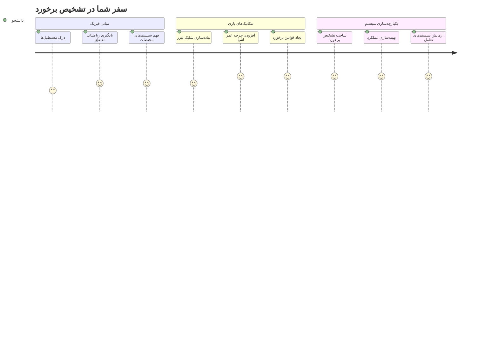
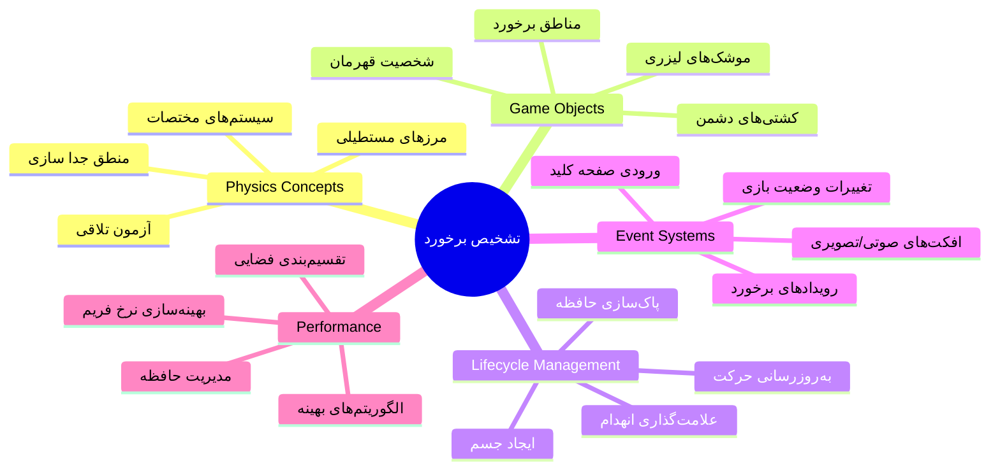
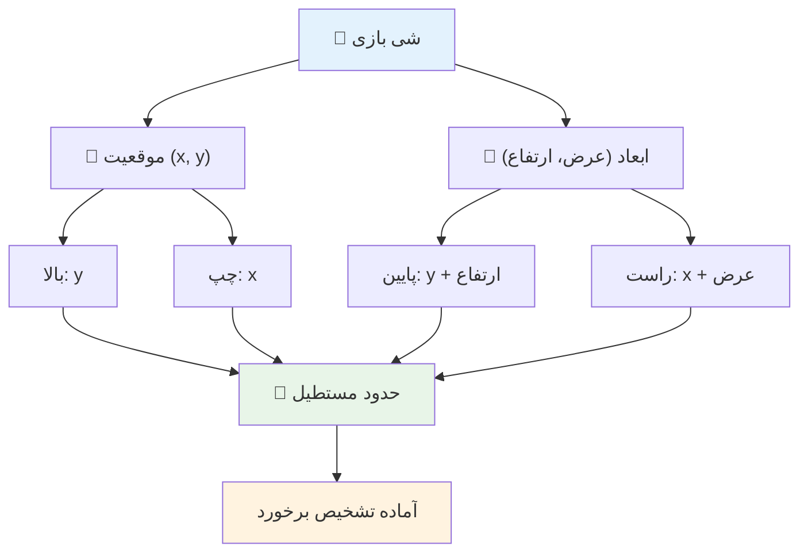
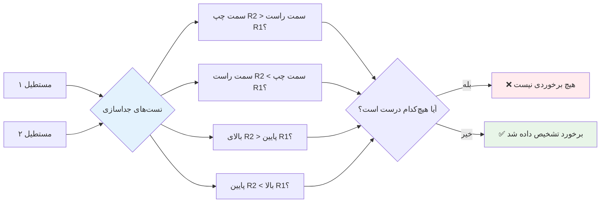
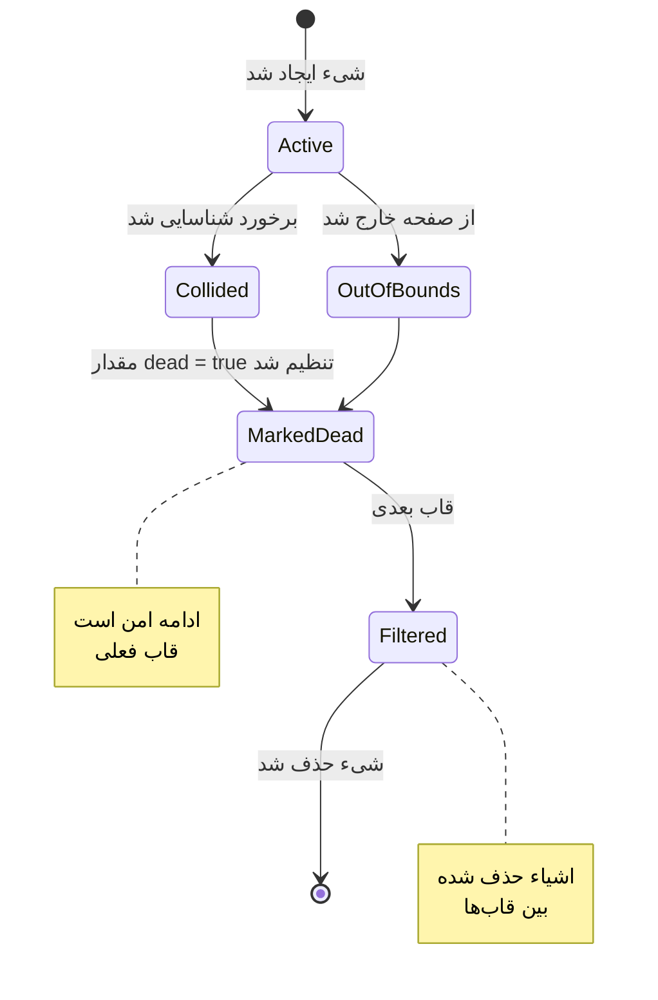
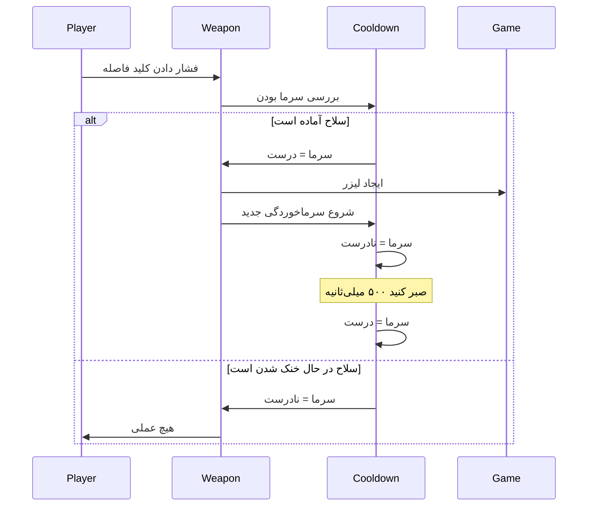
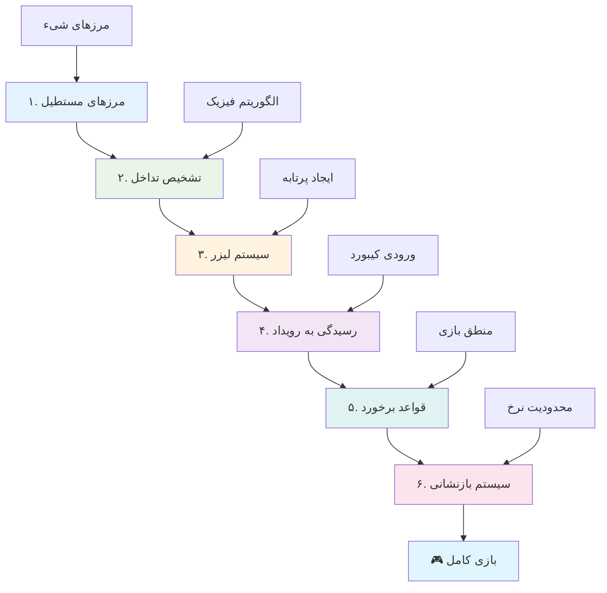
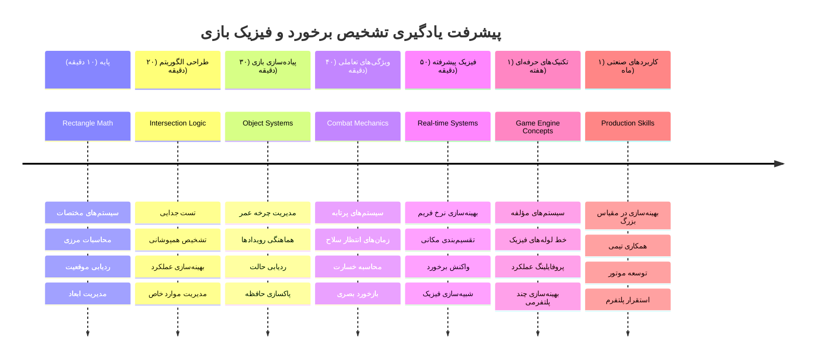

# ساخت یک بازی فضایی قسمت ۴: اضافه کردن لیزر و تشخیص برخوردها


## آزمون پیش از کلاس

[آزمون پیش از کلاس](https://ff-quizzes.netlify.app/web/quiz/35)

به لحظه‌ای در جنگ ستارگان فکر کنید که تورپدوهای پروتون لوک به منفذ خروجی ستاره مرگ برخورد کردند. آن تشخیص دقیق برخورد سرنوشت کهکشان را تغییر داد! در بازی‌ها، تشخیص برخورد به همان روش عمل می‌کند - زمانی که اشیاء با هم تعامل دارند و بعد چه اتفاقی می‌افتد را مشخص می‌کند.

در این درس، شما به بازی فضایی خود سلاح‌های لیزری اضافه خواهید کرد و تشخیص برخورد را پیاده‌سازی می‌کنید. درست مانند برنامه‌ریزان مأموریت ناسا که مسیرهای فضاپیما را برای اجتناب از برخورد با زباله‌ها محاسبه می‌کنند، شما یاد خواهید گرفت هنگامی که اشیاء بازی تلاقی پیدا می‌کنند، آنها را شناسایی کنید. ما این موضوع را به مراحل قابل مدیریت تقسیم می‌کنیم که بر روی هم ساخته می‌شوند.

در پایان، شما یک سیستم مبارزه کارآمد خواهید داشت که در آن لیزرها دشمنان را نابود کرده و برخوردها رویدادهای بازی را فعال می‌کنند. همین اصول تشخیص برخورد در همه چیز از شبیه‌سازی‌های فیزیکی تا رابط‌های تعاملی وب استفاده می‌شود.


✅ کمی درباره اولین بازی کامپیوتری نوشته شده در تاریخ تحقیق کنید. عملکرد آن چه بود؟

## تشخیص برخورد

تشخیص برخورد شبیه به حسگرهای نزدیکی در ماژول قمری آپولو عمل می‌کند - به صورت مداوم فاصله‌ها را چک می‌کند و وقتی اشیاء خیلی نزدیک شوند هشدار می‌دهد. در بازی‌ها، این سیستم مشخص می‌کند که چه زمانی اشیا تعامل دارند و چه باید اتفاق بیفتد.

روشی که استفاده می‌کنیم، هر شیء بازی را به صورت یک مستطیل در نظر می‌گیرد، مشابه روشی که سیستم‌های کنترل ترافیک هوایی برای ردیابی هواپیماها از اشکال هندسی ساده استفاده می‌کنند. این روش مستطیلی ممکن است ساده به نظر برسد، اما از نظر محاسباتی مؤثر است و برای اکثر موقعیت‌های بازی به خوبی کار می‌کند.

### نمایش مستطیل

هر شیء بازی نیاز به مرزهای مختصاتی دارد، مشابه جایی که مریخ‌نورد پث‌فایندر موقعیت خود را روی سطح مریخ نقشه‌برداری کرد. در اینجا نحوه تعریف این مختصات مرزی را می‌بینیم:


```javascript
rectFromGameObject() {
  return {
    top: this.y,
    left: this.x,
    bottom: this.y + this.height,
    right: this.x + this.width
  }
}
```

**بیایید این را بشکنیم:**
- **لبه بالا**: جایی که شیء شما به صورت عمودی شروع می‌شود (موقعیت y)
- **لبه چپ**: جایی که به صورت افقی شروع می‌شود (موقعیت x)
- **لبه پایین**: ارتفاع را به موقعیت y اضافه کنید - اکنون می‌دانید کجا پایان می‌یابد!
- **لبه راست**: عرض را به موقعیت x اضافه کنید - و مرز کامل را دارید

### الگوریتم تلاقی

تشخیص تقاطع مستطیل‌ها از منطق مشابهی استفاده می‌کند که تلسکوپ فضایی هابل برای تعیین اینکه آیا اجرام آسمانی در میدان دید همپوشانی دارند یا خیر، بهره می‌برد. الگوریتم جدا بودن را بررسی می‌کند:


```javascript
function intersectRect(r1, r2) {
  return !(r2.left > r1.right ||
    r2.right < r1.left ||
    r2.top > r1.bottom ||
    r2.bottom < r1.top);
}
```

**آزمون جدا بودن مانند سیستم‌های رادار عمل می‌کند:**
- آیا مستطیل ۲ کاملاً در سمت راست مستطیل ۱ است؟
- آیا مستطیل ۲ کاملاً در سمت چپ مستطیل ۱ است؟
- آیا مستطیل ۲ کاملاً زیر مستطیل ۱ است؟
- آیا مستطیل ۲ کاملاً بالای مستطیل ۱ است؟

اگر هیچکدام از این شرایط درست نباشد، مستطیل‌ها قطعاً همپوشانی دارند. این روش مشابه طرز کار اپراتورهای رادار است که تعیین می‌کنند دو هواپیما در فاصله ایمن هستند یا خیر.

## مدیریت چرخه عمر اشیاء

وقتی لیزر به دشمن برخورد می‌کند، هر دو شی باید از بازی حذف شوند. اما حذف اشیاء هنگام اجرای حلقه می‌تواند باعث کرش شود - درسی که در سیستم‌های کامپیوتری اولیه مانند کامپیوتر راهبری آپولو به سختی یاد گرفته شد. در عوض، از روش «علامت‌گذاری برای حذف» استفاده می‌کنیم که اشیاء را به طور ایمن بین فریم‌ها حذف می‌کند.


در اینجا چگونگی علامت‌گذاری برای حذف آورده شده است:

```javascript
// علامت‌گذاری شی برای حذف
enemy.dead = true;
```

**چرا این روش کار می‌کند:**
- شیء را به عنوان "مرده" علامت می‌زنیم اما بلافاصله حذف نمی‌کنیم
- این اجازه می‌دهد فریم فعلی بازی به طور امن خاتمه یابد
- از کرش جلوگیری می‌کند که وقتی شیء قبلاً حذف شده دوباره استفاده شود!

سپس اشیاء علامت‌گذاری‌شده را قبل از رندر بعدی فیلتر کنید:

```javascript
gameObjects = gameObjects.filter(go => !go.dead);
```

**این فیلتر چه کاری انجام می‌دهد:**
- لیستی تازه با فقط اشیاء "زنده" ایجاد می‌کند
- هر چیزی که به عنوان مرده علامت خورده را حذف می‌کند
- بازی شما را روان نگه می‌دارد
- از انباشته شدن اشیاء تخریب‌شده جلوگیری می‌کند و باعث افزایش مصرف حافظه نمی‌شود

## پیاده‌سازی مکانیک لیزر

پرتاب‌های لیزر در بازی‌ها بر همان اصول تورپدوهای فوتون در استار ترک کار می‌کنند - آنها اشیاء مجزایی هستند که در خطوط مستقیم حرکت می‌کنند تا به چیزی برخورد کنند. هر بار که کلید فاصله زده می‌شود، یک شیء لیزر جدید ایجاد می‌شود که روی صفحه حرکت می‌کند.

برای این که این کار درست انجام شود، باید چند بخش مختلف را هماهنگ کنیم:

**اجزای کلیدی برای پیاده‌سازی:**
- **ایجاد** اشیاء لیرز که از موقعیت قهرمان زاده می‌شوند
- **مدیریت** ورودی کیبورد برای فعال کردن ساخت لیزر
- **مدیریت** حرکت و چرخه عمر لیزر
- **پیاده‌سازی** نمایش بصری برای پرتاب‌های لیزری

## پیاده‌سازی کنترل نرخ شلیک

میزان شلیک نامحدود باعث بار سنگین بر روی موتور بازی می‌شود و بازی را بیش از حد آسان می‌کند. سیستم‌های واقعی سلاح نیز محدودیت‌های مشابهی دارند - حتی فازرهای USS Enterprise نیاز به زمان شارژ مجدد بین شلیک‌ها داشتند.

ما یک سیستم خنک‌سازی (cooldown) خواهیم ساخت که از شلیک سریع و بدون فاصله جلوگیری می‌کند در حالی که کنترل‌ها همچنان واکنش‌پذیر باقی می‌مانند:


```javascript
class Cooldown {
  constructor(time) {
    this.cool = false;
    setTimeout(() => {
      this.cool = true;
    }, time);
  }
}

class Weapon {
  constructor() {
    this.cooldown = null;
  }
  
  fire() {
    if (!this.cooldown || this.cooldown.cool) {
      // ایجاد پرتابه لیزری
      this.cooldown = new Cooldown(500);
    } else {
      // سلاح هنوز در حال خنک شدن است
    }
  }
}
```

**نحوه کارکرد cooldown:**
- وقتی ساخته می‌شود، سلاح "داغ" است (هنوز نمی‌تواند شلیک کند)
- پس از گذشت زمان انتظار، به "سرد" تبدیل می‌شود (آماده شلیک)
- قبل از شلیک بررسی می‌کنیم: "آیا سلاح سرد است؟"
- این مانع از کلیک‌های پی‌درپی می‌شود و در عین حال کنترل‌ها را پاسخگو نگه می‌دارد

✅ به درس ۱ از سری بازی فضایی مراجعه کنید تا درباره cooldownها یادآوری کنید.

## ساخت سیستم تشخیص برخورد

شما کد بازی فضایی موجود خود را توسعه خواهید داد تا یک سیستم تشخیص برخورد بسازید. مشابه سیستم خودکار جلوگیری از برخورد ایستگاه فضایی بین‌المللی، بازی شما موقعیت اشیاء را به طور مداوم ردیابی کرده و به تلاقی‌ها پاسخ خواهد داد.

از کد درس قبلی خود شروع می‌کنید و تشخیص برخورد را با قوانین خاصی اضافه خواهید کرد که تعامل اشیاء را مدیریت می‌کند.

> 💡 **نکته حرفه‌ای**: تصویر لیزر از قبل در پوشه assets شما وجود دارد و در کد شما ارجاع داده شده است، آماده برای پیاده‌سازی.

### قوانین برخورد برای پیاده‌سازی

**مکانیک‌های بازی برای افزودن:**
1. **لیزر به دشمن برخورد می‌کند**: شیء دشمن هنگام برخورد با پرتابه لیزر نابود می‌شود
2. **لیزر به مرز صفحه برخورد می‌کند**: لیزر وقتی به لبه بالای صفحه می‌رسد حذف می‌شود
3. **برخورد دشمن با قهرمان**: هر دو شیء هنگام تلاقی نابود می‌شوند
4. **دشمن به پایین می‌رسد**: بازی در صورتی که دشمنان به پایین صفحه برسند پایان می‌یابد

### 🔄 **بررسی آموزشی**
**مبانی تشخیص برخورد**: پیش از پیاده‌سازی مطمئن شوید که:
- ✅ نحوه تعریف مرزهای مستطیل برای تشخیص برخورد را می‌دانید
- ✅ چرا تست جدا بودن کارآمدتر از محاسبه تلاقی مستقیم است
- ✅ اهمیت مدیریت چرخه عمر اشیاء در حلقه‌های بازی را درک کرده‌اید
- ✅ سیستم‌های رویدادمحور چگونه پاسخ‌های برخورد را هماهنگ می‌کنند

**آزمون سریع خودارزیابی**: اگر اشیاء را بلافاصله حذف می‌کردید به جای علامت‌گذاری، چه اتفاقی می‌افتاد؟
*پاسخ: حذف میانه حلقه می‌توانست باعث کرش یا رد شدن اشیاء در تکرار شود*

**درک فیزیکی**: اکنون می‌دانید:
- **سامانه‌های مختصات**: چگونه موقعیت و ابعاد مرزها را می‌سازند
- **منطق تلاقی**: اصول ریاضی پشت تشخیص برخورد
- **بهینه‌سازی عملکرد**: چرا الگوریتم‌های مؤثر در سیستم‌های زمان واقعی مهمند
- **مدیریت حافظه**: الگوهای امن چرخه عمر اشیاء برای پایداری

## راه‌اندازی محیط توسعه

خبر خوب - بیشتر پایه کار آماده است! همه دارایی‌های بازی و ساختار پایه در زیرپوشه `your-work` منتظر شماست تا ویژگی‌های جذاب برخورد را اضافه کنید.

### ساختار پروژه

```bash
-| assets
  -| enemyShip.png
  -| player.png
  -| laserRed.png
-| index.html
-| app.js
-| package.json
```

**آشنایی با ساختار فایل‌ها:**
- **شامل** تمام تصاویر sprite لازم برای اشیاء بازی
- **دارای** فایل اصلی HTML و فایل برنامه JavaScript
- **ارائه‌دهنده** پیکربندی پکیج برای سرور توسعه محلی

### راه‌اندازی سرور توسعه

به پوشه پروژه خود بروید و سرور محلی را راه‌اندازی کنید:

```bash
cd your-work
npm start
```

**این دنباله دستورات:**
- **دایرکتوری** را به پوشه پروژه کاری شما تغییر می‌دهد
- **یک سرور HTTP محلی** روی `http://localhost:5000` اجرا می‌کند
- **فایل‌های بازی شما را** برای تست و توسعه سرو می‌دهد
- **امکان توسعه زنده** با بارگزاری خودکار فراهم می‌کند

مرورگر خود را باز کنید و به `http://localhost:5000` بروید تا وضعیت فعلی بازی را ببینید که قهرمان‌ها و دشمنان روی صفحه ترسیم شده‌اند.

### پیاده‌سازی قدم‌به‌قدم

مانند روش سیستماتیک ناسا برای برنامه‌ریزی فضاپیمای وویجر، ما تشخیص برخورد را به صورت گام به گام و منظم اجرا خواهیم کرد.


#### ۱. افزودن مرزهای مستطیلی برخورد

اول بیاموزیم اشیاء بازی چگونه مرزهای خود را توصیف می‌کنند. این متد را به کلاس `GameObject` خود اضافه کنید:

```javascript
rectFromGameObject() {
    return {
      top: this.y,
      left: this.x,
      bottom: this.y + this.height,
      right: this.x + this.width,
    };
  }
```

**این متد این کار را انجام می‌دهد:**
- **یک شیء مستطیل** با مختصات مرزی دقیق ایجاد می‌کند
- **لبه پایین و راست** را با استفاده از موقعیت به علاوه ابعاد محاسبه می‌کند
- **یک شیء آماده برای الگوریتم‌های تشخیص برخورد** بازمی‌گرداند
- **یک رابط استاندارد برای همه اشیاء بازی** فراهم می‌کند

#### ۲. پیاده‌سازی تشخیص تلاقی

حالا کارآگاه برخورد را می‌سازیم - تابعی که می‌تواند بگوید دو مستطیل آیا همپوشانی دارند یا خیر:

```javascript
function intersectRect(r1, r2) {
  return !(
    r2.left > r1.right ||
    r2.right < r1.left ||
    r2.top > r1.bottom ||
    r2.bottom < r1.top
  );
}
```

**این الگوریتم این‌گونه کار می‌کند:**
- **چهار شرط جدا بودن** بین مستطیل‌ها را آزمایش می‌کند
- اگر هر کدام درست بود `false` بازمی‌گرداند
- زمانی که جدا بودن وجود نداشت، برخورد را نشان می‌دهد
- از منطق نفی برای تست کارآمد تلاقی استفاده می‌کند

#### ۳. پیاده‌سازی سیستم شلیک لیزر

اینجا هیجان‌انگیز است! بیایید سیستم شلیک لیزر را راه‌اندازی کنیم.

##### ثوابت پیام‌ها

ابتدا برخی نوع پیام‌ها را تعریف کنیم تا بخش‌های مختلف بازی بتوانند با هم صحبت کنند:

```javascript
KEY_EVENT_SPACE: "KEY_EVENT_SPACE",
COLLISION_ENEMY_LASER: "COLLISION_ENEMY_LASER",
COLLISION_ENEMY_HERO: "COLLISION_ENEMY_HERO",
```

**این ثوابت این مزایا را دارند:**
- نام رویدادها را در کل برنامه استاندارد می‌کنند
- ارتباط منسجم بین سیستم‌های بازی را فراهم می‌آورند
- از اشتباهات حروفی هنگام ثبت رویداد جلوگیری می‌کنند

##### مدیریت ورودی کیبورد

تشخیص کلید فاصله را به شنونده رویداد کلید اضافه کنید:

```javascript
} else if(evt.keyCode === 32) {
  eventEmitter.emit(Messages.KEY_EVENT_SPACE);
}
```

**این مدیریت ورودی:**
- فشار کلید فاصله با keyCode برابر ۳۲ را شناسایی می‌کند
- پیامی استاندارد برای رویداد انتشار می‌دهد
- امکان اجرای جداشده منطق شلیک را فراهم می‌آورد

##### تنظیم شنونده رویداد

رفتار شلیک را در تابع `initGame()` خود ثبت کنید:

```javascript
eventEmitter.on(Messages.KEY_EVENT_SPACE, () => {
 if (hero.canFire()) {
   hero.fire();
 }
});
```

**این شنونده رویداد:**
- به رویداد کلید فاصله پاسخ می‌دهد
- وضعیت cooldown شلیک را بررسی می‌کند
- در صورت اجازه، شلیک لیزر را فعال می‌کند

برخورد لیزر با دشمن را مدیریت کنید:

```javascript
eventEmitter.on(Messages.COLLISION_ENEMY_LASER, (_, { first, second }) => {
  first.dead = true;
  second.dead = true;
});
```

**این مدیریت برخورد:**
- داده‌های رویداد برخورد شامل هر دو شی را دریافت می‌کند
- هر دو شی را برای حذف علامت می‌زند
- از پاک‌سازی صحیح پس از برخورد اطمینان می‌یابد

#### ۴. ایجاد کلاس Laser

یک پرتابه لیزری پیاده‌سازی کنید که به سمت بالا حرکت می‌کند و چرخه عمر خودش را مدیریت می‌کند:

```javascript
class Laser extends GameObject {
  constructor(x, y) {
    super(x, y);
    this.width = 9;
    this.height = 33;
    this.type = 'Laser';
    this.img = laserImg;
    
    let id = setInterval(() => {
      if (this.y > 0) {
        this.y -= 15;
      } else {
        this.dead = true;
        clearInterval(id);
      }
    }, 100);
  }
}
```

**این پیاده‌سازی کلاس:**
- از `GameObject` ارث می‌برد برای کارکرد پایه
- ابعاد مناسب برای اسپریت لیزر را تنظیم می‌کند
- حرکت خودکار به سمت بالا را با `setInterval()` ایجاد می‌کند
- هنگام رسیدن به بالای صفحه خود را نابود می‌کند
- مدیریت زمان‌بندی انیمیشن و پاک‌سازی را بر عهده دارد

#### ۵. پیاده‌سازی سیستم تشخیص برخورد

یک تابع جامع تشخیص برخورد بسازید:

```javascript
function updateGameObjects() {
  const enemies = gameObjects.filter(go => go.type === 'Enemy');
  const lasers = gameObjects.filter(go => go.type === "Laser");
  
  // آزمایش برخورد لیزر با دشمن
  lasers.forEach((laser) => {
    enemies.forEach((enemy) => {
      if (intersectRect(laser.rectFromGameObject(), enemy.rectFromGameObject())) {
        eventEmitter.emit(Messages.COLLISION_ENEMY_LASER, {
          first: laser,
          second: enemy,
        });
      }
    });
  });

  // حذف اشیاء نابود شده
  gameObjects = gameObjects.filter(go => !go.dead);
}
```

**این سیستم برخورد:**
- اشیاء بازی را بر اساس نوع برای آزمایش کارآمد فیلتر می‌کند
- هر لیزر را با هر دشمن برای تلاقی آزمون می‌کند
- هنگام تشخیص برخورد رویداد برخورد ارسال می‌کند
- اشیاء تخریب شده را پس از پردازش برخورد پاک‌سازی می‌کند

> ⚠️ **مهم**: `updateGameObjects()` را به حلقه اصلی بازی در `window.onload` اضافه کنید تا تشخیص برخورد فعال شود.

#### ۶. افزودن سیستم خنک‌سازی به کلاس Hero

کلاس Hero را با مکانیک شلیک و محدودیت نرخ شلیک بهبود دهید:

```javascript
class Hero extends GameObject {
  constructor(x, y) {
    super(x, y);
    this.width = 99;
    this.height = 75;
    this.type = "Hero";
    this.speed = { x: 0, y: 0 };
    this.cooldown = 0;
  }
  
  fire() {
    gameObjects.push(new Laser(this.x + 45, this.y - 10));
    this.cooldown = 500;

    let id = setInterval(() => {
      if (this.cooldown > 0) {
        this.cooldown -= 100;
      } else {
        clearInterval(id);
      }
    }, 200);
  }
  
  canFire() {
    return this.cooldown === 0;
  }
}
```

**درک کلاس Hero بهبود یافته:**
- تایمر cooldown را با صفر مقداردهی می‌کند (آماده شلیک)
- اشیاء لیزر را در بالای کشتی قهرمان ایجاد می‌کند
- دوره cooldown را برای جلوگیری از شلیک سریع تنظیم می‌کند
- تایمر cooldown را با بروزرسانی‌های مبتنی بر اینتروال کاهش می‌دهد
- وضعیت آماده شلیک بودن را از طریق متد `canFire()` فراهم می‌آورد

### 🔄 **بررسی آموزشی**
**درک کامل سیستم**: مهارت خود را در سیستم برخورد بررسی کنید:
- ✅ مرزهای مستطیل چگونه تشخیص برخورد کارآمد را ممکن می‌کنند؟
- ✅ چرا مدیریت چرخه عمر اشیاء برای پایداری بازی حیاتی است؟
- ✅ سیستم cooldown چگونه از مشکلات عملکرد جلوگیری می‌کند؟
- ✅ معماری رویدادمحور چه نقشی در مدیریت برخوردها دارد؟

**ادغام سیستم**: تشخیص برخورد شما نشان‌دهنده:
- **دقت ریاضی**: الگوریتم‌های تلاقی مستطیل
- **بهینه‌سازی عملکرد**: الگوهای کارآمد تست برخورد
- **مدیریت حافظه**: الگوهای امن ایجاد و نابودی اشیاء
- **هماهنگی رویدادها**: ارتباط سیستم‌های جداشده
- **پردازش بلادرنگ**: چرخه‌های بروزرسانی فریم‌بندی

**الگوهای حرفه‌ای**: شما پیاده‌سازی کرده‌اید:
- **تفکیک وظایف**: فیزیک، رندر و ورودی جدا شده‌اند
- **طراحی شیءگرا**: وراثت و چندریختی
- **مدیریت وضعیت**: چرخه عمر اشیاء و پیگیری وضعیت بازی
- **بهینه‌سازی عملکرد**: الگوریتم‌های کارآمد برای استفاده همزمان

### آزمایش پیاده‌سازی خود

بازی فضایی شما اکنون تشخیص برخورد و مکانیک مبارزه کامل دارد. 🚀 این قابلیت‌های جدید را آزمایش کنید:
- **با کلیدهای جهت‌نما حرکت کنید** تا کنترل حرکت را بررسی کنید
- **با کلید فاصله شلیک کنید** - مشاهده کنید که cooldown از کلیک‌های پشت سر هم جلوگیری می‌کند
- **برخوردها را ببینید** وقتی لیزر به دشمنان می‌خورد و آنها حذف می‌شوند
- **پاک‌سازی را تایید کنید** وقتی اشیاء نابود شده از بازی ناپدید می‌شوند

شما به‌طور موفقیت‌آمیز یک سیستم تشخیص برخورد پیاده‌سازی کرده‌اید که از همان اصول ریاضی استفاده می‌کند که ناوبری فضاپیماها و رباتیک را هدایت می‌کنند.

### ⚡ **کارهایی که می‌توانید در ۵ دقیقه آینده انجام دهید**
- [ ] ابزارهای توسعه مرورگر را باز کنید و نقاط توقف در تابع تشخیص برخورد خود تنظیم کنید
- [ ] سرعت لیزر یا حرکت دشمن را تغییر دهید تا اثرات برخورد را ببینید
- [ ] با مقادیر مختلف cooldown آزمایش کنید تا نرخ شلیک را تست کنید
- [ ] افزودن دستورات `console.log` برای پیگیری رویدادهای برخورد در زمان واقعی

### 🎯 **چه چیزی می‌توانید در این ساعت کسب کنید**
- [ ] کامل کردن آزمون پس از درس و درک الگوریتم‌های تشخیص برخورد
- [ ] افزودن جلوه‌های بصری مانند انفجارها هنگام وقوع برخوردها
- [ ] پیاده‌سازی انواع مختلفی از پرتابه‌ها با ویژگی‌های متنوع
- [ ] خلق Power-up‌هایی که به صورت موقت توانایی‌های بازیکن را ارتقا می‌دهند
- [ ] افزودن جلوه‌های صوتی برای رضایت‌بخش‌تر کردن برخوردها

### 📅 **برنامه هفتگی برنامه‌نویسی فیزیک شما**
- [ ] تکمیل بازی کامل فضایی با سیستم‌های برخورد صیقل‌یافته
- [ ] پیاده‌سازی اشکال پیشرفته برخورد فراتر از مستطیل‌ها (دایره‌ها، چندضلعی‌ها)
- [ ] افزودن سیستم‌های ذرات برای جلوه‌های انفجار واقعی‌تر
- [ ] ایجاد رفتار پیچیده دشمن با اجتناب از برخورد
- [ ] بهینه‌سازی تشخیص برخورد برای عملکرد بهتر با تعداد زیادی شیء
- [ ] افزودن شبیه‌سازی فیزیکی مانند تکانه و حرکت واقعی

### 🌟 **استادی فیزیک بازی در یک ماه**
- [ ] ساخت بازی با موتورهای فیزیک پیشرفته و شبیه‌سازی‌های واقعی
- [ ] یادگیری تشخیص برخورد سه‌بعدی و الگوریتم‌های بخش‌بندی فضایی
- [ ] مشارکت در کتابخانه‌ها و موتورهای بازی منبع‌باز مربوط به فیزیک
- [ ] تسلط بر بهینه‌سازی عملکرد برای برنامه‌های گرافیکی سنگین
- [ ] ایجاد محتوای آموزشی درباره فیزیک بازی و تشخیص برخورد
- [ ] ساخت یک نمونه‌کار که مهارت‌های برنامه‌نویسی فیزیک پیشرفته را نشان دهد

## 🎯 جدول زمانی استادی شما در تشخیص برخورد


### 🛠️ خلاصه ابزارهای فیزیک بازی شما

پس از اتمام این درس، اکنون مسلط شده‌اید بر:
- **ریاضیات برخورد**: الگوریتم‌های تقاطع مستطیل و سیستم‌های مختصات
- **بهینه‌سازی عملکرد**: تشخیص برخورد بهینه برای برنامه‌های زمان واقعی
- **مدیریت چرخه عمر اشیاء**: الگوهای ایمن ایجاد، بروزرسانی و نابودی
- **معماری رویداد محور**: سیستم‌های مستقل برای پاسخ به برخورد
- **ادغام در لوپ بازی**: به‌روزرسانی فیزیک بر اساس فریم و هماهنگی رندر
- **سیستم‌های ورودی**: کنترل‌های واکنش‌گرا با محدودیت نرخ و بازخورد
- **مدیریت حافظه**: پویینگ و پاکسازی بهینه اشیاء

**کاربردهای دنیای واقعی**: مهارت‌های تشخیص برخورد شما مستقیماً به کار می‌آید در:
- **شبیه‌سازی‌های تعاملی**: مدل‌سازی علمی و ابزارهای آموزشی
- **طراحی رابط کاربری**: تعاملات کشیدن و رها کردن و تشخیص لمس
- **بصری‌سازی داده‌ها**: نمودارهای تعاملی و عناصر قابل کلیک
- **توسعه موبایل**: تشخیص ژست‌های لمسی و برخورد
- **برنامه‌نویسی رباتیک**: برنامه‌ریزی مسیر و اجتناب از موانع
- **گرافیک کامپیوتری**: ردگیری پرتو و الگوریتم‌های فضایی

**مهارت‌های حرفه‌ای کسب شده**: اکنون می‌توانید:
- **طراحی** الگوریتم‌های بهینه برای تشخیص برخورد زمان واقعی
- **پیاده‌سازی** سیستم‌های فیزیک که با پیچیدگی اشیاء مقیاس‌پذیرند
- **رفع اشکال** سیستم‌های تعاملی پیچیده با اصول ریاضی
- **بهینه‌سازی** عملکرد برای سخت‌افزار و مرورگرهای مختلف
- **معماری** سیستم‌های بازی قابل نگهداری با الگوهای طراحی اثبات شده

**مفاهیم توسعه بازی که مسلط شده‌اید**:
- **شبیه‌سازی فیزیک**: تشخیص برخورد و پاسخ در زمان واقعی
- **مهندسی عملکرد**: الگوریتم‌های بهینه برای برنامه‌های تعاملی
- **سیستم‌های رویداد**: ارتباط مستقل بین اجزای بازی
- **مدیریت اشیاء**: الگوهای چرخه عمر بهینه برای محتوای پویا
- **مدیریت ورودی**: کنترل‌های واکنش‌گرا با بازخورد مناسب

**سطح بعدی**: آماده‌اید موتورهای فیزیک پیشرفته مانند Matter.js را کاوش کنید، تشخیص برخورد سه‌بعدی را پیاده‌سازی کنید، یا سیستم‌های ذرات پیچیده بسازید!

🌟 **دستاورد کسب شده**: شما یک سیستم تعامل مبتنی بر فیزیک کامل با تشخیص برخورد حرفه‌ای ساخته‌اید!

## چالش GitHub Copilot Agent 🚀

از حالت Agent برای تکمیل چالش زیر استفاده کنید:

**توضیح:** سیستم تشخیص برخورد را با پیاده‌سازی Power-up‌هایی که به صورت تصادفی ظاهر می‌شوند و زمانی که توسط کشتی قهرمان جمع می‌شوند، توانایی‌های موقتی فراهم می‌کنند، بهبود دهید.

**پیام درخواست:** یک کلاس PowerUp بسازید که از GameObject ارث می‌برد و تشخیص برخورد بین قهرمان و Power-upها را پیاده‌سازی کنید. حداقل دو نوع Power-up اضافه کنید: یکی که سرعت شلیک را افزایش می‌دهد (کاهش زمان خنک‌شدن) و دیگری که سپر موقتی ایجاد می‌کند. منطق تولید را اضافه کنید که Power-upها را در فواصل و موقعیت‌های تصادفی ایجاد کند.

---


## 🚀 چالش

یک انفجار اضافه کنید! دارایی‌های بازی را در [مخزن هنر فضایی](../../../../6-space-game/solution/spaceArt/readme.txt) ببینید و سعی کنید هنگام برخورد لیزر با بیگانه، یک انفجار اضافه کنید

## آزمون پس از سخنرانی

[آزمون پس از سخنرانی](https://ff-quizzes.netlify.app/web/quiz/36)

## مرور و خودآموزی

با فواصل زمانی در بازی خود تا اینجا آزمایش کنید. وقتی آنها را تغییر می‌دهید چه اتفاقی می‌افتد؟ درباره [رویدادهای زمان‌بندی جاوااسکریپت](https://www.freecodecamp.org/news/javascript-timing-events-settimeout-and-setinterval/) بیشتر بخوانید.

## تکلیف

[کاوش برخوردها](assignment.md)

---

<!-- CO-OP TRANSLATOR DISCLAIMER START -->
**توضیح مهم**:  
این سند با استفاده از سرویس ترجمه هوش مصنوعی [Co-op Translator](https://github.com/Azure/co-op-translator) ترجمه شده است. با اینکه تلاش ما بر دقت است، لطفاً توجه داشته باشید که ترجمه‌های خودکار ممکن است شامل اشتباهات یا نادرستی‌هایی باشند. سند اصلی به زبان بومی خود باید به‌عنوان منبع معتبر در نظر گرفته شود. برای اطلاعات حیاتی، توصیه می‌شود از ترجمه حرفه‌ای توسط انسان استفاده شود. ما مسئول هیچ گونه سوءتفاهم یا برداشت اشتباهی که ناشی از استفاده از این ترجمه باشد، نیستیم.
<!-- CO-OP TRANSLATOR DISCLAIMER END -->