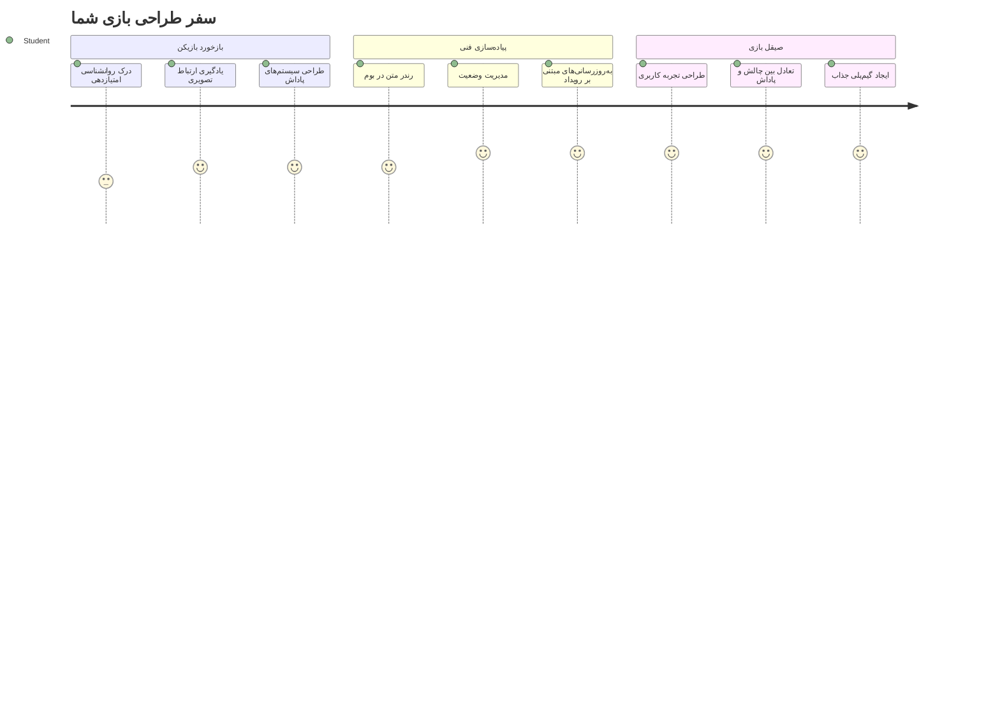
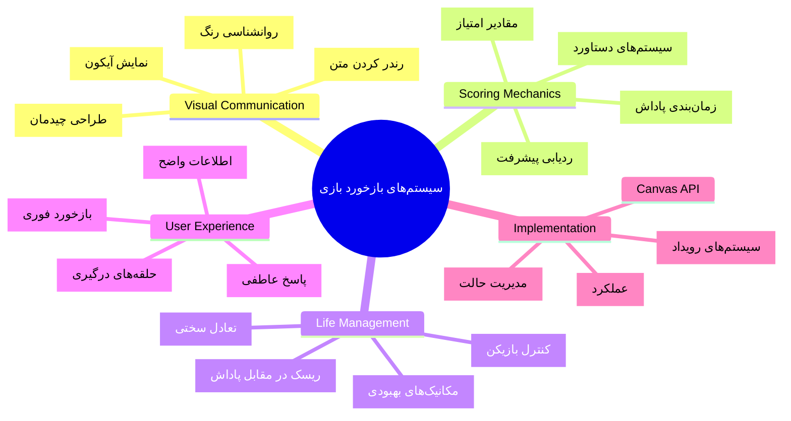
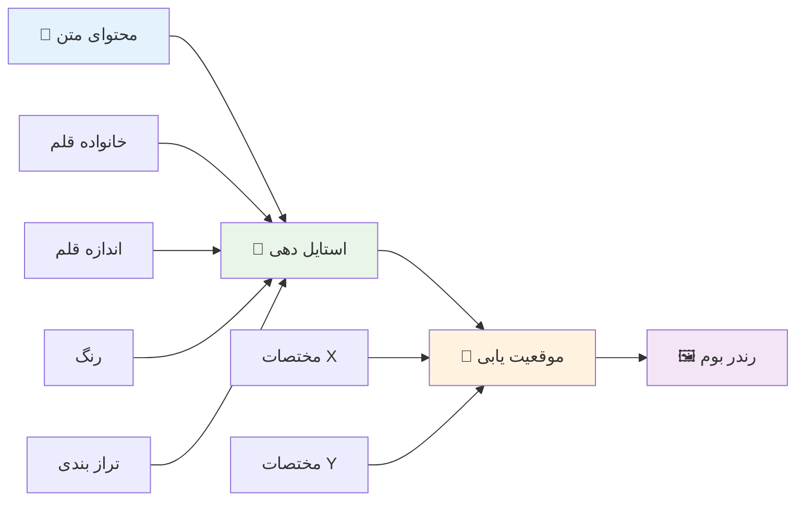
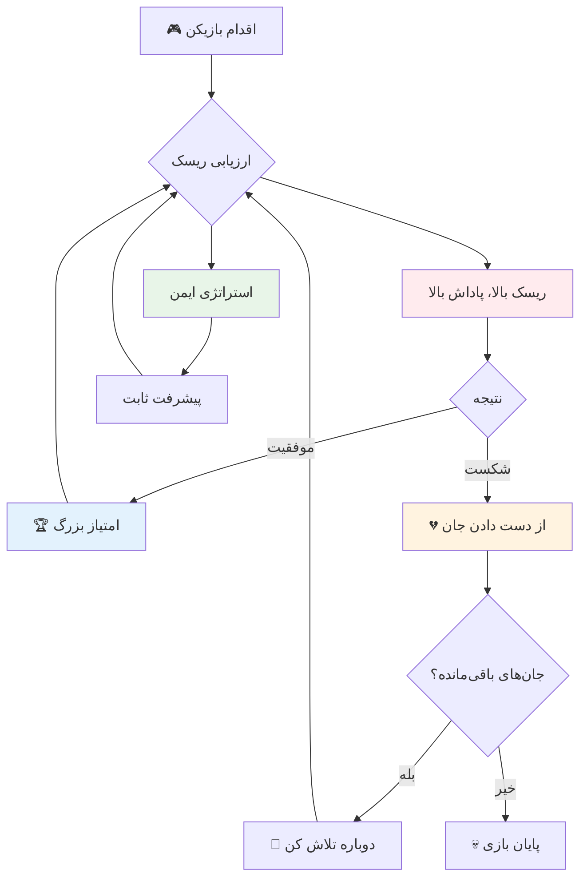
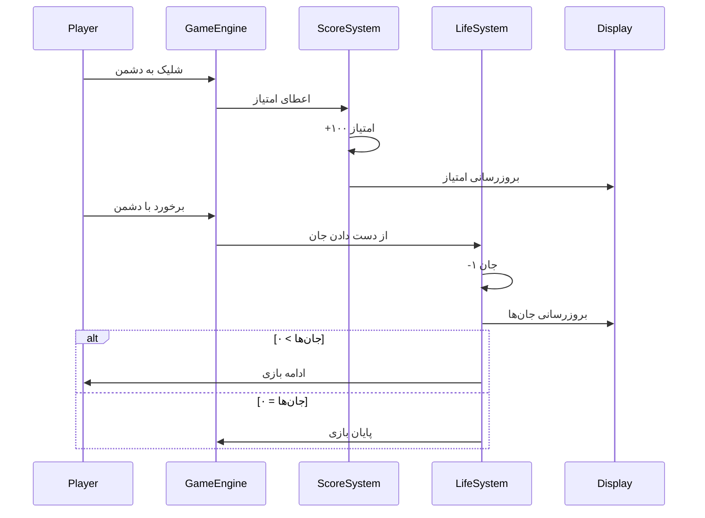
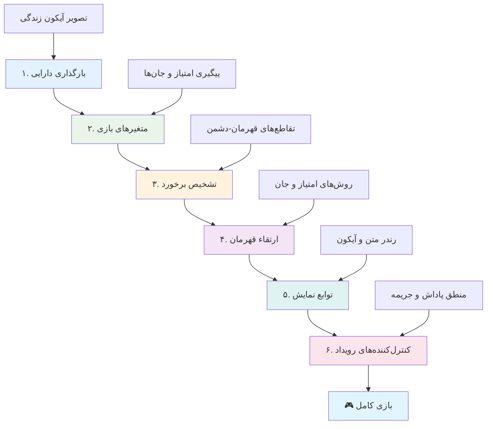
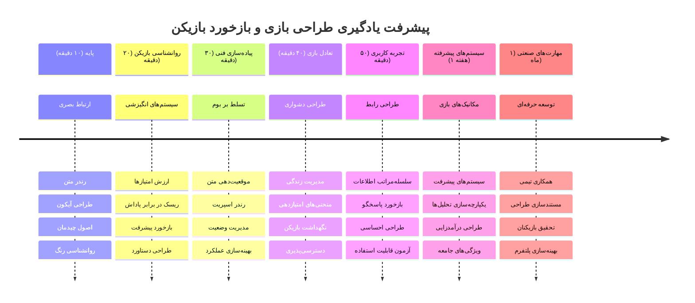

<!--
CO_OP_TRANSLATOR_METADATA:
{
  "original_hash": "2ed9145a16cf576faa2a973dff84d099",
  "translation_date": "2026-01-06T10:07:11+00:00",
  "source_file": "6-space-game/5-keeping-score/README.md",
  "language_code": "fa"
}
-->
# ساخت یک بازی فضایی قسمت ۵: امتیازدهی و جان‌ها


## آزمون قبل از درس

[آزمون قبل از درس](https://ff-quizzes.netlify.app/web/quiz/37)

آماده‌اید بازی فضایی خود را به یک بازی واقعی تبدیل کنید؟ بیایید امتیازدهی و مدیریت جان‌ها را اضافه کنیم — مکانیک‌های اصلی که بازی‌های آرکید اولیه مانند Space Invaders را از نمایش‌های ساده به سرگرمی اعتیادآور تبدیل کردند. اینجا جایی است که بازی شما واقعاً قابل بازی می‌شود.


## رسم متن روی صفحه - صدای بازی شما

برای نمایش امتیاز، باید یاد بگیریم چطور متن را روی کَنواس نمایش دهیم. متد `fillText()` ابزار اصلی شما برای این کار است — همان تکنیکی که در بازی‌های آرکید کلاسیک برای نمایش امتیاز و اطلاعات وضعیت استفاده می‌شد.


شما کنترل کامل روی ظاهر متن دارید:

```javascript
ctx.font = "30px Arial";
ctx.fillStyle = "red";
ctx.textAlign = "right";
ctx.fillText("show this on the screen", 0, 0);
```

✅ با [افزودن متن به کَنواس](https://developer.mozilla.org/docs/Web/API/Canvas_API/Tutorial/Drawing_text) بیشتر آشنا شوید — ممکن است از خلاقیتی که با فونت‌ها و استایل‌ها می‌توانید به خرج دهید شگفت‌زده شوید!

## جان‌ها - بیشتر از یک عدد ساده

در طراحی بازی، "جان" نشان‌دهنده‌ی حاشیه خطای بازیکن است. این مفهوم از دستگاه‌های پینبال نشأت گرفته که بازیکن چند توپ برای بازی داشت. در بازی‌های ویدیویی اولیه مثل Asteroids، جان‌ها به بازیکنان اجازه می‌داد تا ریسک کنند و از اشتباهات بیاموزند.


نمایش بصری اهمیت زیادی دارد — نمایش نمادهای سفینه به جای فقط نوشتن "جان: ۳" تشخیص بصری فوری را ایجاد می‌کند، مشابه روشی که دستگاه‌های آرکید ابتدایی برای ارتباط از طریق نشان‌ها و آیکون‌ها استفاده می‌کردند.

## ساخت سیستم پاداش بازی شما

حالا سیستم‌های اصلی بازخورد که بازیکنان را درگیر نگه می‌دارد، پیاده‌سازی می‌کنیم:


- **سیستم امتیازدهی**: هر سفینه دشمن نابود شده ۱۰۰ امتیاز می‌دهد (اعداد رند برای بازیکنان راحت‌تر محاسبه ذهنی هستند). امتیاز در گوشه پایین سمت چپ نمایش داده می‌شود.
- **شمارش جان‌ها**: قهرمان شما با سه جان شروع می‌کند — استانداردی که بازی‌های آرکید اولیه برای تعادل چالش و قابل بازی بودن تعیین کردند. هر برخورد با دشمن یک جان از دست می‌دهید. تعداد جان‌های باقی‌مانده در گوشه پایین سمت راست با آیکون سفینه نشان داده می‌شود .

## بیایید شروع کنیم!

ابتدا فضای کاری خود را آماده کنید. به فایل‌های پوشه `your-work` بروید. باید این فایل‌ها را ببینید:

```bash
-| assets
  -| enemyShip.png
  -| player.png
  -| laserRed.png
-| index.html
-| app.js
-| package.json
```

برای تست بازی خود، سرور توسعه را از پوشه `your_work` اجرا کنید:

```bash
cd your-work
npm start
```

این سرور محلی روی آدرس `http://localhost:5000` اجرا می‌شود. این آدرس را در مرورگر خود باز کنید تا بازی را ببینید. با کلیدهای پیکان کنترل‌ها را امتحان کنید و با شلیک به دشمنان مطمئن شوید همه‌چیز درست کار می‌کند.


### وقت کدنویسی است!

1. **منابع تصویری لازم را بردارید**. فایل تصویری `life.png` را از پوشه `solution/assets/` به پوشه `your-work` خود کپی کنید. سپس `lifeImg` را به تابع `window.onload` اضافه کنید: 

    ```javascript
    lifeImg = await loadTexture("assets/life.png");
    ```

1. فراموش نکنید `lifeImg` را به لیست منابع خود اضافه کنید:

    ```javascript
    let heroImg,
    ...
    lifeImg,
    ...
    eventEmitter = new EventEmitter();
    ```
  
2. **متغیرهای بازی خود را تنظیم کنید**. کدی اضافه کنید که امتیاز کل (با شروع از ۰) و جان‌های باقی‌مانده (با شروع از ۳) را پیگیری کند. این موارد روی صفحه نمایش داده می‌شوند تا بازیکن همیشه جایگاه خود را بداند.

3. **کشف برخوردها را پیاده‌سازی کنید**. تابع `updateGameObjects()` خود را گسترش دهید تا زمانی که دشمنان با قهرمان برخورد می‌کنند را تشخیص دهد:

    ```javascript
    enemies.forEach(enemy => {
        const heroRect = hero.rectFromGameObject();
        if (intersectRect(heroRect, enemy.rectFromGameObject())) {
          eventEmitter.emit(Messages.COLLISION_ENEMY_HERO, { enemy });
        }
      })
    ```

4. **پیگیری جان و امتیاز را به کلاس Hero اضافه کنید**. 
   1. **شمارنده‌ها را مقداردهی اولیه کنید**. زیر `this.cooldown = 0` در کلاس `Hero`، جان و امتیاز را تنظیم کنید:

        ```javascript
        this.life = 3;
        this.points = 0;
        ```

   1. **این مقادیر را به بازیکن نمایش دهید**. توابعی برای رسم این مقادیر روی صفحه ایجاد کنید:

        ```javascript
        function drawLife() {
          // انجام شود، ۳۵، ۲۷
          const START_POS = canvas.width - 180;
          for(let i=0; i < hero.life; i++ ) {
            ctx.drawImage(
              lifeImg, 
              START_POS + (45 * (i+1) ), 
              canvas.height - 37);
          }
        }
        
        function drawPoints() {
          ctx.font = "30px Arial";
          ctx.fillStyle = "red";
          ctx.textAlign = "left";
          drawText("Points: " + hero.points, 10, canvas.height-20);
        }
        
        function drawText(message, x, y) {
          ctx.fillText(message, x, y);
        }

        ```

   1. **همه چیز را به حلقه بازی متصل کنید**. این توابع را درست بعد از `updateGameObjects()` به تابع `window.onload` اضافه کنید:

        ```javascript
        drawPoints();
        drawLife();
        ```

### 🔄 **چک‌کردن آموزشی**
**درک طراحی بازی**: قبل از اجرای پیامدها مطمئن شوید که می‌دانید:
- ✅ چگونه بازخورد بصری وضعیت بازی را به بازیکنان منتقل می‌کند
- ✅ چرا قرارگیری ثابت عناصر رابط کاربری باعث بهبود استفاده‌پذیری می‌شود
- ✅ روانشناسی پشت ارزش‌های امتیازی و مدیریت جان‌ها چیست
- ✅ چگونه رندر متن روی کَنواس با متن HTML تفاوت دارد

**خودآزمایی سریع**: چرا بازی‌های آرکید معمولاً برای ارزش‌های امتیازی از اعداد رند استفاده می‌کنند؟
*پاسخ: اعداد رند برای بازیکنان راحت‌تر قابل محاسبه ذهنی هستند و پاداش‌های روانی رضایت‌بخشی ایجاد می‌کنند.*

**اصول تجربه کاربری**: اکنون به کار می‌برید:
- **سلسله مراتب بصری**: اطلاعات مهم در جایگاه برجسته قرار می‌گیرد
- **بازخورد فوری**: بروز رسانی‌های لحظه‌ای بر اساس اعمال بازیکن
- **بار شناختی**: نمایش اطلاعات ساده و واضح
- **طراحی احساسی**: آیکون‌ها و رنگ‌ها که ارتباط بازیکن را ایجاد می‌کند

1. **اجرای پیامدها و پاداش‌های بازی**. اکنون سیستم‌های بازخورد که اعمال بازیکن را معنادار می‌کند، اضافه می‌کنیم:

   1. **برخوردها جان می‌گیرند**. هر بار که قهرمان با دشمن برخورد کند، یک جان از دست می‌دهد.
   
      این متد را به کلاس `Hero` اضافه کنید:

        ```javascript
        decrementLife() {
          this.life--;
          if (this.life === 0) {
            this.dead = true;
          }
        }
        ```

   2. **شلیک به دشمنان امتیاز می‌دهد**. هر ضربه موفق ۱۰۰ امتیاز می‌دهد که بازخورد مثبت فوری برای تیراندازی دقیق است.

      این متد افزایش امتیاز را به کلاس Hero اضافه کنید:
    
        ```javascript
          incrementPoints() {
            this.points += 100;
          }
        ```

        اکنون این توابع را به رویدادهای برخورد متصل کنید:

        ```javascript
        eventEmitter.on(Messages.COLLISION_ENEMY_LASER, (_, { first, second }) => {
           first.dead = true;
           second.dead = true;
           hero.incrementPoints();
        })

        eventEmitter.on(Messages.COLLISION_ENEMY_HERO, (_, { enemy }) => {
           enemy.dead = true;
           hero.decrementLife();
        });
        ```

✅ کنجکاوید درباره بازی‌های دیگری که با جاوااسکریپت و کَنواس ساخته شده‌اند؟ کمی جستجو کنید — ممکن است از امکانات شگفت‌زده شوید!

پس از پیاده‌سازی این ویژگی‌ها، بازی را تست کنید تا سیستم بازخورد کامل را ببینید. آیکون‌های جان در پایین سمت راست، امتیاز در پایین سمت چپ و شاهد کاهش جان‌ها با برخوردها و افزایش امتیاز با شلیک‌های موفق باشید.

بازی شما اکنون مکانیک‌های اساسی که بازی‌های آرکید اولیه را جذاب می‌کردند دارد - اهداف واضح، بازخورد فوری و پیامدهای معنادار برای رفتار بازیکن.

### 🔄 **چک‌کردن آموزشی**
**سیستم کامل طراحی بازی**: تسلط خود بر سیستم‌های بازخورد بازیکن را تأیید کنید:
- ✅ مکانیک‌های امتیازدهی چگونه انگیزه و درگیری بازیکن را ایجاد می‌کند؟
- ✅ چرا ثبات بصری در طراحی رابط کاربری اهمیت دارد؟
- ✅ سیستم جان چگونه چالش را با حفظ بازیکن متعادل می‌کند؟
- ✅ بازخورد فوری چه نقشی در ساخت تجربه بازی رضایت‌بخش دارد؟

**یکپارچگی سیستم**: سیستم بازخورد شما نشان می‌دهد:
- **طراحی تجربه کاربری**: ارتباط بصری واضح و سلسله مراتب اطلاعات
- **معماری رویداد محور**: به‌روزرسانی‌های پاسخگو به اعمال بازیکن
- **مدیریت حالت**: ردیابی و نمایش داده‌های پویا بازی
- **تسلط بر کَنواس**: رندر متن و موضع‌یابی اسپریت‌ها
- **روانشناسی بازی**: فهم انگیزه و درگیری بازیکنان

**الگوهای حرفه‌ای**: پیاده‌سازی کرده‌اید:
- **معماری MVC**: جداسازی منطق بازی، داده‌ها و نمایش
- **الگوی ناظر**: به‌روزرسانی‌های رویداد محور برای تغییرات حالت بازی
- **طراحی مؤلفه‌ای**: توابع قابل استفاده مجدد برای رندر و منطق
- **بهینه‌سازی عملکرد**: رندر بهینه در حلقه‌های بازی

### ⚡ **کارهایی که در ۵ دقیقه بعدی می‌توانید انجام دهید**
- [ ] آزمایش اندازه‌ها و رنگ‌های فونت مختلف برای نمایش امتیاز
- [ ] تغییر مقادیر امتیاز و بررسی تأثیر آن روی حس بازی
- [ ] افزودن console.log برای دنبال کردن تغییرات امتیاز و جان‌ها
- [ ] تست حالت‌های لبه مثل تمام شدن جان‌ها یا کسب امتیاز بالا

### 🎯 **کارهایی که در این یک ساعت می‌توانید انجام دهید**
- [ ] تکمیل آزمون پس از درس و درک روانشناسی طراحی بازی
- [ ] افزودن افکت‌های صوتی برای امتیاز و از دست رفتن جان
- [ ] پیاده‌سازی سیستم امتیاز بالا با استفاده از localStorage
- [ ] ایجاد مقادیر امتیاز متفاوت برای انواع دشمنان مختلف
- [ ] افزودن افکت‌های بصری مثل لرزش صفحه هنگام از دست دادن جان

### 📅 **سفر هفتگی شما در طراحی بازی**
- [ ] کامل کردن بازی فضایی با سیستم‌های بازخورد صیقل خورده
- [ ] پیاده‌سازی مکانیک‌های امتیازدهی پیشرفته مثل ضریب‌های ترکیبی
- [ ] افزودن دستاوردها و محتوای قابل بازشدن
- [ ] ایجاد سیستم‌های پیشرفت سختی و تعادل
- [ ] طراحی رابط‌های کاربری برای منوها و صفحه پایان بازی
- [ ] مطالعه بازی‌های دیگر برای فهم مکانیزم‌های درگیری

### 🌟 **تسلط ماهانه شما در توسعه بازی**
- [ ] ساخت بازی‌های کامل با سیستم‌های پیشرفت پیچیده
- [ ] یادگیری تجزیه و تحلیل بازی و رفتار بازیکن
- [ ] مشارکت در پروژه‌های متن‌باز توسعه بازی
- [ ] تسلط بر الگوهای طراحی بازی پیشرفته و درآمدزایی
- [ ] ایجاد محتوای آموزشی درباره طراحی بازی و تجربه کاربری
- [ ] ساخت پورتفولیویی که مهارت‌های طراحی و توسعه بازی را نمایش می‌دهد

## 🎯 جدول زمانی تسلط شما بر طراحی بازی


### 🛠️ خلاصه جعبه‌ابزار طراحی بازی شما

پس از اتمام این درس، اکنون تسلط دارید بر:
- **روانشناسی بازیکن**: فهم انگیزه، ریسک/پاداش و حلقه‌های درگیری
- **ارتباط بصری**: طراحی مؤثر رابط کاربری با استفاده از متن، آیکون و چینش
- **سیستم‌های بازخورد**: پاسخ‌گویی لحظه‌ای به اعمال بازیکن و رویدادهای بازی
- **مدیریت حالت**: ردیابی و نمایش مؤثر داده‌های پویا بازی
- **رندر متن در کَنواس**: نمایش حرفه‌ای متن با استایل و جایگذاری
- **یکپارچگی رویدادها**: اتصال رفتارهای کاربر به پیامدهای معنادار بازی
- **تعادل بازی**: طراحی منحنی‌های سختی و سیستم‌های پیشرفت بازیکن

**کاربردهای دنیای واقعی**: مهارت‌های طراحی بازی شما مستقیماً کاربرد دارند در:
- **طراحی رابط کاربری**: ایجاد رابط‌های جذاب و قابل فهم
- **توسعه محصول**: فهم انگیزه کاربران و حلقه‌های بازخورد
- **فناوری آموزشی**: گیمیفیکیشن و سیستم‌های درگیری یادگیری
- **بصری‌سازی داده‌ها**: قابل فهم و جذاب‌کردن اطلاعات پیچیده
- **توسعه اپ موبایل**: مکانیک‌های جذب و تجربه کاربری
- **فناوری بازاریابی**: فهم رفتار کاربران و بهینه‌سازی تبدیل

**مهارت‌های حرفه‌ای کسب شده**: اکنون می‌توانید:
- **طراحی** تجربیات کاربری که کاربران را انگیزه‌مند و درگیر می‌کند
- **پیاده‌سازی** سیستم‌های بازخورد که رفتار کاربر را به‌خوبی هدایت می‌کند
- **متعادل‌سازی** چالش و دسترسی در سیستم‌های تعاملی
- **ایجاد** ارتباط بصری که در گروه‌های مختلف کاربر کارآمد باشد
- **تحلیل** رفتار کاربر و تکرار بهبودهای طراحی

**مفاهیم توسعه بازی تسلط یافته**:
- **انگیزه بازیکن**: فهم اینکه چه چیز درگیری و نگه‌داشت بازیکن را ایجاد می‌کند
- **طراحی بصری**: خلق رابط‌های واضح، جذاب و کاربردی
- **یکپارچگی سیستم**: اتصال چندین سیستم بازی برای تجربه‌ای یکپارچه
- **بهینه‌سازی عملکرد**: رندر و مدیریت حالت مؤثر
- **دسترس‌پذیری**: طراحی برای سطوح مهارت و نیازهای مختلف بازیکنان

**مرحله بعدی**: آماده‌اید که به الگوهای پیشرفته طراحی بازی بپردازید، سیستم‌های تحلیل را پیاده‌سازی کنید یا مطالعه درباره درآمدزایی بازی و استراتژی‌های نگه‌داشت بازیکن را آغاز کنید!

🌟 **دستاورد کسب شد**: شما یک سیستم کامل بازخورد بازیکن با اصول حرفه‌ای طراحی بازی ساخته‌اید!

---

## چالش GitHub Copilot Agent 🚀

از حالت Agent استفاده کنید تا چالش زیر را کامل کنید:

**توضیح:** سیستم امتیازدهی بازی فضایی را با پیاده‌سازی ویژگی امتیاز بالا با ذخیره‌سازی مداوم و مکانیک‌های پاداش امتیاز بهبود دهید.

**فرمان:** یک سیستم امتیاز بالا بسازید که بهترین امتیاز بازیکن را در localStorage ذخیره کند. امتیازات جایزه برای کشتن متوالی دشمنان (سیستم کامبو) اضافه کنید و امتیازات متفاوتی برای انواع مختلف دشمنان پیاده کنید. یک نشانگر بصری وقتی بازیکن امتیاز بالای جدید می‌گیرد اضافه کنید و امتیاز بالای فعلی را روی صفحه نمایش دهید.

## 🚀 چالش

اکنون شما یک بازی کاربردی با امتیازدهی و جان دارید. به این فکر کنید چه ویژگی‌های اضافی می‌تواند تجربه بازیکن را بهبود بخشد.

## آزمون پس از درس

[آزمون پس از درس](https://ff-quizzes.netlify.app/web/quiz/38)

## مرور و مطالعه خودآموز

می‌خواهید بیشتر کاوش کنید؟ به رویکردهای مختلف در امتیازدهی و سیستم جان در بازی‌ها تحقیق کنید. موتورهای بازی جذابی مثل [PlayFab](https://playfab.com) وجود دارند که امتیازدهی، جدول رده‌بندی و پیشرفت بازیکن را مدیریت می‌کنند. چگونه افزودن چنین چیزی می‌تواند بازی شما را به سطح بعدی ببرد؟

## تکلیف

[ساخت بازی امتیازدهی](assignment.md)

---

<!-- CO-OP TRANSLATOR DISCLAIMER START -->
**سلب مسئولیت**:  
این سند با استفاده از سرویس ترجمه هوش مصنوعی [Co-op Translator](https://github.com/Azure/co-op-translator) ترجمه شده است. در حالی که ما تلاش می‌کنیم دقت را رعایت کنیم، لطفاً توجه داشته باشید که ترجمه‌های خودکار ممکن است حاوی اشتباهات یا نادقیقاتی باشند. سند اصلی به زبان مادری خود باید به عنوان منبع معتبر در نظر گرفته شود. برای اطلاعات حیاتی، استفاده از ترجمه حرفه‌ای انسانی توصیه می‌شود. ما مسئول هیچ گونه سوءتفاهم یا برداشت نادرست ناشی از استفاده از این ترجمه نیستیم.
<!-- CO-OP TRANSLATOR DISCLAIMER END -->