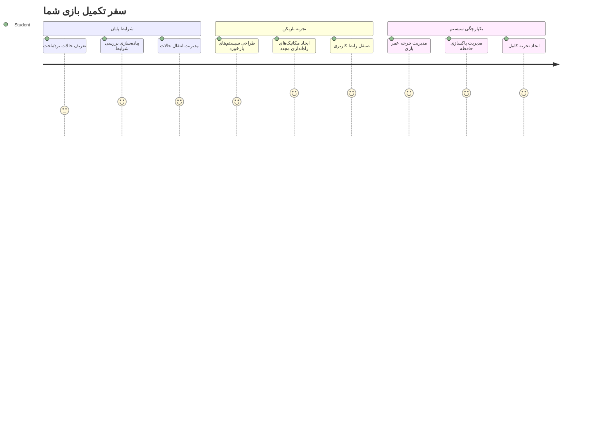
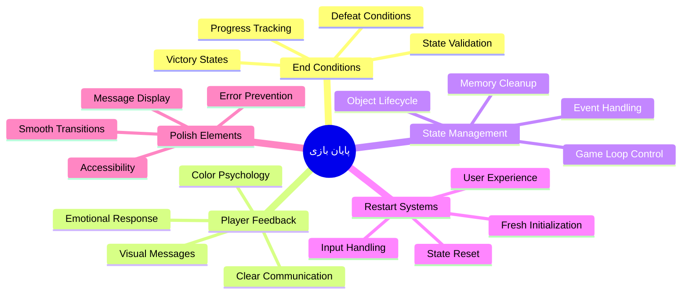
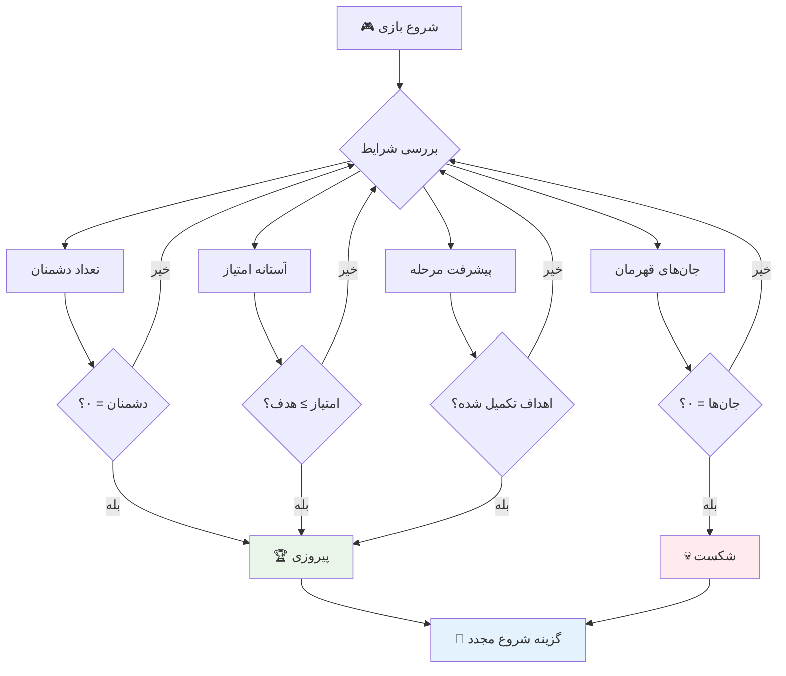
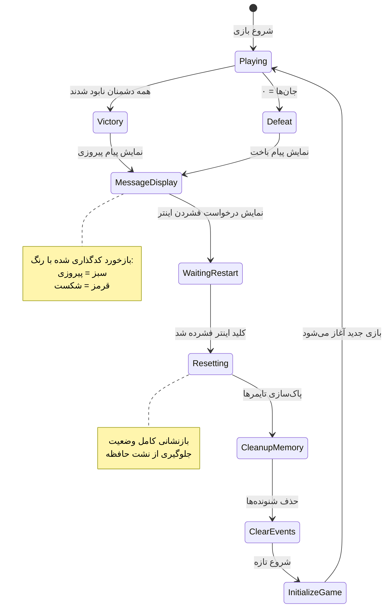
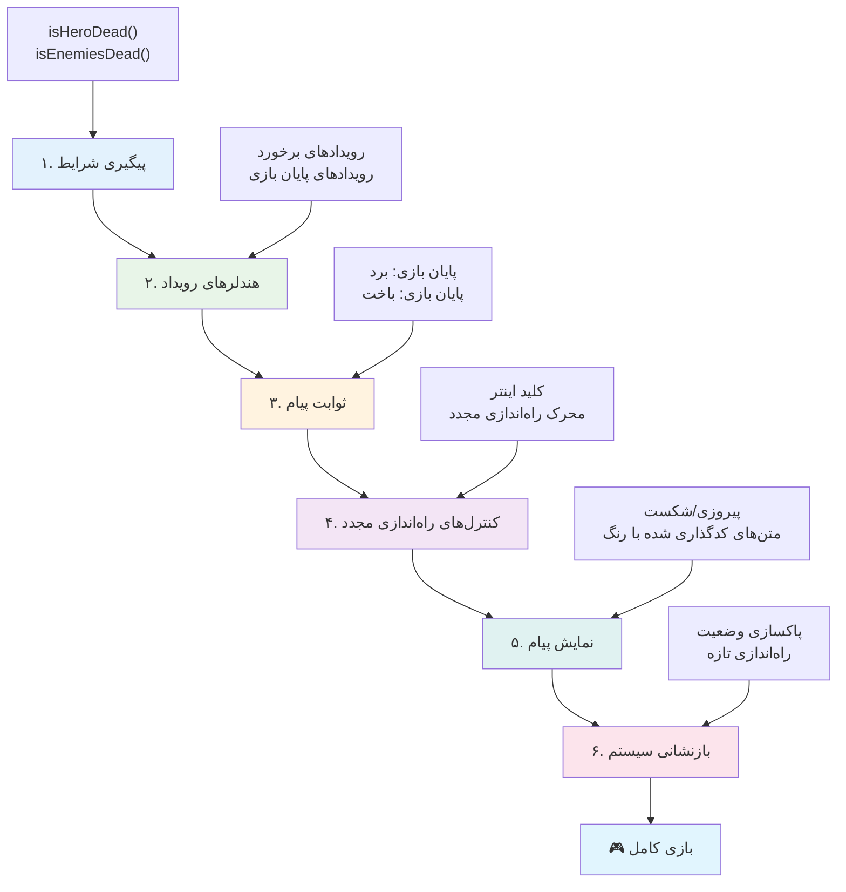
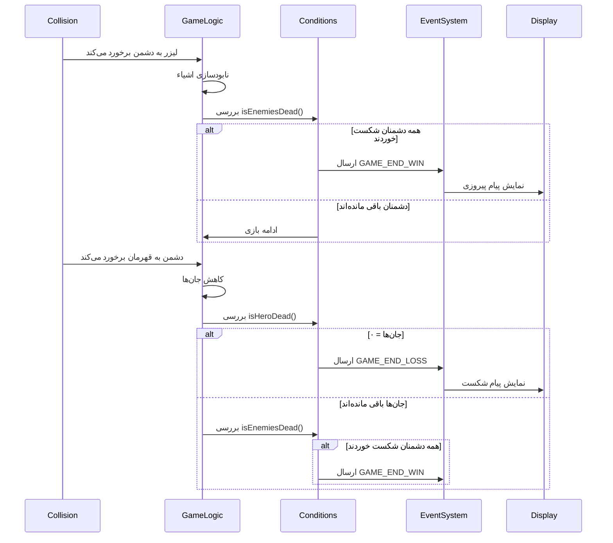
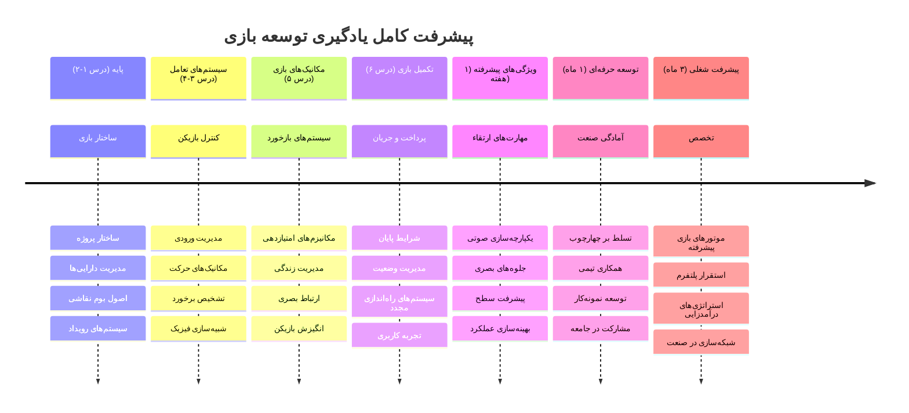

<!--
CO_OP_TRANSLATOR_METADATA:
{
  "original_hash": "a4b78043f4d64bf3ee24e0689b8b391d",
  "translation_date": "2026-01-06T10:04:14+00:00",
  "source_file": "6-space-game/6-end-condition/README.md",
  "language_code": "fa"
}
-->
# ساخت بازی فضایی قسمت ۶: پایان و شروع مجدد


هر بازی عالی نیازمند شرایط پایان واضح و مکانیزم شروع مجدد روان است. شما یک بازی فضایی چشمگیر با حرکت، مبارزه و امتیازدهی ساخته‌اید - حال زمان افزودن قطعات نهایی است که آن را کامل می‌کند.

بازی شما در حال حاضر به‌طور نامحدود اجرا می‌شود، مانند فضاپیماهای وویجر که ناسا در سال ۱۹۷۷ پرتاب کرد - که هنوز هم دهه‌ها بعد در فضا حرکت می‌کنند. در حالی که این برای اکتشافات فضایی مناسب است، بازی‌ها به نقاط پایانی مشخص نیاز دارند تا تجربه رضایت‌بخشی ایجاد کنند.

امروز، شرایط برد/باخت مناسب و سیستم شروع مجدد را پیاده‌سازی خواهیم کرد. تا پایان این درس، بازی صیقل‌یافته‌ای خواهید داشت که بازیکنان می‌توانند آن را تمام کنند و دوباره بازی کنند، درست مانند بازی‌های کلاسیک آرکید که این رسانه را تعریف کردند.


## آزمون پیش از درس

[آزمون پیش از درس](https://ff-quizzes.netlify.app/web/quiz/39)

## فهم شرایط پایان بازی

بازی شما باید کی پایان یابد؟ این سؤال بنیادی از اوایل عصر آرکید طراحی بازی را شکل داده است. پَک-من وقتی توسط ارواح گرفتار می‌شوید یا همه نقطه‌ها پاک می‌شوند تمام می‌شود، در حالی که Space Invaders وقتی بیگانگان به پایین صفحه می‌رسند یا همه را نابود می‌کنید پایان می‌یابد.

به عنوان خالق بازی، شما شرایط برد و باخت را تعریف می‌کنید. برای بازی فضایی ما، در اینجا رویکردهای اثبات شده‌ای وجود دارد که گیم‌پلی جذاب ایجاد می‌کنند:


- **تعداد `N` کشتی دشمن نابود شده است**: اگر بازی را به مراحل مختلف تقسیم کنید، معمولاً باید `N` کشتی دشمن را نابود کنید تا یک مرحله را کامل کنید
- **کشتی شما نابود شده است**: قطعاً بازی‌هایی وجود دارد که اگر کشتی شما نابود شود بازی را می‌بازید. رویکرد دیگری این است که مفهوم جان دارید. هر بار کشتی شما نابود می‌شود یک جان کم می‌شود. وقتی همه جان‌ها تمام شود بازی را می‌بازید.
- **نقاط `N` جمع‌آوری کرده‌اید**: شرط پایان معمول دیگر جمع‌آوری امتیاز است. نحوه کسب امتیاز به شما بستگی دارد اما معمولاً به فعالیت‌هایی مانند نابودی کشتی دشمن یا جمع‌آوری اقلامی که هنگام نابودی رها می‌شوند امتیاز می‌دهند.
- **پایان یک مرحله**: این ممکن است شامل چندین شرط باشد مانند نابودی `X` کشتی دشمن، جمع‌آوری `Y` امتیاز یا شاید جمع‌آوری یک آیتم خاص.

## پیاده‌سازی قابلیت شروع مجدد بازی

بازی‌های خوب اغلب با مکانیزم شروع مجدد روان امکان بازی دوباره را فراهم می‌کنند. وقتی بازیکنان بازی را کامل می‌کنند (یا شکست می‌خورند)، اغلب می‌خواهند بلافاصله دوباره تلاش کنند - چه برای ثبت امتیاز بهتر یا ارتقاء عملکرد.


بازی تتریس مثال کاملی است: وقتی بلوک‌های شما به بالای صفحه می‌رسند، می‌توانید بلافاصله بازی جدیدی را بدون ورود به منوهای پیچیده شروع کنید. ما سیستم شروع مجدد مشابهی خواهیم ساخت که وضعیت بازی را تمیز بازنشانی کرده و بازیکنان را سریعاً به بازی بازمی‌گرداند.

✅ **تفکر**: به بازی‌هایی که بازی کرده‌اید فکر کنید. چه شرایطی باعث پایان آنها می‌شود و چگونه از شما خواسته می‌شود بازی را دوباره شروع کنید؟ چه چیزی تجربه شروع مجدد را روان یا ناامیدکننده می‌کند؟

## آنچه خواهید ساخت

شما ویژگی‌های نهایی را پیاده خواهید کرد که پروژه شما را به تجربه کامل بازی تبدیل می‌کند. این عناصر بازی‌های صیقل‌یافته را از نمونه‌های اولیه ساده متمایز می‌کند.

**این چیزهایی است که امروز اضافه می‌کنیم:**

1. **شرط پیروزی**: همه دشمنان را نابود کنید و جشن مناسبی بگیرید (شما شایسته‌اش هستید!)
2. **شرط شکست**: وقتی جان‌هایتان تمام شد، صفحه شکست را ببینید
3. **مکانیزم شروع مجدد**: با زدن Enter فوراً به بازی بازگردید - چون یک بازی هیچ‌وقت کافی نیست
4. **مدیریت وضعیت**: هر بار شروع تازه و بدون دشمنان باقی‌مانده یا اشکال عجیب بازی قبلی

## آغاز کار

بیایید محیط توسعه خود را آماده کنیم. تمام فایل‌های بازی فضایی خود را از درس‌های قبلی آماده داشته باشید.

**پروژه شما باید چیزی شبیه به این باشد:**

```bash
-| assets
  -| enemyShip.png
  -| player.png
  -| laserRed.png
  -| life.png
-| index.html
-| app.js
-| package.json
```

**سرور توسعه خود را اجرا کنید:**

```bash
cd your-work
npm start
```

**این فرمان:**
- سرور محلی را روی `http://localhost:5000` اجرا می‌کند
- فایل‌های شما را به درستی سرو می‌دهد
- به طور خودکار هنگام تغییرات صفحه را تازه می‌کند

در مرورگر خود `http://localhost:5000` را باز کنید و مطمئن شوید بازی در حال اجرا است. باید بتوانید حرکت کنید، شلیک کنید و با دشمنان تعامل داشته باشید. پس از اطمینان، می‌توانیم پیاده‌سازی را ادامه دهیم.

> 💡 **نکته حرفه‌ای**: برای جلوگیری از هشدارها در ویژوال استودیو کد، `gameLoopId` را در بالای فایل خود به شکل `let gameLoopId;` تعریف کنید نه داخل تابع `window.onload`. این روش بر اساس بهترین شیوه‌های جدید تعریف متغیر در جاوااسکریپت است.


## مراحل پیاده‌سازی

### مرحله ۱: ساخت توابع ردیابی شرط پایان

ما نیاز به توابعی داریم که بررسی کنند بازی کی پایان یابد. مانند حسگرهای ایستگاه فضایی بین‌المللی که به طور مداوم سیستم‌های حیاتی را کنترل می‌کنند، این توابع هم وضعیت بازی را به طور مستمر کنترل می‌کنند.

```javascript
function isHeroDead() {
  return hero.life <= 0;
}

function isEnemiesDead() {
  const enemies = gameObjects.filter((go) => go.type === "Enemy" && !go.dead);
  return enemies.length === 0;
}
```

**آنچه در پس‌زمینه اتفاق می‌افتد:**
- **بررسی** می‌کند که آیا قهرمان ما جان دارد یا نه (ای وای!)
- **شمارش** می‌کند چند دشمن هنوز باقی مانده‌اند
- **برمی‌گرداند** `true` وقتی میدان نبرد از دشمنان پاک شود
- **استفاده** از منطق ساده درست/نادرست برای شفافیت بیشتر
- **فیلتر** کردن همه اشیاء بازی برای یافتن بازماندگان

### مرحله ۲: به‌روزرسانی هندلرهای رویداد برای شرایط پایان

اکنون این بررسی‌ها را به سیستم رویداد بازی متصل می‌کنیم. هر بار که برخوردی رخ دهد، بازی ارزیابی می‌کند که آیا این برخورد باعث پایان بازی می‌شود یا نه. این بازخورد فوری برای رویدادهای مهم ایجاد می‌کند.


```javascript
eventEmitter.on(Messages.COLLISION_ENEMY_LASER, (_, { first, second }) => {
    first.dead = true;
    second.dead = true;
    hero.incrementPoints();

    if (isEnemiesDead()) {
      eventEmitter.emit(Messages.GAME_END_WIN);
    }
});

eventEmitter.on(Messages.COLLISION_ENEMY_HERO, (_, { enemy }) => {
    enemy.dead = true;
    hero.decrementLife();
    if (isHeroDead())  {
      eventEmitter.emit(Messages.GAME_END_LOSS);
      return; // ضرر قبل از پیروزی
    }
    if (isEnemiesDead()) {
      eventEmitter.emit(Messages.GAME_END_WIN);
    }
});

eventEmitter.on(Messages.GAME_END_WIN, () => {
    endGame(true);
});
  
eventEmitter.on(Messages.GAME_END_LOSS, () => {
  endGame(false);
});
```

**چه اتفاقی می‌افتد:**
- **لیزر به دشمن برخورد می‌کند**: هر دو ناپدید می‌شوند، شما امتیاز می‌گیرید و چک می‌کنیم که آیا برنده شده‌اید
- **دشمن به شما برخورد می‌کند**: شما یک جان از دست می‌دهید و بررسی می‌کنیم هنوز زنده هستید یا نه
- **ترتیب هوشمندانه**: اول باخت را چک می‌کنیم (هیچ کس نمی‌خواهد همزمان ببرد و ببازد!)
- **واکنش فوری**: به محض رخداد اتفاق مهم بازی متوجه می‌شود

### مرحله ۳: افزودن ثابت‌های پیام جدید

باید پیام‌های جدیدی به شیء ثابت `Messages` اضافه کنید. این ثابت‌ها به حفظ سازگاری و جلوگیری از اشتباهات املایی در سیستم رویداد کمک می‌کنند.

```javascript
GAME_END_LOSS: "GAME_END_LOSS",
GAME_END_WIN: "GAME_END_WIN",
```

**در قسمت بالا:**
- **ثابت‌های رویداد پایان بازی** را اضافه کرده‌ایم تا سازگاری حفظ شود
- **نام‌های توصیفی** که هدف رویداد را به وضوح نشان می‌دهد استفاده شده است
- **سبک نام‌گذاری** ثابت‌های پیام موجود را دنبال کرده‌ایم

### مرحله ۴: پیاده‌سازی کنترل‌های شروع مجدد

حالا کنترل‌های صفحه‌کلیدی اضافه می‌کنید که به بازیکنان اجازه می‌دهد بازی را دوباره شروع کنند. کلید Enter انتخاب طبیعی است چون معمولاً برای تأیید عملیات و شروع بازی‌های جدید استفاده می‌شود.

**کشف کلید Enter را به شنونده رویداد keydown موجود اضافه کنید:**

```javascript
else if(evt.key === "Enter") {
   eventEmitter.emit(Messages.KEY_EVENT_ENTER);
}
```

**ثابت پیام جدید را اضافه کنید:**

```javascript
KEY_EVENT_ENTER: "KEY_EVENT_ENTER",
```

**نکاتی که باید بدانید:**
- **گسترش** سیستم پردازش رویداد صفحه‌کلید حال حاضر شما
- **استفاده** از کلید Enter به عنوان ماشه شروع مجدد تجربه‌ای شهودی ایجاد می‌کند
- **ارسال** رویداد سفارشی که سایر بخش‌های بازی می‌توانند به آن گوش دهند
- **حفظ** همان الگوی بقیه کنترل‌های صفحه‌کلید

### مرحله ۵: ساخت سیستم نمایش پیام

بازی شما باید نتایج را به صورت واضح به بازیکنان اعلام کند. ما سیستمی می‌سازیم که پیروزی و شکست را با متن رنگی نمایش دهد، شبیه به رابط‌های ترمینال کامپیوترهای اولیه که سبز به معنی موفقیت و قرمز خطا بود.

**تابع `displayMessage()` را بسازید:**

```javascript
function displayMessage(message, color = "red") {
  ctx.font = "30px Arial";
  ctx.fillStyle = color;
  ctx.textAlign = "center";
  ctx.fillText(message, canvas.width / 2, canvas.height / 2);
}
```

**گام به گام اتفاقات:**
- **اندازه و فونت** متن را برای خوانایی بهتر تنظیم می‌کند
- **رنگ** متن را با پارامتر پیش‌فرض «قرمز» برای هشدارها اعمال می‌کند
- **متن** را به طور افقی و عمودی در وسط بوم قرار می‌دهد
- **استفاده** از پارامترهای پیش‌فرض جاوااسکریپت برای تنظیم رنگ انعطاف‌پذیر
- **بهره‌گیری** از کانتکس ۲D بوم برای رندر مستقیم متن

**تابع `endGame()` را بسازید:**

```javascript
function endGame(win) {
  clearInterval(gameLoopId);

  // تنظیم تاخیر برای اطمینان از اتمام هر رندر در حال انتظار
  setTimeout(() => {
    ctx.clearRect(0, 0, canvas.width, canvas.height);
    ctx.fillStyle = "black";
    ctx.fillRect(0, 0, canvas.width, canvas.height);
    if (win) {
      displayMessage(
        "Victory!!! Pew Pew... - Press [Enter] to start a new game Captain Pew Pew",
        "green"
      );
    } else {
      displayMessage(
        "You died !!! Press [Enter] to start a new game Captain Pew Pew"
      );
    }
  }, 200)  
}
```

**این تابع چه کار می‌کند:**
- **تمام حرکت‌ها را فریز می‌کند** - هیچ کشتی یا لیزری حرکت نخواهد کرد
- **وقفه کوتاه** (۲۰۰ میلی‌ثانیه) می‌دهد تا آخرین فریم کامل شود
- **صفحه را پاک کرده و سیاه رنگ می‌کند** برای تأثیر دراماتیک
- **پیام‌های متفاوت** برای برندگان و بازندگان نمایش می‌دهد
- **رنگ‌بندی** پیام‌ها - سبز برای موفقیت، قرمز برای... خب، ناموفق!
- **راهنمایی می‌کند** چگونه برای شروع دوباره عمل کنند

### 🔄 **بررسی آموزشی**
**مدیریت وضعیت بازی**: پیش از پیاده‌سازی بازنشانی مطمئن شوید که:
- ✅ چگونه شرایط پایان اهداف واضح بازی را ایجاد می‌کند
- ✅ چرا بازخورد بصری برای فهم بازیکن ضروری است
- ✅ اهمیت پاک‌سازی مناسب برای جلوگیری از نشت حافظه
- ✅ چگونه معماری مبتنی بر رویداد امکان انتقال وضعیت تمیز را فراهم می‌کند

**آزمون سریع:** اگر رویدادها را در حین بازنشانی پاک نکنید چه می‌شود؟
*پاسخ: نشت حافظه و اجرای چندباره هندلرها باعث رفتار غیرقابل پیش‌بینی می‌شود*

**اصول طراحی بازی:** اکنون پیاده‌سازی می‌کنید:
- **اهداف واضح**: بازیکنان دقیقاً می‌دانند چه چیزی موفقیت و شکست را تعریف می‌کند
- **بازخورد فوری**: تغییر وضعیت بازی به سرعت اطلاع‌رسانی می‌شود
- **کنترل کاربر**: بازیکن می‌تواند هر وقت خواست بازی را شروع کند
- **قابلیت اطمینان سیستم**: پاک‌سازی صحیح از بروز اشکالات و افت کارایی جلوگیری می‌کند

### مرحله ۶: پیاده‌سازی تابع بازنشانی بازی

سیستم بازنشانی باید وضعیت فعلی بازی را کاملاً پاک کرده و جلسه بازی جدیدی را مقداردهی اولیه کند. این اطمینان می‌دهد بازیکنان بدون داده‌های باقی‌مانده بازی قبلی شروع تازه‌ای دارند.

**تابع `resetGame()` را بسازید:**

```javascript
function resetGame() {
  if (gameLoopId) {
    clearInterval(gameLoopId);
    eventEmitter.clear();
    initGame();
    gameLoopId = setInterval(() => {
      ctx.clearRect(0, 0, canvas.width, canvas.height);
      ctx.fillStyle = "black";
      ctx.fillRect(0, 0, canvas.width, canvas.height);
      drawPoints();
      drawLife();
      updateGameObjects();
      drawGameObjects(ctx);
    }, 100);
  }
}
```

**اجزای مختلف را بفهمید:**
- **بررسی** می‌کند که آیا حلقه بازی در حال اجرا است قبل از بازنشانی
- **پاک می‌کند** حلقه بازی موجود را تا همه فعالیت‌ها متوقف شود
- **حذف** همه شنونده‌های رویداد برای جلوگیری از نشت حافظه
- **بازسازی** وضعیت بازی با اشیاء و متغیرهای تازه
- **شروع** دوباره حلقه بازی با توابع مهم بازی
- **حفظ** همان فاصله ۱۰۰ میلی‌ثانیه برای عملکرد ثابت بازی

**هندلر رویداد کلید Enter را به تابع `initGame()` خود اضافه کنید:**

```javascript
eventEmitter.on(Messages.KEY_EVENT_ENTER, () => {
  resetGame();
});
```

**متد `clear()` را به کلاس EventEmitter خود اضافه کنید:**

```javascript
clear() {
  this.listeners = {};
}
```

**نکات کلیدی:**
- **اتصال** فشار کلید Enter به عملکرد بازنشانی بازی
- **ثبت** این شنونده رویداد هنگام مقداردهی اولیه بازی
- **ارائه** راهی تمیز برای حذف همه شنونده‌ها هنگام بازنشانی
- **جلوگیری** از نشت حافظه با پاک‌سازی هندلرهای رویداد میان بازی‌ها
- **بازنشانی** شیء شنونده‌ها به حالت خالی برای شروع تازه

## تبریک! 🎉

👽 💥 🚀 شما با موفقیت یک بازی کامل را از پایه ساختید. مانند برنامه‌نویسانی که اولین بازی‌های ویدیویی را در دهه ۱۹۷۰ ساختند، شما خطوط کد را به تجربه‌ای تعاملی با مکانیک‌های بازی و بازخورد کاربر تبدیل کرده‌اید. 🚀 💥 👽

**دست‌آوردهای شما:**
- **پیاده‌سازی** کامل شرایط برد و باخت با بازخورد کاربر
- **ساخت** سیستم شروع مجدد بدون نقص برای گیم‌پلی پیوسته
- **طراحی** ارتباط تصویری واضح برای وضعیت‌های بازی
- **مدیریت** تغییرات پیچیده وضعیت بازی و پاک‌سازی‌ها
- **مونتاژ** همه اجزا به یک بازی منسجم و قابل بازی

### 🔄 **بررسی آموزشی**
**سیستم کامل توسعه بازی**: به تسلط خود بر کل چرخه توسعه بازی جشن بگیرید:
- ✅ شرایط پایان چگونه تجربه رضایت‌بخش بازیکن ایجاد می‌کند؟
- ✅ چرا مدیریت صحیح وضعیت برای ثبات بازی حیاتی است؟
- ✅ چطور بازخورد بصری فهم بازیکن را بهبود می‌بخشد؟
- ✅ نقش سیستم شروع مجدد در حفظ بازیکن چیست؟

**تسلط بر سیستم**: بازی کامل شما نشان می‌دهد:
- **توسعه بازی فول‌استک**: از گرافیک تا ورودی و مدیریت وضعیت
- **معماری حرفه‌ای**: سیستم‌های مبتنی بر رویداد با پاک‌سازی صحیح
- **طراحی تجربه کاربری**: بازخورد واضح و کنترل‌های شهودی
- **بهینه‌سازی عملکرد**: رندر کارآمد و مدیریت حافظه
- **صیقل و کامل بودن**: همه جزئیاتی که بازی را کامل می‌کنند

**مهارت‌های آماده صنعت**: شما پیاده‌سازی کرده‌اید:
- **معماری حلقه بازی**: سیستم‌های زمان واقعی با عملکرد ثابت
- **برنامه‌نویسی مبتنی بر رویداد**: سیستم‌های مستقل و مقیاس‌پذیر
- **مدیریت وضعیت**: داده‌های پیچیده و مدیریت چرخه عمر
- **طراحی رابط کاربری**: ارتباط واضح و کنترل‌های پاسخگو
- **تست و رفع اشکال**: توسعه تکراری و حل مسائل

### ⚡ **چه کاری می‌توانید در ۵ دقیقه بعد انجام دهید**
- [ ] بازی کامل خود را اجرا کرده و همه شرایط برد و باخت را تست کنید
- [ ] پارامترهای مختلف شرایط پایان را امتحان کنید
- [ ] عباراتی مثل console.log اضافه کنید تا تغییرات وضعیت بازی را دنبال کنید
- [ ] بازی خود را با دوستان به اشتراک گذاشته و بازخورد جمع‌آوری کنید

### 🎯 **چه کاری می‌توانید در این ساعت انجام دهید**
- [ ] آزمون پس از درس را کامل کنید و بر سفر توسعه بازی خود تأمل کنید
- [ ] افکت‌های صوتی برای وضعیت‌های پیروزی و شکست اضافه کنید
- [ ] شرایط پایان بیشتری مانند محدودیت زمانی یا اهداف جایزه پیاده‌سازی کنید
- [ ] سطوح سختی مختلف با تعداد دشمنان متغیر بسازید
- [ ] نمایش بصری را با فونت‌ها و رنگ‌های بهتر بهبود دهید

### 📅 **تسلط بر توسعه بازی در طول هفته**
- [ ] بازی فضایی ارتقا یافته با چندین مرحله و پیشرفت کامل کنید
- [ ] ویژگی‌های پیشرفته مانند توانایی‌های ویژه، انواع دشمنان و سلاح‌های خاص اضافه کنید
- [ ] سیستم ثبت امتیاز بالا با ذخیره‌سازی پایدار ایجاد کنید
- [ ] رابط‌های کاربری برای منوها، تنظیمات و گزینه‌های بازی طراحی کنید
- [ ] عملکرد روی دستگاه‌ها و مرورگرهای مختلف بهینه کنید
- [ ] بازی خود را آنلاین منتشر کرده و با جامعه اشتراک بگذارید
### 🌟 **مسیر شغلی یک ماهه شما در توسعه بازی**
- [ ] ساخت چند بازی کامل با کاوش در ژانرها و مکانیک‌های مختلف
- [ ] یادگیری فریم‌ورک‌های پیشرفته توسعه بازی مانند Phaser یا Three.js
- [ ] مشارکت در پروژه‌های متن‌باز توسعه بازی
- [ ] مطالعه اصول طراحی بازی و روانشناسی بازیکن
- [ ] ساخت نمونه‌کار که مهارت‌های توسعه بازی شما را نشان دهد
- [ ] ارتباط با جامعه توسعه بازی و ادامه یادگیری

## 🎯 جدول زمانی تسلط کامل شما به توسعه بازی


### 🛠️ خلاصه مجموعه ابزار کامل توسعه بازی شما

پس از اتمام کل این سری بازی فضایی، اکنون شما تسلط یافته‌اید بر:
- **ساختار بازی**: سیستم‌های مبتنی بر رویداد، حلقه‌های بازی و مدیریت وضعیت
- **برنامه‌نویسی گرافیک**: رابط Canvas، رندر کردن اسپریت‌ها و افکت‌های بصری
- **سیستم‌های ورودی**: کنترل صفحه‌کلید، تشخیص برخورد و کنترل‌های پاسخگو
- **طراحی بازی**: بازخورد بازیکن، سیستم‌های پیشرفت و مکانیک‌های جذب بازیکن
- **بهینه‌سازی عملکرد**: رندر کارآمد، مدیریت حافظه و کنترل نرخ فریم
- **تجربه کاربری**: ارتباط شفاف، کنترل‌های شهودی و جزئیات پرداخت شده
- **الگوهای حرفه‌ای**: کد تمیز، تکنیک‌های رفع اشکال و سازماندهی پروژه

**کاربردهای دنیای واقعی**: مهارت‌های توسعه بازی شما مستقیماً قابل استفاده در:
- **برنامه‌های تعاملی وب**: رابط‌های پویا و سیستم‌های زمان واقعی
- **مصورسازی داده‌ها**: نمودارهای متحرک و گرافیک‌های تعاملی
- **فناوری آموزشی**: بازی‌سازی و تجربیات آموزشی جذاب
- **توسعه موبایل**: تعاملات لمسی و بهینه‌سازی عملکرد
- **نرم‌افزار شبیه‌سازی**: موتورهای فیزیک و مدل‌سازی زمان واقعی
- **صنایع خلاقانه**: هنر تعاملی، سرگرمی و تجربیات دیجیتال

**مهارت‌های حرفه‌ای کسب شده**: اکنون می‌توانید:
- **معماری** سیستم‌های تعاملی پیچیده را از پایه طراحی کنید
- **رفع اشکال** برنامه‌های زمان واقعی را با رویکردهای سیستماتیک انجام دهید
- **بهینه‌سازی** عملکرد برای تجربه کاربری روان داشته باشید
- **طراحی** رابط‌های کاربری جذاب و الگوهای تعامل را انجام دهید
- **همکاری** مؤثر در پروژه‌های فنی با سازماندهی مناسب کد

**مفاهیم توسعه بازی که تسلط یافته‌اید**:
- **سیستم‌های زمان واقعی**: حلقه‌های بازی، مدیریت نرخ فریم و عملکرد
- **معماری مبتنی بر رویداد**: سیستم‌های غیر وابسته و ارسال پیام
- **مدیریت وضعیت**: مدیریت داده پیچیده و چرخه عمر
- **برنامه‌نویسی رابط کاربری**: گرافیک Canvas و طراحی پاسخگو
- **نظریه طراحی بازی**: روانشناسی بازیکن و مکانیک‌های جذب

**مرحله بعد**: آماده‌اید که فریم‌ورک‌های پیشرفته بازی، گرافیک سه‌بعدی، سیستم‌های چندنفره را کاوش کنید یا وارد نقش‌های حرفه‌ای توسعه بازی شوید!

🌟 **دستاورد کسب شده**: شما سفر توسعه بازی کامل را طی کرده و یک تجربه تعاملی با کیفیت حرفه‌ای را از پایه ساخته‌اید!

**به جامعه توسعه بازی خوش آمدید!** 🎮✨

## چالش GitHub Copilot Agent 🚀

از حالت Agent برای تکمیل چالش زیر استفاده کنید:

**شرح:** بازی فضایی را با پیاده‌سازی سیستم پیشرفت مرحله‌ای با افزایش دشواری و ویژگی‌های پاداش بهبود دهید.

**دستورکار:** سیستم بازی فضایی چندمرحله‌ای بسازید که در هر مرحله تعداد بیشتری کشتی دشمن با سرعت و سلامت بالاتر وجود داشته باشد. یک ضریب امتیاز اضافه کنید که با هر مرحله افزایش یابد و Power-up هایی مانند شلیک سریع یا سپر که به‌صورت تصادفی هنگام نابودی دشمنان ظاهر می‌شوند پیاده‌سازی کنید. پاداش تکمیل مرحله را اضافه کنید و سطح فعلی را در کنار امتیاز و جان‌های موجود نمایش دهید.

برای اطلاعات بیشتر درباره [حالت agent](https://code.visualstudio.com/blogs/2025/02/24/introducing-copilot-agent-mode) اینجا را ببینید.

## 🚀 چالش بهبود اختیاری

**افزودن صدا به بازی شما**: تجربه بازی خود را با افزودن افکت‌های صوتی ارتقاء دهید! می‌توانید صداهای زیر را اضافه کنید:

- **شلیک لیزر** هنگام تیراندازی بازیکن
- **نابودی دشمن** هنگام ضربه زدن به کشتی‌ها
- **آسیب قهرمان** هنگام وارد شدن ضربه به بازیکن
- **موسیقی پیروزی** هنگام برد بازی
- **صدای شکست** هنگام باخت بازی

**نمونه پیاده‌سازی صدا:**

```javascript
// ایجاد اشیاء صوتی
const laserSound = new Audio('assets/laser.wav');
const explosionSound = new Audio('assets/explosion.wav');

// پخش صداها در طول رویدادهای بازی
function playLaserSound() {
  laserSound.currentTime = 0; // بازنشانی به ابتدا
  laserSound.play();
}
```

**آنچه باید بدانید:**
- **ایجاد** اشیاء Audio برای افکت‌های صوتی مختلف
- **تنظیم مجدد** currentTime برای امکان شلیک سریع صداها
- **رسیدگی به** سیاست‌های پخش خودکار مرورگر از طریق فعال‌سازی صدا در تعاملات کاربر
- **مدیریت** حجم صدا و زمان‌بندی برای تجربه بهتر بازی

> 💡 **منبع یادگیری**: این [زمینه صوتی](https://www.w3schools.com/jsref/tryit.asp?filename=tryjsref_audio_play) را برای یادگیری بیشتر درباره پیاده‌سازی صدا در بازی‌های JavaScript بررسی کنید.

## آزمون پس از درس

[آزمون پس از درس](https://ff-quizzes.netlify.app/web/quiz/40)

## مرور و خودآموزی

وظیفه شما ساخت یک بازی نمونه تازه است، پس سری به بعضی بازی‌های جالب بزنید تا ببینید چه نوع بازی می‌خواهید بسازید.

## تکلیف

[ساخت یک بازی نمونه](assignment.md)

---

<!-- CO-OP TRANSLATOR DISCLAIMER START -->
**سلب مسئولیت**:  
این سند با استفاده از سرویس ترجمه هوش مصنوعی [Co-op Translator](https://github.com/Azure/co-op-translator) ترجمه شده است. در حالی که ما تلاش می‌کنیم دقت را حفظ کنیم، لطفاً توجه داشته باشید که ترجمه‌های خودکار ممکن است شامل اشتباهات یا نواقصی باشند. سند اصلی به زبان مبدأ باید به‌عنوان منبع معتبر در نظر گرفته شود. برای اطلاعات حیاتی، توصیه می‌شود از ترجمه حرفه‌ای انسانی استفاده شود. ما مسئول هیچ‌گونه سوءتفاهم یا تفسیر نادرستی که ناشی از استفاده از این ترجمه باشد، نیستیم.
<!-- CO-OP TRANSLATOR DISCLAIMER END -->