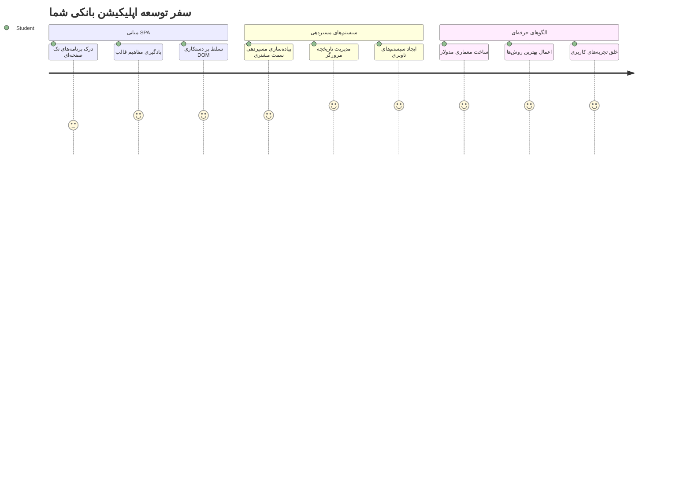
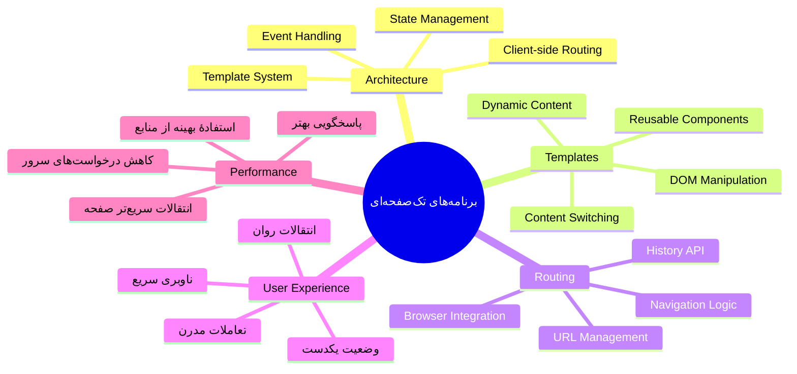
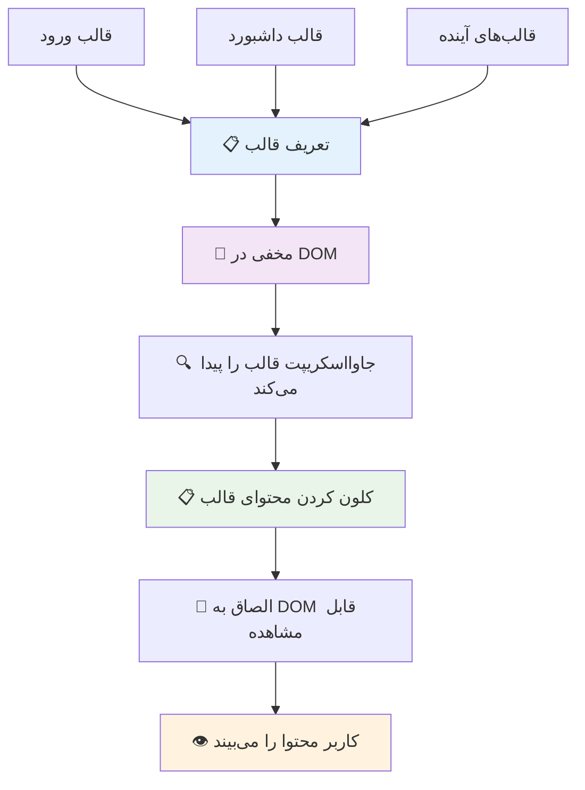
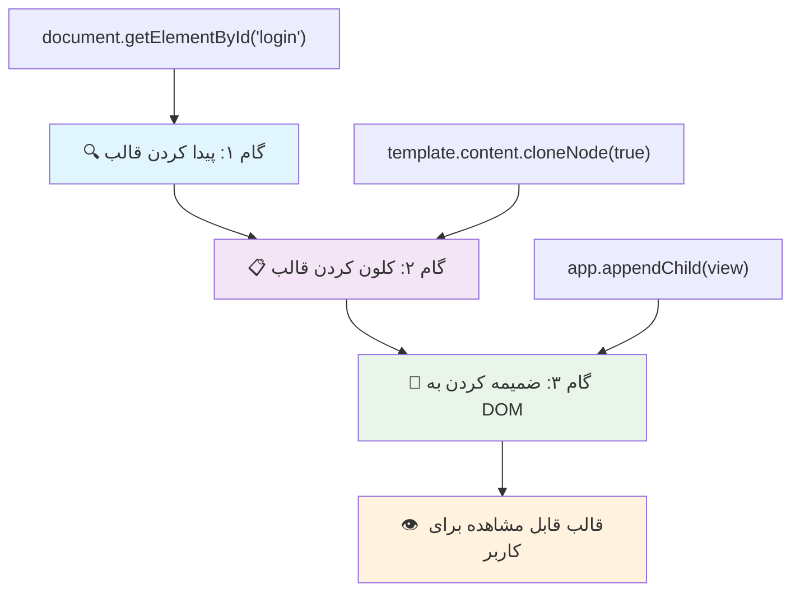
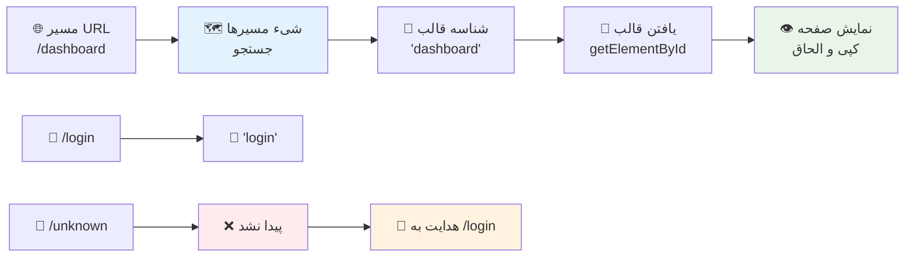
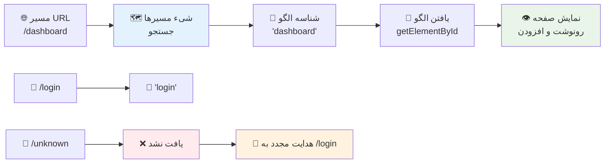
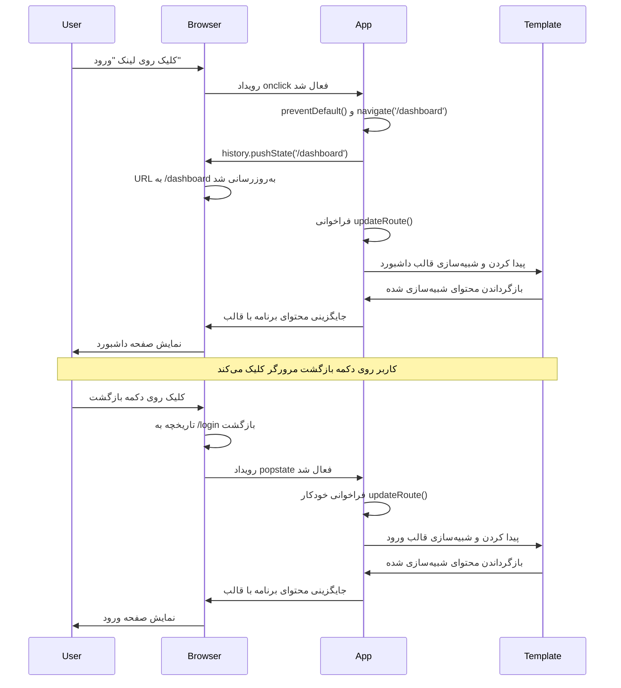
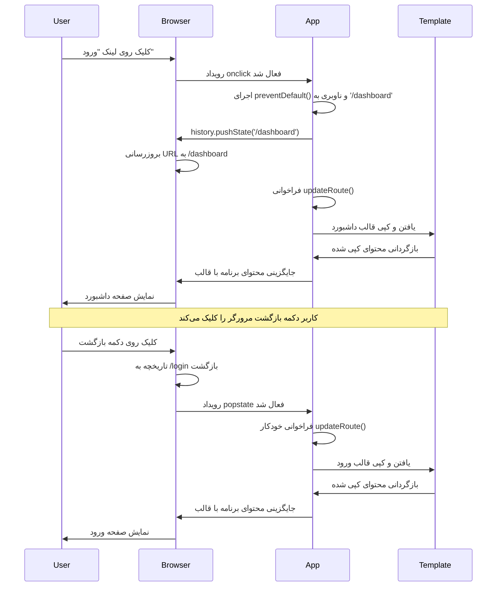
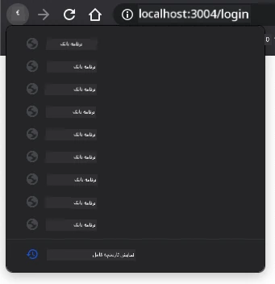
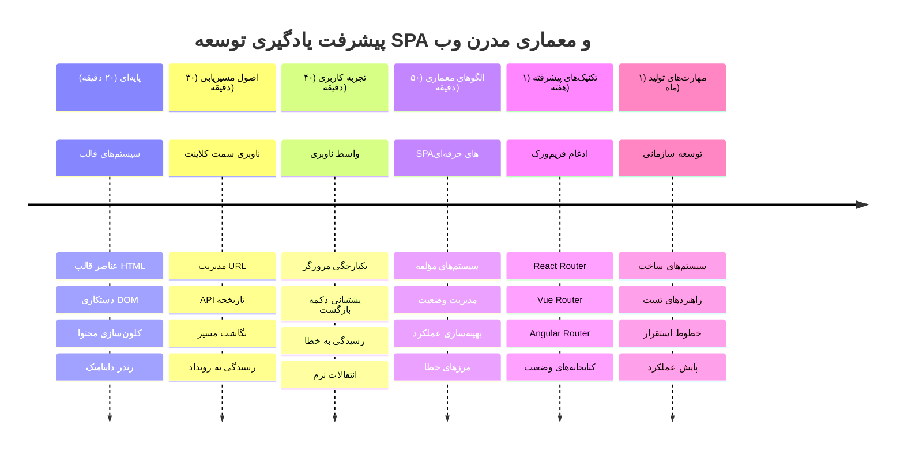

<!--
CO_OP_TRANSLATOR_METADATA:
{
  "original_hash": "351678bece18f07d9daa987a881fb062",
  "translation_date": "2026-01-06T10:24:15+00:00",
  "source_file": "7-bank-project/1-template-route/README.md",
  "language_code": "fa"
}
-->
# ساخت یک برنامه بانکی بخش ۱: قالب‌های HTML و مسیرها در یک برنامه وب


وقتی رایانه هدایت آپولو ۱۱ در سال ۱۹۶۹ به ماه ناوبری می‌کرد، باید بدون راه‌اندازی مجدد کل سیستم بین برنامه‌های مختلف جابجا می‌شد. برنامه‌های وب مدرن به همین شکل کار می‌کنند – آنها آنچه را که می‌بینید بدون بارگذاری مجدد کامل تغییر می‌دهند. این تجربه‌ای روان و پاسخگو ایجاد می‌کند که کاربران امروزی انتظار دارند.

برخلاف وب‌سایت‌های سنتی که برای هر تعامل کل صفحه را بارگذاری می‌کنند، برنامه‌های وب مدرن تنها بخش‌هایی را که نیاز به تغییر دارند به‌روزرسانی می‌کنند. این رویکرد، درست مانند اینکه مرکز کنترل مأموریت بین نمایش‌های مختلف جابجا می‌شود در حالی که ارتباط مداوم حفظ می‌شود، آن تجربه روانی را که ما انتظار داریم ایجاد می‌کند.

در اینجا تفاوت به قدری چشمگیر است که:

| برنامه‌های چندصفحه‌ای سنتی | برنامه‌های تک‌صفحه‌ای مدرن |
|----------------------------|----------------------------|
| **ناوبری** | بارگذاری کامل صفحه برای هر صفحه | تعویض فوری محتوا |
| **عملکرد** | کندتر به دلیل بارگذاری کامل HTML | سریع‌تر با به‌روزرسانی‌های جزئی |
| **تجربه کاربری** | چشمک‌های آزاردهنده صفحه | گذارهای نرم و شبه برنامه‌ای |
| **اشتراک داده** | دشوار بین صفحات | مدیریت آسان حالت |
| **توسعه** | چندین فایل HTML برای نگهداری | یک HTML با قالب‌های پویا |

**درک تکامل:**
- **برنامه‌های سنتی** نیاز به درخواست سرور برای هر عمل ناوبری دارند
- **برنامه‌های مدرن تک‌صفحه‌ای** یک بار بارگذاری می‌شوند و محتوا را پویا با جاوااسکریپت به‌روزرسانی می‌کنند
- **انتظارات کاربران** اکنون به تعاملات فوری و بدون درز گرایش دارد
- **مزایای عملکردی** شامل کاهش پهنای باند و پاسخ سریع‌تر می‌شود

در این درس، یک برنامه بانکی با چند صفحه خواهیم ساخت که به‌طور روان با هم جریان دارند. درست مانند اینکه دانشمندان از ابزارهای ماژولار استفاده می‌کنند که می‌توان آنها را برای آزمایش‌های مختلف پیکربندی مجدد کرد، ما از قالب‌های HTML به عنوان اجزای قابل استفاده مجدد استفاده خواهیم کرد که در صورت نیاز نمایش داده می‌شوند.

شما با قالب‌های HTML (طرح‌های قابل استفاده مجدد برای صفحات مختلف)، مسیر‌یابی جاوااسکریپت (سیستمی که بین صفحات جابجا می‌شود) و رابط تاریخچه مرورگر (که دکمه بازگشت را به درستی کار می‌کند) کار خواهید کرد. این‌ها همان تکنیک‌های اساسی هستند که فریم‌ورک‌هایی مانند React، Vue و Angular استفاده می‌کنند.

در پایان، یک برنامه بانکی عملی خواهید داشت که اصول برنامه‌های تک‌صفحه‌ای حرفه‌ای را نشان می‌دهد.


## آزمون قبل از درس

[آزمون قبل از درس](https://ff-quizzes.netlify.app/web/quiz/41)

### چیزی که نیاز خواهید داشت

ما به یک سرور وب محلی برای آزمایش برنامه بانکی‌مان نیاز داریم – نگران نباشید، آسان‌تر از آن است که فکر می‌کنید! اگر قبلاً یکی ندارید، فقط [Node.js](https://nodejs.org) را نصب کنید و از پوشه پروژه خود `npx lite-server` را اجرا کنید. این فرمان مفید یک سرور محلی راه‌اندازی می‌کند و به‌طور خودکار برنامه شما را در مرورگر باز می‌کند.

### آماده‌سازی

در کامپیوترتان، یک پوشه به نام `bank` بسازید و یک فایل با نام `index.html` داخل آن ایجاد کنید. ما از این [قالب اولیه](https://en.wikipedia.org/wiki/Boilerplate_code) HTML شروع خواهیم کرد:

```html
<!DOCTYPE html>
<html lang="en">
  <head>
    <meta charset="UTF-8">
    <meta name="viewport" content="width=device-width, initial-scale=1.0">
    <title>Bank App</title>
  </head>
  <body>
    <!-- This is where you'll work -->
  </body>
</html>
```

**این قالب اولیه چه چیزهایی فراهم می‌کند:**
- **ساختار** سند HTML5 را با اعلان مناسب DOCTYPE برقرار می‌کند
- **کدگذاری کاراکتر** را به UTF-8 برای پشتیبانی از متن‌های بین‌المللی تنظیم می‌کند
- **طراحی ریسپانسیو** را با تگ متا viewport برای سازگاری موبایل فعال می‌کند
- **عنوان توصیفی** که در تب مرورگر ظاهر می‌شود تنظیم می‌کند
- **بخش بدنه** تمیزی ایجاد می‌کند که برای ساخت برنامه استفاده می‌شود

> 📁 **پیش‌نمایش ساختار پروژه**
> 
> **تا پایان این درس، پروژه شما شامل موارد زیر خواهد بود:**
> ```
> bank/
> ├── index.html      <!-- Main HTML with templates -->
> ├── app.js          <!-- Routing and navigation logic -->
> └── style.css       <!-- (Optional for future lessons) -->
> ```
> 
> **وظایف فایل‌ها:**
> - **index.html**: شامل همه قالب‌ها و ساختار برنامه
> - **app.js**: مدیریت مسیرها، ناوبری و قالب‌ها
> - **قالب‌ها**: تعریف رابط کاربری برای صفحه ورود، داشبورد و سایر صفحات

---

## قالب‌های HTML

قالب‌ها یک مشکل اساسی در توسعه وب را حل می‌کنند. وقتی گوتنبرگ در دهه ۱۴۴۰ چاپ متحرک را اختراع کرد، متوجه شد به جای حکاکی کل صفحات، می‌تواند بلوک‌های قابل استفاده مجدد حروف بسازد و به صورت دلخواه بچیند. قالب‌های HTML بر همان اصل کار می‌کنند – به جای ایجاد فایل‌های HTML جداگانه برای هر صفحه، شما ساختارهای قابل استفاده مجددی تعریف می‌کنید که در صورت نیاز نمایش داده می‌شوند.


قالب‌ها را مانند نقشه‌های یک طرح برای بخش‌های مختلف برنامه خود در نظر بگیرید. همان‌طور که یک معمار یک نقشه را می‌سازد و بارها استفاده می‌کند به جای اینکه اتاق‌های یکسان را دوباره ترسیم کند، ما نیز قالب‌ها را یک بار می‌سازیم و در صورت نیاز نمونه‌سازی می‌کنیم. مرورگر این قالب‌ها را مخفی نگه می‌دارد تا زمانی که جاوااسکریپت آنها را فعال کند.

اگر می‌خواهید چند صفحه برای یک وب‌سایت بسازید، یک راه حل این است که برای هر صفحه یک فایل HTML جداگانه ایجاد کنید. اما این راه حل معایبی دارد:

- باید هنگام جابجایی صفحه، کل HTML دوباره بارگذاری شود که ممکن است کند باشد.
- به اشتراک گذاشتن داده بین صفحات مختلف دشوار است.

رویکرد دیگر این است که تنها یک فایل HTML داشته باشید و چندین [قالب HTML](https://developer.mozilla.org/docs/Web/HTML/Element/template) با استفاده از عنصر `<template>` تعریف کنید. قالب، بلوک HTML قابل استفاده مجددی است که توسط مرورگر نمایش داده نمی‌شود و باید در زمان اجرا با جاوااسکریپت نمونه‌سازی شود.

### بیایید بسازیم

ما قصد داریم یک برنامه بانکی با دو صفحه اصلی بسازیم: صفحه ورود و داشبورد. ابتدا، یک المان جایگزین در بدنه HTML اضافه می‌کنیم – جایی که همه صفحات ما نمایش داده خواهند شد:

```html
<div id="app">Loading...</div>
```

**درک این المان جایگزین:**
- **یک ظرف با شناسه "app" ایجاد می‌کند که همه صفحات در آن نمایش داده می‌شوند**
- **یک پیام بارگذاری نمایش می‌دهد تا زمانی که جاوااسکریپت صفحه اول را مقداردهی کند**
- **یک نقطه نصب واحد برای محتوای پویا فراهم می‌کند**
- **هدف‌گیری آسان با استفاده از `document.getElementById()` را ممکن می‌کند**

> 💡 **نکته حرفه‌ای**: از آنجایی که محتوای این عنصر جایگزین خواهد شد، می‌توانیم یک پیام یا نشانگر بارگذاری بگذاریم که هنگام بارگذاری برنامه نمایش داده شود.

سپس قالب HTML صفحه ورود را زیر آن اضافه می‌کنیم. فعلاً فقط یک عنوان و یک بخش حاوی یک لینک برای انجام ناوبری قرار می‌دهیم.

```html
<template id="login">
  <h1>Bank App</h1>
  <section>
    <a href="/dashboard">Login</a>
  </section>
</template>
```

**شکستن این قالب ورود:**
- **یک قالب با شناسه منحصربه‌فرد "login" برای هدف‌گیری جاوااسکریپت تعریف می‌کند**
- **یک تیتر اصلی که برند برنامه را مشخص می‌کند شامل می‌شود**
- **یک عنصر معنایی `<section>` برای گروه‌بندی محتوا دارد**
- **یک لینک ناوبری ارائه می‌دهد که کاربران را به داشبورد هدایت می‌کند**

بعد قالب دیگری برای صفحه داشبورد اضافه می‌کنیم. این صفحه شامل بخش‌های متفاوتی است:

- یک سربرگ با عنوان و لینک خروج
- موجودی حساب فعلی
- فهرستی از تراکنش‌ها که در جدول نمایش داده می‌شود

```html
<template id="dashboard">
  <header>
    <h1>Bank App</h1>
    <a href="/login">Logout</a>
  </header>
  <section>
    Balance: 100$
  </section>
  <section>
    <h2>Transactions</h2>
    <table>
      <thead>
        <tr>
          <th>Date</th>
          <th>Object</th>
          <th>Amount</th>
        </tr>
      </thead>
      <tbody></tbody>
    </table>
  </section>
</template>
```

**درک هر بخش این داشبورد:**
- **صفحه را با یک عنصر معنایی `<header>` که شامل ناوبری است ساختار می‌دهد**
- **عنوان برنامه را به صورت یکنواخت در صفحات نمایش می‌دهد**
- **یک لینک خروج ارائه می‌دهد که به صفحه ورود باز می‌گردد**
- **موجودی فعلی حساب در بخشی اختصاصی نمایش داده می‌شود**
- **داده‌های تراکنش‌ها را با استفاده از یک جدول HTML به طور مناسب سازمان‌دهی می‌کند**
- **هدرهای جدول برای ستون‌های تاریخ، شیء و مبلغ تعریف شده‌اند**
- **بدنه جدول خالی گذاشته شده تا محتوای پویا بعداً تزریق شود**

> 💡 **نکته حرفه‌ای**: هنگام ایجاد قالب‌های HTML، اگر می‌خواهید ببینید چگونه به نظر می‌رسند، می‌توانید تگ‌های `<template>` و `</template>` را با `<!-- -->` کامنت کنید.

### 🔄 **بررسی آموزشی**
**درک سیستم قالب:** قبل از اجرای جاوااسکریپت، مطمئن شوید که می‌دانید:
- ✅ قالب‌ها چگونه از عناصر HTML معمولی متفاوتند
- ✅ چرا قالب‌ها تا وقتی که جاوااسکریپت آنها را فعال نکند مخفی باقی می‌مانند
- ✅ اهمیت ساختار معنایی HTML در قالب‌ها
- ✅ چگونه قالب‌ها امکان استفاده مجدد از اجزای رابط کاربری را فراهم می‌کنند

**آزمون سریع خودآزمایی:** اگر تگ‌های `<template>` را از اطراف HTML حذف کنید چه اتفاقی می‌افتد؟
*پاسخ: محتوا بلافاصله قابل مشاهده می‌شود و عملکرد قالب خود را از دست می‌دهد*

**مزایای معماری:** قالب‌ها فراهم می‌کنند:
- **استفاده مجدد:** یک تعریف، چندین نمونه
- **عملکرد:** بدون پردازش HTML اضافی
- **نگهداری‌پذیری:** ساختار مرکزی UI
- **انعطاف‌پذیری:** جابجایی محتوای پویا

✅ چرا فکر می‌کنید که به قالب‌ها `id` داده‌ایم؟ آیا می‌توانستیم به جای آن از کلاس استفاده کنیم؟

## زنده کردن قالب‌ها با جاوااسکریپت

حالا باید قالب‌های خود را قابل استفاده کنیم. درست مانند چاپگر سه‌بعدی که نقشه دیجیتال را به جسم فیزیکی تبدیل می‌کند، جاوااسکریپت قالب‌های پنهان ما را به عناصری قابل مشاهده و تعاملی تبدیل می‌کند که کاربران می‌توانند ببینند و استفاده کنند.

این روند از سه مرحله ثابت تشکیل شده که پایه توسعه وب مدرن را تشکیل می‌دهد. وقتی این الگو را درک کنید، آن را در بسیاری از فریم‌ورک‌ها و کتابخانه‌ها خواهید شناخت.

اگر فایل HTML فعلی خود را در مرورگر باز کنید، خواهید دید که روی `Loading...` گیر می‌کند. این به این دلیل است که باید مقداری کد جاوااسکریپت اضافه کنیم تا قالب‌های HTML را نمونه‌سازی و نمایش دهد.

نمونه‌سازی قالب معمولاً در ۳ مرحله انجام می‌شود:

1. دریافت عنصر قالب در درخت DOM، مثلاً با استفاده از [`document.getElementById`](https://developer.mozilla.org/docs/Web/API/Document/getElementById).
2. کپی کردن کل قالب با [`cloneNode`](https://developer.mozilla.org/docs/Web/API/Node/cloneNode).
3. الصاق آن به DOM زیر یک عنصر قابل مشاهده، مثلاً با استفاده از [`appendChild`](https://developer.mozilla.org/docs/Web/API/Node/appendChild).


**تحلیل بصری فرآیند:**
- **گام ۱** قالب پنهان را در ساختار DOM پیدا می‌کند
- **گام ۲** یک کپی عملیاتی ایجاد می‌کند که می‌توان آن را به‌طور ایمن تغییر داد
- **گام ۳** کپی را در صفحه قابل مشاهده درج می‌کند
- **نتیجه** یک صفحه کاربردی است که کاربران می‌توانند با آن تعامل داشته باشند

✅ چرا قبل از الصاق به DOM باید قالب را کپی کنیم؟ فکر می‌کنید اگر این مرحله را رد کنیم چه اتفاقی می‌افتد؟

### وظیفه

یک فایل جدید به نام `app.js` در پوشه پروژه خود ایجاد کنید و آن فایل را در بخش `<head>` فایل HTML خود وارد کنید:

```html
<script src="app.js" defer></script>
```

**درک واردکردن این اسکریپت:**
- **فایل جاوااسکریپت را به سند HTML ما متصل می‌کند**
- **از ویژگی `defer` استفاده می‌کند تا اطمینان حاصل شود اسکریپت پس از پایان تحلیل HTML اجرا شود**
- **دسترسی به همه عناصر DOM را فعال می‌کند چون قبل از اجرای اسکریپت کاملاً بارگذاری شده‌اند**
- **مستلزم بهترین روش‌های مدرن بارگذاری اسکریپت و عملکرد است**

حالا در `app.js`، یک تابع جدید به نام `updateRoute` ایجاد خواهیم کرد:

```js
function updateRoute(templateId) {
  const template = document.getElementById(templateId);
  const view = template.content.cloneNode(true);
  const app = document.getElementById('app');
  app.innerHTML = '';
  app.appendChild(view);
}
```

**گام به گام، اینجا چه می‌گذرد:**
- **المان قالب را با استفاده از `id` منحصر به فردش پیدا می‌کند**
- **یک کپی عمیق از محتوای قالب با `cloneNode(true)` می‌سازد**
- **ظرف برنامه را که محتوا نمایش داده خواهد شد، پیدا می‌کند**
- **هر محتوای موجود در ظرف برنامه را پاک می‌کند**
- **محتوای قالب کپی شده را در DOM قابل مشاهده درج می‌کند**

حالا این تابع را با یکی از قالب‌ها صدا بزنید و نتیجه را ببینید.

```js
updateRoute('login');
```

**آنچه این فراخوانی تابع انجام می‌دهد:**
- **قالب ورود را با ارسال شناسه‌اش به‌عنوان پارامتر فعال می‌کند**
- **نشان می‌دهد چگونه می‌توان به صورت برنامه‌ریزی‌شده بین صفحات مختلف برنامه جابجا شد**
- **صفحه ورود را به جای پیام "Loading..." نمایش می‌دهد**

✅ هدف از این کد `app.innerHTML = '';` چیست؟ بدون آن چه اتفاقی می‌افتد؟

## ایجاد مسیرها

مسیریابی اساساً اتصال URLها به محتوای مناسب است. تصور کنید اپراتورهای تلفن قدیمی چگونه با سوئیچ‌بورد تماس‌ها را وصل می‌کردند – آنها درخواست ورودی را گرفته و به مقصد صحیح متصل می‌کردند. مسیریابی وب به همین شکل کار می‌کند: درخواست URL را می‌گیرد و مشخص می‌کند چه محتوایی نمایش داده شود.


معمولاً سرورهای وب این کار را با سرو کردن فایل‌های HTML مختلف برای URLهای مختلف انجام می‌دادند. از آنجا که ما یک برنامه تک صفحه‌ای می‌سازیم، باید این مسیریابی را خودمان با جاوااسکریپت انجام دهیم. این رویکرد کنترل بیشتری روی تجربه کاربری و عملکرد به ما می‌دهد.


**درک جریان مسیریابی:**
- **تغییرات URL** باعث جستجو در پیکربندی مسیرها می‌شود
- **مسیرهای معتبر** به شناسه‌های قالب خاص برای رندر شدن نگاشت می‌شوند
- **مسیرهای نامعتبر** موجب فعال شدن رفتار پشتیبان برای جلوگیری از حالت‌های شکسته می‌شوند
- **رندر قالب** بر اساس فرآیند سه مرحله‌ای که قبلاً آموختیم انجام می‌شود

وقتی درباره یک برنامه وب صحبت می‌کنیم، *مسیردهی* به معنای نگاشت **URLها** به صفحات خاصی است که باید نمایش داده شوند. روی یک وب‌سایت با چند فایل HTML، این به طور خودکار انجام می‌شود چون مسیر فایل‌ها در URL منعکس می‌شود. برای مثال، با این فایل‌ها در پوشه پروژه شما:

```
mywebsite/index.html
mywebsite/login.html
mywebsite/admin/index.html
```

اگر سرور وبی با ریشه `mywebsite` بسازید، نگاشت URL به صورت زیر خواهد بود:

```
https://site.com            --> mywebsite/index.html
https://site.com/login.html --> mywebsite/login.html
https://site.com/admin/     --> mywebsite/admin/index.html
```

اما برای برنامه وب ما که از یک فایل HTML واحد شامل همه صفحات استفاده می‌کنیم، این رفتار پیش‌فرض به ما کمکی نمی‌کند. باید این نگاشت را به صورت دستی بسازیم و قالب نمایش داده شده را با جاوااسکریپت به‌روزرسانی کنیم.

### وظیفه

ما از یک شی ساده برای پیاده‌سازی [نگاشت](https://en.wikipedia.org/wiki/Associative_array) بین مسیرهای URL و قالب‌هایمان استفاده خواهیم کرد. این شی را در بالای فایل `app.js` خود اضافه کنید.

```js
const routes = {
  '/login': { templateId: 'login' },
  '/dashboard': { templateId: 'dashboard' },
};
```

**درک این پیکربندی مسیرها:**
- **نگاشت بین مسیرهای URL و شناسه‌های قالب را تعریف می‌کند**
- **از نحو شی استفاده می‌کند که کلیدها مسیرهای URL و مقادیر شامل اطلاعات قالب هستند**
- **جستجوی آسان قالب برای نمایش در هر URL را ممکن می‌سازد**
- **ساختاری مقیاس‌پذیر برای افزودن مسیرهای جدید در آینده فراهم می‌کند**
حالا بیایید کمی تابع `updateRoute` را تغییر دهیم. به جای اینکه مستقیم `templateId` را به عنوان آرگومان بفرستیم، می‌خواهیم ابتدا آن را با نگاه کردن به URL فعلی به دست آوریم، سپس با استفاده از نقشه خود مقدار ID قالب مربوطه را دریافت کنیم. می‌توانیم از [`window.location.pathname`](https://developer.mozilla.org/docs/Web/API/Location/pathname) استفاده کنیم تا فقط بخش مسیر URL را دریافت کنیم.

```js
function updateRoute() {
  const path = window.location.pathname;
  const route = routes[path];

  const template = document.getElementById(route.templateId);
  const view = template.content.cloneNode(true);
  const app = document.getElementById('app');
  app.innerHTML = '';
  app.appendChild(view);
}
```

**توضیح گام به گام آنچه اینجا اتفاق می‌افتد:**
- **استخراج** مسیر فعلی از URL مرورگر با استفاده از `window.location.pathname`
- **جستجو** پیکربندی مسیر متناظر در شیء routes ما
- **دریافت** شناسه قالب از پیکربندی مسیر
- **پیروی** از همان فرآیند رندر قالب مثل قبلاً
- **ایجاد** یک سیستم پویا که به تغییرات URL واکنش نشان می‌دهد

ما در اینجا مسیرهای اعلام‌شده را به قالب مربوطه نگاشتیم. می‌توانید امتحان کنید که این کار به درستی کار می‌کند با تغییر دستی URL در مرورگر خود.

✅ چه اتفاقی می‌افتد اگر مسیری ناشناخته در URL وارد کنید؟ چگونه می‌توانیم این مشکل را حل کنیم؟

## افزودن ناوبری

با تأسیس مسیر یابی، کاربران به روشی برای ناوبری در برنامه نیاز دارند. وب‌سایت‌های سنتی هنگام کلیک روی لینک‌ها صفحه را به طور کامل بارگذاری مجدد می‌کنند، اما ما می‌خواهیم URL و محتوا را بدون بارگذاری مجدد صفحه به‌روزرسانی کنیم. این تجربه روان‌تری ایجاد می‌کند، مشابه نحوه تغییر نماها در برنامه‌های دسکتاپ.

ما باید دو چیز را هماهنگ کنیم: به‌روزرسانی URL مرورگر تا کاربران بتوانند صفحات را علامت‌گذاری و لینک‌ها را به اشتراک بگذارند، و نمایش محتوای مناسب. وقتی به درستی پیاده‌سازی شود، این ناوبری یکپارچه ایجاد می‌کند که کاربران از برنامه‌های مدرن انتظار دارند.


### 🔄 **بررسی آموزشی**
**معماری برنامه تک صفحه‌ای (SPA)**: درک کامل سیستم را بررسی کنید:
- ✅ ناوبری سمت کلاینت چگونه با ناوبری سنتی سمت سرور متفاوت است؟
- ✅ چرا API تاریخچه (History API) برای ناوبری صحیح SPA ضروری است؟
- ✅ چگونه قالب‌ها امکان ارائه محتوای داینامیک بدون بارگذاری مجدد صفحه را فراهم می‌کنند؟
- ✅ نقش مدیریت رویداد در جلوگیری از ناوبری پیش‌فرض چیست؟

**یکپارچگی سیستم**: SPA شما نشان می‌دهد:
- **مدیریت قالب**: کامپوننت‌های UI قابل استفاده مجدد با محتوای داینامیک
- **مسیر‌یابی سمت کلاینت**: مدیریت URL بدون درخواست به سرور
- **معماری مبتنی بر رویداد**: ناوبری و تعاملات پاسخگو
- **یکپارچگی با مرورگر**: پشتیبانی مناسب از دکمه‌های رفت و برگشت تاریخچه
- **بهینه‌سازی عملکرد**: انتقالات سریع و بار سرور کمتر

**الگوهای حرفه‌ای**: شما اجرا کرده‌اید:
- **جداسازی مدل-نما**: قالب‌ها جدا از منطق برنامه
- **مدیریت حالت**: حالات URL با محتوای نمایش داده شده همگام شده است
- **بهبود تدریجی**: استفاده از جاوااسکریپت برای ارتقاء عملکرد پایه HTML
- **تجربه کاربری**: ناوبری روان و شبیه برنامه بدون بارگذاری صفحه

> 💡 **بینش معماری**: اجزای سیستم ناوبری
>
> **آنچه در حال ساخت آن هستید:**
> - **🔄 مدیریت URL**: به‌روزرسانی نوار آدرس مرورگر بدون بارگذاری صفحه
> - **📋 سیستم قالب**: تعویض محتوای پویا بر اساس مسیر کنونی  
> - **📚 یکپارچگی تاریخچه**: حفظ عملکرد دکمه‌های پشت و جلو مرورگر
> - **🛡️ مدیریت خطا**: راهکارهای جایگزین برای مسیرهای نامعتبر یا مفقود
>
> **نحوه عملکرد اجزا با هم:**
> - **گوش دادن** به رویدادهای ناوبری (کلیک‌ها، تغییرات تاریخچه)
> - **به‌روزرسانی** URL به کمک History API
> - **رندر قالب** مناسب برای مسیر جدید
> - **حفظ** تجربه کاربری بدون نقص در کل

گام بعدی برای برنامه ما اضافه کردن امکان ناوبری بین صفحات بدون نیاز به تغییر دستی URL است. این دو چیز را نیاز دارد:

  1. به‌روزرسانی URL فعلی
  2. به‌روزرسانی قالب نمایش داده شده بر اساس URL جدید

ما قبلاً قسمت دوم را با تابع `updateRoute` به عهده گرفتیم، پس باید راهی پیدا کنیم که URL فعلی را به‌روزرسانی کنیم.

باید از جاوااسکریپت و به طور خاص [`history.pushState`](https://developer.mozilla.org/docs/Web/API/History/pushState) استفاده کنیم که امکان به‌روزرسانی URL و ایجاد ورودی جدید در تاریخچه مرورگر را بدون بارگذاری مجدد HTML می‌دهد.

> ⚠️ **توجه مهم**: در حالی که تگ HTML anchor [`<a href>`](https://developer.mozilla.org/docs/Web/HTML/Element/a) می‌تواند به تنهایی برای ایجاد لینک به URLهای مختلف استفاده شود، این باعث می‌شود مرورگر به صورت پیش‌فرض HTML صفحه را بارگذاری مجدد کند. هنگام مدیریت مسیر‌یابی با جاوااسکریپت سفارشی، باید این رفتار را با استفاده از تابع preventDefault() در رویداد کلیک جلوگیری کنیم.

### کار

بیایید یک تابع جدید بسازیم که بتوانیم در برنامه برای ناوبری استفاده کنیم:

```js
function navigate(path) {
  window.history.pushState({}, path, path);
  updateRoute();
}
```

**درک این تابع ناوبری:**
- **به‌روزرسانی** URL مرورگر به مسیر جدید با استفاده از `history.pushState`
- **افزودن** یک ورودی جدید به تاریخچه مرورگر برای پشتیبانی صحیح از دکمه‌های عقب/جلو
- **شبیه‌سازی** فراخوانی تابع `updateRoute()` برای نمایش قالب مربوطه
- **ادامه** تجربه برنامه تک صفحه‌ای بدون بارگذاری مجدد صفحه

این روش ابتدا URL فعلی را بر اساس مسیر داده شده به‌روزرسانی می‌کند و سپس قالب را به‌روزرسانی می‌کند. خصوصیت `window.location.origin` ریشه URL را برمی‌گرداند که اجازه می‌دهد یک URL کامل از مسیر داده شده ساخته شود.

حالا که این تابع را داریم، می‌توانیم مشکل مسیرهایی که با هیچ مسیری تعریف شده تطابق ندارد را بررسی کنیم. تابع `updateRoute` را با اضافه کردن یک مسیر جایگزین که از بین مسیرهای موجود انتخاب می‌کند اصلاح خواهیم کرد اگر نتوانیم تطابقی پیدا کنیم.

```js
function updateRoute() {
  const path = window.location.pathname;
  const route = routes[path];

  if (!route) {
    return navigate('/login');
  }

  const template = document.getElementById(route.templateId);
  const view = template.content.cloneNode(true);
  const app = document.getElementById('app');
  app.innerHTML = '';
  app.appendChild(view);
}
```

**نکات کلیدی برای یادآوری:**
- **بررسی** وجود مسیر برای مسیر فعلی
- **هدایت مجدد** به صفحه ورود زمانی که مسیر نامعتبری وارد شود
- **ارائه** مکانیزم جایگزینی که از شکستن ناوبری جلوگیری می‌کند
- **اطمینان** از اینکه کاربران همیشه صفحه‌ای معتبر می‌بینند حتی با URLهای نادرست

اگر مسیری پیدا نشود، حالا به صفحه `login` هدایت می‌شویم.

حالا بیایید تابعی بسازیم که هنگام کلیک روی لینک آدرس URL را بگیرد و رفتار پیش‌فرض مرورگر را جلوگیری کند:

```js
function onLinkClick(event) {
  event.preventDefault();
  navigate(event.target.href);
}
```

**توضیح این هندلر کلیک:**
- **جلوگیری** از رفتار پیش‌فرض لینک مرورگر با استفاده از `preventDefault()`
- **استخراج** URL مقصد از المان لینک کلیک شده
- **فراخوانی** تابع ناوبری سفارشی به جای بارگذاری مجدد صفحه
- **حفظ** تجربه روان برنامه تک صفحه‌ای

```html
<a href="/dashboard" onclick="onLinkClick(event)">Login</a>
...
<a href="/login" onclick="onLinkClick(event)">Logout</a>
```

**این اتصال رویداد onclick چه کاری انجام می‌دهد:**
- **اتصال** هر لینک به سیستم ناوبری سفارشی ما
- **تسلیم** رویداد کلیک به تابع `onLinkClick` برای پردازش
- **فعال‌سازی** ناوبری روان بدون بارگذاری صفحه
- **حفظ** ساختار درست URL که کاربران می‌توانند آن را علامت‌گذاری یا به اشتراک بگذارند

ویژگی [`onclick`](https://developer.mozilla.org/docs/Web/API/GlobalEventHandlers/onclick) رویداد `click` را به کد جاوااسکریپت، در اینجا فراخوانی تابع `navigate()`، متصل می‌کند.

تلاش کنید روی این لینک‌ها کلیک کنید، حالا باید بتوانید بین صفحه‌های مختلف برنامه خود ناوبری کنید.

✅ متد `history.pushState` بخشی از استاندارد HTML5 است و در [همه مرورگرهای مدرن](https://caniuse.com/?search=pushState) پیاده‌سازی شده. اگر برنامه وبی برای مرورگرهای قدیمی‌تر می‌سازید، یک ترفند وجود دارد که می‌توانید به جای این API استفاده کنید: با اضافه کردن [هش (`#`)](https://en.wikipedia.org/wiki/URI_fragment) قبل از مسیر، می‌توانید مسیریابی‌ای پیاده‌سازی کنید که با ناوبری معمولی لینک‌های anchor کار می‌کند و صفحه را بارگذاری مجدد نمی‌کند، چون هدفش ایجاد لینک‌های داخلی در داخل صفحه بود.

## فعال کردن دکمه‌های قبلی و بعدی

دکمه‌های «قبلی» و «بعدی» در مرور وب بنیادی هستند، درست مثل اینکه کنترل‌کننده‌های ماموریت ناسا می‌توانند وضعیت‌های قبلی سیستم را در طول ماموریت‌های فضایی مرور کنند. کاربران انتظار دارند این دکمه‌ها کار کنند و وقتی کار نکنند، تجربه مرور مورد انتظار خراب می‌شود.

برنامه تک صفحه‌ای ما به پیکربندی اضافی نیاز دارد تا این را پشتیبانی کند. مرورگر یک پشته تاریخچه حفظ می‌کند (که ما با `history.pushState` به آن اضافه کرده‌ایم)، اما زمانی که کاربران در این تاریخچه ناوبری می‌کنند، برنامه ما باید با به‌روزرسانی محتوای نمایش داده شده پاسخ دهد.


**نقاط کلیدی تعامل:**
- **عملکردهای کاربر** با کلیک‌ها یا دکمه‌های مرورگر ناوبری را فعال می‌کنند
- **برنامه** کلیک روی لینک‌ها را رهگیری می‌کند تا از بارگذاری مجدد صفحه جلوگیری کند
- **API تاریخچه** تغییرات URL و پشته تاریخچه مرورگر را مدیریت می‌کند
- **قالب‌ها** ساختار محتوا برای هر صفحه را فراهم می‌کنند
- **گوش‌دهنده‌های رویداد** اطمینان حاصل می‌کنند که برنامه به تمام انواع ناوبری پاسخ می‌دهد

استفاده از `history.pushState` ورودی‌های جدیدی در تاریخچه ناوبری مرورگر ایجاد می‌کند. می‌توانید این را با نگه داشتن دکمه *بازگشت* مرورگر خود امتحان کنید، باید چیزی شبیه این ببینید:



اگر چند بار روی دکمه برگشت کلیک کنید، می‌بینید که URL فعلی تغییر می‌کند و تاریخچه به‌روزرسانی می‌شود، اما همان قالب نمایش داده می‌شود.

چون برنامه نمی‌داند که هر بار تاریخچه تغییر می‌کند باید تابع `updateRoute()` را فراخوانی کنیم. اگر به [مستندات `history.pushState`](https://developer.mozilla.org/docs/Web/API/History/pushState) نگاه کنید، می‌بینید که اگر حالت تغییر کند - یعنی به URL متفاوتی رفته باشیم - رویداد [`popstate`](https://developer.mozilla.org/docs/Web/API/Window/popstate_event) فعال می‌شود. ما از این رویداد برای رفع این مشکل استفاده می‌کنیم.

### کار

برای اطمینان از اینکه قالب نمایش داده شده هنگام تغییر تاریخچه مرورگر به‌روزرسانی می‌شود، تابع جدیدی را ضمیمه می‌کنیم که `updateRoute()` را فراخوانی کند. این کار را در پایین فایل `app.js` انجام خواهیم داد:

```js
window.onpopstate = () => updateRoute();
updateRoute();
```

**درک این یکپارچگی تاریخچه:**
- **گوش دادن** به رویدادهای `popstate` که هنگام ناوبری با دکمه‌های مرورگر رخ می‌دهد
- **استفاده** از تابع پیکان برای نگارش کوتاه هندلر رویداد
- **فراخوانی** خودکار `updateRoute()` هر زمان که حالت تاریخچه تغییر کند
- **راه‌اندازی برنامه** با فراخوانی `updateRoute()` هنگام بارگذاری اولیه صفحه
- **اطمینان** از نمایش قالب صحیح بدون توجه به نحوه ناوبری کاربر

> 💡 **نکته حرفه‌ای**: ما برای مختصر بودن این هندلر رویداد `popstate` از [تابع پیکان](https://developer.mozilla.org/docs/Web/JavaScript/Reference/Functions/Arrow_functions) استفاده کردیم، اما تابع معمولی هم همانطور کار می‌کرد.

این هم ویدئوی یادآوری درباره توابع پیکان:

[](https://youtube.com/watch?v=OP6eEbOj2sc "Arrow Functions")

> 🎥 برای دیدن ویدئو درباره توابع پیکان روی تصویر بالا کلیک کنید.

حالا سعی کنید از دکمه‌های قبلی و بعدی مرورگر خود استفاده کنید و بررسی کنید که مسیر نمایش داده شده این بار به درستی به‌روزرسانی می‌شود.

### ⚡ **کاری که می‌توانید در ۵ دقیقه آینده انجام دهید**
- [ ] ناوبری برنامه بانکی خود را با دکمه‌های عقب/جلو مرورگر تست کنید
- [ ] امتحان کنید URLهای مختلف را به صورت دستی در نوار آدرس وارد کنید تا مسیر‌یابی را بسنجید
- [ ] ابزار توسعه مرورگر (DevTools) را باز کنید و ببینید قالب‌ها چگونه در DOM کپی می‌شوند
- [ ] با اضافه کردن console.log جریان مسیر‌یابی را دنبال کنید

### 🎯 **اهدافی که در این ساعت می‌توانید به آنها برسید**
- [ ] آزمون پس از درس را کامل کنید و مفاهیم معماری SPA را درک کنید
- [ ] استایل CSS اضافه کنید تا قالب‌های برنامه بانکی شما حرفه‌ای‌تر به نظر برسند
- [ ] چالش صفحه خطای ۴۰۴ را با مدیریت مناسب خطا پیاده‌سازی کنید
- [ ] چالش صفحه اعتبارنامه‌ها با قابلیت‌های مسیر‌یابی اضافی بسازید
- [ ] وضعیت‌های بارگذاری و انتقالات بین تعویض قالب‌ها را اضافه کنید

### 📅 **برنامه هفتگی توسعه SPA شما**
- [ ] برنامه بانکی کامل با فرم‌ها، مدیریت داده و ماندگاری بسازید
- [ ] ویژگی‌های پیشرفته مسیر‌یابی مانند پارامتر مسیر و مسیرهای تو در تو اضافه کنید
- [ ] محافظ‌های ناوبری و مسیر‌یابی مبتنی بر احراز هویت پیاده کنید
- [ ] کامپوننت‌های قالب قابل استفاده مجدد و کتابخانه کامپوننت ایجاد کنید
- [ ] انیمیشن‌ها و انتقال برای تجربه کاربری نرم‌تر اضافه کنید
- [ ] SPA خود را در یک پلتفرم میزبانی منتشر و مسیر‌یابی را به درستی تنظیم کنید

### 🌟 **تسلط ماهانه شما بر معماری فرانت‌اند**
- [ ] SPAهای پیچیده با استفاده از فریم‌ورک‌های مدرن مثل React، Vue یا Angular بسازید
- [ ] الگوها و کتابخانه‌های پیشرفته مدیریت حالت را یاد بگیرید
- [ ] ابزارهای ساخت و جریان‌های توسعه برای توسعه SPA را حرفه‌ای کنید
- [ ] قابلیت‌های برنامه وب پیش‌رونده و کارکرد آفلاین را پیاده کنید
- [ ] تکنیک‌های بهینه‌سازی عملکرد برای SPAهای بزرگ‌مقیاس مطالعه کنید
- [ ] در پروژه‌های متن‌باز SPA مشارکت کنید و دانش خود را به اشتراک بگذارید

## 🎯 جدول زمانی تسلط شما بر برنامه تک صفحه‌ای


### 🛠️ خلاصه جعبه ابزار توسعه SPA شما

بعد از اتمام این درس، شما اکنون تسلط دارید بر:
- **معماری قالب**: کامپوننت‌های HTML قابل استفاده دوباره با رندر محتوای داینامیک
- **مسیر‌یابی سمت کلاینت**: مدیریت URL و ناوبری بدون بارگذاری مجدد صفحه
- **یکپارچگی مرورگر**: استفاده از History API و پشتیبانی از دکمه‌های عقب/جلو
- **سیستم‌های مبتنی بر رویداد**: مدیریت ناوبری و تعامل با کاربر
- **دستکاری DOM**: کلون قالب، تعویض محتوا و مدیریت المان‌ها
- **مدیریت خطا**: راهکارهای جایگزین مناسب برای مسیرهای نامعتبر و محتوای مفقود
- **الگوهای عملکردی**: بارگذاری کارآمد محتوا و استراتژی‌های رندرینگ

**کاربردهای دنیای واقعی**: مهارت‌های توسعه SPA شما مستقیماً در موارد زیر کاربرد دارد:
- **برنامه‌های وب مدرن**: توسعه با React، Vue، Angular و فریم‌ورک‌های دیگر
- **برنامه‌های وب پیش‌رونده**: برنامه‌هایی با قابلیت کارکرد آفلاین و تجربه شبیه برنامه
- **داشبوردهای سازمانی**: برنامه‌های تجاری پیچیده با نماهای متعدد
- **پلتفرم‌های تجارت الکترونیک**: کاتالوگ محصولات، سبد خرید و فرآیند پرداخت
- **مدیریت محتوا**: ایجاد و ویرایش محتوای داینامیک
- **توسعه موبایل**: برنامه‌های هیبریدی با استفاده از فناوری‌های وب

**مهارت‌های حرفه‌ای کسب شده**: حالا شما می‌توانید:
- **معماری** اپلیکیشن‌های تک‌صفحه‌ای با تفکیک مناسب دغدغه‌ها
- **پیاده‌سازی** سیستم‌های مسیریابی سمت کلاینت که با پیچیدگی برنامه مقیاس‌پذیر باشند
- **اشکال‌زدایی** جریان‌های پیچیده ناوبری با استفاده از ابزارهای توسعه‌دهنده مرورگر
- **بهینه‌سازی** عملکرد برنامه از طریق مدیریت کارآمد قالب‌ها
- **طراحی** تجربه‌های کاربری که حس بومی و پاسخگو داشته باشند

**مفاهیم توسعه فرانت‌اند که تسلط یافته‌اید**:
- **معماری کامپوننت**: الگوهای رابط کاربری قابل استفاده مجدد و سیستم‌های قالب
- **همگام‌سازی وضعیت**: مدیریت وضعیت URL و تاریخچه مرورگر
- **برنامه‌نویسی مبتنی بر رویداد**: مدیریت تعامل کاربر و ناوبری
- **بهینه‌سازی عملکرد**: دستکاری کارآمد DOM و بارگذاری محتوا
- **طراحی تجربه کاربری**: انتقالات نرم و ناوبری شهودی

**سطح بعدی**: آماده‌اید تا چارچوب‌های مدرن فرانت‌اند، مدیریت وضعیت پیشرفته یا ساخت برنامه‌های سازمانی پیچیده را کاوش کنید!

🌟 **دستاورد کسب شده**: شما بنیاد حرفه‌ای اپلیکیشن تک‌صفحه‌ای خود را با الگوهای معماری وب مدرن ساخته‌اید!

---

## چالش GitHub Copilot Agent 🚀

از حالت Agent برای تکمیل چالش زیر استفاده کنید:

**توضیح:** برنامه بانکی را با پیاده‌سازی مدیریت خطا و قالب صفحه 404 برای مسیرهای نامعتبر بهبود دهید، تا تجربه کاربر هنگام رفتن به صفحات وجود نداشته بهبود یابد.

**دستور:** یک قالب HTML جدید با شناسه "not-found" ایجاد کنید که صفحه خطای 404 کاربر پسند با استایل نمایش دهد. سپس منطق مسیریابی جاوااسکریپت را تغییر دهید تا وقتی کاربران به URLهای نامعتبر می‌روند این قالب نشان داده شود، و یک دکمه "بازگشت به خانه" اضافه کنید که به صفحه ورود بازگردد.

برای اطلاعات بیشتر درباره [حالت agent](https://code.visualstudio.com/blogs/2025/02/24/introducing-copilot-agent-mode) اینجا را ببینید.

## 🚀 چالش

یک قالب جدید و مسیر تازه برای صفحه سوم اضافه کنید که اعتبارهای این برنامه را نمایش دهد.

**اهداف چالش:**
- **ایجاد** قالب HTML جدید با ساختار محتوای متناسب
- **افزودن** مسیر جدید به شیء پیکربندی مسیرها
- **شامل** کردن لینک‌های ناوبری به سمت و از صفحه اعتبارها
- **آزمایش** اینکه همه ناوبری‌ها به درستی با تاریخچه مرورگر کار می‌کنند

## آزمون پس از درس

[آزمون پس از درس](https://ff-quizzes.netlify.app/web/quiz/42)

## مرور و خودآموزی

مسیریابی یکی از بخش‌های به‌طرز شگفت‌آوری پیچیده توسعه وب است، به‌خصوص وقتی وب از رفتارهای تازه‌سازی صفحه معمول به تازه‌سازی‌های صفحات اپلیکیشن تک‌صفحه‌ای حرکت می‌کند. کمی درباره [نحوه مدیریت مسیریابی در سرویس Azure Static Web App](https://docs.microsoft.com/azure/static-web-apps/routes/?WT.mc_id=academic-77807-sagibbon) مطالعه کنید. آیا می‌توانید توضیح دهید چرا برخی از تصمیم‌های شرح داده‌شده در آن سند ضروری هستند؟

**منابع یادگیری اضافی:**
- **کاوش** درباره اینکه چارچوب‌های محبوبی مانند React Router و Vue Router چگونه مسیریابی سمت کلاینت را پیاده می‌کنند
- **تحقیق** در تفاوت‌های مسیریابی بر اساس هش و مسیریابی API تاریخچه
- **یادگیری** درباره رندر سمت سرور (SSR) و تأثیر آن بر استراتژی‌های مسیریابی
- **بررسی** اینکه برنامه‌های وب پیشرو (PWA) چگونه مسیریابی و ناوبری را مدیریت می‌کنند

## تمرین

[بهبود مسیریابی](assignment.md)

---

<!-- CO-OP TRANSLATOR DISCLAIMER START -->
**سلب مسئولیت**:
این سند با استفاده از سرویس ترجمه هوش مصنوعی [Co-op Translator](https://github.com/Azure/co-op-translator) ترجمه شده است. در حالی که ما در تلاش برای دقت هستیم، لطفاً توجه داشته باشید که ترجمه‌های خودکار ممکن است حاوی اشتباهات یا نواقصی باشند. سند اصلی به زبان بومی خود باید به عنوان منبع معتبر در نظر گرفته شود. برای اطلاعات حساس، ترجمه حرفه‌ای انسانی توصیه می‌شود. ما مسئول هیچگونه سوء تفاهم یا تفسیر نادرستی که از استفاده از این ترجمه ناشی شود، نیستیم.
<!-- CO-OP TRANSLATOR DISCLAIMER END -->