<!--
CO_OP_TRANSLATOR_METADATA:
{
  "original_hash": "7cbdbd132d39a2bb493e85bc2a9387cc",
  "translation_date": "2026-01-06T10:21:10+00:00",
  "source_file": "7-bank-project/2-forms/README.md",
  "language_code": "fa"
}
-->
# ساخت یک اپلیکیشن بانکی قسمت ۲: ساخت فرم ورود و ثبت‌نام

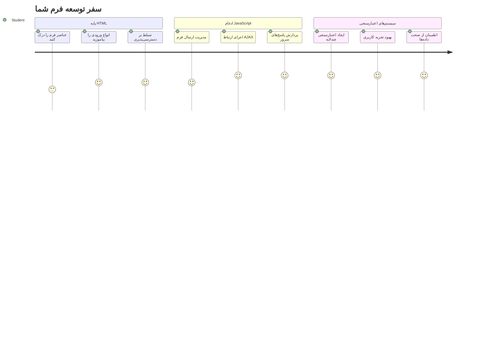
## پرسش‌نامه پیش‌درس

[پرسش‌نامه پیش‌درس](https://ff-quizzes.netlify.app/web/quiz/43)

تا به حال فرم آنلاینی را پر کرده‌اید و فرمت ایمیل شما رد شده است؟ یا بعد از کلیک روی ارسال، تمام اطلاعات خود را از دست داده‌اید؟ همه ما این تجربه‌های ناامیدکننده را داشته‌ایم.

فرم‌ها پل ارتباطی بین کاربران شما و عملکرد برنامه‌تان هستند. درست مثل پروتکل‌های دقیق کنترل‌کنندگان ترافیک هوایی که هواپیماها را ایمن به مقصد هدایت می‌کنند، فرم‌های خوب طراحی‌شده بازخورد واضح ارائه می‌دهند و از خطاهای هزینه‌ساز جلوگیری می‌کنند. فرم‌های ضعیف اما می‌توانند کاربران را سریع‌تر از یک سوتفاهم در یک فرودگاه شلوغ، دور کنند.

در این درس، اپلیکیشن بانکی ایستا خود را به یک برنامه تعاملی تبدیل خواهیم کرد. خواهید آموخت چگونه فرم‌هایی بسازید که ورودی‌های کاربر را اعتبارسنجی کنند، با سرورها ارتباط برقرار کنند و بازخورد مفید ارائه دهند. این مثل ساخت رابط کنترلی است که کاربران را در استفاده از امکانات برنامه‌تان هدایت می‌کند.

تا پایان، یک سیستم کامل ورود و ثبت‌نام با اعتبارسنجی خواهید داشت که کاربران را به سمت موفقیت و نه ناامیدی راهنمایی می‌کند.

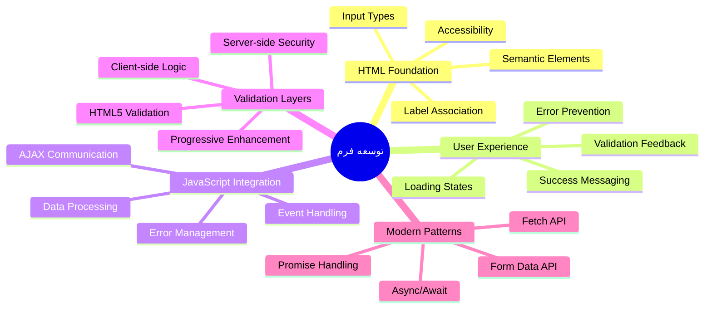
## پیش‌نیازها

قبل از شروع ساخت فرم‌ها، بیایید مطمئن شویم همه چیز را درست آماده کرده‌اید. این درس از همان جایی که درس قبل را تمام کردیم ادامه می‌دهد، پس اگر جلوتر رفته‌اید، شاید بخواهید ابتدا اصول اولیه را آماده کنید.

### تنظیمات مورد نیاز

| جزء | وضعیت | توضیحات |
|-----------|--------|-------------|
| [قالب‌های HTML](../1-template-route/README.md) | ✅ الزامی | ساختار پایه اپلیکیشن بانکی شما |
| [Node.js](https://nodejs.org) | ✅ الزامی | محیط اجرایی جاوااسکریپت برای سرور |
| [سرور بانک API](../api/README.md) | ✅ الزامی | سرویس پشتی برای ذخیره‌سازی داده‌ها |

> 💡 **نکته توسعه**: شما دو سرور جداگانه را همزمان اجرا خواهید کرد – یکی برای اپلیکیشن فرانت‌اند بانکی و دیگری برای API بک‌اند. این تنظیم شبیه توسعه واقعی است که خدمات فرانت‌اند و بک‌اند به صورت مستقل کار می‌کنند.

### پیکربندی سرور

**محیط توسعه شما شامل:**
- **سرور فرانت‌اند**: اپلیکیشن بانکی شما را سرو می‌کند (معمولاً پورت `3000`)
- **سرور API بک‌اند**: داده‌ها را ذخیره و بازیابی می‌کند (پورت `5000`)
- **هر دو سرور** می‌توانند همزمان بدون تداخل اجرا شوند

**آزمون اتصال API:**
```bash
curl http://localhost:5000/api
# پاسخ مورد انتظار: "API بانک نسخه ۱.۰.۰"
```

**اگر پاسخ نسخه API را مشاهده کردید، آماده ادامه هستید!**

---

## درک فرم‌ها و کنترل‌های HTML

فرم‌های HTML راهی هستند که کاربران با برنامه وب شما ارتباط برقرار می‌کنند. آنها را مثل سامانه تلگرافی تصور کنید که در قرن ۱۹ مکان‌های دور را به هم متصل می‌کرد – اینها پروتکل ارتباطی بین نیت کاربر و پاسخ برنامه هستند. وقتی با دقت طراحی شوند، خطاها را می‌گیرند، قالب‌بندی ورودی را راهنمایی می‌کنند و پیشنهادهای کمک‌کننده ارائه می‌دهند.

فرم‌های مدرن به‌شدت پیشرفته‌تر از ورودی‌های متنی ساده هستند. HTML5 نوع‌های ورودی تخصصی معرفی کرده که اعتبارسنجی ایمیل، قالب‌بندی عددی و انتخاب تاریخ را به طور خودکار انجام می‌دهند. این پیشرفت‌ها برای دسترس‌پذیری و تجربه کاربری موبایل مفید هستند.

### عناصر ضروری فرم

**بلوک‌های سازنده که هر فرم نیاز دارد:**

```html
<!-- Basic form structure -->
<form id="userForm" method="POST">
  <label for="username">Username</label>
  <input id="username" name="username" type="text" required>
  
  <button type="submit">Submit</button>
</form>
```

**کد بالا چه می‌کند:**
- **یک ظرف فرم** با شناسه یکتا ایجاد می‌کند
- **متد HTTP** ارسال داده را مشخص می‌کند
- **برچسب‌ها** را برای دسترس‌پذیری به ورودی‌ها مرتبط می‌کند
- **دکمه ارسال** برای پردازش فرم تعریف می‌کند

### نوع‌ها و ویژگی‌های ورودی مدرن

| نوع ورودی | هدف | نمونه استفاده |
|------------|---------|---------------|
| `text` | ورودی متن عادی | `<input type="text" name="username">` |
| `email` | اعتبارسنجی ایمیل | `<input type="email" name="email">` |
| `password` | ورود متن مخفی | `<input type="password" name="password">` |
| `number` | ورودی عددی | `<input type="number" name="balance" min="0">` |
| `tel` | شماره تلفن | `<input type="tel" name="phone">` |

> 💡 **مزیت HTML5 مدرن**: استفاده از نوع ورودی خاص، اعتبارسنجی خودکار، کیبوردهای مناسب موبایل و پشتیبانی بهتر از دسترس‌پذیری را بدون نیاز به جاوااسکریپت اضافه فراهم می‌کند!

### نوع‌های دکمه و رفتار

```html
<!-- Different button behaviors -->
<button type="submit">Save Data</button>     <!-- Submits the form -->
<button type="reset">Clear Form</button>    <!-- Resets all fields -->
<button type="button">Custom Action</button> <!-- No default behavior -->
```

**هر دکمه چه کاری انجام می‌دهد:**
- **دکمه‌های ارسال (submit)**: ارسال فرم و ارسال داده به نقطه انتهایی مشخص‌شده
- **دکمه‌های بازنشانی (reset)**: بازگرداندن همه فیلدهای فرم به حالت ابتدایی
- **دکمه‌های معمولی**: رفتار پیش‌فرضی ندارند، و به کد جاوااسکریپت سفارشی نیاز دارند

> ⚠️ **نکته مهم**: عنصر `<input>` خودبسته است و نیاز به تگ بسته ندارد. بهترین روش مدرن این است که `<input>` را بدون اسلش بنویسید.

### ساخت فرم ورود شما

حالا بیایید یک فرم ورود عملی بسازیم که بهترین شیوه‌های فرم HTML مدرن را نشان می‌دهد. با ساختار پایه شروع کنیم و به تدریج با ویژگی‌های دسترس‌پذیری و اعتبارسنجی بهبود دهیم.

```html
<template id="login">
  <h1>Bank App</h1>
  <section>
    <h2>Login</h2>
    <form id="loginForm" novalidate>
      <div class="form-group">
        <label for="username">Username</label>
        <input id="username" name="user" type="text" required 
               autocomplete="username" placeholder="Enter your username">
      </div>
      <button type="submit">Login</button>
    </form>
  </section>
</template>
```

**بررسی آنچه اینجا رخ می‌دهد:**
- **ساختار** فرم با عناصر معنایی HTML5
- **گروه‌بندی** عناصر مرتبط با استفاده از `div` و کلاس‌های معنادار
- **ارتباط** برچسب‌ها با ورودی‌ها از طریق ویژگی‌های `for` و `id`
- **شامل** ویژگی‌های مدرنی مثل `autocomplete` و `placeholder` برای تجربه کاربری بهتر
- **اضافه کردن** `novalidate` برای مدیریت اعتبارسنجی با جاوااسکریپت به جای پیش‌فرض مرورگر

### قدرت برچسب‌های مناسب

**چرا برچسب‌ها برای توسعه وب مدرن مهم هستند:**

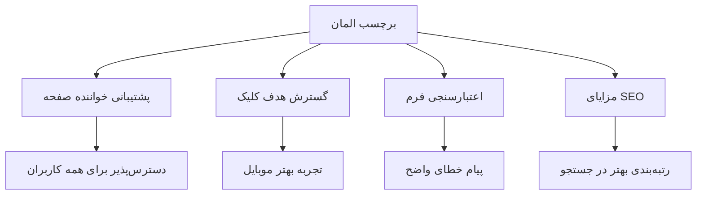
**برچسب‌های درست چه می‌کنند:**
- **امکان** خواندن واضح فیلدهای فرم توسط صفحه‌خوان‌ها را می‌دهند
- **بزرگ‌تر کردن** ناحیه قابل کلیک (کلیک روی برچسب، ورودی را فوکوس می‌کند)
- **بهبود** استفاده در موبایل با هدف‌های لمسی بزرگ‌تر
- **پشتیبانی** از اعتبارسنجی فرم با پیام‌های خطای معنی‌دار
- **افزایش** SEO با معنای سمانتیک به عناصر فرم

> 🎯 **هدف دسترس‌پذیری**: هر ورودی فرم باید برچسب مرتبط داشته باشد. این کار ساده، فرم‌های شما را برای همه، از جمله کاربران با ناتوانی‌ها، قابل استفاده می‌کند و تجربه همه کاربران را بهبود می‌بخشد.

### ساخت فرم ثبت‌نام

فرم ثبت‌نام نیاز به اطلاعات دقیق‌تری دارد تا یک حساب کاربری کامل ایجاد کند. بیایید آن را با ویژگی‌های HTML5 مدرن و دسترس‌پذیری پیشرفته بسازیم.

```html
<hr/>
<h2>Register</h2>
<form id="registerForm" novalidate>
  <div class="form-group">
    <label for="user">Username</label>
    <input id="user" name="user" type="text" required 
           autocomplete="username" placeholder="Choose a username">
  </div>
  
  <div class="form-group">
    <label for="currency">Currency</label>
    <input id="currency" name="currency" type="text" value="$" 
           required maxlength="3" placeholder="USD, EUR, etc.">
  </div>
  
  <div class="form-group">
    <label for="description">Account Description</label>
    <input id="description" name="description" type="text" 
           maxlength="100" placeholder="Personal savings, checking, etc.">
  </div>
  
  <div class="form-group">
    <label for="balance">Starting Balance</label>
    <input id="balance" name="balance" type="number" value="0" 
           min="0" step="0.01" placeholder="0.00">
  </div>
  
  <button type="submit">Create Account</button>
</form>
```

**در کد بالا ما:**
- **هر فیلد را در divهای جداگانه** برای استایل‌دهی و چیدمان بهتر سازماندهی کرده‌ایم
- **ویژگی‌های مناسب `autocomplete`** برای پشتیبانی از پرشدن خودکار مرورگر اضافه کرده‌ایم
- **متن جایگزین (placeholder)** برای راهنمایی ورودی کاربر درج کرده‌ایم
- **مقادیر پیش‌فرض معقول** با ویژگی `value` تعیین کرده‌ایم
- **ویژگی‌های اعتبارسنجی** مانند `required`، `maxlength` و `min` اعمال شده است
- **نوع `number`** را برای فیلد مانده با پشتیبانی از اعشار استفاده کرده‌ایم

### بررسی انواع ورودی‌ها و رفتار

**انواع ورودی مدرن امکانات پیشرفته دارند:**

| ویژگی | فایده | نمونه |
|---------|---------|----------|
| `type="number"` | کیبورد عددی در موبایل | ورود آسان‌تر مانده حساب |
| `step="0.01"` | کنترل دقت اعشار | امکان ورود سنت در پول |
| `autocomplete` | پرکردن خودکار مرورگر | تکمیل سریع‌تر فرم |
| `placeholder` | راهنمای زمینه | راهنمایی انتظارات کاربر |

> 🎯 **چالش دسترس‌پذیری**: سعی کنید فقط با صفحه‌کلید بین فیلدهای فرم حرکت کنید! با `Tab` حرکت کنید، با `Space` چک‌باکس‌ها را تیک بزنید و با `Enter` ارسال کنید. این تجربه به شما کمک می‌کند نحوه تعامل کاربران صفحه‌خوان را با فرم‌ها درک کنید.

### 🔄 **بازبینی آموزشی**
**درک پایه فرم‌ها**: قبل از پیاده‌سازی جاوااسکریپت، مطمئن شوید:
- ✅ چگونه HTML معنایی ساختارهای فرم دسترس‌پذیر می‌سازد
- ✅ چرا نوع ورودی‌ها برای کیبورد موبایل و اعتبارسنجی اهمیت دارند
- ✅ رابطه برچسب‌ها و کنترل‌های فرم چگونه است
- ✅ چگونه ویژگی‌های فرم بر رفتار پیش‌فرض مرورگر تاثیر می‌گذارند

**آزمون سریع خودآزمایی**: اگر فرم بدون پردازش جاوااسکریپت ارسال شود چه می‌شود؟
*پاسخ: مرورگر ارسال پیش‌فرض را انجام می‌دهد و معمولاً به URL موجود در action هدایت می‌شود*

**مزایای فرم‌های HTML5**: فرم‌های مدرن قابلیت‌های زیر را دارند:
- **اعتبارسنجی داخلی**: بررسی خودکار فرمت ایمیل و عدد
- **بهینه‌سازی موبایل**: کیبوردهای مناسب برای انواع ورودی
- **دسترس‌پذیری**: پشتیبانی از صفحه‌خوان و ناوبری با صفحه‌کلید
- **ارتقاء تدریجی**: حتی بدون جاوااسکریپت هم کار می‌کند

## درک روش‌های ارسال فرم

وقتی کسی فرم شما را پر می‌کند و روی ارسال کلیک می‌کند، داده‌ها باید جایی بروند – معمولاً به سروری که بتواند آنها را ذخیره کند. چند روش مختلف برای این کار وجود دارد و دانستن اینکه کدام را استفاده کنید، می‌تواند بعداً از دردسر جلوگیری کند.

بیایید ببینیم وقتی روی دکمه ارسال کلیک می‌شود، دقیقاً چه اتفاقی می‌افتد.

### رفتار پیش‌فرض فرم

ابتدا رفتار ارسال فرم ساده را بررسی کنیم:

**فرم‌های فعلی خود را امتحان کنید:**
1. روی دکمه *ثبت‌نام* در فرم خود کلیک کنید
2. تغییرات نوار آدرس مرورگر را مشاهده کنید
3. توجه کنید که صفحه دوباره بارگذاری می‌شود و اطلاعات در URL ظاهر می‌شود


### مقایسه روش‌های HTTP

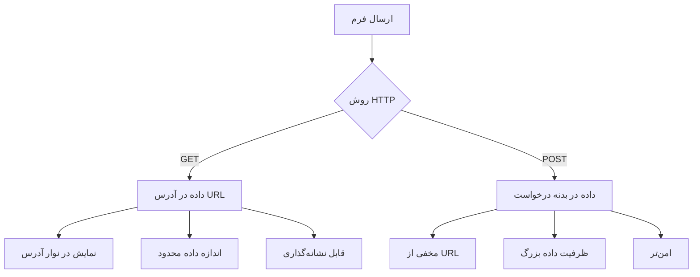
**درک تفاوت‌ها:**

| روش | مورد استفاده | محل داده | سطح امنیت | محدودیت سایز |
|--------|----------|---------------|----------------|-------------|
| `GET` | جستجو، فیلترها | پارامترهای URL | پایین (قابل مشاهده) | حدود ۲۰۰۰ کاراکتر |
| `POST` | حساب‌های کاربری، داده حساس | بدنه درخواست | بالاتر (مخفی) | بدون محدودیت عملی |

**درک تفاوت‌های اساسی:**
- **GET**: داده‌های فرم را به صورت پارامترها به URL اضافه می‌کند (مناسب جستجو)
- **POST**: داده‌ها را در بدنه درخواست می‌فرستد (مفید برای اطلاعات حساس)
- **محدودیت‌های GET**: محدودیت اندازه، داده دیدنی، سابقه ماندگار مرورگر
- **مزایای POST**: ظرفیت زیاد داده، حریم خصوصی، پشتیبانی از آپلود فایل

> 💡 **روش بهتر**: از `GET` برای فرم‌های جستجو و فیلتر (دریافت داده) و از `POST` برای ثبت‌نام، ورود و ایجاد داده استفاده کنید.

### پیکربندی ارسال فرم

حالا فرم ثبت‌نام خود را طوری تنظیم کنیم که با استفاده از متد POST به API ارتباط برقرار کند:

```html
<form id="registerForm" action="//localhost:5000/api/accounts" 
      method="POST" novalidate>
```

**این تنظیمات چه می‌کند:**
- **ارسال فرم را به نقطه انتهایی API شما هدایت می‌کند**
- **از متد POST برای ارسال امن داده استفاده می‌کند**
- **ویژگی `novalidate` برای مدیریت اعتبارسنجی توسط جاوااسکریپت دارد**

### آزمایش ارسال فرم

**مراحل زیر را برای تست فرم دنبال کنید:**
1. **فرم ثبت‌نام را با اطلاعات خود پر کنید**
2. **روی دکمه "ایجاد حساب" کلیک کنید**
3. **پاسخ سرور را در مرورگر مشاهده کنید**

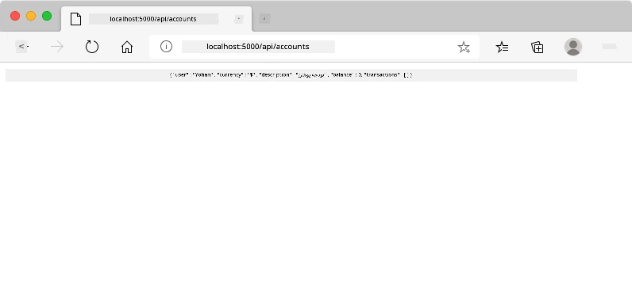

**آنچه باید ببینید:**
- **مرورگر به URL نقطه انتهایی API هدایت می‌شود**
- **پاسخ JSON شامل داده حساب جدید ساخته‌شده شما**
- **تأیید سرور بر ایجاد موفق حساب**

> 🧪 **زمان آزمایش**: سعی کنید با همان نام کاربری دوباره ثبت‌نام کنید. چه پاسخی می‌گیرید؟ این به شما می‌آموزد سرور چگونه داده‌های تکراری و شرایط خطا را مدیریت می‌کند.

### درک پاسخ‌های JSON

**وقتی سرور فرم شما را با موفقیت پردازش می‌کند:**
```json
{
  "user": "john_doe",
  "currency": "$",
  "description": "Personal savings",
  "balance": 100,
  "id": "unique_account_id"
}
```

**این پاسخ تأیید می‌کند:**
- **ایجاد حساب جدید با داده‌های مشخص‌شده**
- **اختصاص شناسه یکتا برای مراجعه‌های بعدی**
- **بازگرداندن تمام اطلاعات حساب برای تأیید**
- **نشان دادن ذخیره موفق در پایگاه داده**

## مدیریت مدرن فرم‌ها با جاوااسکریپت

ارسال‌های سنتی فرم باعث بارگذاری کامل صفحه می‌شوند، مثل ماموریت‌های اولیه فضایی که نیاز به راه‌اندازی مجدد کامل سیستم برای اصلاح مسیر داشتند. این روند تجربه کاربری را مختل می‌کند و وضعیت برنامه را از دست می‌دهد.

مدیریت فرم با جاوااسکریپت مانند سیستم‌های هدایت مداوم فضاپیماهای مدرن است – تنظیمات در زمان واقعی بدون از دست دادن موقعیت ناوبری انجام می‌دهد. ما می‌توانیم ارسال فرم را رهگیری کنیم، بازخورد فوری ارائه دهیم، خطاها را به خوبی مدیریت کنیم و رابط کاربری را بر اساس پاسخ سرور به‌روزرسانی کنیم در حالی که کاربر موقعیت خود را در برنامه حفظ می‌کند.

### چرا از بارگذاری مجدد صفحه اجتناب کنیم؟

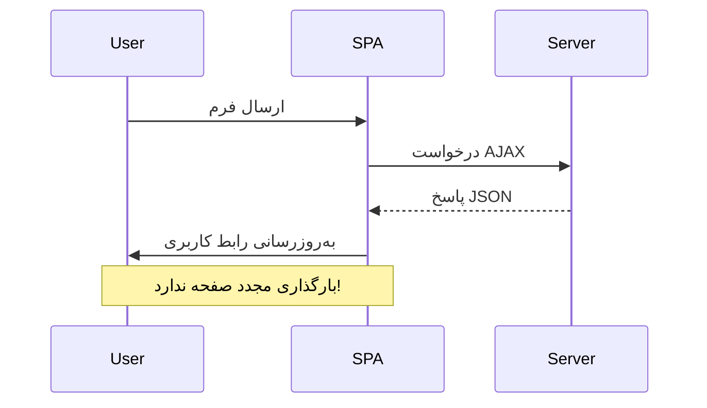
**مزایای مدیریت فرم با جاوااسکریپت:**
- **حفظ وضعیت برنامه و زمینه کاربر**
- **ارائه بازخورد فوری و نشانگر بارگذاری**
- **امکان مدیریت پویا خطا و اعتبارسنجی**
- **ایجاد تجربه کاربری نرم و شبیه برنامه موبایل**
- **امکان شرطی‌سازی بر اساس پاسخ سرور**

### انتقال از فرم سنتی به مدرن

**چالش‌های رویکرد سنتی:**
- **هدایت کاربران از برنامه شما به صفحه دیگر**
- **از دست دادن وضعیت و زمینه برنامه کنونی**
- **نیاز به بارگذاری کامل صفحه برای عملیات ساده**
- **کنترل محدود روی بازخورد کاربر**

**مزایای روش مدرن جاوااسکریپت:**
- **نگه داشتن کاربران درون برنامه شما**
- **حفظ همه وضعیت‌ها و داده‌ها**
- **امکان اعتبارسنجی و بازخورد زنده**
- **پشتیبانی از ارتقاء تدریجی و دسترس‌پذیری**

### پیاده‌سازی مدیریت فرم با جاوااسکریپت

بیایید ارسال فرم سنتی را با مدیریت رویداد مدرن جاوااسکریپت جایگزین کنیم:

```html
<!-- Remove the action attribute and add event handling -->
<form id="registerForm" method="POST" novalidate>
```

**منطق ثبت‌نام را به فایل `app.js` خود اضافه کنید:**

```javascript
// مدیریت فرم مبتنی بر رویداد مدرن
function register() {
  const registerForm = document.getElementById('registerForm');
  const formData = new FormData(registerForm);
  const data = Object.fromEntries(formData);
  const jsonData = JSON.stringify(data);
  
  console.log('Form data prepared:', data);
}

// افزودن شنونده رویداد هنگام بارگذاری صفحه
document.addEventListener('DOMContentLoaded', () => {
  const registerForm = document.getElementById('registerForm');
  registerForm.addEventListener('submit', (event) => {
    event.preventDefault(); // جلوگیری از ارسال پیش‌فرض فرم
    register();
  });
});
```

**شرح آنچه در اینجا اتفاق می‌افتد:**
- **جلوگیری از ارسال پیش‌فرض فرم با `event.preventDefault()`**
- **دریافت عنصر فرم با انتخابگر DOM مدرن**
- **استخراج داده‌های فرم با API قدرتمند `FormData`**
- **تبدیل FormData به شیء ساده با `Object.fromEntries()`**
- **سریال‌سازی داده به فرمت JSON برای ارسال به سرور**
- **ثبت داده پردازش‌شده برای اشکال‌زدایی و تایید**

### درک API فرم دیتا

**API فرم دیتا قابلیت‌های قدرتمندی در مدیریت فرم ارائه می‌دهد:**
```javascript
// نمونه ای از آنچه FormData ثبت می‌کند
const formData = new FormData(registerForm);

// FormData به صورت خودکار ثبت می‌کند:
// {
//   "user": "john_doe",
//   "currency": "$",
//   "description": "حساب شخصی",
//   "balance": "100"
// }
```

**مزایای API فرم دیتا:**
- **جمع‌آوری جامع**: شامل تمام عناصر فرم از جمله متن، فایل‌ها، و ورودی‌های پیچیده
- **آگاهی از نوع**: به‌طور خودکار انواع ورودی مختلف را بدون کدنویسی سفارشی مدیریت می‌کند
- **کارایی**: حذف جمع‌آوری دستی فیلدها با یک فراخوانی API واحد
- **سازگاری**: عملکرد را با تغییر ساختار فرم حفظ می‌کند

### ایجاد تابع ارتباط با سرور

حالا بیایید یک تابع مقاوم برای ارتباط با سرور API خود با استفاده از الگوبرداری‌های مدرن جاوااسکریپت بسازیم:

```javascript
async function createAccount(account) {
  try {
    const response = await fetch('//localhost:5000/api/accounts', {
      method: 'POST',
      headers: { 
        'Content-Type': 'application/json',
        'Accept': 'application/json'
      },
      body: account
    });
    
    // بررسی کنید که آیا پاسخ موفقیت‌آمیز بوده است
    if (!response.ok) {
      throw new Error(`HTTP error! status: ${response.status}`);
    }
    
    return await response.json();
  } catch (error) {
    console.error('Account creation failed:', error);
    return { error: error.message || 'Network error occurred' };
  }
}
```

**درک جاوااسکریپت ناهمزمان:**

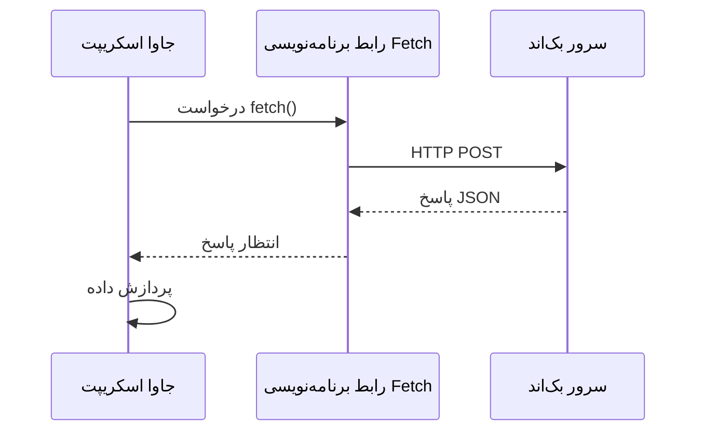
**این پیاده‌سازی مدرن چه کارهایی انجام می‌دهد:**
- **استفاده از** `async/await` برای کد خواناتر ناهمزمان
- **شامل** مدیریت خطا مناسب با بلوک‌های try/catch
- **بررسی** وضعیت پاسخ قبل از پردازش داده‌ها
- **تنظیم** هدرهای مناسب برای ارتباط JSON
- **ارائه** پیام‌های خطای دقیق برای اشکال‌زدایی
- **برگرداندن** ساختار داده منسجم برای موارد موفقیت و خطا

### قدرت Fetch API مدرن

**مزایای Fetch API نسبت به روش‌های قدیمی‌تر:**

| ویژگی | مزایا | پیاده‌سازی |
|---------|---------|----------------|
| مبتنی بر Promise | کد ناهمزمان پاک | `await fetch()` |
| سفارشی‌سازی درخواست | کنترل کامل HTTP | هدرها، روش‌ها، بدنه |
| مدیریت پاسخ | تجزیه داده انعطاف‌پذیر | `.json()`, `.text()`, `.blob()` |
| مدیریت خطا | گرفتن جامع خطاها | بلوک‌های try/catch |

> 🎥 **یادگیری بیشتر**: [آموزش Async/Await](https://youtube.com/watch?v=YwmlRkrxvkk) - درک الگوی‌های ناهمزمان جاوااسکریپت برای توسعه وب مدرن.

**مفاهیم کلیدی برای ارتباط با سرور:**
- **توابع async** اجازه توقف اجرا برای انتظار پاسخ سرور را می‌دهند
- **کلمه کلیدی await** کد ناهمزمان را مانند کد همزمان می‌خواند
- **Fetch API** درخواست‌های HTTP مدرن و مبتنی بر Promise را فراهم می‌کند
- **مدیریت خطا** تضمین می‌کند که برنامه شما به مشکلات شبکه به طور ملایم پاسخ دهد

### تکمیل تابع ثبت نام

بیایید همه چیز را با یک تابع رجیستری کامل و آماده برای تولید همراه کنیم:

```javascript
async function register() {
  const registerForm = document.getElementById('registerForm');
  const submitButton = registerForm.querySelector('button[type="submit"]');
  
  try {
    // نمایش حالت بارگذاری
    submitButton.disabled = true;
    submitButton.textContent = 'Creating Account...';
    
    // پردازش داده‌های فرم
    const formData = new FormData(registerForm);
    const jsonData = JSON.stringify(Object.fromEntries(formData));
    
    // ارسال به سرور
    const result = await createAccount(jsonData);
    
    if (result.error) {
      console.error('Registration failed:', result.error);
      alert(`Registration failed: ${result.error}`);
      return;
    }
    
    console.log('Account created successfully!', result);
    alert(`Welcome, ${result.user}! Your account has been created.`);
    
    // بازنشانی فرم پس از ثبت‌نام موفق
    registerForm.reset();
    
  } catch (error) {
    console.error('Unexpected error:', error);
    alert('An unexpected error occurred. Please try again.');
  } finally {
    // بازیابی حالت دکمه
    submitButton.disabled = false;
    submitButton.textContent = 'Create Account';
  }
}
```

**این پیاده‌سازی پیشرفته شامل:**
- **ارائه** بازخورد بصری هنگام ارسال فرم
- **غیرفعال کردن** دکمه ارسال برای جلوگیری از ارسال‌های تکراری
- **مدیریت** خطاهای پیش‌بینی شده و غیرمنتظره به صورت ملایم
- **نمایش** پیام‌های موفقیت و خطا به کاربر
- **بازنشانی** فرم پس از ثبت نام موفق
- **بازیابی** حالت رابط کاربری صرف‌نظر از نتیجه

### آزمایش پیاده‌سازی شما

**ابزار توسعه‌دهنده مرورگر خود را باز کرده و ثبت نام را تست کنید:**

1. **باز کردن** کنسول مرورگر (F12 → سربرگ Console)
2. **پر کردن** فرم ثبت نام
3. **کلیک** روی "ایجاد حساب"
4. **مشاهده** پیام‌های کنسول و بازخورد برای کاربر

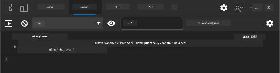

**آنچه باید ببینید:**
- **حالت بارگذاری** روی دکمه ارسال ظاهر می‌شود
- **لاگ‌های کنسول** اطلاعات دقیق درباره روند را نشان می‌دهد
- **پیام موفقیت** هنگام موفقیت ایجاد حساب ظاهر می‌شود
- **فرم** پس از ارسال موفق به طور خودکار بازنشانی می‌شود

> 🔒 **ملاحظات امنیتی**: در حال حاضر داده‌ها از طریق HTTP ارسال می‌شوند که برای محیط تولید امن نیست. در برنامه‌های واقعی همیشه از HTTPS برای رمزگذاری انتقال داده‌ها استفاده کنید. درباره [امنیت HTTPS](https://en.wikipedia.org/wiki/HTTPS) و اهمیت آن برای حفاظت از داده‌های کاربران بیشتر بیاموزید.

### 🔄 **بررسی آموزشی**
**ادغام مدرن جاوااسکریپت**: درک خود را از مدیریت ناهمزمان فرم‌ها بررسی کنید:
- ✅ چگونه `event.preventDefault()` رفتار پیش‌فرض فرم را تغییر می‌دهد؟
- ✅ چرا API فرم دیتا موثرتر از جمع‌آوری دستی فیلدهاست؟
- ✅ الگوهای async/await چگونه خوانایی کد را بهبود می‌بخشند؟
- ✅ نقش مدیریت خطا در تجربه کاربری چیست؟

**معماری سیستم**: مدیریت فرم شما نمایش می‌دهد:
- **برنامه‌نویسی رویداد محور**: فرم‌ها به عملیات کاربر بدون بارگذاری مجدد پاسخ می‌دهند
- **ارتباط ناهمزمان**: درخواست‌های سرور رابط کاربری را مسدود نمی‌کند
- **مدیریت خطا**: کاهش ملایم هنگام شکست در درخواست‌های شبکه
- **مدیریت حالت**: به‌روزرسانی رابط کاربری مطابق پاسخ سرور
- **ارتقای تدریجی**: عملکرد پایه بدون جاوااسکریپت و افزودن بهبود‌های بیشتر

**الگوهای حرفه‌ای**: شما پیاده‌سازی کردید:
- **مسئولیت واحد**: توابع با هدف شفاف و متمرکز
- **حدود خطا**: بلوک‌های try/catch از کرش برنامه جلوگیری می‌کنند
- **بازخورد کاربر**: حالات بارگذاری و پیام‌های موفقیت/خطا
- **تبدیل داده**: از FormData به JSON برای ارتباط سرور

## اعتبارسنجی جامع فرم

اعتبارسنجی فرم از تجربه ناامیدکننده کشف خطاها صرفاً پس از ارسال جلوگیری می‌کند. مانند سیستم‌های چندگانه یدک‌کش در ایستگاه فضایی بین‌المللی، اعتبارسنجی مؤثر از چندین لایه بررسی ایمنی استفاده می‌کند.

روش بهینه ترکیبی است از اعتبارسنجی سطح مرورگر برای بازخورد فوری، اعتبارسنجی جاوااسکریپت برای تجربه بهتر کاربر و اعتبارسنجی سمت سرور برای امنیت و یکپارچگی داده‌ها. این افزونگی باعث رضایت کاربر و حفاظت سیستم می‌شود.

### درک لایه‌های اعتبارسنجی

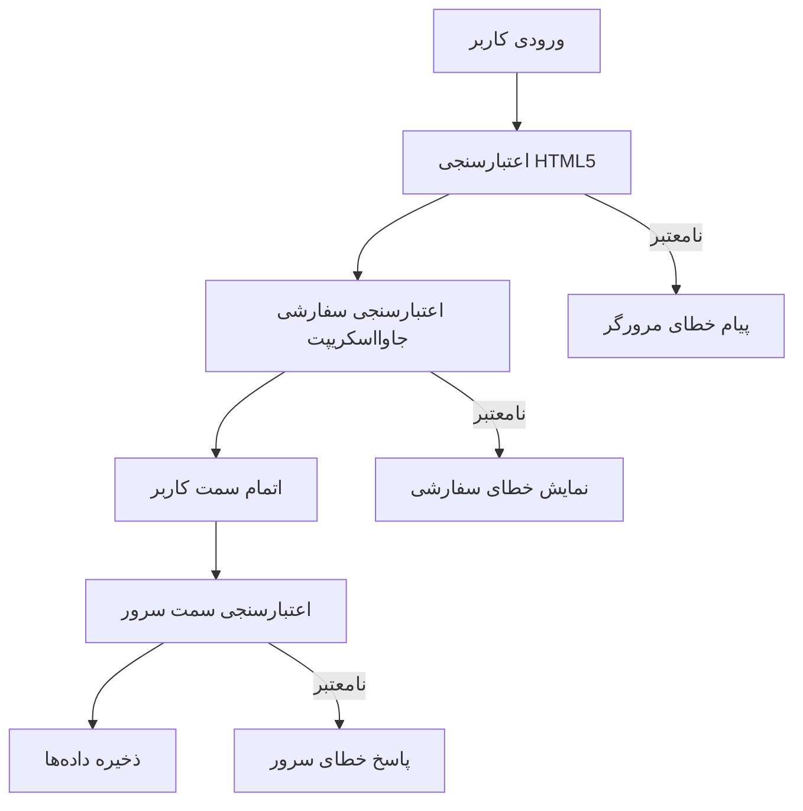
**استراتژی اعتبارسنجی چندلایه:**
- **اعتبارسنجی HTML5**: بررسی‌های فوری در مرورگر
- **اعتبارسنجی جاوااسکریپت**: منطق سفارشی و بهبود تجربه کاربر
- **اعتبارسنجی سمت سرور**: بررسی امنیت نهایی و صحت داده‌ها
- **ارتقای تدریجی**: کار می‌کند حتی اگر جاوااسکریپت غیرفعال باشد

### صفت‌های اعتبارسنجی HTML5

**ابزارهای اعتبارسنجی مدرن در اختیار شما:**

| صفت | هدف | نمونه استفاده | رفتار مرورگر |
|-----------|---------|---------------|------------------|
| `required` | فیلدهای ضروری | `<input required>` | جلوگیری از ارسال خالی |
| `minlength`/`maxlength` | محدودیت طول متن | `<input maxlength="20">` | اعمال حد حروف |
| `min`/`max` | محدوده عددی | `<input min="0" max="1000">` | اعتبارسنجی دامنه اعداد |
| `pattern` | قوانین سفارشی regex | `<input pattern="[A-Za-z]+">` | تطبیق فرمت‌های خاص |
| `type` | اعتبارسنجی نوع داده | `<input type="email">` | اعتبارسنجی اختصاصی فرمت |

### استایل‌دهی CSS برای اعتبارسنجی

**ایجاد بازخورد بصری برای وضعیت اعتبارسنجی:**

```css
/* Valid input styling */
input:valid {
  border-color: #28a745;
  background-color: #f8fff9;
}

/* Invalid input styling */
input:invalid {
  border-color: #dc3545;
  background-color: #fff5f5;
}

/* Focus states for better accessibility */
input:focus:valid {
  box-shadow: 0 0 0 0.2rem rgba(40, 167, 69, 0.25);
}

input:focus:invalid {
  box-shadow: 0 0 0 0.2rem rgba(220, 53, 69, 0.25);
}
```

**این نشانه‌های بصری چه کاری انجام می‌دهند:**
- **حاشیه‌های سبز**: نشان‌دهنده اعتبارسنجی موفق، مانند چراغ‌های سبز در کنترل ماموریت
- **حاشیه‌های قرمز**: نشان خطاهای اعتبارسنجی که نیاز به توجه دارند
- **برجسته‌سازی فوکوس**: ارائه زمینه بصری روشن برای محل فعلی ورودی
- **استایل یکپارچه**: ایجاد الگوهای رابط کاربری قابل پیش‌بینی برای کاربران

> 💡 **ترفند حرفه‌ای**: از کلاس‌های CSS `:valid` و `:invalid` برای ارائه بازخورد بصری فوری به هنگام تایپ کاربر استفاده کنید تا رابط تعاملی و کمک‌کننده ایجاد شود.

### پیاده‌سازی اعتبارسنجی جامع

بیایید فرم ثبت نام شما را با اعتبارسنجی مقاوم که تجربه عالی و کیفیت داده را فراهم می‌کند، بهبود دهیم:

```html
<form id="registerForm" method="POST" novalidate>
  <div class="form-group">
    <label for="user">Username <span class="required">*</span></label>
    <input id="user" name="user" type="text" required 
           minlength="3" maxlength="20" 
           pattern="[a-zA-Z0-9_]+" 
           autocomplete="username"
           title="Username must be 3-20 characters, letters, numbers, and underscores only">
    <small class="form-text">Choose a unique username (3-20 characters)</small>
  </div>
  
  <div class="form-group">
    <label for="currency">Currency <span class="required">*</span></label>
    <input id="currency" name="currency" type="text" required 
           value="$" maxlength="3" 
           pattern="[A-Z$€£¥₹]+" 
           title="Enter a valid currency symbol or code">
    <small class="form-text">Currency symbol (e.g., $, €, £)</small>
  </div>
  
  <div class="form-group">
    <label for="description">Account Description</label>
    <input id="description" name="description" type="text" 
           maxlength="100" 
           placeholder="Personal savings, checking, etc.">
    <small class="form-text">Optional description (up to 100 characters)</small>
  </div>
  
  <div class="form-group">
    <label for="balance">Starting Balance</label>
    <input id="balance" name="balance" type="number" 
           value="0" min="0" step="0.01" 
           title="Enter a positive number for your starting balance">
    <small class="form-text">Initial account balance (minimum $0.00)</small>
  </div>
  
  <button type="submit">Create Account</button>
</form>
```

**درک اعتبارسنجی پیشرفته:**
- **ترکیب** نشانگرهای فیلد اجباری با توضیحات کمک‌کننده
- **شامل** صفت‌های `pattern` برای اعتبارسنجی فرمت
- **ارائه** صفات `title` برای دسترسی و راهنمای ابزار
- **افزودن** متن کمکی برای راهنمایی کاربر
- **استفاده از** ساختار معنایی HTML برای دسترسی بهتر

### قوانین اعتبارسنجی پیشرفته

**هر قانون اعتبارسنجی چه کاری انجام می‌دهد:**

| فیلد | قوانین اعتبارسنجی | منفعت کاربر |
|-------|------------------|--------------|
| نام کاربری | `required`, `minlength="3"`, `maxlength="20"`, `pattern="[a-zA-Z0-9_]+"` | اطمینان از شناسه‌های معتبر و یکتا |
| ارز | `required`, `maxlength="3"`, `pattern="[A-Z$€£¥₹]+"` | پذیرش نمادهای ارز رایج |
| موجودی | `min="0"`, `step="0.01"`, `type="number"` | جلوگیری از موجودی منفی |
| توضیحات | `maxlength="100"` | محدودیت طول معقول |

### آزمایش رفتار اعتبارسنجی

**این سناریوهای اعتبارسنجی را امتحان کنید:**
1. **ارسال** فرم با فیلدهای اجباری خالی
2. **وارد کردن** نام کاربری کمتر از ۳ کاراکتر
3. **استفاده از** کاراکترهای خاص در فیلد نام کاربری
4. **وارد کردن** مقدار منفی در موجودی

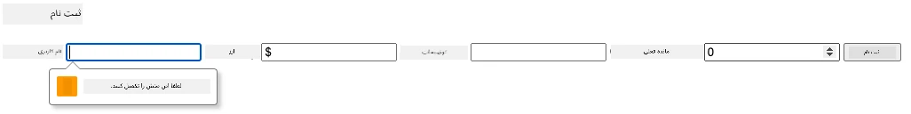

**آنچه مشاهده خواهید کرد:**
- **مرورگر پیام‌های اعتبارسنجی بومی را نمایش می‌دهد**
- **تغییرات استایل بر اساس وضعیت `:valid` و `:invalid`**
- **ارسال فرم تا عبور همه اعتبارسنجی‌ها متوقف می‌شود**
- **متمرکز شدن خودکار روی اولین فیلد نامعتبر**

### اعتبارسنجی سمت کلاینت در مقابل سمت سرور

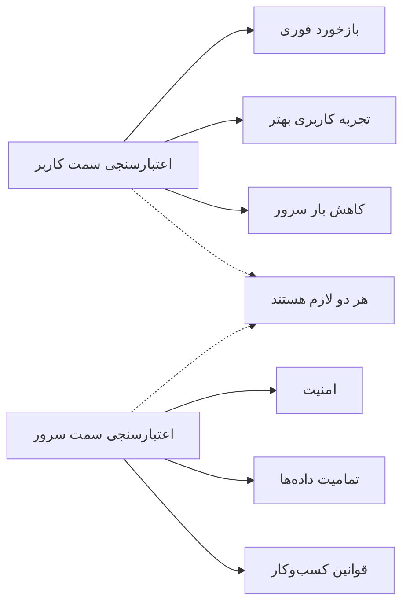
**چرا به هر دو لایه نیاز دارید:**
- **اعتبارسنجی سمت کلاینت**: بازخورد فوری و بهبود تجربه کاربری
- **اعتبارسنجی سمت سرور**: تضمین امنیت و رسیدگی به قوانین پیچیده کسب‌وکار
- **رویکرد ترکیبی**: ایجاد برنامه‌های مقاوم، کاربرپسند و امن
- **ارتقای تدریجی**: کار می‌کند حتی وقتی جاوااسکریپت غیرفعال است

> 🛡️ **یادآوری امنیتی**: هرگز فقط به اعتبارسنجی سمت کلاینت اعتماد نکنید! کاربران مخرب می‌توانند چک‌های سمت کلاینت را دور بزنند، بنابراین اعتبارسنجی سمت سرور برای امنیت و حفظ داده‌ها ضروری است.

### ⚡ **کارهایی که در ۵ دقیقه بعدی می‌توانید انجام دهید**
- [ ] فرم خود را با داده‌های نامعتبر تست کنید تا پیام‌های اعتبارسنجی را ببینید
- [ ] تلاش کنید فرم را با جاوااسکریپت غیرفعال ارسال کنید تا اعتبارسنجی HTML5 را مشاهده کنید
- [ ] ابزار توسعه‌دهنده مرورگر را باز کرده و داده‌های فرم ارسالی به سرور را بررسی کنید
- [ ] با انواع ورودی‌های مختلف آزمایش کنید تا تغییرات کیبورد موبایل را ببینید

### 🎯 **کارهایی که در این ساعت می‌توانید انجام دهید**
- [ ] آزمون پس از درس را کامل کرده و مفاهیم مدیریت فرم را درک کنید
- [ ] چالش اعتبارسنجی جامع با بازخورد زمان واقعی را پیاده‌سازی کنید
- [ ] استایل CSS اضافه کنید تا فرم‌های حرفه‌ای بسازید
- [ ] مدیریت خطا برای نام‌های کاربری تکراری و خطاهای سرور را اضافه کنید
- [ ] فیلدهای تأیید رمز عبور با اعتبارسنجی تطبیقی اضافه کنید

### 📅 **سفر یک هفته‌ای تسلط بر فرم‌ها**
- [ ] برنامه بانکداری کامل با ویژگی‌های پیشرفته فرم را تکمیل کنید
- [ ] قابلیت آپلود فایل برای عکس پروفایل یا اسناد پیاده‌سازی کنید
- [ ] فرم‌های چندمرحله‌ای با نشانگرهای پیشرفت و مدیریت حالت اضافه کنید
- [ ] فرم‌های پویا که بر اساس انتخاب‌های کاربر تطبیق می‌یابند بسازید
- [ ] ذخیره خودکار فرم و بازیابی آن برای تجربه کاربری بهتر پیاده‌سازی کنید
- [ ] اعتبارسنجی پیشرفته مانند تأیید ایمیل و قالب‌بندی شماره تلفن اضافه کنید

### 🌟 **تسلط یک ماهه شما بر توسعه فرانت‌اند**
- [ ] برنامه‌های فرم پیچیده با منطق شرطی و گردش‌کار بسازید
- [ ] کتابخانه‌ها و فریم‌ورک‌های فرم برای توسعه سریع‌تر یاد بگیرید
- [ ] دستورالعمل‌های دسترسی و اصول طراحی فراگیر را بیاموزید
- [ ] بین‌المللی‌سازی و بومی‌سازی فرم‌های جهانی را پیاده‌سازی کنید
- [ ] کتابخانه‌های کامپوننت فرم قابل استفاده مجدد و سیستم‌های طراحی ایجاد کنید
- [ ] در پروژه‌های فرم متن‌باز مشارکت کرده و بهترین روش‌ها را به اشتراک بگذارید

## 🎯 جدول زمانی تسلط شما بر توسعه فرم

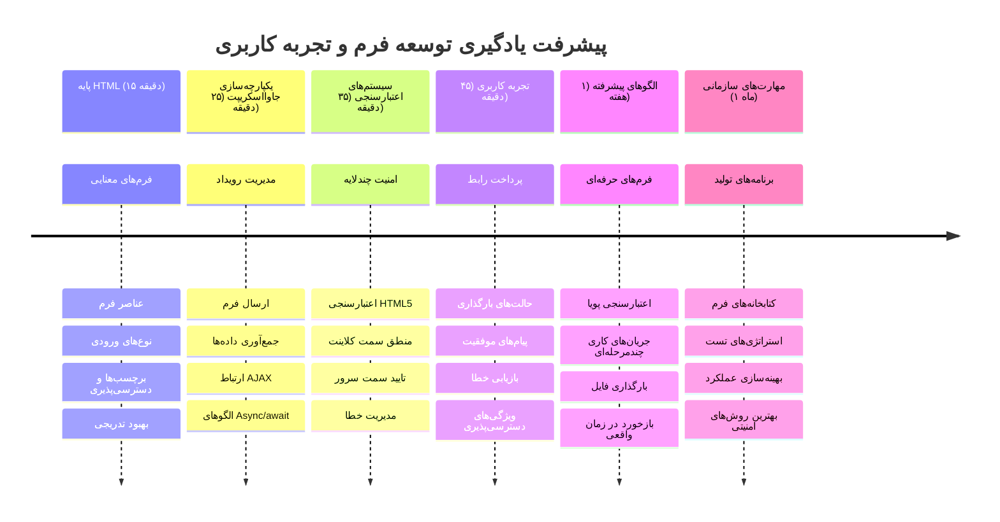
### 🛠️ خلاصه ابزارهای توسعه فرم شما

پس از اتمام این درس، حالا مهارت دارید در:
- **فرم‌های HTML5**: ساختار معنایی، انواع ورودی و ویژگی‌های دسترس‌پذیری
- **مدیریت فرم با جاوااسکریپت**: مدیریت رویداد، جمع‌آوری داده و ارتباط AJAX
- **معماری اعتبارسنجی**: اعتبارسنجی چندلایه برای امنیت و تجربه کاربری
- **برنامه‌نویسی ناهمزمان**: Fetch API مدرن و الگوهای async/await
- **مدیریت خطا**: مدیریت جامع خطا و سیستم‌های بازخورد به کاربر
- **طراحی تجربه کاربری**: حالت‌های بارگذاری، پیام موفقیت و بازیابی خطا
- **ارتقای تدریجی**: فرم‌هایی که در همه مرورگرها و قابلیت‌ها کار می‌کنند

**کاربردهای دنیای واقعی**: مهارت‌های شما مستقیم در موارد زیر کاربرد دارد:
- **برنامه‌های تجارت الکترونیک**: فرآیندهای تسویه حساب، ثبت حساب و فرم‌های پرداخت
- **نرم‌افزارهای سازمانی**: سیستم‌های ورود داده، رابط‌های گزارش‌دهی و برنامه‌های گردش کار
- **مدیریت محتوا**: پلتفرم‌های نشر، محتوای تولید شده توسط کاربر و رابط‌های مدیریتی
- **برنامه‌های مالی**: رابط‌های بانکی، پلتفرم‌های سرمایه‌گذاری و سیستم‌های تراکنش
- **سیستم‌های بهداشتی**: پرتال بیماران، برنامه‌ریزی ملاقات و فرم‌های سوابق پزشکی
- **پلتفرم‌های آموزشی**: ثبت نام دوره، ابزارهای ارزیابی و مدیریت یادگیری

**مهارت‌های حرفه‌ای کسب شده**: حالا می‌توانید:
- **طراحی** فرم‌های در دسترس که برای همه کاربران از جمله افراد دارای معلولیت کار می‌کند
- **پیاده‌سازی** اعتبارسنجی امن فرم که از فساد داده و آسیب‌پذیری‌های امنیتی جلوگیری می‌کند
- **ایجاد** رابط‌های کاربری پاسخگو که بازخورد و راهنمایی واضح فراهم می‌کنند
- **اشکال‌زدایی** تعاملات پیچیده فرم با استفاده از ابزارهای توسعه‌دهنده مرورگر و تحلیل شبکه
- **بهینه‌سازی** عملکرد فرم از طریق مدیریت کارآمد داده و استراتژی‌های اعتبارسنجی

**مفاهیم توسعه فرانت‌اند که تسلط یافته‌اید:**
- **معماری رویداد محور**: مدیریت تعاملات کاربر و سیستم‌های پاسخ
- **برنامه‌نویسی ناهمزمان**: ارتباط سرور بدون مسدودسازی و مدیریت خطا
- **اعتبارسنجی داده**: بررسی‌های امنیتی و یکپارچگی سمت کلاینت و سرور
- **طراحی تجربه کاربری**: رابط‌های شهودی که کاربران را به موفقیت هدایت می‌کنند
- **مهندسی دسترس‌پذیری**: طراحی فراگیر که برای نیازهای متنوع کاربران کار می‌کند

**سطح بعدی**: شما آماده اید که کتابخانه‌های پیشرفته فرم را بررسی کنید، قوانین اعتبارسنجی پیچیده را پیاده‌سازی کنید، یا سیستم‌های جمع‌آوری داده در سطح سازمانی بسازید!

🌟 **افتخار دستاورد**: شما یک سیستم کامل مدیریت فرم با اعتبارسنجی حرفه‌ای، مدیریت خطا و الگوهای تجربه کاربری ساخته‌اید!

---


---

## چالش GitHub Copilot Agent 🚀

از حالت Agent استفاده کنید تا چالش زیر را کامل کنید:

**توضیح**: فرم ثبت نام را با اعتبارسنجی جامع سمت کلاینت و بازخورد کاربر بهبود دهید. این چالش به شما کمک می‌کند در اعتبارسنجی فرم، مدیریت خطا و بهبود تجربه کاربر با بازخورد تعاملی تمرین کنید.
**درخواست:** یک سیستم اعتبارسنجی کامل برای فرم ثبت‌نام ایجاد کنید که شامل موارد زیر باشد: 1) بازخورد اعتبارسنجی در زمان واقعی برای هر فیلد هنگام تایپ کاربر، 2) پیام‌های اعتبارسنجی سفارشی که زیر هر فیلد ورودی نمایش داده می‌شوند، 3) فیلد تأیید رمز عبور با اعتبارسنجی تطابق، 4) نشانه‌های بصری (مانند علامت‌های تأیید سبز برای فیلدهای معتبر و هشدارهای قرمز برای فیلدهای نامعتبر)، 5) دکمه ارسال که تنها زمانی فعال می‌شود که تمام اعتبارسنجی‌ها موفق باشند. از ویژگی‌های اعتبارسنجی HTML5، CSS برای استایل دادن به وضعیت‌های اعتبارسنجی و جاوااسکریپت برای رفتار تعاملی استفاده کنید.

برای کسب اطلاعات بیشتر درباره <a href="https://code.visualstudio.com/blogs/2025/02/24/introducing-copilot-agent-mode" target="_blank" rel="noopener noreferrer">حالت عامل</a> اینجا را ببینید.

## 🚀 چالش

در صورت وجود داشتن کاربر از قبل، پیام خطا را در HTML نمایش دهید.

نمونه‌ای از ظاهر نهایی صفحه ورود پس از افزودن کمی استایل:

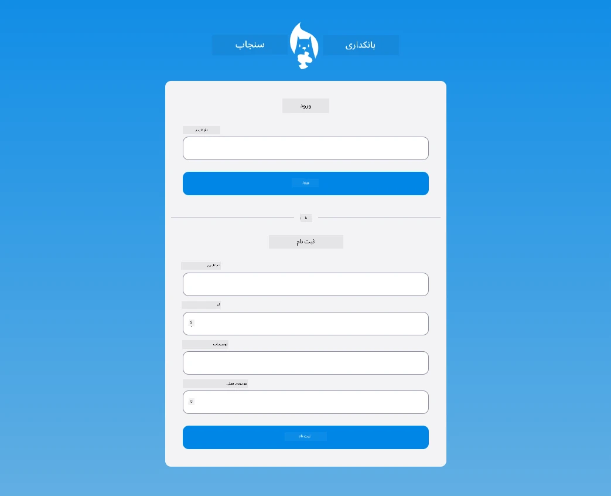

## آزمون بعد از درس

[آزمون بعد از درس](https://ff-quizzes.netlify.app/web/quiz/44)

## مرور و مطالعه خودآموز

توسعه‌دهندگان در ساخت فرم‌های خود به خصوص در زمینه استراتژی‌های اعتبارسنجی بسیار خلاق بوده‌اند. درباره جریان‌های مختلف فرم با مرور [کدپن](https://codepen.com) بیشتر بیاموزید؛ آیا می‌توانید فرم‌های جالب و الهام‌بخشی پیدا کنید؟

## تکلیف

[استایل دادن به برنامه بانک خود](assignment.md)

---

<!-- CO-OP TRANSLATOR DISCLAIMER START -->
**سلب مسئولیت**:  
این سند با استفاده از سرویس ترجمه هوش مصنوعی [Co-op Translator](https://github.com/Azure/co-op-translator) ترجمه شده است. در حالی که ما برای دقت تلاش می‌کنیم، لطفاً آگاه باشید که ترجمه‌های خودکار ممکن است حاوی خطاها یا نادرستی‌هایی باشند. سند اصلی به زبان بومی آن باید به عنوان منبع مرجع معتبر در نظر گرفته شود. برای اطلاعات حیاتی، ترجمه حرفه‌ای توسط انسان توصیه می‌شود. ما مسئول هیچ گونه سوء تفاهم یا تفسیر اشتباهی که از استفاده این ترجمه ناشی شود، نیستیم.
<!-- CO-OP TRANSLATOR DISCLAIMER END -->