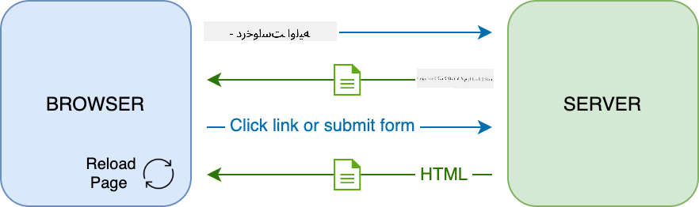
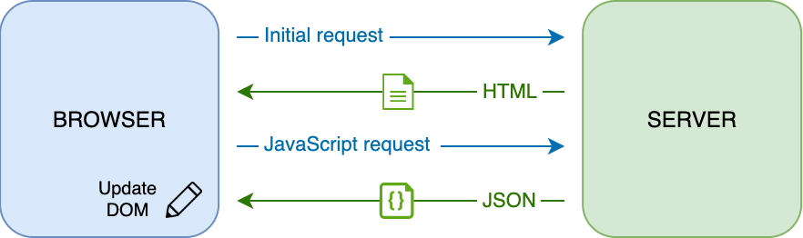
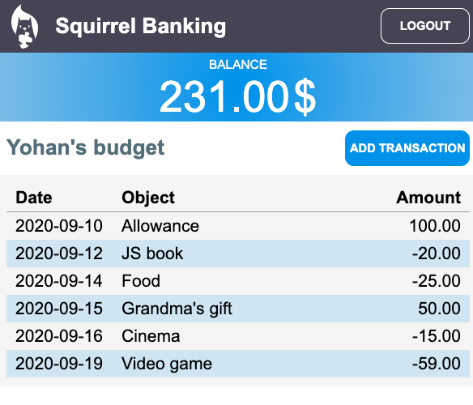

<!--
CO_OP_TRANSLATOR_METADATA:
{
  "original_hash": "89d0df9854ed020f155e94882ae88d4c",
  "translation_date": "2025-08-29T14:21:56+00:00",
  "source_file": "7-bank-project/3-data/README.md",
  "language_code": "fa"
}
-->
# ساخت یک اپلیکیشن بانکی - قسمت ۳: روش‌های دریافت و استفاده از داده‌ها

## آزمون پیش از درس

[آزمون پیش از درس](https://ff-quizzes.netlify.app/web/quiz/45)

### مقدمه

در هسته‌ی هر اپلیکیشن وب، *داده* وجود دارد. داده‌ها می‌توانند اشکال مختلفی داشته باشند، اما هدف اصلی آن‌ها همیشه نمایش اطلاعات به کاربر است. با پیچیده‌تر و تعاملی‌تر شدن اپلیکیشن‌های وب، نحوه‌ی دسترسی و تعامل کاربر با اطلاعات به یکی از بخش‌های کلیدی توسعه وب تبدیل شده است.

در این درس، یاد می‌گیریم که چگونه داده‌ها را به صورت غیرهمزمان از یک سرور دریافت کنیم و از این داده‌ها برای نمایش اطلاعات در یک صفحه وب بدون بارگذاری مجدد HTML استفاده کنیم.

### پیش‌نیاز

برای این درس، باید بخش [فرم ورود و ثبت‌نام](../2-forms/README.md) اپلیکیشن وب را ساخته باشید. همچنین باید [Node.js](https://nodejs.org) را نصب کرده و [سرور API](../api/README.md) را به صورت محلی اجرا کنید تا به داده‌های حساب دسترسی داشته باشید.

می‌توانید با اجرای این دستور در یک ترمینال، بررسی کنید که سرور به درستی اجرا می‌شود:

```sh
curl http://localhost:5000/api
# -> should return "Bank API v1.0.0" as a result
```

---

## AJAX و دریافت داده‌ها

وب‌سایت‌های سنتی زمانی که کاربر یک لینک را انتخاب می‌کند یا داده‌ای را از طریق فرم ارسال می‌کند، محتوای نمایش داده شده را با بارگذاری مجدد کل صفحه HTML به‌روزرسانی می‌کنند. هر بار که نیاز به بارگذاری داده‌های جدید باشد، سرور وب یک صفحه HTML کاملاً جدید بازمی‌گرداند که باید توسط مرورگر پردازش شود، که این کار باعث وقفه در عملکرد کاربر و محدود کردن تعاملات در طول بارگذاری می‌شود. این فرآیند به عنوان *اپلیکیشن چندصفحه‌ای* یا *MPA* شناخته می‌شود.



با پیچیده‌تر و تعاملی‌تر شدن اپلیکیشن‌های وب، تکنیکی جدید به نام [AJAX (جاوااسکریپت و XML غیرهمزمان)](https://en.wikipedia.org/wiki/Ajax_(programming)) معرفی شد. این تکنیک به اپلیکیشن‌های وب اجازه می‌دهد که داده‌ها را به صورت غیرهمزمان از سرور ارسال و دریافت کنند، بدون نیاز به بارگذاری مجدد صفحه HTML، که منجر به به‌روزرسانی سریع‌تر و تعاملات روان‌تر کاربر می‌شود. زمانی که داده‌های جدید از سرور دریافت می‌شود، صفحه HTML فعلی نیز می‌تواند با استفاده از API [DOM](https://developer.mozilla.org/docs/Web/API/Document_Object_Model) با جاوااسکریپت به‌روزرسانی شود. با گذشت زمان، این رویکرد به چیزی که اکنون به عنوان [*اپلیکیشن تک‌صفحه‌ای* یا *SPA*](https://en.wikipedia.org/wiki/Single-page_application) شناخته می‌شود، تکامل یافته است.



زمانی که AJAX برای اولین بار معرفی شد، تنها API موجود برای دریافت داده‌ها به صورت غیرهمزمان [`XMLHttpRequest`](https://developer.mozilla.org/docs/Web/API/XMLHttpRequest/Using_XMLHttpRequest) بود. اما مرورگرهای مدرن اکنون API قدرتمندتر و راحت‌تری به نام [`Fetch`](https://developer.mozilla.org/docs/Web/API/Fetch_API) را پیاده‌سازی کرده‌اند که از پرامیس‌ها استفاده می‌کند و برای کار با داده‌های JSON مناسب‌تر است.

> در حالی که تمام مرورگرهای مدرن از `Fetch API` پشتیبانی می‌کنند، اگر می‌خواهید اپلیکیشن وب شما روی مرورگرهای قدیمی یا قدیمی‌تر کار کند، همیشه ایده خوبی است که ابتدا جدول سازگاری را در [caniuse.com](https://caniuse.com/fetch) بررسی کنید.

### وظیفه

در [درس قبلی](../2-forms/README.md) فرم ثبت‌نام را برای ایجاد حساب کاربری پیاده‌سازی کردیم. اکنون کدی اضافه می‌کنیم تا با استفاده از یک حساب موجود وارد شویم و داده‌های آن را دریافت کنیم. فایل `app.js` را باز کرده و یک تابع جدید به نام `login` اضافه کنید:

```js
async function login() {
  const loginForm = document.getElementById('loginForm')
  const user = loginForm.user.value;
}
```

در اینجا ابتدا عنصر فرم را با استفاده از `getElementById()` بازیابی می‌کنیم و سپس نام کاربری را از ورودی با `loginForm.user.value` دریافت می‌کنیم. هر کنترل فرم را می‌توان با استفاده از نام آن (که در HTML با استفاده از ویژگی `name` تنظیم شده است) به عنوان یک ویژگی از فرم دسترسی داشت.

مشابه آنچه برای ثبت‌نام انجام دادیم، یک تابع دیگر برای انجام درخواست سرور ایجاد می‌کنیم، اما این بار برای دریافت داده‌های حساب:

```js
async function getAccount(user) {
  try {
    const response = await fetch('//localhost:5000/api/accounts/' + encodeURIComponent(user));
    return await response.json();
  } catch (error) {
    return { error: error.message || 'Unknown error' };
  }
}
```

ما از `fetch` API برای درخواست داده‌ها به صورت غیرهمزمان از سرور استفاده می‌کنیم، اما این بار به هیچ پارامتر اضافی به جز URL نیاز نداریم، زیرا فقط در حال پرس‌وجوی داده‌ها هستیم. به طور پیش‌فرض، `fetch` یک درخواست HTTP [`GET`](https://developer.mozilla.org/docs/Web/HTTP/Methods/GET) ایجاد می‌کند که همان چیزی است که ما در اینجا به دنبال آن هستیم.

✅ `encodeURIComponent()` یک تابع است که کاراکترهای خاص را برای URL فرار می‌دهد. اگر این تابع را فراخوانی نکنیم و مستقیماً مقدار `user` را در URL استفاده کنیم، چه مشکلاتی ممکن است پیش بیاید؟

اکنون تابع `login` خود را به‌روزرسانی می‌کنیم تا از `getAccount` استفاده کند:

```js
async function login() {
  const loginForm = document.getElementById('loginForm')
  const user = loginForm.user.value;
  const data = await getAccount(user);

  if (data.error) {
    return console.log('loginError', data.error);
  }

  account = data;
  navigate('/dashboard');
}
```

ابتدا، از آنجا که `getAccount` یک تابع غیرهمزمان است، باید آن را با کلمه کلیدی `await` مطابقت دهیم تا منتظر نتیجه سرور بمانیم. همان‌طور که در هر درخواست سرور، باید با موارد خطا نیز برخورد کنیم. فعلاً فقط یک پیام لاگ برای نمایش خطا اضافه می‌کنیم و بعداً به آن بازمی‌گردیم.

سپس باید داده‌ها را جایی ذخیره کنیم تا بعداً بتوانیم از آن برای نمایش اطلاعات داشبورد استفاده کنیم. از آنجا که متغیر `account` هنوز وجود ندارد، یک متغیر سراسری برای آن در بالای فایل خود ایجاد می‌کنیم:

```js
let account = null;
```

پس از ذخیره داده‌های کاربر در یک متغیر، می‌توانیم از صفحه *ورود* به صفحه *داشبورد* با استفاده از تابع `navigate()` که قبلاً داریم، برویم.

در نهایت، باید تابع `login` خود را هنگام ارسال فرم ورود فراخوانی کنیم، با اصلاح HTML:

```html
<form id="loginForm" action="javascript:login()">
```

تست کنید که همه چیز به درستی کار می‌کند، با ثبت یک حساب جدید و تلاش برای ورود با همان حساب.

قبل از حرکت به بخش بعدی، می‌توانیم تابع `register` را نیز با اضافه کردن این کد در انتهای تابع تکمیل کنیم:

```js
account = result;
navigate('/dashboard');
```

✅ آیا می‌دانستید که به طور پیش‌فرض، فقط می‌توانید API‌های سرور را از *همان دامنه و پورت* که صفحه وب را مشاهده می‌کنید، فراخوانی کنید؟ این یک مکانیزم امنیتی است که توسط مرورگرها اعمال می‌شود. اما صبر کنید، اپلیکیشن وب ما روی `localhost:3000` اجرا می‌شود در حالی که API سرور روی `localhost:5000` اجرا می‌شود، چرا این کار می‌کند؟ با استفاده از تکنیکی به نام [اشتراک منابع بین مبدأ (CORS)](https://developer.mozilla.org/docs/Web/HTTP/CORS)، امکان انجام درخواست‌های HTTP بین مبدأ وجود دارد اگر سرور هدرهای خاصی را به پاسخ اضافه کند و استثناهایی برای دامنه‌های خاص مجاز کند.

> با شرکت در این [درس](https://docs.microsoft.com/learn/modules/use-apis-discover-museum-art/?WT.mc_id=academic-77807-sagibbon) درباره API‌ها بیشتر بیاموزید.

## به‌روزرسانی HTML برای نمایش داده‌ها

اکنون که داده‌های کاربر را داریم، باید HTML موجود را برای نمایش آن به‌روزرسانی کنیم. ما قبلاً می‌دانیم که چگونه یک عنصر را از DOM با استفاده از مثلاً `document.getElementById()` بازیابی کنیم. پس از داشتن یک عنصر پایه، اینجا چند API وجود دارد که می‌توانید از آن‌ها برای تغییر یا اضافه کردن عناصر فرزند استفاده کنید:

- با استفاده از ویژگی [`textContent`](https://developer.mozilla.org/docs/Web/API/Node/textContent) می‌توانید متن یک عنصر را تغییر دهید. توجه داشته باشید که تغییر این مقدار تمام فرزندان عنصر (در صورت وجود) را حذف کرده و آن را با متن ارائه شده جایگزین می‌کند. بنابراین، این روش همچنین یک روش کارآمد برای حذف تمام فرزندان یک عنصر خاص با اختصاص یک رشته خالی `''` به آن است.

- با استفاده از [`document.createElement()`](https://developer.mozilla.org/docs/Web/API/Document/createElement) همراه با متد [`append()`](https://developer.mozilla.org/docs/Web/API/ParentNode/append) می‌توانید یک یا چند عنصر فرزند جدید ایجاد و پیوست کنید.

✅ با استفاده از ویژگی [`innerHTML`](https://developer.mozilla.org/docs/Web/API/Element/innerHTML) یک عنصر نیز می‌توان محتوای HTML آن را تغییر داد، اما این روش باید اجتناب شود زیرا در برابر حملات [اسکریپت‌نویسی بین‌سایتی (XSS)](https://developer.mozilla.org/docs/Glossary/Cross-site_scripting) آسیب‌پذیر است.

### وظیفه

قبل از حرکت به صفحه داشبورد، یک کار دیگر باید در صفحه *ورود* انجام دهیم. در حال حاضر، اگر سعی کنید با یک نام کاربری که وجود ندارد وارد شوید، یک پیام در کنسول نمایش داده می‌شود اما برای یک کاربر عادی هیچ چیزی تغییر نمی‌کند و نمی‌دانید چه اتفاقی افتاده است.

بیایید یک عنصر جایگزین در فرم ورود اضافه کنیم که در صورت نیاز بتوانیم یک پیام خطا را نمایش دهیم. یک مکان خوب درست قبل از دکمه `<button>` ورود است:

```html
...
<div id="loginError"></div>
<button>Login</button>
...
```

این عنصر `<div>` خالی است، به این معنی که هیچ چیزی روی صفحه نمایش داده نمی‌شود تا زمانی که محتوایی به آن اضافه کنیم. همچنین به آن یک `id` می‌دهیم تا بتوانیم به راحتی با جاوااسکریپت آن را بازیابی کنیم.

به فایل `app.js` بازگردید و یک تابع کمکی جدید به نام `updateElement` ایجاد کنید:

```js
function updateElement(id, text) {
  const element = document.getElementById(id);
  element.textContent = text;
}
```

این تابع کاملاً ساده است: با داشتن یک *id* عنصر و *متن*، محتوای متنی عنصر DOM با `id` مطابقت را به‌روزرسانی می‌کند. بیایید از این روش به جای پیام خطای قبلی در تابع `login` استفاده کنیم:

```js
if (data.error) {
  return updateElement('loginError', data.error);
}
```

اکنون اگر سعی کنید با یک حساب نامعتبر وارد شوید، باید چیزی شبیه به این ببینید:


اکنون یک متن خطا داریم که به صورت بصری نمایش داده می‌شود، اما اگر آن را با یک صفحه‌خوان امتحان کنید، متوجه می‌شوید که هیچ چیزی اعلام نمی‌شود. برای اینکه متنی که به صورت پویا به صفحه اضافه می‌شود توسط صفحه‌خوان‌ها اعلام شود، باید از چیزی به نام [منطقه زنده (Live Region)](https://developer.mozilla.org/docs/Web/Accessibility/ARIA/ARIA_Live_Regions) استفاده کند. در اینجا از نوع خاصی از منطقه زنده به نام هشدار استفاده می‌کنیم:

```html
<div id="loginError" role="alert"></div>
```

همین رفتار را برای خطاهای تابع `register` نیز پیاده‌سازی کنید (فراموش نکنید که HTML را به‌روزرسانی کنید).

## نمایش اطلاعات در داشبورد

با استفاده از همان تکنیک‌هایی که به تازگی یاد گرفتیم، اطلاعات حساب را نیز در صفحه داشبورد نمایش می‌دهیم.

این چیزی است که یک شیء حساب دریافت شده از سرور به نظر می‌رسد:

```json
{
  "user": "test",
  "currency": "$",
  "description": "Test account",
  "balance": 75,
  "transactions": [
    { "id": "1", "date": "2020-10-01", "object": "Pocket money", "amount": 50 },
    { "id": "2", "date": "2020-10-03", "object": "Book", "amount": -10 },
    { "id": "3", "date": "2020-10-04", "object": "Sandwich", "amount": -5 }
  ],
}
```

> توجه: برای راحتی کار، می‌توانید از حساب `test` از پیش موجود که قبلاً با داده‌ها پر شده است، استفاده کنید.

### وظیفه

بیایید با جایگزینی بخش "موجودی" در HTML برای اضافه کردن عناصر جایگزین شروع کنیم:

```html
<section>
  Balance: <span id="balance"></span><span id="currency"></span>
</section>
```

همچنین یک بخش جدید درست در زیر آن برای نمایش توضیحات حساب اضافه می‌کنیم:

```html
<h2 id="description"></h2>
```

✅ از آنجا که توضیحات حساب به عنوان یک عنوان برای محتوای زیر آن عمل می‌کند، به صورت معنایی به عنوان یک عنوان نشانه‌گذاری شده است. درباره اینکه چگونه [ساختار عناوین](https://www.nomensa.com/blog/2017/how-structure-headings-web-accessibility) برای دسترس‌پذیری مهم است بیشتر بیاموزید و نگاهی انتقادی به صفحه بیندازید تا تعیین کنید چه چیز دیگری می‌تواند یک عنوان باشد.

سپس، یک تابع جدید در `app.js` برای پر کردن جایگزین‌ها ایجاد می‌کنیم:

```js
function updateDashboard() {
  if (!account) {
    return navigate('/login');
  }

  updateElement('description', account.description);
  updateElement('balance', account.balance.toFixed(2));
  updateElement('currency', account.currency);
}
```

ابتدا بررسی می‌کنیم که داده‌های حساب مورد نیاز را داریم قبل از اینکه ادامه دهیم. سپس از تابع `updateElement()` که قبلاً ایجاد کردیم برای به‌روزرسانی HTML استفاده می‌کنیم.

> برای زیباتر کردن نمایش موجودی، از متد [`toFixed(2)`](https://developer.mozilla.org/docs/Web/JavaScript/Reference/Global_Objects/Number/toFixed) استفاده می‌کنیم تا مقدار را با ۲ رقم اعشار نمایش دهیم.

اکنون باید تابع `updateDashboard()` خود را هر بار که داشبورد بارگذاری می‌شود، فراخوانی کنیم. اگر تکلیف [درس ۱](../1-template-route/assignment.md) را قبلاً تمام کرده باشید، این کار باید ساده باشد، در غیر این صورت می‌توانید از پیاده‌سازی زیر استفاده کنید.

این کد را به انتهای تابع `updateRoute()` اضافه کنید:

```js
if (typeof route.init === 'function') {
  route.init();
}
```

و تعریف مسیرها را با این کد به‌روزرسانی کنید:

```js
const routes = {
  '/login': { templateId: 'login' },
  '/dashboard': { templateId: 'dashboard', init: updateDashboard }
};
```

با این تغییر، هر بار که صفحه داشبورد نمایش داده می‌شود، تابع `updateDashboard()` فراخوانی می‌شود. پس از ورود، باید بتوانید موجودی حساب، ارز و توضیحات را مشاهده کنید.

## ایجاد ردیف‌های جدول به صورت پویا با قالب‌های HTML

در [درس اول](../1-template-route/README.md) از قالب‌های HTML همراه با متد [`appendChild()`](https://developer.mozilla.org/docs/Web/API/Node/appendChild) برای پیاده‌سازی ناوبری در اپلیکیشن خود استفاده کردیم. قالب‌ها می‌توانند کوچک‌تر باشند و برای پر کردن بخش‌های تکراری یک صفحه به صورت پویا استفاده شوند.

از رویکرد مشابهی برای نمایش لیست تراکنش‌ها در جدول HTML استفاده خواهیم کرد.

### وظیفه

یک قالب جدید در `<body>` HTML اضافه کنید:

```html
<template id="transaction">
  <tr>
    <td></td>
    <td></td>
    <td></td>
  </tr>
</template>
```

این قالب یک ردیف جدول واحد را نشان می‌دهد، با ۳ ستونی که می‌خواهیم پر کنیم: *تاریخ*، *موضوع* و *مقدار* یک تراکنش.

سپس، این ویژگی `id` را به عنصر `<tbody>` جدول در قالب داشبورد اضافه کنید تا پیدا کردن آن با جاوااسکریپت آسان‌تر شود:

```html
<tbody id="transactions"></tbody>
```

HTML ما آماده است، بیایید به کد جاوااسکریپت برویم و یک تابع جدید به نام `createTransactionRow` ایجاد کنیم:

```js
function createTransactionRow(transaction) {
  const template = document.getElementById('transaction');
  const transactionRow = template.content.cloneNode(true);
  const tr = transactionRow.querySelector('tr');
  tr.children[0].textContent = transaction.date;
  tr.children[1].textContent = transaction.object;
  tr.children[2].textContent = transaction.amount.toFixed(2);
  return transactionRow;
}
```

این تابع دقیقاً همان کاری را انجام می‌دهد که نامش نشان می‌دهد: با استفاده از قالبی که قبلاً ایجاد کردیم، یک ردیف جدول جدید ایجاد می‌کند و محتوای آن را با استفاده از داده‌های تراکنش پر می‌کند. از این تابع در `updateDashboard()` برای پر کردن جدول استفاده خواهیم کرد:

```js
const transactionsRows = document.createDocumentFragment();
for (const transaction of account.transactions) {
  const transactionRow = createTransactionRow(transaction);
  transactionsRows.appendChild(transactionRow);
}
updateElement('transactions', transactionsRows);
```

در اینجا از متد [`document.createDocumentFragment()`](https://developer.mozilla.org/docs/Web/API/Document/createDocumentFragment) استفاده می‌کنیم که یک قطعه DOM جدید ایجاد می‌کند که می‌توانیم روی آن کار کنیم، قبل از اینکه در نهایت آن را به جدول HTML خود پیوست کنیم.

هنوز یک کار دیگر باید انجام دهیم تا این کد کار کند، زیرا تابع `updateElement()` ما در حال حاضر فقط از محتوای متنی پشتیبانی می‌کند. بیایید کد آن را کمی تغییر دهیم:

```js
function updateElement(id, textOrNode) {
  const element = document.getElementById(id);
  element.textContent = ''; // Removes all children
  element.append(textOrNode);
}
```

ما از متد [`append()`](https://developer.mozilla.org/docs/Web/API/ParentNode/append) استفاده می‌کنیم زیرا به ما اجازه می‌دهد متن یا [گره‌های DOM](https://developer.mozilla.org/docs/Web/API/Node) را به یک عنصر والد پیوست کنیم، که برای تمام موارد استفاده ما مناسب است.
اگر از حساب کاربری `test` برای ورود استفاده کنید، اکنون باید لیست تراکنش‌ها را در داشبورد مشاهده کنید 🎉.

---

## 🚀 چالش

با همکاری یکدیگر، صفحه داشبورد را طوری طراحی کنید که شبیه یک اپلیکیشن واقعی بانکی باشد. اگر قبلاً اپلیکیشن خود را طراحی کرده‌اید، سعی کنید از [media queries](https://developer.mozilla.org/docs/Web/CSS/Media_Queries) برای ایجاد یک [طراحی واکنش‌گرا](https://developer.mozilla.org/docs/Web/Progressive_web_apps/Responsive/responsive_design_building_blocks) استفاده کنید که به خوبی روی دستگاه‌های دسکتاپ و موبایل کار کند.

در اینجا یک نمونه از صفحه داشبورد طراحی‌شده آورده شده است:



## آزمون پس از درس

[آزمون پس از درس](https://ff-quizzes.netlify.app/web/quiz/46)

## تکلیف

[بازنویسی و توضیح کد خود](assignment.md)

---

**سلب مسئولیت**:  
این سند با استفاده از سرویس ترجمه هوش مصنوعی [Co-op Translator](https://github.com/Azure/co-op-translator) ترجمه شده است. در حالی که ما برای دقت تلاش می‌کنیم، لطفاً توجه داشته باشید که ترجمه‌های خودکار ممکن است شامل خطاها یا نادرستی‌هایی باشند. سند اصلی به زبان اصلی آن باید به عنوان منبع معتبر در نظر گرفته شود. برای اطلاعات حساس، ترجمه حرفه‌ای انسانی توصیه می‌شود. ما هیچ مسئولیتی در قبال سوءتفاهم‌ها یا تفسیرهای نادرست ناشی از استفاده از این ترجمه نداریم.