<!--
CO_OP_TRANSLATOR_METADATA:
{
  "original_hash": "86ee5069f27ea3151389d8687c95fac9",
  "translation_date": "2026-01-06T10:26:58+00:00",
  "source_file": "7-bank-project/3-data/README.md",
  "language_code": "fa"
}
-->
# ساخت اپ بانکداری بخش ۳: روش‌های واکشی و استفاده از داده‌ها

به کامپیوتر سفینه انتپرایز در استار ترک فکر کنید - وقتی کاپیتان پیکارد وضعیت سفینه را می‌پرسد، اطلاعات فوراً ظاهر می‌شوند بدون اینکه کل رابط کاربری خاموش شود و خود را از نو بسازد. آن جریان بی‌وقفه اطلاعات دقیقاً همان چیزی است که ما اینجا با واکشی داده‌های پویا می‌سازیم.

در حال حاضر، اپ بانکداری شما مثل یک روزنامه چاپی است - اطلاع‌رسان اما ایستا. ما می‌خواهیم آن را به چیزی شبیه مرکز عملیات ناسا تبدیل کنیم، جایی که داده‌ها به‌صورت پیوسته جریان دارند و به‌روزرسانی‌های آنی را بدون قطع کردن جریان کاری کاربر ارائه می‌دهند.

شما یاد می‌گیرید چطور به‌صورت ناهمزمان با سرورها ارتباط برقرار کنید، داده‌هایی که در زمان‌های مختلف می‌رسند را مدیریت کنید و اطلاعات خام را به چیزی معنادار برای کاربران خود تبدیل کنید. این تفاوت بین یک دمو و نرم‌افزار آماده تولید است.

## ⚡ آنچه می‌توانید در ۵ دقیقه آینده انجام دهید

**مسیر شروع سریع برای توسعه‌دهندگان پرمشغله**

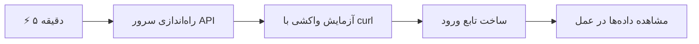
- **دقیقه ۱-۲**: سرور API را اجرا کنید (`cd api && npm start`) و اتصال را آزمایش کنید  
- **دقیقه ۳**: یک تابع ساده `getAccount()` با استفاده از fetch بسازید  
- **دقیقه ۴**: فرم ورود را با `action="javascript:login()"` متصل کنید  
- **دقیقه ۵**: ورود را تست کنید و مشاهده کنید داده‌های حساب در کنسول ظاهر می‌شوند

**فرامین تست سریع**:  
```bash
# بررسی فعال بودن API
curl http://localhost:5000/api

# تست واکشی داده‌های حساب کاربری
curl http://localhost:5000/api/accounts/test
```
  
**چرا این مهم است**: در ۵ دقیقه، شما جادوی واکشی ناهمزمان داده را خواهید دید که نیروی محرکه هر برنامه وب مدرن است. این پایه‌ای است که باعث می‌شود اپ‌ها پاسخگو و زنده به نظر برسند.

## 🗺️ مسیر یادگیری شما در برنامه‌های وب مبتنی بر داده

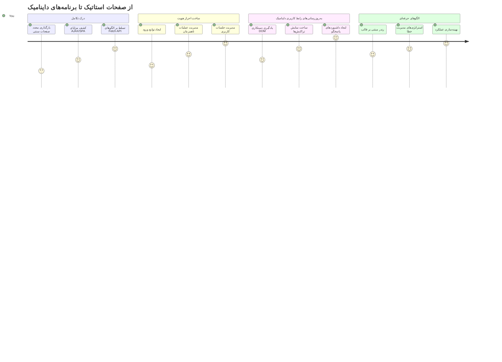
**مقصد مسیر شما**: تا پایان این درس، شما می‌فهمید چطور برنامه‌های وب مدرن به صورت پویا داده‌ها را واکشی، پردازش و نمایش می‌دهند و تجربه‌های کاربری یکپارچه‌ای که از برنامه‌های حرفه‌ای انتظار داریم را خلق می‌کنند.

## آزمون قبل از درس

[آزمون قبل از درس](https://ff-quizzes.netlify.app/web/quiz/45)

### پیش‌نیازها

قبل از شروع واکشی داده، مطمئن شوید که این موارد آماده هستند:

- **درس قبلی**: فرم [ورود و ثبت‌نام](../2-forms/README.md) را کامل کنید - ما بر این پایه خواهیم ساخت  
- **سرور محلی**: [Node.js](https://nodejs.org) را نصب کرده و [سرور API](../api/README.md) را اجرا کنید تا داده حساب‌ها را فراهم کند  
- **ارتباط با API**: اتصال سرور خود را با این دستور تست کنید:

```bash
curl http://localhost:5000/api
# پاسخ مورد انتظار: "بانک API نسخه 1.0.0"
```
  
این تست سریع تضمین می‌کند همه اجزا به درستی با هم ارتباط دارند:  
- تایید می‌کند Node.js به‌درستی روی سیستم شما اجرا می‌شود  
- اطمینان می‌دهد سرور API فعال و پاسخگو است  
- اعتبارسنجی می‌کند که اپ شما می‌تواند به سرور دسترسی داشته باشد (مثل بررسی تماس رادیویی پیش از ماموریت)

## 🧠 مرور اکوسیستم مدیریت داده‌ها

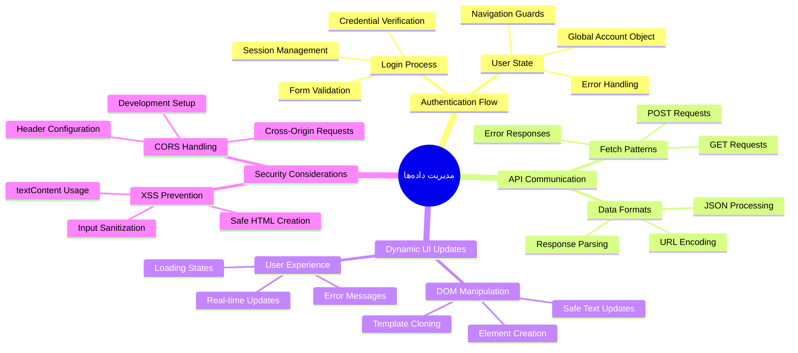
**اصل اساسی**: برنامه‌های وب مدرن سیستم‌های هماهنگ‌کننده داده‌اند — آن‌ها بین رابط‌های کاربری، API‌های سرور و مدل‌های امنیتی مرورگر هماهنگی ایجاد می‌کنند تا تجربه‌های پاسخگو و یکپارچه خلق کنند.

---

## درک واکشی داده در برنامه‌های وب مدرن

نحوه مدیریت داده در برنامه‌های وب طی دو دهه گذشته به شدت تغییر کرده است. درک این تحول به شما کمک می‌کند بیشتر قدر قدرت روش‌های نوین مثل AJAX و Fetch API را بدانید و بفهمید چرا این‌ها به ابزارهای ضروری توسعه‌دهندگان وب تبدیل شده‌اند.

بیایید ببینیم وب‌سایت‌های سنتی چگونه کار می‌کردند و آن‌ها را با برنامه‌های پویا و پاسخگوی امروز مقایسه کنیم.

### برنامه‌های چندصفحه‌ای سنتی (MPA)

در روزهای ابتدایی وب، هر کلیک مثل عوض کردن کانال در یک تلویزیون قدیمی بود — صفحه خاموش می‌شد، بعد آهسته محتوا بارگذاری می‌شد. این واقعیت برنامه‌های وب اولیه بود، جایی که هر تعامل به معنی ساختن دوباره کل صفحه از اول بود.

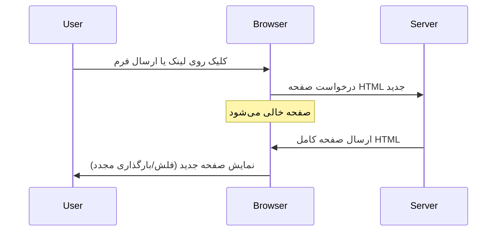


**چرا این روش کند و زمخت به نظر می‌رسید:**  
- هر کلیک به معنای ساختن کل صفحه از نو بود  
- کاربران وسط کارشان با آن فلش‌های صفحه اذیت می‌شدند  
- اتصال اینترنت شما بار اضافی داشت چون مدام هدر و فوتر تکراری دانلود می‌شد  
- اپ‌ها بیشتر شبیه ورق زدن یک کشوی اسناد بودند تا استفاده از نرم‌افزار

### برنامه‌های تک‌صفحه‌ای مدرن (SPA)

AJAX (جاوااسکریپت ناهمزمان و XML) این پارادایم را کاملاً تغییر داد. مثل طراحی مدولار ایستگاه فضایی بین‌المللی، جایی که فضانوردان می‌توانند قطعات را بدون بازسازی کل سازه جایگزین کنند، AJAX اجازه می‌دهد بخش‌های خاصی از صفحه وب را بدون بارگذاری مجدد کل صفحه به‌روزرسانی کنیم. علیرغم نام آن که XML را می‌گوید، امروز بیشتر JSON استفاده می‌کنیم اما اصل اساسی این است: فقط بخش‌های لازم به‌روزرسانی می‌شوند.

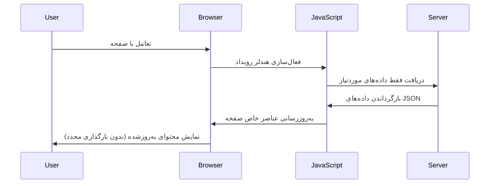
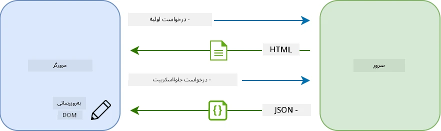

**چرا SPAها اینقدر بهتر به نظر می‌رسند:**  
- فقط بخش‌هایی که واقعاً تغییر کرده‌اند به‌روزرسانی می‌شوند (هوشمندانه، درست است؟)  
- دیگر وقفه‌های ناگهانی وجود ندارد - کاربران در جریان خود باقی می‌مانند  
- حجم کمتری از داده‌ها روی شبکه منتقل می‌شود، یعنی بارگذاری سریع‌تر  
- همه چیز پاسخگو و چابک به نظر می‌رسد، مثل اپ‌های روی گوشی شما

### تحول به Fetch API مدرن

مرورگرهای مدرن [`Fetch API`](https://developer.mozilla.org/docs/Web/API/Fetch_API) را ارائه می‌دهند که جایگزین قدیمی‌تر [`XMLHttpRequest`](https://developer.mozilla.org/docs/Web/API/XMLHttpRequest/Using_XMLHttpRequest) شده است. مثل تفاوت بین استفاده از تلگراف و ایمیل، Fetch API از پرامیس‌ها برای کد ناهمزمان تمیزتر استفاده می‌کند و JSON را به طور طبیعی هندل می‌کند.

| ویژگی | XMLHttpRequest | Fetch API |  
|---------|----------------|----------|  
| **نحو** | callback-based پیچیده | promise-based تمیز |  
| **هندلینگ JSON** | نیاز به پارس دستی | متد داخلی `.json()` |  
| **مدیریت خطا** | اطلاعات خطای محدود | جزئیات خطا جامع |  
| **پشتیبانی مدرن** | سازگار با کدهای قدیمی | پرامیس‌ها و async/await در ES6+ |

> 💡 **سازگاری مرورگر**: خبر خوب این است که Fetch API در همه مرورگرهای مدرن کار می‌کند! اگر درباره نسخه‌های خاص کنجکاوید، [caniuse.com](https://caniuse.com/fetch) داستان کامل سازگاری را دارد.  
>  
**خلاصه:**  
- در کروم، فایرفاکس، سافاری و اج عالی است (عملاً در همه جا که کاربران شما هستند)  
- فقط اینترنت اکسپلورر نیاز به کمک اضافی دارد (و واقعاً وقتش است که از IE خداحافظی کنیم)  
- شما را کاملاً برای الگوهای async/await ظریف که بعداً استفاده می‌کنیم آماده می‌کند

### پیاده‌سازی ورود کاربر و واکشی داده‌ها

حالا بیایید سیستم ورود را پیاده کنیم که اپ بانکداری شما را از نمایش ایستا به یک برنامه کاربردی واقعی تبدیل می‌کند. مثل پروتکل‌های احراز هویت در مراکز نظامی امن، ما اعتبارسنجی کاربر را انجام می‌دهیم و سپس دسترسی به داده‌های خاص او را فراهم می‌کنیم.

این کار را به تدریج انجام می‌دهیم، ابتدا با احراز هویت پایه و سپس افزودن قابلیت‌های واکشی داده.

#### مرحله ۱: ایجاد پایه تابع ورود

فایل `app.js` خود را باز کرده و یک تابع `login` جدید اضافه کنید. این تابع فرایند احراز هویت کاربر را مدیریت می‌کند:

```javascript
async function login() {
  const loginForm = document.getElementById('loginForm');
  const user = loginForm.user.value;
}
```
  
**بیایید آن را تحلیل کنیم:**  
- آن کلیدواژه `async`؟ به جاوااسکریپت می‌گوید «هی، ممکن است این تابع نیاز داشته باشد منتظر چیزها بماند»  
- فرم را از صفحه می‌گیریم (چیز خاصی نیست، فقط بر اساس آیدی پیدا می‌شود)  
- سپس نام کاربری که کاربر وارد کرده را استخراج می‌کنیم  
- یک نکته جالب: می‌توانید به هر ورودی فرم به وسیله صفت `name` آن دسترسی داشته باشید - نیازی به فراخوانی getElementById اضافی نیست!

> 💡 **الگوی دسترسی به فرم**: هر کنترل فرم را می‌توان با نام آن (تنظیم شده در HTML با صفت `name`) به عنوان یک ویژگی از عنصر فرم دسترسی داد. این روش خوانا و تمیزی برای گرفتن داده‌های فرم فراهم می‌کند.

#### مرحله ۲: ایجاد تابع واکشی داده حساب

حالا تابعی مجزا برای واکشی داده حساب از سرور ایجاد می‌کنیم. این الگو مشابه تابع ثبت‌نام شما است ولی تمرکزش روی واکشی داده است:

```javascript
async function getAccount(user) {
  try {
    const response = await fetch('//localhost:5000/api/accounts/' + encodeURIComponent(user));
    return await response.json();
  } catch (error) {
    return { error: error.message || 'Unknown error' };
  }
}
```
  
**این کد چه کار می‌کند:**  
- **از** API مدرن `fetch` برای درخواست داده به صورت ناهمزمان استفاده می‌کند  
- **یک** URL درخواست GET با پارامتر نام کاربری می‌سازد  
- **از** `encodeURIComponent()` برای هندل امن کاراکترهای خاص در آدرس‌ها استفاده می‌کند  
- **پاسخ را به** فرمت JSON برای پردازش آسان تبدیل می‌کند  
- **خطاها را به‌طور مناسب هندل می‌کند** و به جای کرش دادن، یک شیء خطا بازمی‌گرداند

> ⚠️ **نکته امنیتی**: تابع `encodeURIComponent()` کاراکترهای خاص در URL را هندل می‌کند. مثل سیستم‌های رمزگذاری ارتباطی نیروی دریایی، تضمین می‌کند پیام شما دقیقاً همانطور که باید برسد و کاراکترهای مثل "#" یا "&" اشتباه تفسیر نشوند.  
>  
**چرا این مهم است:**  
- جلوگیری از خراب شدن آدرس‌های اینترنتی با کاراکترهای خاص  
- محافظت در برابر حملات دستکاری URL  
- اطمینان از اینکه سرور داده صحیح را دریافت می‌کند  
- تبعیت از شیوه‌های برنامه‌نویسی امن

#### درک درخواست‌های HTTP GET

شاید تعجب کنید: وقتی `fetch` را بدون هیچ گزینه اضافی استفاده می‌کنید، به‌صورت خودکار یک درخواست [`GET`](https://developer.mozilla.org/docs/Web/HTTP/Methods/GET) ارسال می‌کند. این برای کاری که ما انجام می‌دهیم عالی است — پرسیدن از سرور «هی، می‌توانم داده حساب این کاربر را ببینم؟»

درخواست‌های GET مثل درخواست مودبانه قرض گرفتن یک کتاب از کتابخانه است — شما در حال درخواست دیدن چیزی هستید که قبلاً وجود دارد. درخواست‌های POST (که برای ثبت‌نام استفاده کردیم) بیشتر شبیه ارسال کتاب جدید برای اضافه شدن به مجموعه‌اند.

| درخواست GET | درخواست POST |  
|-------------|-------------|  
| **هدف** | واکشی داده موجود | ارسال داده جدید به سرور |  
| **پارامترها** | در مسیر/رشته پرس و جو URL | در بدنه درخواست |  
| **کش شدن** | قابل کش توسط مرورگرها | معمولاً کش نمی‌شود |  
| **امنیت** | قابل مشاهده در URL و لاگ‌ها | مخفی در بدنه درخواست |

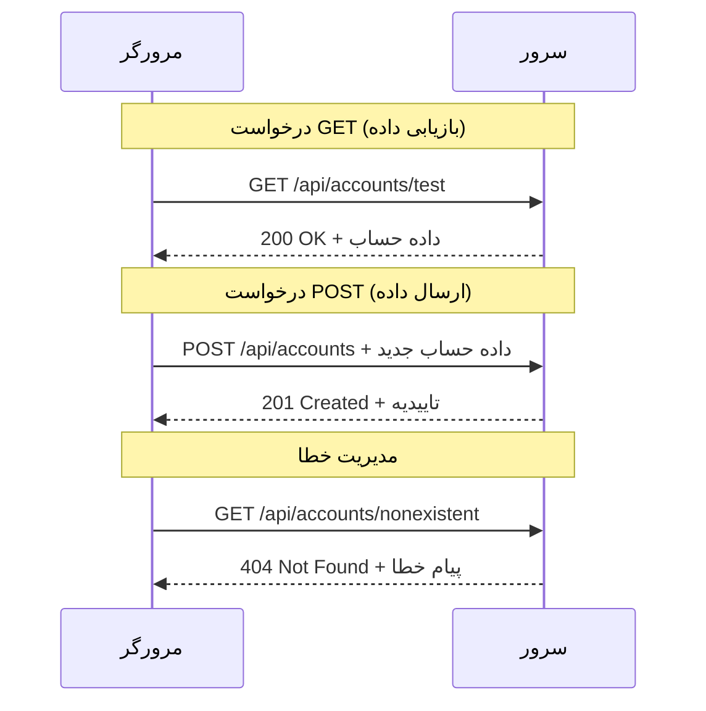
#### مرحله ۳: جمع‌بندی همه چیز

حالا قسمت رضایت‌بخش است — تابع واکشی حساب شما را به فرایند ورود وصل می‌کنیم. جایی که همه چیز به هم می‌رسد:

```javascript
async function login() {
  const loginForm = document.getElementById('loginForm');
  const user = loginForm.user.value;
  const data = await getAccount(user);

  if (data.error) {
    return console.log('loginError', data.error);
  }

  account = data;
  navigate('/dashboard');
}
```
  
این تابع دنباله روشنی دارد:  
- نام کاربری را از ورودی فرم استخراج می‌کند  
- اطلاعات حساب کاربر را از سرور درخواست می‌کند  
- هر خطایی که رخ می‌دهد را هندل می‌کند  
- داده حساب را ذخیره کرده و پس از موفقیت به داشبورد هدایت می‌کند

> 🎯 **الگوی Async/Await**: چون `getAccount` یک تابع ناهمزمان است، ما از کلیدواژه `await` استفاده می‌کنیم تا اجرا تا زمان دریافت پاسخ سرور متوقف شود. این از ادامه کد با داده‌های تعریف نشده جلوگیری می‌کند.

#### مرحله ۴: ایجاد مکانی برای داده‌ها

اپ شما نیاز دارد جایی اطلاعات حساب را پس از بارگذاری نگه دارد. این مثل حافظه کوتاه‌مدت اپ شماست — جایی برای در دسترس داشتن داده‌های کاربر حاضر. این خط را در بالای فایل `app.js` خود اضافه کنید:

```javascript
// این داده‌های حساب کاربری فعلی را نگه می‌دارد
let account = null;
```
  
**چرا این لازم است:**  
- داده‌های حساب را در دسترس هر قسمتی از اپ نگه می‌دارد  
- شروع با مقدار `null` به معنی «فعلاً هیچ‌کس وارد نشده» است  
- هنگام موفقیت در ورود یا ثبت‌نام به‌روزرسانی می‌شود  
- مثل یک منبع یگانه حقیقت عمل می‌کند — هیچ سردرگمی درباره اینکه چه کسی وارد شده نیست

#### مرحله ۵: اتصال فرم

حالا بیایید تابع ورود جدید خود را به فرم HTML متصل کنیم. تگ فرم خود را اینگونه به‌روزرسانی کنید:

```html
<form id="loginForm" action="javascript:login()">
  <!-- Your existing form inputs -->
</form>
```
  
**این تغییر کوچک چه کاری انجام می‌دهد:**  
- جلوی رفتار پیش‌فرض فرم که صفحه را کامل بارگذاری مجدد می‌کند می‌گیرد  
- تابع جاوااسکریپت سفارشی شما را صدا می‌زند  
- همه چیز به صورت نرم و شبیه SPA باقی می‌ماند  
- کنترل کامل خود را روی اتفاقات زمانی که کاربر روی «ورود» کلیک می‌کند به شما می‌دهد

#### مرحله ۶: بهبود تابع ثبت‌نام

برای سازگاری، تابع `register` خود را هم به‌روزرسانی کنید تا داده حساب را ذخیره و به داشبورد هدایت کند:

```javascript
// این خطوط را در انتهای تابع ثبت خود اضافه کنید
account = result;
navigate('/dashboard');
```
  
**این بهبودها فراهم می‌کند:**  
- **تغییر روان** از ثبت‌نام به داشبورد  
- **تجربه کاربری هماهنگ** بین جریان ورود و ثبت‌نام  
- **دسترسی فوری** به داده حساب پس موفقیت ثبت‌نام

#### آزمایش پیاده‌سازی

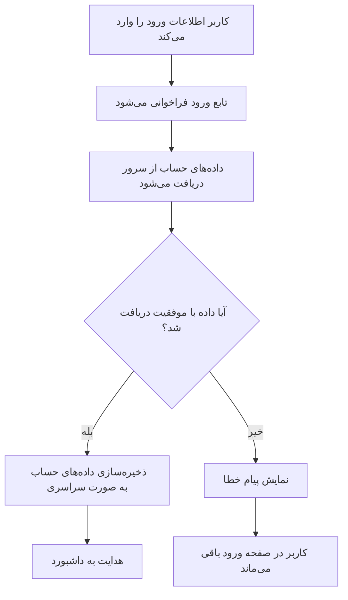
**وقت آن است که امتحانش کنید:**  
1. ابتدا یک حساب جدید بسازید تا همه چیز کار کند  
2. با همان مشخصات وارد شوید  
3. در صورت مشکل به کنسول مرورگر (F12) نگاه کنید  
4. تأیید کنید پس از ورود موفق به داشبورد منتقل می‌شوید

اگر چیزی کار نکرد نگران نباشید! اغلب مشکلات رفع ساده مانند اشتباهات تایپی یا فراموش کردن اجرای سرور API هستند.

#### کلمه‌ای کوتاه درباره جادوی Cross-Origin

ممکن است بپرسید: «چطور اپ وب من با سرور API که روی پورت‌های متفاوت اجرا می‌شوند ارتباط برقرار می‌کند؟» سؤال خوبی است! این موضوع به چیزی برمی‌گردد که هر توسعه‌دهنده وب بالاخره با آن مواجه می‌شود.

> 🔒 **امنیت Cross-Origin**: مرورگرها سیاست «هم‌مبدأی» را اجرا می‌کنند تا ارتباط غیرمجاز بین دامنه‌های مختلف را جلوگیری کنند. درست مثل سیستم ایست بازرسی در پنتاگون، آن‌ها تأیید می‌کنند که ارتباط مجاز است قبل از اینکه اجازه انتقال داده بدهند.  
>  
**در تنظیمات ما:**  
- اپ وب روی `localhost:3000` اجرا می‌شود (سرور توسعه)  
- سرور API روی `localhost:5000` اجرا می‌شود (سرور بک‌اند)  
- سرور API شامل [هدرهای CORS](https://developer.mozilla.org/docs/Web/HTTP/CORS) است که صراحتاً اجازه ارتباط از اپ وب شما را می‌دهد

این پیکربندی مثل موارد واقعی توسعه است که برنامه‌های فرانت‌اند و بک‌اند معمولاً روی سرورهای جداگانه اجرا می‌شوند.

> 📚 **بیشتر بیاموزید**: با این [ماژول مایکروسافت در مورد APIs](https://docs.microsoft.com/learn/modules/use-apis-discover-museum-art/?WT.mc_id=academic-77807-sagibbon) به عمق موضوع کار با API و واکشی داده بروید.

## زنده کردن داده‌ها در HTML

حالا داده‌های واکشی شده را با دستکاری DOM قابل مشاهده برای کاربران می‌کنیم. مثل فرایند ظهور عکس در اتاق تاریک، داده‌های نامرئی را به چیزی تبدیل می‌کنیم که کاربران بتوانند ببینند و با آن تعامل کنند.
دستکاری DOM تکنیکی است که صفحات وب ایستا را به برنامه‌های پویا تبدیل می‌کند که محتوای خود را بر اساس تعاملات کاربر و پاسخ‌های سرور به‌روزرسانی می‌کنند.

### انتخاب ابزار مناسب برای کار

وقتی صحبت از به‌روزرسانی HTML با جاوااسکریپت است، چند گزینه دارید. این‌ها مانند ابزارهای مختلف در جعبه ابزار هستند - هر کدام برای کارهای خاصی عالی‌اند:

| روش | چه کاری برایش عالی است | چه زمانی استفاده کنیم | سطح ایمنی |
|--------|---------------------|----------------|--------------|
| `textContent` | نمایش امن داده‌های کاربر | هر زمانی که متن نمایش می‌دهید | ✅ بسیار قابل اعتماد |
| `createElement()` + `append()` | ساختن طرح‌های پیچیده | ایجاد بخش‌ها/لیست‌های جدید | ✅ کاملاً ایمن |
| `innerHTML` | تعیین محتوای HTML | ⚠️ سعی کنید از این استفاده نکنید | ❌ خطرناک |

#### روش امن نمایش متن: textContent

خصوصیت [`textContent`](https://developer.mozilla.org/docs/Web/API/Node/textContent) بهترین دوست شما هنگام نمایش داده‌های کاربر است. این مثل یک نگهبان برای صفحه وب شماست - هیچ چیز مضر اجازه عبور ندارد:

```javascript
// راه امن و قابل اعتماد برای به‌روزرسانی متن
const balanceElement = document.getElementById('balance');
balanceElement.textContent = account.balance;
```

**مزایای textContent:**
- همه چیز را به عنوان متن ساده در نظر می‌گیرد (اجرا شدن اسکریپت را جلوگیری می‌کند)
- به طور خودکار محتوای موجود را پاک می‌کند
- برای به‌روزرسانی‌های متنی ساده کارآمد است
- امنیت داخلی در برابر محتوای مخرب فراهم می‌کند

#### ساخت عناصر HTML پویا

برای محتواهای پیچیده‌تر، [`document.createElement()`](https://developer.mozilla.org/docs/Web/API/Document/createElement) را با متد [`append()`](https://developer.mozilla.org/docs/Web/API/ParentNode/append) ترکیب کنید:

```javascript
// راه ایمن برای ایجاد عناصر جدید
const transactionItem = document.createElement('div');
transactionItem.className = 'transaction-item';
transactionItem.textContent = `${transaction.date}: ${transaction.description}`;
container.append(transactionItem);
```

**درک این روش:**
- عناصر DOM جدید را به صورت برنامه‌نویسی ایجاد می‌کند
- کنترل کامل روی ویژگی‌ها و محتوای عنصر دارد
- اجازه ساختارهای پیچیده و تو در تو را می‌دهد
- امنیت را با جدا کردن ساختار از محتوا حفظ می‌کند

> ⚠️ **ملاحظه امنیتی**: در حالی که [`innerHTML`](https://developer.mozilla.org/docs/Web/API/Element/innerHTML) در بسیاری آموزش‌ها ظاهر می‌شود، می‌تواند اسکریپت‌های جاسازی شده را اجرا کند. مانند پروتکل‌های امنیتی CERN که اجازه اجرای کد غیرمجاز نمی‌دهند، استفاده از `textContent` و `createElement` جایگزین‌های امن‌تری هستند.
> 
**خطرات innerHTML:**
- هر تگ `<script>` در داده‌های کاربر را اجرا می‌کند
- آسیب‌پذیر به حملات تزریق کد
- ممکن است خطرات امنیتی ایجاد کند
- جایگزین‌های امن ما همان عملکرد را دارند

### کاربرپسند کردن خطاها

در حال حاضر، خطاهای ورود فقط در کنسول مرورگر ظاهر می‌شوند که برای کاربران نامرئی است. شبیه فرق بین تشخیص‌های داخلی خلبان و سیستم اطلاعات مسافران، ما باید اطلاعات مهم را از طریق کانال مناسب منتقل کنیم.

نمایش پیام‌های خطا قابل مشاهده به کاربران بازخورد فوری می‌دهد درباره اینکه چه اشتباهی رخ داده و چگونه ادامه دهند.

#### مرحله ۱: اضافه کردن محلی برای پیام‌های خطا

ابتدا برای پیام‌های خطا در HTML خود جایگاهی ایجاد کنید. این را درست قبل از دکمه ورود اضافه کنید تا کاربران به طور طبیعی آن را ببینند:

```html
<!-- This is where error messages will appear -->
<div id="loginError" role="alert"></div>
<button>Login</button>
```

**در اینجا چه اتفاقی می‌افتد:**
- یک ظرف خالی ایجاد می‌کنیم که تا وقتی لازم است نامرئی می‌ماند
- در جایی قرار دارد که کاربران به طور طبیعی بعد از کلیک "ورود" نگاه می‌کنند
- آن `role="alert"` برای خوانندگان صفحه مفید است – به فناوری کمکی می‌گوید «این مهم است!»
- شناسه منحصر به فرد به جاوااسکریپت ما هدف آسانی می‌دهد

#### مرحله ۲: ساخت تابع کمکی کاربردی

بیایید یک تابع کمکی کوچک بسازیم که متن هر عنصری را به‌روزرسانی کند. این یکی از آن توابع "یک بار بنویس، همه جا استفاده کن" است که وقت شما را ذخیره می‌کند:

```javascript
function updateElement(id, text) {
  const element = document.getElementById(id);
  element.textContent = text;
}
```

**مزایای تابع:**
- رابط ساده که فقط به شناسه عنصر و متن نیاز دارد
- به‌صورت امن عناصر DOM را پیدا و به‌روزرسانی می‌کند
- الگوی قابل استفاده مجدد که تکرار کد را کاهش می‌دهد
- رفتار به‌روزرسانی سازگار در کل برنامه حفظ می‌شود

#### مرحله ۳: نمایش خطاها در جایی که کاربران می‌بینند

حالا پیام مخفی کنسول را با چیزی که کاربران واقعاً می‌بینند جایگزین کنیم. تابع ورود خود را به‌روز کنید:

```javascript
// به جای فقط ثبت در کنسول، به کاربر نشان دهید که مشکل چیست
if (data.error) {
  return updateElement('loginError', data.error);
}
```

**این تغییر کوچک تفاوت بزرگی ایجاد می‌کند:**
- پیام‌های خطا دقیقاً جایی که کاربران نگاه می‌کنند نمایش داده می‌شوند
- دیگر شکست‌های مرموز و بی‌صدا وجود ندارد
- کاربران بازخورد فوری و اقدام‌پذیر دریافت می‌کنند
- برنامه شما حرفه‌ای و کاربر‌محور به نظر می‌رسد

حالا وقتی با حساب نامعتبر تست کنید، پیام خطای مفیدی درست روی صفحه می‌بینید!


#### مرحله ۴: توجه به دسترسی

یک نکته جالب درباره `role="alert"` که قبلاً اضافه کردیم این است که فقط دکور نیست! این ویژگی یک [منطقه زنده](https://developer.mozilla.org/docs/Web/Accessibility/ARIA/ARIA_Live_Regions) ایجاد می‌کند که بلافاصله تغییرات را به خوانندگان صفحه اعلان می‌کند:

```html
<div id="loginError" role="alert"></div>
```

**چرا این مهم است:**
- کاربران خواننده صفحه فوراً پیام خطا را می‌شنوند
- همه بدون توجه به نحوه پیمایش، اطلاعات مهم را دریافت می‌کنند
- راه ساده‌ای است برای قابل استفاده کردن برنامه برای تعداد بیشتری از افراد
- نشان می‌دهد که برای تجربه فراگیر اهمیت قائلید

لمس‌های کوچک مانند این توسعه‌دهندگان خوب را از عالی جدا می‌کند!

### 🎯 بررسی آموزشی: الگوهای احراز هویت

**توقف و تفکر**: تازه یک جریان احراز هویت کامل را پیاده‌سازی کرده‌اید. این یک الگوی بنیادین در توسعه وب است.

**خودارزیابی سریع**:
- می‌توانید توضیح دهید چرا برای فراخوانی API از async/await استفاده می‌کنیم؟
- اگر `encodeURIComponent()` را فراموش کنیم چه اتفاقی می‌افتد؟
- چگونه مدیریت خطای ما تجربه کاربر را بهبود می‌بخشد؟

**ارتباط با دنیای واقعی**: الگوهایی که اینجا یاد گرفته‌اید (فراخوانی داده به صورت async، مدیریت خطا، بازخورد به کاربر) در هر برنامه بزرگ وب از شبکه‌های اجتماعی تا سایت‌های تجارت الکترونیک استفاده می‌شود. شما در حال ساخت مهارت‌های تولید هستید!

**سوال چالش‌برانگیز**: چگونه ممکن است این سیستم احراز هویت را تغییر دهید تا نقش‌های کاربری مختلف (مشتری، مدیر، مسئول) را مدیریت کند؟ درباره ساختار داده‌ها و تغییرات رابط کاربری فکر کنید.

#### مرحله ۵: اعمال همان الگو روی ثبت‌نام

برای هماهنگی، همان مدیریت خطا را در فرم ثبت‌نام نیز پیاده‌سازی کنید:

1. **افزودن** عنصر نمایش خطا به HTML ثبت‌نام:
```html
<div id="registerError" role="alert"></div>
```

2. **به‌روزرسانی** تابع ثبت‌نام برای استفاده از همان الگوی نمایش خطا:
```javascript
if (data.error) {
  return updateElement('registerError', data.error);
}
```

**مزایای مدیریت خطای یکسان:**
- **تجربه کاربری یکنواخت** در تمام فرم‌ها فراهم می‌کند
- **بار شناختی را کاهش** می‌دهد با استفاده از الگوهای آشنا
- **نگهداری را ساده‌تر** می‌کند با کد قابل استفاده مجدد
- **استانداردهای دسترسی** را در کل برنامه تضمین می‌کند

## ایجاد داشبورد پویا

حالا داشبورد ایستای شما را به یک رابط پویا که اطلاعات حساب واقعی را نشان می‌دهد تبدیل می‌کنیم. مانند تفاوت بین برنامه پرواز چاپ شده و تابلوهای زنده فرودگاه‌ها، از اطلاعات ایستا به نمایش‌های واکنش‌گرا و آنی می‌رویم.

با استفاده از تکنیک‌های دستکاری DOM که یاد گرفته‌اید، یک داشبورد می‌سازیم که با اطلاعات جاری حساب به طور خودکار به‌روزرسانی می‌شود.

### آشنا شدن با داده‌هایتان

قبل از شروع ساخت، نگاهی به داده‌هایی که سرور شما برمی‌گرداند بیاندازیم. وقتی کسی با موفقیت وارد می‌شود، این گنجینه اطلاعاتی برای شما فراهم است:

```json
{
  "user": "test",
  "currency": "$",
  "description": "Test account",
  "balance": 75,
  "transactions": [
    { "id": "1", "date": "2020-10-01", "object": "Pocket money", "amount": 50 },
    { "id": "2", "date": "2020-10-03", "object": "Book", "amount": -10 },
    { "id": "3", "date": "2020-10-04", "object": "Sandwich", "amount": -5 }
  ]
}
```

**این ساختار داده شامل:**
- **`user`**: مناسب برای شخصی‌سازی تجربه ("خوش آمدی سارا!")
- **`currency`**: برای نمایش دقیق مقادیر پولی
- **`description`**: نام دوستانه حساب
- **`balance`**: موجودی کنونی بسیار مهم
- **`transactions`**: تاریخچه کامل تراکنش‌ها با همه جزئیات

هر آنچه برای ساخت یک داشبورد بانکی حرفه‌ای نیاز دارید!

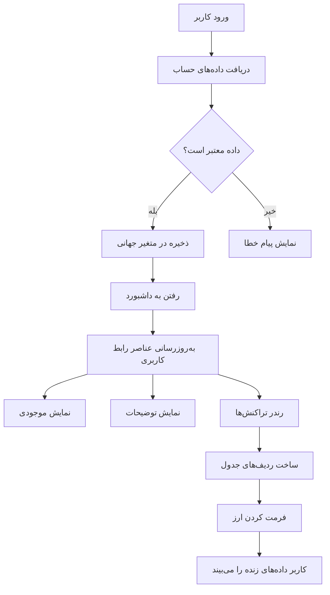
> 💡 **نکته مفید**: می‌خواهید داشبورد خود را همین حالا ببینید؟ هنگام ورود، نام کاربری `test` را وارد کنید - این حساب با داده‌های نمونه از پیش بارگذاری شده است تا بتوانید همه چیز را بدون نیاز به ایجاد تراکنش تست کنید.
> 
**چرا حساب تست مفید است:**
- با داده نمونه واقعی از پیش پر شده است
- مناسب برای دیدن چگونگی نمایش تراکنش‌ها
- عالی برای آزمون ویژگی‌های داشبورد شما
- شما را از ایجاد داده ساختگی دستی بی‌نیاز می‌کند

### ساخت عناصر نمایش داشبورد

بیایید رابط داشبورد خود را قدم به قدم بسازیم، ابتدا با اطلاعات خلاصه حساب و سپس با ویژگی‌های پیچیده‌تر مثل فهرست تراکنش‌ها.

#### مرحله ۱: به‌روزرسانی ساختار HTML

ابتدا بخش ایستای "موجودی" را با عناصر جایگزین پویا که جاوااسکریپت شما می‌تواند آن‌ها را پر کند، جایگزین کنید:

```html
<section>
  Balance: <span id="balance"></span><span id="currency"></span>
</section>
```

بعد، بخش توضیح حساب را اضافه کنید. از آنجا که این به عنوان عنوان محتوای داشبورد عمل می‌کند، از HTML معنایی استفاده کنید:

```html
<h2 id="description"></h2>
```

**درک ساختار HTML:**
- **از** عناصر جداگانه `<span>` برای موجودی و ارز استفاده می‌کند برای کنترل فردی
- **شناسه‌های منحصر به فرد** برای هر عنصر برای هدف‌گذاری جاوااسکریپت اعمال می‌شود
- **از** HTML معنایی با `<h2>` برای توضیح حساب پیروی می‌کند
- **یک سلسله مراتب منطقی** برای خوانندگان صفحه و بهینه‌سازی موتور جستجو ایجاد می‌کند

> ✅ **نگاه به دسترسی**: توضیح حساب به عنوان عنوان محتوای داشبورد عمل می‌کند، پس به صورت معنایی با یک عنوان مشخص شده است. درباره چگونگی تأثیر [ساختار عناوین](https://www.nomensa.com/blog/2017/how-structure-headings-web-accessibility) بر دسترسی بیشتر بیاموزید. آیا می‌توانید سایر عناصری را که ممکن است از برچسب‌های عنوان بهره ببرند در صفحه خود شناسایی کنید؟

#### مرحله ۲: ساخت تابع به‌روزرسانی داشبورد

حالا تابعی بنویسید که داشبورد شما را با داده‌های واقعی حساب پر کند:

```javascript
function updateDashboard() {
  if (!account) {
    return navigate('/login');
  }

  updateElement('description', account.description);
  updateElement('balance', account.balance.toFixed(2));
  updateElement('currency', account.currency);
}
```

**قدم به قدم، این تابع انجام می‌دهد:**
- **اعتبارسنجی** می‌کند که داده حساب وجود دارد قبل از ادامه
- **کاربران غیرمجاز را** به صفحه ورود هدایت می‌کند
- **توضیح حساب را به‌روزرسانی** می‌کند با استفاده از تابع قابل استفاده مجدد `updateElement`
- موجودی را **با دو رقم اعشار** همیشه فرمت می‌کند
- **نماد ارز مناسب** را نمایش می‌دهد

> 💰 **فرمت‌بندی پول**: آن متد [`toFixed(2)`](https://developer.mozilla.org/docs/Web/JavaScript/Reference/Global_Objects/Number/toFixed) بسیار مفید است! اطمینان می‌دهد موجودی شما همیشه شبیه پول واقعی نمایش داده شود - "75.00" به جای فقط "75". کاربران شما از دیدن قالب پول آشنا قدردانی خواهند کرد.

#### مرحله ۳: اطمینان از به‌روزرسانی داشبورد

برای اطمینان از اینکه داشبورد شما هر بار که کسی آن را بازدید می‌کند با داده روز به‌روزرسانی می‌شود، باید به سیستم ناوبری شما متصل شویم. اگر [تمرین درس ۱](../1-template-route/assignment.md) را کامل کرده‌اید، این برایتان آشنا خواهد بود. اگر نه، نگران نباشید - این کاری است که باید انجام دهید:

این را به انتهای تابع `updateRoute()` اضافه کنید:

```javascript
if (typeof route.init === 'function') {
  route.init();
}
```

سپس مسیرهای خود را به‌روزرسانی کنید تا مقداردهی اولیه داشبورد را شامل شود:

```javascript
const routes = {
  '/login': { templateId: 'login' },
  '/dashboard': { templateId: 'dashboard', init: updateDashboard }
};
```

**این تنظیم هوشمندانه چه می‌کند:**
- بررسی می‌کند آیا مسیری کد مقداردهی اولیه خاصی دارد
- آن کد را به طور خودکار هنگام بارگذاری مسیر اجرا می‌کند
- اطمینان می‌دهد داشبورد شما همیشه داده تازه و به‌روز را نمایش می‌دهد
- منطق مسیر یابی شما را تمیز و سازمان یافته نگه می‌دارد

#### آزمایش داشبورد

بعد از اعمال این تغییرات، داشبورد خود را تست کنید:

1. با یک حساب تست **وارد شوید**
2. **اطمینان حاصل کنید** که به داشبورد هدایت شده‌اید
3. بررسی کنید که توضیح حساب، موجودی و ارز به درستی نمایش داده شوند
4. تلاش کنید خارج شوید و دوباره وارد شوید تا مطمئن شوید داده‌ها به درستی تازه می‌شوند

حالا داشبورد شما باید اطلاعات پویا حساب را بر اساس داده‌های کاربر وارد شده نمایش دهد!

## ساخت لیست‌های تراکنش هوشمند با قالب‌ها

به جای ساخت دستی HTML برای هر تراکنش، از قالب‌ها استفاده می‌کنیم تا فرمت‌بندی یکسان به صورت خودکار ایجاد شود. مانند قطعات استاندارد شده در ساخت فضاپیما، قالب‌ها تضمین می‌کنند هر ردیف تراکنش ساختار و ظاهر یکنواختی دارد.

این تکنیک به طور مؤثر از چند تراکنش تا هزاران تراکنش مقیاس‌پذیر است و کارایی و ارائه یکنواخت را حفظ می‌کند.

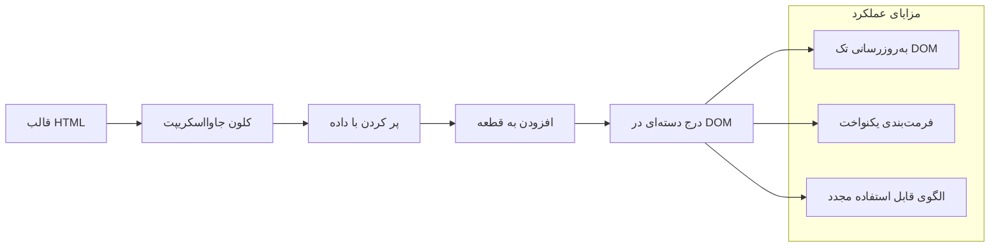

### مرحله ۱: ایجاد قالب تراکنش

اول، قالب قابل استفاده مجدد برای ردیف تراکنش‌ها را در `<body>` HTML اضافه کنید:

```html
<template id="transaction">
  <tr>
    <td></td>
    <td></td>
    <td></td>
  </tr>
</template>
```

**درک قالب‌های HTML:**
- ساختار یک ردیف جدول را تعریف می‌کند
- تا زمانی که با جاوااسکریپت کلون و پر نشود نامرئی می‌ماند
- شامل سه سلول برای تاریخ، توضیح و مبلغ است
- الگوی قابل استفاده مجدد برای قالب‌بندی سازگار فراهم می‌کند

### مرحله ۲: آماده‌سازی جدول برای محتوای پویا

بعد، یک `id` به بدنه جدول اضافه کنید تا جاوااسکریپت بتواند به راحتی هدف‌گذاری کند:

```html
<tbody id="transactions"></tbody>
```

**این چه فایده‌ای دارد:**
- هدف واضحی برای وارد کردن ردیف‌های تراکنش ایجاد می‌کند
- ساختار جدول را از محتوای پویا جدا می‌کند
- امکان پاک‌سازی و بازپُر کردن آسان تراکنش‌ها را فراهم می‌کند

### مرحله ۳: ساخت تابع کارخانه ردیف تراکنش

حالا تابعی بسازید که داده‌های تراکنش را به عناصر HTML تبدیل کند:

```javascript
function createTransactionRow(transaction) {
  const template = document.getElementById('transaction');
  const transactionRow = template.content.cloneNode(true);
  const tr = transactionRow.querySelector('tr');
  tr.children[0].textContent = transaction.date;
  tr.children[1].textContent = transaction.object;
  tr.children[2].textContent = transaction.amount.toFixed(2);
  return transactionRow;
}
```

**شرح این تابع کارخانه:**
- عنصر قالب را با شناسه‌اش بازیابی می‌کند
- محتوای قالب را برای دستکاری امن کلون می‌کند
- ردیف جدول داخل محتوای کلون شده را انتخاب می‌کند
- هر سلول را با داده تراکنش پر می‌کند
- مبلغ را به صورت مناسب با ارقام اعشار قالب می‌کند
- ردیف تکمیل شده را آماده درج باز می‌گرداند

### مرحله ۴: ساخت چندین ردیف تراکنش به شکل بهینه

این کد را در تابع `updateDashboard()` خود اضافه کنید تا همه تراکنش‌ها نمایش داده شوند:

```javascript
const transactionsRows = document.createDocumentFragment();
for (const transaction of account.transactions) {
  const transactionRow = createTransactionRow(transaction);
  transactionsRows.appendChild(transactionRow);
}
updateElement('transactions', transactionsRows);
```

**درک این روش بهینه:**
- یک قطعه سند (document fragment) برای دسته‌ای از عملیات DOM ایجاد می‌کند
- روی همه تراکنش‌های داده حساب تکرار می‌کند
- برای هر تراکنش یک ردیف با استفاده از تابع کارخانه می‌سازد
- همه ردیف‌ها را در قطعه جمع می‌کند قبل از افزودن به DOM
- به جای چند بار به‌روزرسانی تک‌تک، فقط یک بار به‌روزرسانی DOM انجام می‌دهد
> ⚡ **بهینه‌سازی عملکرد**: [`document.createDocumentFragment()`](https://developer.mozilla.org/docs/Web/API/Document/createDocumentFragment) مانند فرایند مونتاژ در بوئینگ عمل می‌کند – قطعات به‌صورت جداگانه و خارج از خط اصلی آماده می‌شوند و سپس به‌عنوان یک واحد کامل نصب می‌گردند. این روش دسته‌بندی، با انجام یک درج واحد به‌جای چندین عملیات جداگانه، بازآرایی‌های DOM را به حداقل می‌رساند.

### گام ۵: بهبود تابع به‌روزرسانی برای محتوای ترکیبی

تابع `updateElement()` شما در حال حاضر تنها محتوای متنی را مدیریت می‌کند. آن را به گونه‌ای به‌روزرسانی کنید که با هر دو نوع متن و گره‌های DOM کار کند:

```javascript
function updateElement(id, textOrNode) {
  const element = document.getElementById(id);
  element.textContent = ''; // تمام فرزندان را حذف می‌کند
  element.append(textOrNode);
}
```

**بهبودهای کلیدی در این به‌روزرسانی:**
- **پاک‌سازی** محتوای موجود قبل از افزودن محتوای جدید
- **پذیرفتن** پارامترها به صورت رشته متنی یا گره‌های DOM
- **استفاده‌** از متد [`append()`](https://developer.mozilla.org/docs/Web/API/ParentNode/append) برای انعطاف‌پذیری بیشتر
- **حفظ** سازگاری به عقب با استفاده‌های متنی قبلی

### وقت آزمایش داشبورد شما

وقت حقیقت است! بیایید داشبورد داینامیک شما را در عمل ببینیم:

1. با حساب کاربری `test` وارد شوید (داده‌های نمونه آماده دارد)
2. به داشبورد خود بروید
3. بررسی کنید که ردیف‌های تراکنش با قالب بندی مناسب ظاهر شده‌اند
4. مطمئن شوید تاریخ‌ها، توضیحات و مبالغ به درستی نمایش داده می‌شوند

اگر همه چیز درست کار کند، باید یک فهرست تراکنش کاملاً عملی روی داشبورد خود ببینید! 🎉

**آنچه به دست آوردید:**
- ساخت داشبوردی که با هر مقدار داده مقیاس‌پذیر است
- ایجاد قالب‌های قابل استفاده مجدد برای قالب‌بندی هماهنگ
- پیاده‌سازی روش‌های مؤثر دستکاری DOM
- توسعه قابلیت‌هایی مشابه برنامه‌های بانکی تولیدی

شما با موفقیت یک صفحه وب ایستا را به یک برنامه وب پویا تبدیل کردید.

### 🎯 بررسی آموزشی: تولید محتوای داینامیک

**درک معماری**: شما یک خط لوله پیشرفته داده به رابط کاربری اجرا کرده‌اید که الگوهایی مشابه فریم‌ورک‌هایی مانند React، Vue و Angular دارد.

**مفاهیم کلیدی کسب‌شده**:
- **رندر مبتنی بر قالب**: ایجاد مؤلفه‌های رابط کاربری قابل استفاده مجدد
- **قطعات سند**: بهینه‌سازی عملکرد DOM
- **دستکاری امن DOM**: جلوگیری از آسیب‌پذیری‌های امنیتی
- **تبدیل داده**: تبدیل داده سرور به رابط‌های کاربری

**ارتباط صنعتی**: این تکنیک‌ها اساس فریم‌ورک‌های مدرن فرانت‌اند را شکل می‌دهند. DOM مجازی React، سیستم قالب Vue و معماری مولفه‌ای Angular همه بر این مفاهیم پایه بنا شده‌اند.

**سؤال بازتابی**: چگونه این سیستم را گسترش می‌دهید تا به‌روزرسانی‌های زمان واقعی (مثل ظاهر شدن خودکار تراکنش‌های جدید) را مدیریت کند؟ استفاده از WebSockets یا Server-Sent Events را در نظر بگیرید.

---

## 📈 جدول زمانی تسلط شما بر مدیریت داده‌ها

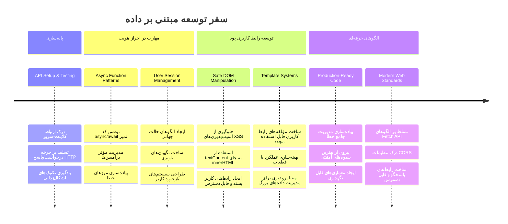
**🎓 مرحله فارغ‌التحصیلی**: شما با موفقیت یک برنامه وب کامل مبتنی بر داده با الگوهای مدرن جاوااسکریپت ساخته‌اید. این مهارت‌ها مستقیماً به کار با فریم‌ورک‌هایی مانند React، Vue یا Angular منتقل می‌شوند.

**🔄 قابلیت‌های سطح بعدی**:
- آماده برای کاوش فریم‌ورک‌های فرانت‌اند که بر این مفاهیم بنا شده‌اند
- آماده برای پیاده‌سازی ویژگی‌های زمان واقعی با WebSockets
- مجهز به ساخت برنامه‌های وب پیش‌رونده (PWA) با قابلیت‌های آفلاین
- پایه‌ریزی شده برای یادگیری الگوهای پیشرفته مدیریت وضعیت

## چالش GitHub Copilot Agent 🚀

از حالت Agent برای تکمیل چالش زیر استفاده کنید:

**شرح:** برنامه بانکی را با افزودن قابلیت جستجو و فیلتر تراکنش‌ها بهبود دهید، به گونه‌ای که کاربران بتوانند تراکنش‌های خاص را بر اساس بازه زمانی، مبلغ یا شرح پیدا کنند.

**دستورالعمل:** یک قابلیت جستجو برای برنامه بانکی ایجاد کنید که شامل: ۱) فرم جستجو با فیلدهای ورودی برای بازه زمانی (از/تا)، حداقل/حداکثر مبلغ و کلمات کلیدی شرح تراکنش، ۲) تابع `filterTransactions()` که آرایه account.transactions را بر اساس معیارهای جستجو فیلتر می‌کند، ۳) به‌روزرسانی تابع `updateDashboard()` برای نمایش نتایج فیلتر شده، و ۴) افزودن دکمه «پاک‌کردن فیلترها» برای بازنشانی نما. از روش‌های مدرن آرایه جاوااسکریپت مانند `filter()` استفاده کنید و حالات لبه را برای معیارهای جستجوی خالی کنترل نمایید.

برای اطلاعات بیشتر درباره [حالت agent](https://code.visualstudio.com/blogs/2025/02/24/introducing-copilot-agent-mode) اینجا را ببینید.

## 🚀 چالش

آماده‌اید برنامه بانکداری‌تان را به سطح بعدی ببرید؟ بیایید آن را زیبا و قابل استفاده کنیم. در اینجا چند ایده برای تحریک خلاقیت شما:

**زیبا کنید**: با افزودن استایل‌های CSS، داشبورد کاربردی خود را به چیزی جذاب از نظر بصری تبدیل کنید. خطوط تمیز، فاصله‌گذاری مناسب، و حتی انیمیشن‌های ظریف را در نظر بگیرید.

**واکنش‌گرا کنید**: سعی کنید از [media queries](https://developer.mozilla.org/docs/Web/CSS/Media_Queries) برای ایجاد یک [طراحی واکنش‌گرا](https://developer.mozilla.org/docs/Web/Progressive_web_apps/Responsive/responsive_design_building_blocks) استفاده کنید که روی تلفن‌ها، تبلت‌ها و دسکتاپ‌ها خوب کار کند. کاربران شما از شما سپاسگزار خواهند بود!

**چاشنی اضافه کنید**: به رنگ‌بندی تراکنش‌ها فکر کنید (سبز برای درآمد، قرمز برای هزینه‌ها)، افزودن آیکون‌ها یا ایجاد افکت‌های هاور که رابط کاربری را تعاملی کنند.

این تصویری از یک داشبورد صیقلی شده پس از استایل‌دهی است:

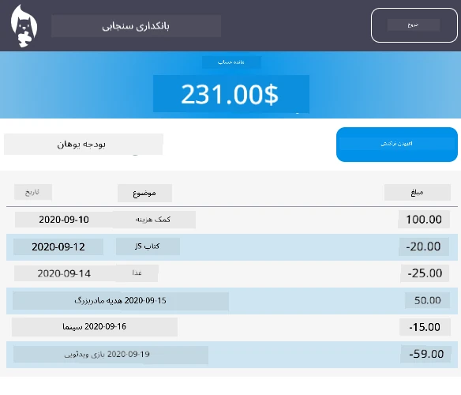

نمی‌خواهیم دقیقاً همین را پیاده کنید - از آن به عنوان الهام استفاده کنید و آن را به سبک خودتان بسازید!

## آزمون پس از جلسه

[آزمون پس از جلسه](https://ff-quizzes.netlify.app/web/quiz/46)

## تکلیف

[بازنویسی و حاشیه‌نویسی کد خود](assignment.md)

---

<!-- CO-OP TRANSLATOR DISCLAIMER START -->
**سلب مسئولیت**:  
این سند با استفاده از سرویس ترجمه هوش مصنوعی [Co-op Translator](https://github.com/Azure/co-op-translator) ترجمه شده است. اگرچه ما به دنبال دقت هستیم، لطفاً توجه داشته باشید که ترجمه‌های خودکار ممکن است حاوی خطا یا نواقصی باشند. سند اصلی به زبان مادری خود باید به عنوان منبع معتبر در نظر گرفته شود. برای اطلاعات مهم، ترجمه حرفه‌ای انسانی توصیه می‌شود. ما مسئول هرگونه سوء تفاهم یا تفسیر نادرست ناشی از استفاده از این ترجمه نیستیم.
<!-- CO-OP TRANSLATOR DISCLAIMER END -->