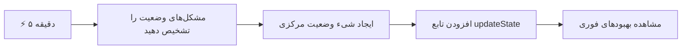
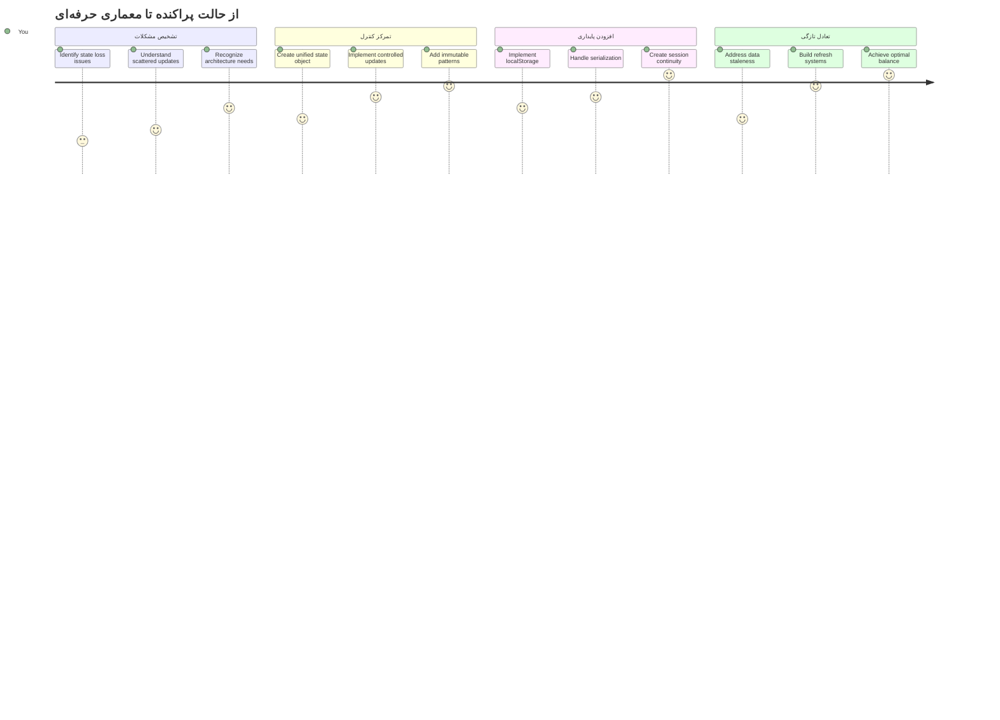
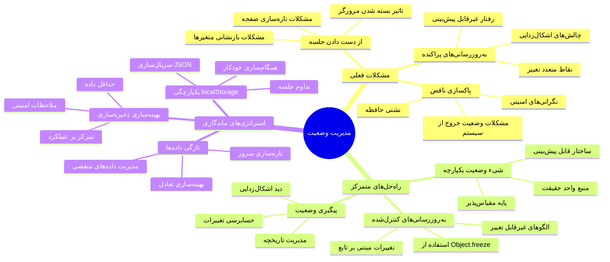
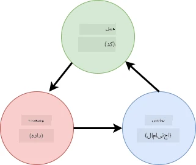
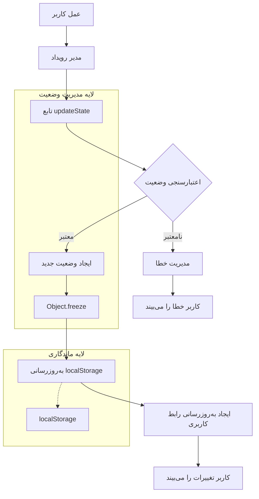
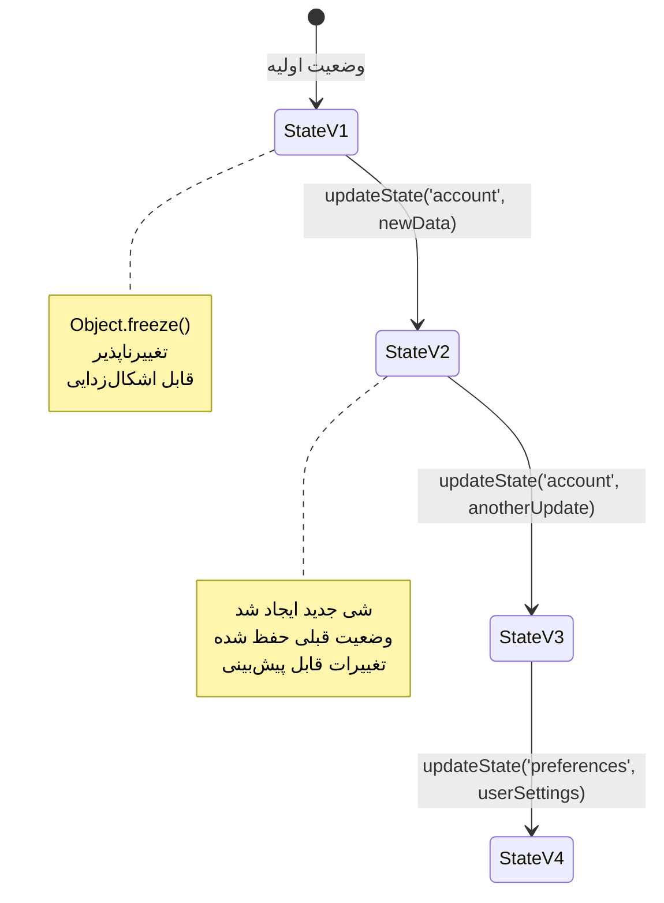
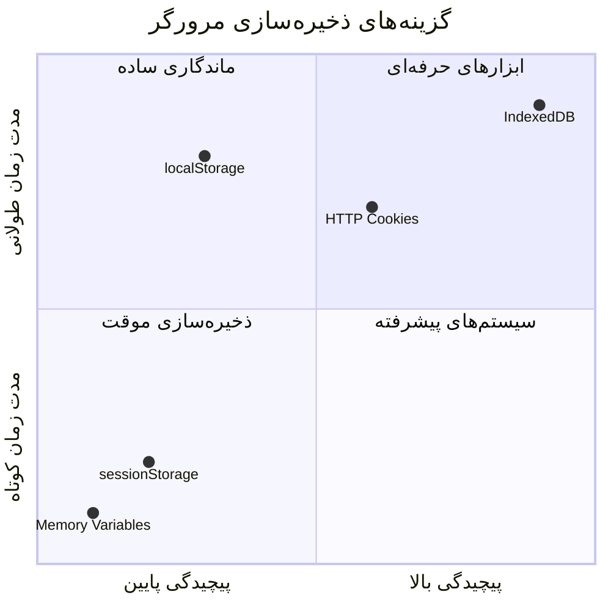
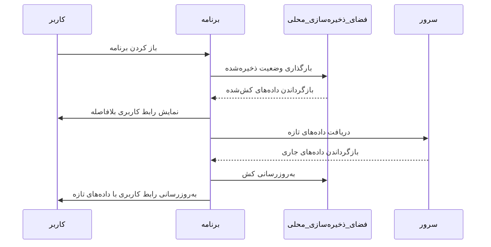
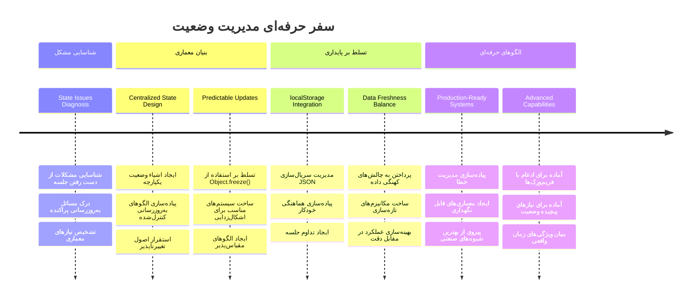

# ساخت اپلیکیشن بانکی بخش ۴: مفاهیم مدیریت وضعیت

## ⚡ کاری که می‌توانید در ۵ دقیقه بعد انجام دهید

**مسیر شروع سریع برای توسعه‌دهندگان پرمشغله**


- **دقیقه ۱**: مسئله وضعیت فعلی را آزمایش کنید - وارد شوید، صفحه را تازه کنید، خروج از سیستم را مشاهده کنید
- **دقیقه ۲**: جایگزین کردن `let account = null` با `let state = { account: null }`
- **دقیقه ۳**: ایجاد یک تابع ساده `updateState()` برای به‌روزرسانی‌های کنترل‌شده
- **دقیقه ۴**: یک تابع را برای استفاده از الگوی جدید به‌روزرسانی کنید
- **دقیقه ۵**: قابلیت پیش‌بینی و اشکال‌زدایی بهبود یافته را آزمایش کنید

**آزمون تشخیصی سریع**:
```javascript
// قبل: حالت پراکنده
let account = null; // با تازه‌سازی از دست رفت!

// بعد: حالت متمرکز
let state = Object.freeze({ account: null }); // کنترل‌شده و قابل ردیابی!
```

**چرا این مهم است**: در ۵ دقیقه، تبدیل مدیریت وضعیت پراکنده به الگوهای قابل پیش‌بینی و اشکال‌زدایی شده را تجربه خواهید کرد. این اساس است که برنامه‌های پیچیده را قابل نگهداری می‌کند.

## 🗺️ مسیر یادگیری شما در تسلط بر مدیریت وضعیت


**مقصد مسیر شما**: تا پایان این درس، یک سیستم مدیریت وضعیت حرفه‌ای ساخته‌اید که با حفظ اطلاعات، تازگی داده‌ها و به‌روزرسانی‌های قابل پیش‌بینی کار می‌کند - همان الگوهایی که در برنامه‌های تولیدی استفاده می‌شوند.

## آزمون پیش از درس

[آزمون پیش‌درس](https://ff-quizzes.netlify.app/web/quiz/47)

## مقدمه

مدیریت وضعیت مثل سیستم ناوبری فضاپیمای وویجر است – وقتی همه چیز به خوبی کار می‌کند، تقریباً متوجه آن نمی‌شوید. اما وقتی مشکل پیش می‌آید، تفاوت بین رسیدن به فضای بین‌ستاره‌ای و سرگردانی در خلأ کیهانی است. در توسعه وب، وضعیت نمایانگر هر چیزی است که برنامه شما باید به خاطر بسپارد: وضعیت ورود کاربر، داده‌های فرم، تاریخچه ناوبری و وضعیت‌های موقت رابط کاربری.

وقتی اپلیکیشن بانکی شما از یک فرم ورود ساده به برنامه‌ای پیچیده‌تر تبدیل شده، احتمالاً با چالش‌های رایجی روبه‌رو شده‌اید. صفحه را تازه کنید و کاربران ناگهان خارج می‌شوند. مرورگر را ببندید و همه پیشرفت‌ها ناپدید می‌شود. هنگام اشکال‌زدایی، مجبورید در میان توابع مختلف که همه داده‌ها را به روش‌های متفاوت تغییر می‌دهند بگردید.

این‌ها نشانه برنامه‌نویسی ضعیف نیستند – این دردهای رشدی طبیعی هستند که وقتی برنامه‌ها به سطحی از پیچیدگی می‌رسند، اتفاق می‌افتند. هر توسعه‌دهنده‌ای این چالش‌ها را هنگام گذار برنامه‌های خود از «نمونه اولیه» به «آماده تولید» تجربه می‌کند.

در این درس، یک سیستم مدیریت وضعیت متمرکز را پیاده‌سازی خواهیم کرد که اپلیکیشن بانکی شما را به برنامه‌ای قابل اعتماد و حرفه‌ای تبدیل می‌کند. یاد می‌گیرید که جریان داده‌ها را به شکل قابل پیش‌بینی مدیریت کنید، نشست‌های کاربر را به‌درستی حفظ کنید و تجربه کاربری روانی که برنامه‌های وب مدرن نیاز دارند ایجاد کنید.

## پیش‌نیازها

قبل از ورود به مفاهیم مدیریت وضعیت، باید محیط توسعه خود را به درستی راه‌اندازی کرده و پایه‌های اپ بانکی خود را آماده داشته باشید. این درس مستقیماً بر روی مفاهیم و کدهای بخش‌های قبلی این سری ساخته شده است.

اطمینان حاصل کنید که پیش از ادامه، موارد زیر آماده هستند:

**راه‌اندازی مورد نیاز:**
- درس [دریافت داده‌ها](../3-data/README.md) را کامل کنید - برنامه شما باید بتواند به‌درستی داده‌های حساب را بارگذاری و نمایش دهد
- نصب [Node.js](https://nodejs.org) روی سیستم برای اجرای API بک‌اند
- اجرای API سرور محلی برای مدیریت عملیات داده‌های حساب از [مستندات API](../api/README.md)

**آزمایش محیط شما:**

برای اطمینان از اجرای صحیح سرور API، دستور زیر را در ترمینال اجرا کنید:

```sh
curl http://localhost:5000/api
# -> باید "Bank API v1.0.0" را به عنوان نتیجه بازگرداند
```

**عملکرد این دستور:**
- **ارسال** درخواست GET به سرور API محلی شما
- **آزمون** اتصال و بررسی پاسخ‌دهی سرور
- **بازگرداندن** اطلاعات نسخه API در صورت عملکرد صحیح

## 🧠 نمای کلی معماری مدیریت وضعیت


**اصل اساسی**: مدیریت وضعیت حرفه‌ای تعادل بین پیش‌بینی‌پذیری، حفظ داده و عملکرد برقرار می‌کند تا تجربه‌های کاربری قابل اعتمادی ایجاد شود که از تعاملات ساده تا جریان‌های کاری پیچیده برنامه‌ها را پشتیبانی کنند.

---

## تشخیص مشکلات وضعیت فعلی

مثل شرلوک هلمز که صحنه جرم را بررسی می‌کند، باید دقیقاً بفهمیم در پیاده‌سازی فعلی چه اتفاقی می‌افتد قبل از آنکه معمای ناپدید شدن نشست‌های کاربر را حل کنیم.

بیایید آزمایشی ساده انجام دهیم که چالش‌های مدیریت وضعیت را نشان می‌دهد:

**🧪 این آزمون تشخیصی را امتحان کنید:**
۱. وارد اپ بانکی خود شوید و به داشبورد بروید  
۲. صفحه مرورگر را تازه کنید  
۳. ببینید وضعیت ورود شما چه اتفاقی می‌افتد  

اگر به صفحه ورود هدایت شدید، با مشکل کلاسیک عدم حفظ وضعیت نشست مواجه شده‌اید. این رفتار به این دلیل اتفاق می‌افتد که پیاده‌سازی فعلی داده‌های کاربر را در متغیرهای جاوااسکریپت ذخیره می‌کند که با هر بار بارگذاری صفحه ریست می‌شوند.

**مشکلات پیاده‌سازی فعلی:**

متغیر ساده `account` از درس قبلی ما [درس ۳](../3-data/README.md) سه مشکل مهم ایجاد می‌کند که هم بر تجربه کاربر و هم بر قابلیت نگهداری کد تأثیر می‌گذارد:

| مشکل | علت فنی | تاثیر بر کاربر |
|---------|--------|----------------|
| **از دست رفتن نشست** | تازه شدن صفحه متغیرهای جاوااسکریپت را پاک می‌کند | کاربران باید مرتباً دوباره وارد شوند |
| **به‌روزرسانی‌های پراکنده** | چندین تابع مستقیماً حالت را تغییر می‌دهند | اشکال‌زدایی دشوارتر می‌شود |
| **پاک‌سازی ناقص** | خروج از سیستم همه ارجاعات وضعیت را پاک نمی‌کند | نگرانی‌های امنیتی و حریم خصوصی بالقوه |

**چالش معماری:**

مثل طراحی بخش‌بندی شده کشتی تایتانیک که ظاهراً مستحکم بود تا زمانی که چندین بخش همزمان آب‌گرفته شدند، رفع این مشکلات به صورت جداگانه، مشکل معماری زمینه‌ای را حل نمی‌کند. ما نیازمند یک راه‌حل جامع مدیریت وضعیت هستیم.

> 💡 **هدف واقعی ما چیست؟**

[مدیریت وضعیت](https://en.wikipedia.org/wiki/State_management) در واقع حل دو معمای بنیادی است:

۱. **داده‌هایم کجاست؟**: پیگیری اطلاعات موجود و منبع آن  
۲. **آیا همه یکسان هستند؟**: اطمینان از اینکه آنچه کاربر می‌بیند با واقعیت تطابق دارد  

**برنامه عملی ما:**

به جای دور خود چرخیدن، می‌خواهیم یک سیستم **مدیریت وضعیت متمرکز** بسازیم. مثل داشتن یک نفر بسیار منظم در مسئولیت همه امور مهم:




**درک این جریان داده:**
- **متمرکز کردن** همه وضعیت برنامه در یک محل  
- **مسیر دادن** همه تغییرات وضعیت از طریق توابع کنترل‌شده  
- **اطمینان** از همگام بودن رابط کاربری با وضعیت فعلی  
- **ارائه** یک الگوی واضح و قابل پیش‌بینی برای مدیریت داده  

> 💡 **نکته حرفه‌ای**: این درس بر مفاهیم بنیادی تمرکز دارد. برای برنامه‌های پیچیده‌تر، کتابخانه‌هایی مانند [Redux](https://redux.js.org) ویژگی‌های پیشرفته‌تر مدیریت وضعیت را ارائه می‌دهند. درک این اصول اساسی به شما کمک می‌کند تا هر کتابخانه مدیریت وضعیتی را مسلط شوید.

> ⚠️ **موضوع پیشرفته**: ما به‌روزرسانی‌های خودکار رابط کاربری که توسط تغییرات وضعیت ایجاد می‌شوند را پوشش نمی‌دهیم، زیرا این مبحث شامل مفاهیم [برنامه‌نویسی واکنشی](https://en.wikipedia.org/wiki/Reactive_programming) است. این یک گام عالی برای ادامه مسیر یادگیری شماست!

### وظیفه: متمرکز کردن ساختار وضعیت

بیایید شروع کنیم به تبدیل مدیریت وضعیت پراکنده به سیستمی متمرکز. این گام اول پایه همه بهبودهای بعدی است.

**گام ۱: ایجاد شیء وضعیت مرکزی**

بیانیه ساده `account` را جایگزین کنید:

```js
let account = null;
```

با یک شیء وضعیت ساختاریافته:

```js
let state = {
  account: null
};
```

**چرا این تغییر مهم است:**
- **مرکزیت** همه داده‌های برنامه در یک محل  
- **آماده‌سازی** ساختار برای افزودن ویژگی‌های بیشتر به وضعیت در آینده  
- **ایجاد** مرز واضح بین وضعیت و سایر متغیرها  
- **برقرار کردن** الگویی که با رشد برنامه شما مقیاس‌پذیر است  

**گام ۲: به‌روزرسانی الگوهای دسترسی به وضعیت**

توابع خود را به گونه‌ای به‌روزرسانی کنید که از ساختار جدید وضعیت استفاده کنند:

**در توابع `register()` و `login()`، جایگزین کنید:**
```js
account = ...
```

با:
```js
state.account = ...
```

**در تابع `updateDashboard()`، این خط را در بالای تابع اضافه کنید:**
```js
const account = state.account;
```

**هدف این به‌روزرسانی‌ها:**
- **حفظ** عملکرد موجود در حالی که ساختار بهبود می‌یابد  
- **آماده‌سازی** کد برای مدیریت وضعیت پیچیده‌تر  
- **ایجاد** الگوهای سازگار برای دسترسی به داده‌های وضعیت  
- **برقرار کردن** پایه برای به‌روزرسانی‌های مرکزی وضعیت  

> 💡 **توجه**: این بازسازی مشکلات ما را فوراً حل نمی‌کند، اما پایه ضروری برای بهبودهای قدرتمند آینده را می‌گذارد!

### 🎯 بررسی آموزشی: اصول مرکزیت

**توقف و تأمل**: شما تازه پایه مدیریت متمرکز وضعیت را پیاده‌سازی کرده‌اید. این یک تصمیم معماری حیاتی است.

**خودارزیابی سریع**:
- چرا متمرکز کردن وضعیت در یک شیء بهتر از پراکنده کردن متغیرها است؟  
- چه اتفاقی می‌افتد اگر فراموش کنید تابعی را برای استفاده از `state.account` به‌روزرسانی کنید؟  
- چگونه این الگو کد شما را برای ویژگی‌های پیشرفته‌تر آماده می‌کند؟  

**ارتباط دنیای واقعی**: الگوی مرکزیت که یاد گرفته‌اید پایه فریم‌ورک‌های مدرن مانند Redux، Vuex و React Context است. شما همان تفکر معماری را می‌سازید که در برنامه‌های بزرگ استفاده می‌شود.

**سؤال چالشی**: اگر بخواهید ترجیحات کاربر (پوسته، زبان) را به برنامه اضافه کنید، کجا در ساختار وضعیت این کار را می‌کنید؟ این چطور مقیاس‌پذیر خواهد بود؟

## پیاده‌سازی به‌روزرسانی‌های کنترل‌شده وضعیت

پس از متمرکز شدن وضعیت، گام بعدی ایجاد مکانیزم‌های کنترل‌شده برای تغییرات داده است. این رویکرد تضمین می‌کند تغییرات وضعیت قابل پیش‌بینی باشد و اشکال‌زدایی آسان‌تر شود.

اصل اصلی شبیه به کنترل ترافیک هوایی است: به جای اجازه دادن به چندین تابع که وضعیت را به صورت مستقل تغییر دهند، همه تغییرات را از طریق یک تابع کنترل‌شده عبور می‌دهیم. این الگو کنترل روشن زمان و نحوه تغییر داده‌ها را فراهم می‌کند.

**مدیریت وضعیت غیرقابل تغییر:**

ما شیء `state` را به صورت [*غیرقابل تغییر*](https://en.wikipedia.org/wiki/Immutable_object) رفتار خواهیم داد، یعنی هرگز مستقیماً آن را تغییر نمی‌دهیم. در عوض، هر تغییر یک شیء وضعیت جدید با داده‌های به‌روزشده ایجاد می‌کند.

اگرچه ممکن است این رویکرد در ابتدا نسبت به تغییرات مستقیم ناکارآمد به نظر برسد، اما مزایای قابل توجهی برای اشکال‌زدایی، تست و حفظ قابلیت پیش‌بینی برنامه دارد.

**مزایای مدیریت وضعیت غیرقابل تغییر:**

| مزیت | توضیح | تاثیر |
|---------|-------------|--------|
| **قابلیت پیش‌بینی** | تغییرات فقط از طریق توابع کنترل‌شده اتفاق می‌افتد | آسان‌تر کردن اشکال‌زدایی و تست |
| **پیگیری تاریخچه** | هر تغییر حالت یک شیء جدید ایجاد می‌کند | امکان پیاده‌سازی عملکرد برگشت/ازسرگیری |
| **جلوگیری از اثرات جانبی** | هیچ تغییر تصادفی رخ نمی‌دهد | از بروز باگ‌های مرموز جلوگیری می‌کند |
| **بهینه‌سازی عملکرد** | تشخیص آسان تغییر وضعیت واقعی | به‌روزرسانی‌های بهینه رابط کاربری |

**غیرقابل تغییر کردن در جاوااسکریپت با `Object.freeze()`:**

جاوااسکریپت [`Object.freeze()`](https://developer.mozilla.org/docs/Web/JavaScript/Reference/Global_Objects/Object/freeze) را برای جلوگیری از تغییر اشیاء ارائه می‌دهد:

```js
const immutableState = Object.freeze({ account: userData });
// هر تلاشی برای تغییر immutableState باعث ایجاد خطا می‌شود
```

**توضیح اتفاقات اینجا:**
- **جلوگیری** از اختصاص مستقیم یا حذف ویژگی‌ها  
- **ایجاد استثناء** در صورت تلاش برای تغییر  
- **اطمینان** که تغییرات وضعیت باید از توابع کنترل‌شده عبور کند  
- **ایجاد** قرارداد واضح برای نحوه به‌روزرسانی وضعیت  

> 💡 **مطالعه بیشتر**: درباره تفاوت *کنترل تغییرات سطحی* و *کنترل تغییرات عمیق* در اشیاء در [مستندات MDN](https://developer.mozilla.org/docs/Web/JavaScript/Reference/Global_Objects/Object/freeze#What_is_shallow_freeze) بیاموزید. درک این تمایز برای ساختارهای وضعیت پیچیده بسیار مهم است.


### وظیفه

یک تابع جدید `updateState()` ایجاد کنیم:

```js
function updateState(property, newData) {
  state = Object.freeze({
    ...state,
    [property]: newData
  });
}
```

در این تابع، یک شیء وضعیت جدید ایجاد می‌کنیم و با استفاده از [عملگر پراکندگی (`...`)](https://developer.mozilla.org/docs/Web/JavaScript/Reference/Operators/Spread_syntax#Spread_in_object_literals) داده‌ها را از وضعیت قبلی کپی می‌کنیم. سپس یک ویژگی خاص از شیء وضعیت را با داده‌های جدید با استفاده از نماد [براکت](https://developer.mozilla.org/docs/Web/JavaScript/Guide/Working_with_Objects#Objects_and_properties) `[property]` به روز می‌کنیم. در نهایت، شیء را با `Object.freeze()` قفل می‌کنیم تا از تغییرات جلوگیری کنیم. فعلاً فقط ویژگی `account` در وضعیت ذخیره شده است، اما با این روش می‌توانید هر تعداد ویژگی که نیاز دارید به وضعیت اضافه کنید.

همچنین مقداردهی اولیه `state` را به‌روزرسانی می‌کنیم تا مطمئن شویم وضعیت اولیه نیز قفل شده است:

```js
let state = Object.freeze({
  account: null
});
```

بعد از آن، تابع `register` را با جایگزین کردن مقداردهی `state.account = result;` به شکل زیر به‌روزرسانی کنید:

```js
updateState('account', result);
```

همین کار را با تابع `login` انجام دهید و `state.account = data;` را با:

```js
updateState('account', data);
```

اکنون فرصت را غنیمت می‌شماریم و مشکل پاک نشدن داده حساب هنگام کلیک کاربر روی *خروج* را رفع می‌کنیم.

یک تابع جدید `logout()` ایجاد کنید:

```js
function logout() {
  updateState('account', null);
  navigate('/login');
}
```

در `updateDashboard()`، انتقال به آدرس `return navigate('/login');` را با `return logout()` جایگزین کنید.

ثبت نام حساب جدید، خارج شدن و مجدداً وارد شدن را امتحان کنید تا ببینید همه چیز به درستی کار می‌کند.

> نکته: می‌توانید تمام تغییرات وضعیت را با افزودن `console.log(state)` در پایین تابع `updateState()` مشاهده کرده و کنسول ابزارهای توسعه مرورگر خود را باز کنید.

## پیاده‌سازی حفظ داده‌ها

مشکل از دست رفتن نشست که پیش‌تر شناسایی کردیم نیازمند راه‌حلی برای حفظ داده‌هاست که وضعیت کاربر را در طول نشست‌های مرورگر حفظ کند. این برنامه را از تجربه‌ای موقتی به ابزار قابل اعتماد و حرفه‌ای تبدیل می‌کند.

تصور کنید ساعت‌های اتمی چگونه زمان دقیق را حتی هنگام قطع برق با ذخیره حالت مهم در حافظه غیر فرّار حفظ می‌کنند. به همین ترتیب، برنامه‌های وب نیازمند مکانیزم‌های ذخیره‌سازی ماندگار برای حفظ داده‌های ضروری کاربران در جلسات مرورگر و تازه‌سازی صفحه هستند.

**سؤالات استراتژیک برای حفظ داده:**

قبل از پیاده‌سازی حفظ داده، به این عوامل حیاتی توجه کنید:

| سؤال | زمینه اپ بانکی | تاثیر تصمیم |
|----------|-------------------|----------------|
| **آیا داده حساس است؟** | موجودی حساب، تاریخچه تراکنش‌ها | انتخاب روش‌های ذخیره‌سازی امن |
| **چقدر باید پایدار باشد؟** | وضعیت ورود به سیستم در مقابل تنظیمات موقت رابط کاربری | مدت ذخیره‌سازی مناسب را انتخاب کنید |
| **آیا سرور به آن نیاز دارد؟** | توکن‌های احراز هویت در مقابل تنظیمات رابط کاربری | نیازهای اشتراک‌گذاری را تعیین کنید |

**گزینه‌های ذخیره‌سازی مرورگر:**

مرورگرهای مدرن چندین سازوکار ذخیره‌سازی ارائه می‌دهند که هر کدام برای موارد استفاده مختلف طراحی شده‌اند:

**رابط‌های اصلی ذخیره‌سازی:**

1. **[`localStorage`](https://developer.mozilla.org/docs/Web/API/Window/localStorage)**: ذخیره‌سازی ثابت [کلید/مقدار](https://en.wikipedia.org/wiki/Key%E2%80%93value_database)
   - داده‌ها را برای جلسات مرورگر به صورت نامحدود **حفظ می‌کند**  
   - در راه‌اندازی مجدد مرورگر و راه‌اندازی مجدد رایانه **زنده می‌ماند**
   - به دامنه وب‌سایت خاص **محدود شده است**
   - برای تنظیمات کاربر و وضعیت ورود به سیستم **عالی است**

2. **[`sessionStorage`](https://developer.mozilla.org/docs/Web/API/Window/sessionStorage)**: ذخیره موقت جلسه
   - در جلسات فعال به طور مشابه با localStorage **عمل می‌کند**
   - هنگام بسته شدن تب مرورگر به صورت خودکار **پاک می‌شود**
   - برای داده‌های موقتی که نباید پایدار باشند، **ایده‌آل است**

3. **[HTTP Cookies](https://developer.mozilla.org/docs/Web/HTTP/Cookies)**: ذخیره‌سازی اشتراکی سرور
   - به صورت خودکار با هر درخواست سرور **ارسال می‌شود**
   - برای توکن‌های [احراز هویت](https://en.wikipedia.org/wiki/Authentication) **مناسب است**
   - محدودیت اندازه دارد و می‌تواند بر عملکرد تأثیر بگذارد

**نیاز به سریال‌سازی داده:**

هر دو `localStorage` و `sessionStorage` فقط [رشته‌ها](https://developer.mozilla.org/docs/Web/JavaScript/Reference/Global_Objects/String) را ذخیره می‌کنند:

```js
// تبدیل اشیاء به رشته‌های JSON برای ذخیره‌سازی
const accountData = { user: 'john', balance: 150 };
localStorage.setItem('account', JSON.stringify(accountData));

// تبدیل رشته‌های JSON به اشیاء هنگام بازیابی
const savedAccount = JSON.parse(localStorage.getItem('account'));
```

**درک سریال‌سازی:**
- اشیاء جاوااسکریپت را به رشته‌های JSON با استفاده از [`JSON.stringify()`](https://developer.mozilla.org/docs/Web/JavaScript/Reference/Global_Objects/JSON/stringify) تبدیل می‌کند
- اشیاء را از JSON با استفاده از [`JSON.parse()`](https://developer.mozilla.org/docs/Web/JavaScript/Reference/Global_Objects/JSON/parse) بازسازی می‌کند
- اشیاء تو در تو و آرایه‌های پیچیده را به طور خودکار مدیریت می‌کند
- روی توابع، مقادیر undefined و مراجع دایره‌ای خطا می‌دهد

> 💡 **گزینه پیشرفته**: برای برنامه‌های پیچیده آفلاین با مجموعه داده‌های بزرگ، به [`IndexedDB` API](https://developer.mozilla.org/docs/Web/API/IndexedDB_API) فکر کنید. این API یک پایگاه داده کامل سمت مشتری ارائه می‌دهد اما نیاز به پیاده‌سازی پیچیده‌تر دارد.


### وظیفه: پیاده‌سازی ذخیره‌سازی پایدار localStorage

بیایید ذخیره‌سازی پایدار را پیاده‌سازی کنیم تا کاربران تا زمانی که صراحتاً از سیستم خارج نشده‌اند، وارد باقی بمانند. از `localStorage` برای ذخیره داده‌های حساب در جلسات مرورگر استفاده خواهیم کرد.

**گام ۱: تعریف پیکربندی ذخیره‌سازی**

```js
const storageKey = 'savedAccount';
```

**این مقدار ثابت چه چیزی فراهم می‌کند:**
- یک شناسه سازگار برای داده‌های ذخیره شده ما **ایجاد می‌کند**
- از اشتباهات املایی در مراجع کلید ذخیره‌سازی **جلوگیری می‌کند**
- تغییر کلید ذخیره‌سازی را آسان می‌کند اگر لازم باشد
- بهترین روش‌ها را برای کد قابل نگهداری **دنبال می‌کند**

**گام ۲: اضافه کردن ذخیره‌سازی خودکار**

این خط را در انتهای تابع `updateState()` اضافه کنید:

```js
localStorage.setItem(storageKey, JSON.stringify(state.account));
```

**توضیح کاری که اینجا اتفاق می‌افتد:**
- شیء حساب را به رشته JSON برای ذخیره تبدیل می‌کند
- داده‌ها را با استفاده از کلید ذخیره‌سازی سازگار ما **ذخیره می‌کند**
- هر زمان که وضعیت تغییر کند، به صورت خودکار اجرا می‌شود
- اطمینان می‌دهد که داده‌های ذخیره شده همیشه با وضعیت فعلی هماهنگ هستند

> 💡 **مزیت معماری**: چون همه به‌روزرسانی‌های وضعیت را از طریق `updateState()` متمرکز کردیم، اضافه کردن ذخیره‌سازی فقط نیازمند یک خط کد بود. این نشان‌دهنده قدرت تصمیمات معماری خوب است!

**گام ۳: بازیابی وضعیت هنگام بارگذاری برنامه**

یک تابع مقداردهی اولیه ایجاد کنید تا داده‌های ذخیره شده را بازیابی کند:

```js
function init() {
  const savedAccount = localStorage.getItem(storageKey);
  if (savedAccount) {
    updateState('account', JSON.parse(savedAccount));
  }

  // کد مقداردهی اولیه قبلی ما
  window.onpopstate = () => updateRoute();
  updateRoute();
}

init();
```

**درک فرآیند مقداردهی اولیه:**
- هر داده حساب ذخیره شده قبلی را از localStorage **بازیابی می‌کند**
- رشته JSON را به یک شیء جاوااسکریپت **تجزیه می‌کند**
- با استفاده از تابع کنترل‌شده به‌روزرسانی ما، وضعیت را **به‌روز می‌کند**
- به صورت خودکار جلسه کاربر را هنگام بارگذاری صفحه **بازیابی می‌کند**
- قبل از به‌روزرسانی مسیر اجرا می‌شود تا اطمینان حاصل کند که وضعیت در دسترس است

**گام ۴: بهینه‌سازی مسیر پیش‌فرض**

مسیر پیش‌فرض را برای بهره‌برداری از قابلیت ماندگاری به‌روزرسانی کنید:

در `updateRoute()` جایگزین کنید:
```js
// جایگزین کنید: return navigate('/login');
return navigate('/dashboard');
```

**چرا این تغییر منطقی است:**
- سیستم ماندگاری جدید ما را به طور موثر به‌کار می‌گیرد
- اجازه می‌دهد داشبورد بررسی احراز هویت را انجام دهد
- اگر جلسه ذخیره شده وجود نداشته باشد به طور خودکار به صفحه ورود هدایت می‌کند
- تجربه کاربری روان‌تری ایجاد می‌کند

**آزمایش پیاده‌سازی شما:**

1. وارد برنامه بانکی خود شوید
2. صفحه مرورگر را تازه کنید
3. تأیید کنید که همچنان وارد سیستم باقی مانده‌اید و در داشبورد هستید
4. مرورگر خود را ببندید و دوباره باز کنید
5. به برنامه خود بازگردید و تأیید کنید که هنوز وارد سیستم هستید

🎉 **دستاورد کسب شد**: شما مدیریت وضعیت پایدار را با موفقیت پیاده‌سازی کرده‌اید! برنامه شما اکنون مانند یک برنامه وب حرفه‌ای رفتار می‌کند.

### 🎯 بازبینی آموزشی: معماری ماندگاری

**درک معماری**: شما یک لایه ماندگاری پیشرفته پیاده‌سازی کرده‌اید که تجربه کاربر را با پیچیدگی مدیریت داده‌ها متعادل می‌کند.

**مفاهیم کلیدی تسلط یافته‌شده**:
- **سریال‌سازی JSON**: تبدیل اشیاء پیچیده به رشته‌های ذخیره‌پذیر
- **همگام‌سازی خودکار**: تغییرات وضعیت ذخیره‌سازی پایدار را فعال می‌کند
- **بازیابی جلسه**: برنامه‌ها می‌توانند پس از وقفه‌ها زمینه کاربر را بازیابی کنند
- **ماندگاری متمرکز**: یک تابع به‌روزرسانی همه ذخیره‌سازی‌ها را مدیریت می‌کند

**ارتباط صنعتی**: این الگوی ماندگاری برای برنامه‌های پیش‌رونده وب (PWA)، برنامه‌های آفلاین و تجربیات مدرن وب موبایل پایه است. شما قابلیت‌های سطح تولید را می‌سازید.

**سؤال تفکر**: چگونه این سیستم را برای مدیریت چند حساب کاربری در یک دستگاه تغییر می‌دادید؟ پیامدهای حفظ حریم خصوصی و امنیت را در نظر بگیرید.

## تعادل ماندگاری با تازگی داده‌ها

سیستم ماندگاری ما به خوبی جلسات کاربر را حفظ می‌کند، اما چالش جدیدی ایجاد می‌کند: قدیمی شدن داده‌ها. وقتی چندین کاربر یا برنامه داده‌های یکسان سرور را تغییر می‌دهند، اطلاعات کش شده محلی منسوخ می‌شود.

این وضعیت شبیه به ناوبران وایکینگ است که هم به نقشه‌های ذخیره شده ستاره‌ای و هم به مشاهدات نجومی فعلی تکیه داشتند. نقشه‌ها ثبات را فراهم می‌کردند، اما ناوبران برای جبران شرایط متغیر به مشاهدات تازه نیاز داشتند. به همین ترتیب، برنامه ما هم به وضعیت ماندگار کاربر و هم داده‌های تازه سرور نیاز دارد.

**🧪 کشف مشکل تازگی داده:**

1. با حساب `test` وارد داشبورد شوید
2. این فرمان را در یک ترمینال اجرا کنید تا تراکنش از منبع دیگری شبیه‌سازی شود:

```sh
curl --request POST \
     --header "Content-Type: application/json" \
     --data "{ \"date\": \"2020-07-24\", \"object\": \"Bought book\", \"amount\": -20 }" \
     http://localhost:5000/api/accounts/test/transactions
```

3. صفحه داشبورد مرورگر خود را تازه کنید
4. مشاهده کنید که آیا تراکنش جدید را می‌بینید یا نه

**آنچه این آزمایش نشان می‌دهد:**
- نشان می‌دهد که چگونه ذخیره محلی می‌تواند "کهنه" (منسوخ) شود
- سناریوهای واقعی که در آن تغییرات داده خارج از برنامه شما اتفاق می‌افتد را شبیه‌سازی می‌کند
- تنش بین ماندگاری و تازگی داده را آشکار می‌کند

**چالش کهنه شدن داده:**

| مشکل | علت | تأثیر بر کاربر |
|---------|-------|-------------|
| **داده‌های منسوخ** | localStorage به صورت خودکار هرگز منقضی نمی‌شود | کاربران اطلاعات قدیمی را می‌بینند |
| **تغییرات سرور** | برنامه‌ها/کاربران دیگر داده یکسان را تغییر می‌دهند | دیدگاه‌های ناسازگار در پلتفرم‌ها |
| **کش در مقابل واقعیت** | کش محلی با وضعیت سرور مطابقت ندارد | تجربه کاربری ضعیف و سردرگمی |

**استراتژی راه‌حل:**

ما یک الگوی "تازگی در بارگذاری" پیاده‌سازی می‌کنیم که مزایای ماندگاری را با نیاز به داده‌های تازه متعادل می‌کند. این رویکرد تجربه کاربری روان را حفظ می‌کند و در عین حال دقت داده را تضمین می‌کند.


### وظیفه: پیاده‌سازی سیستم تازه‌سازی داده

ما سیستمی می‌سازیم که داده‌های تازه را به طور خودکار از سرور واکشی کند در حالی که مزایای مدیریت وضعیت پایدار ما را حفظ می‌کند.

**گام ۱: ایجاد به‌روزرسان داده حساب**

```js
async function updateAccountData() {
  const account = state.account;
  if (!account) {
    return logout();
  }

  const data = await getAccount(account.user);
  if (data.error) {
    return logout();
  }

  updateState('account', data);
}
```

**منطق این تابع را درک کنید:**
- بررسی می‌کند که آیا کاربری در حال حاضر وارد شده است (وضعیت.account موجود است)
- اگر جلسه معتبر پیدا نشود به صفحه خروج هدایت می‌کند
- داده حساب تازه را با استفاده از تابع موجود `getAccount()` از سرور دریافت می‌کند
- خطاهای سرور را به شیوه‌ای مناسب با خروج از جلسات نامعتبر مدیریت می‌کند
- وضعیت را با داده تازه با استفاده از سیستم کنترل شده به‌روزرسانی می‌کند
- ذخیره‌سازی خودکار localStorage را از طریق تابع `updateState()` فعال می‌کند

**گام ۲: ایجاد کنترل‌کننده تازه‌سازی داشبورد**

```js
async function refresh() {
  await updateAccountData();
  updateDashboard();
}
```

**این تابع تازه‌سازی چه کاری انجام می‌دهد:**
- فرایند تازه‌سازی داده و به‌روزرسانی رابط کاربری را هماهنگ می‌کند
- قبل از به‌روزرسانی نمایش، منتظر بارگیری داده تازه می‌ماند
- تضمین می‌کند داشبورد جدیدترین اطلاعات را نشان دهد
- جدایی تمیزی بین مدیریت داده و به‌روزرسانی رابط کاربری حفظ می‌کند

**گام ۳: ادغام با سیستم مسیر**

پیکربندی مسیر خود را به‌روزرسانی کنید تا تازه‌سازی به صورت خودکار فعال شود:

```js
const routes = {
  '/login': { templateId: 'login' },
  '/dashboard': { templateId: 'dashboard', init: refresh }
};
```

**این ادغام چگونه کار می‌کند:**
- هر بار که مسیر داشبورد بارگذاری می‌شود، تابع تازه‌سازی اجرا می‌شود
- اطمینان می‌دهد که داده‌های تازه همیشه هنگام ورود کاربران به داشبورد نمایش داده می‌شوند
- ساختار مسیر موجود را حفظ می‌کند و در عین حال تازه‌سازی داده را اضافه می‌کند
- الگوی سازگاری برای مقداردهی اولیه خاص مسیر فراهم می‌کند

**آزمایش سیستم تازه‌سازی داده شما:**

1. وارد برنامه بانکی خود شوید
2. فرمان curl قبلی را اجرا کنید تا تراکنش جدیدی ایجاد شود
3. صفحه داشبورد خود را تازه کنید یا خارج و دوباره وارد شوید
4. تأیید کنید که تراکنش جدید بلافاصله ظاهر می‌شود

🎉 **تعادل کامل برقرار شد**: برنامه شما اکنون تجربه روان وضعیت پایدار را با دقت داده تازه سرور ترکیب می‌کند!

## 📈 جدول زمانی تسلط شما بر مدیریت وضعیت


**🎓 مرحله فارغ‌التحصیلی:** شما یک سیستم کامل مدیریت وضعیت ساخته‌اید که از همان اصولی استفاده می‌کند که Redux، Vuex و دیگر کتابخانه‌های حرفه‌ای وضعیت به‌کار می‌برند. این الگوها از برنامه‌های ساده تا برنامه‌های سازمانی قابل گسترش هستند.

**🔄 قابلیت‌های سطح بعدی**:
- آماده تسلط بر چارچوب‌های مدیریت وضعیت (Redux، Zustand، Pinia)
- آماده پیاده‌سازی ویژگی‌های بلادرنگ با WebSockets
- مجهز به ساخت برنامه‌های Progressive Web App آفلاین
- پایه‌گذاری شده برای الگوهای پیشرفته مانند ماشین‌های حالت و ناظران

## چالش عامل GitHub Copilot 🚀

از حالت Agent برای تکمیل چالش زیر استفاده کنید:

**توضیح:** یک سیستم جامع مدیریت وضعیت با قابلیت بازگشت/پیشروی برای برنامه بانکی پیاده‌سازی کنید. این چالش به شما کمک می‌کند مفاهیم پیشرفته مدیریت وضعیت شامل پیگیری تاریخچه وضعیت، به‌روزرسانی‌های غیرقابل تغییر، و همگام‌سازی رابط کاربری را تمرین کنید.

**دستور:** یک سیستم مدیریت وضعیت پیشرفته ایجاد کنید که شامل: ۱) آرایه تاریخچه وضعیت که همه وضعیت‌های قبلی را ردگیری می‌کند، ۲) توابع بازگشت و پیشروی که می‌توانند به وضعیت‌های قبلی بازگردند، ۳) دکمه‌های رابط کاربری برای عملیات بازگشت/پیشروی در داشبورد، ۴) حداکثر محدودیت تاریخچه ۱۰ وضعیت برای جلوگیری از مشکلات حافظه، و ۵) پاک‌سازی مناسب تاریخچه هنگام خروج کاربر. اطمینان حاصل کنید که قابلیت بازگشت/پیشروی با تغییرات موجودی حساب کار می‌کند و پس از تازه‌سازی مرورگر حفظ می‌شود.

برای اطلاعات بیشتر به [agent mode](https://code.visualstudio.com/blogs/2025/02/24/introducing-copilot-agent-mode) مراجعه کنید.

## 🚀 چالش: بهینه‌سازی ذخیره‌سازی

پیاده‌سازی شما اکنون به طور مؤثر جلسات کاربر، تازه‌سازی داده‌ها، و مدیریت وضعیت را انجام می‌دهد. با این حال، در نظر بگیرید که آیا رویکرد کنونی ما بهینه‌ترین تعادل بین بهره‌وری ذخیره‌سازی و عملکرد را دارد یا خیر.

مانند استادان شطرنج که بین مهره‌های اساسی و سربازان قابل فدا تشخیص قائل می‌شوند، مدیریت وضعیت مؤثر نیازمند شناسایی داده‌هایی است که باید ماندگار باشند در مقابل داده‌هایی که همیشه باید تازه از سرور بارگذاری شوند.

**تحلیل بهینه‌سازی:**

پیاده‌سازی localStorage فعلی خود را ارزیابی کنید و این سؤالات استراتژیک را در نظر بگیرید:
- حداقل اطلاعات مورد نیاز برای حفظ احراز هویت کاربر چیست؟
- کدام داده‌ها آنقدر سریع تغییر می‌کنند که کش محلی فایده چندانی ندارد؟
- چگونه بهینه‌سازی ذخیره‌سازی می‌تواند بدون کاهش تجربه کاربر، عملکرد را بهبود بخشد؟

این نوع تحلیل معماری توسعه‌دهندگان مجرب را متمایز می‌کند که هم عملکرد و هم کارایی را در راه‌حل‌های خود در نظر می‌گیرند.

**استراتژی پیاده‌سازی:**
- داده‌های حیاتی که باید حفظ شوند را شناسایی کنید (احتمالاً فقط شناسه کاربر)
- پیاده‌سازی localStorage خود را اصلاح کنید تا تنها داده جلسه حیاتی ذخیره شود
- اطمینان حاصل کنید که داده‌های تازه همیشه هنگام بازدید از داشبورد از سرور بارگذاری می‌شوند
- تست کنید که رویکرد بهینه‌سازی شده تجربه کاربری مشابه را حفظ می‌کند

**توجه پیشرفته:**
- مزایا و معایب ذخیره کل داده حساب در مقابل فقط توکن‌های احراز هویت را مقایسه کنید
- تصمیمات و استدلال‌های خود را برای اعضای آینده تیم مستندسازی کنید

این چالش به شما کمک می‌کند مانند یک توسعه‌دهنده حرفه‌ای فکر کنید که هم تجربه کاربر و هم کارایی برنامه را در نظر می‌گیرد. با آرامش راهکارهای مختلف را امتحان کنید!

## آزمون پس از درس

[آزمون پس از درس](https://ff-quizzes.netlify.app/web/quiz/48)

## تکلیف

[اجرای گفتگو "افزودن تراکنش"](assignment.md)

نمونه نتیجه پس از تکمیل تکلیف:


---

<!-- CO-OP TRANSLATOR DISCLAIMER START -->
**سلب مسئولیت**:  
این سند با استفاده از سرویس ترجمه هوش مصنوعی [Co-op Translator](https://github.com/Azure/co-op-translator) ترجمه شده است. در حالی که ما در تلاش برای دقت هستیم، لطفاً توجه داشته باشید که ترجمه‌های خودکار ممکن است دارای خطاها یا نادرستی‌هایی باشند. سند اصلی به زبان مادری آن باید به عنوان منبع معتبر در نظر گرفته شود. برای اطلاعات حیاتی، ترجمه حرفه‌ای انسانی توصیه می‌شود. ما در قبال هرگونه سوءتفاهم یا برداشت نادرست ناشی از استفاده از این ترجمه مسئولیتی نداریم.
<!-- CO-OP TRANSLATOR DISCLAIMER END -->