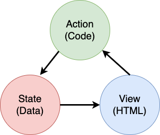

<!--
CO_OP_TRANSLATOR_METADATA:
{
  "original_hash": "b46acf79da8550d76445eed00b06c878",
  "translation_date": "2025-10-03T12:47:15+00:00",
  "source_file": "7-bank-project/4-state-management/README.md",
  "language_code": "fa"
}
-->
# ساخت اپلیکیشن بانکی قسمت ۴: مفاهیم مدیریت وضعیت

## آزمون پیش از درس

[آزمون پیش از درس](https://ff-quizzes.netlify.app/web/quiz/47)

### مقدمه

با رشد یک اپلیکیشن وب، پیگیری جریان‌های داده‌ای دشوار می‌شود. کدام کد داده‌ها را دریافت می‌کند، کدام صفحه آن‌ها را مصرف می‌کند، کجا و چه زمانی باید به‌روزرسانی شوند... به‌راحتی ممکن است کدی نامرتب ایجاد شود که نگهداری آن دشوار باشد. این موضوع به‌ویژه زمانی صادق است که نیاز به اشتراک‌گذاری داده‌ها بین صفحات مختلف اپلیکیشن خود دارید، مانند داده‌های کاربر. مفهوم *مدیریت وضعیت* همیشه در انواع برنامه‌ها وجود داشته است، اما با افزایش پیچیدگی اپلیکیشن‌های وب، اکنون به یک نکته کلیدی در توسعه تبدیل شده است.

در این بخش پایانی، اپلیکیشنی که ساخته‌ایم را بررسی می‌کنیم تا نحوه مدیریت وضعیت را بازنگری کنیم، به‌طوری که از تازه‌سازی مرورگر در هر نقطه پشتیبانی کند و داده‌ها را در جلسات کاربری حفظ کند.

### پیش‌نیاز

برای این درس، باید بخش [دریافت داده‌ها](../3-data/README.md) از اپلیکیشن وب را تکمیل کرده باشید. همچنین باید [Node.js](https://nodejs.org) را نصب کنید و [سرور API](../api/README.md) را به‌صورت محلی اجرا کنید تا بتوانید داده‌های حساب را مدیریت کنید.

برای اطمینان از اجرای صحیح سرور، می‌توانید این دستور را در ترمینال اجرا کنید:

```sh
curl http://localhost:5000/api
# -> should return "Bank API v1.0.0" as a result
```

---

## بازنگری مدیریت وضعیت

در [درس قبلی](../3-data/README.md)، یک مفهوم ابتدایی از وضعیت را در اپلیکیشن خود با متغیر جهانی `account` معرفی کردیم که داده‌های بانکی کاربر وارد شده را ذخیره می‌کند. با این حال، پیاده‌سازی فعلی ما دارای برخی نقص‌ها است. صفحه را در داشبورد تازه‌سازی کنید. چه اتفاقی می‌افتد؟

کد فعلی ما سه مشکل دارد:

- وضعیت حفظ نمی‌شود، زیرا تازه‌سازی مرورگر شما را به صفحه ورود بازمی‌گرداند.
- چندین تابع وضعیت را تغییر می‌دهند. با رشد اپلیکیشن، این موضوع می‌تواند پیگیری تغییرات را دشوار کند و به‌راحتی ممکن است به‌روزرسانی یکی از آن‌ها فراموش شود.
- وضعیت پاک نمی‌شود، بنابراین وقتی روی *خروج* کلیک می‌کنید، داده‌های حساب همچنان وجود دارند، حتی اگر در صفحه ورود باشید.

می‌توانیم کد خود را به‌گونه‌ای به‌روزرسانی کنیم که این مشکلات را یکی‌یکی حل کنیم، اما این کار باعث ایجاد تکرار کد بیشتر و پیچیده‌تر شدن اپلیکیشن می‌شود. یا می‌توانیم چند دقیقه مکث کنیم و استراتژی خود را بازنگری کنیم.

> واقعاً چه مشکلاتی را می‌خواهیم حل کنیم؟

[مدیریت وضعیت](https://en.wikipedia.org/wiki/State_management) به یافتن یک رویکرد مناسب برای حل این دو مشکل خاص مربوط می‌شود:

- چگونه جریان‌های داده‌ای در یک اپلیکیشن قابل فهم نگه داشته شوند؟
- چگونه داده‌های وضعیت همیشه با رابط کاربری هماهنگ باشند (و بالعکس)؟

پس از رسیدگی به این موارد، هر مشکل دیگری که ممکن است داشته باشید یا قبلاً حل شده است یا آسان‌تر قابل حل خواهد بود. روش‌های زیادی برای حل این مشکلات وجود دارد، اما ما از یک راه‌حل رایج استفاده می‌کنیم که شامل **متمرکز کردن داده‌ها و روش‌های تغییر آن‌ها** است. جریان‌های داده‌ای به این صورت خواهند بود:



> در اینجا بخشی که داده‌ها به‌طور خودکار به‌روزرسانی نمای را تحریک می‌کنند، پوشش داده نمی‌شود، زیرا به مفاهیم پیشرفته‌تر [برنامه‌نویسی واکنشی](https://en.wikipedia.org/wiki/Reactive_programming) مرتبط است. این موضوع می‌تواند یک موضوع پیگیری خوب باشد اگر به دنبال یک بررسی عمیق هستید.

✅ کتابخانه‌های زیادی با رویکردهای مختلف برای مدیریت وضعیت وجود دارند، [Redux](https://redux.js.org) یکی از گزینه‌های محبوب است. نگاهی به مفاهیم و الگوهای استفاده شده بیندازید، زیرا اغلب راه خوبی برای یادگیری مشکلات احتمالی در اپلیکیشن‌های وب بزرگ و نحوه حل آن‌ها است.

### وظیفه

با کمی بازسازی شروع می‌کنیم. اعلان `account` را جایگزین کنید:

```js
let account = null;
```

با:

```js
let state = {
  account: null
};
```

ایده این است که *تمام داده‌های اپلیکیشن* خود را در یک شیء وضعیت واحد متمرکز کنیم. در حال حاضر فقط `account` در وضعیت داریم، بنابراین تغییر زیادی ایجاد نمی‌شود، اما راهی برای تکامل ایجاد می‌کند.

همچنین باید توابعی که از آن استفاده می‌کنند را به‌روزرسانی کنیم. در توابع `register()` و `login()`، `account = ...` را با `state.account = ...` جایگزین کنید.

در ابتدای تابع `updateDashboard()`، این خط را اضافه کنید:

```js
const account = state.account;
```

این بازسازی به‌تنهایی بهبود زیادی ایجاد نکرد، اما ایده این بود که پایه‌ای برای تغییرات بعدی ایجاد شود.

## پیگیری تغییرات داده‌ها

اکنون که شیء `state` را برای ذخیره داده‌های خود ایجاد کرده‌ایم، گام بعدی متمرکز کردن به‌روزرسانی‌ها است. هدف این است که پیگیری هرگونه تغییر و زمان وقوع آن‌ها آسان‌تر شود.

برای جلوگیری از ایجاد تغییرات در شیء `state`، همچنین یک تمرین خوب است که آن را [*غیرقابل تغییر*](https://en.wikipedia.org/wiki/Immutable_object) در نظر بگیریم، به این معنی که اصلاً نمی‌توان آن را تغییر داد. این همچنین به این معنی است که اگر بخواهید چیزی را در آن تغییر دهید، باید یک شیء وضعیت جدید ایجاد کنید. با انجام این کار، از اثرات جانبی [ناخواسته](https://en.wikipedia.org/wiki/Side_effect_(computer_science)) محافظت می‌کنید و امکان ایجاد ویژگی‌های جدید در اپلیکیشن خود مانند پیاده‌سازی undo/redo را فراهم می‌کنید، در حالی که اشکال‌زدایی را نیز آسان‌تر می‌کنید. برای مثال، می‌توانید هر تغییر ایجاد شده در وضعیت را ثبت کنید و تاریخچه تغییرات را نگه دارید تا منبع یک اشکال را درک کنید.

در جاوااسکریپت، می‌توانید از [`Object.freeze()`](https://developer.mozilla.org/docs/Web/JavaScript/Reference/Global_Objects/Object/freeze) برای ایجاد نسخه غیرقابل تغییر یک شیء استفاده کنید. اگر سعی کنید تغییراتی در یک شیء غیرقابل تغییر ایجاد کنید، یک استثنا ایجاد خواهد شد.

✅ آیا تفاوت بین یک شیء غیرقابل تغییر *سطحی* و *عمیق* را می‌دانید؟ می‌توانید درباره آن [اینجا](https://developer.mozilla.org/docs/Web/JavaScript/Reference/Global_Objects/Object/freeze#What_is_shallow_freeze) بخوانید.

### وظیفه

بیایید یک تابع جدید `updateState()` ایجاد کنیم:

```js
function updateState(property, newData) {
  state = Object.freeze({
    ...state,
    [property]: newData
  });
}
```

در این تابع، یک شیء وضعیت جدید ایجاد می‌کنیم و داده‌ها را از وضعیت قبلی با استفاده از [عملگر *گسترش (`...`)*](https://developer.mozilla.org/docs/Web/JavaScript/Reference/Operators/Spread_syntax#Spread_in_object_literals) کپی می‌کنیم. سپس یک ویژگی خاص از شیء وضعیت را با داده‌های جدید با استفاده از [نشانه‌گذاری براکت](https://developer.mozilla.org/docs/Web/JavaScript/Guide/Working_with_Objects#Objects_and_properties) `[property]` برای تخصیص بازنویسی می‌کنیم. در نهایت، شیء را قفل می‌کنیم تا از تغییرات جلوگیری کنیم با استفاده از `Object.freeze()`. در حال حاضر فقط ویژگی `account` در وضعیت ذخیره شده است، اما با این رویکرد می‌توانید به تعداد مورد نیاز ویژگی‌ها را به وضعیت اضافه کنید.

همچنین مقداردهی اولیه `state` را به‌روزرسانی می‌کنیم تا مطمئن شویم وضعیت اولیه نیز قفل شده است:

```js
let state = Object.freeze({
  account: null
});
```

پس از آن، تابع `register` را با جایگزینی تخصیص `state.account = result;` به‌روزرسانی کنید:

```js
updateState('account', result);
```

همین کار را با تابع `login` انجام دهید، تخصیص `state.account = data;` را با:

```js
updateState('account', data);
```

اکنون فرصت را غنیمت می‌شماریم تا مشکل پاک نشدن داده‌های حساب هنگام کلیک کاربر روی *خروج* را حل کنیم.

یک تابع جدید `logout()` ایجاد کنید:

```js
function logout() {
  updateState('account', null);
  navigate('/login');
}
```

در `updateDashboard()`، بازگردانی `return navigate('/login');` را با `return logout();` جایگزین کنید.

یک حساب جدید ثبت کنید، خارج شوید و دوباره وارد شوید تا مطمئن شوید که همه چیز هنوز به‌درستی کار می‌کند.

> نکته: می‌توانید با افزودن `console.log(state)` در انتهای `updateState()` و باز کردن کنسول در ابزارهای توسعه مرورگر خود، تمام تغییرات وضعیت را مشاهده کنید.

## حفظ وضعیت

بیشتر اپلیکیشن‌های وب برای عملکرد صحیح نیاز به حفظ داده‌ها دارند. تمام داده‌های حیاتی معمولاً در یک پایگاه داده ذخیره می‌شوند و از طریق یک سرور API دسترسی پیدا می‌کنند، مانند داده‌های حساب کاربری در مورد ما. اما گاهی اوقات، حفظ برخی داده‌ها در اپلیکیشن کلاینت که در مرورگر شما اجرا می‌شود نیز جالب است، برای تجربه کاربری بهتر یا بهبود عملکرد بارگذاری.

هنگامی که می‌خواهید داده‌ها را در مرورگر خود ذخیره کنید، چند سؤال مهم وجود دارد که باید از خود بپرسید:

- *آیا داده‌ها حساس هستند؟* باید از ذخیره هرگونه داده حساس در کلاینت، مانند رمزهای عبور کاربر، خودداری کنید.
- *برای چه مدت نیاز دارید این داده‌ها را نگه دارید؟* آیا قصد دارید فقط برای جلسه فعلی به این داده‌ها دسترسی داشته باشید یا می‌خواهید آن‌ها را برای همیشه ذخیره کنید؟

روش‌های مختلفی برای ذخیره اطلاعات در یک اپلیکیشن وب وجود دارد، بسته به آنچه می‌خواهید به دست آورید. برای مثال، می‌توانید از URL‌ها برای ذخیره یک پرسش جستجو استفاده کنید و آن را بین کاربران به اشتراک بگذارید. همچنین می‌توانید از [کوکی‌های HTTP](https://developer.mozilla.org/docs/Web/HTTP/Cookies) استفاده کنید اگر داده‌ها نیاز به اشتراک‌گذاری با سرور دارند، مانند اطلاعات [احراز هویت](https://en.wikipedia.org/wiki/Authentication).

گزینه دیگر استفاده از یکی از بسیاری از API‌های مرورگر برای ذخیره داده‌ها است. دو مورد از آن‌ها به‌ویژه جالب هستند:

- [`localStorage`](https://developer.mozilla.org/docs/Web/API/Window/localStorage): یک [ذخیره‌سازی کلید/مقدار](https://en.wikipedia.org/wiki/Key%E2%80%93value_database) که امکان حفظ داده‌های خاص وب‌سایت فعلی را در جلسات مختلف فراهم می‌کند. داده‌های ذخیره شده در آن هرگز منقضی نمی‌شوند.
- [`sessionStorage`](https://developer.mozilla.org/docs/Web/API/Window/sessionStorage): این مورد همانند `localStorage` عمل می‌کند، به جز اینکه داده‌های ذخیره شده در آن هنگام پایان جلسه (زمان بسته شدن مرورگر) پاک می‌شوند.

توجه داشته باشید که هر دو این API‌ها فقط اجازه ذخیره [رشته‌ها](https://developer.mozilla.org/docs/Web/JavaScript/Reference/Global_Objects/String) را می‌دهند. اگر می‌خواهید اشیاء پیچیده ذخیره کنید، باید آن‌ها را به فرمت [JSON](https://developer.mozilla.org/docs/Web/JavaScript/Reference/Global_Objects/JSON) سریال‌سازی کنید با استفاده از [`JSON.stringify()`](https://developer.mozilla.org/docs/Web/JavaScript/Reference/Global_Objects/JSON/stringify).

✅ اگر می‌خواهید یک اپلیکیشن وب ایجاد کنید که با سرور کار نمی‌کند، همچنین امکان ایجاد یک پایگاه داده در کلاینت با استفاده از API [`IndexedDB`](https://developer.mozilla.org/docs/Web/API/IndexedDB_API) وجود دارد. این مورد برای موارد استفاده پیشرفته یا اگر نیاز به ذخیره مقدار قابل توجهی داده دارید، رزرو شده است، زیرا استفاده از آن پیچیده‌تر است.

### وظیفه

ما می‌خواهیم کاربران ما تا زمانی که به‌طور صریح روی دکمه *خروج* کلیک نکنند، وارد سیستم باقی بمانند، بنابراین از `localStorage` برای ذخیره داده‌های حساب استفاده خواهیم کرد. ابتدا، یک کلید تعریف کنیم که برای ذخیره داده‌های خود استفاده خواهیم کرد.

```js
const storageKey = 'savedAccount';
```

سپس این خط را در انتهای تابع `updateState()` اضافه کنید:

```js
localStorage.setItem(storageKey, JSON.stringify(state.account));
```

با این کار، داده‌های حساب کاربری حفظ می‌شوند و همیشه به‌روز خواهند بود، همان‌طور که قبلاً تمام به‌روزرسانی‌های وضعیت خود را متمرکز کرده‌ایم. اینجاست که شروع به بهره‌برداری از تمام بازسازی‌های قبلی خود می‌کنیم 🙂.

از آنجا که داده‌ها ذخیره شده‌اند، همچنین باید مراقب بازیابی آن‌ها هنگام بارگذاری اپلیکیشن باشیم. از آنجا که شروع به داشتن کد مقداردهی اولیه بیشتری می‌کنیم، ممکن است ایده خوبی باشد که یک تابع جدید `init` ایجاد کنیم، که شامل کد قبلی ما در انتهای `app.js` نیز باشد:

```js
function init() {
  const savedAccount = localStorage.getItem(storageKey);
  if (savedAccount) {
    updateState('account', JSON.parse(savedAccount));
  }

  // Our previous initialization code
  window.onpopstate = () => updateRoute();
  updateRoute();
}

init();
```

در اینجا داده‌های ذخیره شده را بازیابی می‌کنیم، و اگر داده‌ای وجود داشته باشد، وضعیت را به‌طور مناسب به‌روزرسانی می‌کنیم. مهم است که این کار را *قبل از* به‌روزرسانی مسیر انجام دهیم، زیرا ممکن است کدی وجود داشته باشد که در طول به‌روزرسانی صفحه به وضعیت وابسته باشد.

همچنین می‌توانیم صفحه *داشبورد* را به‌عنوان صفحه پیش‌فرض اپلیکیشن خود قرار دهیم، زیرا اکنون داده‌های حساب را حفظ می‌کنیم. اگر داده‌ای یافت نشود، داشبورد به هر حال مسئولیت هدایت به صفحه *ورود* را بر عهده دارد. در `updateRoute()`، بازگردانی پیش‌فرض `return navigate('/login');` را با `return navigate('/dashboard');` جایگزین کنید.

اکنون وارد اپلیکیشن شوید و صفحه را تازه‌سازی کنید. باید در داشبورد باقی بمانید. با این به‌روزرسانی، تمام مشکلات اولیه خود را حل کرده‌ایم...

## به‌روزرسانی داده‌ها

...اما ممکن است یک مشکل جدید ایجاد کرده باشیم. اوه!

با حساب `test` به داشبورد بروید، سپس این دستور را در ترمینال اجرا کنید تا یک تراکنش جدید ایجاد کنید:

```sh
curl --request POST \
     --header "Content-Type: application/json" \
     --data "{ \"date\": \"2020-07-24\", \"object\": \"Bought book\", \"amount\": -20 }" \
     http://localhost:5000/api/accounts/test/transactions
```

اکنون صفحه داشبورد خود را در مرورگر تازه‌سازی کنید. چه اتفاقی می‌افتد؟ آیا تراکنش جدید را می‌بینید؟

وضعیت به لطف `localStorage` به‌طور نامحدود حفظ می‌شود، اما این همچنین به این معنی است که تا زمانی که از اپلیکیشن خارج نشوید و دوباره وارد شوید، هرگز به‌روزرسانی نمی‌شود!

یک استراتژی ممکن برای رفع این مشکل این است که داده‌های حساب را هر بار که داشبورد بارگذاری می‌شود، دوباره بارگذاری کنیم تا از داده‌های قدیمی جلوگیری کنیم.

### وظیفه

یک تابع جدید `updateAccountData` ایجاد کنید:

```js
async function updateAccountData() {
  const account = state.account;
  if (!account) {
    return logout();
  }

  const data = await getAccount(account.user);
  if (data.error) {
    return logout();
  }

  updateState('account', data);
}
```

این روش بررسی می‌کند که آیا در حال حاضر وارد سیستم شده‌ایم، سپس داده‌های حساب را از سرور دوباره بارگذاری می‌کند.

یک تابع دیگر به نام `refresh` ایجاد کنید:

```js
async function refresh() {
  await updateAccountData();
  updateDashboard();
}
```

این تابع داده‌های حساب را به‌روزرسانی می‌کند، سپس HTML صفحه داشبورد را به‌روزرسانی می‌کند. این همان چیزی است که باید هنگام بارگذاری مسیر داشبورد فراخوانی شود. تعریف مسیر را با این مورد به‌روزرسانی کنید:

```js
const routes = {
  '/login': { templateId: 'login' },
  '/dashboard': { templateId: 'dashboard', init: refresh }
};
```

اکنون داشبورد را تازه‌سازی کنید، باید داده‌های حساب به‌روزرسانی شده را نمایش دهد.

---

## 🚀 چالش

اکنون که داده‌های حساب را هر بار که داشبورد بارگذاری می‌شود دوباره بارگذاری می‌کنیم، آیا فکر می‌کنید هنوز نیاز داریم *تمام داده‌های حساب* را حفظ کنیم؟

سعی کنید با هم کار کنید تا آنچه از `localStorage` ذخیره و بارگذاری می‌شود را تغییر دهید تا فقط شامل مواردی باشد که برای عملکرد اپلیکیشن کاملاً ضروری هستند.

## آزمون پس از درس
[آزمون پس از سخنرانی](https://ff-quizzes.netlify.app/web/quiz/48)

## تکلیف

[پیاده‌سازی دیالوگ "افزودن تراکنش"](assignment.md)

در اینجا یک نمونه نتیجه پس از تکمیل تکلیف آورده شده است:


---

**سلب مسئولیت**:  
این سند با استفاده از سرویس ترجمه هوش مصنوعی [Co-op Translator](https://github.com/Azure/co-op-translator) ترجمه شده است. در حالی که ما برای دقت تلاش می‌کنیم، لطفاً توجه داشته باشید که ترجمه‌های خودکار ممکن است حاوی خطاها یا نادرستی‌هایی باشند. سند اصلی به زبان اصلی آن باید به عنوان منبع معتبر در نظر گرفته شود. برای اطلاعات حیاتی، ترجمه حرفه‌ای انسانی توصیه می‌شود. ما مسئولیتی در قبال هرگونه سوءتفاهم یا تفسیر نادرست ناشی از استفاده از این ترجمه نداریم.