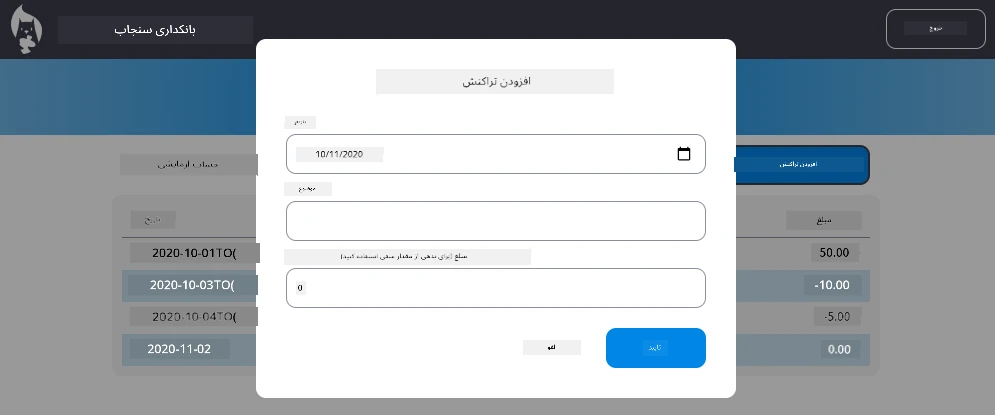

<!--
CO_OP_TRANSLATOR_METADATA:
{
  "original_hash": "50a7783473b39a2e0f133e271a102231",
  "translation_date": "2026-01-06T10:33:02+00:00",
  "source_file": "7-bank-project/4-state-management/assignment.md",
  "language_code": "fa"
}
-->
# پیاده‌سازی دیالوگ "افزودن تراکنش"

## مرور کلی

اپلیکیشن بانکی شما اکنون مدیریت وضعیت محکمی دارد و داده‌ها را به‌صورت پایدار ذخیره می‌کند، اما یک قابلیت حیاتی که اپلیکیشن‌های واقعی بانکی به آن نیاز دارند هنوز اضافه نشده است: امکان افزودن تراکنش‌های شخصی توسط کاربران. در این تمرین، شما یک دیالوگ کامل "افزودن تراکنش" پیاده‌سازی خواهید کرد که به‌صورت یکپارچه با سیستم مدیریت وضعیت فعلی شما کار می‌کند.

این تمرین همه چیزهایی را که در چهار درس بانکی آموخته‌اید با هم ترکیب می‌کند: قالب‌بندی HTML، مدیریت فرم، اتصال به API و مدیریت وضعیت.

## اهداف یادگیری

با تکمیل این تمرین، شما قادر خواهید بود:
- **ایجاد** رابط دیالوگ کاربرپسند برای ورود داده
- **پیاده‌سازی** طراحی فرم قابل دسترس با پشتیبانی از صفحه‌کلید و خواننده صفحه
- **یکپارچه‌سازی** ویژگی‌های جدید با سیستم مدیریت وضعیت فعلی خود
- **تمرین** ارتباط با API و مدیریت خطا
- **اعمال** الگوهای مدرن توسعه وب در یک ویژگی واقعی

## دستورالعمل‌ها

### گام ۱: دکمه افزودن تراکنش

**ایجاد** یک دکمه "افزودن تراکنش" در صفحه داشبورد که کاربران به‌راحتی بتوانند آن را پیدا و دسترسی داشته باشند.

**الزامات:**
- **قرار دادن** دکمه در مکان منطقی در داشبورد
- **استفاده** از متنی واضح و عملیاتی برای دکمه
- **استایل** دادن دکمه به نحوی که با طراحی UI فعلی هماهنگ باشد
- **اطمینان** از دسترس‌پذیری دکمه با صفحه‌کلید

### گام ۲: پیاده‌سازی دیالوگ

یک از دو روش زیر را برای پیاده‌سازی دیالوگ انتخاب کنید:

**گزینه A: صفحه جداگانه**
- **ایجاد** قالب HTML جدید برای فرم تراکنش
- **اضافه کردن** مسیر جدید به سیستم مسیریابی شما
- **پیاده‌سازی** ناوبری به صفحه فرم و بازگشت از آن

**گزینه B: دیالوگ مدال (توصیه‌شده)**
- **استفاده** از جاوااسکریپت برای نمایش/مخفی‌کردن دیالوگ بدون ترک داشبورد
- **پیاده‌سازی** با استفاده از ویژگی [`hidden`](https://developer.mozilla.org/docs/Web/HTML/Global_attributes/hidden) یا کلاس‌های CSS
- **ایجاد** تجربه کاربری نرم با مدیریت تمرکز مناسب

### گام ۳: پیاده‌سازی دسترس‌پذیری

**اطمینان حاصل کنید** که دیالوگ شما با [استانداردهای دسترس‌پذیری دیالوگ‌های مدال](https://developer.paciellogroup.com/blog/2018/06/the-current-state-of-modal-dialog-accessibility/) مطابقت دارد:

**ناوبری با صفحه‌کلید:**
- **پشتیبانی** از کلید Escape برای بستن دیالوگ
- **محصور کردن** تمرکز در داخل دیالوگ زمانی که باز است
- **بازگرداندن** تمرکز به دکمه فعال‌کننده پس از بسته شدن

**پشتیبانی خواننده صفحه:**
- **اضافه کردن** برچسب‌ها و نقش‌های ARIA مناسب
- **اعلام** باز و بسته شدن دیالوگ به خواننده‌های صفحه
- **ارائه** برچسب‌های واضح برای فیلدهای فرم و پیام‌های خطا

### گام ۴: ایجاد فرم

**طراحی** فرم HTML که داده‌های تراکنش را جمع‌آوری کند:

**فیلدهای الزامی:**
- **تاریخ**: زمان وقوع تراکنش
- **توضیحات**: هدف یا ماهیت تراکنش
- **مبلغ**: ارزش تراکنش (مثبت برای درآمد، منفی برای هزینه‌ها)

**ویژگی‌های فرم:**
- **اعتبارسنجی** ورودی کاربران پیش از ارسال
- **ارائه** پیام‌های خطای واضح برای داده‌های نامعتبر
- **شامل** متن نگهدارنده و برچسب‌های مفید
- **استایل** متناسب با طراحی موجود شما

### گام ۵: اتصال به API

**اتصال** فرم خود به API بک‌اند:

**مراحل پیاده‌سازی:**
- **مرور** [مشخصات API سرور](../api/README.md) برای نقطه پایان و فرمت داده صحیح
- **ایجاد** داده JSON از ورودی‌های فرم شما
- **ارسال** داده به API با مدیریت مناسب خطا
- **نمایش** پیام‌های موفقیت/شکست به کاربر
- **مدیریت** خطاهای شبکه به‌صورت مناسب

### گام ۶: یکپارچه‌سازی مدیریت وضعیت

**به‌روزرسانی** داشبورد با تراکنش جدید:

**الزامات یکپارچه‌سازی:**
- **بارگذاری مجدد** داده‌های حساب پس از افزودن موفق تراکنش
- **به‌روزرسانی** نمایش داشبورد بدون نیاز به بارگذاری مجدد صفحه
- **اطمینان** از نمایش فوری تراکنش جدید
- **حفظ** سازگاری وضعیت صحیح در طول فرایند

## مشخصات فنی

**جزئیات نقطه پایان API:**
برای اطلاعات بیشتر به [مستندات API سرور](../api/README.md) رجوع کنید برای:
- فرمت JSON مورد نیاز داده‌های تراکنش
- متد HTTP و URL نقطه پایان
- فرمت پاسخ مورد انتظار
- مدیریت پاسخ‌های خطا

**نتیجه مورد انتظار:**
پس از تکمیل این تمرین، اپلیکیشن بانکی شما باید قابلیت "افزودن تراکنش" کاملاً کاربردی و حرفه‌ای داشته باشد:

## تست پیاده‌سازی شما

**تست عملکردی:**
1. **اطمینان از** دیده شدن واضح و دسترس‌پذیری دکمه "افزودن تراکنش"
2. **آزمون** باز و بسته شدن صحیح دیالوگ
3. **تأیید** عملکرد اعتبارسنجی فرم برای همه فیلدهای الزامی
4. **بررسی** نمایش فوری تراکنش‌های موفق روی داشبورد
5. **اطمینان** از کارکرد صحیح مدیریت خطا برای داده نامعتبر و مشکلات شبکه

**تست دسترس‌پذیری:**
1. **ناوبری** کامل با استفاده فقط از صفحه‌کلید
2. **آزمون** با خواننده صفحه برای اطمینان از اعلام‌های مناسب
3. **تأیید** مدیریت درست تمرکز
4. **بررسی** داشتن برچسب‌های مناسب برای همه عناصر فرم

## جدول ارزیابی

| معیار | ممتاز | کافی | نیاز به بهبود |
| -------- | --------- | -------- | ----------------- |
| **عملکرد** | قابلیت افزودن تراکنش بدون مشکل با تجربه کاربری عالی و پیروی دقیق از بهترین شیوه‌های درس‌ها | قابلیت افزودن تراکنش به درستی کار می‌کند اما ممکن است برخی بهترین شیوه‌ها رعایت نشده یا مشکلات کوچکی در استفاده داشته باشد | قابلیت افزودن تراکنش نیمه‌کاره یا با مشکلات قابل توجه در استفاده |
| **کیفیت کد** | کد سازماندهی شده، الگوهای تعریف شده را دنبال می‌کند، شامل مدیریت خطا مناسب و به‌خوبی با مدیریت وضعیت موجود ادغام شده است | کد کار می‌کند اما ممکن است مسائل سازماندهی یا الگوهای ناسازگار با کد موجود داشته باشد | کد مشکلات ساختاری چشمگیر دارد یا به‌خوبی با الگوهای موجود یکپارچه نمی‌شود |
| **دسترس‌پذیری** | پشتیبانی کامل از ناوبری صفحه‌کلید، سازگاری با خواننده صفحه و پیروی از دستورالعمل‌های WCAG با مدیریت تمرکز عالی | ویژگی‌های پایه دسترس‌پذیری پیاده‌سازی شده اما ممکن است برخی ویژگی‌های ناوبری صفحه‌کلید یا خواننده صفحه کم‌بود داشته باشد | در نظر گرفتن محدود یا بدون در نظر گرفتن دسترس‌پذیری |
| **تجربه کاربری** | رابط کاربری شهودی و به‌صورت حرفه‌ای با بازخورد واضح، تعاملات روان و ظاهر حرفه‌ای | تجربه کاربری خوب با نقاط کوچک قابل بهبود در بازخورد یا طراحی بصری | تجربه کاربری ضعیف با رابط گیج‌کننده یا کمبود بازخورد به کاربر |

## چالش‌های اضافی (اختیاری)

پس از تکمیل الزامات پایه، به این بهبودها فکر کنید:

**ویژگی‌های پیشرفته:**
- **اضافه کردن** دسته‌بندی تراکنش‌ها (غذا، حمل‌ونقل، سرگرمی و غیره)
- **پیاده‌سازی** اعتبارسنجی ورودی با بازخورد در زمان واقعی
- **ایجاد** کلیدهای میانبر صفحه‌کلید برای کاربران حرفه‌ای
- **افزودن** امکان ویرایش و حذف تراکنش‌ها

**یکپارچه‌سازی پیشرفته:**
- **پیاده‌سازی** قابلیت بازگشت عملیات برای تراکنش‌های تازه افزوده شده
- **اضافه کردن** واردسازی انبوه تراکنش‌ها از فایل‌های CSV
- **ایجاد** قابلیت‌های جستجو و فیلتر تراکنش‌ها
- **پیاده‌سازی** قابلیت صادر کردن داده‌ها

این ویژگی‌های اختیاری به شما کمک می‌کنند مفاهیم توسعه وب پیشرفته‌تر را تمرین کنید و یک اپلیکیشن بانکی کامل‌تر بسازید!

---

<!-- CO-OP TRANSLATOR DISCLAIMER START -->
**سلب مسئولیت**:  
این سند با استفاده از سرویس ترجمه ماشینی [Co-op Translator](https://github.com/Azure/co-op-translator) ترجمه شده است. اگرچه ما در تلاش برای دقت هستیم، لطفاً توجه داشته باشید که ترجمه‌های خودکار ممکن است حاوی اشتباهات یا نادقیق‌گی‌هایی باشد. سند اصلی به زبان بومی خود باید به عنوان منبع معتبر در نظر گرفته شود. برای اطلاعات حیاتی، ترجمه حرفه‌ای توسط انسان توصیه می‌شود. ما مسئول هیچ گونه سو تفاهم یا تفسیر اشتباه ناشی از استفاده از این ترجمه نیستیم.
<!-- CO-OP TRANSLATOR DISCLAIMER END -->