<!--
CO_OP_TRANSLATOR_METADATA:
{
  "original_hash": "a9a3bcc037a447e2d8994d99e871cd9f",
  "translation_date": "2026-01-06T09:56:51+00:00",
  "source_file": "8-code-editor/1-using-a-code-editor/README.md",
  "language_code": "fa"
}
-->
# استفاده از ویرایشگر کد: تسلط بر VSCode.dev

بیایید به یاد بیاوریم در *ماتریکس* وقتی نئو مجبور بود به یک ترمینال کامپیوتری عظیم متصل شود تا به دنیای دیجیتال دسترسی پیدا کند؟ ابزارهای توسعه وب امروزی داستانی برعکس دارند – قابلیت‌های فوق‌العاده قدرتمندی که از هرجا قابل دسترسی هستند. VSCode.dev یک ویرایشگر کد مبتنی بر مرورگر است که ابزارهای توسعه حرفه‌ای را به هر دستگاهی با اتصال اینترنت می‌آورد.

دقیقاً مانند اینکه چاپخانه کتاب‌ها را برای همه قابل دسترس کرد، نه فقط نویسندگان در صومعه‌ها، VSCode.dev کدنویسی را دموکراتیک می‌کند. شما می‌توانید روی پروژه‌ها از کامپیوتر کتابخانه، آزمایشگاه مدرسه یا هر جایی که به مرورگر دسترسی دارید کار کنید. بدون نیاز به نصب، بدون محدودیت‌های "من به تنظیمات خاص خودم نیاز دارم".

در پایان این درس، شما خواهید آموخت چگونه در VSCode.dev حرکت کنید، مخازن GitHub را مستقیماً در مرورگر خود باز کنید و از Git برای کنترل نسخه استفاده کنید – تمام مهارت‌هایی که توسعه‌دهندگان حرفه‌ای روزانه به آن‌ها متکی هستند.

## ⚡ کاری که در ۵ دقیقه آینده می‌توانید انجام دهید

**مسیر شروع سریع برای توسعه‌دهندگان پرمشغله**


- **دقیقه ۱**: به [vscode.dev](https://vscode.dev) بروید – نیازی به نصب نیست
- **دقیقه ۲**: با GitHub وارد شوید تا مخازن خود را متصل کنید
- **دقیقه ۳**: ترفند URL را امتحان کنید: در هر URL مخزن، `github.com` را به `vscode.dev/github` تغییر دهید
- **دقیقه ۴**: یک فایل جدید ایجاد کنید و ببینید برجسته‌سازی نحو به طور خودکار کار می‌کند
- **دقیقه ۵**: تغییری ایجاد کنید و از طریق پنل کنترل منبع آن را کامیت کنید

**URL تست سریع**:  
```
# Transform this:
github.com/microsoft/Web-Dev-For-Beginners

# Into this:
vscode.dev/github/microsoft/Web-Dev-For-Beginners
```
  
**چرا این مهم است**: در ۵ دقیقه، آزادی کدنویسی در هر مکان با ابزارهای حرفه‌ای را تجربه خواهید کرد. این نشان‌دهنده آینده توسعه است – قابل دسترس، قدرتمند و فوری.

## 🗺️ مسیر یادگیری شما در توسعه مبتنی بر ابر

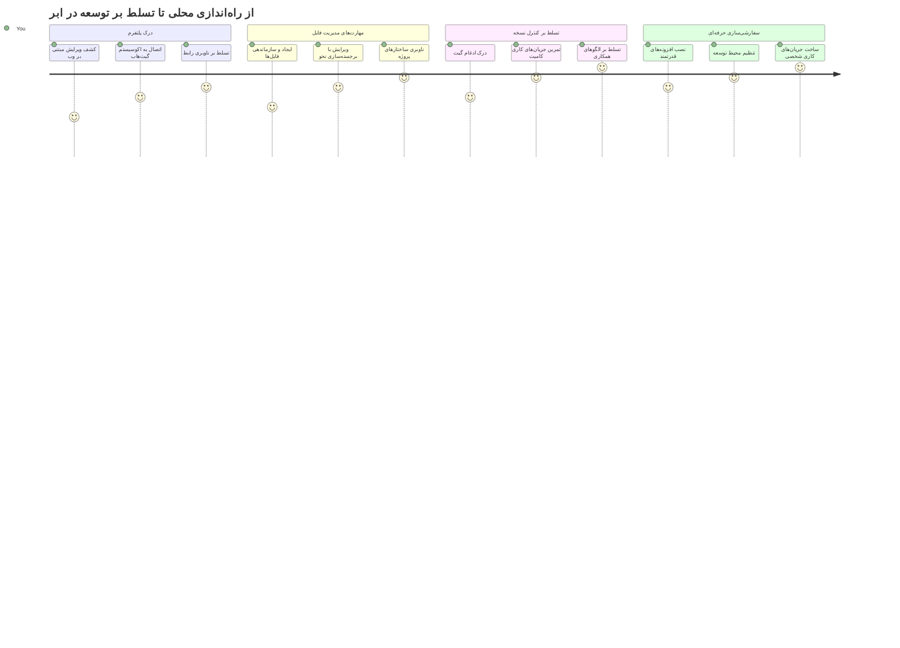
**مقصد مسیر شما**: تا پایان این درس، محیط توسعه حرفه‌ای ابری را تسلط خواهید داشت که از هر دستگاهی کار می‌کند و به شما امکان می‌دهد با همان ابزارهایی کدنویسی کنید که توسعه‌دهندگان شرکت‌های بزرگ فناوری استفاده می‌کنند.

## آنچه خواهید آموخت

پس از طی این مسیر با هم، قادر خواهید بود:

- در VSCode.dev مثل خانه دوم خود حرکت کنید – همه چیز را بدون گم شدن پیدا کنید  
- هر مخزن GitHub را در مرورگر خود باز کرده و فوراً ویرایش را شروع کنید (این واقعاً جادویی است!)  
- با Git تغییرات خود را دنبال کنید و پیشرفت‌تان را مانند حرفه‌ای‌ها ذخیره کنید  
- ویرایشگر خود را با افزونه‌هایی که کدنویسی را سریع‌تر و جذاب‌تر می‌کنند، تقویت کنید  
- به طور مطمئن فایل‌های پروژه را ایجاد و سازماندهی کنید  

## آنچه نیاز دارید

پیش‌نیازها ساده هستند:

- یک حساب کاربری رایگان [GitHub](https://github.com) (اگر نیاز بود، در ایجاد آن به شما راهنمایی می‌کنیم)  
- آشنایی پایه با مرورگرهای وب  
- درس مبانی GitHub پس‌زمینه مفیدی فراهم می‌کند، اما ضروری نیست  

> 💡 **جدید با GitHub آشنا شده‌اید؟** ساختن حساب رایگان و چند دقیقه‌ای است. مانند کارت کتابخانه که دسترسی به کتاب‌ها در سراسر جهان را می‌دهد، حساب GitHub درب‌های مخازن کد در اینترنت را باز می‌کند.

## 🧠 مروری بر اکوسیستم توسعه ابری

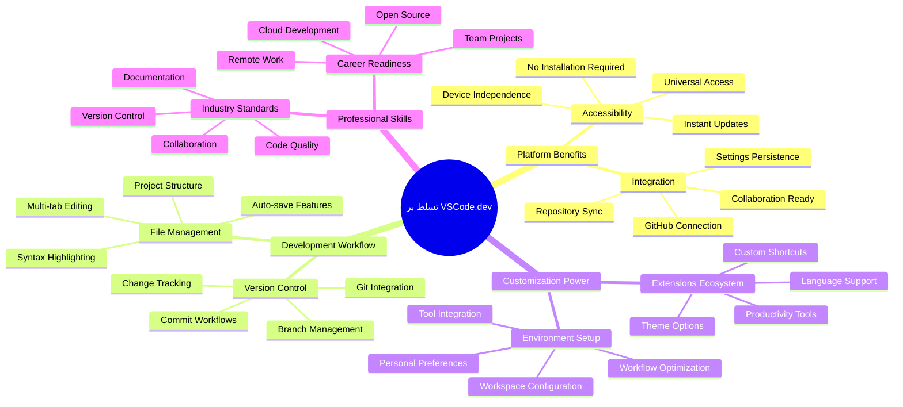
**اصل کلیدی**: محیط‌های توسعه مبتنی بر ابر نمایانگر آینده کدنویسی هستند – ابزارهای درجه حرفه‌ای که در دسترس، تعاملی و مستقل از پلتفرم هستند.

## چرا ویرایشگرهای کد مبتنی بر وب اهمیت دارند

قبل از اینترنت، دانشمندان در دانشگاه‌های مختلف نمی‌توانستند به سادگی تحقیقات خود را به اشتراک بگذارند. سپس در دهه ۱۹۶۰ ARPANET آمد که کامپیوترها را در فواصل دور به هم متصل کرد. ویرایشگرهای کد مبتنی بر وب همین اصل را دنبال می‌کنند – دسترسی به ابزارهای قدرتمند بدون توجه به موقعیت فیزیکی یا دستگاه شما.

ویرایشگر کد فضایی کاری برای توسعه شماست، جایی که کد می‌نویسید، ویرایش می‌کنید و فایل‌های کد را سازماندهی می‌کنید. بر خلاف ویرایشگرهای متنی ساده، ویرایشگرهای کد حرفه‌ای قابلیت‌هایی مانند برجسته‌سازی نحو، تشخیص خطا و امکانات مدیریت پروژه را ارائه می‌دهند.

VSCode.dev این قابلیت‌ها را به مرورگر شما می‌آورد:

**مزایای ویرایش مبتنی بر وب:**

| قابلیت | توضیح | فایده عملی |
|---------|-------------|----------|
| **استقلال پلتفرم** | روی هر دستگاهی با مرورگر اجرا می‌شود | کار بدون مشکل روی کامپیوترهای مختلف |
| **نیاز به نصب ندارد** | دسترسی از طریق آدرس وب | دور زدن محدودیت‌های نصب نرم‌افزار |
| **بروزرسانی خودکار** | همیشه آخرین نسخه اجرا می‌شود | بدون نیاز به بروزرسانی دستی به ویژگی‌های جدید دسترسی دارید |
| **ادغام مخزن** | اتصال مستقیم به GitHub | ویرایش کد بدون مدیریت فایل محلی |

**پیامدهای عملی:**  
- تداوم کار در محیط‌های مختلف  
- یک‌دستی رابط کاربری بدون توجه به سیستم عامل  
- امکان همکاری فوری  
- کاهش نیاز به فضای ذخیره‌سازی محلی  

## کاوش در VSCode.dev

مثل اینکه آزمایشگاه ماری کوری تجهیزات پیشرفته‌ای را در فضای نسبتاً ساده داشت، VSCode.dev ابزارهای توسعه حرفه‌ای را در یک رابط مرورگر بسته‌بندی می‌کند. این برنامه وب همان عملکرد اصلی ویرایشگرهای کد دسکتاپ را فراهم می‌کند.

ابتدا به [vscode.dev](https://vscode.dev) در مرورگر خود بروید. رابط بدون دانلود یا نصب سیستم بارگذاری می‌شود – اجرای مستقیم اصول محاسبات ابری.

### اتصال حساب GitHub

مثل اینکه تلفن الکساندر گراهام بل مکان‌های دور را به هم وصل کرد، اتصال حساب GitHub شما VSCode.dev را با مخازن کدتان مرتبط می‌کند. هنگام درخواست ورود با GitHub، پذیرش این اتصال توصیه می‌شود.

**ادغام GitHub فراهم می‌کند:**  
- دسترسی مستقیم به مخازن شما در ویرایشگر  
- همگام‌سازی تنظیمات و افزونه‌ها بین دستگاه‌ها  
- جریان کاری ساده ذخیره‌سازی در GitHub  
- محیط توسعه شخصی‌سازی شده  

### آشنایی با فضای کاری جدیدتان

وقتی همه چیز بارگذاری شد، یک فضای کاری تمیز و زیبا مشاهده خواهید کرد که برای تمرکز شما روی چیزی که مهم است – کدتان – طراحی شده است!

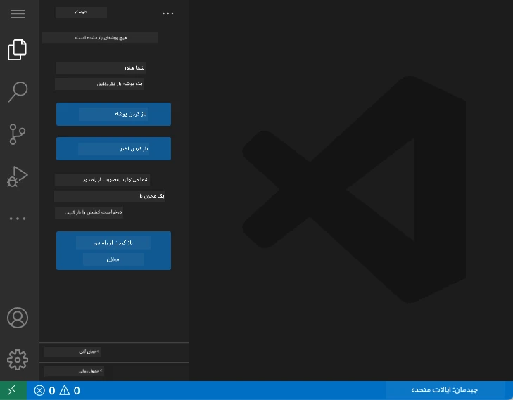

**این گشتی در محله شماست:**  
- **نوار فعالیت** (نوار سمت چپ): ناوبری اصلی شما با اکسپلورر 📁، جستجو 🔍، کنترل منبع 🌿، افزونه‌ها 🧩 و تنظیمات ⚙️  
- **نوار کناری** (پنل کنار آن): بسته به انتخاب شما تغییر می‌کند و اطلاعات مرتبط را نشان می‌دهد  
- **فضای ویرایشگر** (فضای بزرگ وسط): جایی که جادو اتفاق می‌افتد – منطقه اصلی کدنویسی شما  

**لحظه‌ای وقت بگذارید و نگاه کنید:**  
- روی آیکون‌های نوار فعالیت کلیک کنید و ببینید هر کدام چه کاری انجام می‌دهد  
- مشاهده کنید چگونه نوار کناری اطلاعات متفاوتی را نشان می‌دهد – خیلی جالبه، نه؟  
- احتمالاً بیشترین زمان خود را در نمای اکسپلورر (📁) خواهید گذراند، بنابراین با آن راحت شوید  

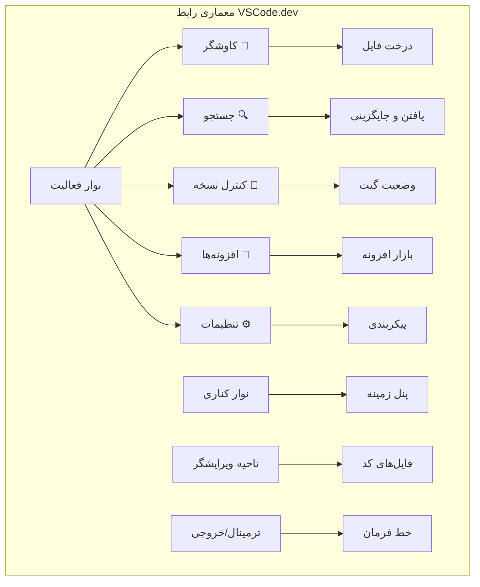
## باز کردن مخازن GitHub

قبل از اینترنت، محققان مجبور بودند برای دسترسی به اسناد به صورت حضوری به کتابخانه‌ها بروند. مخازن GitHub مشابه کار می‌کنند – مجموعه‌ای از کدها که به صورت دوردست ذخیره شده‌اند. VSCode.dev مرحله سنتی دانلود مخازن روی دستگاه محلی پیش از ویرایش را حذف می‌کند.

این قابلیت دسترسی فوری به هر مخزن عمومی برای مشاهده، ویرایش یا مشارکت را امکان‌پذیر می‌سازد. دو روش برای باز کردن مخازن وجود دارد:

### روش ۱: راه کلیک کردن

این روش برای زمانی که تازه وارد VSCode.dev شده‌اید و می‌خواهید یک مخزن مشخص را باز کنید عالی است. ساده و مناسب مبتدی‌هاست:

**روند کار:**  
1. به [vscode.dev](https://vscode.dev) بروید اگر هنوز آنجا نیستید  
2. در صفحه خوش‌آمدگویی دکمه "Open Remote Repository" را پیدا کرده و کلیک کنید  

   

3. آدرس URL مخزن GitHub را وارد کنید (این را امتحان کنید: `https://github.com/microsoft/Web-Dev-For-Beginners`)  
4. کلید Enter را بزنید و جادو را ببینید!

**نکته حرفه‌ای – میانبر Command Palette:**  

می‌خواهید مانند یک جادوگر کدنویسی حس کنید؟ میانبر صفحه‌کلید Ctrl+Shift+P (یا Cmd+Shift+P در مک) را برای باز کردن پنل فرمان‌ها امتحان کنید:

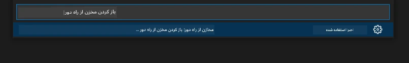

**پنل فرمان مثل داشتن یک موتور جستجو برای همه کارهایی است که می‌توانید انجام دهید:**  
- تایپ کنید "open remote" تا بازکننده مخزن را برای شما پیدا کند  
- مخازنی را که اخیراً باز کرده‌اید به یاد می‌آورد (خیلی کاربردی!)  
- وقتی عادت کنید، حس می‌کنید با سرعت برق کدنویسی می‌کنید  
- اساساً نسخه VSCode.dev از "هی سیری، اما برای کدنویسی" است  

### روش ۲: تکنیک تغییر URL

مثل اینکه HTTP و HTTPS پروتکل‌های متفاوتی دارند اما ساختار دامنه را حفظ می‌کنند، VSCode.dev از الگویی برای URL استفاده می‌کند که سیستم آدرس‌دهی GitHub را منعکس می‌کند. هر URL مخزن GitHub را می‌توان تغییر داد تا مستقیماً در VSCode.dev باز شود.

**الگوی تغییر URL:**

| نوع مخزن | URL گیت‌هاب | URL VSCode.dev |
|----------|---------------------|----------------|
| **مخزن عمومی** | `github.com/microsoft/Web-Dev-For-Beginners` | `vscode.dev/github/microsoft/Web-Dev-For-Beginners` |
| **پروژه شخصی** | `github.com/your-username/my-project` | `vscode.dev/github/your-username/my-project` |
| **هر مخزن قابل دسترس** | `github.com/their-username/awesome-repo` | `vscode.dev/github/their-username/awesome-repo` |

**پیاده‌سازی:**  
- `github.com` را با `vscode.dev/github` جایگزین کنید  
- سایر اجزای URL تغییری نکند  
- با هر مخزن عمومی قابل دسترسی کار می‌کند  
- دسترسی فوری به ویرایش فراهم می‌آورد  

> 💡 **نکته تغییر دهنده زندگی**: نسخه VSCode.dev مخازن محبوب خود را بوکمارک کنید. من بوکمارک‌هایی مثل "ویرایش نمونه‌کارهایم" و "رفع مستندات" دارم که مستقیماً به حالت ویرایش می‌بردم!

**کدام روش را استفاده کنید؟**  
- **راه رابط کاربری**: عالی وقتی که در حال کاوش هستید یا نام مخزن دقیق را به یاد نمی‌آورید  
- **ترفند URL**: ایده‌آل برای دسترسی فوق‌العاده سریع وقتی دقیقاً می‌دانید به کجا می‌روید  

### 🎯 بررسی آموزشی: دسترسی به توسعه ابری

**مکث و تفکر**: شما همین الان دو روش برای دسترسی به مخازن کد از طریق مرورگر وب یاد گرفته‌اید. این نمایانگر یک تغییر بنیادین در نحوه کار توسعه است.

**ارزیابی سریع خود:**  
- می‌توانید توضیح دهید چرا ویرایش مبتنی بر وب، "نصب محیط توسعه سنتی" را حذف می‌کند؟  
- تکنیک تغییر URL چه مزیتی نسبت به کلونینگ محلی git دارد؟  
- این رویکرد چگونه نحوه مشارکت شما در پروژه‌های متن باز را تغییر می‌دهد؟  

**ارتباط دنیای واقعی:** شرکت‌های بزرگی مانند GitHub، GitLab و Replit پلتفرم‌های توسعه خود را بر اساس این اصول ابری ساخته‌اند. شما همان جریان کاری‌هایی را یاد می‌گیرید که تیم‌های توسعه حرفه‌ای در سراسر جهان استفاده می‌کنند.

**سؤال چالشی:** توسعه مبتنی بر ابر چگونه ممکن است روش آموزش کد نویسی در مدارس را تغییر دهد؟ الزامات دستگاه‌ها، مدیریت نرم‌افزار و امکانات همکاری را در نظر بگیرید.

## کار با فایل‌ها و پروژه‌ها

حالا که یک مخزن باز کرده‌اید، بیایید شروع به ساختن کنیم! VSCode.dev همه چیز لازم برای ایجاد، ویرایش و سازماندهی فایل‌های کد شما را فراهم می‌کند. فکر کنید مثل کارگاه دیجیتال شماست – هر ابزاری دقیقاً در جایی که نیاز دارید، قرار دارد.

بیایید به وظایف روزمره‌ای که بیشتر جریان کاری کدنویسی شما را تشکیل می‌دهند بپردازیم.

### ایجاد فایل‌های جدید

مثل سازماندهی نقشه‌های معماری در دفتر یک معمار، ایجاد فایل در VSCode.dev از یک رویکرد ساختار یافته پیروی می‌کند. سیستم از همه نوع فایل‌های استاندارد توسعه وب پشتیبانی می‌کند.

**روند ایجاد فایل:**  
1. به پوشه هدف در نوار اکسپلورر بروید  
2. روی نام پوشه نگه دارید تا آیکون "فایل جدید" (📄+) ظاهر شود  
3. نام فایل را با پسوند مناسب وارد کنید (`style.css`، `script.js`، `index.html`)  
4. Enter را فشار دهید تا فایل ایجاد شود  

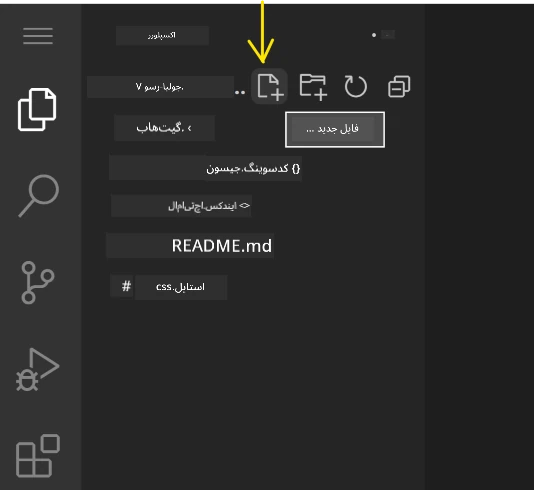

**قوانین نام‌گذاری:**  
- از نام‌های توصیفی که هدف فایل را نشان می‌دهند استفاده کنید  
- پسوند فایل را برای برجسته‌سازی نحو صحیح شامل کنید  
- الگوهای نام‌گذاری یکنواخت را در سراسر پروژه رعایت کنید  
- از حروف کوچک و خط تیره به جای فاصله استفاده کنید  

### ویرایش و ذخیره فایل‌ها

اینجاست که واقعی لذت آغاز می‌شود! ویرایشگر VSCode.dev پر از ویژگی‌های مفید است که کدنویسی را نرم و شهودی می‌کند. مثل داشتن یک دستیار نوشتاری بسیار هوشمند برای کد است.

**جریان کاری ویرایش شما:**  
1. روی هر فایلی در اکسپلورر کلیک کنید تا در فضای اصلی باز شود  
2. شروع به تایپ کنید و ببینید VSCode.dev با رنگ‌ها، پیشنهادها و تشخیص خطا به شما کمک می‌کند  
3. با Ctrl+S (ویندوز/لینوکس) یا Cmd+S (مک) کار خود را ذخیره کنید – اگرچه به طور خودکار هم ذخیره می‌شود!  

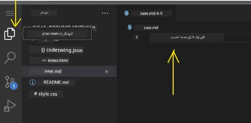

**کارهای جالبی که هنگام کد زدن اتفاق می‌افتد:**  
- کد شما به صورت زیبایی رنگ‌آمیزی می‌شود تا خواندن آن راحت باشد  
- VSCode.dev پیشنهادهایی هنگام تایپ ارائه می‌کند (مثل اصلاح خودکار، ولی بسیار هوشمندتر)  
- خطاها و اشتباهات را قبل از ذخیره تشخیص می‌دهد  
- می‌توانید چند فایل را به صورت تب باز کنید، درست مثل مرورگر  
- همه چیز در پس‌زمینه به طور خودکار ذخیره می‌شود  

> ⚠️ **نکته سریع**: حتی اگر ذخیره خودکار کمک می‌کند، عادت کنید گاه به گاه Ctrl+S یا Cmd+S را فشار دهید. این کار فوراً همه چیز را ذخیره می‌کند و برخی ویژگی‌های اضافی مثل بررسی خطا را فعال می‌کند.

### کنترل نسخه با Git

مثل اینکه باستان‌شناسان سوابق دقیق لایه‌های حفاری را می‌سازند، Git تغییرات کد شما را در طول زمان پیگیری می‌کند. این سیستم تاریخچه پروژه را حفظ و امکان بازگشت به نسخه‌های قبلی را فراهم می‌کند. VSCode.dev قابلیت Git یکپارچه دارد.

**رابط کنترل منبع:**  
1. از طریق آیکون 🌿 در نوار فعالیت به پنل کنترل منبع دسترسی پیدا کنید  
2. فایل‌های تغییر یافته در بخش "Changes" نمایش داده می‌شوند  
3. رنگ‌ها نوع تغییر را نشان می‌دهند: سبز برای افزودن، قرمز برای حذف  

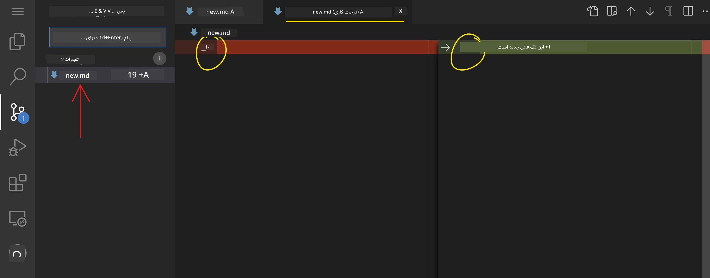

**ذخیره کار شما (جریان کار کامیت):**  

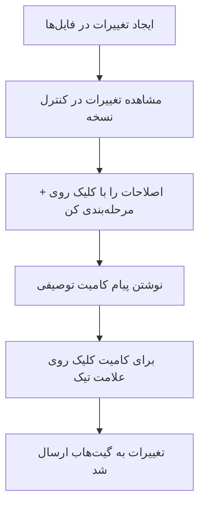
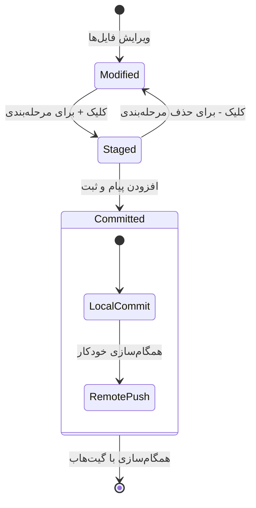
**روند گام به گام شما:**  
- روی آیکون "+" کنار فایل‌هایی که می‌خواهید ذخیره کنید کلیک کنید (این فایل‌ها را "مرحله‌بندی" می‌کند)  
- دوباره بررسی کنید که از تمام تغییرات مرحله‌بندی‌شده خود راضی هستید  
- یک یادداشت کوتاه بنویسید که توضیح دهد چه کاری انجام داده‌اید (این همان "پیغام کامیت" شماست)  
- روی دکمه علامت تیک کلیک کنید تا همه چیز در GitHub ذخیره شود  
- اگر نظر خود را درباره چیزی تغییر دادید، آیکون بازگشت به شما اجازه می‌دهد تغییرات را لغو کنید  

**نوشتن پیغام‌های خوب کامیت (این آسان‌تر از چیزی است که فکر می‌کنید!):**  
- فقط توصیف کنید چه کاری انجام داده‌اید، مثل "افزودن فرم تماس" یا "رفع مشکل ناوبری شکسته"  
- کوتاه و شیرین نگه دارید – مانند طول یک توییت، نه یک مقاله  
- با کلمات فعل شروع کنید مانند "افزودن"، "رفع"، "به‌روزرسانی" یا "حذف"  
- **نمونه‌های خوب**: "افزودن منوی ناوبری واکنش‌گرا"، "رفع مشکلات نمای موبایل"، "به‌روزرسانی رنگ‌ها برای بهبود دسترسی"  

> 💡 **نکته ناوبری سریع**: از منوی همبرگری (☰) در بالای سمت چپ استفاده کنید تا به مخزن GitHub خود برگردید و تغییرات کامیت شده را به صورت آنلاین ببینید. این مثل یک پل بین محیط ویرایش شما و خانه پروژه‌تان در GitHub است!  

## ارتقاء عملکرد با افزونه‌ها

دقیقاً مانند کارگاه یک صنعتگر که ابزارهای تخصصی برای کارهای مختلف دارد، VSCode.dev را می‌توان با افزونه‌هایی سفارشی‌سازی کرد که قابلیت‌های خاصی اضافه می‌کنند. این پلاگین‌های توسعه‌یافته توسط جامعه، نیازهای رایج توسعه مثل فرمت‌بندی کد، پیش‌نمایش زنده و یکپارچه‌سازی پیشرفته گیت را برطرف می‌کنند.

بازارچه افزونه میزبان هزاران ابزار رایگان است که توسط توسعه‌دهندگان سراسر جهان ایجاد شده‌اند. هر افزونه چالش‌های خاص جریان کاری را حل می‌کند و به شما اجازه می‌دهد یک محیط توسعه شخصی‌سازی‌شده بسازید که متناسب با نیازها و ترجیحات خاص شما باشد.

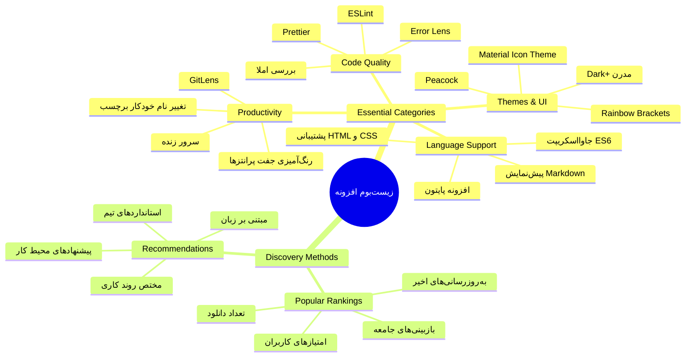
### پیدا کردن افزونه‌های مناسب شما

بازارچه افزونه واقعاً منظم است، بنابراین در پیدا کردن آنچه نیاز دارید گم نمی‌شوید. این بازارچه طوری طراحی شده که هم ابزارهای خاص را بیابید و هم چیزهای جالبی که حتی نمی‌دانستید وجود دارند!

**دسترسی به بازارچه:**

1. روی آیکون Extensions (🧩) در نوار فعالیت کلیک کنید  
2. جستجو کنید یا گشت و گذار کنید برای چیزی خاص  
3. روی هر چیزی که جالب به نظر می‌رسد کلیک کنید تا اطلاعات بیشتر ببینید  

  

**چیزی که آنجا می‌بینید:**

| بخش | چه چیزی درون آن است | چرا مفید است |  
|----------|---------|----------|  
| **نصب‌شده** | افزونه‌هایی که قبلاً اضافه کرده‌اید | جعبه‌ابزار کدنویسی شخصی شما |  
| **محبوب** | محبوب‌ترین‌ها | چیزی که اکثر توسعه‌دهندگان به آن اعتماد دارند |  
| **توصیه‌شده** | پیشنهادات هوشمندانه برای پروژه شما | توصیه‌های مفید VSCode.dev |  

**چه چیزی مرور را آسان می‌کند:**  
- هر افزونه امتیازها، تعداد دانلود و بازخوردهای واقعی کاربران را نمایش می‌دهد  
- تصاویر صفحه و توضیح واضحی درباره عملکرد هر افزونه دارید  
- همه چیز با اطلاعات سازگاری به‌خوبی علامت‌گذاری شده است  
- افزونه‌های مشابه پیشنهاد می‌شوند تا گزینه‌ها را مقایسه کنید  

### نصب افزونه‌ها (خیلی ساده است!)

افزودن قابلیت‌های جدید به ویرایشگر شما به اندازه کلیک روی یک دکمه ساده است. افزونه‌ها در عرض چند ثانیه نصب می‌شوند و بلافاصله شروع به کار می‌کنند – بدون نیاز به راه‌اندازی مجدد یا انتظار.

**کاری که باید انجام دهید:**

1. دنبال چیزی بگردید (مثلاً "live server" یا "prettier")  
2. روی افزونه‌ای که خوب به نظر می‌رسد کلیک کنید تا جزئیات بیشتر را ببینید  
3. توضیحات را بخوانید و امتیازها را بررسی کنید  
4. روی دکمه آبی رنگ "Install" کلیک کنید و تمام!  

  

**چه اتفاقی در پشت صحنه می‌افتد:**  
- افزونه به طور خودکار دانلود و راه‌اندازی می‌شود  
- قابلیت‌های جدید بلافاصله در رابط شما ظاهر می‌شوند  
- همه چیز فوری کار می‌کند (واقعا، اینقدر سریع است!)  
- اگر وارد حساب شده باشید، افزونه روی همه دستگاه‌ها همگام‌سازی می‌شود  

**چند افزونه‌ای که پیشنهاد می‌کنم از آنها شروع کنید:**  
- **Live Server**: سایتتان را همزمان که کد می‌زنید به‌روزرسانی می‌کند (واقعاً جادویی است!)  
- **Prettier**: کدهای شما را به صورت خودکار تمیز و حرفه‌ای می‌کند  
- **Auto Rename Tag**: وقتی یک تگ HTML را تغییر می‌دهید، تگ متناظر هم به صورت خودکار به‌روز می‌شود  
- **Bracket Pair Colorizer**: پرانتزهای شما را رنگی می‌کند تا هیچ‌وقت سردرگم نشوید  
- **GitLens**: قابلیت‌های Git شما را با کلی اطلاعات مفید تقویت می‌کند  

### سفارشی‌سازی افزونه‌هایتان

اکثر افزونه‌ها تنظیماتی دارند که می‌توانید آنها را تغییر دهید تا دقیقاً همانطور که می‌خواهید کار کنند. آن را مانند تنظیم صندلی و آینه‌ها در خودرو در نظر بگیرید – هر کسی ترجیح خودش را دارد!

**تنظیم تنظیمات افزونه:**

1. افزونه نصب شده خود را در پنل Extensions پیدا کنید  
2. دنبال آیکون کوچک چرخ دنده (⚙️) کنار نام افزونه بگردید و روی آن کلیک کنید  
3. گزینه "Extension Settings" را از منوی کشویی انتخاب کنید  
4. تنظیمات را تغییر دهید تا دقیقاً برای جریان کار شما مناسب باشد  

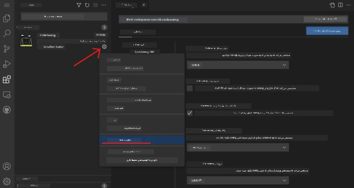  

**موارد رایجی که ممکن است بخواهید تغییر دهید:**  
- چگونگی فرمت شدن کد شما (tabs در مقابل فاصله، طول خط و غیره)  
- ترکیب کلیدهایی که کارهای مختلف را اجرا می‌کنند  
- نوع فایل‌هایی که افزونه باید با آنها کار کند  
- روشن یا خاموش کردن قابلیت‌های خاص برای حفظ محیط تمیز  

### نگهداری مرتب افزونه‌ها

هر چه افزونه‌های جالب‌تری پیدا می‌کنید، دوست دارید مجموعه خود را مرتب و روان نگه دارید. VSCode.dev این کار را بسیار آسان می‌کند.

**گزینه‌های مدیریت افزونه شما:**

| کارهایی که می‌توانید انجام دهید | چه زمانی مفید است | نکته حرفه‌ای |  
|--------|---------|----------|  
| **غیرفعال کردن** | بررسی اینکه آیا یک افزونه مشکل ایجاد می‌کند | بهتر از حذف اگر شاید بعداً دوباره خواستید |  
| **حذف نصب** | حذف کامل افزونه‌هایی که لازم ندارید | محیط شما را تمیز و سریع نگه می‌دارد |  
| **به‌روزرسانی** | دریافت ویژگی‌های جدید و رفع اشکال | معمولاً به صورت خودکار انجام می‌شود ولی بررسی کنید |  

**نحوه مدیریت افزونه‌ها از دید من:**  
- هر چند ماه یکبار، آنچه نصب کرده‌ام را بازبینی می‌کنم و آنچه استفاده نمی‌کنم پاک می‌کنم  
- افزونه‌ها را به‌روز نگه می‌دارم تا به جدیدترین بهبودها و رفع مشکلات امنیتی دسترسی داشته باشم  
- اگر احساس می‌کنم سرعت پایین آمده، افزونه‌ها را موقتاً غیرفعال می‌کنم تا بفهمم کدام یک مشکل‌ساز است  
- یادداشت‌های به‌روزرسانی افزونه‌ها را می‌خوانم – گاهی ویژگی‌های جدید جالبی دارند!  

> ⚠️ **نکته عملکرد**: افزونه‌ها فوق‌العاده هستند اما داشتن تعداد زیادی می‌تواند سرعت را کاهش دهد. روی افزونه‌هایی تمرکز کنید که واقعاً زندگی شما را آسان‌تر می‌کنند و از حذف آنهایی که هرگز استفاده نمی‌کنید نترسید.  

### 🎯 بررسی آموزشی: سفارشی‌سازی محیط توسعه

**درک معماری**: شما یاد گرفته‌اید محیط توسعه حرفه‌ای را با استفاده از افزونه‌های ایجاد شده توسط جامعه سفارشی کنید. این شبیه به روشی است که تیم‌های توسعه سازمانی ابزارهای استاندارد را می‌سازند.

**مفاهیم کلیدی یادگرفته شده**:  
- **کشف افزونه**: پیدا کردن ابزارهایی که چالش‌های خاص توسعه را حل می‌کنند  
- **پیکربندی محیط**: سفارشی‌سازی ابزارها بر اساس ترجیحات شخصی یا تیمی  
- **بهینه‌سازی عملکرد**: تعادل بین قابلیت‌ها و کارایی سیستم  
- **همکاری جامعه**: استفاده از ابزارهای ساخته شده توسط جامعه توسعه‌دهندگان جهانی  

**ارتباط با صنعت**: اکوسیستم افزونه‌ها، بسترهای توسعه بزرگی مانند VS Code، Chrome DevTools و IDEهای مدرن را تغذیه می‌کند. یادگیری اینکه چگونه افزونه‌ها را ارزیابی، نصب و پیکربندی کنیم برای جریان‌های کاری توسعه حرفه‌ای ضروری است.

**سوال تأملی**: چگونه محیط توسعه استانداردی را برای یک تیم ۱۰ نفره توسعه‌دهنده راه‌اندازی می‌کنید؟ ثبات، عملکرد و ترجیحات فردی را مد نظر قرار دهید.  

## 📈 جدول زمانی تسلط شما بر توسعه ابری

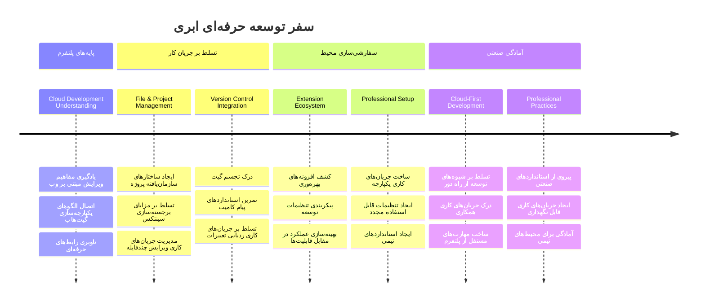
**🎓 گام فارغ‌التحصیلی**: شما با موفقیت توسعه مبتنی بر ابر را با استفاده از همان ابزارها و جریان کاری توسعه‌دهندگان حرفه‌ای در شرکت‌های بزرگ فناوری یاد گرفته‌اید. این مهارت‌ها نمایانگر آینده توسعه نرم‌افزار هستند.

**🔄 قابلیت‌های سطح بعدی**:  
- آماده اکتشاف پلتفرم‌های توسعه ابری پیشرفته (Codespaces، GitPod) هستید  
- آماده کار در تیم‌های توسعه توزیع شده  
- توانمند در مشارکت در پروژه‌های متن‌باز جهانی  
- پایه‌های لازم برای DevOps مدرن و فرآیندهای یکپارچه‌سازی مستمر گذاشته شده است  

## چالش GitHub Copilot Agent 🚀

شبیه رویکرد ساختاریافته ناسا برای ماموریت‌های فضایی، این چالش شامل کاربرد سیستماتیک مهارت‌های VSCode.dev در یک سناریوی جریان کاری کامل است.

**هدف:** مهارت خود را در VSCode.dev با برقراری یک جریان کاری جامع توسعه وب نشان دهید.

**نیازمندی‌های پروژه:** با کمک حالت Agent، این وظایف را انجام دهید:  
1. فورک یک مخزن موجود یا ایجاد یک مخزن جدید  
2. ساختار پروژه عملی با فایل‌های HTML، CSS و جاوااسکریپت بسازید  
3. نصب و پیکربندی سه افزونه افزایش‌دهنده توسعه  
4. تمرین کنترل نسخه با پیام‌های کامیت واضح  
5. آزمایش ایجاد و اصلاح شاخه ویژگی  
6. مستندسازی فرآیند و یادگیری‌ها در یک فایل README.md  

این تمرین همه مفاهیم VSCode.dev را در یک جریان کاری عملی ترکیب می‌کند که می‌توان آن را در پروژه‌های توسعه بعدی به کار گرفت.

بیشتر درباره [حالت agent](https://code.visualstudio.com/blogs/2025/02/24/introducing-copilot-agent-mode) بخوانید.  

## تمرین

وقت آن است که این مهارت‌ها را در یک پروژه عملی به کار ببرید! من پروژه‌ای دارم که به شما امکان می‌دهد هر چیزی را که یاد گرفته‌اید تمرین کنید: [ساخت یک وبسایت رزومه با VSCode.dev](./assignment.md)

این تمرین شما را در ساخت یک وبسایت رزومه حرفه‌ای کاملاً در مرورگر راهنمایی می‌کند. از تمام قابلیت‌های VSCode.dev که بررسی کردیم استفاده خواهید کرد و در پایان، یک سایت زیبا و اعتماد به نفس خوب در جریان کاری جدید خواهید داشت.  

## ادامه کاوش و افزایش مهارت‌هایتان

شما بنیاد محکمی دارید اما چیزهای جالب زیادی برای کشف وجود دارد! اینها منابع و ایده‌هایی برای بردن مهارت VSCode.dev شما به مرحله بعد هستند:

**مستندات رسمی که ارزش نشانه‌گذاری دارند:**  
- [مستندات وب VSCode](https://code.visualstudio.com/docs/editor/vscode-web?WT.mc_id=academic-0000-alfredodeza) – راهنمای کامل ویرایشگر مبتنی بر مرورگر  
- [GitHub Codespaces](https://docs.github.com/en/codespaces) – وقتی می‌خواهید قدرت بیشتری در ابر داشته باشید  

**ویژگی‌های جالب برای آزمایش بعدی:**  
- **میانبرهای صفحه‌کلید**: یاد بگیرید چه ترکیب کلیدهایی شما را مانند نینجای کدنویسی می‌کنند  
- **تنظیمات محیط کاری**: محیط‌های مختلف برای انواع پروژه‌ها تنظیم کنید  
- **کار بر روی چند ریشه**: به طور همزمان روی چند مخزن کار کنید (خیلی کاربردی!)  
- **ادغام ترمینال**: ابزارهای خط فرمان را مستقیماً در مرورگر خود در دسترس داشته باشید  

**ایده‌هایی برای تمرین:**  
- وارد پروژه‌های متن‌باز شوید و با VSCode.dev مشارکت کنید – این راه عالی برای پس دادن به جامعه است!  
- افزونه‌های مختلف را امتحان کنید تا تنظیم ایده‌آل خود را پیدا کنید  
- قالب پروژه برای انواع سایت‌هایی که بیشتر می‌سازید بسازید  
- جریان‌های کاری Git مانند برنچ‌سازی و ادغام را تمرین کنید – این مهارت‌ها در پروژه‌های تیمی طلا هستند  

---

**شما توسعه مبتنی بر مرورگر را به خوبی یاد گرفته‌اید!** 🎉 درست مثل اینکه اختراع ابزارهای قابل حمل به دانشمندان اجازه داد تا در مکان‌های دورافتاده تحقیق کنند، VSCode.dev کدنویسی حرفه‌ای را از هر دستگاه متصل به اینترنت ممکن می‌سازد.

این مهارت‌ها منعکس‌کننده شیوه‌های صنعت فعلی است – بسیاری از توسعه‌دهندگان حرفه‌ای از محیط‌های توسعه مبتنی بر ابر به خاطر انعطاف‌پذیری و دسترسی آسان استفاده می‌کنند. شما یک جریان کاری یاد گرفته‌اید که از پروژه‌های فردی تا همکاری‌های بزرگ تیمی مقیاس‌پذیر است.

این تکنیک‌ها را در پروژه توسعه بعدی خود به کار ببرید! 🚀

---

<!-- CO-OP TRANSLATOR DISCLAIMER START -->
**توضیح مسؤولیت**:
این سند با استفاده از سرویس ترجمه هوش مصنوعی [Co-op Translator](https://github.com/Azure/co-op-translator) ترجمه شده است. در حالی که ما در تلاش برای دقت هستیم، لطفاً توجه داشته باشید که ترجمه‌های خودکار ممکن است شامل خطاها یا نواقصی باشند. سند اصلی به زبان مادری خود، باید به عنوان منبع رسمی و معتبر در نظر گرفته شود. برای اطلاعات حساس و حیاتی، توصیه می‌شود از ترجمه حرفه‌ای انسانی استفاده شود. ما مسئول هیچ گونه سوءتفاهم یا تفسیر نادرست ناشی از استفاده از این ترجمه نیستیم.
<!-- CO-OP TRANSLATOR DISCLAIMER END -->