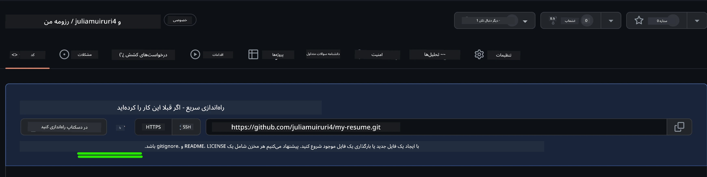
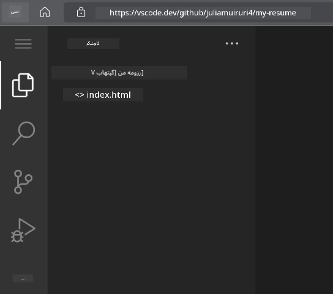
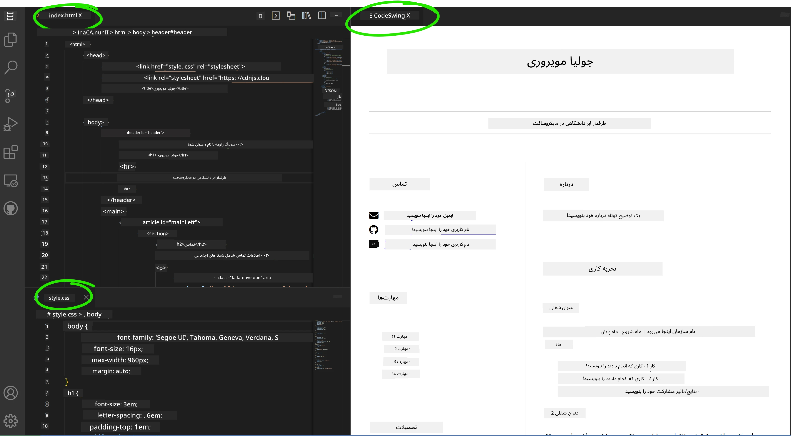

<!--
CO_OP_TRANSLATOR_METADATA:
{
  "original_hash": "effe56ba51c38d7bdfad1ea38288666b",
  "translation_date": "2026-01-06T09:58:47+00:00",
  "source_file": "8-code-editor/1-using-a-code-editor/assignment.md",
  "language_code": "fa"
}
-->
# ساخت وب‌سایت رزومه با استفاده از VSCode.dev

آینده شغلی خود را با ساخت یک وب‌سایت رزومه حرفه‌ای که مهارت‌ها و تجربیات شما را به‌صورت تعاملی و مدرن نمایش می‌دهد، متحول کنید. به جای ارسال فایل‌های PDF سنتی، تصور کنید که به استخدام‌کنندگان وب‌سایتی شیک و واکنش‌گرا ارائه می‌دهید که هم صلاحیت‌ها و هم قابلیت‌های توسعه وب شما را نشان می‌دهد.

این تمرین عملی همه مهارت‌های شما در VSCode.dev را در ساخت چیزی واقعاً مفید برای حرفه شما به کار می‌گیرد. شما روند کامل توسعه وب را تجربه خواهید کرد – از ایجاد مخزن تا انتشار – همه در داخل مرورگر خود.

با تکمیل این پروژه، یک حضور حرفه‌ای آنلاین خواهید داشت که به‌راحتی می‌توان آن را با کارفرمایان بالقوه به اشتراک گذاشت، با رشد مهارت‌هایتان به‌روزرسانی کرد، و مطابق با برند شخصی شما سفارشی‌سازی نمود. این دقیقاً همان نوع پروژه‌ی کاربردی است که مهارت‌های واقعی توسعه وب را نشان می‌دهد.

## اهداف یادگیری

پس از اتمام این تمرین، قادر خواهید بود:

- **ایجاد** و مدیریت یک پروژه کامل توسعه وب با استفاده از VSCode.dev
- **ساختاردهی** یک وب‌سایت حرفه‌ای با استفاده از عناصر معنایی HTML
- **استایل‌دهی** طرح‌های واکنش‌گرا با تکنیک‌های مدرن CSS
- **پیاده‌سازی** ویژگی‌های تعاملی با استفاده از تکنولوژی‌های پایه وب
- **انتشار** وب‌سایتی زنده که از طریق یک URL قابل اشتراک‌گذاری در دسترس است
- **نمایش** بهترین شیوه‌های کنترل نسخه در کل روند توسعه

## پیش‌نیازها

قبل از شروع این تمرین، اطمینان حاصل کنید که:

- یک حساب کاربری GitHub دارید (در صورت نیاز یکی در [github.com](https://github.com/) ایجاد کنید)
- درس VSCode.dev مربوط به ناوبری رابط و عملیات پایه را تکمیل کرده‌اید
- درک پایه‌ای از ساختار HTML و مفاهیم استایل‌دهی CSS دارید

## راه‌اندازی پروژه و ایجاد مخزن

بیایید با راه‌اندازی پایه پروژه شروع کنیم. این فرایند روندهای توسعه دنیای واقعی را منعکس می‌کند که پروژه‌ها با مقداردهی اولیه مناسب مخزن و برنامه‌ریزی ساختار آغاز می‌شوند.

### مرحله 1: ایجاد مخزن GitHub خود

راه‌اندازی یک مخزن اختصاصی اطمینان می‌دهد که پروژه شما از ابتدا به‌صورت منظم و با کنترل نسخه مدیریت می‌شود.

1. **به** [GitHub.com](https://github.com) بروید و وارد حساب خود شوید
2. **روی** دکمه سبز "New" یا آیکون "+" در گوشه بالا سمت راست کلیک کنید
3. **نام** مخزن خود را `my-resume` (یا نامی شخصی‌سازی شده مانند `john-smith-resume`) بگذارید
4. **یک توضیح کوتاه اضافه کنید:** "وب‌سایت رزومه حرفه‌ای ساخته شده با HTML و CSS"
5. **گزینه** "Public" را انتخاب کنید تا رزومه شما برای کارفرمایان قابل دسترسی باشد
6. **گزینه** "Add a README file" را تیک بزنید تا فایل README اولیه ایجاد شود
7. **روی** "Create repository" کلیک کنید تا راه‌اندازی نهایی شود

> 💡 **نکته نام‌گذاری مخزن**: از نام‌های توصیفی و حرفه‌ای استفاده کنید که هدف پروژه را به وضوح نشان دهد. این به هنگام اشتراک با کارفرمایان یا مرور نمونه‌کارها بسیار مفید است.

### مرحله 2: مقداردهی اولیه ساختار پروژه

از آنجا که VSCode.dev نیاز به حداقل یک فایل برای باز کردن مخزن دارد، فایل اصلی HTML خود را مستقیماً در GitHub قبل از استفاده از ویرایشگر وب ایجاد می‌کنیم.

1. **روی** لینک "creating a new file" در مخزن جدید خود کلیک کنید
2. **نام فایل** را `index.html` تایپ کنید
3. **این ساختار HTML اولیه را اضافه کنید:**

```html
<!DOCTYPE html>
<html lang="en">
<head>
    <meta charset="UTF-8">
    <meta name="viewport" content="width=device-width, initial-scale=1.0">
    <title>Your Name - Professional Resume</title>
</head>
<body>
    <h1>Your Name</h1>
    <p>Professional Resume Website</p>
</body>
</html>
```

4. **یک پیام کامیت بنویسید:** "Add initial HTML structure"
5. **روی** "Commit new file" کلیک کنید تا تغییرات ذخیره شود



**این تنظیمات اولیه چه کار می‌کند:**
- **ایجاد** ساختار درست سند HTML5 با عناصر معنایی
- **شامل** تگ متا viewport برای سازگاری با طراحی واکنش‌گرا
- **تنظیم** عنوان توصیفی صفحه که در برگه مرورگر نمایش داده می‌شود
- **ایجاد** پایه‌ای برای سازمان‌دهی حرفه‌ای محتوا

## کار با VSCode.dev

حالا که پایه مخزن شما برقرار شده است، بیایید به VSCode.dev برای انجام توسعه اصلی برویم. این ویرایشگر مبتنی بر وب همه ابزارهای لازم برای توسعه وب حرفه‌ای را فراهم می‌کند.

### مرحله 3: باز کردن پروژه در VSCode.dev

1. **در یک تب جدید مرورگر** به [vscode.dev](https://vscode.dev) بروید
2. **روی** "Open Remote Repository" در صفحه خوش‌آمدگویی کلیک کنید
3. **آدرس مخزن** GitHub خود را کپی کرده و در فیلد ورودی جای‌گذاری کنید

   قالب: `https://github.com/your-username/my-resume`
   
   *نام کاربری GitHub خود را به جای `your-username` قرار دهید*

4. **کلید Enter را فشار دهید** تا پروژه بارگذاری شود

✅ **نشانه موفقیت**: شما باید فایل‌های پروژه را در نوار کناری Explorer ببینید و `index.html` برای ویرایش در ناحیه اصلی باز باشد.



**چه چیزی در رابط کاربری مشاهده خواهید کرد:**
- **نوار کناری Explorer**: **نمایش** فایل‌های مخزن و ساختار پوشه‌ای
- **ناحیه ویرایشگر**: **نمایش** محتوای فایل‌های انتخاب‌شده برای ویرایش
- **نوار فعالیت**: **دسترسی** به ویژگی‌هایی مانند کنترل منبع و افزونه‌ها
- **نوار وضعیت**: **نمایش** وضعیت اتصال و اطلاعات شاخه جاری

### مرحله 4: ساخت محتوای رزومه خود

محتوای نگه‌دارنده را در `index.html` با ساختار جامع رزومه جایگزین کنید. این کد HTML پایه‌ای برای ارائه حرفه‌ای مدارک شما فراهم می‌کند.

<details>
<summary><b>ساختار کامل HTML رزومه</b></summary>

```html
<!DOCTYPE html>
<html lang="en">
<head>
    <meta charset="UTF-8">
    <meta name="viewport" content="width=device-width, initial-scale=1.0">
    <link href="style.css" rel="stylesheet">
    <link rel="stylesheet" href="https://cdnjs.cloudflare.com/ajax/libs/font-awesome/5.15.4/css/all.min.css">
    <title>Your Name - Professional Resume</title>
</head>
<body>
    <header id="header">
        <h1>Your Full Name</h1>
        <hr>
        <p class="role">Your Professional Title</p>
        <hr>
    </header>
    
    <main>
        <article id="mainLeft">
            <section>
                <h2>CONTACT</h2>
                <p>
                    <i class="fa fa-envelope" aria-hidden="true"></i>
                    <a href="mailto:your.email@domain.com">your.email@domain.com</a>
                </p>
                <p>
                    <i class="fab fa-github" aria-hidden="true"></i>
                    <a href="https://github.com/your-username">github.com/your-username</a>
                </p>
                <p>
                    <i class="fab fa-linkedin" aria-hidden="true"></i>
                    <a href="https://linkedin.com/in/your-profile">linkedin.com/in/your-profile</a>
                </p>
            </section>
            
            <section>
                <h2>SKILLS</h2>
                <ul>
                    <li>HTML5 & CSS3</li>
                    <li>JavaScript (ES6+)</li>
                    <li>Responsive Web Design</li>
                    <li>Version Control (Git)</li>
                    <li>Problem Solving</li>
                </ul>
            </section>
            
            <section>
                <h2>EDUCATION</h2>
                <h3>Your Degree or Certification</h3>
                <p>Institution Name</p>
                <p>Start Date - End Date</p>
            </section>
        </article>
        
        <article id="mainRight">
            <section>
                <h2>ABOUT</h2>
                <p>Write a compelling summary that highlights your passion for web development, key achievements, and career goals. This section should give employers insight into your personality and professional approach.</p>
            </section>
            
            <section>
                <h2>WORK EXPERIENCE</h2>
                <div class="job">
                    <h3>Job Title</h3>
                    <p class="company">Company Name | Start Date – End Date</p>
                    <ul>
                        <li>Describe a key accomplishment or responsibility</li>
                        <li>Highlight specific skills or technologies used</li>
                        <li>Quantify impact where possible (e.g., "Improved efficiency by 25%")</li>
                    </ul>
                </div>
                
                <div class="job">
                    <h3>Previous Job Title</h3>
                    <p class="company">Previous Company | Start Date – End Date</p>
                    <ul>
                        <li>Focus on transferable skills and achievements</li>
                        <li>Demonstrate growth and learning progression</li>
                        <li>Include any leadership or collaboration experiences</li>
                    </ul>
                </div>
            </section>
            
            <section>
                <h2>PROJECTS</h2>
                <div class="project">
                    <h3>Project Name</h3>
                    <p>Brief description of what the project accomplishes and technologies used.</p>
                    <a href="#" target="_blank">View Project</a>
                </div>
            </section>
        </article>
    </main>
</body>
</html>
```
</details>

**راهنمای سفارشی‌سازی:**
- **متن‌های نمونه را** با اطلاعات واقعی خود جایگزین کنید
- **بخش‌ها را** بر اساس سطح تجربه و تمرکز حرفه‌ای خود تنظیم کنید
- **بخش‌ها را** اضافه یا حذف کنید (مثلاً گواهینامه‌ها، کار داوطلبانه، زبان‌ها)
- **لینک‌ها** به پروفایل‌ها و پروژه‌های واقعی خود را اضافه کنید

### مرحله 5: ایجاد فایل‌های پشتیبانی

وب‌سایت‌های حرفه‌ای نیاز به ساختار فایل منظم دارند. فایل‌های CSS و پیکربندی مورد نیاز برای پروژه کامل را ایجاد کنید.

1. **روی نام پوشه پروژه** در نوار کناری Explorer بروید
2. **روی آیکون "فایل جدید"** (📄+) که ظاهر می‌شود کلیک کنید
3. **این فایل‌ها را تک تک بسازید:**
   - `style.css` (برای استایل‌دهی و چیدمان)
   - `codeswing.json` (برای پیکربندی افزونه پیش‌نمایش)

**ساخت فایل CSS (`style.css`):**

<details>
<summary><b>استایل‌دهی حرفه‌ای CSS</b></summary>

```css
/* Modern Resume Styling */
body {
    font-family: 'Segoe UI', Tahoma, Geneva, Verdana, sans-serif;
    font-size: 16px;
    line-height: 1.6;
    max-width: 960px;
    margin: 0 auto;
    padding: 20px;
    color: #333;
    background-color: #f9f9f9;
}

/* Header Styling */
header {
    text-align: center;
    margin-bottom: 3em;
    padding: 2em;
    background: linear-gradient(135deg, #667eea 0%, #764ba2 100%);
    color: white;
    border-radius: 10px;
    box-shadow: 0 4px 6px rgba(0, 0, 0, 0.1);
}

h1 {
    font-size: 3em;
    letter-spacing: 0.1em;
    margin-bottom: 0.2em;
    font-weight: 300;
}

.role {
    font-size: 1.3em;
    font-weight: 300;
    margin: 1em 0;
}

/* Main Content Layout */
main {
    display: grid;
    grid-template-columns: 35% 65%;
    gap: 3em;
    margin-top: 3em;
    background: white;
    padding: 2em;
    border-radius: 10px;
    box-shadow: 0 2px 10px rgba(0, 0, 0, 0.1);
}

/* Typography */
h2 {
    font-size: 1.4em;
    font-weight: 600;
    margin-bottom: 1em;
    color: #667eea;
    border-bottom: 2px solid #667eea;
    padding-bottom: 0.3em;
}

h3 {
    font-size: 1.1em;
    font-weight: 600;
    margin-bottom: 0.5em;
    color: #444;
}

/* Section Styling */
section {
    margin-bottom: 2.5em;
}

#mainLeft {
    border-right: 1px solid #e0e0e0;
    padding-right: 2em;
}

/* Contact Links */
section a {
    color: #667eea;
    text-decoration: none;
    transition: color 0.3s ease;
}

section a:hover {
    color: #764ba2;
    text-decoration: underline;
}

/* Icons */
i {
    margin-right: 0.8em;
    width: 20px;
    text-align: center;
    color: #667eea;
}

/* Lists */
ul {
    list-style: none;
    padding-left: 0;
}

li {
    margin: 0.5em 0;
    padding: 0.3em 0;
    position: relative;
}

li:before {
    content: "▸";
    color: #667eea;
    margin-right: 0.5em;
}

/* Work Experience */
.job, .project {
    margin-bottom: 2em;
    padding-bottom: 1.5em;
    border-bottom: 1px solid #f0f0f0;
}

.company {
    font-style: italic;
    color: #666;
    margin-bottom: 0.5em;
}

/* Responsive Design */
@media (max-width: 768px) {
    main {
        grid-template-columns: 1fr;
        gap: 2em;
    }
    
    #mainLeft {
        border-right: none;
        border-bottom: 1px solid #e0e0e0;
        padding-right: 0;
        padding-bottom: 2em;
    }
    
    h1 {
        font-size: 2.2em;
    }
    
    body {
        padding: 10px;
    }
}

/* Print Styles */
@media print {
    body {
        background: white;
        color: black;
        font-size: 12pt;
    }
    
    header {
        background: none;
        color: black;
        box-shadow: none;
    }
    
    main {
        box-shadow: none;
    }
}
```
</details>

**ساخت فایل پیکربندی (`codeswing.json`):**

```json
{
    "scripts": [],
    "styles": []
}
```

**ویژگی‌های CSS شامل:**
- **استفاده از** شبکه CSS Grid برای ساختار چیدمان واکنش‌گرا و حرفه‌ای
- **اجرای** طرح‌های رنگی مدرن با هدرهای گرادیان
- **شامل** افکت‌ها و انتقال‌های نرم برای تعاملی بودن
- **ارائه** طراحی واکنش‌گرا که در تمام سایزهای دستگاه کار می‌کند
- **افزودن** استایل‌های مناسب چاپ برای تولید PDF

### مرحله 6: نصب و پیکربندی افزونه‌ها

افزونه‌ها تجربه توسعه شما را با قابلیت‌های پیش‌نمایش زنده و ابزارهای کارآمد بهبود می‌بخشند. افزونه CodeSwing به‌ویژه برای پروژه‌های توسعه وب مفید است.

**نصب افزونه CodeSwing:**

1. **روی آیکون Extensions** (🧩) در نوار فعالیت کلیک کنید
2. **در جعبه جستجو** عبارت "CodeSwing" را وارد کنید
3. **افزونه CodeSwing** را از نتایج انتخاب کنید
4. **روی دکمه آبی "Install"** کلیک کنید


**آنچه CodeSwing ارائه می‌دهد:**
- **فعال کردن** پیش‌نمایش زنده وب‌سایت در حین ویرایش
- **نمایش** تغییرات در زمان واقعی بدون نیاز به تازه‌سازی دستی
- **پشتیبانی** از فایل‌های HTML، CSS و JavaScript
- **تجربه** محیط توسعه یکپارچه

**نتایج فوری پس از نصب:**
پس از نصب CodeSwing، پیش‌نمایش زنده وب‌سایت رزومه در ویرایشگر ظاهر می‌شود. این امکان را به شما می‌دهد که دقیقاً ببینید تغییرات سایت چگونه است.



**درک رابط کاربری پیشرفته:**
- **نمایش تقسیم شده:** **نمایش** کد در یک طرف و پیش‌نمایش زنده در طرف دیگر
- **بروزرسانی‌های بلادرنگ:** **بازتاب** تغییرات به محض تایپ کردن
- **پیش‌نمایش تعاملی:** **امکان** تست لینک‌ها و تعاملات را می‌دهد
- **شبیه‌سازی موبایل:** **ارائه‌دهنده** قابلیت تست طراحی واکنش‌گرا

### مرحله 7: کنترل نسخه و انتشار

حالا که وب‌سایت رزومه کامل شده است، از Git برای ذخیره کار و در دسترس قرار دادن آن به‌صورت آنلاین استفاده کنید.

**کامیت کردن تغییرات:**

1. **روی آیکون Source Control** (🌿) در نوار فعالیت کلیک کنید
2. **تمام فایل‌هایی را که ایجاد یا تغییر داده‌اید** در بخش "Changes" مرور کنید
3. **با کلیک روی آیکون "+"** کنار هر فایل، تغییرات را «استیج» کنید
4. **یک پیام کامیت توصیفی بنویسید، مثلا:**
   - "Add complete resume website with responsive design"
   - "Implement professional styling and content structure"
5. **روی علامت تیک (✓)** کلیک کنید تا کامیت و پوش انجام شود

**نمونه پیام‌های موثر کامیت:**
- "Add professional resume content and styling"
- "Implement responsive design for mobile compatibility"
- "Update contact information and project links"

> 💡 **نکته حرفه‌ای:** پیام‌های کامیت خوب به پیگیری پیشرفت پروژه کمک می‌کنند و دقت شما را نشان می‌دهند – ویژگی‌هایی که کارفرمایان ارزش می‌نهند.

**دسترسی به سایت منتشر شده:**
پس از کامیت، می‌توانید از طریق منوی همبرگری (☰) در گوشه بالا سمت چپ به مخزن GitHub خود بازگردید. وب‌سایت رزومه شما اکنون کنترل نسخه شده و آماده انتشار یا به اشتراک‌گذاری است.

## نتایج و مراحل بعدی

**تبریک! 🎉** شما با موفقیت یک وب‌سایت رزومه حرفه‌ای با استفاده از VSCode.dev ساخته‌اید. پروژه شما موارد زیر را نشان می‌دهد:
**مهارت‌های فنی به نمایش درآمده:**
- **مدیریت مخزن:** ایجاد و سازمان‌دهی ساختار کامل پروژه
- **توسعه وب:** ساخت وب‌سایت واکنش‌گرا با HTML5 و CSS3 مدرن
- **کنترل نسخه:** اجرای روند کاری صحیح Git با کامیت‌های معنادار
- **تسلط بر ابزار:** استفاده موثر از رابط و سیستم افزونه VSCode.dev

**نتایج حرفه‌ای حاصل شده:**
- **حضور آنلاین:** یک URL قابل اشتراک‌گذاری که مهارت‌های شما را نمایش می‌دهد
- **فرمت مدرن:** جایگزینی تعاملی به جای رزومه PDF سنتی
- **مهارت‌های قابل اثبات:** شواهد عینی از توانایی‌های توسعه وب شما
- **به‌روزرسانی آسان:** پایه‌ای که می‌توانید مداوم بهبود و سفارشی کنید

### گزینه‌های انتشار

برای در دسترس قرار دادن رزومه به کارفرمایان، این گزینه‌های میزبانی را در نظر بگیرید:

**صفحات گیت‌هاب (GitHub Pages) (توصیه شده):**
1. به بخش Settings مخزن خود در GitHub بروید
2. به قسمت "Pages" اسکرول کنید
3. گزینه "Deploy from a branch" را انتخاب کرده و "main" را برگزینید
4. سایت شما در آدرس `https://your-username.github.io/my-resume` در دسترس خواهد بود

**پلتفرم‌های جایگزین:**
- **Netlify:** انتشار خودکار با دامنه‌های سفارشی
- **Vercel:** انتشار سریع با امکانات میزبانی مدرن
- **GitHub Codespaces:** محیط توسعه با پیش‌نمایش داخلی

### پیشنهادات بهبود

برای توسعه بیشتر مهارت‌های خود این ویژگی‌ها را اضافه کنید:

**بهبودهای فنی:**
- **تعامل با جاوااسکریپت:** افزودن پیمایش نرم یا عناصر تعاملی
- **تغییر حالت تاریک/روشن:** پیاده‌سازی سوییچ تم با انتقالات نرم
- **فرم تماس:** امکان ارتباط مستقیم از کارفرمایان بالقوه
- **بهینه‌سازی سئو:** افزودن تگ‌های متا و داده‌های ساختاریافته برای دیده شدن بهتر

**بهبودهای محتوایی:**
- **نمونه‌کار پروژه‌ها:** لینک به مخازن GitHub و دموی زنده
- **تصویرسازی مهارت‌ها:** ایجاد نوار پیشرفت یا سیستم نمره‌دهی
- **بخش توصیه‌نامه:** افزودن نظرات همکاران یا اساتید
- **ادغام وبلاگ:** افزودن بخشی برای نمایش مسیر یادگیری شما

## چالش GitHub Copilot Agent 🚀

از حالت Agent استفاده کنید تا چالش زیر را کامل کنید:

**توضیح:** وب‌سایت رزومه خود را با ویژگی‌های پیشرفته‌ای که مهارت‌های حرفه‌ای توسعه وب و اصول طراحی مدرن را نشان می‌دهد، ارتقا دهید.

**درخواست:** بر اساس وب‌سایت رزومه فعلی خود این ویژگی‌های پیشرفته را پیاده‌سازی کنید:
1. افزودن سوییچ حالت تاریک/روشن با انتقالات نرم
2. ایجاد بخش مهارت‌های تعاملی با نوارهای پیشرفت انیمیشنی
3. پیاده‌سازی فرم تماس با اعتبارسنجی فرم
4. افزودن بخش نمونه‌کار پروژه با افکت‌ها و پنجره‌های مودال
5. اضافه کردن بخش وبلاگ با حداقل ۳ پست نمونه درباره مسیر یادگیری‌تان
6. بهینه‌سازی سئو با تگ‌های متا، داده‌های ساختاریافته و بهبود عملکرد
7. انتشار سایت ارتقا یافته با استفاده از GitHub Pages یا Netlify
8. مستندسازی تمام ویژگی‌های جدید در README.md با عکس صفحه

وب‌سایت پیشرفته شما باید تسلط بر شیوه‌های مدرن توسعه وب شامل طراحی واکنش‌گرا، تعاملات جاوااسکریپتی، و روندهای حرفه‌ای انتشار را نشان دهد.

## توسعه بیشتر چالش

آماده هستید مهارت‌های خود را بیشتر کنید؟ این چالش‌های پیشرفته را امتحان کنید:

**📱 طراحی موبایل-محور:** بازسازی کامل سایت با رویکرد موبایل‌اول با CSS Grid و Flexbox

**🔍 بهینه‌سازی سئو:** پیاده‌سازی سئو جامع شامل تگ‌های متا، داده‌های ساختاریافته و بهینه‌سازی عملکرد

**🌐 پشتیبانی چندزبانه:** افزودن ویژگی‌های بین‌المللی‌سازی برای پشتیبانی از چند زبان

**📊 ادغام تحلیل‌ها:** افزودن Google Analytics برای پیگیری تعامل بازدیدکنندگان و بهینه‌سازی محتوا

**🚀 بهینه‌سازی عملکرد:** کسب امتیاز عالی Lighthouse در تمام دسته‌بندی‌ها

## مرور و مطالعه خودآموز

دانش خود را با این منابع گسترش دهید:

**ویژگی‌های پیشرفته VSCode.dev:**
- [مستندات VSCode.dev](https://code.visualstudio.com/docs/editor/vscode-web?WT.mc_id=academic-0000-alfredodeza) - راهنمای کامل ویرایش مبتنی بر وب
- [GitHub Codespaces](https://docs.github.com/en/codespaces) - محیط‌های توسعه ابری

**بهترین شیوه‌های توسعه وب:**
- **طراحی واکنش‌گرا:** مطالعه CSS Grid و Flexbox برای چیدمان‌های مدرن
- **دسترسی‌پذیری**: یادگیری دستورالعمل‌های WCAG برای طراحی وب فراگیر  
- **عملکرد**: بررسی ابزارهایی مانند Lighthouse برای بهینه‌سازی  
- **سئو**: درک اصول بهینه‌سازی موتورهای جستجو  

**توسعه حرفه‌ای:**  
- **ساخت نمونه کار**: ایجاد پروژه‌های بیشتر برای نمایش مهارت‌های متنوع  
- **منبع باز**: مشارکت در پروژه‌های موجود برای کسب تجربه همکاری  
- **شبکه‌سازی**: به اشتراک گذاشتن وب‌سایت رزومه در جوامع توسعه‌دهندگان برای دریافت بازخورد  
- **یادگیری مستمر**: به‌روز ماندن با روندها و فناوری‌های توسعه وب  

---

**گام‌های بعدی شما:** وب‌سایت رزومه خود را با دوستان، خانواده یا مربیان به اشتراک بگذارید تا بازخورد دریافت کنید. از پیشنهادات آن‌ها برای تکرار و بهبود طراحی خود استفاده کنید. به یاد داشته باشید، این پروژه فقط یک رزومه نیست – بلکه نمایشی از رشد شما به عنوان یک توسعه‌دهنده وب است!

---

<!-- CO-OP TRANSLATOR DISCLAIMER START -->
**توضیح مسئولیت**:
این سند با استفاده از سرویس ترجمه هوش مصنوعی [Co-op Translator](https://github.com/Azure/co-op-translator) ترجمه شده است. در حالی که ما تلاش می‌کنیم دقت را حفظ کنیم، لطفاً آگاه باشید که ترجمه‌های خودکار ممکن است حاوی اشتباهات یا نادرستی‌هایی باشند. سند اصلی به زبان بومی آن باید به عنوان منبع معتبر در نظر گرفته شود. برای اطلاعات حیاتی، ترجمه حرفه‌ای انسانی توصیه می‌شود. ما مسئولیتی در قبال هرگونه سوءتفاهم یا تفسیر نادرست ناشی از استفاده از این ترجمه نداریم.
<!-- CO-OP TRANSLATOR DISCLAIMER END -->