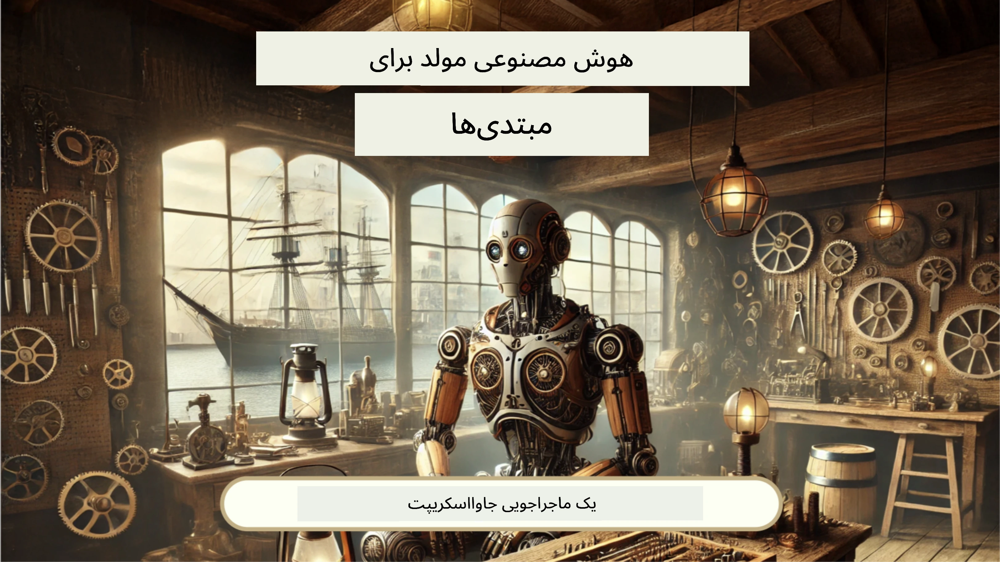
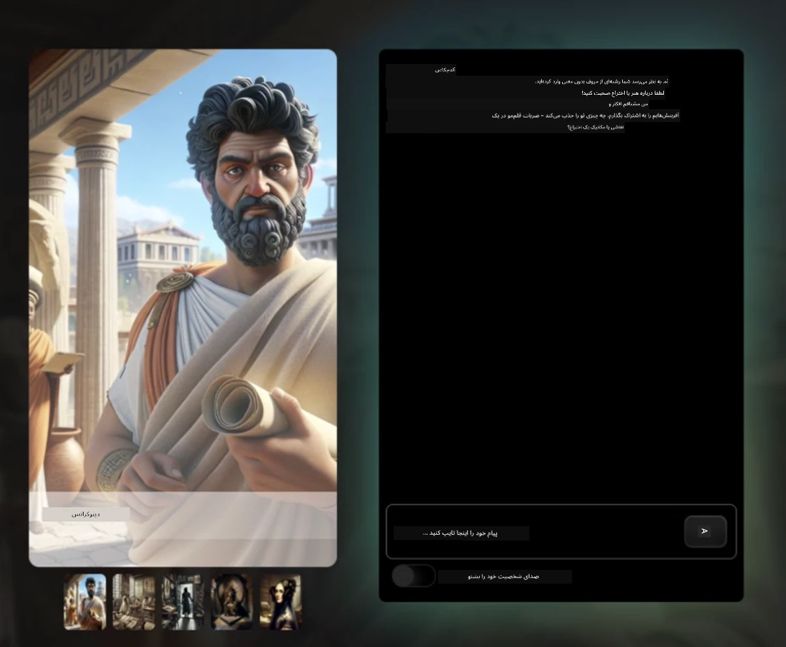
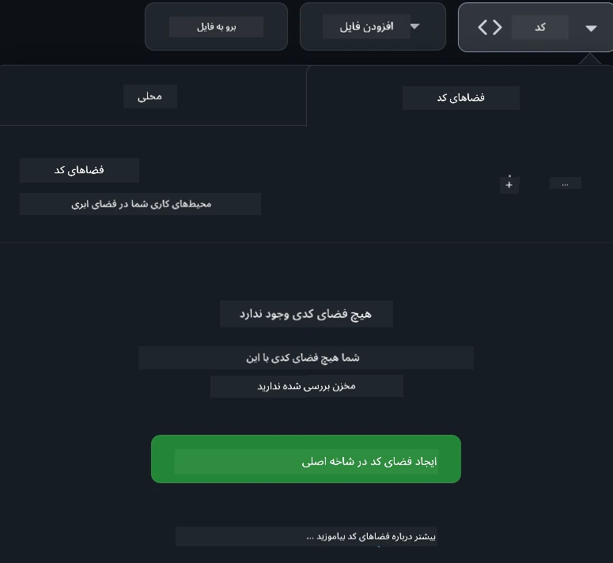

<!--
CO_OP_TRANSLATOR_METADATA:
{
  "original_hash": "fea3a0fceb8ad86fd640c09cf63a2aac",
  "translation_date": "2026-01-06T09:34:15+00:00",
  "source_file": "README.md",
  "language_code": "fa"
}
-->
[](https://github.com/microsoft/Web-Dev-For-Beginners/blob/master/LICENSE)
[](https://GitHub.com/microsoft/Web-Dev-For-Beginners/graphs/contributors/)
[](https://GitHub.com/microsoft/Web-Dev-For-Beginners/issues/)
[](https://GitHub.com/microsoft/Web-Dev-For-Beginners/pulls/)
[](http://makeapullrequest.com)

[](https://GitHub.com/microsoft/Web-Dev-For-Beginners/watchers/)
[](https://GitHub.com/microsoft/Web-Dev-For-Beginners/network/)
[](https://GitHub.com/microsoft/Web-Dev-For-Beginners/stargazers/)

[](https://discord.gg/nTYy5BXMWG)

# توسعه وب برای مبتدیان - یک برنامه آموزشی

اصول توسعه وب را با دوره جامع ۱۲ هفته‌ای ما توسط مدافعان ابر مایکروسافت بیاموزید. هر یک از ۲۴ درس به صورت عملی به جاوااسکریپت، CSS و HTML می‌پردازد، از طریق پروژه‌هایی مانند تراریوم‌ها، افزونه‌های مرورگر و بازی‌های فضایی. در آزمون‌ها، بحث‌ها و تکالیف عملی شرکت کنید. مهارت‌های خود را بهبود دهید و حفظ دانش خود را با روش تدریس مبتنی بر پروژه ما بهینه کنید. امروز سفر کدنویسی خود را شروع کنید!

به جامعه دیسکورد Azure AI Foundry بپیوندید

[](https://discord.gg/nTYy5BXMWG)

برای شروع استفاده از این منابع، این مراحل را دنبال کنید:
1. **انشعاب گرفتن از مخزن**: کلیک کنید [](https://GitHub.com/microsoft/Web-Dev-For-Beginners/fork)
2. **کلون کردن مخزن**:   `git clone https://github.com/microsoft/Web-Dev-For-Beginners.git`
3. [**به دیسکورد Azure AI Foundry بپیوندید و با کارشناسان و توسعه‌دهندگان هم‌صنف ملاقات کنید**](https://discord.com/invite/ByRwuEEgH4)

### 🌐 پشتیبانی چند زبانه

#### پشتیبانی شده توسط GitHub Action (خودکار و همیشه به‌روز)

<!-- CO-OP TRANSLATOR LANGUAGES TABLE START -->
[Arabic](../ar/README.md) | [Bengali](../bn/README.md) | [Bulgarian](../bg/README.md) | [Burmese (Myanmar)](../my/README.md) | [Chinese (Simplified)](../zh/README.md) | [Chinese (Traditional, Hong Kong)](../hk/README.md) | [Chinese (Traditional, Macau)](../mo/README.md) | [Chinese (Traditional, Taiwan)](../tw/README.md) | [Croatian](../hr/README.md) | [Czech](../cs/README.md) | [Danish](../da/README.md) | [Dutch](../nl/README.md) | [Estonian](../et/README.md) | [Finnish](../fi/README.md) | [French](../fr/README.md) | [German](../de/README.md) | [Greek](../el/README.md) | [Hebrew](../he/README.md) | [Hindi](../hi/README.md) | [Hungarian](../hu/README.md) | [Indonesian](../id/README.md) | [Italian](../it/README.md) | [Japanese](../ja/README.md) | [Kannada](../kn/README.md) | [Korean](../ko/README.md) | [Lithuanian](../lt/README.md) | [Malay](../ms/README.md) | [Malayalam](../ml/README.md) | [Marathi](../mr/README.md) | [Nepali](../ne/README.md) | [Nigerian Pidgin](../pcm/README.md) | [Norwegian](../no/README.md) | [Persian (Farsi)](./README.md) | [Polish](../pl/README.md) | [Portuguese (Brazil)](../br/README.md) | [Portuguese (Portugal)](../pt/README.md) | [Punjabi (Gurmukhi)](../pa/README.md) | [Romanian](../ro/README.md) | [Russian](../ru/README.md) | [Serbian (Cyrillic)](../sr/README.md) | [Slovak](../sk/README.md) | [Slovenian](../sl/README.md) | [Spanish](../es/README.md) | [Swahili](../sw/README.md) | [Swedish](../sv/README.md) | [Tagalog (Filipino)](../tl/README.md) | [Tamil](../ta/README.md) | [Telugu](../te/README.md) | [Thai](../th/README.md) | [Turkish](../tr/README.md) | [Ukrainian](../uk/README.md) | [Urdu](../ur/README.md) | [Vietnamese](../vi/README.md)

> **ترجیح می‌دهید به صورت محلی کلون کنید؟**

> این مخزن شامل بیش از ۵۰ ترجمه زبان است که حجم دانلود را به طور قابل توجهی افزایش می‌دهد. برای کلون کردن بدون ترجمه‌ها، از sparse checkout استفاده کنید:
> ```bash
> git clone --filter=blob:none --sparse https://github.com/microsoft/Web-Dev-For-Beginners.git
> cd Web-Dev-For-Beginners
> git sparse-checkout set --no-cone '/*' '!translations' '!translated_images'
> ```
> این به شما همه چیز لازم برای تکمیل دوره را با سرعت دانلود بسیار بیشتر می‌دهد.
<!-- CO-OP TRANSLATOR LANGUAGES TABLE END -->

**اگر مایل هستید زبان‌های ترجمه اضافی پشتیبانی شوند، لیست آنها در [اینجا](https://github.com/Azure/co-op-translator/blob/main/getting_started/supported-languages.md) موجود است**

[](https://open.vscode.dev/microsoft/Web-Dev-For-Beginners)

#### 🧑‍🎓 _آیا دانشجو هستید؟_

به صفحه [**مرکز دانشجویان**](https://docs.microsoft.com/learn/student-hub/?WT.mc_id=academic-77807-sagibbon) مراجعه کنید که در آن منابع برای مبتدیان، بسته‌های دانشجویی و حتی راه‌هایی برای دریافت کوپن گواهی رایگان را خواهید یافت. این صفحه‌ای است که باید نشانک بزنید و گهگاه بررسی کنید چون ما هر ماه محتوای آن را به‌روزرسانی می‌کنیم.

### 📣 اطلاعیه - چالش‌های حالت GitHub Copilot Agent جدید برای تکمیل!

چالش جدید اضافه شده، به دنبال "GitHub Copilot Agent Challenge 🚀" در اکثر فصل‌ها بگردید. این یک چالش جدید است برای اینکه با استفاده از GitHub Copilot و حالت Agent آن را کامل کنید. اگر قبلاً از حالت Agent استفاده نکرده‌اید، این حالت قادر است فقط متن تولید نکند بلکه می‌تواند فایل‌ها را ایجاد و ویرایش کند، دستور اجرا کند و بیشتر.

### 📣 اطلاعیه - _پروژه جدیدی برای ساخت با استفاده از هوش مصنوعی مولد_

پروژه دستیار هوش مصنوعی جدید اضافه شده است، آن را بررسی کنید [پروژه](./9-chat-project/README.md)

### 📣 اطلاعیه - _برنامه درسی جدید_ در زمینه هوش مصنوعی مولد برای جاوااسکریپت تازه منتشر شد

دوره جدید هوش مصنوعی مولد ما را از دست ندهید!

برای شروع به [https://aka.ms/genai-js-course](https://aka.ms/genai-js-course) مراجعه کنید!



- درس‌هایی که از اصول پایه تا RAG را پوشش می‌دهد.
- تعامل با شخصیت‌های تاریخی با استفاده از GenAI و اپلیکیشن همراه ما.
- روایت سرگرم‌کننده و جذاب، شما را در سفر در زمان می‌برد!




هر درس شامل یک تکلیف برای تکمیل، یک آزمون دانش و یک چالش برای راهنمایی شما در مباحث مانند:
- دستور دادن و مهندسی دستور
- تولید اپلیکیشن‌های متنی و تصویری
- اپلیکیشن‌های جستجو

برای شروع به [https://aka.ms/genai-js-course](../../[https:/aka.ms/genai-js-course) مراجعه کنید!


## 🌱 شروع به کار

> **معلمان**، ما [چند پیشنهاد](for-teachers.md) درباره نحوه استفاده از این برنامه درسی قرار داده‌ایم. مشتاقانه منتظر دریافت بازخورد شما [در انجمن بحث ما](https://github.com/microsoft/Web-Dev-For-Beginners/discussions/categories/teacher-corner) هستیم!

**[یادگیرندگان](https://aka.ms/student-page/?WT.mc_id=academic-77807-sagibbon)**، برای هر درس، با یک آزمون قبل از کلاس شروع کنید و سپس مطالب درس را خوانده، فعالیت‌های مختلف را انجام دهید و با آزمون پس از کلاس درک خود را بسنجید.

برای بهبود تجربه یادگیری خود، با همسالان‌تان برای کار روی پروژه‌ها به صورت گروهی ارتباط برقرار کنید! بحث‌ها در [انجمن بحث](https://github.com/microsoft/Web-Dev-For-Beginners/discussions) ما تشویق می‌شود و تیم ناظران ما برای پاسخ به سوالات شما در دسترس خواهند بود.

برای تعمیق آموزش خود، به‌شدت توصیه می‌کنیم [Microsoft Learn](https://learn.microsoft.com/users/wirelesslife/collections/p1ddcy5jwy0jkm?WT.mc_id=academic-77807-sagibbon) را برای مواد مطالعاتی بیشتر بررسی کنید.

### 📋 راه‌اندازی محیط کاری شما

این برنامه آموزشی یک محیط توسعه آماده دارد! وقتی شروع می‌کنید، می‌توانید Curriculum را در یک [Codespace](https://github.com/features/codespaces/) (_یک محیط مبتنی بر مرورگر بدون نیاز به نصب_) یا به صورت محلی روی رایانه خود با استفاده از یک ویرایشگر متن مانند [Visual Studio Code](https://code.visualstudio.com/?WT.mc_id=academic-77807-sagibbon) اجرا کنید.

#### ساخت مخزن خود
برای اینکه کارهای خود را به آسانی ذخیره کنید، توصیه می‌شود یک نسخه کپی از این مخزن ایجاد کنید. این کار را می‌توانید با کلیک روی دکمه **Use this template** در بالای صفحه انجام دهید. این یک مخزن جدید در حساب GitHub شما ایجاد می‌کند که نسخه‌ای از برنامه آموزشی دارد.

این مراحل را دنبال کنید:
1. **انشعاب گرفتن از مخزن**: روی دکمه "Fork" در گوشه بالا سمت راست این صفحه کلیک کنید.
2. **کلون کردن مخزن**:   `git clone https://github.com/microsoft/Web-Dev-For-Beginners.git`

#### اجرای برنامه در یک Codespace

در نسخه‌ای که از این مخزن ساخته‌اید، دکمه **Code** را بزنید و گزینه **Open with Codespaces** را انتخاب کنید. این یک Codespace جدید برای کار کردن شما ایجاد می‌کند.



#### اجرای برنامه به صورت محلی روی رایانه شما

برای اجرای این برنامه به صورت محلی روی رایانه خود، به یک ویرایشگر متن، مرورگر و ابزار خط فرمان نیاز دارید. اولین درس ما، [مقدمه‌ای بر زبان‌ها و ابزارهای برنامه‌نویسی](../../1-getting-started-lessons/1-intro-to-programming-languages)، شما را در انتخاب گزینه‌های مختلف هر یک از این ابزارها راهنمایی می‌کند.

توصیه ما استفاده از [Visual Studio Code](https://code.visualstudio.com/?WT.mc_id=academic-77807-sagibbon) به عنوان ویرایشگر است که یک [ترمینال](https://code.visualstudio.com/docs/terminal/basics/?WT.mc_id=academic-77807-sagibbon) داخلی نیز دارد. می‌توانید Visual Studio Code را از [اینجا](https://code.visualstudio.com/?WT.mc_id=academic-77807-sagibbon) دانلود کنید.

1. مخزن خود را به رایانه‌تان کلون کنید. این کار را می‌توانید با کلیک روی دکمه **Code** و کپی کردن آدرس URL انجام دهید:

    [CodeSpace](./images/createcodespace.png)
سپس، در داخل [ترمینال](https://code.visualstudio.com/docs/terminal/basics/?WT.mc_id=academic-77807-sagibbon) در [ویژوال استودیو کد](https://code.visualstudio.com/?WT.mc_id=academic-77807-sagibbon) باز کنید و فرمان زیر را اجرا کنید، جایگزین کردن `<your-repository-url>` با URL که همین الان کپی کردید:

    ```bash 
    git clone <your-repository-url>
    ```


۲. پوشه را در ویژوال استودیو کد باز کنید. این کار را می‌توانید از طریق کلیک کردن روی **File** > **Open Folder** و انتخاب پوشه‌ای که همین الآن کلون کرده‌اید انجام دهید.

> افزونه‌های پیشنهادی ویژوال استودیو کد:
>
> * [Live Server](https://marketplace.visualstudio.com/items?itemName=ritwickdey.LiveServer&WT.mc_id=academic-77807-sagibbon) - برای پیش‌نمایش صفحات HTML در داخل ویژوال استودیو کد
> * [Copilot](https://marketplace.visualstudio.com/items?itemName=GitHub.copilot&WT.mc_id=academic-77807-sagibbon) - برای کمک به شما در نوشتن سریع‌تر کد

## 📂 هر درس شامل:

- اسکتچ‌نوت اختیاری  
- ویدئوی مکمل اختیاری  
- آزمون گرم‌کننده قبل از درس  
- درس مکتوب  
- برای درس‌های مبتنی بر پروژه، راهنمای گام‌به‌گام ساخت پروژه  
- بررسی‌های دانش  
- یک چالش  
- مطالعه مکمل  
- تکلیف  
- [آزمون پس از درس](https://ff-quizzes.netlify.app/web/)

> **نکته‌ای درباره آزمون‌ها**: همه آزمون‌ها در پوشه Quiz-app قرار دارند، مجموعاً ۴۸ آزمون که هر کدام شامل سه سوال هستند. آنها در اینجا [قرار دارند](https://ff-quizzes.netlify.app/web/). برنامه آزمون می‌تواند به صورت محلی اجرا شده یا روی Azure مستقر شود؛ دستورالعمل‌ها را در پوشه `quiz-app` دنبال کنید.

## 🗃️ دروس

|     |                       نام پروژه                       |                            مفاهیم آموزش داده شده                            | اهداف یادگیری                                                                                                                    |                                                         درس مرتبط                                                          |         نویسنده          |
| :-: | :--------------------------------------------------: | :------------------------------------------------------------------------: | ------------------------------------------------------------------------------------------------------------------------------- | :--------------------------------------------------------------------------------------------------------------------------: | :---------------------: |
| ۰۱  |                     شروع کار                          |           معرفی برنامه‌نویسی و ابزارهای حرفه‌ای            | یادگیری مبانی پایه اکثر زبان‌های برنامه‌نویسی و نرم‌افزارهایی که به توسعه‌دهندگان حرفه‌ای کمک می‌کند                             | [معرفی زبان‌ها و ابزارها](./1-getting-started-lessons/1-intro-to-programming-languages/README.md)                              |         Jasmine         |
| ۰۲  |                     شروع کار                          |         مبانی GitHub، شامل کار تیمی           | نحوه استفاده از GitHub در پروژه و چگونگی همکاری با دیگران روی کدها                                                               |                             [معرفی GitHub](./1-getting-started-lessons/2-github-basics/README.md)                                  |          Floor          |
| ۰۳  |                     شروع کار                          |                             دسترسی‌پذیری                             | یادگیری مبانی دسترسی‌پذیری وب                                                                                                     |                      [مبانی دسترسی‌پذیری](./1-getting-started-lessons/3-accessibility/README.md)                                |       Christopher       |
| ۰۴  |                        مبانی JS                       |                         انواع داده‌ها در جاوااسکریپت                          | مبانی انواع داده در جاوااسکریپت                                                                                                  |                                     [انواع داده](./2-js-basics/1-data-types/README.md)                                       |         Jasmine         |
| ۰۵  |                        مبانی JS                       |                         توابع و روش‌ها                          | یادگیری در مورد توابع و روش‌ها برای مدیریت جریان منطق برنامه                                                                    |                             [توابع و روش‌ها](./2-js-basics/2-functions-methods/README.md)                                       | Jasmine and Christopher |
| ۰۶  |                        مبانی JS                       |                        تصمیم‌گیری با JS                        | یادگیری نحوه ایجاد شرط‌ها در کد با استفاده از روش‌های تصمیم‌گیری                                                                  |                                 [تصمیم‌گیری](./2-js-basics/3-making-decisions/README.md)                                     |         Jasmine         |
| ۰۷  |                        مبانی JS                       |                            آرایه‌ها و حلقه‌ها                            | کار با داده‌ها با استفاده از آرایه‌ها و حلقه‌ها در جاوااسکریپت                                                                   |                                   [آرایه‌ها و حلقه‌ها](./2-js-basics/4-arrays-loops/README.md)                               |         Jasmine         |
| ۰۸  |       [تراریوم](./3-terrarium/solution/README.md)       |                            تمرین HTML                             | ساخت HTML برای ایجاد تراریوم آنلاین، با تمرکز بر طراحی یک چیدمان                                                                |                                   [معرفی HTML](./3-terrarium/1-intro-to-html/README.md)                                      |           Jen           |
| ۰۹  |       [تراریوم](./3-terrarium/solution/README.md)       |                           تمرین CSS                              | ساخت CSS برای استایل‌دهی تراریوم آنلاین، با تمرکز بر مبانی CSS و نحوه ریسپانسیو کردن صفحه                                        |                                    [معرفی CSS](./3-terrarium/2-intro-to-css/README.md)                                     |           Jen           |
| ۱۰  |            [تراریوم](./3-terrarium/solution/README.md)            |                 بسته‌های جاوااسکریپت، دستکاری DOM                  | ساخت جاوااسکریپت برای تعامل تراریوم به عنوان یک رابط کشیدن و رها کردن، تمرکز بر بسته‌ها و دستکاری DOM                           |                  [بسته‌ها و دستکاری DOM](./3-terrarium/3-intro-to-DOM-and-closures/README.md)                                |           Jen           |
| ۱۱  |          [بازی تایپینگ](./4-typing-game/solution/README.md)          |                          ساخت بازی تایپینگ                           | یادگیری استفاده از رویدادهای صفحه‌کلید برای هدایت منطق برنامه جاوااسکریپتی                                                       |                                [برنامه‌نویسی مبتنی بر رویداد](./4-typing-game/typing-game/README.md)                        |       Christopher       |
| ۱۲  | [افزونه مرورگر سبز](./5-browser-extension/solution/README.md) |                         کار با مرورگرها                           | یادگیری نحوه کار مرورگرها، تاریخچه آن‌ها، و ساختار اولیه عناصر افزونه مرورگر                                                     |                               [درباره مرورگرها](./5-browser-extension/1-about-browsers/README.md)                              |           Jen           |
| ۱۳  | [افزونه مرورگر سبز](./5-browser-extension/solution/README.md) | ساخت فرم، فراخوانی API و ذخیره متغیرها در حافظه محلی | ساخت عناصر جاوااسکریپت افزونه مرورگر برای فراخوانی API با استفاده از متغیرهای ذخیره شده در حافظه محلی                             |                [API ها، فرم‌ها، و حافظه محلی](./5-browser-extension/2-forms-browsers-local-storage/README.md)                  |           Jen           |
| ۱۴  | [افزونه مرورگر سبز](./5-browser-extension/solution/README.md) |          فرآیندهای پس‌زمینه مرورگر، عملکرد وب          | استفاده از فرآیندهای پس‌زمینه مرورگر برای مدیریت آیکون افزونه؛ یادگیری درباره عملکرد وب و بهینه‌سازی‌هایی برای بهبود فرآیند     |             [فرآیندهای پس‌زمینه و عملکرد](./5-browser-extension/3-background-tasks-and-performance/README.md)                |           Jen           |
| ۱۵  |           [بازی فضایی](./6-space-game/solution/README.md)           |             توسعه بازی پیشرفته‌تر با جاوااسکریپت             | یادگیری درباره وراثت با استفاده از کلاس‌ها و ترکیب و الگوی Pub/Sub، آماده‌سازی برای ساخت بازی                                        |                      [معرفی توسعه بازی پیشرفته](./6-space-game/1-introduction/README.md)                                      |          Chris          |
| ۱۶  |           [بازی فضایی](./6-space-game/solution/README.md)           |                           رسم روی بوم                            | یادگیری درباره API بوم (Canvas) که برای رسم عناصر روی صفحه استفاده می‌شود                                                        |                                [رسم روی بوم](./6-space-game/2-drawing-to-canvas/README.md)                                   |          Chris          |
| ۱۷  |           [بازی فضایی](./6-space-game/solution/README.md)           |                   حرکت دادن عناصر در صفحه                     | کشف چگونگی حرکت عناصر با استفاده از مختصات کارتزین و API بوم                                                                    |                           [حرکت دادن عناصر](./6-space-game/3-moving-elements-around/README.md)                               |          Chris          |
| ۱۸  |           [بازی فضایی](./6-space-game/solution/README.md)           |                          تشخیص برخورد                           | ایجاد برخورد و واکنش عناصر به یکدیگر با استفاده از کلیدها و اضافه کردن عملکرد خنک‌کنندگی برای اطمینان از عملکرد بازی           |                              [تشخیص برخورد](./6-space-game/4-collision-detection/README.md)                                   |          Chris          |
| ۱۹  |           [بازی فضایی](./6-space-game/solution/README.md)           |                             نگهداری امتیاز                              | انجام محاسبات ریاضی بر اساس وضعیت و عملکرد بازی                                                                                  |                                    [نگهداری امتیاز](./6-space-game/5-keeping-score/README.md)                                |          Chris          |
| ۲۰  |           [بازی فضایی](./6-space-game/solution/README.md)           |                     پایان و شروع مجدد بازی                     | یادگیری در مورد چگونگی پایان دادن و شروع مجدد بازی، شامل پاکسازی منابع و ریست متغیرها                                            |                                [شرط پایان](./6-space-game/6-end-condition/README.md)                                        |          Chris          |
| ۲۱  |         [اپلیکیشن بانکی](./7-bank-project/solution/README.md)          |                 قالب‌ها و مسیریابی در یک وب اپ                  | یادگیری ساختار اولیه معماری یک وب سایت چند صفحه‌ای با استفاده از مسیریابی و قالب‌های HTML                                      |                            [قالب‌ها و مسیرها](./7-bank-project/1-template-route/README.md)                                    |          Yohan          |
| ۲۲  |         [اپلیکیشن بانکی](./7-bank-project/solution/README.md)          |                  ساخت فرم ورود و ثبت نام                   | یادگیری ساخت فرم‌ها و مدیریت اعتبارسنجی                                                                                          |                                           [فرم‌ها](./7-bank-project/2-forms/README.md)                                    |          Yohan          |
| ۲۳  |         [اپلیکیشن بانکی](./7-bank-project/solution/README.md)          |                   روش‌های دریافت و استفاده از داده‌ها                   | نحوه جریان داده‌ها درون و بیرون برنامه، نحوه دریافت، ذخیره و پاکسازی داده‌ها                                                    |                                            [داده‌ها](./7-bank-project/3-data/README.md)                                    |          Yohan          |
| ۲۴  |         [اپلیکیشن بانکی](./7-bank-project/solution/README.md)          |                      مفاهیم مدیریت وضعیت                      | یادگیری چگونگی حفظ و مدیریت وضعیت برنامه به صورت برنامه‌ای                                                                       |                                [مدیریت وضعیت](./7-bank-project/4-state-management/README.md)                                 |          Yohan          |
| ۲۵ | [کد مرورگر/وی‌اس‌کد](../../8-code-editor) | کار با وی‌اس‌کد | یادگیری نحوه استفاده از ویرایشگر کد | [استفاده از ویرایشگر کد وی‌اس‌کد](./8-code-editor/1-using-a-code-editor/README.md) | Chris |
| ۲۶ | [دستیارهای هوش مصنوعی](./9-chat-project/README.md) | کار با هوش مصنوعی | یادگیری ساخت دستیار هوش مصنوعی خودتان | [پروژه دستیار هوش مصنوعی](./9-chat-project/README.md) | Chris |

## 🏫 روش تدریس

برنامه درسی ما بر اساس دو اصل کلیدی آموزشی طراحی شده است:  
* یادگیری مبتنی بر پروژه  
* آزمون‌های مکرر  

این برنامه اصول اولیه جاوااسکریپت، HTML و CSS را آموزش داده و همچنین آخرین ابزارها و تکنیک‌های استفاده شده توسط توسعه‌دهندگان وب امروزی را پوشش می‌دهد. دانش‌آموزان فرصت دارند تجربه عملی کسب کنند با ساخت بازی تایپینگ، تراریوم مجازی، افزونه مرورگر دوستدار محیط زیست، بازی سبک فضا نورد و اپلیکیشن بانکی برای کسب‌وکارها. تا پایان این دوره، دانش‌آموزان درک عمیق و محکمی از توسعه وب خواهند داشت.

> 🎓 شما می‌توانید چند درس اول این برنامه درسی را به صورت یک [مسیر یادگیری](https://docs.microsoft.com/learn/paths/web-development-101/?WT.mc_id=academic-77807-sagibbon) در Microsoft Learn بردارید!

با اطمینان از هم‌ترازی محتوا با پروژه‌ها، فرآیند برای دانش‌آموزان جذاب‌تر شده و حفظ مفاهیم افزایش می‌یابد. همچنین چند درس ابتدایی در مبانی جاوااسکریپت نوشته‌ایم برای معرفی مفاهیم، همراه با ویدیویی از مجموعه "[مقدماتی به: جاوااسکریپت](https://channel9.msdn.com/Series/Beginners-Series-to-JavaScript/?WT.mc_id=academic-77807-sagibbon)" که برخی نویسندگان آن در طراحی این برنامه مشارکت داشته‌اند.

علاوه بر این، یک آزمون کم‌فشار قبل از کلاس، نیت دانش‌آموز را برای یادگیری موضوع مشخص می‌کند، و یک آزمون دوم بعد از کلاس کمک می‌کند حفظ مفاهیم افزایش یابد. این برنامه درسی انعطاف‌پذیر و سرگرم‌کننده طراحی شده و می‌توان آن را به صورت کامل یا بخشی از آن را گذراند. پروژه‌ها از ساده شروع شده و تا پایان چرخه ۱۲ هفته‌ای به تدریج پیچیده‌تر می‌شوند.

در حالی که عمداً از معرفی فریمورک‌های جاوااسکریپت خودداری کرده‌ایم تا ابتدا مهارت‌های پایه لازم برای توسعه‌دهنده وب را تقویت کنیم قبل از به‌کارگیری فریمورک، گام بعدی خوب برای تکمیل این برنامه یادگیری Node.js از طریق مجموعه‌ای دیگر از ویدیوهاست: "[مقدماتی به: Node.js](https://channel9.msdn.com/Series/Beginners-Series-to-Nodejs/?WT.mc_id=academic-77807-sagibbon)".

> راهنمای [رفتارنامه](CODE_OF_CONDUCT.md) و [مشارکت](CONTRIBUTING.md) ما را ببینید. ما از بازخورد سازنده شما استقبال می‌کنیم!

## 🧭 دسترسی آفلاین

شما می‌توانید این مستندات را به صورت آفلاین با استفاده از [Docsify](https://docsify.js.org/#/) اجرا کنید. این مخزن را فورک کنید، [Docsify را نصب کنید](https://docsify.js.org/#/quickstart) روی دستگاه محلی و سپس در پوشه ریشه این مخزن، دستور `docsify serve` را تایپ کنید. سایت روی پورت ۳۰۰۰ روی لوکال‌هاست شما سرو می‌شود: `localhost:3000`.

## 📘 PDF

نسخه PDF تمام درس‌ها را می‌توانید [اینجا](https://microsoft.github.io/Web-Dev-For-Beginners/pdf/readme.pdf) بیابید.

## 🎒 دوره‌های دیگر
تیم ما دوره‌های دیگری نیز تولید می‌کند! بررسی کنید:

<!-- CO-OP TRANSLATOR OTHER COURSES START -->
### LangChain
[](https://aka.ms/langchain4j-for-beginners)
[](https://aka.ms/langchainjs-for-beginners?WT.mc_id=m365-94501-dwahlin)

---

### Azure / Edge / MCP / Agents
[](https://github.com/microsoft/AZD-for-beginners?WT.mc_id=academic-105485-koreyst)
[](https://github.com/microsoft/edgeai-for-beginners?WT.mc_id=academic-105485-koreyst)
[](https://github.com/microsoft/mcp-for-beginners?WT.mc_id=academic-105485-koreyst)
[](https://github.com/microsoft/ai-agents-for-beginners?WT.mc_id=academic-105485-koreyst)

---
 
### سری هوش مصنوعی مولد
[](https://github.com/microsoft/generative-ai-for-beginners?WT.mc_id=academic-105485-koreyst)
[-9333EA?style=for-the-badge&labelColor=E5E7EB&color=9333EA)](https://github.com/microsoft/Generative-AI-for-beginners-dotnet?WT.mc_id=academic-105485-koreyst)
[-C084FC?style=for-the-badge&labelColor=E5E7EB&color=C084FC)](https://github.com/microsoft/generative-ai-for-beginners-java?WT.mc_id=academic-105485-koreyst)
[-E879F9?style=for-the-badge&labelColor=E5E7EB&color=E879F9)](https://github.com/microsoft/generative-ai-with-javascript?WT.mc_id=academic-105485-koreyst)

---
 
### یادگیری اصلی
[](https://aka.ms/ml-beginners?WT.mc_id=academic-105485-koreyst)
[](https://aka.ms/datascience-beginners?WT.mc_id=academic-105485-koreyst)
[](https://aka.ms/ai-beginners?WT.mc_id=academic-105485-koreyst)
[](https://github.com/microsoft/Security-101?WT.mc_id=academic-96948-sayoung)
[](https://aka.ms/webdev-beginners?WT.mc_id=academic-105485-koreyst)
[](https://aka.ms/iot-beginners?WT.mc_id=academic-105485-koreyst)
[](https://github.com/microsoft/xr-development-for-beginners?WT.mc_id=academic-105485-koreyst)

---
 
### سری کمک‌خلبان
[](https://aka.ms/GitHubCopilotAI?WT.mc_id=academic-105485-koreyst)
[](https://github.com/microsoft/mastering-github-copilot-for-dotnet-csharp-developers?WT.mc_id=academic-105485-koreyst)
[](https://github.com/microsoft/CopilotAdventures?WT.mc_id=academic-105485-koreyst)
<!-- CO-OP TRANSLATOR OTHER COURSES END -->

## دریافت کمک

اگر گیر کردید یا سوالی درباره ساخت برنامه‌های هوش مصنوعی دارید، به جمع یادگیرندگان و توسعه‌دهندگان باتجربه در بحث‌های مربوط به MCP بپیوندید. این یک جامعه حمایت‌کننده است که سوالات پذیرفته می‌شوند و دانش به صورت آزادانه به اشتراک گذاشته می‌شود.

[](https://discord.gg/nTYy5BXMWG)

اگر بازخورد محصول یا خطاهای حین ساخت دارید، به موارد زیر مراجعه کنید:

[](https://aka.ms/foundry/forum)

## مجوز

این مخزن تحت مجوز MIT منتشر شده است. برای اطلاعات بیشتر فایل [LICENSE](../../LICENSE) را ببینید.

---

<!-- CO-OP TRANSLATOR DISCLAIMER START -->
**اعلان مسئولیت**:  
این سند با استفاده از سرویس ترجمه‌ی هوش مصنوعی [Co-op Translator](https://github.com/Azure/co-op-translator) ترجمه شده است. هرچند ما در تلاش برای دقت هستیم، لطفاً توجه داشته باشید که ترجمه‌های خودکار ممکن است اشتباهات یا نواقص داشته باشند. سند اصلی به زبان بومی خود، منبع معتبر و قطعی تلقی می‌شود. برای اطلاعات حیاتی، ترجمه حرفه‌ای انسانی توصیه می‌شود. ما مسئول هیچ گونه برداشت نادرست یا تفسیر اشتباه ناشی از استفاده از این ترجمه نیستیم.
<!-- CO-OP TRANSLATOR DISCLAIMER END -->