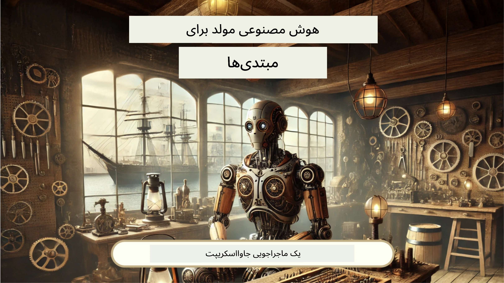
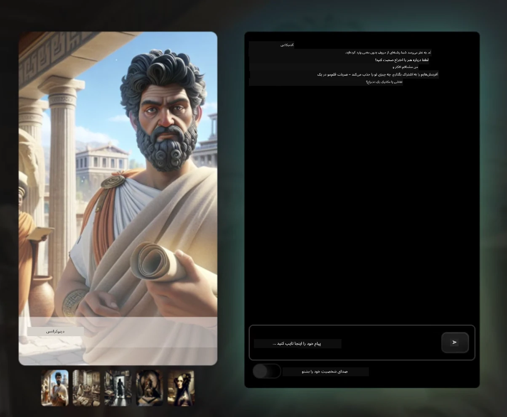
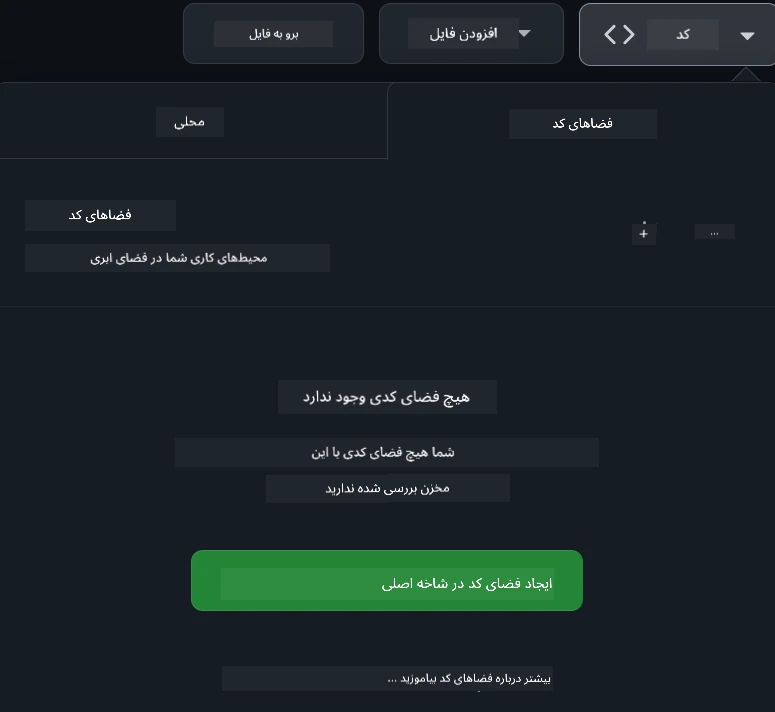

[](https://github.com/microsoft/Web-Dev-For-Beginners/blob/master/LICENSE)
[](https://GitHub.com/microsoft/Web-Dev-For-Beginners/graphs/contributors/)
[](https://GitHub.com/microsoft/Web-Dev-For-Beginners/issues/)
[](https://GitHub.com/microsoft/Web-Dev-For-Beginners/pulls/)
[](http://makeapullrequest.com) 

[](https://GitHub.com/microsoft/Web-Dev-For-Beginners/watchers/)
[](https://GitHub.com/microsoft/Web-Dev-For-Beginners/network/)
[](https://GitHub.com/microsoft/Web-Dev-For-Beginners/stargazers/)

[](https://discord.gg/nTYy5BXMWG)

# توسعه وب برای مبتدیان - یک برنامه درسی

اصول پایه توسعه وب را با دوره جامع ۱۲ هفته‌ای ما توسط مدافعان مایکروسافت کلود بیاموزید. هر یک از ۲۴ درس به صورت عملی به جاوااسکریپت، CSS و HTML می‌پردازد، با پروژه‌های کاربردی مانند تراریوم‌ها، افزونه‌های مرورگر و بازی‌های فضایی. در آزمون‌ها، بحث‌ها و وظایف عملی شرکت کنید. مهارت‌های خود را افزایش دهید و حفظ دانش خود را با روش تدریس پروژه‌محور مؤثر ما بهینه‌سازی کنید. سفر کدنویسی خود را امروز آغاز کنید!

به جامعه دیسکورد Azure AI Foundry بپیوندید

[](https://discord.gg/nTYy5BXMWG)

برای شروع استفاده از این منابع، مراحل زیر را دنبال کنید:
1. **فورک کردن مخزن**: کلیک کنید بر [](https://GitHub.com/microsoft/Web-Dev-For-Beginners/fork)
2. **کلون کردن مخزن**:   `git clone https://github.com/microsoft/Web-Dev-For-Beginners.git`
3. [**به دیسکورد Azure AI Foundry بپیوندید و با کارشناسان و توسعه‌دهندگان همدل ملاقات کنید**](https://discord.com/invite/ByRwuEEgH4)

### 🌐 پشتیبانی چند زبانه

#### پشتیبانی شده توسط GitHub Action (خودکار و همیشه به‌روز)

<!-- CO-OP TRANSLATOR LANGUAGES TABLE START -->
[Arabic](../ar/README.md) | [Bengali](../bn/README.md) | [Bulgarian](../bg/README.md) | [Burmese (Myanmar)](../my/README.md) | [Chinese (Simplified)](../zh-CN/README.md) | [Chinese (Traditional, Hong Kong)](../zh-HK/README.md) | [Chinese (Traditional, Macau)](../zh-MO/README.md) | [Chinese (Traditional, Taiwan)](../zh-TW/README.md) | [Croatian](../hr/README.md) | [Czech](../cs/README.md) | [Danish](../da/README.md) | [Dutch](../nl/README.md) | [Estonian](../et/README.md) | [Finnish](../fi/README.md) | [French](../fr/README.md) | [German](../de/README.md) | [Greek](../el/README.md) | [Hebrew](../he/README.md) | [Hindi](../hi/README.md) | [Hungarian](../hu/README.md) | [Indonesian](../id/README.md) | [Italian](../it/README.md) | [Japanese](../ja/README.md) | [Kannada](../kn/README.md) | [Korean](../ko/README.md) | [Lithuanian](../lt/README.md) | [Malay](../ms/README.md) | [Malayalam](../ml/README.md) | [Marathi](../mr/README.md) | [Nepali](../ne/README.md) | [Nigerian Pidgin](../pcm/README.md) | [Norwegian](../no/README.md) | [Persian (Farsi)](./README.md) | [Polish](../pl/README.md) | [Portuguese (Brazil)](../pt-BR/README.md) | [Portuguese (Portugal)](../pt-PT/README.md) | [Punjabi (Gurmukhi)](../pa/README.md) | [Romanian](../ro/README.md) | [Russian](../ru/README.md) | [Serbian (Cyrillic)](../sr/README.md) | [Slovak](../sk/README.md) | [Slovenian](../sl/README.md) | [Spanish](../es/README.md) | [Swahili](../sw/README.md) | [Swedish](../sv/README.md) | [Tagalog (Filipino)](../tl/README.md) | [Tamil](../ta/README.md) | [Telugu](../te/README.md) | [Thai](../th/README.md) | [Turkish](../tr/README.md) | [Ukrainian](../uk/README.md) | [Urdu](../ur/README.md) | [Vietnamese](../vi/README.md)

> **ترجیح می‌دهید محلی کلون کنید؟**
>
> این مخزن شامل بیش از ۵۰ ترجمه زبانی است که سایز دانلود را به طور قابل توجهی افزایش می‌دهد. برای کلون بدون ترجمه‌ها، از sparse checkout استفاده کنید:
>
> **Bash / macOS / Linux:**
> ```bash
> git clone --filter=blob:none --sparse https://github.com/microsoft/Web-Dev-For-Beginners.git
> cd Web-Dev-For-Beginners
> git sparse-checkout set --no-cone '/*' '!translations' '!translated_images'
> ```
>
> **CMD (Windows):**
> ```cmd
> git clone --filter=blob:none --sparse https://github.com/microsoft/Web-Dev-For-Beginners.git
> cd Web-Dev-For-Beginners
> git sparse-checkout set --no-cone "/*" "!translations" "!translated_images"
> ```
>
> این به شما همه چیز مورد نیاز برای اتمام دوره را همراه با دانلود بسیار سریعتر می‌دهد.
<!-- CO-OP TRANSLATOR LANGUAGES TABLE END -->

**اگر مایلید زبان‌های ترجمه اضافی پشتیبانی شود، آنها در این آدرس لیست شده‌اند [اینجا](https://github.com/Azure/co-op-translator/blob/main/getting_started/supported-languages.md)**

[](https://open.vscode.dev/microsoft/Web-Dev-For-Beginners)

#### 🧑‍🎓 _آیا دانش‌آموز هستید؟_

به صفحه [**مرکز دانش‌آموزان**](https://docs.microsoft.com/learn/student-hub/?WT.mc_id=academic-77807-sagibbon) مراجعه کنید که در آن منابع مبتدی، بسته‌های دانش‌آموزی و حتی راه‌هایی برای دریافت کوپن گواهی‌نامه رایگان پیدا خواهید کرد. این صفحه‌ای است که می‌خواهید آن را نشانک گذاری کنید و گهگاه چک کنید چون محتوای آن ماهانه به‌روزرسانی می‌شود.

### 📣 اعلامیه - چالش‌های جدید GitHub Copilot Agent Mode برای تکمیل!

چالش جدید اضافه شده است، به دنبال "چالش GitHub Copilot Agent 🚀" در اکثر فصل‌ها باشید. این یک چالش جدید برای شماست تا با استفاده از GitHub Copilot و حالت Agent آن را کامل کنید. اگر قبلاً از حالت Agent استفاده نکرده‌اید، این حالت قادر است نه تنها متن تولید کند بلکه می‌تواند فایل ایجاد و ویرایش کند، دستورها را اجرا کند و بیشتر.

### 📣 اعلامیه - _پروژه جدیدی برای ساخت با استفاده از هوش مصنوعی مولد_ 

پروژه دستیار هوش مصنوعی جدید به تازگی اضافه شده است، آن را بررسی کنید [پروژه](./9-chat-project/README.md)

### 📣 اعلامیه - _برنامه درسی جدید_ برای هوش مصنوعی مولد در جاوااسکریپت به تازگی منتشر شده است

برنامه درسی جدید هوش مصنوعی مولد ما را از دست ندهید!

برای شروع به آدرس [https://aka.ms/genai-js-course](https://aka.ms/genai-js-course) مراجعه کنید!



- درس‌هایی که از مبانی تا RAG را پوشش می‌دهند.
- تعامل با شخصیت‌های تاریخی با استفاده از GenAI و اپلیکیشن همراه ما.
- روایت سرگرم‌کننده و جذاب، شما به سفر در زمان خواهید رفت!




هر درس شامل یک تکلیف برای تکمیل، یک تست دانش و یک چالش برای راهنمایی شما در یادگیری موضوعاتی مانند:
- پرامپت و مهندسی پرامپت
- تولید برنامه‌های متن و تصویر
- برنامه‌های جستجو

برای شروع به آدرس [https://aka.ms/genai-js-course](https://aka.ms/genai-js-course) مراجعه کنید!


## 🌱 شروع به کار

> **معلمان**، ما [برخی پیشنهادات](for-teachers.md) برای چگونگی استفاده از این برنامه درسی ارائه کرده‌ایم. ما مشتاقانه منتظر بازخورد شما [در انجمن بحث ما](https://github.com/microsoft/Web-Dev-For-Beginners/discussions/categories/teacher-corner) هستیم!

**[یادگیرندگان](https://aka.ms/student-page/?WT.mc_id=academic-77807-sagibbon)**، برای هر درس، با یک آزمون قبل از درس شروع کنید و سپس به خواندن مطالب درس بپردازید، فعالیت‌های مختلف را انجام دهید و در پایان در آزمون بعد از درس دانش خود را بسنجید.

برای بهبود تجربه یادگیری خود، با هم‌کلاسان‌تان به همکاری در پروژه‌ها بپردازید! بحث و گفتگو در [انجمن بحث](https://github.com/microsoft/Web-Dev-For-Beginners/discussions) تشویق می‌شود که تیمی از ناظران ما برای پاسخ به سوالات شما حضور دارند.

برای گسترش دانش خود، ما قویاً توصیه می‌کنیم که [Microsoft Learn](https://learn.microsoft.com/users/wirelesslife/collections/p1ddcy5jwy0jkm?WT.mc_id=academic-77807-sagibbon) را برای منابع مطالعاتی اضافی بررسی کنید.

### 📋 راه‌اندازی محیط کاری شما

این برنامه درسی دارای محیط توسعه آماده به کار است! با شروع، می‌توانید انتخاب کنید که در [Codespace](https://github.com/features/codespaces/) (_یک محیط مبتنی بر مرورگر بدون نیاز به نصب_) یا به صورت محلی روی کامپیوتر خود با استفاده از یک ویرایشگر متن مانند [Visual Studio Code](https://code.visualstudio.com/?WT.mc_id=academic-77807-sagibbon) کار کنید.

#### ایجاد مخزن خود
برای این که راحت‌تر کارهای خود را ذخیره کنید، توصیه می‌شود نسخه‌ای از این مخزن را ایجاد کنید. می‌توانید این کار را با کلیک بر روی دکمه **Use this template** در بالای صفحه انجام دهید. این کار یک مخزن جدید در حساب گیت‌هاب شما با نسخه‌ای از برنامه درسی ایجاد می‌کند.

مراحل زیر را دنبال کنید:
1. **فورک کردن مخزن**: روی دکمه "Fork" در گوشه بالا سمت راست این صفحه کلیک کنید.
2. **کلون کردن مخزن**:   `git clone https://github.com/microsoft/Web-Dev-For-Beginners.git`

#### اجرای برنامه درسی در Codespace

در نسخه‌ای از این مخزن که ایجاد کرده‌اید، دکمه **Code** را کلیک کرده و گزینه **Open with Codespaces** را انتخاب کنید. این برای شما یک Codespace جدید ایجاد می‌کند.



#### اجرای برنامه درسی به صورت محلی روی کامپیوتر

برای اجرای این برنامه درسی به صورت محلی روی کامپیوتر خود، به یک ویرایشگر متن، یک مرورگر و یک ابزار خط فرمان نیاز دارید. اولین درس ما، [مقدمه‌ای بر زبان‌های برنامه‌نویسی و ابزارهای مورد استفاده](../../1-getting-started-lessons/1-intro-to-programming-languages) شما را با گزینه‌های مختلف این ابزارها آشنا می‌کند تا بتوانید بهترین‌ها را انتخاب کنید.

توصیه ما استفاده از [Visual Studio Code](https://code.visualstudio.com/?WT.mc_id=academic-77807-sagibbon) به عنوان ویرایشگر است که همچنین یک [ترمینال](https://code.visualstudio.com/docs/terminal/basics/?WT.mc_id=academic-77807-sagibbon) داخلی دارد. می‌توانید Visual Studio Code را از [اینجا](https://code.visualstudio.com/?WT.mc_id=academic-77807-sagibbon) دانلود کنید.
1. مخزن خود را روی کامپیوترتان کلون کنید. می‌توانید این کار را با کلیک روی دکمه **Code** و کپی کردن آدرس URL انجام دهید:

    [CodeSpace](./images/createcodespace.png)

    سپس، درون [Terminal](https://code.visualstudio.com/docs/terminal/basics/?WT.mc_id=academic-77807-sagibbon) در [Visual Studio Code](https://code.visualstudio.com/?WT.mc_id=academic-77807-sagibbon) باز کنید و فرمان زیر را اجرا کنید، به جای `<your-repository-url>` آدرسی که تازه کپی کرده‌اید را جایگزین کنید:

    ```bash 
    git clone <your-repository-url>
    ```

2. پوشه را در Visual Studio Code باز کنید. می‌توانید این کار را با کلیک روی **File** > **Open Folder** انجام داده و پوشه‌ای را که تازه کلون کرده‌اید انتخاب کنید.


>  افزونه‌های پیشنهادی Visual Studio Code:
>
> * [Live Server](https://marketplace.visualstudio.com/items?itemName=ritwickdey.LiveServer&WT.mc_id=academic-77807-sagibbon) - برای پیش‌نمایش صفحات HTML درون Visual Studio Code
> * [Copilot](https://marketplace.visualstudio.com/items?itemName=GitHub.copilot&WT.mc_id=academic-77807-sagibbon) - برای کمک به نوشتن کد سریع‌تر

## 📂 هر درس شامل:

- طرح اولیه اختیاری (sketchnote)
- ویدئوی کمکی اختیاری
- آزمون گرم‌کننده پیش از درس
- درس کتبی
- برای درس‌های مبتنی بر پروژه، راهنماهای گام به گام ساخت پروژه
- بررسی‌های دانش
- یک چالش
- مطالعه تکمیلی
- تکلیف
- [آزمون پس از درس](https://ff-quizzes.netlify.app/web/)

> **نکته‌ای درباره آزمون‌ها**: همه آزمون‌ها در پوشه Quiz-app قرار دارند، در مجموع ۴۸ آزمون با هر کدام شامل سه سوال. آن‌ها قابل دسترس [در اینجا](https://ff-quizzes.netlify.app/web/) هستند و می‌توان اپلیکیشن آزمون را به صورت محلی اجرا کرد یا در Azure مستقر نمود؛ دستورالعمل‌ها در پوشه `quiz-app` آمده است.

## 🗃️ درس‌ها

|     |                       نام پروژه                       |                            مفاهیم آموزش داده شده                             | اهداف یادگیری                                                                                                                 |                                                         درس مرتبط                                                          |         نویسنده          |
| :-: | :------------------------------------------------------: | :--------------------------------------------------------------------: | ----------------------------------------------------------------------------------------------------------------------------------- | :----------------------------------------------------------------------------------------------------------------------------: | :---------------------: |
| 01  |                     شروع به کار                      |           مقدمه‌ای بر برنامه‌نویسی و ابزارهای کار           | یادگیری اصول پایه‌ای اکثر زبان‌های برنامه‌نویسی و نرم‌افزاری که به توسعه‌دهندگان حرفه‌ای در انجام کارشان کمک می‌کند | [مقدمه‌ای بر زبان‌ها و ابزارهای برنامه‌نویسی](./1-getting-started-lessons/1-intro-to-programming-languages/README.md) |         Jasmine         |
| 02  |                     شروع به کار                      |             مبانی گیت‌هاب، شامل کار گروهی             | چگونگی استفاده از گیت‌هاب در پروژه و همکاری با دیگران روی کد                                                            |                            [مقدمه‌ای بر گیت‌هاب](./1-getting-started-lessons/2-github-basics/README.md)                             |          Floor          |
| 03  |                     شروع به کار                      |                             دسترسی‌پذیری                              | فراگیری مبانی دسترسی‌پذیری وب                                                                                               |                       [مبانی دسترسی‌پذیری](./1-getting-started-lessons/3-accessibility/README.md)                       |       Christopher       |
| 04  |                        مبانی JS                         |                         انواع داده در JavaScript                          | مبانی انواع داده در JavaScript                                                                                                 |                                       [انواع داده](./2-js-basics/1-data-types/README.md)                                        |         Jasmine         |
| 05  |                        مبانی JS                         |                         توابع و روش‌ها                          | آشنایی با توابع و روش‌ها برای مدیریت جریان منطقی برنامه                                                                     |                              [توابع و روش‌ها](./2-js-basics/2-functions-methods/README.md)                               | Jasmine and Christopher |
| 06  |                        مبانی JS                         |                        گرفتن تصمیم با JS                        | یادگیری چگونگی ایجاد شرایط در کد با استفاده از روش‌های تصمیم‌گیری                                                           |                                 [گرفتن تصمیم](./2-js-basics/3-making-decisions/README.md)                                  |         Jasmine         |
| 07  |                        مبانی JS                         |                            آرایه‌ها و حلقه‌ها                            | کار با داده‌ها با استفاده از آرایه‌ها و حلقه‌ها در JavaScript                                                                                 |                                   [آرایه‌ها و حلقه‌ها](./2-js-basics/4-arrays-loops/README.md)                                    |         Jasmine         |
| 08  |       [تراریوم](./3-terrarium/solution/README.md)       |                            HTML در عمل                            | ساخت HTML برای ایجاد تراریوم آنلاین، تمرکز بر ساختار بندی صفحه                                                         |                                 [مقدمه‌ای بر HTML](./3-terrarium/1-intro-to-html/README.md)                                 |           Jen           |
| 09  |       [تراریوم](./3-terrarium/solution/README.md)       |                            CSS در عمل                             | ساخت CSS برای طراحی تراریوم آنلاین، تمرکز بر مبانی CSS شامل واکنش‌گرا کردن صفحه                     |                                  [مقدمه‌ای بر CSS](./3-terrarium/2-intro-to-css/README.md)                                  |           Jen           |
| 10  |            [تراریوم](./3-terrarium/solution/README.md)            |                 بسته‌های JavaScript، دستکاری DOM                  | ساخت جاوااسکریپت برای کارکرد تراریوم به صورت رابط کشیدن/رها کردن، تمرکز بر بسته‌ها و دستکاری DOM             |                  [بسته‌های JavaScript، دستکاری DOM](./3-terrarium/3-intro-to-DOM-and-closures/README.md)                   |           Jen           |
| 11  |          [بازی تایپ](./4-typing-game/solution/README.md)          |                          ساخت بازی تایپ                           | یادگیری استفاده از رویدادهای صفحه کلید برای هدایت منطق برنامه جاوااسکریپت                                                          |                                [برنامه‌نویسی رویدادمحور](./4-typing-game/typing-game/README.md)                                |       Christopher       |
| 12  | [افزونه مرورگر سبز](./5-browser-extension/solution/README.md) |                         کار با مرورگرها                          | یادگیری کارکرد مرورگرها، تاریخچه آن‌ها و راه‌اندازی اولیه افزونه مرورگر                               |                               [درباره مرورگرها](./5-browser-extension/1-about-browsers/README.md)                                |           Jen           |
| 13  | [افزونه مرورگر سبز](./5-browser-extension/solution/README.md) | ساخت فرم، فراخوانی API و ذخیره متغیرها در local storage | ساخت عناصر جاوااسکریپت افزونه مرورگر برای فراخوانی API با استفاده از متغیرهای ذخیره شده در local storage                      |                [APIها، فرم‌ها و ذخیره محلی](./5-browser-extension/2-forms-browsers-local-storage/README.md)                 |           Jen           |
| 14  | [افزونه مرورگر سبز](./5-browser-extension/solution/README.md) |          فرآیندهای پس‌زمینه در مرورگر، کارایی وب          | استفاده از فرآیندهای پس‌زمینه مرورگر برای مدیریت آیکون افزونه؛ آشنایی با عملکرد وب و بهینه‌سازی‌هایی برای بهبود آن   |             [وظایف پس‌زمینه و کارایی](./5-browser-extension/3-background-tasks-and-performance/README.md)              |           Jen           |
| 15  |           [بازی فضایی](./6-space-game/solution/README.md)           |             توسعه بازی پیشرفته‌تر با JavaScript             | یادگیری وراثت با هر دو کلاس و ترکیب و الگوی Pub/Sub، برای آماده‌سازی ساخت بازی              |                      [مقدمه‌ای بر توسعه بازی پیشرفته](./6-space-game/1-introduction/README.md)                       |          Chris          |
| 16  |           [بازی فضایی](./6-space-game/solution/README.md)           |                           رسم روی بوم                            | آشنایی با API بوم (Canvas) برای رسم عناصر روی صفحه                                                                       |                                [رسم روی بوم](./6-space-game/2-drawing-to-canvas/README.md)                                |          Chris          |
| 17  |           [بازی فضایی](./6-space-game/solution/README.md)           |                   حرکت عناصر در صفحه نمایش                    | کشف چگونگی حرکت گرفتن عناصر با استفاده از مختصات کارتزین و API بوم                                            |                           [حرکت دادن عناصر](./6-space-game/3-moving-elements-around/README.md)                           |          Chris          |
| 18  |           [بازی فضایی](./6-space-game/solution/README.md)           |                          تشخیص برخورد                           | ایجاد برخورد و واکنش عناصر به یکدیگر با استفاده از فشار کلیدها و فراهم کردن عملکرد خنک‌کننده برای اطمینان از کارایی بازی    |                              [تشخیص برخورد](./6-space-game/4-collision-detection/README.md)                              |          Chris          |
| 19  |           [بازی فضایی](./6-space-game/solution/README.md)           |                             نگهداری امتیاز                              | انجام محاسبات ریاضی بر اساس وضعیت و عملکرد بازی                                                                |                                    [نگهداری امتیاز](./6-space-game/5-keeping-score/README.md)                                    |          Chris          |
| 20  |           [بازی فضایی](./6-space-game/solution/README.md)           |                     پایان و شروع مجدد بازی                     | یادگیری پایان دادن و شروع مجدد بازی، شامل پاکسازی منابع و بازنشانی مقادیر متغیرها                              |                                [شرط پایان](./6-space-game/6-end-condition/README.md)                                 |          Chris          |
| 21  |         [اپ بانک](./7-bank-project/solution/README.md)          |                 قالب‌ها و مسیرها در یک اپ وب                 | یادگیری ساخت اسکلت معماری وبسایت چندصفحه‌ای به کمک روتینگ و قالب‌های HTML                             |                            [قالب‌ها و مسیرها](./7-bank-project/1-template-route/README.md)                             |          Yohan          |
| 22  |         [اپ بانک](./7-bank-project/solution/README.md)          |                  ساخت فرم ورود و ثبت‌نام                   | یادگیری ساخت فرم‌ها و مدیریت روال‌های اعتبارسنجی                                                                          |                                           [فرم‌ها](./7-bank-project/2-forms/README.md)                                           |          Yohan          |
| 23  |         [اپ بانک](./7-bank-project/solution/README.md)          |                   روش‌های دریافت و استفاده از داده                   | جریان داده در برنامه، نحوه دریافت، ذخیره و حذف آن                                                 |                                            [داده](./7-bank-project/3-data/README.md)                                            |          Yohan          |
| 24  |         [اپ بانک](./7-bank-project/solution/README.md)          |                      مفاهیم مدیریت وضعیت                      | یادگیری حفظ وضعیت برنامه و مدیریت برنامه‌ای آن                                                              |                                [مدیریت وضعیت](./7-bank-project/4-state-management/README.md)                                |          Yohan          |
| 25 | [کد مرورگر/VScode](../../8-code-editor) | کار با VScode | یادگیری استفاده از ویرایشگر کد | [استفاده از ویرایشگر کد VScode](./8-code-editor/1-using-a-code-editor/README.md) | Chris |
| 26 | [دستیارهای هوش مصنوعی](./9-chat-project/README.md) | کار با هوش مصنوعی | یادگیری ساخت دستیار هوش مصنوعی خودتان | [پروژه دستیار هوش مصنوعی](./9-chat-project/README.md) | Chris |

## 🏫 روش آموزش

برنامه‌ی درسی ما با دو اصل کلیدی آموزش طراحی شده است:
* یادگیری مبتنی بر پروژه
* آزمون‌های مکرر

این برنامه اساس‌های JavaScript، HTML و CSS را آموزش می‌دهد، همچنین جدیدترین ابزارها و تکنیک‌هایی که توسعه‌دهندگان وب امروزه استفاده می‌کنند. دانش‌آموزان فرصت کسب تجربه عملی را با ساخت بازی تایپ، تراریوم مجازی، افزونه مرورگر دوستدار محیط زیست، بازی سبک Space Invader و اپ بانک برای کسب‌وکارها خواهند داشت. تا پایان این مجموعه، یک درک جامع از توسعه وب کسب خواهند کرد.

> 🎓 شما می‌توانید چند درس اول این برنامه را به صورت [مسیر یادگیری](https://docs.microsoft.com/learn/paths/web-development-101/?WT.mc_id=academic-77807-sagibbon) در Microsoft Learn دنبال کنید!

با اطمینان از هماهنگی محتوا با پروژه‌ها، روند یادگیری برای دانش‌آموزان جذاب‌تر شده و ماندگاری مفاهیم افزایش می‌یابد. همچنین چند درس مقدماتی در مبانی JavaScript نوشته شده است که مفاهیم را معرفی می‌کند و با ویدئویی از مجموعه آموزشی "[Beginners Series to: JavaScript](https://channel9.msdn.com/Series/Beginners-Series-to-JavaScript/?WT.mc_id=academic-77807-sagibbon)" همراه است که برخی نویسندگان آن به این برنامه کمک کرده‌اند.

علاوه بر این، یک آزمون کم‌فشار قبل از کلاس هدف دانش‌آموز را به سمت یادگیری موضوع تعیین می‌کند، در حالی که آزمون دوم پس از کلاس، حفظ بهتر مطلب را تضمین می‌کند. این برنامه طوری طراحی شده که انعطاف‌پذیر و سرگرم‌کننده باشد و می‌توان آن را به صورت کامل یا بخشی از آن را گذراند. پروژه‌ها از سطح کوچک آغاز شده و تا پایان چرخه ۱۲ هفته‌ای به طور فزاینده‌ای پیچیده می‌شوند.

در حالی که عمداً از معرفی فریم‌ورک‌های JavaScript اجتناب کرده‌ایم تا روی مهارت‌های پایه‌ای که به عنوان توسعه‌دهنده وب نیاز دارید تمرکز کنیم، گام بعدی خوب برای تکمیل این برنامه، یادگیری Node.js از طریق مجموعه ویدئوهای دیگر است: "[Beginner Series to: Node.js](https://channel9.msdn.com/Series/Beginners-Series-to-Nodejs/?WT.mc_id=academic-77807-sagibbon)".

> به [کد رفتاری](CODE_OF_CONDUCT.md) و [راهنمای مشارکت](CONTRIBUTING.md) ما مراجعه کنید. بازخورد سازنده شما را خوش‌آمد می‌گوییم!


## 🧭 دسترسی آفلاین

شما می‌توانید این مستندات را به صورت آفلاین با استفاده از [Docsify](https://docsify.js.org/#/) اجرا کنید. این مخزن را فورک کنید، [Docsify را روی دستگاه خود نصب کنید](https://docsify.js.org/#/quickstart) و سپس در پوشه اصلی مخزن این فرمان را وارد کنید `docsify serve`. وب‌سایت روی پورت ۳۰۰۰ در لوکال‌هاست شما اجرا خواهد شد: `localhost:3000`.

## 📘 PDF
یک فایل PDF از تمام درس‌ها را می‌توانید [در اینجا](https://microsoft.github.io/Web-Dev-For-Beginners/pdf/readme.pdf) پیدا کنید.


## 🎒 دوره‌های دیگر

تیم ما دوره‌های دیگری هم تولید می‌کند! نگاه کنید به:

<!-- CO-OP TRANSLATOR OTHER COURSES START -->
### LangChain
[](https://aka.ms/langchain4j-for-beginners)
[](https://aka.ms/langchainjs-for-beginners?WT.mc_id=m365-94501-dwahlin)
[](https://github.com/microsoft/langchain-for-beginners?WT.mc_id=m365-94501-dwahlin)
---

### Azure / Edge / MCP / Agents
[](https://github.com/microsoft/AZD-for-beginners?WT.mc_id=academic-105485-koreyst)
[](https://github.com/microsoft/edgeai-for-beginners?WT.mc_id=academic-105485-koreyst)
[](https://github.com/microsoft/mcp-for-beginners?WT.mc_id=academic-105485-koreyst)
[](https://github.com/microsoft/ai-agents-for-beginners?WT.mc_id=academic-105485-koreyst)

---
 
### سری هوش مصنوعی مولد
[](https://github.com/microsoft/generative-ai-for-beginners?WT.mc_id=academic-105485-koreyst)
[-9333EA?style=for-the-badge&labelColor=E5E7EB&color=9333EA)](https://github.com/microsoft/Generative-AI-for-beginners-dotnet?WT.mc_id=academic-105485-koreyst)
[-C084FC?style=for-the-badge&labelColor=E5E7EB&color=C084FC)](https://github.com/microsoft/generative-ai-for-beginners-java?WT.mc_id=academic-105485-koreyst)
[-E879F9?style=for-the-badge&labelColor=E5E7EB&color=E879F9)](https://github.com/microsoft/generative-ai-with-javascript?WT.mc_id=academic-105485-koreyst)

---
 
### آموزش‌های پایه‌ای
[](https://aka.ms/ml-beginners?WT.mc_id=academic-105485-koreyst)
[](https://aka.ms/datascience-beginners?WT.mc_id=academic-105485-koreyst)
[](https://aka.ms/ai-beginners?WT.mc_id=academic-105485-koreyst)
[](https://github.com/microsoft/Security-101?WT.mc_id=academic-96948-sayoung)
[](https://aka.ms/webdev-beginners?WT.mc_id=academic-105485-koreyst)
[](https://aka.ms/iot-beginners?WT.mc_id=academic-105485-koreyst)
[](https://github.com/microsoft/xr-development-for-beginners?WT.mc_id=academic-105485-koreyst)

---
 
### سری CoPilot
[](https://aka.ms/GitHubCopilotAI?WT.mc_id=academic-105485-koreyst)
[](https://github.com/microsoft/mastering-github-copilot-for-dotnet-csharp-developers?WT.mc_id=academic-105485-koreyst)
[](https://github.com/microsoft/CopilotAdventures?WT.mc_id=academic-105485-koreyst)
<!-- CO-OP TRANSLATOR OTHER COURSES END -->

## گرفتن کمک

اگر گیر کردید یا سوالی درباره ساخت اپلیکیشن‌های هوش مصنوعی دارید، به جمع یادگیرندگان و توسعه‌دهندگان با تجربه در بحث‌های MCP بپیوندید. این یک جامعه حمایتگر است که سوالات پذیرفته شده و دانش به صورت آزاد به اشتراک گذاشته می‌شود.

[](https://discord.gg/nTYy5BXMWG)

اگر بازخورد محصول یا خطا در حین ساخت دارید، به نشانی زیر مراجعه کنید:

[](https://aka.ms/foundry/forum)

## مجوز

این مخزن تحت مجوز MIT است. برای اطلاعات بیشتر به فایل [LICENSE](../../LICENSE) مراجعه کنید.

---

<!-- CO-OP TRANSLATOR DISCLAIMER START -->
**سلب مسئولیت**:
این سند با استفاده از سرویس ترجمه هوش مصنوعی [Co-op Translator](https://github.com/Azure/co-op-translator) ترجمه شده است. در حالی که ما تلاش می‌کنیم دقت را حفظ کنیم، لطفاً آگاه باشید که ترجمه‌های خودکار ممکن است شامل اشتباهات یا نواقصی باشند. سند اصلی به زبان بومی خود باید به عنوان منبع معتبر در نظر گرفته شود. برای اطلاعات حیاتی، ترجمه حرفه‌ای انسانی توصیه می‌شود. ما مسئول هیچ گونه سوءتفاهم یا برداشت نادرست ناشی از استفاده از این ترجمه نیستیم.
<!-- CO-OP TRANSLATOR DISCLAIMER END -->