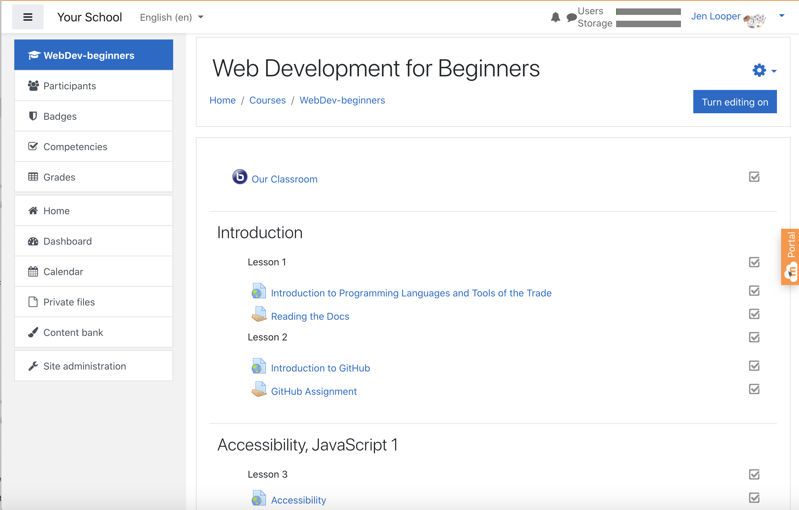

<!--
CO_OP_TRANSLATOR_METADATA:
{
  "original_hash": "71009af209f81cc01a1f2d324200375f",
  "translation_date": "2025-10-03T08:38:59+00:00",
  "source_file": "for-teachers.md",
  "language_code": "fa"
}
-->
### برای مربیان

شما می‌توانید از این برنامه درسی در کلاس خود استفاده کنید. این برنامه به‌طور یکپارچه با GitHub Classroom و پلتفرم‌های LMS پیشرو کار می‌کند و همچنین می‌توان آن را به‌عنوان یک مخزن مستقل با دانش‌آموزان استفاده کرد.

### استفاده با GitHub Classroom

برای مدیریت درس‌ها و تکالیف به‌صورت گروهی، برای هر درس یک مخزن جداگانه ایجاد کنید تا GitHub Classroom بتواند هر تکلیف را به‌طور مستقل پیوست کند.

- این مخزن را به سازمان خود فورک کنید.
- برای هر درس یک مخزن جداگانه ایجاد کنید و پوشه درس مربوطه را به مخزن خودش منتقل کنید.
  - گزینه اول: مخازن خالی ایجاد کنید (یکی برای هر درس) و محتوای پوشه درس را به هر کدام کپی کنید.
  - گزینه دوم: از رویکردی که تاریخچه Git را حفظ می‌کند استفاده کنید (مثلاً تقسیم یک پوشه به یک مخزن جدید) اگر به سابقه نیاز دارید.
- در GitHub Classroom، برای هر درس یک تکلیف ایجاد کنید و آن را به مخزن درس مربوطه متصل کنید.
- تنظیمات پیشنهادی:
  - دید مخزن: خصوصی برای کار دانش‌آموزان.
  - استفاده از کد اولیه از شاخه پیش‌فرض مخزن درس.
  - افزودن قالب‌های Issue و Pull Request برای آزمون‌ها و ارسال‌ها.
  - در صورت وجود، به‌صورت اختیاری تنظیمات خودکار نمره‌دهی و آزمون‌ها را پیکربندی کنید.
- کنوانسیون‌هایی که کمک می‌کنند:
  - نام‌های مخزن مانند lesson-01-intro، lesson-02-html و غیره.
  - برچسب‌ها: quiz، assignment، needs-review، late، resubmission.
  - برچسب‌ها/نسخه‌ها برای هر گروه (مثلاً v2025-term1).

نکته: از ذخیره مخازن داخل پوشه‌های همگام‌سازی شده (مانند OneDrive/Google Drive) خودداری کنید تا از تضادهای Git در ویندوز جلوگیری شود.

### استفاده با Moodle، Canvas یا Blackboard

این برنامه درسی شامل بسته‌های قابل وارد کردن برای جریان‌های کاری رایج LMS است.

- Moodle: از فایل آپلود Moodle [فایل آپلود Moodle](../../../../../../../teaching-files/webdev-moodle.mbz) برای بارگذاری کل دوره استفاده کنید.
- Common Cartridge: از فایل Common Cartridge [فایل Common Cartridge](../../../../../../../teaching-files/webdev-common-cartridge.imscc) برای سازگاری گسترده‌تر LMS استفاده کنید.
- نکات:
  - Moodle Cloud پشتیبانی محدودی از Common Cartridge دارد. فایل Moodle بالا را ترجیح دهید که همچنین می‌تواند در Canvas بارگذاری شود.
  - پس از وارد کردن، ماژول‌ها، تاریخ‌های سررسید و تنظیمات آزمون را بررسی کنید تا با برنامه ترم شما مطابقت داشته باشد.

> برنامه درسی در کلاس Moodle

> برنامه درسی در Canvas

### استفاده مستقیم از مخزن (بدون Classroom)

اگر ترجیح می‌دهید از GitHub Classroom استفاده نکنید، می‌توانید دوره را مستقیماً از این مخزن اجرا کنید.

- فرمت‌های هم‌زمان/آنلاین (Zoom/Teams):
  - گرم کردن‌های کوتاه با هدایت مربی اجرا کنید؛ از اتاق‌های گروهی برای آزمون‌ها استفاده کنید.
  - یک بازه زمانی برای آزمون‌ها اعلام کنید؛ دانش‌آموزان پاسخ‌ها را به‌عنوان Issues در GitHub ارسال کنند.
  - برای تکالیف گروهی، دانش‌آموزان در مخازن عمومی درس کار کنند و Pull Request باز کنند.
- فرمت‌های خصوصی/غیرهم‌زمان:
  - دانش‌آموزان هر درس را به مخازن **خصوصی** خود فورک کنند و شما را به‌عنوان همکار اضافه کنند.
  - آن‌ها از طریق Issues (آزمون‌ها) و Pull Requests (تکالیف) در مخزن کلاس شما یا فورک‌های خصوصی خود ارسال کنند.

### بهترین روش‌ها

- یک درس جهت‌یابی درباره اصول Git/GitHub، Issues و PRs ارائه دهید.
- از چک‌لیست‌ها در Issues برای آزمون‌ها/تکالیف چندمرحله‌ای استفاده کنید.
- CONTRIBUTING.md و CODE_OF_CONDUCT.md را اضافه کنید تا هنجارهای کلاس را تنظیم کنید.
- یادداشت‌های دسترسی (متن جایگزین، زیرنویس‌ها) اضافه کنید و فایل‌های PDF قابل چاپ ارائه دهید.
- محتوای خود را برای هر ترم نسخه‌بندی کنید و مخازن درس را پس از انتشار قفل کنید.

### بازخورد و پشتیبانی

ما می‌خواهیم این برنامه درسی برای شما و دانش‌آموزانتان مفید باشد. لطفاً برای گزارش اشکالات، درخواست‌ها یا بهبودها یک Issue جدید در این مخزن باز کنید یا در Teacher Corner بحثی را آغاز کنید.

---

**سلب مسئولیت**:  
این سند با استفاده از سرویس ترجمه هوش مصنوعی [Co-op Translator](https://github.com/Azure/co-op-translator) ترجمه شده است. در حالی که ما تلاش می‌کنیم دقت را حفظ کنیم، لطفاً توجه داشته باشید که ترجمه‌های خودکار ممکن است شامل خطاها یا نادرستی‌ها باشند. سند اصلی به زبان اصلی آن باید به عنوان منبع معتبر در نظر گرفته شود. برای اطلاعات حساس، توصیه می‌شود از ترجمه انسانی حرفه‌ای استفاده کنید. ما مسئولیتی در قبال سوء تفاهم‌ها یا تفسیرهای نادرست ناشی از استفاده از این ترجمه نداریم.