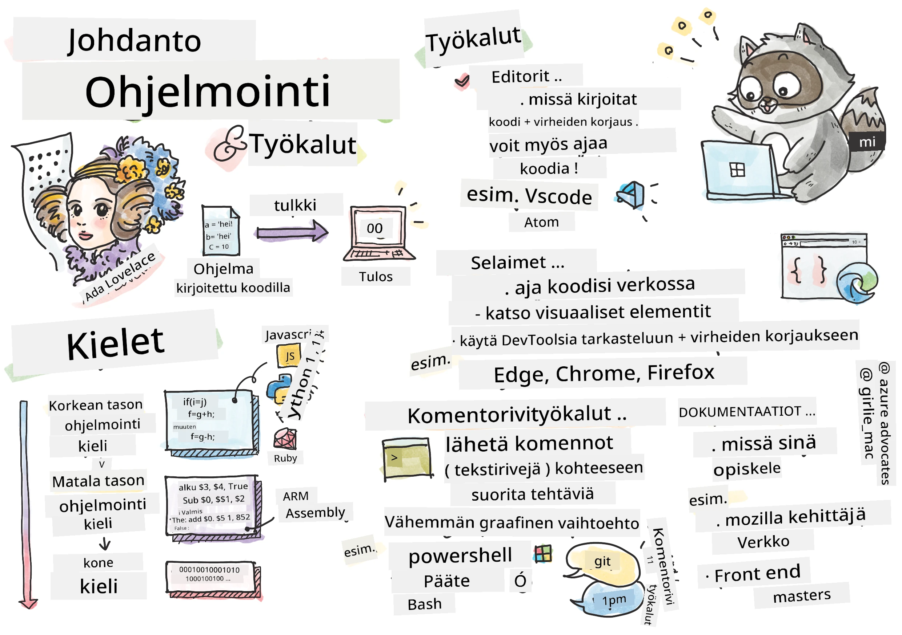
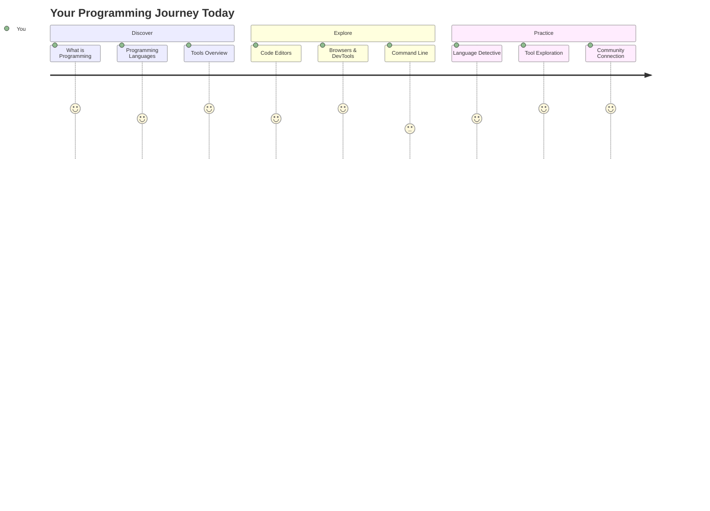
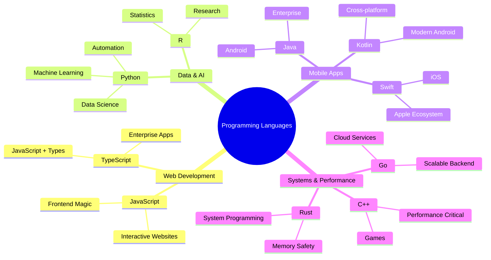
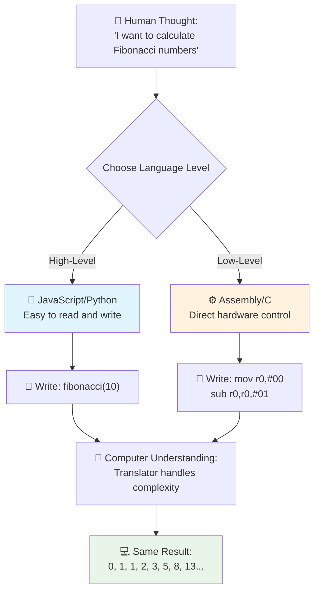
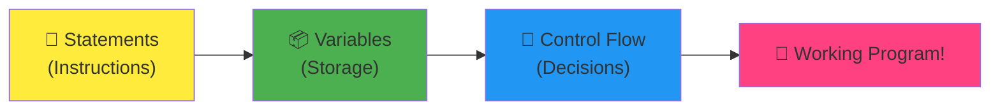
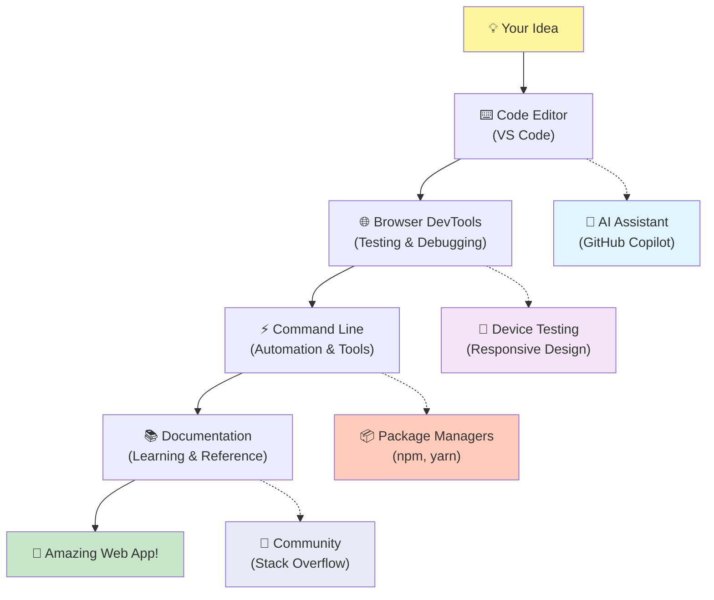
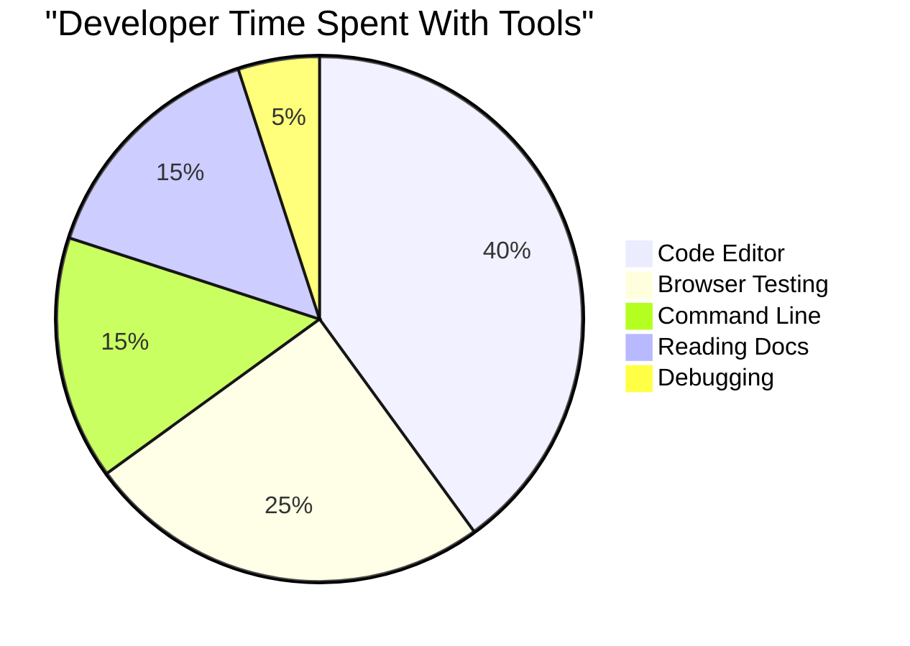
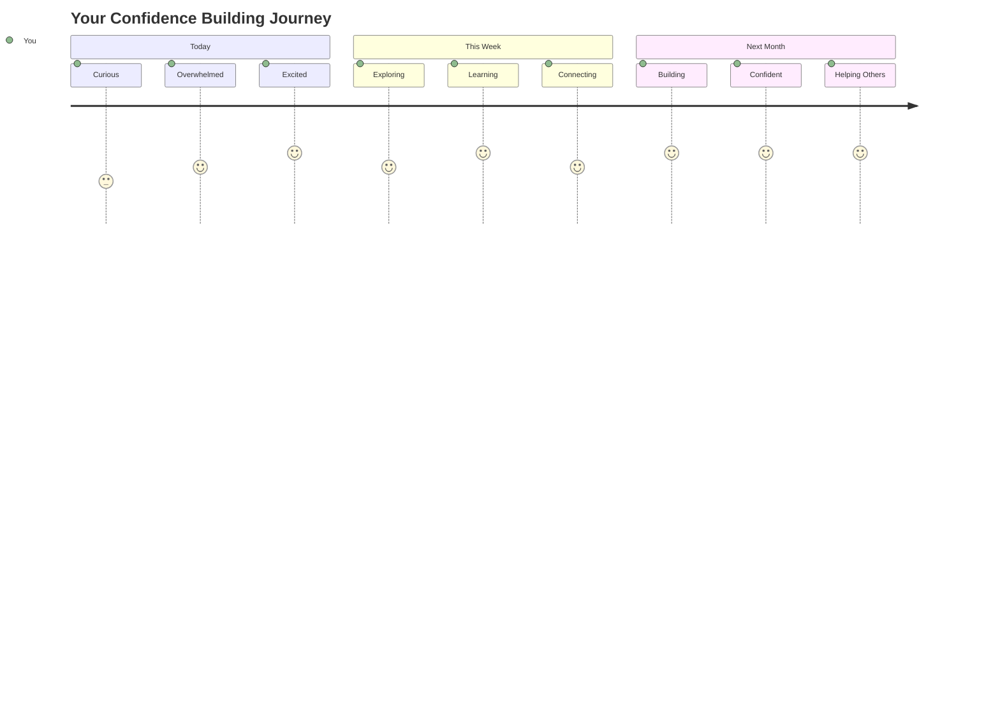

# Johdatus ohjelmointikieliin ja moderneihin kehittäjätyökaluihin

Hei tuleva kehittäjä! 👋 Voinko kertoa sinulle jotain, mikä saa minut edelleen innostumaan joka päivä? Olet juuri astumassa maailmaan, jossa ohjelmointi ei ole pelkästään tietokoneiden kanssa puuhastelua – se on supervoima, jonka avulla voit toteuttaa villeimmät ideasi!

Tiedätkö sen hetken, kun käytät suosikkisovellustasi ja kaikki toimii täydellisesti? Kun painat nappia ja tapahtuu jotain aivan maagista, joka saa sinut ajattelemaan: "Vau, miten he TEKIVÄT tämän?" No, joku aivan kuten sinä – todennäköisesti istuen suosikkikahvilassaan aamuyöllä kolmannen espressonsa kanssa – kirjoitti koodin, joka loi tuon taian. Ja tässä tulee se, mikä räjäyttää mielesi: tämän oppitunnin lopussa et vain ymmärrä, miten he sen tekivät, vaan sinulla on valtava halu kokeilla sitä itse!

Kuule, ymmärrän täysin, jos ohjelmointi tuntuu juuri nyt pelottavalta. Kun aloitin, ajattelin rehellisesti, että sinun täytyy olla jonkinlainen matemaattinen nero tai että sinun olisi pitänyt koodata jo viisivuotiaasta lähtien. Mutta tässä on se, mikä muutti täysin näkemykseni: ohjelmointi on aivan kuin uuden kielen oppimista. Aloitat "hei" ja "kiitos", sitten opit tilaamaan kahvia, ja ennen kuin huomaatkaan, käyt syvällisiä filosofisia keskusteluja! Paitsi että tässä tapauksessa keskustelet tietokoneiden kanssa, ja rehellisesti? Ne ovat kärsivällisimpiä keskustelukumppaneita, joita sinulla koskaan tulee olemaan – ne eivät koskaan tuomitse virheitäsi ja ovat aina valmiita yrittämään uudelleen!

Tänään tutustumme uskomattomiin työkaluihin, jotka tekevät modernista web-kehityksestä paitsi mahdollisen, myös todella koukuttavan. Puhun samoista editoreista, selaimista ja työnkuluista, joita Netflixin, Spotifyn ja suosikkisi indie-sovellusstudion kehittäjät käyttävät joka päivä. Ja tässä tulee se osuus, joka saa sinut tanssimaan ilosta: suurin osa näistä ammattitason, teollisuusstandardin työkaluista on täysin ilmaisia!


> Sketchnote by [Tomomi Imura](https://twitter.com/girlie_mac)



## Katsotaan, mitä jo tiedät!

Ennen kuin sukellamme hauskoihin juttuihin, olen utelias – mitä tiedät jo tästä ohjelmointimaailmasta? Ja kuuntele, jos katsot näitä kysymyksiä ja ajattelet "Minulla ei ole aavistustakaan mistään tästä," se ei ole vain ok, vaan täydellistä! Se tarkoittaa, että olet juuri oikeassa paikassa. Ajattele tätä testiä kuin venyttelyä ennen treeniä – lämmitämme vain aivolihaksia!

[Osallistu ennakkotestiin](https://forms.office.com/r/dru4TE0U9n?origin=lprLink)

## Seikkailu, johon olemme yhdessä ryhtymässä

Okei, olen aidosti innoissani siitä, mitä aiomme tutkia tänään! Vakavasti, toivon, että voisin nähdä ilmeesi, kun jotkut näistä konsepteista loksahtavat paikoilleen. Tässä on uskomaton matka, jonka teemme yhdessä:

- **Mitä ohjelmointi oikeastaan on (ja miksi se on siisteintä ikinä!)** – Tutkimme, miten koodi on kirjaimellisesti näkymätöntä taikaa, joka pyörittää kaikkea ympärilläsi, aina siitä herätyskellosta, joka tietää, että on maanantaiaamu, algoritmiin, joka täydellisesti valitsee Netflix-suosituksesi.
- **Ohjelmointikielet ja niiden hämmästyttävät persoonallisuudet** – Kuvittele, että astut juhliin, jossa jokaisella vieraalla on täysin erilaiset supervoimat ja ongelmanratkaisutaidot. Sellainen on ohjelmointikielten maailma, ja tulet rakastamaan niiden tapaamista!
- **Peruspalikat, jotka saavat digitaalisen taian tapahtumaan** – Ajattele näitä lopullisena luovana LEGO-sarjana. Kun ymmärrät, miten nämä palikat sopivat yhteen, huomaat, että voit kirjaimellisesti rakentaa mitä tahansa, mitä mielikuvituksesi keksii.
- **Ammattilaistyökalut, jotka saavat sinut tuntemaan kuin sinulle olisi annettu taikasauva** – En liioittele – nämä työkalut saavat sinut todella tuntemaan, että sinulla on supervoimia, ja parasta? Ne ovat samoja, joita ammattilaiset käyttävät!

> 💡 **Tässä on juttu**: Älä edes ajattele yrittäväsi muistaa kaikkea tänään! Juuri nyt haluan vain, että tunnet innostuksen siitä, mitä kaikkea on mahdollista tehdä. Yksityiskohdat jäävät mieleen luonnollisesti, kun harjoittelemme yhdessä – näin oikea oppiminen tapahtuu!

> Voit käydä tämän oppitunnin [Microsoft Learnissa](https://docs.microsoft.com/learn/modules/web-development-101/introduction-programming/?WT.mc_id=academic-77807-sagibbon)!

## Mitä ohjelmointi oikeastaan *on*?

Okei, käydään käsiksi miljoonan dollarin kysymykseen: mitä ohjelmointi oikeastaan on?

Kerron sinulle tarinan, joka muutti täysin ajattelutapani. Viime viikolla yritin selittää äidilleni, miten käyttää uutta älytelevision kaukosäädintä. Huomasin sanovani asioita kuten "Paina punaista nappia, mutta ei sitä isoa punaista nappia, vaan sitä pientä punaista nappia vasemmalla... ei, sinun toisella vasemmalla... okei, nyt pidä sitä painettuna kaksi sekuntia, ei yhtä, ei kolmea..." Kuulostaako tutulta? 😅

Tuo on ohjelmointia! Se on taidetta antaa uskomattoman yksityiskohtaisia, vaiheittaisia ohjeita jollekin, joka on erittäin voimakas mutta tarvitsee kaiken selitettynä täydellisesti. Paitsi että äitisi sijaan (joka voi kysyä "mikä punainen nappi?!"), selität tietokoneelle (joka tekee juuri sen, mitä sanot, vaikka se ei olisikaan ihan sitä, mitä tarkoitit).

Tässä on se, mikä räjäytti mieleni, kun opin tämän: tietokoneet ovat itse asiassa melko yksinkertaisia pohjimmiltaan. Ne ymmärtävät kirjaimellisesti vain kaksi asiaa – 1 ja 0, mikä on käytännössä vain "kyllä" ja "ei" tai "päällä" ja "pois." Siinä kaikki! Mutta tässä tulee taika – meidän ei tarvitse puhua 1:illä ja 0:illa kuin olisimme Matrixissa. Siksi **ohjelmointikielet** tulevat apuun. Ne ovat kuin maailman paras kääntäjä, joka muuttaa normaalit ihmisen ajatukset tietokonekieleksi.

Ja tässä on se, mikä saa minut edelleen kylmille väreille joka aamu, kun herään: kirjaimellisesti *kaikki* digitaalinen elämässäsi alkoi jonkun kaltaisesi ihmisen toimesta, joka todennäköisesti istui pyjamissaan kahvikupin kanssa ja kirjoitti koodia kannettavallaan. Se Instagram-suodatin, joka saa sinut näyttämään täydelliseltä? Joku koodasi sen. Suositus, joka johdatti sinut uuteen suosikkikappaleeseesi? Kehittäjä rakensi sen algoritmin. Sovellus, joka auttaa sinua jakamaan ravintolalaskun ystäviesi kanssa? Jep, joku ajatteli "tämä on ärsyttävää, voisin varmaan korjata tämän" ja sitten... he tekivät sen!

Kun opit ohjelmoimaan, et vain opi uutta taitoa – sinusta tulee osa tätä uskomatonta ongelmanratkaisijoiden yhteisöä, joka viettää päivänsä miettien: "Entä jos voisin rakentaa jotain, joka tekee jonkun päivästä hieman paremman?" Rehellisesti, voiko olla mitään siistimpää kuin se?

✅ **Hauska faktaetsintä**: Tässä on jotain todella siistiä, mitä voit etsiä, kun sinulla on hetki aikaa – kuka luulet olleen maailman ensimmäinen tietokoneohjelmoija? Annan sinulle vihjeen: se ei ehkä ole se, mitä odotat! Tämän henkilön tarina on todella kiehtova ja osoittaa, että ohjelmointi on aina ollut luovaa ongelmanratkaisua ja laatikon ulkopuolella ajattelua.

### 🧠 **Tarkistuspiste: Miltä sinusta tuntuu?**

**Pohdi hetki:**
- Tuntuuko ajatus "ohjeiden antamisesta tietokoneille" nyt järkevältä?
- Voitko keksiä päivittäisen tehtävän, jonka haluaisit automatisoida ohjelmoinnin avulla?
- Mitä kysymyksiä sinulla herää tästä koko ohjelmointijutusta?

> **Muista**: On täysin normaalia, jos jotkut käsitteet tuntuvat vielä epäselviltä. Ohjelmoinnin oppiminen on kuin uuden kielen oppimista – aivojen täytyy rakentaa ne hermoyhteydet ajan kanssa. Olet hyvässä vauhdissa!

## Ohjelmointikielet ovat kuin erilaisia taikuuden muotoja

Okei, tämä kuulostaa ehkä oudolta, mutta pysy mukana – ohjelmointikielet ovat kuin erilaisia musiikkityylejä. Mieti: sinulla on jazz, joka on sulavaa ja improvisoitua, rock, joka on voimakasta ja suoraviivaista, klassinen, joka on eleganttia ja strukturoitua, ja hip-hop, joka on luovaa ja ilmeikästä. Jokaisella tyylillä on oma tunnelmansa, oma intohimoisten fanien yhteisönsä, ja jokainen niistä sopii täydellisesti eri tilanteisiin ja mielialoihin.

Ohjelmointikielet toimivat täsmälleen samalla tavalla! Et käyttäisi samaa kieltä hauskan mobiilipelin rakentamiseen kuin käyttäisit valtavan määrän ilmastodatan käsittelyyn, aivan kuten et soittaisi death metalia joogatunnilla (no, useimmilla joogatunneilla ainakin! 😄).

Mutta tässä on se, mikä hämmästyttää minua joka kerta, kun ajattelen sitä: nämä kielet ovat kuin maailman kärsivällisin, briljantti tulkki, joka istuu vieressäsi. Voit ilmaista ideasi tavalla, joka tuntuu luonnolliselta ihmisaivoillesi, ja ne hoitavat kaiken uskomattoman monimutkaisen työn muuntaen sen 1:iksi ja 0:iksi, joita tietokoneet oikeasti puhuvat. Se on kuin ystävä, joka on täydellisesti sujuva sekä "ihmisen luovuudessa" että "tietokoneen logiikassa" – eikä hän koskaan väsy, tarvitse kahvitaukoja tai tuomitse sinua, vaikka kysyisit samaa kysymystä kahdesti!

### Suosittuja ohjelmointikieliä ja niiden käyttötarkoituksia



| Kieli | Parhaat käyttötarkoitukset | Miksi se on suosittu |
|-------|----------------------------|----------------------|
| **JavaScript** | Web-kehitys, käyttöliittymät | Toimii selaimissa ja mahdollistaa interaktiiviset verkkosivut |
| **Python** | Data-analytiikka, automaatio, tekoäly | Helppo lukea ja oppia, tehokkaat kirjastot |
| **Java** | Yrityssovellukset, Android-sovellukset | Alustariippumaton, kestävä suurille järjestelmille |
| **C#** | Windows-sovellukset, pelikehitys | Vahva Microsoft-ekosysteemin tuki |
| **Go** | Pilvipalvelut, taustajärjestelmät | Nopea, yksinkertainen, suunniteltu moderniin laskentaan |

### Korkean tason vs. matalan tason kielet

Okei, tämä oli rehellisesti se konsepti, joka sai aivoni ylikuormittumaan, kun aloitin oppimisen, joten jaan kanssasi vertauksen, joka lopulta sai minut ymmärtämään – ja toivon todella, että se auttaa sinua myös!

Kuvittele, että vierailet maassa, jossa et puhu kieltä, ja sinun täytyy epätoivoisesti löytää lähin wc (olemme kaikki olleet siinä tilanteessa, eikö? 😅):

- **Matalan tason ohjelmointi** on kuin oppisit paikallisen murteen niin hyvin, että voit jutella kadunkulman hedelmiä myyvän isoäidin kanssa käyttäen kulttuuriviittauksia, paikallista slangia ja sisäpiirivitsejä, jotka vain siellä kasvanut ymmärtäisi. Todella vaikuttavaa ja uskomattoman tehokasta... jos satut olemaan sujuva! Mutta melko ylivoimaista, kun yrität vain löytää wc:n.

- **Korkean tason ohjelmointi** on kuin sinulla olisi se mahtava paikallinen ystävä, joka vain ymmärtää sinua. Voit sanoa "Minun täytyy todella löytää wc" tavallisella englannilla, ja hän hoitaa kaiken kulttuurisen käännöksen ja antaa sinulle ohjeet tavalla, joka käy järkeen ei-paikalliselle.

Ohjelmoinnin termein:
- **Matalan tason kielet** (kuten Assembly tai C) antavat sinun käydä uskomattoman yksityiskohtaisia keskusteluja tietokoneen varsinaisen laitteiston kanssa, mutta sinun täytyy ajatella kuin kone, mikä on... no, sanotaan vain, että se on melko suuri henkinen muutos!
- **Korkean tason kielet** (kuten JavaScript, Python tai C#) antavat sinun ajatella kuin ihminen, kun ne hoitavat kaiken konepuheen kulissien takana. Lisäksi niillä on uskomattoman tervetulleita yhteisöjä, jotka ovat täynnä ihmisiä, jotka muistavat, millaista oli olla uusi ja haluavat aidosti auttaa!

Arvaa, mitä suosittelen sinulle aloitettavaksi? 😉 Korkean tason kielet ovat kuin apupyörät, joita et koskaan oikeasti halua ottaa pois, koska ne tekevät koko kokemuksesta niin paljon nautinnollisemman!



### Näytän sinulle, miksi korkean tason kielet ovat niin paljon ystävällisempiä

Okei, aion näyttää sinulle jotain, joka täydellisesti havainnollistaa, miksi rakastuin korkean tason kieliin, mutta ensin – sinun täytyy luvata minulle jotain. Kun näet ensimmäisen koodiesimerkin, älä panikoi! Sen on tarkoitus näyttää pelottavalta. Juuri sitä yritän tässä havainnollistaa!

Katsotaan täsmälleen sama tehtävä kirjoitettuna kahdella täysin erilaisella tyylillä. Molemmat luovat niin sanotun Fibonacci-jonon – se on kaunis matemaattinen kuvio, jossa jokainen luku on kahden edellisen summan: 0, 1, 1, 2, 3, 5, 8, 13... (Hauska fakta: löydät tämän kuvion kirjaimellisesti kaikkialta luonnosta – auringonkukan siemenistä, käpyjen kuvioista, jopa galaksien muodostumisesta!)

Valmis näkemään ero? Mennään!

**Korkean tason kieli (JavaScript) – Ihmisystävällinen:**

```javascript
// Step 1: Basic Fibonacci setup
const fibonacciCount = 10;
let current = 0;
let next = 1;

console.log('Fibonacci sequence:');
```

**Tämä koodi tekee seuraavaa:**
- **Määrittää** vakion, joka kertoo, kuinka monta Fibonacci-lukua haluamme tuottaa
- **Alustaa** kaksi muuttujaa seuraamaan nykyistä ja seuraavaa lukua jonossa
- **Asettaa** aloitusarvot (0 ja 1), jotka määrittävät Fibonacci-kuvion
- **Näyttää** otsikkoviestin, joka kertoo tuloksesta

```javascript
// Step 2: Generate the sequence with a loop
for (let i = 0; i < fibonacciCount; i++) {
  console.log(`Position ${i + 1}: ${current}`);
  
  // Calculate next number in sequence
  const sum = current + next;
  current = next;
  next = sum;
}
```

**Tässä tapahtuu seuraavaa:**
- **Käydään läpi** jokainen sijainti jonossa `for`-silmukalla
- **Näytetään** jokainen luku sen sijainnin kanssa käyttämällä mallilausekkeita
- **Lasketaan** seuraava Fibonacci-luku lisäämällä nykyinen ja seuraava arvo
- **Päivitetään** seurantamuuttujat siirtyäksemme seuraavaan iteraatioon

```javascript
// Step 3: Modern functional approach
const generateFibonacci = (count) => {
  const sequence = [0, 1];
  
  for (let i = 2; i < count; i++) {
    sequence[i] = sequence[i - 1] + sequence[i - 2];
  }
  
  return sequence;
};

// Usage example
const fibSequence = generateFibonacci(10);
console.log(fibSequence);
```

**Yllä teimme:**
- **Luoimme** uudelleenkäytettävän funktion modernilla nuolifunktiosyntaksilla
- **Rakensimme** taulukon tallentamaan koko jonon sen sijaan, että näyttäisimme luvut yksi kerrallaan
- **Käytimme** taulukon indeksejä laskeaksemme jokaisen uuden luvun edellisistä arvoista
- **Palautimme** koko jonon joustavasti käytettäväksi ohjelman muissa osissa

**Matalan tason kieli (ARM Assembly) – Tietokoneystävällinen:**

```assembly
 area ascen,code,readonly
 entry
 code32
 adr r0,thumb+1
 bx r0
 code16
thumb
 mov r0,#00
 sub r0,r0,#01
 mov r1,#01
 mov r4,#10
 ldr r2,=0x40000000
back add r0,r1
 str r0,[r2]
 add r2,#04
 mov r3,r0
 mov r0,r1
 mov r1,r3
 sub r4,#01
 cmp r4,#00
 bne back
 end
```

Huomaa, kuinka JavaScript-versio näyttää melkein kuin englanninkielisiltä ohjeilta, kun
- **Kommentit**: Korkean tason ohjelmointikielet kannustavat selittäviin kommentteihin, jotka tekevät koodista itseään dokumentoivan.
- **Rakenne**: JavaScriptin looginen kulku vastaa tapaa, jolla ihmiset ajattelevat ongelmia askel askeleelta.
- **Ylläpito**: JavaScript-version päivittäminen eri vaatimuksia varten on suoraviivaista ja selkeää.

✅ **Tietoa Fibonacci-jonosta**: Tämä uskomattoman kaunis lukujono (jossa jokainen luku on kahden edellisen summa: 0, 1, 1, 2, 3, 5, 8...) esiintyy kirjaimellisesti *kaikkialla* luonnossa! Löydät sen auringonkukan spiraaleista, käpyjen kuvioista, nautilus-kuorten kaarevuudesta ja jopa puiden oksien kasvutavasta. On aika hämmästyttävää, miten matematiikka ja koodi voivat auttaa meitä ymmärtämään ja luomaan uudelleen luonnon kauneuden luomiseen käyttämiä kuvioita!

## Rakennuspalikat, jotka saavat taian aikaan

Okei, nyt kun olet nähnyt, miltä ohjelmointikielet näyttävät käytännössä, puretaanpa perusosat, jotka muodostavat kirjaimellisesti jokaisen koskaan kirjoitetun ohjelman. Ajattele näitä kuin suosikkireseptisi olennaisia aineksia – kun ymmärrät, mitä kukin tekee, pystyt lukemaan ja kirjoittamaan koodia melkein millä tahansa kielellä!

Tämä on vähän kuin ohjelmoinnin kieliopin oppimista. Muistatko koulusta, kun opit substantiiveista, verbeistä ja siitä, miten lauseita muodostetaan? Ohjelmoinnilla on oma kielioppinsa, ja rehellisesti sanottuna se on paljon loogisempaa ja anteeksiantavampaa kuin englannin kielioppi koskaan oli! 😄

### Lauseet: Askeltasolla etenevät ohjeet

Aloitetaan **lauseista** – ne ovat kuin yksittäisiä lauseita keskustelussa tietokoneesi kanssa. Jokainen lause kertoo tietokoneelle, mitä tehdä, vähän kuin antaisi ohjeita: "Käänny tästä vasemmalle", "Pysähdy punaisissa valoissa", "Pysäköi tuohon paikkaan."

Rakastan lauseita niiden luettavuuden takia. Katso tätä:

```javascript
// Basic statements that perform single actions
const userName = "Alex";                    
console.log("Hello, world!");              
const sum = 5 + 3;                         
```

**Tämä koodi tekee seuraavaa:**
- **Määrittää** vakion muuttujan käyttäjän nimen tallentamiseksi
- **Näyttää** tervehdysviestin konsolin tulosteessa
- **Laskee** ja tallentaa matemaattisen operaation tuloksen

```javascript
// Statements that interact with web pages
document.title = "My Awesome Website";      
document.body.style.backgroundColor = "lightblue";
```

**Askel askeleelta, tässä tapahtuu:**
- **Muokkaa** verkkosivun otsikkoa, joka näkyy selaimen välilehdessä
- **Vaihda** koko sivun taustaväri

### Muuttujat: Ohjelmasi muistijärjestelmä

Okei, **muuttujat** ovat rehellisesti yksi suosikkikonsepteistani opettaa, koska ne ovat niin samanlaisia kuin asiat, joita käytät jo joka päivä!

Ajattele hetki puhelimesi yhteystietoluetteloa. Et muista kaikkien puhelinnumeroita ulkoa – sen sijaan tallennat "Äiti", "Paras ystävä" tai "Pizzerian numero, joka toimittaa klo 2 asti" ja annat puhelimesi muistaa varsinaiset numerot. Muuttujat toimivat täsmälleen samalla tavalla! Ne ovat kuin nimettyjä säiliöitä, joihin ohjelmasi voi tallentaa tietoa ja hakea sen myöhemmin nimen avulla, joka oikeasti käy järkeen.

Tässä on hienoa: muuttujat voivat muuttua ohjelman suorittamisen aikana (siitä nimi "muuttuja" – ymmärrätkö, mitä he tekivät?). Aivan kuten päivittäisit pizzerian yhteystiedot, kun löydät vielä paremman paikan, muuttujia voidaan päivittää, kun ohjelmasi oppii uutta tietoa tai tilanteet muuttuvat!

Näytän, kuinka kauniin yksinkertaista tämä voi olla:

```javascript
// Step 1: Creating basic variables
const siteName = "Weather Dashboard";        
let currentWeather = "sunny";               
let temperature = 75;                       
let isRaining = false;                      
```

**Näiden käsitteiden ymmärtäminen:**
- **Tallenna** muuttumattomat arvot `const`-muuttujiin (kuten sivuston nimi)
- **Käytä** `let`-muuttujia arvoille, jotka voivat muuttua ohjelman aikana
- **Määritä** erilaisia tietotyyppejä: merkkijonoja (tekstiä), numeroita ja totuusarvoja (true/false)
- **Valitse** kuvaavia nimiä, jotka selittävät, mitä kukin muuttuja sisältää

```javascript
// Step 2: Working with objects to group related data
const weatherData = {                       
  location: "San Francisco",
  humidity: 65,
  windSpeed: 12
};
```

**Yllä olevassa olemme:**
- **Luoneet** olion ryhmitelläksemme yhteen liittyviä säätietoja
- **Järjestäneet** useita tietoja yhden muuttujan alle
- **Käyttäneet** avain-arvopareja merkitsemään jokainen tieto selkeästi

```javascript
// Step 3: Using and updating variables
console.log(`${siteName}: Today is ${currentWeather} and ${temperature}°F`);
console.log(`Wind speed: ${weatherData.windSpeed} mph`);

// Updating changeable variables
currentWeather = "cloudy";                  
temperature = 68;                          
```

**Ymmärretään jokainen osa:**
- **Näytä** tietoa käyttämällä mallilausekkeita `${}`-syntaksilla
- **Pääsy** olion ominaisuuksiin piste-notaatiolla (`weatherData.windSpeed`)
- **Päivitä** `let`-muuttujia muuttuvien olosuhteiden mukaan
- **Yhdistä** useita muuttujia luodaksesi merkityksellisiä viestejä

```javascript
// Step 4: Modern destructuring for cleaner code
const { location, humidity } = weatherData; 
console.log(`${location} humidity: ${humidity}%`);
```

**Mitä sinun tulee tietää:**
- **Poimi** tiettyjä ominaisuuksia olioista käyttämällä hajautusmäärittelyä
- **Luo** uusia muuttujia automaattisesti samoilla nimillä kuin olion avaimet
- **Yksinkertaista** koodia välttämällä toistuvaa piste-notaatiota

### Ohjausvirta: Opeta ohjelmaasi ajattelemaan

Okei, tässä kohtaa ohjelmointi muuttuu todella hämmästyttäväksi! **Ohjausvirta** tarkoittaa käytännössä ohjelman opettamista tekemään fiksuja päätöksiä, aivan kuten sinä teet joka päivä ajattelematta sitä.

Kuvittele tämä: tänä aamuna kävit todennäköisesti läpi jotain sellaista kuin "Jos sataa, otan sateenvarjon. Jos on kylmä, puen takin. Jos olen myöhässä, jätän aamiaisen väliin ja nappaan kahvin matkalla." Aivosi seuraavat luonnollisesti tällaista jos-niin logiikkaa kymmeniä kertoja päivässä!

Tämä tekee ohjelmista älykkäitä ja eloisia sen sijaan, että ne vain seuraisivat tylsää, ennalta määrättyä käsikirjoitusta. Ne voivat oikeasti tarkastella tilannetta, arvioida mitä tapahtuu ja reagoida asianmukaisesti. Se on kuin antaisi ohjelmallesi aivot, jotka voivat sopeutua ja tehdä valintoja!

Haluatko nähdä, kuinka kauniisti tämä toimii? Näytän sinulle:

```javascript
// Step 1: Basic conditional logic
const userAge = 17;

if (userAge >= 18) {
  console.log("You can vote!");
} else {
  const yearsToWait = 18 - userAge;
  console.log(`You'll be able to vote in ${yearsToWait} year(s).`);
}
```

**Tämä koodi tekee seuraavaa:**
- **Tarkistaa**, täyttääkö käyttäjän ikä äänestysvaatimuksen
- **Suorittaa** eri koodilohkoja ehdon tuloksen perusteella
- **Laskee** ja näyttää, kuinka kauan äänestyskelpoisuuteen on aikaa, jos ikä on alle 18
- **Tarjoaa** tarkkaa ja hyödyllistä palautetta jokaiseen tilanteeseen

```javascript
// Step 2: Multiple conditions with logical operators
const userAge = 17;
const hasPermission = true;

if (userAge >= 18 && hasPermission) {
  console.log("Access granted: You can enter the venue.");
} else if (userAge >= 16) {
  console.log("You need parent permission to enter.");
} else {
  console.log("Sorry, you must be at least 16 years old.");
}
```

**Tässä tapahtuu:**
- **Yhdistää** useita ehtoja `&&` (ja)-operaattorilla
- **Luo** ehtohierarkian käyttämällä `else if` useille skenaarioille
- **Käsittele** kaikki mahdolliset tapaukset viimeisellä `else`-lauseella
- **Tarjoa** selkeää ja toimivaa palautetta jokaiseen eri tilanteeseen

```javascript
// Step 3: Concise conditional with ternary operator
const votingStatus = userAge >= 18 ? "Can vote" : "Cannot vote yet";
console.log(`Status: ${votingStatus}`);
```

**Mitä sinun tulee muistaa:**
- **Käytä** ternääristä operaattoria (`? :`) yksinkertaisiin kahden vaihtoehdon ehtoihin
- **Kirjoita** ehto ensin, sitten `?`, sen jälkeen tosi-tulos, sitten `:`, ja lopuksi epätosi-tulos
- **Sovella** tätä mallia, kun sinun täytyy määrittää arvoja ehtojen perusteella

```javascript
// Step 4: Handling multiple specific cases
const dayOfWeek = "Tuesday";

switch (dayOfWeek) {
  case "Monday":
  case "Tuesday":
  case "Wednesday":
  case "Thursday":
  case "Friday":
    console.log("It's a weekday - time to work!");
    break;
  case "Saturday":
  case "Sunday":
    console.log("It's the weekend - time to relax!");
    break;
  default:
    console.log("Invalid day of the week");
}
```

**Tämä koodi tekee seuraavaa:**
- **Vertailee** muuttujan arvoa useisiin tiettyihin tapauksiin
- **Ryhmittele** samankaltaiset tapaukset yhteen (arkipäivät vs. viikonloput)
- **Suorita** sopiva koodilohko, kun osuma löytyy
- **Sisällytä** `default`-tapaus odottamattomien arvojen käsittelemiseksi
- **Käytä** `break`-lauseita estääksesi koodin jatkumisen seuraavaan tapaukseen

> 💡 **Reaaliaikainen vertauskuva**: Ajattele ohjausvirtaa kuin maailman kärsivällisintä GPS:ää, joka antaa sinulle ohjeita. Se saattaa sanoa "Jos Main Streetillä on ruuhkaa, ota moottoritie. Jos moottoritiellä on rakennustöitä, kokeile maisemareittiä." Ohjelmat käyttävät täsmälleen samaa ehdollista logiikkaa reagoidakseen älykkäästi eri tilanteisiin ja tarjotakseen käyttäjille parhaan mahdollisen kokemuksen.

### 🎯 **Käsitteiden tarkistus: Rakennuspalikoiden hallinta**

**Katsotaan, miten olet omaksunut perusteet:**
- Voitko selittää omin sanoin eron muuttujan ja lauseen välillä?
- Mieti todellisen maailman tilannetta, jossa käyttäisit jos-niin päätöstä (kuten äänestysesimerkki)
- Mikä ohjelmointilogiikassa yllätti sinut?

**Nopea itseluottamusbuusti:**


✅ **Mitä seuraavaksi**: Meillä tulee olemaan aivan mahtavaa, kun sukellamme syvemmälle näihin käsitteisiin ja jatkamme tätä uskomatonta matkaa yhdessä! Juuri nyt keskity vain tuntemaan innostusta kaikista edessä olevista upeista mahdollisuuksista. Tietyt taidot ja tekniikat jäävät mieleen luonnollisesti, kun harjoittelemme yhdessä – lupaan, että tämä tulee olemaan paljon hauskempaa kuin odotit!

## Työkalut käyttöön

Okei, tämä on rehellisesti se kohta, jossa innostun niin paljon, että tuskin pysyn paikallani! 🚀 Puhumme nyt uskomattomista työkaluista, jotka saavat sinut tuntemaan kuin sinulle olisi juuri annettu avaimet digitaaliseen avaruusalukseen.

Tiedätkö, miten kokilla on täydellisesti tasapainotetut veitset, jotka tuntuvat kuin käden jatkeilta? Tai miten muusikolla on se yksi kitara, joka tuntuu laulavan heti, kun hän koskettaa sitä? No, kehittäjillä on oma versio näistä maagisista työkaluista, ja tässä on se, mikä tulee täysin hämmästyttämään sinut – suurin osa niistä on täysin ilmaisia!

Olen melkein hyppimässä tuolissani ajatellessani näiden jakamista kanssasi, koska ne ovat täysin mullistaneet tavan, jolla rakennamme ohjelmistoja. Puhumme tekoälyllä toimivista koodausavustajista, jotka voivat auttaa kirjoittamaan koodiasi (en edes vitsaile!), pilviympäristöistä, joissa voit rakentaa kokonaisia sovelluksia kirjaimellisesti mistä tahansa, missä on Wi-Fi, ja virheenkorjaustyökaluista, jotka ovat niin kehittyneitä, että ne ovat kuin röntgennäkö ohjelmillesi.

Ja tässä on se osa, joka edelleen antaa minulle kylmiä väreitä: nämä eivät ole "aloittelijatyökaluja", jotka jäävät tarpeettomiksi. Nämä ovat täsmälleen samoja ammattikäyttöön tarkoitettuja työkaluja, joita Google, Netflix ja se indie-sovellusstudio, jota rakastat, käyttävät juuri tällä hetkellä. Tulet tuntemaan itsesi todelliseksi ammattilaiseksi niitä käyttäessäsi!



### Koodieditorit ja IDE:t: Uudet digitaaliset parhaat ystäväsi

Puhutaan koodieditoreista – nämä tulevat vakavasti ottaen olemaan uusia suosikkipaikkojasi viettää aikaa! Ajattele niitä henkilökohtaisena koodauspyhättönäsi, jossa vietät suurimman osan ajastasi luoden ja viimeistellen digitaalisia luomuksiasi.

Mutta tässä on modernien editorien taika: ne eivät ole vain hienoja tekstieditoreita. Ne ovat kuin sinulla olisi kaikkein loistavin, tukevin koodausmentori istumassa vieressäsi 24/7. Ne korjaavat kirjoitusvirheesi ennen kuin edes huomaat niitä, ehdottavat parannuksia, jotka saavat sinut näyttämään nerolta, auttavat sinua ymmärtämään, mitä jokainen koodin osa tekee, ja jotkut niistä voivat jopa ennustaa, mitä olet kirjoittamassa ja tarjota valmiita ehdotuksia!

Muistan, kun ensimmäisen kerran löysin automaattisen täydennyksen – tunsin kirjaimellisesti eläväni tulevaisuudessa. Aloitat kirjoittamisen, ja editorisi sanoo: "Hei, ajattelitko tätä funktiota, joka tekee juuri sen, mitä tarvitset?" Se on kuin sinulla olisi ajatustenlukija koodauskaverina!

**Mikä tekee näistä editoreista niin uskomattomia?**

Modernit koodieditorit tarjoavat vaikuttavan valikoiman ominaisuuksia, jotka parantavat tuottavuuttasi:

| Ominaisuus | Mitä se tekee | Miksi se auttaa |
|------------|---------------|-----------------|
| **Syntaksin korostus** | Värittää koodin eri osat | Tekee koodista helpommin luettavaa ja virheet helpommin havaittavia |
| **Automaattinen täydennys** | Ehdottaa koodia kirjoittaessasi | Nopeuttaa koodausta ja vähentää kirjoitusvirheitä |
| **Virheenkorjaustyökalut** | Auttaa löytämään ja korjaamaan virheitä | Säästää tunteja ongelmien selvittämisessä |
| **Laajennukset** | Lisää erikoistuneita ominaisuuksia | Mukauta editorisi mille tahansa teknologialle |
| **Tekoälyavustajat** | Ehdottaa koodia ja selityksiä | Nopeuttaa oppimista ja tuottavuutta |

> 🎥 **Videomateriaali**: Haluatko nähdä nämä työkalut toiminnassa? Katso tämä [Tools of the Trade -video](https://youtube.com/watch?v=69WJeXGBdxg) saadaksesi kattavan yleiskatsauksen.

#### Suositellut editorit web-kehitykseen

**[Visual Studio Code](https://code.visualstudio.com/?WT.mc_id=academic-77807-sagibbon)** (Ilmainen)
- Suosituin web-kehittäjien keskuudessa
- Erinomainen laajennusekosysteemi
- Sisäänrakennettu terminaali ja Git-integraatio
- **Pakolliset laajennukset**:
  - [GitHub Copilot](https://marketplace.visualstudio.com/items?itemName=GitHub.copilot) - Tekoälyllä toimivat koodiehdotukset
  - [Live Share](https://marketplace.visualstudio.com/items?itemName=MS-vsliveshare.vsliveshare) - Reaaliaikainen yhteistyö
  - [Prettier](https://marketplace.visualstudio.com/items?itemName=esbenp.prettier-vscode) - Automaattinen koodin muotoilu
  - [Code Spell Checker](https://marketplace.visualstudio.com/items?itemName=streetsidesoftware.code-spell-checker) - Koodin kirjoitusvirheiden tarkistus

**[JetBrains WebStorm](https://www.jetbrains.com/webstorm/)** (Maksullinen, ilmainen opiskelijoille)
- Kehittyneet virheenkorjaus- ja testausvälineet
- Älykäs koodin täydennys
- Sisäänrakennettu versionhallinta

**Pilvipohjaiset IDE:t** (Vaihtelevat hinnat)
- [GitHub Codespaces](https://github.com/features/codespaces) - Täysi VS Code selaimessasi
- [Replit](https://replit.com/) - Loistava oppimiseen ja koodin jakamiseen
- [StackBlitz](https://stackblitz.com/) - Välitön, täyden pinon web-kehitys

> 💡 **Aloitusvinkki**: Aloita Visual Studio Codella – se on ilmainen, laajasti käytetty teollisuudessa ja sillä on valtava yhteisö, joka luo hyödyllisiä opetusmateriaaleja ja laajennuksia.

### Verkkoselaimet: Salainen kehityslaboratoriosi

Okei, valmistaudu hämmästymään täysin! Tiedätkö, miten olet käyttänyt selaimia
Kun joku näytti minulle selaimen DevTools-työkalut ensimmäistä kertaa, vietin noin kolme tuntia vain klikkaillen ympäriinsä ja huudahdellen: "MITÄ, SE OSAA TEHDÄ TUONKIN?!" Voit kirjaimellisesti muokata mitä tahansa verkkosivustoa reaaliajassa, nähdä tarkalleen kuinka nopeasti kaikki latautuu, testata miltä sivustosi näyttää eri laitteilla ja jopa debugata JavaScriptiä kuin todellinen ammattilainen. Se on aivan uskomatonta!

**Tässä syy, miksi selaimet ovat salainen aseesi:**

Kun luot verkkosivuston tai -sovelluksen, sinun täytyy nähdä, miltä se näyttää ja miten se toimii oikeassa maailmassa. Selaimet eivät ainoastaan näytä työtäsi, vaan ne tarjoavat myös yksityiskohtaista palautetta suorituskyvystä, saavutettavuudesta ja mahdollisista ongelmista.

#### Selaimen kehittäjätyökalut (DevTools)

Modernit selaimet sisältävät kattavat kehitystyökalut:

| Työkalukategoria | Mitä se tekee | Esimerkki käyttötapauksesta |
|------------------|---------------|-----------------------------|
| **Element Inspector** | Näytä ja muokkaa HTML/CSS reaaliajassa | Muokkaa tyylejä ja näe tulokset heti |
| **Konsoli** | Näytä virheilmoitukset ja testaa JavaScriptiä | Debugaa ongelmia ja kokeile koodia |
| **Verkkoseuranta** | Seuraa resurssien latautumista | Optimoi suorituskyky ja latausajat |
| **Saavutettavuuden tarkistus** | Testaa inklusiivista suunnittelua | Varmista, että sivustosi toimii kaikille käyttäjille |
| **Laitteiden simulaattori** | Esikatsele eri näyttökokoja | Testaa responsiivista suunnittelua ilman useita laitteita |

#### Suositellut selaimet kehitykseen

- **[Chrome](https://developers.google.com/web/tools/chrome-devtools/)** - Alan standardi DevTools-työkaluilla ja kattavalla dokumentaatiolla
- **[Firefox](https://developer.mozilla.org/docs/Tools)** - Erinomainen CSS Grid- ja saavutettavuustyökalu
- **[Edge](https://docs.microsoft.com/microsoft-edge/devtools-guide-chromium/?WT.mc_id=academic-77807-sagibbon)** - Perustuu Chromiumiin ja sisältää Microsoftin kehittäjäresurssit

> ⚠️ **Tärkeä testausvinkki**: Testaa verkkosivustosi aina useilla selaimilla! Se, mikä toimii täydellisesti Chromessa, saattaa näyttää erilaiselta Safarissa tai Firefoxissa. Ammattikehittäjät testaavat kaikilla suurilla selaimilla varmistaakseen yhtenäisen käyttäjäkokemuksen.

### Komentorivityökalut: Kehittäjän supervoimien portti

Okei, ollaanpa täysin rehellisiä komentorivistä, koska haluan kertoa tämän sinulle sellaiselta, joka todella ymmärtää. Kun näin sen ensimmäistä kertaa – vain pelottava musta ruutu vilkkuvalla tekstillä – ajattelin kirjaimellisesti: "Ei, ei todellakaan! Tämä näyttää joltain 1980-luvun hakkerielokuvasta, enkä todellakaan ole tarpeeksi fiksu tähän!" 😅

Mutta tässä on se, mitä toivon jonkun kertoneen minulle silloin, ja mitä kerron sinulle nyt: komentorivi ei ole pelottava – se on itse asiassa kuin suora keskustelu tietokoneesi kanssa. Ajattele sitä kuin eroa tilata ruokaa hienon sovelluksen kautta, jossa on kuvia ja valikoita (mikä on mukavaa ja helppoa), verrattuna siihen, että astut sisään suosikkiravintolaasi, jossa kokki tietää tarkalleen, mistä pidät, ja voi loihtia jotain täydellistä vain sanomalla "yllätä minut jollain mahtavalla."

Komentorivi on paikka, jossa kehittäjät tuntevat itsensä todellisiksi velhoiksi. Kirjoitat muutaman taianomaisen sanan (okei, ne ovat vain komentoja, mutta ne tuntuvat taianomaisilta!), painat enteriä, ja BOOM – olet luonut kokonaisia projektirakenteita, asentanut tehokkaita työkaluja ympäri maailmaa tai julkaissut sovelluksesi internetiin miljoonien ihmisten nähtäväksi. Kun saat ensimmäisen maistiaisen siitä voimasta, se on rehellisesti sanottuna melko koukuttavaa!

**Miksi komentorivistä tulee suosikkityökalusi:**

Vaikka graafiset käyttöliittymät ovat hyviä moniin tehtäviin, komentorivi loistaa automaatiossa, tarkkuudessa ja nopeudessa. Monet kehitystyökalut toimivat ensisijaisesti komentorivikäyttöliittymien kautta, ja niiden tehokas käyttö voi parantaa tuottavuuttasi merkittävästi.

```bash
# Step 1: Create and navigate to project directory
mkdir my-awesome-website
cd my-awesome-website
```

**Tämä koodi tekee seuraavaa:**
- **Luo** uuden hakemiston nimeltä "my-awesome-website" projektillesi
- **Siirry** juuri luotuun hakemistoon aloittaaksesi työn

```bash
# Step 2: Initialize project with package.json
npm init -y

# Install modern development tools
npm install --save-dev vite prettier eslint
npm install --save-dev @eslint/js
```

**Vaihe vaiheelta, tässä tapahtuu:**
- **Alustetaan** uusi Node.js-projekti oletusasetuksilla komennolla `npm init -y`
- **Asennetaan** Vite moderniksi rakennustyökaluksi nopeaan kehitykseen ja tuotantoversioihin
- **Lisätään** Prettier automaattiseen koodin muotoiluun ja ESLint koodin laadun tarkistamiseen
- **Käytetään** `--save-dev`-lippua merkitsemään nämä vain kehityskäyttöön tarkoitetuiksi riippuvuuksiksi

```bash
# Step 3: Create project structure and files
mkdir src assets
echo '<!DOCTYPE html><html><head><title>My Site</title></head><body><h1>Hello World</h1></body></html>' > index.html

# Start development server
npx vite
```

**Yllä olevassa olemme:**
- **Järjestäneet** projektimme luomalla erilliset kansiot lähdekoodille ja aineistoille
- **Luoneet** perus HTML-tiedoston asianmukaisella dokumenttirakenteella
- **Käynnistäneet** Vite-kehityspalvelimen live-päivityksille ja moduulien kuuman korvaamisen tueksi

#### Välttämättömät komentorivityökalut web-kehitykseen

| Työkalu | Tarkoitus | Miksi tarvitset sen |
|---------|----------|---------------------|
| **[Git](https://git-scm.com/)** | Versionhallinta | Seuraa muutoksia, tee yhteistyötä muiden kanssa, varmuuskopioi työsi |
| **[Node.js & npm](https://nodejs.org/)** | JavaScript-ajonaika & pakettien hallinta | Aja JavaScriptiä selainten ulkopuolella, asenna moderneja kehitystyökaluja |
| **[Vite](https://vitejs.dev/)** | Rakennustyökalu & kehityspalvelin | Salamannopea kehitys kuuman moduulien korvaamisen avulla |
| **[ESLint](https://eslint.org/)** | Koodin laatu | Löydä ja korjaa automaattisesti ongelmat JavaScriptissäsi |
| **[Prettier](https://prettier.io/)** | Koodin muotoilu | Pidä koodisi johdonmukaisesti muotoiltuna ja helposti luettavana |

#### Alustakohtaiset vaihtoehdot

**Windows:**
- **[Windows Terminal](https://docs.microsoft.com/windows/terminal/?WT.mc_id=academic-77807-sagibbon)** - Moderni, monipuolinen terminaali
- **[PowerShell](https://docs.microsoft.com/powershell/?WT.mc_id=academic-77807-sagibbon)** 💻 - Tehokas skriptikieliympäristö
- **[Command Prompt](https://docs.microsoft.com/windows-server/administration/windows-commands/?WT.mc_id=academic-77807-sagibbon)** 💻 - Perinteinen Windows-komentorivi

**macOS:**
- **[Terminal](https://support.apple.com/guide/terminal/)** 💻 - Sisäänrakennettu terminaalisovellus
- **[iTerm2](https://iterm2.com/)** - Parannettu terminaali edistyneillä ominaisuuksilla

**Linux:**
- **[Bash](https://www.gnu.org/software/bash/)** 💻 - Linuxin vakio komentokuori
- **[KDE Konsole](https://docs.kde.org/trunk5/en/konsole/konsole/index.html)** - Edistynyt terminaaliemulaattori

> 💻 = Esiasennettu käyttöjärjestelmään

> 🎯 **Oppimispolku**: Aloita peruskomennoilla, kuten `cd` (vaihda hakemistoa), `ls` tai `dir` (näytä tiedostot) ja `mkdir` (luo kansio). Harjoittele nykyaikaisia työnkulkuun liittyviä komentoja, kuten `npm install`, `git status` ja `code .` (avaa nykyinen hakemisto VS Codessa). Kun tunnet olosi mukavammaksi, opit luonnollisesti lisää kehittyneitä komentoja ja automaatiotekniikoita.

### Dokumentaatio: Aina saatavilla oleva oppaasi

Okei, haluan jakaa pienen salaisuuden, joka saa sinut tuntemaan olosi paljon paremmaksi aloittelijana: jopa kokeneimmat kehittäjät viettävät suuren osan ajastaan dokumentaatiota lukien. Eikä se johdu siitä, etteivät he tietäisi mitä tekevät – se on itse asiassa merkki viisaudesta!

Ajattele dokumentaatiota kuin maailman kärsivällisimmät ja asiantuntevimmat opettajat, jotka ovat saatavilla 24/7. Ongelma keskellä yötä? Dokumentaatio on siellä lämpimän virtuaalisen halauksen ja juuri oikean vastauksen kanssa. Haluatko oppia jostain siististä uudesta ominaisuudesta, josta kaikki puhuvat? Dokumentaatio auttaa sinua askel askeleelta. Yritätkö ymmärtää, miksi jokin toimii niin kuin toimii? Kyllä – dokumentaatio selittää sen tavalla, joka vihdoin avaa silmäsi!

Tässä on jotain, mikä muutti täysin näkökulmani: verkkokehityksen maailma liikkuu uskomattoman nopeasti, eikä kukaan (siis ei kukaan!) muista kaikkea ulkoa. Olen nähnyt 15+ vuoden kokemuksen omaavien seniorikehittäjien etsivän perussyntaksia, ja tiedätkö mitä? Se ei ole noloa – se on fiksua! Kyse ei ole täydellisestä muistista, vaan siitä, että osaa löytää luotettavat vastaukset nopeasti ja ymmärtää, miten niitä sovelletaan.

**Tässä tapahtuu todellinen taika:**

Ammattikehittäjät käyttävät merkittävän osan ajastaan dokumentaation lukemiseen – ei siksi, etteivät he tietäisi mitä tekevät, vaan koska verkkokehityksen kenttä kehittyy niin nopeasti, että ajan tasalla pysyminen vaatii jatkuvaa oppimista. Hyvä dokumentaatio auttaa sinua ymmärtämään, ei vain *miten* jotain käytetään, vaan myös *miksi* ja *milloin* sitä käytetään.

#### Välttämättömät dokumentaatioresurssit

**[Mozilla Developer Network (MDN)](https://developer.mozilla.org/docs/Web)**
- Verkkoteknologian dokumentaation kultastandardi
- Kattavat oppaat HTML:stä, CSS:stä ja JavaScriptistä
- Sisältää selainten yhteensopivuustiedot
- Tarjoaa käytännön esimerkkejä ja interaktiivisia demoja

**[Web.dev](https://web.dev)** (Googlelta)
- Modernin verkkokehityksen parhaat käytännöt
- Suorituskyvyn optimointiohjeet
- Saavutettavuuden ja inklusiivisen suunnittelun periaatteet
- Tapaustutkimuksia tosielämän projekteista

**[Microsoft Developer Documentation](https://docs.microsoft.com/microsoft-edge/#microsoft-edge-for-developers)**
- Edge-selaimen kehitysresurssit
- Progressiivisten verkkosovellusten oppaat
- Alustojen välisten kehitysten näkemykset

**[Frontend Masters Learning Paths](https://frontendmasters.com/learn/)**
- Jäsenneltyjä oppimispolkuja
- Videokursseja alan asiantuntijoilta
- Käytännön koodausharjoituksia

> 📚 **Opiskelustrategia**: Älä yritä opetella dokumentaatiota ulkoa – opettele sen sijaan navigoimaan siinä tehokkaasti. Tallenna usein käytetyt viitteet kirjanmerkkeihin ja harjoittele hakutoimintojen käyttöä löytääksesi nopeasti tietoa.

### 🔧 **Työkalujen hallinnan tarkistus: Mikä innostaa sinua?**

**Pysähdy hetkeksi miettimään:**
- Mikä työkalu innostaa sinua eniten kokeilemaan ensimmäisenä? (Ei ole väärää vastausta!)
- Tuntuuko komentorivi edelleen pelottavalta, vai herättääkö se uteliaisuutesi?
- Voitko kuvitella käyttäväsi selaimen DevTools-työkaluja kurkistaaksesi suosikkisivustojesi kulissien taakse?



> **Hauska huomio**: Useimmat kehittäjät viettävät noin 40 % ajastaan koodieditorissa, mutta huomaa, kuinka paljon aikaa kuluu testaamiseen, oppimiseen ja ongelmanratkaisuun. Ohjelmointi ei ole vain koodin kirjoittamista – se on kokemusten luomista!

✅ **Ajateltavaa**: Tässä jotain mielenkiintoista pohdittavaa – miten luulet verkkosivustojen rakentamiseen käytettävien työkalujen (kehitys) eroavan niiden ulkoasun suunnitteluun käytettävistä työkaluista (suunnittelu)? Se on kuin ero arkkitehdin, joka suunnittelee kauniin talon, ja urakoitsijan, joka sen oikeasti rakentaa. Molemmat ovat ratkaisevan tärkeitä, mutta he tarvitsevat erilaiset työkalupakit! Tällainen ajattelu auttaa sinua näkemään laajemman kuvan siitä, miten verkkosivustot syntyvät.

## GitHub Copilot Agent -haaste 🚀

Käytä Agent-tilaa suorittaaksesi seuraavan haasteen:

**Kuvaus:** Tutki modernin koodieditorin tai IDE:n ominaisuuksia ja osoita, kuinka se voi parantaa työskentelyäsi web-kehittäjänä.

**Tehtävä:** Valitse koodieditori tai IDE (kuten Visual Studio Code, WebStorm tai pilvipohjainen IDE). Listaa kolme ominaisuutta tai laajennusta, jotka auttavat sinua kirjoittamaan, debuggaamaan tai ylläpitämään koodia tehokkaammin. Kerro lyhyesti, miten kukin hyödyttää työskentelyäsi.

---

## 🚀 Haaste

**Oletko valmis ensimmäiseen tehtävääsi, salapoliisi?**

Nyt kun sinulla on tämä mahtava perusta, minulla on seikkailu, joka auttaa sinua näkemään, kuinka uskomattoman monipuolinen ja kiehtova ohjelmointimaailma todella on. Ja kuuntele – tämä ei vielä koske koodin kirjoittamista, joten ei paineita! Ajattele itseäsi ohjelmointikielten salapoliisina ensimmäisellä jännittävällä tehtävällään!

**Tehtäväsi, jos päätät hyväksyä sen:**
1. **Ryhdy kielitutkijaksi**: Valitse kolme ohjelmointikieltä täysin eri maailmoista – ehkä yksi, joka rakentaa verkkosivustoja, yksi, joka luo mobiilisovelluksia, ja yksi, joka käsittelee dataa tutkijoille. Etsi esimerkkejä samasta yksinkertaisesta tehtävästä, joka on kirjoitettu jokaisella kielellä. Lupaan, että hämmästyt siitä, kuinka erilaisilta ne voivat näyttää tehdessään täsmälleen samaa asiaa!

2. **Paljasta niiden alkuperätarinat**: Mikä tekee kustakin kielestä erityisen? Tässä on siisti fakta – jokainen ohjelmointikieli on luotu, koska joku ajatteli: "Tiedätkö mitä? Tähän tiettyyn ongelmaan täytyy olla parempi ratkaisu." Voitko selvittää, mitkä nuo ongelmat olivat? Jotkut näistä tarinoista ovat todella kiehtovia!

3. **Tutustu yhteisöihin**: Katso, kuinka tervetulleita ja intohimoisia kunkin kielen yhteisöt ovat. Joillakin on miljoonia kehittäjiä, jotka jakavat tietoa ja auttavat toisiaan, toisilla on pienempi mutta erittäin tiivis ja tukeva yhteisö. Tulet rakastamaan nähdäksesi, kuinka erilaisia persoonallisuuksia näillä yhteisöillä on!

4. **Kuuntele vaistoasi**: Mikä kieli tuntuu sinulle tällä hetkellä lähestyttävimmältä? Älä stressaa "täydellisen" valinnan tekemisestä – kuuntele vain vaistojasi! Tässä ei ole väärää vastausta, ja voit aina tutkia muita myöhemmin.

**Bonus salapoliisityö**: Selvitä, mitkä suuret verkkosivustot tai sovellukset on rakennettu kunkin kielen avulla. Takaan, että tulet hämmästymään, kun saat selville, mikä pyörittää Instagramia, Netflixiä tai sitä mobiilipeliä, jota et voi lopettaa
## Arviointi ja itseopiskelu

**Ota aikaa tutkiaksesi ja nauttiaksesi siitä!**

Olet oppinut tänään paljon, ja siitä voit olla ylpeä! Nyt alkaa hauska osuus – tutkia aiheita, jotka herättivät uteliaisuutesi. Muista, tämä ei ole läksy – tämä on seikkailu!

**Sukella syvemmälle asioihin, jotka innostavat sinua:**

**Tutustu ohjelmointikieliin käytännössä:**
- Käy 2-3 sinua kiinnostavan ohjelmointikielen virallisilla verkkosivuilla. Jokaisella niistä on oma persoonallisuutensa ja tarinansa!
- Kokeile online-koodausalustoja, kuten [CodePen](https://codepen.io/), [JSFiddle](https://jsfiddle.net/) tai [Replit](https://replit.com/). Älä pelkää kokeilla – et voi rikkoa mitään!
- Lue, miten suosikkikielesi syntyi. Oikeasti, jotkut näistä tarinoista ovat todella kiehtovia ja auttavat sinua ymmärtämään, miksi kielet toimivat niin kuin toimivat.

**Tule tutuksi uusien työkalujesi kanssa:**
- Lataa Visual Studio Code, jos et ole vielä tehnyt sitä – se on ilmainen ja tulet rakastamaan sitä!
- Käytä muutama minuutti Extensions-markkinapaikan selaamiseen. Se on kuin sovelluskauppa koodieditorillesi!
- Avaa selaimesi kehittäjätyökalut ja klikkaile ympäriinsä. Älä huolehdi, jos et ymmärrä kaikkea – tutustu vain siihen, mitä siellä on.

**Liity yhteisöön:**
- Seuraa joitakin kehittäjäyhteisöjä [Dev.to](https://dev.to/), [Stack Overflow](https://stackoverflow.com/) tai [GitHub](https://github.com/) -sivustoilla. Ohjelmointiyhteisö on uskomattoman vastaanottavainen uusille tulokkaille!
- Katso joitakin aloittelijaystävällisiä koodausvideoita YouTubesta. Siellä on paljon mahtavia sisällöntuottajia, jotka muistavat, millaista on aloittaa alusta.
- Harkitse liittymistä paikallisiin tapaamisiin tai online-yhteisöihin. Uskokaa pois, kehittäjät rakastavat auttaa uusia tulokkaita!

> 🎯 **Kuuntele, tässä on mitä haluan sinun muistavan**: Sinun ei odoteta tulevan koodausvelhoksi yhdessä yössä! Juuri nyt tutustut tähän hämmästyttävään uuteen maailmaan, johon olet liittymässä. Ota aikaa, nauti matkasta ja muista – jokainen ihailemasi kehittäjä oli kerran täsmälleen samassa tilanteessa kuin sinä nyt, innostunut ja ehkä hieman hämmentynyt. Se on täysin normaalia, ja se tarkoittaa, että teet kaiken oikein.

---

## Tehtävä

[Dokumentaation lukeminen](assignment.md)

> 💡 **Pieni vinkki tehtävääsi**: Olisi mahtavaa nähdä sinun tutkivan joitakin työkaluja, joita emme ole vielä käsitelleet! Jätä väliin editorit, selaimet ja komentorivityökalut, joista olemme jo puhuneet – siellä on kokonainen uskomaton maailma upeita kehitystyökaluja, jotka odottavat löytämistä. Etsi sellaisia, joita aktiivisesti ylläpidetään ja joilla on elinvoimaisia, avuliaita yhteisöjä (niillä on yleensä parhaat tutoriaalit ja eniten tukevia ihmisiä, kun väistämättä törmäät haasteisiin ja tarvitset ystävällistä apua).

---

## 🚀 Ohjelmointimatkasi aikajana

### ⚡ **Mitä voit tehdä seuraavan 5 minuutin aikana**
- [ ] Lisää kirjanmerkkeihin 2-3 ohjelmointikielen verkkosivua, jotka herättivät kiinnostuksesi
- [ ] Lataa Visual Studio Code, jos et ole vielä tehnyt sitä
- [ ] Avaa selaimesi kehittäjätyökalut (F12) ja klikkaile ympäriinsä millä tahansa verkkosivulla
- [ ] Liity yhteen ohjelmointiyhteisöön (Dev.to, Reddit r/webdev tai Stack Overflow)

### ⏰ **Mitä voit saavuttaa tämän tunnin aikana**
- [ ] Tee oppitunnin jälkeinen kysely ja pohdi vastauksiasi
- [ ] Asenna VS Codeen GitHub Copilot -laajennus
- [ ] Kokeile "Hello World" -esimerkkiä kahdella eri ohjelmointikielellä verkossa
- [ ] Katso YouTubesta video "Päivä kehittäjän elämässä"
- [ ] Aloita ohjelmointikielen etsintätehtäväsi (haasteesta)

### 📅 **Viikon mittainen seikkailusi**
- [ ] Suorita tehtävä ja tutki 3 uutta kehitystyökalua
- [ ] Seuraa 5 kehittäjää tai ohjelmointiaiheista tiliä sosiaalisessa mediassa
- [ ] Kokeile rakentaa jotain pientä CodePenissä tai Replitissä (vaikka vain "Hei, [Nimesi]!")
- [ ] Lue yksi kehittäjän blogikirjoitus jonkun koodausmatkasta
- [ ] Liity virtuaaliseen tapaamiseen tai katso ohjelmointiaiheinen esitys
- [ ] Aloita valitsemasi kielen opiskelu verkkotutoriaalien avulla

### 🗓️ **Kuukauden mittainen muodonmuutos**
- [ ] Rakenna ensimmäinen pieni projektisi (vaikka yksinkertainen verkkosivu riittää!)
- [ ] Osallistu avoimen lähdekoodin projektiin (aloita dokumentaation korjauksista)
- [ ] Ryhdy mentoriksi jollekin, joka on vasta aloittamassa ohjelmointimatkaansa
- [ ] Luo oma kehittäjäportfoliosivustosi
- [ ] Yhdistä paikallisiin kehittäjäyhteisöihin tai opintoryhmiin
- [ ] Aloita seuraavan oppimistavoitteesi suunnittelu

### 🎯 **Lopullinen pohdinta**

**Ennen kuin jatkat, ota hetki juhliaksesi:**
- Mikä ohjelmoinnissa innosti sinua tänään?
- Mikä työkalu tai konsepti kiinnostaa sinua eniten?
- Miltä sinusta tuntuu aloittaa tämä ohjelmointimatka?
- Mikä kysymys sinulla olisi juuri nyt kehittäjälle?



> 🌟 **Muista**: Jokainen asiantuntija on joskus ollut aloittelija. Jokainen kokenut kehittäjä on joskus tuntenut täsmälleen samoin kuin sinä nyt – innostunut, ehkä hieman hämmentynyt ja ehdottomasti utelias siitä, mitä kaikkea on mahdollista saavuttaa. Olet mahtavassa seurassa, ja tämä matka tulee olemaan uskomaton. Tervetuloa ohjelmoinnin ihmeelliseen maailmaan! 🎉

---

**Vastuuvapauslauseke**:  
Tämä asiakirja on käännetty käyttämällä tekoälypohjaista käännöspalvelua [Co-op Translator](https://github.com/Azure/co-op-translator). Vaikka pyrimme tarkkuuteen, huomioithan, että automaattiset käännökset voivat sisältää virheitä tai epätarkkuuksia. Alkuperäinen asiakirja sen alkuperäisellä kielellä tulisi katsoa ensisijaiseksi lähteeksi. Kriittisen tiedon osalta suositellaan ammattimaista ihmiskäännöstä. Emme ole vastuussa väärinkäsityksistä tai virhetulkinnoista, jotka johtuvat tämän käännöksen käytöstä.