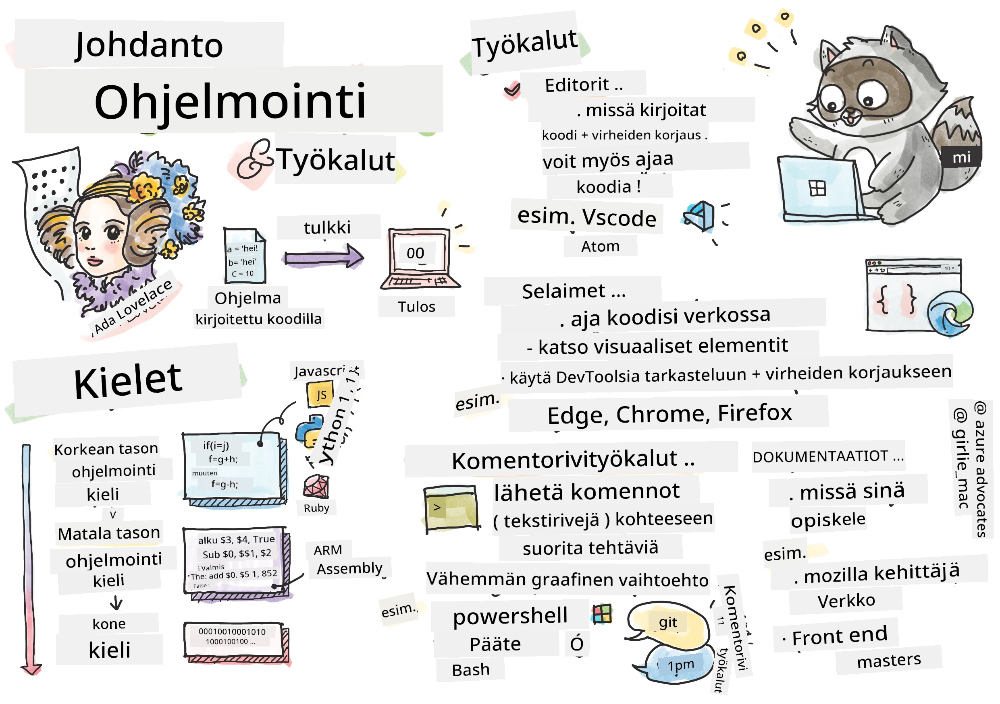
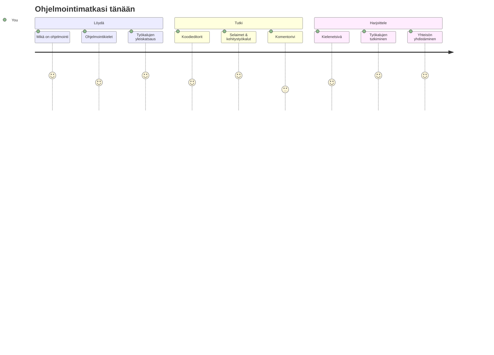
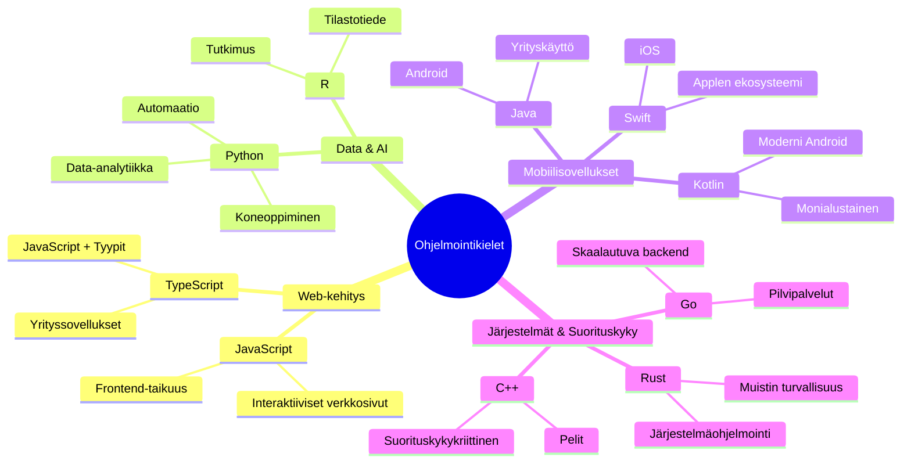
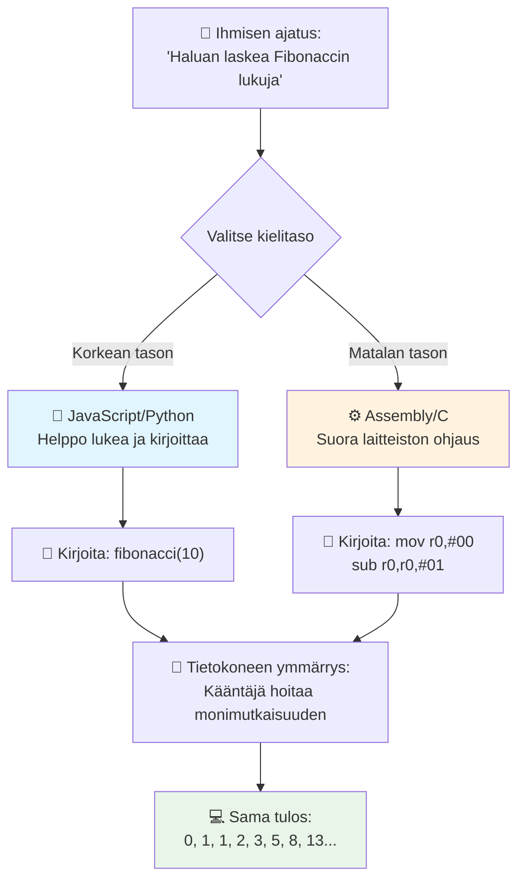
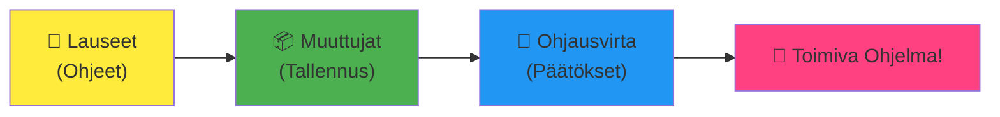
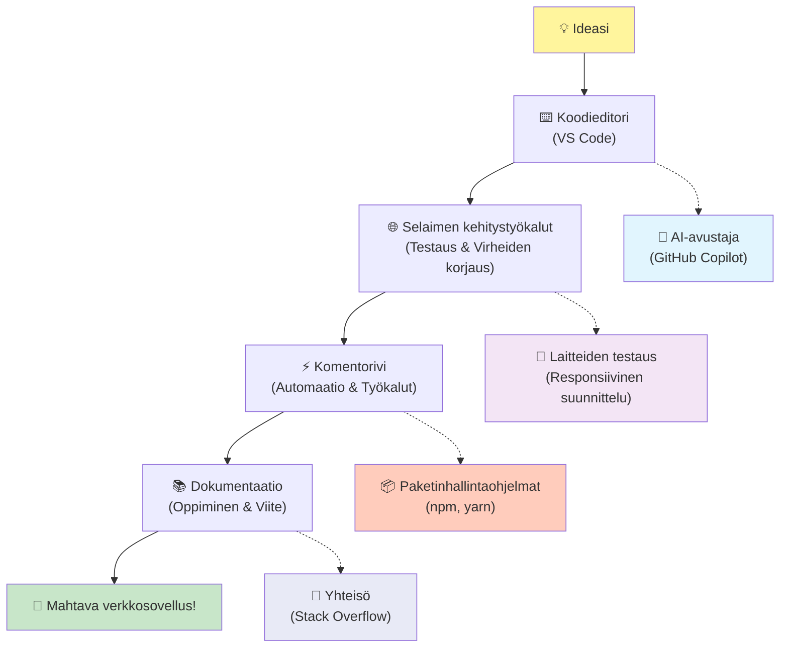
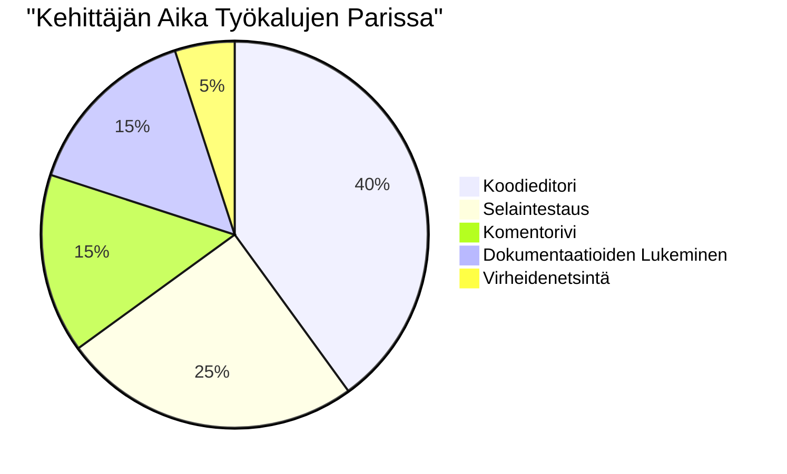

# Johdanto ohjelmointikieliin ja moderneihin kehittäjätyökaluihin
 
Hei siellä, tuleva kehittäjä! 👋 Saanko kertoa sinulle jotain, mikä saa minut yhä joka päivä kylmilleen? Olet kohta huomaamassa, että ohjelmointi ei ole pelkästään tietokoneista – se on kuin todellisia yliluonnollisia voimia, joiden avulla voit toteuttaa villeimmätkin ideasi!

Tiedätkö sen hetken, kun käytät lempisovellustasi ja kaikki vain toimii täydellisesti? Kun napautat painiketta ja tapahtuu jotain täysin taianomaista, joka saa sinut sanomaan "vau, miten he TEKIVÄT sen?" No, joku aivan kuten sinä – todennäköisesti suosikkikahvilassaan klo 2 aamulla kolmannen espressonsa kanssa – kirjoitti koodin, joka loi tuon taian. Ja tässä on se, mikä räjäyttää mielesi: tämän oppitunnin lopussa et pelkästään ymmärrä, miten he sen tekivät, vaan haluat itse kokeilla sitä heti!

Kuule, ymmärrän täysin, jos ohjelmointi tuntuu nyt pelottavalta. Kun aloitin, luulin oikeasti, että täytyy olla jonkinlainen matematiikkagenius tai olla koodannut viisivuotiaasta lähtien. Mutta tässä se, mikä muutti täysin näkemykseni: ohjelmointi on kuin uuden kielen puhumisen opettelua. Aloitat "hei" ja "kiitos" -sanoilla, sitten siirryt kahvin tilaamiseen, ja ennen kuin huomaatkaan, käyt syvällisiä filosofisia keskusteluja! Paitsi että tässä tapauksessa keskustelet tietokoneiden kanssa, ja rehellisesti? Ne ovat kärsivällisimmät keskustelukumppanit, joita voit kuvitella – ne eivät koskaan arvostele virheitäsi ja ne ovat aina innoissaan yrittämään uudelleen!

Tänään tutustumme uskomattomiin työkaluihin, jotka tekevät modernista verkkokehityksestä paitsi mahdollista, myös vakavasti koukuttavaa. Puhun juuri samoista editoreista, selaimista ja työnkuluista, joita Netflixin, Spotifyn ja lempisi itsenäisen sovellusstudion kehittäjät käyttävät joka päivä. Ja tässä on osa, joka saa sinut tanssimaan ilosta: useimmat näistä ammattimaisista, alan standardityökaluista ovat täysin ilmaisia!


> Sketchnote: [Tomomi Imura](https://twitter.com/girlie_mac)


```mermaid
journey
    title Ohjelmointimatkasi tänään
    section Löydä
      Mikä on ohjelmointi: 5: You
      Ohjelmointikielet: 4: You
      Työkalujen yleiskatsaus: 5: You
    section Tutki
      Koodieditorit: 4: You
      Selaimet & kehitystyökalut: 5: You
      Komentorivi: 3: You
    section Harjoittele
      Kielenetsivä: 4: You
      Työkalujen tutkiminen: 5: You
      Yhteisön yhdistäminen: 5: You
```
## Katsotaan, mitä jo osaat!

Ennen kuin hypätään hauskoihin juttuihin, olen utelias – mitä sinä jo tiedät tästä ohjelmoinnin maailmasta? Ja kuule, jos katsot näitä kysymyksiä ajatellen "minulla ei kirjaimellisesti ole mitään käsitystä tästä," se ei ole vain okei, se on täydellistä! Se tarkoittaa, että olet juuri oikeassa paikassa. Ajattele tätä testiä kuin alkulämmittelynä ennen treeniä – lämmittelemme vain aivolihaksiasi!

[Osallistu ennakkotestiin](https://ff-quizzes.netlify.app/web/)


## Seikkailu, johon olemme juuri lähdössä yhdessä

Okei, olen oikeasti täpinöissä siitä, mitä tänään aiomme tutkia! Vakavasti, toivon, että näkisin ilmeesi kun jotkut näistä käsitteistä loksahtaa paikalleen. Tässä on uskomaton matka, jolla olemme yhdessä:

- **Mitä ohjelmointi oikeasti on (ja miksi se on siisteintä koskaan!)** – Tutkimme, miten koodi on kirjaimellisesti näkymätön taika, joka pyörittää kaikkea ympärilläsi, siitä herätyskellosta, joka jotenkin tietää, että on maanantaiaamu, algoritmiin, joka valikoi täydellisesti Netflix-suosituksesi
- **Ohjelmointikielet ja niiden uskomattomat persoonallisuudet** – Kuvittele, että tulet juhliin, joissa jokaisella on täysin erilaiset supervoimat ja ongelmanratkaisutavat. Sellainen on ohjelmointikielten maailma, ja tulet rakastamaan niiden tapaamista!
- **Perusrakennuspalikat, jotka tekevät digitaalisesta taian mahdollisen** – Ajattele näitä kuin täydellistä luovaa LEGO-settiä. Kun ymmärrät, miten nämä palikat sopivat yhteen, huomaat voivasi rakentaa kirjaimellisesti mitä vain, mitä mielikuvituksesi haluaa
- **Ammattilaistyökalut, jotka saavat sinut tuntemaan kuin olisit juuri saanut haltuusi velhojen sauvan** – En liioittele – nämä työkalut saavat sinut oikeasti tuntemaan, että sinulla on supervoimat, ja parasta? Ne ovat samoja, joita ammattilaiset käyttävät!

> 💡 **Tässä on pointti**: Älä edes yritä muistaa kaikkea jo tänään! Nyt haluan vain, että tunnet sen innostuksen kipinän mahdollisuuksista. Yksityiskohdat jäävät mieleen luonnollisesti harjoitellessamme yhdessä – näin oikea oppiminen tapahtuu!

> Voit käydä tämän oppitunnin myös [Microsoft Learnissä](https://learn.microsoft.com/en-us/learn/modules/web-development-101/introduction-programming/?WT.mc_id=academic-77807-sagibbon)!

## Mitä ohjelmointi sitten *oikeasti on*?

Okei, puretaan miljoonan dollarin kysymys: mitä ohjelmointi oikeastaan on?

Kerron sinulle tarinan, joka muutti täysin ajattelutapani tätä kohtaan. Viime viikolla yritin selittää äidilleni, miten käytämme uutta älytelevision kaukosäädintä. Huomasin sanovani asioita kuten "Paina punaista painiketta, mutta ei isoa punaista, vaan pientä punaista vasemmalla... ei, toista sinun vasenta... okei, pidä sitä nyt kahden sekunnin ajan, ei yhden, ei kolmen..." Kuulostaako tutulta? 😅

Se on ohjelmointia! Se on taidetta antaa uskomattoman yksityiskohtaiset, vaihe vaiheelta ohjeet jollekin, joka on hyvin voimakas mutta tarvitsee kaiken selitettynä täydellisesti. Paitsi että sen sijaan, että selittäisit äidillesi (joka voisi kysyä "mikä punainen painike?"), selität tietokoneelle (joka tekee tarkalleen mitä sanot, vaikka et aivan tarkoittaisikaan sitä, mitä sanoit).

Tämä sai minut sanattomaksi ensimmäisenä oppimispäivänäni: tietokoneet ovat oikeasti melko yksinkertaisia ytimeltään. Ne ymmärtävät kirjaimellisesti vain kahta asiaa – ykköstä ja nollaa, joka on käytännössä "kyllä" ja "ei" tai "päälle" ja "pois." Siinä kaikki! Mutta tässä tulee taika – meidän ei tarvitse puhua pelkkiä ykkösiä ja nollia kuin The Matrixissa. Tässä kohtaa **ohjelmointikielet** tulevat apuun. Ne ovat kuin maailman paras kääntäjä, joka muuntaa täysin normaalit ihmismietteesi tietokoneen kielelle.

Ja tässä on se, mikä edelleen saa minut kylmilleen joka aamu herätessäni: kirjaimellisesti *kaikki* digitaalisessa elämässäsi alkoi jostain ihan samasta kuin sinä nyt, varmaan pyjamassa kahvikuppi kädessä kirjoittamassa koodia kannettavallaan. Se Instagram-suodatin, joka saa sinut näyttämään virheettömältä? Joku koodasi sen. Suositus, joka johdatti sinut uuteen suosikkilauluusi? Kehittäjä loi sen algoritmin. Sovellus, joka auttaa yhdessä kavereiden kanssa jakamaan illallisajan laskun? Joo, joku ajatteli "tämä ärsyttää, voin korjata tämän" ja sitten... hän teki sen!

Kun opit ohjelmoimaan, et vain opiskele uutta taitoa – tulet osaksi tätä uskomatonta ongelmanratkaisuyhteisöä, joka käyttää päivänsä pohtien "Mitä jos voisin rakentaa jotain, joka tekee jonkun päivän juuri vähän paremmaksi?" Rehellisesti, onko mitään siistimpää?

✅ **Hauska tietopaja**: Tässä on juttu, jota on tosi hauska etsiä, kun sinulla on hetki vapaata – kuka oli maailman ensimmäinen tietokoneohjelmoija? Annan sinulle vinkin: se ei ehkä ole se, jota odotat! Tarina tästä henkilöstä on todella kiehtova ja osoittaa, että ohjelmointi on aina ollut luovaa ongelmanratkaisua ja laatikon ulkopuolista ajattelua.

### 🧠 **Pysähdy hetkeksi: Miltä sinusta tuntuu?**

**Ota hetki pohdintaan:**
- Onko ajatus "antaa tietokoneille käskyjä" nyt sinulle järkevä?
- Keksitkö jokapäiväisen tehtävän, jonka haluaisit automatisoida ohjelmoinnilla?
- Mitä kysymyksiä mielessäsi nousee tästä koko ohjelmointiasiasiasta?

> **Muista**: On täysin normaalia, jos jotkut käsitteet tuntuvat nyt hämäriltä. Ohjelmoinnin oppiminen on kuin uuden kielen opettelu – aivosi rakentavat näitä hermoratoja ajan myötä. Olet loistava!

## Ohjelmointikielet ovat kuin erilaisia taikakikkojen makuja

Okei, tämä voi kuulostaa hassulta, mutta pysy mukana – ohjelmointikielet ovat paljon kuin eri musiikkityylit. Mieti: sinulla on jazz, joka on pehmeää ja improvisaatiopainotteista, rock joka on voimakasta ja suoraviivaista, klassinen joka on tyylikästä ja rakenteellista, sekä hip-hop luovaa ja ilmaisevaa. Jokaisella tyylillä on oma tunnelmansa, intohimoisten fanien yhteisönsä, ja kukin sopii erilaisiin mielialoihin ja tilaisuuksiin.

Ohjelmointikielet toimivat aivan samalla tavalla! Et käyttäisi samaa kieltä rakentamaan hauskaa mobiilipeliä kuin käsittelisit valtavia määriä ilmastotietoa, kuten et soittaisi death metalia joogaluokassa (no, enimmäkseen joogaluokissa! 😄).

Mutta tässä on se, mikä saa minut aina hämmästymään: nämä kielet ovat kuin maailman kärsivällisin ja nerokkain tulkki istumassa vieressäsi. Voit ilmaista ideasi luonnollisesti ihmismielesi tavoin, ja ne hoitavat äärettömän monimutkaisen työn kääntämällä sen tietokoneiden kielelle, ykkösiksi ja nolliksi. Se on kuin olisi ystävä, joka on aivan sujuva sekä "inhimillisessä luovuudessa" että "tietokoneen logiikassa" – eikä hän koskaan väsy, tarvitse kahvitaukoja, eikä arvostele, vaikket kysyisi samaa kahdesti!

### Suosittuja ohjelmointikieliä ja niiden käyttötarkoituksia


```mermaid
mindmap
  root((Ohjelmointikielet))
    Web-kehitys
      JavaScript
        Frontend-taikuus
        Interaktiiviset verkkosivut
      TypeScript
        JavaScript + Tyypit
        Yrityssovellukset
    Data & AI
      Python
        Data-analytiikka
        Koneoppiminen
        Automaatio
      R
        Tilastotiede
        Tutkimus
    Mobiilisovellukset
      Java
        Android
        Yrityskäyttö
      Swift
        iOS
        Applen ekosysteemi
      Kotlin
        Moderni Android
        Monialustainen
    Järjestelmät & Suorituskyky
      C++
        Pelit
        Suorituskykykriittinen
      Rust
        Muistin turvallisuus
        Järjestelmäohjelmointi
      Go
        Pilvipalvelut
        Skaalautuva backend
```
| Kieli      | Parhaiten sopii              | Miksi se on suosittu                       |
|------------|----------------------------|--------------------------------------------|
| **JavaScript** | Verkkokehitys, käyttöliittymät  | Toimii selaimissa ja pyörittää interaktiivisia verkkosivuja |
| **Python**    | Data-analyysi, automaatio, tekoäly | Helppo lukea ja oppia, tehokkaat kirjastot |
| **Java**      | Yrityssovellukset, Android-sovellukset | Alustariippumaton, vankka suurille järjestelmille |
| **C#**       | Windows-sovellukset, pelikehitys   | Vahva tuki Microsoftin ekosysteemissä |
| **Go**        | Pilvipalvelut, backend-järjestelmät | Nopea, yksinkertainen, suunniteltu moderniin laskentaan |

### Korkean tason vs. matalan tason kielet

Okei, tämä oli oikeasti käsite, joka hajotti aivoni kun aloitin, joten jaan analogian, joka viimein sai homman loksahtamaan – ja toivon sydämestäni, että se auttaa sinua myös!

Kuvittele, että olet vieraassa maassa, jossa et puhu kieltä, ja sinun tarvitsee todella löytää lähin wc (olemme kaikki olleet siellä, eikö niin? 😅):

- **Matalan tason ohjelmointi** on kuin oppisit paikallisjunttaa niin hyvin, että voit jutella kulmalla hedelmiä myyvän isoäidin kanssa käyttäen kulttuuriviitteitä, paikallista slangia ja sisäpiirin vitsejä, joita vain siellä syntynyt ymmärtää. Tosi vaikuttavaa ja uskomattoman tehokasta... jos osaat sen sujuvasti! Mutta aika sekavaa, jos vain yrität löytää vessan.

- **Korkean tason ohjelmointi** on kuin olisi se mahtava paikallinen ystävä, joka ymmärtää sinua täysin. Voit sanoa "Tarvitsen todella vessan" ihan suoraan englanniksi, ja hän hoitaa kaiken kulttuurikäännöksen ja antaa ohjeet tavalla, joka kuuluu järkevästi aivoillesi, jotka eivät ole paikallisia.

Ohjelmoinnin termein:
- **Matalan tason kielet** (kuten Assembly tai C) antavat sinulle mahdollisuuden käydä uskomattoman yksityiskohtaisia keskusteluja tietokoneen fyysisen laitteiston kanssa, mutta sinun täytyy ajatella kuin kone, mikä on... no, sanotaan että iso henkinen muutos!
- **Korkean tason kielet** (kuten JavaScript, Python tai C#) antavat sinun ajatella kuin ihminen, kun ne huolehtivat koneen kielen takahuoneessa. Lisäksi niillä on uskomattoman lämminhenkisiä yhteisöjä täynnä ihmisiä, jotka muistavat miltä oli olla uusi ja haluavat oikeasti auttaa!

Arvaa, mitä kieliä suosittelen aloittamaan? 😉 Korkean tason kielet ovat kuin apupyörät, joita et koskaan oikeastaan halua poistaa, koska ne tekevät koko kokemuksesta paljon hauskemman!


```mermaid
flowchart TB
    A["👤 Ihmisen ajatus:<br/>'Haluan laskea Fibonaccin lukuja'"] --> B{Valitse kielitaso}
    
    B -->|Korkean tason| C["🌟 JavaScript/Python<br/>Helppo lukea ja kirjoittaa"]
    B -->|Matalan tason| D["⚙️ Assembly/C<br/>Suora laitteiston ohjaus"]
    
    C --> E["📝 Kirjoita: fibonacci(10)"]
    D --> F["📝 Kirjoita: mov r0,#00<br/>sub r0,r0,#01"]
    
    E --> G["🤖 Tietokoneen ymmärrys:<br/>Kääntäjä hoitaa monimutkaisuuden"]
    F --> G
    
    G --> H["💻 Sama tulos:<br/>0, 1, 1, 2, 3, 5, 8, 13..."]
    
    style C fill:#e1f5fe
    style D fill:#fff3e0
    style H fill:#e8f5e8
```
### Näytän sinulle miksi korkean tason kielet ovat niin paljon ystävällisempiä

Okei, aion näyttää sinulle jotakin, joka täydellisesti havainnollistaa miksi rakastuin korkean tason kieliin, mutta ensin – lupaa minulle yksi asia. Kun näet ensimmäisen koodiesimerkin, älä panikoi! Sen on tarkoitus näyttää pelottavalta. Juuri sitä tahdon korostaa!

Katsomme täsmälleen samaa tehtävää kirjoitettuna kahdella täysin eri tyylillä. Molemmat luovat ns. Fibonaccin lukujonon – se on kaunis matemaattinen kuvio, jossa jokainen luku on kahden edellisen summa: 0, 1, 1, 2, 3, 5, 8, 13... (Hauska fakta: löydät tämän kuvion kirjaimellisesti kaikkialta luonnosta – auringonkukansiemenkiemuroista, käpyjen kuvioista, jopa galaksien muodostumisesta!)

Valmiina näkemään eron? Mennään!

**Korkean tason kieli (JavaScript) – Ihmisystävällinen:**

```javascript
// Vaihe 1: Perus Fibonacci-asetus
const fibonacciCount = 10;
let current = 0;
let next = 1;

console.log('Fibonacci sequence:');
```

**Tämä koodi tekee seuraavaa:**
- **Määrittelee** vakion, jolla kerrotaan, kuinka monta Fibonaccin lukua haluamme generoida
- **Alustaa** kaksi muuttujaa seuraamaan sekvenssin nykyistä ja seuraavaa lukua
- **Asettaa** alkuarvot (0 ja 1), jotka määrittävät Fibonaccin kaavan
- **Näyttää** otsikkoviestin tulosteksemme tunnistamiseksi

```javascript
// Vaihe 2: Luo sarja silmukalla
for (let i = 0; i < fibonacciCount; i++) {
  console.log(`Position ${i + 1}: ${current}`);
  
  // Laske seuraava luku sarjassa
  const sum = current + next;
  current = next;
  next = sum;
}
```

**Erityiskohtia, mitä tässä tapahtuu:**
- **Toistetaan** silmukalla jokainen paikka sekvenssilistamme läpi
- **Näytetään** jokainen luku ja sen sijainti mallimerkintäällä
- **Lasketaan** seuraava Fibonaccin luku lisäämällä nykyinen ja seuraava arvo
- **Päivitetään** seurantamuuttujat siirtymään seuraavaan iteraatioon

```javascript
// Vaihe 3: Moderni funktionaalinen lähestymistapa
const generateFibonacci = (count) => {
  const sequence = [0, 1];
  
  for (let i = 2; i < count; i++) {
    sequence[i] = sequence[i - 1] + sequence[i - 2];
  }
  
  return sequence;
};

// Käyttöesimerkki
const fibSequence = generateFibonacci(10);
console.log(fibSequence);
```

**Yllä olemme:**
- **Luoneet** uudelleenkäytettävän funktion modernilla nuolifunktio-syntaksilla
- **Rakentaneet** taulukon tallentamaan koko sekvenssin sen sijaan, että näyttäisimme luvut yksitellen
- **Käyttäneet** taulukon indeksointia uuden luvun laskemiseksi edellisistä arvoista
- **Palauttaneet** koko sekvenssin joustavaa käyttöä varten ohjelman muissa osissa

**Matalan tason kieli (ARM Assembly) – Tietokoneystävällinen:**

```assembly
 area ascen,code,readonly
 entry
 code32
 adr r0,thumb+1
 bx r0
 code16
thumb
 mov r0,#00
 sub r0,r0,#01
 mov r1,#01
 mov r4,#10
 ldr r2,=0x40000000
back add r0,r1
 str r0,[r2]
 add r2,#04
 mov r3,r0
 mov r0,r1
 mov r1,r3
 sub r4,#01
 cmp r4,#00
 bne back
 end
```

Huomaat, miten JavaScript-versio lukee melkein kuin englanninkieliset ohjeet, kun taas Assembly-versio käyttää kryptisiä käskyjä, jotka ohjaavat suoraan tietokoneen prosessoria. Molemmat suorittavat saman tehtävän, mutta korkean tason kieli on paljon helpompi ihmisille ymmärtää, kirjoittaa ja ylläpitää.

**Tärkeimmät erot, jotka huomaat:**
- **Luettavuus**: JavaScript käyttää kuvailevia nimiä kuten `fibonacciCount`, kun taas Assembly käyttää kryptisiä tunnisteita kuten `r0`, `r1`
- **Kommentit**: Korkean tason kielet kannustavat selittäviin kommentteihin, jotka tekevät koodista itsekuvailevaa
- **Rakenne**: JavaScriptin looginen kulku vastaa ihmisten tapaa ajatella ongelmia askel askeleelta
- **Ylläpito**: JavaScript-version päivittäminen eri vaatimuksia varten on suoraviivaista ja selkeää

✅ **Tietoa Fibonacci-jonosta**: Tämä aivan upea lukumalli (jossa jokainen luku on kahden edellisen summa: 0, 1, 1, 2, 3, 5, 8...) esiintyy kirjaimellisesti *kaikkialla* luonnossa! Löydät sen auringonkukan spiraaleista, kävyistä, nautiluksen kuoren käyrästä ja jopa siitä, miten puun oksat kasvavat. On aika hämmästyttävää, miten matematiikka ja koodi voivat auttaa meitä ymmärtämään ja jäljentämään kauneuden luomisessa luonnon käyttämiä kuvioita!


## Rakennuspalikat, jotka tekevät taian mahdolliseksi

Okei, nyt kun olet nähnyt, miltä ohjelmointikielet näyttävät käytännössä, puretaan alas perustavanlaatuiset osat, jotka muodostavat kirjaimellisesti jokaisen koskaan kirjoitetun ohjelman. Ajattele näitä lempireseptisi olennaisina aineksina – kun ymmärrät, mitä kukin niistä tekee, osaat lukea ja kirjoittaa koodia lähes missä tahansa kielessä!

Tämä on vähän kuin ohjelmoinnin kieliopin oppimista. Muistatko koulusta, kun opit substantiiveista, verbeistä ja lauseiden rakentamisesta? Ohjelmoinnilla on oma kielioppinsa, ja rehellisesti sanottuna se on paljon loogisempi ja anteeksiantavampi kuin englannin kielioppi koskaan oli! 😄

### Lauseet: Askel askeleelta -ohjeet

Aloitetaan **lauseista** – nämä ovat kuin yksittäisiä lauseita keskustelussa tietokoneesi kanssa. Jokainen lause kertoo tietokoneelle tehdä yhden tietyn asian, vähän kuin annat ohjeita: "Käänny vasemmalle tästä," "Pysähdy punaisiin liikennevaloihin," "Parkkeeraa siihen kohtaan."

Mikä minua lauseissa viehättää, on niiden luettavuus. Katso tätä:

```javascript
// Peruslauseet, jotka suorittavat yksittäisiä toimintoja
const userName = "Alex";                    
console.log("Hello, world!");              
const sum = 5 + 3;                         
```

**Tämä koodi tekee seuraavaa:**
- **Määrittele** vakio muuttuja tallentamaan käyttäjän nimi
- **Näytä** tervehdys viestinä konsoliin
- **Laske** ja tallenna matemaattisen laskutoimituksen tulos

```javascript
// Lauseet, jotka ovat vuorovaikutuksessa verkkosivujen kanssa
document.title = "My Awesome Website";      
document.body.style.backgroundColor = "lightblue";
```

**Askel askeleelta tässä tapahtuu:**
- **Muuta** verkkosivun otsikkoa, joka näkyy selaimen välilehdessä
- **Vaihda** koko sivun taustaväri

### Muuttujat: Ohjelmasi muistijärjestelmä

Okei, **muuttujat** ovat rehellisesti yksi suosikkikäsitteistäni opettaa, koska ne ovat niin samanlaisia kuin asioita, joita käytät joka päivä!

Ajattele hetkeksi puhelimesi yhteystietoluetteloa. Et opettele kaikkien puhelinnumeroita ulkoa – sen sijaan tallennat "Äiti", "Paras kaveri" tai "Pizzerian, joka toimittaa klo 2 asti" ja annat puhelimen muistaa oikeat numerot. Muuttujat toimivat aivan samalla tavalla! Ne ovat kuin nimettyjä säiliöitä, johon ohjelmasi voi tallentaa tietoa ja hakea sitä myöhemmin käyttökelpoisella nimellä.

Tässä on se todella siisti juttu: muuttujat voivat muuttua ohjelman suorituksen aikana (juuri siksi ne ovat "muuttujia" – huomaatko sanaleikin?). Aivan kuten saatat päivittää pizzerian yhteystietoa löytäessäsi vielä paremman paikan, muuttujia voi päivittää, kun ohjelmasi oppii uutta tai tilanteet muuttuvat!

Näytän sinulle, kuinka kauniin yksinkertaista tämä voi olla:

```javascript
// Vaihe 1: Perusmuuttujien luominen
const siteName = "Weather Dashboard";        
let currentWeather = "sunny";               
let temperature = 75;                       
let isRaining = false;                      
```

**Näiden käsitteiden ymmärtäminen:**
- **Tallenna** muuttumattomia arvoja `const`-muuttujiin (esim. sivuston nimi)
- **Käytä** `let`-muuttujaa arvoihin, jotka voivat muuttua ohjelman aikana
- **Määritä** eri tietotyyppejä: merkkijonoja (teksti), numeroita ja boolean-arvoja (totta/epätosi)
- **Valitse** kuvailevia nimiä, jotka selittävät, mitä kukin muuttuja sisältää

```javascript
// Vaihe 2: Työskentely olioiden kanssa ryhmitelläksemme liittyvää dataa
const weatherData = {                       
  location: "San Francisco",
  humidity: 65,
  windSpeed: 12
};
```

**Yllä olemme:**
- **Luo** objekti ryhmittelemään liittyvä säädata yhteen
- **Järjestä** useita tietoja yhden muuttujan alle
- **Käytä** avain-arvo-pareja selkeään tiedon merkitsemiseen

```javascript
// Vaihe 3: Muuttujien käyttäminen ja päivittäminen
console.log(`${siteName}: Today is ${currentWeather} and ${temperature}°F`);
console.log(`Wind speed: ${weatherData.windSpeed} mph`);

// Muutettavien muuttujien päivittäminen
currentWeather = "cloudy";                  
temperature = 68;                          
```

**Ymmärretään jokainen osa:**
- **Näytä** tietoa käyttämällä template-litteraaleja `${}`-syntaksilla
- **Pääse** käsiksi oliomuuttujiin piste-syntaksilla (`weatherData.windSpeed`)
- **Päivitä** `let`-muuttujina määriteltyjä muuttujia muuttuvien olosuhteiden mukaan
- **Yhdistä** useita muuttujia luodaksesi merkityksellisiä viestejä

```javascript
// Vaihe 4: Nykyaikainen destrukturointi siistimpään koodiin
const { location, humidity } = weatherData; 
console.log(`${location} humidity: ${humidity}%`);
```

**Tärkeää tietää:**
- **Erottele** tiettyjä ominaisuuksia objekteista destrukturointia käyttäen
- **Luo** automaattisesti uusia muuttujia samaan nimeen kuin oliavaimet
- **Yksinkertaista** koodia välttämällä toistuvaa piste-syntaksia

### Ohjausvirtaus: Opettaa ohjelmaasi ajattelemaan

Okei, nyt ohjelmointi muuttuu todella hämmästyttäväksi! **Ohjausvirtaus** tarkoittaa pohjimmiltaan ohjelman opettamista tekemään viisaita päätöksiä, aivan kuten sinä teet joka päivä ilman, että edes ajattelet sitä.

Kuvittele tämä: tänä aamuna kävit todennäköisesti läpi jotakin kuten "Jos sataa, otan sateenvarjon. Jos on kylmä, puen takin. Jos olen myöhässä, jätän aamupalan väliin ja nappaan kahvin matkalta." Aivosi seuraavat tätä jos-niin-logiikkaa kymmeniä kertoja päivässä!

Tämä tekee ohjelmista älykkään ja elävän tuntuisia sen sijaan, että ne seuraisivat tylsää, ennustettavaa käsikirjoitusta. Ne voivat todellakin arvioida tilannetta, arvioida, mitä tapahtuu, ja vastata sopivasti. Se on kuin antaisit ohjelmallesi aivot, jotka voivat sopeutua ja tehdä valintoja!

Haluatko nähdä, miten kauniisti tämä toimii? Näytän sinulle:

```javascript
// Vaihe 1: Perusehtolause logic
const userAge = 17;

if (userAge >= 18) {
  console.log("You can vote!");
} else {
  const yearsToWait = 18 - userAge;
  console.log(`You'll be able to vote in ${yearsToWait} year(s).`);
}
```

**Tämä koodi tekee seuraavaa:**
- **Tarkistaa** käyttäjän iän äänioikeuden vaatimuksen täyttymisen
- **Suorittaa** eri koodilohkot ehtotuloksen mukaan
- **Laskee** ja näyttää, kuinka kauan äänioikeuden saavuttamiseen on, jos alaikäinen
- **Antaa** spesifistä, hyödyllistä palautetta jokaisessa tilanteessa

```javascript
// Vaihe 2: Useita ehtoja loogisilla operaattoreilla
const userAge = 17;
const hasPermission = true;

if (userAge >= 18 && hasPermission) {
  console.log("Access granted: You can enter the venue.");
} else if (userAge >= 16) {
  console.log("You need parent permission to enter.");
} else {
  console.log("Sorry, you must be at least 16 years old.");
}
```

**Tässä tapahtuu:**
- **Yhdistä** useita ehtoja käyttämällä `&&` (ja) -operaattoria
- **Luo** ehtohierarkia `else if`:llä monille vaihtoehdoille
- **Käsittele** kaikki mahdolliset tapaukset lopullisella `else`-lauseella
- **Anna** selkeää, toiminnallista palautetta eri tilanteisiin

```javascript
// Vaihe 3: Ytimekäs ehto kolmioperaattorilla
const votingStatus = userAge >= 18 ? "Can vote" : "Cannot vote yet";
console.log(`Status: ${votingStatus}`);
```

**Muista tämä:**
- **Käytä** kolmioperaattoria (`? :`) yksinkertaisiin kahden vaihtoehdon ehtoihin
- **Kirjoita** ehto ensin, sitten `?`, sitten tosi-tulos, sitten `:`, sitten epätosi-tulos
- **Käytä** tätä kaavaa, kun haluat määrittää arvoja ehtojen mukaan

```javascript
// Vaihe 4: Useiden erityistapausten käsittely
const dayOfWeek = "Tuesday";

switch (dayOfWeek) {
  case "Monday":
  case "Tuesday":
  case "Wednesday":
  case "Thursday":
  case "Friday":
    console.log("It's a weekday - time to work!");
    break;
  case "Saturday":
  case "Sunday":
    console.log("It's the weekend - time to relax!");
    break;
  default:
    console.log("Invalid day of the week");
}
```

**Tämä koodi suorittaa:**
- **Vertaa** muuttujan arvoa useisiin erityistapauksiin
- **Ryhmää** samankaltaiset tapaukset (arkipäivät vs. viikonloput)
- **Suorita** sopiva koodilohko, kun löytyy vastaavuus
- **Sisällytä** `default`-tapaus odottamattomille arvoille
- **Käytä** `break`-lauseita estämään koodin jatkuminen seuraavaan tapaukseen

> 💡 **Todellinen vertaus**: Ajattele ohjausvirtausta kuin maailman kärsivällisintä GPS:ää, joka antaa sinulle ohjeita. Se saattaa sanoa "Jos Main Streetillä on ruuhkaa, käytä moottoritietä. Jos moottoritie on suljettu rakennustöiden vuoksi, kokeile maalaismaisemareittiä." Ohjelmat käyttävät täysin samanlaista ehtologista logiikkaa vastatakseen älykkäästi eri tilanteisiin ja antaakseen käyttäjille parhaan mahdollisen kokemuksen.

### 🎯 **Käsitteen tarkistus: Rakennuspalikoiden hallinta**

**Katsotaan, miten olet perusasioissa:**
- Osaatko selittää eron muuttujan ja lauseen välillä omin sanoin?
- Mieti oikean elämän tilannetta, jossa käyttäisit jos-niin-päätöstä (kuten äänestyksen esimerkki)
- Mikä ohjelmoinnin logiikassa yllätti sinut?

**Pikainen itseluottamuksen boosteri:**

```mermaid
flowchart LR
    A["📝 Lauseet<br/>(Ohjeet)"] --> B["📦 Muuttujat<br/>(Tallennus)"] --> C["🔀 Ohjausvirta<br/>(Päätökset)"] --> D["🎉 Toimiva Ohjelma!"]
    
    style A fill:#ffeb3b
    style B fill:#4caf50
    style C fill:#2196f3
    style D fill:#ff4081
```
✅ **Mitä seuraavaksi**: Tutustumme näihin käsitteisiin syvällisemmin ja meillä tulee olemaan mahtavaa yhdessä! Keskity nyt vain fiilistelemään kaikkea sitä upeaa potentiaalia, joka edessäsi on. Konkreettiset taidot ja tekniikat tarttuvat luonnostaan harjoitellessa – lupaan, että tästä tulee paljon hauskempaa kuin ehkä odotit!

## Työkalut alan ammattilaisille

Okei, tässä kohtaa minua innostaa niin, että melkein pompin tuolissa! 🚀 Aiomme puhua uskomattomista työkaluista, jotka saavat sinut tuntemaan kuin saisit käsiisi digitaalisen avaruusaluksen avaimet.

Tiedätkö, kuinka kokilla on ne täydellisesti tasapainotetut veitset, jotka tuntuvat kuin käsiensä jatkeilta? Tai kuinka muusikolla on se yksi kitara, joka vaikuttaa soivan heti kun sitä koskettaa? No, kehittäjillä on omat versionsa näistä maagisista työkaluista, ja tässä tulee jotain, mikä varmasti vie jalat alta – suurin osa niistä on täysin ilmaisia!

Olen melkein hypähtääni tuolissani ajatellessani, että saan jakaa nämä kanssasi, koska ne ovat täysin mullistaneet ohjelmistojen rakentamisen. Puhumme tekoälyn ohjaamista koodiavustajista, jotka auttavat kirjoittamaan koodiasi (en vitsaile!), pilviympäristöistä, joissa voit rakentaa kokonaisia sovelluksia kirjaimellisesti mistä tahansa Wi-Fi:n avulla, ja debuggaustyökaluista, jotka ovat niin kehittyneitä, että ne ovat kuin röntgensäteet ohjelmillesi.

Ja tässä kohtaa saan kylmiä väreitä: nämä eivät ole "aloittelijan työkaluja", jotka kasvaa ulos käytöstä. Nämä ovat juuri niitä ammattilaistason työkaluja, joita Googlen, Netflixin ja sen indie-sovellusstudion kehittäjät käyttävät juuri nyt tässä hetkessä. Tulet tuntemaan olosi todelliseksi ammattilaiseksi käyttäessäsi niitä!


```mermaid
graph TD
    A["💡 Ideasi"] --> B["⌨️ Koodieditori<br/>(VS Code)"] 
    B --> C["🌐 Selaimen kehitystyökalut<br/>(Testaus & Virheiden korjaus)"]
    C --> D["⚡ Komentorivi<br/>(Automaatio & Työkalut)"]
    D --> E["📚 Dokumentaatio<br/>(Oppiminen & Viite)"]
    E --> F["🚀 Mahtava verkkosovellus!"]
    
    B -.-> G["🤖 AI-avustaja<br/>(GitHub Copilot)"]
    C -.-> H["📱 Laitteiden testaus<br/>(Responsiivinen suunnittelu)"]
    D -.-> I["📦 Paketinhallintaohjelmat<br/>(npm, yarn)"]
    E -.-> J["👥 Yhteisö<br/>(Stack Overflow)"]
    
    style A fill:#fff59d
    style F fill:#c8e6c9
    style G fill:#e1f5fe
    style H fill:#f3e5f5
    style I fill:#ffccbc
    style J fill:#e8eaf6
```
### Koodieditorit ja IDE:t: Uudet digitaaliset parhaat ystäväsi

Puhutaan koodieditoreista – nämä ovat todella kohta uusi lempipaikkasi viettää aikaa! Ajattele niitä henkilökohtaisina koodauspyhätöinäsi, joissa vietät suurimman osan ajastasi luoden ja hiomassa digitaalisia luomuksiasi.

Mutta tässä on uudenaikaisten editorien taika: ne eivät ole pelkkiä hienoja tekstieditoreja. Ne ovat kuin älykkäin, kannustavin koodausmentori istumassa vierelläsi 24/7. Ne nappavat kirjoitusvirheesi ennen kuin edes huomaat niitä, ehdottavat parannuksia, jotka saavat sinut näyttämään neroilta, auttavat ymmärtämään, mitä jokainen koodinpätkä tekee, ja jotkut voivat jopa ennustaa, mitä olet kirjoittamassa, ja tarjoutua viimeistelemään ajatuksesi!

Muistan, kun löysin automaattisen täydennyksen – tunsin konkreettisesti eläväni tulevaisuudessa. Aloitat kirjoittamisen, ja editorisi sanoo: "Hei, ajattelitko tätä funktiota, joka tekee juuri sen, mitä tarvitset?" Se on kuin mieliluennan taitoinen koodikaveri!

**Mikä tekee näistä editoreista niin mahtavia?**

Modernit koodieditorit tarjoavat vaikuttavan joukon ominaisuuksia, jotka nopeuttavat tuottavuuttasi:

| Ominaisuus | Mitä se tekee | Miksi se auttaa |
|---------|--------------|--------------|
| **Syntaksin korostus** | Värjää koodisi eri osat | Tekee koodista helpommin luettavaa ja virheet erottuvat |
| **Automaattinen täydennys** | Ehdottaa koodia kirjoitettaessa | Nopeuttaa kirjoittamista ja vähentää kirjoitusvirheitä |
| **Debuggaustyökalut** | Auttaa löytämään ja korjaamaan virheitä | Säästää tunteja vianetsintäaikaa |
| **Lisäosat** | Lisää erikoisominaisuuksia | Muokkaa editoria mihin tahansa teknologiaan sopivaksi |
| **Tekoälyavustajat** | Ehdottaa koodia ja selityksiä | Nopeuttaa oppimista ja tuottavuutta |

> 🎥 **Videoresurssi**: Haluatko nähdä nämä työkalut käytännössä? Katso tämä [Tools of the Trade video](https://youtube.com/watch?v=69WJeXGBdxg) saadaksesi kattavan yleiskatsauksen.

#### Suositellut editorit web-kehitykseen

**[Visual Studio Code](https://code.visualstudio.com/?WT.mc_id=academic-77807-sagibbon)** (Ilmainen)
- Suosituin web-kehittäjien keskuudessa
- Erinomainen lisäosien ekosysteemi
- Sisäinen päätelaite ja Git-integraatio
- **Pakolliset lisäosat**:
  - [GitHub Copilot](https://marketplace.visualstudio.com/items?itemName=GitHub.copilot) - Tekoälypohjaiset koodiehdotukset
  - [Live Share](https://marketplace.visualstudio.com/items?itemName=MS-vsliveshare.vsliveshare) - Reaaliaikainen yhteistyö
  - [Prettier](https://marketplace.visualstudio.com/items?itemName=esbenp.prettier-vscode) - Automaattinen koodin muotoilu
  - [Code Spell Checker](https://marketplace.visualstudio.com/items?itemName=streetsidesoftware.code-spell-checker) - Kirjoitusvirheiden tarkistus koodista

**[JetBrains WebStorm](https://www.jetbrains.com/webstorm/)** (Maksullinen, ilmainen opiskelijoille)
- Kehittyneet debuggaus- ja testausominaisuudet
- Älykäs koodin täydennys
- Sisäänrakennettu versionhallinta

**Pilvipohjaiset IDE:t** (Erilaisia hinnoitteluita)
- [GitHub Codespaces](https://github.com/features/codespaces) - Koko VS Code selaimessasi
- [Replit](https://replit.com/) - Loistava koodin oppimiseen ja jakamiseen
- [StackBlitz](https://stackblitz.com/) - Välitön täyspäinen web-kehitys

> 💡 **Aloitusvinkki**: Aloita Visual Studio Codella – se on ilmainen, laajasti käytetty teollisuudessa ja siinä on valtava yhteisö, joka luo hyödyllisiä tutoriaaleja ja lisäosia.


### Verkkoselaimet: Salainen kehityslaboratoriosi

Okei, valmistaudu kokemaan täydellinen ihmettely! Tiedätkö, kuinka olet käyttänyt selaimia selataksesi somea ja katsellaksesi videoita? No, ilmeisesti ne ovat piilottaneet tämän uskomattoman salaisen kehityslaboratorion koko ajan, odottaen vain, että löydät sen!

Joka kerta, kun napsautat hiiren oikealla verkkosivulla ja valitset "Tarkastele elementtiä", avaat piilotetun maailmankehittäjätyökalut, jotka ovat rehellisesti voimakkaampia kuin jotkut kalliit ohjelmistot, joista olen maksanut satoja euroja. Se on kuin huomaisit, että tavallinen keittiösi on kätkenyt ammattilaiskokin laboratorion salapaneelin taakse!
Ensimmäisellä kerralla kun joku näytti minulle selaimen DevTools-työkalut, vietin noin kolme tuntia klikkaillen ympäriinsä ja ajatellen "ODOTA, VOI SE TEHDÄ SENKIN?!" Voit kirjaimellisesti muokata mitä tahansa verkkosivustoa reaaliajassa, nähdä tarkalleen kuinka nopeasti kaikki latautuu, testata miltä sivustosi näyttää eri laitteilla ja jopa virheenkorjata JavaScriptiä kuin oikea ammattilainen. Se on täysin uskomatonta!

**Tässä syy, miksi selaimet ovat salainen aseesi:**

Kun luot verkkosivustoa tai web-sovellusta, sinun täytyy nähdä, miltä se näyttää ja miten se käyttäytyy todellisessa maailmassa. Selaimet eivät pelkästään näytä työtäsi vaan tarjoavat myös yksityiskohtaista palautetta suorituskyvystä, saavutettavuudesta ja mahdollisista ongelmista.

#### Selaimen kehittäjätyökalut (DevTools)

Nykyaikaiset selaimet sisältävät kattavat kehityspaketit:

| Työkaluluokka | Mitä se tekee | Käyttötapausesimerkki |
|---------------|--------------|------------------|
| **Elementtien tarkastaja** | Näytä ja muokkaa HTML:ää/CSS:ää reaaliajassa | Säädä muotoilua nähdäksesi välittömät tulokset |
| **Konsoli** | Näytä virheilmoituksia ja testaa JavaScriptiä | Virheenkorjaa ongelmia ja kokeile koodia |
| **Verkon valvoja** | Seuraa resurssien latautumista | Optimoi suorituskykyä ja latausaikoja |
| **Saavutettavuuden tarkistin** | Testaa inklusiivista suunnittelua | Varmista, että sivustosi toimii kaikille käyttäjille |
| **Laitteiden simulaattori** | Esikatsele eri näyttökokoja | Testaa responsiivista suunnittelua ilman useita laitteita |

#### Suositellut selaimet kehitykseen

- **[Chrome](https://developers.google.com/web/tools/chrome-devtools/)** – Alan standardin DevTools laajalla dokumentaatiolla
- **[Firefox](https://developer.mozilla.org/docs/Tools)** – Erinomainen CSS Grid- ja saavutettavuustyökalut
- **[Edge](https://docs.microsoft.com/microsoft-edge/devtools-guide-chromium/?WT.mc_id=academic-77807-sagibbon)** – Chromium-pohjainen Microsoftin kehittäjäresursseilla

> ⚠️ **Tärkeä testausvinkki**: Testaa aina verkkosivujasi useissa selaimissa! Mikä toimii täydellisesti Chromessa, saattaa näyttää erilaiselta Safarissa tai Firefoxissa. Ammattimaiset kehittäjät testaavat kaikissa suurimmissa selaimissa varmistaakseen yhtenäisen käyttökokemuksen.


### Komentorivityökalut: Porttisi kehittäjän supervoimiin

Okei, nyt ollaan täysin rehellisiä hetken ajan komentorivistä, koska haluan sinun kuulevan tämän jonkun, joka todella ymmärtää. Kun näin sen ensimmäisen kerran – pelottavan mustan ruudun välkkyvine teksteineen – ajattelin kirjaimellisesti: "Ei kiitos, ei todellakaan! Tämä näyttää joltakin 1980-luvun hakkelointielokuvasta, enkä ole varmasti tarpeeksi älykäs tähän!" 😅

Mutta tässä on se, mitä toivon jonkun olisi kertonut minulle silloin ja mitä sanon sinulle nyt: komentorivi ei ole pelottava – se on oikeastaan kuin suora keskustelu tietokoneesi kanssa. Ajattele sitä kuin eroa ruoan tilaamisessa hienon sovelluksen kautta kuvineen ja menuineen (mukavaa ja helppoa) ja suosikkiravintolaasi kävelemisessä, jossa kokki tietää tarkasti, mitä tykkäät, ja voi loihtia täydellisen aterian vain sanomalla "yllätytä minut jollain mahtavalla".

Komentorivi on paikka, johon kehittäjät menevät tunteakseen itsensä totaalihaltijoiksi. Kirjoitat pari näennäisesti taianomaista sanaa (okei, ne ovat vain komentoja, mutta ne tuntuvat taianomaisilta!), painat enteriä ja BOOM – olet luonut kokonaisia projektirakenteita, asentanut maailmalta tehokkaita työkaluja tai julkaissut sovelluksesi internetissä miljoonien nähtäväksi. Kun maistat ensimmäisen kerran tätä voimaa, se voi todellakin olla koukuttavaa!

**Miksi komentorivistä tulee suosikkityökalusi:**

Vaikka graafiset käyttöliittymät ovat hienoja moniin tehtäviin, komentorivi loistaa automaatiossa, tarkkuudessa ja nopeudessa. Monet kehitystyökalut toimivat pääasiassa komentorivikäyttöliittymien kautta, ja niiden tehokas käyttö voi parantaa tuottavuuttasi merkittävästi.

```bash
# Vaihe 1: Luo projektihakemisto ja siirry sinne
mkdir my-awesome-website
cd my-awesome-website
```

**Tässä mitä tämä koodi tekee:**
- **Luo** uuden hakemiston nimeltä "my-awesome-website" projektiisi varten
- **Siirry** vastaluotuun hakemistoon aloittaaksesi työskentelyn

```bash
# Vaihe 2: Alusta projekti package.json-tiedostolla
npm init -y

# Asenna nykyaikaiset kehitystyökalut
npm install --save-dev vite prettier eslint
npm install --save-dev @eslint/js
```

**Vaihe vaiheelta, tässä tapahtuu:**
- **Alusta** uusi Node.js-projekti oletusasetuksilla komennolla `npm init -y`
- **Asenna** Vite modernina rakennustyökaluna nopeaan kehitykseen ja tuotantoon
- **Lisää** Prettier automaattiseen koodin muotoiluun ja ESLint koodin laadun tarkistukseen
- **Käytä** `--save-dev` lipuketta merkkaamaan nämä vain kehitysaikaisiksi riippuvuuksiksi

```bash
# Vaihe 3: Luo projektin rakenne ja tiedostot
mkdir src assets
echo '<!DOCTYPE html><html><head><title>My Site</title></head><body><h1>Hello World</h1></body></html>' > index.html

# Käynnistä kehityspalvelin
npx vite
```

**Yllä olemme:**
- **Järjestäneet** projektin luomalla erilliset kansiot lähdekoodille ja resursseille
- **Generoineet** yksinkertaisen HTML-tiedoston oikealla asiakirjarakenteella
- **Käynnistäneet** Viten kehityspalvelimen live-latauksella ja kuuman moduulin korvauksella

#### Oleelliset komentorivityökalut web-kehitykseen

| Työkalu | Tarkoitus | Miksi tarvitset sitä |
|------|---------|-----------------|
| **[Git](https://git-scm.com/)** | Versionhallinta | Seuraa muutoksia, tee yhteistyötä, varmuuskopioi työsi |
| **[Node.js & npm](https://nodejs.org/)** | JavaScriptin suoritusympäristö ja pakettien hallinta | Aja JavaScriptiä selainten ulkopuolella, asenna nykyaikaisia kehitystyökaluja |
| **[Vite](https://vitejs.dev/)** | Rakennustyökalu ja kehityspalvelin | Salamannopea kehitys kuuman moduulin korvauksella |
| **[ESLint](https://eslint.org/)** | Koodin laatu | Etsi ja korjaa JavaScript-ongelmia automaattisesti |
| **[Prettier](https://prettier.io/)** | Koodin muotoilu | Pidä koodi johdonmukaisesti muotoiltuna ja luettavana |

#### Alustakohtaiset vaihtoehdot

**Windows:**
- **[Windows Terminal](https://docs.microsoft.com/windows/terminal/?WT.mc_id=academic-77807-sagibbon)** – Moderni, monipuolinen terminaali
- **[PowerShell](https://docs.microsoft.com/powershell/?WT.mc_id=academic-77807-sagibbon)** 💻 – Tehokas skriptausympäristö
- **[Komentokehote (Command Prompt)](https://docs.microsoft.com/windows-server/administration/windows-commands/?WT.mc_id=academic-77807-sagibbon)** 💻 – Perinteinen Windowsin komentorivi

**macOS:**
- **[Terminal](https://support.apple.com/guide/terminal/)** 💻 – Valmiiksi asennettu pääteohjelma
- **[iTerm2](https://iterm2.com/)** – Paranneltu terminaali edistyneillä ominaisuuksilla

**Linux:**
- **[Bash](https://www.gnu.org/software/bash/)** 💻 – Vakio Linux-kuori
- **[KDE Konsole](https://docs.kde.org/trunk5/en/konsole/konsole/index.html)** – Edistynyt terminaaliemulaattori

> 💻 = Esiasennettu käyttöjärjestelmään

> 🎯 **Oppimispolku**: Aloita peruskomentoja kuten `cd` (vaihda hakemistoa), `ls` tai `dir` (näytä tiedostot) ja `mkdir` (luo kansio). Harjoittele moderneilla työnkulun komennoilla kuten `npm install`, `git status` ja `code .` (avaa nykyinen hakemisto VS Codessa). Kun tulet varmemmaksi, opit luonnollisesti edistyneempiä komentoja ja automaatiotekniikoita.


### Dokumentaatio: Aina saatavilla oleva oppimisoppaasi

Kerrotaanpa pieni salaisuus, joka saa sinut tuntemaan olosi paljon mukavammaksi aloittelijana: jopa kokeneimmat kehittäjät käyttävät suuren osan ajastaan dokumentaation lukemiseen. Eikä se johdu siitä, etteivätkö he tietäisi, mitä tekevät – se on itse asiassa merkki viisaudesta!

Ajattele dokumentaatiota kuin pääsyä maailman kärsivällisimpiin, asiantunteviin opettajiin, jotka ovat saatavilla 24/7. Jumiuduit ongelmaan klo 2 yöllä? Dokumentaatio on siellä lämpimällä virtuaalihalauksella ja juuri oikealla vastauksella. Haluatko oppia uudesta siististä ominaisuudesta, josta kaikki puhuvat? Dokumentaatio auttaa askel askeleelta esimerkeillä. Yrität ymmärtää, miksi jokin toimii juuri niin kuin se toimii? Arvasit oikein – dokumentaatio selittää sen tavalla, joka viimein saa ahaa-elämyksen aikaan!

Tässä on jotakin, mikä kokonaan muutti näkemykseni: web-kehityksen maailma liikkuu uskomattoman nopeasti, eikä kukaan (tarkoitan ihan ketään!) muista kaikkea ulkoa. Olen nähnyt kokeneita kehittäjiä, joilla on yli 15 vuoden kokemus, hakemassa perustason syntakseja, ja tiedätkö mitä? Se ei ole mitään hävettävää – se on fiksua! Kyse ei ole täydellisestä muistista, vaan siitä, että tietää mistä löytää luotettavat vastaukset nopeasti ja osaa soveltaa niitä.

**Tässä todellinen taika tapahtuu:**

Ammattilaiset käyttävät merkittävän osan ajastaan dokumentaation lukemiseen – ei siksi, etteivätkö he tietäisi, mitä tekevät, vaan siksi, että web-kehityksen kenttä muuttuu niin nopeasti, että ajan tasalla pysyminen vaatii jatkuvaa opiskelua. Hyvä dokumentaatio auttaa ymmärtämään, ei pelkästään *miten* jotain käytetään, vaan *miksi* ja *milloin* sitä tehdään.

#### Tärkeitä dokumentaatiolähteitä

**[Mozilla Developer Network (MDN)](https://developer.mozilla.org/docs/Web)**
- Kultastandardi verkkoteknologian dokumentaatiossa
- Laajat oppaat HTML:stä, CSS:stä ja JavaScriptistä
- Sisältää selainten yhteensopivuustiedot
- Käytännön esimerkit ja interaktiiviset demot

**[Web.dev](https://web.dev)** (Googlelta)
- Modernit web-kehityksen parhaat käytännöt
- Suorituskyvyn optimointiohjeet
- Saavutettavuus ja inklusiivisen suunnittelun periaatteet
- Tapaustutkimuksia oikeista projekteista

**[Microsoft Developer Documentation](https://docs.microsoft.com/microsoft-edge/#microsoft-edge-for-developers)**
- Edge-selaimen kehitysjulkaisut
- Progressiivisten web-appien ohjeet
- Monialustainen kehitystietoisuus

**[Frontend Masters Learning Paths](https://frontendmasters.com/learn/)**
- Jäsennellyt oppimiskurssit
- Video-opetuksia alan asiantuntijoilta
- Käytännön koodiharjoituksia

> 📚 **Opiskelustrategia**: Älä yritä opetella dokumentaatiota ulkoa – opettele navigoimaan siinä tehokkaasti. Kirjanmerkitä usein käytettyjä lähteitä ja harjoittele hakutoimintojen käyttöä löytääksesi tietoa nopeasti.

### 🔧 **Työkalujen hallinnan tarkistus: Mikä resonoi sinussa?**

**Harkitse hetki:**
- Mikä työkalu innostaa sinua eniten kokeilemaan ensin? (Ei ole väärää vastausta!)
- Tuntuuko komentorivi edelleen pelottavalta vai oletko utelias sitä kohtaan?
- Voitko kuvitella käyttäväsi selaimen DevToolsia kurkistamaan suosikkisivustojesi kulissien taakse?


```mermaid
pie title "Kehittäjän Aika Työkalujen Parissa"
    "Koodieditori" : 40
    "Selaintestaus" : 25
    "Komentorivi" : 15
    "Dokumentaatioiden Lukeminen" : 15
    "Virheidenetsintä" : 5
```
> **Hauska havainto**: Useimmat kehittäjät viettävät noin 40 % ajastaan koodieditorissa, mutta huomaa kuinka paljon aikaa menee testaamiseen, oppimiseen ja ongelmanratkaisuun. Ohjelmointi ei ole pelkästään koodin kirjoittamista – se on käyttäjäkokemusten luomista!

✅ **Ajatuksen aihetta**: Tässä mielenkiintoinen pohdinta – miten luulet, että työkalut verkkosivustojen rakentamiseen (kehitys) eroavat niistä, mitä käytetään sivuston ulkoasun suunnitteluun (design)? Se on kuin ero arkkitehdin, joka suunnittelee kauniin talon, ja urakoitsijan välillä, joka sen rakentaa. Molemmat ovat elintärkeitä, mutta tarvitsevat erilaiset työkalupakit! Tällainen ajattelu auttaa sinua todella näkemään laajemmin, miten verkkosivustot elävät.

## GitHub Copilot Agent Challenge 🚀

Käytä Agent-tilaa suorittaaksesi seuraavan haasteen:

**Kuvaus:** Tutki modernin koodieditorin tai IDE:n ominaisuuksia ja osoita, miten se voi parantaa työnkulkuasi web-kehittäjänä.

**Pyyntö:** Valitse koodieditori tai IDE (kuten Visual Studio Code, WebStorm tai pilvipohjainen IDE). Listaa kolme ominaisuutta tai laajennusta, jotka auttavat sinua kirjoittamaan, virheenkorjaamaan tai ylläpitämään koodia tehokkaammin. Anna jokaiselle lyhyt selitys siitä, miten se hyödyttää työnkulkusi.

---

## 🚀 Haaste

**Okei, etsivä, oletko valmis ensimmäiseen tapaustasi?**

Nyt kun sinulla on tämä mahtava perusta, minulla on seikkailu, joka auttaa sinua näkemään, kuinka uskomattoman monipuolinen ja kiehtova ohjelmointimaailma oikeasti on. Kuuntele – tässä ei vielä kirjoiteta koodia, eli ei painetta! Ajattele itseäsi ohjelmointikielten etsivänä ensimmäisessä jännittävässä tapauksessasi!

**Tehtäväsi, jos hyväksyt:**
1. **Tule kielen tutkijaksi**: Valitse kolme ohjelmointikieltä täysin eri etäisyyksiltä – vaikkapa yksi verkkosivustoja rakentava, yksi mobiilisovelluksia luova ja yksi tutkijoiden datan käsittelyyn käyttämä. Löydä esimerkkejä samasta yksinkertaisesta tehtävästä kirjoitettuna jokaisella kielellä. Lupaan, että tulet olemaan ihan hämmästynyt siitä, kuinka erilaisilta ne voivat näyttää samalla tehdessään täysin samaa asiaa!

2. **Paljasta niiden alkuperätarinat**: Mikä tekee kustakin kielestä erikoisen? Tässä kiva fakta – jokainen ohjelmointikieli on luotu siksi, että joku ajatteli: "Tiedätkö mitä? Täytyy olla parempi tapa ratkaista tämä tietty ongelma." Voitko selvittää, mitkä nämä ongelmat olivat? Jotkut näistä tarinoista ovat todella kiehtovia!

3. **Tapaa yhteisöt**: Tutki, kuinka vastaanottavaisia ja intohimoisia kunkin kielen yhteisö on. Joillakin on miljoonia kehittäjiä jakamassa tietoa ja auttamassa toisiaan, toisilla on pienempi mutta äärimmäisen tiivis ja tukeva yhteisö. Tulet rakastamaan nähdä, millaisia persoonallisuuksia näillä yhteisöillä on!

4. **Seuraa vaistoasi**: Mikä kieli tuntuu sinusta lähestyttävimmältä juuri nyt? Älä stressaa "täydellisen" valinnan tekemisestä – kuuntele vaan vaistojasi! Tässä ei ole oikeaa tai väärää vastausta, ja voit aina tutustua muihin myöhemmin.

**Lisävinkki etsivälle**: Katso, voitko löytää, millä suurilla verkkosivustoilla tai sovelluksilla kukin kieli on rakennettu. Takaan, että tulet järkyttymään, kun opit, mikä voimavara on Instagramin, Netflixin tai sen mobiilipelin takana, jota et voi lopettaa pelaamasta!

> 💡 **Muista**: Et yritä tulla asiantuntijaksi yhdessäkään näistä kielistä tänään. Olet vain tutustumassa ympäristöön ennen kuin päätät, mihin haluat asettua. Ota aikaa, pidä hauskaa ja anna uteliaisuutesi ohjata sinua!

## Juhlistetaan Löytöjäsi!

Vau, olet sisäistänyt niin paljon uskomatonta tietoa tänään! Olen aidosti innoissani nähdessäni, kuinka paljon tästä mahtavasta matkasta on jäänyt mieleesi. Ja muista – tämä ei ole testi, jossa pitää saada kaikki täydellisesti. Tämä on enemmänkin juhla kaikista siisteistä asioista, joita olet oppinut tästä kiehtovasta maailmasta, johon olet sukeltamassa!

[Suorita oppitunnin jälkeinen tietovisa](https://ff-quizzes.netlify.app/web/)

## Kertaus & Itsenäinen opiskelu

**Ota aikaa tutkia ja pidä hauskaa!**
Olet edennyt tänään pitkälle, ja se on jotain, mistä voit olla ylpeä! Nyt tulee hauska osuus – tutkia aiheita, jotka herättivät uteliaisuutesi. Muista, tämä ei ole kotitehtävä – tämä on seikkailu!

**Sukella syvemmälle siihen, mikä innostaa sinua:**

**Perehdy ohjelmointikieliin:**
- Vieraile 2-3 kielten virallisilla verkkosivuilla, jotka kiinnittivät huomiosi. Jokaisella on oma persoonallisuutensa ja tarinansa!
- Kokeile joitakin online-koodausympäristöjä kuten [CodePen](https://codepen.io/), [JSFiddle](https://jsfiddle.net/) tai [Replit](https://replit.com/). Älä pelkää kokeilla – et voi rikkoa mitään!
- Lue, miten lempiohjelmointikielesi sai alkunsa. Oikeasti, jotkut näistä alkuperätarinoista ovat kiehtovia ja auttavat sinua ymmärtämään, miksi kielet toimivat niin kuin toimivat.

**Tutustu uusiin työkaluihisi:**
- Lataa Visual Studio Code, jos et vielä ole tehnyt niin – se on ilmainen ja tulet rakastamaan sitä!
- Käy läpi muutama minuutti Extensions-markkinapaikkaa. Se on kuin sovelluskauppa koodieditorillesi!
- Avaa selaimesi Developer Tools ja klikkaa ympäriinsä. Älä huoli, vaikka et ymmärtäisi kaikkea – tutustu vain siihen, mitä siellä on.

**Liity yhteisöön:**
- Seuraa joitakin kehittäjäyhteisöjä [Dev.to](https://dev.to/), [Stack Overflow](https://stackoverflow.com/) tai [GitHub](https://github.com/) -sivustoilla. Ohjelmointiyhteisö on todella tervetullut uusille tulokkaille!
- Katso aloittelijaystävällisiä koodausvideoita YouTubesta. On niin monia mahtavia tekijöitä, jotka muistavat, miltä alkutaival tuntuu.
- Harkitse liittymistä paikallisiin tapaamisiin tai verkkoyhteisöihin. Usko pois, kehittäjät rakastavat auttaa aloittelijoita!

> 🎯 **Kuuntele, tässä mitä haluan sinun muistavan**: Sinulta ei odoteta, että sinusta tulee koodausvelho yhdessä yössä! Nyt olet vasta tutustumassa tähän hämmästyttävään uuteen maailmaan, johon olet liittymässä. Ota aikasi, nauti matkasta, ja muista – jokainen kehittäjä, jota ihailet, istui joskus täsmälleen siinä missä sinä nyt olet, innostuneena ja ehkä vähän hermostuneena. Se on täysin normaalia, ja se tarkoittaa, että teet oikein!

## Tehtävä

[Reading the Docs](assignment.md)

> 💡 **Pieni tsemppi tehtävääsi varten**: Haluaisin todella nähdä sinun tutkivan työkaluja, joita emme vielä ole käsitelleet! Ohita editorit, selaimet ja komentorivityökalut, joista olemme jo puhuneet – on olemassa kokonainen uskomaton maailma mahtavia kehitystyökaluja, jotka odottavat löytäjäänsä. Etsi sellaisia, joita ylläpidetään aktiivisesti ja joilla on eloisa, avulias yhteisö (näillä on yleensä parhaat opetusmateriaalit ja kaikkein tukevimmat ihmiset, kun joskus jumitut ja tarvitset ystävällisen käden auttamaan).

---

## 🚀 Ohjelmointimatkasi aikajana

### ⚡ **Mitä voit tehdä seuraavien 5 minuutin aikana**
- [ ] Tallenna kirjanmerkkeihin 2-3 ohjelmointikielen verkkosivua, jotka kiinnittivät huomiosi
- [ ] Lataa Visual Studio Code, jos et ole vielä tehnyt niin
- [ ] Avaa selaimesi DevTools (F12) ja klikkaa ympäri mitä tahansa verkkosivua
- [ ] Liity yhteen ohjelmointiyhteisöön (Dev.to, Reddit r/webdev tai Stack Overflow)

### ⏰ **Mitä voit saavuttaa tämän tunnin aikana**
- [ ] Tee jälkimmäisen oppitunnin testi ja pohdi vastauksiasi
- [ ] Asenna VS Codeen GitHub Copilot -laajennus
- [ ] Kokeile ”Hello World” -esimerkkiä kahdessa eri ohjelmointikielessä verkossa
- [ ] Katso ”Päivä kehittäjän elämässä” -video YouTubessa
- [ ] Aloita ohjelmointikielesi salapoliisityö (haasteen avulla)

### 📅 **Viikon mittainen seikkailusi**
- [ ] Tee tehtävä ja tutki 3 uutta kehitystyökalua
- [ ] Seuraa 5 kehittäjää tai ohjelmointitiliä sosiaalisessa mediassa
- [ ] Kokeile rakentaa jotain pientä CodePenissä tai Replitissä (vaikka vain ”Hei, [Nimesi]!”)
- [ ] Lue yksi kehittäjäblogipostaus henkilön ohjelmointimatkasta
- [ ] Osallistu virtuaalitapaamiseen tai katso ohjelmointiluento
- [ ] Aloita valitun kielen opiskelu verkkotutorialeilla

### 🗓️ **Kuukauden mittainen muutosmatkasi**
- [ ] Rakenna ensimmäinen pieni projektisi (myös yksinkertainen verkkosivu kelpaa!)
- [ ] Osallistu avoimen lähdekoodin projektiin (aloita dokumentaatiokorjauksista)
- [ ] Ohjaa joku, joka on vasta aloittamassa ohjelmointimatkaansa
- [ ] Luo oma kehittäjäportfoliosivustosi
- [ ] Rakenna yhteyksiä paikallisiin kehittäjäyhteisöihin tai opintoryhmiin
- [ ] Aloita seuraavan oppimistavoitteen suunnittelu

### 🎯 **Viimeinen pohdintatarkastus**

**Ennen kuin jatkat, ota hetki juhlia:**
- Mikä ohjelmoinnissa innosti sinua tänään?
- Mitä työkalua tai käsitettä haluat tutkia ensin?
- Miltä tuntuu aloittaa tämä ohjelmointimatka?
- Mikä on yksi kysymys, jonka haluaisit esittää kehittäjälle juuri nyt?


```mermaid
journey
    title Itseluottamuksen Rakentamisen Matkasi
    section Tänään
      Curious: 3: You
      Overwhelmed: 4: You
      Excited: 5: You
    section Tämä Viikko
      Exploring: 4: You
      Learning: 5: You
      Connecting: 4: You
    section Ensi Kuukausi
      Building: 5: You
      Confident: 5: You
      Helping Others: 5: You
```
> 🌟 **Muista**: Jokainen asiantuntija on ollut joskus aloittelija. Jokainen kokenut kehittäjä on tuntenut täsmälleen samoin kuin sinä nyt – innostuneena, ehkä hieman ylikuormittuneena, ja ehdottomasti uteliaana siitä, mikä on mahdollista. Olet loistavassa seurassa, ja tämä matka tulee olemaan uskomaton. Tervetuloa ohjelmoinnin ihmeelliseen maailmaan! 🎉

---

<!-- CO-OP TRANSLATOR DISCLAIMER START -->
**Vastuuvapauslauseke**:
Tämä asiakirja on käännetty käyttäen tekoälypohjaista käännöspalvelua [Co-op Translator](https://github.com/Azure/co-op-translator). Pyrimme tarkkuuteen, mutta otathan huomioon, että automaattiset käännökset voivat sisältää virheitä tai epätarkkuuksia. Alkuperäinen asiakirja omalla kielellään on ensisijainen ja virallinen lähde. Tärkeissä asioissa suositellaan ammattimaista ihmiskäännöstä. Emme ole vastuussa tästä käännöksestä aiheutuvista väärinymmärryksistä tai virhetulkinnoista.
<!-- CO-OP TRANSLATOR DISCLAIMER END -->