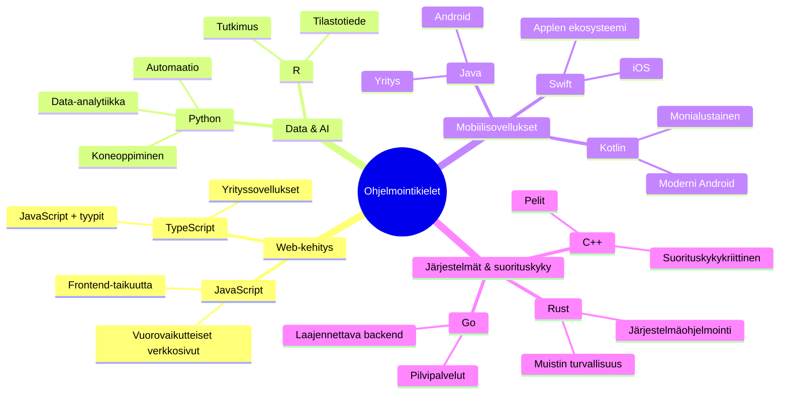
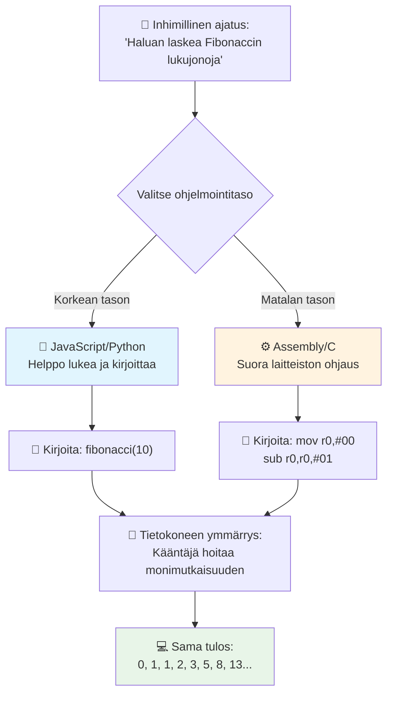
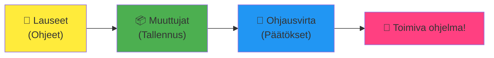
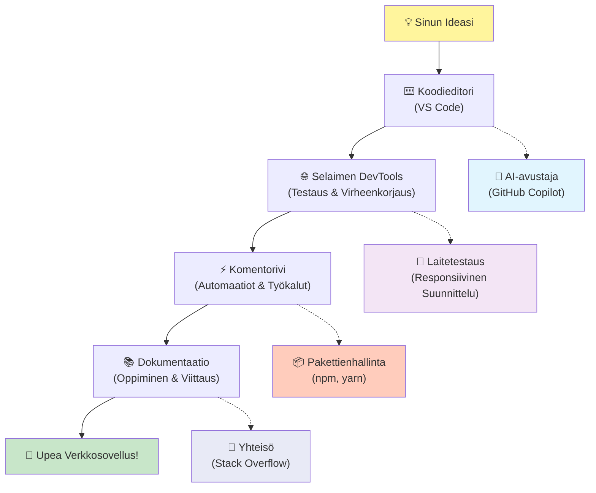
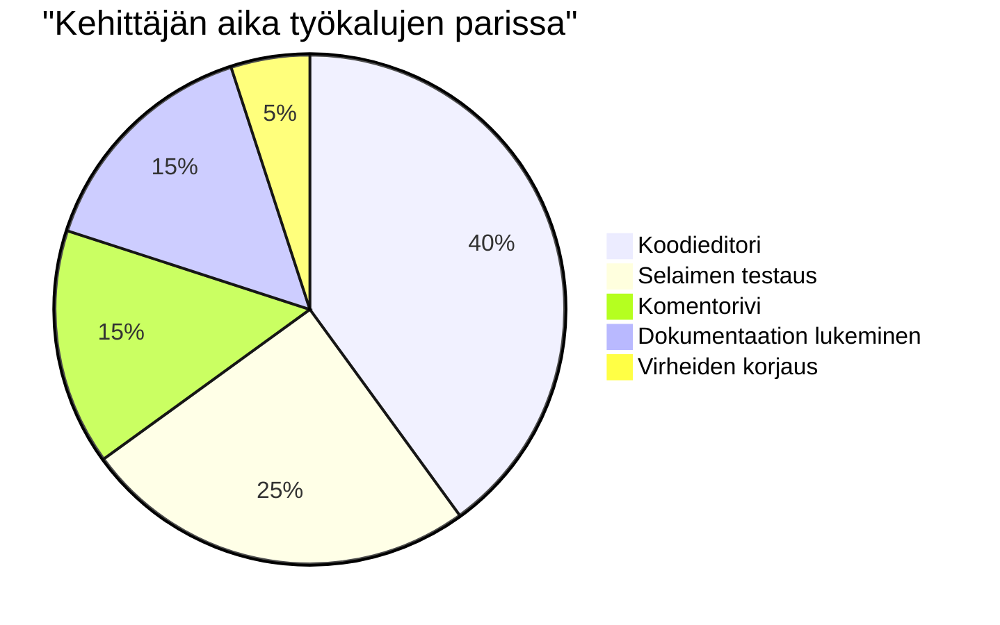
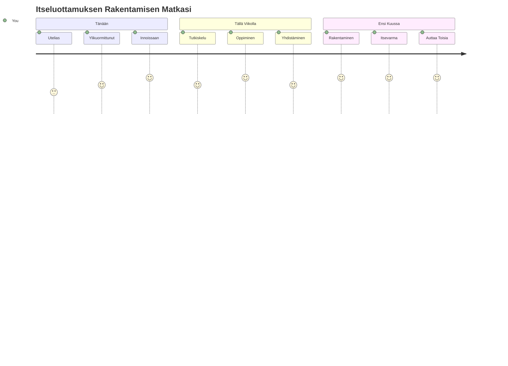

# Johdatus ohjelmointikieliin ja nykyaikaisiin kehittäjätyökaluihin
 
Hei siellä, tuleva kehittäjä! 👋 Saanko kertoa sinulle jotain, mikä saa minut edelleen kylmilleen joka ikinen päivä? Olet juuri löytämässä, että ohjelmointi ei ole pelkästään tietokoneista – se on todellisten supervoimien omistamista, joiden avulla voit tuoda villeimmät ideasi elämään!

Tiedätkö sen hetken, kun käytät suosikkisovellustasi ja kaikki loksahtaa täydellisesti kohdalleen? Kun napautat nappia ja tapahtuu jotain aivan taianomaista, joka saa sinut sanomaan "vau, miten he TEKIVÄT sen?" No, joku aivan kuten sinä – todennäköisesti suosikkikahvilassaan klo 02.00 kolmannen espressonsa kanssa – kirjoitti sen koodin, joka loi tuon taian. Ja tässä tulee mieleesi räjäyttävä juttu: tämän oppitunnin lopussa et pelkästään ymmärrä, miten he sen tekivät, vaan sinulla on pakottava halu kokeilla itse!

Katsos, ymmärrän täysin, jos ohjelmointi tuntuu nyt pelottavalta. Kun itse aloitin, luulin rehellisesti, että täytyy olla jonkinlainen matikkaguru tai olla koodannut jo viidestä vuodesta lähtien. Mutta tässä se, mikä täysin muutti näkökantani: ohjelmointi on juuri kuin uuden kielen oppimista – aloitat sanomalla "hei" ja "kiitos", sitten opit tilamaan kahvin ja ennen kuin huomaatkaan, käydään syvällisiä filosofisia keskusteluja! Ainostaan tässä tapauksessa keskustelet tietokoneiden kanssa, ja rehellisesti? Ne ovat kärsivällisimmät keskustelukumppanit ikinä – ne eivät koskaan tuomitse virheitäsi ja niillä on aina intoa yrittää uudelleen!

Tänään tutustumme uskomattomiin työkaluihin, jotka tekevät modernista web-kehityksestä paitsi mahdollista, myös todella koukuttavaa. Puhun samoista editoreista, selaimista ja työnkulkuista, joita Netflixin, Spotifyn ja suosikkisi indie-sovellusstudiot käyttävät joka ikinen päivä. Ja tässä tulee kohta, joka saa sinut tanssimaan ilosta: suurin osa näistä ammattimaisista, alan standardin työvälineistä on täysin ilmaisia!


> Sketchnote tekijä [Tomomi Imura](https://twitter.com/girlie_mac)


```mermaid
journey
    title Ohjelmointimatkasi Tänään
    section Löydä
      Mitä on ohjelmointi: 5: You
      Ohjelmointikielet: 4: You
      Työkalujen yleiskatsaus: 5: You
    section Tutki
      Koodieditorit: 4: You
      Selaimet & Kehittäjätyökalut: 5: You
      Komentorivi: 3: You
    section Harjoittele
      Kielenetsivä: 4: You
      Työkalujen tutkiminen: 5: You
      Yhteisöyhteydet: 5: You
```
## Katsotaan, mitä jo osaat!

Ennen kuin sukellamme hauskoihin juttuihin, olen utelias – mitä sinä jo tiedät tästä ohjelmointimaailmasta? Ja kuule, jos kun katsot näitä kysymyksiä ajattelet "minulla ei ole tästä mitään hajua," se ei ole pelkästään okei, se on täydellistä! Se tarkoittaa, että olet juuri oikeassa paikassa. Ajattele tätä testiä kuin venyttelyä ennen harjoittelua – lämmittelemme juuri niitä aivolihaksia!

[Osallistu esitestiin](https://ff-quizzes.netlify.app/web/)


## Se seikkailu, johon olemme juuri lähdössä yhdessä

Okei, olen oikeasti innoissani siitä, mitä tänään tulemme tutkimaan! Rehellisesti, toivon, että näkisin sinun ilmeesi, kun jotkut näistä käsitteistä loksahtavat kohdalleen. Tässä uskomaton matka, jonka teemme yhdessä:

- **Mitä ohjelmointi oikein on (ja miksi se on kaikkein siistein juttu ikinä!)** – Löydämme, miten koodi on kirjaimellisesti näkymätön taika, joka pyörittää kaikkea ympärilläsi, tuosta hälytyksestä, joka jotenkin tietää että on maanantaiaamu, sille algoritmille, joka täydellisesti kuratoi Netflixin suosituksesi
- **Ohjelmointikielet ja niiden hämmästyttävät persoonallisuudet** – Kuvittele, että astut juhliin, joissa jokaisella ihmisellä on täysin erilaiset supervoimat ja ongelmanratkaisutavat. Näin ohjelmointikielten maailma on, ja tulet rakastamaan niiden tapaamista!
- **Perusosa-alueet, jotka tekevät digitaalisesta taikasta totta** – Ajattele näitä kuin äärimmäisen luovaa LEGO-settiä. Kun ymmärrät, miten nämä palat sopivat yhteen, ymmärrät, että voit kirjaimellisesti rakentaa mitä mielikuvituksesi keksii
- **Ammattimaiset työkalut, jotka saavat sinut tuntemaan, kuin olisit juuri saanut taikasauvan käteesi** – En ole dramatisoimassa – nämä työkalut saavat sinut todella tuntemaan, että sinulla on supervoimia, ja paras osa? Ne ovat samoja, joita ammattilaiset käyttävät!

> 💡 **Tässä on juttu**: Älä edes yritä muistaa kaikkea tänään! Tässä vaiheessa haluan vain sinun aistivan sen kipinän siitä, mitä on mahdollista tehdä. Yksityiskohdat tarttuvat luonnostaan, kun harjoittelemme yhdessä – siinä tapahtuu todellinen oppiminen!

> Voit ottaa tämän oppitunnin käyttöön [Microsoft Learnissä](https://learn.microsoft.com/en-us/learn/modules/web-development-101/introduction-programming/?WT.mc_id=academic-77807-sagibbon)!

## Mikä se ohjelmointi *oikein on*?

Selvä, tartumme miljoonan taalan kysymykseen: mitä ohjelmointi oikeastaan on?

Kerron sinulle tarinan, joka täysin muutti tapani ajatella tätä. Viime viikolla yritin selittää äidilleni, miten käytetään uutta äly-TV:n kaukosäädintä. Huomasin sanovani asioita kuten: "Paina punaista nappia, mutta ei isoa punaista nappia, vaan vasemmalla olevaa pientä punaista nappia... ei, sinun toinen vasen... hyvä, pidä sitä pohjassa kaksi sekuntia, ei yhtä, ei kolmea..." Tuttu tunne? 😅

Se on ohjelmointia! Se on taiteenlaji, jossa annetaan erittäin tarkkoja, vaihe vaiheelta -ohjeita jollekin, joka on hyvin voimakas, mutta tarvitsee kaiken kirjattuna selvästi. Paitsi että nyt et selitä äidillesi (joka voi kysyä "mikä punainen nappi?"), vaan tietokoneelle (joka tekee täsmälleen mitä sanot, vaikka sanomasi ei olisi ihan sitä, mitä tarkoitit).

Tässä se, mikä räjäytti mieleni, kun opin tämän: tietokoneet ovat itse asiassa ytimekkäästi melko yksinkertaisia. Ne ymmärtävät kirjaimellisesti vain kaksi asiaa – 1 ja 0, mikä tarkoittaa käytännössä "kyllä" ja "ei" tai "päällä" ja "pois." Siinä kaikki! Mutta tässä tulee se maaginen kohta – meidän ei tarvitse puhua 1- ja 0-kielellä kuin olisimme Matrixissa. Tässä tarpeessa ovat **ohjelmointikielet**. Ne ovat kuin maailman parhaat kääntäjät, jotka ottavat tavalliset ihmisen ajatuksesi ja muuntavat ne tietokoneen kieleksi.

Ja tässä se, mikä saa minut edelleen joka aamu kylmilleen herätessäni: kirjaimellisesti *kaikki* digitaalisessa elämässäsi alkoi jostain aivan samanlaisesta kuin sinä, todennäköisesti pyjamassa, kahvikuppi kädessä, naputtamassa koodia kannettavallaan. Se Instagram-filtteri, joka saa sinut näyttämään virheettömältä? Joku koodasi sen. Suositus, joka johdatti sinut uuteen suosikkikappaleeseesi? Kehittäjä rakensi tuon algoritmin. Sovellus, joka auttaa jakamaan illallislaskut kavereiden kanssa? Jep, joku ajatteli "tämä ärsyttää, voisin kyllä korjata tämän" ja sitten... hän teki sen!

Kun opit ohjelmoimaan, et vain omaksu uutta taitoa – sinusta tulee osa tätä uskomatonta ongelmanratkaisuyhteisöä, joka käyttää päivänsä pohtien: "Entä jos voisin rakentaa jotain, joka tekee jonkun päivän edes vähän paremmaksi?" Rehellisesti, onko mitään siistimpää kuin se?

✅ **Hauska faktajahdissa**: Tässä on jotain superhienoa, jota voit selvittää, kun sinulla on hetki aikaa – kuka luulet olleen maailman ensimmäinen tietokoneohjelmoija? Annan sinulle vinkin: se ei välttämättä ole se henkilö, jota odotat! Tämän henkilön tarina on ehdottoman kiehtova ja osoittaa, että ohjelmointi on aina ollut luovaa ongelmanratkaisua ja tutkia asioita laatikon ulkopuolelta.

### 🧠 **Tilannekatsaus: Miltä Sinusta Tuntuu?**

**Ota hetki miettiäksesi:**
- Onko "ohjeiden antaminen tietokoneille" nyt järkevää sinulle?
- Voitko keksiä jonkin päivittäisen tehtävän, jonka haluaisit automatisoida ohjelmoinnilla?
- Mitä kysymyksiä mieleesi nousee tästä kaikesta ohjelmoinnista?

> **Muista**: On täysin normaalia, jos jotkin käsitteet tuntuvat vielä epäselviltä. Ohjelmointi on kuin uuden kielen oppimista – aivosi tarvitsevat aikaa neuralgisten polkujen rakentamiseen. Olet mahtavasti mukana!

## Ohjelmointikielet ovat kuin erimakuisia taikoja

Okei, tämä saattaa kuulostaa oudolta, mutta pysy mukana – ohjelmointikielet ovat hyvin samanlaisia kuin erilaiset musiikkityylit. Ajattele: jazz, joka on sulavaa ja improvisoivaa, rock, joka on voimakasta ja suoraviivaista, klassinen, joka on hienostunutta ja rakenteellista, ja hip-hop, joka on luovaa ja ilmaisevaa. Jokaisella tyylillä on oma tunnelmansa, oma intohimoinen fanikuntansa, ja jokainen on täydellinen erilaisiin tunnelmiin ja tilanteisiin.

Ohjelmointikielet toimivat juuri samalla tavalla! Et käyttäisi samaa kieltä rakentamaan hauskaa mobiilipeliä kuin mitä käyttäisit valtavan määrän ilmastodataa käsiteltäessä, aivan kuten et soittaisi death metalia joogaluokassa (no, suurimmassa osassa joogatunteja ainakin! 😄).

Mutta tässä tulee se, mikä aina saa minut haukkomaan henkeäni: nämä kielet ovat kuin sinulle aivan vieressä istuva maailman kärsivällisin ja nerokkain tulkki. Voit ilmaista ideasi tavalla, joka tuntuu luonnolliselta sinun ihmisaivoillesi, ja ne hoitavat kaiken uskomattoman monimutkaisen työn muuntaen sen niiden 1:iksi ja 0:iksi, joita tietokoneet oikeasti puhuvat. Se on kuin ystävä, joka puhuu täydellisesti sekä ”ihmisen luovuutta” että ”tietokoneen logiikkaa” – ja hän ei koskaan väsy, tarvitse kahvitaukoja eikä tuomitse sinua, vaikka kysyisit samaa kysymystä kahdesti!

### Suosituimmat ohjelmointikielet ja niiden käyttötarkoitukset


```mermaid
mindmap
  root((Ohjelmointikielet))
    Web-kehitys
      JavaScript
        Frontend-taikuutta
        Vuorovaikutteiset verkkosivut
      TypeScript
        JavaScript + tyypit
        Yrityssovellukset
    Data & AI
      Python
        Data-analytiikka
        Koneoppiminen
        Automaatio
      R
        Tilastotiede
        Tutkimus
    Mobiilisovellukset
      Java
        Android
        Yritys
      Swift
        iOS
        Applen ekosysteemi
      Kotlin
        Moderni Android
        Monialustainen
    Järjestelmät & suorituskyky
      C++
        Pelit
        Suorituskykykriittinen
      Rust
        Muistin turvallisuus
        Järjestelmäohjelmointi
      Go
        Pilvipalvelut
        Laajennettava backend
```
| Kieli | Parhaiten soveltuva käyttö | Miksi se on suosittu |
|----------|----------|------------------|
| **JavaScript** | Web-kehitys, käyttöliittymät | Toimii selaimissa ja pyörittää interaktiivisia verkkosivuja |
| **Python** | Data-analytiikka, automaatio, tekoäly | Helppo lukea ja oppia, tehokkaat kirjastot |
| **Java** | Yrityssovellukset, Android-sovellukset | Alustariippumaton, kestävä suurissa järjestelmissä |
| **C#** | Windows-sovellukset, pelikehitys | Vahva Microsoft-ekosysteemin tuki |
| **Go** | Pilvipalvelut, backend-järjestelmät | Nopea, yksinkertainen, suunniteltu moderniin laskentaan |

### Korkean tason vs. matalan tason kielet

Okei, tämä oli rehellisesti se käsite, joka hajotti aivoni, kun aloitin, joten jaan analogian, joka lopulta sai sen loksahtamaan – ja toivon todella, että se auttaa sinua myös!

Kuvittele, että olet vieraassa maassa, jossa et puhu kieltä, ja sinun on kipeästi löydettävä lähin WC (me kaikki olemme olleet siinä tilanteessa, eikö? 😅):

- **Matalan tason ohjelmointi** on kuin oppisit paikallista murretta niin hyvin, että pystyt juttelemaan kulmassa hedelmiä myyvän isoäidin kanssa käyttäen kulttuuriviittauksia, paikallista slangia ja sisäpiirin vitsejä, joita vain paikalliset ymmärtävät. Todella vaikuttavaa ja erittäin tehokasta... jos osaat murteen! Mutta aika ylivoimaista, kun yrität vain löytää vessan.

- **Korkean tason ohjelmointi** on kuin se upea paikallinen ystävä, joka todella ymmärtää sinua. Voit sanoa englanniksi "Minun pitää todella löytää WC", ja hän hoitaa koko kulttuurikäännöksen ja antaa ohjeet tavalla, joka tekee täyttä järkeä aivoillesi, jotka eivät ole paikkakuntalaisia.

Ohjelmoinnin termein:
- **Matalan tason kielet** (kuten Assembly tai C) antavat sinulle mahdollisuuden keskustella hyvin yksityiskohtaisesti tietokoneen laitteiston kanssa, mutta sinun täytyy ajatella kuin kone, mikä on... no, sanotaan vaikka, suuri henkinen muutos!
- **Korkean tason kielet** (kuten JavaScript, Python tai C#) antavat sinun ajatella kuin ihminen samalla, kun ne hoitavat kaiken koneen kielen taustalla. Lisäksi niillä on uskomattoman vastaanottavia yhteisöjä, joissa ihmiset muistavat, millaista oli olla uusi ja haluavat aidosti auttaa!

Arvaa, mistä kielistä aion ehdottaa sinun aloittavan? 😉 Korkean tason kielet ovat kuin apupyörät, joita et oikeasti halua koskaan poistaa, koska ne tekevät koko kokemuksesta paljon nautittavamman!


```mermaid
flowchart TB
    A["👤 Inhimillinen ajatus:<br/>'Haluan laskea Fibonaccin lukujonoja'"] --> B{Valitse ohjelmointitaso}
    
    B -->|Korkean tason| C["🌟 JavaScript/Python<br/>Helppo lukea ja kirjoittaa"]
    B -->|Matalan tason| D["⚙️ Assembly/C<br/>Suora laitteiston ohjaus"]
    
    C --> E["📝 Kirjoita: fibonacci(10)"]
    D --> F["📝 Kirjoita: mov r0,#00<br/>sub r0,r0,#01"]
    
    E --> G["🤖 Tietokoneen ymmärrys:<br/>Kääntäjä hoitaa monimutkaisuuden"]
    F --> G
    
    G --> H["💻 Sama tulos:<br/>0, 1, 1, 2, 3, 5, 8, 13..."]
    
    style C fill:#e1f5fe
    style D fill:#fff3e0
    style H fill:#e8f5e8
```
### Näytän miksi korkean tason kielet ovat paljon ystävällisempiä

Okei, olen kohta näyttämässä sinulle jotain, joka täydellisesti osoittaa, miksi rakastuin korkean tason kieliin, mutta ensin – tarvitsee sinun luvata minulle yksi juttu. Kun näet ensimmäisen koodiesimerkin, älä paniikki! Sen on tarkoitus näyttää pelottavalta. Juuri sitä yritän sanoa!

Katselemme samaa tehtävää, kirjoitettuna kahdella täysin eri tyylillä. Molemmat luovat niin kutsutun Fibonacci-jonon – se on kaunis matemaattinen kuvio, jossa kukin luku on kahden edellisen summa: 0, 1, 1, 2, 3, 5, 8, 13... (Hauska fakta: tämä kuvio esiintyy kirjaimellisesti kaikkialla luonnossa – auringonkukan siementen spiraalit, kävyn kuviot, jopa galaksien muodostuminen!)

Valmiina näkemään eron? Mennään!

**Korkean tason kieli (JavaScript) – Ihmisystävällinen:**

```javascript
// Vaihe 1: Perus Fibonacci-asetus
const fibonacciCount = 10;
let current = 0;
let next = 1;

console.log('Fibonacci sequence:');
```

**Tässä mitä tämä koodi tekee:**
- **Määrittää** vakion, joka kertoo, kuinka monta Fibonacci-lukua haluamme luoda
- **Alustaa** kaksi muuttujaa seuraamaan nykyistä ja seuraavaa lukua jonossa
- **Asettaa** aloitusarvot (0 ja 1), jotka määrittelevät Fibonacci-kuvion
- **Näyttää** otsikkoviestin tunnistamaan tuloksemme

```javascript
// Vaihe 2: Luo sekvenssi silmukalla
for (let i = 0; i < fibonacciCount; i++) {
  console.log(`Position ${i + 1}: ${current}`);
  
  // Laske seuraava luku sekvenssissä
  const sum = current + next;
  current = next;
  next = sum;
}
```

**Tässä käydään läpi, mitä tapahtuu:**
- **Toistetaan** jokainen paikka jonossamme käyttäen `for`-silmukkaa
- **Näytetään** jokainen luku sen paikan kanssa käyttäen template literal -muotoilua
- **Lasketaan** seuraava Fibonacci-luku lisäämällä nykyinen ja seuraava arvo
- **Päivitetään** muuttujat siirtymään seuraavaan iteraatioon

```javascript
// Vaihe 3: Moderni funktionaalinen lähestymistapa
const generateFibonacci = (count) => {
  const sequence = [0, 1];
  
  for (let i = 2; i < count; i++) {
    sequence[i] = sequence[i - 1] + sequence[i - 2];
  }
  
  return sequence;
};

// Käyttöesimerkki
const fibSequence = generateFibonacci(10);
console.log(fibSequence);
```

**Edellä olemme:**
- **Luoneet** uudelleenkäytettävän funktion käyttämällä modernia nuolitoimintojen syntaksia
- **Rakentaneet** taulukon tallentamaan koko jono yksittäisen tulostuksen sijaan
- **Käyttäneet** taulukon indeksointia laskiakseen jokaisen uuden luvun edellisistä arvoista
- **Palauttaneet** koko jonon monipuoliseen käyttöön ohjelman muissa osissa

**Matalan tason kieli (ARM Assembly) – Tietokoneystävällinen:**

```assembly
 area ascen,code,readonly
 entry
 code32
 adr r0,thumb+1
 bx r0
 code16
thumb
 mov r0,#00
 sub r0,r0,#01
 mov r1,#01
 mov r4,#10
 ldr r2,=0x40000000
back add r0,r1
 str r0,[r2]
 add r2,#04
 mov r3,r0
 mov r0,r1
 mov r1,r3
 sub r4,#01
 cmp r4,#00
 bne back
 end
```

Huomaa, miten JavaScript-versio lukee melkein kuin englanninkieliset ohjeet, kun taas Assembly-versio käyttää kryptisiä käskyjä, jotka ohjaavat suoraan tietokoneen prosessoria. Molemmat saavuttavat saman tehtävän, mutta korkean tason kieli on paljon helpompi ihmisille ymmärtää, kirjoittaa ja ylläpitää.

**Keskeiset erot, jotka huomaat:**
- **Luettavuus**: JavaScript käyttää kuvailevia nimiä kuten `fibonacciCount`, kun taas Assemblyssa käytetään kryptisiä tunnisteita kuten `r0`, `r1`
- **Kommentit**: Korkeamman tason kielet kannustavat selittäviin kommentteihin, jotka tekevät koodista itseään dokumentoivan
- **Rakenne**: JavaScriptin looginen kulku vastaa ihmisten tapausta ajatella ongelmia vaihe vaiheelta
- **Ylläpito**: JavaScript-version päivittäminen eri vaatimuksiin on yksinkertaista ja selkeää

✅ **Fibonaccin lukujonosta**: Tämä uskomattoman kaunis numerosarja (jossa kukin luku on kahden edeltävän summa: 0, 1, 1, 2, 3, 5, 8...) esiintyy kirjaimellisesti *kaikkialla* luonnossa! Löydät sen auringonkukan kierteistä, käpyjen kuvioista, nautiluksen kuoren kaarevuudesta ja jopa siitä, miten puun oksat kasvavat. On melko hurjaa, miten matematiikka ja koodi voivat auttaa meitä ymmärtämään ja jäljittelemään luonnon käyttämää kauneuden muodostavaa mallia!


## Rakennuspalikat, jotka tekevät taian mahdolliseksi

Hyvä on, nyt kun olet nähnyt, miltä ohjelmointikielet näyttävät käytännössä, puretaanpa fundamentaaliset osat, jotka muodostavat kirjaimellisesti jokaisen koskaan kirjoitetun ohjelman. Ajattele näitä suosikkireseptisi olennaisina ainesosina – kun ymmärrät, mitä kukin tekee, osaat lukea ja kirjoittaa koodia lähes missä tahansa kielessä!

Tämä on vähän kuin oppisit ohjelmoinnin kielioppia. Muistatko koulusta, kun opit substantiiveista, verbeistä ja lauseiden rakentamisesta? Ohjelmoinnilla on oma kielioppinsa, ja rehellisesti, se on paljon loogisempi ja armollisempi kuin englannin kielioppi koskaan oli! 😄

### Lauseet: Askel askeleelta ohjeet

Aloitetaan **lauseista** – ne ovat kuin yksittäisiä lauseita keskustelussa tietokoneesi kanssa. Jokainen lause kertoo tietokoneelle tehdä jotain tiettyä, vähän kuin antamalla ohjeita: "Käänny tähän vasemmalle," "Pysähdy punaisiin valoihin," "Pysäköi siihen kohtaan."

Pidän siitä, miten luettavia lauseet yleensä ovat. Katso tätä:

```javascript
// Peruslauseet, jotka suorittavat yksittäisiä toimintoja
const userName = "Alex";                    
console.log("Hello, world!");              
const sum = 5 + 3;                         
```
  
**Tämä koodi tekee seuraavaa:**  
- **Määrittelee** vakion käyttäjän nimen tallentamista varten  
- **Näyttää** tervehdyksen konsoliin  
- **Laskee** ja tallentaa matemaattisen operaation tuloksen  

```javascript
// Lauseet, jotka ovat vuorovaikutuksessa verkkosivujen kanssa
document.title = "My Awesome Website";      
document.body.style.backgroundColor = "lightblue";
```
  
**Askel askeleelta tapahtuu:**  
- **Muokkaa** verkkosivun otsikkoa, joka näkyy selaimen välilehdessä  
- **Vaihda** koko sivun taustaväri  

### Muuttujat: Ohjelmasi muistijärjestelmä

Okei, **muuttujat** ovat rehellisesti sanottuna yksi suosikki käsitteistäni opettaa, koska ne ovat niin samanlaisia kuin asioita, joita käytät joka päivä!

Ajattele hetki puhelimesi yhteystietoluetteloa. Et muista kaikkien puhelinnumeroita – sen sijaan tallennat "Äiti," "Paras Ystävä" tai "Pizzapaikka, joka toimittaa aamukahteen asti" ja annat puhelimesi muistaa numerot. Muuttujat toimivat ihan samalla tavalla! Ne ovat kuin nimettyjä säiliöitä, joihin ohjelmasi voi tallentaa tietoa ja hakea sen myöhemmin järkevällä nimellä.

Tässä on se todella siisti juttu: muuttujat voivat muuttua ohjelman ajon aikana (juuri siksi ne kutsutaan muuttujiksi – näitkö mitä teimme siellä?). Aivan kuten saatat päivittää pizzapaikan yhteystiedon, kun löydät paremman, muuttujia voidaan päivittää, kun ohjelmasi oppii uutta tai tilanteet muuttuvat!

Näytän sinulle, kuinka kauniin yksinkertaista tämä voi olla:

```javascript
// Vaihe 1: Perusmuuttujien luominen
const siteName = "Weather Dashboard";        
let currentWeather = "sunny";               
let temperature = 75;                       
let isRaining = false;                      
```
  
**Näiden käsitteiden ymmärtäminen:**  
- **Tallenna** muuttumattomat arvot `const`-muuttujiin (kuten sivuston nimi)  
- **Käytä** `let` arvoihin, jotka voivat muuttua ohjelmassa  
- **Määritä** eri tietotyyppejä: merkkijonoja (tekstiä), lukuja, boolean-arvoja (totta/epätotta)  
- **Valitse** kuvailevat nimet, jotka selittävät, mitä kukin muuttuja sisältää  

```javascript
// Vaihe 2: Työskentely objektien kanssa ryhmitelläksesi liittyviä tietoja
const weatherData = {                       
  location: "San Francisco",
  humidity: 65,
  windSpeed: 12
};
```
  
**Yllä olemme:**  
- **Luoneet** olion ryhmittelemään liittyvää säätietoa yhteen  
- **Organisoineet** useita tietoja yhden muuttujan alle  
- **Käyttäneet** avain-arvo -pareja selkeästi merkitsemiseen  

```javascript
// Vaihe 3: Muuttujien käyttäminen ja päivittäminen
console.log(`${siteName}: Today is ${currentWeather} and ${temperature}°F`);
console.log(`Wind speed: ${weatherData.windSpeed} mph`);

// Muutettavien muuttujien päivittäminen
currentWeather = "cloudy";                  
temperature = 68;                          
```
  
**Ymmärretään jokainen osa:**  
- **Näytä** tietoa käyttämällä mallipohjaisia merkkijonoja `${}`-syntaksilla  
- **Käytä** olion ominaisuuksia piste-notaatiolla (`weatherData.windSpeed`)  
- **Päivitä** `let`-muuttujia heijastamaan muuttuvia olosuhteita  
- **Yhdistä** useita muuttujia luodaksesi merkityksellisiä viestejä  

```javascript
// Vaihe 4: Moderneja purkutekniikoita puhtaampaan koodiin
const { location, humidity } = weatherData; 
console.log(`${location} humidity: ${humidity}%`);
```
  
**Mitä sinun tulee tietää:**  
- **Ota** tiettyjä ominaisuuksia olioista purkamalla (destructuring)  
- **Luo** uusia muuttujia samoilla nimillä kuin oli avaimet automaattisesti  
- **Yksinkertaista** koodia välttelemällä toistuvaa piste-notaatiota  

### Ohjausrakenne: Opeta ohjelmallesi ajattelua

Okei, tässä ohjelmointi muuttuu täysin uskomattomaksi! **Ohjausrakenne** on käytännössä sitä, että opetat ohjelmallesi tekemään fiksuja päätöksiä aivan kuten sinäkin teet joka päivä ilman, että edes ajattelet niitä.

Kuvittele tämä: tänä aamuna menit varmaan läpi jotain tällaista "Jos sataa, otan sateenvarjon. Jos on kylmä, laitan takin päälle. Jos olen myöhässä, jätän aamiaisen väliin ja haen kahvin matkan varrella." Aivosi seuraa luonnollisesti tätä jos-niin-logiikkaa kymmeniä kertoja päivittäin!

Tämä tekee ohjelmista älykkäitä ja eläviä, eikä vain tylsästi ennalta arvattavia käsikirjoituksia. Ne voivat oikeasti tarkastella tilannetta, arvioida mitä tapahtuu, ja reagoida sopivasti. Se on kuin antaisit ohjelmallesi aivot, jotka pystyvät sopeutumaan ja tekemään valintoja!

Haluatko nähdä, kuinka tehokkaasti tämä toimii? Näytän sinulle:

```javascript
// Vaihe 1: Perusehdollinen logiikka
const userAge = 17;

if (userAge >= 18) {
  console.log("You can vote!");
} else {
  const yearsToWait = 18 - userAge;
  console.log(`You'll be able to vote in ${yearsToWait} year(s).`);
}
```
  
**Tämä koodi tekee:**  
- **Tarkista**, täyttääkö käyttäjän ikä äänioikeuden vaatimuksen  
- **Suorita** eri koodilohkot ehdon tuloksen perusteella  
- **Laske** ja näytä, kuinka kauan äänioikeuden saavuttamiseen on, jos alle 18  
- **Anna** tarkat, hyödylliset palautteet joka tilanteessa  

```javascript
// Vaihe 2: Useita ehtoja loogisilla operaattoreilla
const userAge = 17;
const hasPermission = true;

if (userAge >= 18 && hasPermission) {
  console.log("Access granted: You can enter the venue.");
} else if (userAge >= 16) {
  console.log("You need parent permission to enter.");
} else {
  console.log("Sorry, you must be at least 16 years old.");
}
```
  
**Tässä tapahtuu:**  
- **Yhdistä** useita ehtoja `&&` (ja) -operaattorilla  
- **Luo** ehtorakenteiden hierarkia käyttäen `else if` monille tilanteille  
- **Käsittele** kaikki mahdolliset tapaukset lopullisella `else`-lauseella  
- **Anna** selkeät ja käyttäjäystävälliset palautteet erilaisille tilanteille  

```javascript
// Vaihe 3: Tiivis ehto ternäärisellä operaattorilla
const votingStatus = userAge >= 18 ? "Can vote" : "Cannot vote yet";
console.log(`Status: ${votingStatus}`);
```
  
**Muista tämä:**  
- **Käytä** ternääristä operaattoria (`? :`) yksinkertaisiin kahden vaihtoehdon ehtoihin  
- **Kirjoita** ehto ensin, sitten `?`, sitten tosi-arvo, sitten `:`, sitten epätosi-arvo  
- **Sovella** tätä mallia, kun haluat määrittää arvoja ehtojen perusteella  

```javascript
// Vaihe 4: Useiden erityistapausten käsittely
const dayOfWeek = "Tuesday";

switch (dayOfWeek) {
  case "Monday":
  case "Tuesday":
  case "Wednesday":
  case "Thursday":
  case "Friday":
    console.log("It's a weekday - time to work!");
    break;
  case "Saturday":
  case "Sunday":
    console.log("It's the weekend - time to relax!");
    break;
  default:
    console.log("Invalid day of the week");
}
```
  
**Tämä koodi:**  
- **Vertailee** muuttujan arvoa useisiin erityistapauksiin  
- **Ryhmittelee** samanlaiset tapaukset yhteen (arkipäivät vs. viikonloput)  
- **Suorittaa** sopivan koodilohkon löytyessään vastaavuuden  
- **Sisältää** `default`-tapauksen odottamattomien arvojen käsittelyyn  
- **Käyttää** `break`-lauseita estämään koodin jatkumisen seuraavaan tapaukseen  

> 💡 **Todellinen vertauskuva**: Ajattele ohjausrakennetta kuin maailman kärsivällisintä GPS:ää, joka ohjaa sinut perille. Se saattaa sanoa "Jos Main Streetillä on ruuhkaa, ota moottoritie. Jos moottoritietä on suljettu rakentamisen takia, kokeile maisemareittiä." Ohjelmat käyttävät juuri samanlaista ehdollista logiikkaa reagoidakseen älykkäästi erilaisiin tilanteisiin ja antaakseen käyttäjille parhaan mahdollisen kokemuksen.

### 🎯 **Käsitteiden tarkastus: Rakennuspalikoiden hallinta**

**Katsotaan, miten osaat perusteet:**  
- Osaatko selittää oman sanoin muuttujan ja lauseen eron?  
- Mieti todellista tilannetta, jossa käyttäisit jos-niin-päätöstä (kuten äänestys-esimerkissä)  
- Mikä ohjelmointilogikassa yllätti sinut?  

**Pikainen itseluottamuksen kohotus:**  

```mermaid
flowchart LR
    A["📝 Lauseet<br/>(Ohjeet)"] --> B["📦 Muuttujat<br/>(Tallennus)"] --> C["🔀 Ohjausvirta<br/>(Päätökset)"] --> D["🎉 Toimiva ohjelma!"]
    
    style A fill:#ffeb3b
    style B fill:#4caf50
    style C fill:#2196f3
    style D fill:#ff4081
```  
✅ **Mitä seuraavaksi:** Pääsemme sukeltamaan näihin käsitteisiin vielä syvemmälle tässä uskomattomassa matkassa! Nyt keskity vain siihen innostukseen, joka sinulla on kaikkien mahtavien mahdollisuuksien edessä. Tarkat taidot ja tekniikat tarttuvat luontevasti harjoitellessa – lupaan, että tämä tulee olemaan paljon hauskempaa kuin osasit odottaa!

## Työkalut alan ammattilaisille

Okei, tässä kohdin innostukseni on lähes sietämätön! 🚀 Puhumme uskomattomista työkaluista, jotka saavat sinut tuntemaan, kuin olisit juuri saanut käsiisi digitaalisen avaruusaluksen ohjaimet.

Tiedätkö, miten kokilla on täydellisesti tasapainotetut veitset, jotka tuntuvat käden jatkeelta? Tai miten muusikolla on se yksi kitara, joka tuntuu laulavan heti, kun sitä kosketetaan? Kehittäjillä on oma versionsa näistä taikatyökaluista, ja tässä on jotain, mikä saa mielesi räjähtämään – suurin osa niistä on täysin ilmaisia!

Olen melkein hyppinyt innosta tuolissani tätä sinulle kertoessani, koska nämä ovat mullistaneet tavan, jolla rakennamme ohjelmistoja. Puhumme tekoälyn ohjaamista koodiapureista, jotka voivat auttaa kirjoittamaan koodiasi (en edes vitsaile!), pilviympäristöistä, joissa voit rakentaa kokonaissovelluksia käytännössä mistä tahansa missä on Wi-Fi, ja debuggaustyökaluista, jotka ovat niin kehittyneitä, että ne ovat kuin röntgensäteet ohjelmillesi.

Ja tässä tulee aina kylmät väreet: nämä eivät ole aloittelijoille tarkoitettuja työkaluja, jotka kasvaisit nopeasti ulos. Nämä ovat juuri samanlaisia ammattimaisia työkaluja, joita Googlen, Netflixin ja lempibini indie-sovellusstudion kehittäjät käyttävät juuri tällä hetkellä. Tulet tuntemaan itsesi todelliseksi ammattilaiseksi käyttäessäsi niitä!


```mermaid
graph TD
    A["💡 Sinun Ideasi"] --> B["⌨️ Koodieditori<br/>(VS Code)"] 
    B --> C["🌐 Selaimen DevTools<br/>(Testaus & Virheenkorjaus)"]
    C --> D["⚡ Komentorivi<br/>(Automaatiot & Työkalut)"]
    D --> E["📚 Dokumentaatio<br/>(Oppiminen & Viittaus)"]
    E --> F["🚀 Upea Verkkosovellus!"]
    
    B -.-> G["🤖 AI-avustaja<br/>(GitHub Copilot)"]
    C -.-> H["📱 Laitetestaus<br/>(Responsiivinen Suunnittelu)"]
    D -.-> I["📦 Pakettienhallinta<br/>(npm, yarn)"]
    E -.-> J["👥 Yhteisö<br/>(Stack Overflow)"]
    
    style A fill:#fff59d
    style F fill:#c8e6c9
    style G fill:#e1f5fe
    style H fill:#f3e5f5
    style I fill:#ffccbc
    style J fill:#e8eaf6
```  
### Koodieditorit ja IDE:t: Uudet digitaaliset parhaat ystäväsi

Puhutaanpa koodieditoreista – ne tulevat todellakin olemaan uusi suosikkipaikkasi viettää aikaa! Ajattele niitä henkilökohtaisena koodauksen pyhättönä, jossa vietät suurimman osan ajastasi luoden ja hioten digitaalisia luomuksiasi.

Mutta tässä on se taianomainen juttu nykyaikaisissa editoreissa: ne eivät ole vain hienoja tekstieditoreita. Ne ovat kuin älykkäin ja kannustavin koodausmentori, joka istuu vieressäsi 24/7. Ne tarttuvat kirjoitusvirheisiisi ennen kuin huomaat niitä, ehdottavat parannuksia, jotka saavat sinut näyttämään neroilta, auttavat ymmärtämään, mitä kukin koodinpätkä tekee, ja jotkut niistä voivat jopa ennustaa, mitä aiot kirjoittaa ja tarjoutua täydentämään ajatuksiasi!

Muistan, kun löysin automaattisen täydennyksen – tunsin eläväni tulevaisuudessa. Aloitat kirjoittamaan jotain, ja editori sanoo: "Hei, ajattelitteko tätä funktiota, joka tekee juuri sen mitä tarvitset?" Se on kuin aavistaja-koodikaveri!

**Mikä tekee näistä editoreista niin uskomattomia?**

Nykyaikaiset koodieditorit tarjoavat vaikuttavan joukon ominaisuuksia, jotka lisäävät tuottavuuttasi:

| Ominaisuus | Mitä se tekee | Miksi se auttaa |
|------------|---------------|-----------------|
| **Syntaksin korostus** | Värittää koodin eri osat | Tekee koodista helpommin luettavaa ja virheet havaittaviksi |
| **Automaattinen täydennys** | Ehdottaa koodia kirjoittaessasi | Nopeuttaa koodaamista ja vähentää kirjoitusvirheitä |
| **Vianmääritystyökalut** | Auttaa löytämään ja korjaamaan virheet | Säästää tuntikausia ongelmien ratkaisua |
| **Laajennukset** | Lisää erikoisominaisuuksia | Mukauta editoriasi mille tahansa teknologialle |
| **Tekoälyassistentit** | Ehdottaa koodia ja selityksiä | Nopeuttaa oppimista ja tuottavuutta |

> 🎥 **Videolähde**: Haluatko nähdä nämä työkalut toiminnassa? Katso tämä [Tools of the Trade video](https://youtube.com/watch?v=69WJeXGBdxg) kattava esittely.

#### Suositellut editorit web-kehitykseen

**[Visual Studio Code](https://code.visualstudio.com/?WT.mc_id=academic-77807-sagibbon)** (Ilmainen)  
- Suosituin web-kehittäjien keskuudessa  
- Erinomainen laajennusvalikoima  
- Sisäänrakennettu terminaali ja Git-integraatio  
- **Pakolliset laajennukset**:  
  - [GitHub Copilot](https://marketplace.visualstudio.com/items?itemName=GitHub.copilot) – tekoälypohjaiset koodiehdotukset  
  - [Live Share](https://marketplace.visualstudio.com/items?itemName=MS-vsliveshare.vsliveshare) – reaaliaikainen yhteistyö  
  - [Prettier](https://marketplace.visualstudio.com/items?itemName=esbenp.prettier-vscode) – automaattinen koodin muotoilu  
  - [Code Spell Checker](https://marketplace.visualstudio.com/items?itemName=streetsidesoftware.code-spell-checker) – kirjoitusvirheiden havaitseminen koodissa  

**[JetBrains WebStorm](https://www.jetbrains.com/webstorm/)** (Maksullinen, opiskelijoille ilmainen)  
- Kehittyneet debuggaus- ja testausvälineet  
- Älykäs koodin täydennys  
- Sisäänrakennettu versionhallinta  

**Pilvipohjaiset IDE:t** (Hinta vaihtelee)  
- [GitHub Codespaces](https://github.com/features/codespaces) – koko VS Code selaimessasi  
- [Replit](https://replit.com/) – erinomainen oppimiseen ja koodin jakamiseen  
- [StackBlitz](https://stackblitz.com/) – välitön, täyden pinon web-kehitys  

> 💡 **Aloitusvinkki**: Aloita Visual Studio Codella – se on ilmainen, laajasti käytetty alalla ja sillä on valtava yhteisö, joka luo hyödyllisiä ohjeita ja laajennuksia.


### Verkkoselaimet: Salainen kehityslaboratoriosi

Okei, valmistaudu olemaan aivan häkeltynyt! Tiedätkö, miten olet käyttänyt selaimia selaillessasi sosiaalista mediaa ja katsoessasi videoita? No, ne ovat koko ajan piilotelleet tätä uskomatonta salattua kehityslaboratoriota, joka on odottanut, että löydät sen!

Joka kerta kun klikkaat oikealla hiiren napilla verkkosivustolla ja valitset "Tarkastele elementtiä," avaat piilotetun kehittäjätyökalumaailman, joka on rehellisesti sanottuna voimakkaampi kuin jotkin kalliit ohjelmistot, joista ennen maksoin satoja euroja. Se on kuin huomaisit, että tavallinen keittiösi on piilottanut ammattilaiskokin laboratorion salaisen paneelin taakse!
Ensimmäisellä kerralla kun joku näytti minulle selaimen DevTools-työkalut, vietin noin kolme tuntia vain klikkailen ympäriinsä ja ajatellen "HETKIS, SE OSAA SENKIN?!" Voit kirjaimellisesti muokata mitä tahansa verkkosivua reaaliajassa, nähdä tarkalleen kuinka nopeasti kaikki latautuu, testata miltä sivustosi näyttää erilaisilla laitteilla ja jopa virheenkorjata JavaScriptiä kuin todellinen ammattilainen. Se on täysin hämmästyttävää!

**Tässä syy, miksi selaimet ovat salainen aseesi:**

Kun luot verkkosivua tai web-sovellusta, sinun täytyy nähdä miltä se näyttää ja miten se käyttäytyy oikeassa elämässä. Selaimet eivät ainoastaan näytä työtäsi, vaan tarjoavat myös yksityiskohtaista palautetta suorituskyvystä, saavutettavuudesta ja mahdollisista ongelmista.

#### Selaimen Kehittäjätyökalut (DevTools)

Nykyaikaiset selaimet sisältävät kattavat kehityspaketit:

| Työkaluluokka       | Mitä se tekee                | Esimerkkikäyttö     |
|---------------------|-----------------------------|--------------------|
| **Elementin tarkastaja** | Näytä ja muokkaa HTML/CSS reaaliajassa | Säädä tyyliä nähdäksesi tulokset välittömästi |
| **Konsoli**            | Näytä virheilmoitukset ja testaa JavaScriptiä | Virheenkorjaa ongelmia ja kokeile koodia |
| **Verkkovalvonta**     | Seuraa resurssien latautumista | Optimoi suorituskyky ja latausajat |
| **Saavutettavuustarkistin** | Testaa esteettömyyttä ja inklusiivista suunnittelua | Varmista, että sivusto toimii kaikille käyttäjille |
| **Laitesimulaattori**  | Esikatsele eri näyttökokoja | Testaa responsiivista suunnittelua ilman useita laitteita |

#### Suositellut selaimet kehitykseen

- **[Chrome](https://developers.google.com/web/tools/chrome-devtools/)** – toimialan standardin mukaiset DevTools-työkalut ja laaja dokumentaatio
- **[Firefox](https://developer.mozilla.org/docs/Tools)** – erinomaiset CSS Grid- ja saavutettavuustyökalut
- **[Edge](https://docs.microsoft.com/microsoft-edge/devtools-guide-chromium/?WT.mc_id=academic-77807-sagibbon)** – Chromium-pohjainen Microsoftin kehittäjäresursseilla

> ⚠️ **Tärkeä testausvinkki**: Testaa aina verkkosivusi eri selaimilla! Mikä toimii täydellisesti Chromessa, saattaa näyttää erilaiselta Safarissa tai Firefoxissa. Ammattimaiset kehittäjät testaavat kaikilla suurilla selaimilla varmistaakseen yhtenevät käyttökokemukset.


### Komentorivityökalut: Porttisi kehittäjän supervoimiin

Okei, pidetään täysin rehellinen hetki komentorivistä, koska haluan, että kuulet tämän joltain, joka todella ymmärtää sen. Kun näin sen ensimmäisen kerran – vain pelottava musta ruutu vilkkuvalla tekstillä – ajattelin kirjaimellisesti, "Ei kiitos, ei todellakaan! Tämä näyttää joltain 1980-luvun hakkereiden elokuvasta, enkä todellakaan ole tarpeeksi älykäs tähän!" 😅

Mutta tässä mitä toivon jonkun sanoneen minulle silloin, ja mitä sanon sinulle nyt: komentorivi ei ole pelottava – se on oikeastaan kuin suorassa vuoropuhelussa tietokoneesi kanssa. Ajattele sitä kuin erona tilata ruokaa hienon sovelluksen kautta, jossa on kuvia ja valikot (mikä on helppoa ja mukavaa) ja kävellä suosikki paikalliseen ravintolaan, jossa kokki tietää tarkalleen mitä pidät ja voi loihtia täydellisen annoksen vain sanomalla "yllätytä minut jollain upealla."

Komentorivillä kehittäjät tuntevat itsensä ihan taikureiksi. Kirjoitat muutaman näennäisesti maagisen sanan (okei, ne ovat vain komentoja, mutta ne tuntuvat maagisilta!), painat enteriä ja BOOM – olet luonut kokonaisia projektirakenteita, asentanut tehokkaita työkaluja ympäri maailmaa tai julkaissut sovelluksesi internetiin miljoonille ihmisille nähtäväksi. Kun saat maistaa tuota voimaa ensimmäisen kerran, se on oikeasti aika koukuttavaa!

**Miksi komentorivistä tulee suosikkityökalusi:**

Vaikka graafiset käyttöliittymät toimivat monissa tehtävissä hyvin, komentorivi loistaa automaatiossa, tarkkuudessa ja nopeudessa. Monet kehitystyökalut toimivat pääosin komentoriviltä, ja niiden tehokas käyttö parantaa tuottavuuttasi merkittävästi.

```bash
# Vaihe 1: Luo projektihakemisto ja siirry siihen
mkdir my-awesome-website
cd my-awesome-website
```

**Tämä koodi tekee seuraavaa:**
- **Luo** uuden kansion nimeltä "my-awesome-website" projektille
- **Siirtyy** luotuun kansioon työskentelyä varten

```bash
# Vaihe 2: Alusta projekti tiedostolla package.json
npm init -y

# Asenna nykyaikaiset kehitystyökalut
npm install --save-dev vite prettier eslint
npm install --save-dev @eslint/js
```

**Vaihe vaiheelta tapahtuu:**
- **Alustaa** uuden Node.js-projektin oletusasetuksilla käyttäen `npm init -y`
- **Asentaa** Viten modernina rakennustyökaluna nopeaan kehitykseen ja tuotantoon
- **Lisää** Prettierin automaattiseen koodin muotoiluun ja ESLintin koodin laadun tarkistuksiin
- **Käyttää** `--save-dev` -lipuketta merkitsemään riippuvuudet kehityksiin liittyviksi

```bash
# Vaihe 3: Luo projektin rakenne ja tiedostot
mkdir src assets
echo '<!DOCTYPE html><html><head><title>My Site</title></head><body><h1>Hello World</h1></body></html>' > index.html

# Käynnistä kehityspalvelin
npx vite
```

**Yllä olemme:**
- **Järjestäneet** projektin luomalla erilliset kansiot lähdekoodille ja resursseille
- **Generoineet** perus HTML-tiedoston oikealla dokumenttirakenteella
- **Käynnistäneet** Viten kehityspalvelimen live-kuuntelua ja kuumaan moduulin vaihtoon

#### Keskeiset komentorivityökalut web-kehityksessä

| Työkalu | Tarkoitus | Miksi tarvitset sitä |
|---------|-----------|---------------------|
| **[Git](https://git-scm.com/)** | Versionhallinta | Seuraa muutoksia, tee yhteistyötä, varmuuskopioi työsi |
| **[Node.js & npm](https://nodejs.org/)** | JavaScriptin suoritusympäristö & pakettien hallinta | Suorita JavaScript selaimien ulkopuolella, asenna moderneja kehitystyökaluja |
| **[Vite](https://vitejs.dev/)** | Rakennustyökalu & kehityspalvelin | Salamannopea kehitys kuuman moduulin vaihdolla |
| **[ESLint](https://eslint.org/)** | Koodinlaadun tarkistus | Etsi ja korjaa automaattisesti ongelmia JavaScriptissä |
| **[Prettier](https://prettier.io/)** | Koodin muotoilu | Pidä koodi yhtenäisenä ja helposti luettavana |

#### Alustakohtaiset vaihtoehdot

**Windows:**
- **[Windows Terminal](https://docs.microsoft.com/windows/terminal/?WT.mc_id=academic-77807-sagibbon)** – moderni, ominaisuusrikas terminaali
- **[PowerShell](https://docs.microsoft.com/powershell/?WT.mc_id=academic-77807-sagibbon)** 💻 – tehokas skriptausympäristö
- **[Komentorivi](https://learn.microsoft.com/windows-server/administration/windows-commands/windows-commands)** 💻 – perinteinen Windowsin komentorivi

**macOS:**
- **[Terminal](https://support.apple.com/guide/terminal/)** 💻 – sisäänrakennettu terminaalisovellus
- **[iTerm2](https://iterm2.com/)** – paranneltu terminaali lisäominaisuuksilla

**Linux:**
- **[Bash](https://www.gnu.org/software/bash/)** 💻 – Linuxin standardikuori
- **[KDE Konsole](https://docs.kde.org/trunk5/en/konsole/konsole/index.html)** – kehittynyt terminaaliemulaattori

> 💻 = Esiasennettu käyttöjärjestelmään

> 🎯 **Oppimispolku**: Aloita perus komennoista kuten `cd` (vaihda kansiota), `ls` tai `dir` (näytä tiedostot) ja `mkdir` (luo kansio). Harjoittele moderneilla työnkulun komennoilla kuten `npm install`, `git status` ja `code .` (avaa nykyinen kansio VS Codessa). Mitä mukavammaksi tulet, sitä luonnollisemmin opit edistyneempiä komentoja ja automaatiotekniikoita.


### Dokumentaatio: Aina käytettävissä oleva oppimisen mentori

Okei, annan pienen salaisuuden, joka saa sinut tuntemaan olosi paljon paremmaksi aloittelijana: jopa kokeneimmat kehittäjät käyttävät suuren osan ajastaan dokumentaation lukemiseen. Eikä siksi, etteivät tietäisi mitä tekevät – se on itse asiassa viisauden merkki!

Ajattele dokumentaatiota maailman kärsivällisimpien ja tietävimpien opettajien saatavuudeksi 24/7. Jämähtänyt ongelman äärelle aamuyöllä kello 2? Dokumentaatio on siellä lämpimänä virtuaalihalauksena ja täsmälleen oikealla vastauksella. Haluat oppia uuden siistin ominaisuuden, josta kaikki puhuvat? Dokumentaatio tukee sinua vaihe vaiheelta esimerkein. Yrität ymmärtää miksi jokin toimii tietyllä tavalla? Arvasit oikein – dokumentaatio selittää sen tavalla, joka vihdoin saa palaset loksahtamaan kohdalleen!

Tässä jotain, mikä täysin muutti näkökulmani: web-kehityksen maailma liikkuu uskomattoman nopeasti, eikä kukaan (en tarkoita yhtään ketään!) muista kaikkea ulkoa. Olen nähnyt vanhempien kehittäjien, joilla on yli 15 vuoden kokemus, kaivavan hakusanoja perussyntaksiin, ja tiedätkö mitä? Se ei ole noloa – se on fiksua! Kyse ei ole täydellisestä muistista, vaan siitä, että osaa nopeasti etsiä luotettavia vastauksia ja ymmärtää, miten niitä sovelletaan.

**Tässä tapahtuu todellinen taika:**

Ammattilaiset käyttävät suuren osan ajastaan dokumentaation lukemiseen – ei siksi, että he eivät tietäisi mitä tekevät, vaan koska web-kehityksen kenttä kehittyy niin nopeasti, että ajan tasalla pysyminen edellyttää jatkuvaa oppimista. Erinomainen dokumentaatio auttaa ymmärtämään paitsi *miten* jotain käytetään, myös *miksi* ja *milloin* sitä tulisi käyttää.

#### Tärkeitä dokumentaatioresursseja

**[Mozilla Developer Network (MDN)](https://developer.mozilla.org/docs/Web)**
- Kultastandardi web-teknologian dokumentaatiossa
- Laajat oppaat HTML, CSS ja JavaScriptiin
- Sisältää selainten yhteensopivuustiedot
- Käytännön esimerkit ja interaktiiviset demonstraatiot

**[Web.dev](https://web.dev)** (Googlelta)
- Modernit web-kehityksen parhaat käytännöt
- Suorituskyvyn optimointiohjeet
- Saavutettavuus ja inklusiivisen suunnittelun periaatteet
- Tapaustutkimuksia oikeista projekteista

**[Microsoft Developer Documentation](https://docs.microsoft.com/microsoft-edge/#microsoft-edge-for-developers)**
- Resurssit Edge-selaimen kehittämiseen
- Progressiivisen web-sovelluksen oppaat
- Monialustaisen kehityksen näkökulmia

**[Frontend Masters Learning Paths](https://frontendmasters.com/learn/)**
- Rakenteelliset oppimiskokonaisuudet
- Video-opetukset alan asiantuntijoilta
- Käytännön koodiharjoituksia

> 📚 **Opiskeluohje:** Älä yritä opetella dokumentaatiota ulkoa – opi sen sijaan navigoimaan siinä tehokkaasti. Kirjanmerkitä usein käytetyt viitteet ja harjoittele hakutoimintojen käyttöä löytääksesi tietoa nopeasti.

### 🔧 **Työkalujen hallintatesti: Mikä kolahtaa sinuun?**

**Pohdi hetki:**
- Mitä työkalua olet innokkain kokeilemaan ensin? (Ei ole väärää vastausta!)
- Tuntuuko komentorivi vielä pelottavalta vai oletko utelias kokeilemaan sitä?
- Voitko kuvitella käyttäväsi selaimen DevToolsia kurkistaaksesi suosikkisivujesi kulissien taakse?


```mermaid
pie title "Kehittäjän aika työkalujen parissa"
    "Koodieditori" : 40
    "Selaimen testaus" : 25
    "Komentorivi" : 15
    "Dokumentaation lukeminen" : 15
    "Virheiden korjaus" : 5
```
> **Hauska fakta**: Useimmat kehittäjät käyttävät noin 40 % ajastaan koodieditorissa, mutta huomaa kuinka paljon aikaa menee testaukseen, oppimiseen ja ongelmanratkaisuun. Ohjelmointi ei ole pelkästään koodin kirjoittamista – se on kokemusten luomista!

✅ **Mietittävää**: Tässä on mielenkiintoinen ajatus – miten verkkosivujen rakentamisen (kehitys) työkalut eroavat sivujen ulkoasun suunnittelun (design) työkaluista? Se on kuin ero arkkitehdin, joka suunnittelee kauniin talon, ja urakoitsijan, joka sen oikeasti rakentaa. Molemmat ovat tärkeitä, mutta he tarvitsevat erilaisia työvälineitä! Tällainen ajattelu auttaa sinua näkemään isomman kuvan siitä, miten verkkosivut heräävät eloon.

## GitHub Copilot Agent -haaste 🚀

Käytä Agent-tilaa suorittaaksesi seuraavan haasteen:

**Kuvaus:** Tutki modernin koodieditorin tai IDE:n ominaisuuksia ja osoita, miten se voi parantaa työnkulkuasi web-kehittäjänä.

**Ohje:** Valitse koodieditori tai IDE (kuten Visual Studio Code, WebStorm tai pilvipohjainen IDE). Listaa kolme ominaisuutta tai laajennusta, jotka auttavat sinua kirjoittamaan, virheenkorjaamaan tai ylläpitämään koodia tehokkaammin. Kerro lyhyesti, miten kukin parantaa työnkulkuasi.

---

## 🚀 Haaste

**No niin, etsivä, valmiina ensimmäiseen tapaukseesi?**

Nyt kun sinulla on tämä upea perusta, minulla on seikkailu, joka auttaa sinua näkemään miten uskomattoman monipuolinen ja kiehtova ohjelmointimaailma oikeasti on. Ja kuuntele – tässä ei vielä kirjoitella koodia, eli ei painetta! Ajattele itseäsi ohjelmointikielten etsivänä ensimmäisessä jännittävässä tapauksessasi!

**Tehtäväsi, jos päätät sen hyväksyä:**
1. **Tule kielten tutkimusmatkailijaksi**: Valitse kolme ohjelmointikieltä täysin eri universumeista – ehkä yksi verkkosivujen rakentamiseen, yksi mobiilisovellusten tekemiseen ja yksi tieteen tiedon käsittelyyn. Etsi esimerkkejä samasta yksinkertaisesta tehtävästä kirjoitettuna jokaisella kielellä. Lupaan, että tulet hämmästymään miten erilaisilta ne voivat näyttää samalla tehdessään täsmälleen samaa asiaa!

2. **Paljasta niiden syntytarinat**: Mikä tekee jokaisesta kielestä erityisen? Tässä hauska fakta – jokainen ohjelmointikieli on luotu, koska joku mietti, "Tiedätkö mitä? Täytyy olla parempi tapa ratkaista tämä tietty ongelma." Osaatko selvittää, mitkä ongelmat ne olivat? Jotkut näistä tarinoista ovat todellakin kiehtovia!

3. **Tapaa yhteisöt**: Tutki kuinka vastaanottavaisia ja intohimoisia kunkin kielen yhteisöt ovat. Joillakin on miljoonia kehittäjiä jakamassa tietoa ja auttamassa toisiaan, toisilla on pienempi mutta uskomattoman tiivis ja tukevainen yhteisö. Tulet rakastamaan nähdä eri persoonallisuuksia näissä yhteisöissä!

4. **Seuraa vaistoasi**: Mikä kieli tuntuu sinusta lähestyttävimmältä juuri nyt? Älä stressaa "täydellisen" valinnan tekemisestä – kuuntele vain vaistojasi! Tässä ei oikeasti ole väärää vastausta, ja voit aina myöhemmin tutustua muihin kieliin.

**Bonus etsivätyö:** Yritä löytää, mitkä suuret verkkosivustot tai sovellukset on rakennettu milläkin kielellä. Vakuutan, että tulet yllättymään siitä, mitä Instagram, Netflix tai se mobiilipeli, jota et voi lopettaa, käyttävät taustalla!

> 💡 **Muista:** Et yritä tulla asiantuntijaksi missään näistä kielistä tänään. Tutustut vain naapurustoon ennen kuin päätät, mihin haluat asettua. Ota rauhassa, pidä hauskaa ja anna uteliaisuutesi ohjata!

## Juhlistetaan Löytöjäsi!

Huh huh, olet imeytynyt niin paljon uskomattomia tietoja tänään! Olen todella innoissani nähdessäni, kuinka paljon tästä upeasta matkasta on tarttunut sinuun. Ja muista – tämä ei ole koe, jonka pitää mennä täydellisesti. Tämä on enemmänkin juhla kaikesta siististä, mitä olet oppinut tästä kiehtovasta maailmasta, johon olet juuri sukeltamassa!

[Ota jälkitestin quiz](https://ff-quizzes.netlify.app/web/)

## Kertaus & Itsenäinen opiskelu

**Ota oma aikasi tutkia ja pitää hauskaa!**
Olet edennyt paljon tänään, ja siitä kannattaa olla ylpeä! Nyt tulee hauska osuus – tutkia aiheita, jotka herättivät uteliaisuutesi. Muista, tämä ei ole läksyjä – tämä on seikkailu!

**Sukella syvemmälle siihen, mikä innostaa sinua:**

**Kokeile ohjelmointikieliä käytännössä:**
- Käy kahden tai kolmen kielen virallisilla verkkosivuilla, jotka kiinnittivät huomiosi. Jokaisella on oma persoonallisuutensa ja tarinansa!
- Kokeile joitakin online-koodausympäristöjä, kuten [CodePen](https://codepen.io/), [JSFiddle](https://jsfiddle.net/) tai [Replit](https://replit.com/). Älä pelkää kokeilla – et riko mitään!
- Lue, miten lempikielesi syntyi. Vakavasti, jotkut näistä alkuperätarinoista ovat todella kiehtovia ja auttavat sinua ymmärtämään, miksi kielet toimivat juuri niin kuin ne toimivat.

**Tutustu uusiin työkaluihisi:**
- Lataa Visual Studio Code, jos et ole vielä tehnyt niin – se on ilmainen ja tulet pitämään siitä!
- Käy hetki Extensions-markkinapaikalla selailemassa. Se on kuin sovelluskauppa koodieditorillesi!
- Avaa selaimesi Developer Tools ja klikkaile ympäriinsä. Älä huoli, vaikka et ymmärtäisi kaikkea – tutustu vain siihen, mitä siellä on.

**Liity yhteisöön:**
- Seuraa kehittäjäyhteisöjä kuten [Dev.to](https://dev.to/), [Stack Overflow](https://stackoverflow.com/) tai [GitHub](https://github.com/). Ohjelmointi on tosi avointa uusille!
- Katso joitakin aloittelijaystävällisiä koodausvideoita YouTubessa. On paljon hyviä tekijöitä, jotka muistavat miltä alkutaival tuntuu.
- Harkitse osallistumista paikallisiin tapaamisiin tai online-yhteisöihin. Luota minuun, kehittäjät rakastavat auttaa uusia tulokkaita!

> 🎯 **Kuuntele, tässä mitä haluan sinun muistavan**: Sinulta ei odoteta, että poltat ohjelmointitaitoa mestariksi yhdessä yössä! Nyt tutustut vain tähän mahtavaan uuteen maailmaan, johon olet astumassa. Ota aikasi, nauti matkasta ja muista – jokainen kehittäjä, jota ihailet, istui kerran tarkalleen siellä missä sinä olet nyt, innostuneena ja ehkä vähän hämmentyneenä. Se on täysin normaalia ja tarkoittaa, että teet oikein!


## Tehtävä

[Reading the Docs](assignment.md)

> 💡 **Pieni vinkki tehtävääsi varten**: Haluaisin ehdottomasti nähdä sinun kokeilevan työkaluja, joita emme ole vielä käsitelleet! Ohita editorit, selaimet ja komentorivityökalut, joista olemme jo puhuneet – siellä on koko mahtava universumi upeita kehitystyökaluja odottamassa löytämistään. Etsi työkaluja, joita ylläpidetään aktiivisesti ja joilla on vilkas, auttavainen yhteisö (niissä on yleensä parhaat ohjeet ja kaikkein tukevimmat ihmiset, kun tulet jumiin ja tarvitset ystävällisen käden auttamaan).

---

## 🚀 Ohjelmointimatkasi aikajana

### ⚡ **Mitä voit tehdä seuraavan 5 minuutin aikana**
- [ ] Tallenna kirjanmerkkeihin 2-3 ohjelmointikielen verkkosivustoa, jotka kiinnittivät huomiosi
- [ ] Lataa Visual Studio Code, jos et ole vielä tehnyt sitä
- [ ] Avaa selaimesi DevTools (F12) ja klikkaile missä tahansa verkkosivulla
- [ ] Liity yhteen ohjelmointiyhteisöön (Dev.to, Reddit r/webdev tai Stack Overflow)

### ⏰ **Mitä voit saavuttaa tämän tunnin aikana**
- [ ] Täytä oppitunnin jälkeinen tietovisa ja pohdi vastauksiasi
- [ ] Asenna VS Codeen GitHub Copilot -laajennus
- [ ] Kokeile "Hello World" -esimerkkiä kahdella eri ohjelmointikielellä netissä
- [ ] Katso YouTubesta video "Päivä kehittäjän elämässä"
- [ ] Aloita ohjelmointikielen tutkijatyö (haasteen mukaan)

### 📅 **Viikon mittainen seikkailusi**
- [ ] Tee tehtävä loppuun ja tutustu 3 uuteen kehitystyökaluun
- [ ] Seuraa 5 kehittäjää tai ohjelmointitiliä sosiaalisessa mediassa
- [ ] Kokeile rakentaa jotain pientä CodePenissä tai Replitissä (vaikka vain "Hello, [Nimesi]!")
- [ ] Lue yksi kehittäjäblogipostaus jonkun ohjelmointimatkasta
- [ ] Osallistu virtuaalitapaamiseen tai katso ohjelmointiaiheinen puhe
- [ ] Aloita valitsemasi kieli nettioppituntien avulla

### 🗓️ **Kuukauden mittainen muutosmatkasi**
- [ ] Rakenna ensimmäinen pieni projektisi (yksinkertainenkin verkkosivu käy!)
- [ ] Osallistu avoimen lähdekoodin projektiin (aloita dokumentaation korjauksista)
- [ ] Ole mentori jollekin, joka vasta aloittaa ohjelmointimatkansa
- [ ] Luo oma kehittäjäportfoliosivustosi
- [ ] Yhdistä paikallisiin kehittäjäyhteisöihin tai opiskeluryhmiin
- [ ] Ala suunnitella seuraavaa oppimisvirstanpylvästäsi

### 🎯 **Lopullinen pohdinta**

**Ennen kuin jatkat, ota hetki juhlia:**
- Mikä ohjelmoinnissa innosti sinua tänään eniten?
- Mitä työkalua tai käsitettä haluat tutkia ensin?
- Miltä tuntuu aloittaa tämä ohjelmointimatka?
- Mikä kysymys haluaisit esittää kehittäjälle juuri nyt?


```mermaid
journey
    title Itseluottamuksen Rakentamisen Matkasi
    section Tänään
      Utelias: 3: You
      Ylikuormittunut: 4: You
      Innoissaan: 5: You
    section Tällä Viikolla
      Tutkiskelu: 4: You
      Oppiminen: 5: You
      Yhdistäminen: 4: You
    section Ensi Kuussa
      Rakentaminen: 5: You
      Itsevarma: 5: You
      Auttaa Toisia: 5: You
```
> 🌟 **Muista**: Jokainen asiantuntija on joskus ollut aloittelija. Jokainen kokenut kehittäjä on joskus tuntenut juuri samoin kuin sinä nyt – innostuneena, ehkä vähän hämmentyneenä ja ehdottomasti uteliaana siitä, mitä on mahdollista saada aikaan. Olet mahtavassa seurassa, ja tämä matka tulee olemaan uskomaton. Tervetuloa ohjelmoinnin ihmeelliseen maailmaan! 🎉

---

<!-- CO-OP TRANSLATOR DISCLAIMER START -->
**Vastuuvapauslauseke**:  
Tämä asiakirja on käännetty käyttäen tekoälypohjaista käännöspalvelua [Co-op Translator](https://github.com/Azure/co-op-translator). Vaikka pyrimme tarkkuuteen, otathan huomioon, että automaattiset käännökset saattavat sisältää virheitä tai epätarkkuuksia. Alkuperäistä asiakirjaa sen alkuperäiskielellä tulee pitää lopullisena ja virallisena lähteenä. Tärkeissä tiedoissa suositellaan ammattimaisen ihmiskääntäjän palveluiden käyttöä. Emme ole vastuussa tämän käännöksen käytöstä johtuvista väärinymmärryksistä tai tulkinnoista.
<!-- CO-OP TRANSLATOR DISCLAIMER END -->