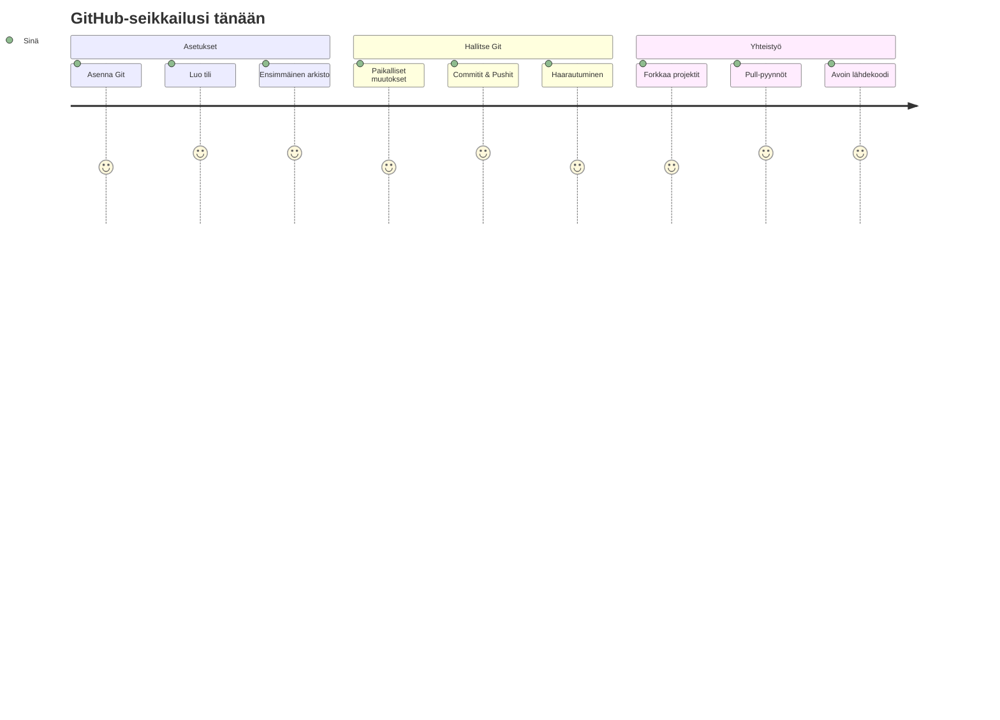
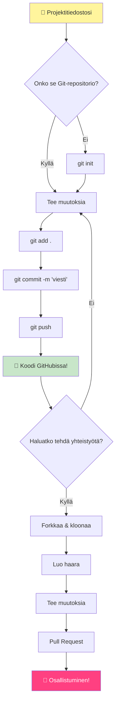
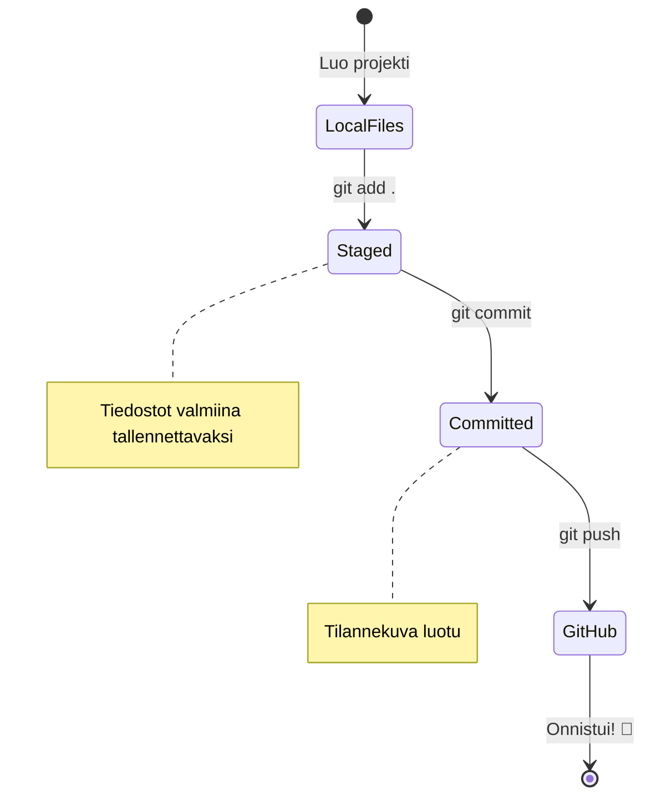
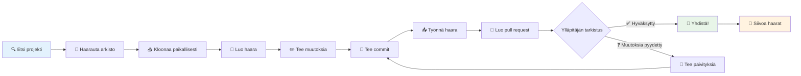
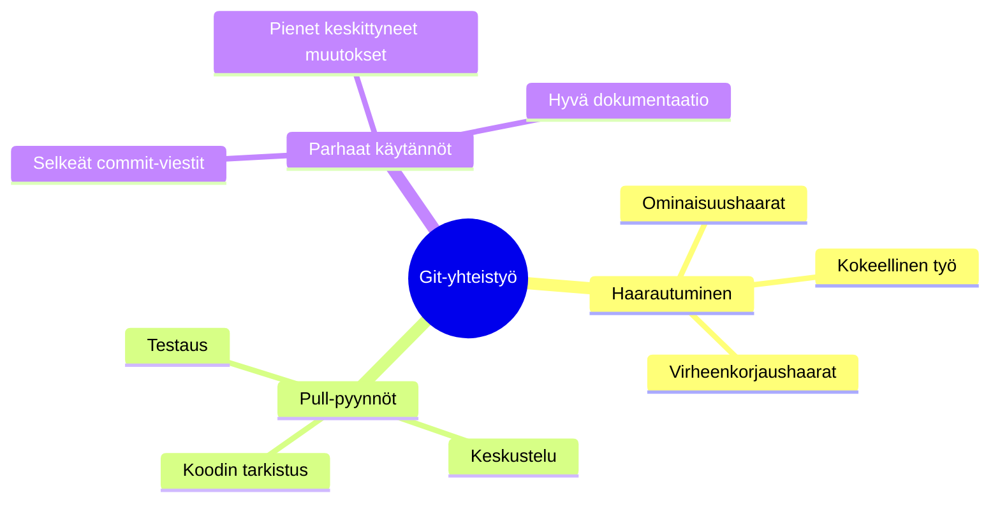
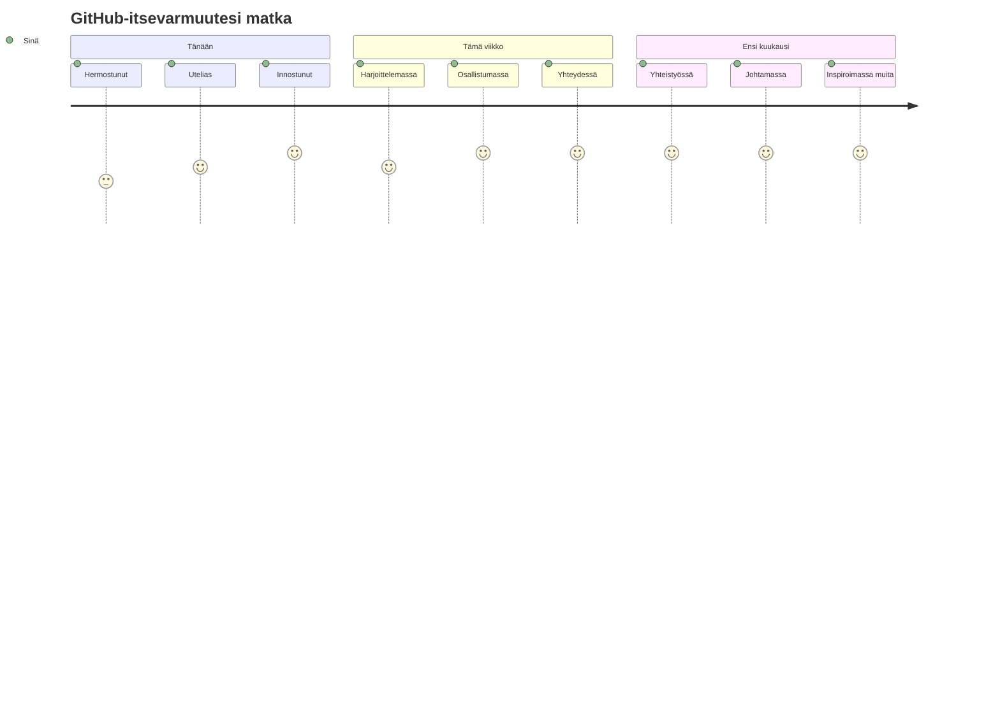

<!--
CO_OP_TRANSLATOR_METADATA:
{
  "original_hash": "5c383cc2cc23bb164b06417d1c107a44",
  "translation_date": "2025-11-25T17:55:51+00:00",
  "source_file": "1-getting-started-lessons/2-github-basics/README.md",
  "language_code": "fi"
}
-->
# Johdanto GitHubiin

Hei tuleva kehittäjä! 👋 Oletko valmis liittymään miljoonien koodareiden joukkoon ympäri maailmaa? Olen todella innoissani saadessani esitellä sinulle GitHubin – ajattele sitä ohjelmoijien sosiaalisen median alustana, mutta sen sijaan että jakaisimme kuvia lounaastamme, jaamme koodia ja rakennamme yhdessä uskomattomia asioita!

Tämä on aivan uskomatonta: jokainen sovellus puhelimessasi, jokainen verkkosivusto, jolla vierailet, ja suurin osa työkaluista, joita opit käyttämään, on rakennettu kehittäjätiimien yhteistyöllä alustoilla kuten GitHub. Se musiikkisovellus, jota rakastat? Joku kuten sinä on osallistunut sen kehittämiseen. Se peli, jota et voi lopettaa? Jep, todennäköisesti rakennettu GitHubin avulla. Ja nyt SINÄ opit, miten olla osa tätä upeaa yhteisöä!

Tiedän, että tämä voi tuntua aluksi paljolta – muistan itsekin tuijottaneeni ensimmäistä GitHub-sivua ja ajatelleeni "Mitä ihmettä tämä kaikki tarkoittaa?" Mutta tässä on juttu: jokainen kehittäjä on aloittanut juuri siitä, missä sinä olet nyt. Tämän oppitunnin lopussa sinulla on oma GitHub-repositorio (ajattele sitä henkilökohtaisena projektiesittelynä pilvessä), ja tiedät, miten tallentaa työsi, jakaa sen muiden kanssa ja jopa osallistua projekteihin, joita miljoonat ihmiset käyttävät.

Otamme tämän matkan yhdessä, askel kerrallaan. Ei kiirettä, ei painetta – vain sinä, minä ja muutama todella siisti työkalu, joista tulee pian uusia parhaita ystäviäsi!


> Sketchnote: [Tomomi Imura](https://twitter.com/girlie_mac)


## Ennakkokysely
[Ennakkokysely](https://ff-quizzes.netlify.app)

## Johdanto

Ennen kuin sukellamme todella jännittäviin asioihin, laitetaan tietokoneesi valmiiksi GitHub-taikuutta varten! Ajattele tätä kuin taidetarvikkeiden järjestämistä ennen mestariteoksen luomista – oikeiden työkalujen valmiiksi saaminen tekee kaikesta sujuvampaa ja paljon hauskempaa.

Käyn kanssasi läpi jokaisen asennusvaiheen henkilökohtaisesti, ja lupaan, ettei se ole läheskään niin pelottavaa kuin miltä se saattaa aluksi näyttää. Jos jokin ei heti tunnu selkeältä, se on täysin normaalia! Muistan itsekin ensimmäisen kehitysympäristöni asennuksen ja tunteen kuin yrittäisin lukea muinaisia hieroglyfejä. Jokainen kehittäjä on ollut juuri siinä, missä sinä olet nyt, miettien, tekeekö kaiken oikein. Spoilerivaroitus: jos olet täällä oppimassa, teet jo oikein! 🌟

Tässä oppitunnissa käsitellään:

- työn seuraamista koneellasi
- projektien tekemistä yhdessä muiden kanssa
- avoimen lähdekoodin ohjelmistojen kehittämiseen osallistumista

### Esivaatimukset

Laitetaan tietokoneesi valmiiksi GitHub-taikuutta varten! Älä huoli – tämä asennus tehdään vain kerran, ja sen jälkeen olet valmis koko koodausmatkallesi.

Aloitetaan perusasioista! Ensin meidän täytyy tarkistaa, onko Git jo valmiiksi koneellasi. Git on kuin superälykäs avustaja, joka muistaa jokaisen muutoksen, jonka teet koodissasi – paljon parempi kuin Ctrl+S:n hakkaaminen joka toinen sekunti (olemme kaikki olleet siinä tilanteessa!).

Tarkistetaan, onko Git jo asennettuna kirjoittamalla tämä maaginen komento terminaaliin:
`git --version`

Jos Git ei ole vielä asennettuna, ei hätää! Mene vain [lataamaan Git](https://git-scm.com/downloads) ja hanki se. Kun olet asentanut sen, meidän täytyy esitellä Git sinulle kunnolla:

> 💡 **Ensimmäinen asennus**: Nämä komennot kertovat Gitille, kuka olet. Tämä tieto liitetään jokaiseen tekemääsi commit-merkintään, joten valitse nimi ja sähköposti, jotka olet valmis jakamaan julkisesti.

```bash
git config --global user.name "your-name"
git config --global user.email "your-email"
```

Tarkistaaksesi, onko Git jo konfiguroitu, voit kirjoittaa:
```bash
git config --list
```

Tarvitset myös GitHub-tilin, koodieditorin (kuten Visual Studio Code) ja sinun täytyy avata terminaali (tai komentokehote).

Siirry [github.com](https://github.com/) ja luo tili, jos sinulla ei vielä ole sellaista, tai kirjaudu sisään ja täytä profiilisi.

💡 **Moderni vinkki**: Harkitse [SSH-avainten](https://docs.github.com/en/authentication/connecting-to-github-with-ssh) asettamista tai [GitHub CLI:n](https://cli.github.com/) käyttöä helpompaan autentikointiin ilman salasanoja.

✅ GitHub ei ole ainoa koodivarasto maailmassa; niitä on muitakin, mutta GitHub on tunnetuin.

### Valmistelu

Tarvitset sekä koodiprojektin sisältävän kansion paikallisella koneellasi (kannettava tai PC) että julkisen repositorion GitHubissa, joka toimii esimerkkinä siitä, miten osallistua muiden projekteihin.

### Koodisi turvaaminen

Puhutaan hetki turvallisuudesta – mutta älä huoli, emme aio hukuttaa sinua pelottavilla asioilla! Ajattele näitä turvallisuuskäytäntöjä kuin auton tai kodin lukitsemista. Ne ovat yksinkertaisia tapoja, jotka muuttuvat rutiiniksi ja pitävät työsi suojattuna.

Näytämme sinulle modernit, turvalliset tavat työskennellä GitHubin kanssa heti alusta alkaen. Näin kehität hyviä tapoja, jotka palvelevat sinua koko koodausurasi ajan.

Kun työskentelet GitHubin kanssa, on tärkeää noudattaa turvallisuuden parhaita käytäntöjä:

| Turvallisuusalue | Paras käytäntö | Miksi se on tärkeää |
|------------------|----------------|----------------------|
| **Autentikointi** | Käytä SSH-avaimia tai henkilökohtaisia käyttöoikeustunnuksia | Salasanat ovat vähemmän turvallisia ja niitä ollaan poistamassa käytöstä |
| **Kaksivaiheinen autentikointi** | Ota 2FA käyttöön GitHub-tililläsi | Lisää ylimääräisen suojakerroksen tilillesi |
| **Repositorion turvallisuus** | Älä koskaan commitoi arkaluontoista tietoa | API-avaimia ja salasanoja ei koskaan pitäisi olla julkisissa repoissa |
| **Riippuvuuksien hallinta** | Ota Dependabot käyttöön päivityksiä varten | Pitää riippuvuutesi turvallisina ja ajan tasalla |

> ⚠️ **Kriittinen turvallisuusmuistutus**: Älä koskaan commitoi API-avaimia, salasanoja tai muuta arkaluontoista tietoa mihinkään repositorioon. Käytä ympäristömuuttujia ja `.gitignore`-tiedostoja suojataksesi arkaluontoiset tiedot.

**Moderni autentikointiasetus:**

```bash
# Luo SSH-avain (moderni ed25519-algoritmi)
ssh-keygen -t ed25519 -C "your_email@example.com"

# Määritä Git käyttämään SSH:ta
git remote set-url origin git@github.com:username/repository.git
```

> 💡 **Pro-vinkki**: SSH-avaimet poistavat tarpeen syöttää salasanoja toistuvasti ja ovat turvallisempia kuin perinteiset autentikointimenetelmät.

---

## Koodisi hallinta kuin ammattilainen

Okei, TÄMÄ on se kohta, jossa asiat muuttuvat todella jännittäviksi! 🎉 Olemme oppimassa, miten seurata ja hallita koodiasi kuin ammattilaiset, ja rehellisesti sanottuna tämä on yksi suosikkiasioistani opettaa, koska se on niin mullistavaa.

Kuvittele tämä: kirjoitat upeaa tarinaa ja haluat pitää kirjaa jokaisesta luonnoksesta, jokaisesta loistavasta muokkauksesta ja jokaisesta "hei, tämä on nerokasta!" hetkestä matkan varrella. Juuri sitä Git tekee koodillesi! Se on kuin uskomaton aikamatkustava muistikirja, joka muistaa KAIKEN – jokaisen näppäimen painalluksen, jokaisen muutoksen, jokaisen "oi ei, tämä rikkoi kaiken" hetken, jonka voit välittömästi peruuttaa.

Olen rehellinen – tämä voi tuntua aluksi ylivoimaiselta. Kun aloitin, ajattelin "Miksi en voi vain tallentaa tiedostojani normaalisti?" Mutta luota minuun tässä: kun Git alkaa tuntua tutulta (ja se tulee!), sinulla on yksi niistä lamppuhetkistä, jolloin ajattelet "Miten olen IKINÄ koodannut ilman tätä?" Se on kuin löytäisit, että osaat lentää, kun olet kävellyt kaikkialle koko elämäsi!

Sanotaan, että sinulla on paikallisesti kansio, jossa on jokin koodiprojekti, ja haluat alkaa seurata edistymistäsi käyttämällä git-versiohallintajärjestelmää. Jotkut vertaavat gitin käyttöä rakkauskirjeen kirjoittamiseen tulevalle itsellesi. Kun luet commit-viestejäsi päivien, viikkojen tai kuukausien jälkeen, pystyt muistamaan, miksi teit tietyn päätöksen, tai "peruuttaa" muutoksen – kunhan kirjoitat hyviä "commit-viestejä".


### Tehtävä: Luo ensimmäinen repositoriosi!

> 🎯 **Tehtäväsi (ja olen niin innoissani puolestasi!)**: Luomme yhdessä ensimmäisen GitHub-repositoriosi! Kun olemme valmiita, sinulla on oma pieni nurkka internetissä, jossa koodisi asuu, ja olet tehnyt ensimmäisen "commitin" (se on kehittäjien kieltä työn tallentamisesta todella fiksulla tavalla).
>
> Tämä on rehellisesti sanottuna erityinen hetki – olet virallisesti liittymässä maailmanlaajuiseen kehittäjäyhteisöön! Muistan edelleen sen jännityksen, kun loin ensimmäisen repositorioni ja ajattelin "Vau, minä todella teen tämän!"

Käydään tämä seikkailu yhdessä läpi, askel kerrallaan. Ota aikaa jokaisen osan kanssa – kiirehtimisestä ei saa palkintoa, ja lupaan, että jokainen askel tulee olemaan järkevä. Muista, että jokainen ihailemasi koodausstara on joskus istunut juuri siinä, missä sinä olet nyt, luomassa ensimmäistä repositoriotaan. Kuinka siistiä se onkaan?

> Katso video
> 
> [](https://www.youtube.com/watch?v=9R31OUPpxU4)

**Tehdään tämä yhdessä:**

1. **Luo repositorio GitHubissa**. Siirry GitHub.com-sivustolle ja etsi kirkkaan vihreä **New**-painike (tai **+**-merkki oikeasta yläkulmasta). Klikkaa sitä ja valitse **New repository**.

   Näin toimitaan:
   1. Anna repositoriolle nimi – tee siitä sinulle merkityksellinen!
   1. Lisää kuvaus, jos haluat (tämä auttaa muita ymmärtämään, mistä projektissasi on kyse)
   1. Päätä, haluatko sen olevan julkinen (kaikki voivat nähdä sen) vai yksityinen (vain sinulle)
   1. Suosittelen valitsemaan ruudun README-tiedoston lisäämiseksi – se on kuin projektisi etusivu
   1. Klikkaa **Create repository** ja juhli – loit juuri ensimmäisen repositoriosi! 🎉

2. **Siirry projektikansioosi**. Nyt avataan terminaali (älä huoli, se ei ole niin pelottava kuin miltä näyttää!). Meidän täytyy kertoa tietokoneellesi, missä projektitiedostosi ovat. Kirjoita tämä komento:

   ```bash
   cd [name of your folder]
   ```

   **Mitä tässä tehdään:**
   - Käytännössä sanomme "Hei tietokone, vie minut projektikansiooni"
   - Tämä on kuin avaisi tietyn kansion työpöydällä, mutta teemme sen tekstikomennoilla
   - Korvaa `[kansiosi nimi]` projektikansiosi oikealla nimellä

3. **Muuta kansiosi Git-repositorioksi**. Tässä tapahtuu taikuutta! Kirjoita:

   ```bash
   git init
   ```

   **Tässä tapahtui (aika siistiä!):**
   - Git loi piilotetun `.git`-kansion projektiisi – et näe sitä, mutta se on siellä!
   - Tavallinen kansiosi on nyt "repositorio", joka voi seurata jokaista tekemääsi muutosta
   - Ajattele sitä kuin antaisit kansiollesi supervoimat muistaa kaiken

4. **Tarkista, mitä tapahtuu**. Katsotaan, mitä Git ajattelee projektistasi juuri nyt:

   ```bash
   git status
   ```

   **Ymmärrä, mitä Git kertoo sinulle:**
   
   Saatat nähdä jotain tällaista:

   ```output
   Changes not staged for commit:
   (use "git add <file>..." to update what will be committed)
   (use "git restore <file>..." to discard changes in working directory)

        modified:   file.txt
        modified:   file2.txt
   ```

   **Älä panikoi! Tässä on, mitä tämä tarkoittaa:**
   - **Punaiset** tiedostot ovat tiedostoja, joissa on muutoksia, mutta ne eivät ole vielä valmiita tallennettavaksi
   - **Vihreät** tiedostot (kun näet niitä) ovat valmiita tallennettavaksi
   - Git on avulias ja kertoo sinulle tarkalleen, mitä voit tehdä seuraavaksi

   > 💡 **Pro-vinkki**: `git status` -komento on paras ystäväsi! Käytä sitä aina, kun olet epävarma siitä, mitä tapahtuu. Se on kuin kysyisi Gitiltä "Hei, mikä tilanne on juuri nyt?"

5. **Valmista tiedostosi tallennettavaksi** (tätä kutsutaan "vaiheistamiseksi"):

   ```bash
   git add .
   ```

   **Mitä juuri teimme:**
   - Kerroimme Gitille "Hei, haluan sisällyttää KAIKKI tiedostoni seuraavaan tallennukseen"
   - `.` on kuin sanoisi "kaikki tässä kansiossa"
   - Nyt tiedostosi ovat "vaiheistettuja" ja valmiita seuraavaan vaiheeseen

   **Haluatko olla valikoivampi?** Voit lisätä vain tietyt tiedostot:

   ```bash
   git add [file or folder name]
   ```

   **Miksi haluaisit tehdä näin?**
   - Joskus haluat tallentaa liittyvät muutokset yhdessä
   - Se auttaa sinua järjestämään työsi loogisiin osiin
   - Helpottaa ymmärtämään, mitä muuttui ja milloin

   **Muutitko mielesi?** Ei hätää! Voit poistaa tiedostoja vaiheistuksesta näin:

   ```bash
   # Poista kaikki lavalta
   git reset
   
   # Poista vain yksi tiedosto lavalta
   git reset [file name]
   ```

   Älä huoli – tämä ei poista työtäsi, se vain ottaa tiedostot pois "valmiina tallennettavaksi" -pinosta.

6. **Tallenna työsi pysyvästi** (tee ensimmäinen commit!):

   ```bash
   git commit -m "first commit"
   ```

   **🎉 Onnittelut! Teit juuri ensimmäisen commitin!**
   
   **Tässä tapahtui:**
   - Git otti "snapshottin" kaikista vaiheistetuista tiedostoistasi juuri tällä hetkellä
   - Commit-viestisi "first commit" selittää, mistä tämä tallennuspiste kertoo
   - Git antoi tälle snapshotille ainutlaatuisen tunnuksen, jotta voit aina löytää sen myöhemmin
   - Olet virallisesti aloittanut projektisi historian seuraamisen!

   > 💡 **Tulevat commit-viestit**: Seuraavissa commit-viesteissä ole kuvailevampi! Sen sijaan että kirjoittaisit "päivitetty juttuja", kokeile "Lisätty yhteydenottolomake etusivulle" tai "Korjattu navigointivalikon virhe". Tuleva itsesi kiittää sinua!

7. **Yhdistä paikallinen projektisi GitHubiin**. Tällä hetkellä projektisi on olemassa vain tietokoneellasi. Yhdistetään se GitHub-repositorioosi, jotta voit jakaa sen maailmalle!

   Mene ensin GitHub-repositoriosi sivulle ja kopioi URL-osoite. Sitten palaa tänne ja kirjoita:

   ```bash
   git remote add origin https://github.com/username/repository_name.git
   ```
   
   (Korvaa URL-osoite oikealla repositoriosi URL-osoitteella!)

   **Tässä tapahtui:**
- Loimme yhteyden paikallisen projektisi ja GitHub-repositorion välille  
- "Origin" on vain lempinimi GitHub-repositoriollesi – vähän kuin lisäisit yhteystiedon puhelimeesi  
- Nyt paikallinen Git tietää, minne lähettää koodisi, kun olet valmis jakamaan sen  

💡 **Helpompi tapa**: Jos sinulla on GitHub CLI asennettuna, voit tehdä tämän yhdellä komennolla:  
   ```bash
   gh repo create my-repo --public --push --source=.
   ```
  
8. **Lähetä koodisi GitHubiin** (suuri hetki!):  

   ```bash
   git push -u origin main
   ```
  
**🚀 Tässä se on! Lataat koodisi GitHubiin!**  

**Mitä tapahtuu:**  
- Commitisi matkustavat tietokoneeltasi GitHubiin  
- `-u` -lippu luo pysyvän yhteyden, joten tulevat push-komennot ovat helpompia  
- "main" on ensisijaisen haarasi nimi (kuten pääkansio)  
- Tämän jälkeen voit vain kirjoittaa `git push` tulevia latauksia varten!  

💡 **Pieni huomio**: Jos haarasi nimi on jotain muuta (kuten "master"), käytä sitä nimeä. Voit tarkistaa sen komennolla `git branch --show-current`.  

9. **Uusi päivittäinen koodausrytmi** (tästä tulee koukuttavaa!):  

Tästä eteenpäin, aina kun teet muutoksia projektiisi, sinulla on tämä yksinkertainen kolmen askeleen tanssi:  

   ```bash
   git add .
   git commit -m "describe what you changed"
   git push
   ```
  
**Tämä on koodauksen syke:**  
- Tee mahtavia muutoksia koodiisi ✨  
- Stageaa ne komennolla `git add` ("Hei Git, huomioi nämä muutokset!")  
- Tallenna ne komennolla `git commit` ja kuvailevalla viestillä (tuleva itsesi kiittää sinua!)  
- Jaa ne maailmalle komennolla `git push` 🚀  
- Toista ja jatka – tästä tulee yhtä luonnollista kuin hengittäminen!  

Rakastan tätä työnkulkua, koska se on kuin useiden tallennuspisteiden luominen videopelissä. Teitkö muutoksen, josta pidät? Commitoi se! Haluatko kokeilla jotain riskialtista? Ei hätää – voit aina palata viimeiseen commit-pisteeseen, jos asiat menevät pieleen!  

> 💡 **Vinkki**: Saatat haluta ottaa käyttöön `.gitignore`-tiedoston estääksesi tiedostojen, joita et halua seurata, näkymisen GitHubissa – kuten muistiinpanotiedoston, jonka säilytät samassa kansiossa, mutta jolla ei ole paikkaa julkisessa repositoriossa. Löydät `.gitignore`-tiedostojen malleja osoitteesta [.gitignore templates](https://github.com/github/gitignore) tai voit luoda sellaisen käyttämällä [gitignore.io](https://www.toptal.com/developers/gitignore).  

### 🧠 **Ensimmäinen repositorion tarkistus: Miltä se tuntui?**  

**Ota hetki juhliaksesi ja pohtiaksesi:**  
- Miltä tuntui nähdä koodisi ilmestyvän GitHubiin ensimmäistä kertaa?  
- Mikä askel tuntui kaikkein hämmentävimmältä ja mikä yllättävän helpolta?  
- Voitko selittää omin sanoin eron `git add`, `git commit` ja `git push` välillä?  


> **Muista**: Jopa kokeneet kehittäjät unohtavat joskus tarkat komennot. Tämän työnkulun muuttuminen lihasmuistiksi vaatii harjoittelua – olet tekemässä hienoa työtä!  

#### Modernit Git-työnkulut  

Harkitse näiden modernien käytäntöjen omaksumista:  

- **Conventional Commits**: Käytä standardoitua commit-viestien muotoa, kuten `feat:`, `fix:`, `docs:` jne. Lue lisää osoitteessa [conventionalcommits.org](https://www.conventionalcommits.org/)  
- **Atomiset commitit**: Tee jokaisesta commitista yksi looginen muutos  
- **Usein commitointi**: Commitoi usein kuvailevilla viesteillä sen sijaan, että tekisit suuria, harvinaisia committeja  

#### Commit-viestit  

Hyvä Git commit -aiherivi täydentää seuraavan lauseen:  
Jos tämä commit toteutetaan, se <aiherivisi tähän>  

Käytä aiherivissä käskymuotoa ja preesenssiä: "muuta" ei "muutettu" eikä "muuttaa".  
Kuten aiherivissä, myös rungossa (valinnainen) käytä käskymuotoa ja preesenssiä. Rungossa tulisi olla muutoksen motivaatio ja vertailu aiempaan käyttäytymiseen. Selität "miksi", et "miten".  

✅ Käytä muutama minuutti surffaillaksesi GitHubissa. Löydätkö todella hyvän commit-viestin? Löydätkö todella minimaalisen? Mitä tietoa mielestäsi on tärkeintä ja hyödyllisintä välittää commit-viestissä?  

## Työskentely muiden kanssa (Hauska osuus!)  

Pidä hatustasi kiinni, sillä TÄMÄ on se osa, jossa GitHub muuttuu täysin maagiseksi! 🪄 Olet hallinnut oman koodisi hallinnan, mutta nyt sukellamme ehdottomaan suosikkiosaani – yhteistyöhön mahtavien ihmisten kanssa ympäri maailmaa.  

Kuvittele tämä: heräät huomenna ja huomaat, että joku Tokiossa paransi koodiasi nukkuessasi. Sitten joku Berliinissä korjaa bugin, jonka kanssa olet ollut jumissa. Iltapäivällä kehittäjä São Paulossa lisää ominaisuuden, jota et edes ajatellut. Tämä ei ole tieteiskirjallisuutta – tämä on vain tiistai GitHub-universumissa!  

Mikä todella innostaa minua, on se, että yhteistyötaidot, joita olet oppimassa? Nämä ovat TÄSMÄLLEEN samoja työnkulkuja, joita tiimit Googlessa, Microsoftissa ja suosikkistartupeissasi käyttävät joka päivä. Et opi vain siistiä työkalua – opit salakielen, joka saa koko ohjelmistomaailman toimimaan yhdessä.  

Vakavasti, kun koet ensimmäisen pull requestin yhdistämisen tuoman innostuksen, ymmärrät, miksi kehittäjät ovat niin intohimoisia avoimen lähdekoodin suhteen. Se on kuin olla osa maailman suurinta, luovinta tiimiprojektia!  

> Katso video  
>  
> [](https://www.youtube.com/watch?v=bFCM-PC3cu8)  

GitHubiin asioiden laittamisen pääsyy oli tehdä yhteistyö muiden kehittäjien kanssa mahdolliseksi.  


Repositoriossasi siirry kohtaan `Insights > Community` nähdäksesi, miten projektisi vertautuu suositeltuihin yhteisön standardeihin.  

Haluatko tehdä repositoriostasi ammattimaisen ja kutsuvan? Siirry repositorioosi ja klikkaa kohtaa `Insights > Community`. Tämä hieno ominaisuus näyttää, miten projektisi vertautuu siihen, mitä GitHub-yhteisö pitää "hyvinä repositoriokäytäntöinä".  

> 🎯 **Projektisi loistamaan saaminen**: Hyvin järjestetty repositorio, jossa on hyvä dokumentaatio, on kuin siisti, kutsuva myymälä. Se kertoo ihmisille, että välität työstäsi ja saa muut haluamaan osallistua!  

**Tässä on, mikä tekee repositoriosta mahtavan:**  

| Mitä lisätä | Miksi se on tärkeää | Mitä se tekee sinulle |  
|-------------|-------------------|---------------------|  
| **Kuvaus** | Ensivaikutelma ratkaisee! | Ihmiset tietävät heti, mitä projektisi tekee |  
| **README** | Projektisi etusivu | Kuten ystävällinen opas uusille vierailijoille |  
| **Contributing Guidelines** | Näyttää, että otat apua vastaan | Ihmiset tietävät tarkalleen, miten he voivat auttaa sinua |  
| **Code of Conduct** | Luo ystävällisen tilan | Kaikki tuntevat olonsa tervetulleeksi osallistua |  
| **Lisenssi** | Oikeudellinen selkeys | Muut tietävät, miten he voivat käyttää koodiasi |  
| **Security Policy** | Näyttää, että olet vastuullinen | Osoittaa ammattikäytäntöjä |  

> 💡 **Pro Vinkki**: GitHub tarjoaa malleja kaikille näille tiedostoille. Kun luot uuden repositorion, valitse ruudut, jotta nämä tiedostot luodaan automaattisesti.  

**Modernit GitHub-ominaisuudet tutkittavaksi:**  

🤖 **Automaatio & CI/CD:**  
- **GitHub Actions** automatisoituun testaukseen ja käyttöönottoon  
- **Dependabot** automaattisiin riippuvuuspäivityksiin  

💬 **Yhteisö & projektinhallinta:**  
- **GitHub Discussions** yhteisökeskusteluihin, jotka menevät ongelmien ulkopuolelle  
- **GitHub Projects** kanban-tyyliseen projektinhallintaan  
- **Haarasuojaukset** koodin laadun standardien varmistamiseksi  

Kaikki nämä resurssit hyödyttävät uusien tiimin jäsenten perehdyttämistä. Ja nämä ovat tyypillisesti asioita, joita uudet avustajat tarkastelevat ennen kuin edes katsovat koodiasi, selvittääkseen, onko projektisi oikea paikka heidän ajankäytölleen.  

✅ README-tiedostot, vaikka niiden valmistelu vie aikaa, jäävät usein kiireisten ylläpitäjien huomiotta. Löydätkö esimerkin erityisen kuvailevasta README:stä? Huomaa: on olemassa [työkaluja hyvien README-tiedostojen luomiseen](https://www.makeareadme.com/), joita saatat haluta kokeilla.  

### Tehtävä: Yhdistä koodia  

Contributing-dokumentit auttavat ihmisiä osallistumaan projektiin. Ne selittävät, millaisia kontribuutioita etsit ja miten prosessi toimii. Avustajien täytyy käydä läpi sarja vaiheita voidakseen osallistua repositorioosi GitHubissa:  

1. **Repositorion haarauttaminen**. Haluat todennäköisesti ihmisten _forkkaavan_ projektisi. Forkkaaminen tarkoittaa repositoriosi kopion luomista heidän GitHub-profiiliinsa.  
1. **Kloonaus**. Sieltä he kloonaavat projektin paikalliselle koneelleen.  
1. **Haaran luominen**. Haluat pyytää heitä luomaan _haaran_ työlleen.  
1. **Keskittyminen yhteen alueeseen**. Pyydä avustajia keskittymään kontribuutioissaan yhteen asiaan kerrallaan – näin mahdollisuudet, että voit _yhdistää_ heidän työnsä, ovat suuremmat. Kuvittele, että he kirjoittavat bugin korjauksen, lisäävät uuden ominaisuuden ja päivittävät useita testejä – entä jos haluat tai voit toteuttaa vain 2 kolmesta tai 1 kolmesta muutoksesta?  

✅ Kuvittele tilanne, jossa haarat ovat erityisen kriittisiä hyvän koodin kirjoittamisessa ja julkaisemisessa. Mitä käyttötapauksia voit keksiä?  

> Huomaa, ole muutos, jonka haluat nähdä maailmassa, ja luo haaroja myös omalle työllesi. Kaikki commitit, jotka teet, tehdään haarassa, johon olet tällä hetkellä "kirjautunut". Käytä `git status` nähdäksesi, mikä haara se on.  

Käydään läpi avustajan työnkulku. Oletetaan, että avustaja on jo _forkannut_ ja _kloonannut_ repositorion, joten heillä on Git-repositorio valmiina työstettäväksi paikallisella koneellaan:  

1. **Haaran luominen**. Käytä komentoa `git branch` luodaksesi haaran, joka sisältää muutokset, joita he aikovat kontribuoida:  

   ```bash
   git branch [branch-name]
   ```
  
   > 💡 **Moderni lähestymistapa**: Voit myös luoda ja vaihtaa uuteen haaraan yhdellä komennolla:  
   ```bash
   git switch -c [branch-name]
   ```
  
1. **Vaihto työhaaraan**. Vaihda määritettyyn haaraan ja päivitä työhakemisto komennolla `git switch`:  

   ```bash
   git switch [branch-name]
   ```
  
   > 💡 **Moderni huomio**: `git switch` on moderni korvaaja `git checkout` -komennolle haarojen vaihtamisessa. Se on selkeämpi ja turvallisempi aloittelijoille.  

1. **Työskentely**. Tässä vaiheessa haluat lisätä muutoksesi. Älä unohda kertoa Gitille siitä seuraavilla komennoilla:  

   ```bash
   git add .
   git commit -m "my changes"
   ```
  
   > ⚠️ **Commit-viestin laatu**: Varmista, että annat commitillesi hyvän nimen, sekä itsesi että repositorion ylläpitäjän vuoksi, jota autat. Ole tarkka siitä, mitä muutit!  

1. **Yhdistä työsi `main`-haaraan**. Jossain vaiheessa olet valmis työskentelemään ja haluat yhdistää työsi `main`-haaraan. `main`-haara on saattanut muuttua sillä välin, joten varmista, että päivität sen ensin uusimpaan seuraavilla komennoilla:  

   ```bash
   git switch main
   git pull
   ```
  
   Tässä vaiheessa haluat varmistaa, että mahdolliset _konfliktit_, tilanteet, joissa Git ei voi helposti _yhdistää_ muutoksia, tapahtuvat työhaarassasi. Siksi suorita seuraavat komennot:  

   ```bash
   git switch [branch_name]
   git merge main
   ```
  
   Komento `git merge main` tuo kaikki muutokset `main`-haarasta haaraasi. Toivottavasti voit vain jatkaa. Jos et, VS Code kertoo sinulle, missä Git on _hämmentynyt_, ja sinun tarvitsee vain muokata kyseisiä tiedostoja sanoaksesi, mikä sisältö on tarkin.  

   💡 **Moderni vaihtoehto**: Harkitse `git rebase`-komennon käyttöä siistimmän historian saamiseksi:  
   ```bash
   git rebase main
   ```
  
   Tämä toistaa commitisi uusimman `main`-haaran päälle, luoden lineaarisen historian.  

1. **Lähetä työsi GitHubiin**. Työsi lähettäminen GitHubiin tarkoittaa kahta asiaa. Haarasi push-komentoa repositorioon ja sitten PR:n, Pull Requestin, avaamista.  

   ```bash
   git push --set-upstream origin [branch-name]
   ```
  
   Yllä oleva komento luo haaran forkatussa repositoriossasi.  

### 🤝 **Yhteistyötaitojen tarkistus: Valmis työskentelemään muiden kanssa?**  

**Katsotaan, miltä sinusta tuntuu yhteistyöstä:**  
- Tuntuuko forkkaamisen ja pull requestien idea nyt järkevältä?  
- Mikä on yksi asia haarojen kanssa työskentelystä, jota haluat harjoitella enemmän?  
- Kuinka mukavalta sinusta tuntuu osallistua jonkun toisen projektiin?  


> **Itseluottamuksen vahvistaja**: Jokainen kehittäjä, jota ihailet, oli kerran hermostunut ensimmäisestä pull requestistaan. GitHub-yhteisö on uskomattoman vastaanottavainen uusille tulokkaille!  

1. **Avaa PR**. Seuraavaksi haluat avata PR:n. Teet sen siirtymällä forkattuun repositorioon GitHubissa. Näet GitHubissa merkinnän, jossa kysytään, haluatko luoda uuden PR:n, klikkaat sitä ja sinut ohjataan käyttöliittymään, jossa voit muuttaa commit-viestin otsikkoa, antaa sille sopivamman kuvauksen. Nyt forkkaamasi repositorion ylläpitäjä näkee tämän PR:n ja _sormet ristissä_ he arvostavat ja _yhdistävät_ PR:si. Olet nyt avustaja, jee :)  

   💡 **Moderni vinkki**: Voit myös luoda PR:n käyttämällä GitHub CLI:ta:  
   ```bash
   gh pr create --title "Your PR title" --body "Description of changes"
   ```
  
   🔧 **Parhaat käytännöt PR:ille**:  
   - Linkitä liittyviin ongelmiin avainsanoilla kuten "Fixes #123"  
   - Lisää kuvakaappauksia käyttöliittymämuutoksista  
   - Pyydä tiettyjä tarkastajia  
   - Käytä luonnos-PR:itä keskeneräiselle työlle  
   - Varmista, että kaikki CI-tarkistukset läpäisevät ennen tarkastuspyynnön lähettämistä  
1. **Siivous**. On hyvä tapa _siivota_ onnistuneen PR:n yhdistämisen jälkeen. Haluat siivota sekä paikallisen haarasi että haaran, jonka työnsit GitHubiin. Poistetaan ensin paikallinen haara seuraavalla komennolla:

   ```bash
   git branch -d [branch-name]
   ```

   Varmista, että menet seuraavaksi GitHub-sivulle haarautuneen repositorion kohdalle ja poistat etähaaran, jonka juuri työnsit sinne.

`Pull request` vaikuttaa hieman hassulta termiltä, koska oikeasti haluat työntää muutoksesi projektiin. Mutta ylläpitäjän (projektin omistajan) tai ydintiimin täytyy harkita muutoksiasi ennen kuin ne yhdistetään projektin "päähaaraan", joten oikeastaan pyydät ylläpitäjältä päätöstä muutoksesta.

Pull request on paikka, jossa voit verrata ja keskustella haaran tuomista eroista arvostelujen, kommenttien, integroitujen testien ja muiden avulla. Hyvä pull request noudattaa suunnilleen samoja sääntöjä kuin commit-viesti. Voit lisätä viittauksen ongelmaan ongelmaseurannassa, esimerkiksi kun työsi korjaa ongelman. Tämä tehdään käyttämällä `#`-merkkiä ja ongelman numeroa, esimerkiksi `#97`.

🤞Sormet ristissä, että kaikki tarkistukset menevät läpi ja projektin omistaja(t) yhdistävät muutoksesi projektiin🤞

Päivitä nykyinen paikallinen työhaara kaikilla uusilla commit-viesteillä vastaavasta etähaarasta GitHubissa:

`git pull`

## Osallistuminen avoimeen lähdekoodiin (Mahdollisuutesi vaikuttaa!)

Oletko valmis johonkin, joka tulee räjäyttämään mielesi? 🤯 Puhutaan osallistumisesta avoimen lähdekoodin projekteihin – ja saan kylmiä väreitä pelkästä ajatuksesta jakaa tämä kanssasi!

Tämä on tilaisuutesi olla osa jotain todella poikkeuksellista. Kuvittele parantavasi työkaluja, joita miljoonat kehittäjät käyttävät päivittäin, tai korjaavasi virheen sovelluksessa, jota ystäväsi rakastavat. Tämä ei ole vain unelma – juuri tätä avoimen lähdekoodin osallistuminen tarkoittaa!

Tässä on se, mikä saa minut innostumaan joka kerta kun ajattelen sitä: jokainen työkalu, jota olet oppinut käyttämään – koodieditorisi, kehykset, joita tutkimme, jopa selain, jossa luet tätä – alkoi jonkun kaltaisesi ensimmäisestä osallistumisesta. Se loistava kehittäjä, joka rakensi suosikkisi VS Code -laajennuksen? Hän oli kerran aloittelija, joka klikkasi "create pull request" vapisevin käsin, aivan kuten sinä olet tekemässä.

Ja tässä on kaunein osa: avoimen lähdekoodin yhteisö on kuin internetin suurin ryhmähalauksien paikka. Useimmat projektit etsivät aktiivisesti uusia tulokkaita ja merkitsevät ongelmia "good first issue" erityisesti kaltaisillesi ihmisille! Ylläpitäjät todella innostuvat nähdessään uusia osallistujia, koska he muistavat omat ensimmäiset askeleensa.

```mermaid
flowchart TD
    A[🔍 Tutki GitHubia] --> B[🏷️ Löydä "good first issue"]
    B --> C[📖 Lue Ohjeet Osallistumiseen]
    C --> D[🍴 Haarauta Repositorio]
    D --> E[💻 Aseta Paikallinen Ympäristö]
    E --> F[🌿 Luo Ominaisuushaaro]
    F --> G[✨ Tee Panoksesi]
    G --> H[🧪 Testaa Muutoksesi]
    H --> I[📝 Kirjoita Selkeä Commit]
    I --> J[📤 Työnnä & Luo PR]
    J --> K[💬 Osallistu Palautteeseen]
    K --> L[🎉 Yhdistetty! Olet Avustaja!]
    L --> M[🌟 Etsi Seuraava Tehtävä]
    
    style A fill:#e1f5fe
    style L fill:#c8e6c9
    style M fill:#fff59d
```
Et vain opi koodaamaan täällä – valmistaudut liittymään maailmanlaajuiseen rakentajien perheeseen, joka herää joka päivä ajatellen "Kuinka voimme tehdä digitaalisesta maailmasta hieman paremman?" Tervetuloa joukkoon! 🌟

Etsi ensin GitHubista repositorio (tai **repo**), joka kiinnostaa sinua ja johon haluaisit tehdä muutoksen. Haluat kopioida sen sisällön koneellesi.

✅ Hyvä tapa löytää 'aloittelijaystävällisiä' repoja on [etsiä tagilla 'good-first-issue'](https://github.blog/2020-01-22-browse-good-first-issues-to-start-contributing-to-open-source/).


Koodin kopioimiseen on useita tapoja. Yksi tapa on "klonata" repositorion sisältö HTTPS:n, SSH:n tai GitHub CLI:n (komentoriviliittymän) avulla.

Avaa terminaali ja klonaa repositorio näin:
```bash
# Käytetään HTTPS:ää
git clone https://github.com/ProjectURL

# Käytetään SSH:ta (vaatii SSH-avaimen asennuksen)
git clone git@github.com:username/repository.git

# Käytetään GitHub CLI:tä
gh repo clone username/repository
```

Työskentelyä varten siirry oikeaan kansioon:
`cd ProjectURL`

Voit myös avata koko projektin käyttämällä:
- **[GitHub Codespaces](https://github.com/features/codespaces)** - GitHubin pilvipohjainen kehitysympäristö VS Codella selaimessa
- **[GitHub Desktop](https://desktop.github.com/)** - GUI-sovellus Git-toimintoihin  
- **[GitHub.dev](https://github.dev)** - Paina `.`-näppäintä missä tahansa GitHub-repossa avataksesi VS Coden selaimessa
- **VS Code** GitHub Pull Requests -laajennuksella

Lopuksi voit ladata koodin zip-kansiossa.

### Muutamia mielenkiintoisia asioita GitHubista

Voit tähdittää, seurata ja/tai "forkata" mitä tahansa julkista repositoria GitHubissa. Löydät tähdittämäsi repositoriot oikean yläkulman pudotusvalikosta. Se on kuin kirjanmerkit, mutta koodille.

Projekteilla on ongelmaseuranta, yleensä GitHubissa "Issues"-välilehdellä, ellei toisin mainita, jossa ihmiset keskustelevat projektin ongelmista. Ja Pull Requests -välilehdellä ihmiset keskustelevat ja arvioivat muutoksia, jotka ovat työn alla.

Projekteilla voi myös olla keskusteluja foorumeilla, sähköpostilistoilla tai chat-kanavilla kuten Slack, Discord tai IRC.

🔧 **Modernit GitHub-ominaisuudet**:
- **GitHub Discussions** - Sisäänrakennettu foorumi yhteisökeskusteluille
- **GitHub Sponsors** - Ylläpitäjien taloudellinen tukeminen  
- **Security-välilehti** - Haavoittuvuusraportit ja turvallisuustiedotteet
- **Actions-välilehti** - Näe automatisoidut työnkulut ja CI/CD-putket
- **Insights-välilehti** - Analytiikkaa osallistujista, commit-viesteistä ja projektin tilasta
- **Projects-välilehti** - GitHubin sisäänrakennetut projektinhallintatyökalut

✅ Tutustu uuteen GitHub-repositorioosi ja kokeile muutamia asioita, kuten asetusten muokkaamista, tiedon lisäämistä repositorioon, projektin luomista (kuten Kanban-taulu) ja GitHub Actionsin asettamista automaatiota varten. Voit tehdä paljon!

---

## 🚀 Haaste 

Nyt on aika testata uudet GitHub-supervoimasi! 🚀 Tässä haaste, joka saa kaiken loksahtamaan paikoilleen:

Ota mukaan ystävä (tai perheenjäsen, joka aina kysyy, mitä teet kaikella tällä "tietokonejutulla") ja lähde yhdessä koodausseikkailuun! Tässä tapahtuu todellinen taika – luokaa projekti, antakaa heidän forkata se, tehkää haaroja ja yhdistäkää muutoksia kuin ammattilaiset, joiksi olette tulossa.

En aio valehdella – saatatte nauraa jossain vaiheessa (varsinkin kun molemmat yrittävät muuttaa samaa riviä), ehkä raapia päätänne hämmennyksessä, mutta varmasti koette niitä upeita "aha!"-hetkiä, jotka tekevät oppimisesta kaiken arvoista. Lisäksi on jotain erityistä siinä, kun jaatte ensimmäisen onnistuneen yhdistämisen jonkun toisen kanssa – se on kuin pieni juhla siitä, kuinka pitkälle olette päässeet!

Eikö sinulla ole vielä koodauskaveria? Ei hätää! GitHub-yhteisö on täynnä uskomattoman tervetulleita ihmisiä, jotka muistavat, millaista oli olla uusi. Etsi repoja, joissa on "good first issue" -merkintä – ne käytännössä sanovat "Hei aloittelijat, tulkaa oppimaan kanssamme!" Kuinka mahtavaa se onkaan?

## Luentojälkeinen kysely
[Luentojälkeinen kysely](https://ff-quizzes.netlify.app/web/en/)

## Kertaus & Jatka oppimista

Huh! 🎉 Katso sinua – olet juuri valloittanut GitHubin perusteet kuin todellinen mestari! Jos aivosi tuntuvat nyt hieman täysiltä, se on täysin normaalia ja rehellisesti hyvä merkki. Olet juuri oppinut työkaluja, joiden kanssa minulla kesti viikkoja tuntea oloni mukavaksi aloittaessani.

Git ja GitHub ovat uskomattoman voimakkaita (siis todella voimakkaita), ja jokainen tuntemani kehittäjä – mukaan lukien ne, jotka nyt vaikuttavat velhoilta – joutui harjoittelemaan ja kompuroimaan ennen kuin kaikki loksahti paikoilleen. Se, että olet päässyt tämän oppitunnin läpi, tarkoittaa, että olet jo matkalla hallitsemaan joitakin kehittäjän työkalupakin tärkeimpiä työkaluja.

Tässä on joitakin todella upeita resursseja, jotka auttavat sinua harjoittelemaan ja tulemaan vieläkin mahtavammaksi:

- [Opas avoimen lähdekoodin ohjelmistoon osallistumisesta](https://opensource.guide/how-to-contribute/#how-to-submit-a-contribution) – Karttasi vaikuttamiseen
- [Git-pikaopas](https://training.github.com/downloads/github-git-cheat-sheet/) – Pidä tämä käden ulottuvilla nopeaa viittausta varten!

Ja muista: harjoittelu tekee edistystä, ei täydellisyyttä! Mitä enemmän käytät Gitia ja GitHubia, sitä luonnollisemmaksi se muuttuu. GitHub on luonut joitakin upeita interaktiivisia kursseja, jotka antavat sinun harjoitella turvallisessa ympäristössä:

- [Johdatus GitHubiin](https://github.com/skills/introduction-to-github)
- [Kommunikointi Markdownilla](https://github.com/skills/communicate-using-markdown)  
- [GitHub Pages](https://github.com/skills/github-pages)
- [Yhdistämiskonfliktien hallinta](https://github.com/skills/resolve-merge-conflicts)

**Tunnetko seikkailunhalua? Tutustu näihin moderneihin työkaluihin:**
- [GitHub CLI -dokumentaatio](https://cli.github.com/manual/) – Kun haluat tuntea olosi komentorivivelhoksi
- [GitHub Codespaces -dokumentaatio](https://docs.github.com/en/codespaces) – Koodaa pilvessä!
- [GitHub Actions -dokumentaatio](https://docs.github.com/en/actions) – Automatisoi kaikki
- [Git parhaat käytännöt](https://www.atlassian.com/git/tutorials/comparing-workflows) – Nosta työnkulkuasi uudelle tasolle 

## GitHub Copilot Agent -haaste 🚀

Käytä Agent-tilaa suorittaaksesi seuraavan haasteen:

**Kuvaus:** Luo yhteistyöhön perustuva web-kehitysprojekti, joka esittelee koko GitHub-työnkulun, jonka olet oppinut tässä oppitunnissa. Tämä haaste auttaa sinua harjoittelemaan repositorion luomista, yhteistyöominaisuuksia ja moderneja Git-työnkulkuja todellisessa tilanteessa.

**Ohje:** Luo uusi julkinen GitHub-repositorio yksinkertaiselle "Web Development Resources" -projektille. Repositoriossa tulisi olla hyvin jäsennelty README.md-tiedosto, joka listaa hyödyllisiä web-kehitystyökaluja ja -resursseja, järjestettynä kategorioittain (HTML, CSS, JavaScript jne.). Aseta repositorio asianmukaisilla yhteisöstandardeilla, mukaan lukien lisenssi, osallistumisohjeet ja käytännesäännöt. Luo vähintään kaksi ominaisuushaaraa: yksi CSS-resurssien lisäämistä varten ja toinen JavaScript-resurssien lisäämistä varten. Tee commit-viestejä kumpaankin haaraan kuvailevilla commit-viesteillä, ja luo sitten pull requestit muutosten yhdistämiseksi takaisin päähaaraan. Ota käyttöön GitHub-ominaisuuksia kuten Issues, Discussions ja aseta perus GitHub Actions -työnkulku automatisoituja tarkistuksia varten.

## Tehtävä 

Tehtäväsi, jos päätät hyväksyä sen: Suorita [Johdatus GitHubiin](https://github.com/skills/introduction-to-github) -kurssi GitHub Skillsissä. Tämä interaktiivinen kurssi antaa sinun harjoitella kaikkea oppimaasi turvallisessa, ohjatussa ympäristössä. Lisäksi saat hienon merkin, kun olet valmis! 🏅

**Tunnetko olevasi valmis lisähaasteisiin?**
- Aseta SSH-todennus GitHub-tilillesi (ei enää salasanoja!)
- Kokeile käyttää GitHub CLI:tä päivittäisiin Git-toimintoihisi
- Luo repositorio GitHub Actions -työnkululla
- Tutustu GitHub Codespacesiin avaamalla tämä sama repositorio pilvipohjaisessa editorissa

---

## 🚀 GitHub-mestaruusaikataulusi

### ⚡ **Mitä voit tehdä seuraavan 5 minuutin aikana**
- [ ] Tähditä tämä repositorio ja 3 muuta projektia, jotka kiinnostavat sinua
- [ ] Ota käyttöön kaksivaiheinen todennus GitHub-tililläsi
- [ ] Luo yksinkertainen README ensimmäiselle repositoriollesi
- [ ] Seuraa 5 kehittäjää, joiden työ inspiroi sinua

### 🎯 **Mitä voit saavuttaa tämän tunnin aikana**
- [ ] Suorita luentojälkeinen kysely ja pohdi GitHub-matkaasi
- [ ] Aseta SSH-avaimet salasanattomaan GitHub-todennukseen
- [ ] Tee ensimmäinen merkityksellinen commit-viesti loistavalla commit-viestillä
- [ ] Tutustu GitHubin "Explore"-välilehteen löytääksesi trendikkäitä projekteja
- [ ] Harjoittele repositorion forkkaamista ja pienen muutoksen tekemistä

### 📅 **Viikon mittainen GitHub-seikkailusi**
- [ ] Suorita GitHub Skills -kurssit (Johdatus GitHubiin, Markdown)
- [ ] Tee ensimmäinen pull request avoimeen lähdekoodiprojektiin
- [ ] Aseta GitHub Pages -sivusto esitelläksesi työsi
- [ ] Liity GitHub Discussions -keskusteluihin projekteista, jotka kiinnostavat sinua
- [ ] Luo repositorio asianmukaisilla yhteisöstandardeilla (README, lisenssi jne.)
- [ ] Kokeile GitHub Codespacesia pilvipohjaiseen kehitykseen

### 🌟 **Kuukauden mittainen muodonmuutos**
- [ ] Osallistu 3 eri avoimen lähdekoodin projektiin
- [ ] Mentoroi joku uusi GitHubissa (anna hyvän kiertää!)
- [ ] Aseta automatisoituja työnkulkuja GitHub Actionsilla
- [ ] Rakenna portfolio, joka esittelee GitHub-panoksesi
- [ ] Osallistu Hacktoberfestiin tai vastaaviin yhteisötapahtumiin
- [ ] Ryhdy ylläpitäjäksi omalle projektille, johon muut osallistuvat

### 🎓 **Lopullinen GitHub-mestaruuden tarkistus**

**Juhlista kuinka pitkälle olet päässyt:**
- Mikä on suosikkiasiasi GitHubin käytössä?
- Mikä yhteistyöominaisuus innostaa sinua eniten?
- Kuinka varma olet avoimeen lähdekoodiin osallistumisesta nyt?
- Mikä on ensimmäinen projekti, johon haluat osallistua?


> 🌍 **Tervetuloa maailmanlaajuiseen kehittäjäyhteisöön!** Sinulla on nyt työkalut tehdä yhteistyötä miljoonien kehittäjien kanssa ympäri maailmaa. Ensimmäinen panoksesi saattaa tuntua pieneltä, mutta muista - jokainen suuri avoimen lähdekoodin projekti alkoi siitä, että joku teki ensimmäisen commitinsa. Kysymys ei ole siitä, vaikutatko, vaan siitä, mikä upea projekti hyötyy ainutlaatuisesta näkökulmastasi ensimmäisenä! 🚀

Muista: jokainen asiantuntija oli kerran aloittelija. Sinä pystyt tähän! 💪

---

<!-- CO-OP TRANSLATOR DISCLAIMER START -->
**Vastuuvapauslauseke**:  
Tämä asiakirja on käännetty käyttämällä tekoälypohjaista käännöspalvelua [Co-op Translator](https://github.com/Azure/co-op-translator). Vaikka pyrimme tarkkuuteen, huomioithan, että automaattiset käännökset voivat sisältää virheitä tai epätarkkuuksia. Alkuperäinen asiakirja sen alkuperäisellä kielellä tulisi pitää ensisijaisena lähteenä. Kriittisen tiedon osalta suositellaan ammattimaista ihmiskäännöstä. Emme ole vastuussa väärinkäsityksistä tai virhetulkinnoista, jotka johtuvat tämän käännöksen käytöstä.
<!-- CO-OP TRANSLATOR DISCLAIMER END -->