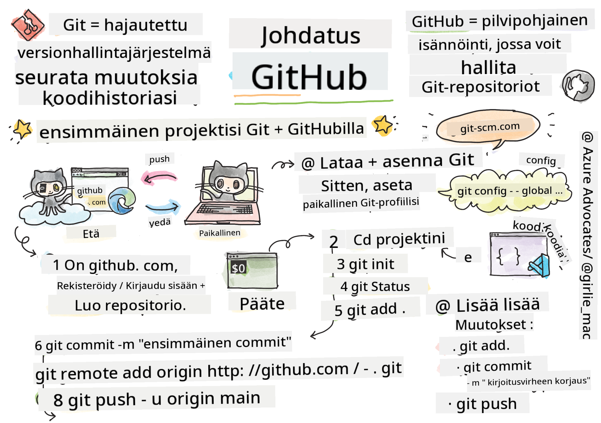
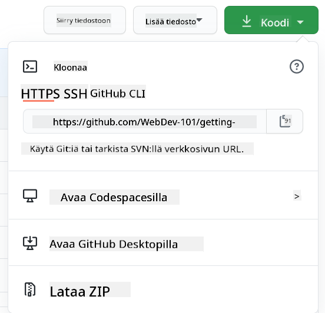

<!--
CO_OP_TRANSLATOR_METADATA:
{
  "original_hash": "acad15f3164cd6348e065ff38619aae9",
  "translation_date": "2025-10-23T00:21:30+00:00",
  "source_file": "1-getting-started-lessons/2-github-basics/README.md",
  "language_code": "fi"
}
-->
# Johdanto GitHubiin

Hei tuleva kehittäjä! 👋 Oletko valmis liittymään miljoonien koodareiden joukkoon ympäri maailmaa? Olen todella innoissani saadessani esitellä sinulle GitHubin – ajattele sitä ohjelmoijien sosiaalisen median alustana, paitsi että lounaskuvien jakamisen sijaan jaamme koodia ja rakennamme yhdessä uskomattomia asioita!

Tämä on aivan uskomatonta: jokainen sovellus puhelimessasi, jokainen verkkosivusto, jolla vierailet, ja suurin osa työkaluista, joita opit käyttämään, on rakennettu kehittäjätiimien yhteistyönä juuri GitHubin kaltaisilla alustoilla. Se musiikkisovellus, jota rakastat? Joku sinun kaltaisesi on ollut mukana sen kehittämisessä. Se peli, jota et voi lopettaa pelaamasta? Jep, sekin on todennäköisesti rakennettu GitHub-yhteistyöllä. Ja nyt SINÄ opit, miten olla osa tätä mahtavaa yhteisöä!

Tiedän, että tämä voi tuntua aluksi hieman ylivoimaiselta – muistan itsekin tuijottaneeni ensimmäistä GitHub-sivua ja miettineeni: "Mitä ihmettä tämä kaikki tarkoittaa?" Mutta tässä on juttu: jokainen kehittäjä on aloittanut juuri siitä, missä sinä olet nyt. Tämän oppitunnin lopussa sinulla on oma GitHub-repositorio (ajattele sitä henkilökohtaisena projektiesittelynä pilvessä), ja osaat tallentaa työsi, jakaa sen muiden kanssa ja jopa osallistua projekteihin, joita miljoonat ihmiset käyttävät.

Lähdetään yhdessä tälle matkalle, askel kerrallaan. Ei kiirettä, ei painetta – vain sinä, minä ja todella siistit työkalut, joista tulee pian uusia parhaita ystäviäsi!


> Sketchnote: [Tomomi Imura](https://twitter.com/girlie_mac)

## Ennakkokysely
[Ennakkokysely](https://ff-quizzes.netlify.app)

## Johdanto

Ennen kuin sukellamme todella jännittäviin asioihin, laitetaan tietokoneesi valmiiksi GitHub-taikuutta varten! Ajattele tätä kuin taidetarvikkeiden järjestämistä ennen mestariteoksen luomista – oikeiden työkalujen valmiiksi laittaminen tekee kaikesta sujuvampaa ja paljon hauskempaa.

Käyn kanssasi läpi jokaisen askeleen henkilökohtaisesti, ja lupaan, ettei se ole läheskään niin pelottavaa kuin miltä se aluksi näyttää. Jos jokin ei heti tunnu selkeältä, se on täysin normaalia! Muistan, kun asensin ensimmäistä kertaa kehitysympäristöäni ja tunsin kuin yrittäisin lukea muinaisia hieroglyfejä. Jokainen kehittäjä on ollut juuri siinä tilanteessa, missä sinä olet nyt, miettien, tekeekö kaiken oikein. Spoilerivaroitus: jos olet täällä oppimassa, teet jo kaiken oikein! 🌟

Tässä oppitunnissa käsitellään:

- työn seuraamista omalla koneellasi
- projektien tekemistä yhdessä muiden kanssa
- avoimen lähdekoodin ohjelmistojen kehittämiseen osallistumista

### Esivaatimukset

Laitetaan tietokoneesi valmiiksi GitHub-taikuutta varten! Älä huoli – tämä asennus tehdään vain kerran, ja sen jälkeen olet valmis koko koodausmatkallesi.

Aloitetaan perusasioista! Ensin meidän täytyy tarkistaa, onko Git jo asennettuna koneellesi. Git on kuin superälykäs avustaja, joka muistaa jokaisen muutoksen, jonka teet koodissasi – paljon parempi kuin Ctrl+S:n hakkaaminen joka toinen sekunti (kaikki olemme tehneet niin!).

Tarkistetaan, onko Git jo asennettuna kirjoittamalla tämä taikakomento terminaaliin:
`git --version`

Jos Git ei ole vielä asennettuna, ei hätää! Mene vain [lataamaan Git](https://git-scm.com/downloads) ja hanki se. Kun olet asentanut sen, meidän täytyy esitellä sinut Gitille kunnolla:

> 💡 **Ensiasennus**: Nämä komennot kertovat Gitille, kuka olet. Tämä tieto liitetään jokaiseen tekemääsi commit-merkintään, joten valitse nimi ja sähköposti, jotka olet valmis jakamaan julkisesti.

```bash
git config --global user.name "your-name"
git config --global user.email "your-email"
```

Tarkistaaksesi, onko Git jo määritetty, voit kirjoittaa:
```bash
git config --list
```

Tarvitset myös GitHub-tilin, koodieditorin (kuten Visual Studio Code) ja sinun täytyy avata terminaali (tai komentokehote).

Siirry [github.com](https://github.com/) ja luo tili, jos sinulla ei vielä ole sellaista, tai kirjaudu sisään ja täytä profiilisi.

💡 **Moderni vinkki**: Harkitse [SSH-avainten](https://docs.github.com/en/authentication/connecting-to-github-with-ssh) tai [GitHub CLI:n](https://cli.github.com/) käyttöönottoa helpompaan autentikointiin ilman salasanoja.

✅ GitHub ei ole ainoa koodirepositorio maailmassa; niitä on muitakin, mutta GitHub on tunnetuin.

### Valmistelu

Tarvitset sekä koodiprojektin sisältävän kansion paikallisella koneellasi (kannettava tai PC) että julkisen repositorion GitHubissa, joka toimii esimerkkinä siitä, miten osallistua muiden projekteihin.

### Pidä koodisi turvassa

Puhutaan hetki turvallisuudesta – mutta älä huoli, emme aio hukuttaa sinua pelottavilla asioilla! Ajattele näitä turvallisuuskäytäntöjä kuin auton tai kodin lukitsemista. Ne ovat yksinkertaisia tapoja, joista tulee tottumus ja jotka pitävät kovan työsi suojattuna.

Näytämme sinulle modernit ja turvalliset tavat työskennellä GitHubin kanssa heti alusta alkaen. Näin kehität hyviä tapoja, jotka palvelevat sinua hyvin koko koodausurasi ajan.

Kun työskentelet GitHubin kanssa, on tärkeää noudattaa turvallisuuden parhaita käytäntöjä:

| Turvallisuusalue | Paras käytäntö | Miksi se on tärkeää |
|------------------|----------------|----------------------|
| **Autentikointi** | Käytä SSH-avaimia tai henkilökohtaisia käyttöoikeustunnuksia | Salasanat ovat vähemmän turvallisia ja niitä ollaan poistamassa käytöstä |
| **Kaksivaiheinen autentikointi** | Ota 2FA käyttöön GitHub-tililläsi | Lisää ylimääräisen suojakerroksen tilillesi |
| **Repositorion turvallisuus** | Älä koskaan tallenna arkaluontoisia tietoja | API-avaimia ja salasanoja ei koskaan pitäisi olla julkisissa repositorioissa |
| **Riippuvuuksien hallinta** | Ota Dependabot käyttöön päivityksiä varten | Pitää riippuvuudet turvallisina ja ajan tasalla |

> ⚠️ **Kriittinen turvallisuusmuistutus**: Älä koskaan tallenna API-avaimia, salasanoja tai muita arkaluontoisia tietoja mihinkään repositorioon. Käytä ympäristömuuttujia ja `.gitignore`-tiedostoja suojataksesi arkaluontoiset tiedot.

**Moderni autentikointiasetus:**

```bash
# Generate SSH key (modern ed25519 algorithm)
ssh-keygen -t ed25519 -C "your_email@example.com"

# Set up Git to use SSH
git remote set-url origin git@github.com:username/repository.git
```

> 💡 **Vinkki**: SSH-avaimet poistavat tarpeen syöttää salasanoja toistuvasti ja ovat turvallisempia kuin perinteiset autentikointimenetelmät.

---

## Hallitse koodiasi kuin ammattilainen

Okei, TÄSSÄ kohtaa asiat muuttuvat todella jännittäviksi! 🎉 Olemme oppimassa, miten seurata ja hallita koodiasi kuten ammattilaiset, ja rehellisesti sanottuna tämä on yksi suosikkiasioistani opettaa, koska se on todellinen pelin muuttaja.

Kuvittele tämä: kirjoitat upeaa tarinaa ja haluat pitää kirjaa jokaisesta luonnoksesta, jokaisesta nerokkaasta muokkauksesta ja jokaisesta "hetkinen, tämä on nerokasta!" -hetkestä matkan varrella. Juuri sitä Git tekee koodillesi! Se on kuin uskomaton aikamatkustava muistikirja, joka muistaa KAIKEN – jokaisen näppäimen painalluksen, jokaisen muutoksen, jokaisen "oi ei, kaikki meni pieleen" -hetken, jonka voit välittömästi peruuttaa.

Olen rehellinen – tämä voi tuntua aluksi ylivoimaiselta. Kun aloitin, ajattelin "Miksi en voi vain tallentaa tiedostojani normaalisti?" Mutta luota minuun tässä: kun Git alkaa tuntua sinulle tutulta (ja niin tapahtuu!), sinulla on yksi niistä lamppuhetkistä, jolloin ajattelet "Miten olen IKINÄ koodannut ilman tätä?" Se on kuin huomaisi osaavansa lentää, kun on aina kävellyt kaikkialle.

Oletetaan, että sinulla on paikallisesti kansio, jossa on koodiprojekti, ja haluat alkaa seurata edistymistäsi git-versionhallintajärjestelmän avulla. Jotkut ihmiset vertaavat gitin käyttöä rakkauskirjeen kirjoittamiseen tulevalle itselleen. Kun luet commit-viestejäsi päivien, viikkojen tai kuukausien jälkeen, pystyt muistamaan, miksi teit tietyn päätöksen, tai "peruuttaa" muutoksen – kunhan kirjoitat hyviä "commit-viestejä".

### Tehtävä: Luo ensimmäinen repositoriosi!

> 🎯 **Tehtäväsi (ja olen niin innoissani puolestasi!)**: Luomme yhdessä ensimmäisen GitHub-repositoriosi! Kun olemme valmiita, sinulla on oma pieni nurkka internetissä, jossa koodisi asuu, ja olet tehnyt ensimmäisen "commitisi" (se on kehittäjien kieltä, joka tarkoittaa työn tallentamista todella fiksulla tavalla).
>
> Tämä on todella erityinen hetki – olet virallisesti liittymässä maailmanlaajuiseen kehittäjäyhteisöön! Muistan edelleen sen jännityksen, kun loin ensimmäisen repositorioni ja ajattelin "Vau, minä todella teen tämän!"

Käydään tämä seikkailu yhdessä läpi, askel askeleelta. Käy jokainen osa rauhassa läpi – kiirehtimisestä ei saa palkintoa, ja lupaan, että jokainen askel tulee olemaan järkevä. Muista, että jokainen ihailemasi koodausstara on joskus ollut juuri siinä, missä sinä olet nyt, luomassa ensimmäistä repositoriotaan. Kuinka siistiä se onkaan?

> Katso video
> 
> [](https://www.youtube.com/watch?v=9R31OUPpxU4)

**Tehdään tämä yhdessä:**

1. **Luo repositorio GitHubissa**. Siirry GitHub.com-sivustolle ja etsi kirkkaan vihreä **New**-painike (tai oikeasta yläkulmasta **+**-merkki). Klikkaa sitä ja valitse **New repository**.

   Näin se tehdään:
   1. Anna repositoriolle nimi – valitse jotain, mikä merkitsee sinulle!
   1. Lisää kuvaus, jos haluat (tämä auttaa muita ymmärtämään, mistä projektissasi on kyse)
   1. Päätä, haluatko sen olevan julkinen (kaikki voivat nähdä sen) vai yksityinen (vain sinulle)
   1. Suosittelen valitsemaan ruudun, joka lisää README-tiedoston – se on kuin projektisi etusivu
   1. Klikkaa **Create repository** ja juhli – loit juuri ensimmäisen repositoriosi! 🎉

2. **Siirry projektikansioosi**. Nyt avataan terminaali (älä huoli, se ei ole niin pelottava kuin miltä näyttää!). Meidän täytyy kertoa tietokoneellesi, missä projektitiedostosi ovat. Kirjoita tämä komento:

   ```bash
   cd [name of your folder]
   ```

   **Mitä tässä tehdään:**
   - Käytännössä sanomme "Hei tietokone, vie minut projektikansiooni"
   - Tämä on kuin avaisi tietyn kansion työpöydällä, mutta teemme sen tekstikomennoilla
   - Korvaa `[kansiosi nimi]` projektikansiosi oikealla nimellä

3. **Muuta kansiosi Git-repositorioksi**. Tässä tapahtuu taikuutta! Kirjoita:

   ```bash
   git init
   ```

   **Tässä tapahtui (aika siistiä!):**
   - Git loi piilotetun `.git`-kansion projektiisi – et näe sitä, mutta se on siellä!
   - Tavallinen kansiosi on nyt "repositorio", joka voi seurata jokaista tekemääsi muutosta
   - Ajattele sitä kuin antaisit kansiollesi supervoimat muistaa kaiken

4. **Tarkista, mitä tapahtuu**. Katsotaan, mitä Git ajattelee projektistasi juuri nyt:

   ```bash
   git status
   ```

   **Ymmärrä, mitä Git kertoo sinulle:**
   
   Saatat nähdä jotain tällaista:

   ```output
   Changes not staged for commit:
   (use "git add <file>..." to update what will be committed)
   (use "git restore <file>..." to discard changes in working directory)

        modified:   file.txt
        modified:   file2.txt
   ```

   **Älä panikoi! Tämä tarkoittaa:**
   - **Punaiset** tiedostot ovat tiedostoja, joissa on muutoksia, mutta ne eivät ole vielä valmiita tallennettavaksi
   - **Vihreät** tiedostot (kun näet niitä) ovat valmiita tallennettavaksi
   - Git on avulias ja kertoo sinulle tarkalleen, mitä voit tehdä seuraavaksi

   > 💡 **Vinkki**: `git status` -komento on paras ystäväsi! Käytä sitä aina, kun olet epävarma siitä, mitä tapahtuu. Se on kuin kysyisi Gitiltä "Hei, mikä tilanne on juuri nyt?"

5. **Valmistele tiedostosi tallennettavaksi** (tätä kutsutaan "stagingiksi"):

   ```bash
   git add .
   ```

   **Mitä juuri teimme:**
   - Kerroimme Gitille "Hei, haluan sisällyttää KAIKKI tiedostoni seuraavaan tallennukseen"
   - `.` on kuin sanoisi "kaikki tässä kansiossa"
   - Nyt tiedostosi ovat "staged" ja valmiita seuraavaan vaiheeseen

   **Haluatko olla valikoivampi?** Voit lisätä vain tietyt tiedostot:

   ```bash
   git add [file or folder name]
   ```

   **Miksi haluaisit tehdä näin?**
   - Joskus haluat tallentaa liittyvät muutokset yhdessä
   - Se auttaa sinua järjestämään työsi loogisiin kokonaisuuksiin
   - Helpottaa ymmärtämään, mitä muuttui ja milloin

   **Muutitko mielesi?** Ei hätää! Voit poistaa tiedostoja staging-tilasta näin:

   ```bash
   # Unstage everything
   git reset
   
   # Unstage just one file
   git reset [file name]
   ```

   Älä huoli – tämä ei poista työtäsi, se vain siirtää tiedostot pois "valmiina tallennettavaksi" -pinosta.

6. **Tallenna työsi pysyvästi** (tee ensimmäinen commitisi!):

   ```bash
   git commit -m "first commit"
   ```

   **🎉 Onnittelut! Teit juuri ensimmäisen commitisi!**
   
   **Tässä tapahtui:**
   - Git otti "valokuvan" kaikista staged-tiedostoistasi juuri sillä hetkellä
   - Commit-viestisi "first commit" selittää, mistä tämä tallennuspiste kertoo
   - Git antoi tälle valokuvalle ainutlaatuisen tunnisteen, jotta voit aina löytää sen myöhemmin
   - Olet virallisesti aloittanut projektisi historian seuraamisen!

   > 💡 **Tulevat commit-viestit**: Seuraavissa commit-viesteissä ole kuvailevampi! Sen sijaan, että kirjoittaisit "päivitetty juttuja", kokeile "Lisätty yhteydenottolomake etusivulle" tai "Korjattu navigointivalikon virhe". Tuleva itsesi kiittää sinua!

7. **Yhdistä paikallinen projektisi GitHubiin**. Tällä hetkellä projektisi on vain tietokoneellasi. Yhdistetään se GitHub-repositorioosi, jotta voit jakaa sen maailmalle!

   Ensin, mene GitHub-repositoriosi sivulle ja kopioi URL-osoite. Sitten palaa tänne ja kirjoita:

   ```bash
   git remote add origin https://github.com/username/repository_name.git
   ```
   
   (Korvaa tuo URL-osoite oikealla repositoriosi URL-osoitteella!)

   **Tässä tapahtui:**
   - Loimme yhteyden paikallisen projektisi ja GitHub-repositoriosi välille.
   - "Origin" on vain lempinimi GitHub-repositoriollesi – vähän kuin lisäisit yhteystiedon puhelimeesi.
   - Nyt paikallinen Git tietää, minne lähettää koodisi, kun olet valmis jakamaan sen.

   💡 **Helpompi tapa**: Jos sinulla on GitHub CLI asennettuna, voit tehdä tämän yhdellä komennolla:
   ```bash
   gh repo create my-repo --public --push --source=.
   ```

8. **Lähetä koodisi GitHubiin** (suuri hetki!):

   ```bash
   git push -u origin main
   ```

   **🚀 Tässä se on! Lataat koodisi GitHubiin!**
   
   **Mitä tapahtuu:**
   - Commitisi siirtyvät tietokoneeltasi GitHubiin.
   - `-u`-lippu luo pysyvän yhteyden, joten tulevat push-komennot ovat helpompia.
   - "main" on ensisijaisen haarasi nimi (kuten pääkansio).
   - Tämän jälkeen voit vain kirjoittaa `git push` tulevia latauksia varten!

   💡 **Pieni huomautus**: Jos haarasi nimi on jotain muuta (kuten "master"), käytä sitä nimeä. Voit tarkistaa sen komennolla `git branch --show-current`.

9. **Uusi päivittäinen koodausrytmi** (tästä tulee koukuttavaa!):

   Tästä eteenpäin, aina kun teet muutoksia projektiisi, seuraa tätä yksinkertaista kolmen askeleen kaavaa:

   ```bash
   git add .
   git commit -m "describe what you changed"
   git push
   ```

   **Tämä on koodausrytmin ydin:**
   - Tee mahtavia muutoksia koodiisi ✨
   - Stageaa ne komennolla `git add` ("Hei Git, huomioi nämä muutokset!")
   - Tallenna ne komennolla `git commit` ja lisää kuvaileva viesti (tuleva sinä kiittää sinua!)
   - Jaa ne maailmalle komennolla `git push` 🚀
   - Toista – tämä tulee yhtä luonnolliseksi kuin hengittäminen!

   Rakastan tätä työnkulkua, koska se on kuin useiden tallennuspisteiden luomista videopelissä. Teitkö muutoksen, josta pidät? Commitoi se! Haluatko kokeilla jotain riskialtista? Ei hätää – voit aina palata viimeiseen commit-pisteeseesi, jos asiat menevät pieleen!

   > 💡 **Vinkki**: Voit myös harkita `.gitignore`-tiedoston käyttöönottoa estääksesi tiedostojen, joita et halua seurata, näkymisen GitHubissa – kuten muistiinpanotiedoston, joka on samassa kansiossa, mutta ei kuulu julkiseen repositorioon. Löydät malleja `.gitignore`-tiedostoille osoitteesta [.gitignore templates](https://github.com/github/gitignore) tai voit luoda sellaisen [gitignore.io](https://www.toptal.com/developers/gitignore)-sivustolla.

#### Modernit Git-työnkulut

Harkitse näiden modernien käytäntöjen omaksumista:

- **Conventional Commits**: Käytä standardoitua commit-viestien muotoa, kuten `feat:`, `fix:`, `docs:` jne. Lue lisää osoitteessa [conventionalcommits.org](https://www.conventionalcommits.org/)
- **Atomiset commitit**: Tee jokaisesta commitista yksi looginen muutos.
- **Usein toistuvat commitit**: Commitoi usein kuvailevilla viesteillä sen sijaan, että tekisit suuria ja harvinaisia committeja.

#### Commit-viestit

Hyvä Git commit -aiherivi täydentää seuraavan lauseen:
Jos tämä commit toteutetaan, se <aiherivisi tähän>

Käytä aiherivissä imperatiivista preesensmuotoa: "muuta" ei "muutettu" eikä "muutokset". 
Kuten aiherivissä, myös (valinnaisessa) rungossa käytä imperatiivista preesensmuotoa. Rungon tulisi sisältää muutoksen motiivi ja verrata sitä aiempaan käyttäytymiseen. Selität `miksi`, et `miten`.

✅ Käytä muutama minuutti selaamalla GitHubia. Löydätkö todella hyvän commit-viestin? Entä todella minimaalisen? Mitä tietoa mielestäsi on tärkeintä ja hyödyllisintä välittää commit-viestissä?

## Yhteistyö muiden kanssa (hauskin osuus!)

Pidä hatustasi kiinni, sillä TÄMÄ on se osa, jossa GitHub muuttuu täysin maagiseksi! 🪄 Olet hallinnut oman koodisi hallinnan, mutta nyt sukellamme suosikkiosaani – yhteistyöhön mahtavien ihmisten kanssa ympäri maailmaa.

Kuvittele tämä: heräät huomenna ja huomaat, että joku Tokiosta on parantanut koodiasi nukkuessasi. Sitten joku Berliinistä korjaa bugin, jonka kanssa olet kamppaillut. Iltapäivällä kehittäjä São Paulosta lisää ominaisuuden, jota et edes osannut kuvitella. Tämä ei ole tieteiskirjallisuutta – tämä on vain tavallinen tiistai GitHub-universumissa!

Mikä todella innostaa minua, on se, että yhteistyötaidot, joita olet oppimassa? Nämä ovat TÄSMÄLLEEN samoja työnkulkuja, joita Google, Microsoft ja suosikkistartupisi tiimit käyttävät joka päivä. Et opi vain siistiä työkalua – opit salakielen, joka saa koko ohjelmistomaailman toimimaan yhdessä.

Vakavasti, kun koet sen tunteen, kun joku hyväksyy ensimmäisen pull requestisi, ymmärrät, miksi kehittäjät ovat niin intohimoisia avoimen lähdekoodin suhteen. Se on kuin olla osa maailman suurinta, luovinta tiimiprojektia!

> Katso video
>
> [](https://www.youtube.com/watch?v=bFCM-PC3cu8)

GitHubiin asioiden laittamisen pääasiallinen syy oli tehdä yhteistyö muiden kehittäjien kanssa mahdolliseksi.

Repositoriossasi siirry kohtaan `Insights > Community` nähdäksesi, miten projektisi vertautuu suositeltuihin yhteisön standardeihin.

Haluatko tehdä repositoriostasi ammattimaisen ja kutsuvan? Siirry repositorioosi ja klikkaa `Insights > Community`. Tämä hieno ominaisuus näyttää, miten projektisi vertautuu siihen, mitä GitHub-yhteisö pitää "hyvinä repositoriokäytäntöinä."

> 🎯 **Tee projektistasi houkutteleva**: Hyvin järjestetty repositorio, jossa on hyvä dokumentaatio, on kuin siisti ja kutsuva myymälä. Se kertoo ihmisille, että välität työstäsi ja saa muut haluamaan osallistua!

**Näin repositoriosta tulee mahtava:**

| Mitä lisätä | Miksi se on tärkeää | Mitä se tekee sinulle |
|-------------|-------------------|---------------------|
| **Kuvaus** | Ensivaikutelma ratkaisee! | Ihmiset tietävät heti, mitä projektisi tekee |
| **README** | Projektisi etusivu | Kuten ystävällinen opas uusille vierailijoille |
| **Ohjeet osallistumiseen** | Näyttää, että arvostat apua | Ihmiset tietävät tarkalleen, miten he voivat auttaa |
| **Toimintaohjeet** | Luo ystävällisen tilan | Kaikki tuntevat olonsa tervetulleeksi osallistua |
| **Lisenssi** | Oikeudellinen selkeys | Muut tietävät, miten he voivat käyttää koodiasi |
| **Tietoturvapolitiikka** | Näyttää vastuullisuutesi | Osoittaa ammattimaisia käytäntöjä |

> 💡 **Pro-vinkki**: GitHub tarjoaa malleja kaikille näille tiedostoille. Kun luot uuden repositorion, valitse ruudut, jotka luovat nämä tiedostot automaattisesti.

**Modernit GitHub-ominaisuudet, joita kannattaa tutkia:**

🤖 **Automaatio & CI/CD:**
- **GitHub Actions** automaattiseen testaukseen ja käyttöönottoon
- **Dependabot** automaattisiin riippuvuuspäivityksiin

💬 **Yhteisö & projektinhallinta:**
- **GitHub Discussions** yhteisökeskusteluihin, jotka menevät pidemmälle kuin ongelmat
- **GitHub Projects** kanban-tyyliseen projektinhallintaan
- **Haarojen suojaussäännöt** koodin laadun varmistamiseksi

Kaikki nämä resurssit hyödyttävät uusien tiimin jäsenten perehdyttämistä. Ja juuri nämä ovat yleensä asioita, joita uudet osallistujat tarkastelevat ennen kuin he edes katsovat koodiasi, selvittääkseen, onko projektisi oikea paikka heidän ajankäytölleen.

✅ README-tiedostot, vaikka niiden valmistelu vie aikaa, jäävät usein kiireisten ylläpitäjien huomiotta. Löydätkö esimerkin erityisen kuvailevasta README-tiedostosta? Huomaa: on olemassa joitakin [työkaluja hyvien README-tiedostojen luomiseen](https://www.makeareadme.com/), joita voit halutessasi kokeilla.

### Tehtävä: Yhdistä koodia

Osallistumisohjeet auttavat ihmisiä osallistumaan projektiin. Ne selittävät, millaisia panoksia etsit ja miten prosessi toimii. Osallistujien on käytävä läpi useita vaiheita voidakseen osallistua GitHub-repositorioosi:

1. **Repositorion haarauttaminen**. Haluat todennäköisesti, että ihmiset _haarauttavat_ projektisi. Haarauttaminen tarkoittaa repositoriosi kopion luomista heidän GitHub-profiiliinsa.
1. **Kloonaus**. Tämän jälkeen he kloonaavat projektin paikalliselle koneelleen.
1. **Haaran luominen**. Pyydä heitä luomaan _haara_ työlleen.
1. **Keskittyminen yhteen muutokseen**. Pyydä osallistujia keskittymään yhteen asiaan kerrallaan – näin mahdollisuus, että voit _yhdistää_ heidän työnsä, on suurempi. Kuvittele, että he korjaavat bugin, lisäävät uuden ominaisuuden ja päivittävät useita testejä – entä jos haluat tai voit toteuttaa vain 2 kolmesta tai 1 kolmesta muutoksesta?

✅ Kuvittele tilanne, jossa haarat ovat erityisen tärkeitä hyvän koodin kirjoittamisessa ja julkaisemisessa. Mitä käyttötapauksia keksit?

> Huomaa, ole se muutos, jonka haluat nähdä maailmassa, ja luo haaroja myös omalle työllesi. Kaikki commitit, jotka teet, tehdään haaralle, johon olet tällä hetkellä "siirtynyt". Käytä `git status` nähdäksesi, millä haaralla olet.

Käydään läpi osallistujan työnkulku. Oletetaan, että osallistuja on jo _haarauttanut_ ja _kloonannut_ repositorion, joten heillä on Git-repositorio valmiina työstettäväksi paikallisella koneellaan:

1. **Luo haara**. Käytä komentoa `git branch` luodaksesi haaran, joka sisältää muutokset, joita he aikovat tehdä:

   ```bash
   git branch [branch-name]
   ```

   > 💡 **Moderni lähestymistapa**: Voit myös luoda ja siirtyä uuteen haaraan yhdellä komennolla:
   ```bash
   git switch -c [branch-name]
   ```

1. **Siirry työhaaraan**. Siirry määritettyyn haaraan ja päivitä työhakemisto komennolla `git switch`:

   ```bash
   git switch [branch-name]
   ```

   > 💡 **Moderni huomautus**: `git switch` on moderni korvaaja `git checkout`-komennolle haarojen vaihtamisessa. Se on selkeämpi ja turvallisempi aloittelijoille.

1. **Tee työtä**. Tässä vaiheessa haluat lisätä muutoksesi. Älä unohda kertoa Gitille niistä seuraavilla komennoilla:

   ```bash
   git add .
   git commit -m "my changes"
   ```

   > ⚠️ **Commit-viestin laatu**: Varmista, että annat commitillesi hyvän nimen, sekä itsesi että auttamasi repositorion ylläpitäjän vuoksi. Ole tarkka siitä, mitä muutit!

1. **Yhdistä työsi `main`-haaraan**. Jossain vaiheessa olet valmis työskentelyssä ja haluat yhdistää työsi `main`-haaraan. `main`-haara on saattanut muuttua sillä välin, joten varmista, että päivität sen ensin uusimpaan versioon seuraavilla komennoilla:

   ```bash
   git switch main
   git pull
   ```

   Tässä vaiheessa haluat varmistaa, että mahdolliset _konfliktit_, tilanteet, joissa Git ei voi helposti _yhdistää_ muutoksia, tapahtuvat työhaarassasi. Siksi suorita seuraavat komennot:

   ```bash
   git switch [branch_name]
   git merge main
   ```

   Komento `git merge main` tuo kaikki muutokset `main`-haarasta omaan haaraasi. Toivottavasti voit vain jatkaa. Jos et, VS Code kertoo sinulle, missä Git on _epävarma_, ja voit muokata kyseisiä tiedostoja määrittääksesi, mikä sisältö on tarkin.

   💡 **Moderni vaihtoehto**: Harkitse `git rebase`-komennon käyttöä siistimmän historian saamiseksi:
   ```bash
   git rebase main
   ```
   Tämä toistaa commitisi uusimman main-haaran päälle, luoden lineaarisen historian.

1. **Lähetä työsi GitHubiin**. Työsi lähettäminen GitHubiin tarkoittaa kahta asiaa. Haarasi push GitHub-repositorioosi ja sitten PR:n, Pull Requestin, avaaminen.

   ```bash
   git push --set-upstream origin [branch-name]
   ```

   Yllä oleva komento luo haaran haarautettuun repositorioosi.

1. **Avaa PR**. Seuraavaksi haluat avata PR:n. Tämä tehdään siirtymällä haarautettuun repositorioon GitHubissa. Näet GitHubissa ilmoituksen, jossa kysytään, haluatko luoda uuden PR:n. Klikkaa sitä, ja sinut ohjataan käyttöliittymään, jossa voit muokata commit-viestin otsikkoa ja antaa sille sopivamman kuvauksen. Nyt haarauttamasi repositorion ylläpitäjä näkee tämän PR:n ja _sormet ristissä_ arvostaa ja _yhdistää_ PR:si. Olet nyt osallistuja, jee :)

   💡 **Moderni vinkki**: Voit myös luoda PR:n GitHub CLI:n avulla:
   ```bash
   gh pr create --title "Your PR title" --body "Description of changes"
   ```

   🔧 **Parhaat käytännöt PR:lle**:
   - Linkitä asiaankuuluvat ongelmat avainsanoilla, kuten "Fixes #123".
   - Lisää kuvakaappauksia käyttöliittymämuutoksista.
   - Pyydä tiettyjä arvioijia.
   - Käytä luonnos-PR:ää keskeneräiselle työlle.
   - Varmista, että kaikki CI-tarkistukset läpäisevät ennen arviointipyynnön lähettämistä.

1. **Siivoa**. On hyvä tapa _siivota_ sen jälkeen, kun PR on onnistuneesti yhdistetty. Haluat poistaa sekä paikallisen haaran että haaran, jonka pushasit GitHubiin. Poista se ensin paikallisesti seuraavalla komennolla:

   ```bash
   git branch -d [branch-name]
   ```

   Varmista, että siirryt GitHub-sivulle haarautettuun repositorioon ja poistat sieltä juuri pushatun etähaaran.

`Pull request` saattaa kuulostaa hassulta termiltä, koska oikeasti haluat pushata muutoksesi projektiin. Mutta ylläpitäjän (projektin omistajan) tai ydintiimin täytyy harkita muutoksiasi ennen niiden yhdistämistä projektin "main"-haaraan, joten oikeastaan pyydät ylläpitäjältä päätöstä muutoksen hyväksymisestä.

Pull request on paikka, jossa verrataan ja keskustellaan haaran tuomista eroista arviointien, kommenttien, integroitujen testien ja muiden avulla. Hyvä pull request noudattaa suunnilleen samoja sääntöjä kuin commit-viesti. Voit lisätä viittauksen ongelmaan ongelmaseurannassa, kun työsi esimerkiksi korjaa ongelman. Tämä tehdään käyttämällä `#`-merkkiä, jota seuraa ongelman numero. Esimerkiksi `#97`.
🤞Peukut pystyyn, että kaikki tarkistukset menevät läpi ja projektin omistaja(t) yhdistävät muutoksesi projektiin🤞

Päivitä nykyinen paikallinen työhaara kaikilla uusilla commit-viesteillä vastaavasta etähaarasta GitHubissa:

`git pull`

## Osallistuminen avoimen lähdekoodin projekteihin (Sinun mahdollisuutesi tehdä vaikutus!)

Oletko valmis johonkin, mikä tulee räjäyttämään mielesi? 🤯 Puhutaanpa osallistumisesta avoimen lähdekoodin projekteihin – ja saan kylmiä väreitä jo pelkästä ajatuksesta jakaa tämä kanssasi!

Tämä on tilaisuutesi olla osa jotain todella poikkeuksellista. Kuvittele parantavasi työkaluja, joita miljoonat kehittäjät käyttävät päivittäin, tai korjaavasi bugin sovelluksessa, jota ystäväsi rakastavat. Se ei ole vain unelma – juuri siitä avoimen lähdekoodin projekteihin osallistumisessa on kyse!

Tässä on se, mikä saa minut innostumaan joka kerta, kun ajattelen sitä: jokainen työkalu, jota olet oppinut käyttämään – koodieditorisi, kehykset, joita tutkimme, jopa selain, jossa luet tätä – sai alkunsa jostakusta, joka oli aivan kuten sinä, tekemässä ensimmäistä kontribuutiotaan. Se loistava kehittäjä, joka rakensi suosikki VS Code -laajennuksesi? Hänkin oli joskus aloittelija, joka klikkasi "create pull request" tärisevin käsin, aivan kuten sinä olet tekemässä.

Ja tässä on kaunein osa: avoimen lähdekoodin yhteisö on kuin internetin suurin ryhmähalailu. Useimmat projektit etsivät aktiivisesti uusia tulokkaita ja merkitsevät ongelmia "good first issue" -tunnisteella juuri sinun kaltaisiasi varten! Ylläpitäjät todella innostuvat nähdessään uusia osallistujia, koska he muistavat omat ensimmäiset askeleensa.

Et ole vain oppimassa koodaamaan – valmistaudut liittymään maailmanlaajuiseen rakentajien perheeseen, joka herää joka päivä miettien "Miten voimme tehdä digitaalisesta maailmasta hieman paremman?" Tervetuloa joukkoon! 🌟

Aloitetaan etsimällä GitHubista kiinnostava arkisto (tai **repo**), johon haluaisit tehdä muutoksen. Haluat kopioida sen sisällön koneellesi.

✅ Hyvä tapa löytää 'aloittelijaystävällisiä' repoja on [etsiä tunnisteella 'good-first-issue'](https://github.blog/2020-01-22-browse-good-first-issues-to-start-contributing-to-open-source/).



Koodin kopioimiseen on useita tapoja. Yksi tapa on "kloonata" arkiston sisältö HTTPS:n, SSH:n tai GitHub CLI:n (Command Line Interface) avulla.

Avaa terminaali ja kloonaa arkisto näin:
```bash
# Using HTTPS
git clone https://github.com/ProjectURL

# Using SSH (requires SSH key setup)
git clone git@github.com:username/repository.git

# Using GitHub CLI
gh repo clone username/repository
```

Työskentelyä varten siirry oikeaan kansioon:
`cd ProjectURL`

Voit myös avata koko projektin käyttämällä:
- **[GitHub Codespaces](https://github.com/features/codespaces)** - GitHubin pilvipohjainen kehitysympäristö, jossa on VS Code selaimessa
- **[GitHub Desktop](https://desktop.github.com/)** - Graafinen käyttöliittymä Git-toiminnoille  
- **[GitHub.dev](https://github.dev)** - Paina `.`-näppäintä missä tahansa GitHub-repossa avataksesi VS Coden selaimessa
- **VS Code** GitHub Pull Requests -laajennuksella

Lopuksi voit ladata koodin zip-pakattuna kansiona.

### Muutama mielenkiintoinen asia GitHubista

Voit tähdittää, seurata ja/tai "forkata" mitä tahansa julkista arkistoa GitHubissa. Löydät tähdittämäsi arkistot oikean yläkulman pudotusvalikosta. Se on kuin kirjanmerkkien lisäämistä, mutta koodille.

Projekteilla on ongelmaseuranta, yleensä GitHubin "Issues"-välilehdellä, ellei toisin mainita, jossa ihmiset keskustelevat projektin ongelmista. Ja Pull Requests -välilehdellä keskustellaan ja tarkastellaan meneillään olevia muutoksia.

Projekteilla voi myös olla keskusteluja foorumeilla, postituslistoilla tai keskustelukanavilla, kuten Slack, Discord tai IRC.

🔧 **Modernit GitHub-ominaisuudet**:
- **GitHub Discussions** - Sisäänrakennettu foorumi yhteisökeskusteluille
- **GitHub Sponsors** - Tuki ylläpitäjille taloudellisesti  
- **Security-välilehti** - Haavoittuvuusraportit ja tietoturvaneuvot
- **Actions-välilehti** - Näe automatisoidut työnkulut ja CI/CD-putket
- **Insights-välilehti** - Analytiikkaa osallistujista, commiteista ja projektin tilasta
- **Projects-välilehti** - GitHubin sisäänrakennetut projektinhallintatyökalut

✅ Tutustu uuteen GitHub-repoosi ja kokeile muutamia asioita, kuten asetusten muokkaamista, tiedon lisäämistä repoosi, projektin luomista (esim. Kanban-taulu) ja GitHub Actionsin käyttöönottoa automaatiota varten. Voit tehdä paljon!

---

## 🚀 Haaste 

Nyt on aika laittaa uudet GitHub-supervoimasi testiin! 🚀 Tässä on haaste, joka saa kaiken loksahtamaan paikoilleen mitä tyydyttävimmällä tavalla:

Ota kaveri (tai se perheenjäsen, joka aina kysyy, mitä teet kaikella tällä "tietokonehommalla") ja lähde yhdessä koodausseikkailuun! Tässä tapahtuu todellinen taika – luokaa projekti, anna heidän forkata se, tehkää haaroja ja yhdistäkää muutoksia kuin ammattilaiset.

En aio valehdella – tulette todennäköisesti nauramaan jossain vaiheessa (varsinkin kun molemmat yritätte muokata samaa riviä), ehkä raapimaan päätänne hämmennyksestä, mutta saatte varmasti kokea niitä mahtavia "aha!"-hetkiä, jotka tekevät kaikesta oppimisesta sen arvoista. Lisäksi on jotain erityistä siinä, kun jakaa ensimmäisen onnistuneen yhdistämisen jonkun toisen kanssa – se on kuin pieni juhla siitä, kuinka pitkälle olette päässeet!

Eikö sinulla ole vielä koodauskaveria? Ei hätää! GitHub-yhteisö on täynnä uskomattoman ystävällisiä ihmisiä, jotka muistavat, millaista oli olla uusi. Etsi repoja, joissa on "good first issue" -tunniste – ne käytännössä sanovat "Hei aloittelijat, tulkaa oppimaan kanssamme!" Kuinka mahtavaa se onkaan?

## Luentojälkeinen visailu
[Luentojälkeinen visailu](https://ff-quizzes.netlify.app/web/en/)

## Kertaus & Jatka oppimista

Huh! 🎉 Katso sinua – olet juuri valloittanut GitHubin perusteet kuin todellinen mestari! Jos pääsi tuntuu nyt hieman täydeltä, se on täysin normaalia ja rehellisesti sanottuna hyvä merkki. Olet juuri oppinut työkaluja, joiden hallitseminen vei minulta viikkoja, kun aloitin.

Git ja GitHub ovat uskomattoman tehokkaita (kuten, todella tehokkaita), ja jokainen tuntemani kehittäjä – mukaan lukien ne, jotka nyt vaikuttavat velhoilta – joutui harjoittelemaan ja kompuroimaan ennen kuin kaikki loksahti paikoilleen. Se, että olet päässyt tämän oppitunnin läpi, tarkoittaa, että olet jo matkalla hallitsemaan joitakin kehittäjän tärkeimpiä työkaluja.

Tässä on muutamia aivan loistavia resursseja, jotka auttavat sinua harjoittelemaan ja tulemaan vieläkin mahtavammaksi:

- [Opas avoimen lähdekoodin projekteihin osallistumiseen](https://opensource.guide/how-to-contribute/#how-to-submit-a-contribution) – Tiekarttasi vaikuttamiseen
- [Git-pikaopas](https://training.github.com/downloads/github-git-cheat-sheet/) – Pidä tämä käden ulottuvilla nopeaa viittausta varten!

Ja muista: harjoitus tekee mestarin, ei täydellisyyttä! Mitä enemmän käytät Gitiä ja GitHubia, sitä luonnollisemmaksi se muuttuu. GitHub on luonut upeita interaktiivisia kursseja, joiden avulla voit harjoitella turvallisessa ympäristössä:

- [Johdatus GitHubiin](https://github.com/skills/introduction-to-github)
- [Viestintä Markdownilla](https://github.com/skills/communicate-using-markdown)  
- [GitHub Pages](https://github.com/skills/github-pages)
- [Yhdistämiskonfliktien hallinta](https://github.com/skills/resolve-merge-conflicts)

**Tuntuuko seikkailunhaluiselta? Tutustu näihin moderneihin työkaluihin:**
- [GitHub CLI -dokumentaatio](https://cli.github.com/manual/) – Kun haluat tuntea itsesi komentorivivelhoksi
- [GitHub Codespaces -dokumentaatio](https://docs.github.com/en/codespaces) – Koodaa pilvessä!
- [GitHub Actions -dokumentaatio](https://docs.github.com/en/actions) – Automatisoi kaikki
- [Git parhaat käytännöt](https://www.atlassian.com/git/tutorials/comparing-workflows) – Nosta työnkulku pelisi uudelle tasolle 

## GitHub Copilot Agent -haaste 🚀

Käytä Agent-tilaa suorittaaksesi seuraava haaste:

**Kuvaus:** Luo yhteistyöhön perustuva web-kehitysprojekti, joka esittelee koko GitHub-työnkulun, jonka olet oppinut tällä oppitunnilla. Tämä haaste auttaa sinua harjoittelemaan arkiston luomista, yhteistyöominaisuuksia ja moderneja Git-työnkulkuja todellisessa tilanteessa.

**Tehtävänanto:** Luo uusi julkinen GitHub-arkisto yksinkertaista "Web Development Resources" -projektia varten. Arkiston tulisi sisältää hyvin jäsennelty README.md-tiedosto, jossa on lueteltu hyödyllisiä web-kehitystyökaluja ja -resursseja, jaoteltuna kategorioittain (HTML, CSS, JavaScript jne.). Määritä arkisto asianmukaisilla yhteisöstandardeilla, mukaan lukien lisenssi, osallistumisohjeet ja käytännesäännöt. Luo vähintään kaksi ominaisuusharaa: yksi CSS-resursseille ja toinen JavaScript-resursseille. Tee commit-viestejä kumpaankin haaraan kuvaavilla viesteillä, ja luo sitten pull requestit muutosten yhdistämiseksi päähaaraan. Ota käyttöön GitHub-ominaisuuksia, kuten Issues, Discussions, ja määritä perus GitHub Actions -työnkulku automaattisia tarkistuksia varten.

## Tehtävä 

Sinun tehtäväsi, jos päätät hyväksyä sen: Suorita [Introduction to GitHub](https://github.com/skills/introduction-to-github) -kurssi GitHub Skillsissä. Tämä interaktiivinen kurssi antaa sinun harjoitella kaikkea oppimaasi turvallisessa, ohjatussa ympäristössä. Lisäksi saat hienon merkin, kun olet valmis! 🏅

**Tuntuuko siltä, että haluat lisää haasteita?**
- Määritä SSH-todennus GitHub-tilillesi (ei enää salasanoja!)
- Kokeile käyttää GitHub CLI:tä päivittäisiin Git-toimintoihisi
- Luo arkisto, jossa on GitHub Actions -työnkulku
- Tutustu GitHub Codespacesiin avaamalla tämä sama arkisto pilvipohjaisessa editorissa

Muista: jokainen asiantuntija on ollut joskus aloittelija. Sinä pystyt tähän! 💪

---

**Vastuuvapauslauseke**:  
Tämä asiakirja on käännetty käyttämällä tekoälypohjaista käännöspalvelua [Co-op Translator](https://github.com/Azure/co-op-translator). Vaikka pyrimme tarkkuuteen, huomioithan, että automaattiset käännökset voivat sisältää virheitä tai epätarkkuuksia. Alkuperäinen asiakirja sen alkuperäisellä kielellä tulisi pitää ensisijaisena lähteenä. Kriittisen tiedon osalta suositellaan ammattimaista ihmiskäännöstä. Emme ole vastuussa väärinkäsityksistä tai virhetulkinnoista, jotka johtuvat tämän käännöksen käytöstä.