<!--
CO_OP_TRANSLATOR_METADATA:
{
  "original_hash": "7f2c48e04754724123ea100a822765e5",
  "translation_date": "2025-11-04T01:17:54+00:00",
  "source_file": "1-getting-started-lessons/3-accessibility/README.md",
  "language_code": "fi"
}
-->
# Luodaan saavutettavia verkkosivuja


> Sketchnote: [Tomomi Imura](https://twitter.com/girlie_mac)

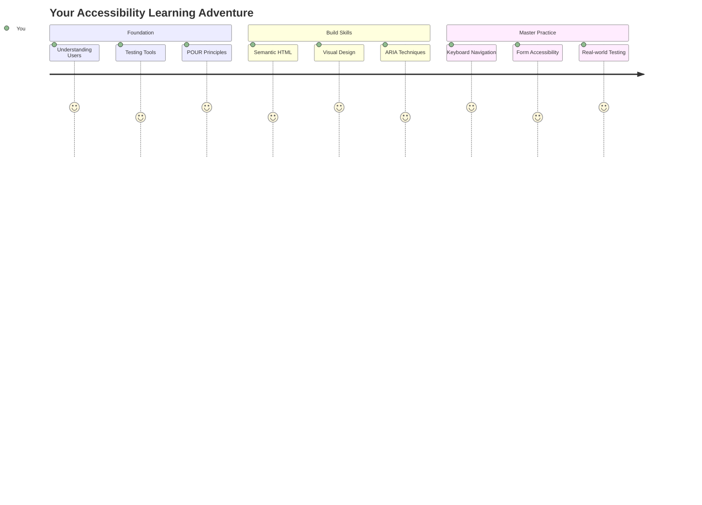

## Ennakkokysely
[Ennakkokysely](https://ff-quizzes.netlify.app/web/)

> Verkon voima on sen universaalisuudessa. Pääsy kaikille, riippumatta vammaisuudesta, on olennainen osa.
>
> \- Sir Timothy Berners-Lee, W3C:n johtaja ja World Wide Webin keksijä

Tässä on jotain, mikä saattaa yllättää sinut: kun rakennat saavutettavia verkkosivustoja, et ainoastaan auta vammaisia ihmisiä—teet itse asiassa verkosta paremman kaikille!

Oletko koskaan huomannut jalkakäytävien kulmissa olevia ramppeja? Ne suunniteltiin alun perin pyörätuoleille, mutta nyt ne auttavat myös lastenvaunujen kanssa liikkuvia, tavarankuljettajia, matkalaukkujen kanssa matkustavia ja pyöräilijöitä. Juuri näin saavutettava verkkosuunnittelu toimii—ratkaisut, jotka auttavat yhtä ryhmää, hyödyttävät usein kaikkia. Aika siistiä, eikö?

Tässä oppitunnissa tutkimme, kuinka luoda verkkosivustoja, jotka toimivat aidosti kaikille, riippumatta siitä, miten he selaavat verkkoa. Opit käytännön tekniikoita, jotka ovat jo sisäänrakennettu verkkostandardeihin, pääset kokeilemaan testityökaluja ja näet, kuinka saavutettavuus tekee sivustoistasi käyttäjäystävällisempiä kaikille.

Oppitunnin lopussa sinulla on itsevarmuutta tehdä saavutettavuudesta luonnollinen osa kehitysprosessiasi. Valmis tutkimaan, kuinka harkitut suunnitteluratkaisut voivat avata verkon miljardeille käyttäjille? Sukelletaanpa!

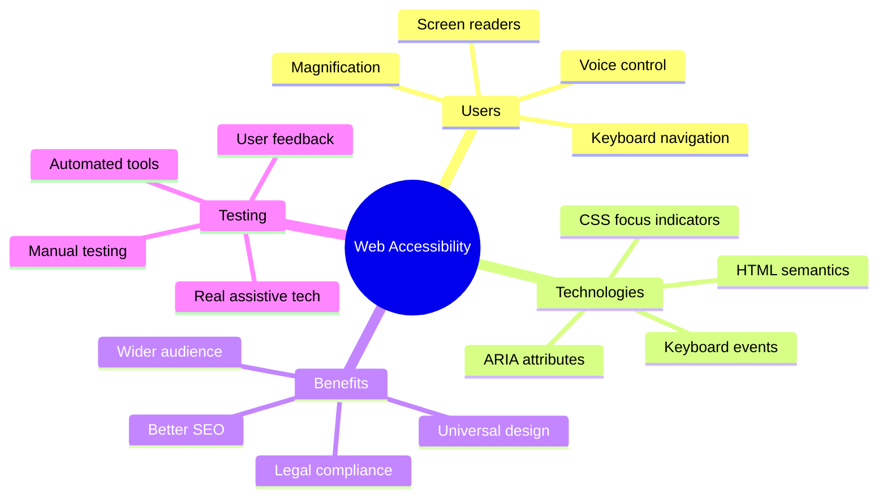

> Voit käydä tämän oppitunnin [Microsoft Learnissa](https://docs.microsoft.com/learn/modules/web-development-101/accessibility/?WT.mc_id=academic-77807-sagibbon)!

## Ymmärtäminen avustavista teknologioista

Ennen kuin siirrymme koodaukseen, otetaan hetki ymmärtääksemme, miten eri kykyiset ihmiset todella kokevat verkon. Tämä ei ole pelkkää teoriaa—näiden todellisten navigointitapojen ymmärtäminen tekee sinusta paljon paremman kehittäjän!

Avustavat teknologiat ovat hämmästyttäviä työkaluja, jotka auttavat vammaisia ihmisiä vuorovaikuttamaan verkkosivustojen kanssa tavoilla, jotka saattavat yllättää sinut. Kun opit, miten nämä teknologiat toimivat, saavutettavien verkkokokemusten luominen muuttuu paljon intuitiivisemmaksi. Se on kuin oppisi näkemään koodisi jonkun toisen silmin.

### Ruudunlukijat

[Ruudunlukijat](https://en.wikipedia.org/wiki/Screen_reader) ovat melko kehittyneitä teknologioita, jotka muuntavat digitaalisen tekstin puheeksi tai pistekirjoitukseksi. Vaikka niitä käytetään pääasiassa näkövammaisten ihmisten toimesta, ne ovat myös erittäin hyödyllisiä oppimisvaikeuksista, kuten dysleksiasta, kärsiville käyttäjille.

Ajattelen ruudunlukijaa kuin todella älykästä kertojan ääntä, joka lukee kirjaa sinulle. Se lukee sisällön ääneen loogisessa järjestyksessä, ilmoittaa interaktiiviset elementit kuten "painike" tai "linkki" ja tarjoaa näppäinoikoteitä sivulla liikkumiseen. Mutta tässä on juttu—ruudunlukijat voivat tehdä taikojaan vain, jos rakennamme verkkosivustoja asianmukaisella rakenteella ja merkityksellisellä sisällöllä. Tässä sinä astut kuvaan kehittäjänä!

**Suosittuja ruudunlukijoita eri alustoilla:**
- **Windows**: [NVDA](https://www.nvaccess.org/about-nvda/) (ilmainen ja suosituin), [JAWS](https://webaim.org/articles/jaws/), [Narrator](https://support.microsoft.com/windows/complete-guide-to-narrator-e4397a0d-ef4f-b386-d8ae-c172f109bdb1/?WT.mc_id=academic-77807-sagibbon) (sisäänrakennettu)
- **macOS/iOS**: [VoiceOver](https://support.apple.com/guide/voiceover/welcome/10) (sisäänrakennettu ja erittäin tehokas)
- **Android**: [TalkBack](https://support.google.com/accessibility/android/answer/6283677) (sisäänrakennettu)
- **Linux**: [Orca](https://wiki.gnome.org/Projects/Orca) (ilmainen ja avoimen lähdekoodin)

**Kuinka ruudunlukijat navigoivat verkkosisältöä:**

Ruudunlukijat tarjoavat useita navigointimenetelmiä, jotka tekevät selaamisesta tehokasta kokeneille käyttäjille:
- **Järjestyksessä lukeminen**: Lukee sisällön ylhäältä alas, kuten kirjaa seuraten
- **Maamerkkien navigointi**: Siirtyminen sivun osien välillä (otsikko, navigointi, pääsisältö, alatunniste)
- **Otsikon navigointi**: Hyppää otsikoiden välillä ymmärtääksesi sivun rakenteen
- **Linkkilistat**: Luo lista kaikista linkeistä nopeaa pääsyä varten
- **Lomakekentät**: Siirtyminen suoraan syöttökenttien ja painikkeiden välillä

> 💡 **Tämä yllätti minut**: 68 % ruudunlukijoiden käyttäjistä navigoi ensisijaisesti otsikoiden avulla ([WebAIM-kysely](https://webaim.org/projects/screenreadersurvey9/#finding)). Tämä tarkoittaa, että otsikkorakenteesi on kuin kartta käyttäjille—kun teet sen oikein, autat ihmisiä löytämään sisältösi nopeammin!

### Testausprosessin rakentaminen

Hyviä uutisia—tehokas saavutettavuustestaus ei ole ylivoimaista! Kannattaa yhdistää automaattiset työkalut (ne ovat loistavia ilmeisten ongelmien havaitsemisessa) ja käytännön testaus. Tässä on järjestelmällinen lähestymistapa, joka auttaa havaitsemaan eniten ongelmia ilman, että koko päivä kuluu siihen:

**Välttämätön manuaalinen testausprosessi:**

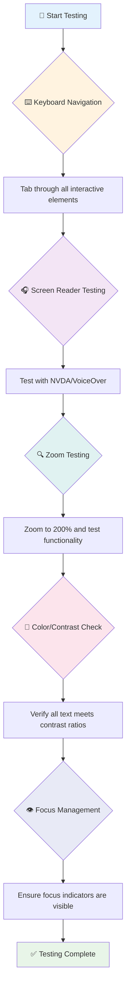

**Vaiheittainen testauslista:**
1. **Näppäimistön navigointi**: Käytä vain Tab-, Shift+Tab-, Enter-, Space- ja nuolinäppäimiä
2. **Ruudunlukijatestaus**: Ota käyttöön NVDA, VoiceOver tai Narrator ja navigoi silmät suljettuina
3. **Zoomaustestaus**: Testaa 200 % ja 400 % zoomaustasoilla
4. **Värikontrastin tarkistus**: Tarkista kaikki tekstit ja käyttöliittymäkomponentit
5. **Fokusindikaattorin testaus**: Varmista, että kaikki interaktiiviset elementit näkyvät selkeästi

✅ **Aloita Lighthouse-työkalulla**: Avaa selaimesi kehittäjätyökalut, suorita Lighthouse-saavutettavuusauditointi ja käytä tuloksia manuaalisen testauksen painopistealueiden ohjaamiseen.

### Zoomaus- ja suurennustyökalut

Tiedätkö, kuinka joskus zoomaat puhelimellasi, kun teksti on liian pientä, tai siristät silmiäsi kirkkaassa auringonvalossa? Monet käyttäjät luottavat suurennustyökaluihin tehdäkseen sisällöstä luettavaa joka päivä. Tämä koskee heikkonäköisiä, vanhempia aikuisia ja kaikkia, jotka ovat joskus yrittäneet lukea verkkosivua ulkona.

Modernit zoomausteknologiat ovat kehittyneet pelkästä suurentamisesta. Ymmärtämällä, miten nämä työkalut toimivat, voit luoda responsiivisia suunnitelmia, jotka pysyvät toimivina ja houkuttelevina millä tahansa suurennustasolla.

**Modernit selainten zoomausominaisuudet:**
- **Sivun zoomaus**: Skaalaa kaikki sisältö suhteellisesti (teksti, kuvat, asettelu)—tämä on suositeltu menetelmä
- **Vain tekstin zoomaus**: Suurentaa fonttikokoa säilyttäen alkuperäisen asettelun
- **Pinch-to-zoom**: Mobiilieleen tuki tilapäiseen suurennukseen
- **Selaintuki**: Kaikki modernit selaimet tukevat zoomausta jopa 500 % ilman toiminnallisuuden rikkoutumista

**Erikoistuneet suurennusohjelmistot:**
- **Windows**: [Magnifier](https://support.microsoft.com/windows/use-magnifier-to-make-things-on-the-screen-easier-to-see-414948ba-8b1c-d3bd-8615-0e5e32204198) (sisäänrakennettu), [ZoomText](https://www.freedomscientific.com/training/zoomtext/getting-started/)
- **macOS/iOS**: [Zoom](https://www.apple.com/accessibility/mac/vision/) (sisäänrakennettu edistyneillä ominaisuuksilla)

> ⚠️ **Suunnittelun huomioiminen**: WCAG vaatii, että sisältö pysyy toimivana, kun sitä zoomataan 200 %. Tällä tasolla vaakasuuntainen vieritys tulisi minimoida, ja kaikkien interaktiivisten elementtien tulisi pysyä saavutettavina.

✅ **Testaa responsiivinen suunnittelusi**: Zoomaa selaimesi 200 % ja 400 %. Mukautuuko asettelu sulavasti? Voitko silti käyttää kaikkia toimintoja ilman liiallista vierittämistä?

## Modernit saavutettavuustestityökalut

Nyt kun ymmärrät, miten ihmiset navigoivat verkossa avustavien teknologioiden avulla, tutkitaan työkaluja, jotka auttavat sinua rakentamaan ja testaamaan saavutettavia verkkosivustoja.

Ajattele asiaa näin: automaattiset työkalut ovat hyviä ilmeisten ongelmien havaitsemisessa (kuten puuttuva alt-teksti), kun taas käytännön testaus auttaa varmistamaan, että sivustosi tuntuu hyvältä käyttää todellisessa maailmassa. Yhdessä ne antavat sinulle varmuuden siitä, että sivustosi toimivat kaikille.

### Värikontrastin testaus

Hyviä uutisia: värikontrasti on yksi yleisimmistä saavutettavuusongelmista, mutta se on myös yksi helpoimmista korjata. Hyvä kontrasti hyödyttää kaikkia—näkövammaisista ihmisistä niihin, jotka yrittävät lukea puhelimiaan rannalla.

**WCAG-kontrastivaatimukset:**

| Tekstityyppi | WCAG AA (Minimi) | WCAG AAA (Parannettu) |
|--------------|------------------|-----------------------|
| **Normaali teksti** (alle 18pt) | 4.5:1 kontrastisuhde | 7:1 kontrastisuhde |
| **Suuri teksti** (18pt+ tai 14pt+ lihavoitu) | 3:1 kontrastisuhde | 4.5:1 kontrastisuhde |
| **UI-komponentit** (painikkeet, lomakekentät) | 3:1 kontrastisuhde | 3:1 kontrastisuhde |

**Välttämättömät testityökalut:**
- [Colour Contrast Analyser](https://www.tpgi.com/color-contrast-checker/) - Työpöytäsovellus värinvalitsimella
- [WebAIM Contrast Checker](https://webaim.org/resources/contrastchecker/) - Verkkopohjainen välittömällä palautteella
- [Stark](https://www.getstark.co/) - Suunnittelutyökalun lisäosa Figmaan, Sketchiin, Adobe XD:hen
- [Accessible Colors](https://accessible-colors.com/) - Löydä saavutettavia väripaletteja

✅ **Luo parempia väripaletteja**: Aloita brändiväreistäsi ja käytä kontrastitarkistimia luodaksesi saavutettavia variaatioita. Dokumentoi nämä suunnittelujärjestelmäsi saavutettavina värikooditunnisteina.

### Kattava saavutettavuusauditointi

Tehokkain saavutettavuustestaus yhdistää useita lähestymistapoja. Mikään yksittäinen työkalu ei havaitse kaikkea, joten testirutiinin rakentaminen eri menetelmillä varmistaa kattavan tarkastuksen.

**Selaimeen perustuva testaus (sisäänrakennettu kehittäjätyökaluihin):**
- **Chrome/Edge**: Lighthouse-saavutettavuusauditointi + Saavutettavuuspaneeli
- **Firefox**: Saavutettavuustarkastaja yksityiskohtaisella puunäkymällä
- **Safari**: Auditointivälilehti Web Inspectorissa VoiceOver-simulaatiolla

**Ammattilaistason testauslaajennukset:**
- [axe DevTools](https://www.deque.com/axe/devtools/) - Teollisuusstandardin mukainen automaattinen testaus
- [WAVE](https://wave.webaim.org/extension/) - Visuaalinen palaute virheiden korostuksella
- [Accessibility Insights](https://accessibilityinsights.io/) - Microsoftin kattava testauspaketti

**Komentorivi ja CI/CD-integraatio:**
- [axe-core](https://github.com/dequelabs/axe-core) - JavaScript-kirjasto automaattiseen testaukseen
- [Pa11y](https://pa11y.org/) - Komentorivipohjainen saavutettavuustestityökalu
- [Lighthouse CI](https://github.com/GoogleChrome/lighthouse-ci) - Automatisoitu saavutettavuuspisteytys

> 🎯 **Testaustavoite**: Tavoittele Lighthouse-saavutettavuuspisteitä 95+ lähtötasona. Muista, että automaattiset työkalut havaitsevat vain noin 30-40 % saavutettavuusongelmista—manuaalinen testaus on edelleen välttämätöntä!

### 🧠 **Testaustaitojen tarkistus: Valmis löytämään ongelmia?**

**Katsotaan, miltä sinusta tuntuu saavutettavuustestauksesta:**
- Mikä testausmenetelmä tuntuu sinulle tällä hetkellä lähestyttävimmältä?
- Voitko kuvitella käyttäväsi vain näppäimistön navigointia koko päivän ajan?
- Mikä on yksi saavutettavuuseste, jonka olet itse kokenut verkossa?

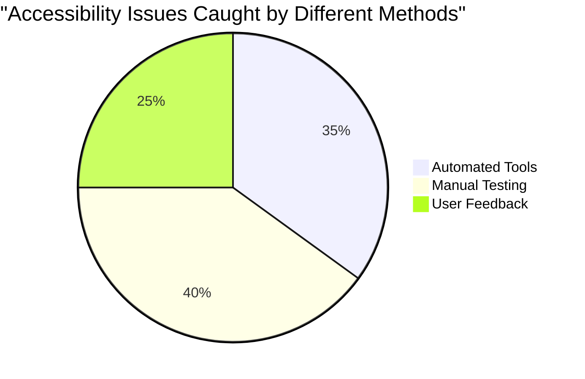

> **Itseluottamuksen vahvistaja**: Ammattimaiset saavutettavuustestaajat käyttävät juuri tätä yhdistelmää menetelmiä. Olet oppimassa alan standardikäytäntöjä!

## Saavutettavuuden rakentaminen alusta alkaen

Avain saavutettavuuden onnistumiseen on sen sisällyttäminen perustaan alusta alkaen. Tiedän, että on houkuttelevaa ajatella "lisään saavutettavuuden myöhemmin", mutta se on kuin yrittäisi lisätä ramppia taloon sen rakentamisen jälkeen. Mahdollista? Kyllä. Helppoa? Ei todellakaan.

Ajattele saavutettavuutta kuin talon suunnittelua—on paljon helpompaa sisällyttää pyörätuolisaavutettavuus alkuperäisiin arkkitehtuurisuunnitelmiin kuin muokata kaikkea myöhemmin.

### POUR-periaatteet: Saavutettavuuden perusta

Web Content Accessibility Guidelines (WCAG) perustuvat neljään keskeiseen periaatteeseen, jotka muodostavat sanan POUR. Älä huoli—nämä eivät ole kuivaa akateemista teoriaa! Ne ovat käytännöllisiä ohjeita sisällön luomiseen, joka toimii kaikille.

Kun opit POUR-periaatteet, saavutettavuuspäätösten tekeminen muuttuu paljon intuitiivisemmaksi. Se on kuin mielessäsi oleva tarkistuslista, joka ohjaa suunnittelupäätöksiäsi. Puretaanpa se osiin:

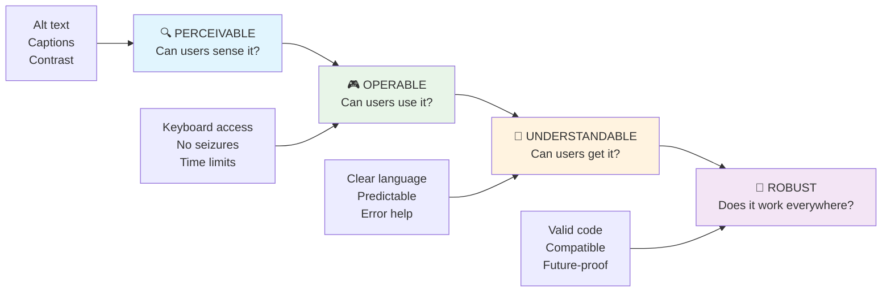

**🔍 Havainnollinen**: Tiedon on oltava esitettävissä tavoilla, jotka käyttäjät voivat havaita käytettävissä olevilla aisteillaan

- Tarjoa tekstivaihtoehtoja ei-tekstisisällölle (kuvat, videot, äänet)
- Varmista riittävä värikontrasti kaikelle tekstille ja käyttöliittymäkomponenteille
- Tarjoa tekstitykset ja transkriptiot multimedia-sisällölle
- Suunnittele sisältö, joka pysyy toimivana, kun sitä suurennetaan 200 %
- Käytä useita aistillisia ominaisuuksia (ei vain väriä) tiedon välittämiseen

**🎮 Käytettävä**: Kaikkien käyttöliittymäkomponenttien on oltava käytettävissä saatavilla olevilla syöttötavoilla

- Tee kaikki toiminnot saavutettaviksi näppäimistön navigoinnin kautta

- **Testaa eri selaimilla, laitteilla ja apuvälineillä**
- **Rakenna sisältö niin, että se toimii myös ilman kehittyneitä ominaisuuksia**

### 🎯 **POUR-periaatteiden tarkistus: Tee siitä toimiva**

**Pikainen pohdinta perusteista:**
- Voitko keksiä verkkosivuston ominaisuuden, joka ei täytä jokaista POUR-periaatetta?
- Mikä periaate tuntuu sinulle kehittäjänä luonnollisimmalta?
- Miten nämä periaatteet voivat parantaa suunnittelua kaikille, ei vain vammaisille käyttäjille?

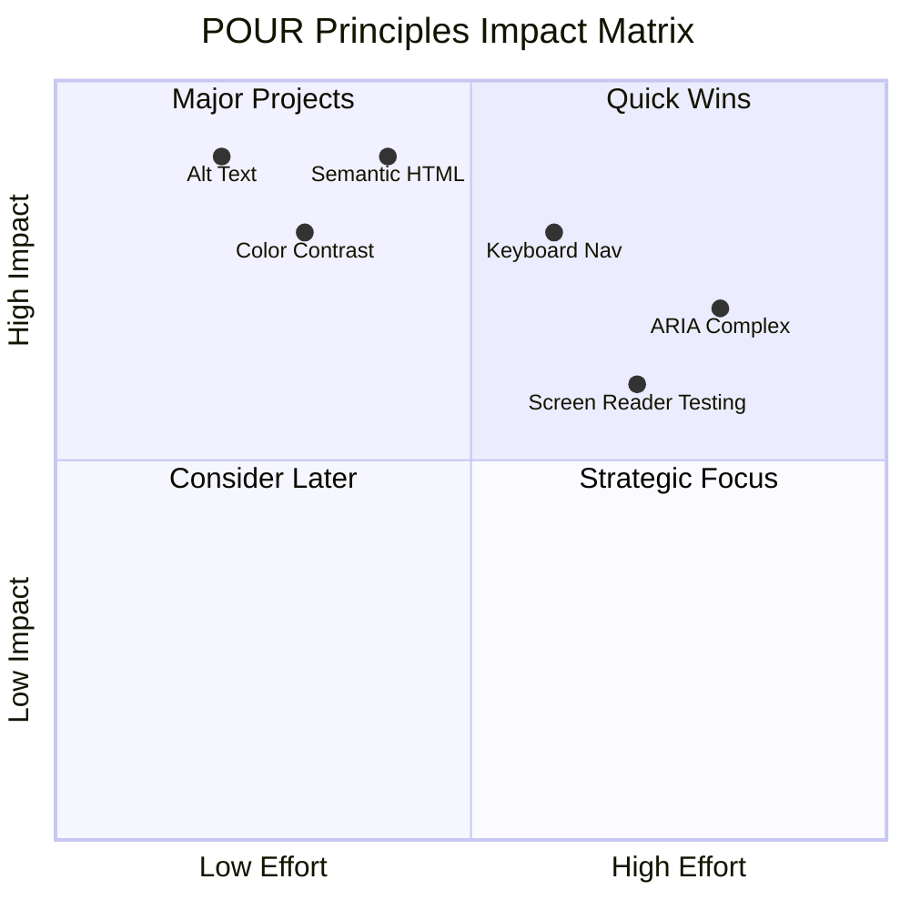

> **Muista**: Aloita suurivaikutteisista, vähävaivaisista parannuksista. Semanttinen HTML ja alt-teksti antavat suurimman saavutettavuusparannuksen pienimmällä vaivalla!

## Esteettömän visuaalisen suunnittelun luominen

Hyvä visuaalinen suunnittelu ja saavutettavuus kulkevat käsi kädessä. Kun suunnittelet saavutettavuus mielessä, huomaat usein, että nämä rajoitukset johtavat siistimpiin ja elegantimpiin ratkaisuihin, jotka hyödyttävät kaikkia käyttäjiä.

Tutkitaan, miten luoda visuaalisesti houkuttelevia suunnitelmia, jotka toimivat kaikille, riippumatta heidän näkökyvystään tai olosuhteista, joissa he tarkastelevat sisältöäsi.

### Väri ja visuaalisen saavutettavuuden strategiat

Väri on voimakas viestintäväline, mutta sen ei pitäisi koskaan olla ainoa tapa välittää tärkeää tietoa. Suunnittelu, joka ei perustu pelkästään väreihin, luo kestävämpiä ja osallistavampia kokemuksia, jotka toimivat useammissa tilanteissa.

**Suunnittelu värinäköeroja ajatellen:**

Noin 8 % miehistä ja 0,5 % naisista kärsii jonkinlaisesta värinäköerosta (usein kutsutaan värisokeudeksi). Yleisimmät tyypit ovat:
- **Deuteranopia**: Vaikeus erottaa punaista ja vihreää
- **Protanopia**: Punainen näyttää himmeämmältä
- **Tritanopia**: Vaikeus erottaa sinistä ja keltaista (harvinainen)

**Osallistavat väristrategiat:**

```css
/* ❌ Bad: Using only color to indicate status */
.error { color: red; }
.success { color: green; }

/* ✅ Good: Color plus icons and context */
.error {
  color: #d32f2f;
  border-left: 4px solid #d32f2f;
}
.error::before {
  content: "⚠️";
  margin-right: 8px;
}

.success {
  color: #2e7d32;
  border-left: 4px solid #2e7d32;
}
.success::before {
  content: "✅";
  margin-right: 8px;
}
```

**Peruskontrastivaatimusten ylittäminen:**
- Testaa värivalintasi värisokeussimulaattoreilla
- Käytä kuvioita, tekstuureja tai muotoja värikoodauksen rinnalla
- Varmista, että interaktiiviset tilat erottuvat ilman väriä
- Mieti, miltä suunnittelusi näyttää korkean kontrastin tilassa

✅ **Testaa värien saavutettavuus**: Käytä työkaluja, kuten [Coblis](https://www.color-blindness.com/coblis-color-blindness-simulator/), nähdäksesi, miltä sivustosi näyttää käyttäjille, joilla on erilaisia värinäköeroja.

### Kohdistusindikaattorit ja vuorovaikutussuunnittelu

Kohdistusindikaattorit ovat digitaalinen vastine kursorille—ne osoittavat näppäimistön käyttäjille, missä he ovat sivulla. Hyvin suunnitellut kohdistusindikaattorit parantavat kaikkien käyttäjien kokemusta tekemällä vuorovaikutuksesta selkeää ja ennakoitavaa.

**Modernit kohdistusindikaattorien parhaat käytännöt:**

```css
/* Enhanced focus styles that work across browsers */
button:focus-visible {
  outline: 2px solid #0066cc;
  outline-offset: 2px;
  box-shadow: 0 0 0 4px rgba(0, 102, 204, 0.25);
}

/* Remove focus outline for mouse users, preserve for keyboard users */
button:focus:not(:focus-visible) {
  outline: none;
}

/* Focus-within for complex components */
.card:focus-within {
  box-shadow: 0 0 0 3px rgba(74, 144, 164, 0.5);
  border-color: #4A90A4;
}

/* Ensure focus indicators meet contrast requirements */
.custom-focus:focus-visible {
  outline: 3px solid #ffffff;
  outline-offset: 2px;
  box-shadow: 0 0 0 6px #000000;
}
```

**Kohdistusindikaattorien vaatimukset:**
- **Näkyvyys**: Vähintään 3:1 kontrastisuhde ympäröiviin elementteihin
- **Leveys**: Vähintään 2px paksuus koko elementin ympärillä
- **Pysyvyys**: Pysyvät näkyvissä, kunnes kohdistus siirtyy muualle
- **Erottuvuus**: Eroaa visuaalisesti muista käyttöliittymän tiloista

> 💡 **Suunnitteluvinkki**: Hyvät kohdistusindikaattorit käyttävät usein yhdistelmää reunaviivoja, varjostuksia ja värimuutoksia näkyvyyden varmistamiseksi eri taustoilla ja konteksteissa.

✅ **Tarkista kohdistusindikaattorit**: Käy läpi verkkosivustosi välilehtien avulla ja tarkista, mitkä elementit sisältävät selkeät kohdistusindikaattorit. Ovatko jotkin vaikeasti nähtävissä tai kokonaan puuttuvat?

### Semanttinen HTML: Saavutettavuuden perusta

Semanttinen HTML on kuin apuvälineiden GPS-järjestelmä verkkosivustollesi. Kun käytät oikeita HTML-elementtejä niiden tarkoituksenmukaisella tavalla, tarjoat näytönlukijoille, näppäimistöille ja muille työkaluille yksityiskohtaisen kartan, joka auttaa käyttäjiä navigoimaan tehokkaasti.

Tämä vertauskuva todella avasi silmäni: semanttinen HTML on kuin hyvin järjestetty kirjasto, jossa on selkeät kategoriat ja hyödylliset opasteet, verrattuna varastoon, jossa kirjat ovat satunnaisesti levällään. Molemmissa paikoissa on samat kirjat, mutta kummassa haluaisit etsiä jotain? Juuri niin!

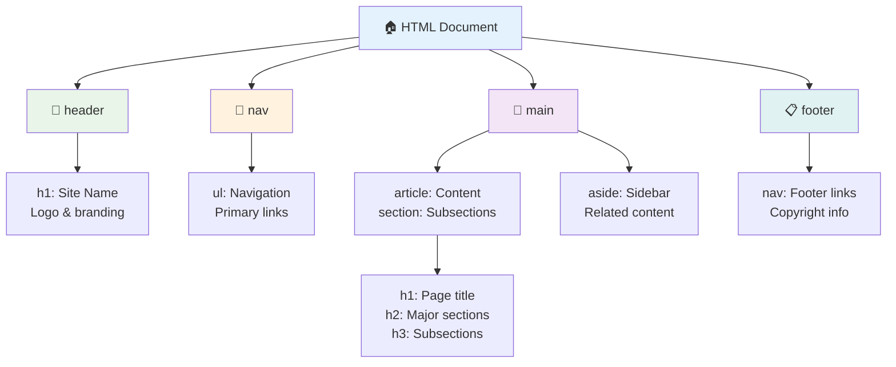

**Esteettömän sivurakenteen rakennuspalikat:**

```html
<!-- Landmark elements provide page navigation structure -->
<header>
  <h1>Your Site Name</h1>
  <nav aria-label="Main navigation">
    <ul>
      <li><a href="/home">Home</a></li>
      <li><a href="/about">About</a></li>
      <li><a href="/services">Services</a></li>
    </ul>
  </nav>
</header>

<main>
  <article>
    <header>
      <h1>Article Title</h1>
      <p>Published on <time datetime="2024-10-14">October 14, 2024</time></p>
    </header>
    
    <section>
      <h2>First Section</h2>
      <p>Content that relates to this section...</p>
    </section>
    
    <section>
      <h2>Second Section</h2>
      <p>More related content...</p>
    </section>
  </article>
  
  <aside>
    <h2>Related Links</h2>
    <nav aria-label="Related articles">
      <ul>
        <li><a href="/related-1">First related article</a></li>
        <li><a href="/related-2">Second related article</a></li>
      </ul>
    </nav>
  </aside>
</main>

<footer>
  <p>&copy; 2024 Your Site Name. All rights reserved.</p>
  <nav aria-label="Footer links">
    <ul>
      <li><a href="/privacy">Privacy Policy</a></li>
      <li><a href="/contact">Contact Us</a></li>
    </ul>
  </nav>
</footer>
```

**Miksi semanttinen HTML muuttaa saavutettavuutta:**

| Semanttinen elementti | Tarkoitus | Näytönlukijan hyöty |
|-----------------------|-----------|---------------------|
| `<header>` | Sivun tai osion otsikko | "Banneri-maamerkki" - nopea navigointi yläosaan |
| `<nav>` | Navigointilinkit | "Navigointi-maamerkki" - navigointiosioiden lista |
| `<main>` | Sivun pääsisältö | "Päämaamerkki" - siirry suoraan sisältöön |
| `<article>` | Itsenäinen sisältö | Ilmoittaa artikkelin rajat |
| `<section>` | Teemalliset sisältöryhmät | Tarjoaa sisällön rakenteen |
| `<aside>` | Liittyvä sivupalkin sisältö | "Täydentävä maamerkki" |
| `<footer>` | Sivun tai osion alatunniste | "Sisältötieto-maamerkki" |

**Näytönlukijan supervoimat semanttisen HTML:n avulla:**
- **Maamerkkien navigointi**: Siirry nopeasti suurten sivuosioiden välillä
- **Otsikkorakenteet**: Luo sisällysluettelo otsikkorakenteesta
- **Elementtilistat**: Luo listoja kaikista linkeistä, painikkeista tai lomakekentistä
- **Kontekstin ymmärtäminen**: Ymmärrä sisältöosioiden väliset suhteet

> 🎯 **Pikainen testi**: Kokeile navigoida sivustollasi näytönlukijalla käyttämällä maamerkkien pikavalintoja (D maamerkille, H otsikolle, K linkille NVDA/JAWS:ssa). Onko navigointi loogista?

### 🏗️ **Semanttisen HTML:n hallinnan tarkistus: Vahvojen perustusten rakentaminen**

**Arvioidaan semanttista ymmärrystäsi:**
- Voitko tunnistaa maamerkit verkkosivulta pelkästään HTML:ää katsomalla?
- Miten selittäisit eron `<section>` ja `<div>` välillä ystävälle?
- Mikä olisi ensimmäinen asia, jonka tarkistaisit, jos näytönlukijan käyttäjä ilmoittaisi navigointiongelmista?

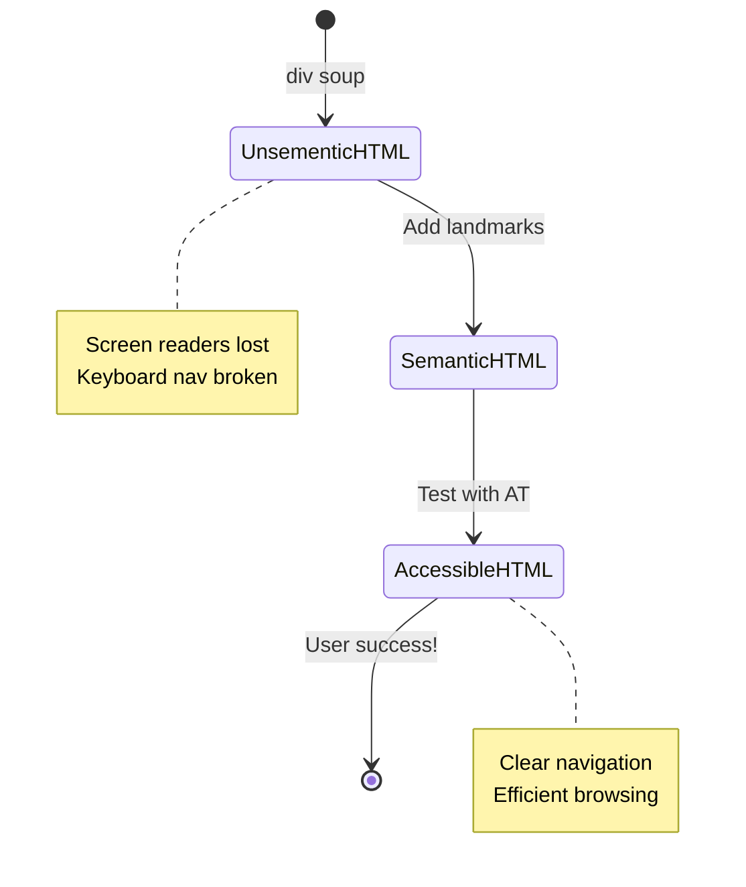

> **Ammattilaisen vinkki**: Hyvä semanttinen HTML ratkaisee automaattisesti noin 70 % saavutettavuusongelmista. Hallitse tämä perusta, ja olet jo pitkällä!

✅ **Tarkista semanttinen rakenteesi**: Käytä selaimesi DevToolsin saavutettavuuspaneelia nähdäksesi saavutettavuuspuun ja varmistaaksesi, että merkintäsi luo loogisen rakenteen.

### Otsikkohierarkia: Loogisen sisällysluettelon luominen

Otsikot ovat ehdottoman tärkeitä saavutettavalle sisällölle—ne ovat kuin selkäranka, joka pitää kaiken kasassa. Näytönlukijan käyttäjät tukeutuvat vahvasti otsikoihin ymmärtääkseen ja navigoidakseen sisältöäsi. Ajattele sitä kuin tarjoaisit sivustosi sisällysluettelon.

**Tässä on otsikoiden kultainen sääntö:**
Älä koskaan ohita tasoja. Etene aina loogisesti `<h1>`:stä `<h2>`:een ja siitä `<h3>`:een jne. Muistatko, kun teit koulussa sisällysluetteloita? Sama periaate pätee—et hyppäisi suoraan "I. Pääkohta" -kohdasta "C. Alakohta" ilman "A. Alakohtaa" välissä, eikö?

**Täydellinen otsikkorakenne-esimerkki:**

```html
<!-- ✅ Excellent: Logical, hierarchical progression -->
<main>
  <h1>Complete Guide to Web Accessibility</h1>
  
  <section>
    <h2>Understanding Screen Readers</h2>
    <p>Introduction to screen reader technology...</p>
    
    <h3>Popular Screen Reader Software</h3>
    <p>NVDA, JAWS, and VoiceOver comparison...</p>
    
    <h3>Testing with Screen Readers</h3>
    <p>Step-by-step testing instructions...</p>
  </section>
  
  <section>
    <h2>Color and Contrast Guidelines</h2>
    <p>Designing with sufficient contrast...</p>
    
    <h3>WCAG Contrast Requirements</h3>
    <p>Understanding the different contrast levels...</p>
    
    <h3>Testing Tools and Techniques</h3>
    <p>Tools for verifying contrast ratios...</p>
  </section>
</main>
```

```html
<!-- ❌ Problematic: Skipping levels, inconsistent structure -->
<h1>Page Title</h1>
<h3>Subsection</h3> <!-- Skipped h2 -->
<h2>This should come before h3</h2>
<h1>Another main heading?</h1> <!-- Multiple h1s -->
```

**Otsikoiden parhaat käytännöt:**
- **Yksi `<h1>` per sivu**: Yleensä pääsivun otsikko tai ensisijainen sisältöotsikko
- **Looginen eteneminen**: Älä koskaan ohita tasoja (h1 → h2 → h3, ei h1 → h3)
- **Kuvaileva sisältö**: Tee otsikoista merkityksellisiä, kun ne luetaan kontekstista irrallaan
- **Visuaalinen muotoilu CSS:llä**: Käytä CSS:ää ulkoasuun, HTML-tasoja rakenteeseen

**Näytönlukijan navigointitilastot:**
- 68 % näytönlukijan käyttäjistä navigoi otsikoiden avulla ([WebAIM Survey](https://webaim.org/projects/screenreadersurvey9/#finding))
- Käyttäjät odottavat loogista otsikkorakennetta
- Otsikot tarjoavat nopeimman tavan ymmärtää sivun rakennetta

> 💡 **Ammattilaisen vinkki**: Käytä selaimen laajennuksia, kuten "HeadingsMap", visualisoidaksesi otsikkorakenteesi. Sen pitäisi näyttää hyvin järjestetyltä sisällysluettelolta.

✅ **Testaa otsikkorakenteesi**: Käytä näytönlukijan otsikkonavigointia (H-näppäin NVDA:ssa) hypätäksesi otsikoiden välillä. Kertooko eteneminen loogisesti sisältösi tarinan?

### Kehittyneet visuaalisen saavutettavuuden tekniikat

Peruskontrastin ja värin lisäksi on olemassa kehittyneitä tekniikoita, jotka auttavat luomaan todella osallistavia visuaalisia kokemuksia. Nämä menetelmät varmistavat, että sisältösi toimii eri katseluolosuhteissa ja apuvälineiden kanssa.

**Keskeiset visuaalisen viestinnän strategiat:**

- **Monimuotoinen palaute**: Yhdistä visuaaliset, tekstuaaliset ja joskus äänivihjeet
- **Progressiivinen paljastaminen**: Esitä tietoa helposti omaksuttavina osina
- **Johdonmukaiset vuorovaikutusmallit**: Käytä tuttuja käyttöliittymäkonventioita
- **Responsiivinen typografia**: Skaalaa tekstiä sopivasti eri laitteilla
- **Lataus- ja virhetilat**: Tarjoa selkeää palautetta kaikista käyttäjän toimista

**CSS-työkalut saavutettavuuden parantamiseksi:**

```css
/* Screen reader only text - visually hidden but accessible */
.sr-only {
  position: absolute;
  width: 1px;
  height: 1px;
  padding: 0;
  margin: -1px;
  overflow: hidden;
  clip: rect(0, 0, 0, 0);
  white-space: nowrap;
  border: 0;
}

/* Skip link for keyboard navigation */
.skip-link {
  position: absolute;
  top: -40px;
  left: 6px;
  background: #000000;
  color: #ffffff;
  padding: 8px 16px;
  text-decoration: none;
  border-radius: 4px;
  font-weight: bold;
  transition: top 0.3s ease;
  z-index: 1000;
}

.skip-link:focus {
  top: 6px;
}

/* Reduced motion respect */
@media (prefers-reduced-motion: reduce) {
  .skip-link {
    transition: none;
  }
  
  * {
    animation-duration: 0.01ms !important;
    animation-iteration-count: 1 !important;
    transition-duration: 0.01ms !important;
  }
}

/* High contrast mode support */
@media (prefers-contrast: high) {
  .button {
    border: 2px solid;
  }
}
```

> 🎯 **Saavutettavuusmalli**: "Ohita linkki" on välttämätön näppäimistön käyttäjille. Sen pitäisi olla sivusi ensimmäinen kohdistettava elementti ja siirtää suoraan pääsisältöön.

✅ **Toteuta ohitusnavigointi**: Lisää ohituslinkit sivuillesi ja testaa niitä painamalla Tab heti sivun latauduttua. Niiden pitäisi näkyä ja antaa sinun siirtyä suoraan pääsisältöön.

## Merkityksellisen linkkitekstin luominen

Linkit ovat käytännössä verkkosivujen moottoriteitä, mutta huonosti kirjoitettu linkkiteksti on kuin tienviitta, jossa lukee vain "Paikka" sen sijaan, että siinä lukisi "Keskusta Helsinki". Ei kovin hyödyllistä, eikö?

Tässä on jotain, mikä hämmästytti minua, kun kuulin siitä ensimmäistä kertaa: näytönlukijat voivat kerätä kaikki sivun linkit ja näyttää ne yhtenä suurena listana. Kuvittele, että joku antaisi sinulle hakemiston kaikista sivusi linkeistä. Olisiko jokainen niistä ymmärrettävä yksinään? Tätä testiä linkkitekstisi täytyy läpäistä!

### Linkkinavigointimallit

Näytönlukijat tarjoavat tehokkaita linkkinavigointiominaisuuksia, jotka perustuvat hyvin kirjoitettuun linkkitekstiin:

**Linkkinavigointimenetelmät:**
- **Jatkuva lukeminen**: Linkit luetaan osana sisällön virtausta
- **Linkkilistojen luominen**: Kaikki sivun linkit kootaan yhdeksi hakukelpoiseksi hakemistoksi
- **Pikavalinnat**: Siirry linkkien välillä näppäimistön pikavalinnoilla (K NVDA:ssa)
- **Hakutoiminto**: Etsi tiettyjä linkkejä kirjoittamalla osittainen teksti

**Miksi konteksti on tärkeä:**
Kun näytönlukijan käyttäjät luovat linkkilistan, he näkevät jotain tällaista:
- "Lataa raportti"
- "Lue lisää"
- "Klikkaa tästä"
- "Tietosuojakäytäntö"
- "Klikkaa tästä"

Vain kaksi näistä linkeistä antaa hyödyllistä tietoa, kun ne luetaan kontekstista irrallaan!

> 📊 **Käyttäjävaikutus**: Näytönlukijan käyttäjät selaavat linkkilistoja ymmärtääkseen sivun sisällön nopeasti. Yleiset linkkitekstit pakottavat heidät palaamaan takaisin kunkin linkin kontekstiin, mikä hidastaa selauskokemusta merkittävästi.

### Yleiset linkkitekstivirheet, joita tulee välttää

Sen ymmärtäminen, mikä ei toimi, auttaa tunnistamaan ja korjaamaan saavutettavuusongelmia olemassa olevassa sisällössä.

**❌ Yleiset linkkitekstit, jotka eivät anna kontekstia:**

```html
<!-- Meaningless when read from a link list -->
<p>Our sustainability efforts are detailed in our recent report. 
   <a href="/sustainability-2024.pdf">Click here</a> to view it.</p>

<!-- Repeated generic text throughout the page -->
<div class="article-card">
  <h3>Web Accessibility Guide</h3>
  <p>Learn the fundamentals...</p>
  <a href="/accessibility-guide">Read more</a>
</div>
<div class="article-card">
  <h3>Color Contrast Tips</h3>
  <p>Improve your design...</p>
  <a href="/color-contrast">Read more</a>
</div>

<!-- URLs as link text (difficult for screen readers to announce) -->
<p>Visit https://www.w3.org/WAI/WCAG21/quickref/ for WCAG guidelines.</p>

<!-- Vague action words -->
<a href="/contact">Go</a> | <a href="/about">See</a> | <a href="/help">View</a>
```

**Miksi nämä mallit epäonnistuvat:**
- **"Klikkaa tästä"** ei kerro käyttäjille mitään kohteesta
- **"Lue lisää"** toistettuna useita kertoja aiheuttaa sekaannusta
- **Raakatunnukset** ovat vaikeita näytönlukijoille lausua selkeästi
- **Yksittäiset sanat** kuten "Mene" tai "Katso" eivät ole kuvailevia

### Erinomaisten linkkitekstien kirjoittaminen

Kuvaileva linkkiteksti hyödyttää kaikkia—näkökykyiset käyttäjät voivat nopeasti skannata linkkejä, ja näytönlukijan käyttäjät ymmärtävät kohteet välittömästi.

**✅ Selkeät, kuvailevat linkkitekstiesimerkit:**

```html
<!-- Descriptive text that explains the destination -->
<p>Our comprehensive <a href="/sustainability-2024.pdf">2024 sustainability report (PDF, 2.1MB)</a> details our environmental initiatives.</p>

<!-- Specific, unique link text for each card -->
<div class="article-card">
  <h3>Web Accessibility Guide</h3>
  <p>Learn the fundamentals of inclusive design...</p>
  <a href="/accessibility-guide">Read our complete web accessibility guide</a>
</div>
<div class="article-card">
  <h3>Color Contrast Tips</h3>
  <p>Improve your design with better color choices...</p>
  <a href="/color-contrast">Explore color contrast best practices</a>
</div>

<!-- Meaningful text instead of raw URLs -->
<p>The <a href="https://www.w3.org/WAI/WCAG21/quickref/">WCAG 2.1 Quick Reference guide</a> provides comprehensive accessibility guidelines.</p>

<!-- Descriptive action links -->
<a href="/contact">Contact our support team</a> | 
<a href="/about">About our company</a> | 
<a href="/help">Get help with your account</a>
```

**Linkkitekstin parhaat käytännöt:**
- **Ole tarkka**: "Lataa neljännesvuosittainen talousraportti" vs. "Lataa"
- **Sisällytä tiedostotyyppi ja koko**: "(PDF, 1.2MB)" ladattaville tiedostoille
- **Mainitse, jos linkit avautuvat ulkoisesti**: "(avautuu uuteen ikkunaan)" tarvittaessa
- **Käytä aktiivista kieltä**: "Ota yhteyttä" vs. "Yhteyssivu"
- **Pidä se lyhyenä**: Pyri 2-8 sanaan, kun mahdollista

### Kehittyneet linkkien saavutettavuusmallit

Joskus visuaalisen suunnittelun rajoitukset tai tekniset vaatimukset vaativat erityisiä ratkaisuja. Tässä on kehittyneitä tekniikoita yleisiin haastaviin tilanteisiin:

**ARIA:n käyttö lisäkontekstin tarjoamiseen:**

```html
<!-- When button text must be short but needs more context -->
<a href="/report.pdf" 
   aria-label="Download 2024 annual financial report, PDF format, 2.3MB">
  Download Report
</a>

<!-- When the full context comes from surrounding content -->
<h3 id="sustainability-heading">Sustainability Initiative</h3>
<p>Our efforts to reduce environmental impact...</p>
<a href="/sustainability-details" 
   aria-labelledby="sustainability-heading"
   aria-describedby="sustainability-summary">
  Learn more
</a>
<p id="sustainability-summary">Detailed breakdown of our 2024 environmental goals and achievements</p>
```

**Tiedostotyyppien ja ulkoisten kohteiden ilmoittaminen:**

```html
<!-- Method 1: Include information in visible link text -->
<a href="/annual-report.pdf">
  Download our 2024 annual report (PDF, 2.3MB)
</a>

<!-- Method 2: Use screen reader-only text for file details -->
<a href="/annual-report.pdf">
  Download our 2024 annual report
  <span class="sr-only">(PDF format, 2.3MB)</span>
</a>

<!-- Method 3: External link indication -->
<a href="https://example.com" 
   target="_blank" 
   aria-describedby="external-link-warning">
  Visit external resource
</a>
<span id="external-link-warning" class="sr-only">
  (opens in new window)
</span>

<!-- Method 4: Using CSS for visual indicators -->
<a href="https://example.com" class="external-link">
  External resource
</a>
```

```css
/* Visual indicator for external links */
.external-link::after {
  content: " ↗";
  font-size: 0.8em;
  color: #666;
}

/* Screen reader announcement for external links */
.external-link::before {
  content: "External link: ";
  position: absolute;
  left: -10000px;
  width: 1px;
  height: 1px;
  overflow: hidden;
}
```

> ⚠️ **Tärkeää**: Kun käytät `target="_blank"`, kerro aina käyttäjille, että linkki avautuu uuteen ikkunaan tai välilehteen. Odottamattomat navigointimuutokset voivat olla hämmentäviä.

✅ **Testaa linkkikontekstisi**: Käytä selaimesi kehittäjätyökaluja luodaksesi listan kaikista sivusi linkeistä. Voitko ymmärtää jokaisen linkin tarkoituksen ilman ympäröivää kontekstia?

## ARIA: HTML:n saavutettavuuden tehostaminen

[Accessible Rich Internet Applications (ARIA)](https://developer.mozilla.org/docs/Web/Accessibility/ARIA
**ARIA:n viisi kategoriaa:**

1. **Roolit**: Mikä elementti tämä on? (`button`, `tab`, `dialog`)
2. **Ominaisuudet**: Mitkä ovat sen ominaisuudet? (`aria-required`, `aria-haspopup`)
3. **Tilat**: Mikä on sen nykyinen tila? (`aria-expanded`, `aria-checked`)
4. **Maamerkit**: Missä se sijaitsee sivurakenteessa? (`banner`, `navigation`, `main`)
5. **Live-alueet**: Kuinka muutokset tulisi ilmoittaa? (`aria-live`, `aria-atomic`)

### Tärkeimmät ARIA-mallit moderneille verkkosovelluksille

Nämä mallit ratkaisevat yleisimmät saavutettavuushaasteet interaktiivisissa verkkosovelluksissa:

**Elementtien nimeäminen ja kuvaaminen:**

```html
<!-- aria-label: Provides accessible name when visible text isn't sufficient -->
<button aria-label="Close newsletter subscription dialog">×</button>

<!-- aria-labelledby: References existing text as the accessible name -->
<section aria-labelledby="news-heading">
  <h2 id="news-heading">Latest News</h2>
  <!-- news content -->
</section>

<!-- aria-describedby: Links to additional descriptive text -->
<input type="password" 
       aria-describedby="pwd-requirements pwd-strength"
       required>
<div id="pwd-requirements">
  Password must contain at least 8 characters, including uppercase, lowercase, and numbers.
</div>
<div id="pwd-strength" aria-live="polite">
  <!-- Dynamic password strength indicator -->
</div>
```

**Live-alueet dynaamiselle sisällölle:**

```html
<!-- Polite announcements (don't interrupt current speech) -->
<div aria-live="polite" id="status-updates">
  <!-- Status messages appear here -->
</div>

<!-- Assertive announcements (interrupt and announce immediately) -->
<div aria-live="assertive" id="urgent-alerts">
  <!-- Error messages and critical alerts -->
</div>

<!-- Loading states with live regions -->
<button id="submit-btn" aria-describedby="loading-status">
  Submit Application
</button>
<div id="loading-status" aria-live="polite" aria-atomic="true">
  <!-- "Processing your application..." appears here -->
</div>
```

**Interaktiivisen widgetin esimerkki (haitari):**

```html
<div class="accordion">
  <h3>
    <button aria-expanded="false" 
            aria-controls="panel-1" 
            id="accordion-trigger-1"
            class="accordion-trigger">
      Accessibility Guidelines
    </button>
  </h3>
  <div id="panel-1" 
       role="region"
       aria-labelledby="accordion-trigger-1" 
       hidden>
    <p>WCAG 2.1 provides comprehensive guidelines...</p>
  </div>
</div>
```

```javascript
// JavaScript to manage accordion state
function toggleAccordion(trigger) {
  const panel = document.getElementById(trigger.getAttribute('aria-controls'));
  const isExpanded = trigger.getAttribute('aria-expanded') === 'true';
  
  // Toggle states
  trigger.setAttribute('aria-expanded', !isExpanded);
  panel.hidden = isExpanded;
  
  // Announce change to screen readers
  const status = document.getElementById('status-updates');
  status.textContent = isExpanded ? 'Section collapsed' : 'Section expanded';
}
```

### ARIA:n toteutuksen parhaat käytännöt

ARIA on tehokas työkalu, mutta sen käyttö vaatii huolellista toteutusta. Näiden ohjeiden noudattaminen auttaa varmistamaan, että ARIA parantaa saavutettavuutta eikä heikennä sitä:

**🛡️ Keskeiset periaatteet:**

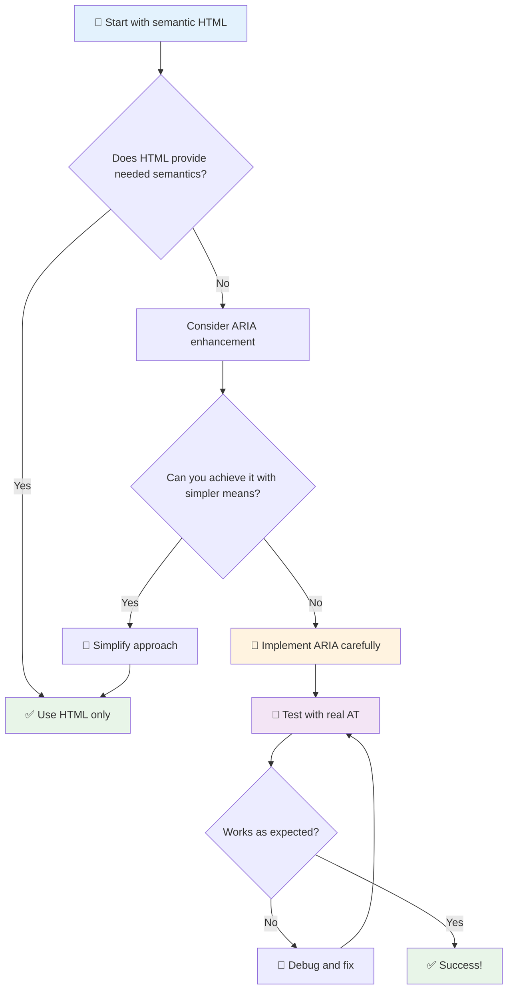

1. **Ensisijaisesti semanttinen HTML**: Käytä aina `<button>`-elementtiä mieluummin kuin `<div role="button">`
2. **Älä riko semantiikkaa**: Älä koskaan ohita olemassa olevaa HTML-merkitystä (vältä `<h1 role="button">`)
3. **Säilytä näppäimistön käytettävyys**: Kaikkien interaktiivisten ARIA-elementtien tulee olla täysin näppäimistöllä käytettäviä
4. **Testaa oikeilla käyttäjillä**: ARIA-tuki vaihtelee merkittävästi eri apuvälineiden välillä
5. **Aloita yksinkertaisesti**: Monimutkaiset ARIA-toteutukset ovat alttiimpia virheille

**🔍 Testausprosessi:**

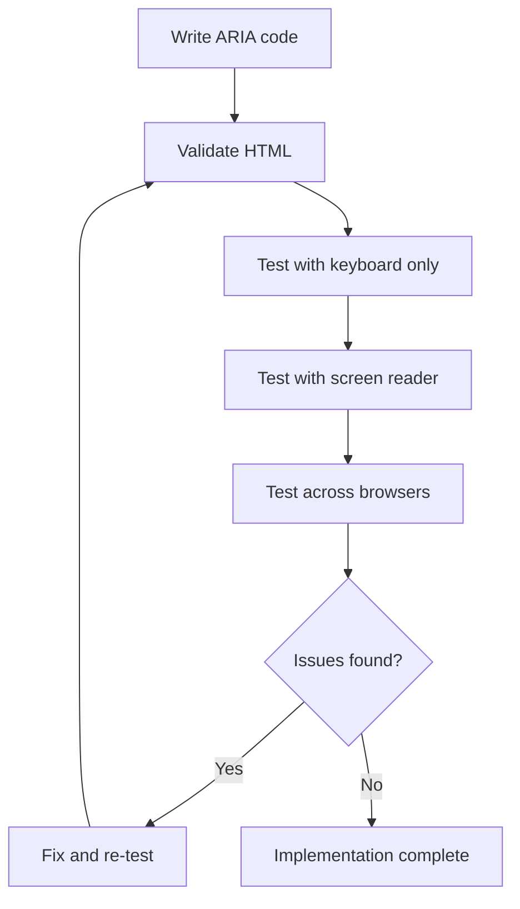

**🚫 Yleisiä ARIA-virheitä, joita tulee välttää:**

- **Ristiriitainen tieto**: Älä kumoa HTML:n semantiikkaa
- **Liiallinen merkintä**: Liiallinen ARIA-tieto voi hämmentää käyttäjiä
- **Staattinen ARIA**: ARIA-tilojen päivittämisen unohtaminen sisällön muuttuessa
- **Testaamattomat toteutukset**: ARIA, joka toimii teoriassa mutta epäonnistuu käytännössä
- **Puuttuva näppäimistötuki**: ARIA-roolit ilman vastaavia näppäimistötoimintoja

> 💡 **Testausresurssit**: Käytä työkaluja kuten [accessibility-checker](https://www.npmjs.com/package/accessibility-checker) ARIA:n automaattiseen validointiin, mutta testaa aina oikeilla ruudunlukijoilla täydellisen kokemuksen varmistamiseksi.

### 🎭 **ARIA-taitojen tarkistus: Valmiina monimutkaisiin vuorovaikutuksiin?**

**Arvioi ARIA-osaamisesi:**
- Milloin valitsisit ARIA:n semanttisen HTML:n sijaan? (Vihje: melkein koskaan!)
- Osaatko selittää, miksi `<div role="button">` on yleensä huonompi kuin `<button>`?
- Mikä on tärkein asia, joka tulee muistaa ARIA-testauksesta?

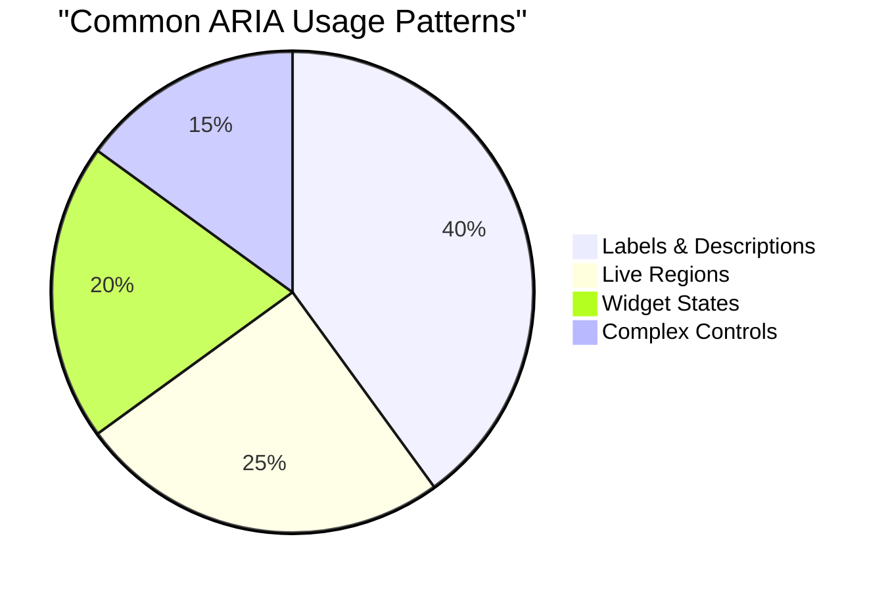

> **Keskeinen oivallus**: Suurin osa ARIA:n käytöstä liittyy elementtien nimeämiseen ja kuvaamiseen. Monimutkaiset widget-mallit ovat paljon harvinaisempia kuin voisi kuvitella!

✅ **Opi asiantuntijoilta**: Tutustu [ARIA Authoring Practices Guide](https://w3c.github.io/aria-practices/) -oppaaseen, joka sisältää testattuja malleja ja toteutuksia monimutkaisille interaktiivisille widgeteille.

## Kuvien ja median saavutettavuuden parantaminen

Visuaalinen ja audiosisältö ovat olennainen osa moderneja verkkokokemuksia, mutta ne voivat luoda esteitä, jos niitä ei toteuteta huolellisesti. Tavoitteena on varmistaa, että median tarjoama tieto ja tunnevaikutus tavoittavat jokaisen käyttäjän. Kun tämän oppii, siitä tulee luonnollista.

Eri mediatyypit vaativat erilaisia saavutettavuusratkaisuja. Se on kuin ruoanlaittoa—et käsittelisi herkkää kalaa samalla tavalla kuin tuhtia pihviä. Näiden erojen ymmärtäminen auttaa valitsemaan oikean ratkaisun kuhunkin tilanteeseen.

### Strateginen kuvien saavutettavuus

Jokaisella verkkosivustosi kuvalla on tarkoitus. Tämän tarkoituksen ymmärtäminen auttaa sinua kirjoittamaan parempaa vaihtoehtoista tekstiä ja luomaan osallistavampia kokemuksia.

**Kuvien neljä tyyppiä ja niiden alt-tekstistrategiat:**

**Informatiiviset kuvat** - välittävät tärkeää tietoa:
```html

```

**Koristeelliset kuvat** - pelkästään visuaalisia, ilman informatiivista arvoa:
```html

```

**Toiminnalliset kuvat** - toimivat painikkeina tai ohjaimina:
```html
<button>
  
</button>
```

**Monimutkaiset kuvat** - kaaviot, diagrammit, infografiikat:
```html

<div id="chart-description">
  <p>Detailed description: Sales data shows a steady increase across all quarters...</p>
</div>
```

### Videoiden ja audion saavutettavuus

**Videovaatimukset:**
- **Tekstitykset**: Puhutun sisällön ja äänitehosteiden tekstiversio
- **Äänikuvaukset**: Visuaalisten elementtien kerronta näkövammaisille käyttäjille
- **Transkriptiot**: Kaiken audio- ja visuaalisen sisällön tekstiversio

```html
<video controls>
  <source src="video.mp4" type="video/mp4">
  <track kind="captions" src="captions.vtt" srclang="en" label="English">
  <track kind="descriptions" src="descriptions.vtt" srclang="en" label="Audio descriptions">
</video>
```

**Audiovaatimukset:**
- **Transkriptiot**: Kaiken puhutun sisällön tekstiversio
- **Visuaaliset indikaattorit**: Tarjoa visuaalisia vihjeitä pelkästään audiosisällölle

### Modernit kuvatekniikat

**Koristeellisten kuvien käyttö CSS:llä:**
```css
.hero-section {
  background-image: url('decorative-hero.jpg');
  /* Decorative images in CSS don't need alt text */
}
```

**Responsiiviset kuvat saavutettavuuden kanssa:**
```html
<picture>
  <source media="(min-width: 800px)" srcset="large-chart.png">
  <source media="(min-width: 400px)" srcset="medium-chart.png">
  
</picture>
```

✅ **Testaa kuvien saavutettavuus**: Käytä ruudunlukijaa navigoidaksesi sivulla, jossa on kuvia. Saatko tarpeeksi tietoa sisällön ymmärtämiseksi?

## Näppäimistönavigointi ja fokuksen hallinta

Monet käyttäjät navigoivat verkossa pelkästään näppäimistöä käyttäen. Tämä koskee motorisia rajoitteita omaavia henkilöitä, tehokäyttäjiä, jotka pitävät näppäimistöä nopeampana kuin hiirtä, ja kaikkia, joiden hiiri on lakannut toimimasta. Varmistamalla, että sivustosi toimii hyvin näppäimistösyötteellä, teet siitä tehokkaamman kaikille.

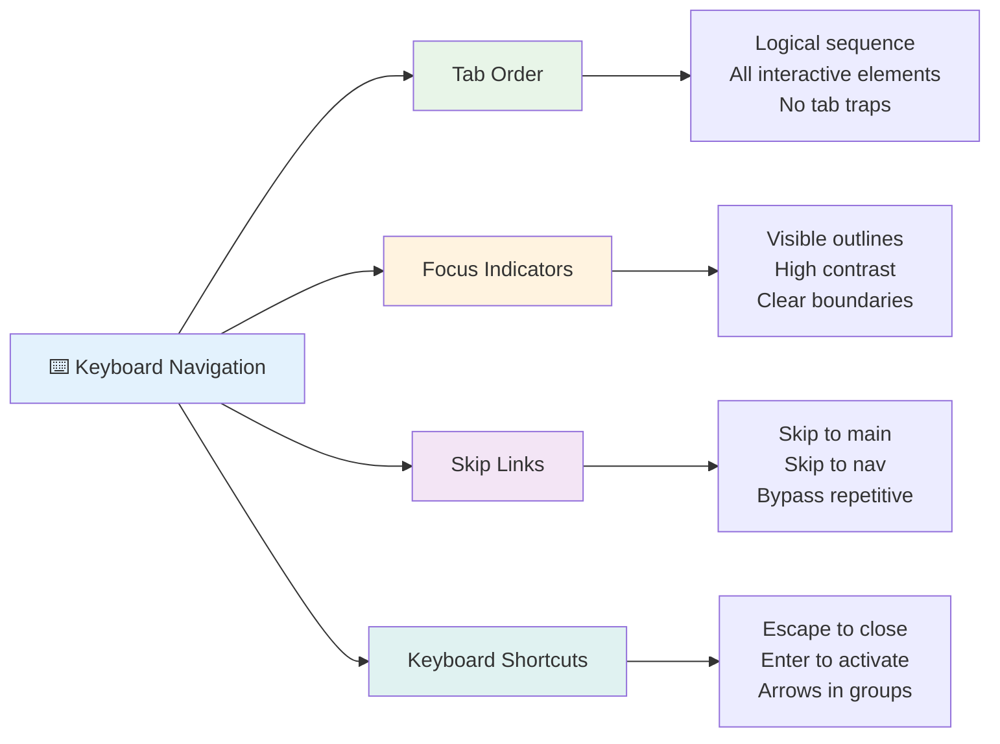

### Keskeiset näppäimistönavigointimallit

**Standardit näppäimistötoiminnot:**
- **Tab**: Siirtää fokusta eteenpäin interaktiivisten elementtien välillä
- **Shift + Tab**: Siirtää fokusta taaksepäin
- **Enter**: Aktivoi painikkeet ja linkit
- **Space**: Aktivoi painikkeet, valitsee valintaruudut
- **Nuolinäppäimet**: Navigoi komponenttiryhmien sisällä (radiopainikkeet, valikot)
- **Escape**: Sulkee modaalit, pudotusvalikot tai peruuttaa toimintoja

### Fokuksen hallinnan parhaat käytännöt

**Näkyvät fokusindikaattorit:**
```css
/* Ensure focus is always visible */
button:focus-visible {
  outline: 2px solid #4A90A4;
  outline-offset: 2px;
}

/* Custom focus styles for different components */
.card:focus-within {
  box-shadow: 0 0 0 3px rgba(74, 144, 164, 0.5);
}
```

**Ohituslinkit tehokkaaseen navigointiin:**
```html
<a href="#main-content" class="skip-link">Skip to main content</a>
<a href="#navigation" class="skip-link">Skip to navigation</a>

<nav id="navigation">
  <!-- navigation content -->
</nav>
<main id="main-content">
  <!-- main content -->
</main>
```

**Oikea tab-järjestys:**
```html
<!-- Use semantic HTML for natural tab order -->
<form>
  <label for="name">Name:</label>
  <input type="text" id="name" tabindex="0">
  
  <label for="email">Email:</label>
  <input type="email" id="email" tabindex="0">
  
  <button type="submit" tabindex="0">Submit</button>
</form>
```

### Fokuksen lukitseminen modaaleissa

Kun modaalidialogi avataan, fokuksen tulisi olla lukittuna modaalin sisälle:

```javascript
// Modern focus trap implementation
function trapFocus(element) {
  const focusableElements = element.querySelectorAll(
    'button, [href], input, select, textarea, [tabindex]:not([tabindex="-1"])'
  );
  
  const firstElement = focusableElements[0];
  const lastElement = focusableElements[focusableElements.length - 1];

  element.addEventListener('keydown', (e) => {
    if (e.key === 'Tab') {
      if (e.shiftKey && document.activeElement === firstElement) {
        e.preventDefault();
        lastElement.focus();
      } else if (!e.shiftKey && document.activeElement === lastElement) {
        e.preventDefault();
        firstElement.focus();
      }
    }
    
    if (e.key === 'Escape') {
      closeModal();
    }
  });
  
  // Focus first element when modal opens
  firstElement.focus();
}
```

✅ **Testaa näppäimistönavigointi**: Kokeile navigoida verkkosivustollasi pelkästään Tab-näppäintä käyttäen. Pääsetkö kaikkiin interaktiivisiin elementteihin? Onko fokusjärjestys looginen? Ovatko fokusindikaattorit selvästi näkyvissä?

## Lomakkeiden saavutettavuus

Lomakkeet ovat keskeisiä käyttäjän vuorovaikutuksessa ja vaativat erityistä huomiota saavutettavuuteen.

### Etikettien ja lomakekontrollien yhdistäminen

**Jokaisella lomakekontrollilla tulee olla etiketti:**
```html
<!-- Explicit labeling (preferred) -->
<label for="username">Username:</label>
<input type="text" id="username" name="username" required>

<!-- Implicit labeling -->
<label>
  Password:
  <input type="password" name="password" required>
</label>

<!-- Using aria-label when visual label isn't desired -->
<input type="search" aria-label="Search products" placeholder="Search...">
```

### Virheiden käsittely ja validointi

**Saavutettavat virheilmoitukset:**
```html
<label for="email">Email Address:</label>
<input type="email" id="email" name="email" 
       aria-describedby="email-error" 
       aria-invalid="true" required>
<div id="email-error" role="alert">
  Please enter a valid email address
</div>
```

**Lomakevalidoinnin parhaat käytännöt:**
- Käytä `aria-invalid`-attribuuttia osoittamaan virheelliset kentät
- Tarjoa selkeät ja tarkat virheilmoitukset
- Käytä `role="alert"` tärkeiden virheilmoitusten ilmoittamiseen
- Näytä virheet sekä välittömästi että lomakkeen lähetyksen yhteydessä

### Kenttäryhmät ja ryhmittely

**Ryhmittele liittyvät lomakekontrollit:**
```html
<fieldset>
  <legend>Shipping Address</legend>
  <label for="street">Street Address:</label>
  <input type="text" id="street" name="street">
  
  <label for="city">City:</label>
  <input type="text" id="city" name="city">
</fieldset>

<fieldset>
  <legend>Preferred Contact Method</legend>
  <input type="radio" id="contact-email" name="contact" value="email">
  <label for="contact-email">Email</label>
  
  <input type="radio" id="contact-phone" name="contact" value="phone">
  <label for="contact-phone">Phone</label>
</fieldset>
```

## Saavutettavuusmatkasi: Keskeiset opit

Onnittelut! Olet juuri saanut perustiedot todella osallistavien verkkokokemusten luomiseksi. Tämä on aika jännittävää! Verkkosaavutettavuus ei ole pelkästään vaatimusten täyttämistä—se on monimuotoisuuden tunnistamista ja sen suunnittelua varten.

Olet nyt osa kasvavaa kehittäjäyhteisöä, joka ymmärtää, että hyvä suunnittelu toimii kaikille. Tervetuloa joukkoon!

**🎯 Saavutettavuustyökalupakkisi sisältää nyt:**

| Keskeinen periaate | Toteutus | Vaikutus |
|--------------------|----------|----------|
| **Semanttinen HTML-pohja** | Käytä oikeita HTML-elementtejä niiden tarkoituksen mukaisesti | Ruudunlukijat voivat navigoida tehokkaasti, näppäimistöt toimivat automaattisesti |
| **Osallistava visuaalinen suunnittelu** | Riittävä kontrasti, merkityksellinen värien käyttö, näkyvät fokusindikaattorit | Selkeä kaikille missä tahansa valaistusolosuhteissa |
| **Kuvaileva sisältö** | Merkitykselliset linkkitekstit, alt-tekstit, otsikot | Käyttäjät ymmärtävät sisällön ilman visuaalista kontekstia |
| **Näppäimistön saavutettavuus** | Tab-järjestys, näppäimistöoikotiet, fokuksen hallinta | Motorinen saavutettavuus ja tehokäyttäjien tehokkuus |
| **ARIA:n parannukset** | Strateginen käyttö semanttisten aukkojen täyttämiseksi | Monimutkaiset sovellukset toimivat apuvälineiden kanssa |
| **Kattava testaus** | Automatisoidut työkalut + manuaalinen tarkistus + oikeiden käyttäjien testaus | Havaitse ongelmat ennen kuin ne vaikuttavat käyttäjiin |

**🚀 Seuraavat askeleesi:**

1. **Sisällytä saavutettavuus työnkulkuusi**: Tee testauksesta luonnollinen osa kehitysprosessiasi
2. **Opi oikeilta käyttäjiltä**: Pyydä palautetta apuvälineitä käyttäviltä ihmisiltä
3. **Pysy ajan tasalla**: Saavutettavuustekniikat kehittyvät uusien teknologioiden ja standardien myötä
4. **Puolusta osallistavuutta**: Jaa tietosi ja tee saavutettavuudesta tiimisi prioriteetti

> 💡 **Muista**: Saavutettavuusrajoitukset johtavat usein innovatiivisiin, elegantteihin ratkaisuihin, jotka hyödyttävät kaikkia. Jalkakäytävien rampit, tekstitykset ja ääniohjaus alkoivat saavutettavuusominaisuuksina ja muuttuivat valtavirran parannuksiksi.

**Liiketoimintaperuste on kristallinkirkas**: Saavutettavat verkkosivustot tavoittavat enemmän käyttäjiä, sijoittuvat paremmin hakukoneissa, ovat edullisempia ylläpitää ja välttävät oikeudelliset riskit. Mutta rehellisesti? Todellinen syy välittää saavutettavuudesta menee paljon syvemmälle. Saavutettavat verkkosivustot ilmentävät verkon parhaita arvoja—avoimuutta, osallistavuutta ja ajatusta siitä, että kaikilla on oikeus tietoon.

Olet nyt valmis rakentamaan tulevaisuuden osallistavaa verkkoa. Jokainen luomasi saavutettava sivusto tekee internetistä kutsuvamman paikan kaikille. Se on aika mahtavaa, kun sitä ajattelee!

## Lisäresurssit

Jatka saavutettavuuden oppimismatkaasi näiden olennaisten resurssien avulla:

**📚 Viralliset standardit ja ohjeet:**
- [WCAG 2.1 Guidelines](https://www.w3.org/WAI/WCAG21/quickref/) - Virallinen saavutettavuusstandardi pikaoppaalla
- [ARIA Authoring Practices Guide](https://w3c.github.io/aria-practices/) - Kattavat mallit interaktiivisille widgeteille
- [WebAIM Guidelines](https://webaim.org/) - Käytännönläheistä ja aloittelijaystävällistä saavutettavuusohjeistusta

**🛠️ Työkalut ja testausresurssit:**
- [axe DevTools](https://www.deque.com/axe/devtools/) - Alan standardi saavutettavuustestaukseen
- [A11y Project Checklist](https://www.a11yproject.com/checklist/) - Askeltarkistus saavutettavuuden varmistamiseen
- [Accessibility Insights](https://accessibilityinsights.io/) - Microsoftin kattava testauspaketti
- [Color Oracle](https://colororacle.org/) - Värisokeussimulaattori suunnittelutestaukseen

**🎓 Oppiminen ja yhteisö:**
- [WebAIM Screen Reader Survey](https://webaim.org/projects/screenreadersurvey9/) - Oikeiden käyttäjien mieltymykset ja käyttäytyminen
- [Inclusive Components](https://inclusive-components.design/) - Modernit saavutettavat komponenttimallit
- [A11y Coffee](https://a11y.coffee/) - Nopeat saavutettavuusvinkit ja oivallukset
- [Web Accessibility Initiative (WAI)](https://www.w3.org/WAI/) - W3C:n kattavat saavutettavuusresurssit

**🎥 Käytännön oppiminen:**
- [Accessibility Developer Guide](https://www.accessibility-developer-guide.com/) - Käytännön toteutusohjeet
- [Deque University](https://dequeuniversity.com/) - Ammattimaiset saavutettavuuskoulutuskurssit

## GitHub Copilot Agent -haaste 🚀

Käytä Agent-tilaa suorittaaksesi seuraavan haasteen:

**Kuvaus:** Luo saavutettava modaalidialogikomponentti, joka osoittaa oikean fokuksen hallinnan, ARIA-attribuutit ja näppäimistönavigointimallit.

**Tehtävä:** Rakenna täydellinen modaalidialogikomponentti HTML:llä, CSS:llä ja JavaScriptillä, joka sisältää: oikean fokuksen lukitsemisen, ESC-näppäimen sulkemiseen, klikkauksen ulkopuolelle sulkemiseen, ARIA-attribuutit ruudunlukijoille ja näkyvät fokusindikaattorit. Modaalin tulisi sisältää lomake, jossa on asianmukaiset etiketit ja virheiden käsittely. Varmista, että komponentti täyttää WCAG 2.1 AA -standardit.

## 🚀 Haaste

Ota tämä HTML ja kirjoita se mahdollisimman saavutettavaksi käyttäen oppimiasi strategioita.

```html
<!DOCTYPE html>
<html lang="en">
  <head>
    <meta charset="UTF-8">
    <meta name="viewport" content="width=device-width, initial-scale=1.0">
    <title>Turtle Ipsum - The World's Premier Turtle Fan Club</title>
    <link href='../assets/style.css' rel='stylesheet' type='text/css'>
  </head>
  <body>
    <header class="site-header">
      <h1 class="site-title">Turtle Ipsum</h1>
      <p class="site-subtitle">The World's Premier Turtle Fan Club</p>
    </header>
    
    <nav class="main-nav" aria-label="Main navigation">
      <h2 class="nav-header">Resources</h2>
      <ul class="nav-list">
        <li><a href="https://www.youtube.com/watch?v=CMNry4PE93Y">"I like turtles" video</a></li>
        <li><a href="https://en.wikipedia.org/wiki/Turtle">Basic turtle information</a></li>
        <li><a href="https://en.wikipedia.org/wiki/Turtles_(chocolate)">Chocolate turtles candy</a></li>
      </ul>
    </nav>
    
    <main class="main-content">
      <article>
        <h1>Welcome to Turtle Ipsum</h1>
        <p class="intro">
          <a href="/about">Learn more about our turtle community</a> and discover fascinating facts about these amazing creatures.
        </p>
        <p class="article-text">
          Turtle ipsum dolor sit amet, consectetur adipiscing elit, sed do eiusmod tempor incididunt ut labore et dolore magna aliqua. Ut enim ad minim veniam, quis nostrud exercitation ullamco laboris nisi ut aliquip ex ea commodo consequat. Duis aute irure dolor in reprehenderit in voluptate velit esse cillum dolore eu fugiat nulla pariatur. Excepteur sint occaecat cupidatat non proident, sunt in culpa qui officia deserunt mollit anim id est laborum.
        </p>
      </article>
    </main>
    
    <footer class="footer">
      <section class="newsletter-signup">
        <h2>Stay Updated</h2>
        <button type="button" onclick="showNewsletterForm()">Sign up for turtle news</button>
      </section>
      
      <nav class="footer-nav" aria-label="Footer navigation">
        <h2>Site Pages</h2>
        <ul>
          <li><a href="../">Home</a></li>
          <li><a href="../semantic">Semantic HTML example</a></li>
        </ul>
      </nav>
      
      <p class="footer-copyright">&copy; 2024 Instrument. All rights reserved.</p>
    </footer>
  </body>
</html>
```

**Tehdyt parannukset:**
- Lisätty asianmukainen semanttinen HTML-rakenne
- Korjattu otsikkohierarkia (yksi h1, looginen eteneminen)
- Lisätty merkitykselliset linkkitekstit "klikkaa tästä" sijaan
- Sisällytetty asianmukaiset ARIA-merkinnät navigointiin
- Lisätty lang-attribuutti ja asianmukaiset meta-tunnisteet
- Käytetty button-elementtiä interaktiivisille elementeille
- Jäsennelty alatunnisteen sisältö asianmukaisilla maamerkeillä

## Luentojälkeinen kysely
[Luentojälkeinen kysely](https://ff-quizzes.netlify.app/web/en/)

## Kertaus ja itseopiskelu

Monilla valtioilla on lakeja saavutettavuusvaatimuksista. Tutustu kotimaasi saavutettavuuslakeihin. Mitä ne kattavat ja mitä eivät? Es
- [ ] Harjoittele näppäimistön käyttöä viidellä eri monimutkaisella verkkosivustolla  
- [ ] Rakenna yksinkertainen lomake, jossa on asianmukaiset tunnisteet, virheenkäsittely ja ARIA  
- [ ] Liity saavutettavuusyhteisöön (A11y Slack, WebAIM-foorumi)  
- [ ] Katso, kuinka oikeat käyttäjät, joilla on toimintarajoitteita, navigoivat verkkosivustoilla (YouTubesta löytyy hyviä esimerkkejä)  

### 🌟 **Kuukauden mittainen muutosmatkasi**  
- [ ] Ota saavutettavuustestaus osaksi kehitysprosessiasi  
- [ ] Osallistu avoimen lähdekoodin projektiin korjaamalla saavutettavuusongelmia  
- [ ] Tee käytettävyystestausta henkilön kanssa, joka käyttää apuvälineitä  
- [ ] Rakenna tiimillesi saavutettava komponenttikirjasto  
- [ ] Edistä saavutettavuutta työpaikallasi tai yhteisössäsi  
- [ ] Mentoroi henkilöä, joka on uusi saavutettavuuden parissa  

### 🏆 **Lopullinen saavutettavuusmestarin tarkistus**

**Juhlista saavutettavuusmatkaasi:**  
- Mikä oli yllättävin asia, jonka opit siitä, miten ihmiset käyttävät verkkosivustoja?  
- Mikä saavutettavuusperiaate resonoi eniten kehitystyylisi kanssa?  
- Miten saavutettavuuden oppiminen on muuttanut näkökulmaasi suunnitteluun?  
- Mikä on ensimmäinen saavutettavuusparannus, jonka haluat tehdä oikeassa projektissa?  

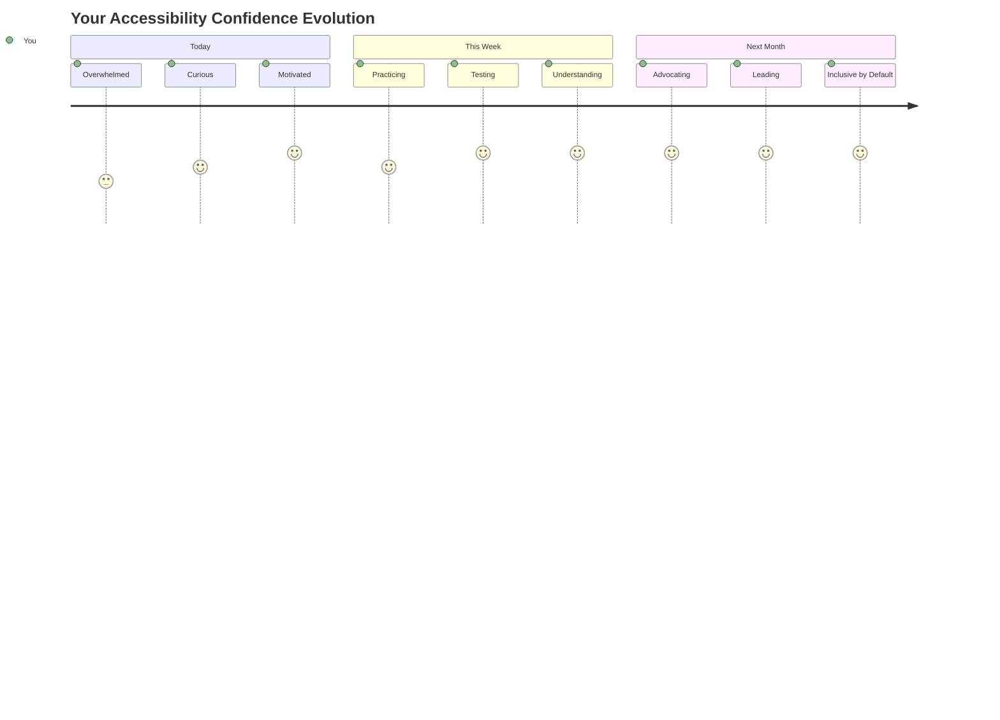
  
> 🌍 **Olet nyt saavutettavuusmestari!** Ymmärrät, että loistavat verkkokokemukset toimivat kaikille, riippumatta siitä, miten he käyttävät verkkoa. Jokainen rakentamasi saavutettava ominaisuus tekee internetistä inklusiivisemman. Verkko tarvitsee kaltaisiasi kehittäjiä, jotka näkevät saavutettavuuden mahdollisuutena luoda parempia kokemuksia kaikille käyttäjille, ei rajoitteena. Tervetuloa mukaan liikkeeseen! 🎉  

---

**Vastuuvapauslauseke**:  
Tämä asiakirja on käännetty käyttämällä tekoälypohjaista käännöspalvelua [Co-op Translator](https://github.com/Azure/co-op-translator). Vaikka pyrimme tarkkuuteen, huomioithan, että automaattiset käännökset voivat sisältää virheitä tai epätarkkuuksia. Alkuperäinen asiakirja sen alkuperäisellä kielellä tulisi pitää ensisijaisena lähteenä. Kriittisen tiedon osalta suositellaan ammattimaista ihmiskäännöstä. Emme ole vastuussa väärinkäsityksistä tai virhetulkinnoista, jotka johtuvat tämän käännöksen käytöstä.