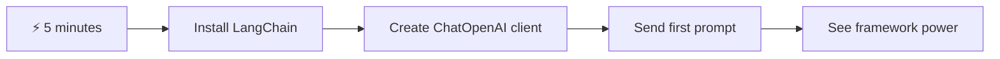
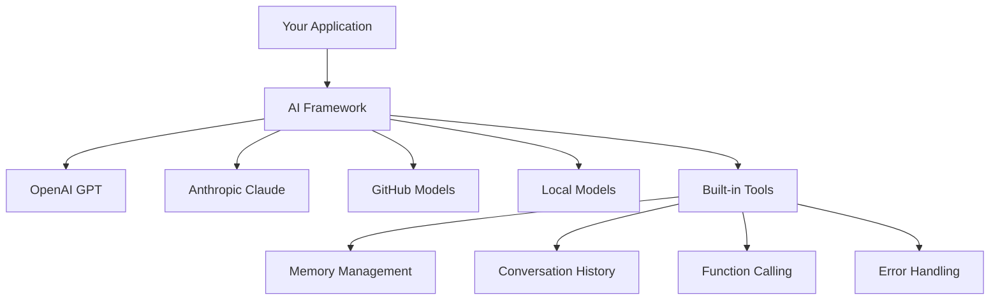
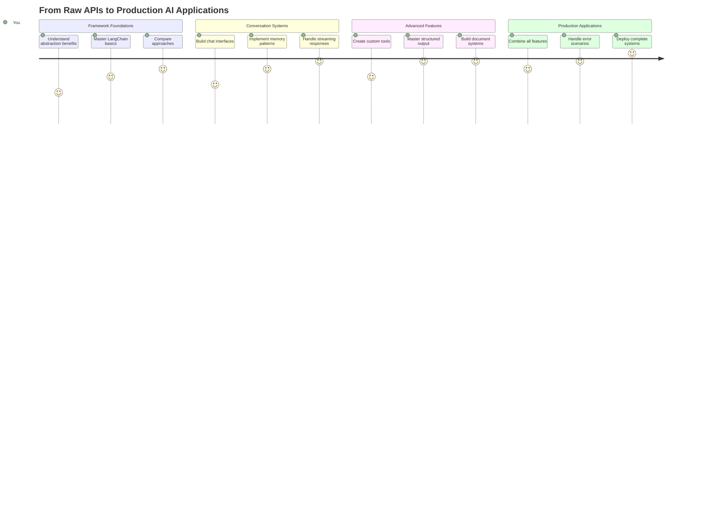
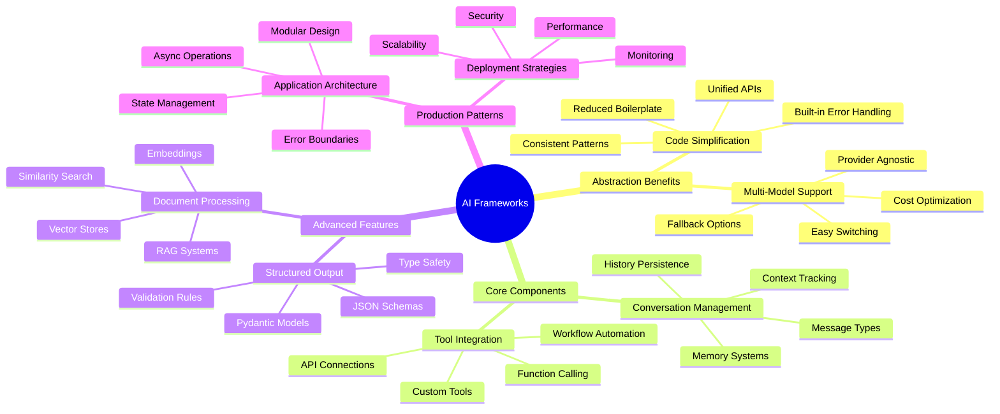
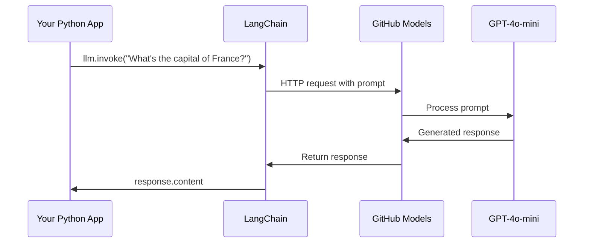
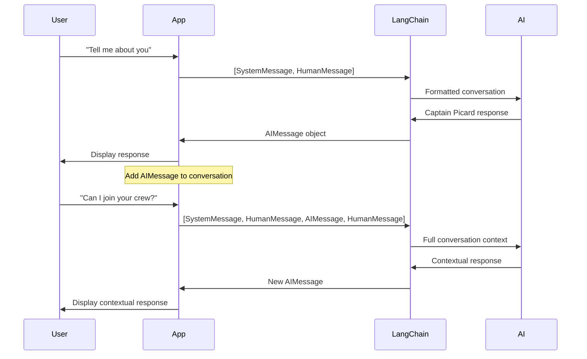
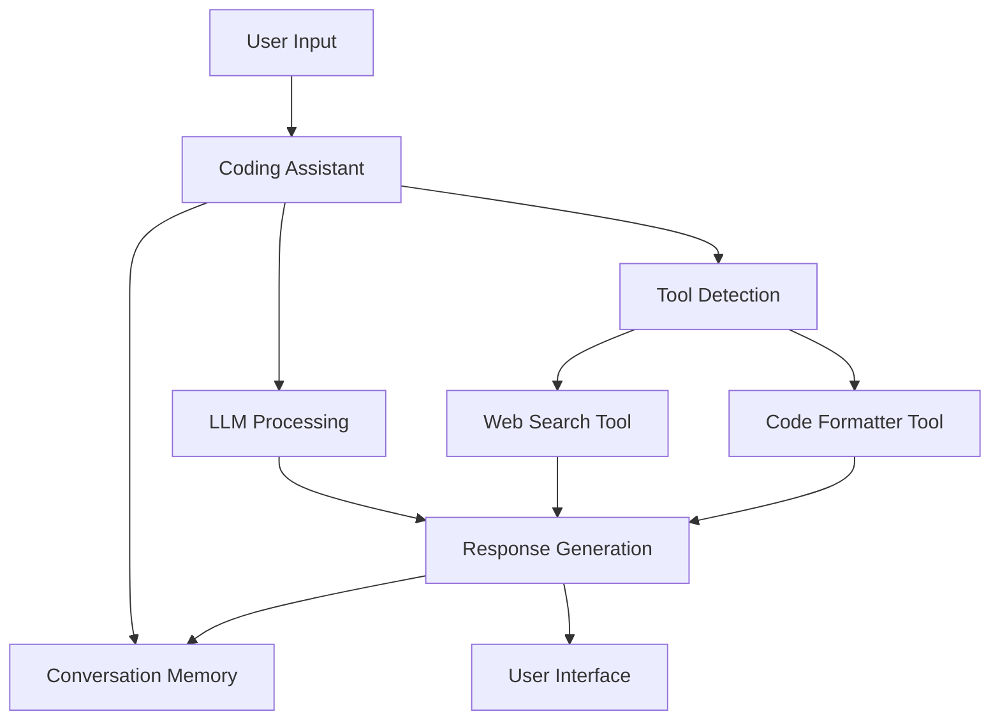
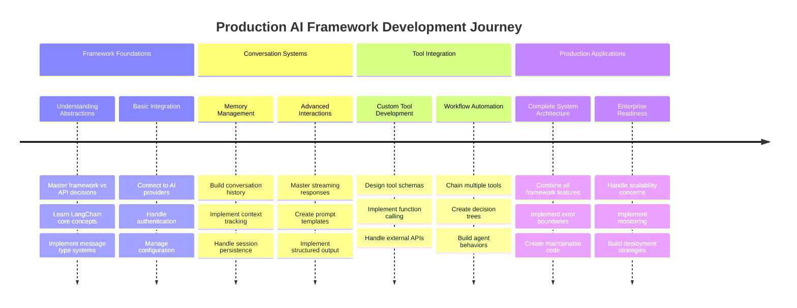
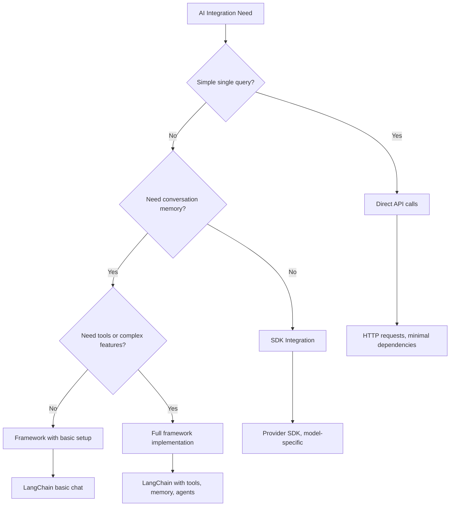

# AI-kehys

Oletko koskaan tuntenut olevasi hukassa yrittäessäsi rakentaa tekoälysovelluksia alusta alkaen? Et ole yksin! AI-kehykset ovat kuin monitoimityökalu tekoälykehitykseen – tehokkaita työkaluja, jotka säästävät aikaa ja vaivaa älykkäiden sovellusten rakentamisessa. Ajattele AI-kehystä hyvin järjestettynä kirjastona: se tarjoaa valmiita komponentteja, standardoituja API-rajapintoja ja älykkäitä abstraktioita, jotta voit keskittyä ongelmien ratkaisemiseen sen sijaan, että kamppailisit toteutuksen yksityiskohtien kanssa.

Tässä oppitunnissa tutkimme, kuinka kehykset, kuten LangChain, voivat muuttaa aiemmin monimutkaiset tekoälyn integrointitehtävät selkeäksi ja luettavaksi koodiksi. Opit ratkaisemaan todellisia haasteita, kuten keskustelujen seuraamista, työkalujen käyttöönottoa ja erilaisten tekoälymallien hallintaa yhden yhtenäisen käyttöliittymän kautta.

Kun olemme valmiita, tiedät, milloin kannattaa valita kehykset raakojen API-kutsujen sijaan, kuinka käyttää niiden abstraktioita tehokkaasti ja kuinka rakentaa tekoälysovelluksia, jotka ovat valmiita todelliseen käyttöön. Tutkitaan, mitä AI-kehykset voivat tehdä projekteillesi.

## ⚡ Mitä voit tehdä seuraavan 5 minuutin aikana

**Nopea aloitus kiireisille kehittäjille**



- **Minuutti 1**: Asenna LangChain: `pip install langchain langchain-openai`
- **Minuutti 2**: Aseta GitHub-tokenisi ja tuo ChatOpenAI-asiakas
- **Minuutti 3**: Luo yksinkertainen keskustelu järjestelmä- ja käyttäjäviesteillä
- **Minuutti 4**: Lisää perustoiminto (kuten yhteenlaskufunktio) ja näe tekoälyn työkalujen käyttö
- **Minuutti 5**: Koe ero raakojen API-kutsujen ja kehysabstraktioiden välillä

**Nopea testikoodi**:
```python
from langchain_openai import ChatOpenAI
from langchain_core.messages import SystemMessage, HumanMessage

llm = ChatOpenAI(
    api_key=os.environ["GITHUB_TOKEN"],
    base_url="https://models.github.ai/inference",
    model="openai/gpt-4o-mini"
)

response = llm.invoke([
    SystemMessage(content="You are a helpful coding assistant"),
    HumanMessage(content="Explain Python functions briefly")
])
print(response.content)
```

**Miksi tämä on tärkeää**: Viidessä minuutissa koet, kuinka AI-kehykset muuttavat monimutkaisen tekoälyn integroinnin yksinkertaisiksi metodikutsuiksi. Tämä on perusta, joka tukee tuotantokäyttöön tarkoitettuja tekoälysovelluksia.

## Miksi valita kehys?

Olet valmis rakentamaan tekoälysovelluksen – mahtavaa! Mutta tässä on juttu: sinulla on useita eri polkuja, joita voit kulkea, ja jokaisella on omat hyvät ja huonot puolensa. Se on vähän kuin valitsisit kävelyn, pyöräilyn tai ajamisen päästäksesi jonnekin – kaikki vievät sinut perille, mutta kokemus (ja vaivannäkö) on täysin erilainen.

Katsotaanpa kolmea pääasiallista tapaa integroida tekoäly projekteihisi:

| Lähestymistapa | Edut | Paras käyttö | Huomioitavaa |
|----------------|------|--------------|--------------|
| **Suorat HTTP-pyynnöt** | Täysi hallinta, ei riippuvuuksia | Yksinkertaiset kyselyt, perusteiden oppiminen | Laajempi koodi, manuaalinen virheenkäsittely |
| **SDK-integraatio** | Vähemmän boilerplate-koodia, mallikohtainen optimointi | Yksimalliset sovellukset | Rajoittuu tiettyihin tarjoajiin |
| **AI-kehykset** | Yhtenäinen API, sisäänrakennetut abstraktiot | Monimalliset sovellukset, monimutkaiset työnkulut | Oppimiskäyrä, mahdollinen yliabstraktio |

### Kehyksen hyödyt käytännössä



**Miksi kehykset ovat tärkeitä:**
- **Yhdistää** useita tekoälytarjoajia yhden käyttöliittymän alle
- **Käsittelee** keskustelumuistin automaattisesti
- **Tarjoaa** valmiita työkaluja yleisiin tehtäviin, kuten upotuksiin ja funktiokutsuihin
- **Hallinnoi** virheenkäsittelyä ja uudelleenkokeilulogiikkaa
- **Muuttaa** monimutkaiset työnkulut luettaviksi metodikutsuiksi

> 💡 **Vinkki**: Käytä kehyksiä, kun vaihdat eri tekoälymallien välillä tai rakennat monimutkaisia ominaisuuksia, kuten agentteja, muistia tai työkalujen käyttöä. Pysy suorissa API-kutsuissa, kun opit perusteita tai rakennat yksinkertaisia, keskittyneitä sovelluksia.

**Yhteenveto**: Kuten valinta käsityöläisen erikoistyökalujen ja täydellisen työpajan välillä, kyse on oikean työkalun valinnasta tehtävään. Kehykset loistavat monimutkaisissa, ominaisuusrikkaissa sovelluksissa, kun taas suorat API-kutsut toimivat hyvin yksinkertaisissa käyttötapauksissa.

## 🗺️ Oppimismatka AI-kehysten hallintaan



**Matkasi päämäärä**: Oppitunnin lopussa hallitset AI-kehysten kehittämisen ja pystyt rakentamaan kehittyneitä, tuotantovalmiita tekoälysovelluksia, jotka kilpailevat kaupallisten tekoälyavustajien kanssa.

## Johdanto

Tässä oppitunnissa opimme:

- Käyttämään yleistä AI-kehystä.
- Ratkaisemaan yleisiä ongelmia, kuten keskustelut, työkalujen käyttö, muisti ja konteksti.
- Hyödyntämään tätä tekoälysovellusten rakentamisessa.

## 🧠 AI-kehysten kehitysekosysteemi



**Keskeinen periaate**: AI-kehykset abstrahoivat monimutkaisuutta samalla kun tarjoavat tehokkaita abstraktioita keskustelun hallintaan, työkalujen integrointiin ja dokumenttien käsittelyyn, mahdollistaen kehittäjille kehittyneiden tekoälysovellusten rakentamisen puhtaalla ja ylläpidettävällä koodilla.

## Ensimmäinen tekoälykysymyksesi

Aloitetaan perusteista luomalla ensimmäinen tekoälysovellus, joka lähettää kysymyksen ja saa vastauksen takaisin. Kuten Arkhimedes, joka löysi syrjäytymisen periaatteen kylvyssään, joskus yksinkertaisimmat havainnot johtavat voimakkaimpiin oivalluksiin – ja kehykset tekevät näistä oivalluksista saavutettavia.

### LangChainin asennus GitHub-mallien kanssa

Käytämme LangChainia yhdistääksemme GitHub-malleihin, mikä on aika siistiä, koska se antaa sinulle ilmaisen pääsyn erilaisiin tekoälymalleihin. Parasta? Tarvitset vain muutaman yksinkertaisen konfiguraatioparametrin aloittaaksesi:

```python
from langchain_openai import ChatOpenAI
import os

llm = ChatOpenAI(
    api_key=os.environ["GITHUB_TOKEN"],
    base_url="https://models.github.ai/inference",
    model="openai/gpt-4o-mini",
)

# Send a simple prompt
response = llm.invoke("What's the capital of France?")
print(response.content)
```

**Puretaan, mitä tässä tapahtuu:**
- **Luo** LangChain-asiakkaan käyttämällä `ChatOpenAI`-luokkaa – tämä on porttisi tekoälyyn!
- **Konfiguroi** yhteyden GitHub-malleihin autentikointitokenisi avulla
- **Määrittää**, mitä tekoälymallia käytetään (`gpt-4o-mini`) – ajattele tätä tekoälyavustajasi valintana
- **Lähettää** kysymyksesi `invoke()`-metodin avulla – tässä tapahtuu taikuus
- **Poimii** ja näyttää vastauksen – ja voilà, keskustelet tekoälyn kanssa!

> 🔧 **Asennusvinkki**: Jos käytät GitHub Codespacesia, olet onnekas – `GITHUB_TOKEN` on jo asetettu sinulle! Työskenteletkö paikallisesti? Ei hätää, sinun tarvitsee vain luoda henkilökohtainen käyttöoikeustoken oikeilla käyttöoikeuksilla.

**Odotettu tulos:**
```text
The capital of France is Paris.
```



## Keskusteleva tekoäly

Ensimmäinen esimerkki osoittaa perusteet, mutta se on vain yksi vaihto – kysyt kysymyksen, saat vastauksen, ja siinä se. Todellisissa sovelluksissa haluat, että tekoäly muistaa, mistä olette keskustelleet, kuten Watson ja Holmes rakensivat tutkivia keskustelujaan ajan myötä.

Tässä LangChain on erityisen hyödyllinen. Se tarjoaa erilaisia viestityyppejä, jotka auttavat jäsentämään keskusteluja ja antavat sinulle mahdollisuuden antaa tekoälylle persoonallisuuden. Rakennat keskustelukokemuksia, jotka säilyttävät kontekstin ja luonteen.

### Viestityyppien ymmärtäminen

Ajattele näitä viestityyppejä eri "hattuina", joita keskustelun osapuolet käyttävät. LangChain käyttää erilaisia viestiluokkia pitääkseen kirjaa siitä, kuka sanoo mitä:

| Viestityyppi | Tarkoitus | Esimerkkikäyttö |
|--------------|----------|------------------|
| `SystemMessage` | Määrittää tekoälyn persoonallisuuden ja käyttäytymisen | "Olet avulias koodausavustaja" |
| `HumanMessage` | Edustaa käyttäjän syötettä | "Selitä, miten funktiot toimivat" |
| `AIMessage` | Tallentaa tekoälyn vastaukset | Aiemmat tekoälyn vastaukset keskustelussa |

### Ensimmäisen keskustelun luominen

Luodaan keskustelu, jossa tekoäly ottaa tietyn roolin. Annetaan sen esittää kapteeni Picardia – hahmoa, joka tunnetaan diplomaattisesta viisaudestaan ja johtajuudestaan:

```python
messages = [
    SystemMessage(content="You are Captain Picard of the Starship Enterprise"),
    HumanMessage(content="Tell me about you"),
]
```

**Puretaan tämä keskusteluasetus:**
- **Määrittää** tekoälyn roolin ja persoonallisuuden `SystemMessage`-viestin avulla
- **Tarjoaa** käyttäjän alkuperäisen kyselyn `HumanMessage`-viestin kautta
- **Luo** perustan monivaiheiselle keskustelulle

Koko koodi tälle esimerkille näyttää tältä:

```python
from langchain_core.messages import HumanMessage, SystemMessage
from langchain_openai import ChatOpenAI
import os

llm = ChatOpenAI(
    api_key=os.environ["GITHUB_TOKEN"],
    base_url="https://models.github.ai/inference",
    model="openai/gpt-4o-mini",
)

messages = [
    SystemMessage(content="You are Captain Picard of the Starship Enterprise"),
    HumanMessage(content="Tell me about you"),
]


# works
response  = llm.invoke(messages)
print(response.content)
```

Näet tuloksen, joka näyttää tältä:

```text
I am Captain Jean-Luc Picard, the commanding officer of the USS Enterprise (NCC-1701-D), a starship in the United Federation of Planets. My primary mission is to explore new worlds, seek out new life and new civilizations, and boldly go where no one has gone before. 

I believe in the importance of diplomacy, reason, and the pursuit of knowledge. My crew is diverse and skilled, and we often face challenges that test our resolve, ethics, and ingenuity. Throughout my career, I have encountered numerous species, grappled with complex moral dilemmas, and have consistently sought peaceful solutions to conflicts.

I hold the ideals of the Federation close to my heart, believing in the importance of cooperation, understanding, and respect for all sentient beings. My experiences have shaped my leadership style, and I strive to be a thoughtful and just captain. How may I assist you further?
```

Keskustelun jatkuvuuden ylläpitämiseksi (sen sijaan, että konteksti nollautuisi joka kerta), sinun on lisättävä vastaukset viestilistaan. Kuten suulliset perinteet, jotka säilyttivät tarinoita sukupolvien ajan, tämä lähestymistapa rakentaa kestävää muistia:

```python
from langchain_core.messages import HumanMessage, SystemMessage
from langchain_openai import ChatOpenAI
import os

llm = ChatOpenAI(
    api_key=os.environ["GITHUB_TOKEN"],
    base_url="https://models.github.ai/inference",
    model="openai/gpt-4o-mini",
)

messages = [
    SystemMessage(content="You are Captain Picard of the Starship Enterprise"),
    HumanMessage(content="Tell me about you"),
]


# works
response  = llm.invoke(messages)

print(response.content)

print("---- Next ----")

messages.append(response)
messages.append(HumanMessage(content="Now that I know about you, I'm Chris, can I be in your crew?"))

response  = llm.invoke(messages)

print(response.content)

```

Aika siistiä, eikö? Tässä tapahtuu se, että kutsumme LLM:ää kahdesti – ensin vain alkuperäisillä kahdella viestillä, mutta sitten uudelleen koko keskusteluhistorialla. Se on kuin tekoäly todella seuraisi keskusteluamme!

Kun suoritat tämän koodin, saat toisen vastauksen, joka kuulostaa suunnilleen tältä:

```text
Welcome aboard, Chris! It's always a pleasure to meet those who share a passion for exploration and discovery. While I cannot formally offer you a position on the Enterprise right now, I encourage you to pursue your aspirations. We are always in need of talented individuals with diverse skills and backgrounds. 

If you are interested in space exploration, consider education and training in the sciences, engineering, or diplomacy. The values of curiosity, resilience, and teamwork are crucial in Starfleet. Should you ever find yourself on a starship, remember to uphold the principles of the Federation: peace, understanding, and respect for all beings. Your journey can lead you to remarkable adventures, whether in the stars or on the ground. Engage!
```



Otan tuon ehkä-vastauksena ;)

## Vastausten suoratoisto

Oletko koskaan huomannut, kuinka ChatGPT "kirjoittaa" vastauksiaan reaaliajassa? Se on suoratoistoa toiminnassa. Kuten katselisit taitavaa kalligrafiaa työssään – näet kirjaimet ilmestyvän viiva kerrallaan sen sijaan, että ne ilmestyisivät välittömästi – suoratoisto tekee vuorovaikutuksesta luonnollisemman ja tarjoaa välitöntä palautetta.

### Suoratoiston toteuttaminen LangChainilla

```python
from langchain_openai import ChatOpenAI
import os

llm = ChatOpenAI(
    api_key=os.environ["GITHUB_TOKEN"],
    base_url="https://models.github.ai/inference",
    model="openai/gpt-4o-mini",
    streaming=True
)

# Stream the response
for chunk in llm.stream("Write a short story about a robot learning to code"):
    print(chunk.content, end="", flush=True)
```

**Miksi suoratoisto on mahtavaa:**
- **Näyttää** sisällön sen luomisen aikana – ei enää kiusallista odottelua!
- **Saa** käyttäjät tuntemaan, että jotain tapahtuu
- **Tuntuu** nopeammalta, vaikka teknisesti ei olisikaan
- **Antaa** käyttäjien alkaa lukea, kun tekoäly vielä "ajattelee"

> 💡 **Käyttäjäkokemusvinkki**: Suoratoisto loistaa erityisesti, kun käsitellään pidempiä vastauksia, kuten koodiselityksiä, luovaa kirjoittamista tai yksityiskohtaisia opetusmateriaaleja. Käyttäjät rakastavat nähdä edistymistä sen sijaan, että tuijottaisivat tyhjää näyttöä!

### 🎯 Pedagoginen tarkistus: Kehysabstraktioiden hyödyt

**Pysähdy ja pohdi**: Olet juuri kokenut AI-kehysten abstraktioiden voiman. Vertaa oppimaasi aiempiin raakoihin API-kutsuihin.

**Nopea itsearviointi**:
- Osaatko selittää, kuinka LangChain yksinkertaistaa keskustelun hallintaa verrattuna manuaaliseen viestien seurantaan?
- Mikä ero on `invoke()`- ja `stream()`-metodien välillä, ja milloin käyttäisit kumpaakin?
- Kuinka kehyksen viestityyppijärjestelmä parantaa koodin organisointia?

**Yhteys todellisuuteen**: Oppimasi abstraktiomallit (viestityypit, suoratoistokäyttöliittymät, keskustelumuisti) ovat käytössä kaikissa suurissa tekoälysovelluksissa – ChatGPT:n käyttöliittymästä GitHub Copilotin koodiavustukseen. Hallitset samoja arkkitehtuurimalleja, joita ammattimaiset tekoälykehitystiimit käyttävät.

**Haastekysymys**: Kuinka suunnittelisit kehysabstraktion, joka käsittelee eri tekoälymallitarjoajia (OpenAI, Anthropic, Google) yhden käyttöliittymän kautta? Mieti hyötyjä ja kompromisseja.

## Kehotemallit

Kehotemallit toimivat kuin retoriset rakenteet klassisessa puhetaidossa – ajattele, kuinka Cicero mukautti puhetyylinsä eri yleisöille säilyttäen saman vakuuttavan rakenteen. Ne antavat sinun luoda uudelleenkäytettäviä kehotteita, joissa voit vaihtaa eri tietoja ilman, että sinun tarvitsee kirjoittaa kaikkea uudelleen. Kun olet määrittänyt mallin, täytät vain muuttujat tarvittavilla arvoilla.

### Uudelleenkäytettävien kehotteiden luominen

```python
from langchain_core.prompts import ChatPromptTemplate

# Define a template for code explanations
template = ChatPromptTemplate.from_messages([
    ("system", "You are an expert programming instructor. Explain concepts clearly with examples."),
    ("human", "Explain {concept} in {language} with a practical example for {skill_level} developers")
])

# Use the template with different values
questions = [
    {"concept": "functions", "language": "JavaScript", "skill_level": "beginner"},
    {"concept": "classes", "language": "Python", "skill_level": "intermediate"},
    {"concept": "async/await", "language": "JavaScript", "skill_level": "advanced"}
]

for question in questions:
    prompt = template.format_messages(**question)
    response = llm.invoke(prompt)
    print(f"Topic: {question['concept']}\n{response.content}\n---\n")
```

**Miksi rakastat mallien käyttöä:**
- **Pitää** kehotteesi johdonmukaisina koko sovelluksessa
- **Ei enää** sotkuista merkkijonojen yhdistelyä – vain siistejä, yksinkertaisia muuttujia
- **Tekoälysi** käyttäytyy ennustettavasti, koska rakenne pysyy samana
- **Päivitykset** ovat helppoja – muuta mallia kerran, ja se korjautuu kaikkialla

## Jäsennelty ulostulo

Oletko koskaan turhautunut yrittäessäsi tulkita tekoälyn vastauksia, jotka palaavat jäsentämättömänä tekstinä? Jäsennelty ulostulo on kuin opettaisit tekoälyä noudattamaan systemaattista lähestymistapaa, joka muistuttaa Linnaeuksen biologista luokittelua – järjestelmällistä, ennustettavaa ja helppoa työstää. Voit pyytää JSONia, tiettyjä tietorakenteita tai mitä tahansa tarvitsemaasi muotoa.

### Ulostulomallien määrittely

```python
from langchain_core.prompts import ChatPromptTemplate
from langchain_core.output_parsers import JsonOutputParser
from pydantic import BaseModel, Field

class CodeReview(BaseModel):
    score: int = Field(description="Code quality score from 1-10")
    strengths: list[str] = Field(description="List of code strengths")
    improvements: list[str] = Field(description="List of suggested improvements")
    overall_feedback: str = Field(description="Summary feedback")

# Set up the parser
parser = JsonOutputParser(pydantic_object=CodeReview)

# Create prompt with format instructions
prompt = ChatPromptTemplate.from_messages([
    ("system", "You are a code reviewer. {format_instructions}"),
    ("human", "Review this code: {code}")
])

# Format the prompt with instructions
chain = prompt | llm | parser

# Get structured response
code_sample = """
def calculate_average(numbers):
    return sum(numbers) / len(numbers)
"""

result = chain.invoke({
    "code": code_sample,
    "format_instructions": parser.get_format_instructions()
})

print(f"Score: {result['score']}")
print(f"Strengths: {', '.join(result['strengths'])}")
```

**Miksi jäsennelty ulostulo on mullistavaa:**
- **Ei enää** arvailua, missä muodossa vastaus tulee – se on aina johdonmukainen
- **Liittyy** suoraan tietokantoihisi ja API-rajapintoihisi ilman lisätyötä
- **Havaitsee** oudot tekoälyvastaukset ennen kuin ne rikkovat sovelluksesi
- **Tekee** koodistasi siistimmän, koska tiedät tarkalleen, mitä käsittelet

## Työkalujen käyttö

Nyt pääsemme yhteen tehokkaimmista ominaisuuksista: työkalut. Näin annat tekoälyllesi käytännön kykyjä keskustelun ulkopuolella. Kuten keskiaikaiset killat kehittivät erikoistyökaluja tiettyihin käsityöihin, voit varustaa tekoälysi keskittyneillä välineillä. Kuvailet, mitkä työkalut ovat käytettävissä, ja kun joku pyytää jotain vastaavaa, tekoälysi voi ryhtyä toimeen.

### Pythonin käyttö

Lisätään joitakin työkaluja näin:

```python
from typing_extensions import Annotated, TypedDict

class add(TypedDict):
    """Add two integers."""

    # Annotations must have the type and can optionally include a default value and description (in that order).
    a: Annotated[int, ..., "First integer"]
    b: Annotated[int, ..., "Second integer"]

tools = [add]

functions = {
    "add": lambda a, b: a + b
}
```

Mitä tässä tapahtuu? Luomme työkalun nimeltä `add` suunnitelman. Perimällä `TypedDict`-luokasta ja käyttämällä hienoja `Annotated`-tyyppejä `a` ja `b` varten, annamme LLM:lle selkeän kuvan siitä, mitä tämä työkalu tekee ja mitä se tarvitsee. `functions`-sanakirja on kuin työkalupakkimme – se kertoo koodillemme tarkalleen, mitä tehdä, kun tekoäly päättää käyttää tiettyä työkalua.

Katsotaanpa,
Numeroiden lisääminen havainnollistaa peruskonseptia, mutta todelliset työkalut suorittavat yleensä monimutkaisempia toimintoja, kuten verkkosovellusliittymien kutsumista. Laajennetaan esimerkkiamme niin, että tekoäly hakee sisältöä internetistä – aivan kuten lennätinoperaattorit yhdistivät aikoinaan kaukaisia paikkoja:

```python
class joke(TypedDict):
    """Tell a joke."""

    # Annotations must have the type and can optionally include a default value and description (in that order).
    category: Annotated[str, ..., "The joke category"]

def get_joke(category: str) -> str:
    response = requests.get(f"https://api.chucknorris.io/jokes/random?category={category}", headers={"Accept": "application/json"})
    if response.status_code == 200:
        return response.json().get("value", f"Here's a {category} joke!")
    return f"Here's a {category} joke!"

functions = {
    "add": lambda a, b: a + b,
    "joke": lambda category: get_joke(category)
}

query = "Tell me a joke about animals"

# the rest of the code is the same
```

Kun suoritat tämän koodin, saat vastauksen, joka näyttää esimerkiksi tältä:

```text
TOOL CALL:  Chuck Norris once rode a nine foot grizzly bear through an automatic car wash, instead of taking a shower.
CONTENT:  
```

```mermaid
flowchart TD
    A[User Query: "Tell me a joke about animals"] --> B[LangChain Analysis]
    B --> C{Tool Available?}
    C -->|Yes| D[Select joke tool]
    C -->|No| E[Generate direct response]
    
    D --> F[Extract Parameters]
    F --> G[Call joke(category="animals")]
    G --> H[API Request to chucknorris.io]
    H --> I[Return joke content]
    I --> J[Display to user]
    
    E --> K[AI-generated response]
    K --> J
    
    subgraph "Tool Definition Layer"
        L[TypedDict Schema]
        M[Function Implementation]
        N[Parameter Validation]
    end
    
    D --> L
    F --> N
    G --> M
```

Tässä on koko koodi:

```python
from langchain_openai import ChatOpenAI
import requests
import os
from typing_extensions import Annotated, TypedDict

class add(TypedDict):
    """Add two integers."""

    # Annotations must have the type and can optionally include a default value and description (in that order).
    a: Annotated[int, ..., "First integer"]
    b: Annotated[int, ..., "Second integer"]

class joke(TypedDict):
    """Tell a joke."""

    # Annotations must have the type and can optionally include a default value and description (in that order).
    category: Annotated[str, ..., "The joke category"]

tools = [add, joke]

def get_joke(category: str) -> str:
    response = requests.get(f"https://api.chucknorris.io/jokes/random?category={category}", headers={"Accept": "application/json"})
    if response.status_code == 200:
        return response.json().get("value", f"Here's a {category} joke!")
    return f"Here's a {category} joke!"

functions = {
    "add": lambda a, b: a + b,
    "joke": lambda category: get_joke(category)
}

llm = ChatOpenAI(
    api_key=os.environ["GITHUB_TOKEN"],
    base_url="https://models.github.ai/inference",
    model="openai/gpt-4o-mini",
)

llm_with_tools = llm.bind_tools(tools)

query = "Tell me a joke about animals"

res = llm_with_tools.invoke(query)
if(res.tool_calls):
    for tool in res.tool_calls:
        # print("TOOL CALL: ", tool)
        print("TOOL CALL: ", functions[tool["name"]](../../../10-ai-framework-project/**tool["args"]))
print("CONTENT: ",res.content)
```

## Upotukset ja dokumenttien käsittely

Upotukset edustavat yhtä modernin tekoälyn tyylikkäimmistä ratkaisuista. Kuvittele, että voisit muuttaa minkä tahansa tekstin numeerisiksi koordinaateiksi, jotka kuvaavat sen merkitystä. Juuri tätä upotukset tekevät – ne muuntavat tekstin pisteiksi moniulotteisessa tilassa, jossa samankaltaiset käsitteet ryhmittyvät yhteen. Se on kuin ideakoordinaatisto, joka muistuttaa Mendelejevin tapaa järjestää jaksollinen järjestelmä atomisten ominaisuuksien mukaan.

### Upotusten luominen ja käyttö

```python
from langchain_openai import OpenAIEmbeddings
from langchain_community.vectorstores import FAISS
from langchain_community.document_loaders import TextLoader
from langchain.text_splitter import CharacterTextSplitter

# Initialize embeddings
embeddings = OpenAIEmbeddings(
    api_key=os.environ["GITHUB_TOKEN"],
    base_url="https://models.github.ai/inference",
    model="text-embedding-3-small"
)

# Load and split documents
loader = TextLoader("documentation.txt")
documents = loader.load()

text_splitter = CharacterTextSplitter(chunk_size=1000, chunk_overlap=0)
texts = text_splitter.split_documents(documents)

# Create vector store
vectorstore = FAISS.from_documents(texts, embeddings)

# Perform similarity search
query = "How do I handle user authentication?"
similar_docs = vectorstore.similarity_search(query, k=3)

for doc in similar_docs:
    print(f"Relevant content: {doc.page_content[:200]}...")
```

### Dokumenttien lataajat eri formaateille

```python
from langchain_community.document_loaders import (
    PyPDFLoader,
    CSVLoader,
    JSONLoader,
    WebBaseLoader
)

# Load different document types
pdf_loader = PyPDFLoader("manual.pdf")
csv_loader = CSVLoader("data.csv")
json_loader = JSONLoader("config.json")
web_loader = WebBaseLoader("https://example.com/docs")

# Process all documents
all_documents = []
for loader in [pdf_loader, csv_loader, json_loader, web_loader]:
    docs = loader.load()
    all_documents.extend(docs)
```

**Mitä voit tehdä upotuksilla:**
- **Rakentaa** haun, joka ymmärtää merkityksen, ei vain avainsanoja
- **Luoda** tekoälyn, joka vastaa kysymyksiin dokumenteistasi
- **Tehdä** suositusjärjestelmiä, jotka ehdottavat todella relevanttia sisältöä
- **Automaattisesti** järjestää ja luokitella sisältöäsi

```mermaid
flowchart LR
    A[Documents] --> B[Text Splitter]
    B --> C[Create Embeddings]
    C --> D[Vector Store]
    
    E[User Query] --> F[Query Embedding]
    F --> G[Similarity Search]
    G --> D
    D --> H[Relevant Documents]
    H --> I[AI Response]
    
    subgraph "Vector Space"
        J[Document A: [0.1, 0.8, 0.3...]]
        K[Document B: [0.2, 0.7, 0.4...]]
        L[Query: [0.15, 0.75, 0.35...]]
    end
    
    C --> J
    C --> K
    F --> L
    G --> J
    G --> K
```

## Täydellisen tekoälysovelluksen rakentaminen

Nyt yhdistämme kaiken oppimasi kattavaksi sovellukseksi – koodausavustajaksi, joka voi vastata kysymyksiin, käyttää työkaluja ja ylläpitää keskustelumuistia. Aivan kuten painokone yhdisti olemassa olevat teknologiat (irtokirjasimet, muste, paperi ja paine) mullistavaksi keksinnöksi, yhdistämme tekoälykomponenttimme käytännölliseksi ja hyödylliseksi kokonaisuudeksi.

### Täydellinen sovellusesimerkki

```python
from langchain_openai import ChatOpenAI, OpenAIEmbeddings
from langchain_core.prompts import ChatPromptTemplate
from langchain_core.messages import HumanMessage, SystemMessage, AIMessage
from langchain_community.vectorstores import FAISS
from typing_extensions import Annotated, TypedDict
import os
import requests

class CodingAssistant:
    def __init__(self):
        self.llm = ChatOpenAI(
            api_key=os.environ["GITHUB_TOKEN"],
            base_url="https://models.github.ai/inference",
            model="openai/gpt-4o-mini"
        )
        
        self.conversation_history = [
            SystemMessage(content="""You are an expert coding assistant. 
            Help users learn programming concepts, debug code, and write better software.
            Use tools when needed and maintain a helpful, encouraging tone.""")
        ]
        
        # Define tools
        self.setup_tools()
    
    def setup_tools(self):
        class web_search(TypedDict):
            """Search for programming documentation or examples."""
            query: Annotated[str, "Search query for programming help"]
        
        class code_formatter(TypedDict):
            """Format and validate code snippets."""
            code: Annotated[str, "Code to format"]
            language: Annotated[str, "Programming language"]
        
        self.tools = [web_search, code_formatter]
        self.llm_with_tools = self.llm.bind_tools(self.tools)
    
    def chat(self, user_input: str):
        # Add user message to conversation
        self.conversation_history.append(HumanMessage(content=user_input))
        
        # Get AI response
        response = self.llm_with_tools.invoke(self.conversation_history)
        
        # Handle tool calls if any
        if response.tool_calls:
            for tool_call in response.tool_calls:
                tool_result = self.execute_tool(tool_call)
                print(f"🔧 Tool used: {tool_call['name']}")
                print(f"📊 Result: {tool_result}")
        
        # Add AI response to conversation
        self.conversation_history.append(response)
        
        return response.content
    
    def execute_tool(self, tool_call):
        tool_name = tool_call['name']
        args = tool_call['args']
        
        if tool_name == 'web_search':
            return f"Found documentation for: {args['query']}"
        elif tool_name == 'code_formatter':
            return f"Formatted {args['language']} code: {args['code'][:50]}..."
        
        return "Tool execution completed"

# Usage example
assistant = CodingAssistant()

print("🤖 Coding Assistant Ready! Type 'quit' to exit.\n")

while True:
    user_input = input("You: ")
    if user_input.lower() == 'quit':
        break
    
    response = assistant.chat(user_input)
    print(f"🤖 Assistant: {response}\n")
```

**Sovelluksen arkkitehtuuri:**



**Keskeiset ominaisuudet, jotka olemme toteuttaneet:**
- **Muistaa** koko keskustelusi kontekstin jatkuvuuden takaamiseksi
- **Suorittaa toimintoja** työkalujen avulla, ei vain keskustelun kautta
- **Noudattaa** ennakoitavia vuorovaikutusmalleja
- **Hallinnoi** virhetilanteita ja monimutkaisia työnkulkuja automaattisesti

### 🎯 Pedagoginen tarkistus: Tuotantotason tekoälyarkkitehtuuri

**Arkkitehtuurin ymmärtäminen**: Olet rakentanut täydellisen tekoälysovelluksen, joka yhdistää keskustelun hallinnan, työkalujen käytön ja rakenteelliset työnkulut. Tämä edustaa tuotantotason tekoälysovellusten kehittämistä.

**Keskeiset opitut käsitteet**:
- **Luokkapohjainen arkkitehtuuri**: Jäsennelty ja ylläpidettävä tekoälysovelluksen rakenne
- **Työkalujen integrointi**: Räätälöityjä toimintoja keskustelun ulkopuolella
- **Muistin hallinta**: Keskustelukontekstin jatkuvuus
- **Virheiden käsittely**: Vahva sovelluskäyttäytyminen

**Yhteys teollisuuteen**: Toteuttamasi arkkitehtuurimallit (keskusteluluokat, työkalujärjestelmät, muistin hallinta) ovat samoja malleja, joita käytetään yritystason tekoälysovelluksissa, kuten Slackin tekoälyavustajassa, GitHub Copilotissa ja Microsoft Copilotissa. Rakennat ammattitason arkkitehtuuriajattelulla.

**Pohdintakysymys**: Kuinka laajentaisit tätä sovellusta käsittelemään useita käyttäjiä, pysyvää tallennusta tai integraatiota ulkoisiin tietokantoihin? Mieti skaalautuvuuden ja tilanhallinnan haasteita.

## Tehtävä: Rakenna oma tekoälypohjainen opintoavustaja

**Tavoite**: Luo tekoälysovellus, joka auttaa opiskelijoita oppimaan ohjelmointikonsepteja tarjoamalla selityksiä, koodiesimerkkejä ja interaktiivisia kyselyitä.

### Vaatimukset

**Keskeiset ominaisuudet (pakolliset):**
1. **Keskusteluliittymä**: Toteuta chat-järjestelmä, joka säilyttää kontekstin useiden kysymysten välillä
2. **Opetustyökalut**: Luo vähintään kaksi oppimista tukevia työkalua:
   - Koodin selitystyökalu
   - Konseptikyselyiden generaattori
3. **Henkilökohtainen oppiminen**: Käytä järjestelmäviestejä mukauttamaan vastauksia eri taitotasoille
4. **Vastausten muotoilu**: Toteuta jäsennelty ulostulo kysymysten muotoiluun

### Toteutusvaiheet

**Vaihe 1: Ympäristön asennus**
```bash
pip install langchain langchain-openai
```

**Vaihe 2: Peruskeskustelutoiminnallisuus**
- Luo `StudyAssistant`-luokka
- Toteuta keskustelumuisti
- Lisää persoonallisuuskonfiguraatio opetustuen tarjoamiseksi

**Vaihe 3: Lisää opetustyökalut**
- **Koodin selittäjä**: Pilkkoo koodin ymmärrettäviin osiin
- **Kyselygeneraattori**: Luo kysymyksiä ohjelmointikonsepteista
- **Edistymisen seuranta**: Seuraa käsiteltyjä aiheita

**Vaihe 4: Parannetut ominaisuudet (valinnainen)**
- Toteuta suoratoistovastaukset paremman käyttäjäkokemuksen takaamiseksi
- Lisää dokumenttien lataus kurssimateriaalien sisällyttämiseksi
- Luo upotuksia samankaltaisuuteen perustuvaa sisällönhakua varten

### Arviointikriteerit

| Ominaisuus | Erinomainen (4) | Hyvä (3) | Tyydyttävä (2) | Parannettavaa (1) |
|------------|-----------------|----------|----------------|-------------------|
| **Keskustelun kulku** | Luonnolliset, kontekstia ymmärtävät vastaukset | Hyvä kontekstin säilytys | Peruskeskustelu | Ei muistia vaihdosten välillä |
| **Työkalujen integrointi** | Useita hyödyllisiä työkaluja toimivat saumattomasti | 2+ työkalua toteutettu oikein | 1-2 perustyökalua | Työkalut eivät toimi |
| **Koodin laatu** | Siisti, hyvin dokumentoitu, virheiden käsittely | Hyvä rakenne, jonkin verran dokumentaatiota | Perustoiminnallisuus toimii | Huono rakenne, ei virheiden käsittelyä |
| **Opetuksellinen arvo** | Todella hyödyllinen oppimiseen, mukautuva | Hyvä oppimisen tuki | Perusselitykset | Rajoitettu opetuksellinen hyöty |

### Esimerkkikoodirakenne

```python
class StudyAssistant:
    def __init__(self, skill_level="beginner"):
        # Initialize LLM, tools, and conversation memory
        pass
    
    def explain_code(self, code, language):
        # Tool: Explain how code works
        pass
    
    def generate_quiz(self, topic, difficulty):
        # Tool: Create practice questions
        pass
    
    def chat(self, user_input):
        # Main conversation interface
        pass

# Example usage
assistant = StudyAssistant(skill_level="intermediate")
response = assistant.chat("Explain how Python functions work")
```

**Bonushaasteet:**
- Lisää ääni sisään/ulos -ominaisuudet
- Toteuta verkkokäyttöliittymä Streamlitin tai Flaskin avulla
- Luo tietopohja kurssimateriaaleista upotusten avulla
- Lisää edistymisen seuranta ja henkilökohtaiset oppimispolut

## 📈 Tekoälykehyskehityksen hallinnan aikajana



**🎓 Valmistumisen virstanpylväs**: Olet onnistuneesti hallinnut tekoälykehysten kehittämisen käyttäen samoja työkaluja ja malleja, jotka tukevat moderneja tekoälysovelluksia. Nämä taidot edustavat tekoälysovellusten kehittämisen huippua ja valmistavat sinut rakentamaan yritystason älykkäitä järjestelmiä.

**🔄 Seuraavan tason kyvyt**:
- Valmius tutkia kehittyneitä tekoälyarkkitehtuureja (agentit, monen agentin järjestelmät)
- Valmius rakentaa RAG-järjestelmiä vektoripohjaisilla tietokannoilla
- Valmius luoda multimodaalisia tekoälysovelluksia
- Perusta tekoälysovellusten skaalaamiselle ja optimoinnille

## Yhteenveto

🎉 Olet nyt hallinnut tekoälykehysten kehityksen perusteet ja oppinut rakentamaan kehittyneitä tekoälysovelluksia LangChainin avulla. Aivan kuten mestarioppipoika, joka on hankkinut laajan työkalupakin, olet nyt saanut merkittävän määrän taitoja. Katsotaanpa, mitä olet saavuttanut.

### Mitä olet oppinut

**Keskeiset kehyskonseptit:**
- **Kehyksen edut**: Ymmärrys siitä, milloin valita kehykset suoran API-kutsun sijaan
- **LangChainin perusteet**: Tekoälymalliyhteyksien asennus ja konfigurointi
- **Viestityypit**: `SystemMessage`, `HumanMessage` ja `AIMessage` rakenteellisiin keskusteluihin

**Kehittyneet ominaisuudet:**
- **Työkalujen kutsuminen**: Räätälöityjen työkalujen luominen ja integrointi tekoälyn kykyjen laajentamiseksi
- **Keskustelumuisti**: Kontekstin säilyttäminen useiden keskustelukierrosten ajan
- **Suoratoistovastaukset**: Reaaliaikaisen vastaustoimituksen toteuttaminen
- **Kehoitemallit**: Uudelleenkäytettävien, dynaamisten kehoitteiden rakentaminen
- **Rakenteellinen ulostulo**: Johdonmukaisten, jäsennettävien tekoälyvastausten varmistaminen
- **Upotukset**: Semanttisen haun ja dokumenttien käsittelyn mahdollistaminen

**Käytännön sovellukset:**
- **Täydellisten sovellusten rakentaminen**: Useiden ominaisuuksien yhdistäminen tuotantovalmiiksi sovelluksiksi
- **Virheiden käsittely**: Vahvan virheiden hallinnan ja validoinnin toteuttaminen
- **Työkalujen integrointi**: Räätälöityjen työkalujen luominen tekoälyn kykyjen laajentamiseksi

### Keskeiset opit

> 🎯 **Muista**: Tekoälykehykset, kuten LangChain, ovat käytännössä monimutkaisuutta piilottavia, ominaisuuksilla täytettyjä parhaita ystäviäsi. Ne ovat täydellisiä, kun tarvitset keskustelumuistia, työkalujen kutsumista tai haluat työskennellä useiden tekoälymallien kanssa menettämättä järkeäsi.

**Päätöksentekokehys tekoälyn integrointiin:**



### Mihin tästä eteenpäin?

**Aloita rakentaminen heti:**
- Ota nämä konseptit ja rakenna jotain, mikä innostaa SINUA!
- Kokeile erilaisia tekoälymalleja LangChainin avulla – se on kuin tekoälymallien leikkikenttä
- Luo työkaluja, jotka ratkaisevat todellisia ongelmia työssäsi tai projekteissasi

**Valmis seuraavalle tasolle?**
- **Tekoälyagentit**: Rakenna tekoälyjärjestelmiä, jotka voivat suunnitella ja suorittaa monimutkaisia tehtäviä itsenäisesti
- **RAG (Retrieval-Augmented Generation)**: Yhdistä tekoäly omiin tietopohjiisi supertehokkaiden sovellusten luomiseksi
- **Multimodaalinen tekoäly**: Työskentele tekstin, kuvien ja äänen kanssa yhdessä – mahdollisuudet ovat rajattomat!
- **Tuotantokäyttöön ottaminen**: Opi skaalaamaan tekoälysovelluksesi ja seuraamaan niiden toimintaa tosielämässä

**Liity yhteisöön:**
- LangChain-yhteisö on loistava paikka pysyä ajan tasalla ja oppia parhaita käytäntöjä
- GitHub Models tarjoaa pääsyn huipputason tekoälyominaisuuksiin – täydellinen kokeiluun
- Jatka harjoittelua eri käyttötapauksilla – jokainen projekti opettaa sinulle jotain uutta

Sinulla on nyt tiedot rakentaa älykkäitä, keskustelukykyisiä sovelluksia, jotka voivat auttaa ihmisiä ratkaisemaan todellisia ongelmia. Aivan kuten renessanssin käsityöläiset, jotka yhdistivät taiteellisen vision tekniseen taitoon, voit nyt yhdistää tekoälykyvyt käytännön sovelluksiin. Kysymys kuuluu: mitä sinä luot? 🚀

## GitHub Copilot Agent -haaste 🚀

Käytä Agent-tilaa suorittaaksesi seuraavan haasteen:

**Kuvaus:** Rakenna kehittynyt tekoälypohjainen koodin tarkistusavustaja, joka yhdistää useita LangChain-ominaisuuksia, kuten työkalujen kutsumisen, rakenteellisen ulostulon ja keskustelumuistin, tarjotakseen kattavaa palautetta koodin lähetyksistä.

**Kehoite:** Luo CodeReviewAssistant-luokka, joka toteuttaa:
1. Työkalun koodin monimutkaisuuden analysointiin ja parannusehdotusten antamiseen
2. Työkalun koodin parhaita käytäntöjä vastaan tarkistamiseen
3. Rakenteellisen ulostulon Pydantic-mallien avulla johdonmukaisen tarkistusmuodon takaamiseksi
4. Keskustelumuistin tarkistussessioiden seuraamiseen
5. Päächat-liittymän, joka voi käsitellä koodin lähetyksiä ja tarjota yksityiskohtaista, toiminnallista palautetta

Avustajan tulisi pystyä tarkistamaan koodia useilla ohjelmointikielillä, säilyttämään kontekstin useiden koodilähetysten välillä sessiossa ja tarjoamaan sekä yhteenvetopisteitä että yksityiskohtaisia parannusehdotuksia.

Lisätietoja [agent mode](https://code.visualstudio.com/blogs/2025/02/24/introducing-copilot-agent-mode) täällä.

---

**Vastuuvapauslauseke**:  
Tämä asiakirja on käännetty käyttämällä tekoälypohjaista käännöspalvelua [Co-op Translator](https://github.com/Azure/co-op-translator). Vaikka pyrimme tarkkuuteen, huomioithan, että automaattiset käännökset voivat sisältää virheitä tai epätarkkuuksia. Alkuperäinen asiakirja sen alkuperäisellä kielellä tulisi pitää ensisijaisena lähteenä. Tärkeissä tiedoissa suositellaan ammattimaista ihmiskäännöstä. Emme ole vastuussa väärinkäsityksistä tai virhetulkinnoista, jotka johtuvat tämän käännöksen käytöstä.