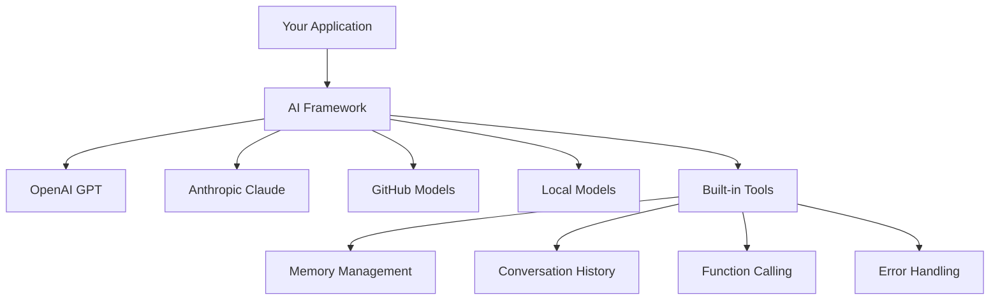
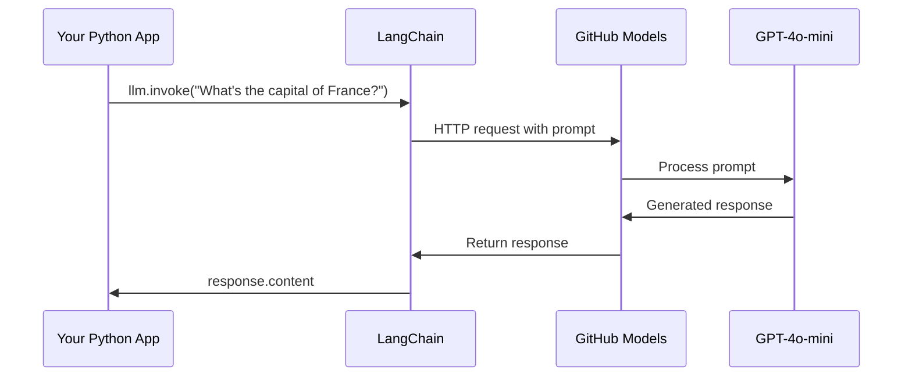
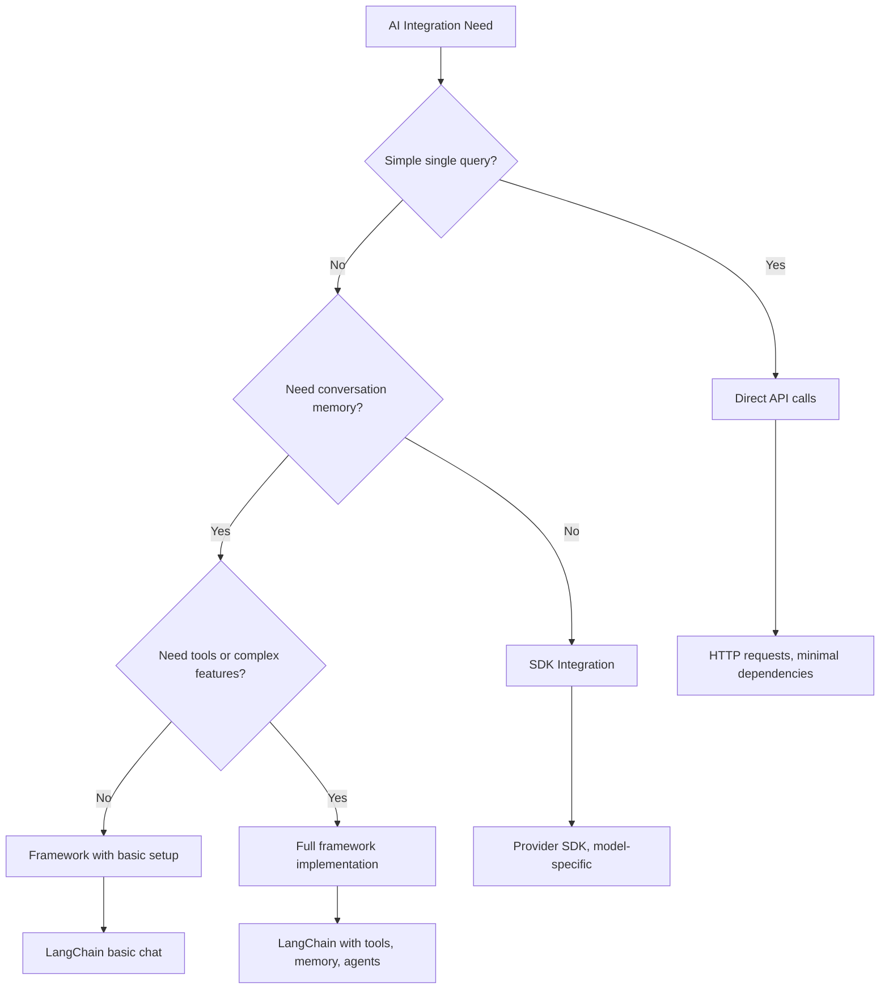

<!--
CO_OP_TRANSLATOR_METADATA:
{
  "original_hash": "e2c4ae5688e34b4b8b09d52aec56c79e",
  "translation_date": "2025-10-23T00:23:33+00:00",
  "source_file": "10-ai-framework-project/README.md",
  "language_code": "fi"
}
-->
# AI-kehys

Oletko koskaan tuntenut olevasi hukassa yrittäessäsi rakentaa tekoälysovelluksia alusta alkaen? Et ole yksin! AI-kehykset ovat kuin monitoimityökalu tekoälykehitykseen – tehokkaita työkaluja, jotka säästävät aikaa ja vaivaa älykkäiden sovellusten rakentamisessa. Ajattele AI-kehystä hyvin organisoituna kirjastona: se tarjoaa valmiiksi rakennettuja komponentteja, standardoituja API-rajapintoja ja älykkäitä abstraktioita, jotta voit keskittyä ongelmien ratkaisemiseen sen sijaan, että kamppailisit toteutuksen yksityiskohtien kanssa.

Tässä oppitunnissa tutkimme, kuinka kehykset, kuten LangChain, voivat muuttaa aiemmin monimutkaiset tekoälyn integrointitehtävät selkeäksi ja helposti luettavaksi koodiksi. Opit ratkaisemaan todellisia haasteita, kuten keskustelujen seuraamista, työkalujen käyttöönottoa ja erilaisten tekoälymallien hallintaa yhden yhtenäisen käyttöliittymän kautta.

Kun oppitunti on ohi, tiedät, milloin kannattaa valita kehykset raakojen API-kutsujen sijaan, kuinka käyttää niiden abstraktioita tehokkaasti ja kuinka rakentaa tekoälysovelluksia, jotka ovat valmiita todelliseen käyttöön. Tutkitaan, mitä AI-kehykset voivat tehdä projekteillesi.

## Miksi valita kehys?

Olet valmis rakentamaan tekoälysovelluksen – mahtavaa! Mutta tässä on juttu: sinulla on useita eri polkuja, joita voit kulkea, ja jokaisella on omat hyvät ja huonot puolensa. Se on vähän kuin valitsisit kävelyn, pyöräilyn tai ajamisen päästäksesi jonnekin – kaikki vievät sinut perille, mutta kokemus (ja vaivannäkö) on täysin erilainen.

Katsotaanpa kolmea pääasiallista tapaa integroida tekoäly projekteihisi:

| Lähestymistapa | Edut | Paras käyttö | Huomioitavaa |
|----------------|------|-------------|--------------|
| **Suorat HTTP-pyynnöt** | Täysi hallinta, ei riippuvuuksia | Yksinkertaiset kyselyt, perusteiden oppiminen | Paljon koodia, manuaalinen virheenkäsittely |
| **SDK-integraatio** | Vähemmän boilerplate-koodia, mallikohtainen optimointi | Yksittäismalliset sovellukset | Rajoittuu tiettyihin tarjoajiin |
| **AI-kehykset** | Yhtenäinen API, sisäänrakennetut abstraktiot | Monimalliset sovellukset, monimutkaiset työnkulut | Oppimiskäyrä, mahdollinen yliabstraktio |

### Kehyksen hyödyt käytännössä



**Miksi kehykset ovat tärkeitä:**
- **Yhdistää** useita tekoälypalveluntarjoajia yhteen käyttöliittymään
- **Käsittelee** keskustelumuistin automaattisesti
- **Tarjoaa** valmiita työkaluja yleisiin tehtäviin, kuten upotuksiin ja funktiokutsuihin
- **Hallinnoi** virheenkäsittelyä ja uudelleenkokeilulogiikkaa
- **Muuttaa** monimutkaiset työnkulut luettaviksi metodikutsuiksi

> 💡 **Vinkki**: Käytä kehyksiä, kun vaihdat eri tekoälymallien välillä tai rakennat monimutkaisia ominaisuuksia, kuten agentteja, muistia tai työkalujen käyttöä. Pysy suorissa API-kutsuissa, kun opettelet perusteita tai rakennat yksinkertaisia, keskittyneitä sovelluksia.

**Yhteenveto**: Kuten valinta erikoistyökalujen ja täydellisen työpajan välillä, kyse on työkalun sovittamisesta tehtävään. Kehykset loistavat monimutkaisissa, ominaisuusrikkaissa sovelluksissa, kun taas suorat API:t toimivat hyvin yksinkertaisissa käyttötapauksissa.

## Johdanto

Tässä oppitunnissa opimme:

- Käyttämään yleistä AI-kehystä.
- Ratkaisemaan yleisiä ongelmia, kuten keskustelut, työkalujen käyttö, muisti ja konteksti.
- Hyödyntämään tätä tekoälysovellusten rakentamiseen.

## Ensimmäinen tekoälykyselysi

Aloitetaan perusteista luomalla ensimmäinen tekoälysovellus, joka lähettää kysymyksen ja saa vastauksen. Kuten Arkhimedes, joka löysi syrjäytymisen periaatteen kylvyssään, joskus yksinkertaisimmat havainnot johtavat voimakkaimpiin oivalluksiin – ja kehykset tekevät nämä oivallukset helposti saavutettaviksi.

### LangChainin käyttöönotto GitHub-mallien kanssa

Käytämme LangChainia yhdistääksemme GitHub-malleihin, mikä on aika siistiä, koska se antaa sinulle ilmaisen pääsyn erilaisiin tekoälymalleihin. Parasta? Tarvitset vain muutaman yksinkertaisen konfiguraatioparametrin aloittaaksesi:

```python
from langchain_openai import ChatOpenAI
import os

llm = ChatOpenAI(
    api_key=os.environ["GITHUB_TOKEN"],
    base_url="https://models.github.ai/inference",
    model="openai/gpt-4o-mini",
)

# Send a simple prompt
response = llm.invoke("What's the capital of France?")
print(response.content)
```

**Mitä tässä tapahtuu:**
- **Luo** LangChain-asiakkaan `ChatOpenAI`-luokan avulla – tämä on porttisi tekoälyyn!
- **Konfiguroi** yhteyden GitHub-malleihin autentikointitunnuksellasi
- **Määrittää** käytettävän tekoälymallin (`gpt-4o-mini`) – ajattele tätä tekoälyavustajasi valintana
- **Lähettää** kysymyksesi `invoke()`-metodin avulla – tässä tapahtuu taikuus
- **Poimii** ja näyttää vastauksen – ja voilà, keskustelet tekoälyn kanssa!

> 🔧 **Asennusvinkki**: Jos käytät GitHub Codespacesia, sinulla on onnea – `GITHUB_TOKEN` on jo asetettu! Työskenteletkö paikallisesti? Ei hätää, sinun tarvitsee vain luoda henkilökohtainen pääsytunnus oikeilla käyttöoikeuksilla.

**Odotettu tulos:**
```text
The capital of France is Paris.
```



## Keskustelevan tekoälyn rakentaminen

Ensimmäinen esimerkki osoittaa perusteet, mutta se on vain yksi vaihto – kysyt kysymyksen, saat vastauksen, ja siinä se. Todellisissa sovelluksissa haluat, että tekoäly muistaa, mistä olette keskustelleet, kuten Watson ja Holmes rakensivat tutkimuskeskustelujaan ajan myötä.

Tässä LangChain on erityisen hyödyllinen. Se tarjoaa erilaisia viestityyppejä, jotka auttavat jäsentämään keskusteluja ja antavat sinulle mahdollisuuden antaa tekoälylle persoonallisuuden. Rakennat keskustelukokemuksia, jotka säilyttävät kontekstin ja luonteen.

### Viestityyppien ymmärtäminen

Ajattele näitä viestityyppejä eri "hattuina", joita keskustelun osallistujat käyttävät. LangChain käyttää erilaisia viestiluokkia pitääkseen kirjaa siitä, kuka sanoo mitä:

| Viestityyppi | Tarkoitus | Esimerkkikäyttö |
|--------------|-----------|-----------------|
| `SystemMessage` | Määrittää tekoälyn persoonallisuuden ja käyttäytymisen | "Olet avulias koodausavustaja" |
| `HumanMessage` | Edustaa käyttäjän syötettä | "Selitä, miten funktiot toimivat" |
| `AIMessage` | Tallentaa tekoälyn vastaukset | Aiemmat tekoälyn vastaukset keskustelussa |

### Ensimmäisen keskustelun luominen

Luodaan keskustelu, jossa tekoäly ottaa tietyn roolin. Annetaan sen esittää kapteeni Picardia – hahmoa, joka tunnetaan diplomaattisesta viisaudestaan ja johtajuudestaan:

```python
messages = [
    SystemMessage(content="You are Captain Picard of the Starship Enterprise"),
    HumanMessage(content="Tell me about you"),
]
```

**Tämän keskustelun asetusten purkaminen:**
- **Määrittää** tekoälyn roolin ja persoonallisuuden `SystemMessage`-viestin kautta
- **Tarjoaa** käyttäjän alkuperäisen kyselyn `HumanMessage`-viestin kautta
- **Luo** perustan monivaiheiselle keskustelulle

Koko koodi tälle esimerkille näyttää tältä:

```python
from langchain_core.messages import HumanMessage, SystemMessage
from langchain_openai import ChatOpenAI
import os

llm = ChatOpenAI(
    api_key=os.environ["GITHUB_TOKEN"],
    base_url="https://models.github.ai/inference",
    model="openai/gpt-4o-mini",
)

messages = [
    SystemMessage(content="You are Captain Picard of the Starship Enterprise"),
    HumanMessage(content="Tell me about you"),
]


# works
response  = llm.invoke(messages)
print(response.content)
```

Näet tuloksen, joka näyttää tältä:

```text
I am Captain Jean-Luc Picard, the commanding officer of the USS Enterprise (NCC-1701-D), a starship in the United Federation of Planets. My primary mission is to explore new worlds, seek out new life and new civilizations, and boldly go where no one has gone before. 

I believe in the importance of diplomacy, reason, and the pursuit of knowledge. My crew is diverse and skilled, and we often face challenges that test our resolve, ethics, and ingenuity. Throughout my career, I have encountered numerous species, grappled with complex moral dilemmas, and have consistently sought peaceful solutions to conflicts.

I hold the ideals of the Federation close to my heart, believing in the importance of cooperation, understanding, and respect for all sentient beings. My experiences have shaped my leadership style, and I strive to be a thoughtful and just captain. How may I assist you further?
```

Keskustelun jatkuvuuden ylläpitämiseksi (sen sijaan, että konteksti nollataan joka kerta), sinun täytyy lisätä vastaukset viestilistaan. Kuten suulliset perinteet, jotka säilyttivät tarinoita sukupolvien ajan, tämä lähestymistapa rakentaa pysyvän muistin:

```python
from langchain_core.messages import HumanMessage, SystemMessage
from langchain_openai import ChatOpenAI
import os

llm = ChatOpenAI(
    api_key=os.environ["GITHUB_TOKEN"],
    base_url="https://models.github.ai/inference",
    model="openai/gpt-4o-mini",
)

messages = [
    SystemMessage(content="You are Captain Picard of the Starship Enterprise"),
    HumanMessage(content="Tell me about you"),
]


# works
response  = llm.invoke(messages)

print(response.content)

print("---- Next ----")

messages.append(response)
messages.append(HumanMessage(content="Now that I know about you, I'm Chris, can I be in your crew?"))

response  = llm.invoke(messages)

print(response.content)

```

Aika siistiä, eikö? Tässä tapahtuu se, että kutsumme LLM:ää kahdesti – ensin vain alkuperäisillä kahdella viestillä, mutta sitten uudelleen koko keskusteluhistorian kanssa. Se on kuin tekoäly todella seuraisi keskusteluamme!

Kun suoritat tämän koodin, saat toisen vastauksen, joka kuulostaa suunnilleen tältä:

```text
Welcome aboard, Chris! It's always a pleasure to meet those who share a passion for exploration and discovery. While I cannot formally offer you a position on the Enterprise right now, I encourage you to pursue your aspirations. We are always in need of talented individuals with diverse skills and backgrounds. 

If you are interested in space exploration, consider education and training in the sciences, engineering, or diplomacy. The values of curiosity, resilience, and teamwork are crucial in Starfleet. Should you ever find yourself on a starship, remember to uphold the principles of the Federation: peace, understanding, and respect for all beings. Your journey can lead you to remarkable adventures, whether in the stars or on the ground. Engage!
```

Otan tuon ehkä-vastauksena ;)

## Vastausten suoratoisto

Oletko koskaan huomannut, kuinka ChatGPT "kirjoittaa" vastauksiaan reaaliajassa? Se on suoratoistoa toiminnassa. Kuten taitavan kalligrafin työskentelyä katsellessa – kun kirjaimet ilmestyvät viiva kerrallaan sen sijaan, että ne materialisoituisivat heti – suoratoisto tekee vuorovaikutuksesta luonnollisemman ja tarjoaa välitöntä palautetta.

### Suoratoiston toteuttaminen LangChainilla

```python
from langchain_openai import ChatOpenAI
import os

llm = ChatOpenAI(
    api_key=os.environ["GITHUB_TOKEN"],
    base_url="https://models.github.ai/inference",
    model="openai/gpt-4o-mini",
    streaming=True
)

# Stream the response
for chunk in llm.stream("Write a short story about a robot learning to code"):
    print(chunk.content, end="", flush=True)
```

**Miksi suoratoisto on mahtavaa:**
- **Näyttää** sisällön sen luomisen aikana – ei enää kiusallista odottelua!
- **Saa** käyttäjät tuntemaan, että jotain tapahtuu
- **Tuntuu** nopeammalta, vaikka teknisesti ei olisikaan
- **Antaa** käyttäjien alkaa lukea, kun tekoäly vielä "ajattelee"

> 💡 **Käyttäjäkokemusvinkki**: Suoratoisto loistaa erityisesti, kun käsittelet pidempiä vastauksia, kuten koodiselityksiä, luovaa kirjoittamista tai yksityiskohtaisia oppaita. Käyttäjäsi rakastavat nähdä edistystä sen sijaan, että tuijottaisivat tyhjää ruutua!

## Kehotemallit

Kehotemallit toimivat kuin retoriset rakenteet klassisessa puhetaidossa – ajattele, kuinka Cicero mukautti puhetyylinsä eri yleisöille säilyttäen saman vakuuttavan rakenteen. Niiden avulla voit luoda uudelleenkäytettäviä kehotteita, joissa voit vaihtaa eri tietoja ilman, että sinun tarvitsee kirjoittaa kaikkea uudelleen. Kun malli on asetettu, täytät vain muuttujat tarvittavilla arvoilla.

### Uudelleenkäytettävien kehotteiden luominen

```python
from langchain_core.prompts import ChatPromptTemplate

# Define a template for code explanations
template = ChatPromptTemplate.from_messages([
    ("system", "You are an expert programming instructor. Explain concepts clearly with examples."),
    ("human", "Explain {concept} in {language} with a practical example for {skill_level} developers")
])

# Use the template with different values
questions = [
    {"concept": "functions", "language": "JavaScript", "skill_level": "beginner"},
    {"concept": "classes", "language": "Python", "skill_level": "intermediate"},
    {"concept": "async/await", "language": "JavaScript", "skill_level": "advanced"}
]

for question in questions:
    prompt = template.format_messages(**question)
    response = llm.invoke(prompt)
    print(f"Topic: {question['concept']}\n{response.content}\n---\n")
```

**Miksi rakastat mallien käyttöä:**
- **Pitää** kehotteesi johdonmukaisina koko sovelluksessa
- **Ei enää** sotkuista merkkijonojen yhdistelyä – vain siistejä, yksinkertaisia muuttujia
- **Tekoälysi** käyttäytyy ennustettavasti, koska rakenne pysyy samana
- **Päivitykset** ovat helppoja – muuta mallia kerran, ja se on korjattu kaikkialla

## Jäsennelty ulostulo

Oletko koskaan turhautunut yrittäessäsi jäsentää tekoälyn vastauksia, jotka palaavat jäsentämättömänä tekstinä? Jäsennelty ulostulo on kuin opettaisit tekoälyä noudattamaan systemaattista lähestymistapaa, kuten Linnaeus käytti biologisessa luokittelussa – järjestelmällistä, ennustettavaa ja helppoa työstää. Voit pyytää JSON-muotoa, tiettyjä tietorakenteita tai mitä tahansa tarvitsemaasi muotoa.

### Ulostulokaavioiden määrittäminen

```python
from langchain_core.prompts import ChatPromptTemplate
from langchain_core.output_parsers import JsonOutputParser
from pydantic import BaseModel, Field

class CodeReview(BaseModel):
    score: int = Field(description="Code quality score from 1-10")
    strengths: list[str] = Field(description="List of code strengths")
    improvements: list[str] = Field(description="List of suggested improvements")
    overall_feedback: str = Field(description="Summary feedback")

# Set up the parser
parser = JsonOutputParser(pydantic_object=CodeReview)

# Create prompt with format instructions
prompt = ChatPromptTemplate.from_messages([
    ("system", "You are a code reviewer. {format_instructions}"),
    ("human", "Review this code: {code}")
])

# Format the prompt with instructions
chain = prompt | llm | parser

# Get structured response
code_sample = """
def calculate_average(numbers):
    return sum(numbers) / len(numbers)
"""

result = chain.invoke({
    "code": code_sample,
    "format_instructions": parser.get_format_instructions()
})

print(f"Score: {result['score']}")
print(f"Strengths: {', '.join(result['strengths'])}")
```

**Miksi jäsennelty ulostulo on mullistava:**
- **Ei enää** arvailua, missä muodossa vastaus tulee – se on aina johdonmukainen
- **Sopii** suoraan tietokantoihisi ja API-rajapintoihisi ilman lisätyötä
- **Havaitsee** oudot tekoälyvastaukset ennen kuin ne rikkovat sovelluksesi
- **Tekee** koodistasi siistimmän, koska tiedät tarkalleen, mitä käsittelet

## Työkalujen käyttö

Nyt pääsemme yhteen tehokkaimmista ominaisuuksista: työkalut. Näin annat tekoälyllesi käytännön kykyjä keskustelun ulkopuolella. Kuten keskiaikaiset killat kehittivät erikoistyökaluja tiettyihin käsityöaloihin, voit varustaa tekoälysi keskittyneillä välineillä. Kuvailet, mitkä työkalut ovat käytettävissä, ja kun joku pyytää jotain vastaavaa, tekoäly voi toimia.

### Pythonin käyttö

Lisätään joitakin työkaluja näin:

```python
from typing_extensions import Annotated, TypedDict

class add(TypedDict):
    """Add two integers."""

    # Annotations must have the type and can optionally include a default value and description (in that order).
    a: Annotated[int, ..., "First integer"]
    b: Annotated[int, ..., "Second integer"]

tools = [add]

functions = {
    "add": lambda a, b: a + b
}
```

Mitä tässä tapahtuu? Luomme työkalulle nimeltä `add` suunnitelman. Perimällä `TypedDict`-luokasta ja käyttämällä hienoja `Annotated`-tyyppejä `a` ja `b`-kentille, annamme LLM:lle selkeän kuvan siitä, mitä tämä työkalu tekee ja mitä se tarvitsee. `functions`-sanakirja on kuin työkalupakkimme – se kertoo koodillemme tarkalleen, mitä tehdä, kun tekoäly päättää käyttää tiettyä työkalua.

Katsotaanpa, kuinka kutsumme LLM:ää tämän työkalun kanssa seuraavaksi:

```python
llm = ChatOpenAI(
    api_key=os.environ["GITHUB_TOKEN"],
    base_url="https://models.github.ai/inference",
    model="openai/gpt-4o-mini",
)

llm_with_tools = llm.bind_tools(tools)
```

Tässä kutsumme `bind_tools`-metodia `tools`-taulukolla, ja näin LLM `llm_with_tools` tuntee tämän työkalun.

Käyttääksemme tätä uutta LLM:ää voimme kirjoittaa seuraavan koodin:

```python
query = "What is 3 + 12?"

res = llm_with_tools.invoke(query)
if(res.tool_calls):
    for tool in res.tool_calls:
        print("TOOL CALL: ", functions[tool["name"]](../../../10-ai-framework-project/**tool["args"]))
print("CONTENT: ",res.content)
```

Kun kutsumme `invoke`-metodia tähän uuteen LLM:ään, jolla on työkaluja, ominaisuus `tool_calls` saattaa täyttyä. Jos näin tapahtuu, tunnistetut työkalut sisältävät `name`- ja `args`-ominaisuudet, jotka tunnistavat, mitä työkalua tulisi käyttää ja millä argumenteilla. Koko koodi näyttää tältä:

```python
from langchain_core.messages import HumanMessage, SystemMessage
from langchain_openai import ChatOpenAI
import os
from typing_extensions import Annotated, TypedDict

class add(TypedDict):
    """Add two integers."""

    # Annotations must have the type and can optionally include a default value and description (in that order).
    a: Annotated[int, ..., "First integer"]
    b: Annotated[int, ..., "Second integer"]

tools = [add]

functions = {
    "add": lambda a, b: a + b
}

llm = ChatOpenAI(
    api_key=os.environ["GITHUB_TOKEN"],
    base_url="https://models.github.ai/inference",
    model="openai/gpt-4o-mini",
)

llm_with_tools = llm.bind_tools(tools)

query = "What is 3 + 12?"

res = llm_with_tools.invoke(query)
if(res.tool_calls):
    for tool in res.tool_calls:
        print("TOOL CALL: ", functions[tool["name"]](../../../10-ai-framework-project/**tool["args"]))
print("CONTENT: ",res.content)
```

Kun suoritat tämän koodin, näet tuloksen, joka näyttää tältä:

```text
TOOL CALL:  15
CONTENT: 
```

Tekoäly tutki "Mikä on 3 + 12" ja tunnisti tämän tehtäväksi `add`-työkalulle. Kuten taitava kirjastonhoitaja tietää, mihin viitteeseen turvautua kysymyksen tyypin perusteella, tekoäly teki tämän päätelmän työkalun nimen, kuvauksen ja kenttämäärittelyjen perusteella. Tulos 15 tulee `functions`-sanakirjastamme, joka suorittaa työkalun:

```python
print("TOOL CALL: ", functions[tool["name"]](../../../10-ai-framework-project/**tool["args"]))
```

### Mielenkiintoisempi työkalu, joka kutsuu verkkosovellusliittymää

Lukujen lisääminen havainnollistaa konseptia, mutta todelliset työkalut suorittavat yleensä monimutkaisempia operaatioita, kuten verkkosovellusliittymien kutsumista. Laajennetaan esimerkkiamme niin, että tekoäly hakee sisältöä internetistä – kuten kuinka lennätinoperaattorit kerran yhdistivät kaukaisia paikkoja:

```python
class joke(TypedDict):
    """Tell a joke."""

    # Annotations must have the type and can optionally include a default value and description (in that order).
    category: Annotated[str, ..., "The joke category"]

def get_joke(category: str) -> str:
    response = requests.get(f"https://api.chucknorris.io/jokes/random?category={category}", headers={"Accept": "application/json"})
    if response.status_code == 200:
        return response.json().get("value", f"Here's a {category} joke!")
    return f"Here's a {category} joke!"

functions = {
    "add": lambda a, b: a + b,
    "joke": lambda category: get_joke(category)
}

query = "Tell me a joke about animals"

# the rest of the code is the same
```

Kun suoritat tämän koodin, saat vastauksen, joka sanoo jotain tällaista:

```text
TOOL CALL:  Chuck Norris once rode a nine foot grizzly bear through an automatic car wash, instead of taking a shower.
CONTENT:  
```

Tässä on koodi kokonaisuudessaan:

```python
from langchain_openai import ChatOpenAI
import requests
import os
from typing_extensions import Annotated, TypedDict

class add(TypedDict):
    """Add two integers."""

    # Annotations must have the type and can optionally include a default value and description (in that order).
    a: Annotated[int, ..., "First integer"]
    b: Annotated[int, ..., "Second integer"]

class joke(TypedDict):
    """Tell a joke."""

    # Annotations must have the type and can optionally include a default value and description (in that order).
    category: Annotated[str, ..., "The joke category"]

tools = [add, joke]

def get_joke(category: str) -> str:
    response = requests.get(f"https://api.chucknorris.io/jokes/random?category={category}", headers={"Accept": "application/json"})
    if response.status_code == 200:
        return response.json().get("value", f"Here's a {category} joke!")
    return f"Here's a {category} joke!"

functions = {
    "add": lambda a, b: a + b,
    "joke": lambda category: get_joke(category)
}

llm = ChatOpenAI(
    api_key=os.environ["GITHUB_TOKEN"],
    base_url="https://models.github.ai/inference",
    model="openai/gpt-4o-mini",
)

llm_with_tools = llm.bind_tools(tools)

query = "Tell me a joke about animals"

res = llm_with_tools.invoke(query)
if(res.tool_calls):
    for tool in res.tool_calls:
        # print("TOOL CALL: ", tool)
        print("TOOL CALL: ", functions[tool["name"]](../../../10-ai-framework-project/**tool["args"]))
print("CONTENT: ",res.content)
```

## Upotukset ja dokumenttien käsittely

Upotukset edustavat yhtä modernin tekoälyn elegantimmista ratkaisuista. Kuvittele, että voisit ottaa minkä tahansa tekstin ja muuttaa sen numeerisiksi koordinaateiksi, jotka vangitsevat sen merkityksen. Juuri näin upotukset toimivat – ne muuntavat tekstin pisteiksi moniulotteisessa avaruudessa, jossa samankaltaiset käsitteet ryhmittyvät yhteen. Se on kuin ideakoordinaatistojärjestelmä, joka muistuttaa, kuinka Mendelejev järjesti jaksollisen järjestelmän atomisten ominaisuuksien mukaan.

### Upotusten luominen ja käyttö

```python
from langchain_openai import OpenAIEmbeddings
from langchain_community.vectorstores import FAISS
from langchain_community.document_loaders import TextLoader
from langchain.text_splitter import CharacterTextSplitter

# Initialize embeddings
embeddings = OpenAIEmbeddings(
    api_key=os.environ["GITHUB_TOKEN"],
    base_url="https://models.github.ai/inference",
    model="text-embedding-3-small"
)

# Load and split documents
loader = TextLoader("documentation.txt")
documents = loader.load()

text_splitter = CharacterTextSplitter(chunk_size=1000, chunk_overlap=0)
texts = text_splitter.split_documents(documents)

# Create vector store
vectorstore = FAISS.from_documents(texts, embeddings)

# Perform similarity search
query = "How do I handle user authentication?"
similar_docs = vectorstore.similarity_search(query, k=3)

for doc in similar_docs:
    print(f"Relevant content: {doc.page_content[:200]}...")
```

### Dokumenttien lataajat eri formaateille

```python
from langchain_community.document_loaders import (
    PyPDFLoader,
    CSVLoader,
    JSONLoader,
    WebBaseLoader
)

# Load different document types
pdf_loader = PyPDFLoader("manual.pdf")
csv_loader = CSVLoader("data.csv")
json_loader = JSONLoader("config.json")
web_loader = WebBaseLoader("https://example.com/docs")

# Process all documents
all_documents = []
for loader in [pdf_loader, csv_loader, json_loader, web_loader]:
    docs = loader.load()
    all_documents.extend(docs)
```

**Mitä voit tehdä upotuksilla:**
- **Rakenna** haku, joka todella ymmärtää, mitä tarkoitat, ei vain avainsanoja
- **Luo** tekoäly, joka voi vastata kysymyksiin dokumenteistasi
- **Tee** suositusjärjestelmiä, jotka ehdottavat todella relevanttia sisältöä
- **Järjestä** ja luokittele sisältösi automaattisesti

## Täydellisen tekoälysovelluksen rakentaminen

Nyt integro
3. **Personoitu oppiminen**: Käytä järjestelmäviestejä mukauttamaan vastauksia eri taitotasoille  
4. **Vastausten muotoilu**: Toteuta rakenteellinen ulostulo visailukysymyksille  

### Toteutusvaiheet  

**Vaihe 1: Ympäristön asennus**  
```bash
pip install langchain langchain-openai
```
  
**Vaihe 2: Perustoiminnallisuus keskustelulle**  
- Luo `StudyAssistant`-luokka  
- Toteuta keskustelumuisti  
- Lisää persoonallisuusasetukset opetustukea varten  

**Vaihe 3: Lisää opetusvälineet**  
- **Koodin selitys**: Jakaa koodin ymmärrettäviin osiin  
- **Visailugeneraattori**: Luo kysymyksiä ohjelmointikonsepteista  
- **Edistymisen seuranta**: Seuraa käsiteltyjä aiheita  

**Vaihe 4: Parannellut ominaisuudet (valinnainen)**  
- Toteuta suoratoistovastaukset paremman käyttäjäkokemuksen takaamiseksi  
- Lisää dokumenttien lataus kurssimateriaalien sisällyttämiseksi  
- Luo upotuksia sisältöjen samankaltaisuuteen perustuvaa hakua varten  

### Arviointikriteerit  

| Ominaisuus | Erinomainen (4) | Hyvä (3) | Tyydyttävä (2) | Parannettavaa (1) |  
|------------|-----------------|----------|----------------|-------------------|  
| **Keskustelun kulku** | Luonnolliset, kontekstitietoiset vastaukset | Hyvä kontekstin säilyttäminen | Peruskeskustelu | Ei muistia vaihdoista |  
| **Työkalujen integrointi** | Useita hyödyllisiä työkaluja toimivat saumattomasti | 2+ työkalua toteutettu oikein | 1-2 perustyökalua | Työkalut eivät toimi |  
| **Koodin laatu** | Siisti, hyvin dokumentoitu, virheenkäsittely | Hyvä rakenne, jonkin verran dokumentointia | Perustoiminnallisuus toimii | Huono rakenne, ei virheenkäsittelyä |  
| **Opetuksellinen arvo** | Todella hyödyllinen oppimiseen, mukautuva | Hyvä oppimistuki | Perusselitykset | Rajoitettu opetuksellinen hyöty |  

### Esimerkkikoodirakenne  

```python
class StudyAssistant:
    def __init__(self, skill_level="beginner"):
        # Initialize LLM, tools, and conversation memory
        pass
    
    def explain_code(self, code, language):
        # Tool: Explain how code works
        pass
    
    def generate_quiz(self, topic, difficulty):
        # Tool: Create practice questions
        pass
    
    def chat(self, user_input):
        # Main conversation interface
        pass

# Example usage
assistant = StudyAssistant(skill_level="intermediate")
response = assistant.chat("Explain how Python functions work")
```
  
**Bonushaasteet:**  
- Lisää ääni sisään/ulos -ominaisuudet  
- Toteuta verkkokäyttöliittymä Streamlitin tai Flaskin avulla  
- Luo tietopohja kurssimateriaaleista upotusten avulla  
- Lisää edistymisen seuranta ja personoidut oppimispolut  

## Yhteenveto  

🎉 Olet nyt hallinnut AI-kehyskehityksen perusteet ja oppinut rakentamaan kehittyneitä AI-sovelluksia LangChainin avulla. Kuten kattavan oppisopimuskoulutuksen suorittanut, olet hankkinut merkittävän työkalupakin taitoja. Katsotaanpa, mitä olet saavuttanut.  

### Mitä olet oppinut  

**Kehyksen peruskäsitteet:**  
- **Kehyksen edut**: Ymmärrys siitä, milloin valita kehykset suoran API-kutsun sijaan  
- **LangChainin perusteet**: AI-malliyhteyksien asennus ja konfigurointi  
- **Viestityypit**: `SystemMessage`, `HumanMessage` ja `AIMessage` rakenteellisiin keskusteluihin  

**Kehittyneet ominaisuudet:**  
- **Työkalujen kutsuminen**: Mukautettujen työkalujen luominen ja integrointi AI:n kykyjen parantamiseksi  
- **Keskustelumuisti**: Kontekstin säilyttäminen useiden keskustelukierrosten ajan  
- **Suoratoistovastaukset**: Reaaliaikaisen vastaustoimituksen toteuttaminen  
- **Kehotemallit**: Uudelleenkäytettävien, dynaamisten kehotteiden rakentaminen  
- **Rakenteellinen ulostulo**: Johdonmukaisten, jäsennettävien AI-vastausten varmistaminen  
- **Upotukset**: Semanttisen haun ja dokumenttien käsittelyominaisuuksien luominen  

**Käytännön sovellukset:**  
- **Täydellisten sovellusten rakentaminen**: Useiden ominaisuuksien yhdistäminen tuotantovalmiisiin sovelluksiin  
- **Virheenkäsittely**: Vankan virheiden hallinnan ja validoinnin toteuttaminen  
- **Työkalujen integrointi**: Mukautettujen työkalujen luominen AI:n kykyjen laajentamiseksi  

### Keskeiset opit  

> 🎯 **Muista**: AI-kehykset, kuten LangChain, ovat käytännössä monimutkaisuutta piilottavia, ominaisuuksilla täytettyjä parhaita ystäviäsi. Ne ovat täydellisiä, kun tarvitset keskustelumuistia, työkalujen kutsumista tai haluat työskennellä useiden AI-mallien kanssa menettämättä järkeäsi.  

**Päätöksentekokehys AI-integraatiolle:**  


  
### Mihin tästä eteenpäin?  

**Aloita rakentaminen heti:**  
- Hyödynnä näitä käsitteitä ja rakenna jotain, mikä innostaa SINUA!  
- Kokeile erilaisia AI-malleja LangChainin avulla - se on kuin AI-mallien leikkikenttä  
- Luo työkaluja, jotka ratkaisevat todellisia ongelmia työssäsi tai projekteissasi  

**Valmis seuraavalle tasolle?**  
- **AI-agentit**: Rakenna AI-järjestelmiä, jotka voivat suunnitella ja toteuttaa monimutkaisia tehtäviä itsenäisesti  
- **RAG (Retrieval-Augmented Generation)**: Yhdistä AI omiin tietopohjiisi supertehokkaiden sovellusten luomiseksi  
- **Monimodaalinen AI**: Työskentele tekstin, kuvien ja äänen kanssa yhdessä - mahdollisuudet ovat rajattomat!  
- **Tuotantokäyttöön ottaminen**: Opi skaalaamaan AI-sovelluksesi ja seuraamaan niitä tosielämässä  

**Liity yhteisöön:**  
- LangChain-yhteisö on loistava pysyäksesi ajan tasalla ja oppiaksesi parhaita käytäntöjä  
- GitHub Models tarjoaa pääsyn huippuluokan AI-ominaisuuksiin - täydellinen kokeiluun  
- Jatka harjoittelua eri käyttötapauksilla - jokainen projekti opettaa sinulle jotain uutta  

Nyt sinulla on tiedot rakentaa älykkäitä, keskustelukykyisiä sovelluksia, jotka voivat auttaa ihmisiä ratkaisemaan todellisia ongelmia. Kuten renessanssin käsityöläiset, jotka yhdistivät taiteellisen vision tekniseen taitoon, voit nyt yhdistää AI-kyvyt käytännön sovelluksiin. Kysymys kuuluu: mitä sinä luot? 🚀  

## GitHub Copilot Agent -haaste 🚀  

Käytä Agent-tilaa suorittaaksesi seuraavan haasteen:  

**Kuvaus:** Rakenna kehittynyt AI-pohjainen koodin tarkistusassistentti, joka yhdistää useita LangChain-ominaisuuksia, mukaan lukien työkalujen kutsuminen, rakenteellinen ulostulo ja keskustelumuisti, tarjotakseen kattavaa palautetta koodin lähetyksistä.  

**Kehote:** Luo CodeReviewAssistant-luokka, joka toteuttaa:  
1. Työkalu koodin monimutkaisuuden analysointiin ja parannusehdotusten antamiseen  
2. Työkalu koodin tarkistamiseen parhaita käytäntöjä vastaan  
3. Rakenteellinen ulostulo Pydantic-mallien avulla johdonmukaisen tarkistusmuodon varmistamiseksi  
4. Keskustelumuisti tarkistussessioiden seuraamiseksi  
5. Pääasiallinen keskustelukäyttöliittymä, joka voi käsitellä koodin lähetyksiä ja tarjota yksityiskohtaista, toimivaa palautetta  

Assistentin tulisi pystyä tarkistamaan koodia useilla ohjelmointikielillä, säilyttämään konteksti useiden koodilähetysten välillä samassa sessiossa ja tarjoamaan sekä yhteenvetopisteitä että yksityiskohtaisia parannusehdotuksia.  

Lisätietoja [agent mode](https://code.visualstudio.com/blogs/2025/02/24/introducing-copilot-agent-mode) täällä.  

---

**Vastuuvapauslauseke**:  
Tämä asiakirja on käännetty käyttämällä tekoälypohjaista käännöspalvelua [Co-op Translator](https://github.com/Azure/co-op-translator). Vaikka pyrimme tarkkuuteen, huomioithan, että automaattiset käännökset voivat sisältää virheitä tai epätarkkuuksia. Alkuperäinen asiakirja sen alkuperäisellä kielellä tulisi pitää ensisijaisena lähteenä. Kriittisen tiedon osalta suositellaan ammattimaista ihmiskäännöstä. Emme ole vastuussa väärinkäsityksistä tai virhetulkinnoista, jotka johtuvat tämän käännöksen käytöstä.