<!--
CO_OP_TRANSLATOR_METADATA:
{
  "original_hash": "672b0bb6e8b431075f3bdb7130590d2d",
  "translation_date": "2025-11-04T01:09:51+00:00",
  "source_file": "2-js-basics/1-data-types/README.md",
  "language_code": "fi"
}
-->
# JavaScriptin perusteet: Tietotyypit


> Sketchnote: [Tomomi Imura](https://twitter.com/girlie_mac)

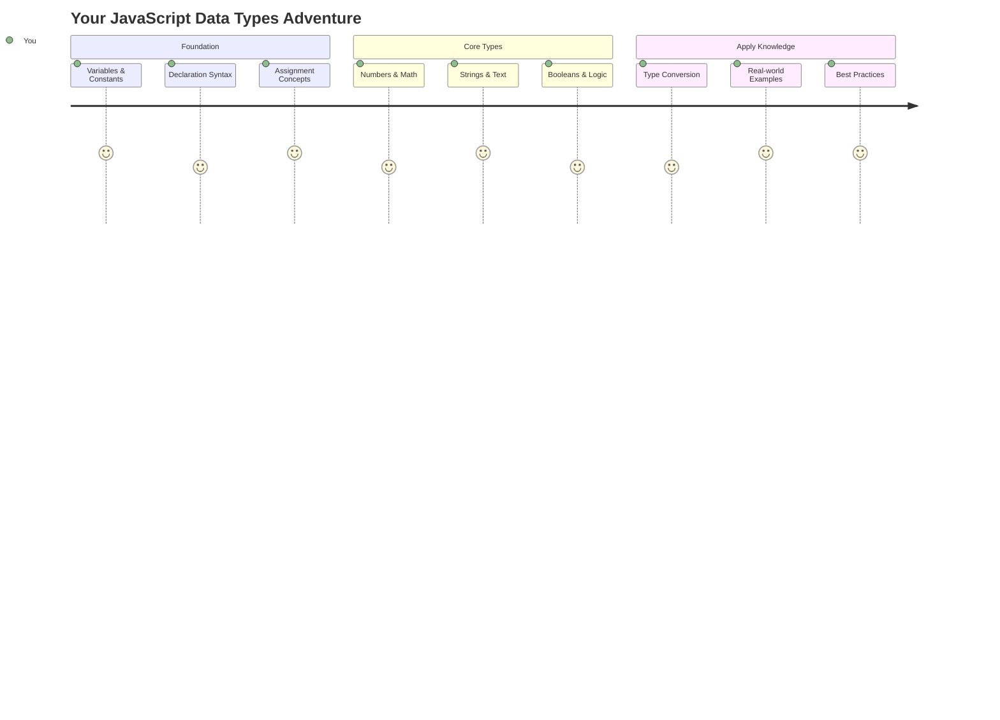

Tietotyypit ovat yksi JavaScriptin peruskäsitteistä, joita kohtaat jokaisessa kirjoittamassasi ohjelmassa. Ajattele tietotyyppejä kuin muinaisten Aleksandrian kirjastonhoitajien käyttämää arkistointijärjestelmää – heillä oli omat paikkansa runoudelle, matematiikalle ja historiallisille asiakirjoille. JavaScript järjestää tietoa samalla tavalla eri kategorioihin eri tyyppisille datalle.

Tässä oppitunnissa tutustumme JavaScriptin toiminnan ydinosa-alueisiin eli tietotyyppeihin. Opit käsittelemään numeroita, tekstiä, tosi/epätosi-arvoja ja ymmärrät, miksi oikean tyypin valinta on tärkeää ohjelmiesi kannalta. Nämä käsitteet saattavat aluksi tuntua abstrakteilta, mutta harjoittelun myötä ne muuttuvat luonnollisiksi.

Tietotyyppien ymmärtäminen tekee kaikesta muusta JavaScriptissä paljon selkeämpää. Aivan kuten arkkitehtien täytyy ymmärtää eri rakennusmateriaalit ennen katedraalin rakentamista, nämä perusteet tukevat kaikkea, mitä rakennat jatkossa.

## Ennakkokysely
[Ennakkokysely](https://ff-quizzes.netlify.app/web/)

Tämä oppitunti kattaa JavaScriptin perusteet, kielen, joka tuo interaktiivisuutta verkkoon.

> Voit käydä tämän oppitunnin [Microsoft Learnissa](https://docs.microsoft.com/learn/modules/web-development-101-variables/?WT.mc_id=academic-77807-sagibbon)!

[](https://youtube.com/watch?v=JNIXfGiDWM8 "Muuttujat JavaScriptissä")

[](https://youtube.com/watch?v=AWfA95eLdq8 "Tietotyypit JavaScriptissä")

> 🎥 Klikkaa yllä olevia kuvia nähdäksesi videoita muuttujista ja tietotyypeistä

Aloitetaan muuttujista ja tietotyypeistä, jotka täyttävät ne!

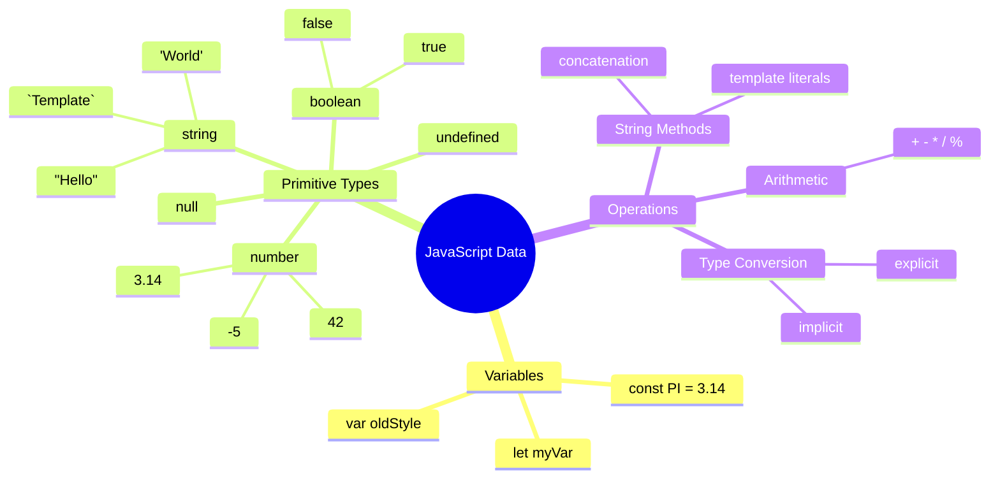

## Muuttujat

Muuttujat ovat ohjelmoinnin perusrakennuspalikoita. Kuten keskiaikaiset alkemistit käyttivät nimikoituja purkkeja eri aineiden säilyttämiseen, muuttujat antavat sinun tallentaa tietoa ja antaa sille kuvaavan nimen, jotta voit viitata siihen myöhemmin. Tarvitsetko jonkun iän muistamista? Tallenna se muuttujaan nimeltä `age`. Haluatko seurata käyttäjän nimeä? Säilytä se muuttujassa nimeltä `userName`.

Keskitymme moderniin tapaan luoda muuttujia JavaScriptissä. Tekniikat, joita opit täällä, edustavat vuosien kielen kehitystä ja ohjelmointiyhteisön parhaita käytäntöjä.

Muuttujan luominen ja **määrittäminen** tapahtuu seuraavalla syntaksilla **[avainsana] [nimi]**. Se koostuu kahdesta osasta:

- **Avainsana**. Käytä `let` muuttujille, jotka voivat muuttua, tai `const` arvoille, jotka pysyvät samoina.
- **Muuttujan nimi**, tämä on kuvaava nimi, jonka valitset itse.

✅ Avainsana `let` esiteltiin ES6:ssa ja antaa muuttujallesi niin sanotun _lohkon scope_:n. Suositellaan käyttämään `let` tai `const` vanhemman `var`-avainsanan sijaan. Käsittelemme lohkon scope:a tarkemmin myöhemmissä osissa.

### Tehtävä - työskentely muuttujien kanssa

1. **Määritä muuttuja**. Aloitetaan luomalla ensimmäinen muuttujamme:

    ```javascript
    let myVariable;
    ```

   **Mitä tämä tekee:**
   - Tämä kertoo JavaScriptille, että luodaan tallennuspaikka nimeltä `myVariable`
   - JavaScript varaa muistista tilaa tälle muuttujalle
   - Muuttujalla ei tällä hetkellä ole arvoa (undefined)

2. **Anna sille arvo**. Nyt laitetaan jotain muuttujaan:

    ```javascript
    myVariable = 123;
    ```

   **Kuinka arvon asettaminen toimii:**
   - `=`-operaattori asettaa arvon 123 muuttujalle
   - Muuttuja sisältää nyt tämän arvon sen sijaan, että se olisi määrittelemätön
   - Voit viitata tähän arvoon koodissasi käyttämällä `myVariable`

   > Huom: `=` tässä oppitunnissa tarkoittaa "asetusoperaattoria", jota käytetään arvon asettamiseen muuttujalle. Se ei tarkoita yhtäsuuruutta.

3. **Tee se fiksusti**. Itse asiassa yhdistetään nämä kaksi vaihetta:

    ```javascript
    let myVariable = 123;
    ```

    **Tämä tapa on tehokkaampi:**
    - Määrität muuttujan ja asetat arvon yhdellä lauseella
    - Tämä on kehittäjien yleinen käytäntö
    - Se lyhentää koodia säilyttäen selkeyden

4. **Muuta mielesi**. Entä jos haluamme tallentaa eri numeron?

   ```javascript
   myVariable = 321;
   ```

   **Ymmärrä uudelleenmäärittely:**
   - Muuttuja sisältää nyt arvon 321 sen sijaan, että se olisi 123
   - Edellinen arvo korvataan – muuttujat tallentavat vain yhden arvon kerrallaan
   - Tämä muokattavuus on avainominaisuus muuttujille, jotka on määritelty `let`-avainsanalla

   ✅ Kokeile! Voit kirjoittaa JavaScriptiä suoraan selaimessasi. Avaa selainikkuna ja siirry kehittäjätyökaluihin. Konsolissa löydät kehotteen; kirjoita `let myVariable = 123`, paina enteriä, ja kirjoita sitten `myVariable`. Mitä tapahtuu? Huomaa, että opit lisää näistä käsitteistä seuraavissa oppitunneissa.

### 🧠 **Muuttujien hallinnan tarkistus: Mukavuuden saavuttaminen**

**Katsotaan, kuinka hyvin ymmärrät muuttujat:**
- Voitko selittää eron muuttujan määrittämisen ja arvon asettamisen välillä?
- Mitä tapahtuu, jos yrität käyttää muuttujaa ennen sen määrittämistä?
- Milloin valitsisit `let`-avainsanan `const`-avainsanan sijaan muuttujalle?

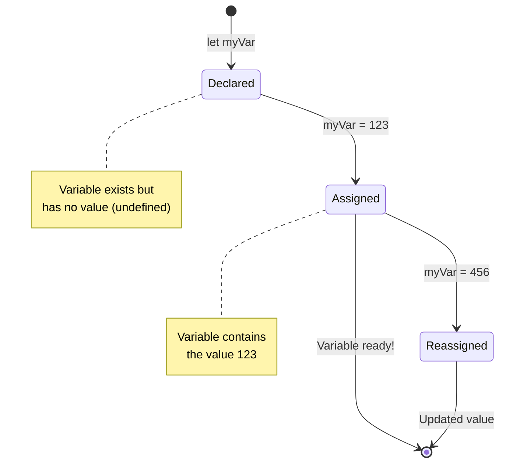

> **Pikavinkki**: Ajattele muuttujia nimikoituina säilytyslaatikoina. Luot laatikon (`let`), laitat siihen jotain (`=`), ja voit myöhemmin korvata sisällön tarvittaessa!

## Vakiot

Joskus sinun täytyy tallentaa tietoa, joka ei saa muuttua ohjelman suorituksen aikana. Ajattele vakioita kuin matemaattisia periaatteita, jotka Eukleides määritti muinaisessa Kreikassa – kerran todistettuina ja dokumentoituina ne pysyivät muuttumattomina tulevaisuudessa.

Vakiot toimivat samalla tavalla kuin muuttujat, mutta tärkeällä rajoituksella: kun niiden arvo on asetettu, sitä ei voi muuttaa. Tämä muuttumattomuus auttaa estämään kriittisten arvojen tahattomia muutoksia ohjelmassasi.

Vakion määrittäminen ja alustaminen noudattaa samoja periaatteita kuin muuttujan, mutta `const`-avainsanalla. Vakiot määritetään yleensä kokonaan isoilla kirjaimilla.

```javascript
const MY_VARIABLE = 123;
```

**Mitä tämä koodi tekee:**
- **Luo** vakion nimeltä `MY_VARIABLE` arvolla 123
- **Käyttää** isojen kirjainten nimeämiskäytäntöä vakioille
- **Estää** tulevat muutokset tähän arvoon

Vakioilla on kaksi pääsääntöä:

- **Sinun täytyy antaa niille arvo heti** – tyhjiä vakioita ei sallita!
- **Et voi koskaan muuttaa sitä arvoa** – JavaScript heittää virheen, jos yrität. Katsotaan, mitä tarkoitan:

   **Yksinkertainen arvo** - Seuraava EI ole sallittua:
   
      ```javascript
      const PI = 3;
      PI = 4; // ei sallittu
      ```

   **Mitä sinun täytyy muistaa:**
   - **Yritykset** määrittää vakio uudelleen aiheuttavat virheen
   - **Suojaa** tärkeät arvot tahattomilta muutoksilta
   - **Varmistaa**, että arvo pysyy johdonmukaisena ohjelman aikana
 
   **Objektiviittaus on suojattu** - Seuraava EI ole sallittua:
   
      ```javascript
      const obj = { a: 3 };
      obj = { b: 5 } // ei sallittu
      ```

   **Näiden käsitteiden ymmärtäminen:**
   - **Estää** koko objektin korvaamisen uudella
   - **Suojaa** alkuperäisen objektin viittauksen
   - **Säilyttää** objektin identiteetin muistissa

    **Objektin arvo ei ole suojattu** - Seuraava ON sallittua:
    
      ```javascript
      const obj = { a: 3 };
      obj.a = 5;  // sallittu
      ```

      **Mitä tässä tapahtuu:**
      - **Muokkaa** objektin sisällä olevan ominaisuuden arvoa
      - **Säilyttää** saman objektiviittauksen
      - **Osoittaa**, että objektin sisältö voi muuttua, vaikka viittaus pysyy vakiona

   > Huomaa, että `const` tarkoittaa, että viittaus on suojattu uudelleenmäärittelyltä. Arvo ei kuitenkaan ole _muuttumaton_ ja voi muuttua, erityisesti jos kyseessä on monimutkainen rakenne, kuten objekti.

## Tietotyypit

JavaScript järjestää tiedon eri kategorioihin, joita kutsutaan tietotyypeiksi. Tämä käsite muistuttaa, kuinka muinaiset oppineet luokittelivat tietoa – Aristoteles erotti eri päättelytyypit, tietäen, että loogisia periaatteita ei voitu soveltaa yhtenäisesti runouteen, matematiikkaan ja luonnonfilosofiaan.

Tietotyypeillä on merkitystä, koska eri operaatiot toimivat eri tyyppisen tiedon kanssa. Aivan kuten et voi suorittaa laskutoimituksia henkilön nimellä tai aakkostaa matemaattista yhtälöä, JavaScript vaatii sopivan tietotyypin kutakin operaatiota varten. Tämän ymmärtäminen estää virheitä ja tekee koodistasi luotettavampaa.

Muuttujat voivat tallentaa monenlaisia arvoja, kuten numeroita ja tekstiä. Näitä erilaisia arvoja kutsutaan **tietotyypeiksi**. Tietotyypit ovat tärkeä osa ohjelmistokehitystä, koska ne auttavat kehittäjiä tekemään päätöksiä siitä, miten koodi tulisi kirjoittaa ja miten ohjelmisto toimii. Lisäksi joillakin tietotyypeillä on ainutlaatuisia ominaisuuksia, jotka auttavat muuntamaan tai poimimaan lisätietoa arvosta.

✅ Tietotyyppejä kutsutaan myös JavaScriptin datan primitiiveiksi, koska ne ovat kielen tarjoamia matalimman tason tietotyyppejä. Primitiivejä on seitsemän: string, number, bigint, boolean, undefined, null ja symbol. Käytä hetki visualisoidaksesi, mitä kukin näistä primitiiveistä voisi edustaa. Mikä on `zebra`? Entä `0`? `true`?

### Numerot

Numerot ovat JavaScriptin yksinkertaisin tietotyyppi. Olipa kyseessä kokonaisluvut kuten 42, desimaalit kuten 3.14 tai negatiiviset luvut kuten -5, JavaScript käsittelee niitä yhtenäisesti.

Muistatko aiemman muuttujamme? Tuo 123, jonka tallensimme, oli itse asiassa numerotietotyyppi:

```javascript
let myVariable = 123;
```

**Keskeiset ominaisuudet:**
- JavaScript tunnistaa automaattisesti numeeriset arvot
- Voit suorittaa matemaattisia operaatioita näillä muuttujilla
- Ei vaadi eksplisiittistä tyypin määrittelyä

Muuttujat voivat tallentaa kaikenlaisia numeroita, mukaan lukien desimaaleja tai negatiivisia lukuja. Numeroita voidaan myös käyttää aritmeettisten operaattoreiden kanssa, joita käsitellään [seuraavassa osiossa](../../../../2-js-basics/1-data-types).

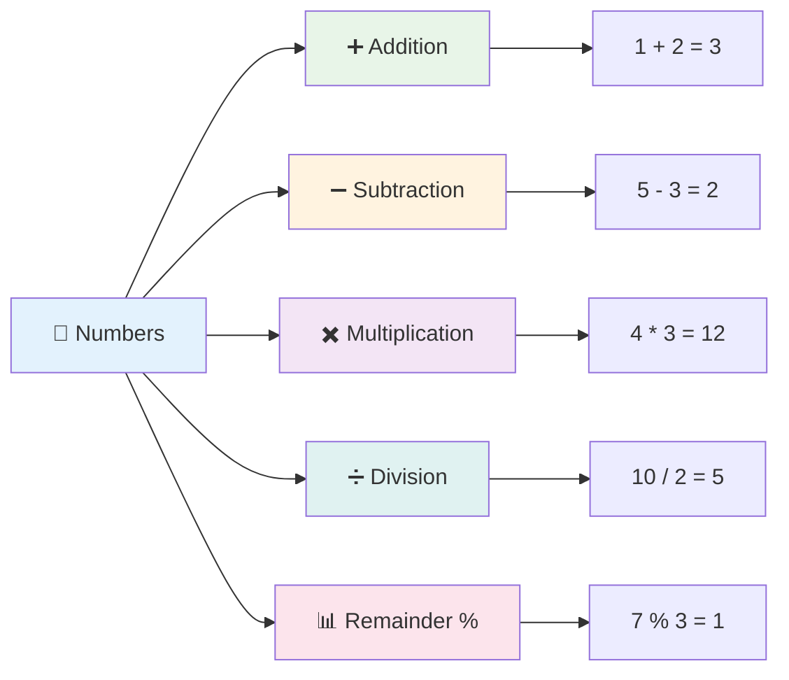

### Aritmeettiset operaattorit

Aritmeettiset operaattorit mahdollistavat matemaattisten laskutoimitusten tekemisen JavaScriptissä. Nämä operaattorit noudattavat samoja periaatteita, joita matemaatikot ovat käyttäneet vuosisatojen ajan – samoja symboleja, jotka esiintyivät oppineiden kuten Al-Khwarizmin teoksissa, jotka kehittivät algebrallista merkintätapaa.

Operaattorit toimivat kuten perinteisessä matematiikassa: plus yhteenlaskuun, miinus vähennykseen ja niin edelleen.

Aritmeettisia toimintoja suoritettaessa on käytettävissä useita operaattoreita, joista osa on lueteltu tässä:

| Symboli | Kuvaus                                                                 | Esimerkki                        |
| ------ | ---------------------------------------------------------------------- | -------------------------------- |
| `+`    | **Yhteenlasku**: Laskee kahden numeron summan                          | `1 + 2 //odotettu vastaus on 3`   |
| `-`    | **Vähennys**: Laskee kahden numeron erotuksen                          | `1 - 2 //odotettu vastaus on -1`  |
| `*`    | **Kertolasku**: Laskee kahden numeron tulon                            | `1 * 2 //odotettu vastaus on 2`   |
| `/`    | **Jakolasku**: Laskee kahden numeron osamäärän                         | `1 / 2 //odotettu vastaus on 0.5` |
| `%`    | **Jakojäännös**: Laskee kahden numeron jaon jakojäännöksen             | `1 % 2 //odotettu vastaus on 1`   |

✅ Kokeile! Kokeile aritmeettista operaatiota selaimesi konsolissa. Yllättävätkö tulokset sinut?

### 🧮 **Matematiikkataitojen tarkistus: Laskeminen luottavaisesti**

**Testaa aritmeettista ymmärrystäsi:**
- Mikä ero on `/` (jakolasku) ja `%` (jakojäännös) välillä?
- Osaatko ennustaa, mitä `10 % 3` on? (Vihje: se ei ole 3.33...)
- Miksi jakojäännösoperaattori voisi olla hyödyllinen ohjelmoinnissa?

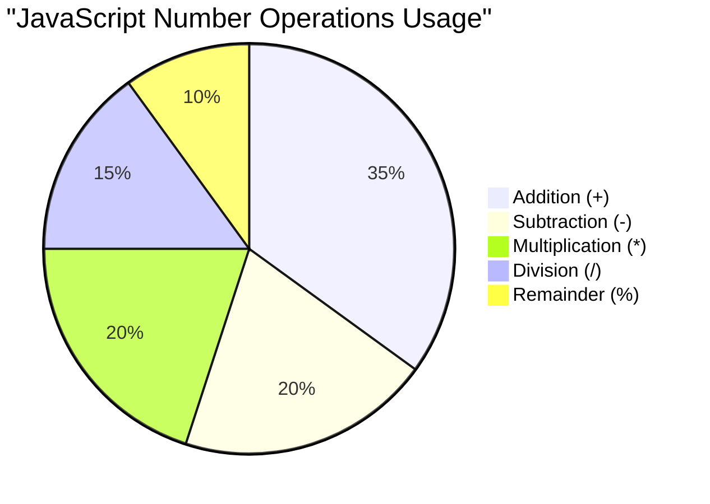

> **Käytännön vinkki**: Jakojäännösoperaattori (%) on erittäin hyödyllinen tarkistettaessa, ovatko numerot parillisia/parittomia, luotaessa kuvioita tai kiertäessä taulukoita!

### Merkkijonot

JavaScriptissä tekstuaalinen data esitetään merkkijonoina. Termi "merkkijono" tulee käsitteestä, jossa merkkejä yhdistetään peräkkäin, aivan kuten keskiaikaiset kirjurit yhdistivät kirjaimia muodostaakseen sanoja ja lauseita käsikirjoituksissaan.

Merkkijonot ovat keskeisiä verkkokehityksessä. Jokainen verkkosivustolla näkyvä tekstinpätkä – käyttäjänimet, painikkeiden tekstit, virheilmoitukset, sisältö – käsitellään merkkijonodatana. Merkkijonojen ymmärtäminen on olennaista toimivien käyttöliittymien luomisessa.

Merkkijonot ovat merkkejä, jotka sijaitsevat yksinkertaisten tai kaksinkertaisten lainausmerkkien välissä.

```javascript
'This is a string'
"This is also a string"
let myString = 'This is a string value stored in a variable';
```

**Näiden käsitteiden ymmärtäminen:**
- **Käyttää** joko yksinkertaisia `'` tai kaksinkertaisia `"` lainausmerkkejä merkkijonojen määrittämiseen
- **Tallettaa** tekstidataa, joka voi sisältää kirjaimia, numeroita ja symboleja
- **Asettaa** merkkijonoarvoja muuttujille myöhempää käyttöä varten
- **Vaatii** lainausmerkit erottamaan tekstin muuttujien nimistä

Muista käyttää lainausmerkkejä kirjoittaessasi merkkijonoa, muuten JavaScript olettaa sen olevan muuttujan nimi.

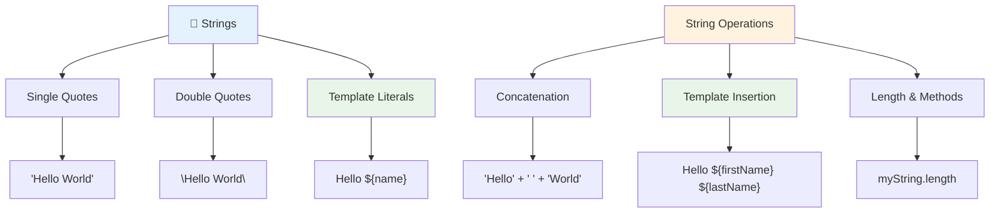

### Merkkijonojen muotoilu

Merkkijonojen käsittely mahdollistaa tekstielementtien yhdistämisen, muuttujien sisällyttämisen ja dynaamisen sisällön luomisen, joka reag
Kahden tai useamman merkkijonon **yhdistämiseen** tai niiden liittämiseen yhteen käytä `+`-operaattoria.

```javascript
let myString1 = "Hello";
let myString2 = "World";

myString1 + myString2 + "!"; //HelloWorld!
myString1 + " " + myString2 + "!"; //Hello World!
myString1 + ", " + myString2 + "!"; //Hello, World!
```

**Vaihe vaiheelta, tässä tapahtuu:**
- **Yhdistää** useita merkkijonoja käyttäen `+`-operaattoria
- **Liittää** merkkijonot suoraan yhteen ilman välilyöntejä ensimmäisessä esimerkissä
- **Lisää** välilyöntejä `" "` merkkijonojen väliin luettavuuden parantamiseksi
- **Lisää** välimerkkejä, kuten pilkkuja, oikean muotoilun luomiseksi

✅ Miksi `1 + 1 = 2` JavaScriptissä, mutta `'1' + '1' = 11`? Mieti asiaa. Entä `'1' + 1`?

**Template literals** ovat toinen tapa muotoilla merkkijonoja, mutta lainausmerkkien sijaan käytetään backtick-merkkiä. Kaikki, mikä ei ole pelkkää tekstiä, tulee sijoittaa paikkamerkkien `${ }` sisään. Tämä koskee myös muuttujia, jotka voivat olla merkkijonoja.

```javascript
let myString1 = "Hello";
let myString2 = "World";

`${myString1} ${myString2}!` //Hello World!
`${myString1}, ${myString2}!` //Hello, World!
```

**Ymmärretään jokainen osa:**
- **Käyttää** backtick-merkkejä `` ` `` tavallisten lainausmerkkien sijaan template literalien luomiseen
- **Upottaa** muuttujat suoraan `${}`-paikkamerkkien avulla
- **Säilyttää** välilyönnit ja muotoilun juuri sellaisena kuin ne on kirjoitettu
- **Tarjoaa** siistimmän tavan luoda monimutkaisia merkkijonoja muuttujien kanssa

Voit saavuttaa muotoilutavoitteesi kummalla tahansa menetelmällä, mutta template literalit kunnioittavat kaikkia välilyöntejä ja rivinvaihtoja.

✅ Milloin käyttäisit template literalia tavallisen merkkijonon sijaan?

### 🔤 **Merkkijonojen hallinnan tarkistus: Tekstin käsittelyn varmuus**

**Arvioi merkkijonotaitosi:**
- Voitko selittää, miksi `'1' + '1'` on `'11'` eikä `2`?
- Kumpi merkkijonomenetelmä on mielestäsi luettavampi: yhdistäminen vai template literalit?
- Mitä tapahtuu, jos unohdat lainausmerkit merkkijonon ympäriltä?

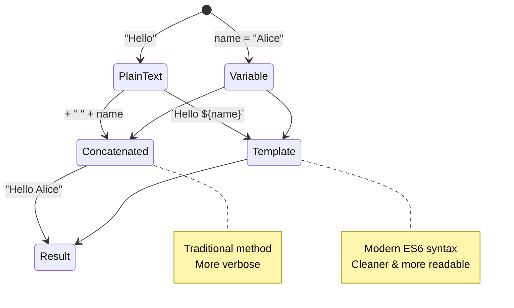

> **Vinkki**: Template literalit ovat yleensä suositeltavia monimutkaisten merkkijonojen rakentamiseen, koska ne ovat luettavampia ja käsittelevät monirivisiä merkkijonoja kauniisti!

### Booleanit

Booleanit edustavat yksinkertaisinta datamuotoa: ne voivat sisältää vain yhden kahdesta arvosta – `true` tai `false`. Tämä binäärilogiikkajärjestelmä juontaa juurensa George Boolen, 1800-luvun matemaatikon, työhön, joka kehitti Boolean-algebran.

Yksinkertaisuudestaan huolimatta booleanit ovat välttämättömiä ohjelmalogiikassa. Ne mahdollistavat koodisi tekemään päätöksiä ehtojen perusteella – onko käyttäjä kirjautunut sisään, onko painiketta klikattu tai täyttyvätkö tietyt kriteerit.

Booleanit voivat olla vain kaksi arvoa: `true` tai `false`. Booleanit auttavat päättämään, mitkä koodirivit suoritetaan, kun tietyt ehdot täyttyvät. Monissa tapauksissa [operaattorit](../../../../2-js-basics/1-data-types) auttavat boolean-arvon asettamisessa, ja usein huomaat muuttujien alustamisen tai niiden arvojen päivittämisen operaattorin avulla.

```javascript
let myTrueBool = true;
let myFalseBool = false;
```

**Yllä olevassa olemme:**
- **Luoneet** muuttujan, joka tallentaa boolean-arvon `true`
- **Näyttäneet**, miten tallennetaan boolean-arvo `false`
- **Käyttäneet** tarkalleen avainsanoja `true` ja `false` (ei lainausmerkkejä)
- **Valmistelleet** nämä muuttujat käytettäväksi ehtolauseissa

✅ Muuttujaa voidaan pitää 'truthy'-arvoisena, jos se arvioituu boolean-arvoksi `true`. Mielenkiintoista on, että JavaScriptissä [kaikki arvot ovat truthy, ellei niitä ole määritelty falsyksi](https://developer.mozilla.org/docs/Glossary/Truthy).

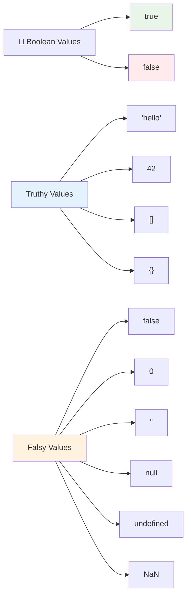

### 🎯 **Boolean-logiikan tarkistus: Päätöksentekotaidot**

**Testaa boolean-ymmärrystäsi:**
- Miksi luulet, että JavaScriptissä on "truthy"- ja "falsy"-arvoja pelkkien `true` ja `false` lisäksi?
- Voitko ennustaa, mikä näistä on falsy: `0`, `"0"`, `[]`, `"false"`?
- Miten booleanit voivat olla hyödyllisiä ohjelman kulun ohjaamisessa?

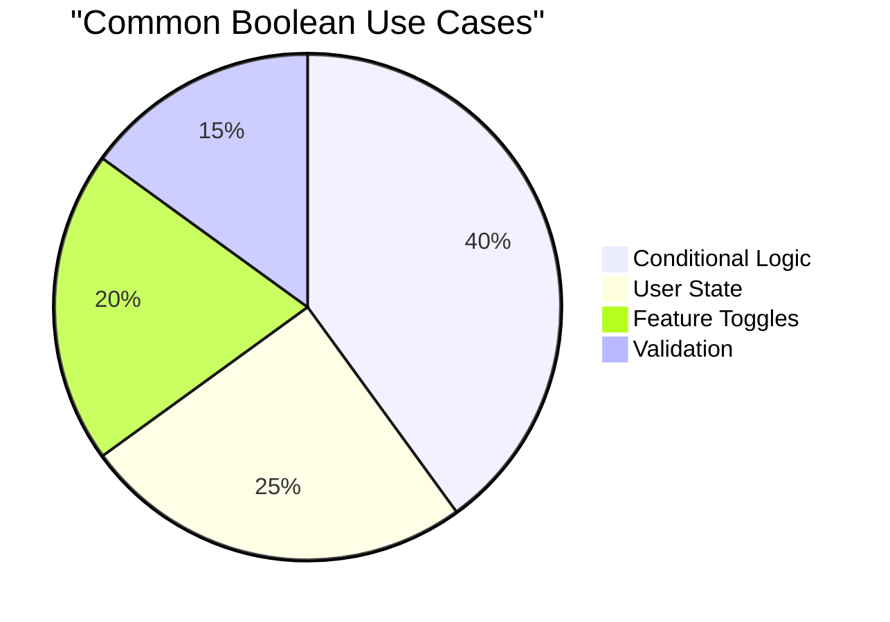

> **Muista**: JavaScriptissä vain 6 arvoa ovat falsy: `false`, `0`, `""`, `null`, `undefined` ja `NaN`. Kaikki muu on truthy!

---

## 📊 **Tietotyyppien työkalupakin yhteenveto**

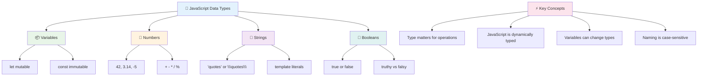

## GitHub Copilot Agent -haaste 🚀

Käytä Agent-tilaa suorittaaksesi seuraavan haasteen:

**Kuvaus:** Luo henkilökohtainen tietojenhallintaohjelma, joka esittelee kaikki JavaScriptin tietotyypit, joita olet oppinut tässä oppitunnissa, samalla kun käsittelet todellisia dataskenaarioita.

**Tehtävä:** Rakenna JavaScript-ohjelma, joka luo käyttäjäprofiiliobjektin sisältäen: henkilön nimen (merkkijono), iän (numero), opiskelijastatuksen (boolean), suosikkivärit taulukkona ja osoiteobjektin, jossa on katu, kaupunki ja postinumero. Sisällytä funktioita profiilitietojen näyttämiseen ja yksittäisten kenttien päivittämiseen. Varmista, että esittelet merkkijonojen yhdistämistä, template literaleja, aritmeettisia operaatioita iän kanssa ja boolean-logiikkaa opiskelijastatuksen osalta.

Lisätietoja [agent-tilasta](https://code.visualstudio.com/blogs/2025/02/24/introducing-copilot-agent-mode) täällä.

## 🚀 Haaste

JavaScriptillä on joitakin käyttäytymisiä, jotka voivat yllättää kehittäjät. Tässä klassinen esimerkki tutkittavaksi: kokeile kirjoittaa selaimesi konsoliin: `let age = 1; let Age = 2; age == Age` ja tarkkaile tulosta. Se palauttaa `false` – voitko selvittää miksi?

Tämä edustaa yhtä monista JavaScriptin käyttäytymismalleista, jotka kannattaa ymmärtää. Näiden erikoisuuksien tunteminen auttaa sinua kirjoittamaan luotettavampaa koodia ja korjaamaan ongelmia tehokkaammin.

## Oppitunnin jälkeinen kysely
[Oppitunnin jälkeinen kysely](https://ff-quizzes.netlify.app)

## Kertaus ja itseopiskelu

Tutustu [tähän JavaScript-harjoitusten listaan](https://css-tricks.com/snippets/javascript/) ja kokeile yhtä. Mitä opit?

## Tehtävä

[Data Types Practice](assignment.md)

## 🚀 JavaScript-tietotyyppien hallinnan aikajana

### ⚡ **Mitä voit tehdä seuraavan 5 minuutin aikana**
- [ ] Avaa selaimesi konsoli ja luo 3 muuttujaa eri tietotyypeillä
- [ ] Kokeile haastetta: `let age = 1; let Age = 2; age == Age` ja selvitä, miksi se on false
- [ ] Harjoittele merkkijonojen yhdistämistä nimelläsi ja suosikkinumerollasi
- [ ] Testaa, mitä tapahtuu, kun lisäät numeron merkkijonoon

### 🎯 **Mitä voit saavuttaa tämän tunnin aikana**
- [ ] Suorita oppitunnin jälkeinen kysely ja kertaa epäselvät käsitteet
- [ ] Luo minilaskin, joka laskee yhteen, vähentää, kertoo ja jakaa kaksi numeroa
- [ ] Rakenna yksinkertainen nimimuotoilija käyttäen template literaleja
- [ ] Tutki eroja `==` ja `===`-vertailuoperaattoreiden välillä
- [ ] Harjoittele eri tietotyyppien välillä muuntamista

### 📅 **Viikon mittainen JavaScript-perusta**
- [ ] Suorita tehtävä itsevarmasti ja luovasti
- [ ] Luo henkilökohtainen profiiliobjekti käyttäen kaikkia opittuja tietotyyppejä
- [ ] Harjoittele [JavaScript-harjoituksilla CSS-Tricksistä](https://css-tricks.com/snippets/javascript/)
- [ ] Rakenna yksinkertainen lomakevalidaattori käyttäen boolean-logiikkaa
- [ ] Kokeile taulukko- ja objektitietotyyppejä (tulevien oppituntien esikatselu)
- [ ] Liity JavaScript-yhteisöön ja kysy kysymyksiä tietotyypeistä

### 🌟 **Kuukauden mittainen muutos**
- [ ] Integroi tietotyyppitieto suurempiin ohjelmointiprojekteihin
- [ ] Ymmärrä, milloin ja miksi käyttää kutakin tietotyyppiä todellisissa sovelluksissa
- [ ] Auta muita aloittelijoita ymmärtämään JavaScriptin perusteet
- [ ] Rakenna pieni sovellus, joka hallitsee erilaisia käyttäjätietoja
- [ ] Tutki edistyneitä tietotyyppikonsepteja, kuten tyyppimuunnosta ja tiukkaa yhtäläisyyttä
- [ ] Osallistu avoimen lähdekoodin JavaScript-projekteihin parantamalla dokumentaatiota

### 🧠 **Lopullinen tietotyyppien hallinnan tarkistus**

**Juhlista JavaScript-perustasi:**
- Mikä tietotyyppi yllätti sinut eniten käyttäytymisensä suhteen?
- Kuinka mukavalta tuntuu selittää muuttujat vs. vakio ystävälle?
- Mikä oli mielenkiintoisin asia, jonka löysit JavaScriptin tyyppijärjestelmästä?
- Minkä todellisen sovelluksen voit kuvitella rakentavasi näillä perusteilla?

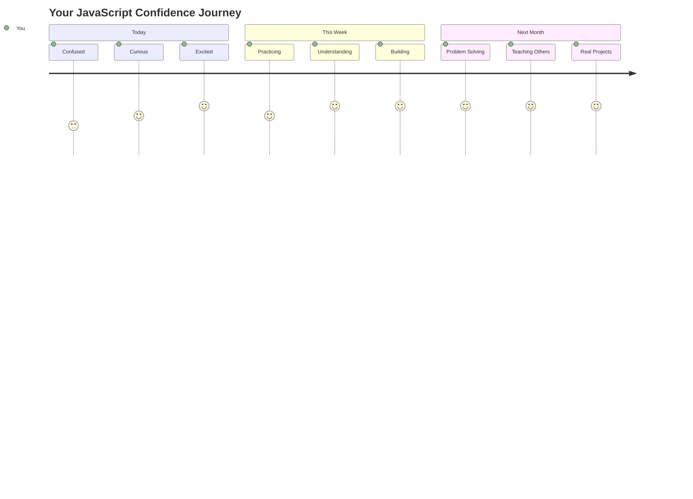

> 💡 **Olet rakentanut perustan!** Tietotyyppien ymmärtäminen on kuin aakkosten oppiminen ennen tarinoiden kirjoittamista. Jokainen JavaScript-ohjelma, jonka koskaan kirjoitat, käyttää näitä peruskäsitteitä. Sinulla on nyt rakennuspalikat interaktiivisten verkkosivustojen, dynaamisten sovellusten ja todellisten ongelmien ratkaisemiseen koodilla. Tervetuloa JavaScriptin ihmeelliseen maailmaan! 🎉

---

**Vastuuvapauslauseke**:  
Tämä asiakirja on käännetty käyttämällä tekoälypohjaista käännöspalvelua [Co-op Translator](https://github.com/Azure/co-op-translator). Vaikka pyrimme tarkkuuteen, huomioithan, että automaattiset käännökset voivat sisältää virheitä tai epätarkkuuksia. Alkuperäinen asiakirja sen alkuperäisellä kielellä tulisi pitää ensisijaisena lähteenä. Tärkeissä tiedoissa suositellaan ammattimaista ihmiskäännöstä. Emme ole vastuussa väärinkäsityksistä tai virhetulkinnoista, jotka johtuvat tämän käännöksen käytöstä.