# JavaScriptin perusteet: metodit ja funktiot

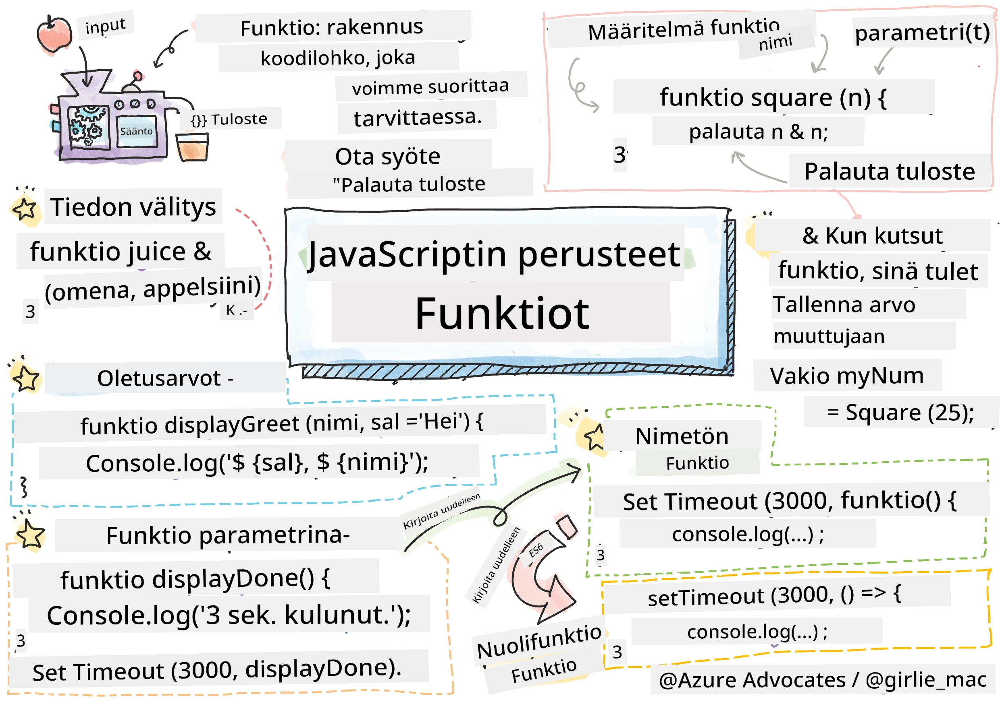
> Sketchnote by [Tomomi Imura](https://twitter.com/girlie_mac)

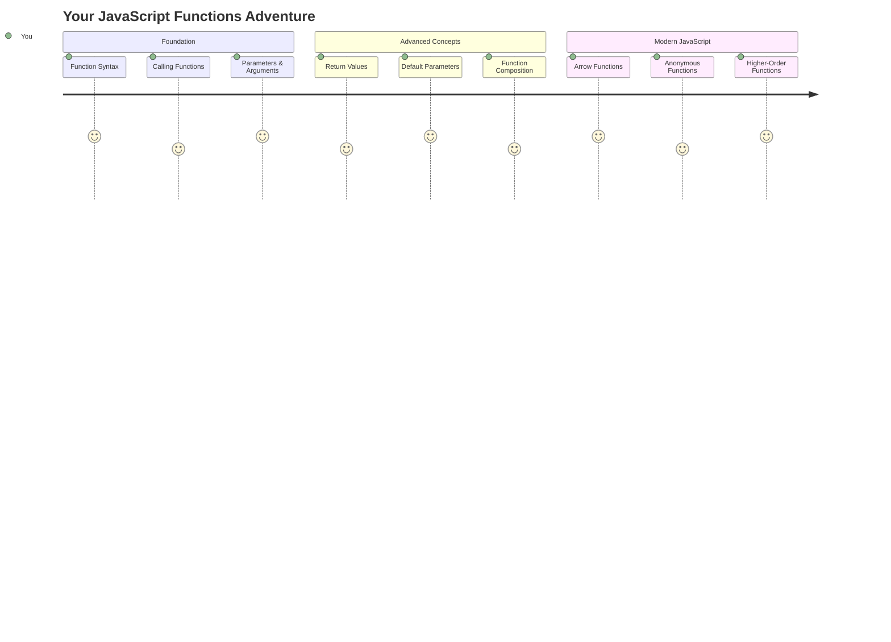

## Ennen luentoa - Kysely
[Ennen luentoa - kysely](https://ff-quizzes.netlify.app)

Saman koodin kirjoittaminen toistuvasti on yksi ohjelmoinnin yleisimmistä turhautumisen aiheista. Funktiot ratkaisevat tämän ongelman antamalla mahdollisuuden paketoida koodia uudelleenkäytettäviin lohkoihin. Ajattele funktioita kuin standardoituja osia, jotka tekivät Henry Fordin kokoonpanolinjasta vallankumouksellisen – kun luot luotettavan komponentin, voit käyttää sitä missä tahansa ilman, että sinun tarvitsee rakentaa sitä uudelleen.

Funktiot mahdollistavat koodin osien niputtamisen, jotta voit käyttää niitä uudelleen ohjelmassasi. Sen sijaan, että kopioisit ja liittäisit samaa logiikkaa kaikkialle, voit luoda funktion kerran ja kutsua sitä aina tarvittaessa. Tämä lähestymistapa pitää koodisi järjestyksessä ja helpottaa päivityksiä.

Tässä oppitunnissa opit luomaan omia funktioita, välittämään niille tietoa ja saamaan hyödyllisiä tuloksia takaisin. Opit eron funktioiden ja metodien välillä, nykyaikaisia syntaksitapoja ja näet, miten funktiot voivat toimia yhdessä muiden funktioiden kanssa. Rakennamme nämä käsitteet askel askeleelta.

[](https://youtube.com/watch?v=XgKsD6Zwvlc "Methods and Functions")

> 🎥 Klikkaa yllä olevaa kuvaa nähdäksesi videon metodeista ja funktioista.

> Voit käydä tämän oppitunnin [Microsoft Learnissa](https://docs.microsoft.com/learn/modules/web-development-101-functions/?WT.mc_id=academic-77807-sagibbon)!

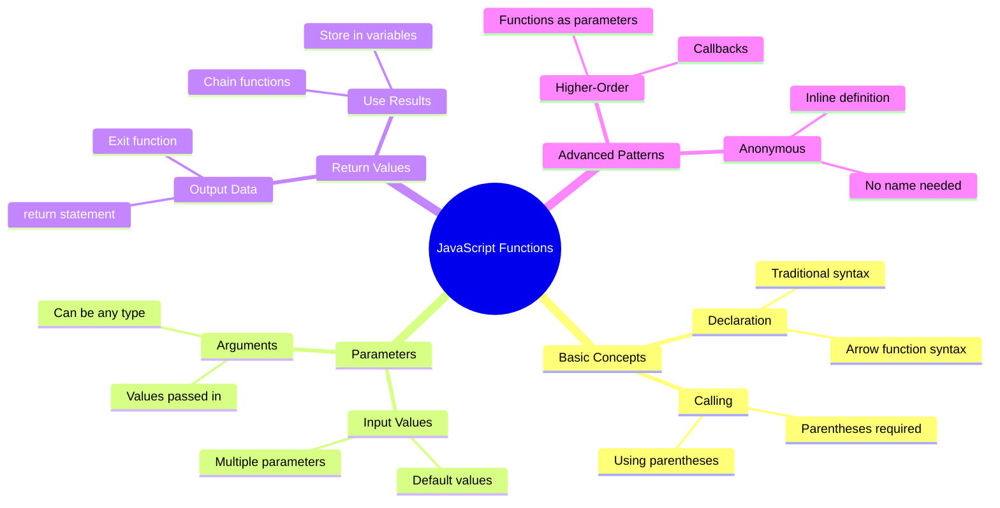

## Funktiot

Funktio on itsenäinen koodilohko, joka suorittaa tietyn tehtävän. Se kapseloi logiikan, jonka voit suorittaa aina tarvittaessa.

Sen sijaan, että kirjoittaisit samaa koodia useita kertoja ohjelmassasi, voit paketoida sen funktioon ja kutsua sitä aina tarvittaessa. Tämä lähestymistapa pitää koodisi siistinä ja helpottaa päivityksiä. Mieti, kuinka haastavaa olisi ylläpitää logiikkaa, joka on hajautettu 20 eri paikkaan koodissasi.

On tärkeää nimetä funktiot kuvaavasti. Hyvin nimetty funktio viestii tarkoituksensa selkeästi – kun näet `cancelTimer()`, ymmärrät heti, mitä se tekee, aivan kuten selkeästi merkitty painike kertoo, mitä tapahtuu, kun sitä painetaan.

## Funktion luominen ja kutsuminen

Tarkastellaan, miten funktio luodaan. Syntaksi noudattaa johdonmukaista kaavaa:

```javascript
function nameOfFunction() { // function definition
 // function definition/body
}
```

Puretaan tämä osiin:
- `function`-avainsana kertoo JavaScriptille "Hei, olen luomassa funktiota!"
- `nameOfFunction` on paikka, jossa annat funktiollesi kuvaavan nimen
- Sulut `()` ovat paikka, jossa voit lisätä parametreja (palaamme tähän pian)
- Kaarevat sulkeet `{}` sisältävät varsinaisen koodin, joka suoritetaan, kun kutsut funktiota

Luodaan yksinkertainen tervehdysfunktio, jotta näemme tämän toiminnassa:

```javascript
function displayGreeting() {
  console.log('Hello, world!');
}
```

Tämä funktio tulostaa "Hello, world!" konsoliin. Kun olet määritellyt sen, voit käyttää sitä niin monta kertaa kuin tarvitset.

Funktion suorittamiseksi (tai "kutsumiseksi") kirjoita sen nimi ja lisää sulut perään. JavaScript sallii funktion määrittämisen ennen tai jälkeen sen kutsumisen – JavaScript-moottori hoitaa suoritusjärjestyksen.

```javascript
// calling our function
displayGreeting();
```

Kun suoritat tämän rivin, se suorittaa kaiken koodin `displayGreeting`-funktion sisällä ja näyttää "Hello, world!" selaimesi konsolissa. Voit kutsua tätä funktiota toistuvasti.

### 🧠 **Funktioiden perusteet: Ensimmäisten funktioiden rakentaminen**

**Katsotaan, miten ymmärrät perusfunktiot:**
- Voitko selittää, miksi käytämme kaarevia sulkeita `{}` funktion määrittelyssä?
- Mitä tapahtuu, jos kirjoitat `displayGreeting` ilman sulkeita?
- Miksi haluaisit kutsua samaa funktiota useita kertoja?

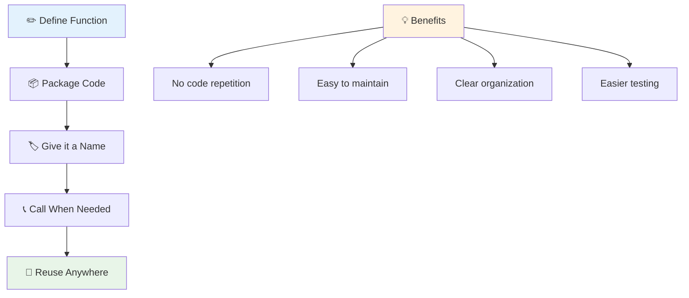

> **Huom:** Olet käyttänyt **metodeja** näiden oppituntien aikana. `console.log()` on metodi – käytännössä funktio, joka kuuluu `console`-objektiin. Keskeinen ero on, että metodit liittyvät objekteihin, kun taas funktiot ovat itsenäisiä. Monet kehittäjät käyttävät näitä termejä epävirallisesti synonyymeinä.

### Funktioiden parhaat käytännöt

Tässä muutama vinkki, jotka auttavat sinua kirjoittamaan hyviä funktioita:

- Anna funktioillesi selkeät, kuvaavat nimet – tuleva itsesi kiittää sinua!
- Käytä **camelCase**-tyyliä monisanaisissa nimissä (kuten `calculateTotal` eikä `calculate_total`)
- Pidä jokainen funktio keskittyneenä yhteen asiaan ja tee se hyvin

## Tiedon välittäminen funktiolle

Meidän `displayGreeting`-funktiomme on rajoittunut – se voi näyttää "Hello, world!" kaikille. Parametrit antavat meille mahdollisuuden tehdä funktioista joustavampia ja hyödyllisempiä.

**Parametrit** toimivat kuin paikkamerkit, joihin voit lisätä erilaisia arvoja joka kerta, kun käytät funktiota. Näin sama funktio voi toimia eri tiedoilla jokaisella kutsulla.

Luettele parametrit sulkeiden sisällä, kun määrittelet funktiota, ja erota useat parametrit pilkuilla:

```javascript
function name(param, param2, param3) {

}
```

Jokainen parametri toimii paikkamerkkinä – kun joku kutsuu funktiotasi, hän antaa todellisia arvoja, jotka sijoitetaan näihin kohtiin.

Päivitetään tervehdysfunktiomme hyväksymään jonkun nimi:

```javascript
function displayGreeting(name) {
  const message = `Hello, ${name}!`;
  console.log(message);
}
```

Huomaa, kuinka käytämme heittomerkkejä (`` ` ``) ja `${}` lisätäksemme nimen suoraan viestiimme – tätä kutsutaan mallilitteraaliksi, ja se on todella kätevä tapa rakentaa merkkijonoja, joissa on sekoitettuja muuttujia.

Nyt kun kutsumme funktiotamme, voimme välittää minkä tahansa nimen:

```javascript
displayGreeting('Christopher');
// displays "Hello, Christopher!" when run
```

JavaScript ottaa merkkijonon `'Christopher'`, liittää sen `name`-parametriin ja luo henkilökohtaisen viestin "Hello, Christopher!"

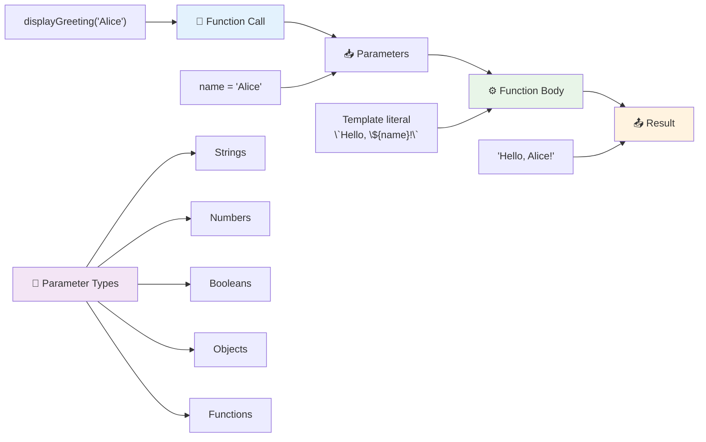

## Oletusarvot

Entä jos haluamme tehdä joistakin parametreista valinnaisia? Tässä kohtaa oletusarvot ovat käteviä!

Oletetaan, että haluamme ihmisten voivan mukauttaa tervehdystä, mutta jos he eivät määrittele sellaista, käytämme varmuuden vuoksi "Hello". Voit määrittää oletusarvot käyttämällä yhtäläisyysmerkkiä, aivan kuten muuttujan määrittämisessä:

```javascript
function displayGreeting(name, salutation='Hello') {
  console.log(`${salutation}, ${name}`);
}
```

Tässä `name` on edelleen pakollinen, mutta `salutation`-parametrilla on varmuuskopioarvo `'Hello'`, jos kukaan ei anna erilaista tervehdystä.

Nyt voimme kutsua tätä funktiota kahdella eri tavalla:

```javascript
displayGreeting('Christopher');
// displays "Hello, Christopher"

displayGreeting('Christopher', 'Hi');
// displays "Hi, Christopher"
```

Ensimmäisessä kutsussa JavaScript käyttää oletusarvoa "Hello", koska emme määritelleet tervehdystä. Toisessa kutsussa se käyttää mukautettua "Hi"-tervehdystä. Tämä joustavuus tekee funktioista mukautuvia eri tilanteisiin.

### 🎛️ **Parametrien hallinta: Funktioiden joustavuuden lisääminen**

**Testaa parametrien ymmärrystäsi:**
- Mikä ero on parametrilla ja argumentilla?
- Miksi oletusarvot ovat hyödyllisiä tosielämän ohjelmoinnissa?
- Voitko ennustaa, mitä tapahtuu, jos välität enemmän argumentteja kuin parametreja?

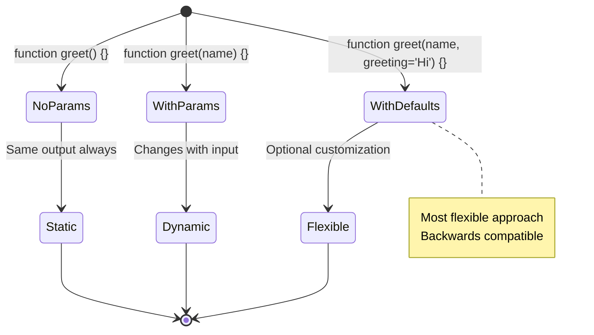

> **Vinkki:** Oletusparametrit tekevät funktioistasi käyttäjäystävällisempiä. Käyttäjät voivat aloittaa nopeasti järkevillä oletusarvoilla, mutta silti mukauttaa tarvittaessa!

## Palautusarvot

Funktiomme ovat tähän mennessä vain tulostaneet viestejä konsoliin, mutta entä jos haluat funktion laskevan jotain ja antavan tuloksen takaisin?

Tässä kohtaa **palautusarvot** tulevat mukaan. Sen sijaan, että vain näyttäisit jotain, funktio voi antaa sinulle arvon, jonka voit tallentaa muuttujaan tai käyttää muualla koodissasi.

Palauttaaksesi arvon käytä `return`-avainsanaa ja sen jälkeen mitä haluat palauttaa:

```javascript
return myVariable;
```

Tässä on tärkeää: kun funktio kohtaa `return`-lauseen, se lopettaa välittömästi suorittamisen ja lähettää arvon takaisin sille, joka kutsui sitä.

Muokataan tervehdysfunktiotamme palauttamaan viesti sen sijaan, että se tulostaisi sen:

```javascript
function createGreetingMessage(name) {
  const message = `Hello, ${name}`;
  return message;
}
```

Nyt sen sijaan, että funktio tulostaisi tervehdyksen, se luo viestin ja antaa sen meille.

Palautetun arvon käyttämiseksi voimme tallentaa sen muuttujaan kuten minkä tahansa muun arvon:

```javascript
const greetingMessage = createGreetingMessage('Christopher');
```

Nyt `greetingMessage` sisältää "Hello, Christopher", ja voimme käyttää sitä missä tahansa koodissamme – näyttääksesi sen verkkosivulla, sisällyttääksesi sen sähköpostiin tai välittääksesi sen toiselle funktiolle.

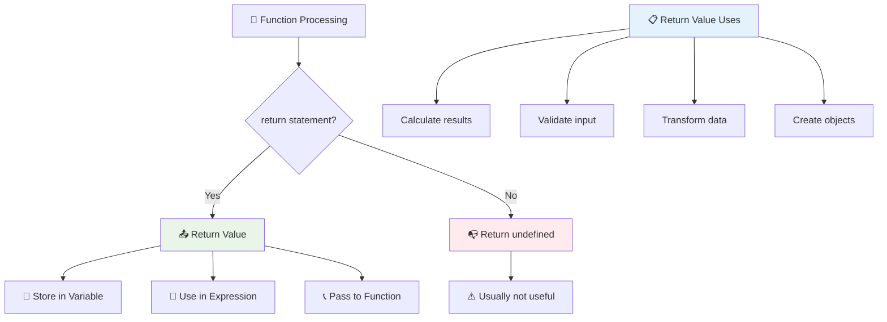

### 🔄 **Palautusarvojen tarkistus: Tulosten saaminen takaisin**

**Arvioi palautusarvojen ymmärrystäsi:**
- Mitä tapahtuu koodille funktion `return`-lauseen jälkeen?
- Miksi palautusarvojen käyttö on usein parempi kuin pelkkä konsoliin tulostaminen?
- Voiko funktio palauttaa eri tyyppisiä arvoja (merkkijono, numero, totuusarvo)?

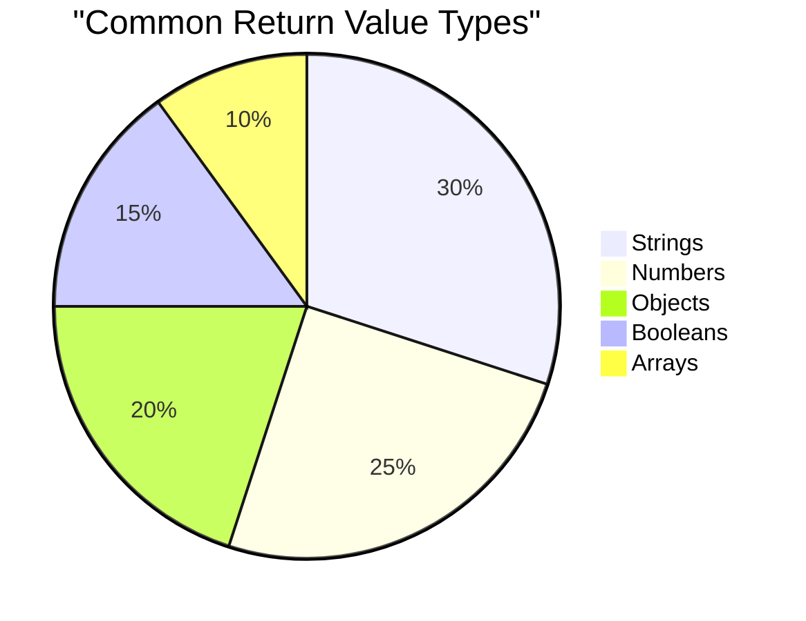

> **Keskeinen oivallus:** Funktiot, jotka palauttavat arvoja, ovat monipuolisempia, koska kutsuja päättää, mitä tuloksella tehdään. Tämä tekee koodistasi modulaarisempaa ja uudelleenkäytettävämpää!

## Funktiot funktioiden parametreina

Funktioita voidaan välittää parametreina toisille funktioille. Vaikka tämä konsepti saattaa aluksi tuntua monimutkaiselta, se on tehokas ominaisuus, joka mahdollistaa joustavat ohjelmointimallit.

Tämä malli on erittäin yleinen, kun haluat sanoa "kun jotain tapahtuu, tee tämä toinen asia." Esimerkiksi "kun ajastin päättyy, suorita tämä koodi" tai "kun käyttäjä klikkaa painiketta, kutsu tämä funktio."

Tarkastellaan `setTimeout`-funktiota, joka on sisäänrakennettu funktio, joka odottaa tietyn ajan ja sitten suorittaa jonkin koodin. Meidän täytyy kertoa sille, mitä koodia suorittaa – täydellinen tapaus funktion välittämiseen!

Kokeile tätä koodia – 3 sekunnin kuluttua näet viestin:

```javascript
function displayDone() {
  console.log('3 seconds has elapsed');
}
// timer value is in milliseconds
setTimeout(displayDone, 3000);
```

Huomaa, kuinka välitämme `displayDone`-funktion (ilman sulkeita) `setTimeout`-funktiolle. Emme kutsu funktiota itse – annamme sen `setTimeout`-funktiolle ja sanomme "kutsu tämä 3 sekunnin kuluttua."

### Nimettömät funktiot

Joskus tarvitset funktiota vain yhteen asiaan etkä halua antaa sille nimeä. Mieti – jos käytät funktiota vain kerran, miksi lisätä koodiin ylimääräinen nimi?

JavaScript antaa sinun luoda **nimettömiä funktioita** – funktioita ilman nimiä, jotka voit määritellä juuri siellä, missä niitä tarvitset.

Näin voimme kirjoittaa ajastinesimerkkimme uudelleen nimettömän funktion avulla:

```javascript
setTimeout(function() {
  console.log('3 seconds has elapsed');
}, 3000);
```

Tämä saavuttaa saman tuloksen, mutta funktio määritellään suoraan `setTimeout`-kutsun sisällä, mikä poistaa tarpeen erilliselle funktion määrittelylle.

### Lyhyet nuolifunktiot

Nykyaikaisessa JavaScriptissa on vielä lyhyempi tapa kirjoittaa funktioita, joita kutsutaan **nuolifunktioiksi**. Ne käyttävät `=>`-merkkiä (joka näyttää nuolelta – ymmärrätkö?) ja ovat erittäin suosittuja kehittäjien keskuudessa.

Nuolifunktiot antavat sinun ohittaa `function`-avainsanan ja kirjoittaa tiiviimpää koodia.

Tässä ajastinesimerkkimme nuolifunktion avulla:

```javascript
setTimeout(() => {
  console.log('3 seconds has elapsed');
}, 3000);
```

Sulut `()` ovat paikka, jossa parametrit olisivat (tässä tapauksessa tyhjät), sitten tulee nuoli `=>`, ja lopuksi funktion runko kaarevissa sulkeissa. Tämä tarjoaa saman toiminnallisuuden tiiviimmällä syntaksilla.

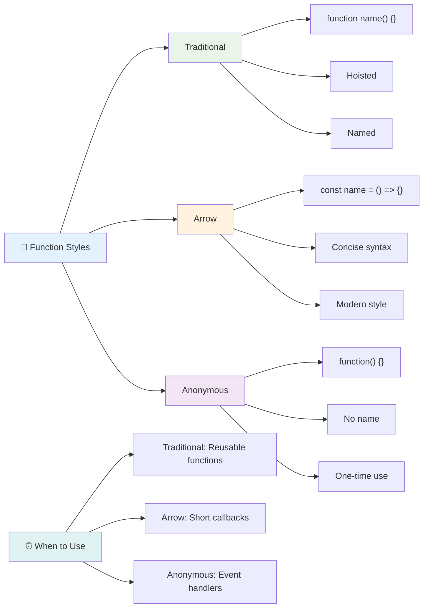

### Milloin käyttää mitäkin strategiaa

Milloin käyttää mitäkin lähestymistapaa? Käytännöllinen ohje: jos käytät funktiota useita kertoja, anna sille nimi ja määrittele se erikseen. Jos se on tarkoitettu yhteen tiettyyn käyttöön, harkitse nimetöntä funktiota. Sekä nuolifunktiot että perinteinen syntaksi ovat päteviä valintoja, vaikka nuolifunktiot ovat yleisiä nykyaikaisissa JavaScript-koodipohjissa.

### 🎨 **Funktiotyylien hallinta: Oikean syntaksin valinta**

**Testaa syntaksin ymmärrystäsi:**
- Milloin saattaisit suosia nuolifunktioita perinteisen funktion syntaksin sijaan?
- Mikä on nimettömien funktioiden pääasiallinen etu?
- Voitko keksiä tilanteen, jossa nimetty funktio on parempi kuin nimetön?

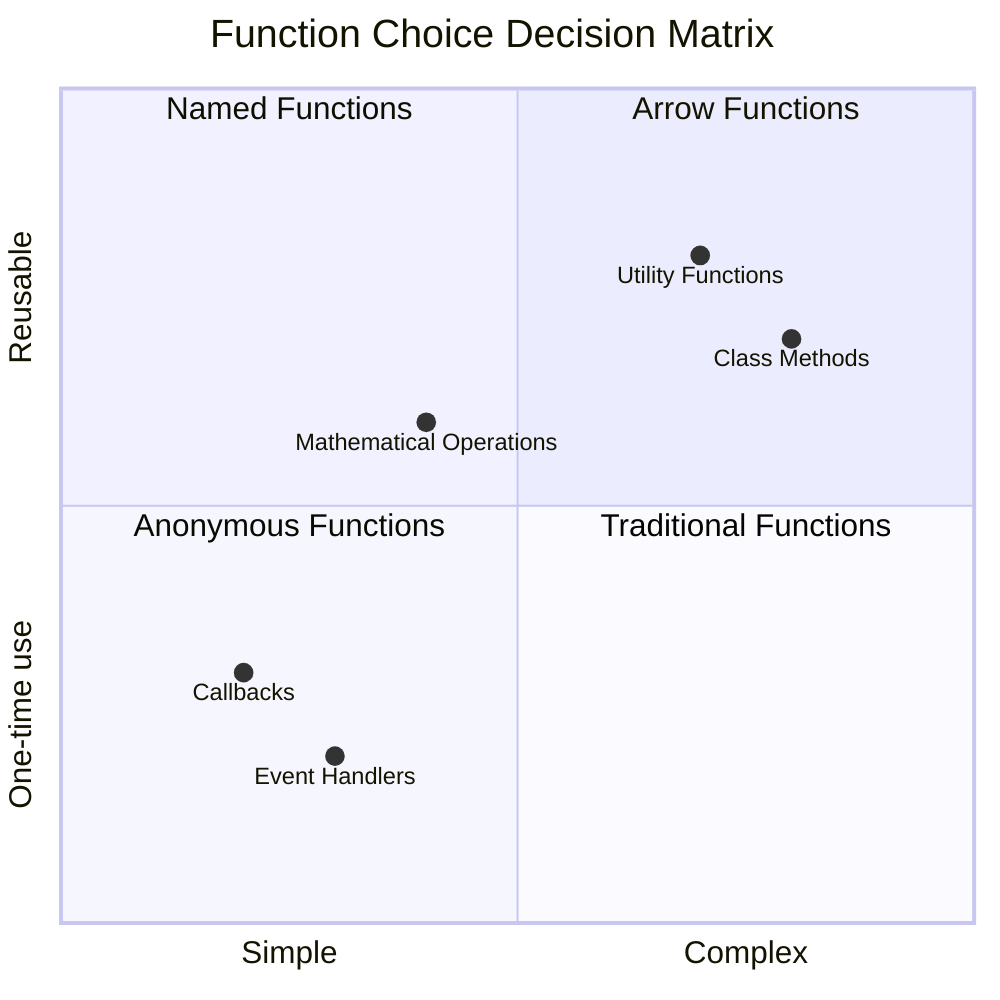

> **Nykyaikainen suuntaus:** Nuolifunktiot ovat tulossa monien kehittäjien oletusvalinnaksi niiden tiiviin syntaksin vuoksi, mutta perinteisillä funktioilla on edelleen paikkansa!

---


## 🚀 Haaste

Voitko tiivistää yhdessä lauseessa eron funktioiden ja metodien välillä? Kokeile!

## GitHub Copilot Agent -haaste 🚀

Käytä Agent-tilaa suorittaaksesi seuraavan haasteen:

**Kuvaus:** Luo matemaattisten funktioiden apukirjasto, joka havainnollistaa tämän oppitunnin eri funktiokonsepteja, mukaan lukien parametrit, oletusarvot, palautusarvot ja nuolifunktiot.

**Ohje:** Luo JavaScript-tiedosto nimeltä `mathUtils.js`, joka sisältää seuraavat funktiot:
1. Funktio `add`, joka ottaa kaksi parametria ja palauttaa niiden summan
2. Funktio `multiply`, jossa on oletusarvot parametreille (toinen parametri oletuksena 1)
3. Nuolifunktio `square`, joka ottaa numeron ja palauttaa sen neliön
4. Funktio `calculate`, joka hyväksyy toisen funktion parametrina ja kaksi numeroa, ja sitten soveltaa funktiota näihin numeroihin
5. Näytä jokaisen funktion kutsuminen sopivilla testitapauksilla

Lisätietoja [agent-tilasta](https://code.visualstudio.com/blogs/2025/02/24/introducing-copilot-agent-mode) täällä.

## Luentojälkeinen kysely
[Luentojälkeinen kysely](https://ff-quizzes.netlify.app)

## Kertaus ja itseopiskelu

Kannattaa [lukea hieman lisää nuolifunktioista](https://developer.mozilla.org/docs/Web/JavaScript/Reference/Functions/Arrow_functions), sillä niitä käytetään yhä enemmän koodipohjissa. Harjoittele funktion kirjoittamista ja sitten sen uudelleenkirjoittamista tällä syntaksilla.

## Tehtävä

[Hauskaa funktioiden parissa](assignment.md)

---

## 🧰 **JavaScript-funktioiden työkalupakki - yhteenveto**

```mermaid
graph TD
    A["🎯 JavaScript Functions"] --> B["📋 Function Declaration"]
    A --> C["📥 Parameters"]
    A --> D["📤 Return Values"]
    A --> E["🎨 Modern Syntax"]
    
    B --> B1["function name() {}"]
    B --> B2["Descriptive naming"]
    B --> B3["Reusable code blocks"]
    
    C --> C1["Input data"]
    C --> C2["Default values"]
    C --> C3["Multiple parameters"]
    
    D --> D1["return statement"]
    D --> D2["Exit function"]
    D --> D3["Pass data back"]
    
    E --> E1["Arrow functions: () =>"]
    E --> E2["Anonymous functions"]
    E --> E3["Higher-order functions"]
    
    F["⚡ Key Benefits"] --> F1["Code reusability"]
    F --> F2["Better organization"]
    F --> F3["Easier testing"]
    F --> F4["Modular design"]
    
    style A fill:#e3f2fd
    style B fill:#e8f5e8
    style C fill:#fff3e0
    style D fill:#f3e5f5
    style E fill:#e0f2f1
    style F fill:#fce4ec
```

---

## 🚀 JavaScript-funktioiden hallinnan aikajana

### ⚡ **Mitä voit tehdä seuraavan 5 minuutin aikana**
- [ ] Kirjoita yksinkertainen funktio, joka palauttaa suosikkinumerosi
- [ ] Luo funktio, jossa on kaksi parametria, jotka lisäävät ne yhteen
- [ ] Kokeile muuntaa perinteinen funktio nuolifunktion syntaksiin
- [ ] Harjoittele haastetta: selitä ero funktioiden ja metodien välillä

### 🎯 **Mitä voit saavuttaa tämän tunnin aikana**
- [ ] Suorita oppitunnin jälkeinen testi ja käy läpi epäselvät käsitteet
- [ ] Rakenna matemaattisten apuvälineiden kirjasto GitHub Copilot -haasteen avulla
- [ ] Luo funktio, joka käyttää toista funktiota parametrina
- [ ] Harjoittele funktioiden kirjoittamista oletusparametreilla
- [ ] Kokeile mallimerkkijonoja funktioiden palautusarvoissa

### 📅 **Viikon mittainen funktioiden hallinta**
- [ ] Suorita "Hauskaa funktioiden parissa" -tehtävä luovasti
- [ ] Refaktoroi aiemmin kirjoittamaasi toistuvaa koodia uudelleenkäytettäviksi funktioiksi
- [ ] Rakenna pieni laskin käyttäen vain funktioita (ei globaaleja muuttujia)
- [ ] Harjoittele nuolifunktioita taulukkometodeilla kuten `map()` ja `filter()`
- [ ] Luo kokoelma apufunktioita yleisiin tehtäviin
- [ ] Tutki korkeamman tason funktioita ja funktionaalisen ohjelmoinnin käsitteitä

### 🌟 **Kuukauden mittainen muutos**
- [ ] Hallitse edistyneitä funktiokäsitteitä, kuten sulkeumat ja näkyvyysalueet
- [ ] Rakenna projekti, joka hyödyntää vahvasti funktiokompositiota
- [ ] Osallistu avoimen lähdekoodin projekteihin parantamalla funktiodokumentaatiota
- [ ] Opeta jollekin toiselle funktioista ja eri syntaksityyleistä
- [ ] Tutki funktionaalisen ohjelmoinnin paradigmoja JavaScriptissä
- [ ] Luo henkilökohtainen kirjasto uudelleenkäytettäviä funktioita tulevia projekteja varten

### 🏆 **Lopullinen funktioiden mestaruuden tarkistus**

**Juhlista funktioiden hallintaasi:**
- Mikä on hyödyllisin funktio, jonka olet tähän mennessä luonut?
- Miten funktioiden oppiminen on muuttanut tapaasi ajatella koodin organisointia?
- Mikä funktiosyntaksi on suosikkisi ja miksi?
- Minkä todellisen ongelman ratkaisisit kirjoittamalla funktion?

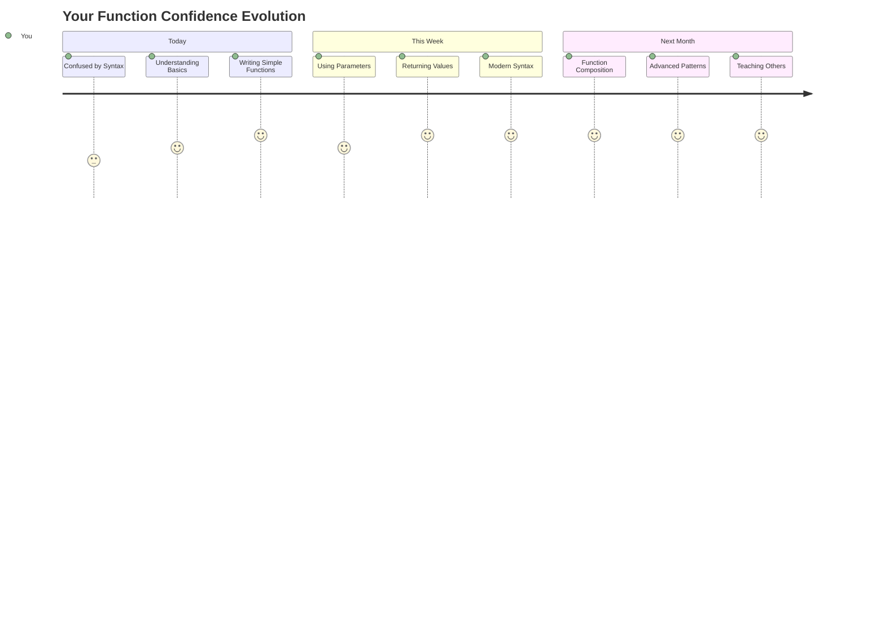

> 🎉 **Olet hallinnut yhden ohjelmoinnin tehokkaimmista käsitteistä!** Funktiot ovat suurempien ohjelmien rakennuspalikoita. Jokainen sovellus, jonka koskaan rakennat, käyttää funktioita koodin organisointiin, uudelleenkäyttöön ja rakenteeseen. Nyt ymmärrät, miten logiikka paketoidaan uudelleenkäytettäviksi komponenteiksi, mikä tekee sinusta tehokkaamman ja taitavamman ohjelmoijan. Tervetuloa modulaarisen ohjelmoinnin maailmaan! 🚀

---

**Vastuuvapauslauseke**:  
Tämä asiakirja on käännetty käyttämällä tekoälypohjaista käännöspalvelua [Co-op Translator](https://github.com/Azure/co-op-translator). Vaikka pyrimme tarkkuuteen, huomioithan, että automaattiset käännökset voivat sisältää virheitä tai epätarkkuuksia. Alkuperäistä asiakirjaa sen alkuperäisellä kielellä tulisi pitää ensisijaisena lähteenä. Kriittisen tiedon osalta suositellaan ammattimaista ihmiskäännöstä. Emme ole vastuussa väärinkäsityksistä tai virhetulkinnoista, jotka johtuvat tämän käännöksen käytöstä.