<!--
CO_OP_TRANSLATOR_METADATA:
{
  "original_hash": "c688385d15dd3645e924ea0ffee8967f",
  "translation_date": "2025-11-04T01:11:59+00:00",
  "source_file": "2-js-basics/3-making-decisions/README.md",
  "language_code": "fi"
}
-->
# JavaScriptin perusteet: Päätöksenteko

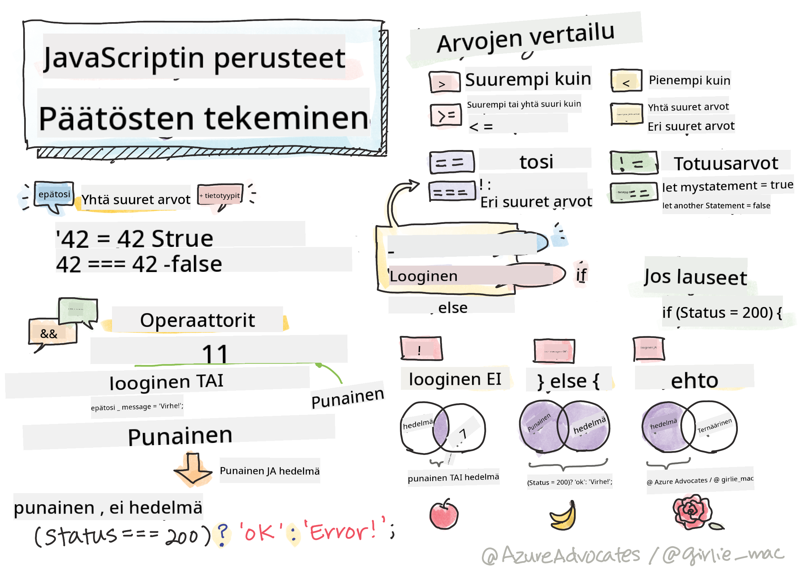

> Sketchnote: [Tomomi Imura](https://twitter.com/girlie_mac)

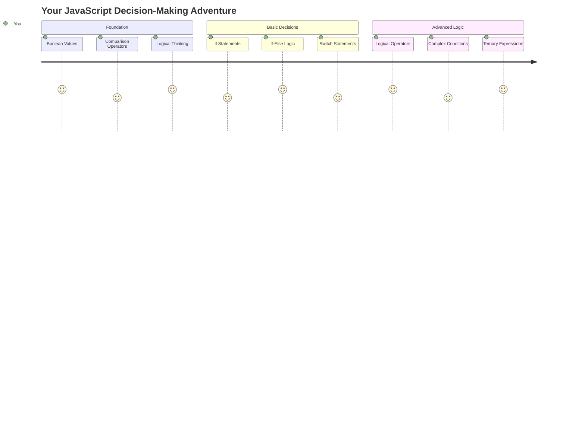

Oletko koskaan miettinyt, miten sovellukset tekevät älykkäitä päätöksiä? Esimerkiksi miten navigointijärjestelmä valitsee nopeimman reitin tai miten termostaatti päättää, milloin lämmitys kytketään päälle? Tämä on ohjelmoinnin päätöksenteon perusajatus.

Samoin kuin Charles Babbagen Analyyttinen kone oli suunniteltu suorittamaan erilaisia operaatioita ehtojen perusteella, modernit JavaScript-ohjelmat tekevät valintoja vaihtelevien olosuhteiden mukaan. Tämä kyky haarautua ja tehdä päätöksiä muuttaa staattisen koodin reagoiviksi ja älykkäiksi sovelluksiksi.

Tässä oppitunnissa opit toteuttamaan ehdollista logiikkaa ohjelmissasi. Tutustumme ehdollisiin lauseisiin, vertailuoperaattoreihin ja loogisiin ilmaisuihin, jotka mahdollistavat tilanteiden arvioinnin ja niihin sopivan reagoinnin.

## Ennakkokysely

[Ennakkokysely](https://ff-quizzes.netlify.app/web/quiz/11)

Päätöksentekokyky ja ohjelman kulun hallinta ovat ohjelmoinnin perusasioita. Tässä osiossa käsitellään, miten JavaScript-ohjelmien suorituspolkua hallitaan Boolean-arvojen ja ehdollisen logiikan avulla.

[](https://youtube.com/watch?v=SxTp8j-fMMY "Päätöksenteko")

> 🎥 Klikkaa yllä olevaa kuvaa nähdäksesi videon päätöksenteosta.

> Voit käydä tämän oppitunnin [Microsoft Learnissa](https://docs.microsoft.com/learn/modules/web-development-101-if-else/?WT.mc_id=academic-77807-sagibbon)!

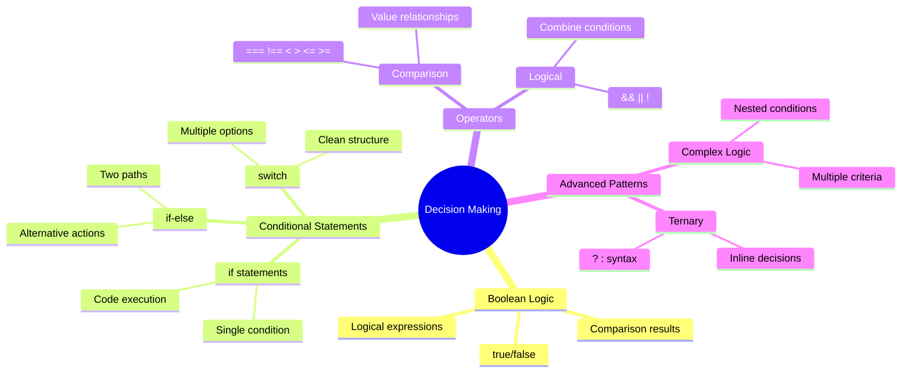

## Lyhyt kertaus Booleaneista

Ennen kuin sukellamme päätöksentekoon, kerrataan edellisestä oppitunnista tutut Boolean-arvot. Matemaatikko George Boolen mukaan nimettynä nämä arvot edustavat binäärisiä tiloja – joko `true` tai `false`. Ei epäselvyyksiä, ei harmaata aluetta.

Nämä binääriset arvot muodostavat kaiken laskennallisen logiikan perustan. Jokainen päätös, jonka ohjelmasi tekee, palautuu lopulta Boolean-arvoon.

Boolean-muuttujien luominen on yksinkertaista:

```javascript
let myTrueBool = true;
let myFalseBool = false;
```

Tämä luo kaksi muuttujaa, joilla on selkeät Boolean-arvot.

✅ Booleanit on nimetty englantilaisen matemaatikon, filosofin ja loogikon George Boolen (1815–1864) mukaan.

## Vertailuoperaattorit ja Booleanit

Käytännössä harvoin asetat Boolean-arvoja manuaalisesti. Sen sijaan luot niitä arvioimalla ehtoja: "Onko tämä luku suurempi kuin tuo?" tai "Ovatko nämä arvot yhtä suuret?"

Vertailuoperaattorit mahdollistavat nämä arvioinnit. Ne vertailevat arvoja ja palauttavat Boolean-tuloksia operandien välisen suhteen perusteella.

| Symboli | Kuvaus                                                                                                                                                   | Esimerkki          |
| ------- | -------------------------------------------------------------------------------------------------------------------------------------------------------- | ------------------ |
| `<`     | **Pienempi kuin**: Vertaa kahta arvoa ja palauttaa `true`, jos vasemman puoleinen arvo on pienempi kuin oikea                                            | `5 < 6 // true`    |
| `<=`    | **Pienempi tai yhtä suuri kuin**: Vertaa kahta arvoa ja palauttaa `true`, jos vasemman puoleinen arvo on pienempi tai yhtä suuri kuin oikea              | `5 <= 6 // true`   |
| `>`     | **Suurempi kuin**: Vertaa kahta arvoa ja palauttaa `true`, jos vasemman puoleinen arvo on suurempi kuin oikea                                            | `5 > 6 // false`   |
| `>=`    | **Suurempi tai yhtä suuri kuin**: Vertaa kahta arvoa ja palauttaa `true`, jos vasemman puoleinen arvo on suurempi tai yhtä suuri kuin oikea              | `5 >= 6 // false`  |
| `===`   | **Tarkka yhtäsuuruus**: Vertaa kahta arvoa ja palauttaa `true`, jos oikean ja vasemman puoleiset arvot ovat yhtä suuret JA samaa tietotyyppiä            | `5 === 6 // false` |
| `!==`   | **Epäyhtäsuuruus**: Vertaa kahta arvoa ja palauttaa Boolean-arvon, joka on päinvastainen kuin tarkka yhtäsuuruusoperaattori                              | `5 !== 6 // true`  |

✅ Testaa tietosi kirjoittamalla joitakin vertailuja selaimesi konsoliin. Yllättääkö mikään palautettu tieto sinut?

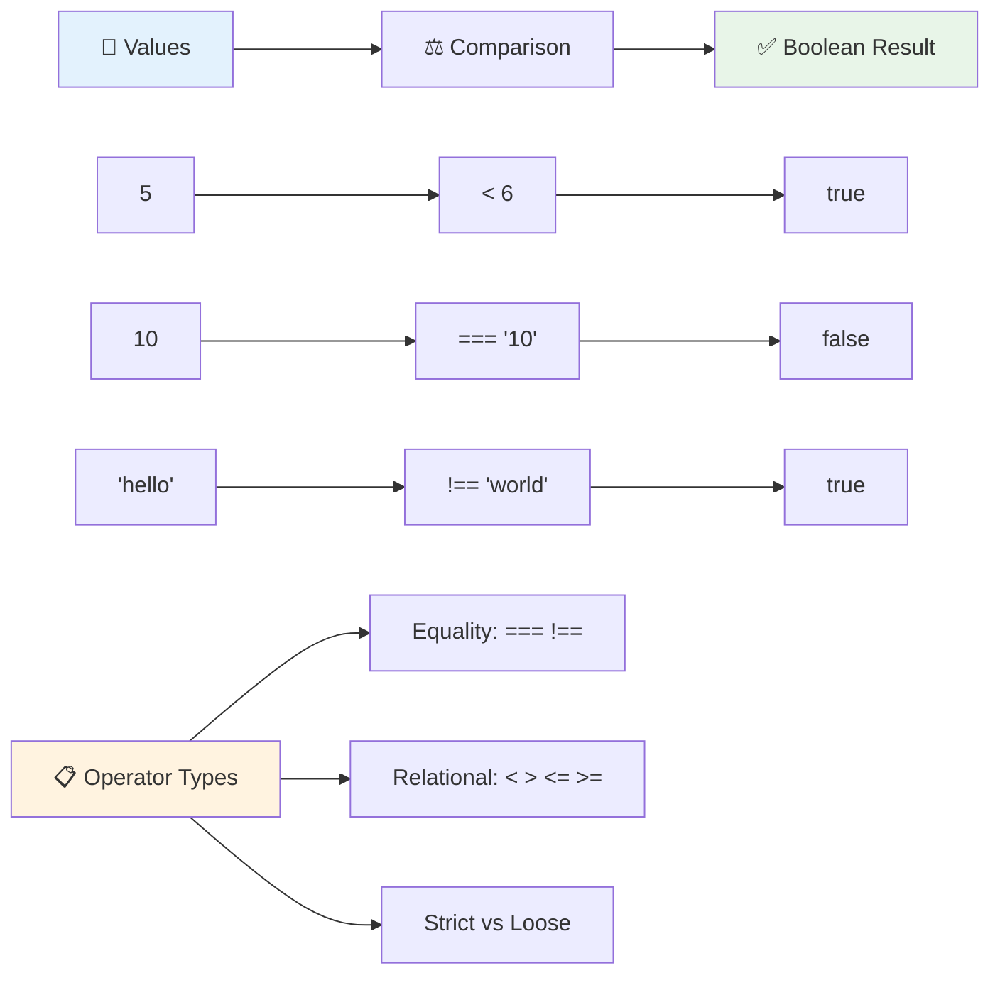

### 🧠 **Vertailujen hallinta: Boolean-logiikan ymmärtäminen**

**Testaa vertailujen ymmärrystäsi:**
- Miksi luulet, että `===` (tarkka yhtäsuuruus) on yleensä suositeltavampi kuin `==` (löyhä yhtäsuuruus)?
- Voitko ennustaa, mitä `5 === '5'` palauttaa? Entä `5 == '5'`?
- Mikä ero on `!==` ja `!=` välillä?

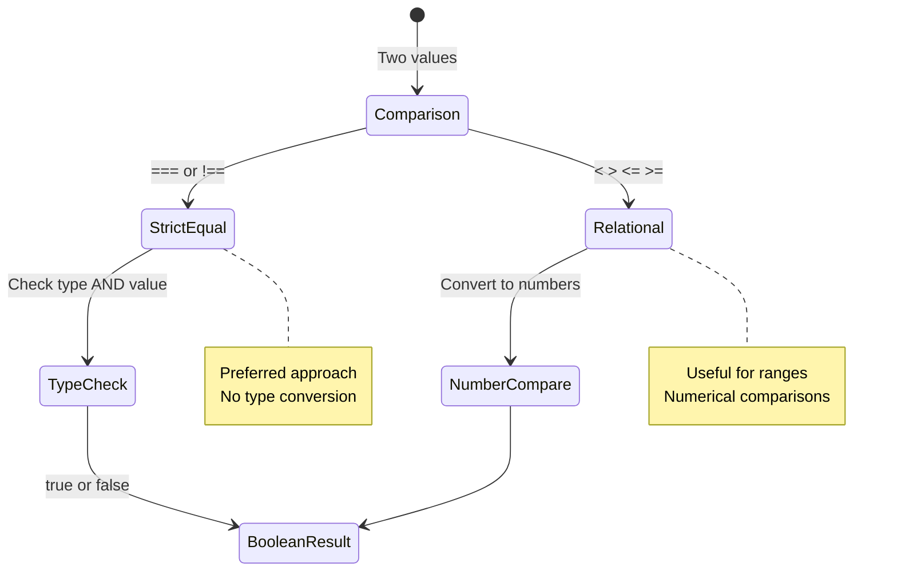

> **Vinkki**: Käytä aina `===` ja `!==` yhtäsuuruustarkistuksiin, ellei sinun erityisesti tarvitse tehdä tyyppimuunnosta. Tämä estää odottamattoman käyttäytymisen!

## If-lause

`if`-lause on kuin kysymyksen esittäminen koodissasi. "Jos tämä ehto on tosi, tee tämä asia." Se on luultavasti tärkein työkalu, jota käytät päätöksenteossa JavaScriptissä.

Näin se toimii:

```javascript
if (condition) {
  // Condition is true. Code in this block will run.
}
```

Ehto menee sulkeiden sisään, ja jos se on `true`, JavaScript suorittaa koodin aaltosulkeiden sisällä. Jos se on `false`, JavaScript ohittaa koko lohkon.

Käytät usein vertailuoperaattoreita luodaksesi näitä ehtoja. Katsotaan käytännön esimerkki:

```javascript
let currentMoney = 1000;
let laptopPrice = 800;

if (currentMoney >= laptopPrice) {
  // Condition is true. Code in this block will run.
  console.log("Getting a new laptop!");
}
```

Koska `1000 >= 800` arvioituu `true`:ksi, lohkon sisällä oleva koodi suoritetaan, ja konsoliin tulostuu "Getting a new laptop!"

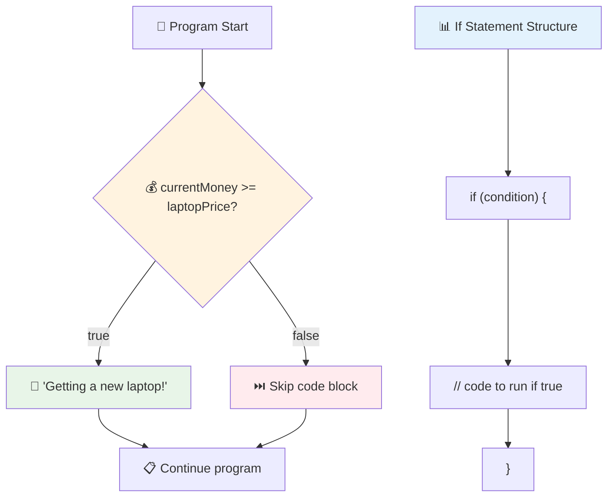

## If..Else-lause

Mutta entä jos haluat ohjelmasi tekevän jotain muuta, kun ehto on epätosi? Silloin `else` tulee apuun – se on kuin varasuunnitelma.

`else`-lause antaa sinulle tavan sanoa "jos tämä ehto ei ole tosi, tee sen sijaan tämä toinen asia."

```javascript
let currentMoney = 500;
let laptopPrice = 800;

if (currentMoney >= laptopPrice) {
  // Condition is true. Code in this block will run.
  console.log("Getting a new laptop!");
} else {
  // Condition is false. Code in this block will run.
  console.log("Can't afford a new laptop, yet!");
}
```

Nyt, koska `500 >= 800` on `false`, JavaScript ohittaa ensimmäisen lohkon ja suorittaa `else`-lohkon. Konsoliin tulostuu "Can't afford a new laptop, yet!"

✅ Testaa ymmärrystäsi tästä koodista ja seuraavasta koodista suorittamalla se selaimen konsolissa. Muuta currentMoney- ja laptopPrice-muuttujien arvoja muuttaaksesi palautettua `console.log()`-tulosta.

### 🎯 **If-Else-logiikan tarkistus: Haarautuvat polut**

**Arvioi ehdollisen logiikan ymmärrystäsi:**
- Mitä tapahtuu, jos `currentMoney` on täsmälleen yhtä suuri kuin `laptopPrice`?
- Voitko keksiä todellisen maailman tilanteen, jossa if-else-logiikka olisi hyödyllinen?
- Miten voisit laajentaa tätä käsittelemään useita hintaluokkia?

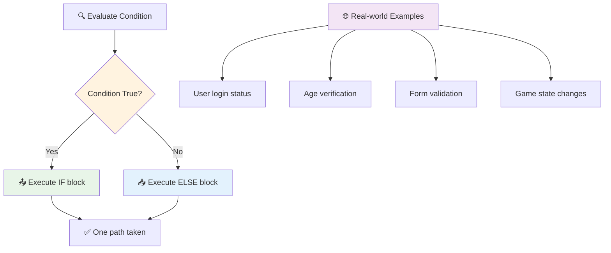

> **Keskeinen oivallus**: If-else varmistaa, että vain yksi polku otetaan. Tämä takaa, että ohjelmallasi on aina vastaus mihin tahansa ehtoon!

## Switch-lause

Joskus sinun täytyy verrata yhtä arvoa useisiin vaihtoehtoihin. Vaikka voisit ketjuttaa useita `if..else`-lauseita, tämä lähestymistapa muuttuu hankalaksi. `switch`-lause tarjoaa siistimmän rakenteen useiden erillisten arvojen käsittelyyn.

Konsepti muistuttaa mekaanisia kytkentäjärjestelmiä, joita käytettiin varhaisissa puhelinkeskuksissa – yksi syötearvo määrittää, mitä polkua suoritus seuraa.

```javascript
switch (expression) {
  case x:
    // code block
    break;
  case y:
    // code block
    break;
  default:
    // code block
}
```

Näin se on rakennettu:
- JavaScript arvioi ilmaisun kerran
- Se käy läpi jokaisen `case`:n löytääkseen osuman
- Kun se löytää osuman, se suorittaa kyseisen koodilohkon
- `break` kertoo JavaScriptille lopettaa ja poistua switchistä
- Jos mikään case ei täsmää, se suorittaa `default`-lohkon (jos sellainen on)

```javascript
// Program using switch statement for day of week
let dayNumber = 2;
let dayName;

switch (dayNumber) {
  case 1:
    dayName = "Monday";
    break;
  case 2:
    dayName = "Tuesday";
    break;
  case 3:
    dayName = "Wednesday";
    break;
  default:
    dayName = "Unknown day";
    break;
}
console.log(`Today is ${dayName}`);
```

Tässä esimerkissä JavaScript näkee, että `dayNumber` on `2`, löytää vastaavan `case 2`:n, asettaa `dayName`:n arvoksi "Tuesday" ja sitten poistuu switchistä. Tuloksena konsoliin tulostuu "Today is Tuesday".

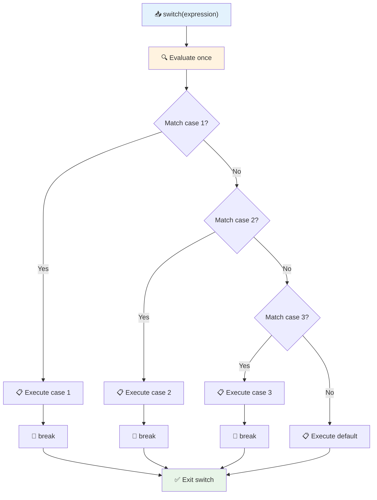

✅ Testaa ymmärrystäsi tästä koodista ja seuraavasta koodista suorittamalla se selaimen konsolissa. Muuta muuttujan a arvoja muuttaaksesi palautettua `console.log()`-tulosta.

### 🔄 **Switch-lauseen hallinta: Useita vaihtoehtoja**

**Testaa switch-lauseen ymmärrystäsi:**
- Mitä tapahtuu, jos unohdat `break`-lauseen?
- Milloin käyttäisit `switch`-lausetta useiden `if-else`-lauseiden sijaan?
- Miksi `default`-case on hyödyllinen, vaikka luulet kattaneesi kaikki mahdollisuudet?

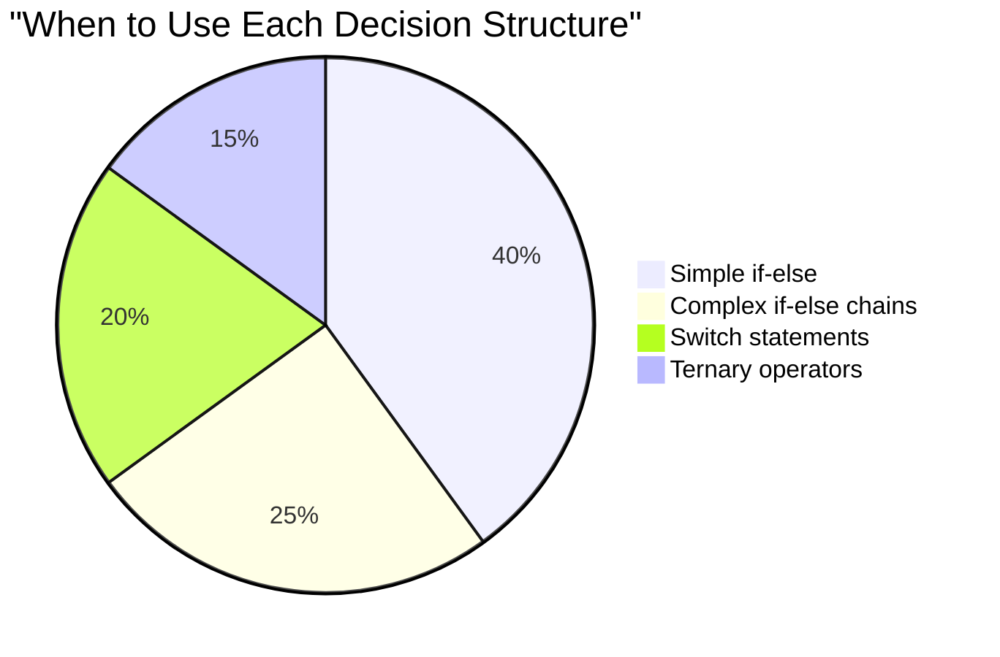

> **Paras käytäntö**: Käytä `switch`-lausetta, kun vertaat yhtä muuttujaa useisiin tiettyihin arvoihin. Käytä `if-else`-lausetta alueiden tarkistuksiin tai monimutkaisiin ehtoihin!

## Loogiset operaattorit ja Booleanit

Monimutkaiset päätökset vaativat usein useiden ehtojen arviointia samanaikaisesti. Samoin kuin Boolean-algebra mahdollistaa loogisten ilmaisujen yhdistämisen matemaatikoille, ohjelmointi tarjoaa loogisia operaattoreita useiden Boolean-ehtojen yhdistämiseen.

Nämä operaattorit mahdollistavat kehittyneen ehdollisen logiikan yhdistämällä yksinkertaisia tosi/epätosi-arviointeja.

| Symboli | Kuvaus                                                                                     | Esimerkki                                                                 |
| ------- | ------------------------------------------------------------------------------------------ | ------------------------------------------------------------------------- |
| `&&`    | **Looginen AND**: Vertaa kahta Boolean-ilmaisua. Palauttaa true **vain**, jos molemmat puolet ovat tosi | `(5 > 3) && (5 < 10) // Molemmat puolet ovat tosi. Palauttaa true` |
| `\|\|`  | **Looginen OR**: Vertaa kahta Boolean-ilmaisua. Palauttaa true, jos vähintään yksi puoli on tosi     | `(5 > 10) \|\| (5 < 10) // Toinen puoli on epätosi, toinen tosi. Palauttaa true` |
| `!`     | **Looginen NOT**: Palauttaa Boolean-ilmaisun vastakkaisen arvon                             | `!(5 > 10) // 5 ei ole suurempi kuin 10, joten "!" tekee siitä tosi`         |

Nämä operaattorit antavat mahdollisuuden yhdistää ehtoja hyödyllisillä tavoilla:
- AND (`&&`) tarkoittaa, että molempien ehtojen on oltava tosi
- OR (`||`) tarkoittaa, että vähintään yhden ehdon on oltava tosi  
- NOT (`!`) kääntää tosi epätosiksi (ja päinvastoin)

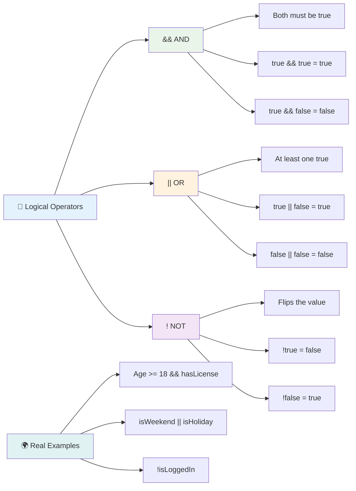

## Ehdot ja päätökset loogisilla operaattoreilla

Katsotaan, miten nämä loogiset operaattorit toimivat käytännössä realistisessa esimerkissä:

```javascript
let currentMoney = 600;
let laptopPrice = 800;
let laptopDiscountPrice = laptopPrice - (laptopPrice * 0.2); // Laptop price at 20 percent off

if (currentMoney >= laptopPrice || currentMoney >= laptopDiscountPrice) {
  // Condition is true. Code in this block will run.
  console.log("Getting a new laptop!");
} else {
  // Condition is false. Code in this block will run.
  console.log("Can't afford a new laptop, yet!");
}
```

Tässä esimerkissä: laskemme 20 % alennushinnan (640), sitten arvioimme, riittävätkö käytettävissä olevat varat joko täyteen hintaan TAI alennettuun hintaan. Koska 600 täyttää alennushinnan rajan 640, ehto arvioituu tosi:ksi.

### 🧮 **Loogisten operaattoreiden tarkistus: Ehtojen yhdistäminen**

**Testaa loogisten operaattoreiden ymmärrystäsi:**
- Ilmaisussa `A && B`, mitä tapahtuu, jos A on epätosi? Arvioidaanko B edes?
- Voitko keksiä tilanteen, jossa tarvitsisit kaikki kolme operaattoria (&&, ||, !)?
- Mikä ero on `!user.isActive` ja `user.isActive !== true` välillä?

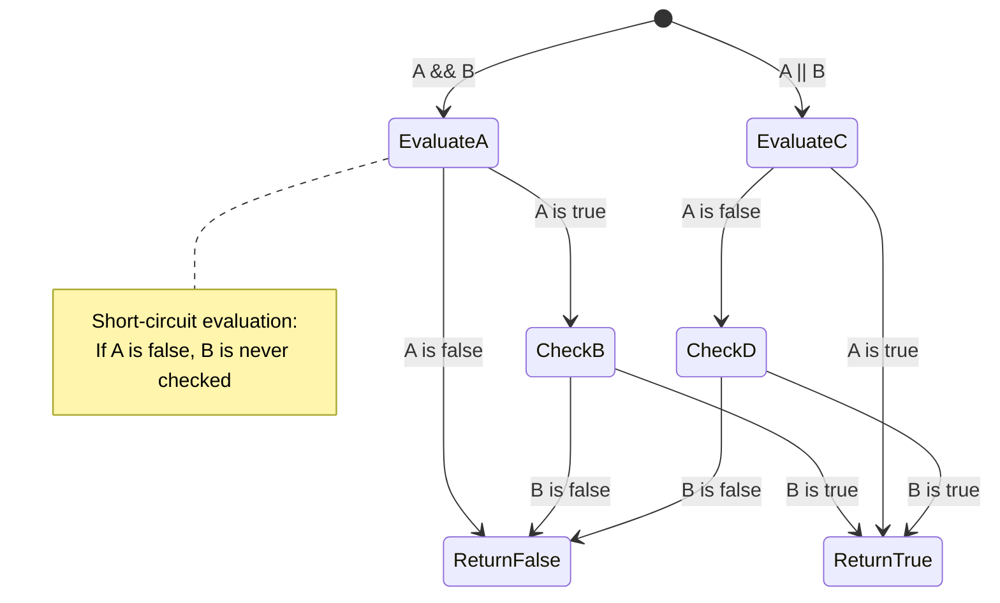

> **Suorituskykyvinkki**: JavaScript käyttää "lyhytpiirtoarviointia" - ilmaisussa `A && B`, jos A on epätosi, B:tä ei edes arvioida. Hyödynnä tätä!

### Kielto-operaattori

Joskus on helpompi ajatella, milloin jokin ei ole totta. Esimerkiksi sen sijaan, että kysyisit "Onko käyttäjä kirjautunut sisään?", saatat haluta kysyä "Eikö käyttäjä ole kirjautunut sisään?" Huutomerkki (`!`) kääntää logiikan puolestasi.

```javascript
if (!condition) {
  // runs if condition is false
} else {
  // runs if condition is true
}
```

`!`-operaattori on kuin sanoisi "päinvastoin kuin..." – jos jokin on `true`, `!` tekee siitä `false`, ja päinvastoin.

### Ternäärilauseet

Yksinkertaisiin ehdollisiin sijoituksiin JavaScript tarjoaa **ternäärisen operaattorin**. Tämä tiivis syntaksi mahdollistaa ehdollisen ilmaisun kirjoittamisen yhdelle riville, mikä on hyödyllistä, kun sinun täytyy valita kahdesta arvosta ehdon perusteella.

```javascript
let variable = condition ? returnThisIfTrue : returnThisIfFalse;
```

Se luetaan kuin kysymys: "Onko tämä ehto tosi? Jos kyllä, käytä tätä arvoa. Jos ei, käytä tuota arvoa."

Alla on konkreettisempi esimerkki:

```javascript
let firstNumber = 20;
let secondNumber = 10;
let biggestNumber = firstNumber > secondNumber ? firstNumber : secondNumber;
```

✅ Käytä hetki tämän koodin lukemiseen muutaman kerran. Ymmärrätkö, miten nämä operaattorit toimivat?

Tämä rivi sanoo: "Onko `firstNumber` suurempi kuin `secondNumber`? Jos kyllä, laita `firstNumber` muuttujaan `biggestNumber`. Jos ei, laita `secondNumber` muuttujaan `biggestNumber`."

Ternäärinen operaattori on vain lyhyempi tapa kirjoittaa perinteinen `if..else`-lause:

```javascript
let biggestNumber;
if (firstNumber > secondNumber) {
  biggestNumber = firstNumber;
} else {
  biggestNumber = secondNumber;
}
```

Molemmat lähestymistavat tuottavat samat tulokset. Ternäärinen operaattori tarjoaa tiiviyttä, kun taas perinteinen if-else-rakenne voi olla luettavampi monimutkaisille ehdoille.

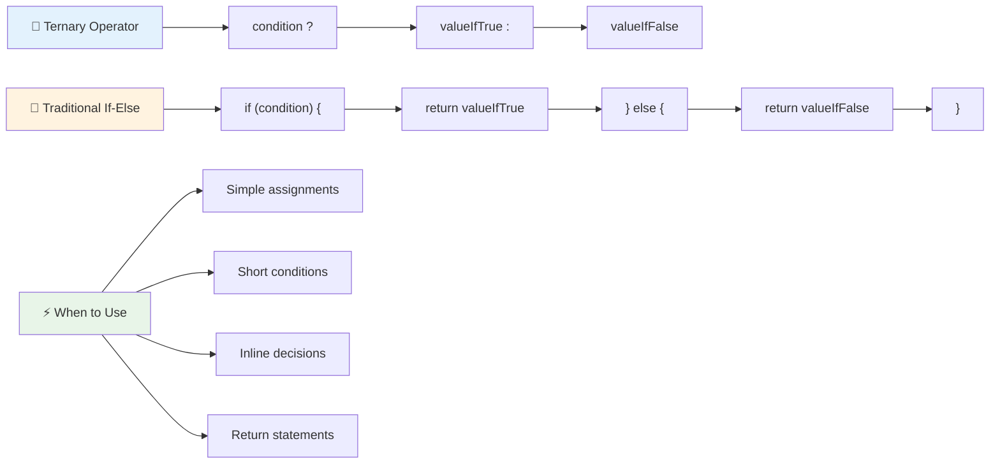

---


## 🚀 Haaste

Luo ohjelma, joka kirjoitetaan ensin loogisilla operaattoreilla ja sitten uudelleen ternäärisellä ilmaisulla. Mikä syntaksi on mielestäsi parempi?

---

## GitHub Copilot Agent -haaste 🚀

Käytä Agent-tilaa suorittaaksesi seuraavan haasteen:

**Kuvaus:** Luo kattava arvosanalaskuri, joka havainnollistaa tämän oppitunnin useita päätöksentekokonsepteja, mukaan lukien if-else-lauseet, switch-lauseet, loogiset operaattorit ja ternääriset ilmaisut.

**Tehtävä:** Kirjoita JavaScript-ohjelma, joka ottaa opiskelijan numeerisen pistemäärän (0-100) ja määrittää heidän kirjainarvosanansa seuraavien kriteerien mukaan:
- A: 90-100
- B: 80-89  
- C: 70-79
- D: 60-69
- F: Alle 60

Vaatimukset:
1. Käytä if-else-lauseita määrittääksesi kirjainarvosanan
2. Käytä loogisia operaattoreita tarkistaaksesi, läpäiseekö opiskelija (arvosana >= 60) JA saako kunniamaininnan (arvosana >= 90).
3. Käytä switch-lausetta antaaksesi tarkkaa palautetta kullekin arvosanakirjaimelle.
4. Käytä ternääristä operaattoria määrittääksesi, onko opiskelija oikeutettu seuraavaan kurssiin (arvosana >= 70).
5. Sisällytä syötteen validointi varmistaaksesi, että pisteet ovat välillä 0 ja 100.

Testaa ohjelmaasi erilaisilla pisteillä, mukaan lukien rajatapaukset, kuten 59, 60, 89, 90 ja virheelliset syötteet.

Lue lisää [agent mode](https://code.visualstudio.com/blogs/2025/02/24/introducing-copilot-agent-mode) -tilasta täältä.


## Luentojälkeinen kysely

[Luentojälkeinen kysely](https://ff-quizzes.netlify.app/web/quiz/12)

## Kertaus & Itseopiskelu

Lue lisää käyttäjän käytettävissä olevista operaattoreista [MDN:ssä](https://developer.mozilla.org/docs/Web/JavaScript/Reference/Operators).

Tutustu Josh Comeaun upeaan [operaattorihakemistoon](https://joshwcomeau.com/operator-lookup/)!

## Tehtävä

[Operaattorit](assignment.md)

---

## 🧠 **Päätöksentekotyökalusi yhteenveto**

```mermaid
graph TD
    A["🎯 JavaScript Decisions"] --> B["🔍 Boolean Logic"]
    A --> C["📊 Conditional Statements"]
    A --> D["🔗 Logical Operators"]
    A --> E["⚡ Advanced Patterns"]
    
    B --> B1["true/false values"]
    B --> B2["Comparison operators"]
    B --> B3["Truthiness concepts"]
    
    C --> C1["if statements"]
    C --> C2["if-else chains"]
    C --> C3["switch statements"]
    
    D --> D1["&& (AND)"]
    D --> D2["|| (OR)"]
    D --> D3["! (NOT)"]
    
    E --> E1["Ternary operator"]
    E --> E2["Short-circuit evaluation"]
    E --> E3["Complex conditions"]
    
    F["💡 Key Principles"] --> F1["Clear readable conditions"]
    F --> F2["Consistent comparison style"]
    F --> F3["Proper operator precedence"]
    F --> F4["Efficient evaluation order"]
    
    style A fill:#e3f2fd
    style B fill:#e8f5e8
    style C fill:#fff3e0
    style D fill:#f3e5f5
    style E fill:#e0f2f1
    style F fill:#fce4ec
```

---

## 🚀 JavaScript-päätöksentekotaitojen kehitysaikataulu

### ⚡ **Mitä voit tehdä seuraavan 5 minuutin aikana**
- [ ] Harjoittele vertailuoperaattoreita selaimesi konsolissa
- [ ] Kirjoita yksinkertainen if-else-lause, joka tarkistaa ikäsi
- [ ] Kokeile haastetta: kirjoita if-else uudelleen ternäärisellä operaattorilla
- [ ] Testaa, mitä tapahtuu eri "truthy"- ja "falsy"-arvoilla

### 🎯 **Mitä voit saavuttaa tämän tunnin aikana**
- [ ] Suorita luennon jälkeinen kysely ja kertaa epäselvät käsitteet
- [ ] Rakenna kattava arvosanalaskuri GitHub Copilot -haasteen avulla
- [ ] Luo yksinkertainen päätöspuu todellista tilannetta varten (esim. mitä pukea päälle)
- [ ] Harjoittele useiden ehtojen yhdistämistä loogisilla operaattoreilla
- [ ] Kokeile switch-lausetta eri käyttötarkoituksiin

### 📅 **Viikon mittainen logiikan hallinta**
- [ ] Suorita operaattoritehtävä luovilla esimerkeillä
- [ ] Rakenna mini-kyselysovellus käyttäen erilaisia ehdollisia rakenteita
- [ ] Luo lomakevalidaattori, joka tarkistaa useita syöte-ehtoja
- [ ] Harjoittele Josh Comeaun [operaattorihakemiston](https://joshwcomeau.com/operator-lookup/) tehtäviä
- [ ] Refaktoroi olemassa olevaa koodia käyttämään sopivampia ehdollisia rakenteita
- [ ] Tutki lyhytpiirtoarviointia ja sen suorituskykyvaikutuksia

### 🌟 **Kuukauden mittainen muutos**
- [ ] Hallitse monimutkaiset sisäkkäiset ehdot ja säilytä koodin luettavuus
- [ ] Rakenna sovellus, jossa on kehittynyt päätöksentekologiikka
- [ ] Osallistu avoimeen lähdekoodiin parantamalla olemassa olevien projektien ehdollista logiikkaa
- [ ] Opeta jollekin toiselle erilaisista ehdollisista rakenteista ja niiden käyttötarkoituksista
- [ ] Tutki funktionaalisen ohjelmoinnin lähestymistapoja ehdolliseen logiikkaan
- [ ] Luo henkilökohtainen viiteopas ehdollisten rakenteiden parhaista käytännöistä

### 🏆 **Lopullinen päätöksentekotaitojen mestaruuden tarkistus**

**Juhlista loogisen ajattelun hallintaasi:**
- Mikä on monimutkaisin päätöksentekologiikka, jonka olet onnistuneesti toteuttanut?
- Mikä ehdollinen rakenne tuntuu sinulle luonnollisimmalta ja miksi?
- Miten loogisten operaattoreiden oppiminen on muuttanut ongelmanratkaisulähestymistapaasi?
- Mikä todellinen sovellus hyötyisi kehittyneestä päätöksentekologiikasta?

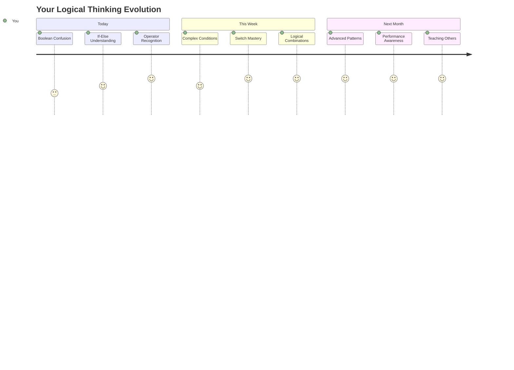

> 🧠 **Olet hallinnut digitaalisen päätöksenteon taidon!** Jokainen interaktiivinen sovellus perustuu ehdolliseen logiikkaan vastatakseen älykkäästi käyttäjän toimintaan ja muuttuviin olosuhteisiin. Nyt ymmärrät, kuinka saada ohjelmasi ajattelemaan, arvioimaan ja valitsemaan sopivia vastauksia. Tämä looginen perusta tukee jokaista dynaamista sovellusta, jonka rakennat! 🎉

---

**Vastuuvapauslauseke**:  
Tämä asiakirja on käännetty käyttämällä tekoälypohjaista käännöspalvelua [Co-op Translator](https://github.com/Azure/co-op-translator). Vaikka pyrimme tarkkuuteen, huomioithan, että automaattiset käännökset voivat sisältää virheitä tai epätarkkuuksia. Alkuperäinen asiakirja sen alkuperäisellä kielellä tulisi pitää ensisijaisena lähteenä. Kriittisen tiedon osalta suositellaan ammattimaista ihmiskäännöstä. Emme ole vastuussa väärinkäsityksistä tai virhetulkinnoista, jotka johtuvat tämän käännöksen käytöstä.