<!--
CO_OP_TRANSLATOR_METADATA:
{
  "original_hash": "1710a50a519a6e4a1b40a5638783018d",
  "translation_date": "2025-11-04T01:11:19+00:00",
  "source_file": "2-js-basics/4-arrays-loops/README.md",
  "language_code": "fi"
}
-->
# JavaScriptin perusteet: Taulukot ja silmukat

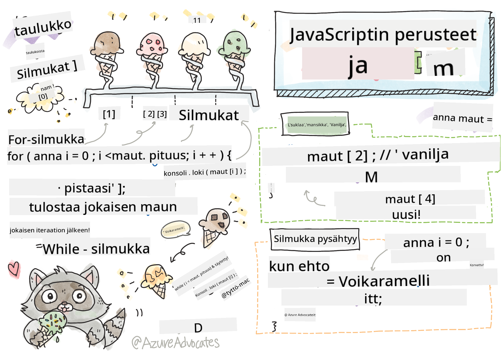
> Sketchnote: [Tomomi Imura](https://twitter.com/girlie_mac)

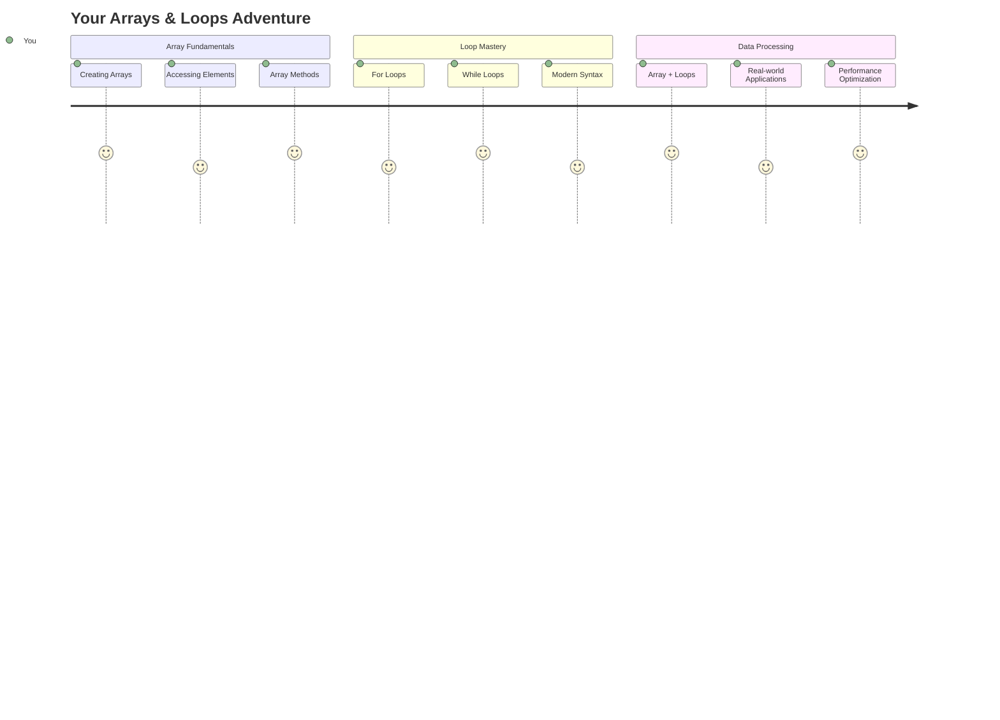

## Ennakkokysely
[Ennakkokysely](https://ff-quizzes.netlify.app/web/quiz/13)

Oletko koskaan miettinyt, miten verkkosivustot pitävät kirjaa ostoskorin tuotteista tai näyttävät ystävälistasi? Tässä tulevat taulukot ja silmukat apuun. Taulukot ovat kuin digitaalisia säiliöitä, jotka sisältävät useita tietoja, kun taas silmukat auttavat käsittelemään näitä tietoja tehokkaasti ilman toistuvaa koodia.

Yhdessä nämä kaksi käsitettä muodostavat perustan tietojen käsittelyyn ohjelmissasi. Opit siirtymään vaihe vaiheelta kirjoittamisesta älykkääseen ja tehokkaaseen koodiin, joka voi käsitellä satoja tai jopa tuhansia kohteita nopeasti.

Tämän oppitunnin lopussa ymmärrät, kuinka monimutkaisia tietotehtäviä voidaan suorittaa vain muutamalla koodirivillä. Tutkitaan näitä olennaisia ohjelmointikäsitteitä.

[](https://youtube.com/watch?v=1U4qTyq02Xw "Taulukot")

[](https://www.youtube.com/watch?v=Eeh7pxtTZ3k "Silmukat")

> 🎥 Klikkaa yllä olevia kuvia nähdäksesi videoita taulukoista ja silmukoista.

> Voit käydä tämän oppitunnin [Microsoft Learnissa](https://docs.microsoft.com/learn/modules/web-development-101-arrays/?WT.mc_id=academic-77807-sagibbon)!

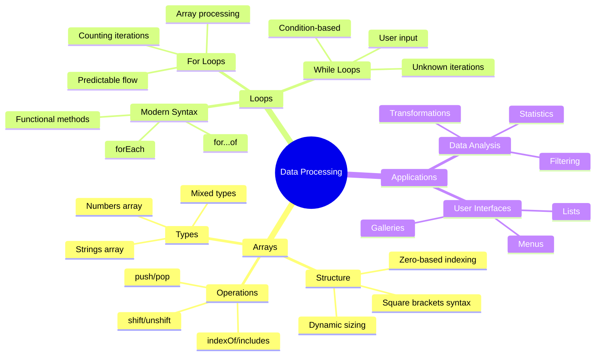

## Taulukot

Ajattele taulukoita digitaalisena arkistokaappina - sen sijaan, että säilyttäisit yhden asiakirjan per laatikko, voit järjestää useita liittyviä kohteita yhteen, rakenteelliseen säiliöön. Ohjelmoinnissa taulukot antavat mahdollisuuden tallentaa useita tietoja yhteen järjestettyyn pakettiin.

Olipa kyseessä valokuvagallerian rakentaminen, tehtävälistan hallinta tai pelin korkeimpien pisteiden seuraaminen, taulukot tarjoavat perustan tietojen järjestämiseen. Katsotaanpa, miten ne toimivat.

✅ Taulukot ovat kaikkialla! Voitko keksiä tosielämän esimerkin taulukosta, kuten aurinkopaneelijärjestelmästä?

### Taulukoiden luominen

Taulukon luominen on todella helppoa - käytä vain hakasulkeita!

```javascript
// Empty array - like an empty shopping cart waiting for items
const myArray = [];
```

**Mitä tässä tapahtuu?**
Olet juuri luonut tyhjän säiliön käyttämällä hakasulkeita `[]`. Ajattele sitä kuin tyhjää kirjahyllyä - se on valmis säilyttämään mitä tahansa kirjoja, joita haluat sinne järjestää.

Voit myös täyttää taulukon alkuarvoilla heti alussa:

```javascript
// Your ice cream shop's flavor menu
const iceCreamFlavors = ["Chocolate", "Strawberry", "Vanilla", "Pistachio", "Rocky Road"];

// A user's profile info (mixing different types of data)
const userData = ["John", 25, true, "developer"];

// Test scores for your favorite class
const scores = [95, 87, 92, 78, 85];
```

**Huomionarvoisia asioita:**
- Voit tallentaa tekstiä, numeroita tai jopa tosi/epätosi-arvoja samaan taulukkoon
- Erota jokainen kohde pilkulla - helppoa!
- Taulukot ovat täydellisiä liittyvien tietojen säilyttämiseen yhdessä

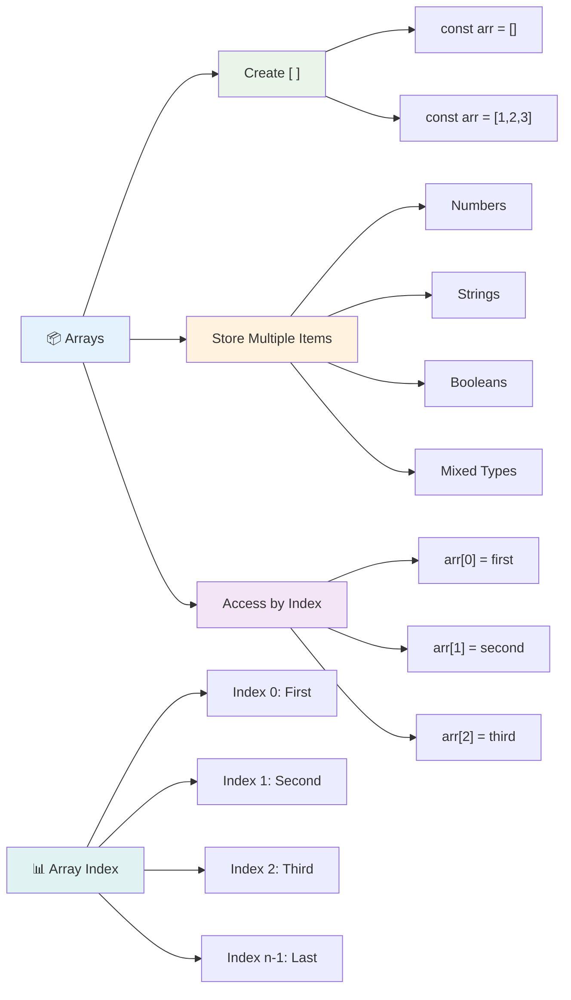

### Taulukon indeksointi

Tässä on jotain, mikä saattaa aluksi tuntua oudolta: taulukot numeroivat kohteensa alkaen nollasta, ei yhdestä. Tämä nollapohjainen indeksointi juontaa juurensa tietokoneen muistin toiminnasta - se on ollut ohjelmointikonventio jo varhaisista kielistä, kuten C. Jokainen paikka taulukossa saa oman osoitenumeronsa, jota kutsutaan **indeksiksi**.

| Indeksi | Arvo | Kuvaus |
|---------|------|--------|
| 0 | "Suklaa" | Ensimmäinen elementti |
| 1 | "Mansikka" | Toinen elementti |
| 2 | "Vanilja" | Kolmas elementti |
| 3 | "Pistaasi" | Neljäs elementti |
| 4 | "Rocky Road" | Viides elementti |

✅ Yllättääkö sinua, että taulukot alkavat nollaindeksistä? Joissakin ohjelmointikielissä indeksit alkavat yhdestä. Tästä on mielenkiintoinen historia, jonka voit [lukea Wikipediasta](https://en.wikipedia.org/wiki/Zero-based_numbering).

**Taulukon elementtien käsittely:**

```javascript
const iceCreamFlavors = ["Chocolate", "Strawberry", "Vanilla", "Pistachio", "Rocky Road"];

// Access individual elements using bracket notation
console.log(iceCreamFlavors[0]); // "Chocolate" - first element
console.log(iceCreamFlavors[2]); // "Vanilla" - third element
console.log(iceCreamFlavors[4]); // "Rocky Road" - last element
```

**Mitä tässä tapahtuu:**
- **Käyttää** hakasulkumerkintää indeksinumeron kanssa elementtien käsittelyyn
- **Palauttaa** arvon, joka on tallennettu kyseiseen taulukon kohtaan
- **Aloittaa** laskemisen nollasta, jolloin ensimmäisen elementin indeksi on 0

**Taulukon elementtien muokkaaminen:**

```javascript
// Change an existing value
iceCreamFlavors[4] = "Butter Pecan";
console.log(iceCreamFlavors[4]); // "Butter Pecan"

// Add a new element at the end
iceCreamFlavors[5] = "Cookie Dough";
console.log(iceCreamFlavors[5]); // "Cookie Dough"
```

**Tässä olemme:**
- **Muokanneet** elementtiä indeksissä 4 "Rocky Roadista" "Butter Pecaniin"
- **Lisänneet** uuden elementin "Cookie Dough" indeksiin 5
- **Laajentaneet** taulukon pituutta automaattisesti, kun lisätään nykyisten rajojen ulkopuolelle

### Taulukon pituus ja yleiset metodit

Taulukoilla on sisäänrakennettuja ominaisuuksia ja metodeja, jotka helpottavat tietojen käsittelyä.

**Taulukon pituuden selvittäminen:**

```javascript
const iceCreamFlavors = ["Chocolate", "Strawberry", "Vanilla", "Pistachio", "Rocky Road"];
console.log(iceCreamFlavors.length); // 5

// Length updates automatically as array changes
iceCreamFlavors.push("Mint Chip");
console.log(iceCreamFlavors.length); // 6
```

**Tärkeät asiat muistaa:**
- **Palauttaa** taulukon elementtien kokonaismäärän
- **Päivittyy** automaattisesti, kun elementtejä lisätään tai poistetaan
- **Tarjoaa** dynaamisen laskennan, joka on hyödyllinen silmukoille ja validoinnille

**Keskeiset taulukkometodit:**

```javascript
const fruits = ["apple", "banana", "orange"];

// Add elements
fruits.push("grape");           // Adds to end: ["apple", "banana", "orange", "grape"]
fruits.unshift("strawberry");   // Adds to beginning: ["strawberry", "apple", "banana", "orange", "grape"]

// Remove elements
const lastFruit = fruits.pop();        // Removes and returns "grape"
const firstFruit = fruits.shift();     // Removes and returns "strawberry"

// Find elements
const index = fruits.indexOf("banana"); // Returns 1 (position of "banana")
const hasApple = fruits.includes("apple"); // Returns true
```

**Näiden metodien ymmärtäminen:**
- **Lisää** elementtejä `push()` (loppuun) ja `unshift()` (alkuun)
- **Poistaa** elementtejä `pop()` (loppu) ja `shift()` (alku)
- **Etsii** elementtejä `indexOf()` ja tarkistaa olemassaolon `includes()`
- **Palauttaa** hyödyllisiä arvoja, kuten poistettuja elementtejä tai sijainti-indeksejä

✅ Kokeile itse! Käytä selaimesi konsolia luodaksesi ja muokataksesi omaa taulukkoa.

### 🧠 **Taulukon perusteiden tarkistus: Tietojen järjestäminen**

**Testaa taulukko-osaamistasi:**
- Miksi luulet, että taulukot alkavat laskemisen nollasta eikä yhdestä?
- Mitä tapahtuu, jos yrität käyttää indeksiä, jota ei ole olemassa (kuten `arr[100]` 5-elementtisessä taulukossa)?
- Voitko keksiä kolme tosielämän tilannetta, joissa taulukot olisivat hyödyllisiä?

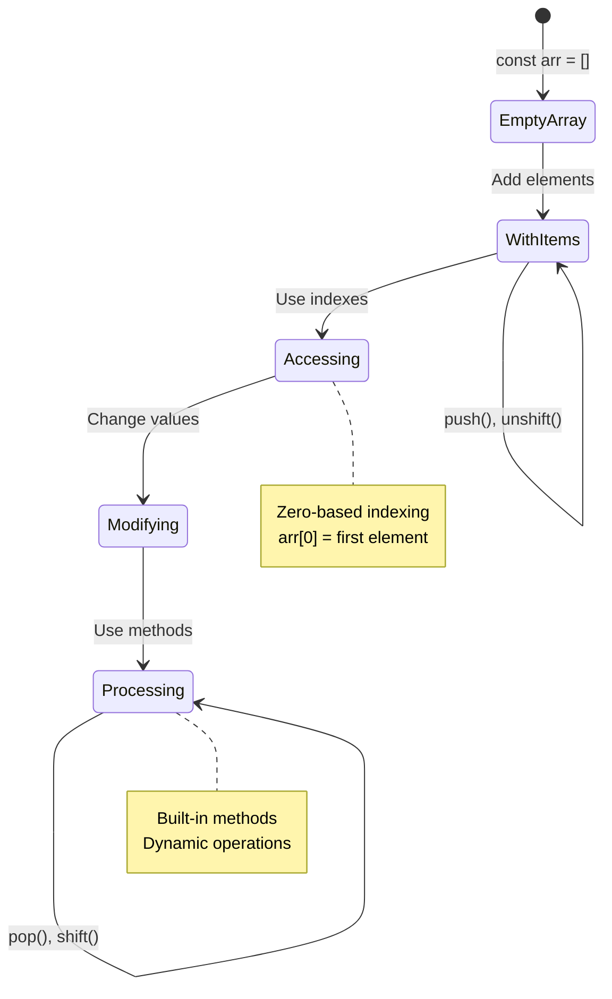

> **Tosielämän näkökulma**: Taulukot ovat kaikkialla ohjelmoinnissa! Sosiaalisen median syötteet, ostoskorit, valokuvagalleriat, soittolistat - ne kaikki ovat taulukoita kulissien takana!

## Silmukat

Ajattele Charles Dickensin romaaneista kuuluisaa rangaistusta, jossa oppilaat joutuivat kirjoittamaan lauseita toistuvasti liitutaululle. Kuvittele, että voisit yksinkertaisesti käskeä jotakuta "kirjoita tämä lause 100 kertaa" ja se tehtäisiin automaattisesti. Juuri tätä silmukat tekevät koodillesi.

Silmukat ovat kuin väsymätön apulainen, joka voi toistaa tehtäviä virheettömästi. Olipa kyseessä ostoskorin jokaisen kohteen tarkistaminen tai albumin kaikkien valokuvien näyttäminen, silmukat hoitavat toiston tehokkaasti.

JavaScript tarjoaa useita silmukkatyyppejä, joista voit valita. Tarkastellaan kutakin ja ymmärretään, milloin niitä kannattaa käyttää.

```mermaid
flowchart TD
    A["🔄 Loop Types"] --> B["For Loop"]
    A --> C["While Loop"]
    A --> D["For...of Loop"]
    A --> E["forEach Method"]
    
    B --> B1["Known iterations"]
    B --> B2["Counter-based"]
    B --> B3["for(init; condition; increment)"]
    
    C --> C1["Unknown iterations"]
    C --> C2["Condition-based"]
    C --> C3["while(condition)"]
    
    D --> D1["Modern ES6+"]
    D --> D2["Array iteration"]
    D --> D3["for(item of array)"]
    
    E --> E1["Functional style"]
    E --> E2["Array method"]
    E --> E3["array.forEach(callback)"]
    
    F["⏰ When to Use"] --> F1["For: Counting, indexes"]
    F --> F2["While: User input, searching"]
    F --> F3["For...of: Simple iteration"]
    F --> F4["forEach: Functional programming"]
    
    style A fill:#e3f2fd
    style B fill:#e8f5e8
    style C fill:#fff3e0
    style D fill:#f3e5f5
    style E fill:#e0f2f1
    style F fill:#fce4ec
```

### For-silmukka

`for`-silmukka on kuin ajastimen asettaminen - tiedät tarkalleen, kuinka monta kertaa haluat jonkin tapahtuvan. Se on erittäin järjestelmällinen ja ennustettavissa, mikä tekee siitä täydellisen, kun työskentelet taulukoiden kanssa tai tarvitset laskentaa.

**For-silmukan rakenne:**

| Komponentti | Tarkoitus | Esimerkki |
|-------------|-----------|-----------|
| **Alustus** | Asettaa aloituspisteen | `let i = 0` |
| **Ehto** | Milloin jatkaa | `i < 10` |
| **Kasvatus** | Kuinka päivittää | `i++` |

```javascript
// Counting from 0 to 9
for (let i = 0; i < 10; i++) {
  console.log(`Count: ${i}`);
}

// More practical example: processing scores
const testScores = [85, 92, 78, 96, 88];
for (let i = 0; i < testScores.length; i++) {
  console.log(`Student ${i + 1}: ${testScores[i]}%`);
}
```

**Askel askeleelta, mitä tapahtuu:**
- **Alustaa** laskurimuuttujan `i` arvoon 0 alussa
- **Tarkistaa** ehdon `i < 10` ennen jokaista iteraatiota
- **Suorittaa** koodilohkon, kun ehto on tosi
- **Kasvattaa** `i` arvoa yhdellä jokaisen iteraation jälkeen `i++`
- **Lopettaa**, kun ehto muuttuu epätodeksi (kun `i` saavuttaa 10)

✅ Suorita tämä koodi selaimen konsolissa. Mitä tapahtuu, kun teet pieniä muutoksia laskuriin, ehtoon tai iteraatioilmaisuun? Voitko saada sen toimimaan taaksepäin, luoden lähtölaskennan?

### 🗓️ **For-silmukan hallinnan tarkistus: Kontrolloitu toisto**

**Arvioi for-silmukkaosaamistasi:**
- Mitkä ovat for-silmukan kolme osaa ja mitä kukin tekee?
- Kuinka silmukoisit taulukon taaksepäin?
- Mitä tapahtuu, jos unohdat kasvatusosan (`i++`)?

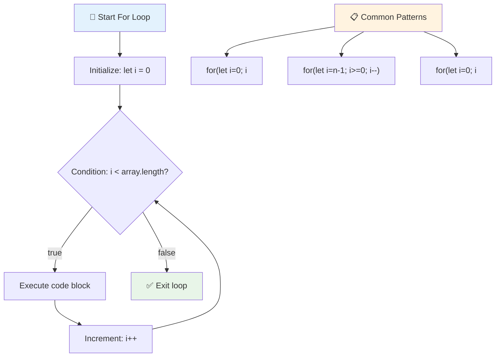

> **Silmukkaviisaus**: For-silmukat ovat täydellisiä, kun tiedät tarkalleen, kuinka monta kertaa sinun täytyy toistaa jotain. Ne ovat yleisin valinta taulukon käsittelyyn!

### While-silmukka

`while`-silmukka on kuin sanoisi "jatka tämän tekemistä, kunnes..." - et ehkä tiedä tarkalleen, kuinka monta kertaa se suoritetaan, mutta tiedät, milloin lopettaa. Se on täydellinen esimerkiksi käyttäjän syötteen pyytämiseen, kunnes saat haluamasi, tai tietojen etsimiseen, kunnes löydät etsimäsi.

**While-silmukan ominaisuudet:**
- **Jatkaa** suorittamista niin kauan kuin ehto on tosi
- **Vaatii** laskurimuuttujien manuaalista hallintaa
- **Tarkistaa** ehdon ennen jokaista iteraatiota
- **Riski** loputtomista silmukoista, jos ehto ei koskaan muutu epätodeksi

```javascript
// Basic counting example
let i = 0;
while (i < 10) {
  console.log(`While count: ${i}`);
  i++; // Don't forget to increment!
}

// More practical example: processing user input
let userInput = "";
let attempts = 0;
const maxAttempts = 3;

while (userInput !== "quit" && attempts < maxAttempts) {
  userInput = prompt(`Enter 'quit' to exit (attempt ${attempts + 1}):`);
  attempts++;
}

if (attempts >= maxAttempts) {
  console.log("Maximum attempts reached!");
}
```

**Näiden esimerkkien ymmärtäminen:**
- **Hallinnoi** laskurimuuttujaa `i` manuaalisesti silmukan sisällä
- **Kasvattaa** laskuria estääkseen loputtomat silmukat
- **Näyttää** käytännön esimerkin käyttäjän syötteestä ja yritysrajoituksesta
- **Sisältää** turvamekanismeja loputtoman suorittamisen estämiseksi

### ♾️ **While-silmukan viisauden tarkistus: Ehtopohjainen toisto**

**Testaa while-silmukkaosaamistasi:**
- Mikä on suurin vaara while-silmukoita käytettäessä?
- Milloin valitsisit while-silmukan for-silmukan sijaan?
- Kuinka voit estää loputtomat silmukat?

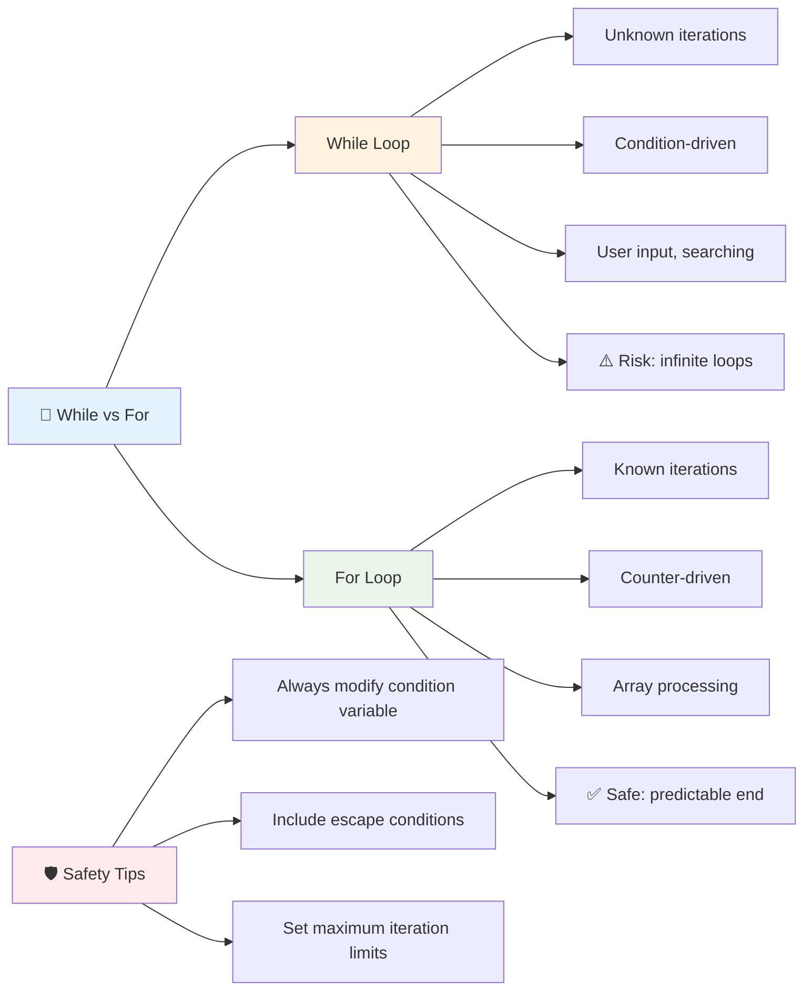

> **Turvallisuus ensin**: While-silmukat ovat tehokkaita, mutta vaativat huolellista ehtojen hallintaa. Varmista aina, että silmukkaehto muuttuu lopulta epätodeksi!

### Modernit silmukkavaihtoehdot

JavaScript tarjoaa moderneja silmukkasyntakseja, jotka voivat tehdä koodistasi luettavampaa ja vähemmän virhealtista.

**For...of-silmukka (ES6+):**

```javascript
const colors = ["red", "green", "blue", "yellow"];

// Modern approach - cleaner and safer
for (const color of colors) {
  console.log(`Color: ${color}`);
}

// Compare with traditional for loop
for (let i = 0; i < colors.length; i++) {
  console.log(`Color: ${colors[i]}`);
}
```

**For...of-silmukan tärkeimmät edut:**
- **Poistaa** indeksinhallinnan ja mahdolliset yhden virheet
- **Tarjoaa** suoran pääsyn taulukon elementteihin
- **Parantaa** koodin luettavuutta ja vähentää syntaksin monimutkaisuutta

**forEach-metodi:**

```javascript
const prices = [9.99, 15.50, 22.75, 8.25];

// Using forEach for functional programming style
prices.forEach((price, index) => {
  console.log(`Item ${index + 1}: $${price.toFixed(2)}`);
});

// forEach with arrow functions for simple operations
prices.forEach(price => console.log(`Price: $${price}`));
```

**Mitä sinun tulee tietää forEachista:**
- **Suorittaa** funktion jokaiselle taulukon elementille
- **Tarjoaa** sekä elementin arvon että indeksin parametreina
- **Ei voi** pysähtyä aikaisin (toisin kuin perinteiset silmukat)
- **Palauttaa** undefined (ei luo uutta taulukkoa)

✅ Miksi valitsisit for-silmukan vs. while-silmukan? 17 000 katsojaa pohti samaa kysymystä StackOverflow'ssa, ja jotkut mielipiteet [voivat olla mielenkiintoisia sinulle](https://stackoverflow.com/questions/39969145/while-loops-vs-for-loops-in-javascript).

### 🎨 **Modernin silmukkasyntaksin tarkistus: ES6+:n omaksuminen**

**Arvioi modernin JavaScriptin ymmärrystäsi:**
- Mitkä ovat `for...of`-silmukan edut perinteisiin for-silmukoihin verrattuna?
- Milloin saattaisit silti suosia perinteisiä for-silmukoita?
- Mikä ero on `forEach`- ja `map`-metodien välillä?

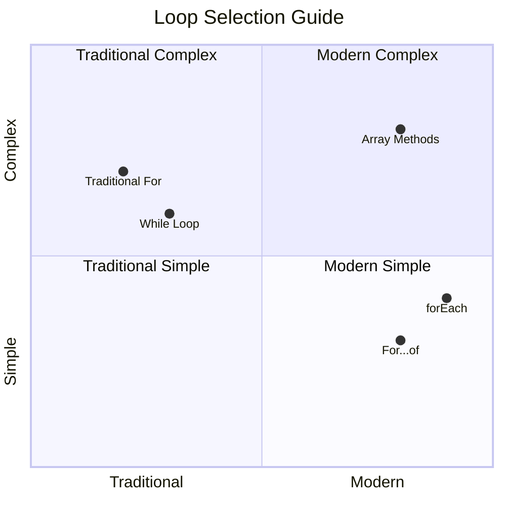

> **Moderni trendi**: ES6+:n syntaksit, kuten `for...of` ja `forEach`, ovat yhä suositumpia taulukon iteraatiossa, koska ne ovat siistimpiä ja vähemmän virheherkkiä!

## Silmukat ja taulukot

Taulukoiden yhdistäminen silmukoihin luo tehokkaita tietojen käsittelymahdollisuuksia. Tämä yhdistelmä on olennainen monille ohjelmointitehtäville, kuten listojen näyttämiselle tai tilastojen laskemiselle.

**Perinteinen taulukon käsittely:**

```javascript
const iceCreamFlavors = ["Chocolate", "Strawberry", "Vanilla", "Pistachio", "Rocky Road"];

// Classic for loop approach
for (let i = 0; i < iceCreamFlavors.length; i++) {
  console.log(`Flavor ${i + 1}: ${iceCreamFlavors[i]}`);
}

// Modern for...of approach
for (const flavor of iceCreamFlavors) {
  console.log(`Available flavor: ${flavor}`);
}
```

**Ymmärretään jokainen lähestymistapa:**
- **Käyttää** taulukon pituusominaisuutta silmukan rajojen määrittämiseen
- **Käsittelee** elementtejä indeksin avulla perinteisissä for-silmukoissa
- **Tarjoaa** suoran pääsyn elementteihin for...of-silmukoissa
- **Käsittelee** jokaisen taulukon elementin täsmälleen kerran

**Käytännön tietojen käsittelyesimerkki:**

```javascript
const studentGrades = [85, 92, 78, 96, 88, 73, 89];
let total = 0;
let highestGrade = studentGrades[0];
let lowestGrade = studentGrades[0];

// Process all grades with a single loop
for (let i = 0; i < studentGrades.length; i++) {
  const grade = studentGrades[i];
  total += grade;
  
  if (grade > highestGrade) {
    highestGrade = grade;
  }
  
  if (grade < lowestGrade) {
    lowestGrade = grade;
  }
}

const average = total / studentGrades.length;
console.log(`Average: ${average.toFixed(1)}`);
console.log(`Highest: ${highestGrade}`);
console.log(`Lowest: ${lowestGrade}`);
```

**Näin tämä koodi toimii:**
- **Alustaa** seurantalaskurit summalle ja ääripäille
- **Käsittelee** jokaisen arvosanan yhdellä tehokkaalla silmukalla
- **Kertyy** kokonaismäärä keskiarvon laskemista varten
- **Seuraa** korkeimpia ja matalimpia arvoja iteraation aikana
- **Laskee** lopulliset tilastot silmukan päätyttyä

✅ Kokeile silmukoida omaa taulukkoasi selaimesi konsolissa.

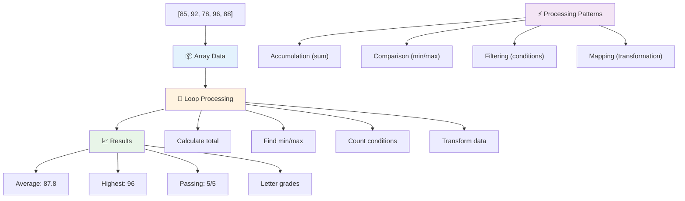

---

## GitHub Copilot Agent -haaste 🚀

Käytä Agent-tilaa suorittaaksesi seuraavan haasteen:

**Kuvaus:** Rakenna kattava tietojen käsittelyfunktio, joka yhdistää taulukot ja silmukat analysoidakseen datasetin ja tuottaakseen merkityksellisiä oivalluksia.

**Tehtävä:** Luo funktio nimeltä `analyzeGrades`, joka ottaa taulukon opiskelijoiden arvosanaobjekteja (joista jokaisella on nimi- ja pistemääräominaisuudet) ja palauttaa objektin, joka sisältää tilastoja, kuten korkein pistemäärä, matalin pistemäärä, keskiarvo, läpäisseiden opiskelijoiden määrä (pistemäärä >= 70) ja taulukon opiskelijoiden nimistä, jotka saivat keskiarvon yläpuolella. Käytä ratkaisussasi vähintään kahta erilaista silmukkatyyppiä.

Lisätietoja [Agent-tilasta](https://code.visualstudio.com/blogs/2025/02/24/introducing-copilot-agent-mode) täällä.

## 🚀 Haaste
JavaScript tarjoaa useita moderneja taulukkometodeja, jotka voivat korvata perinteiset silmukat tietyissä tehtävissä. Tutustu [forEach](https://developer.mozilla.org/docs/Web/JavaScript/Reference/Global_Objects/Array/forEach), [for-of](https://developer.mozilla.org/docs/Web/JavaScript/Reference/Statements/for...of), [map](https://developer.mozilla.org/docs/Web/JavaScript/Reference/Global_Objects/Array/map), [filter](https://developer.mozilla.org/docs/Web/JavaScript/Reference/Global_Objects/Array/filter) ja [reduce](https://developer.mozilla.org/docs/Web/JavaScript/Reference/Global_Objects/Array/reduce).

**Haasteesi:** Refaktoroi opiskelijoiden arvosanaesimerkki käyttämällä vähintään kolmea eri taulukkometodia. Huomaa, kuinka paljon siistimmäksi ja luettavammaksi koodi muuttuu modernilla JavaScript-syntaksilla.

## Luentojälkeinen kysely
[Luentojälkeinen kysely](https://ff-quizzes.netlify.app/web/quiz/14)

## Kertaus ja itseopiskelu

JavaScript-taulukoilla on monia hyödyllisiä metodeja, jotka ovat erittäin käteviä datan käsittelyssä. [Lue lisää näistä metodeista](https://developer.mozilla.org/docs/Web/JavaScript/Reference/Global_Objects/Array) ja kokeile joitakin niistä (kuten push, pop, slice ja splice) luomallasi taulukolla.

## Tehtävä

[Silmukoi taulukko](assignment.md)

---

## 📊 **Yhteenveto taulukoista ja silmukoista**

```mermaid
graph TD
    A["🎯 Arrays & Loops Mastery"] --> B["📦 Array Fundamentals"]
    A --> C["🔄 Loop Types"]
    A --> D["🔗 Data Processing"]
    A --> E["🎨 Modern Techniques"]
    
    B --> B1["Creation: [ ]"]
    B --> B2["Indexing: arr[0]"]
    B --> B3["Methods: push, pop"]
    B --> B4["Properties: length"]
    
    C --> C1["For: Known iterations"]
    C --> C2["While: Condition-based"]
    C --> C3["For...of: Direct access"]
    C --> C4["forEach: Functional"]
    
    D --> D1["Statistics calculation"]
    D --> D2["Data transformation"]
    D --> D3["Filtering & searching"]
    D --> D4["Real-time processing"]
    
    E --> E1["Arrow functions"]
    E --> E2["Method chaining"]
    E --> E3["Destructuring"]
    E --> E4["Template literals"]
    
    F["💡 Key Benefits"] --> F1["Efficient data handling"]
    F --> F2["Reduced code repetition"]
    F --> F3["Scalable solutions"]
    F --> F4["Cleaner syntax"]
    
    style A fill:#e3f2fd
    style B fill:#e8f5e8
    style C fill:#fff3e0
    style D fill:#f3e5f5
    style E fill:#e0f2f1
    style F fill:#fce4ec
```

---

## 🚀 Taulukkojen ja silmukoiden hallinnan aikajana

### ⚡ **Mitä voit tehdä seuraavan 5 minuutin aikana**
- [ ] Luo taulukko suosikkielokuvistasi ja käytä tiettyjä elementtejä
- [ ] Kirjoita for-silmukka, joka laskee luvut 1–10
- [ ] Kokeile modernien taulukkometodien haastetta oppitunnilta
- [ ] Harjoittele taulukkoindeksointia selaimen konsolissa

### 🎯 **Mitä voit saavuttaa tämän tunnin aikana**
- [ ] Suorita luentojälkeinen kysely ja kertaa haastavat käsitteet
- [ ] Rakenna kattava arvosanaanalysoija GitHub Copilot -haasteesta
- [ ] Luo yksinkertainen ostoskori, joka lisää ja poistaa tuotteita
- [ ] Harjoittele eri silmukkatyyppeihin siirtymistä
- [ ] Kokeile taulukkometodeja kuten `push`, `pop`, `slice` ja `splice`

### 📅 **Viikon mittainen datankäsittelymatka**
- [ ] Suorita "Silmukoi taulukko" -tehtävä luovilla lisäyksillä
- [ ] Rakenna tehtävälistasovellus käyttäen taulukoita ja silmukoita
- [ ] Luo yksinkertainen tilastolaskin numeeriselle datalle
- [ ] Harjoittele [MDN:n taulukkometodeilla](https://developer.mozilla.org/docs/Web/JavaScript/Reference/Global_Objects/Array)
- [ ] Rakenna valokuvagalleria tai musiikkisoittolistan käyttöliittymä
- [ ] Tutustu funktionaaliseen ohjelmointiin `map`, `filter` ja `reduce` avulla

### 🌟 **Kuukauden mittainen muutos**
- [ ] Hallitse edistyneet taulukko-operaatiot ja suorituskyvyn optimointi
- [ ] Rakenna täydellinen datavisualisointipaneeli
- [ ] Osallistu avoimen lähdekoodin projekteihin, jotka käsittelevät dataa
- [ ] Opeta jollekin toiselle taulukoista ja silmukoista käytännön esimerkkien avulla
- [ ] Luo henkilökohtainen kirjasto uudelleenkäytettäviä datankäsittelyfunktioita varten
- [ ] Tutustu algoritmeihin ja tietorakenteisiin, jotka perustuvat taulukoihin

### 🏆 **Lopullinen datankäsittelyn mestaruuden tarkistus**

**Juhlista taulukoiden ja silmukoiden hallintaa:**
- Mikä on hyödyllisin taulukko-operaatio, jonka olet oppinut käytännön sovelluksiin?
- Mikä silmukkatyyppi tuntuu sinulle luonnollisimmalta ja miksi?
- Kuinka taulukoiden ja silmukoiden ymmärtäminen on muuttanut lähestymistapaasi datan järjestämiseen?
- Minkä monimutkaisen datankäsittelytehtävän haluaisit seuraavaksi ratkaista?

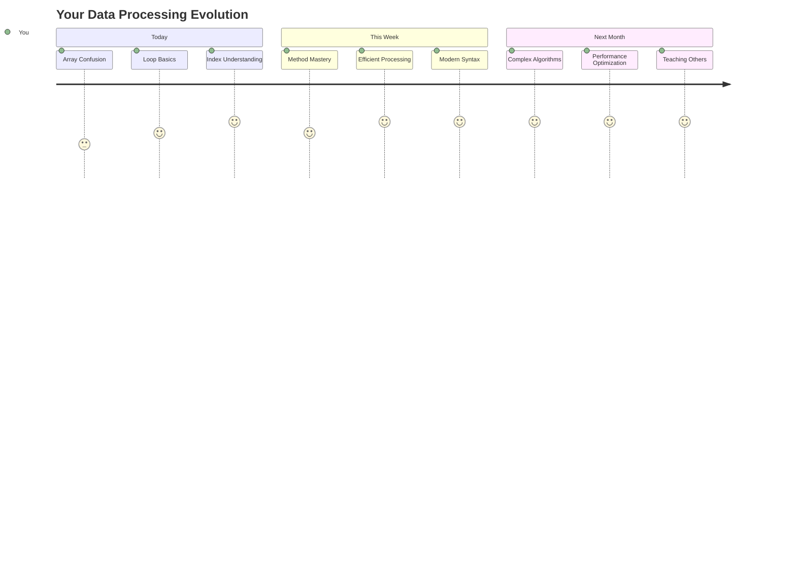

> 📦 **Olet avannut datan organisoinnin ja käsittelyn voiman!** Taulukot ja silmukat ovat lähes jokaisen sovelluksen perusta, jonka tulet koskaan rakentamaan. Yksinkertaisista listoista monimutkaiseen data-analyysiin, sinulla on nyt työkalut käsitellä tietoa tehokkaasti ja tyylikkäästi. Jokainen dynaaminen verkkosivusto, mobiilisovellus ja datavetoinen sovellus perustuu näihin peruskäsitteisiin. Tervetuloa skaalautuvan datankäsittelyn maailmaan! 🎉

---

**Vastuuvapauslauseke**:  
Tämä asiakirja on käännetty käyttämällä tekoälypohjaista käännöspalvelua [Co-op Translator](https://github.com/Azure/co-op-translator). Vaikka pyrimme tarkkuuteen, huomioithan, että automaattiset käännökset voivat sisältää virheitä tai epätarkkuuksia. Alkuperäistä asiakirjaa sen alkuperäisellä kielellä tulisi pitää ensisijaisena lähteenä. Kriittisen tiedon osalta suositellaan ammattimaista ihmiskäännöstä. Emme ole vastuussa väärinkäsityksistä tai virhetulkinnoista, jotka johtuvat tämän käännöksen käytöstä.